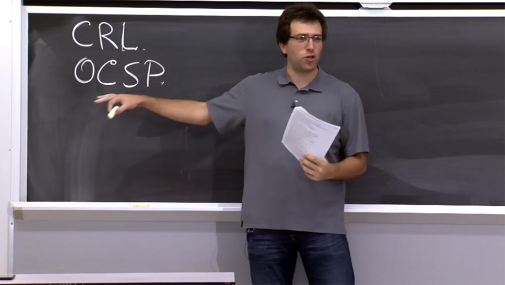
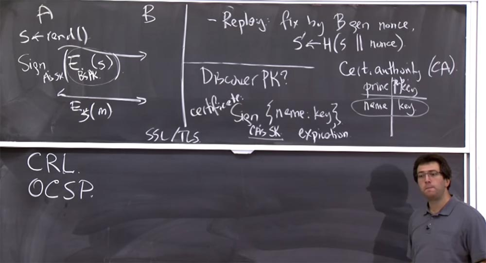
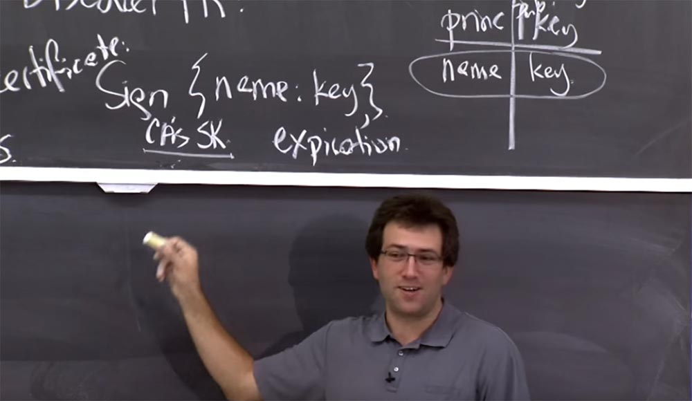
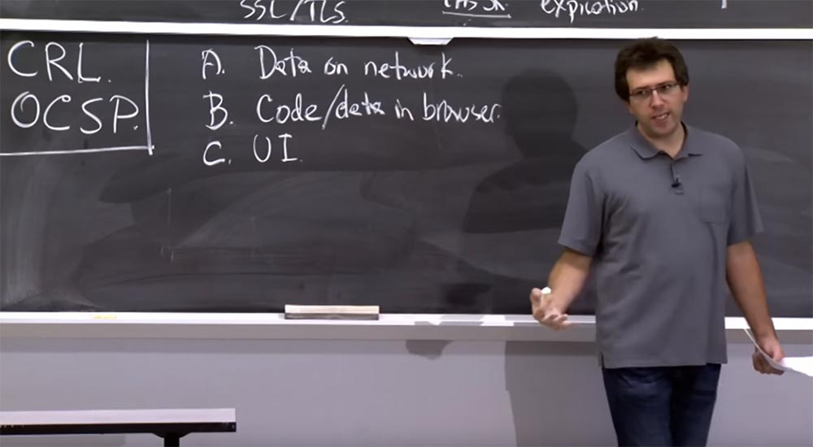
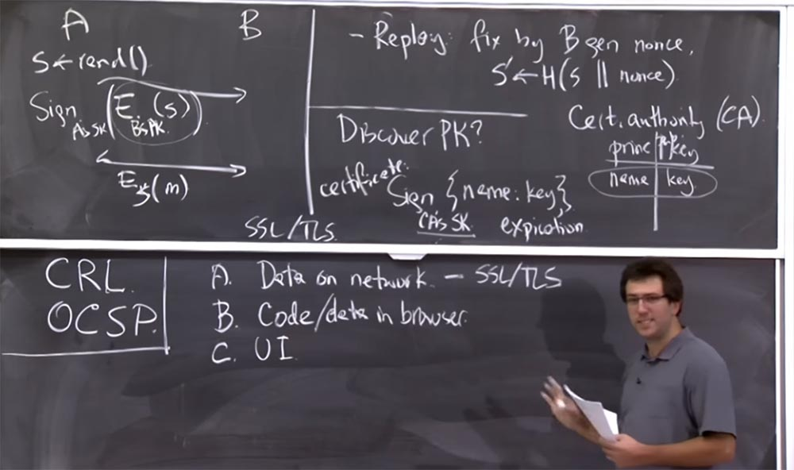
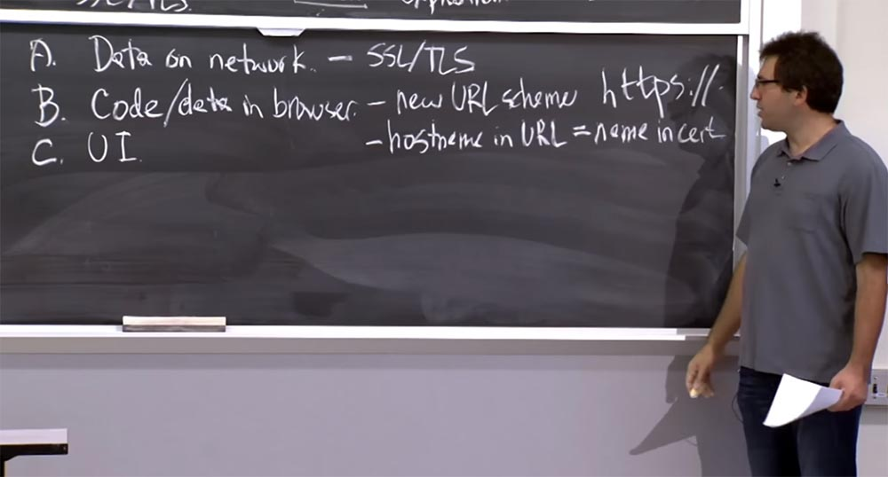
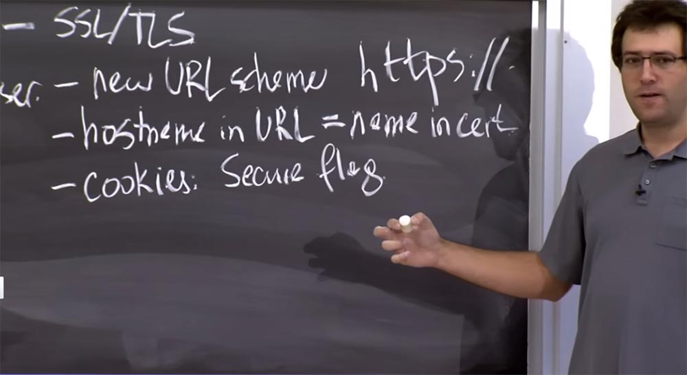
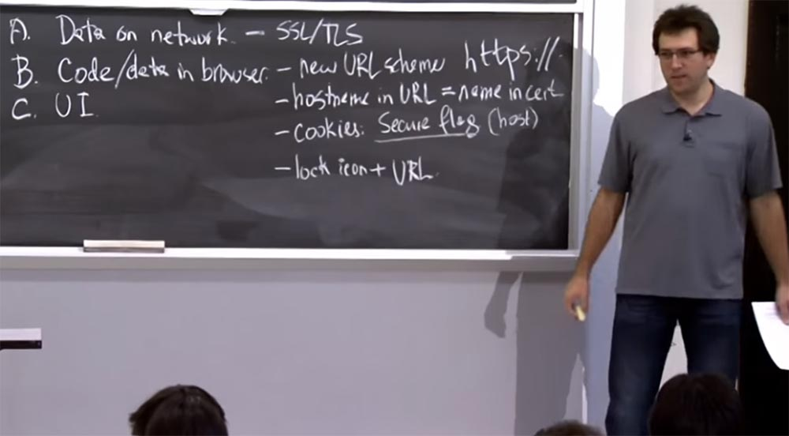
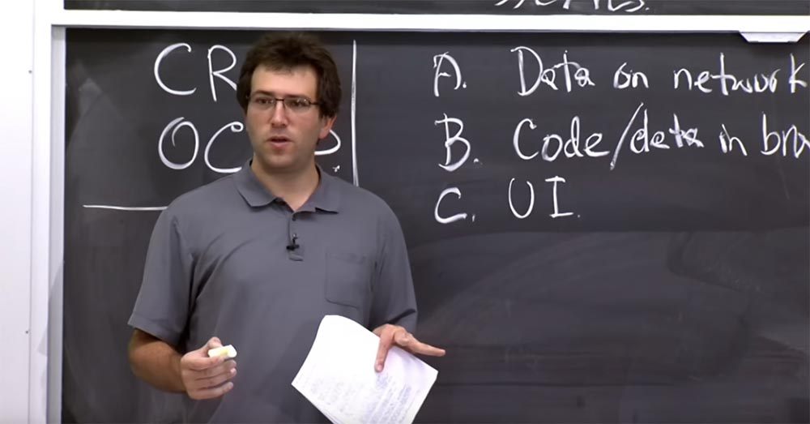

Курс MIT «Безопасность компьютерных систем». Лекция 14: «SSL и HTTPS», часть 2 / Блог компании ua-hosting.company

### Массачусетский Технологический институт. Курс лекций #6.858. «Безопасность компьютерных систем». Николай Зельдович, Джеймс Микенс. 2014 год

Computer Systems Security — это курс о разработке и внедрении защищенных компьютерных систем. Лекции охватывают модели угроз, атаки, которые ставят под угрозу безопасность, и методы обеспечения безопасности на основе последних научных работ. Темы включают в себя безопасность операционной системы (ОС), возможности, управление потоками информации, языковую безопасность, сетевые протоколы, аппаратную защиту и безопасность в веб-приложениях.

Лекция 1: «Вступление: модели угроз» [Часть 1](https://habr.com/company/ua-hosting/blog/354874/) / [Часть 2](https://habr.com/company/ua-hosting/blog/354894/) / [Часть 3](https://habr.com/company/ua-hosting/blog/354896/)  
Лекция 2: «Контроль хакерских атак» [Часть 1](https://habr.com/company/ua-hosting/blog/414505/) / [Часть 2](https://habr.com/company/ua-hosting/blog/416047/) / [Часть 3](https://habr.com/company/ua-hosting/blog/416727/)  
Лекция 3: «Переполнение буфера: эксплойты и защита» [Часть 1](https://habr.com/company/ua-hosting/blog/416839/) / [Часть 2](https://habr.com/company/ua-hosting/blog/418093/) / [Часть 3](https://habr.com/company/ua-hosting/blog/418099/)  
Лекция 4: «Разделение привилегий» [Часть 1](https://habr.com/company/ua-hosting/blog/418195/) / [Часть 2](https://habr.com/company/ua-hosting/blog/418197/) / [Часть 3](https://habr.com/company/ua-hosting/blog/418211/)  
Лекция 5: «Откуда берутся ошибки систем безопасности» [Часть 1](https://habr.com/company/ua-hosting/blog/418213/) / [Часть 2](https://habr.com/company/ua-hosting/blog/418215/)  
Лекция 6: «Возможности» [Часть 1](https://habr.com/company/ua-hosting/blog/418217/) / [Часть 2](https://habr.com/company/ua-hosting/blog/418219/) / [Часть 3](https://habr.com/company/ua-hosting/blog/418221/)  
Лекция 7: «Песочница Native Client» [Часть 1](https://habr.com/company/ua-hosting/blog/418223/) / [Часть 2](https://habr.com/company/ua-hosting/blog/418225/) / [Часть 3](https://habr.com/company/ua-hosting/blog/418227/)  
Лекция 8: «Модель сетевой безопасности» [Часть 1](https://habr.com/company/ua-hosting/blog/418229/) / [Часть 2](https://habr.com/company/ua-hosting/blog/423155/) / [Часть 3](https://habr.com/company/ua-hosting/blog/423423/)  
Лекция 9: «Безопасность Web-приложений» [Часть 1](https://habr.com/company/ua-hosting/blog/424289/) / [Часть 2](https://habr.com/company/ua-hosting/blog/424295/) / [Часть 3](https://habr.com/company/ua-hosting/blog/424297/)  
Лекция 10: «Символьное выполнение» [Часть 1](https://habr.com/company/ua-hosting/blog/425557/) / [Часть 2](https://habr.com/company/ua-hosting/blog/425561/) / [Часть 3](https://habr.com/company/ua-hosting/blog/425559/)  
Лекция 11: «Язык программирования Ur/Web» [Часть 1](https://habr.com/company/ua-hosting/blog/425997/) / [Часть 2](https://habr.com/company/ua-hosting/blog/425999/) / [Часть 3](https://habr.com/company/ua-hosting/blog/426001/)  
Лекция 12: «Сетевая безопасность» [Часть 1](https://habr.com/company/ua-hosting/blog/426325/) / [Часть 2](https://habr.com/company/ua-hosting/blog/427087/) / [Часть 3](https://habr.com/company/ua-hosting/blog/427093/)  
Лекция 13: «Сетевые протоколы» [Часть 1](https://habr.com/company/ua-hosting/blog/427763/) / [Часть 2](https://habr.com/company/ua-hosting/blog/427771/) / [Часть 3](https://habr.com/company/ua-hosting/blog/427779/)  
Лекция 14: «SSL и HTTPS» [Часть 1](https://habr.com/company/ua-hosting/blog/427783/) / [Часть 2](https://habr.com/company/ua-hosting/blog/427785/) / [Часть 3](https://habr.com/company/ua-hosting/blog/427787/)

Первая причина заключается в том, что протокол OCSP добавляет задержку к каждому запросу, который вы делаете. Каждый раз, когда вы хотите подключиться к серверу, вам сначала нужно подключиться к OCSP, подождать, пока он ответит, а затем сделать что-то еще. Так что задержки соединения отнюдь не способствуют популярности этого протокола.

Вторая причина состоит в том, что вы не хотите, чтобы OCSP влиял на вашу способность просматривать веб-страницы. Предположим, что сервер OSCP отключился, и тогда вы можете вообще лишиться интернета, потому что протокол посчитает, что раз он не может проверить чей-то сертификат, то возможно, все сайты в интернете являются плохими и вас нельзя туда пускать. Но такое никому не нужно, поэтому большинство клиентов рассматривают невмешательство сервера OCSP как положительное событие.

Это действительно плохо с точки зрения безопасности. Потому что если вы злоумышленник и хотите убедить кого-то, что у вас есть законный сертификат, но в действительности этот сертификат был отозван, все, что вам нужно сделать – это каким-то образом предотвратить общение клиента с сервером OCSP.

Клиент скажет так: «я пытаюсь запросить проверку сертификата нужного мне сайта, но этого OCSP, кажется, нет рядом, так что я просто зайду на этот сайт». Так что использование OCSP не слишком хороший план.

На практике люди стараются создать этому альтернативу, потому что клиенты просто склонны совершать тяжёлые ошибки. Так, например, веб-браузер Chrome поставляется клиенту, уже имея внутри себя список сертификатов, которые Google действительно хочет отозвать. Так если кто-то неправильно выдает сертификат для Gmail или другого важного сайта, например, Facebook или Amazon, то следующая версия Chrome уже будет содержать эти сведения во встроенном списке верификации. Таким образом, вам не придется обращаться к серверу CRL и общаться с OCSP. Если браузер проверил, что сертификат больше не действителен, клиент его отвергает.

**Студент:** допустим, я украл секретный ключ сертификата CА, ведь не все открытые ключи зашифрованы?

**Профессор:** да, это будет иметь плохие последствия. Я не думаю, что есть какое-либо решение этой проблемы. Конечно, были ситуации, когда центры сертификации оказывались скомпрометированы, например, в 2011 году было два скомпрометированных CА, которые каким-то обманным образом выдавали сертификаты для Gmail, Facebook и так далее. Не совсем понятно, как это произошло, возможно, кто-то действительно украл их секретный ключ. Но не зависимо от причин компрометации, эти CА были удалены из списка доверенных центров сертификации, который встроен в браузеры, так что в следующем выпуске Chrome их уже не было.

На самом деле это причинило неприятности законным обладателям сертификатов, выданных этими центрами, потому что их прежние сертификаты стали недействительными и им пришлось получить новые сертификаты. Так что на практике вся эта возня с сертификатами довольно запутанное дело.

Итак, мы рассмотрели общий принцип действия сертификатов. Они лучше Kerberos в том смысле, что вам больше не нужно, чтобы этот парень всё время был в интернете. К тому же они более масштабируемы, потому что вы можете иметь несколько KDC и при этом вам не нужно с ними общаться при каждой установке соединения.

Еще одна интересная особенность этого протокола в том, что в отличие от Kerberos, вы не обязаны проводить проверку подлинности обеих сторон соединения. Вы можете подключиться к веб-серверу, не имея для себя сертификата, и такое происходит постоянно. Если вы заходите на amazon.com, то собираетесь проверить, что Amazon — это правильный сайт, но Amazon понятия не имеет, кто вы, и не будет об этом знать, пока вы не совершите аутентификацию на сайте. Таким образом, на уровне протокола шифрования у вас нет сертификата, а у Amazon он имеется.

Это гораздо лучше, чем Kerberos, потому что там для подключения к сервисам Kerberos у вас заранее должна иметься запись в его базе данных. Единственное неудобство использования этого протокола состоит в том, что сервер обязательно должен иметь сертификат. Так что вы не можете подключиться к серверу и сказать: «эй, давай просто зашифруем наши вещи. Я понятия не имею, кто ты, а ты понятия не имеешь, кто я, но давай все равно это зашифруем». Это называется оппортунистическим шифрованием, и конечно, оно уязвимо для атак типа «человек посередине». Вы можете зашифровать с кем-то общие вещи, при этом его не зная, тогда злоумышленник, готовящийся вас атаковать, точно также может позже зашифровать свои пакеты и защититься этим от слежки.

Так что немного жаль, что эти протоколы, которые мы здесь рассматриваем — SSL, TLS — не предлагают такого рода оппортунистического шифрования. Но такова жизнь.

**Студент:** мне просто любопытно. Скажем так, раз в год, они создают пары ключей с новыми именами. Почему бы не попробовать использовать этот конкретный ключ целый год?

**Профессор:** я думаю, они так и поступают. Но похоже, что с этой схемой что-то идет не так. Здесь, как и в случае Kerberos, люди начинают с использования надёжного шифрования, но со временем оно становится все хуже и хуже. Компьютеры становятся быстрее, разрабатываются новые алгоритмы, которые успешно взламывают это шифрование. И если люди не заботятся о повышении надёжности, проблемы растут. Так, например, происходит в случае, когда подписывается огромное количество сертификатов.

Здесь есть два нюанса. Есть схема подписи открытого ключа. Далее, учитывая, что зашифрованный открытый ключ имеет некоторые ограничения, вы, подписывая сообщение, в действительности подписывается лишь хэш этого сообщения, потому что трудно подписать гигантское сообщение, но легко подписать компактный хэш.

Проблема возникла потому, что люди использовали MD5 в качестве хэш-функции, превращая подписание огромного сообщения в вещь размером 128 бит, которая подвергалась шифрованию. Возможно, 20 лет назад MD5 был хорош, но со временем люди обнаружили в нём слабые места, которые могут быть использованы злоумышленником.

Предположим, в какой-то момент кто-то действительно попросил сертификат с конкретным хешем MD5, а затем тщательно разобрал другое сообщение, которое было хэшировано тем же значением MD5. В результате у него оказалась хэшированная подпись СА, а затем появилось другое сообщение, или другой ключ, или другое имя, и теперь он может убедить кого-то, что оно подписано правильным сертификатом. И такое действительно происходит. Например, если вы проводите много времени, пытаясь взломать один ключ, вы в конце концов достигнете успеха. Если этот сертификат использует шифрование, его можно взломать методом brute-force.

Еще один пример неудачного использования шифрования – это алгоритм RSA. Мы не говорили об RSA, но RSA является одной из этих криптографических систем с открытым ключом, которая позволяет шифровать и подписывать сообщения. В наши дни можно потратить много денег, но, в конце концов, взломать 1000-битные ключи RSA. Вам, вероятно, придется проделать гигантский объём работы, но подобное легко выполняется в течение года. Можно попросить центр сертификации подписать какое-либо сообщение или даже взять чей-то существующий открытый ключ, попробовать подобрать к нему соответствующий секретный ключ, либо взломать вручную.  
Таким образом, вы должны идти в ногу со злоумышленником, вы должны использовать ключи RSA большего размера или же использовать другую схему шифрования.

Например, сейчас люди не используют хэши MD5 и сертификаты. Они используют алгоритм криптографического хеширования SHA-1. Какое-то время он обеспечивал необходимую безопасность, но на сегодня это слабая защита. Сейчас Google активно пытается заставить веб-разработчиков и разработчиков браузеров отказаться от использования SHA-1 и использовать другую хэш-функцию, потому что вполне ясно, что, возможно, через 5 или 10 лет успешно атаковать SHA-1 не составит никакого труда. Его слабость уже была доказана.

Так что, полагаю, волшебной пули как таковой не существует. Вы просто должны убедиться, что продолжаете развиваться параллельно с хакерами. Безусловно, проблема существует. Поэтому все вещи, о которых мы говорили, должны основываться на правильном шифровании, либо на том, что его очень трудно взломать. Поэтому вы должны выбрать подходящие параметры. По крайней мере, здесь имеется срок годности, так что лучше выберем параметры срока годности 1 год, а не 10 лет.

Вот этот ключ CAs создаёт более серьёзную проблему, так как не имеет обязательного срока годности. Поэтому вам стоит выбрать более агрессивные параметры безопасности, например, 4000 или 6000 битные ключи RSA, или что-то еще. Или другую схему шифрования, или всё вместе, но не используйте здесь SHA-1.

А теперь давайте посмотрим, как мы интегрируем этот протокол в конкретное приложение, а именно в веб-браузер. Если вы хотите обеспечить сетевое общение или связь с сайтами с помощью криптографии, в браузере существуют три вещи, которые мы должны защищать.

Первая вещь, А – это защита данных в сети. Это сравнительно легко, потому что мы просто собираемся запустить протокол, очень похожий на тот, что я описывал до сих пор. Мы зашифруем все сообщения, подпишем их, убедимся, что они не были подделаны, в общем, проделаем все эти замечательные вещи. Вот как мы будем защищать данные.

Но есть еще две вещи в веб-браузере, о которых нам действительно стоит побеспокоиться. Так, первая, В – это код, который используется в браузере, например, JavaScript или важные данные, которые хранятся в браузере, ваши кукиз, или локальное хранилище, все это должно быть как-то защищено от хакеров. Через секунду я расскажу, как их надо защищать.

Последнее, С, о чём вы часто не задумываетесь, но что может оказаться реальной проблемой на практике — это защита пользовательского интерфейса. И причина этого в том, что, в конечном счете, большая часть конфиденциальных данных, о защите которых мы заботимся, поступает от пользователя. Так, пользователь печатает данные на каком-то сайте, и он, вероятно, имеет несколько одновременно открытых вкладок разных сайтов, поэтому нужно, чтобы он мог различать, с каким сайтом он фактически взаимодействует, причём в любой момент времени.

Если он случайно вводит пароль Amazon на каком-то веб-форуме, это не приведёт к катастрофическим последствиям, в зависимости от того, насколько он заботится о своем пароле Amazon, но всё же будет неприятно. Поэтому вы действительно хотите иметь хороший пользовательский интерфейс, который помогает пользователю понять, что он делает, печатает ли он конфиденциальные данные на правильном сайте и не случиться ли что-то с этими данными после того, как он их отправит. Так что это оказывается довольно важной проблемой для защиты веб-приложений.

Итак, давайте поговорим о том, как поступают с этими вещами A, B и С современные браузеры. Как я уже упоминал, для защиты данных в сети мы просто будем использовать этот протокол, называемый SSL или TLS, если используется шифрование и проверка подлинности данных.

Это очень похоже на то, что мы обсуждали, и включает в себя центры сертификации и так далее. И потом, конечно, имеется еще много деталей. Например, TLS чрезвычайно сложен, но мы не станем рассматривать его с этой точки зрения. Мы остановимся на защите браузера, что намного интереснее. Нам нужно убедиться, что любой код или данные, доставленные по незашифрованным соединениям, не способны изменять код и данные, полученные из зашифрованного соединения, потому что наша модель угроз такова, что все незашифрованное может быть подделано атакующим по сети.

Так что если у нас есть какой-то незашифрованный код JavaScript, работающий в нашем браузере, мы должны предположить, что он мог быть подделан злоумышленником, потому что не был зашифрован. Он не прошел проверку подлинности по сети. И, следовательно, мы должны предотвратить его вмешательство с любой страницы, которая была доставлена через незашифрованное соединение.

Таким образом, общий план состоит в том, что для этого мы собираемся ввести новую схему URL, которую назовём HTTPS. Вы часто видите это в URL-адресах. Новая схема URL заключается в том, что теперь эти URL-адреса просто отличаются от HTTP-адресов. Так что если у вас есть URL с этим HTTPS://, то он имеет другой источник происхождения origin, нежели обычные URL-адреса HTTP, потому что последние проходят незашифрованные исправления, они идут через SSL/TLS. Таким образом, вы никогда не спутаете эти типы адресов, если одна и та же политика происхождения работает правильно.

Так что это одна часть пазла. Но тогда вы также должны убедиться, что правильно различаете зашифрованные сайты друг от друга, так как по историческим причинам они используют разные политики кукиз. Так что давайте сначала поговорим о том, как мы будем отличать разные зашифрованные сайты друг от друга.

План заключается в том, что имя хоста через URL должно быть именем в сертификате. На самом деле получается так, что центры сертификации собираются подписать имя хоста, которое появляется в URL как имя открытого ключа веб-сервера. Таким образом, Amazon предположительно имеет сертификат для [www.amazon.com](http://www.amazon.com/). Это имя в нашей таблице, которое имеет открытый ключ, соответствующий их секретному ключу.

Это то, что будет искать браузер. Так что если он получает сертификат, если он пытается подключиться или получить URL-адрес [foo.com](https://foo.com/), это означает, что сервер точно представляет подлинный сертификат foo.com. В противном случае, скажем, мы пытались связаться с одним парнем, а связались с другим, потому что у него в сертификате совсем другое имя, к которому мы подключились. Это будет несоответствие сертификатов.

Вот как мы будем отличать разные сайты друг от друга: мы привлечём к этому CA, чтобы они помогли нам отличить эти сайты друг от друга, потому что CA обещают выдавать сертификаты только правильным участникам сети. Так что это часть той же политики origin, согласно которой мы разделяем код на части. Как вы помните, кукиз имеют несколько иную политику. Они почти что такого же origin, но не совсем, у кукиз немного другой план. Кукиз имеют так называемый флаг безопасности, Secure Flag. Правило состоит в том, что если кукиз имеет такой флаг, то они отправляются только в ответ на запросы HTTPS или вместе с запросами HTTPS. Кукиз с флагом безопасности и без такого флага соотносятся друг с другом как запросы https и http.

Это немного сложно. Было бы проще, если бы кукиз просто указывало, что это cookie для хоста HTTPS, а это cookie для хоста HTTP, и они совершенно разные. Это было бы предельно ясно с точки зрения изоляции безопасных сайтов от небезопасных. К сожалению, по историческим причинам, кукиз используют этот странный вид взаимодействия.

Поэтому, если файл cookie помечен как безопасный, он применяется только к HTTPS-сайтам, то есть у него правильный хост. Безопасные файлы cookie применяются только к URL-адресам узлов HTTPS, а небезопасные – для обоих видов адресов, как для https, так и для http, поэтому буквально через секунду это станет для нас источником проблем.

И последний штрих, который наносят веб-браузеры, чтобы попытаться помочь нам в этом плане — это аспект пользовательского интерфейса, в котором они собираются ввести какой-то значок блокировки, чтобы его видели пользователи. Таким образом, вы должны обращать внимание на значок замка в адресной строке браузера и на URL-адрес, чтобы выяснить, на каком сайте вы действительно находитесь.

Разработчики веб-браузеров ожидают, что вы будете себя вести именно так: попав на какой-то сайт, вы сначала посмотрите на URL-адрес и убедитесь, что это именно то имя хоста, с которым вы хотите поговорить, а затем найдёте значок замка и поймёте, что всё хорошо. Таков аспект пользовательского интерфейса браузера.

Однако этого недостаточно. Оказывается, многие фишинговые сайты будут просто включать изображение значка замка в сам сайт, но при этом использовать другой URL. И если вы не знаете, каков должен быть адрес настоящего сайта, вас могут обмануть. В этом смысле эта сторона пользовательского интерфейса немного запутана, отчасти потому, что сами пользователи часто путаются. Так что трудно сказать, что здесь правильно. Поэтому мы сосредоточимся в основном на втором аспекте, В, который точно гораздо проще обсудить. Есть вопросы по этому поводу?

**Студент:** я заметил, что некоторые сайты со временем превращаются из HTTP в HTTPS.

**Профессор:** да, браузеры со временем развиваются, и это подтверждается тем, что они получают значок блокировки. Некоторые браузеры устанавливают значок блокировки, только если все содержимое или все ресурсы вашей страницы также передаются через https. Так что одна из проблем, которую HTTPS пытается решить принудительно, это смешанное содержание или проблемы небезопасных видов контента, встроенного в страницу. Поэтому иногда вы не сможете получить значок блокировки из-за этой проверки. Если браузер Chrome считает, что сертификат сайта недостаточно хорош и использует слабую криптографию, то он не даст вам значок блокировки. Однако разные браузеры поступают по-разному, и если Chrome не даст вам значок блокировки, то Firefox может дать. Таким образом, опять же, нет четкого определения того, что означает этот значок блокировки.

Давайте посмотрим, какие проблемы могут возникнуть при реализации этого плана. В обычном HTTP мы привыкли полагаться на DNS, который должен дать нам правильный IP-адрес на сервере. Насколько мы должны доверять DNS в предоставлении этих HTTPS URL-адресов? Заслуживают ли DNS серверы доверия или для нас более важно сопоставление DNS?

**Студент:** я думаю, должны доверять, потому что сертификат подписывает доменное имя, а не IP-адрес.

**Профессор:** совершенно верно, сертификат подписывает доменное имя, такое, как amazon.com.

**Студент:** предположим, кто-то украдёт приватный ключ amazon.com, свяжет его с другим сервером и другим IP-адресом.

**Профессор:** совершенно верно, вы говорите о том, что возможно оба случая – когда кто-то украдёт приватный ключ и перенаправит DNS на себя. Итак, DNS сам по себе достаточно деликатная вещь, поэтому нужно заботиться о его безопасности. Вы правы в том, что DNS нужен для того, чтобы определить нужный нам IP-адрес, иначе можно потерять хост. Но что произойдёт, если кто-то взломает DNS-сервер и укажет нам другой IP-адрес? Насколько это плохо?

**Студент:** может быть, он просто скомпрометирует HTTPS?

**Профессор:** в принципе, это опасно, потому что в таком случае браузер вообще может отказаться от установки соединения.

**Студент:** нет, хакер просто перенаправит вас на HTTP URL.

**Профессор:** дело в том, что если вы подключаетесь к сайту по HTTPS, они не могут перенаправить вас на незащищённый сайт.

**Студент:** вы можете подписать свой сертификат и попытаться обмануть пользователя.

**Профессор:** да, это правда. Вы можете попытаться использовать другой сертификат. Это возможно, если вы скомпрометировали CA, или просто подписали свой собственный сертификат, или, может быть, у вас есть какой-то старый сертификат того парня, у которого вы раздобыли секретный ключ.

Оказывается, что большинство веб-браузеров с целью принудительного использования https спрашивают пользователя, если что-то не так с сертификатом, и это кажется довольно странным, потому что существует правила, согласно которому имя хоста должно совпадать с именем сертификата, сертификат должен быть действительным, он не должен быть истекшим, и правила ясно об этом говорят.

Но исторически HTTPS внедрялся так, что операторы веб-серверов неправильно его настраивали. Возможно, они просто забывают обновить свои сертификаты. Все шло отлично, вы не заметили, что срок действия вашего сертификата истёк, и просто забыли его продлить. Однако подобное не устраивает разработчиков веб-браузеров. «Это просто просроченный сертификат, так что давайте позволим пользователю его использовать». Поэтому они предлагают пользователю диалоговое окно, в котором указывают, что сертификат у данного сайта есть, но он выглядит как-то неправильно, однако вы всё равно можете продолжать работать с данным сайтом. Таким образом, веб-браузеры как бы позволяют пользователям отменять действующие правила относительно срока действия сертификатов.

Так же поступают с именами хостов, потому что, возможно, ваш сайт имеет несколько правильных имён. Например, вы можете подключиться к amazon.com или [www.amazon.com](http://www.amazon.com/), или, возможно, к другому имени хоста.

Если вы недостаточно осторожны как веб-оператор, то можете даже не знать, что вам нужно получить сертификаты для всех возможных имён, которые имеет ваш сайт. В этом случае пользователь задумывается, говоря себе: „ну да, имя хоста выглядит не совсем правильно, но, возможно, я всё равно сюда зайду». В этом состоит причина, почему веб-браузеры предоставляют пользователям возможность принимать более широкий диапазон сертификатов, чем диктуют правила. Так что в определённой степени такое право выбора тоже становится проблемой безопасности.

В этом случае, если вы захватили DNS, то могли бы перенаправить пользователя на один из этих сайтов с неправильным сертификатом, и если пользователь не будет осторожен и его браузер примет такой сертификат, то у него будут проблемы.

Таким образом, вопрос, насколько вы должны действительно доверять DNS, остаётся открытым. Конечно, вы не захотите предоставить произвольным пользователям контроль над вашим DNS-именем, но целью SSL / TLS и HTTPS, является не доверять DNS вообще. Если здесь все работает корректно, значит DNS доверять не стоит. У вас не должно быть возможности подвергнуться DoS атаке, или перехвату ваших данных, их повреждению и так далее.

Ещё один интересный вопрос, о котором нужно поговорить — это как можно атаковать пользователя, который неправильно утверждает сертификат? Мы говорили, что если пользователь принимает сертификат от неправильного хоста или сертификат с истекшим сроком действия, что при этом может пойти не так? О чём мы должны побеспокоиться, если пользователь совершает ошибки такого рода?

**Студент:** например, он может совершать какие-то действия не на том сайте, который намеревался посетить. Таким образом, злоумышленники могут прикрываться именем пользователя.

**Профессор:** правильно, пользователь может обманываться, думая, у него есть все эти деньги, но выясняется, что у него вообще нет денег, потому что страница результата возвращается и говорит: «вот ваш баланс»! Поэтому, возможно, пользователь предпримет какие-то действия, подразумевая, что у банка есть то, чего в действительности не имеется, на основании полученного результата. Всё это кажется плохим, но не обязательно настолько катастрофическим.

**Студент:** я думаю, что хакер может получить все кукиз пользователя и использовать их в своих целях.

**Профессор:** точно, вот этого следует опасаться. Это может оказать на вас более продолжительное влияние. Причина, по которой это срабатывает, заключается в том, что браузер, принимая решение о том, кому разрешено получить определенный набор cookies, а кому не разрешено, просто смотрит на имя хоста в URL-адресе, к которому вы должны были быть подключены, и руководствуется политикой origin. Поэтому, если вы подключаетесь к веб-серверу злоумышленников и просто принимаете их сертификат для amazon.com за реальную вещь, то браузер будет думать, что сущность, с которой он говорит, и есть настоящий amazon.com. Поэтому он будет относиться к нему, как к настоящему серверу amazon.com, а это означает, что этот сервер должен получить доступ ко всем кукиз, которые у вас есть для этого хоста, и предположительно, по тому же принципу одинакового происхождения, он разрешит запустить чужой код JavaScript в вашем браузере.

Возможно, у вас в браузере открыта вкладка, подключённая к реальному веб-сайту. Затем вы закрываете свой ноутбук и открываете его в другом месте, чтобы продолжить пользоваться сайтом. В этот момент кто-то перехватывает ваше соединение с amazon.com и «впрыскивает» свой ответ. Если вы одобрите его, то хакер сможет получить доступ к старой странице amazon.com, которая открыта в вашем браузере, и браузер посчитает, что это имеет то же самое происхождение, потому что страницы имеют одинаковое имя хоста. Это будет довольно проблематично. Так что если пользователь делает неправильный выбор, утвердив чужой неправильный сертификат, он имеет шанс подвергнуться подобной атаке.

52:10 мин

[Курс MIT «Безопасность компьютерных систем». Лекция 14: «SSL и HTTPS», часть 3](https://habr.com/company/ua-hosting/blog/427787/)

Полная версия курса доступна [здесь](https://ocw.mit.edu/courses/electrical-engineering-and-computer-science/6-858-computer-systems-security-fall-2014/).

Спасибо, что остаётесь с нами. Вам нравятся наши статьи? Хотите видеть больше интересных материалов? Поддержите нас оформив заказ или порекомендовав знакомым, **30% скидка для пользователей Хабра на уникальный аналог entry-level серверов, который был придуман нами для Вас:** [Вся правда о VPS (KVM) E5-2650 v4 (6 Cores) 10GB DDR4 240GB SSD 1Gbps от $20 или как правильно делить сервер?](https://habr.com/company/ua-hosting/blog/347386/) (доступны варианты с RAID1 и RAID10, до 24 ядер и до 40GB DDR4).

**VPS (KVM) E5-2650 v4 (6 Cores) 10GB DDR4 240GB SSD 1Gbps до декабря бесплатно** при оплате на срок от полугода, заказать можно [тут](https://ua-hosting.company/vpsnl).

**Dell R730xd в 2 раза дешевле?** Только у нас **[2 х Intel Dodeca-Core Xeon E5-2650v4 128GB DDR4 6x480GB SSD 1Gbps 100 ТВ от $249](https://ua-hosting.company/serversnl) в Нидерландах и США!** Читайте о том [Как построить инфраструктуру корп. класса c применением серверов Dell R730xd Е5-2650 v4 стоимостью 9000 евро за копейки?](https://habr.com/company/ua-hosting/blog/329618/)