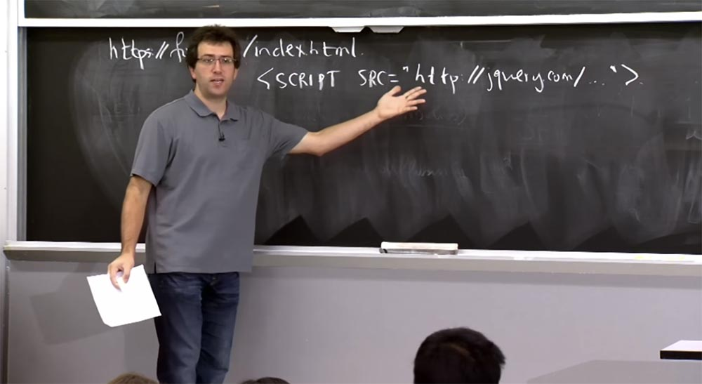
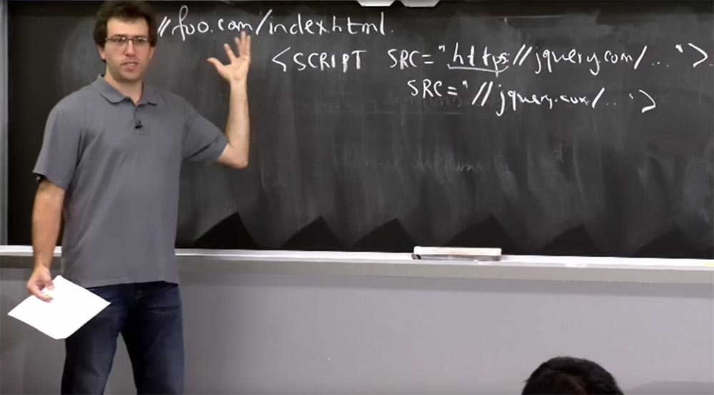
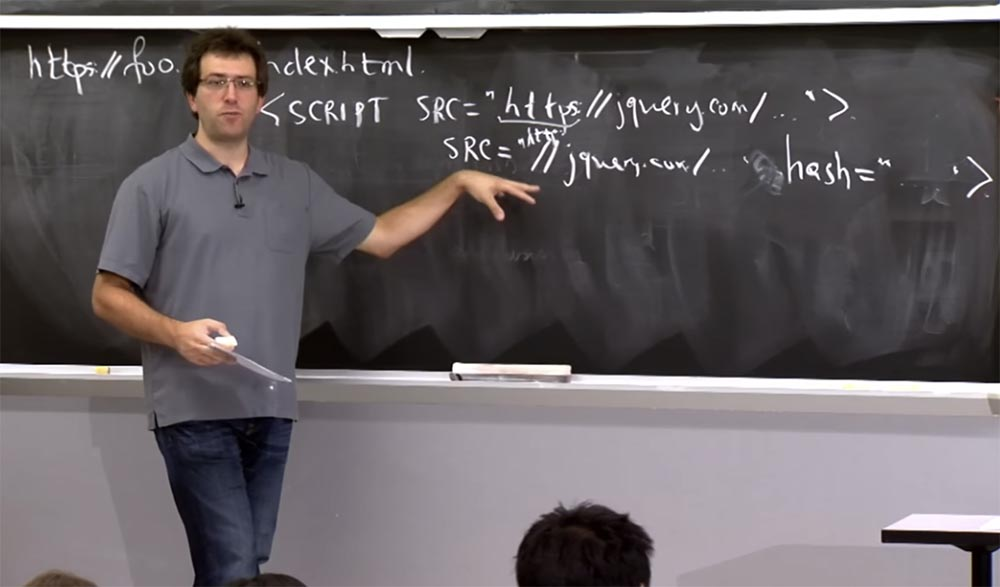
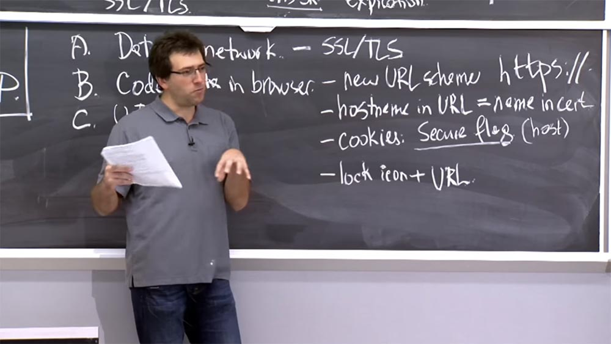
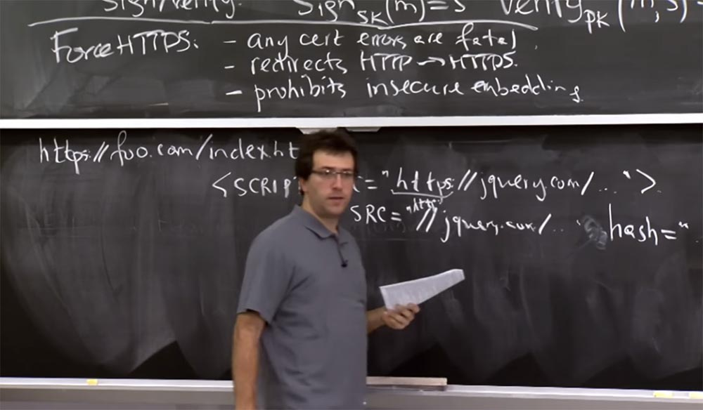
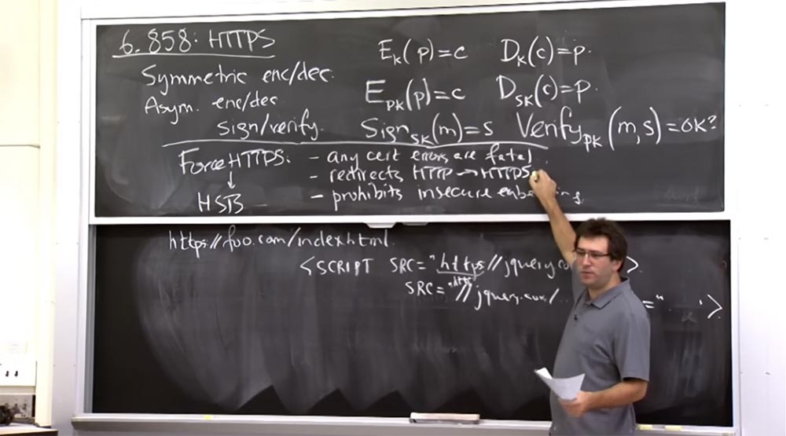
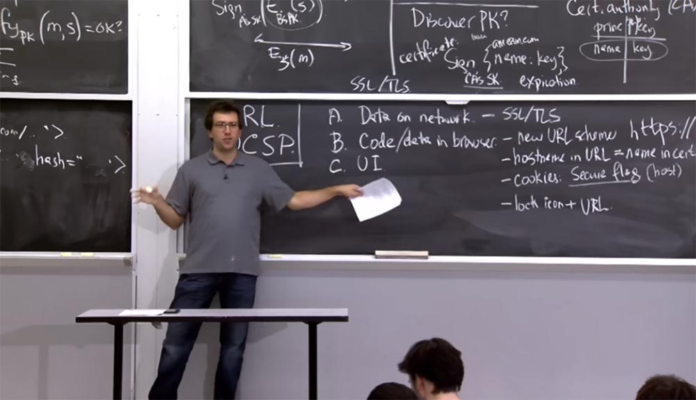
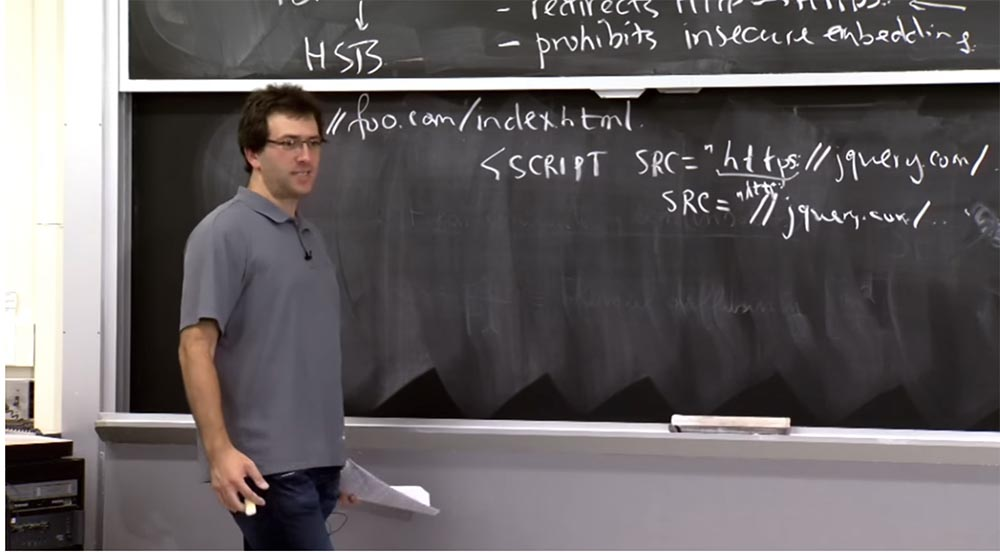

Курс MIT «Безопасность компьютерных систем». Лекция 14: «SSL и HTTPS», часть 3 / Блог компании ua-hosting.company

### Массачусетский Технологический институт. Курс лекций #6.858. «Безопасность компьютерных систем». Николай Зельдович, Джеймс Микенс. 2014 год

Computer Systems Security — это курс о разработке и внедрении защищенных компьютерных систем. Лекции охватывают модели угроз, атаки, которые ставят под угрозу безопасность, и методы обеспечения безопасности на основе последних научных работ. Темы включают в себя безопасность операционной системы (ОС), возможности, управление потоками информации, языковую безопасность, сетевые протоколы, аппаратную защиту и безопасность в веб-приложениях.

Лекция 1: «Вступление: модели угроз» [Часть 1](https://habr.com/company/ua-hosting/blog/354874/) / [Часть 2](https://habr.com/company/ua-hosting/blog/354894/) / [Часть 3](https://habr.com/company/ua-hosting/blog/354896/)  
Лекция 2: «Контроль хакерских атак» [Часть 1](https://habr.com/company/ua-hosting/blog/414505/) / [Часть 2](https://habr.com/company/ua-hosting/blog/416047/) / [Часть 3](https://habr.com/company/ua-hosting/blog/416727/)  
Лекция 3: «Переполнение буфера: эксплойты и защита» [Часть 1](https://habr.com/company/ua-hosting/blog/416839/) / [Часть 2](https://habr.com/company/ua-hosting/blog/418093/) / [Часть 3](https://habr.com/company/ua-hosting/blog/418099/)  
Лекция 4: «Разделение привилегий» [Часть 1](https://habr.com/company/ua-hosting/blog/418195/) / [Часть 2](https://habr.com/company/ua-hosting/blog/418197/) / [Часть 3](https://habr.com/company/ua-hosting/blog/418211/)  
Лекция 5: «Откуда берутся ошибки систем безопасности» [Часть 1](https://habr.com/company/ua-hosting/blog/418213/) / [Часть 2](https://habr.com/company/ua-hosting/blog/418215/)  
Лекция 6: «Возможности» [Часть 1](https://habr.com/company/ua-hosting/blog/418217/) / [Часть 2](https://habr.com/company/ua-hosting/blog/418219/) / [Часть 3](https://habr.com/company/ua-hosting/blog/418221/)  
Лекция 7: «Песочница Native Client» [Часть 1](https://habr.com/company/ua-hosting/blog/418223/) / [Часть 2](https://habr.com/company/ua-hosting/blog/418225/) / [Часть 3](https://habr.com/company/ua-hosting/blog/418227/)  
Лекция 8: «Модель сетевой безопасности» [Часть 1](https://habr.com/company/ua-hosting/blog/418229/) / [Часть 2](https://habr.com/company/ua-hosting/blog/423155/) / [Часть 3](https://habr.com/company/ua-hosting/blog/423423/)  
Лекция 9: «Безопасность Web-приложений» [Часть 1](https://habr.com/company/ua-hosting/blog/424289/) / [Часть 2](https://habr.com/company/ua-hosting/blog/424295/) / [Часть 3](https://habr.com/company/ua-hosting/blog/424297/)  
Лекция 10: «Символьное выполнение» [Часть 1](https://habr.com/company/ua-hosting/blog/425557/) / [Часть 2](https://habr.com/company/ua-hosting/blog/425561/) / [Часть 3](https://habr.com/company/ua-hosting/blog/425559/)  
Лекция 11: «Язык программирования Ur/Web» [Часть 1](https://habr.com/company/ua-hosting/blog/425997/) / [Часть 2](https://habr.com/company/ua-hosting/blog/425999/) / [Часть 3](https://habr.com/company/ua-hosting/blog/426001/)  
Лекция 12: «Сетевая безопасность» [Часть 1](https://habr.com/company/ua-hosting/blog/426325/) / [Часть 2](https://habr.com/company/ua-hosting/blog/427087/) / [Часть 3](https://habr.com/company/ua-hosting/blog/427093/)  
Лекция 13: «Сетевые протоколы» [Часть 1](https://habr.com/company/ua-hosting/blog/427763/) / [Часть 2](https://habr.com/company/ua-hosting/blog/427771/) / [Часть 3](https://habr.com/company/ua-hosting/blog/427779/)  
Лекция 14: «SSL и HTTPS» [Часть 1](https://habr.com/company/ua-hosting/blog/427783/) / [Часть 2](https://habr.com/company/ua-hosting/blog/427785/) / [Часть 3](https://habr.com/company/ua-hosting/blog/427787/)

Я думаю, что принуждение к использованию HTTPS объясняется беспокойством о пользователях, которые имеют слишком большую свободу действий в принятии решений относительно возможности использования сертификатов.

Еще одна проблема, которая проявляется на практике и которая также заставляет использовать HTTPS, это небезопасное вложение или смешанное содержимое интернет-страницы. Смысл этой проблемы в том, что безопасный сайт или любой веб-сайт, если на то пошло, может вставлять другие части контента в web-страницу.

Так что если у вас есть какой-то сайт, например foo.com/index.html, то он может обслуживаться по протоколу HTTPS, но внутри HTML-страницы у вас может быть много тегов, которые принуждают браузер перейти куда-то и сделать частью этой страницы какой-то чужой контент.

Тег такого сценария выглядит таким образом:

    <script scr = «http://jquery.com/…”>

И указывает на источник jquery.com. Таким образом, популярная библиотека JavaScript облегчает взаимодействие множества вещей в вашем браузере. Но многие веб-разработчики просто ссылаются на URL-адрес другого сайта. Это упрощает дело, но в чём тут может заключаться подвох? Предположим, что у вас имеется безопасный сайт и вы просто загружаете оттуда jQuery.

**Студент:** это может быть фальшивый jQuery.

**Профессор:** да, это так. На самом деле есть две возможности получить неправильную вещь, которую вы не ожидаете получить. Одна из возможностей заключается в том, что сам jQuery может быть скомпрометирован. Вы получили нечто, похожее на то, что просили. Если jQuery скомпрометирован, то это очень плохо. Другая возможность заключается в том, что этот запрос будет отправлен по сети без какого-либо шифрования или аутентификации. Поэтому, если противник контролирует ваше сетевое соединение, он может перехватить этот запрос и отправить вам в ответ другой код JavaScript, и теперь этот код JavaScript будет работать как часть вашей страницы. И поскольку он работает в этом домене HTTPS foo.com, то он имеет доступ к вашим защищённым кукиз foo.com и к любой другой вещи на этой странице. Похоже, что это действительно плохо, так что будьте осторожны. И веб-разработчик также должен быть осторожным, чтобы не допустить ошибки такого рода.

Таким образом, одним из решений является обеспечение безопасности всего содержимого, встроенного в защищенную страницу. Это хороший ориентир, которому должны следовать многие веб-разработчики. Так что, возможно, вы должны просто использовать в этой строке [jquery.com](https://jquery.com/) вместо [jquery.com](http://jquery.com/). Или если URL-адреса поддерживают политику origin, это означает, что вы можете опустить часть HTTPS и просто сказать, что происхождение этого скрипта равно //jquery.com/, то есть scr = «//jquery.com/…».

И это означает, что данный тег будет отсылать вас на [jquery.com](https://jquery.com/), если это находится на странице HTTPS, и на [jquery.com](http://jquery.com/), если это находится не на HTTPS, а на обычном URL HTTP. В этом состоит один из способов избежать такой проблемы.

Однако люди постоянно пытаются всё усовершенствовать, поэтому одним из альтернативных способов решения этой проблемы, возможно, является включение хэша или чего-то вроде индикатора прямо здесь, в теге:

    <script scr = «http://jquery.com/…”>

Потому что если вы знаете, какой именно контент хотите загрузить, возможно, вам не нужно загружать его полностью по протоколу HTTPS. На самом деле вам все равно, кто предоставляет вам этот контент, пока он соответствует определенному хэшу.

Таким образом, существует новая спецификация, позволяющая настраивать хэши для тегов такого вида. Поэтому вместо того, чтобы ссылаться на jquery.com с URL HTTPS, вы могли бы просто сказать, что источник скрипта равен jquery.com или даже HTTP, но в конце скрипта вы добавляете какой-то атрибут тега, например hash равен тому, что вы надеетесь получить от сервера.

**Студент:** как называется эта спецификация?

**Профессор:** у неё сложное название, оно имеется в примечаниях к конспекту лекции, что-то вроде «целостность подресурса», Subresource integrity. Она внедряется довольно медленно, но я надеюсь, что в ближайшее время она будет применена в различных браузерах. Это похоже на другой способ выполнять аутентификацию контента, не полагаясь на шифрование данных на сетевом уровне.

Таким образом, у нас есть этот очень общий план, использующий SSL и TLS для аутентификации подключений к конкретному серверу. Это альтернативный способ защиты сетевого соединения. Если вы заботитесь о целостности, то, возможно, вам не нужен безопасный, зашифрованный сетевой канал. Все, что вам нужно — это указать, что именно вы хотите получить в итоге.

**Студент:** разве этот код SRC не исходит от клиента?

**Профессор:** он работает на стороне клиента, но клиент получает данный код с какого-то сервера.

**Студент:** разве никто не может просто ввести в страницу свой код JavaScript?

**Профессор:** я думаю, может. Поэтому смысл хэша — защищать содержимое страницы от злоумышленников, которые пытаются ввести другой код JavaScript. Для jQuery это очень важно, потому что jQuery хорошо известен, ведь вы не пытаетесь скрыть исходный код jQuery. Поэтому вы хотите убедиться, что сетевой злоумышленник не сможет перехватить ваше соединение и вставить вредоносную версию jQuery, которая будет способствовать утечке кукиз. Совершенно верно, что любой может вычислить для себя хэш этих вещей. Таким образом, это решение проблем целостности, а не конфиденциальности.

Я думаю, что разработчики должны следить за этим, когда пишут страницы или включают содержимое своих HTML-страниц в URL-адреса HTTPS. Еще одна тревожащая нас проблема связана с кукиз. Здесь вступает в игру разница между кукиз с флагами безопасности и просто кукиз с происхождением origin. Единственное, что здесь может испортить разработчик – это просто забыть в первую очередь установить флаг на кукиз, такое случается. Возможно, он думает только о пользователях, которые будут переходить лишь к URL HTTPS, и считает установку флагов излишней. Является ли это проблемой? Если ваши пользователи очень осторожны и всегда посещают URL HTTPS, проблемы нет. Как вы думаете, есть ли смысл в этом случае оставлять флаг безопасности на ваших cookies?

**Студент:** вероятно, злоумышленник сможет подключиться к вашему URL и перенаправить вас на вредоносный сайт?

**Профессор:** да. Даже если пользователь явно, вручную не переходит на какой-то URL-адрес в виде простого текста, злоумышленник всё равно может дать ему ссылку на небезопасный сайт или попросить загрузить изображение с URL, отличного от HTTPS. И тогда незащищенные файлы cookie будут отправляться вместе с сетевым запросом. Так что это проблема, и вам действительно нужен флаг, даже если ваши пользователи и ваши приложения очень осторожны.

**Студент:** я предполагаю, что существуют защищённые HTTP URL.  
**Профессор:** да, это правда. Предположим, у меня есть сайт, который даже не прослушивается на 80-м порту, и нет никакого способа соединиться со мной через 80-й порт, так почему может возникнуть проблема, если я использую незащищенные файлы cookie?

**Студент:** потому что браузер не сможет отправить ваши кукиз другому домену.

**Профессор:** совершенно верно, браузер не отправит кукиз другому домену, но все же существует опасность, что злоумышленник может загрузить свой URL-адрес. Итак, предположим, что amazon.com использует только SSL, он даже не слушает порт 80. В результате они не устанавливают свой безопасный флаг на cookie. Так как может хакер украсть их кукиз, если Amazon даже не слушает порт 80?

**Студент:** не может ли браузер все еще думать, что это HTTP-соединение?

**Профессор:** ну, если вы подключитесь к порту 443 и будете использовать SSL или TLS, то соединение будет всегда зашифрованным, так что это не проблема.

**Студент:** злоумышленник может перехватить соединение.

**Профессор:** да, злоумышленник может перехватить ваши пакеты, которые пытаются подключиться к Amazon через порт 80, и сделает вид, будто бы вы успешно подсоединились к сайту. Так что если атакующий имеет контроль над вашей сетью, он может перенаправить ваши пакеты, направленные на Amazon, на порт 80 собственной машины, и клиент не сможет увидеть разницу. Это будет выглядеть, как если бы Amazon слушал порт 80, но в действительности ваши cookies будут отправлены на веб-сервер этого хакера.

**Студент:** потому что клиент неизвестен.

**Профессор:** совершенно верно, так как у HTTP нет способа проверить подлинность хоста, к которому вы подключены. Это именно то, что происходит. HTTP не имеет аутентификации. Поэтому если вы предполагаете наличие сетевого противника, вы в первую очередь должны предотвратить отправку своих кукиз по HTTP, потому что понятия не имеете, к кому будет идти это HTTP-соединение.

**Студент:** для этого вам нужно контролировать сеть.

**Профессор:** да, конечно. Если у вас есть полный контроль над вашей сетью, то вы знаете, что противники не смогут перехватить ваши пакеты. Однако даже при полном контроле над сетью у вас могут быть неприятности, посмотрите материалы к лекции о TCP, там рассматривались различные виды сетевых атак.

**Аудитория:** но разве в этом случае нельзя предотвратить атаку перенаправления?

**Профессор:** хакер, вероятно, перехватит http-запрос клиента на [amazon.com](http://amazon.com/), и этот запрос будет включать в себя все ваши кукиз для amazon.com, или кукиз для любого другого домена, которому вы отправляете запрос. Поэтому, если вы не помечаете эти кукиз как безопасные, они могут быть отосланы как по зашифрованному, так и по незашифрованному соединению.

**Студент:** как инициируется этот запрос?

**Профессор:** может быть, вы сможете заставить пользователя посетить newyorktimes.com, где вы заплатили за объявление, загружающее изображение с [amazon.com](http://amazon.com/). И нет ничего, что защитило бы пользователя от просьбы: «пожалуйста, загрузите изображение с этого URL». Но когда браузер пытается подключиться к сайту, то он обязательно пошлёт кукиз, если соединение было успешным.

Существует расширение HTTPS Everywhere, которое очень похоже на Force HTTPS, или принудительный HTTPS, и которое пытается предотвратить такого рода ошибки. Когда вы выбираете сайт в режиме принудительного HTTPS, браузер в первую очередь будет предотвращать любые HTTP соединения с этим хостом.

Таким образом, нет никакой возможности не пометить ваши кукиз как безопасные или сделать подобную ошибку. Если разработчик забыл установить на кукиз флаг безопасности, в этом случае решение очевидно – он должен просто исправить свою ошибку. Но существует более деликатная проблема: когда безопасный веб-сервер получает cookie клиента обратно, он понятия не имеет, был ли этот файл cookie отправлен через зашифрованное или простое текстовое соединение. Потому что фактически сервер получает лишь пару ключевых значений для cookie.

Из рассмотренного выше плана действий следует, что при отправке запроса на защищенный сервер браузер будет включать в него как безопасные, так и небезопасные файлы кукиз, потому что со своей стороны он обеспокоен их конфиденциальностью. Но на стороне сервера нет никаких гарантий конфиденциальности, и когда сервер получает кукиз пользователя, они могут быть отправлены как по зашифрованному, так и по текстовому соединению. Это приводит к возможности такого вида атак, как фиксация сеанса.

Это означает, что злоумышленник, например, хочет увидеть, какие электронные письма вы отправляете. Для этого он установит вам свои кукиз, которые являются копией кукиз его аккаунта Gmail. И когда вы отправите своё письмо, оно появится в его папке «Отправленные», а не в вашей папке. Это будет похоже на то, как если бы вы использовали аккаунт злоумышленника, поэтому он сможет извлечь вашу переписку из своего ящика. Так что если хакер принудительно поместит сессионные кукиз в ваш браузер, то заставит вас использовать его аккаунт. Так что это еще одна проблема, которая возникает из-за недоразумений с неполным разделением HTTP и HTTPS файлов кукиз.

**Студент:** но чтобы вставить свои кукиз в чужой браузер, вам нужно, чтобы там имелась уязвимость.

**Профессор:** нет, чтобы установить свой файл cookie, уязвимость не нужна. Вы просто обманываете браузер, чтобы он подключился к обычному URL-адресу HTTP хоста. И если в браузере нет расширения, такого как Force HTTPS или HTTPS Everywhere, вы, как атакующий, могли бы установить ключ в браузере пользователя. Это незащищенный файл cookie, но он будет отправлен обратно, даже по безопасным запросам.

**Студент:** как же можно заставить браузер думать, что этот домен и есть тот самый домен?  
Профессор: для этого вы должны перехватить сетевое соединение и совершить один из видов атаки, о которых мы говорили несколько минут назад.

Итак, что же на самом деле делает принудительный HTTPS? Он пытается предотвратить некоторые из множества проблем. Исследования о протоколе Force HTTPS были опубликованы 5 или 6 лет тому назад. С тех пор он был стандартизирован и фактически принят. Он похож на схематичный плагин, который хранит некоторые вещи и некоторые кукиз. На сегодня большинство разработчиков браузеров считают, что его создание было хорошей идеей. Лучше всего интегрировать его непосредственно в браузер. Существует нечто под названием HTTP Strict Transport Security, или HSTS — механизм, принудительно активирующий защищённое соединение через протокол HTTPS. Это хороший пример того, как научные исследования влияют на безопасность веб-приложений и браузеров.

Давайте посмотрим, что Force HTTPS делает для веб-сайта. Принудительный HTTPS позволяет веб-сайту установить этот бит для конкретного имени хоста, и существует три вещи, с помощью которых Force HTTPS влияет на поведение браузера.

Первая состоит в том, что любые ошибки сертификата всегда фатальны. Таким образом, у пользователя нет шансов принять неправильный сертификат с неверным именем хоста или истекшим сроком действия, и так далее. Это одна вещь, которая изменяет браузер.

Вторая вещь заключается в том, что Force HTTPS перенаправляет все HTTP-запросы на HTTPS. Это довольно хорошая идея. Если вы знаете, что сайт всегда законно использует HTTPS, то вы, вероятно, должны запретить любые регулярные HTTP –запросы, потому что это может быть признаком какой-то ошибки или свидетельством того, что злоумышленник пытается обмануть вас, предлагая подключение к сайту без шифрования. Вы хотите убедиться, что это на самом деле происходит, прежде чем будет выполнен запрос HTTP, иначе любой HTTP-запрос отправился бы уже в сеть.

И последнее, что Force HTTPS принуждает делать браузер, это то, что он запрещает небезопасный план встраивания, который мы рассмотрели раньше – это когда вы встраиваете URL-адрес HTTP в сайт HTTPS.

Таким образом, это то, что делает расширение Force HTTPS. Исходя из терминологии, применяемой на сегодня, протокол HSTS делает то же самое. Сейчас большинство браузеров по умолчанию запрещают небезопасное встраивание. Это вызывало споры, так как многие разработчики имели проблемы из-за Force HTTPS, но я думаю, Firefox, Chrome и IE по умолчанию откажутся загружать небезопасные компоненты, или, по крайней мере, небезопасные JavaScript и CSS на вашу страницу, если вы что-то сделаете неправильно.

**Студент:** они не запрашивают пользователя относительно совершения какого-то действия?

**Профессор:** они привыкли, что обычно пользователь соглашается. Например, IE использует всплывающее диалоговое окно, в котором спрашивает, хотите ли вы загрузить дополнительный контент, или что-то вроде этого. Я думаю, что если постараться, то можно обойти все эти меры безопасности, однако не советую вам этим заниматься. Таким образом, современные браузеры стараются решить часть проблем, используя Force HTTPS и HSTS.

**Студент:** что происходит, когда сайт не поддерживает HTTPS?

**Профессор:** что вы имеете в виду?

**Студент:** то, что браузер не будет соединяться с сайтом через HTTPS.

**Профессор:** что происходит, если у вас есть веб-сайт, который не поддерживает HTTPS, но устанавливает эти кукиз? Дело в том, что если вы применяете такую опцию в своём браузере, то не сможете поговорить с большей частью интернета, потому что они не используют HTTPS. Поэтому у браузера должна быть возможность общаться по HTTPS с теми сайтами, которые действительно хотят такой защиты.

**Студент:** если я правильно помню, вы не можете установить cookie, пока сайт этого не позволит.

**Профессор:** да, это правда. Этих ребят волнуют DoS атаки, при которых этот плагин может быть использован для причинения неприятностей другим сайтам. Например, если бы вы установили бит Force HTTPS для некоторых ничего не подозревающих веб-сайтов, то они бы вдруг перестали работать, потому что теперь все пытались бы подключится к ним через HTTPS, который они не поддерживают. Так что это один из примеров, заставляющий побеспокоится о возможности использования DoS атаки путём применения принудительного HTTPS для сайтов, которые на это не рассчитывают.

Другое дело, что этот протокол не поддерживает применение Force HTTPS для всего домена. Например, я пользователь mit.edu, который установил кукиз Force HTTPS во всех браузерах, и теперь в MIT работают только HTTPS соединения. Это кажется немного катастрофическим, поэтому вы, вероятно, захотите избежать подобной ситуации.

С другой стороны, протокол HSTS вернулся к этому, сказав, что можно установить Force HTTPS для всего поддомена, потому что это оказывается полезным для небезопасных файлов cookie, отправляемых вместе с запросом, если вы не знаете, откуда они изначально были отправлены. Существует целая куча настроек этих вещей на самом низком уровне, но всё равно неясно, что в этом случае означает правильный выбор.

Существует интересный вопрос, который вы могли бы задать: носят ли эти усовершенствования фундаментальный характер или они направлены лишь на то, чтобы помочь разработчикам избежать ошибок? Предположим, что у вас есть очень ответственный разработчик, который не совершает опасных действий, вовремя обновляет сертификаты, оформляет новые — нужно ли ему использовать Force HTTPS?

**Студент:** конечно, ведь ничто не остановит хакера, который заставит пользователя загрузить что-либо через HTTP, а потом перехватит соединение.

**Профессор:** это правда. Но если вы чувствуете, что он очень старателен, и все его кукиз помечены как безопасные, то если кто-то посещает HTTP-версию вашего сайта, это не должно причинить проблемы.

Однако вам, вероятно, всё равно придется защищаться от перезаписи файлов cookie или инъекционных атак. Это утомительно, но вы, вероятно, сможете что-то с этим сделать.

**Студент:** я думаю, разработчик в любом случае не сможет проверить подлинность сертификата, правильно?

**Профессор:** да, это напрямую касается нашего первого принципа: «любые ошибки с сертификатом приводят к фатальным последствиям». Я думаю, самый важный момент заключается в том, что вы можете защититься от всего остального, но разработчик не сможет убедиться, что его кукиз будут отправляться только на сервер, подписанный этим центром сертификации. И если у пользователя есть возможность сказать: «о, это достаточно хорошо!», то у разработчика нет никаких способов узнать, куда попадут его кукиз, потому что какой-нибудь пользователь допустил их утечку на какой-то неправильный сервер. Поэтому я думаю, что в этом состоит главное преимущество данного протокола для разработчика.

**Студент:** я думаю, что второй момент, когда HTTP принудительно переводится на HTTPS, также жизненно важен, потому что пользователь может не обратить внимания, на какой сайт переходит.

**Профессор:** я согласен с вами в том смысле, что это очень полезно с точки зрения безопасности UI, потому что разработчик более-менее знает, что нужно делать в смысле обеспечения безопасности кукиз. Но пользователь не может постоянно обращать внимание на наличие значка блокировки в строке URL-адреса. Если вы зашли на сайт amazon.com, где вас попросят ввести номер кредитной карты, вы можете просто ввести его, забыв проверить наличие этой иконки с замочком. Но если вы установите принудительный HTTPS для amazon.com, тогда не будет никаких шансов для загрузки небезопасного адреса HTTP URL для этого сайта. Ещё одна возможность ошибиться существует, если пользователь не обращает внимания на неправильный URL-адрес, например, amazonn.com вместо amazon.com. Таким образом злоумышленники все еще обманывают многих пользователей. Но в любом случае, это еще одно преимущество использования Force HTTPS.

Ещё один интересный вопрос – как вы устанавливаете этот бит Force HTTPS для сайта на первое место? Могли бы вы как злоумышленник перехватить его и предотвратить установку этого бита?

**Студент:** я думаю, что это можно сделать с помощью кукиз.

**Профессор:** совершенно верно. С одной стороны, это хорошо, что Force HTTPS может быть отправлен только по HTTPS соединению в ответ на запрос хоста. С другой стороны, именно в этом момент и можно обмануть пользователя. Например, у него еще нет бита Force HTTPS, возможно, он позволил использование неправильного сертификата или даже не знает, что это HTTP, а не HTTPS. Так что потенциально имеется возможность, что злоумышленник в первую очередь предотвратит отправку бита принудительного HTTPS. Если вы никогда раньше не были на сайте и посещаете его впервые, вы можете никогда не узнать, должен ли у него вообще быть этот принудительный HTTPS.

**Студент:** может ли сертификат гарантировать установку бита Force HTTPS?

**Профессор:** если этот бит установлен, то вы знаете, что общаетесь с правильным сервером, и далее можете продолжать правильно пользоваться этим битом для этого конкретного сервера. Но с другой стороны, если у вас нет установленного бита, или, может быть, вы никогда прежде не говорили с этим сервером, то не существует четкого протокола, который обязательно даст вам знать, должен ли быть установлен бит Force HTTPS или нет.

Возможно, что amazon.com всегда требует бит Force HTTPS, но когда вы открыли крышку своего ноутбука, перед этим побывав в сети, контролируемой злоумышленником, вы никоим образом не сможете зайти на amazon.com, потому что хакером всё перехвачено.

Поэтому загрузка правильных параметров безопасности может быть нелёгкой задачей. Одним из вариантов облегчить задачу стала бы попытка встроить этот бит в DNSSEC. Если вы уже используете DNSSEC, тогда, возможно, вы могли бы прописать там, когда следует использовать или не использовать HTTPS или Force HTTPS, как часть вашего DNS-имени. Но опять же, это просто сводится к проблеме безопасности DNSSEC, где всегда существуют правила доверия, оговаривающие, что является правильным в данном случае.

Google продолжает пытаться улучшить ситуацию, жестко кодируя некоторые элементы браузера. Например, браузер Chrome поставляется со списком сайтов, для которых должен быть включен Force HTTPS. Так что когда вы скачиваете Chrome, то получаете много действительно полезных вещей, таких как обновлённый период действия CRL и список сайтов с обязательным использованием Force HTTPS, что особенно важно. Однако это выглядит так, будто разработчики признаются в своём поражении, будто бы протокол не работает, и мы просто априори должны предоставить всем эту функцию. Это создает некое противостояние между сайтами, которые являются достаточно важными для Google, чтобы условия общения с ними оговаривалось самим браузером, и сайтами, для которых этого не делается.

Конечно, в настоящее время Google говорит, что любой сайт может быть включён в браузер, потому что существующий список очень мал, но если он вырастет до миллионов записей, я уверен, Google перестанет включать все сайты в список браузера. Но сейчас вы действительно можете внести туда свой домен, просто отправив разработчикам Chrome письмо по электронной почте, и ваш сайт будет внесён в список URL-адресов Force HTTPS.

Полная версия курса доступна [здесь](https://ocw.mit.edu/courses/electrical-engineering-and-computer-science/6-858-computer-systems-security-fall-2014/).

Спасибо, что остаётесь с нами. Вам нравятся наши статьи? Хотите видеть больше интересных материалов? Поддержите нас оформив заказ или порекомендовав знакомым, **30% скидка для пользователей Хабра на уникальный аналог entry-level серверов, который был придуман нами для Вас:** [Вся правда о VPS (KVM) E5-2650 v4 (6 Cores) 10GB DDR4 240GB SSD 1Gbps от $20 или как правильно делить сервер?](https://habr.com/company/ua-hosting/blog/347386/) (доступны варианты с RAID1 и RAID10, до 24 ядер и до 40GB DDR4).

**VPS (KVM) E5-2650 v4 (6 Cores) 10GB DDR4 240GB SSD 1Gbps до декабря бесплатно** при оплате на срок от полугода, заказать можно [тут](https://ua-hosting.company/vpsnl).

**Dell R730xd в 2 раза дешевле?** Только у нас **[2 х Intel Dodeca-Core Xeon E5-2650v4 128GB DDR4 6x480GB SSD 1Gbps 100 ТВ от $249](https://ua-hosting.company/serversnl) в Нидерландах и США!** Читайте о том [Как построить инфраструктуру корп. класса c применением серверов Dell R730xd Е5-2650 v4 стоимостью 9000 евро за копейки?](https://habr.com/company/ua-hosting/blog/329618/)