Курс MIT «Безопасность компьютерных систем». Лекция 15: «Медицинское программное обеспечение», часть 3 / Блог компании ua-hosting.company

### Массачусетский Технологический институт. Курс лекций #6.858. «Безопасность компьютерных систем». Николай Зельдович, Джеймс Микенс. 2014 год

Computer Systems Security — это курс о разработке и внедрении защищенных компьютерных систем. Лекции охватывают модели угроз, атаки, которые ставят под угрозу безопасность, и методы обеспечения безопасности на основе последних научных работ. Темы включают в себя безопасность операционной системы (ОС), возможности, управление потоками информации, языковую безопасность, сетевые протоколы, аппаратную защиту и безопасность в веб-приложениях.

Лекция 1: «Вступление: модели угроз» [Часть 1](https://habr.com/company/ua-hosting/blog/354874/) / [Часть 2](https://habr.com/company/ua-hosting/blog/354894/) / [Часть 3](https://habr.com/company/ua-hosting/blog/354896/)  
Лекция 2: «Контроль хакерских атак» [Часть 1](https://habr.com/company/ua-hosting/blog/414505/) / [Часть 2](https://habr.com/company/ua-hosting/blog/416047/) / [Часть 3](https://habr.com/company/ua-hosting/blog/416727/)  
Лекция 3: «Переполнение буфера: эксплойты и защита» [Часть 1](https://habr.com/company/ua-hosting/blog/416839/) / [Часть 2](https://habr.com/company/ua-hosting/blog/418093/) / [Часть 3](https://habr.com/company/ua-hosting/blog/418099/)  
Лекция 4: «Разделение привилегий» [Часть 1](https://habr.com/company/ua-hosting/blog/418195/) / [Часть 2](https://habr.com/company/ua-hosting/blog/418197/) / [Часть 3](https://habr.com/company/ua-hosting/blog/418211/)  
Лекция 5: «Откуда берутся ошибки систем безопасности» [Часть 1](https://habr.com/company/ua-hosting/blog/418213/) / [Часть 2](https://habr.com/company/ua-hosting/blog/418215/)  
Лекция 6: «Возможности» [Часть 1](https://habr.com/company/ua-hosting/blog/418217/) / [Часть 2](https://habr.com/company/ua-hosting/blog/418219/) / [Часть 3](https://habr.com/company/ua-hosting/blog/418221/)  
Лекция 7: «Песочница Native Client» [Часть 1](https://habr.com/company/ua-hosting/blog/418223/) / [Часть 2](https://habr.com/company/ua-hosting/blog/418225/) / [Часть 3](https://habr.com/company/ua-hosting/blog/418227/)  
Лекция 8: «Модель сетевой безопасности» [Часть 1](https://habr.com/company/ua-hosting/blog/418229/) / [Часть 2](https://habr.com/company/ua-hosting/blog/423155/) / [Часть 3](https://habr.com/company/ua-hosting/blog/423423/)  
Лекция 9: «Безопасность Web-приложений» [Часть 1](https://habr.com/company/ua-hosting/blog/424289/) / [Часть 2](https://habr.com/company/ua-hosting/blog/424295/) / [Часть 3](https://habr.com/company/ua-hosting/blog/424297/)  
Лекция 10: «Символьное выполнение» [Часть 1](https://habr.com/company/ua-hosting/blog/425557/) / [Часть 2](https://habr.com/company/ua-hosting/blog/425561/) / [Часть 3](https://habr.com/company/ua-hosting/blog/425559/)  
Лекция 11: «Язык программирования Ur/Web» [Часть 1](https://habr.com/company/ua-hosting/blog/425997/) / [Часть 2](https://habr.com/company/ua-hosting/blog/425999/) / [Часть 3](https://habr.com/company/ua-hosting/blog/426001/)  
Лекция 12: «Сетевая безопасность» [Часть 1](https://habr.com/company/ua-hosting/blog/426325/) / [Часть 2](https://habr.com/company/ua-hosting/blog/427087/) / [Часть 3](https://habr.com/company/ua-hosting/blog/427093/)  
Лекция 13: «Сетевые протоколы» [Часть 1](https://habr.com/company/ua-hosting/blog/427763/) / [Часть 2](https://habr.com/company/ua-hosting/blog/427771/) / [Часть 3](https://habr.com/company/ua-hosting/blog/427779/)  
Лекция 14: «SSL и HTTPS» [Часть 1](https://habr.com/company/ua-hosting/blog/427783/) / [Часть 2](https://habr.com/company/ua-hosting/blog/427785/) / [Часть 3](https://habr.com/company/ua-hosting/blog/427787/)  
Лекция 15: «Медицинское программное обеспечение» [Часть 1](https://habr.com/company/ua-hosting/blog/428652/) / [Часть 2](https://habr.com/company/ua-hosting/blog/428654/) / [Часть 3](https://habr.com/company/ua-hosting/blog/428656/)

На следующем слайде показано, что устройство посчитало увиденным, хотя в действительности этого не происходило. Имейте в виду, что у нас должна была быть ровная линия, потому что нет пациента и нет никакого сердцебиения.

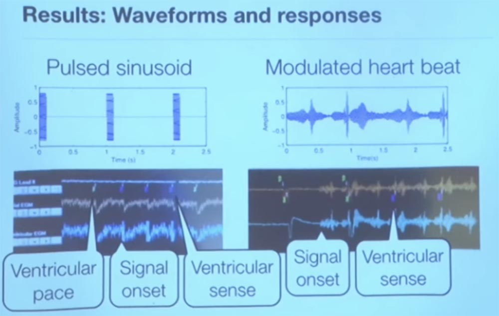

Ради интереса мы попробовали пару разных сигналов, изображающих синусоиду пульса. Это была действительно синусоидальная волна, запущенная с невообразимой скоростью, но всё равно соответствующая ритму сердцебиения. Каждую секунду мы отправляли импульс – вы видите это слева, а справа показан сигнал, который модулируется, он немного зашумлен.

Итак, это скриншот программера кардиостимулятора, который в режиме реального времени показывает выходные данные телеметрии. Маленькие зелёные метки вверху, VP, говорят о том, что программер отправляет кардиостимулятору ритм сердечных желудочков. Смысл кардиостимулятора в том, чтобы создавать искусственное сердцебиение, то есть вызывать пульсирование сердечный тканей.

Интересно то, что когда мы начали посылать наши помехи, программер получил VS, или ощущение активности желудочков. Это три маленькие фиолетовые метки в верхнем ряду. Благодаря этому кардиостимулятор подумал, что сердце забилось само по себе, поэтому он решил отключить стимуляцию для экономии энергии. Когда мы прекратили передавать помехи, он снова начал сердечную стимуляцию.

Справа вы видите, где начинается интерференция, и как стимулятор воспринимает переданное ему ощущение активности желудочков. Он начинает думать, что сердце работает само по себе и ему не надо тратить энергию для поддержания сердечной активности. Таким образом, мы можем вызвать помехи и тем самым обмануть микропроцессор, чтобы он поверил в отличное состояние сердца пациента.

Хорошая новость состоит в том, что это работает только In Vitro, в пробирке, вне живого человеческого тела. Когда мы пытались проделать подобное в физиологическом растворе или во всем, что по своим параметрам приближалось к настоящему человеческому телу, это в основном не срабатывало. Так происходит потому, что человеческое тело поглощает энергию радиоволн, и они фактически не улавливаются датчиком. Лучше всего у нас получались эксперименты с физраствором, где-то на расстоянии 3 см. На слайде показана дистанция распространения помех в различных средах, полученная при проведении эксперимента разными исследовательскими группами.

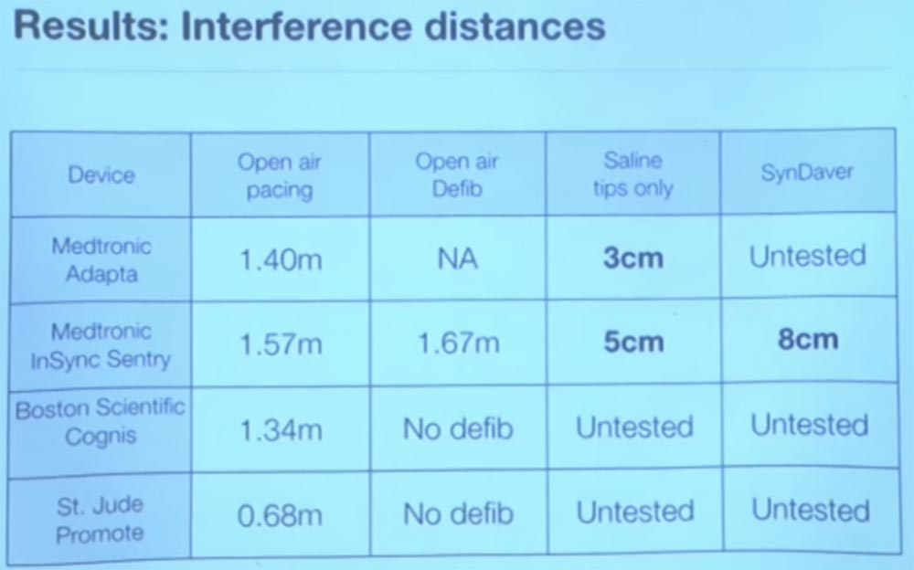

В целом это означает, что нет особых причин беспокоиться об изменении режима работы имплантата из-за внешних помех. Но мы не знаем, как будут реагировать на помехи другие жизненно важные медицинские устройства. Мы не тестировали работу инсулиновых насосов, хотя существует множество различных видов таких устройств. Есть чрескожные датчики глюкозы, я не удивлюсь, если кто-то из присутствующих ими пользуется, они достаточно распространены, но мы просто еще не знаем, как они реагируют на внешние помехи.

Я не думаю, что аналоговый фильтр способен отличить хороший сигнал от плохого, поэтому вы должны сделать свой фильтр ближе к прикладному уровню. Одним из способов защиты, который мы опробовали, состоял в следующем. У этого способа тоже есть свои ограничения, но основная идея такова. Представьте, что вы кардиостимулятор и хотите знать, надежный сигнал вы получаете или нет?

Для этого вы время от времени начинаете посылать тестовые импульсы, чтобы держать активность противника под контролем. Когда мы работали с электрофизиологами, то узнали такую интересную вещь. Мы узнали, что если вы посылаете импульс сердцу, которое недавно, где то в пределах 200 миллисекунд назад уже сократилось, то есть совершило удар, то сердечная ткань физически неспособна послать в ответ электрический импульс из-за поляризации, потому что она находится в покое.

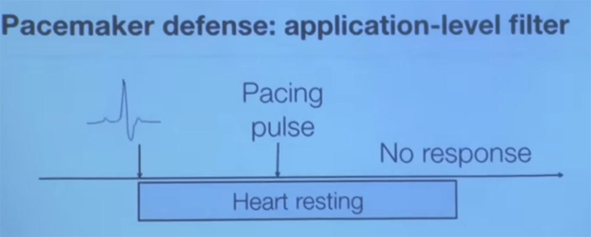

Итак, мы спросили их, что произойдет, если отправить дополнительный импульс сразу же после сокращения желудочка? Нам было сказано, что если бы сердце действительно сделало удар, как сказал вам ваш датчик, тогда вы не получите никакого ответа, это физиологически невозможно.  
Поэтому, если мы видим, что сердце посылает нам электрический сигнал после того, как совершило удар менее чем 200 мс назад, это доказывает, что нас обманули по поводу предыдущего удара пульса. Если подобное имеет место, значит, мы получаем преднамеренные электромагнитные помехи.

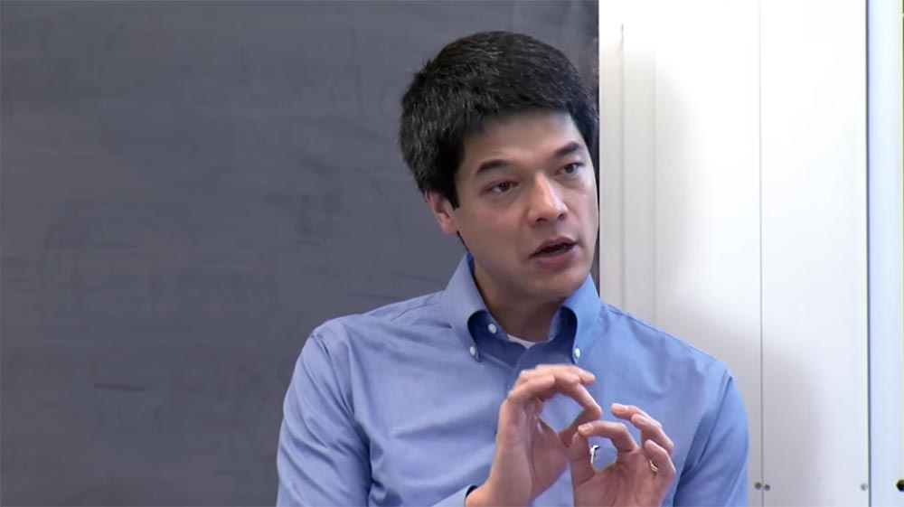

Таким образом, основная идея заключается в том, что мы снова исследуем данный вопрос, опираясь на знания о физиологии человеческого тела для большей надёжности результатов. Другой подход состоял в том, что мы не рассматривали случай распространения задержки сердечного ритма, потому что электромагнитные помехи распространяются со скоростью света. Если у вас имеются два датчика кардиостимулятора в разных частях тела, и они воспринимают один и тот же сердечный сигнал в одно и то же время, здесь явно что-то не так. Потому что электрохимическая задержка, как электрический сигнал от блуждающего нерва, движется сверху вниз по вашему сердцу.

Есть и другие способы попытаться установить, является ли физиологический сигнал надежным, но это совершенно новая теория. В этой области пока мало что происходит, поэтому она предоставляет много интересных проектов для исследования в аспирантуре и бакалавриате.

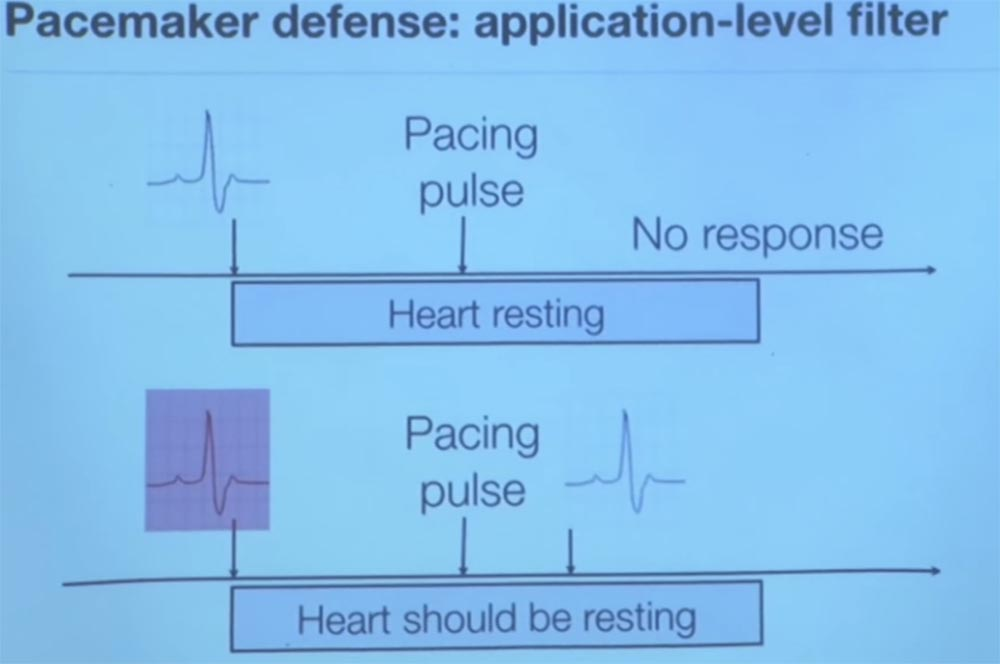

А сейчас я хочу рассказать вам о другом проекте, который позволял обнаруживать вредоносное ПО через электрические розетки. Несколько лет назад один из моих студентов, Шейн, сказал: «Эй, я сконструировал эту электророзетку и теперь могу сказать, какой сайт вы просматриваете». Он вставил внутрь обычной розетки чувствительный резистор, который измеряет так называемый фазовый сдвиг реактивной мощности. Это в основном касается прокси для загрузки информации на ваш компьютер.

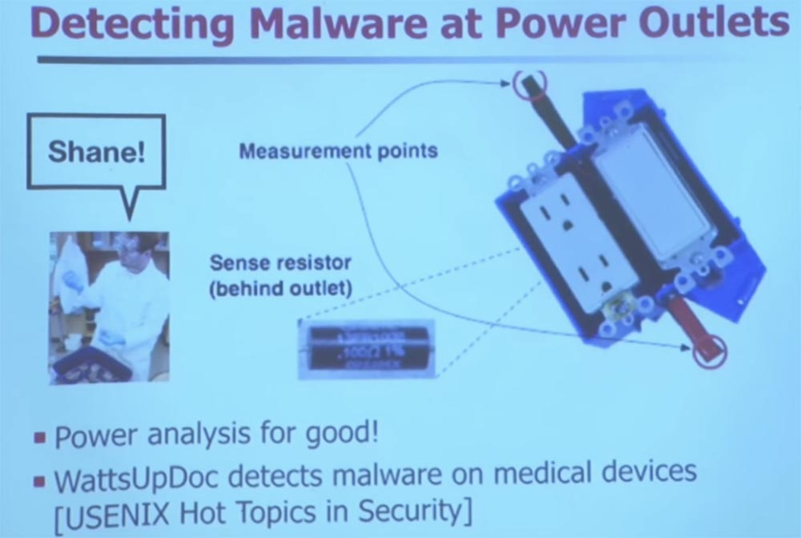

Благодаря этому сенсору он может сказать, как процессор вашего компьютера меняет нагрузку и как это отражается на параметрах потребляемого электричества. В этом нет ничего нового. Кто-нибудь слышал такой термин – защита TEMPEST? Вижу, вы в курсе. TEMPEST существует уже много лет. Так как сигналы утекают отовсюду, существует целое искусство, чтобы остановить утечку сигналов. Мне нравится хранить все свои старые компьютеры – у меня даже есть машина с экзоядром, это старый Pentium 4. Они были выпущены до того, как придумали усовершенствованное управление питанием. Так если бы вы измерили потребление электричества старым «Пентиумом», оно бы оставалось неизменным независимо от загрузки процессора.

Неважно, работал ли он в замкнутом цикле или занимался обработкой вычислительных процессов. Но если вы покупаете современный компьютер, будь-то настольный компьютер или смартфон, потребление энергии будет зависеть от рабочей нагрузки. Так что Шон обнаружил, что происходит в этом случае.

Если у вас есть встроенная система, которую очень трудно изменить, и вы хотите дооснастить её функциями безопасности, вы можете использовать интеллектуальный удлинитель.

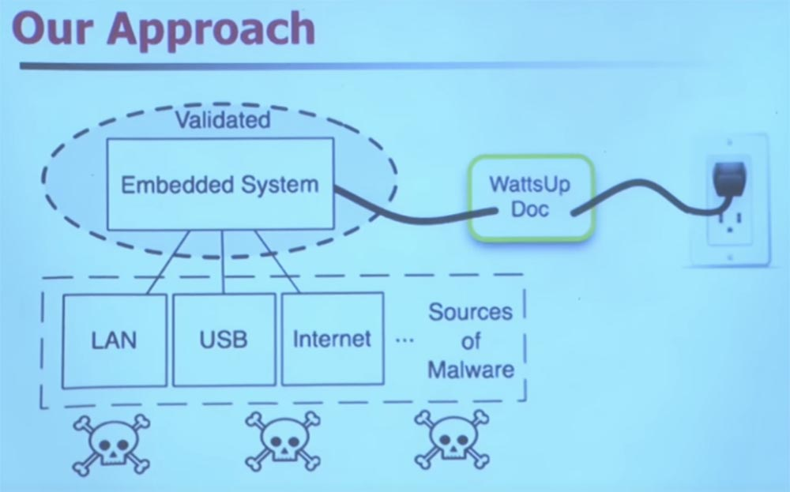

Он использует машинное обучение для классификации частотной области вашего энергопотребления. Он не отслеживает, какое количество электроэнергии вы потребляете, а следит, насколько часто вы это делаете.

Позвольте мне дать вам некоторую подсказку. Представьте, что у вас есть медицинское устройство, которое заражено вредоносным ПО. Предположим, этот вирус будет просыпаться каждые несколько минут, чтобы отправить спам. Как это может изменить энергопотребление?  
Правильно, каждые несколько минут будет срабатывать прерывание режима сна, и процессор будет просыпаться. Вероятно, это усилит его потребность в ресурсах памяти. Он собирается совершить несколько циклов, либо вставить несколько дополнительных циклов в то, что раньше было постоянным набором рабочих инструкций.

Медицинские устройства выполняют небольшой набор инструкций, в отличие от компьютеров общего назначения, и это обычная картина их работы. Поэтому, когда у вас внезапно появляется вредоносное ПО, это сразу же изменяет модель энергопотребления, поведение электропитания, и благодаря этому его можно отследить. Вы делаете преобразование Фурье, применяете другие «магические» технологии с участием машинного обучения. Дьявол кроется в деталях. Вы можете использовать машинное обучение для того, чтобы с очень высокой точностью и минимальной долей ошибок определить наличие вредоносных программ и других аномалий.

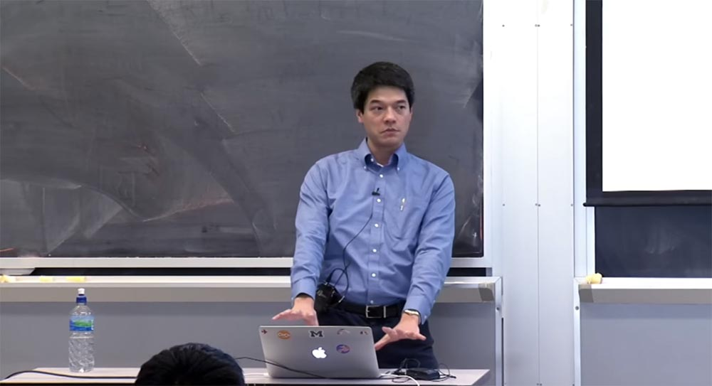

Это проект, над которым Шон работал несколько лет. Первоначально он создал этот проект, чтобы определять, какой веб-сайт вы просматривали. К сожалению, он представил его на куче конференций именно с такой целью, и все ему говорили: «ну и зачем тебе это понадобилось»? Однако это оказалось очень полезным, потому что он выбрал 50 лучших сайтов по рейтингу Alexa. А потом он составил профиль энергопотребления своего компьютера, чтобы использовать его для машинного обучения, и после этого снова, с очень высокой точностью удавалось определить, какой сайт посещался на других компьютерах. Мы были действительно удивлены тем, что это вообще работало. И мы до сих пор точно не знаем, почему это возможно, но у нас есть сильные подозрения, что во всем виновата система управления содержимым веб-сайтов Drupal.

Кто до сих пор пишет на Emacs HTML? Отлично, я тоже. Вот почему у меня возникают все эти ошибки на моем сайте. Но несколько лет назад наблюдалось активное движение, особенно в учреждениях, чтобы код автоматически создавал файл содержимого веб-страниц, который следует регулярной структуре. Например, если вы заходите на страницу cnn.com, то у них всегда есть реклама в правом верхнем углу, с флеш-анимацией, которая длится ровно 22 секунды. Таким образом, при входе на эту страницу процессор вашего компьютера начинает её обрабатывать, то есть веб-браузер оказывает влияние на привычный шаблон энергопотребления, и его изменения можно зафиксировать как характерные именно для этого сайта.

Единственный сайт, который мы не могли уверенно классифицировать, был GoDaddy. Мы не знаем, почему, и это нас особо не волнует, так как этот вопрос далёк от проблем безопасности.

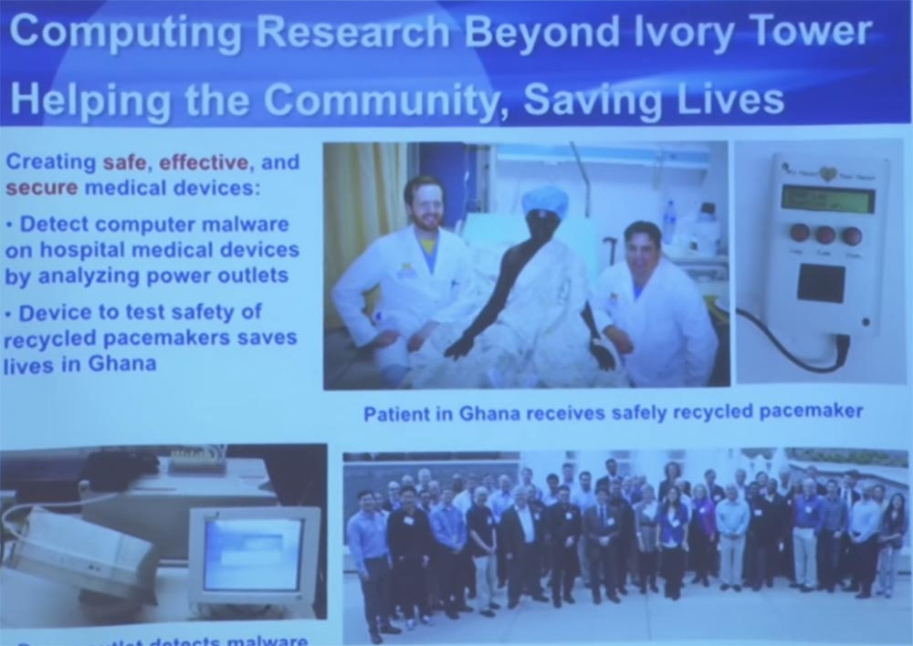

Когда вы помогаете вашим коллегам из разных клиник, то они часто снова общаются к вам за помощью. Мы работали над одним из интересных проектов, связанным с неполадками в обеспечении работы кардиостимуляторов в развивающихся странах, особенно в Гане, что позволило буквально дать пациентам вторую жизнь. Потому что если у вас в стране нет системы здравоохранения, очень сложно, скажем, получить 40000 долларов на кардиостимулятор плюс команду хирургов.

Они занимались восстановлением бракованных кардиостимуляторов и дефибрилляторов, а затем их стерилизовали. Это довольно интересно. Вы должны использовать для стерилизации газовую камеру с окисью этилена, чтобы удалить все пирогены — вещества, которые вызывают лихорадку. Эти аппараты стерилизуют, а затем повторно имплантируют пациентам. Этот джентльмен на снимке страдал от замедленного сердечного ритма, который был для него смертным приговором. Но так как он смог получить кардиостимулятор, это дало ему дополнительные годы жизни.

Итак, проблема, с которой они пришли к нам, заключалась в том, как они могут узнать, что эти устройства все еще безопасны, ведь ими даже не пользовались. Очевидно, вы можете посмотреть на срок службы батареи – это первое, что вы делаете. Если заряд слишком низкий, устройство нельзя имплантировать. А как насчет некоторых других вещей? Например, если металл немного проржавел? Как мы сможем проверить устройство от начала и до конца, чтобы узнать, сможет ли оно правильно распознавать аритмию?

Студенты из моей лаборатории создали специальный тестер, который отправляет кардиостимулятору электрические эквиваленты сердечной аритмии, аномалии, отличные от синусоиды нормального сердечного ритма.

Кардиостимулятор думает, что он подсоединён к пациенту, и начинает реагировать. Затем мы проверяем ответ, чтобы увидеть, действительно ли он диагностирует сердечную аритмию и действительно ли он правильно посылает спасительные удары.

Сейчас эта разработка проходит полный процесс проверок FDA, чтобы получить их одобрение на использование. Пока что это незавершенная программа, которая называется «Мое сердце — твое сердце». Вы можете найти о ней подробные сведения, если интересуетесь.

Кроме того, мы довольно часто взаимодействуем с сообществом производителей медицинских устройств. Мы приглашаем их каждое лето в Центр безопасности медицинских устройств в Энн-Арборе вместе с медиками, отвечающими за управление клиниками, и они делятся за общим столом своими жалобами и проблемами, связанными с медицинскими устройствами. У нас была одна компания, которой мы просто показали все существующие проблемы, относительно которых никто не станет обращаться к производителю медицинской аппаратуры. Это новая культура общения.

Так что я не знаю, занимался ли кто-нибудь из вас анализом безопасности или реверсивным инжинирингом. Я вижу, пара человек. Это очень щепетильная вещь, почти искусство, потому что вы имеете дело с социальными элементами в производстве, тем более в производстве медицинских устройств, потому что на карту поставлены жизни. Может быть очень, очень сложно поделиться такого рода проблемами с людьми, которые действительно способны их исправить. Поэтому это часто требует личных контактов.

Я хочу сэкономить еще немного времени. Надеюсь, у нас возникнут вопросы, потому что я думаю, у нас есть пять или 10 минут. Но я хочу развеять пару мифов. Вы наверняка знакомы с множеством газетных заголовков и телешоу, говорящих о том, как хакеры взламывают медицинские устройства. Возможно, это проблема, но это не единственная и тем более не самая существенная проблема. Трудно считать это проблемой, когда вы анализируете безопасность, потому что на самом деле есть две более важные проблемы.

Первая – это отсутствие широкомасштабного доступа к устройствам из-за недоступности ухода за пациентами. Поэтому забудьте про внешних противников — что делать, если у вас просто имеются вредоносные программы, которые случайно попадают в медицинские устройства, потому что все они работают под управлением одной операционной системы? Что случается, когда из строя одновременно выходят 50000 инъекционных насосов? В таком случае очень трудно обеспечить надлежащий уход за пациентами.

Один из моих коллег написал мне, что его лаборатория катетеризации закрыта.

Катетеризационные лаборатории — относительно новая специализация. Это особый вид операционной для минимальной инвазионной хирургии. У них в клинике пришлось закрыть такую лабораторию из-за того, что медсестра случайно занесла вирус с USB-накопителя, с которого хотела передать семейные фотографии на Yahoo. Каким-то образом вредоносное ПО проникло внутрь и заразило их лабораторию катетеризации. Поэтому им пришлось её закрыть и прекратить всю работу.

Так что если вы ждёте ангиопластику, теперь этот конкретный медицинский центр для вас недоступен. Вам придется использовать один из резервных центров. Таким образом, доступность медицинского оборудования для медперсонала — одна из ключевых вещей, о которой которая часто забывают с точки зрения обеспечения безопасности.

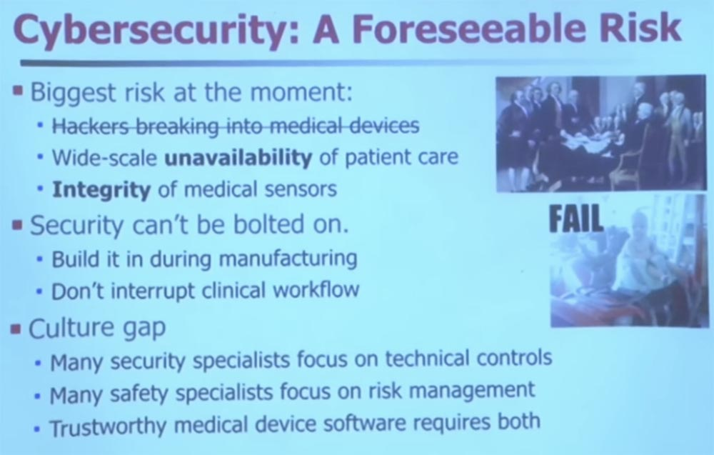

Вторая важная проблема – это цельность датчика. Если ваше медицинское устройство заражается вредоносным ПО, его работа меняется таким образом, который не могли предвидеть его разработчики. Вот очень простой пример. Допустим, некоторые вредоносные программы попадают в таймер. Они пробуждают его, чтобы отправлять сетевые пакеты и спам. Это занимает некоторое время. Что произойдет, если ваше медицинское устройство предполагает, что оно полностью контролирует прерывания работы датчика для сбора показаний, и тут прерывания пропускаются? Возможно, этот датчик регулирует параметры питания медицинского устройства, но из-за вредоносных программ он пропустил очередную передачу показаний. Из-за этого вы можете начать неправильно диагностировать пациентов, так как устройство получило от датчика неверные данные. Поэтому я очень беспокоюсь о целостности медицинских датчиков.  
Было несколько сообщений о том, что монитор высокого риска беременности был заражен вирусом и выдавал неправильные показания. Хорошо, что высококвалифицированный врач может взглянуть на такие показания и сказать, что это чушь, мой прибор не может выдавать такие цифры. Также следует учесть, что мы уменьшим запас прочности датчиков, если не станем обеспечивать их целостность.

Как я уже упоминал, очень сложно вносить в медицинское оборудования какие-то изменения после того, как оно выпущено. Вы думаете, что трудно изменить ПО в масштабе интернета?

Попробуйте проделать это на медицинских устройствах. Я встретил парня из одной больницы, где его МРТ все еще работает на Windows 95. У меня есть программатор кардиостимулятора, который работает на OS / 2, и лишь недавно его обновили до Windows XP.

Таким образом, у врачей есть действительно старые вещи, поэтому изменить их безопасность по факту очень трудно. Не невозможно, но сложно, потому что необходимо прервать клинический рабочий процесс.

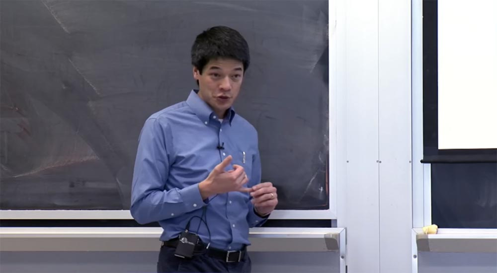

Если вы хотите заниматься разработкой и реализацией медицинских устройств или делать что-то в области безопасности здравоохранения, вам следует сначала заглянуть в операционную. Именно это мы и сделали, потому что только там можно увидеть странные вещи, происходящие с медицинскими устройствами. Я взял всех своих студентов на операцию в детскую хирургию.

И пока они наблюдали за операцией, то заметили, как один врач проверял свою почту Gmail на одном из медицинских устройств. В тоже время они хотели успокоить пациента, поэтому педиатры зашли на сайт «Пандора», чтобы проиграть музыку.

Вообще-то я был у дантиста на днях, и у неё тоже была запущена «Пандора». И вся эта реклама сортов пива появились на экране монитора в тот момент, когда она рассматривала рентгеновские снимки моих зубов. Я сказал: «откуда тут взялось пиво Dos Equis, неужели я так много выпил?», на что она ответила – нет, это один и тот же веб-браузер, просто нажмите на другую вкладку.

Так что в медицине часто личные интересы смешиваются с работой, и хотя это происходит непреднамеренно, оно всё же создаёт бреши в безопасности. И это остаётся за границами зрения, за границами мышления медиков. Нужно мыть руки, нельзя прикасаться ни к чему перчатками после того, как ты их наденешь — это накрепко вбито в их сознание. Но когда дело доходит до гигиены безопасности, это действительно можно описать как «с глаз долой, из сердца вон». Это пока что не является частью медицинской культуры. Они даже не понимают, что должны задавать себе такие вопросы, как, например, могу ли я запустить «Пандору» на том же устройстве, которое контролирует мой рентген?

Так что главное в деле разработчика медицинских устройств – это не прерывать клинический рабочий процесс, потому что тогда случаются ошибки. Вы хотите, чтобы клинический рабочий процесс был регулярным, предсказуемым, удобным для принятия решений. И если вы добавляете новое диалоговое окно для ввода пароля, как вы думаете, может ли возникнуть проблема в операционной, если вы будете просить врача вводить пароль, скажем, каждые десять минут? Допустимы ли такие отвлекающие факторы? Врачу нужно отложить скальпель, снять перчатки, ввести пароль…за это время можно потерять пациента.

Так что если вы инженер по безопасности, вам придется учитывать особые условия борьбы с вредоносными программами в клинических условиях, о которых, как ни странно, знают не все. Определенно есть очень талантливые инженеры, которые знают об этом, но их недостаточно.  
Другая большая проблема заключается в том, что как я заметил, специалисты по безопасности, как правило, специализируются на механистической стороне контроля над безопасностью. Вы можете владеть криптографией, знать режим CBC, криптографию с открытым ключом, это всё здорово. Вы знаете, как предотвратить проблемы и вы умеете их обнаруживать.

Проблема в том, что большинство людей мире медицины мыслят другими категориями, которые называются «управление рисками». Позвольте мне объяснить это. Управление рисками состоит в том, что вы оцениваете все ухудшения и выгоды и спрашиваете себя, сбалансированы ли они? Если я совершу некое действие, облегчит ли оно процесс управления рисками?

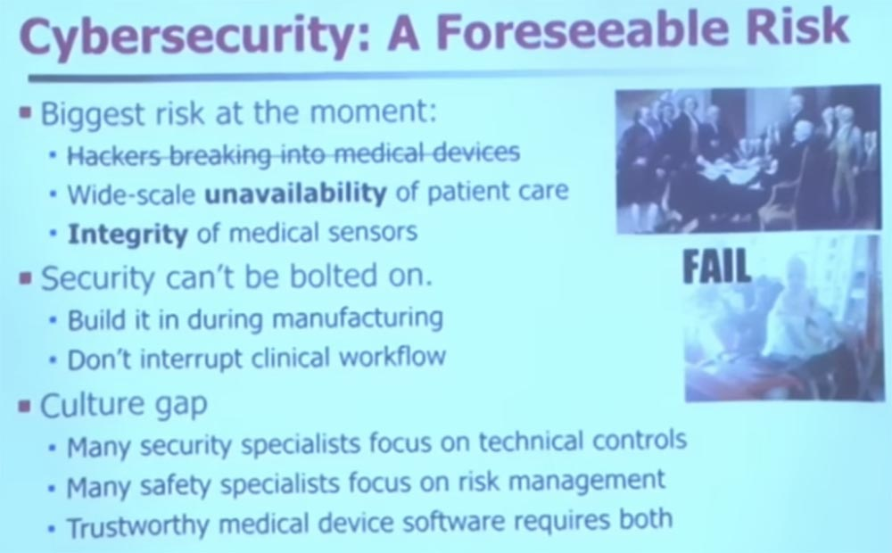

Например, вы хотите выяснить, стоит ли внедрять систему паролей на всех ваших медицинских устройствах. Специалист по безопасности скажет, что конечно, вводите, вы же должны проходить аутентификацию!

Осторожный человек мог бы сказать: «Ну нет, подождите минутку. Если мы установим везде пароли, то мы должны позаботиться о стерильности. Откуда мы узнаем, как часто происходит тайм-аут? Как насчет аварийного доступа? Что, если мы забудем пароль? Мы хотим убедиться, что сумеем получить ответ в течение 30 секунд». Так что медики могут принять другое решение, например, вообще не использовать пароли. В действительности, многие больницы не имеют доступа к медицинским записям. Вместо этого они имеют так называемый контроль доступа на основе аудита. Если вы посмотрите на что-то, на что не имеете право смотреть, то только тогда они придут за вами. Потому что они знают, насколько сложно заранее предусмотреть, какие именно данные могут вам понадобиться в режиме потока клинических операций.

Таким образом, способ управления рисками будет зависеть от развертывания элементов управления безопасностью и всех знаний о технологии лечебного процесса. По картине управления рисками вы можете решить не внедрять что-либо, потому что это может причинить вред. Однако при обоих способах мышления требуется надежное медицинское программное обеспечение устройств.

На этом месте я завершу лекцию. Я думаю, что есть много интересных вещей, которые вы сможете сделать. Вы проходите здесь классный курс безопасности, и я призываю вас пойти и использовать изученные вами инструменты.

Если вы задумываетесь о том, куда пойти после института, будь то промышленность или высшая школа, подумайте о медицинских устройствах, потому что они нуждаются в вашей помощи. Им там нужно много умных людей. И поэтому им не хватает только одного — тебя. Я думаю, что здесь много интересного и еще многое предстоит сделать.

Думаю, у нас есть ещё 5-10 минут, и был бы рад ответить на несколько вопросов. Или я могу углубиться в тему. У меня есть несколько забавных видео, которые я могу показать. Думаю, стоит взять и прерваться, чтобы узнать, если ли у вас есть какие-либо вопросы.

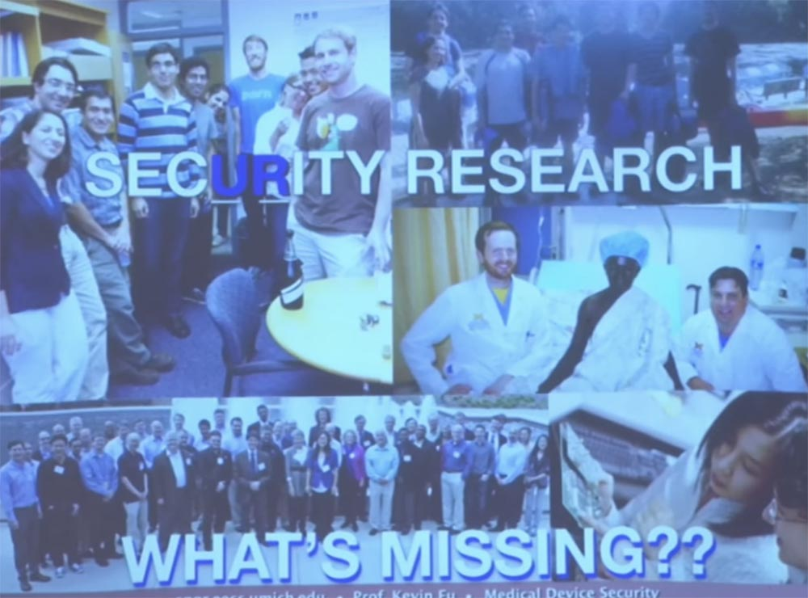

**Аудитория:** как связаны кардиостимулятор и дефибриллятор по своему предназначению и можно ли их использовать повторно?

**Профессор:** Действительно, дефибрилляторы и кардиостимуляторы связаны друг с другом, потому что выполняют схожие задачи. Это дефибриллятор, он посылает большие разряды, а кардиостимулятор — небольшие разряды. Но в США их реимплантация незаконна. Не имеет значения, что вы можете это сделать. Это просто незаконно. Но во многих развивающихся странах повторное использование этих имплантатов не запрещено. Если посмотреть не со стороны механизмов управления безопасностью, а со стороны управления рисками, то реимплантация и повторное использование этих устройств может фактически привести к улучшению общественного здравоохранения, просто в развивающихся странах нет другого выбора. И это не мой проект, это просто проект, в реализации которого мы помогаем.

Но в этом конкретном случае у пациентов действительно нет выбора. По сути, это смертный приговор. Стерилизовать такой имплантат довольно сложно. Есть различные технологии и научные методы, используемые для правильной стерилизации и полного избавления от болезнетворных микроорганизмов. Поскольку они бывают в крови, сначала применяют абразивный очиститель, а затем окись этилена, уничтожающую если не все, то большинство патогенов. Есть целый тест на проверку успешности стерилизации. В одну камеру с дефибриллятором вы помещаете специальные плашки с известными количествами патогенов, а после стерилизации проверяете, все ли микроорганизмы были уничтожены.

**Аудитория:** Итак, вы говорите, целостность датчиков — это больший риск для хакерской атаки, потому что большинство примеров сенсорных помех, которые вы продемонстрировали, являются результатом преднамеренного вмешательства. Так что это своего рода угроза безопасности.

**Профессор:** вопрос в том, почему я сосредоточился на целостности датчиков, а не на возможности взлома, потому что все, что я показывал, касалось взломов? Это предвзятость моего выбора. Я выбрал именно такие случаи, но это не значит, что это статистически важно. Я разделил их на три периода — прошлое, настоящее и будущее.

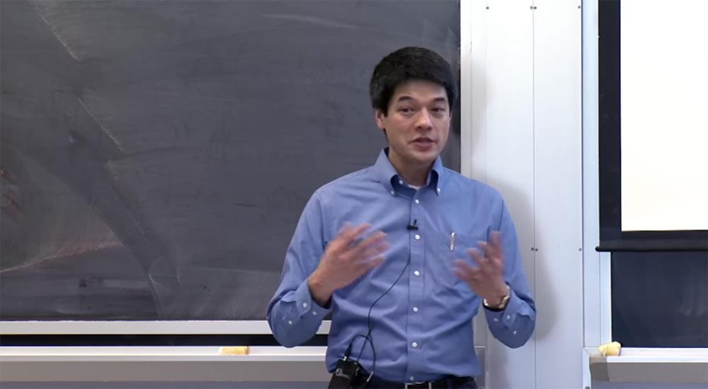

В настоящее время большинство проблем, которые причиняют вредоносные программы в нашем довольно рудиментарном наблюдении за медицинскими устройствами, связаны с тем, что вирусы случайно попадают внутрь устройств и затем приводят к ошибкам и неисправностям.

Но мы знаем, что в будущем может возникнуть и преднамеренный противник, он просто еще не материализовался. Самый близкий пример — из новостей, не знаю, правда ли это. По-моему, газета «Нью-Йорк Таймс» рассказала о клинике общественного здравоохранения CHS, на которую работает компания компьютерной безопасности Mandiant. Они верят, что некое национальное государство намеревается украсть их медицинские записи. Они точно не знают, зачем ему это понадобилось, но уверены в реальности такой угрозы. А национальные государства — могущественные противники, верно? Если вы столкнетесь с национальным государством, вы можете просто сдаться, потому что никакой контроль над устройствами вам не поможет (вероятно, докладчик имеет ввиду сообщения прессы 2013 года о массированных атаках китайских хакеров на базы данных медицинских учреждений общественного здравоохранения США, в результате которых было похищено около 180 тысяч медицинских записей пациентов в 206 клиниках 29 штатов).

Но вот что меня беспокоит. Если национальное государство, например, очень заинтересовано в получении определённой части медицинской информации, но по ошибке затрагивает программное обеспечение медицинских устройств, в последующем это может повлиять на правдивость их показаний.

Поэтому в будущем могут быть случаи применения пользовательских вредоносных программ, но я думаю, что это будет стоить определённых усилий тому, кто действительно желает причинить вред. Я надеюсь, что их не слишком много, хотя такие люди встречаются. Однако есть люди, которые пишут вредоносные программы и не понимают, что эти вредоносные программы попадают в медицинские устройства в больницах, и подобное все еще вызывает проблемы.

Полная версия курса доступна [здесь](https://ocw.mit.edu/courses/electrical-engineering-and-computer-science/6-858-computer-systems-security-fall-2014/).

Спасибо, что остаётесь с нами. Вам нравятся наши статьи? Хотите видеть больше интересных материалов? Поддержите нас оформив заказ или порекомендовав знакомым, **30% скидка для пользователей Хабра на уникальный аналог entry-level серверов, который был придуман нами для Вас:** [Вся правда о VPS (KVM) E5-2650 v4 (6 Cores) 10GB DDR4 240GB SSD 1Gbps от $20 или как правильно делить сервер?](https://habr.com/company/ua-hosting/blog/347386/) (доступны варианты с RAID1 и RAID10, до 24 ядер и до 40GB DDR4).

**VPS (KVM) E5-2650 v4 (6 Cores) 10GB DDR4 240GB SSD 1Gbps до декабря бесплатно** при оплате на срок от полугода, заказать можно [тут](https://ua-hosting.company/vpsnl).

**Dell R730xd в 2 раза дешевле?** Только у нас **[2 х Intel Dodeca-Core Xeon E5-2650v4 128GB DDR4 6x480GB SSD 1Gbps 100 ТВ от $249](https://ua-hosting.company/serversnl) в Нидерландах и США!** Читайте о том [Как построить инфраструктуру корп. класса c применением серверов Dell R730xd Е5-2650 v4 стоимостью 9000 евро за копейки?](https://habr.com/company/ua-hosting/blog/329618/)