Курс MIT «Безопасность компьютерных систем». Лекция 16: «Атаки через побочный канал», часть 1 / Блог компании ua-hosting.company

### Массачусетский Технологический институт. Курс лекций #6.858. «Безопасность компьютерных систем». Николай Зельдович, Джеймс Микенс. 2014 год

Computer Systems Security — это курс о разработке и внедрении защищенных компьютерных систем. Лекции охватывают модели угроз, атаки, которые ставят под угрозу безопасность, и методы обеспечения безопасности на основе последних научных работ. Темы включают в себя безопасность операционной системы (ОС), возможности, управление потоками информации, языковую безопасность, сетевые протоколы, аппаратную защиту и безопасность в веб-приложениях.

Лекция 1: «Вступление: модели угроз» [Часть 1](https://habr.com/company/ua-hosting/blog/354874/) / [Часть 2](https://habr.com/company/ua-hosting/blog/354894/) / [Часть 3](https://habr.com/company/ua-hosting/blog/354896/)  
Лекция 2: «Контроль хакерских атак» [Часть 1](https://habr.com/company/ua-hosting/blog/414505/) / [Часть 2](https://habr.com/company/ua-hosting/blog/416047/) / [Часть 3](https://habr.com/company/ua-hosting/blog/416727/)  
Лекция 3: «Переполнение буфера: эксплойты и защита» [Часть 1](https://habr.com/company/ua-hosting/blog/416839/) / [Часть 2](https://habr.com/company/ua-hosting/blog/418093/) / [Часть 3](https://habr.com/company/ua-hosting/blog/418099/)  
Лекция 4: «Разделение привилегий» [Часть 1](https://habr.com/company/ua-hosting/blog/418195/) / [Часть 2](https://habr.com/company/ua-hosting/blog/418197/) / [Часть 3](https://habr.com/company/ua-hosting/blog/418211/)  
Лекция 5: «Откуда берутся ошибки систем безопасности» [Часть 1](https://habr.com/company/ua-hosting/blog/418213/) / [Часть 2](https://habr.com/company/ua-hosting/blog/418215/)  
Лекция 6: «Возможности» [Часть 1](https://habr.com/company/ua-hosting/blog/418217/) / [Часть 2](https://habr.com/company/ua-hosting/blog/418219/) / [Часть 3](https://habr.com/company/ua-hosting/blog/418221/)  
Лекция 7: «Песочница Native Client» [Часть 1](https://habr.com/company/ua-hosting/blog/418223/) / [Часть 2](https://habr.com/company/ua-hosting/blog/418225/) / [Часть 3](https://habr.com/company/ua-hosting/blog/418227/)  
Лекция 8: «Модель сетевой безопасности» [Часть 1](https://habr.com/company/ua-hosting/blog/418229/) / [Часть 2](https://habr.com/company/ua-hosting/blog/423155/) / [Часть 3](https://habr.com/company/ua-hosting/blog/423423/)  
Лекция 9: «Безопасность Web-приложений» [Часть 1](https://habr.com/company/ua-hosting/blog/424289/) / [Часть 2](https://habr.com/company/ua-hosting/blog/424295/) / [Часть 3](https://habr.com/company/ua-hosting/blog/424297/)  
Лекция 10: «Символьное выполнение» [Часть 1](https://habr.com/company/ua-hosting/blog/425557/) / [Часть 2](https://habr.com/company/ua-hosting/blog/425561/) / [Часть 3](https://habr.com/company/ua-hosting/blog/425559/)  
Лекция 11: «Язык программирования Ur/Web» [Часть 1](https://habr.com/company/ua-hosting/blog/425997/) / [Часть 2](https://habr.com/company/ua-hosting/blog/425999/) / [Часть 3](https://habr.com/company/ua-hosting/blog/426001/)  
Лекция 12: «Сетевая безопасность» [Часть 1](https://habr.com/company/ua-hosting/blog/426325/) / [Часть 2](https://habr.com/company/ua-hosting/blog/427087/) / [Часть 3](https://habr.com/company/ua-hosting/blog/427093/)  
Лекция 13: «Сетевые протоколы» [Часть 1](https://habr.com/company/ua-hosting/blog/427763/) / [Часть 2](https://habr.com/company/ua-hosting/blog/427771/) / [Часть 3](https://habr.com/company/ua-hosting/blog/427779/)  
Лекция 14: «SSL и HTTPS» [Часть 1](https://habr.com/company/ua-hosting/blog/427783/) / [Часть 2](https://habr.com/company/ua-hosting/blog/427785/) / [Часть 3](https://habr.com/company/ua-hosting/blog/427787/)  
Лекция 15: «Медицинское программное обеспечение» [Часть 1](https://habr.com/company/ua-hosting/blog/428652/) / [Часть 2](https://habr.com/company/ua-hosting/blog/428654/) / [Часть 3](https://habr.com/company/ua-hosting/blog/428656/)  
Лекция 16: «Атаки через побочный канал» [Часть 1](https://habr.com/company/ua-hosting/blog/429390/) / [Часть 2](https://habr.com/company/ua-hosting/blog/429392/) / [Часть 3](https://habr.com/company/ua-hosting/blog/429394/)

Ладно, ребята, давайте начнем. Итак, сегодня мы поговорим об атаках через побочные каналы, общей проблеме, свойственной всем видам систем. В широком смысле атаки через побочный канал возникают в ситуации, когда вы не думаете, что какая-то информация способна раскрыть сведения о вашей системе.

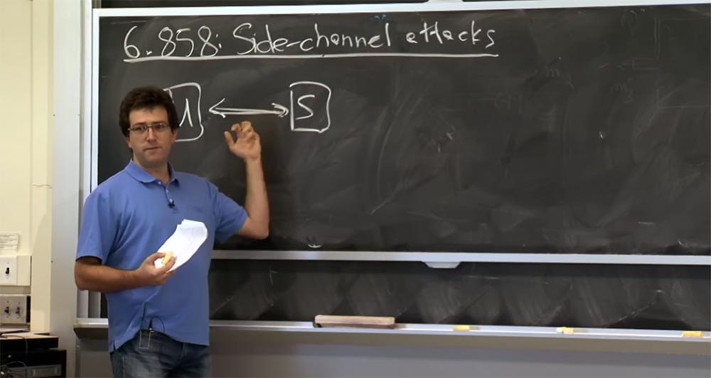

Как правило, у вас есть несколько компонентов, которые устанавливают связь между пользователем и сервером. При этом вы думаете, что знаете обо всём, что проходит по этому проводу, связывающему двух абонентов, знаете обо всех битах, которыми пользователь и сервер обмениваются друг с другом, и это безопасно. Но часто бывает так, что некая информация всё же раскрывается пользователем или сервером. Пример, о котором говорится в материалах сегодняшней лекции, описывает ситуацию, когда синхронизация сообщений между пользователем и сервером раскрывает некоторую дополнительную информацию, о которой вы бы не узнали, просто наблюдая за потоком битов между этими абонентами.

На самом деле, есть гораздо более широкий класс побочных каналов, относительно которых вы можете беспокоиться. О появлении побочных каналов люди узнали ещё в 40-х годах, когда обнаружили, что если вы начинаете печатать символы на телетайпе, то электроника телетайпа начнёт излучать радиочастотную радиацию. При этом можно просто расположить рядом осциллограф и наблюдать, как изменяется частота радиосигнала в зависимости от того, какой символ печатает оператор телетайпа. Таким образом, радиочастотное излучение является классическим примером побочного канала, который заставляет вас беспокоиться.

Есть много других примеров, замеченных людьми, таких, как потребление электроэнергии. Это еще один побочный канал, о котором вы можете беспокоиться, так как ваш компьютер будет использовать разное количество энергии в зависимости от того, что именно он вычисляет.

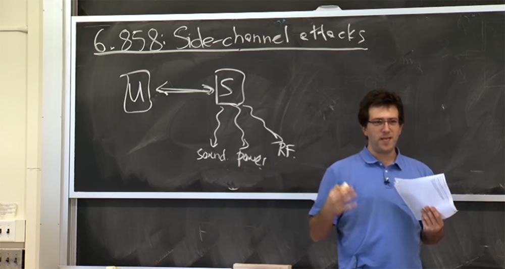

Примером побочного канала может служить звук, благодаря которому также возможны утечки информации. Например, люди слушают принтер и, основываясь на издаваемых им звуках, могут сказать, какие символы он печатает. Это особенно легко сделать для матричных принтеров с точечной печатью, которые во время печати издают очень надоедливые звуки.

И вообще, это то, о чём стоить подумать. На лекции в понедельник Кевин также упомянул некоторые интересные побочные каналы, которыми он занимается в своих исследованиях. Но мы собираемся рассмотреть конкретный побочный канал, который изучали Дэвид Брамли и Дэн Бонэ. В своей работе, опубликованной около 10 лет назад, они пишут, что смогли извлечь криптографический ключ веб-сервера Apache путем измерения тайминга разных ответов на различные входные пакеты враждебного клиента. В данном конкретном случае они «охотились» за криптографическим ключом. В действительности, многие атаки через побочный канал нацелены на криптографические ключи отчасти потому, что довольно сложно получить большое количество данных через такой канал. А криптографические ключи — это одна из ситуаций, когда на выходе получается небольшое количество бит, то есть во время атаки злоумышленники могут извлечь около 200 — 256 бит информации. Но основываясь только на этих 200 битах, они способны взломать криптографический ключ этого веб-сервера.

Если же вы пытаетесь просочиться в какую-то базу данных, полную номеров социального страхования, вам потребуется «слить» из неё очень много бит информации. Вот почему большинство атак через побочные каналы сосредотачиваются на получении небольших секретов, таких как криптографические ключи или пароли. Но в целом это применимо и ко многим другим ситуациям.

В материалах лекции описана ещё одна классная вещь — это то, что всё это можно проделать по сети. Вероятно, вы поняли, что им пришлось проделать много тщательной работы, чтобы уловить эти мельчайшие различия во временной информации. Каждый запрос, который они отправляли на сервер, отличался от другого запроса на 1-2 микросекунды, что является очень малым промежутком времени. Поэтому вы должны быть очень осторожны, так как наши сети не позволяют уловить такую временную разницу и определить, что сервер обрабатывал ваш запрос на 1-2 микросекунды дольше, чем был должен.

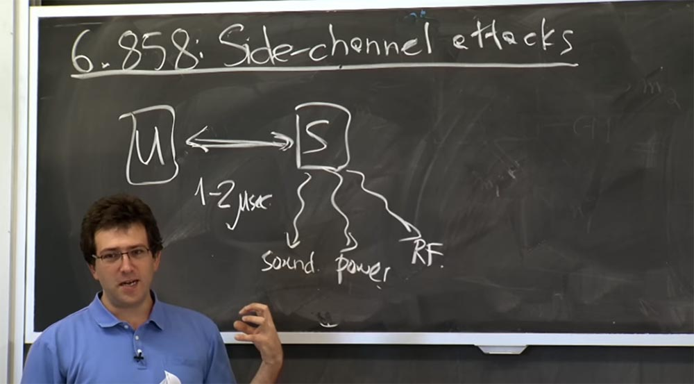

В результате было не ясно, можно ли организовать подобную атаку в очень «зашумленной» сети, так как полезная информация должна быть отделена от уровня шумов. Эти ребята были одними из первых, кто показал, что вы действительно можете проделать подобное по сети Ethernet с сервером на одном конце сети и клиентом на другом конце. Они доказали, что действительно можно измерить эти различия частично путем усреднения, частично с помощью других трюков.  
План остальной части этой лекции таков – сначала мы погрузимся в детали криптографического алгоритма с открытым ключом RSA, который использовали эти ребята. Мы не будем оценивать его с точки зрения безопасности, а будем смотреть, как это реализуется, потому что именно реализация алгоритма является критичной для использования побочного канала.

Брамли и Бонэ тщательно исследовали различные детали реализации, чтобы понять, в каких случаях некоторые вещи выполнялись быстрее или медленнее. Так что сначала мы должны узнать, как реализуется криптосистема RSA, а затем вернемся и выясним, как можно атаковать все эти структуры, имеющиеся в RSA.

Давайте начнем с рассмотрения RSA на высоком уровне. RSA – это довольно широко используемая криптосистема с открытым ключом. Мы упоминали этих парней пару недель назад, когда говорили о сертификатах. Теперь мы собираемся посмотреть, как это работает на самом деле.

Как правило, есть 3 вещи, о которых вам нужно побеспокоиться – это генерирование ключа, шифрование и расшифровка. В RSA способ создания ключа заключается в выборе 2 больших простых целых чисел, обозначим их p и q. В своей статье эти ребята пишут о p и q каждое размером по 512 бит. Обычно это называется 1024 битным RSA, потому что произведение этих простых чисел — это 1000-битное целое число. В наши дни, это, вероятно, не слишком хороший выбор для размера ключа RSA, потому что его взлом – относительно легкая задача для злоумышленников. Так что если 10 лет назад 1000 бит казались разумной величиной, сегодня при построении системы следует выбрать 2000, 3000 или даже 4000 битный ключ RSA. Так что размер ключа RSA означает размер этих простых чисел.

Затем, для удобства, мы поговорим о числе n, которое является просто произведением этих простых чисел n=pq, и это число называется модулем. Итак, теперь, когда мы знаем, как создать ключ, или, по крайней мере, часть ключа, нам придется выяснить, как зашифровывать и расшифровывать сообщения.

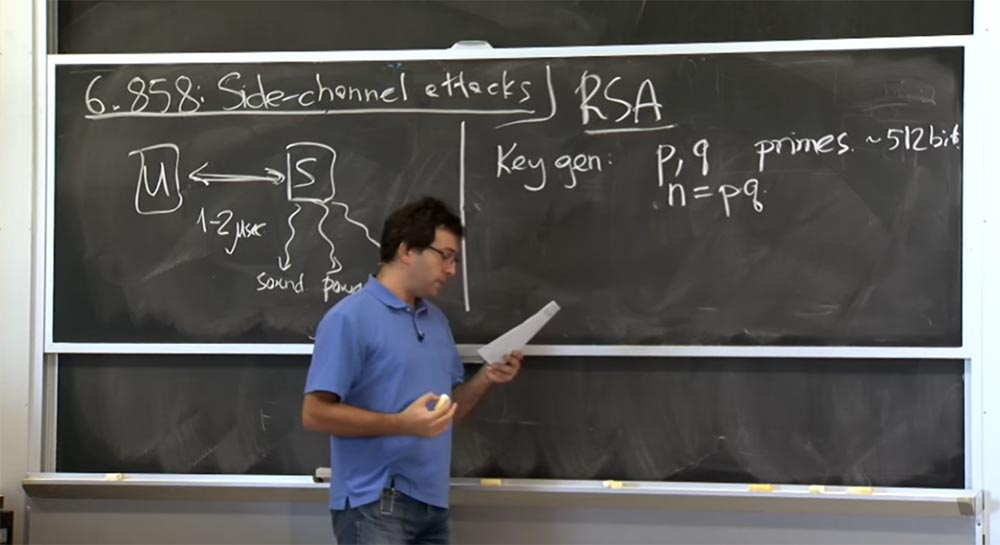

И то, как мы будем шифровать и расшифровывать сообщения, основано на возведении в степень чисел по модулю n. Это кажется немного странным, но мы разберёмся с этим через секунду. Так что если вы хотите зашифровать сообщение m, вы должны преобразовать его в me по mod n. Величина e – это степень, через секунду мы выясним, как её выбирать. Вот таким образом мы собираемся зашифровать сообщение.

То есть мы просто возьмем это сообщение как целое число и возведем его в степень. Через секунду мы посмотрим, почему это работает, а пока что обозначим всё это зашифрованное сообщение литерой С.

Затем, чтобы расшифровать его, мы должны найти другую интересную экспоненту d, которая позволяет взять зашифрованное сообщение C, возвести его в степень d по модулю n и в результате волшебным образом получить расшифрованное сообщение m.

Итак, общий принцип заключается в использовании одной экспоненты для шифрования сообщения и другой экспоненты для его расшифровки.

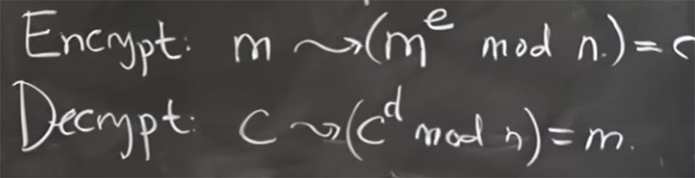

В целом, кажется, немного трудно понять, как мы собираемся придумать эти два магических числа, которые каким-то образом возвращают нам первоначальное сообщение. Но если вы посмотрите, как работает возведение в степень или умножение по модулю этого числа n, то всё поймёте.

Если взять Х и возвести его в степень, равную функции φ от n, то это будет равно 1 по модулю n:

X φ(n) = 1 mod n

Эта функция «фи» для нашего конкретного выбора n довольно проста, она равна φ = (p-1)(q-1).  
Тогда произведение открытой экспоненты е, которое больше 1, но меньше φ(n), на секретную экспоненту d, будет равно:

ed = ɑφ(n) +1, где ɑ — некая константа.

Таким образом, удаётся правильно расшифровать сообщение, так как существует достаточно простой алгоритм, если вы знаете значение φ(n) для того, чтобы вычислить d с учетом e или e с учетом d.

**Аудитория:** разве 1 по модулю n не равна 1?

**Профессор:** да, я здесь допустил неточность, равенство должно выглядеть так:

X φ(n) mod n = 1 mod n, то есть величина Х в степени функции «фи» от n по модулю n равна единице по модулю n.

В основном это означает, что для RSA мы должны выбрать некоторое значение е, которое будет нашим значением шифрования. Затем из e мы собираемся сгенерировать d на основе формулы d.e = 1 mod φ(n), отсюда d = 1/e mod φ(n).

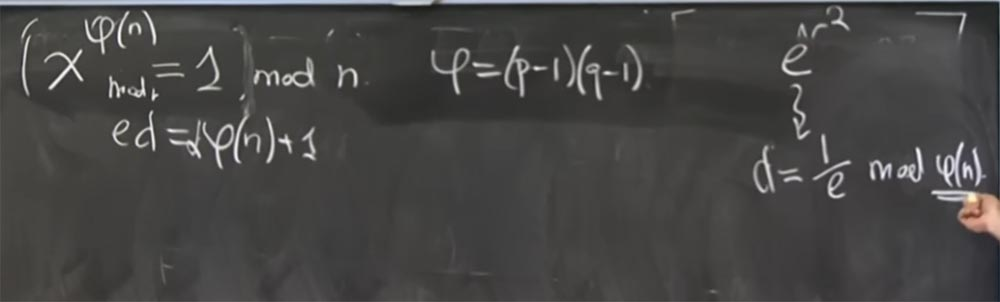

Есть некоторые Эвклидовы алгоритмы, которые вы можете эффективно использовать для этого вычисления. Но для того, чтобы сделать это, вы должны знать эту φ(n), которая требует факторизации, то есть разложения нашего числа n на множители p и q.

Итак, RSA является системой, где открытый ключ — это пара: экспонента шифрования е и число n, а пара d и n – это закрытый ключ, который держится в секрете. Так что любой может возвести сообщение в степень, чтобы зашифровать его для вас. Но только вы знаете это значение d и поэтому сможете расшифровать сообщение. И до тех пор, пока вы не знаете факторизацию этих множителей P и Q, или N, равное произведению P и Q, вы не знаете, что собой представляет φ = (p-1)(q-1).

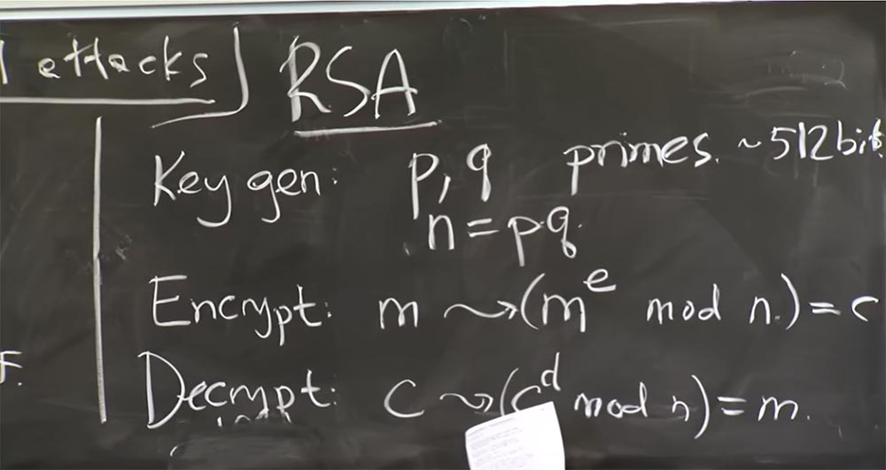

В результате вычислить это значение d — достаточно трудная задача. Вот что в общих чертах представляет собой алгоритм RSA на высоком уровне.

Теперь, когда мы ознакомились с принципами RSA, я хочу остановиться на 2-х вещах. Есть хитрости, как правильно его использовать и есть подводные камни, возникающие при его использовании. Существуют множество способов, как реализовать код для этого возведения в степень и делать это эффективно. Это довольно незаурядная задача, потому мы имеем дело 1000-битными целыми числами, для которых нельзя просто выполнить инструкцию умножения. Вероятно, потребуется много времени, чтобы сделать эти операции.

Поэтому первое, что я хочу упомянуть, — это различные подводные камни RSA. Один из них — это мультипликативность. Предположим, у нас есть 2 сообщения: m0 и m1. Я зашифрую их, превратив m0 в m0e mod n, а m1 в m1e mod n. Возможной проблемой, вернее, не обязательно проблемой, но неприятным сюрпризом для того, кто использует RSA, будет то, что очень легко произвести шифрование произведения m0 на m1, потому что вы просто умножаете эти 2 цифры: m0e mod n * m1e mod n.

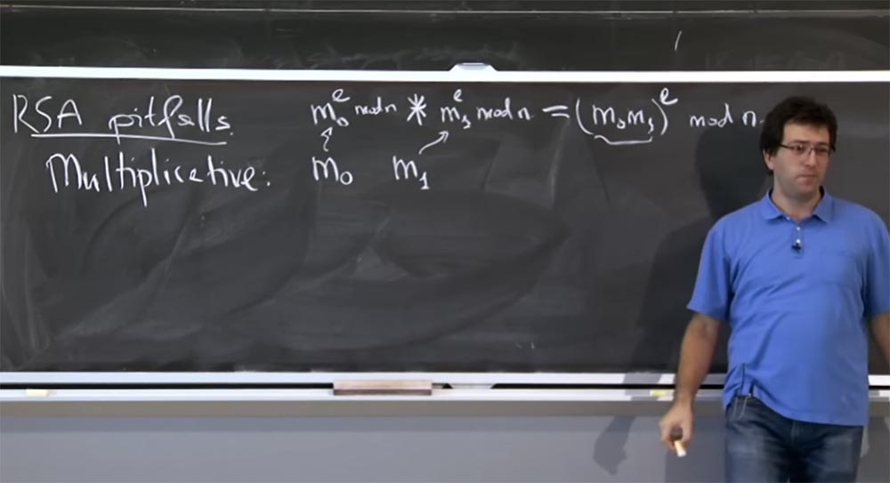

Если вы их умножите, то в результате получите произведение (m0m1)e по модулю n. Это корректное шифрование при упрощенном использовании RSA для значения m0m1. На данный момент это не большая проблема, потому что вы просто можете создать это зашифрованное сообщение, но не в состоянии его расшифровать. Однако существует возможность, что общая система позволит вам расшифровать определенные сообщения. То есть если она позволяет вам расшифровать созданное вами сообщение, то возможно, следуя обратным путём, вы сможете узнать, что собой представляют эти сообщения m0 и m1.

Данный факт не стоит игнорировать, так как он влияет на ряд протоколов, использующих RSA. Существует одно свойство, которым мы воспользуемся в качестве защитного механизма в конце нашей лекции.

Второй подводный камень, или свойство RSA, на которое стоит обратить внимание – это детерминированность, или определяемость. В описанной ранее элементарной реализации, если вы берете сообщение m и шифруете его, превращая в me mod n, то это детерминированная функция сообщения. Поэтому, если вы зашифруете его снова, вы получите точно такое же шифрование.

Это не желательное свойство, потому что, если я вижу, что вы посылаете какое-то сообщение, зашифрованное с помощью RSA, и хочу знать, что это такое, мне может быть трудно его расшифровать. Но я могу попробовать разные вещи, в результате которых я вижу, что вы посылаете это сообщение.

Тогда я зашифрую его и посмотрю, получите ли вы тот же зашифрованный текст. И если это так, то я узнаю, что вы зашифровали. Потому что все, что мне нужно для шифрования сообщения — это общедоступный открытый ключ, который представляет собой пару чисел (n,e).

Так что это не так уж и здорово, и вам, возможно, придётся быть внимательным с этим свойством при использовании RSA. Таким образом, примитивы такого рода достаточно трудно непосредственно использовать.

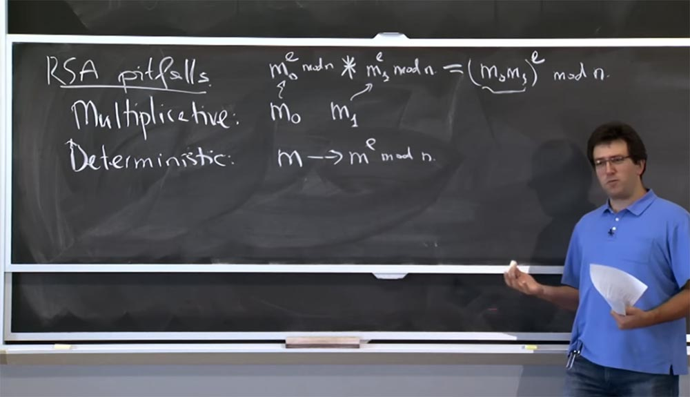

На практике, чтобы избежать подобных проблем с RSA, люди перед шифрованием кодируют сообщение определенным образом. Вместо того, чтобы напрямую возводить в степень сообщение, они берут какую-то функцию сообщения и возводят её в степень по модулю n:

(f(m))e mod n.

Эта функция f, обычно используемая в наши дни, называется OAEP — Оптимальным Ассиметричным Шифрованием с Дополнением. Это нечто закодированное, обладающее двумя интересными свойствами.

Во-первых, оно привносит случайность. Вы можете думать о f(m) как о генерации 1000-битного сообщения, которое вы собираетесь зашифровать. Частью этого сообщения будет ваше сообщение m здесь, в середине этого прямоугольника. Конечно, вы сможете получить его обратно при расшифровке. Итак, есть 2 интересные вещи, которые вы хотите сделать: справа вы размещаете некую случайность, значение r. Оно даёт то, что если вы зашифруете сообщение несколько раз, то каждый раз будете получать разные результаты, так что шифрование больше не будет детерминировано.

Для того, чтобы превозмочь это мультипликативное свойство и другие виды проблем, слева вы располагаете некое дополнение pad, которое представляет собой последовательность типа 1 0 1 0 1 0. Можно выбрать последовательность и получше, но грубо говоря, это какая-то предсказуемая последовательность, которую вы вставляете сюда и всякий раз, когда вы расшифровываете сообщение, вы убеждаетесь, что эта последовательность все еще там. Мультипликативность уничтожит эти биты pad, и тогда вам будет ясно, что кто-то испортил ваше сообщение и отбросил его. Если же эти биты остаются на месте, это доказывает, что никто не подделал ваше сообщение и вы в состоянии принять его, так как оно было правильно кем-то зашифровано.

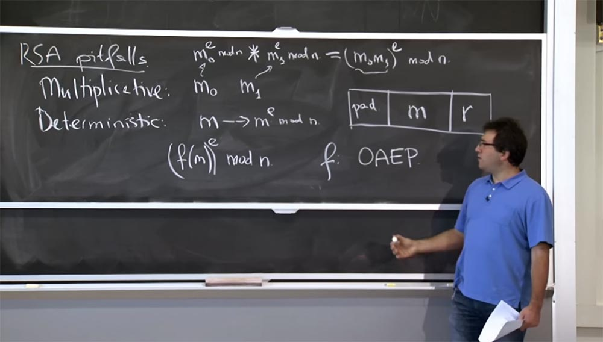

**Аудитория:** если злоумышленник знает, насколько велико значение pad, не может ли он установить 1 в самый низ последовательности, а затем мультиплицировать это значение?

**Профессор:** да, возможно. Это немного сложно, потому что эта случайность r будет распространяться далее. Так что конкретная конструкция этого OAEP немного сложнее того, что я изобразил. Но представьте, что это целочисленное, а не битовое умножение, случайность распространяется далее, поэтому вы сможете создать такую схему OAEP, в которой подобное не будет происходить.

Получается, что вы не должны использовать эту математику RSA напрямую, на практике вы должны использовать некую библиотеку, которая реализует для вас все эти вещи правильным образом, и применять её как параметр шифрования и дешифрования.

Однако рассмотренные выше детали будут иметь для нас значение, так как мы на самом деле пытаемся выяснить, как сломать или как атаковать существующую реализацию RSA.

В частности, атака, описанная в лекционной статье, будет использовать тот факт, что сервер собирается проверить это дополнение pading, когда он получит сообщение. Так вот как мы собираемся рассмотреть время, которое потребуется серверу для расшифровки. Мы собираемся отправить тщательно построенное сообщение, но оно не создано из реального сообщения m и его шифрования. Мы собираемся создать тщательное зашифрованное целочисленное значение.

Сервер попытается его расшифровать и получит некую несуразность, с которой с высокой долей вероятности не будет сопрягаться дополнение pad, и сервер сразу же отклонит это сообщение. Это именно то, что нам требуется, потому что таким образом сервер точно скажет нам, сколько времени ему потребовалось, чтобы добраться до этой точки: расшифровать RSA, получить это сообщение, проверить дополнение и отклонить его. Вот что мы будем измерять в этой атаке, описанной в лекционном материале. В этом сообщении имеется некий целостный компонент, который позволит нам определить время дешифровки.

Итак, теперь давайте поговорим о том, как нам реализовать RSA. Суть реализации заключается в возведении в степень, что довольно нетривиально, как я упоминал ранее, потому что все это очень большие целые числа. Само сообщение, по крайней мере, в этой статье, представляет собой 1000 разрядное целое число. И сама экспонента e также будет иметь довольно большое значение.

По крайней мере, экспонента шифрования хорошо известна. Но лучше, чтобы экспонента расшифровки была большим числом также порядка 1000 бит. Так что у вас есть 1000-битное целое число, которое вы хотите возвести в 1000 битную целую степень по модулю ещё одного 1000 битного целого числа n, что будет довольно трудоёмко. Поэтому практически в каждой реализации RSA предусмотрена оптимизация, позволяющая сделать этот процесс немного быстрее.  
Есть 4 основных оптимизации, которые имеют значение для этой атаки. На самом деле их больше, но самыми важными являются следующие. Первая называется китайской теоремой об остатках, или CRT. Просто вспомните её из курса средней или высшей школы. Она утверждает следующее. Предположим, что у вас есть два числа, у вас имеется некоторое значение Х, и вы знаете, что \[Х = a1\] mod p и одновременно \[Х = a2\] mod q, где р и q – простые числа, и это модульное равенство применимо ко всему уравнению.

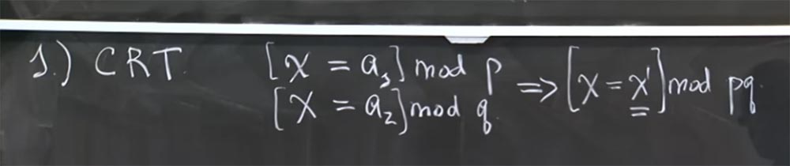

Выясняется, что у этой системы уравнений есть уникальное решение \[Х = Х1\] mod pq. Существует такая уникальная величина Х1, которую на самом деле можно очень эффективно вычислить. Китайская теорема об остатках снабжена алгоритмом вычисления этого уникального простого числа Х1, которое равно Х mod pq при значениях соответственно a1 и a2 mod p и q.

Хорошо, так как можно использовать эту китайскую теорему об остатках для ускорения модульного возведение в степень? Нам поможет то, что если вы заметили, мы делаем вычисление некоторой связки вещей по модулю n, который равен p умноженному на q.

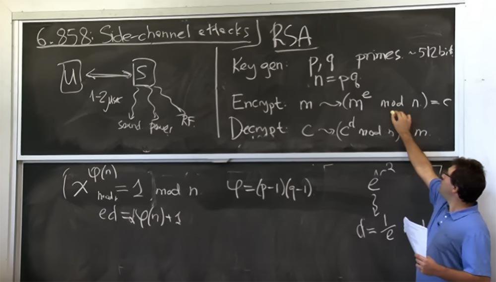

Китайская теорема об остатках говорит, что если вы хотите узнать значение mod pq, достаточно вычислить значение mod p и значение mod q. После этого китайская теорема об остатках используется для того, чтобы найти единственно верное решение того, что такое mod pq. Как вы думаете, почему это быстрее? Ведь похоже, что вы делаете одно и то же дважды, а это больше работы по рекомбинации?

**Аудитория:** вероятно, эти значения достаточны малы и позволяют провести вычисление быстрее?

**Профессор:** ну, они конечно меньше, но не настолько, чтобы это оказало существенное влияние. Итак, произведение p и q, или число n составляет около 1000 бит, p и q оба по 500 бит, но они всё ещё не похожи на размер машинного слова. Но это нам поможет, потому что большая часть того, что мы делаем в этих вычислениях — это умножение, и оно примерно равно квадрату тех вещей, которые вы умножаете. Вспомните метод умножения из курса высшей школы — вы берете все цифры одного числа и умножаете их на все остальные цифры в другом числе. Как следствие, умножение, возведение в степень на выходе выдаёт примерно квадратичный размер исходного числа. Так что если мы по существу идем от 1000 битов до 512 битов, то мы уменьшаем размер входных данных в 2 раза. Это означает, что все возведение в степень будет примерно в 4 раза проще. Так что если мы просчитаем эти выражения \[Х = a1\] mod p и \[Х = a2\] mod q дважды, мы ускорим процесс вычисления в 4 раза. Так что в итоге применение китайской теоремы об остатках даёт повышение производительности в 2 раза при выполнении любой операции RSA как при шифровании, так и при дешифровке.

Это первая оптимизация, которую использует большинство людей.

Вторая оптимизация основана на технике, которая носит название Sliding windows, «скользящие окна». Мы рассмотрим два этапа этой оптимизации. Сначала рассмотрим, с помощью каких основных операций выполняется это возведение в степень.

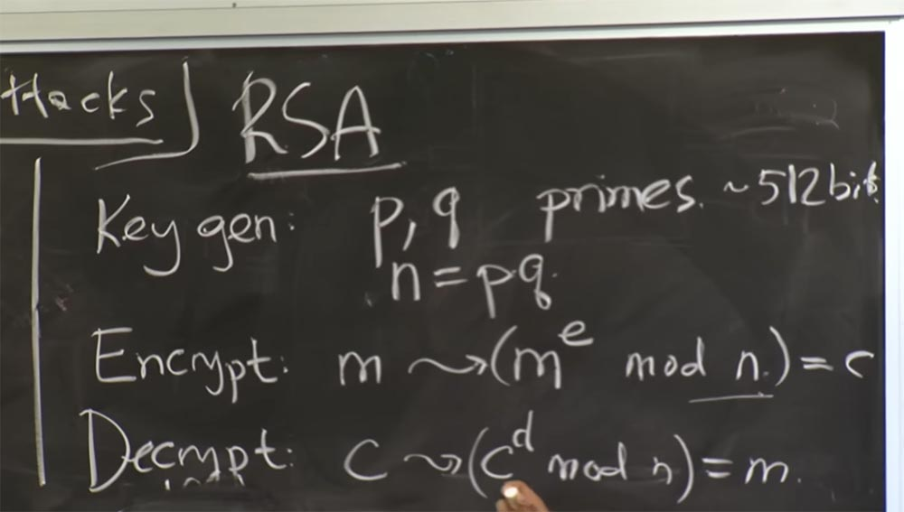

Предположим, у вас есть какой-то зашифрованный текст С, который теперь составляет 500 бит, потому что вы не делали mod p или mod q, и примерно такого же размера d. Так как же возвести c в степень d? Я думаю, что глупо просто взять c и перемножить её саму на себя d раз. Но экспонента d очень большая, около 500, так что это никогда не закончится. Более эффективный план состоит в том, чтобы сделать то, что называется повторением квадрирования. Это шаг, который нужно совершить перед «скользящими окнами». Технически повторение квадрирования выглядит так.

Если вы хотите вычислить c2x, то вы можете вычислить С в степени Х и затем возвести его в квадрат: (cx)2:

c2x = (cx)2

В нашем простом плане вычисление c2x потребовало бы от нас в два раза больше итераций умножения, потому что С умножается 2 раза, но гораздо умнее будет сначала вычислить cx, а позже возвести эту величину в квадрат. Так как это работает довольно хорошо, то мы можем использовать этот принцип и для другой экспоненты, например c2x+1:

c2x+1 = (cx)2 x с

Это и называется повторением квадрирования.

Этот приём позволяет нам вычислить эти степени, или модульные степени, во время, линейное в размере экспоненты. Таким образом, каждый бит экспоненты мы либо возводим в квадрат, либо возводим в квадрат, а затем умножаем. Таков план повторения квадрирования, позволяющий не тратить много времени на вычисление модульных экспонент.

В чём же заключается трюк со «скользящими окнами», о которых пишет лекционная статья? Он немного изощрённей, чем повторение квадрирования. В любом случае, возведение в квадрат является неизбежным, но оптимизация методом «скользящих окон» позволяет уменьшить накладные расходы умножения на это дополнительное значение с в конце формулы c2x+1 = (cx)2 x с.

Предположим, что у вас есть некоторое число, которое имеет несколько единичных бит в экспоненте, каждый единичный бит – бинарное представление, и вам придётся выполнить этот шаг c2x+1 вместо шага c2x, потому что для каждого нечетного числа вам придется умножить на c. Ребятам, чью статью мы обсуждаем, не хотелось производить это умножение на с слишком часто. Поэтому их план состоял в том, чтобы предварительно вычислять различные степени с.

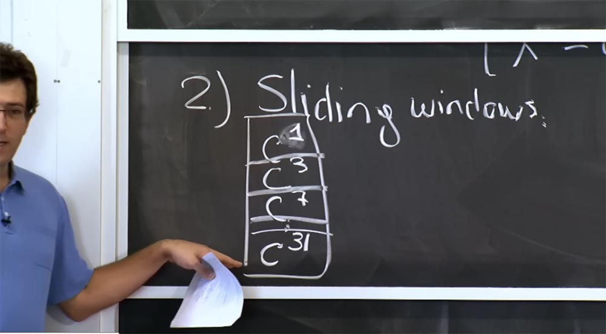

Они создали своего рода таблицу, где располагались такие значения:

с1  
с3  
с7  
…  
с31

Они предварительно подсчитали значения в каждом из слотов этой таблицы. Затем, когда вы захотите сделать возведение в степень, вместо повторения квадрирования с умножением всякий раз на с, вы будете использовать другую формулу.

Например, если у вас имеется выражение с32x+y, то сначала вы можете выполнить возведение с в квадрат 5 раз, чтобы получить с в 32-й степени, а затем умножить полученное значение на сy.

Причем значение с32 вы можете взять из этой таблицы. Таким образом, вы видите, что мы возводим в квадрат столько же раз, сколько и раньше, но при этом нам не нужно умножать на c столько раз. Вы просто «выуживаете» значение из таблицы и вместо нескольких умножений умножаете всего один раз.

29:00 мин

[Курс MIT «Безопасность компьютерных систем». Лекция 16: «Атаки через побочный канал», часть 2](https://habr.com/company/ua-hosting/blog/429392/)

Полная версия курса доступна [здесь](https://ocw.mit.edu/courses/electrical-engineering-and-computer-science/6-858-computer-systems-security-fall-2014/).

Спасибо, что остаётесь с нами. Вам нравятся наши статьи? Хотите видеть больше интересных материалов? Поддержите нас оформив заказ или порекомендовав знакомым, **30% скидка для пользователей Хабра на уникальный аналог entry-level серверов, который был придуман нами для Вас:** [Вся правда о VPS (KVM) E5-2650 v4 (6 Cores) 10GB DDR4 240GB SSD 1Gbps от $20 или как правильно делить сервер?](https://habr.com/company/ua-hosting/blog/347386/) (доступны варианты с RAID1 и RAID10, до 24 ядер и до 40GB DDR4).

**VPS (KVM) E5-2650 v4 (6 Cores) 10GB DDR4 240GB SSD 1Gbps до декабря бесплатно** при оплате на срок от полугода, заказать можно [тут](https://ua-hosting.company/vpsnl).

**Dell R730xd в 2 раза дешевле?** Только у нас **[2 х Intel Dodeca-Core Xeon E5-2650v4 128GB DDR4 6x480GB SSD 1Gbps 100 ТВ от $249](https://ua-hosting.company/serversnl) в Нидерландах и США!** Читайте о том [Как построить инфраструктуру корп. класса c применением серверов Dell R730xd Е5-2650 v4 стоимостью 9000 евро за копейки?](https://habr.com/company/ua-hosting/blog/329618/)