Курс MIT «Безопасность компьютерных систем». Лекция 16: «Атаки через побочный канал», часть 2 / Блог компании ua-hosting.company

### Массачусетский Технологический институт. Курс лекций #6.858. «Безопасность компьютерных систем». Николай Зельдович, Джеймс Микенс. 2014 год

Computer Systems Security — это курс о разработке и внедрении защищенных компьютерных систем. Лекции охватывают модели угроз, атаки, которые ставят под угрозу безопасность, и методы обеспечения безопасности на основе последних научных работ. Темы включают в себя безопасность операционной системы (ОС), возможности, управление потоками информации, языковую безопасность, сетевые протоколы, аппаратную защиту и безопасность в веб-приложениях.

Лекция 1: «Вступление: модели угроз» [Часть 1](https://habr.com/company/ua-hosting/blog/354874/) / [Часть 2](https://habr.com/company/ua-hosting/blog/354894/) / [Часть 3](https://habr.com/company/ua-hosting/blog/354896/)  
Лекция 2: «Контроль хакерских атак» [Часть 1](https://habr.com/company/ua-hosting/blog/414505/) / [Часть 2](https://habr.com/company/ua-hosting/blog/416047/) / [Часть 3](https://habr.com/company/ua-hosting/blog/416727/)  
Лекция 3: «Переполнение буфера: эксплойты и защита» [Часть 1](https://habr.com/company/ua-hosting/blog/416839/) / [Часть 2](https://habr.com/company/ua-hosting/blog/418093/) / [Часть 3](https://habr.com/company/ua-hosting/blog/418099/)  
Лекция 4: «Разделение привилегий» [Часть 1](https://habr.com/company/ua-hosting/blog/418195/) / [Часть 2](https://habr.com/company/ua-hosting/blog/418197/) / [Часть 3](https://habr.com/company/ua-hosting/blog/418211/)  
Лекция 5: «Откуда берутся ошибки систем безопасности» [Часть 1](https://habr.com/company/ua-hosting/blog/418213/) / [Часть 2](https://habr.com/company/ua-hosting/blog/418215/)  
Лекция 6: «Возможности» [Часть 1](https://habr.com/company/ua-hosting/blog/418217/) / [Часть 2](https://habr.com/company/ua-hosting/blog/418219/) / [Часть 3](https://habr.com/company/ua-hosting/blog/418221/)  
Лекция 7: «Песочница Native Client» [Часть 1](https://habr.com/company/ua-hosting/blog/418223/) / [Часть 2](https://habr.com/company/ua-hosting/blog/418225/) / [Часть 3](https://habr.com/company/ua-hosting/blog/418227/)  
Лекция 8: «Модель сетевой безопасности» [Часть 1](https://habr.com/company/ua-hosting/blog/418229/) / [Часть 2](https://habr.com/company/ua-hosting/blog/423155/) / [Часть 3](https://habr.com/company/ua-hosting/blog/423423/)  
Лекция 9: «Безопасность Web-приложений» [Часть 1](https://habr.com/company/ua-hosting/blog/424289/) / [Часть 2](https://habr.com/company/ua-hosting/blog/424295/) / [Часть 3](https://habr.com/company/ua-hosting/blog/424297/)  
Лекция 10: «Символьное выполнение» [Часть 1](https://habr.com/company/ua-hosting/blog/425557/) / [Часть 2](https://habr.com/company/ua-hosting/blog/425561/) / [Часть 3](https://habr.com/company/ua-hosting/blog/425559/)  
Лекция 11: «Язык программирования Ur/Web» [Часть 1](https://habr.com/company/ua-hosting/blog/425997/) / [Часть 2](https://habr.com/company/ua-hosting/blog/425999/) / [Часть 3](https://habr.com/company/ua-hosting/blog/426001/)  
Лекция 12: «Сетевая безопасность» [Часть 1](https://habr.com/company/ua-hosting/blog/426325/) / [Часть 2](https://habr.com/company/ua-hosting/blog/427087/) / [Часть 3](https://habr.com/company/ua-hosting/blog/427093/)  
Лекция 13: «Сетевые протоколы» [Часть 1](https://habr.com/company/ua-hosting/blog/427763/) / [Часть 2](https://habr.com/company/ua-hosting/blog/427771/) / [Часть 3](https://habr.com/company/ua-hosting/blog/427779/)  
Лекция 14: «SSL и HTTPS» [Часть 1](https://habr.com/company/ua-hosting/blog/427783/) / [Часть 2](https://habr.com/company/ua-hosting/blog/427785/) / [Часть 3](https://habr.com/company/ua-hosting/blog/427787/)  
Лекция 15: «Медицинское программное обеспечение» [Часть 1](https://habr.com/company/ua-hosting/blog/428652/) / [Часть 2](https://habr.com/company/ua-hosting/blog/428654/) / [Часть 3](https://habr.com/company/ua-hosting/blog/428656/)  
Лекция 16: «Атаки через побочный канал» [Часть 1](https://habr.com/company/ua-hosting/blog/429390/) / [Часть 2](https://habr.com/company/ua-hosting/blog/429392/) / [Часть 3](https://habr.com/company/ua-hosting/blog/429394/)

**Аудитория:** как в первую очередь определить x и y?

**Профессор:** для этого вы должны посмотреть на экспоненту в бинарном представлении. Предположим, я пытаюсь вычислить значение c1011010, степень может состоять и из большего числа бит. Если мы хотим сделать повторное квадрирование, то нужно посмотреть на самый низкий бит – здесь это 0.

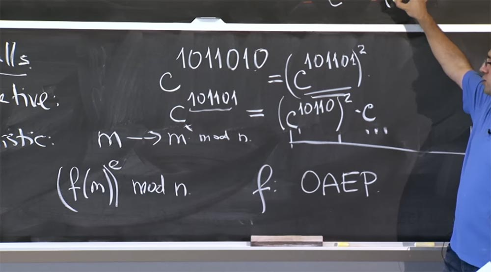

Таким образом, у нас получается равенство c1011010 = (c101101)2

Далее нам нужно вычислить c101101, здесь мы не можем использовать это правило, потому что это не 2x — это будет x плюс 1. Поэтому мы записываем такое равенство:

c101101 = (c10110)2 c, потому что этот префикс 101101 = 10110+1.

Поэтому мы умножаем квадрат на c, таким образом, мы используем его для повторного возведения в квадрат.

Для «скользящих окон» нам нужно захватить больше битов с нижнего конца. Если вы захотите сделать здесь трюк со «скользящим окном» вместо того, чтобы извлечь отсюда одну с, то с учётом этой огромной таблицы мы можем взять 3 бита за раз, уцепившись за с7. Если мы возьмём первые 3 бита степени, то получим c101101 = (c101)8 c101.

В этом случае у нас действительно остался одинаковый объём вычислений для (c101)8, но зато значение c101 вы можете посмотреть в таблице. А часть в виде (c101)8 говорит о том, что вы собираетесь использовать «скользящие окна», чтобы вычислить его значение.

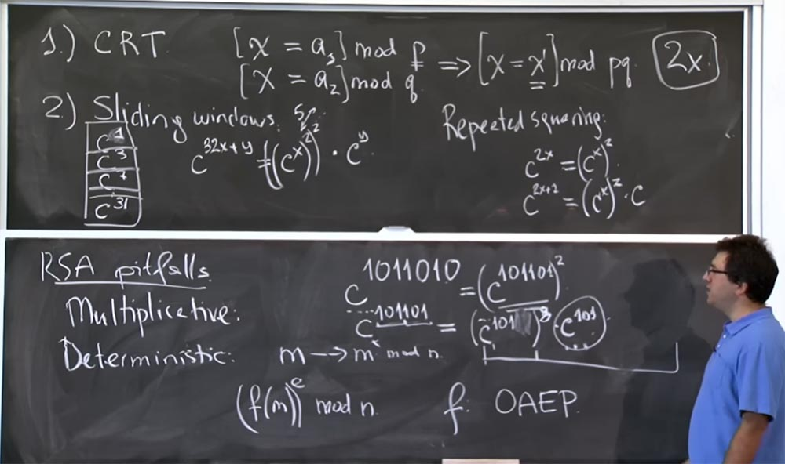

Это позволяет сэкономить кучу времени, так как даёт возможность использовать заранее умноженные значения. 10 лет назад считалось, что таблица значений до 32 степени является оптимальным планом с точки зрения эффективности вычислений, потому что здесь есть какой-то компромисс, верно? Вы тратите время на создание этой таблицы, но она не должна быть слишком велика, если вы не собираетесь часто использовать некоторые записи. Предположим, если вы создадите таблицу значений до c500 степени, но при этом не собираетесь использовать экспоненты со значением больше 128, то просто впустую потратите своё время.

**Аудитория:** есть ли причина не создавать такую гигантскую таблицу заранее? То есть вычислить значения ограниченного числа степеней, которыми можно обойтись при вычислениях?

**Профессор:** если вы не хотите производить объёмные вычисления заранее… ну, здесь есть две вещи. Одна заключается в том, что тогда у вас должен быть код, чтобы проверить, заполнена ли нужная запись в таблице или нет, и это, вероятно, уменьшит точность прогнозирования ветвей процессов ЦП. При этом, в общем случае процессор будет работать медленнее, потому что должен будет проверять, имеется ли нужная запись в таблице. Второй вещью, которая несколько раздражает, может стать утечка записей таблицы через различные побочные каналы, а именно через шаблоны доступа к кэшу. Так что если у вас запущен какой-то другой процесс на том же процессоре, можно просмотреть, какие адреса кэша удаляются из кэша или замедляются, потому что кто-то получил доступ к записи c3 или к записи c31. И чем больше становится эта таблица, тем легче определить, какие биты экспоненты используются при создании ключа RSA.

Эта гигантская таблица в состоянии сказать, какой адрес кэша был утрачен для процессора, то есть указывает на то, что процесс шифрования должен иметь доступ к этой записи в таблице. В свою очередь, это говорит вам, что данная последовательность бит появляется в экспоненте вашего секретного ключа. Поэтому я предполагаю, что математически вы можете заполнить данную таблицу настолько, насколько требуется, но практически вы не захотите, чтобы она получилась гигантского размера. К тому же вы не сможете эффективно пользоваться записями таблицы огромного размера. Гораздо полезнее использовать записи относительно небольшой таблицы повторно, например, для вычисления c7 можно использовать два раза значение c3 и так далее.

Итак, вот в чём заключается оптимизация RSA способами повторного квадрирования и «скользящего окна». Я не знаю, используют ли они по-прежнему такой размер «скользящих окон», но в любом случае это ускоряет процесс вычислений, потому что иначе вам пришлось бы возводить в квадрат каждый бит экспоненты и затем умножать на каждый бит. Поэтому, если у вас есть 500-битный показатель степени, то вам пришлось бы совершить 500 возведений в квадрат и примерно 256 умножений на c. Со «скользящими окнами» вам придётся по-прежнему совершить 512 возведений в квадрат, потому что избежать этого нельзя, но зато количество умножений на c уменьшится с 256 примерно до 32 за счёт использования записей из таблицы.

Таков общий план оптимизации, который ускоряет процесс вычислений примерно в полтора раза. Это достаточно простая оптимизация. Существует два умных приёма с числами, позволяющие сделать процесс умножения более эффективным.

Первый – это преобразование Монтгомери, через секунду мы увидим, почему это для нас особенно важно. Данная оптимизация пытается решить для нас проблему, которая состоит в том, что каждый раз, когда мы делаем умножение, мы получаем число, которое продолжает расти и расти по возрастающей. В частности, и в «скользящих окнах», и в повторном квадрировании вы фактически умножали 2 числа вместе, когда возводили с в степень y.

Проблема в том, что если входные данные cх и cy для умножения были размером, скажем, 512 бит каждый, то размер результата умножения составит 1000 бит. После этого вы берёте этот 1000-битный результат и снова умножаете его на что-то типа 512 бит, он становится размером в 1500, 2000, 2500 бит и всё растёт и растёт.

Однако вы этого не хотите, потому что умножение увеличивает порядок перемножаемых чисел. Из-за этого мы должны сохранить размер нашего числа как можно меньшим, в основном равным 512 бит, потому что все эти вычисления являются mod p или mod q.

Мы можем уменьшить это число, скажем, мы хотим вычислить (((cх)2)2)2. Что вы могли бы сделать, так это, к примеру, вычислить cх по модулю p, затем возвести это в квадрат снова по модулю р и ещё раз возвести в квадрат по модулю р. Этот способ относительно хорош, так как позволяет удержать размер нашего числа в пределах 512 бит, то есть так мало, как только мы можем получить. Это хорошо в смысле уменьшения размера чисел, которые нам нужно перемножать, но на самом деле операция с этим модулем р существенно «удорожает» вычисления.

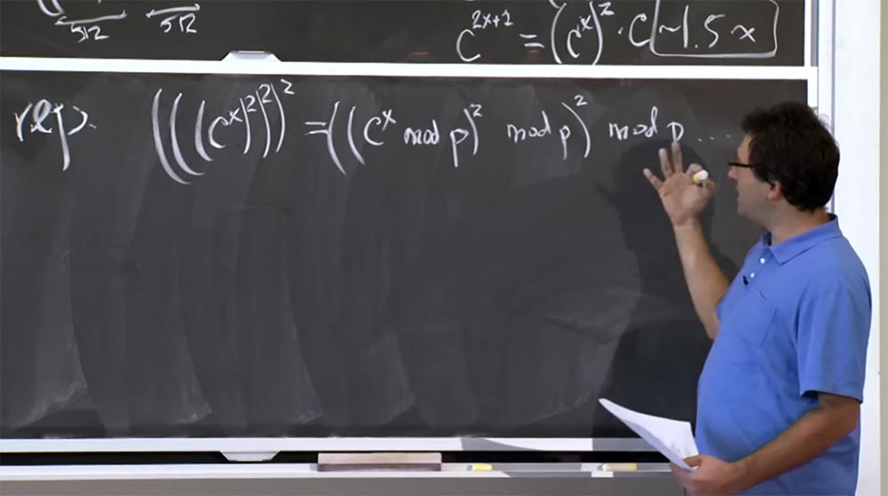

Потому что способ, которым вы получаете mod p, заключается в делении. А деление хуже, чем умножение. Я не буду перечислять алгоритмы для деления, но это очень медленно. Обычно вы стараетесь по возможности избегать операций деления, потому что это не простое программирование. Дело в том, что вам нужно использовать какие-то алгоритмы приближений, методы Ньютона и тому подобное, и всё это будет замедлять процесс вычислений.

Умножение намного выгодней, но использование операций по mod p или mod q, чтобы уменьшить размер чисел, обойдётся дороже, чем умножение. Я покажу вам способ, как этого можно избежать и как проделывать быстрые вычисления с помощью преобразования Монтгомери.

Основная идея состоит в том, чтобы представлять целые числа, которые вы собираетесь умножать, в виде преобразования Монтгомери. На самом деле это очень легко. Для этого мы просто умножаем наше число а на некую волшебную величину R. Через секунду я расскажу, что она собой представляет. Но давайте сначала выясним, что здесь происходит, когда мы выбираем произвольное значение R.

Итак, мы берём 2 числа, а и b, и преобразуем их в представление Монтгомери, умножая каждое на R. Тогда произведение а и b в преобразовании Монтгомери будет выглядеть так:

ab &lt;-&gt; (aR)(bR)/R =abR

То есть вы умножаете aR на bR и получаете произведение ab на R в квадрате. Теперь у нас есть два R, это немного раздражает, но вы можете разделить это на R. В результате мы получим произведение ab на R. Немного непонятно, зачем нам понадобилось умножать лишний раз на это число. Давайте сначала выясним, правильно ли это, и тогда мы поймём, почему это будет быстрее.  
Это правильно в том смысле, что это очень легко. Если вы хотите перемножить некоторые числа, то их нужно умножить на это значение R и получить преобразование Монтгомери. Каждый раз, когда мы перемножаем эти 2 числа, мы должны разделить их на R, а затем посмотреть на результирующую форму преобразования вида abR. Потом, когда мы закончим возведение в квадрат, умножение и все эти вещи, мы вернёмся к нормальной, обычной форме результата, просто разделив на R в последний раз.

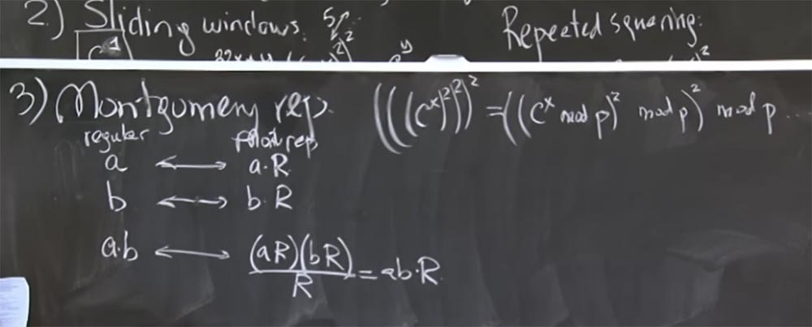

Теперь рассмотрим, как выбрать самое подходящее число для R, чтобы сделать деление на R очень быстрой операцией. И самое классное здесь то, что если деление на R будет очень быстрым, когда это будет небольшое число, и нам не придется делать этот mod q слишком часто. В частности, aR, скажем так, также будет иметь размер примерно 500 бит, потому что все это на самом деле mod p или mod q. Таким образом, aR составляет 500 бит, bR тоже будет 500 бит, так что произведение (aR)(bR) составит 1000 бит. R тоже будет представлять собой удобное 500-битное число, размером с p. И если мы сможем сделать операцию деления достаточно быстрой, то результат ab тоже будет примерно 500-битным числом, так что мы сможем произвести умножение без необходимости делать дополнительное деление. Деление на R намного выгоднее и дает нам результат небольшого размера, что позволяет избежать использования mod p в большинстве ситуаций.

Итак, что же это за странное число R, о котором я все время говорю? Оно имеет значение 2 в 512 степени:

R = 2512

Это будет 1 и куча нулей, поэтому умножать на такое число легко, потому что достаточно будет просто добавить в результат кучу нулей. Деление также может быть простым, если младшие биты результата равны нулю. Так что если у вас есть значение из кучи битов в сопровождении 512 нулей, то его деление на 2 в 512 степени будет очень простым — вы просто отбрасываете нули с правой стороны, и это совершенно корректная операция деления.

Небольшая проблема состоит в том, что у нас на самом деле нет нулей с правой стороны, когда вы делаете это умножение. У нас реальные 512-битные числа, использующие все 512 бит.

Произведение (aR) на (bR) тоже реальное число порядка 1000 бит, поэтому мы не можем просто так отбрасывать младшие биты. Но разумный подход базируется на том факте, что единственное, что нас заботит — это значение mod p. Таким образом, вы всегда можете добавить несколько p к этому значению, не изменяя его эквивалент mod p. В результате мы можем добавить кратные p значения для того, чтобы все младшие биты стали нулями. Давайте рассмотрим несколько простых примеров. Я не собираюсь выписывать 512 бит на доске, а приведу лишь короткий пример.

Предположим, что в нашей ситуации R = 24 = 10000\. Это намного меньший размер, чем встречается в реальности. Давайте посмотрим, как будет работать это преобразование Монтгомери. Попытаемся вычислить mod q, где q =7. В двоичной форме q =7 это (111).

Предположим далее, что мы произвели некоторое перемножение (aR)(bR), и в двоичном представлении результат равен 11010, то есть это и будет значение произведения (aR)(bR). Как же мы разделим его на R?

Очевидно, что не все четыре младших бита нули, поэтому мы не можем просто разделить их, но мы можем добавить величины, кратные q. В частности, мы можем добавить 2 раза по q, при этом 2q = 1110 в двоичном представлении. В результате сложения мы получаем 101000, надеюсь, я всё сделал правильно.

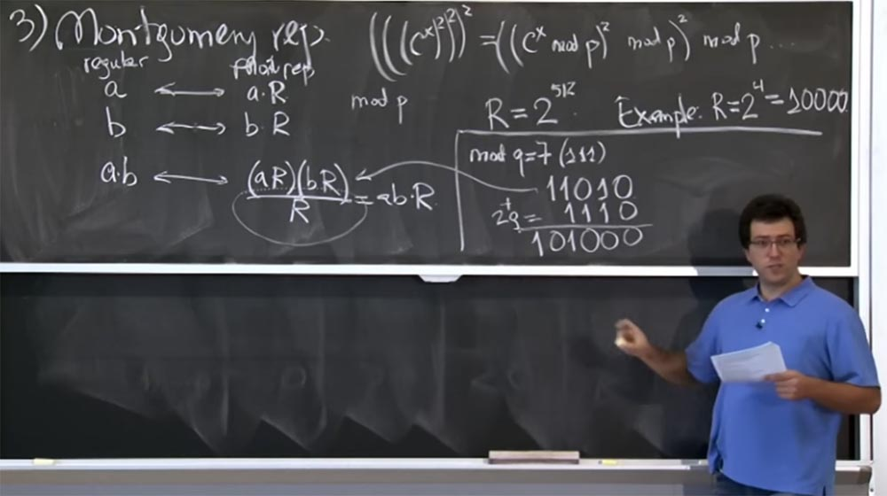

Так мы получили сумму (aR)(bR) + 2q. На самом деле нас не волнует + 2q, потому что все, что нас волнует, это значение mod q. Сейчас мы ближе к цели, потому что у нас справа имеется три нуля. Теперь мы можем добавить еще несколько q. Допустим, на этот раз это будет 8q, что составит 111000. Снова сложим наши строки и получим 1100000. Сейчас у нас имеется исходный (aR)(bR) + 2q + 8q = 1100000. Наконец-то мы можем очень легко разделить эту вещь на R, просто отбросив четыре низких нуля.

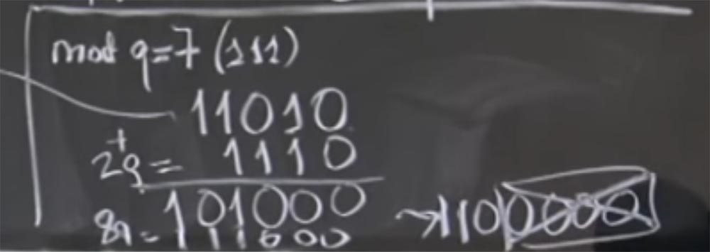

**Аудитория:** произведение (aR)(bR) всегда будет заканчиваться 1024 нулями?

**Профессор:** нет, и я объясню, в чем может быть путаница. Скажем, число а составляет 512 бит, мы умножили его на R и получили 1000-битное число. В этом случае вы правы, aR – число, в котором высокие биты — это а, а низкие биты — это все нули. Но затем мы выполняем mod q, чтобы сделать его меньше. Поэтому размер 1024 бит в общем случае является случайностью, так как это число имеет эти низкие нули только при первом преобразовании, но после того, как вы проделаете несколько умножений, оно будет представлять собой произвольные биты.

Чтобы не вводить вас в заблуждение, я должен был написать mod q здесь после aR и после bR – вот я его дописываю — и вычислить этот mod q, как только вы сделаете преобразование, чтобы уменьшить значение.

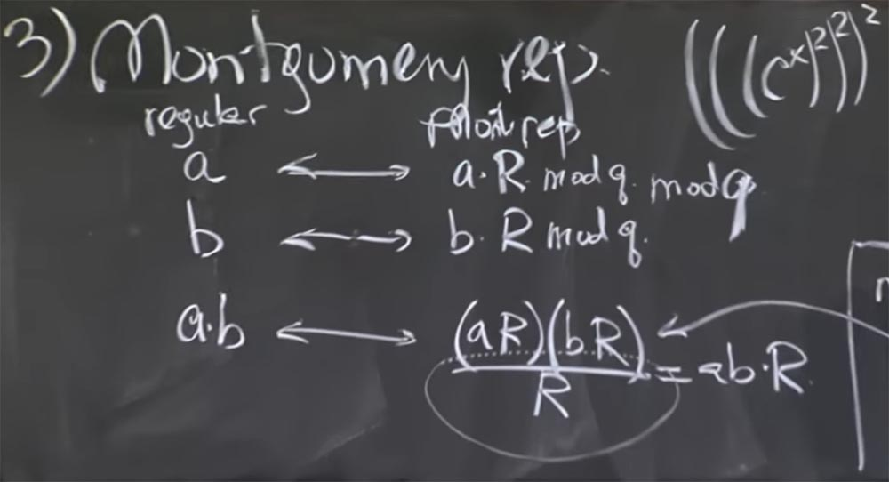

Первоначальное преобразование довольно трудоёмко, или, по крайней мере, так же затратно, как и обычное модулирование при умножении. Круто то, что вы платите эту цену один раз, когда выполняете преобразование Монтгомери, а затем, вместо того, чтобы преобразовывать его обратно на каждом шагу вычислений, вы просто держите его в форме представления Монтгомери.  
Помните, что для возведения в степень, которая имеет 512 бит, вам придётся сделать более 500 умножений, потому что мы должны сделать по крайней мере 500 возведений в квадрат и ещё некоторые действия. Таким образом, вы дважды делаете mod q и затем получаете множество простых операций деления, если остаётесь в этой форме представления чисел. И в конце вы выполняете деление на R, чтобы вернуться к этой форме ab.

Итак, вместо того, чтобы делать 500 раз mod q для каждого шага умножения, вы проделываете mod q дважды и потом продолжаете делать эти деления на R с минимальными затратами.  
Аудитория: когда вы добавляете кратные q, а затем делите на R, у нас образуется остаток?  
Профессор: на самом деле mod q означает остаток, когда вы делите на q. Проще говоря, x + yq mod q = x. В данном случае имеется ещё одно полезное свойство – это то, что все модули являются простыми числами. Это так же верно, как то, что если у вас есть (x + yq/R) mod q, то оно равно x/R mod q.

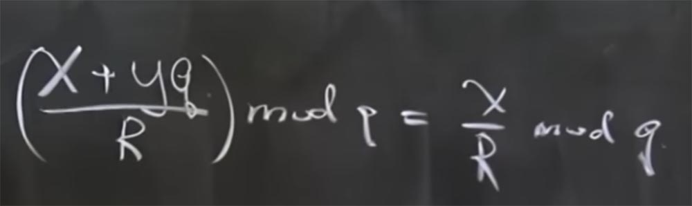

Основание для того, чтобы так считать, состоит в том, что в модульной арифметике нет настоящих операций деления, это просто инвертирование. В действительности это означает, что если у нас есть (x + yq) умноженное на инвертированное R, вычисленное по mod q, то оно равно сумме двух произведений: произведения х на инвертированное R по mod q и произведения yq на инвертированное R по mod q. Причём последнее слагаемое сокращается, потому что это нечто, умноженное на q.

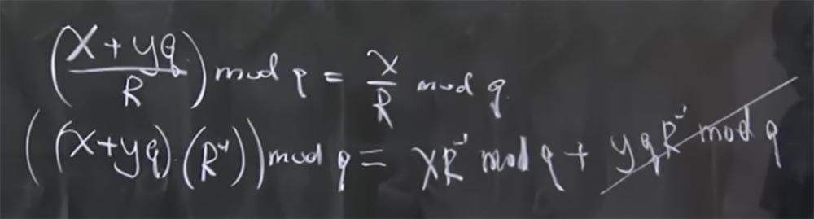

Для таких вещей, как суммирование 2q, 8q и так далее имеется формула, которая ускоряет процесс вычислений. Я делал это постепенно, сначала вычислил 2q, затем 8q и так далее, но в материалах лекции имеется завершённая формула, которой можно воспользоваться, я просто не хочу тратить время, записывая её на доске. Она позволяет вычислить, какое кратное q значение, которое вы должны добавить, чтобы все младшие биты превратились в 0. Тогда получается, что для того, чтобы сделать деление на R, вам просто нужно вычислить это волшебство кратное q, добавить его, затем отбросить низкие нулевые биты, и это возвратит ваше число к 512 битам независимо от того, какой размер результата вы получили.

Но тут есть одна тонкость. Единственная причина, по которой мы говорим об этом, заключается в чём-то забавном, происходящем здесь, что позволяет нам узнать информацию о таймингах. В частности, хотя мы и разделили на R, мы всё равно знаем, что результат будет порядка 512 бит. Но это все еще может быть больше чем q, потому что q не 512-битное число, оно может быть немного меньше, чем R.

Так что может быть, что после того, как мы делаем это выгодное деление на R, нам может понадобиться вычесть q еще раз, потому что мы получаем что-то маленькое, но всё ещё не достаточно маленькое. Так что есть шанс, что после этого деления нам, возможно, придется снова вычесть q. И это вычитание может использоваться как часть атаки, потому что операция вычитания добавляет время вычисления.

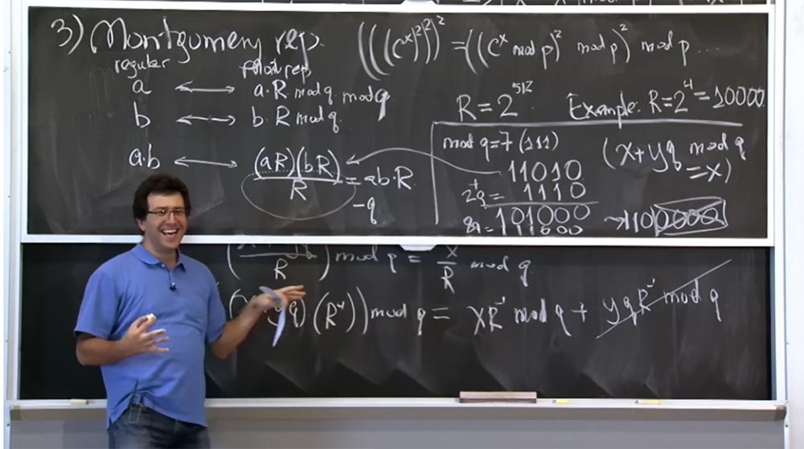

И кто-то выяснил — не эти ребята, а кто-то в предыдущей работе — что существует вероятность сделать нечто, называемое extra reduction, или дополнительное сокращение. Эта вероятность зависит от определенного значения, которое возводится в степень. Так, если вы вычисляете xd mod q, вероятность дополнительного сокращения в какой-то момент времени вычисления этой величины будет равняться x mod q, делённому на 2R. Я отделю это выражение чертой от остальных вычислений.

В зависимости от того, будет ли значение x mod q большим или маленьким, у вас будет больше или меньше этих дополнительных сокращений. И всё это происходит на этапе расшифровки, потому что при расшифровке сервер будет вычислять cd.

Это говорит о том, что extra reduction будет пропорционально тому, как близко X или, в данном случае, с, к значению q.

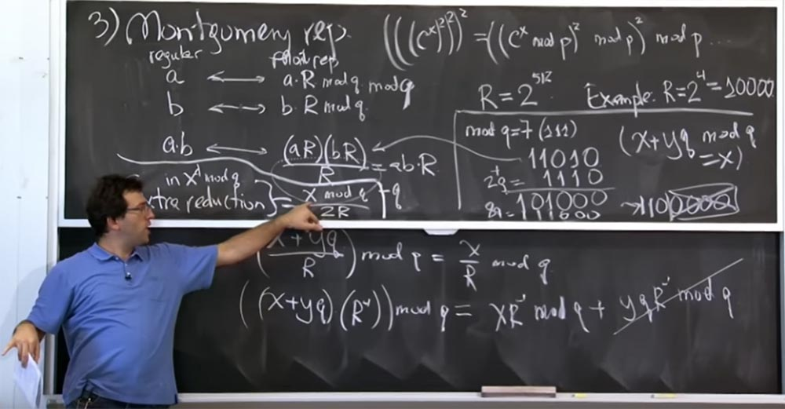

Это опасно, потому что злоумышленник должен выбрать входные данные c, и число extra reduction будет пропорционально тому, насколько близко c к одному из факторов — q. Это так, будто бы вы можете сказать, приблизились ли вы к значению q или промахнулись. При этом внезапно возникает ситуация, когда нет никаких extra reduction, вероятно, потому, что X mod q очень маленькое, и Х= q + έ, и это очень маленькое значение. Вот в чём состоит часть атаки способом определения таймингов, о которой мы поговорим через секунду. У меня нет доказательств, что это действительно так, но, во всяком случае, это дополнительные сокращения extra reduction работают именно так.

**Аудитория:** что произойдет, если вы не сделаете этого дополнительного сокращения?

**Профессор:** что произойдет, если вы не сделаете этого extra reduction? Вы можете его избежать, но тогда, вероятно, вам понадобиться сделать некоторые дополнительные модульные сокращения позже. Я думаю, что в данном случае математика просто хорошо работает таким образом для формы Монтгомери. Конечно, если смотреть на это с точки зрения возможности атаки через побочный канал с использованием таймингов, то вы можете решить вообще не делать extra reduction, и, возможно, вам стоит придумать другой план. Так что в некоторых случаях вы правы, этого можно не делать. Вероятно, можно избежать этого дополнительного сокращения, если просто в конце сделать mod q. В действительности я не пробовал это реализовать, но, похоже, оно может сработать. Может быть, вам просто нужно будет сделать mod q один раз, и вероятно, вам придётся сделать в любом случае.

В целом, это не очень понятно. Возможно, вам придётся придумать что-то ещё, не слишком заумное. Вообще — то я не могу выступать авторитетом в этом вопросе, потому что лично не пытался это реализовать. Вероятно, есть какая-то глубокая причина, почему это extra reduction должно выполняться.

Итак, вот последний кусочек головоломки. Он показывает, как библиотека OpenSSL, которая упомянута в рассматриваемой нами статье, реализует умножение. Таким образом, этот способ Монтгомери отлично подходит для предотвращения вычисления части mod q во время модульного умножения. Но тогда возникает вопрос, как вы на самом деле умножаете вместе два числа, чтобы спускаться на всё более низкий уровень.

Предположим, у вас есть некое умножение, это даже не модульное умножение, просто у вас есть два числа, a и b. И они оба — 512-битные числа. Как вы сможете их перемножить, есть у вас всего лишь 32-х битный компьютер, как у этих парней из статьи, или даже современная 64-х битная машина? Как бы вы реализовали умножение этих величин?

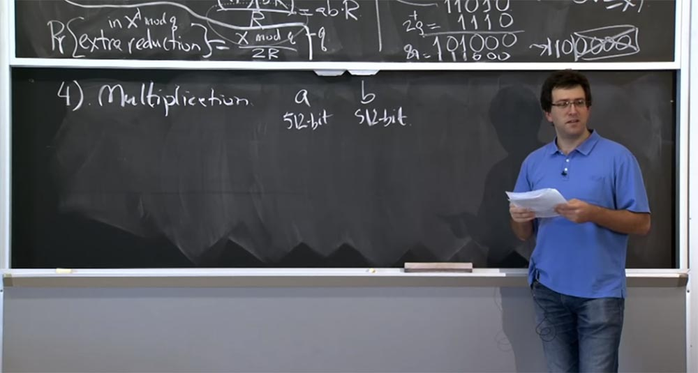

Есть какие-то соображения по этому поводу? Я думаю, это был не сложный вопрос, вы просто представляете a и b как последовательность машинных слов и делаете из этих двух величин некий квадратичный продукт.

Давайте рассмотрим более простой пример, представим, что это не 512 битные числа, а всего лишь 64-х битные, и мы проводим вычисления на 32-битной машине. При этом значение a будет представлено двумя разными вещами: a1 и a0, где a0 представляет собой низкий бит, а a1 — высокий бит. Аналогично мы представим и число b – оно будет состоять из b1 и b0.

В элементарном представлении произведение ab будет выглядеть как структура из 3-х ячеек: в первой будет произведение высоких битов a1 b1, в третьей ячейке будет произведение низких битов a0 b0, а в средней ячейке a1 b0 \+ a0 b1. Вот так выглядит элементарное представление умножения этих двух чисел.

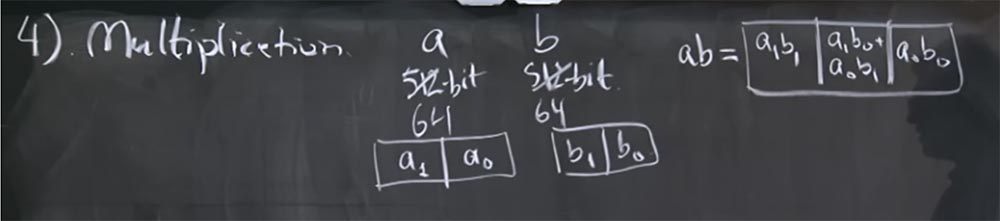

55:00 мин

[Курс MIT «Безопасность компьютерных систем». Лекция 16: «Атаки через побочный канал», часть 3](https://habr.com/company/ua-hosting/blog/429394/)

Полная версия курса доступна [здесь](https://ocw.mit.edu/courses/electrical-engineering-and-computer-science/6-858-computer-systems-security-fall-2014/).

Спасибо, что остаётесь с нами. Вам нравятся наши статьи? Хотите видеть больше интересных материалов? Поддержите нас оформив заказ или порекомендовав знакомым, **30% скидка для пользователей Хабра на уникальный аналог entry-level серверов, который был придуман нами для Вас:** [Вся правда о VPS (KVM) E5-2650 v4 (6 Cores) 10GB DDR4 240GB SSD 1Gbps от $20 или как правильно делить сервер?](https://habr.com/company/ua-hosting/blog/347386/) (доступны варианты с RAID1 и RAID10, до 24 ядер и до 40GB DDR4).

**VPS (KVM) E5-2650 v4 (6 Cores) 10GB DDR4 240GB SSD 1Gbps до декабря бесплатно** при оплате на срок от полугода, заказать можно [тут](https://ua-hosting.company/vpsnl).

**Dell R730xd в 2 раза дешевле?** Только у нас **[2 х Intel Dodeca-Core Xeon E5-2650v4 128GB DDR4 6x480GB SSD 1Gbps 100 ТВ от $249](https://ua-hosting.company/serversnl) в Нидерландах и США!** Читайте о том [Как построить инфраструктуру корп. класса c применением серверов Dell R730xd Е5-2650 v4 стоимостью 9000 евро за копейки?](https://habr.com/company/ua-hosting/blog/329618/)