Курс MIT «Безопасность компьютерных систем». Лекция 16: «Атаки через побочный канал», часть 3 / Блог компании ua-hosting.company

### Массачусетский Технологический институт. Курс лекций #6.858. «Безопасность компьютерных систем». Николай Зельдович, Джеймс Микенс. 2014 год

Computer Systems Security — это курс о разработке и внедрении защищенных компьютерных систем. Лекции охватывают модели угроз, атаки, которые ставят под угрозу безопасность, и методы обеспечения безопасности на основе последних научных работ. Темы включают в себя безопасность операционной системы (ОС), возможности, управление потоками информации, языковую безопасность, сетевые протоколы, аппаратную защиту и безопасность в веб-приложениях.

Лекция 1: «Вступление: модели угроз» [Часть 1](https://habr.com/company/ua-hosting/blog/354874/) / [Часть 2](https://habr.com/company/ua-hosting/blog/354894/) / [Часть 3](https://habr.com/company/ua-hosting/blog/354896/)  
Лекция 2: «Контроль хакерских атак» [Часть 1](https://habr.com/company/ua-hosting/blog/414505/) / [Часть 2](https://habr.com/company/ua-hosting/blog/416047/) / [Часть 3](https://habr.com/company/ua-hosting/blog/416727/)  
Лекция 3: «Переполнение буфера: эксплойты и защита» [Часть 1](https://habr.com/company/ua-hosting/blog/416839/) / [Часть 2](https://habr.com/company/ua-hosting/blog/418093/) / [Часть 3](https://habr.com/company/ua-hosting/blog/418099/)  
Лекция 4: «Разделение привилегий» [Часть 1](https://habr.com/company/ua-hosting/blog/418195/) / [Часть 2](https://habr.com/company/ua-hosting/blog/418197/) / [Часть 3](https://habr.com/company/ua-hosting/blog/418211/)  
Лекция 5: «Откуда берутся ошибки систем безопасности» [Часть 1](https://habr.com/company/ua-hosting/blog/418213/) / [Часть 2](https://habr.com/company/ua-hosting/blog/418215/)  
Лекция 6: «Возможности» [Часть 1](https://habr.com/company/ua-hosting/blog/418217/) / [Часть 2](https://habr.com/company/ua-hosting/blog/418219/) / [Часть 3](https://habr.com/company/ua-hosting/blog/418221/)  
Лекция 7: «Песочница Native Client» [Часть 1](https://habr.com/company/ua-hosting/blog/418223/) / [Часть 2](https://habr.com/company/ua-hosting/blog/418225/) / [Часть 3](https://habr.com/company/ua-hosting/blog/418227/)  
Лекция 8: «Модель сетевой безопасности» [Часть 1](https://habr.com/company/ua-hosting/blog/418229/) / [Часть 2](https://habr.com/company/ua-hosting/blog/423155/) / [Часть 3](https://habr.com/company/ua-hosting/blog/423423/)  
Лекция 9: «Безопасность Web-приложений» [Часть 1](https://habr.com/company/ua-hosting/blog/424289/) / [Часть 2](https://habr.com/company/ua-hosting/blog/424295/) / [Часть 3](https://habr.com/company/ua-hosting/blog/424297/)  
Лекция 10: «Символьное выполнение» [Часть 1](https://habr.com/company/ua-hosting/blog/425557/) / [Часть 2](https://habr.com/company/ua-hosting/blog/425561/) / [Часть 3](https://habr.com/company/ua-hosting/blog/425559/)  
Лекция 11: «Язык программирования Ur/Web» [Часть 1](https://habr.com/company/ua-hosting/blog/425997/) / [Часть 2](https://habr.com/company/ua-hosting/blog/425999/) / [Часть 3](https://habr.com/company/ua-hosting/blog/426001/)  
Лекция 12: «Сетевая безопасность» [Часть 1](https://habr.com/company/ua-hosting/blog/426325/) / [Часть 2](https://habr.com/company/ua-hosting/blog/427087/) / [Часть 3](https://habr.com/company/ua-hosting/blog/427093/)  
Лекция 13: «Сетевые протоколы» [Часть 1](https://habr.com/company/ua-hosting/blog/427763/) / [Часть 2](https://habr.com/company/ua-hosting/blog/427771/) / [Часть 3](https://habr.com/company/ua-hosting/blog/427779/)  
Лекция 14: «SSL и HTTPS» [Часть 1](https://habr.com/company/ua-hosting/blog/427783/) / [Часть 2](https://habr.com/company/ua-hosting/blog/427785/) / [Часть 3](https://habr.com/company/ua-hosting/blog/427787/)  
Лекция 15: «Медицинское программное обеспечение» [Часть 1](https://habr.com/company/ua-hosting/blog/428652/) / [Часть 2](https://habr.com/company/ua-hosting/blog/428654/) / [Часть 3](https://habr.com/company/ua-hosting/blog/428656/)  
Лекция 16: «Атаки через побочный канал» [Часть 1](https://habr.com/company/ua-hosting/blog/429390/) / [Часть 2](https://habr.com/company/ua-hosting/blog/429392/) / [Часть 3](https://habr.com/company/ua-hosting/blog/429394/)

**Аудитория:** используете ли вы метод Карацубы?

**Профессор:** да, это умный метод умножения, который не требует четырёх этапов вычислений. Методу Карацубы обучают в курсе .601, или как он обозначается сегодня?

**Аудитория:** 042.

**Профессор:** 042, отлично. Да, это очень хороший метод. Его использует почти каждая криптографическая библиотека. Для тех из вас, кто не является выпускниками нашего института — я говорю так, потому что у нас здесь есть аспиранты — я напишу о методе Карацубы на доске. Здесь вам нужно вычислить три значения:

a1 b1  
(a1 – a0) (b1 – b0)  
a0 b0

Таким образом, вы делаете 3 умножения вместо четырех, причём оказывается, что вы можете восстановить это значение a1b0 \+ a0b1 из этих трех результатов умножения.

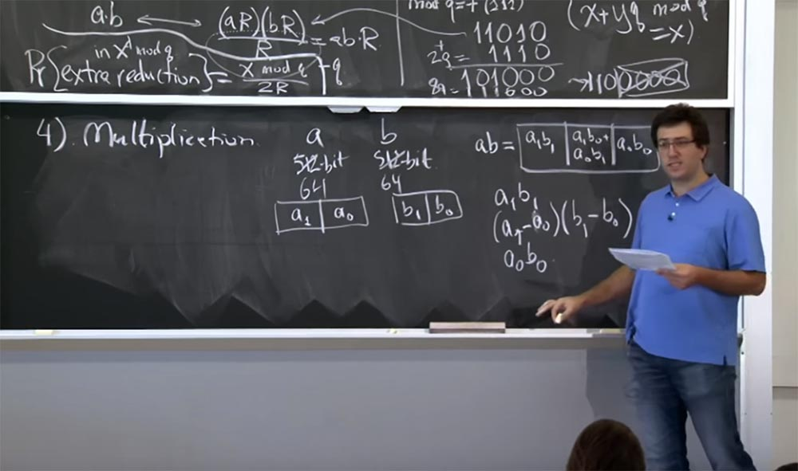

Особый способ проделать это заключается вот в чём… позвольте мне записать это в другой форме.

Итак, у нас будет:

(264 \+ 232) (a1 b1) +  
(232)(\- (a1 — a0)(b1 — b0)  
(232 \+ 1) (a0 b0)

Это не очень понятно, но если вы проработаете детали, то в конечном итоге убедите себя, что это значение в этих 3-х строках эквивалентно значению ab, но при этом уменьшает вычисления на одно умножение. И то, как мы применяем это к более объёмным умножениям, заключается в том, что вы рекурсивно продолжаете идти вниз. Так, если у вас есть 512 битовые значения, вы можете разбить их на 256-битное умножение. Вы делаете три 256-битных умножения, каждый раз рекурсивно используя метод Карацубы. В конце концов, ваши вычисления сводятся к машинному размеру и могут быть обработаны единичной машинной инструкцией.

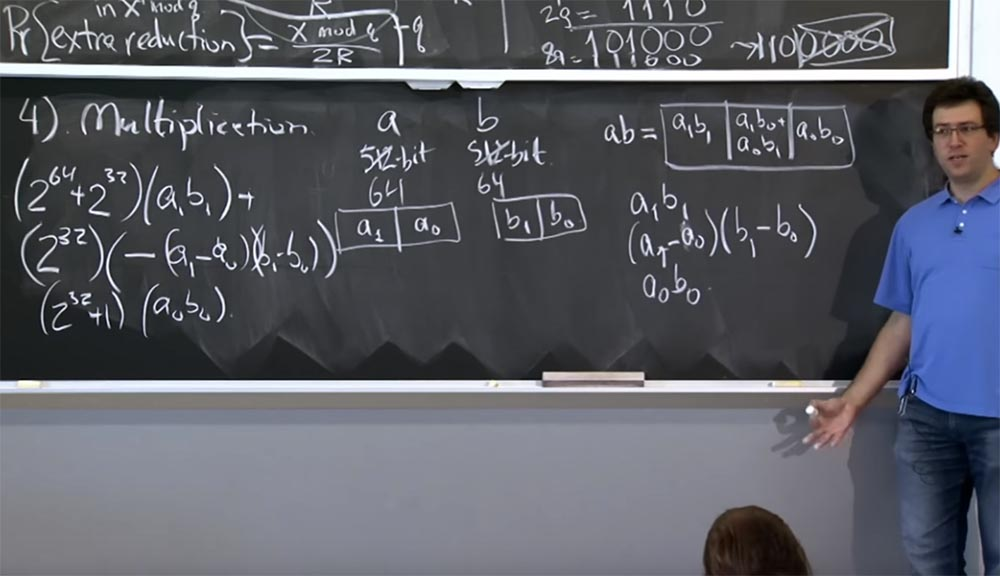

Итак, где здесь атака таймингов? Как эти ребята используют умножение Карацубы? Оказывается, OpenSSL беспокоится о двух типах умножения, которые вам, возможно, придется проделать.  
Первый — это перемножение двух больших чисел примерно одинакового размера. Подобное происходит многократно, когда мы выполняем модульное возведение в степень, потому что все значения, которые мы будем умножать, будут иметь размер примерно 512 бит. Поэтому, когда мы умножаем c на y или возводим в квадрат, мы умножаем две вещи примерно одинакового размера. В этом случае метод Карацубы обретает большой смысл, потому что уменьшает размер чисел, возводимых в квадрат, примерно в 1,58 раза, что намного ускоряет процесс вычислений.  
Второй тип умножения – это когда OpenSSL перемножает два числа, размер которых существенно отличается друг от друга: одно очень большое, а другое очень маленькое. В этом случае вы могли бы также использовать метод Карацубы, но он будет работать медленней, чем примитивное умножение. Предположим, вы умножаете число размером 512 битов на 64-х битное число, вы должны будете возвести каждый бит первого числа в 64 степень, в результате чего получите замедление процесса 2n вместо ускорения n/1,58. Поэтому эти ребята, использующие OpenSSL, постарались поступить умнее, и именно здесь начались проблемы.

Они решили, что будут динамически переключаться между эффективным методом Карацубы и методом умножения начальной школы. Их эвристика заключалась в следующем. Если два числа, которые вы перемножаете, состоят из одинакового числа машинных слов, или, по крайней мере, имеют такое же число битов, как 32-х битные единицы, то применяется метод Карацубы. Если два числа сильно отличаются по размеру друг от друга, выполняется возведение в квадрат или прямое простое, нормальное умножение.

При этом можно отследить, как происходит переключение на другой метод умножения. Так как момент переключения не проходит бесследно, после него будет заметно, требуется ли теперь намного больше времени для умножения или намного меньше, чем раньше. Этим обстоятельством воспользовались исследователи для организации атаки методом определения таймингов.

Думаю, что я закончил рассказывать вам обо всех странных трюках, которые люди используют при реализации RSA на практике. Теперь давайте попробуем собрать их вместе и использовать в отношении целого веб-сервера, чтобы выяснить, как вы можете «отщипнуть» интересующие нас биты от входного сетевого пакета.

Если вы помните из лекции о HTTPS, веб-сервер имеет секретный ключ. Он использует этот секретный ключ, чтобы доказать, что это правильный владелец всех сертификатов по протоколу HTTPS или TLS. Это осуществляется благодаря тому, что клиенты отправляют некоторые случайно выбранные биты, эти биты шифруются с помощью открытого ключа сервера, и сервер по протоколу TLS расшифровывает данное сообщение. И если сообщение проверено, то эти случайные биты используются для установки сеанса связи.

Но в нашем случае это сообщение не будет проверяться, потому что оно будет создано особым образом, и когда выяснится, что дополнительные биты не совпадают, то сервер вернет ошибку, как только закончит расшифровывать наше сообщение.

Вот что мы собираемся здесь сделать. Сервер — вы можете считать, что это Apache с открытым SSL – получит сообщение от клиента, которое посчитает зашифрованным текстом с или каким-то гипотетическом зашифрованном текстом, который создал клиент. Первое, что мы делаем с зашифрованным текстом c – расшифровываем его, используя формулу с → (cd mod n) = m.

Если вы помните первую оптимизацию, мы собираемся применить китайскую теорему об остатке и разделить наш текст на две части: одну просчитать по mod p, другую по mod q, а потом скомбинировать результаты. Сначала возьмём с и представим её в двух величинах: первую назовём c0, она будет равно с mod q, а вторую обозначим c1, и она будет равняться c mod p. Потом мы сделаем то же самое, чтобы вычислить c для d mod p и c для d mod q.

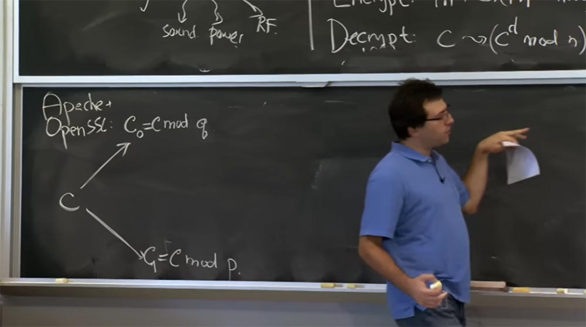

Далее мы собираемся переключиться на представление Монтгомери, потому что это сделает наши умножения очень быстрыми. Таким образом, следующее, что SSL собирается сделать с вашим числом, это вычислить c0', которое будет равно c0R mod q и то же самое сделать здесь, внизу для величины с1, я не буду это записывать, потому что оно выглядит одинаково.

Теперь, когда мы перешли в форму Монтгомери, мы можем, наконец, произвести наши умножения, и здесь мы будем использовать технику «скользящего окна». Как только мы получим c0', мы совершим это простое возведение c0' в степень d по mod q. И здесь, поскольку мы вычисляем это значение для d, мы будем использовать «скользящие окна» для битов экспоненты d, а также применим метод Карацубы или же обычное умножение в зависимости от того, каков размер наших операндов.

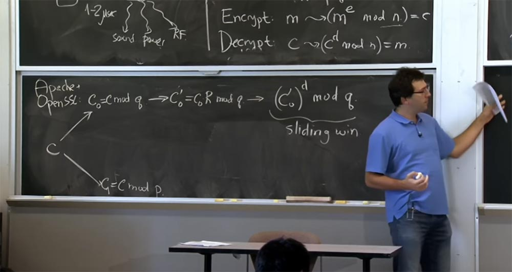

Итак, если выяснится, что эта величина c0' и ранее полученный результат возведения в квадрат имеют одинаковый размер, мы применяем способ Карацубы. Если c0' очень малого размера, а предыдущий результат умножения – большого, то мы будем возводить в квадрат и умножать обычным способом. Здесь же мы используем «скользящие окна» и способ Карацубы вместо нормального умножения.

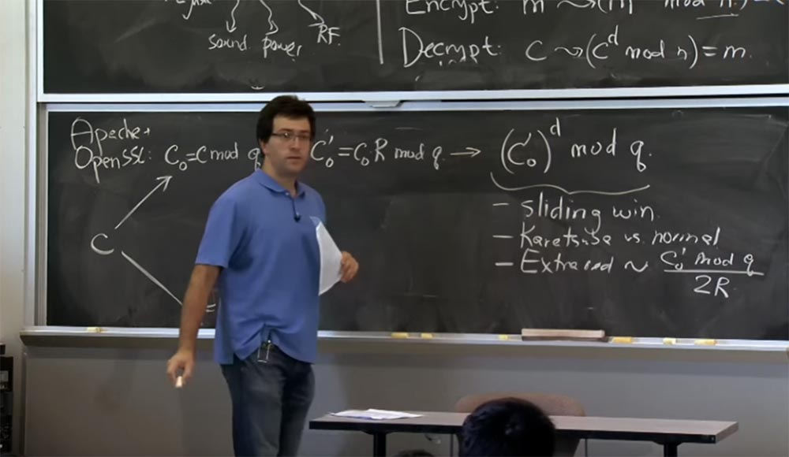

Также на этом этапе появляются дополнительные сокращения. Потому что при каждом умножении дополнительные сокращения будут пропорциональны тому, что мы возводим в степень по mod q, то есть величине (c0')d. Здесь при простом подключении формулы вероятность дополнительных сокращений будет пропорциональна значению c0' mod q, деленному на 2R. Именно в этом месте появляется бит, влияющий на тайминг.

На самом деле здесь возникают два возможных эффекта: использование способа Карацубы вместо нормального умножения и появление дополнительных сокращений, которые вы собираетесь проделать.

Через секунду вы увидите, как это можно использовать. Сейчас же, когда вы получили этот результат для mod q и собираетесь получить подобный результат для mod p, можно наконец-то рекомбинировать эти две части вверху и внизу и использовать CRT, китайскую теорему об остатках.

И то, что вы в результате получаете из CRT… извините, я думаю, сначала нам нужно преобразовать это обратно из формы Монтгомери. Поэтому перед рекомбинацией мы преобразуем верхнюю часть в выражение (c0')d / R mod q и вернём наше значение cd mod q. В нижней части мы соответственно получим cd mod p.

Теперь можно использовать CRT, чтобы получить значение cd mod n. Извините за маленький шрифт, мне не хватило доски. Примерно то же самое у нас получится здесь внизу для с1, и мы наконец сможем получить наш результат, то есть сообщение m.

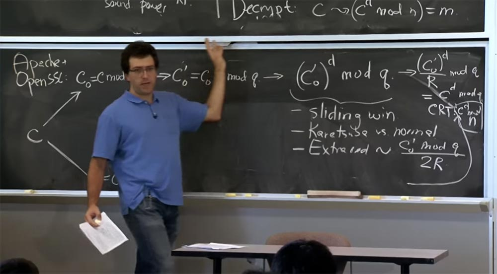

Таким образом, сервер берет входящий пакет, который получает, запускает его через весь этот конвейер, выполняет две части этого конвейера и заканчивает расшифрованным сообщением m, равным cd mod m. Затем он собирается проверить дополнение padding этого сообщения. В случае нашей конкретной атаки мы создали с таким образом, что на самом деле это дополнение будет не совпадать. Мы выбрали значение c по таким эвристикам, которые не шифруют реальное сообщение с правильным дополнением padding.

Таким образом, дополнение не выдержит проверки, серверу понадобится записать ошибку, отослать сообщение об ошибке клиенту и прервать соединение. Так вот, мы собираемся измерить время, которое понадобится серверу для пропуска нашего сообщения через этот конвейер. Есть вопросы по поводу процесса обработки сообщения сервером и объединения всех этих оптимизаций?

**Аудитория:** по-моему, там имеется ошибка с индексом величины с.

**Профессор:** да, вы правы, я дописываю индекс 0, здесь должно быть c0d mod q.

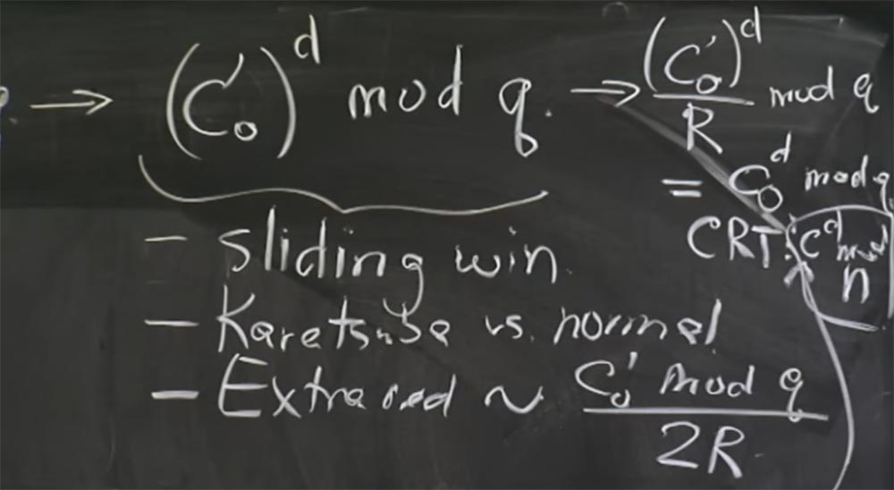

**Аудитория:** когда вы делите на R mod q, разве нет предположений о том, сколько q вы должны добавить для дополнительного сокращения низких битов на нули?

**Профессор:** да, вы правы, на этом заключительном этапе (c0')d / R mod q могут быть и дополнительные сокращения. Так что мы должны выполнить это деление на R правильным образом, и, вероятно, должны сделать то же самое, что и при выполнении сокращения Монтгомери здесь, когда мы делим на R, чтобы преобразовать значение обратно. Так как в начале вычислений неясно, сколько именно q мы должны добавить, мы действуем методом подбора, уничтожаем низкие нули, затем снова делаем mod q, и, возможно, дополнительное сокращение. Вы говорите абсолютно верно, в данном случае это точно такое же деление на R mod q, как и для каждого шага умножения Монтгомери.

Так как же этим воспользоваться? Как злоумышленник может разгадать секретный ключ сервера путём измерения времени совершения операций? У этих парней есть план, который основан на угадывании одного бита закрытого ключа за раз. Можно считать, что секретный ключ — это зашифрованная экспонента d, потому что вы знаете e и знаете n, это открытый ключ. Единственное, что вы не знаете — это d.

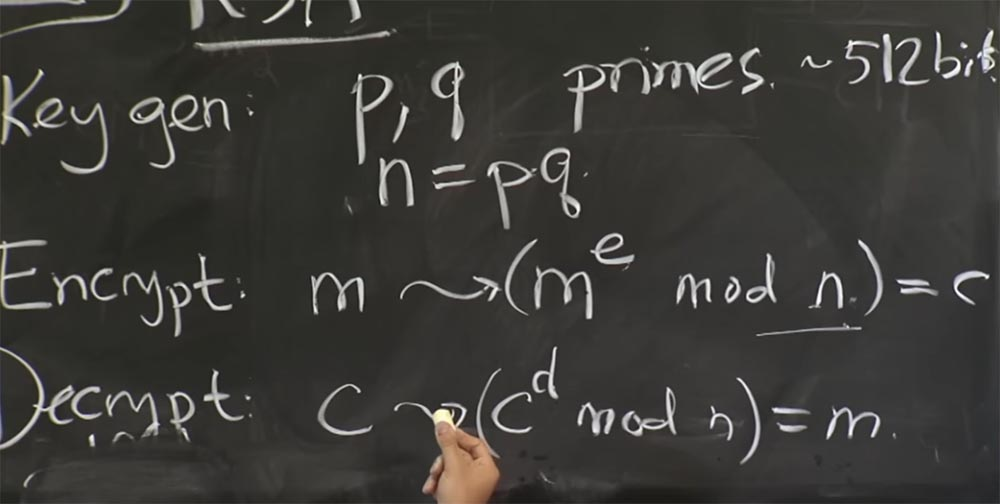

На самом деле в этой атаке они не угадывают непосредственно значение d, так как это довольно сложно. Вместо этого они рассматривают величину q или р, не важно, какую именно из этих двух величин. Как только вы угадаете, какое значение имеет p или q, вы можете вычислить n = pq. Затем, если вы знаете значения p и q, вы можете вычислить функцию φ, о которой мы говорили раньше. Это позволит вам получить значение d из значения e. Таким образом, эта факторизация значения n чрезвычайно важна, она должна храниться в секрете, чтобы обеспечить безопасность RSA.

Так что на самом деле, эти ребята намеревались угадать значение q, анализируя тайминги работы этого конвейера. Что же они для этого делают? Они тщательно подбирают исходное значение величины c и измеряют время её прохождения по конвейеру сервера.

В частности, существуют две части этой атаки, и вы должны предпринять некие начальные шаги, чтобы угадать несколько первых бит. Затем, как только у вас есть несколько первых бит, вы можете угадать следующий бит. Поэтому позвольте мне не рассказывать подробно, как они угадывают первые пару бит, потому что на самом деле намного интересней рассмотреть, как они угадывают следующий бит. Если у нас останется время, мы вернёмся к тому, как описывается угадывание нескольких начальных бит в лекционной статье.

Итак, допустим, что у вас есть предположение g о том, какие биты имеются в значении этого q. Пусть эта величина состоит из таких битов: g = g0 g1 g2 … и так далее. Вернее, это даже не g, а настоящие биты q, так что позвольте мне переписать это в таком виде: g = q0 q1 q2 …. Считаем, что эти q – высокие биты, и мы пытаемся угадать биты всё ниже и ниже. Предположим, мы знаем значение q вплоть до бита qj, а далее следуют все нули. Вы не догадываетесь, что собой представляют остальные биты.

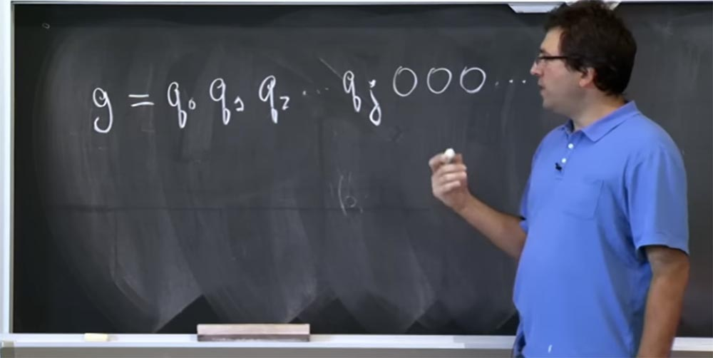

Эти ребята попытались внедрить эту догадку g вот в это место нашего конвейера: (c0')d mod q. Потому что это то место, где используются два вида оптимизации: способ Карацуба вместо обычного умножения и различное количество дополнительных сокращений в зависимости от значения c0'. Собственно, они постарались внедрить две разные догадки в это место конвейера: первую, которая выглядит как g = q0 q1 q2 … qj 000…0000 и вторую, которую они назвали ghigh, который состоит из тех же высоких битов, но вместо всех нулей в конце здесь имеется единица, обозначающая высокий бит, за которым опять-таки следуют нули:

g = q0 q1 q2 … qj 100…0000.

Каким же образом это поможет этим парням понять, что происходит? Для этого существует два способа. Предположим, что наша догадка g равна значению c0'. Мы можем считать, что эти g и ghigh соответствуют значению c0', приведённому на левой доске. На самом деле это довольно просто сделать это, потому что c0' довольно легко вычисляется обратным путём из зашифрованного входного значения c0, вы просто умножаете его на R.

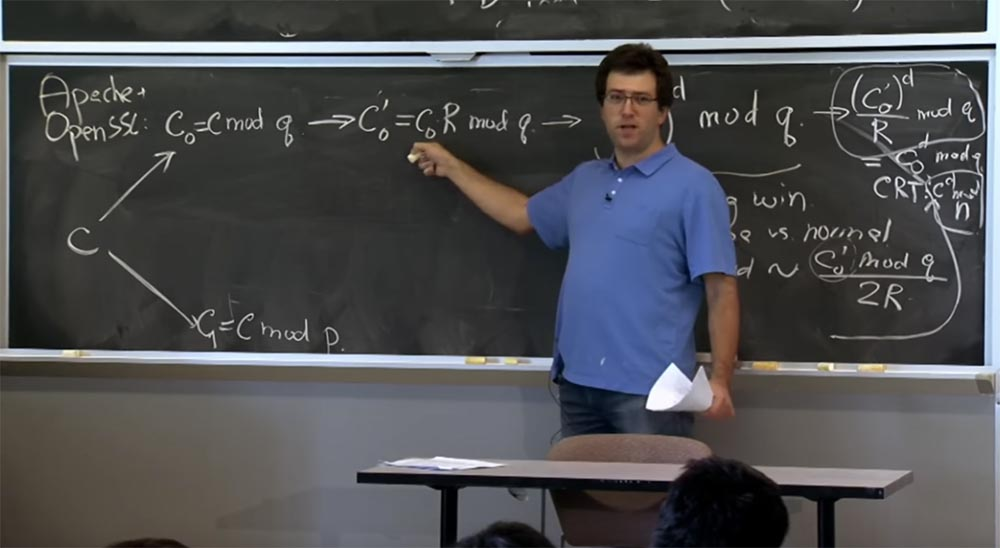

Поэтому, чтобы угадать значение (c0')d, им просто нужно взять свое предположение, свою догадку g и сначала разделить её на R, то есть разделить на 512 mod чего-то там. Затем они собираются ввести её обратно, сервер умножит её на R и продолжит процесс, приведённый в нашей конвейерной схеме.

Итак, предположим, что нам удалось поместить наше конкретное выбранное целочисленное значение в нужное место. Итак, каково же будет время вычисления c0' до d mod q?

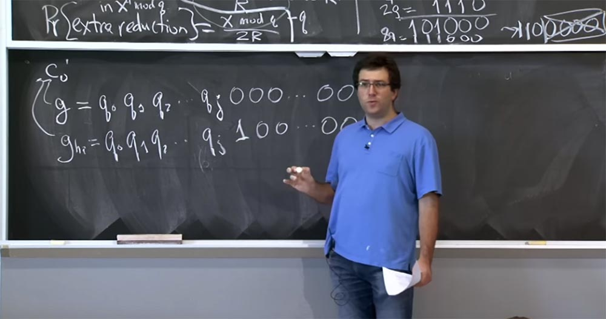

Существует два возможных варианта, где q вписывается в эту картину. Может быть, что q находится между этими двумя значениями g и ghigh, потому что следующий бит q равен 0. Таким образом, это значение — первый 0 после qj — будет меньше q, но это значение – 1 после q – будет больше, чем q. Такое происходит, если следующий бит q это 0, или возможно, что q находится выше обоих этих значений, если следующий бит q равен 1.

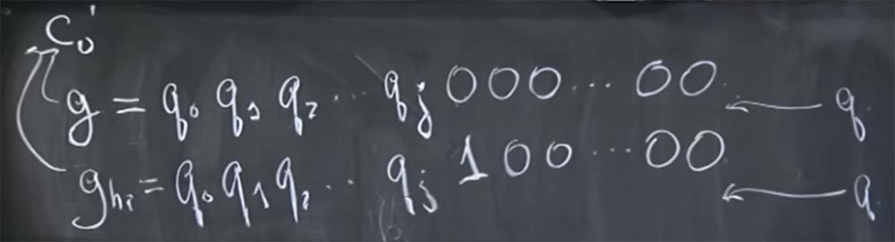

Теперь мы можем сказать, каково будет время расшифровки этих двух значений, если q лежит между ними, или же если q расположено выше их обоих.

Давайте рассмотрим ситуацию, где q расположено выше. В таком случае все в значительной степени то же самое. Поскольку оба эти значения меньше q, то значение этих вещей по mod q будет примерно одинаковым. Они несколько отличаются из-за этого дополнительного бита, но всё равно более или менее одинаковой величины. И число дополнительных сокращений extra reduction также, вероятно, не будет сильно отличаться, потому что пропорционально значению c0' mod q. И для обоих значений g и ghigh, меньших q, они все примерно одинаковые. Ни один из них не превысит q и не вызовет большого количества дополнительных сокращений, потому что при q большим, чем обе эти догадки, число вычислений по способу Карацубы по отношению к числу обычных вычислений останется таким же. С точки зрения этого отношения сервер будет одинаково обрабатывать как g, так и ghigh. Поэтому сервер собирается сделать примерно столько же дополнительных сокращений для обоих этих значений. Таким образом, если вы видите, что сервер тратит одинаковое время, чтобы ответить на эти догадки, то вы, вероятно, должны предположить, что в значении ghigh действительно присутствует 1 в этом месте.

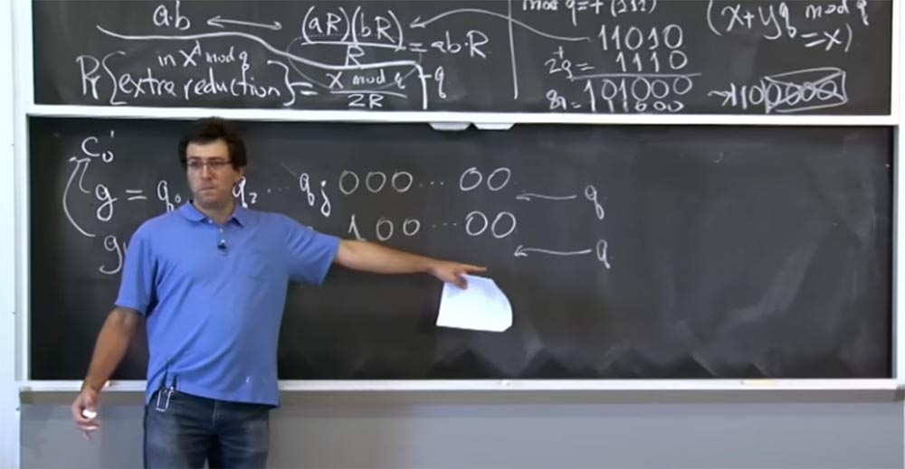

С другой стороны, если q расположено между этими двумя значениями, то есть две возможные вещи, которые могут вызвать переключение и изменение таймингов. Одна из вещей заключается в том, что, поскольку ghigh немного больше q, то количество дополнительных сокращений будет пропорционально c0' mod q, который очень мал, потому что c0' — это q плюс немного битов в этой дополнительной последовательности битов 100…00. Таким образом, количество дополнительных сокращений будет заметнее и все начнёт происходить быстрее.  
Еще одна возможная вещь, которая может произойти, это то, что, возможно, сервер решит: «о, теперь наступило время делать нормальное умножение вместо способа Карацуба!». Может быть, для этого значения g величина c0' будет иметь такое число бит, как и q, и если окажется, что ghigh больше q, то ghigh mod q потенциально будет иметь меньше бит. И если это пересечёт некую границу, то сервер внезапно переключится на обычное умножение. В этом случае мы будем наблюдать обратный процесс – всё начнёт протекать медленней, потому что обычное умножение занимает больше времени, чем умножение Карацуба.

Количество дополнительных сокращений пропорционально c0' mod q. Если c0 которое является этим значением ghigh, немного больше q, то это крошечное отличие, которое будет не сопоставимо с разницей между g и q. В этом случае также возникнет изменение таймингов, которое можно будет попытаться измерить. Так что на самом деле, здесь есть несколько интересных вещей, когда эти эффекты на самом деле работают в разных направлениях. Так, если вы установите 32-битную границу переключения между способом Карацубы и нормальным умножением, то расшифровка этого сообщения займёт гораздо больше времени.

С другой стороны, если здесь не применяется 32-битная граница, возможно, эффект дополнительных сокращений расскажет вам, что здесь происходит. Таким образом, на самом деле вы должны следить за различными эффектами. Если вы не угадываете несколько бит в пределах 32 бит, то должны ожидать, что время уменьшится из-за дополнительных сокращений. С другой стороны, если вы пытаетесь угадать бит, кратный 32, то, возможно, вам следует ожидать эффекта Карацубы, либо умножения будут производится обычным способом.

Поэтому, если посмотреть, что пишется в лекционной статье, то эти ребята не обращали внимания на прыжки таймингов вверх или вниз. Вы просто должны ожидать, что если следующий бит q равен 1, то эти вещи занимают почти такое же количество времени, а если следующий бит q равен 0, то следует ожидать, что эти значения ghigh и q имеют заметную разницу, даже если она больше или меньше, положительная или отрицательная.

Так что на самом деле авторы статьи измеряют именно это. Оказывается, что этот метод работает очень хорошо. Но на самом деле они должны сделать два интересных трюка, чтобы всё это получилось. Если вы помните, разница во времени была крошечной, порядка 1-2 микросекунд. Такую разницу очень трудно измерить через обычную сеть, например, через свитч Ethernet.  
Поэтому они делают два вида измерений, два вида усреднения. Каждую догадку они посылают несколько раз. В статье пишется, что они отправляли эти значения на сервер 7 раз или около того. Итак, какого вида помехи, по-вашему, помогают им просто повторять одно и то же предположение, одну и ту же догадку снова и снова?

**Аудитория:** как насчёт использования разных ссылок?

**Профессор:** да, так что если сеть позволяет использовать разные ссылки, вы можете пробовать отослать одну и ту же вещь много раз, и её обработка на сервере должна занимать одно и то же количество времени каждый раз, поэтому можно усреднить сетевой шум, или сетевые помехи. В статье говорится, что они принимают средний показатель зашумления сети.

Но затем они делают еще одну странную вещь, которая заключается в том, что они не просто отправляют одну и ту же догадку 7 раз, они на самом деле отправляют целое семейство догадок, где каждая немного отличается от предыдущей и каждое новое значение отправляется 7 раз. То есть сначала они 7 раз посылают g, затем они 7 раз посылают g + 1, затем g + 2 так же 7 раз и так вплоть до g + 400. Почему они усредняют разные значения g, а не просто отправляют g, скажем, 7 раз по 400, ведь это намного проще?

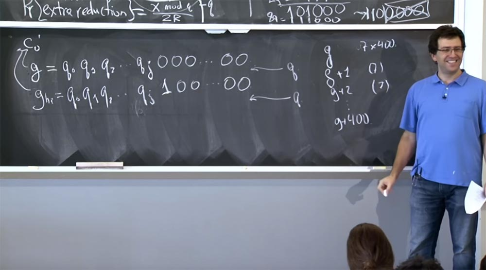

**Аудитория:** вероятно, чтобы лучше оценить время, которое затрачивает сервер?

Профессор: да, это на самом деле так, мы пытаемся измерить, как много времени займёт эта часть вычислений — (c0')d. Но есть и много других вещей. Например, другой конвейер, который находится внизу, производит все вычисления по mod p. Я имею в виду, что это также займёт другое количество времени в зависимости от того, что собой представляют входные значения. Полезно то, что если вы изменяете значение всех ваших догадок g, добавляя 1, 2, 3, что угодно, это добавляет немножко битов.

Если сейчас посмотреть на атаку способом таймингов, у нас мало что изменяется, потому что всё зависит от перелистывания этого среднего бита – единицы в последовательности 100…00. Но все, что происходит в нижней части конвейера с mod p, будет полностью рандомизировано этим, потому что при вычислениях по mod p добавление дополнительного бита может изменить весь процесс. Затем вы собираетесь усреднять другие виды «вычислительного шума», который детерминирован для определенного значения, но не связан с этой частью вычисления (c0')d, которое мы пытаемся провести. Это понятно?

**Аудитория:** как они поступают, когда пытаются угадать нижние биты?

**Профессор:** на самом деле они используют какой-то другой математический трюк, чтобы угадать только верхнюю половину битов q. Оказывается, что если вы знаете верхнюю половину битов q, существует некая математика, которая позволяет определить фактор чисел, и вы оказываетесь в выигрыше.

**Аудитория:** как получается величина c0'?

**Профессор:** если вам нужно значение c0', вы должны создать значение c, просто взяв простое число c0' и умножив на обратное значение R по mod n.

И когда сервер возьмёт это значение, он «протолкнёт» его сюда, чтобы вычислить это выражение c0 = с mod q, так что оно будет выглядеть как c0= ((c0' R-1 ) mod n) mod q. Затем вы умножаете его на R, чтобы избавиться от обратного R. И тогда вы в конечном итоге определяете именно ту величину c0', которая расположена в выражении (c0')d mod q. Таким образом, классная вещь состоит в том, что все манипуляции, производимые здесь, просто сводятся к умножению на это R. Причём вы знаете, что R = 2512. Я думаю, здесь всё будет просто.

**Аудитория:** можем ли мы при определении таймингов отказаться от вычислений по по mod p в нижней части конвейера?

**Профессор:** то есть вы не знаете, что собой представляет р, но хотите определить его случайным образом? Если вам это удастся, то вы сделаете великое дело! Ну что же, на следующей неделе мы начнем обсуждать другие проблемы.

Полная версия курса доступна [здесь](https://ocw.mit.edu/courses/electrical-engineering-and-computer-science/6-858-computer-systems-security-fall-2014/).

Спасибо, что остаётесь с нами. Вам нравятся наши статьи? Хотите видеть больше интересных материалов? Поддержите нас оформив заказ или порекомендовав знакомым, **30% скидка для пользователей Хабра на уникальный аналог entry-level серверов, который был придуман нами для Вас:** [Вся правда о VPS (KVM) E5-2650 v4 (6 Cores) 10GB DDR4 240GB SSD 1Gbps от $20 или как правильно делить сервер?](https://habr.com/company/ua-hosting/blog/347386/) (доступны варианты с RAID1 и RAID10, до 24 ядер и до 40GB DDR4).

**VPS (KVM) E5-2650 v4 (6 Cores) 10GB DDR4 240GB SSD 1Gbps до декабря бесплатно** при оплате на срок от полугода, заказать можно [тут](https://ua-hosting.company/vpsnl).

**Dell R730xd в 2 раза дешевле?** Только у нас **[2 х Intel Dodeca-Core Xeon E5-2650v4 128GB DDR4 6x480GB SSD 1Gbps 100 ТВ от $249](https://ua-hosting.company/serversnl) в Нидерландах и США!** Читайте о том [Как построить инфраструктуру корп. класса c применением серверов Dell R730xd Е5-2650 v4 стоимостью 9000 евро за копейки?](https://habr.com/company/ua-hosting/blog/329618/)