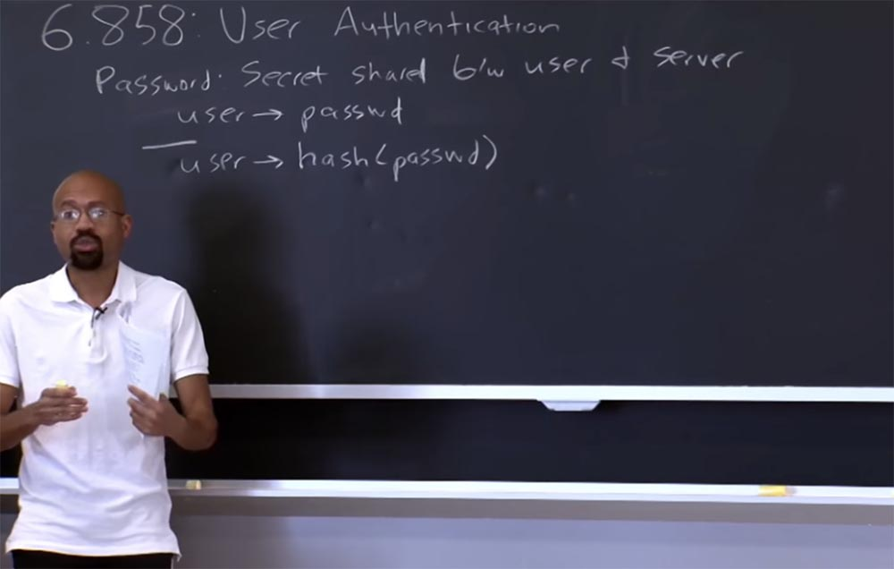
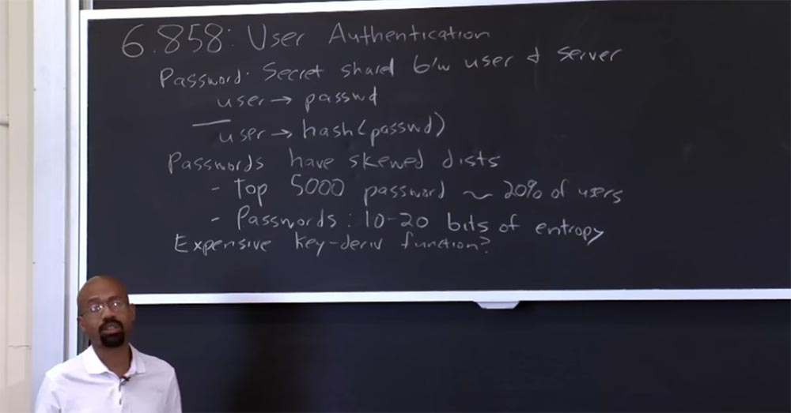
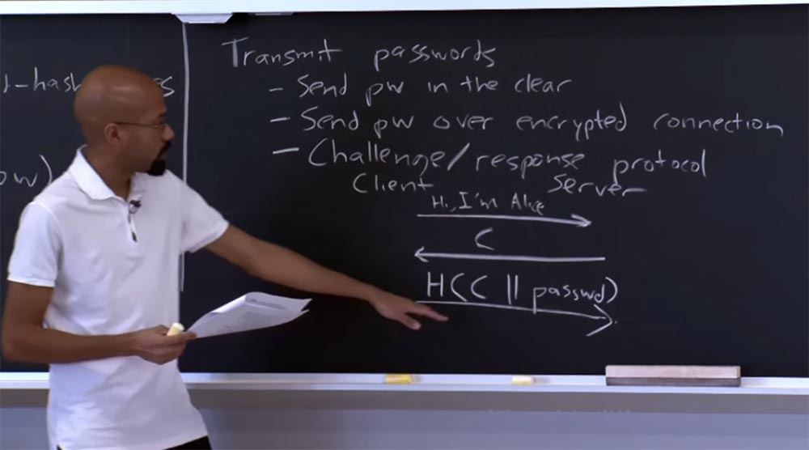
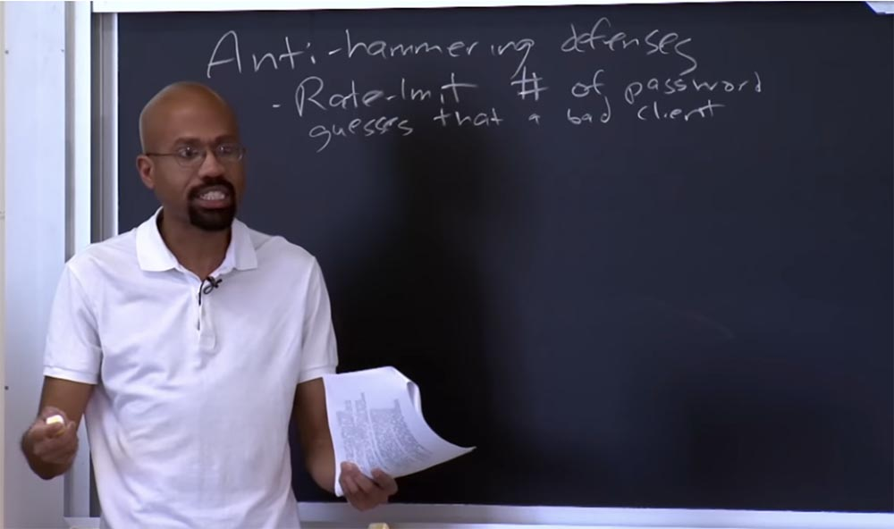
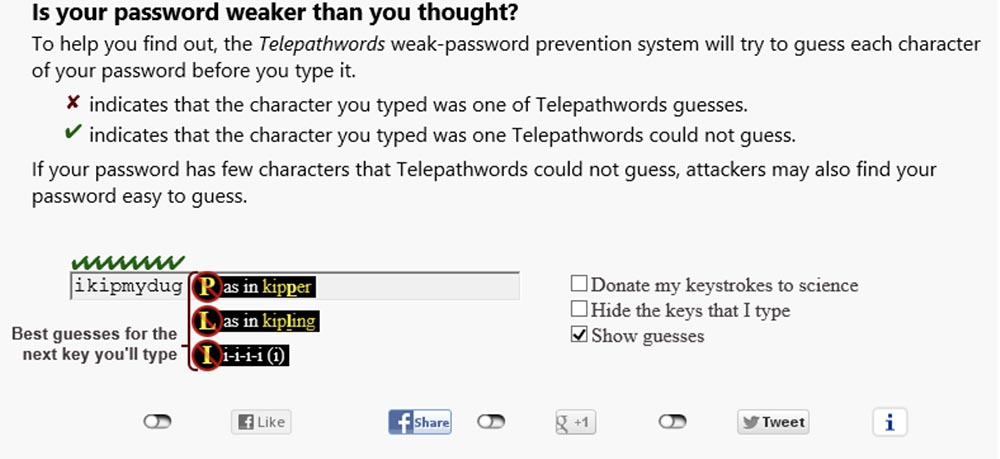
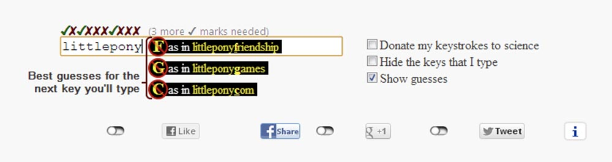
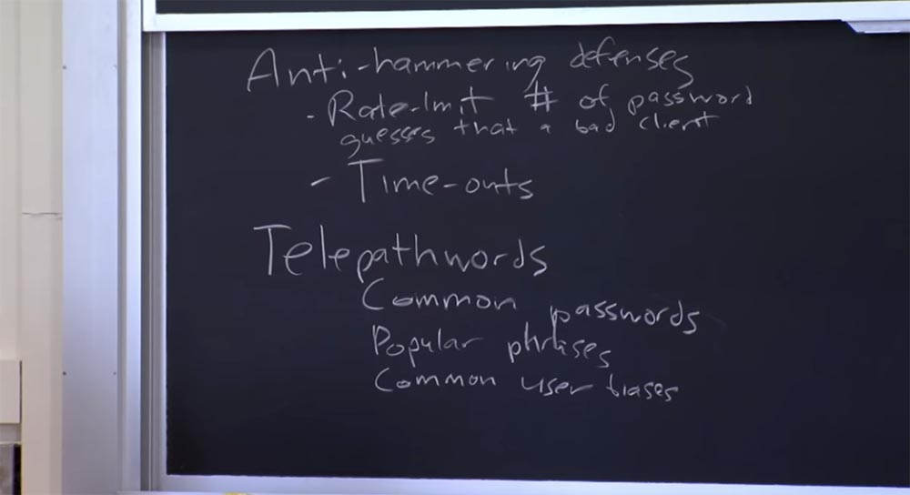

Курс MIT «Безопасность компьютерных систем». Лекция 17: «Аутентификация пользователя», часть 1 / Блог компании ua-hosting.company

### Массачусетский Технологический институт. Курс лекций #6.858. «Безопасность компьютерных систем». Николай Зельдович, Джеймс Микенс. 2014 год

Computer Systems Security — это курс о разработке и внедрении защищенных компьютерных систем. Лекции охватывают модели угроз, атаки, которые ставят под угрозу безопасность, и методы обеспечения безопасности на основе последних научных работ. Темы включают в себя безопасность операционной системы (ОС), возможности, управление потоками информации, языковую безопасность, сетевые протоколы, аппаратную защиту и безопасность в веб-приложениях.

Лекция 1: «Вступление: модели угроз» [Часть 1](https://habr.com/company/ua-hosting/blog/354874/) / [Часть 2](https://habr.com/company/ua-hosting/blog/354894/) / [Часть 3](https://habr.com/company/ua-hosting/blog/354896/)  
Лекция 2: «Контроль хакерских атак» [Часть 1](https://habr.com/company/ua-hosting/blog/414505/) / [Часть 2](https://habr.com/company/ua-hosting/blog/416047/) / [Часть 3](https://habr.com/company/ua-hosting/blog/416727/)  
Лекция 3: «Переполнение буфера: эксплойты и защита» [Часть 1](https://habr.com/company/ua-hosting/blog/416839/) / [Часть 2](https://habr.com/company/ua-hosting/blog/418093/) / [Часть 3](https://habr.com/company/ua-hosting/blog/418099/)  
Лекция 4: «Разделение привилегий» [Часть 1](https://habr.com/company/ua-hosting/blog/418195/) / [Часть 2](https://habr.com/company/ua-hosting/blog/418197/) / [Часть 3](https://habr.com/company/ua-hosting/blog/418211/)  
Лекция 5: «Откуда берутся ошибки систем безопасности» [Часть 1](https://habr.com/company/ua-hosting/blog/418213/) / [Часть 2](https://habr.com/company/ua-hosting/blog/418215/)  
Лекция 6: «Возможности» [Часть 1](https://habr.com/company/ua-hosting/blog/418217/) / [Часть 2](https://habr.com/company/ua-hosting/blog/418219/) / [Часть 3](https://habr.com/company/ua-hosting/blog/418221/)  
Лекция 7: «Песочница Native Client» [Часть 1](https://habr.com/company/ua-hosting/blog/418223/) / [Часть 2](https://habr.com/company/ua-hosting/blog/418225/) / [Часть 3](https://habr.com/company/ua-hosting/blog/418227/)  
Лекция 8: «Модель сетевой безопасности» [Часть 1](https://habr.com/company/ua-hosting/blog/418229/) / [Часть 2](https://habr.com/company/ua-hosting/blog/423155/) / [Часть 3](https://habr.com/company/ua-hosting/blog/423423/)  
Лекция 9: «Безопасность Web-приложений» [Часть 1](https://habr.com/company/ua-hosting/blog/424289/) / [Часть 2](https://habr.com/company/ua-hosting/blog/424295/) / [Часть 3](https://habr.com/company/ua-hosting/blog/424297/)  
Лекция 10: «Символьное выполнение» [Часть 1](https://habr.com/company/ua-hosting/blog/425557/) / [Часть 2](https://habr.com/company/ua-hosting/blog/425561/) / [Часть 3](https://habr.com/company/ua-hosting/blog/425559/)  
Лекция 11: «Язык программирования Ur/Web» [Часть 1](https://habr.com/company/ua-hosting/blog/425997/) / [Часть 2](https://habr.com/company/ua-hosting/blog/425999/) / [Часть 3](https://habr.com/company/ua-hosting/blog/426001/)  
Лекция 12: «Сетевая безопасность» [Часть 1](https://habr.com/company/ua-hosting/blog/426325/) / [Часть 2](https://habr.com/company/ua-hosting/blog/427087/) / [Часть 3](https://habr.com/company/ua-hosting/blog/427093/)  
Лекция 13: «Сетевые протоколы» [Часть 1](https://habr.com/company/ua-hosting/blog/427763/) / [Часть 2](https://habr.com/company/ua-hosting/blog/427771/) / [Часть 3](https://habr.com/company/ua-hosting/blog/427779/)  
Лекция 14: «SSL и HTTPS» [Часть 1](https://habr.com/company/ua-hosting/blog/427783/) / [Часть 2](https://habr.com/company/ua-hosting/blog/427785/) / [Часть 3](https://habr.com/company/ua-hosting/blog/427787/)  
Лекция 15: «Медицинское программное обеспечение» [Часть 1](https://habr.com/company/ua-hosting/blog/428652/) / [Часть 2](https://habr.com/company/ua-hosting/blog/428654/) / [Часть 3](https://habr.com/company/ua-hosting/blog/428656/)  
Лекция 16: «Атаки через побочный канал» [Часть 1](https://habr.com/company/ua-hosting/blog/429390/) / [Часть 2](https://habr.com/company/ua-hosting/blog/429392/) / [Часть 3](https://habr.com/company/ua-hosting/blog/429394/)  
Лекция 17: «Аутентификация пользователя» [Часть 1](https://habr.com/company/ua-hosting/blog/429680/) / [Часть 2](https://habr.com/company/ua-hosting/blog/429682/) / [Часть 3](https://habr.com/company/ua-hosting/blog/429686/)

Итак, давайте начнём. С возвращением вас, надеюсь, праздники для всех удались. Сегодня мы поговорим об аутентификации пользователей. Итак, тема лекции состоит в том, чтобы узнать, как пользователи могут доказать свою личность программе? В частности, статья, которая предназначается для сегодняшнего занятия, затрагивает сами основы существования сообщества безопасности. Есть ли что-нибудь лучше для аутентификации, чем пароли?

На высшем уровне кажется, что пароли – это ужасная идея, потому что у них очень низкая энтропия и атакующим легко их разгадать. Секретные вопросы, которые мы используем для восстановления забытых паролей, имеют ещё меньшую энтропию, чем сами пароли, и это тоже кажется проблемой.

И что еще хуже, пользователи, как правило, будут использовать один и тот же пароль на множестве разных сайтов. Это означает, что уязвимость в одном легко угадываемом пароле подвергает опасности работу пользователя со многими сайтами.

Мне понравилась такая цитата из статьи к сегодняшней лекции: «продолжающееся доминирование паролей среди всех других способов аутентификации пользователя является основным затруднением для исследования безопасности». Таким образом, сообщество исследователей безопасности желают иметь альтернативу лучше, чем пароли. Однако неясно, существует ли на самом деле схема аутентификации, которая способна полностью заменить пароли, будучи при этом более удобной, шире применимой и более безопасной.

Сегодня мы рассмотрим три вопроса. Во-первых, мы рассмотрим, как работают существующие пароли. После этого мы поговорим о том, каковы глобальные желаемые свойства паролей для любой схемы проверки подлинности. И наконец, мы рассмотрим, что пишется в лекционной статье о показателях, или характеристиках проверки подлинности, и увидим, как некоторые другие схемы аутентификации сравниваются по эффективности использования с паролями.

Итак, что такое пароль? Пароль является общим секретом для пользователя и сервера. Таким образом, примитивная реализация схемы паролей должна в основном просто иметь таблицу на стороне сервера, которая сопоставляет имена пользователей с их паролями.

Это самый простой способ представить себе реализацию одной из схем проверки подлинности — пользователь вводит своё имя и пароль, сервер ищет их в этой таблице, сравнивает пароль с именем, и если всё совпадает, происходит аутентификация пользователя. Ясно, что проблема заключается в том, что если злоумышленник взломает сервер, то он может просто посмотреть в эту таблицу и завладеть всеми паролями. Так что это явно плохая вещь.

Возможно, вариантом решения этой проблемы является хранение сервером таблицы, которая выглядит так: имени пользователя соответствует не сам пароль, а его хеш. При этом пользователь вводит пароль в виде простого текста, сервер проверяет его хеш-код и сличает его со значением в таблице. Преимущество этой схемы заключается в том, что эти хеш-функции разработаны таким образом, что хеш трудно поддаётся инвертированию в пароль. Если эта таблица утрачена, имеется утечка данных или злоумышленник взломал сервер и завладел ею, то он увидит вместо текстовых паролей строки случайных буквенно-цифровых символов, и ему будет трудно восстановить их оригинальный образ.

По крайней мере, в теории использование хешей довольно хорошая вещь. Но сейчас на практике злоумышленникам не придётся использовать атаку типа brute-force, чтобы определить прообраз значения хеша.

Злоумышленники могут реально воспользоваться тем, что на практике пароли имеют неравномерное распределение. И под неравномерным распределением я имею в виду… скажем, мы знаем, что все пароли имеют длину до 20 символов. На практике пользователи не используют весь этот диапазон, предпочитая пароли типа 123, todd или что-то подобное. Однако эмпирические исследования показали, как подобные пароли работают, и было выяснено, что около 20% пользователей используют 5000 наиболее популярных паролей. Другими словами, это означает, что если у злоумышленника есть база данных из этих 5000 паролей, он запросто может их хешировать и затем при просмотре украденной таблицы паролей просто сопоставлять хеши. Так что опытным путём хакеру удастся восстановить около 20% паролей, имеющихся в таблице сервера.

Специалисты Yahoo обнаружили, что пароли содержат от 10 до 20 бит энтропии, 10-20 бит случайности. На самом деле это не так уж и много. Если рассмотреть сложность создание хеш-функции, то современные машины вычисляют миллионы таких хешей каждую секунду. Таким образом, хеш-функция по своему дизайну должна быть легко вычисляемой, чтобы компьютеры легко хешировали пароли. Однако сочетание этого факта с недостаточной случайностью паролей означает, что в принципе, эта схема не настолько безопасна, как кажется.

Есть вещь, при помощи которой можно попытаться усложнить хакеру жизнь — это сложная функция формирования ключа. В данном случае я имею в виду, что в качестве исходных данных используется хеш пароля, на основе которого сервер генерирует ключ, который хранится на сервере.

Что хорошо в этих функциях формирования ключей, так это то, что они имеют настраиваемую трудоёмкость, то есть вы можете повернуть некий регулятор и заставить эту функцию работать медленнее или быстрее в зависимости от того, сколько вы хотите сэкономить на производительности процесса.

Предположим, вы хотите сформировать ключ. В качестве примера можно привести стандарт формирования ключа PBKDF2 или, возможно, BCrypt, вы можете узнать о них больше из интернета. Давайте представим, что одна из этих функций формирования ключа потребовала для вычисления целую секунду, а не несколько миллисекунд. На самом деле это сделает работу злоумышленника намного сложнее, потому что попытка генерировать значения для 5000 «топовых» паролей займёт намного больше времени.

На внутреннем уровне эти функции формирования ключа часто работают путем многократного вызова хеша, обращаясь к нему много раз, так что тут все довольно просто. Но решает ли использование трудоёмкого процесса формирования ключа стоящую перед нами проблему безопасности? Ответ – нет, потому что одна из проблем заключается в том, что противник может построить нечто, называемое Rainbow tables, или «радужными таблицами». «Радужная таблица» — это просто карта соответствия пароля значению хеша. Таким образом, даже если система использует одну из этих дорогих функций формирования ключа, злоумышленник может одноразово вычислить одну из этих таблиц. Это может быть немного сложно, потому что обработка каждой функции формирования ключа достаточно медленная вещь, но злоумышленник может создать эту таблицу один раз, а затем использовать её, чтобы взломать все последующие системы, опираясь на одинаковые алгоритмы функций формирования ключей. Вот каким образом работают эти «радужные таблицы».

Повторю еще раз — чтобы максимизировать экономическую выгоду от создания Rainbow table, злоумышленник может воспользоваться неравномерным распределением паролей, о котором я говорил ранее. Таким образом, злоумышленник может построить такую таблицу только для некоторого небольшого набора всех возможных паролей.

**Студент:** вероятно, «соление» делает это намного сложнее?

**Профессор:** да, да, именно так. Мы перейдем к «солению» через пару секунд. В целом, если вы не используете «соление», «радужные таблицы» позволяют злоумышленнику, приложив некоторое усилие в автономном режиме, вычислить эту таблицу, а затем получить выгоду от возможности вычислить основные пароли на основе проделанной работы.

Следующее, о чем можно подумать, чтобы улучшить ситуацию — это «соление». Как же оно работает? Основной принцип – это ввести некоторую дополнительную случайность в способ генерации паролей. Вы берёте эту хэш-функцию, вкладываете туда «соль», а затем пароль, и это всё сохраняется в таблице на сервере.

Что же собой представляет «соль»? Это просто длинная строка, представляющая собой первую часть этой хеш-функции. Так почему же лучше использовать эту схему? Учтите, что «соль» фактически хранится в открытом тексте на стороне сервера. Вы можете подумать: Хорошо, если эта «соль» хранится в открытом тексте на стороне сервера и злоумышленник может украсть таблицу соответствия имён пользователей паролям, так почему он не может заодно украсть и эту «соль»? В чём же польза такого решения?

**Студент:** потому что если вы выбрали самый распространенный пароль, вы не можете просто использовать его один раз и найти нового пользователя.  
**Профессор:** совершенно верно. В основном то, что делает «соль» — это предотвращает возможность создания злоумышленником единственной «радужной таблицы», которую можно было бы использовать против всех хешей. В принципе вы можете считать «соль» способом сделать уникальными даже одинаковые пароли. На практике многие системы используют понятие «соления».

Фактически «соль» создаёт возможность добавить как можно больше бит к этому псевдопаролю, так как чем больше бит, тем лучше. Что ещё требуется сделать – это учесть, что всякий раз, когда пользователь меняет свой пароль, нужно изменить и «соль». Потому что одной из причин для такого решения является лень пользователей, которые хотят применить один и тот же пароль несколько раз. Изменение «соли» обеспечит то, что вещь, которая хранится в базе данных паролей, на самом деле будет отличаться даже в случае, если один пароль заменят точно таким же паролем.

**Аудитория:** почему это называется «соль»?

**Профессор:** это хороший вопрос, и я не могу ответить на него точно. Однако я уверен, что для этого имеется какое-то обоснование. Почему файлы cookie называют «печеньками»? Интернет, наверное, знает, почему, а я не знаю.

**Студент:** возможно потому, что «соль» добавляет немного «вкуса» в хеш?

**Профессор:** ну вот, я рад, что мы снимаем это на видео, потому что явно имеем шанс получить кинопремию. Я уверен, что в интернете есть какой-то ответ, поэтому позже я его поищу.  
Итак, рассмотренные выше подходы довольно просты. Я предположил, что пользователь каким-то образом передает пароль на сервер, но не уточнил, как это происходит. Итак, как мы передаем эти пароли?

Во-первых, можно просто отправить пароль по сети в открытом виде. Это плохо, потому что в сети может присутствовать злоумышленник, который отслеживает трафик, который вы посылаете. Он может просто присвоить пароль и выдать себя за вас.

Поэтому мы всегда начинаем с одного соломенного человечка, прежде чем я покажу вам других соломенных человечков, которые, конечно так же фатально ущербны. Так что первое, о чем вы можете подумать, это отправка пароля в открытом виде. Намного лучше с точки зрения безопасности посылать пароль через зашифрованное соединение, поэтому мы используем криптографию. Возможно, что у нас есть какой-то секретный ключ, используемый для преобразования пароля, прежде чем отправить его по сети. Так что на высшем уровне кажется, что шифрование всегда делает вещи лучше, подобно торговому знаку, гарантирующему качество продукта.

Но проблема в том, что, если вы не думаете тщательно о том, как использовать шифрование и хеширование, вы не можете воспользоваться теми преимуществами безопасности, на которые рассчитываете. Например, если есть кто-то, кто сидит между вами – пользователем и сервером, этот пресловутый злоумышленник, «человек посередине», который на самом деле следит за вашим трафиком, при этом притворяясь сервером.

Если вы отправляете зашифрованные данные, не проведя аутентификацию другой стороны, вы можете нарваться на проблему. Потому что клиент просто выбирает случайный ключ и посылает его некому адресату на другой стороне, который может или не может быть сервером.

Фактически вы посылаете что-то некоторому человеку, который после этого получит возможность завладеть всеми вашими секретами.

Учитывая это, люди могут думать, что намного лучше отправлять не сам пароль, а его хеш. На самом деле это само по себе ничего вам не дает, потому что отправляете ли вы пароль или хэш пароля, этот хэш пароля обладает той же семантической силой, что и исходный пароль, и он ничем не поможет, если вы не аутентифицировали сервер.

Таким образом, основной момент заключается в том, что просто добавление шифрования или просто добавление хеширования не обязательно дает вам какие-либо дополнительные преимущества в обеспечении безопасности. Если клиент не может провести аутентификацию того, кому он или она посылает пароль, то клиент может ошибочно разгласить пароль тому, кому не намерен его разглашать.

Поэтому, возможно, лучшая идея, чем две предыдущих, заключается в использовании так называемого протокола «вызов/ответ», или challenge/response protocol. Вот пример очень простого протокола «вызов/ответ». Здесь у нас имеется клиент, а здесь — сервер. Клиент говорит серверу: «Привет, я Алиса», после чего сервер отвечает ему некоторым вызовом С. Тогда клиент собирается ответить хешем этого вызова, отправленного сервером, объединив его с паролем.

Сервер знает ответ, поэтому в данный момент сервер может принять эту последовательность – ответ клиента. Сервер также знает challenge, который он отправил, и предположительно, знает пароль, поэтому сервер может просчитать значение полученного хеша и увидеть, что оно на самом деле соответствует отправленному пользователем.

Положительным свойством этого протокола, если мы на секунду проигнорируем существование «человека посередине», является то, что сервер будет уверен в том, что пользователь это действительно Алиса, потому что только Алиса будет знать этот пароль. В то же время если Алиса отправит эту вещь не серверу, а человеку, который притворился сервером, то он не будет знать пароль. Потому что злоумышленник может использовать C, но он всё равно не знает пароль, а для того, чтобы узнать пароль, ему нужно еще раз инвертировать эту хэш-функцию. У вас возникли вопросы?

**Студент:** может ли клиент вместо пересылки серверу пароля и получения хешированного вызова сервера просто отправлять серверу хешированный пароль?

**Профессор:** то есть вы спрашиваете, почему клиент просто не отправляет серверу хешированный пароль? На это есть 2 причины. Одну мы обсудим позже, она называется защитой Antihammering и создана для того, чтобы обороняться от «плохих» клиентов, постоянно спрашивающих: «это пароль, или вот это пароль, может быть, вот это пароль?». Данный механизм аутентификации упрощает процесс как для сервера, так и для клиента, но вы можете, по сути, создать хэш и на стороне клиента, используя JavaScript или что-то вроде этого. Но основная идея заключается в том, что каким-то образом вы должны обеспечить максимальную трудоёмкость аутентификации, чтобы помешать злоумышленнику быстро угадать пароль. Ещё вопросы?

**Студент:** я просто хотел отметить, что даже если клиент делает хеширование, то в случае, когда кто-то завладевает таблицей сервера и использует её для хеширования, то он сможет войти в сеть.

**Профессор:** совершенно верно. Да, это становится немного опасным в зависимости от того, кто может завладеть этим вызовом С. Потому что если клиент и сервер могут выбрать значения этого С, это усложняет клиенту возможность организовать подобные атаки. Одна из проблем использования этого протокола состоит в том, что клиент не имеет возможности внести случайность в это значение HCC. Можно представить, что вы можете сделать этот протокол более сложным для инвертирования сервером, если клиент получить возможность выбирать некоторый вызов С в части HCC, но в этом случае возникнет противопоставление вызовов клиента и сервера.  
Если вопросов больше нет, будем считать, что мы закончили обсуждение механизмов передачи пароля от клиента к серверу. Не смотря на то, что сервер должен инвертировать полученный от клиента хеш и пароль, злоумышленник все еще может попытаться провести атаку методом brute-force, и защитить сервер от атак подобного рода можно только использованием одной из этих дорогих хэш-функций, которые мы обсудили ранее.

Еще одна вещь, как мы только что сказали, заключается в том, что вы действительно можете позволить клиенту выбирать свой собственный вызов в HCC. По сути это будет действовать так, как будто бы клиент использовал «соль». Это усложнит хакеру задачу по созданию «радужной таблицы».

Потому обратите внимание, что если хакер находится на стороне сервера, а сервер выбирает одно и то же значение С снова, снова и снова, это позволяет атакующему создать «радужную таблицу». Но если клиент «посолил» свой ответ серверу, создать «радужную таблицу» будет очень сложно.

Выше я упомянул защиту Antihammer – она придумана для того, чтобы ограничить число попыток угадывания, или подбора пароля. Идея здесь в том, что если у вас есть клиенты, которые пытаются организовать brute-force атаку путём скоростного перебора паролей, вы не хотите предоставить им такую возможность. Один из способов, которым мы можем обеспечить защиту Antihammer – это просто ограничить скорость так, что предположим, сервер станет говорить: «я буду принимать только три пароля в секунду от любого конкретного пользователя».

Здесь можно также упомянуть использование тайм-аута, который не позволяет клиенту производить подряд несколько попыток ввода пароля. Например, клиент может выдать целую кучу запросов пароля и ошибиться 10 раз подряд, после чего сервер скажет: «теперь вам придётся подождать 10 секунд, прежде чем вы сможете снова попробовать ввести пароль». Так что обе эти вещи предназначены для предотвращения перебора паролей злоумышленником. Подобные типы защиты имеют некоторые «умные» автомобили, системы TPN и тому подобное. Почему же так важно использовать эти средства защиты от взлома? Одна из причин – это то, что обычные пароли обладают малой энтропией, и нужно исключить возможность, при которой злоумышленник использует все преимущества низкого энтропийного пространства для их быстрого угадывания.  
Вы, возможно, знаете, что многие веб-сайты имеют ограничения формата вводимого пароля. Они требуют, чтобы ваш пароль состоял из не менее, чем стольких-то символов, содержал строчные и прописные буквы, цифры и так далее. Смысл этих ограничений – заставить вас увеличить энтропию пароля. Но проблематично то, что мы не столько должны заботиться о соблюдении этих ограничений, сколько об энтропии самих паролей.

Получается, что даже если людям даются эти ограничения — например, вы должны использовать пунктуацию, числовые символы и тому подобное — энтропия итогового пароля зачастую довольно низкая. Например, люди часто ставят знаки препинания в начале или в конце пароля, но не стараются разместить в середине знак доллара или нечто подобное. Как оказывается, эти требования к формату пароля ненамного усложняют атакующему его задачу. Причина в том, что злоумышленник может проанализировать, как люди назначают пароли даже при наличии ограничений.

Например, если злоумышленник знает, что люди обычно ставят знаки препинания в начале или в конце слова, он просто включает это в свою атаку типа Dictionary attack, или «перебор по словарю». Существует действительно интересный сайт, на который вы можете зайти, это исследовательский проект Microsoft под названием Telepathwords. На странице этого сайта есть небольшое текстовое поле. Вы можете ввести символ в это текстовое поле, делая вид, что вводите пароль, и Telepathwords будет пробовать угадать, каким будет ваш следующий символ. Когда вы вводите один символ, в выпадающем окне появляются варианты символов, которые, возможно, вы собирались ввести вслед за ним и которые можно без труда угадать.

Символы стойкого пароля отмечаются «птичками», которые означают, что программа не смогла угадать их последовательность, а в слабом пароле символы, которые программа отгадала, отмечаются «крестиками».

Это даст вам возможность немного «разбавить» пароль неожиданными символами, которые программа не может угадать. Так как же работает Telepathwords? Это программный алгоритм, который имеет огромную базу данных распространённых паролей и популярных фраз, которые взяты с различных сайтов. Также он включает в себя набор эвристик, которые описывают общие пристрастия пользователей в выборе паролей.

Отмечена забавная склонность людей, которые вынуждены использовать пунктуацию согласно ограничениям на вид пароля. Она заключается в том, что люди часто выбирают клавиши, расположенные рядом друг с другом. Другими словами, они используют очень маленькое расстояние редактирования в физическом пространстве по отношению к редактированию настоящего пароля.

Итак, Telepathwords использует эту базу данных, поэтому, когда вы вводите символы, автоматически строятся модели, которые отображают статистическую вероятность того, каким будет следующий печатаемый символ. Так что это выглядит почти как автозаполнение паролей.  
Интересно, что это еще раз показывает — если у вас имеются ограничения, они на самом деле не защитят вас, потому что существуют некоторые базовые распределения символов, которые злоумышленник сможет использовать.

**Студент:** кажется, что если злоумышленники достаточно умны, они могут попытаться угадать кучу IP-адресов и подобных вещей, которые помешали бы использовать защиту Antihammer при переборе паролей.

**Профессор:** да, в этом имеется сложность. Antihammer по существу предотвращает попытку использования перебора паролей с конкретного IP-адреса, но если атакующие распределены по сети, возникает проблема. Достаточно сказать, что понятие Antihammer некоторым образом помогает бороться с таким явлением, как кликфрод – мошенничество путём имитации кликов реальных пользователей по рекламным объявлениям. Другими словами, с помощью Antihammer человек, запустивший рекламную компанию в интернете, может определить, платит ли он реальным людям, разместившим его ссылки, или же это просто спамер, сидящий перед компьютером и постоянно кликающий по рекламе.

Существует множество распределенных эвристик, которые пытаются решить эти проблемы. И во многих смыслах это не наука, а искусство. Но вы правы, что в реальной жизни настроить все это правильным образом достаточно трудно.

**Студент:** а как насчет криптографической защиты Antihammer? Когда вы заканчиваете отправку хеша по сети, есть ли гарантия того, что вы получите обратно именно хешированный пароль? Я знаю, что существуют такие протоколы, как SRP и Zero Knowledge Protocol, ZKP, которые проводят аутентификацию без обмена паролями…

**Профессор**: да, и что?

**Студент:** они используются на практике?

**Профессор:** да, используются. Эти протоколы обеспечивают более надежные гарантии шифрования. В большинстве случаев они не имеют обратной совместимости с текущими системами, поэтому на практике вы не замечаете, насколько часто они используются. Но есть некоторые протоколы, которые позволяют серверу вообще не знать, что собой представляет пароль, типа ZKP, которые действительно применяются на практике.

27:20 мин

[Курс MIT «Безопасность компьютерных систем». Лекция 17: «Аутентификация пользователя», часть 2](https://habr.com/company/ua-hosting/blog/429682/)

Полная версия курса доступна [здесь](https://ocw.mit.edu/courses/electrical-engineering-and-computer-science/6-858-computer-systems-security-fall-2014/).

Спасибо, что остаётесь с нами. Вам нравятся наши статьи? Хотите видеть больше интересных материалов? Поддержите нас оформив заказ или порекомендовав знакомым, **30% скидка для пользователей Хабра на уникальный аналог entry-level серверов, который был придуман нами для Вас:** [Вся правда о VPS (KVM) E5-2650 v4 (6 Cores) 10GB DDR4 240GB SSD 1Gbps от $20 или как правильно делить сервер?](https://habr.com/company/ua-hosting/blog/347386/) (доступны варианты с RAID1 и RAID10, до 24 ядер и до 40GB DDR4).

**VPS (KVM) E5-2650 v4 (6 Cores) 10GB DDR4 240GB SSD 1Gbps до декабря бесплатно** при оплате на срок от полугода, заказать можно [тут](https://ua-hosting.company/vpsnl).

**Dell R730xd в 2 раза дешевле?** Только у нас **[2 х Intel Dodeca-Core Xeon E5-2650v4 128GB DDR4 6x480GB SSD 1Gbps 100 ТВ от $249](https://ua-hosting.company/serversnl) в Нидерландах и США!** Читайте о том [Как построить инфраструктуру корп. класса c применением серверов Dell R730xd Е5-2650 v4 стоимостью 9000 евро за копейки?](https://habr.com/company/ua-hosting/blog/329618/)