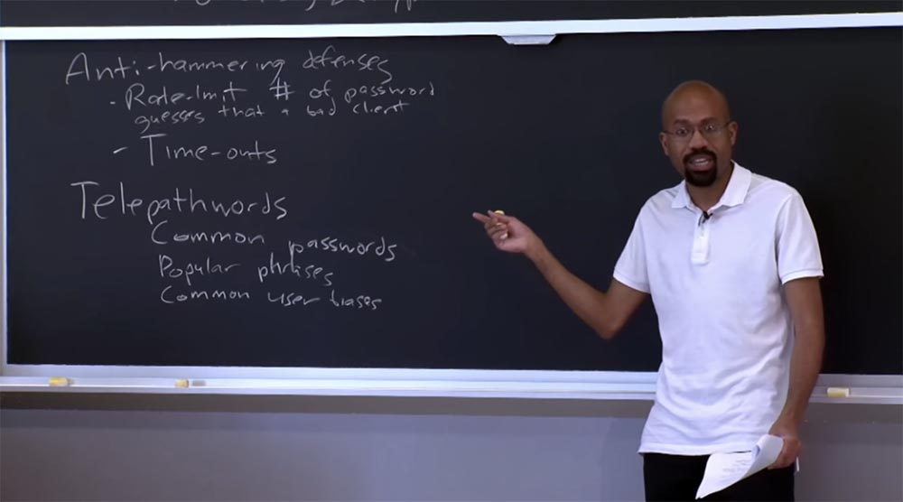
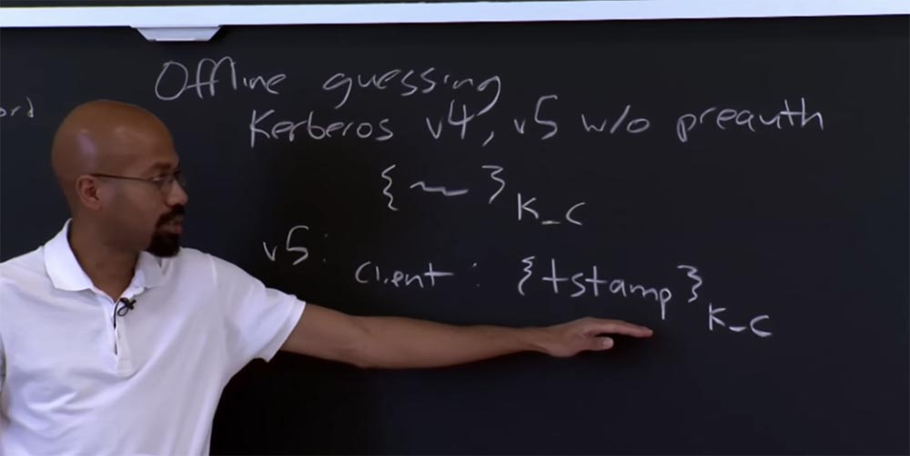
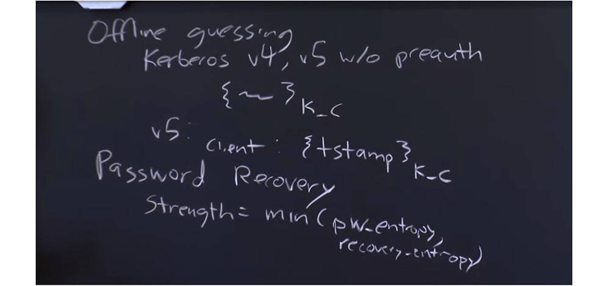
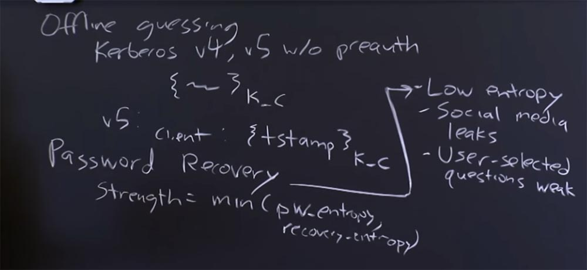
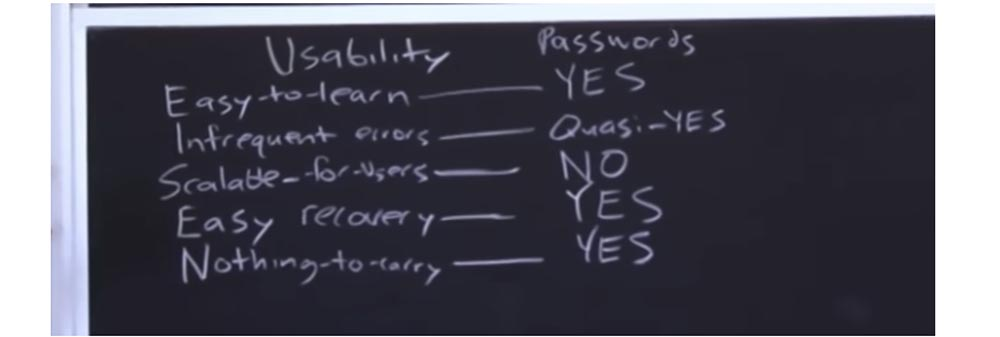
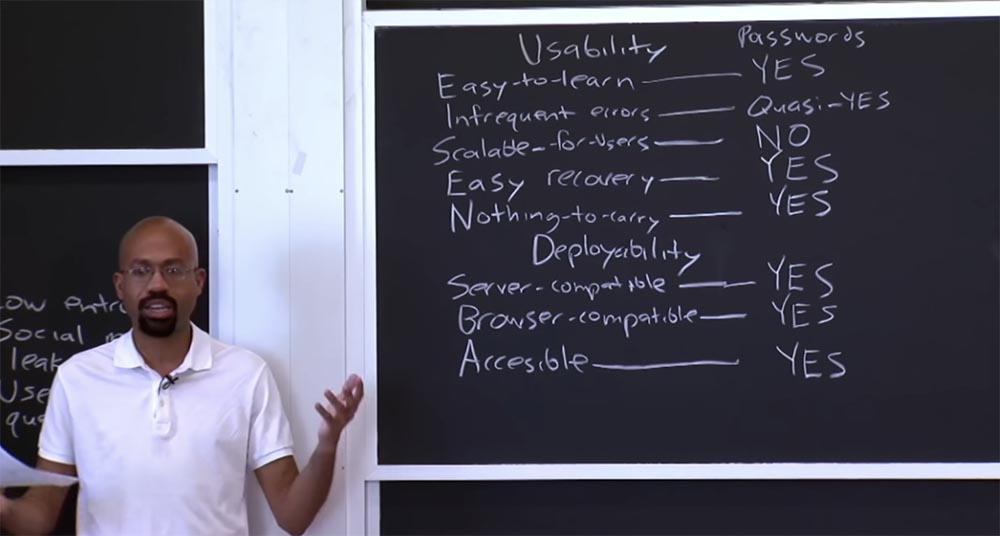
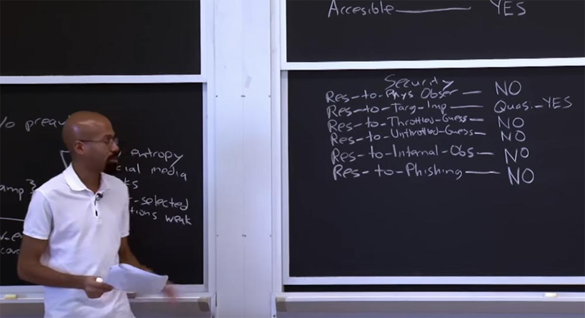
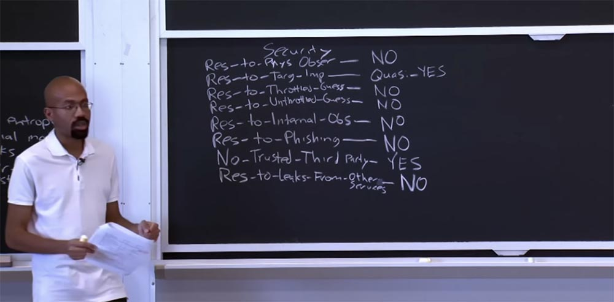

Курс MIT «Безопасность компьютерных систем». Лекция 17: «Аутентификация пользователя», часть 2 / Блог компании ua-hosting.company

### Массачусетский Технологический институт. Курс лекций #6.858. «Безопасность компьютерных систем». Николай Зельдович, Джеймс Микенс. 2014 год

Computer Systems Security — это курс о разработке и внедрении защищенных компьютерных систем. Лекции охватывают модели угроз, атаки, которые ставят под угрозу безопасность, и методы обеспечения безопасности на основе последних научных работ. Темы включают в себя безопасность операционной системы (ОС), возможности, управление потоками информации, языковую безопасность, сетевые протоколы, аппаратную защиту и безопасность в веб-приложениях.

Лекция 1: «Вступление: модели угроз» [Часть 1](https://habr.com/company/ua-hosting/blog/354874/) / [Часть 2](https://habr.com/company/ua-hosting/blog/354894/) / [Часть 3](https://habr.com/company/ua-hosting/blog/354896/)  
Лекция 2: «Контроль хакерских атак» [Часть 1](https://habr.com/company/ua-hosting/blog/414505/) / [Часть 2](https://habr.com/company/ua-hosting/blog/416047/) / [Часть 3](https://habr.com/company/ua-hosting/blog/416727/)  
Лекция 3: «Переполнение буфера: эксплойты и защита» [Часть 1](https://habr.com/company/ua-hosting/blog/416839/) / [Часть 2](https://habr.com/company/ua-hosting/blog/418093/) / [Часть 3](https://habr.com/company/ua-hosting/blog/418099/)  
Лекция 4: «Разделение привилегий» [Часть 1](https://habr.com/company/ua-hosting/blog/418195/) / [Часть 2](https://habr.com/company/ua-hosting/blog/418197/) / [Часть 3](https://habr.com/company/ua-hosting/blog/418211/)  
Лекция 5: «Откуда берутся ошибки систем безопасности» [Часть 1](https://habr.com/company/ua-hosting/blog/418213/) / [Часть 2](https://habr.com/company/ua-hosting/blog/418215/)  
Лекция 6: «Возможности» [Часть 1](https://habr.com/company/ua-hosting/blog/418217/) / [Часть 2](https://habr.com/company/ua-hosting/blog/418219/) / [Часть 3](https://habr.com/company/ua-hosting/blog/418221/)  
Лекция 7: «Песочница Native Client» [Часть 1](https://habr.com/company/ua-hosting/blog/418223/) / [Часть 2](https://habr.com/company/ua-hosting/blog/418225/) / [Часть 3](https://habr.com/company/ua-hosting/blog/418227/)  
Лекция 8: «Модель сетевой безопасности» [Часть 1](https://habr.com/company/ua-hosting/blog/418229/) / [Часть 2](https://habr.com/company/ua-hosting/blog/423155/) / [Часть 3](https://habr.com/company/ua-hosting/blog/423423/)  
Лекция 9: «Безопасность Web-приложений» [Часть 1](https://habr.com/company/ua-hosting/blog/424289/) / [Часть 2](https://habr.com/company/ua-hosting/blog/424295/) / [Часть 3](https://habr.com/company/ua-hosting/blog/424297/)  
Лекция 10: «Символьное выполнение» [Часть 1](https://habr.com/company/ua-hosting/blog/425557/) / [Часть 2](https://habr.com/company/ua-hosting/blog/425561/) / [Часть 3](https://habr.com/company/ua-hosting/blog/425559/)  
Лекция 11: «Язык программирования Ur/Web» [Часть 1](https://habr.com/company/ua-hosting/blog/425997/) / [Часть 2](https://habr.com/company/ua-hosting/blog/425999/) / [Часть 3](https://habr.com/company/ua-hosting/blog/426001/)  
Лекция 12: «Сетевая безопасность» [Часть 1](https://habr.com/company/ua-hosting/blog/426325/) / [Часть 2](https://habr.com/company/ua-hosting/blog/427087/) / [Часть 3](https://habr.com/company/ua-hosting/blog/427093/)  
Лекция 13: «Сетевые протоколы» [Часть 1](https://habr.com/company/ua-hosting/blog/427763/) / [Часть 2](https://habr.com/company/ua-hosting/blog/427771/) / [Часть 3](https://habr.com/company/ua-hosting/blog/427779/)  
Лекция 14: «SSL и HTTPS» [Часть 1](https://habr.com/company/ua-hosting/blog/427783/) / [Часть 2](https://habr.com/company/ua-hosting/blog/427785/) / [Часть 3](https://habr.com/company/ua-hosting/blog/427787/)  
Лекция 15: «Медицинское программное обеспечение» [Часть 1](https://habr.com/company/ua-hosting/blog/428652/) / [Часть 2](https://habr.com/company/ua-hosting/blog/428654/) / [Часть 3](https://habr.com/company/ua-hosting/blog/428656/)  
Лекция 16: «Атаки через побочный канал» [Часть 1](https://habr.com/company/ua-hosting/blog/429390/) / [Часть 2](https://habr.com/company/ua-hosting/blog/429392/) / [Часть 3](https://habr.com/company/ua-hosting/blog/429394/)  
Лекция 17: «Аутентификация пользователя» [Часть 1](https://habr.com/company/ua-hosting/blog/429680/) / [Часть 2](https://habr.com/company/ua-hosting/blog/429682/) / [Часть 3](https://habr.com/company/ua-hosting/blog/429686/)

Одна из интересных вещей, о которых говорится в этой статье, заключается в том, что если вы проходите все эти схемы аутентификации, то авторы говорят: «ОК, вот пароли, они вроде как отстой, и существуют другие вещи, которые обеспечивают безопасность намного лучше, но они часто дают сбой при развертывании, неудобны в использовании и тому подобное».

Это интересный и в то же время огорчительный результат этой работы, заключающийся в том, что даже если у нас есть все эти средства, обеспечивающие более высокую безопасность протоколов, мы не можем воспользоваться ими по причине крайнего неудобства.

Так что Telepathwords — это просто забавный сайт, они утверждают, что они не хранят ваши пароли, так что можете поверить им на слово, если хотите. Но очень интересно просто сесть и подумать, насколько хороший пароль я придумал? А затем ввести его сюда и посмотреть, насколько легко его угадать. Он даже позволяет делать такие вещи, как эвристический анализ популярных фраз из нескольких слов, из которых для пароля выбирается только первая буква каждого слова. Так что эта штука очень полезна.

Ещё одна интересная вещь – это то, что ваши пароли можно отгадать в режиме оффлайн. Эта уязвимость, называемая preauth, или „предварительная аутентификация“, была присуща Kerberos v4 и v5. Любой желающий мог запросить у KDC билет, зашифрованный паролем пользователя.

Таким образом, KDC не проверял подлинность запросов, поступающих от клиента. KDC возвращал в ответ на запрос набор из нескольких битов, который был зашифрован ключом клиента. Это то, что возвращалось клиенту. Проблема состояла в том, что сервер не проверял, кто отправлял этот зашифрованный набор вещей, поэтому в принципе злоумышленник мог получить эту вещь, а затем попытаться просто угадать, что такое K_C.

Просто попытайтесь угадать значение K\_C, попробуйте зашифровать его, посмотрите, выглядит ли это похоже, если нет, попробуйте угадать другой K\_C, расшифруйте, посмотрите, выглядит ли это похоже на правду, и так далее. Причина, позволяющая злоумышленнику организовать атаку такого типа, состоит в том, что эта вещь здесь, внутри скобок, этот TGT на самом деле имеет известный формат. Здесь есть что-то вроде временных меток и внутренних согласованных ссылочных полей, и всё это помогает нападающему разгадать пароль. Потому что, если злоумышленник угадывает K\_C и получает расшифрованное содержимое скобок, но внутренние поля при этом не проверяются, то злоумышленник понимает, что выбрал не тот K\_C и принимается за следующий.

В Kerberos версии 5 клиент должен передать KDC временную метку, после чего эта метка будет зашифрована с помощью K_C. Всё это отправляется серверу, сервер смотрит на этот запрос и проверяет его пред тем, как отослать что-то клиенту. Так что любой случайный клиент может прийти и просто попросить эту вещь у сервера.

**Студент:** значит, временная метка записана в сообщении? Не может ли злоумышленник просто взять и взломать это сообщение методом brute-force?

**Профессор:** давайте посмотрим. Может ли злоумышленник получить это сообщение {time stapm} K_C?

**Студент:** да, это зашифрованное сообщение.

**Профессор:** то есть вы думаете, что злоумышленник мог бы, например, просто подделать это сообщение?

**Студент:** нет, он бы использовал brute-force для подбора K_C.

**Профессор:** понятно, другими словами, вы беспокоитесь, что кто-то может подглядеть содержимое этих скобок. Я считаю, что содержимое находится внутри зашифрованной вещи, которая принадлежит серверу, или ключу, который принадлежит серверу, именно для того, чтобы предотвратить подобную атаку, но это исключительно моё мнение. Но в целом вы правы, если злоумышленнику удастся узнать временную метку в запросе клиента, это окажет ему большую пользу. В этом случае он может догадаться, в каком диапазоне могут находиться соседние временные метки, и использовать это для аналогичной атаки.

**Студент:** в этом случае нападающий должен быть «человеком посередине».  
**Профессор:** это так, злоумышленник должен быть где-то в сети между клиентом и сервером, чтобы «вынюхать» подобные вещи.

Еще одна важная вещь касается восстановления пароля. Смысл заключается в том, что если вы теряете свой пароль, то вы должны пойти в офис и попросить другой пароль. Но прежде чем вы получите этот пароль, вы должны каким-то способом доказать, что вы – это вы.

Итак, как это работает? Как можно восстановить пароль? Интересно, что люди часто сосредоточены на энтропии самого пароля. Но проблема в том, что если вопросы, используемые для восстановления пароля, или схема восстановления пароля имеет мало энтропии, это влияет на энтропию общей схемы аутентификации. Другими словами, прочность общей схемы аутентификации равна минимальной энтропии пароля и минимальной энтропии вопроса для восстановления пароля. Существует много сценариев и правил, есть достаточно известных случаев, таких как случай Сары Пэйлин. Кто-то смог восстановить её пароль обманным путем, потому что ее вопросы для восстановления пароля были такими, что любой посторонний человек мог найти на них ответ, например, прочитав о ней статью в Википедии, в которой было написано, в какую школу она ходила и так далее.

Так что часто эти вопросы для восстановления пароля не достаточно хороши по нескольким причинам. Иногда такие вещи просто имеют очень низкую энтропию. Например, если ваш вопрос для восстановления пароля «какой ваш любимый цвет», то самыми популярными ответами будут «синий» и «красный». Никто не ответит «белый», «фуксия» или «пурпурный». Таким образом, некоторые из этих вопросов для восстановления по своей сути не в состоянии обеспечить достаточно много энтропии.

Другая проблема заключается в том, что иногда ответы на вопросы для восстановления пароля могут просочиться через социальные сети. Например, если один из вопросов для восстановления пароля: «какой ваш любимый фильм», то пространство для отгадывания здесь намного больше, например, я могу просмотреть ваш профиль на сайте IMDB или Facebook и найти там название вашего любимого фильма, которое вы сами мне подсказали.

И еще одна проблема, самая смешная, это то, что сами пользователи придумывают очень слабые вопросы для восстановления, например, чему будет равно 2 плюс 3? То есть пользователь думает, что для кого-то будет большой проблемой дать правильный ответ на подобные вопросы, но большинство людей, которые проходят тест Тьюринга, могут успешно на них ответить и использовать ваш пароль.

**Студент:** можно ли вместо вопросов для восстановления пароля использовать какую-то дополнительную информацию, подобно тому, как мы вставляем в электронное письмо своё имя или коротко описываем содержание письма в заголовке – подобный подход может обеспечить безопасность вещей такого рода?

**Профессор:** я не знаю ни одного подобного исследования, но на самом деле эти вещи намного лучше. Я это знаю, потому что я пытался помочь своей подруге пройти через этот процесс. Она утратила контроль на своим аккаунтом Gmail и пыталась доказать, что это ее учетная запись. И владельцы сайта спрашивали её о таких вещах, как, например, когда именно она создала свой аккаунт, разговаривала ли она с кем-то о своём аккаунте, например, с «Хезболла», прежде чем утратила над ним контроль, и тому подобное. На самом деле это довольно трудоемкий процесс, но в конечном итоге для восстановления пароля дополнительная информация более сильная вещь, чем вопросы. Я не знаю никаких официальных исследований этой темы, но кажется, что это очевидно.

Если у вас нет вопросов, мы можем приступить к теме сегодняшней лекции, описанной в статье. Итак, авторы предлагают рассмотреть кучу факторов, которые могут использоваться для оценки эффективности схем проверки подлинности. Что действительно здорово в этой статье, так это то, что в ней говорится, что большинство из нас в сообществе безопасности борется только за эстетические принципы. Например, «мы должны выбрать это, потому что мне просто нравится, как фигурные скобки выглядят в доказательстве», или «мы должны выбрать это, потому что здесь используется много математических методов».

Они говорят, почему бы нам не попытаться установить какие-то критерии оценки эффективности? Может быть, некоторые из этих критериев будут немного субъективны, но давайте просто попробуем систематизировать способы оценки схем аутентификации. Давайте просто посмотрим, как эти различные схемы раскладываются по отдельным стопкам.

Авторы статьи предложили три высокоуровневых параметра для оценки этих схем. Первый параметр – это удобство использования, usability. Первое требование в этом параметре – легкость изучения способа аутентификации. Его основная идея заключается в том, насколько пользователям легко взаимодействовать со схемой аутентификации. Здесь они отмечают пару характерных свойств, например, легко ли обучиться данному методу, и проста ли в освоении данная схема идентификации личности пользователя.

Некоторые из этих категорий довольно просты, некоторые включают в себя немного хитростей, но в этом заключён большой смысл. Если посмотреть на пароли, то они соответствуют данному требованию, потому что все привыкли использовать пароли, поэтому мы скажем, что их использованию легко научиться, и ответим «да».

Второе требование – редкость ошибок аутентификации. Это означает, что если вы являетесь фактическим пользователем системы, то при попытке вашей аутентификации не должны происходить ошибки. И здесь в отношении паролей авторы говорят, что они условно соответствуют этому параметру. «Условно» в данном случае означает, что авторы признают наличие субъективности в своей оценке. Таким образом, на вопрос, редко ли происходят ошибки при аутентификации с помощью паролей, мы не можем определённо ответить ни «да», ни «нет».

Как правило, вы можете себя аутентифицировать, но например, когда вы пытаетесь зайти на почтовый сервер в 3 часа ночи, слабо при этом соображая, и несколько раз вводите неправильный пароль, в этом случае можно признать ошибку системы аутентификации. Поэтому они считают, что пароли условно соответствуют этому требованию.

Следующее требование — это масштабируемость для пользователей. Основная идея здесь заключается в том, что если у пользователя есть куча разных сервисов, в которых он или она хочет аутентифицировать себя, хорошо ли масштабируется эта схема? Должен ли пользователь запоминать что-то новое для каждой из схем? Здесь в отношении паролей авторы однозначно говорят «нет», так как аутентификация с помощью паролей не удовлетворяет этому требованию. Потому что на практике пользователям очень сложно запомнить отдельный пароль для каждого сайта, на который они заходят. На самом деле это одна из причин, почему люди часто используют один и то же пароль для аутентификации в разных сервисах.

Еще одно требование удобства использования – это простота восстановления. То есть что произойдет, если вы утратите токен для аутентификации, в данном случае ваш пароль, легко ли будет его сбросить? В этом случае ответ для паролей — да. На самом деле, их даже слишком легко сбросить, как мы обсуждали несколько минут назад.

Следующее требование – не требовать ничего дополнительного, не носить с собой никаких дополнительных средств для аутентификации. Например, вычурные протоколы проверки подлинности требуют, чтобы вы запустили какое-то приложение для смартфона, или имели с собой какой-то жетон безопасности, смарт-карты и тому подобное. Так что это тяжелое бремя. Может быть, со смартфоном проблем не так много, достаточно установить приложение для аутентификации, но носить с собой постоянно один из других гаджетов довольно неудобно. Поэтому хорошим свойством паролей является то, что вам придётся носить его с собой только в вашем мозгу, который вы и так должны иметь при себе постоянно.

Вот что представляют собой критерии удобства использования схемы аутентификации. В общем смысле представляет интерес то, как люди сообщества безопасности расходятся в оценках важности этих критериев. Например, они говорят: «эта штука использует миллион кусочков энтропии, и взломать её сможет только вселенская катастрофа», при этом забывая, что перечисленные выше требования тоже являются важнейшими для схем аутентификации.

Итак, следующий параметр высокого уровня, который авторы статьи используют для оценки схемы аутентификации – это развертываемость, deployability. Он характеризует, насколько легко внедрить эту систему аутентификации в существующие сетевые сервисы. Например, они смотрят на совместимость с сервером, то есть легко ли интегрировать эту схему в современные сервера, в которых аутентификация основана на использовании текстовых паролей? В этом смысле пароли полностью соответствуют данному требованию, поэтому мы можем ответить «да».

Второе требование — совместимость с браузером, оно похоже на предыдущее и говорит, могу ли я использовать эту схему аутентификации для существующих популярных браузеров без необходимости установки плагина или чего-то в этом роде? Опять-таки, здесь пароли выигрывают по умолчанию.

Ещё одно интересное требование – это доступность, excessibility. То есть смогут ли использовать эту схему аутентификации люди с какими-то физическими недостатками, например, слепые или слабослышащие, с недостаточной моторикой и тому подобное. На самом деле это довольно важное требование.

Здесь авторы еще раз говорят „да“, что немного странно, потому что не ясно, как люди с ограниченными возможностями смогут использовать пароли, но авторы говорят, что смогут.

Таковы требования, о которых следует подумать в отношении возможности развертывания данной схемы аутентификации. Причина особой важности возможности развертывания состоит в том, что чрезвычайно сложно произвести апгрейд всех этих вещей для того, чтобы внедрить новую схему, потому что людей бывает сложно заставить что-либо обновить. Я имею в виду, что часто люди даже не хотят перезагружать свои машины и устанавливать новое обновление ОС. Поэтому возникают большие сложности, если схема аутентификации требует изменений на сервере, которые заставляют людей, обслуживающих сервер, выполнять какие-либо дополнительные операции. Это имеет отношение к вашему вопросу, почему бы нам не использовать всякую дополнительную информацию или улучшения стойкости паролей. Характеристика развертываемости во многих случаях очень, очень важна для людей.

Итак, последний параметр, который мы рассмотрим, — это безопасность, security. Какие же виды нападения эта схема может предотвратить? Я обозначу эту характеристику сокращенно Res – устройчивость к foo, где foo – это любое воздействие, способное причинить вред.

Например, первая характеристика указывает на устойчивость системы к физическому наблюдению, «подглядыванию» или «подслушиванию». Смысл заключается в том, чтобы злоумышленник не смог выдать себя за настоящего пользователя после того, как несколько раз понаблюдает за его аутентификацией в системе. Представьте, что вы в компьютерном классе, а кто-то стоит у вас за плечами и наблюдает за тем, что вы печатаете. Возможно, кто-то снимает тебя на видео, может, у кого-то есть микрофон, который «снимает» акустическую подпись твоей клавиатуры и пытается извлечь из этого что-то, и так далее и так далее.

Авторы статьи говорят, что пароли не соответствуют этому требованию, потому что злоумышленник может просмотреть видеозапись и довольно легко выяснить, какие буквы вы набрали. Существуют атаки, которые используют акустические отпечатки нажатия пальца на клавиатуру для определения печатаемых символов. Так что пароли не устойчивы к физическим наблюдениям.

Следующее требование – это устойчивость к целевой выдаче себя за чужое лицо, или устойчивость к целевому олицетворению. Основная идея здесь в том, что кто-то – ваш друг, знакомый, супруг, возлюбленный сможет выдать себя за вас, используя свои знания о том, кто вы такой и что вы делаете. Авторы статьи пишут, что пароли условно соответствуют этому требованию, потому что не знают о каких-либо исследованиях, показывающих, что если вы знаете человека, то вы, скорее всего, сможете угадать его пароль. Поэтому они говорят «условно – да».  
Обратите внимание, что здесь имеется в виду целенаправленное олицетворение, при котором защита с помощью вопросов для восстановления пароля с треском проваливается, потому что если кто-то знает что-то о вас, то во многих случаях он довольно легко угадает ваши контрольные вопросы.

Далее следуют два требования, относящиеся к угадыванию. Первое – это устойчивость к интенсивному угадыванию. Это означает, что злоумышленник не сможет выдавать догадки со скоростью передачи данных по сети, например, при использовании защиты Antihammering. В этом смысле пароли небезопасны, так как легко подвергаются угадыванию методом перебора, и авторы статьи говорят «нет». Причина, почему они говорят „нет“, заключается в том, что на практике пароли не только имеют низкую энтропию наследования, потому что они не такие длинные, но и перекос в распределении. Поэтому при достаточно интенсивном переборе значений злоумышленник легко отгадывает пароли многих пользователей.

Ещё одно требование – устойчивость к не интенсивному угадыванию. Предположим, что злоумышленник может выдать запрос проверки аутентификации так быстро, как он хочет. Другими словами, злоумышленник ограничен только скоростью своего оборудования. И здесь схема аутентификации с помощью паролей также не соответствует требованию, и авторы говорят «нет» по той же причине, что и в предыдущем случае.

Таким образом, пароли преимущественно имеют очень маленькое энтропийное пространство и асимметричное распределение, так что с этим всё просто.

Следующим требованием является устойчивость к внутреннему наблюдению. Это означает, что злоумышленник не сможет выдавать себя за пользователя, установив на клиентской машине клавиатурный перехватчик, фиксирующий набор каждого символа, а также означает, что не существует никой возможности для злоумышленника подсмотреть данные, которые клиент отправляет по сети, чтобы потом выдать себя за настоящего пользователя. В этом случае пароли также не соответствуют требованиям, потому что являются статическими токенами, они не меняются, а статические токены обычно уязвимы для воспроизведения.

Так что если злоумышленник каким-то образом устанавливает клавиатурный перехватчик и получает пароль, он может использовать этот пароль до тех пор, пока не истечет срок его действия или он не будет отозван. Он сможет использовать его снова и снова для доступа к серверу. Так что пароли не проходят этот тест.

Следующее требование, о котором мы немного говорили на занятиях, это устойчивость к фишингу. Устойчивость к фишингу — еще один показатель безопасности. Здесь основная идея заключается в том, что злоумышленник может имитировать действительный сервис, например, атакуя инфраструктуру DNS или что-то в этом роде, если не может получить данные аутентификации непосредственно от пользователя, чтобы затем притвориться этим пользователем. Здесь в основном используются фальшивые сайты, которые напрямую говорят пользователю: «эй, я именно тот сервис, который вам нужен, так что можете чувствовать себя уверенно и предоставить мне свои полномочия». Пароли также не проходят эту проверку, потому что фишинговые сайты обладают огромной популярностью, и они не способны защитить от них пользователя.

Следующие два требования представляют интерес с точки зрения масштабирования системы. Первое звучит так: никакого доверия третьей стороне. По существу это означает, что в протоколе аутентификации не должен участвовать никто, кроме клиента и сервера. Это также означает, что не может быть никакой третьей стороны, которая, будучи скомпрометированной, способна нарушить безопасность всей системы аутентификации. На самом деле это интересное свойство, потому что удалось бы избежать многих проблем аутентификации, если бы можно было хранить всю нашу информацию для аутентификации в одном месте.

Мы как раз храним её в одном месте, это очень просто, потому что нам не нужно помнить кучу информации о клиенте, и мы всегда говорим, что любой сервис, которым вы хотите воспользоваться, всегда расположен у третьей стороны, и вы вынуждены к ней обращаться. Эта третья сторона всегда будет иметь возможность вас аутентифицировать и лишь затем позволит вам следовать в нужном вам направлении. Конечно, наличие третьей стороны проблематично с точки зрения надежности, потому что если вы обращаетесь к одной из этих глобальных третьих сторон, которой все доверяют, и она будет скомпрометирована, то потенциально все сайты, использующие её для аутентификации, окажутся в опасности.

Поэтому авторы статьи считают, что пароли соответствуют этому требованию, так как не используют доверие к третьей стороне, потому что каждого сайта существует свой отдельный пароль.

Родственным свойством обладает третье требование – стойкость к утечкам через сторонние сервисы, в которых происходит аутентификация. Имеется ввиду, что некоторые сервисы подвержены утечке информации, которая поможет атакующему использовать ваши данные для аутентификации в других сервисах. В основном это мошеннические схемы, когда один сайт незаконным путём может передавать ваши персональные данные другому сайту или сервису. Здесь с паролями складывается та же ситуация, что и в предыдущем требовании – если мы не доверяем никаким третьим сторонам, то мы не доверяем и сторонним системам аутентификации.  
Проблема здесь заключается в том, что стойкость всей системы равна стойкости самого слабого звена, например, HTTPS или СА. Например, если скомпрометирован один центр авторизации CA, то его сертификаты могут быть распространены по множеству сайтов. Если кто-то ошибочно выдаст сертификат СА стороне, не заслуживающей доверия, он нанесёт ущерб всем участникам системы.

Авторы статьи считают, что пароли не ответствуют этому требованию, поэтому говорят «нет». Это связано с тем, что пользователи часто используют один и тот же пароль на множестве различных сайтов. Например, если кто-то украдёт мой пароль от аккаунта Gmail, он автоматически завладеет и моим паролем для аккаунта на Facebook.

Итак, это был обзор наиболее важных категорий оценки схемы аутентификации, рассмотренных авторами статьи. Но все эти показатели имеют смысл, только если вы можете сравнить их с показателями других систем аутентификации и дать соответствующую оценку.

Одной из интересных систем аутентификации является биометрия, или биометрические данные. Мы привыкли думать о биометрии как о супер крутой штуке, которая сканирует сетчатку глаза, отпечаток пальца и так далее и поэтому выглядит очень футуристично. В действительности биометрия просто основана на учёте уникальных черт, присущих только данному индивидууму, например, телесных свойствах, особенностях жестикуляции и тому подобное.

Одной из интересных характеристик биометрии является размерность ключей, определяющая степень энтропии. Размерность ключей не настолько велика, каким должна была бы являться. Например, для отпечатков пальцев размерность ключа составляет примерно 13,3 бита, для сканирования сетчатки глаза – 19,9 бит, распознавание голоса имеет размерность ключа, или показатель энтропии порядка 11,7 бит.

54:15 сек

[Курс MIT «Безопасность компьютерных систем». Лекция 17: «Аутентификация пользователя», часть 3](https://habr.com/company/ua-hosting/blog/429686/)

Полная версия курса доступна [здесь](https://ocw.mit.edu/courses/electrical-engineering-and-computer-science/6-858-computer-systems-security-fall-2014/).

Спасибо, что остаётесь с нами. Вам нравятся наши статьи? Хотите видеть больше интересных материалов? Поддержите нас оформив заказ или порекомендовав знакомым, **30% скидка для пользователей Хабра на уникальный аналог entry-level серверов, который был придуман нами для Вас:** [Вся правда о VPS (KVM) E5-2650 v4 (6 Cores) 10GB DDR4 240GB SSD 1Gbps от $20 или как правильно делить сервер?](https://habr.com/company/ua-hosting/blog/347386/) (доступны варианты с RAID1 и RAID10, до 24 ядер и до 40GB DDR4).

**VPS (KVM) E5-2650 v4 (6 Cores) 10GB DDR4 240GB SSD 1Gbps до декабря бесплатно** при оплате на срок от полугода, заказать можно [тут](https://ua-hosting.company/vpsnl).

**Dell R730xd в 2 раза дешевле?** Только у нас **[2 х Intel Dodeca-Core Xeon E5-2650v4 128GB DDR4 6x480GB SSD 1Gbps 100 ТВ от $249](https://ua-hosting.company/serversnl) в Нидерландах и США!** Читайте о том [Как построить инфраструктуру корп. класса c применением серверов Dell R730xd Е5-2650 v4 стоимостью 9000 евро за копейки?](https://habr.com/company/ua-hosting/blog/329618/)