Курс MIT «Безопасность компьютерных систем». Лекция 17: «Аутентификация пользователя», часть 3 / Блог компании ua-hosting.company

### Массачусетский Технологический институт. Курс лекций #6.858. «Безопасность компьютерных систем». Николай Зельдович, Джеймс Микенс. 2014 год

Computer Systems Security — это курс о разработке и внедрении защищенных компьютерных систем. Лекции охватывают модели угроз, атаки, которые ставят под угрозу безопасность, и методы обеспечения безопасности на основе последних научных работ. Темы включают в себя безопасность операционной системы (ОС), возможности, управление потоками информации, языковую безопасность, сетевые протоколы, аппаратную защиту и безопасность в веб-приложениях.

Лекция 1: «Вступление: модели угроз» [Часть 1](https://habr.com/company/ua-hosting/blog/354874/) / [Часть 2](https://habr.com/company/ua-hosting/blog/354894/) / [Часть 3](https://habr.com/company/ua-hosting/blog/354896/)  
Лекция 2: «Контроль хакерских атак» [Часть 1](https://habr.com/company/ua-hosting/blog/414505/) / [Часть 2](https://habr.com/company/ua-hosting/blog/416047/) / [Часть 3](https://habr.com/company/ua-hosting/blog/416727/)  
Лекция 3: «Переполнение буфера: эксплойты и защита» [Часть 1](https://habr.com/company/ua-hosting/blog/416839/) / [Часть 2](https://habr.com/company/ua-hosting/blog/418093/) / [Часть 3](https://habr.com/company/ua-hosting/blog/418099/)  
Лекция 4: «Разделение привилегий» [Часть 1](https://habr.com/company/ua-hosting/blog/418195/) / [Часть 2](https://habr.com/company/ua-hosting/blog/418197/) / [Часть 3](https://habr.com/company/ua-hosting/blog/418211/)  
Лекция 5: «Откуда берутся ошибки систем безопасности» [Часть 1](https://habr.com/company/ua-hosting/blog/418213/) / [Часть 2](https://habr.com/company/ua-hosting/blog/418215/)  
Лекция 6: «Возможности» [Часть 1](https://habr.com/company/ua-hosting/blog/418217/) / [Часть 2](https://habr.com/company/ua-hosting/blog/418219/) / [Часть 3](https://habr.com/company/ua-hosting/blog/418221/)  
Лекция 7: «Песочница Native Client» [Часть 1](https://habr.com/company/ua-hosting/blog/418223/) / [Часть 2](https://habr.com/company/ua-hosting/blog/418225/) / [Часть 3](https://habr.com/company/ua-hosting/blog/418227/)  
Лекция 8: «Модель сетевой безопасности» [Часть 1](https://habr.com/company/ua-hosting/blog/418229/) / [Часть 2](https://habr.com/company/ua-hosting/blog/423155/) / [Часть 3](https://habr.com/company/ua-hosting/blog/423423/)  
Лекция 9: «Безопасность Web-приложений» [Часть 1](https://habr.com/company/ua-hosting/blog/424289/) / [Часть 2](https://habr.com/company/ua-hosting/blog/424295/) / [Часть 3](https://habr.com/company/ua-hosting/blog/424297/)  
Лекция 10: «Символьное выполнение» [Часть 1](https://habr.com/company/ua-hosting/blog/425557/) / [Часть 2](https://habr.com/company/ua-hosting/blog/425561/) / [Часть 3](https://habr.com/company/ua-hosting/blog/425559/)  
Лекция 11: «Язык программирования Ur/Web» [Часть 1](https://habr.com/company/ua-hosting/blog/425997/) / [Часть 2](https://habr.com/company/ua-hosting/blog/425999/) / [Часть 3](https://habr.com/company/ua-hosting/blog/426001/)  
Лекция 12: «Сетевая безопасность» [Часть 1](https://habr.com/company/ua-hosting/blog/426325/) / [Часть 2](https://habr.com/company/ua-hosting/blog/427087/) / [Часть 3](https://habr.com/company/ua-hosting/blog/427093/)  
Лекция 13: «Сетевые протоколы» [Часть 1](https://habr.com/company/ua-hosting/blog/427763/) / [Часть 2](https://habr.com/company/ua-hosting/blog/427771/) / [Часть 3](https://habr.com/company/ua-hosting/blog/427779/)  
Лекция 14: «SSL и HTTPS» [Часть 1](https://habr.com/company/ua-hosting/blog/427783/) / [Часть 2](https://habr.com/company/ua-hosting/blog/427785/) / [Часть 3](https://habr.com/company/ua-hosting/blog/427787/)  
Лекция 15: «Медицинское программное обеспечение» [Часть 1](https://habr.com/company/ua-hosting/blog/428652/) / [Часть 2](https://habr.com/company/ua-hosting/blog/428654/) / [Часть 3](https://habr.com/company/ua-hosting/blog/428656/)  
Лекция 16: «Атаки через побочный канал» [Часть 1](https://habr.com/company/ua-hosting/blog/429390/) / [Часть 2](https://habr.com/company/ua-hosting/blog/429392/) / [Часть 3](https://habr.com/company/ua-hosting/blog/429394/)  
Лекция 17: «Аутентификация пользователя» [Часть 1](https://habr.com/company/ua-hosting/blog/429680/) / [Часть 2](https://habr.com/company/ua-hosting/blog/429682/) / [Часть 3](https://habr.com/company/ua-hosting/blog/429686/)

Так что безопасность биометрии относительна – вы видите, какой энтропией она обладает, это не намного лучше энтропии паролей. Если вы помните, энтропия паролей колеблется в пределах от 10 до 20 бит. Это немного тревожно, однако всё равно позволяет сравнить биометрию с паролями. Итак, по мнению авторов, биометрия легка для изучения, потому что вам достаточно расположить своё тело определённым образом, приблизить глаз к сканеру сетчатки и так далее, так что в этом смысле биометрия и пароли одинаково соответствуют требованиям.

**Студент:** чем обусловлены именно такие предельные значения энтропии, например, отпечатка пальца и сетчатки?

**Профессор:** я думаю, что эти значения обусловлены используемым оборудованием, «железом». Если у вас имеется сканер с большим разрешением сканирования, то эти показатели энтропии будут выше. Я думаю, что имеется некий минимальный гарантируемый предел распознавания индивидуальности, такой, как ДНК и подобное, и очевидно, что это не фундаментальные пределы энтропии.

Итак, авторы говорят, что биометрия легко изучаема, потому что легко научиться пользоваться сканерами. Интересно, что биометрия обладает некоторыми особенностями, поэтому она подвержена искажениям больше, чем пароли. Например, ваш голос может измениться, вы можете охрипнуть из-за простуды, поэтому биометрия не соответствует требованию редких ошибок при использовании и авторы пишут здесь слово «нет».

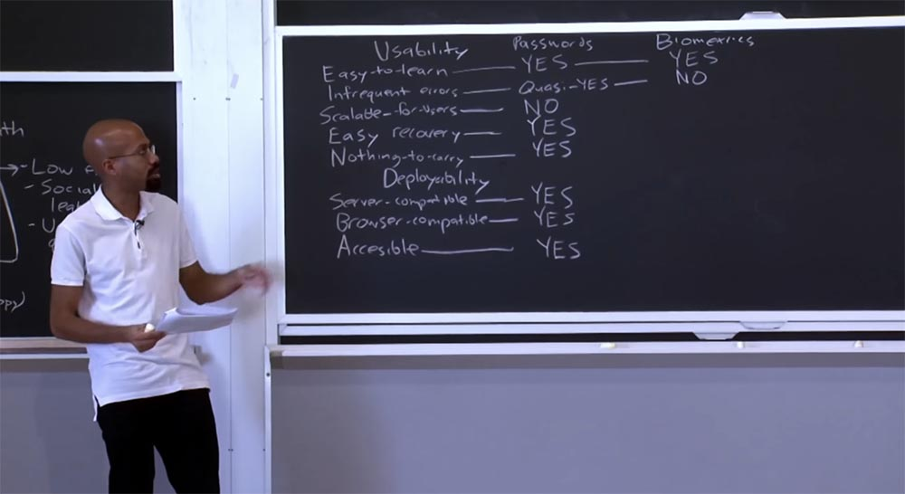

Требование масштабируемости соблюдается, поэтому авторы указывают «да». Биометрия ему соответствует, потому что в основном вы предоставляете самого себя в распоряжение сервисов, в которых хотите авторизоваться, так что это очень хорошая возможность биометрии.

По отношению к требованию легкого восстановления авторы указывают несоответствие и пишут «нет». Потому что если кто-то украдёт отпечаток вашей сетчатки для аутентификации, восстановить ваш доступ будет очень проблематично, так как вы же не сможете обзавестись новыми глазами. Поэтому легкое восстановление в отношении биометрии является большой проблемой.

Требование «ничего дополнительного», то есть возможность не использовать никаких дополнительных приспособлений для аутентификации здесь полностью выполняется, потому что всё необходимое для аутентификации вы автоматически носите с собой.

В отношении требований развертываемости биометрия не обладает особыми преимуществами по сравнению с паролями. Она не соответствует требованию совместимости с серверами. Она также не соответствует требованию совместимости с браузерами, потому что браузеры не имеют сканеров сетчатки глаз и тому подобных вещей.

Требование доступности выполняется условно, поэтому авторы указывают «условно да».

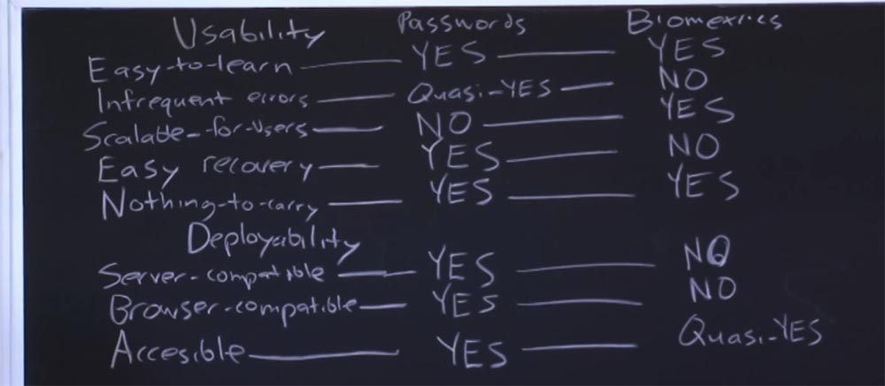

Я думаю, эта условность объясняется возможными ошибками ввода данных для людей с ограниченными возможностями и некоторыми трудностями использования биометрии даже обычными людьми, а также сложными физическими аспектами данной схемы. Таким образом, доступность биометрии находится на низком уровне, что довольно огорчительно.

Рассмотрим требования безопасности. В отношении стойкости к физическому наблюдению авторы говорят «да». Здесь имеется ввиду, что если кто-то следит, как вы используете сканер радужной оболочки глаза или сканер отпечатков пальцев, это не даст ему никаких возможностей выдать себя за вас. Возможно, по отношению к распознаванию голоса это не слишком надёжно, так как голос можно записать и воспроизвести.

**Студент:** однако злоумышленник может сделать вашу фотографию, использовать особое копирующее стекло и получить отпечаток сетчатки в высоком разрешении или даже может скопировать отпечатки ваших пальцев на особую плёнку.

**Профессор:** вы правы, здесь существуют трудности, потому что, используя научный подход к современным технологиям, кто-то может попытаться выдать себя за вас, однако в отношении безопасности существует специальная методология для предотвращения таких возможностей. Именно поэтому в некоторых случаях авторы статьи не говорят «да» категорически, а используют «условное да», то есть условное соответствие требованиям. Но здесь имеется в виду именно физическое наблюдение, а не использование каких-то технических средств для кражи ваших биометрических параметров.

В отношении сопротивляемости к целевой выдаче себя за другое лицо авторы указывают «нет» как раз по тем причинам, о которых вы только что говорили. Потому что если я захочу выдать себя именно за вас, я найду стекло, которое скопирует отпечаток вашей сетчатки или использую плёнку, на которой останутся копии отпечатков ваших пальцев, и смогу использовать это для своей преступной деятельности.

Авторы указывают, что биометрия устойчива к попыткам интенсивного угадывания, но не стойка к не интенсивному угадыванию. Причина заключается в следующем. В первом случае злоумышленник не может противостоять защите Antihammering, но если он сможет заниматься отгадыванием с такой скоростью, с какой захочет, то здесь дело обстоит по-другому. Если помните, энтропия биометрии недостаточно велика. Поэтому если у нас есть тот, кто использует не форсированное отгадывание, мы говорим «нет», биометрия в этом смысле слаба.

По отношению к предыдущему требовани�� мы можем сказать, что хотя биометрия имеет небольшое пространство энтропии, она обладает большим случайным распределением показателей в пределах этого пространства энтропии. В этом её отличие от паролей, потому что пароли имеют и маленькое пространство энтропии, и тесно расположенные кластеры значений внутри него.

Требование стойкости к внутреннему наблюдению биометрия не выдерживает, авторы говорят здесь «нет». Это потому, что кто-то может повредить считыватель отпечатков пальцев и получить доступ к вашему отпечатку, который по существу является статическим секретом и может неоднократно использоваться.

В отношении стойкости к фишингу авторы также говорят «нет». По отношению отсутствия доверия к третьей стороне указывается «да». Интерес представляет требование к сопротивлению утечке через другие сервисы – здесь они говорят «нет». Здесь практически та же причина, по которой этому требованию не соответствуют пароли, потому что ваши биометрические данные представляют собой статические токены. Поэтому если я использую свой отпечаток сетчатки для аутентификации на Amazon.com, и с него происходит утечка данных, то ваши данные можно будет использовать для персонификации на Facebook.

Итак, что означают два столбца с этими «да», «условно да» и «нет»? Один, всего лишь один из многих способов толкования этого, состоит в том, что мы можем просуммировать полученные результаты.

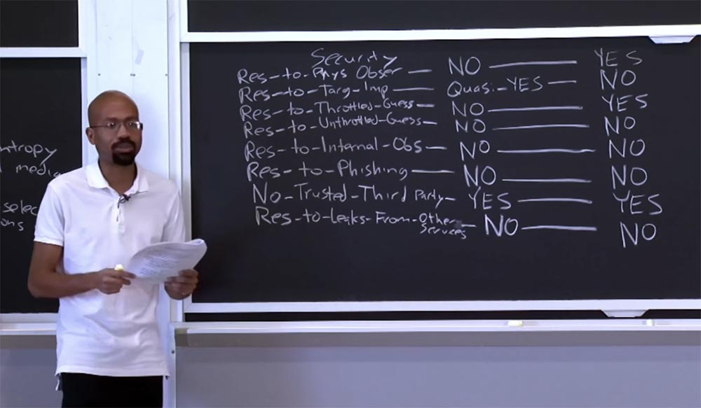

Давайте считать, что каждое «да» соответствует 1 баллу, каждое «нет» соответствует 0 баллов, а каждое условное «да» равно 0,5 балла. Вы должны понимать, что если подобная схема оценки если и не полностью случайна, то она всё-таки достаточно случайна.

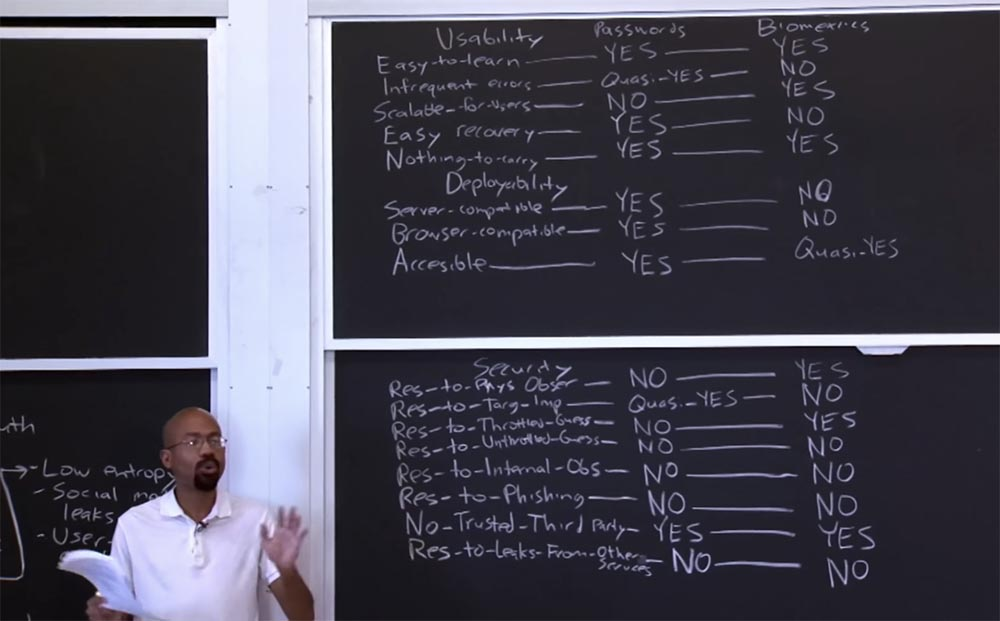

Однако это довольно интересное упражнение для понимания того, о чём говориться в лекционной статье. Итак, подсчитаем результат для всех параметров таблицы. Мы увидим, что пароли набирают суммарную оценку 8 баллов, а биометрия – 6,5 балла. И что же означают эти 2 числа?

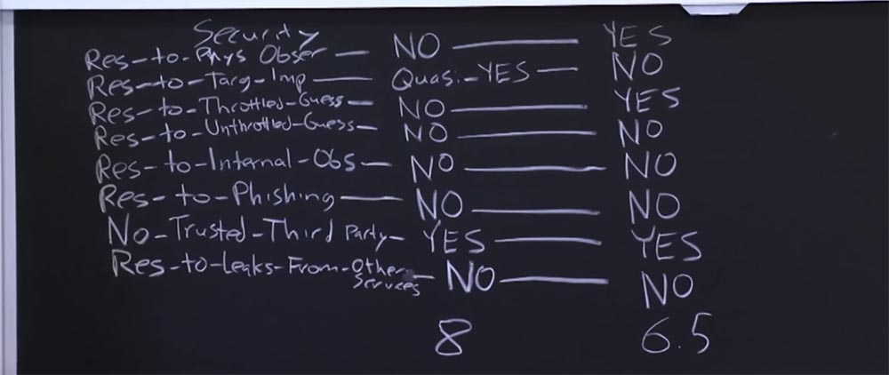

Я считаю, что это очень интересные числа, потому что они имеют не количественную, а качественную характеристику. Эти цифры не означают, что при разработке схем безопасности нужно строго учитывать данные результаты, они лишь показывают, что биометрия не сметает пароли со счетов. Это не означает, что мы намного успешнее сможем сопротивляться атакам brute-force, используя пароли, просто авторы статьи, разместив эту таблицу, рекомендуют обратить внимание на то, что в чём-то пароли лучше, в чём-то хуже биометрии, и что биометрия так же обладает как преимуществами, так и недостатками.

Это означает, что в конкретной ситуации безопасности вы можете сравнить показатели и выбрать наиболее подходящие факторы защиты. Таким образом, эти баллы показывают, что оба эти способа аутентификации в чём-то сильны, а в чём-то слабы.

Итак, рассмотрев эту таблицу, можно сказать, что очень трудно утверждать, что какая-то схема аутентификации имеет подавляющие преимущества относительно другой. Поэтому стоит задуматься, как можно объединить несколько разных схем аутентификации. Авторы попробовали воплотить эту идею в схеме, которую назвали «многофакторной аутентификацией», Multi-factor authentication, или MFA. Её идея состоит в том, чтобы использовать углублённую защиту, то есть заставить пользователя применять два или более различных механизма аутентификации. Каждый из этих механизмов должен использовать разные процедуры, или условия. Подразумевается, что эти механизмы должны иметь разные способы проверки подлинности.

Например, один из этих механизмов одновременно должен использовать:

*   что-то, что вы знаете, например, пароль;
*   что-то, чем вы располагаете, например, сотовый телефон или смарт-карта;
*   что-то, чем вы являетесь, например, биометрический показатель.

Идея состоит в том, что если вы используете что-то наподобие такого механизма, атакующий должен будет похитить множество различных вещей, чтобы суметь выдать себя за вас. Например, хакер сможет украсть ваш пароль, но не сможет украсть ваш телефон. Наиболее распространённым примером такого механизма является двухфакторная аутентификация Google, например, в аккаунте Gmail.

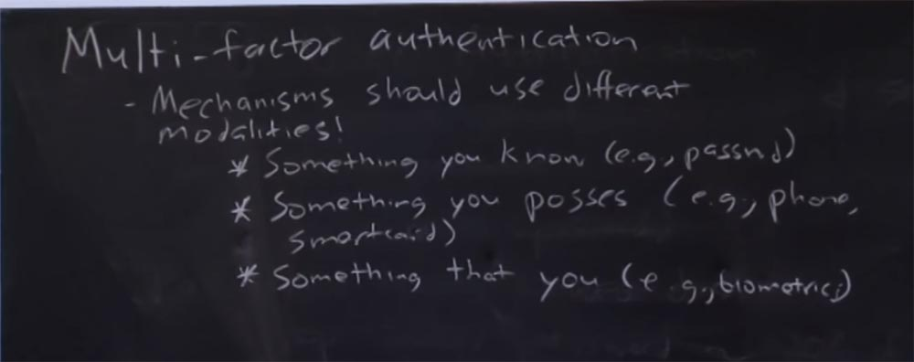

Предположим, у вас есть пароль для входа в почту, но кроме того, вам на телефон приходит текстовое сообщение с кодом, которое вы должны использовать для подтверждения того, что данный почтовый ящик принадлежит именно вам. И если вы вводите этот код, то это означает, что если кто-то завладел вашим паролем, то телефон всё ещё принадлежит вам. Таким образом, этот механизм защищает вас от тотального взлома.

AWS, безопасный облачный сервис «Амазон», также использует двухфакторную аутентификацию для своих служб, и вы проходите такую аутентификацию, чтобы, например, управлять своей виртуальной машиной и тому подобное. У них имеется также функция установки на телефон мобильного приложения, позволяющего ввод вашего пароля. Также они используют вещь, называемую custom security dongle, или электронный ключ безопасности пользователя, позволяющий вам произвести двухфакторную аутентификацию.

Всё это выглядит очень хорошо, но существует вещь, омрачающая использование двухфакторной аутентификации. Опыт показывает, что если вы предоставляете пользователю второй способ аутентификации помимо паролей, то пользователь начинает применять более слабые пароли. Потому что он считает, что раз его конфиденциальность обеспечивают два механизма безопасности, то пароль может быть совсем простым. Можно сделать вывод, что иногда, чем больше защиты вы предоставляете пользователям, тем несерьёзнее они относятся к другим, дополнительным мерам защиты.

**Студент:** многие сервисы используют для идентификации 4 последних цифры кредитной карты, которые легко можно угадать.

**Профессор:** вы правы, в этом смысле использование кредитных карт очень интересно, потому что кроме этих 4 цифр защита использует множество других схем предотвращения мошенничества, но с точки зрения машинного подсчёта комбинаций цифр это довольно интересно. Вы могли заметить, что если используете свою карту за рубежом, то после того, как вы вставили её в банкомат, вам могут позвонить из банка и спросить: «Это вы использовали сейчас свою карту?», и вы отвечаете: «да-да, это я её использовал» Так что с банкоматами обеспечить безопасность намного легче, чем когда вы используете свою карту на веб-сайтах или для покупок в интернет-магазинах.

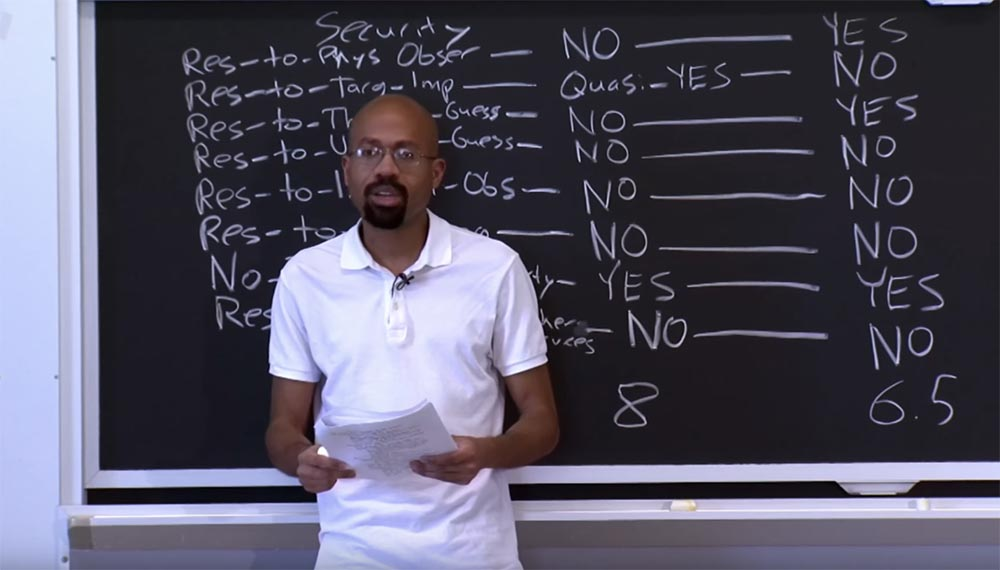

Потому что по некоторым причинам данные вашей карты могут оказаться за пределами вашего защищённого профиля. Например, во многих книжных интернет-магазинах типа «Мой маленький пони», если вы не введёте пароль подтверждения операции, высланный на вашу электронную почту или на телефон в течение нескольких минут, ваша кредитная карта блокируется. Причина, по которой они так делают, заключается в том, что им приходится выбирать между интересами человека, который может принести им деньги, и интересами злоумышленника, который может их этих денег лишить. Это способ обеспечения безопасности, размещаемый на заднем плане инфраструктуры сайта электронной коммерции, которая использует машинную аналитику для предотвращения мошенничества и подобных угроз.

Итак, каковы могут быть ответы на вопросы домашнего задания? Например, на вопрос, какие потенциальные факторы влияют на выбор схемы аутентификации в целой куче различных сценариев. Я имею ввиду, что на высоком уровне отсутствуют чёткие понятия, что данный способ аутентификации является верным или неверным. Нужно опираться на результат нашего сегодняшнего обсуждения и подходить к этому так: «в этом сценарии я больше подумаю о таком способе аутентификации, а в этом сценарии – о другом способе».

Например, один из вопросов касается аутентификации на публичных компьютерах университетской системы Athena и как об этом позаботились разработчики системы.

Возможно, что одной вещью, которую будет довольно трудно обеспечить в данном случае, является сопротивляемость внутреннему наблюдению. Потому что в этом случае у нас может иметь место вредоносное ПО, неизвестные компьютеры в сети и так далее. Возможно, с учётом этого вам следует подумать о биометрии, которая в этом случае кажется хорошей идеей. Потому что в большинстве случаев считыватель биометрических показателей является предпочтительным и доверенным оборудованием, потому что очень трудно подделать параметры вашей сетчатки или отпечатков пальцев.

Правда, в случае, если вы не можете гарантировать устойчивость к внутреннему наблюдению, биометрия может быть плохой идеей, потому что, например, кража чьих-то отпечатков пальцев из базы данных может нанести ущерб, потому что эта информация использовалась для доступа ко всем сервисам «Афины».

Так что если вернуться к вопросу, о каких вещах следует позаботиться в первую очередь, то здесь могут быть самые разные ответы. Например, банки в значительной степени должна заботить безопасность банкоматов ATM, поэтому первостепенным требованием здесь должна быть сопротивляемость физическому наблюдению.

То есть если я имею возможность наблюдать, как вы взаимодействуете с банкоматом, это не должно дать мне возможность выдать себя за вас. Кроме этого, стоит подумать и о ворах, потому что если я потеряю свою кредитную карту, не должно быть так, чтобы кто-то мог ею воспользоваться для покупки вещей без моего ведома. Если вернуться к сказанному выше, безопасность банковской карты должны обеспечиваться разными механизмами.

Если взглянуть на это с точки зрения использования биометрии, возникает вопрос – доверяют ли банки банкоматам? Доверяют ли они этим физическим терминалам? С одной стороны, можно сказать «да», потому что их создали сами банки, но с другой стороны, только Зевс знает, что с ними может происходить. В некоторых странах достаточно популярна схема использования фейковых банкоматов, или банкоматов «под прикрытием», устройств, внешне схожих с настоящими ATM. Когда вы вставляете в него карту, на пути между вами и банком находится считыватель злоумышленника, ворующий вашу информацию, либо этот фальшивый банкомат вообще не общается с банком, а просто крадёт ваши данные. Так что, возможно, банк не должен доверять этим терминалам. И в этом случае биометрия не будет хорошей идеей. Она может казаться хорошей идеей, однако вы не защищены от того, что кто-то украдёт ваши деньги, даже если его параметры не совпадают с вашей биометрической идентификацией.

Хорошей идеей является размещение в банкоматах двух разных уровней безопасности в зависимости от того, собираюсь ли я что-то прочитать в своём счёте или же что-то туда вписать, под понятием «вписать» я имею ввиду «потратить свои деньги». Например, если я хочу посмотреть баланс на счету, достаточно просто ввести пароль, но если я хочу снять деньги, нужно задействовать другую схему аутентификации, например, прислать что-то на мой телефон. Так что для того, чтобы полностью доверять этому автомату, необходима двухфакторная аутентификация, защищающая ваши транзакции.

Таким образом, лекционная статья утверждает, что преимущества той или иной схемы аутентификации зависят от конкретных условий, в которых она может использоваться.  
Интересной вещью, которая упоминается только в расширенной версии статьи, является CAP – ридер (CAP — Chip Authentication Program, или программа аутентификации чипа). Потому что сокращенная версия статьи заканчивается выводом, что не существует абсолютно никакой схемы аутентификации, которая бы четко проявила свои преимущества по сравнению с паролями.

Что же такое CAP – ридер? Коротко говоря, эта вещь защищает транзакции, проводимые с помощью кредитной карты. Она выглядит как маленький карманный калькулятор.

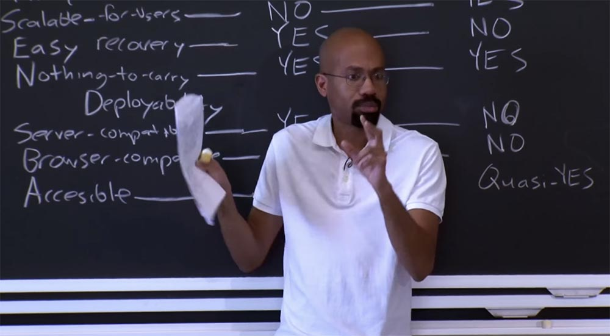

Вы вставляете в него свою карту и вводите свой PIN-код. Говоря абстрактно, он разработан специально для вашей MasterCard, и она ему доверяет, потому что никто не может обновить прошивку этого CAP – ридера и никто не может установить на него какую-то вредоносную программу типа клавиатурного перехватчика. Итак, вы вставляете свою карту в этот доверенный терминал, вводите PIN, и он выводит на экран 8-мизначный код. Этот код вы можете использовать, например, для веб-сервиса, для того, чтобы подтвердить, что именно вы являетесь владельцем конкретной кредитной карты. Это физический аспект использования механизма безопасности.

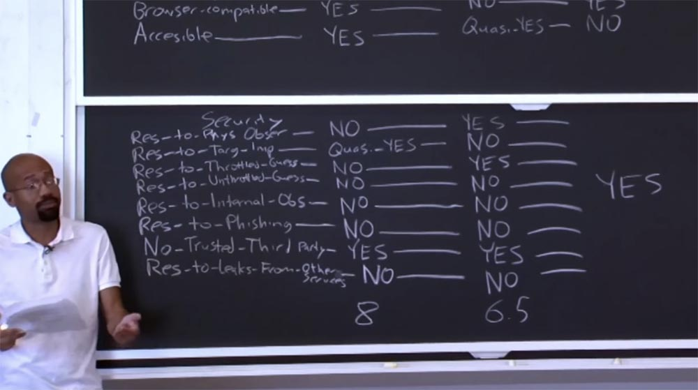

В расширенной версии статьи о CAP-ридере говорится, что его использованию легко обучиться, потому авторы статьи пишут в этой строке таблицы сравнения характеристик «да». Относительно редкости ошибок при использовании они пишут «условно да», по той же причине, по которой они отметили «условно да» для паролей. Например, вы можете совершить ошибку при вводе своего PIN-кода и тому подобное.

По отношению к выполнению требования масштабируемости для пользователя они пишут «нет», потому что вы должны иметь разные PIN-коды для разных карт, и, возможно, даже для разных CAP – ридеров.

Легкость восстановления также отмечается словом «нет», потому что если вы потеряете свой CAP – ридер или карту, попытка восстановления своей идентичности причинит вам множество хлопот. Естественно, этот ридер не соответствует требованию ничего не носить с собой, потому что вы обязаны иметь CAP – ридер для своей карты.

В параметрах развёртываемости авторы отмечают «нет» по отношению к совместимости с сервером, потому что сервер не используют никаких специальных протоколов для совместной работы с этими ридерами. Это устройство характеризуется совместимостью с браузерами, здесь авторы указывают «да», потому что CAP-ридеры можно использовать, применив HTML или JavaScripts на конечной стадии аутентификации.

CAP-ридер не соответствует требованию доступности, потому что люди с ограниченными возможностями могут испытывать затруднения с прочтением 8-мизначного кода, который он выдаёт.

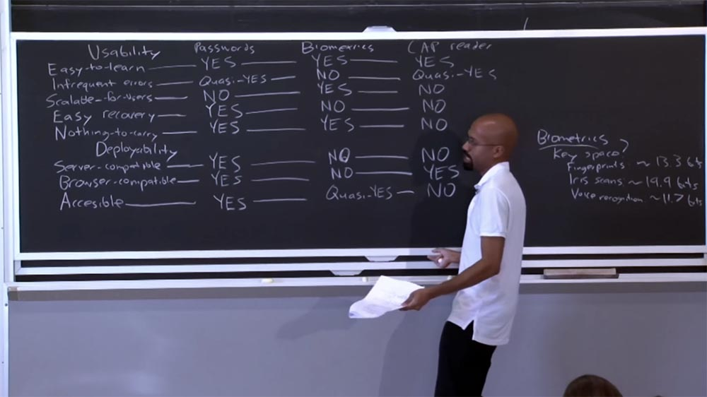

В отношении вопроса безопасности данное устройство доминирует, потому что соответствует каждому перечисленному требованию. Это потому, что 8-мизначный код, который формирует CAP-ридер, является одноразовым. Каждый раз, когда вы собираетесь совершить новую транзакцию, он выдаёт уникальный набор цифр, который никогда не будет использован повторно.

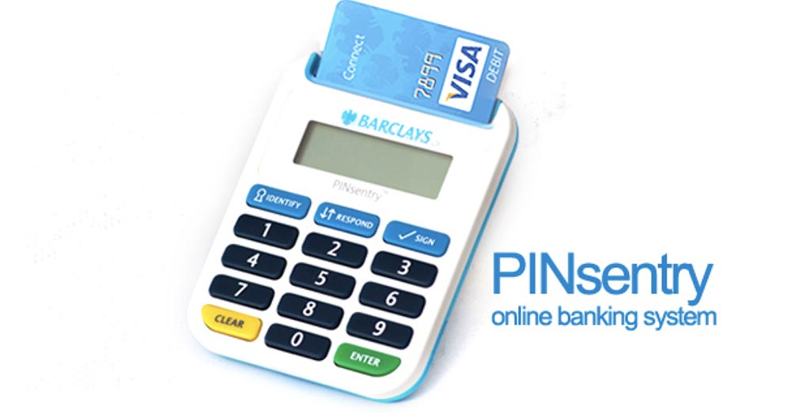

Например, он обладает стойкостью к физическому наблюдению, потому что если кто-то посторонний подсмотрит ваш код, он не сможет использовать его снова, ведь в отличие от пароля, это не статический токен.

Аналогично обстоит ситуация со стойкостью к интенсивному отгадыванию, потому что угаданные значения просто пропадают. Даже если вы перехватите мой код, вы всё равно не сможете использовать его, чтобы выдать себя за меня. Опять-таки, стойкость к утечкам через сторонние сервисы объясняется тем, что код — одноразовая вещь.

Таким образом, CAP-ридер в этой таблице с легкостью проходит требования безопасности. Так почему же люди до сих пор широко не используют эти CAP-ридеры на практике? Почему так происходит? Если посмотреть на бальную оценку, то эти ридеры получают оценку 10,5 баллов!

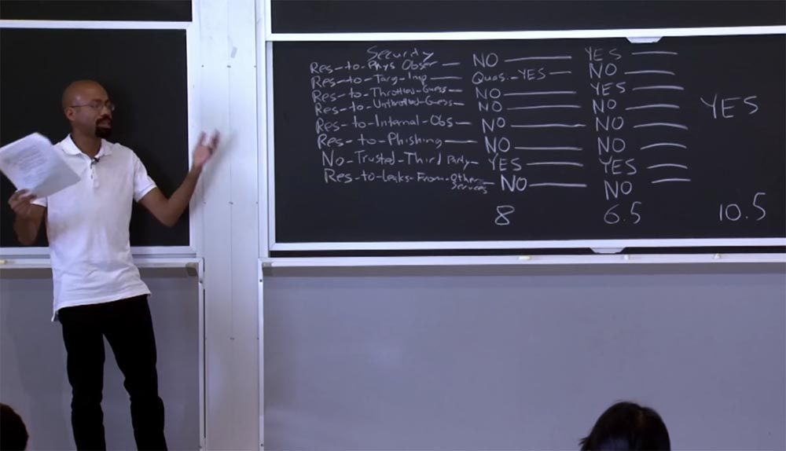

Дело в том, что в реальной жизни они не являются оптимальным балансом между требованиями безопасности и удобством применения. Люди не хотят носить CAP-ридеры с собой, они не хотят вникать во все эти протоколы, брать эти 8-мизначные величины и вводить их куда-то на веб-сайте. На практике оказывается, что удобство использования и развёртываемость часто оказываются важнее безопасности. Потому что разработчики заинтересованы в механизмах, которые бы не увеличивали стоимость пользования их сервисами, а клиенты не хотят испытывать никаких затруднений при использовании подобных вещей. Стоит заметить, что даже если пользователи свободны в выборе параметров схемы безопасности, они всё равно чаще выбирают короткие пароли, слабы вопросы и так далее.

Поэтому использование таких вещей, как CAP-ридеры или смарт-карты, оправдано в компаниях или крупных корпорациях, где смарт-карты применяют, например, для входа в здание, или же на военных предприятиях, где преимущества систем безопасности, основанные на аппаратном обеспечении, или «железе», превалируют над проблемами использования или развертываемости. Но в большинстве случаев подобные механизмы аутентификации отвергаются обычными пользователями.

Поэтому при создании схемы аутентификации для широкого круга пользователей вы должны больше сосредотачиваться не на безопасности, а на удобстве и простоте использования. На этом всё, увидимся в следующий понедельник!

Полная версия курса доступна [здесь](https://ocw.mit.edu/courses/electrical-engineering-and-computer-science/6-858-computer-systems-security-fall-2014/).

Спасибо, что остаётесь с нами. Вам нравятся наши статьи? Хотите видеть больше интересных материалов? Поддержите нас оформив заказ или порекомендовав знакомым, **30% скидка для пользователей Хабра на уникальный аналог entry-level серверов, который был придуман нами для Вас:** [Вся правда о VPS (KVM) E5-2650 v4 (6 Cores) 10GB DDR4 240GB SSD 1Gbps от $20 или как правильно делить сервер?](https://habr.com/company/ua-hosting/blog/347386/) (доступны варианты с RAID1 и RAID10, до 24 ядер и до 40GB DDR4).

**VPS (KVM) E5-2650 v4 (6 Cores) 10GB DDR4 240GB SSD 1Gbps до декабря бесплатно** при оплате на срок от полугода, заказать можно [тут](https://ua-hosting.company/vpsnl).

**Dell R730xd в 2 раза дешевле?** Только у нас **[2 х Intel Dodeca-Core Xeon E5-2650v4 128GB DDR4 6x480GB SSD 1Gbps 100 ТВ от $249](https://ua-hosting.company/serversnl) в Нидерландах и США!** Читайте о том [Как построить инфраструктуру корп. класса c применением серверов Dell R730xd Е5-2650 v4 стоимостью 9000 евро за копейки?](https://habr.com/company/ua-hosting/blog/329618/)