Курс MIT «Безопасность компьютерных систем». Лекция 18: «Частный просмотр интернета», часть 2 / Блог компании ua-hosting.company

### Массачусетский Технологический институт. Курс лекций #6.858. «Безопасность компьютерных систем». Николай Зельдович, Джеймс Микенс. 2014 год

Computer Systems Security — это курс о разработке и внедрении защищенных компьютерных систем. Лекции охватывают модели угроз, атаки, которые ставят под угрозу безопасность, и методы обеспечения безопасности на основе последних научных работ. Темы включают в себя безопасность операционной системы (ОС), возможности, управление потоками информации, языковую безопасность, сетевые протоколы, аппаратную защиту и безопасность в веб-приложениях.

Лекция 1: «Вступление: модели угроз» [Часть 1](https://habr.com/company/ua-hosting/blog/354874/) / [Часть 2](https://habr.com/company/ua-hosting/blog/354894/) / [Часть 3](https://habr.com/company/ua-hosting/blog/354896/)  
Лекция 2: «Контроль хакерских атак» [Часть 1](https://habr.com/company/ua-hosting/blog/414505/) / [Часть 2](https://habr.com/company/ua-hosting/blog/416047/) / [Часть 3](https://habr.com/company/ua-hosting/blog/416727/)  
Лекция 3: «Переполнение буфера: эксплойты и защита» [Часть 1](https://habr.com/company/ua-hosting/blog/416839/) / [Часть 2](https://habr.com/company/ua-hosting/blog/418093/) / [Часть 3](https://habr.com/company/ua-hosting/blog/418099/)  
Лекция 4: «Разделение привилегий» [Часть 1](https://habr.com/company/ua-hosting/blog/418195/) / [Часть 2](https://habr.com/company/ua-hosting/blog/418197/) / [Часть 3](https://habr.com/company/ua-hosting/blog/418211/)  
Лекция 5: «Откуда берутся ошибки систем безопасности» [Часть 1](https://habr.com/company/ua-hosting/blog/418213/) / [Часть 2](https://habr.com/company/ua-hosting/blog/418215/)  
Лекция 6: «Возможности» [Часть 1](https://habr.com/company/ua-hosting/blog/418217/) / [Часть 2](https://habr.com/company/ua-hosting/blog/418219/) / [Часть 3](https://habr.com/company/ua-hosting/blog/418221/)  
Лекция 7: «Песочница Native Client» [Часть 1](https://habr.com/company/ua-hosting/blog/418223/) / [Часть 2](https://habr.com/company/ua-hosting/blog/418225/) / [Часть 3](https://habr.com/company/ua-hosting/blog/418227/)  
Лекция 8: «Модель сетевой безопасности» [Часть 1](https://habr.com/company/ua-hosting/blog/418229/) / [Часть 2](https://habr.com/company/ua-hosting/blog/423155/) / [Часть 3](https://habr.com/company/ua-hosting/blog/423423/)  
Лекция 9: «Безопасность Web-приложений» [Часть 1](https://habr.com/company/ua-hosting/blog/424289/) / [Часть 2](https://habr.com/company/ua-hosting/blog/424295/) / [Часть 3](https://habr.com/company/ua-hosting/blog/424297/)  
Лекция 10: «Символьное выполнение» [Часть 1](https://habr.com/company/ua-hosting/blog/425557/) / [Часть 2](https://habr.com/company/ua-hosting/blog/425561/) / [Часть 3](https://habr.com/company/ua-hosting/blog/425559/)  
Лекция 11: «Язык программирования Ur/Web» [Часть 1](https://habr.com/company/ua-hosting/blog/425997/) / [Часть 2](https://habr.com/company/ua-hosting/blog/425999/) / [Часть 3](https://habr.com/company/ua-hosting/blog/426001/)  
Лекция 12: «Сетевая безопасность» [Часть 1](https://habr.com/company/ua-hosting/blog/426325/) / [Часть 2](https://habr.com/company/ua-hosting/blog/427087/) / [Часть 3](https://habr.com/company/ua-hosting/blog/427093/)  
Лекция 13: «Сетевые протоколы» [Часть 1](https://habr.com/company/ua-hosting/blog/427763/) / [Часть 2](https://habr.com/company/ua-hosting/blog/427771/) / [Часть 3](https://habr.com/company/ua-hosting/blog/427779/)  
Лекция 14: «SSL и HTTPS» [Часть 1](https://habr.com/company/ua-hosting/blog/427783/) / [Часть 2](https://habr.com/company/ua-hosting/blog/427785/) / [Часть 3](https://habr.com/company/ua-hosting/blog/427787/)  
Лекция 15: «Медицинское программное обеспечение» [Часть 1](https://habr.com/company/ua-hosting/blog/428652/) / [Часть 2](https://habr.com/company/ua-hosting/blog/428654/) / [Часть 3](https://habr.com/company/ua-hosting/blog/428656/)  
Лекция 16: «Атаки через побочный канал» [Часть 1](https://habr.com/company/ua-hosting/blog/429390/) / [Часть 2](https://habr.com/company/ua-hosting/blog/429392/) / [Часть 3](https://habr.com/company/ua-hosting/blog/429394/)  
Лекция 17: «Аутентификация пользователя» [Часть 1](https://habr.com/company/ua-hosting/blog/429680/) / [Часть 2](https://habr.com/company/ua-hosting/blog/429682/) / [Часть 3](https://habr.com/company/ua-hosting/blog/429686/)  
Лекция 18: «Частный просмотр интернета» [Часть 1](https://habr.com/company/ua-hosting/blog/430204/) / [Часть 2](https://habr.com/company/ua-hosting/blog/430206/) / [Часть 3](https://habr.com/company/ua-hosting/blog/430208/)

Кто-нибудь видит в этом потенциальную проблему? Первая проблема это то, что люди всегда жалуются на производительность, когда дело касается обеспечения безопасности. Когда вы обнуляете память и ваша программа ограничена возможностями устройства ввода/вывода, то это не проблема, вы просто ждёте, пока отработают механические части жёсткого диска или чего-то еще.

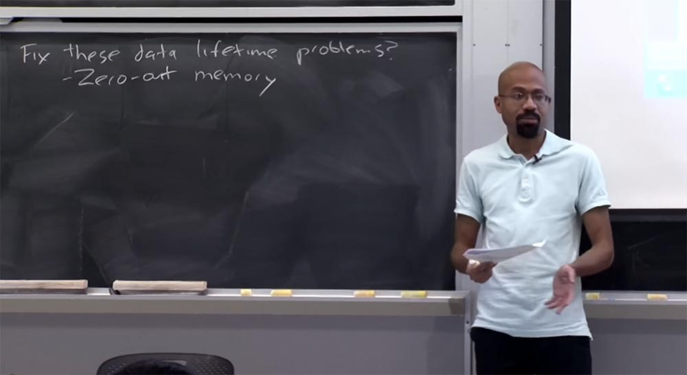

Но представьте, что ваша программа привязана к процессору и, возможно, очень интенсивно взаимодействует с памятью, совершая выделение и освобождение данных. В этом случае обнуление памяти может серьёзно уменьшить производительность системы и будет ценой безопасности, которую вы не захотите платить. Обычно на практике это не является проблемой. Но как все мы знаем, люди очень ценят производительность, поэтому вариант обнуления памяти наверняка встретит возражения.

Альтернативой обнулению памяти может быть шифрование данных по мере их поступления на постоянное хранение. То есть данные шифруются до того, как приложение запишет их на SSD или HDD. Затем, когда данные по требованию программы возвращаются из стабильного хранилища, они динамически расшифровываются до того, как попадают в оперативную память. В этом способе защиты интересно то, что если вы выбросите ключ, который использовали для шифрования и расшифровки данных, злоумышленнику не удастся восстановить эти данные с диска. При этом предполагается, что вы абсолютно доверяете криптографии.

Так что это очень и очень хорошо, потому что это дает нам возможность не запоминать все места, куда вы записываете эти зашифрованные данные. Вы можете спросить, зачем же выбрасывать ключи, ведь мы просто рассматриваем все зашифрованные данные как то, что можно выделить снова?

Для примера рассмотрим операционную систему Open BSD, в которой имеется опция шифрования свопа. Таким образом, вы можете связать ключи с различными разделами файла подкачки, то есть происходит то, что я упомянул. Поэтому каждый раз, когда вы загружаете компьютер, эта ОС генерирует кучу новых ключей. После того, как компьютер будет выключен или перезагружен, он забудет все ключи, которые использовал для шифрования пространства свопа. Можно сказать, что теперь своп доступен для повторного использования и поскольку эти ключи забыты, можно предположить, что злоумышленник не сможет добраться до хранившихся там вещей.

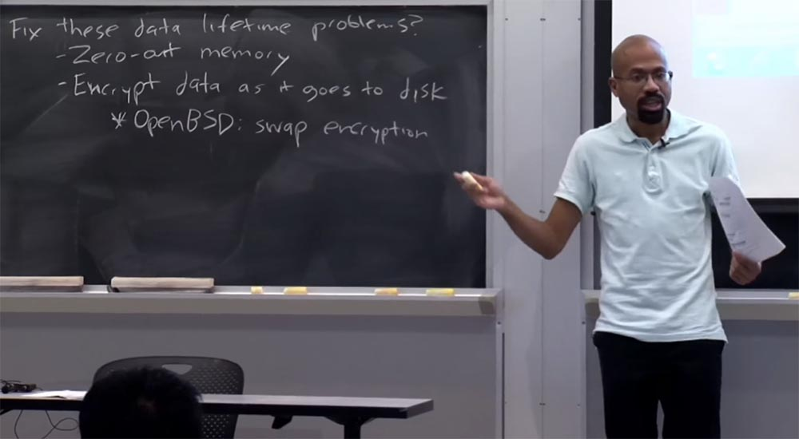

**Студент:** как назначается энтропия этих ключей и возможно ли их расшифровать?

**Профессор:** это хороший вопрос. Я не знаю, какие ресурсы энтропии здесь используются. У Open BSD паранойя по поводу безопасности. Поэтому я предполагаю, что она, например, рассматривает пул энтропии, собранный из ввода данных с клавиатуры пользователя, и другие подобные вещи. Я не в курсе, как эта ОС управляет ключами. Но вы совершенно правы, что если используемые ресурсы энтропии предсказуемы, то это сжимает энтропийное пространство самого ключа, что делает его более уязвимым.

В принципе, эта модель предлагает только шифрование свопа, то есть предполагается, что страницы RAM для ключей никогда не выгружаются из памяти. Это довольно легко сделать в ОС, если просто закрепить эту страницу в памяти. Это также не поможет вам сделать что-то с тем, у кого есть контакты с шиной памяти или с кем-то, кто может «ходить» по странице памяти ядра или тому подобное.

**Студент:** с точки зрения браузинга, это помогает защититься от злоумышленников, которые приходят после приватного просмотра, потому что, если вы должны выбросить ключ, то его не остаётся в памяти.

**Профессор:** совершенно верно. Хорошо в этом то, что шифрование свопа, по сути, не требует изменения в приложениях.

**Студент:** возвращаясь немного назад — если посмотреть на данные перед тем, как они попадают в RAM, то не остаётся ли при этом артефактов памяти?

**Профессор:** если я правильно понял ваш вопрос, вас беспокоит, что хотя данные шифруются на диске, но в память они попадают в открытом текстовом виде. Вернёмся к обсуждению шифрования свопа. Перенос данных на диск в зашифрованном виде не защищает от злоумышленника, который может просматривать RAM в режиме реального времени. Таким образом, если вас беспокоит только атакующий после сеанса приватного просмотра, который не может просматривать RAM в режиме реального времени, это работает нормально. Но вы определённо правы, что это не обеспечивает — за неимением лучшего термина скажем так — шифрования RAM. Имеются некоторые исследовательские системы, которые пытаются сделать что-то подобное. Это немного сложнее, потому что в какой-то момент, когда вы обращаетесь к своему «железу», ваш процессор должен что-то сделать с реальными данными. Например, если вы хотите сделать что-то с командой add и вам нужно передать операнды с открытым текстом.

Также существуют некоторые интересные исследовательские системы, которые пытаются совершать вычисления на основе зашифрованных данных. Это взрывает мозг подобно фильму «Матрица». Но достаточно сказать, что защита данных в RAM обычно гораздо слабее, чем защита данных, находящихся на стабильных накопителях. Ещё есть вопросы?

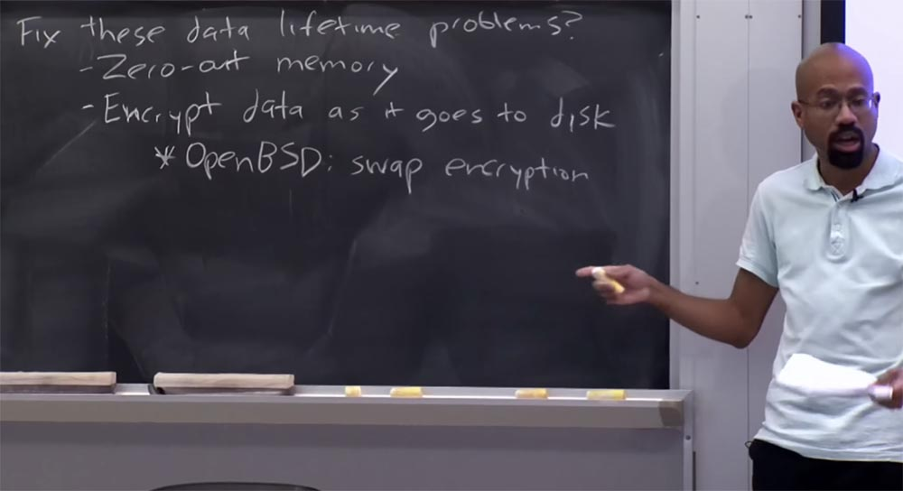

**Студент:** мы говорили о злоумышленнике, который действует после окончания сеанса приватного просмотра. Но если у вас в браузере есть вкладка Public mode и вкладка Private mode, и после закрытия вкладки приватного просмотра вкладка публичного просмотра остаётся открытой, не может ли хакер через неё добраться до артефактов памяти?

**Профессор:** это интересный вопрос, и в конце лекции мы поговорим о похожем способе атаки. Дело в том, что большинство моделей угроз в режиме частного просмотра вообще не предполагают присутствия атакующего в реальном времени. Другими словами, они предполагают, что когда вы совершаете приватный просмотр, одновременно с вами нет другого человека, у которого открыта вкладка публичного режима просмотра или что-то в этом роде. Но на самом деле вы правы, что способ, которым часто реализуются режимы частного просмотра, недостаточно защищён.

Допустим, вы открываете вкладку приватного просмотра и через некоторое время закрываете её, чтобы сбегать за чашечкой кофе. Однако Firefox, например, сохраняет такую статистику, как выделение памяти. Так что если память для вашей вкладки приватного просмотра лежит вместе со всем собранным браузером «мусором», то я могу увидеть посещённые вами URL-адреса и прочее в вашей вкладке. Но, короче говоря, большинство из моделей атакующих не предполагают наличия злоумышленника в то же самое время, когда вы заняты частным просмотром интернета.

Итак, шифрование свопа полезная вещь, так как обеспечивает вам некоторые довольно интересные свойства безопасности без необходимости менять браузер или любое из приложений, запущенных поверх него. На практике, стоимость использования процессора при шифровании свопа намного меньше, чем фактическая стоимость выполнения операций ввода/вывода в целом, особенно если у вас есть жесткий диск, потому что вместе с диском вы покупаете его производительность. Это стоимость чисто механических частей, «железа», поэтому шифрование свопа не такой большой удар по производительности.

Итак, следующий тип атакующего, который мы рассмотрим – это веб-атакующий, которого я упоминал в начале лекции. Здесь предполагается, что злоумышленник контролирует веб-сайт, который пользователь собирается посетить в режиме приватного просмотра, но этот злоумышленник не контролирует локальный компьютер пользователя. При этом мы преследуем две цели безопасности, чтобы защититься от веб-атак.

Во-первых, мы не хотим, чтобы злоумышленник мог идентифицировать пользователей. Под идентификацией подразумевается, что злоумышленник может отличить одного пользователя от другого пользователя, посещающего его сайт.

Во-вторых, мы не хотим, чтобы злоумышленник мог сказать, использует пользователь режим приватного просмотра или не использует. Как пишет лекционная статья, защита от веб-атакующего на самом деле довольно хитроумная задача.

Так что же это значит — идентифицировать разных пользователей? Как я уже сказал, в глобальном понимании вы можете себе представить, что один пользователь выглядит точно так же, как и все другие пользователи, которые посещают этот сайт. Предположим, что веб-злоумышленник может захотеть сделать одну из двух конкретных вещей. Первая выглядит так: «я вижу, что мой сайт в режиме приватного просмотра посещали несколько человек, причём вы были пятым, седьмым и восьмым посетителем». Другими словами, имеется ввиду идентификация пользователя в контексте нескольких сеансов приватного просмотра.

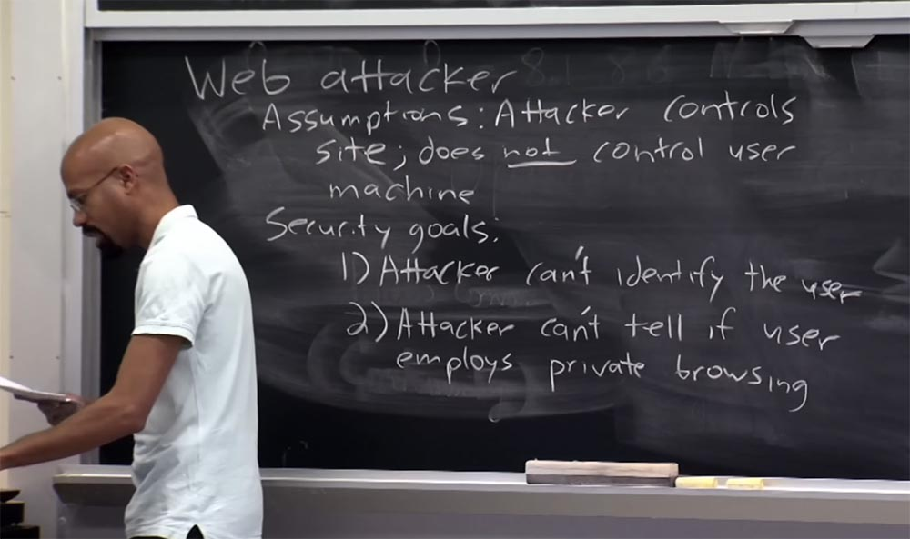

Вторая вещь, которую может захотеть злоумышленник – это попробовать установить связь пользователя со сеансами просмотра в публичном и частном режимах. Предположим, один раз я захожу на аmazon.com в режиме публичного просмотра, а второй раз – в частном режиме просмотра. Сможет ли злоумышленник действительно выяснить, что оба визита на сайт совершил один и тот же пользователь?

**Студент:** но ведь это всё привязано к IP-адресам?

**Профессор:** да, совершенно верно. Это отличное предположение, поэтому я осмелюсь предположить, будто бы в нашем случае пользователь не использует Tor, либо что-то подобное. Так что да, мы можем отталкиваться от IP-адреса пользователя. Его легко идентифицировать по IP-адресу. И если сайт посещают дважды в течении короткого отрезка времени с одного IP-адреса, высока вероятность того, что это делал один и тот же пользователь.

На самом деле это служит мотивацией для использования таких вещей, как Tor, мы обсудим эту тему на следующей лекции. Если вы не слышали о Tor, скажу, что в основном это инструмент, который пытается скрыть такие вещи, как ваш IP-адрес. Вы можете представить себе браузер как совокупность слоёв, в основе которых находится Tor, а поверх него вы располагаете режим приватного просмотра. Это может предоставить вам такие преимущества, какие вообще не сможет предоставить приватный режим. Таким образом, Tor предоставляет некое чувство анонимности IP-адреса, но на самом деле не в состоянии обеспечить секретность данных, конкретное время их жизни или подобные вещи. Вы можете считать «Тор» необходимым, но недостаточным условием для полноценной реализации режима приватного просмотра интернета.

Интересно то, что даже если использовать Tor, всё равно есть способы, благодаря которым веб-сервер может идентифицировать пользователя, глядя на уникальные характеристики этого браузера.

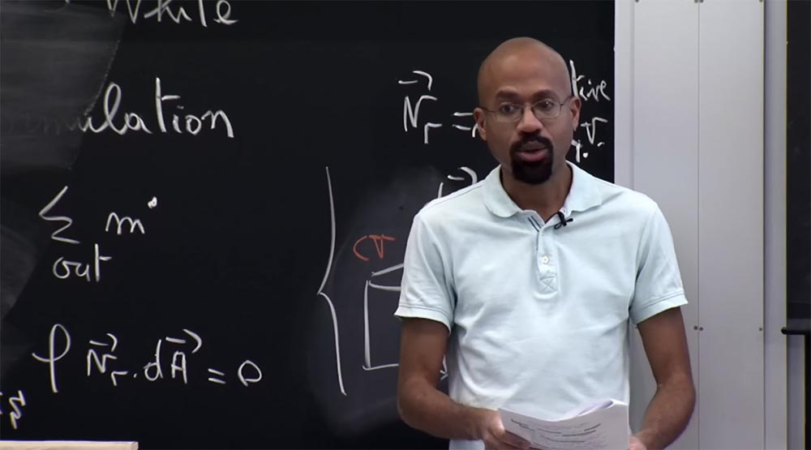

Сейчас я покажу вам последнее на сегодня демо. Давайте посмотрим, как я использую сайт под названием Panopticlick. Некоторые из вас слышали об этом сайте. Это интернет-проект, запущенный EFF – Electronic Frontier Foundation, Фондом Электронных Рубежей. Основная идея проекта заключается в том, что он пытается идентифицировать вас как пользователя, анализируя различные характеристики вашего веб-браузера. Я вам точно покажу, что имею ввиду. Мы заходим на этот сайт, вы видите кнопку «Протестируйте меня», и я по ней кликаю.

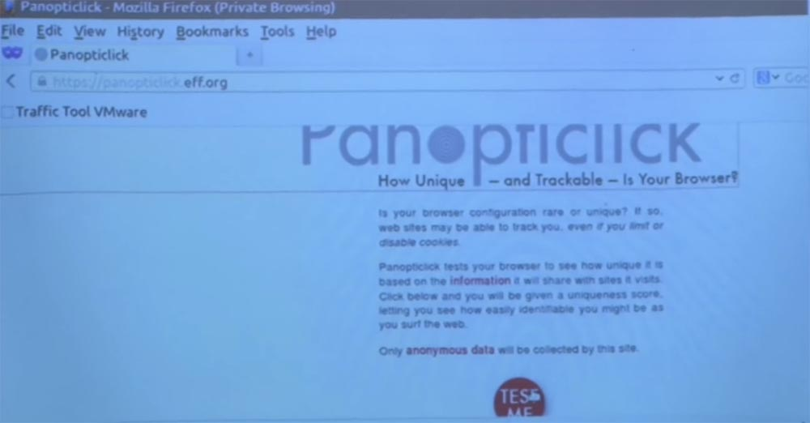

Здесь в основном работает куча кода JavaScript, может быть, немного апплетов и немного Java.

Этот сайт пытается снять отпечатки пальцев с моего браузера и выяснить, как много уникальной информации в нём имеется.

Позвольте мне увеличить шрифт – вы видите, что одна из вещей, которую он хочет выяснить, это детали плагинов браузера, которые я использую. Так что в основном этот тест запустит код, который смотрит, установлен ли у меня Flash, какая версия этого Flash, установлена ли Java и какая у неё версия.

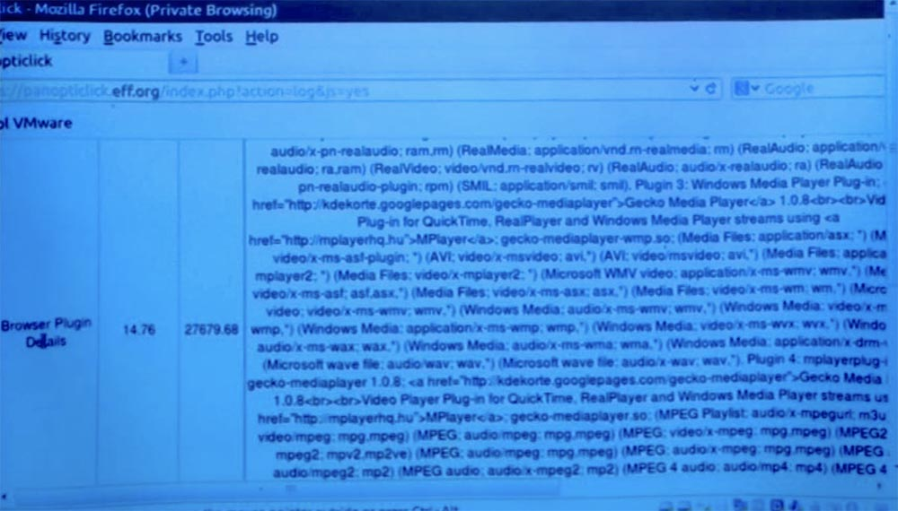

Вы видите, что все эти плагины даже не помещаются одновременно на одном экране. Это всё различные плагины и форматы файлов, которые поддерживает мой браузер. В глобальном смысле это должно вас беспокоить, если вы «человек безопасности». Если я действительно активно использую все эти вещи в данный момент времени, то это просто кошмар!

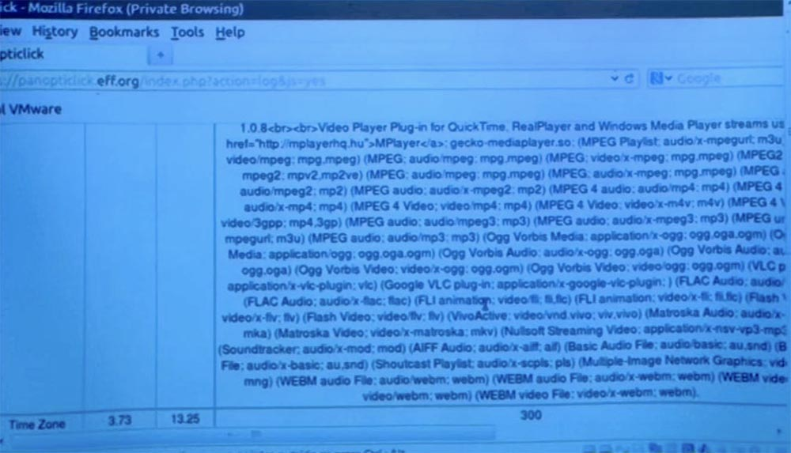

В конечном итоге, веб-сервер, или веб-злоумышленник, может охотиться за показанным здесь кодом и сможет выяснить, какие плагины использует ваш браузер. Теперь, если вы посмотрите на эти два столбца слева, что это такое?

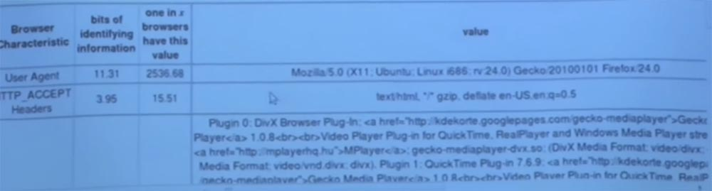

Первый столбец — это биты идентифицированной информации. Следующий столбец более интересен — он показывает, что только один из данного количества браузеров имеет такой же набор плагинов, в данном случае это 1 из 27679 браузеров. Так что это довольно специфический способ снять мои отпечатки пальцев. Это число говорит о том, что существует очень и очень мало людей, у которых браузер имеет точно такой же набор плагинов и конфигураций файлов.  
Так что, как оказалось, они правы, я совершенно уникальный человек, но в перспективе это создаёт большую проблему безопасности. Посмотрите на остальные итоги теста.

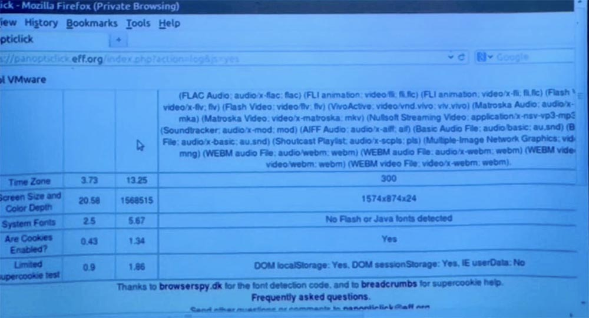

Здесь указано разрешение экрана и глубина цветов моего ноутбука, одного на 1,5 миллиона компьютеров. Это довольно шокирующее открытие, потому что означает, что только один человек в выборке из полутора миллионов пользователей обладает такими характеристиками экрана.  
Так что эти вещи в некотором смысле аддитивны. Чем больше отпечатков, тем легче злоумышленнику выяснить, что именно его сайт посещали именно вы. И заметьте, это было сделано исключительно со стороны сервера. Я только что зашел на эту страницу и просто нажал кнопку, и вот до чего они смогли добраться. Секундочку, я хочу показать еще одну вещь. Вход на сайт Panopticlick был сделан в режиме приватного просмотра. Сейчас я скопирую адрес из адресной строки и открою обычную, публичную версию Firefox. После этого я снова проведу данный тест.

Замечу снова – сейчас я в публичном режиме браузера, а до этого был в приватном режиме. Вы видите, что если посмотреть на плагины браузера, показатель уникальности отпечатков пальцев браузера остаётся практически таким же – 27679,82 против 27679,68. Эту разницу составляют несколько плагинов, которые могут или не могут загружаться в зависимости от того, как реализован режим конфиденциальности. Но посмотрите – снимать отпечатки пальцев всё равно легко. Посмотрите на размер экрана и глубину цвета – эти показатели ничем не отличаются в публичном и частном режимах просмотра.

Так что способность оставлять отпечатки пальцев в обоих режимах примерно одинакова. Это одна из причин, почему так сложно защитить себя от подобной веб-атаки, потому что сами браузеры в своей конфигурации несут много информации для вашей идентификации злоумышленником.

**Студент:** мне любопытны параметры размера экрана и глубины цвета. Каким образом это происходит? Чем они настолько уникальны? Сколько размеров экрана и глубины цвета вообще существует?

**Профессор:** я думаю, что он на самом деле здесь скрывается часть магии, которую Panopticlick использует, чтобы выяснить, что это такое. В глобальном понимании, как работают многие из этих тестов? Есть некоторые части вашего браузера, которые просматриваются при помощи только кода JavaScript. Таким образом, вы можете себе представить, что код JavaScript просматривает свойства объекта window, который представляет собой объёмную картину из JavaScript и подмечает, как код внутри окна обозначает этот странный виджет, соседний виджет, текстовую часть, плагины и так далее. Такие страницы также обычно используют тот факт, что Java-апплеты и Flash-объекты могут искать более интересные вещи, такие, как шрифты, которые доступны на вашем компьютере, и тому подобное. Поэтому лично я считаю, что при определении уникальности размера экрана и глубины цвета происходит следующее: тест запускает апплет, который будет пытаться запросить вашу графическую карту или графический интерфейсы в Java, и поочерёдно проверять различные аспекты их работы в процессе отображения страницы браузера.

Поэтому я думаю, что этот показатель на самом деле содержит в себе больше, чем просто размер экрана и глубину цвета, они просто сокращают его название до такого вида.

Вот как все эти приемы работают на высоком уровне. Итак, вы видите кучу информации, в которой можете покопаться, исследуя JavaScript. Затем вы запускаете кучу плагинов, которые обычно могут получить доступ к большему количеству вещей и смотрите, что они смогут найти. После этого вы можете составить общую картину того, что происходит.

Это понятно? Вот почему бывает так трудно защититься от атакующего по сети. В частности, возвращаясь к дискуссии о Tor, замечу даже если бы я запустил это тестирование через Tor – а вы видите, что во время этого теста IP-адрес всё равно не определяется, — сервер всё равно смог бы получить всю эту информацию. Это полное безумие!

Некоторые продукты позволяют хакерам воспользоваться таким трюком. Допустим, что у вас имеется облачный прокси, через который проходит весь веб-трафик. Представьте себе, что прокси пытается создать каноническую версию среды выполнения браузера, эмулируя, скажем, Firefox v10.7. Затем он попытается отправить обратно данные, которые он предоставил как браузер Firefox, и именно эти данные хакер может попытаться перехватить. Это своего рода хитрость.

**Студент:** так что предоставляет пользователю Tor? Его можно использовать в паре с виртуальной машиной?

**Профессор:** я никогда не слышал о таком проекте, но я слышал о некоторых других проектах. Я думаю, что сложность состоит в том, чтобы обеспечить эффективность такой системы, особенно в интерактивном режиме работы, например, когда вы играете в онлайн-игру. Довольно неудобно отправлять щелчок мыши на какой-то прокси, который потом попытается переслать его куда-то ещё.

**Студент:** я хочу уточнить, что имел ввиду случай, когда используется прокси-сервер Tor, в котором имеется плагин браузера Firefox по типу виртуальной машины.

**Профессор:** ага, это просто прокси-сервер Tor. Тогда другое дело, и накладные расходы такой системы будут равны постоянным накладным расходам на прохождение всего «лукового» маршрута Tor. Я говорил, что есть системы — давайте на секунду проигнорируем анонимность IP, — которые пытаюсь сказать, что у вас есть свой собственный, очень характерный в смысле отпечатков пальцев браузер на вашем собственном компьютере, и вы не хотите показать это веб-серверу.

Таким образом, по существу вы проходите через прокси-сервер, который воспринимаете как браузер, скажем, Firefox, какой-то канонической версии. Веб-сервер думает, что он взаимодействует именно с этой вещью. Так что если я пытаюсь загрузить страницу сайта на компьютер, я воспринимаюсь веб-сервером как Firefox 10.7. Если вы зайдёте на сайт таким же образом через прокси, вы также будете восприняты сервером как Firefox 10.7. Затем за кулисами это разделяется на HTML и подобные вещи, собранные с прокси. Эти две вещи ортогональны.

**Студент:** мне кажется, что для этого не нужны прокси, вам нужно только поддержка браузера. Но браузер Tor уже делает это, пытаясь казаться общей версией Firefox.

**Профессор:** да, это правда. Хотя, я думаю, что даже если у нас решена проблема с большим количеством характерных версий и вы пытаетесь использовать общую версию браузера, есть еще много вещей, которые могут оставлять характерные отпечатки пальцев. Часто говорится, что распределение Tor контролируется, так что если мы все перейдем к дистрибутиву Tor, окажется, что мы все получим Firefox с той же версией Java, и так далее.

Есть одна интересная вещь – команда разработчиков Tor часто выпускает отчеты о том, какие данные могут вытекать из «луковой» сети во время работы. Таким образом, материал из этой закрытой сети все еще просачивается. Но вы совершенно правы – если бы мы все согласились загрузить один и тот же дистрибутив, не разбавляя его разными плагинами и подобными добавками, то с точки зрения трудности идентификации пользователей это бы отлично сработало.  
Итак, в чём состоит высшая цель приватности? В глобальном смысле – обеспечить вашу полную анонимность как пользователя сети. Другими словами, каково количество людей, с которыми вас может спутать атакующий? Отпечатки пальцев браузера показывают, что часто веб-злоумышленник может очень сильно сузить границы идентификации вообще без контроля над локальным компьютером. Так что на самом деле это довольно пугающе. Вы можете задуматься о том, как злоумышленник может вас идентифицировать, когда вы используете режим приватного просмотра?

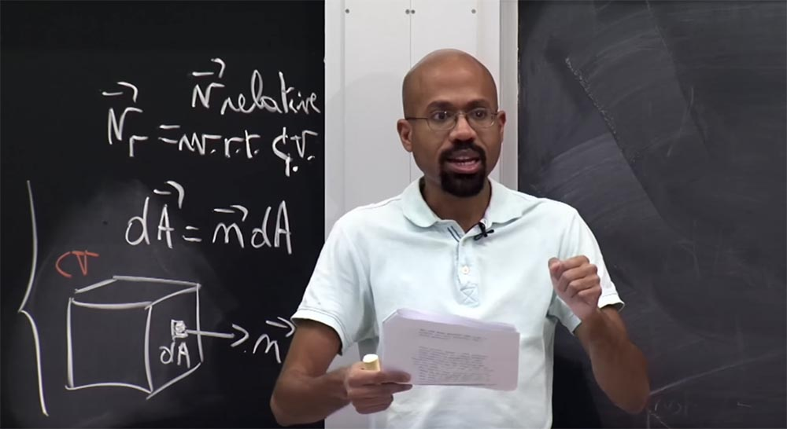

В статье описывается атака, которая использует цвета ссылок. Вспомните, что внутри режима приватного просмотра браузеры не должны отслеживать историю посещаемых сайтов. Поэтому авторы статьи описывают атаку, в которой страница, контролируемая злоумышленником, создаёт тег iframe для URL-адреса, который контролируется им же, и загружает этот iframe в атакующую страницу. Тогда хакеру остается только смотреть на цвета ссылок. Он создает ссылку на эту страницу, для которой только что создал iframe, и видит, если её цвет поменялся на цвет, соответствующий посещённой странице, то есть стал фиолетовым вместо синего.

Идея состоит в том, что если сделать этот тест в режиме приватного просмотра, то цвет ссылок должен оставаться неизменным, поскольку браузер, как предполагается, должен забыть обо всех этих вещах. Именно такой вид нападения, основанный на смене цвета ссылок, они описывают в статье, но дело в том, что атаки такого рода больше не срабатывают. Мы обсуждали это несколько лекций назад. Итак, в статье описана история атак браузера с использованием сниффера. Но в настоящее время код JavaScript не предоставляет правильные цвета ссылок в JavaScript, что предотвращает атаки такого типа. Так что эта часть лекционной статьи устарела.

**Студент:** а чем объясняется, что теперь браузеры также показывают ссылки фиолетовыми в режиме приватного просмотра, но перекрашивают их в синий цвет при выходе из этого режима?

**Профессор:** да, это немного странно. Я думаю, что этот режим защиты был внедрён ещё до того, как приватный режим просмотра стал таким популярным, так что теперь перекрашивание ссылок при приватном просмотре носит дополнительный характер. Короче говоря, этот вид атак теперь не работает, потому что браузеры обзавелись защитой от атак-снифферов. Однако существуют и другие способы, которые позволяют веб-атакующему узнать о том, что вы использовали режим частного просмотра.

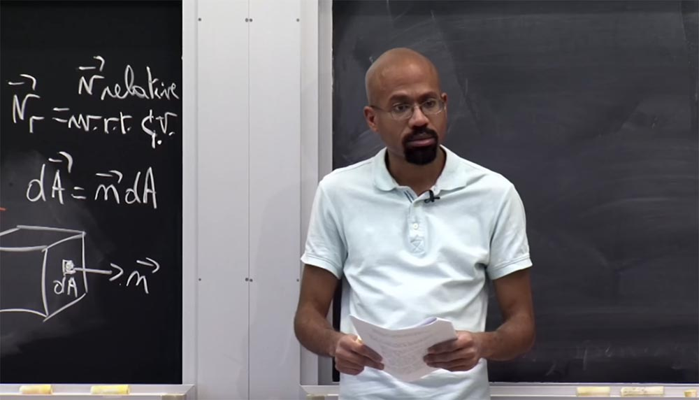

Например, в режиме приватного просмотра не следует отправлять кукиз, которые вы получили в режиме публичного просмотра. Другими словами, если я захожу на сайт Amazon.com в публичном режиме, то я генерирую некоторые куки. Затем, когда я посещаю этот же сайт в режиме приватного просмотра, эти файлы cookie не должны отправляться, потому что фактически это может показать веб-атакующему, что вы используете частный режим.

**Студент:** то есть хакер в обоих этих случаях использует опрос, поэтому ему нужно знать IP-адрес.

**Профессор:** да, это так.

**Студент:** таким образом, ссылка, на которую нацелился хакер благодаря изменению цвета, будет основываться на IP-адресе пользователя. Так что можно полагаться на то, что пользователь посетил сайт первый раз в режиме публичного просмотра, и попытаться защитить его.

**Профессор:** дело в том, что атаку по ссылке можно сделать в контексте одной страницы. Представьте, что я, веб-злоумышленник, создаю одну страницу. У меня есть JavaScript, который создает iframe для foo.com, так что iframe будет загружать содержимое этой страницы. Затем я, злоумышленник, могу создать элемент ссылки в родительском фрейме, после чего попытаться посмотреть цвет ссылки.

Это срабатывало четыре года назад. В данном случае хакер мог вообще не полагаться на то, что пользователь посетил эту страницу iframe, потому что мог создать это в контексте страницы, которую предоставил пользователю.

Рассмотрим, как кукиз может раскрыть режимы публичного или приватного просмотра. Давайте подумаем над тем, как предоставить мощные гарантии конфиденциальности для приватных браузеров.

В рамках данной дискуссии мы пока просто проигнорируем IP-адреса, потому что, как мы обсудим в следующей лекции, мы можем использовать Tor для обеспечения конфиденциальности IP-адресов.

54:00 мин

[Курс MIT «Безопасность компьютерных систем». Лекция 18: «Частный просмотр интернета», часть 3](https://habr.com/company/ua-hosting/blog/430208/)

Полная версия курса доступна [здесь](https://ocw.mit.edu/courses/electrical-engineering-and-computer-science/6-858-computer-systems-security-fall-2014/).

Спасибо, что остаётесь с нами. Вам нравятся наши статьи? Хотите видеть больше интересных материалов? Поддержите нас оформив заказ или порекомендовав знакомым, **30% скидка для пользователей Хабра на уникальный аналог entry-level серверов, который был придуман нами для Вас:** [Вся правда о VPS (KVM) E5-2650 v4 (6 Cores) 10GB DDR4 240GB SSD 1Gbps от $20 или как правильно делить сервер?](https://habr.com/company/ua-hosting/blog/347386/) (доступны варианты с RAID1 и RAID10, до 24 ядер и до 40GB DDR4).

**VPS (KVM) E5-2650 v4 (6 Cores) 10GB DDR4 240GB SSD 1Gbps до декабря бесплатно** при оплате на срок от полугода, заказать можно [тут](https://ua-hosting.company/vpsnl).

**Dell R730xd в 2 раза дешевле?** Только у нас **[2 х Intel Dodeca-Core Xeon E5-2650v4 128GB DDR4 6x480GB SSD 1Gbps 100 ТВ от $249](https://ua-hosting.company/serversnl) в Нидерландах и США!** Читайте о том [Как построить инфраструктуру корп. класса c применением серверов Dell R730xd Е5-2650 v4 стоимостью 9000 евро за копейки?](https://habr.com/company/ua-hosting/blog/329618/)