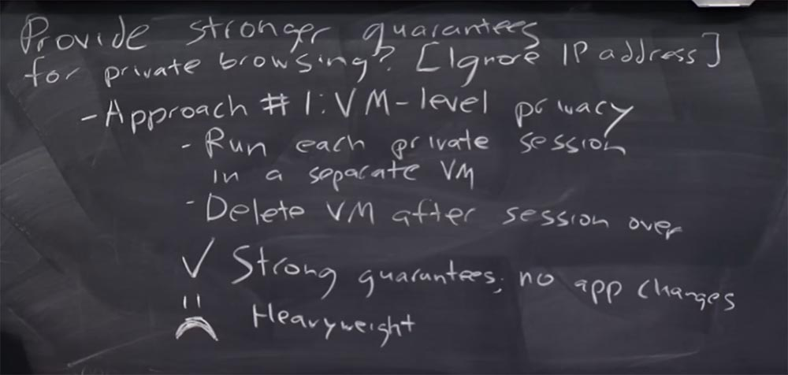
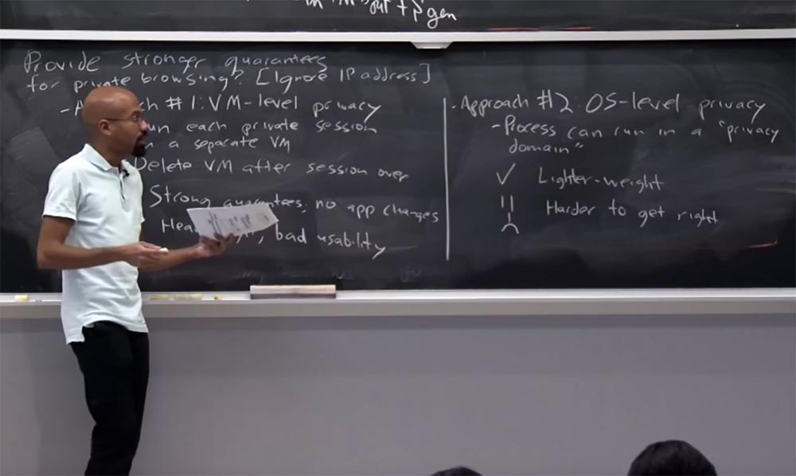
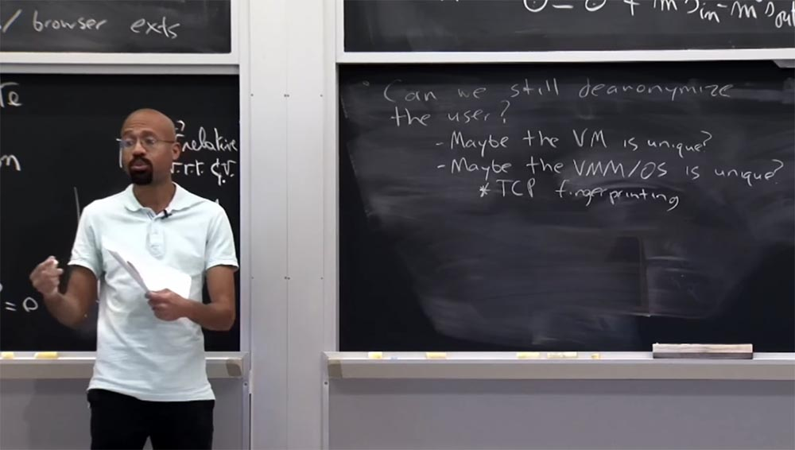
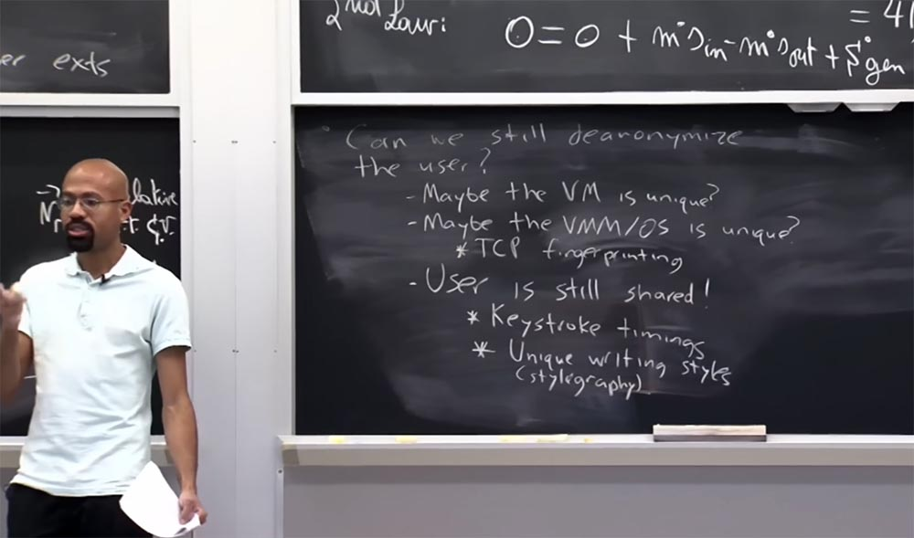
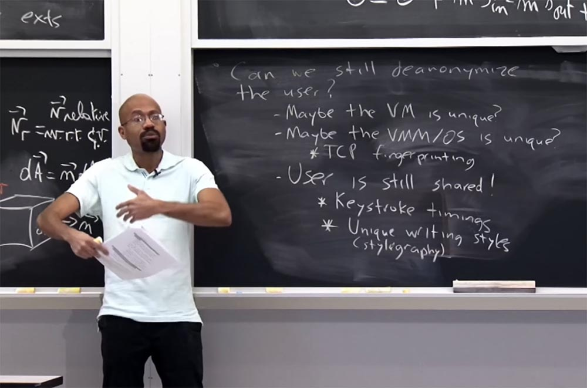
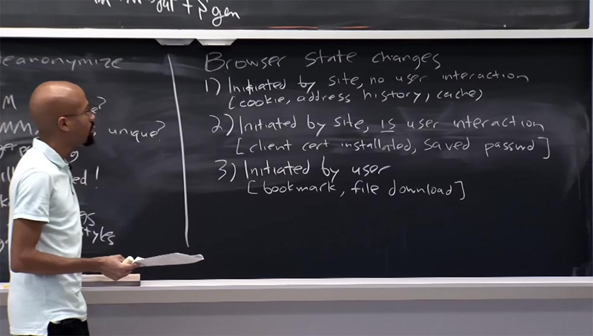
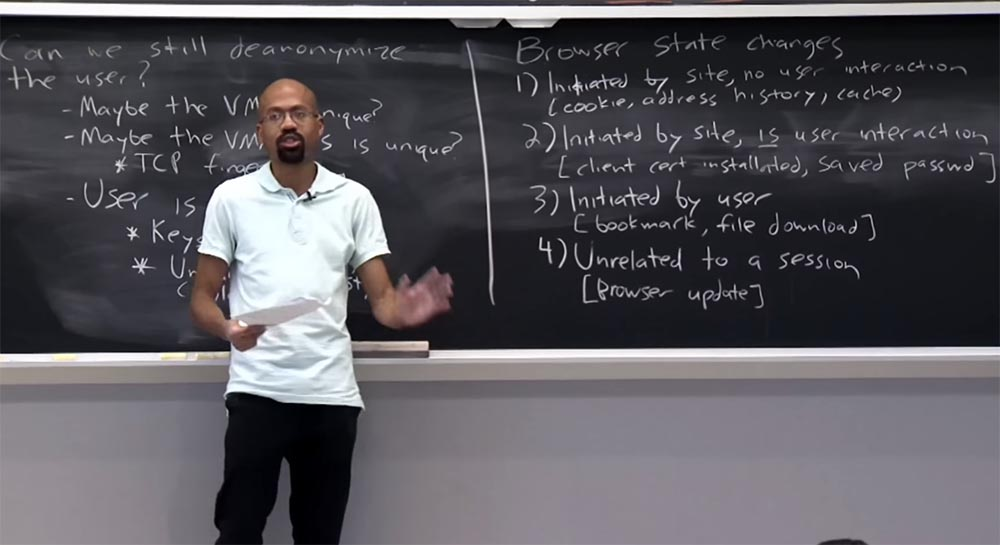
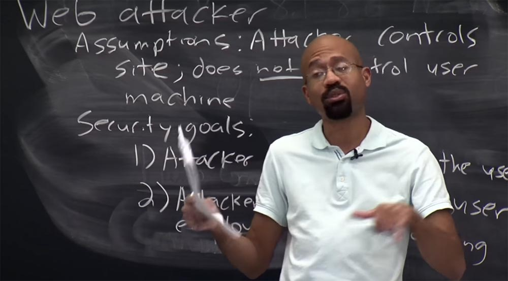

Курс MIT «Безопасность компьютерных систем». Лекция 18: «Частный просмотр интернета», часть 3 / Блог компании ua-hosting.company

### Массачусетский Технологический институт. Курс лекций #6.858. «Безопасность компьютерных систем». Николай Зельдович, Джеймс Микенс. 2014 год

Computer Systems Security — это курс о разработке и внедрении защищенных компьютерных систем. Лекции охватывают модели угроз, атаки, которые ставят под угрозу безопасность, и методы обеспечения безопасности на основе последних научных работ. Темы включают в себя безопасность операционной системы (ОС), возможности, управление потоками информации, языковую безопасность, сетевые протоколы, аппаратную защиту и безопасность в веб-приложениях.

Лекция 1: «Вступление: модели угроз» [Часть 1](https://habr.com/company/ua-hosting/blog/354874/) / [Часть 2](https://habr.com/company/ua-hosting/blog/354894/) / [Часть 3](https://habr.com/company/ua-hosting/blog/354896/)  
Лекция 2: «Контроль хакерских атак» [Часть 1](https://habr.com/company/ua-hosting/blog/414505/) / [Часть 2](https://habr.com/company/ua-hosting/blog/416047/) / [Часть 3](https://habr.com/company/ua-hosting/blog/416727/)  
Лекция 3: «Переполнение буфера: эксплойты и защита» [Часть 1](https://habr.com/company/ua-hosting/blog/416839/) / [Часть 2](https://habr.com/company/ua-hosting/blog/418093/) / [Часть 3](https://habr.com/company/ua-hosting/blog/418099/)  
Лекция 4: «Разделение привилегий» [Часть 1](https://habr.com/company/ua-hosting/blog/418195/) / [Часть 2](https://habr.com/company/ua-hosting/blog/418197/) / [Часть 3](https://habr.com/company/ua-hosting/blog/418211/)  
Лекция 5: «Откуда берутся ошибки систем безопасности» [Часть 1](https://habr.com/company/ua-hosting/blog/418213/) / [Часть 2](https://habr.com/company/ua-hosting/blog/418215/)  
Лекция 6: «Возможности» [Часть 1](https://habr.com/company/ua-hosting/blog/418217/) / [Часть 2](https://habr.com/company/ua-hosting/blog/418219/) / [Часть 3](https://habr.com/company/ua-hosting/blog/418221/)  
Лекция 7: «Песочница Native Client» [Часть 1](https://habr.com/company/ua-hosting/blog/418223/) / [Часть 2](https://habr.com/company/ua-hosting/blog/418225/) / [Часть 3](https://habr.com/company/ua-hosting/blog/418227/)  
Лекция 8: «Модель сетевой безопасности» [Часть 1](https://habr.com/company/ua-hosting/blog/418229/) / [Часть 2](https://habr.com/company/ua-hosting/blog/423155/) / [Часть 3](https://habr.com/company/ua-hosting/blog/423423/)  
Лекция 9: «Безопасность Web-приложений» [Часть 1](https://habr.com/company/ua-hosting/blog/424289/) / [Часть 2](https://habr.com/company/ua-hosting/blog/424295/) / [Часть 3](https://habr.com/company/ua-hosting/blog/424297/)  
Лекция 10: «Символьное выполнение» [Часть 1](https://habr.com/company/ua-hosting/blog/425557/) / [Часть 2](https://habr.com/company/ua-hosting/blog/425561/) / [Часть 3](https://habr.com/company/ua-hosting/blog/425559/)  
Лекция 11: «Язык программирования Ur/Web» [Часть 1](https://habr.com/company/ua-hosting/blog/425997/) / [Часть 2](https://habr.com/company/ua-hosting/blog/425999/) / [Часть 3](https://habr.com/company/ua-hosting/blog/426001/)  
Лекция 12: «Сетевая безопасность» [Часть 1](https://habr.com/company/ua-hosting/blog/426325/) / [Часть 2](https://habr.com/company/ua-hosting/blog/427087/) / [Часть 3](https://habr.com/company/ua-hosting/blog/427093/)  
Лекция 13: «Сетевые протоколы» [Часть 1](https://habr.com/company/ua-hosting/blog/427763/) / [Часть 2](https://habr.com/company/ua-hosting/blog/427771/) / [Часть 3](https://habr.com/company/ua-hosting/blog/427779/)  
Лекция 14: «SSL и HTTPS» [Часть 1](https://habr.com/company/ua-hosting/blog/427783/) / [Часть 2](https://habr.com/company/ua-hosting/blog/427785/) / [Часть 3](https://habr.com/company/ua-hosting/blog/427787/)  
Лекция 15: «Медицинское программное обеспечение» [Часть 1](https://habr.com/company/ua-hosting/blog/428652/) / [Часть 2](https://habr.com/company/ua-hosting/blog/428654/) / [Часть 3](https://habr.com/company/ua-hosting/blog/428656/)  
Лекция 16: «Атаки через побочный канал» [Часть 1](https://habr.com/company/ua-hosting/blog/429390/) / [Часть 2](https://habr.com/company/ua-hosting/blog/429392/) / [Часть 3](https://habr.com/company/ua-hosting/blog/429394/)  
Лекция 17: «Аутентификация пользователя» [Часть 1](https://habr.com/company/ua-hosting/blog/429680/) / [Часть 2](https://habr.com/company/ua-hosting/blog/429682/) / [Часть 3](https://habr.com/company/ua-hosting/blog/429686/)  
Лекция 18: «Частный просмотр интернета» [Часть 1](https://habr.com/company/ua-hosting/blog/430204/) / [Часть 2](https://habr.com/company/ua-hosting/blog/430206/) / [Часть 3](https://habr.com/company/ua-hosting/blog/430208/)

Итак, первый подход будет заключаться в использовании виртуальных машин в качестве способа усиления гарантии приватного просмотра, то есть мы рассмотрим приватность на уровне виртуальной машины.

Основная идея заключается в том, что каждый частный сеанс должен выполняться в отдельной виртуальной машине. Затем, когда пользователь закончит сеанс частного просмотра, виртуальная машина удаляется. Так в чем же преимущество этой идеи?

Вероятно, в том, что вы получаете более сильные гарантии конфиденциальности, которую можете предоставить пользователю, потому что, предположительно, виртуальная машина имеет довольно чистый интерфейс ввода/вывода данных. Можно предположить, что вы объедините эти виртуальные машины в, скажем, какое-то безопасное решение для свопа, например, используя Open BSD вместе с шифрованием данных на диске.

Итак, у нас есть очень чёткое разделение VM здесь, наверху, и всех операций ввода/вывода, которые происходят внизу. Это предоставляет вам более сильные гарантии, чем те, что вы получаете от браузера, который не был разработан с нуля, чтобы очень тщательно заботиться обо всех путях ввода/вывода информации и о том, какие секреты могут просочиться, когда эта информация пребывает в хранилище данных.

Так что да, это обеспечивает более сильные гарантии. И, кроме того, не требует каких-либо изменений в ваших приложениях, то есть в браузере. Вы берете браузер, помещаете его в одну из этих виртуальных машин — и все волшебным образом становится лучше без каких-либо изменений в приложении.

Что в этом плохого – я нарисую на доске печальный смайлик — так это громоздкость. Под громоздкостью я имею в виду то, что когда вы захотите запустить один из сеансов частного просмотра, вам придется запустить целую виртуальную машину. И это может быть довольно болезненно, потому что пользователи будут расстраиваться, так как им потребуется много времени, чтобы запустить свои сеансы частного просмотра.

Другие проблемы состоят в том, что это решение непрактично. И причина непрактичности не в том, что пользователям действительно сложно делать такие вещи, как переносить файлы, которые они сохранили в режиме частного просмотра, на компьютер, переносить все закладки, которые они сгенерировали в этом режиме — всё это, в конце концов, может быть сделано. Но здесь возникает множество неудобств, связанное с ленью.

Второй подход к проблеме похож на первый, но мы фактически реализуем его внутри самой ОС, а не в виртуальной машине. Здесь основная идея состоит в том, что каждый процесс потенциально может быть запущен в приватном домене. Приватный домен – это своеобразная коллекция общих ресурсов ОС, которые использует процесс, и ОС отслеживает все подобные вещи. И как только процесс умирает, ОС просматривает всё, что находится в приватном домене, и полностью высвобождает все эти ресурсы для нового использования.

Преимущество этого подхода по сравнению с использованием VM — более легкий вес, потому что, если задуматься, виртуальная машина по существу, агностична состоянию ОС и состоянию всех запускаемых приложений. Таким образом, использование VM создаёт больше работы, чем делает ОС, потому что операционная система предположительно знает все точки, в которых частный браузер будет соприкасаться со вводом/выводом данных, «разговаривать» с сетью и тому подобное. Возможно, ОС даже знает, как можно выборочно очистить кеш DNS.

Таким образом, вы можете себе представить, что гораздо проще «раскрутить» эти домены конфиденциальности, чтобы потом их просто «снести». Однако недостаток этого решения, по крайней мере, относительно запуска VM, состоит в том, что это намного сложнее выполнить правильным образом. Поэтому я просто описал подход с использованием VM как прогрессивный, потому что виртуальная машина по существу агностична всему, что работает внутри контейнера ОС.

Приятно то, что подход VM позволяет сосредоточиться только на нескольких низкоуровневых интерфейсах. Например, интерфейс, используемый виртуальной машиной для записи на диск, вызывает более высокую степень доверия, потому что он содержит в себе всё необходимое. В то время как при использовании ОС это происходит намного сложнее, потому что вы рассчитываете, что она будет использовать индивидуальные файлы с системным интерфейсом, например, с индивидуальным сетевым интерфейсом. Так что если делать всё это на уровне ОС, возможность утечки данных намного больше.

Итак, это были два основных подхода к усилению гарантий конфиденциальности при использовании режима частного просмотра, которые можно реализовать в настоящее время.  
Вы можете спросить, можем ли мы по прежнему раскрыть личность пользователя, если он применит одно из этих более мощных решений защиты – просмотр интернета с помощью виртуальной машины или доменов конфиденциальности в ОС? Можем ли мы лишить пользователя анонимности? Ответом на этот вопрос будет – да, можем!

Деанонимизация пользователя возможна, потому что виртуальная машина по какой-то причине уникальна. Это похоже на то, как мы смогли снять отпечатки пальцев браузера, используя сайт Panopticlick. Вероятно, есть что-то уникальное в том, как будет настроена виртуальная машина, что позволяет снять её отпечатки пальцев. Также возможно, что монитор VM или сама ОС в некотором смысле уникальны. И это позволяет сетевому злоумышленнику раскрыть личность пользователя.

В качестве характерного примера можно привести дактилоскопию TCP. Идея заключается в том, что спецификация протокола TCP фактически допускает установку некоторых параметров протокола в процессе осуществления этого протокола. Например, TCP позволяет исполнителям выбирать начальный размер пакетов, которые посылаются в первой части установления TCP-соединения, что позволяет исполнителям выбирать такие вещи, как начальное время жизни этих пакетов.

Таким образом, можно получить готовые инструменты, такие как InMap, которые могут сказать с высокой вероятностью, с какой операционной системой вы работаете, просто отправив вам тщательно обработанные пакеты. Они увидят такие вещи, как то, что здесь представлен TTL, а здесь – размер пакета рассылки, а вот здесь был порядковый номер TTP. Таким образом, у них создаётся база данных отпечатков пальцев. Они говорят: «если возвращаемый пакет имеет эту, эту и эту характеристику, то согласно таблице, вы работаете на Solaris, вы используете Mac, а вы – Windows», или что-то еще. Поэтому, даже используя один из этих подходов для усиления конфиденциальности при частных просмотрах с помощью виртуальной машины или ОС, злоумышленник все еще в состоянии запустить одну из этих атак определения отпечатков пальцев через TCP и узнать много нового о конкретном пользователе.

Интересно будет узнать, что даже если пользователь защищён одним из этих более мощных способов, пользователь всё ещё разделён между обоими режимами просмотра – публичным и частным, он всё ещё физически использует компьютер. Это интересно потому, что вы сами в процессе своего обращения с компьютером можете способствовать утечке своей персональной информации.

Например, как выясняется, каждый пользователь обладает уникальной скоростью нажатия клавиш. Так что если я дам вам задание одновременно начать набирать на клавиатуре фразу «быстрая коричневая лиса» или любую подобную чепуху, наблюдение покажет, что время нажатия клавиш каждым из вас настолько уникально, что потенциально может быть использовано для снятия отпечатков пальцев.

Интересно и то, что у пользователей есть уникальные стили письма. Существует отрасль безопасности, которая называется стилографией.

Идея стилографии состоит в том, что злоумышленник может выяснить, кто вы такой, просто посмотрев на образцы вашего письма. Представьте себе, что по какой-то причине вы зависаете на 4chan и я хочу выяснить, действительно ли вы там болтались. Я могу посмотреть на кучу разных сообщений на 4chan и сгруппировать их в наборы комментариев, которые выглядят стилистически одинаково. Затем я попытаюсь найти публичные образцы стиля вашего письма, например, в домашних заданиях, автором которых вы являетесь. После этого я сопоставляю образцы стилей в наборах комментариев 4chan с вашим домашним заданием, и если найду совпадения, то смогу написать вашим родителям, чтобы они разъяснили вам вред зависания на форумах 4chan. Вот в чём причина того, что я решил обратить ваше внимание на стилографию. Это на самом деле довольно интересно.

Итак, мы обсудили, как можно использовать VM или модифицированные операционные системы, чтобы обеспечить поддержку приватного просмотра. Поэтому вы можете задаться вопросом, почему же тогда браузеры не требуют, чтобы пользователи делали одну из этих вещей – запускали виртуальную машину или модифицировали ОС? Почему браузеры берут на себя реализацию всего этого?

Главной причиной является развертываемость. Производители браузеров обычно не хотят заставлять своих пользователей делать что-нибудь особенное, чтобы использовать браузер, кроме установки самого браузера. Это похоже на мотивацию Native Client, когда Google собирается добавить эти классные возможности в компьютеры конечных пользователей, но не хочет принуждать пользователей устанавливать специальные версия Windows или Linux или делать что-то еще. Таким образом, Google говорит, что «мы позаботимся об этом сами».

Ещё одна причина – это удобство использования. Многие из этих решений частного просмотра на уровне виртуальных машин и ОС, как мы уже обсуждали, затрудняют пользователям сохранение вещей, полученных во время сеанса приватного просмотра – загруженных файлов, закладок и тому подобного.

В основном производители браузеров говорят, что если они сами реализуют режимы частного просмотра, то смогут позволить пользователям принимать файлы, загруженные в режиме приватного просмотра, и сохранять их на компьютере. Сначала это звучит хорошо. Но обратите внимание, что данный подход позволяет пользователям экспортировать некоторый род приватного состояния, что открывает множество уязвимостей системы безопасности и сильно затрудняет анализ свойств безопасности, применяемых при реализации режима частного просмотра.  
Поэтому авторы статьи пытаются охарактеризовать различные типы состояний браузера, которые могут быть модифицированы, и рассмотреть то, как текущие режимы частного просмотра могут их модифицировать.

В статье классифицируются изменения состояния браузера. В этой классификации есть четыре типа изменений. Первый тип – это когда изменения состояния инициировал сам сайт без участия пользователя. Примерами этого типа изменения состояния является получение кукиз, добавление чего-то в историю адресов браузера и возможно, обновление кеша браузера. Поэтому в основном это состояние сохраняется на протяжение всего режима частного просмотра, но уничтожается после его завершения.

Можно предположить, что поскольку пользователь не взаимодействует с браузером при формировании этого состояния, подразумевается, что сам пользователь не хотел бы в этом участвовать.

Второй тип изменения состояния браузера также инициируется веб-сайтом, но при этом имеется некоторое взаимодействие с пользователем, посетившим этот сайт. Например, пользователь устанавливает сертификат клиента или использует пароль для авторизации на сайте, то есть пытается куда-то зайти. При этом браузер очень услужливо говорит: «вы хотите сохранить этот пароль?». Если пользователь отвечает «да», то такие вещи, как сохранённые пароли, могут быть использованы за пределами режима приватного просмотра. Поэтому в принципе непонятно, какой должна быть политика конфиденциальности в этом случае. На практике получается так, что браузеры допускают существование вещей, возникших в режиме приватного просмотра, за его пределами, предполагая, что пользователь сам выберет оптимальный для него вариант, сказав «да» или «нет». Если пользователь достаточно умён, то он не станет сохранять пароль для какого-то сомнительного сайта, потому что кто-то другой сможет потом им воспользоваться. Так что здесь может иметь место ошибка пользователя, а не браузера, которая способна привести к утрате конфиденциальности.

Поэтому неясно, какая политика является лучшей, но на практике этот тип изменения состояния разрешено сохранять вне режима приватного просмотра.

Третий тип изменения состояния полностью инициируется пользователем. Это такие вещи, как сохранение закладок или загрузка файлов. Это состояние похоже на предыдущее, потому что пользователь непосредственно участвует в его создании. В этом случае режим приватного просмотра соглашается на то, чтобы изменения состояния такого типа сохранялись для дальнейшего использования вне приватного просмотра.

Далее имеются некоторые виды состояний, которые вообще не связаны с каким-либо конкретным сеансом. Например, это состояние обновления самого браузера, то есть изменение файла, представляющего собой браузер. Разработчики браузеров считают, что это изменение состояния является часть глобального состояния, доступного как для публичного, так и для приватного просмотра.

В конечном итоге, если вы посмотрите на это внимательно, то заметите, что имеется довольно много состояний, при которых возможны утечки данных за пределы режима приватного просмотра, особенно если имеется взаимодействие с пользователем. Интересно, является ли это оптимальным компромиссом между безопасностью и конфиденциальностью?

В статье говорится, что трудно предотвратить возможность, при которой локальный атакующий может определить, используете вы режим приватного просмотра или нет. Об этом в статье сказано несколько расплывчато. Дело в том, что сам характер утечек информации может подсказать, в каким режиме просмотра – приватном или публичном – они происходят. Например, в Firefox и Chrome, когда вы создаете закладку в режиме приватного просмотра, у этой закладки имеется куча связанных с ней метаданных, таких, как время посещения сайта и тому подобное. Во многих случаях эти метаданные будут равны нулю или близки некоторому нулевому значению, если данная закладка была создана в режиме приватного просмотра. Тогда тот, кто позже будет управлять вашим компьютером, сможет просмотреть вашу информацию о закладке. Если он увидит, что эти метаданные равны нулю, то сделает вывод, что эта закладка, вероятно, была создана в режиме частного просмотра.

Когда мы говорим о безопасности браузера, мы думаем о том, что именно люди проделывают с JavaScript, HTML или CSS, что они могут делать с плагинами или расширениями? В контексте частного просмотра плагины и расширения довольно интересны, потому что они в большинстве случаев не ограничены той же политикой происхождения, например, они могут ограничивать использование таких вещей, как JavaScript. Интересно, что эти расширения и плагины обычно работают с очень высокими привилегиями. Грубо говоря, вы можете думать о них как о модулях ядра. Они обладают высоким авторитетом, позволяющим осуществлять новые возможности непосредственно внутри самих браузеров. Поэтому это немного проблематично, так как эти плагины и расширения часто разрабатываются кем-то, кто не является фактическим разработчиком браузера. Это означает, что кто-то пытается сделать что-то хорошее и придать вашему браузеру полезные свойства, добавив в него плагин или расширение. Но этот сторонний разработчик может не полностью понимать контекст безопасности, в котором выполняется его расширение, поэтому такое расширение может не обеспечивать семантику режима приватного просмотра или же обеспечить её неверным способом.

Через пару минут я расскажу, что на самом деле это плохо с точки зрения безопасности, так как если мы добавим некоторые из этих новых плагинов или расширений, вы не сможете правильно оценить результирующую конфиденциальность. Хорошим известием может служить то, что вскоре плагины могут повторить путь динозавров, то есть вымереть. Вы, наверное, знаете, что HTML5 добавляет все эти новые функции, такие как аудио теги, видео теги и тому подобное. Многие из этих новых функций были разработаны, чтобы позволить людям отказаться от использования плагинов типа Java или Flash. Потому что в прошлом, когда люди хотели использовать на сайтах 2D или 3D-графику, они должны были бы применить что-то вроде Java или Flash. Теперь они могут использовать такие вещи, как Web GL или информационные теги, так что, вероятно, время плагинов уходит.

Например, команда разработчиков IE заявила, что они не думают, что через пару кто-то вообще будет использовать плагины, потому что кругом будут вещи типа HTML5. В самом деле, если вы зайдете на YouTube, я не знаю, заметили ли вы это, но там при просмотре видео-роликов используется HTML5-плеер, они отказались от проигрывания видео на основе своего стандартного плагина. Так что это очень интересно. Вы уже можете увидеть сайты, которые пытаются двигаться к этому новому миру без плагинов. Тем не менее, расширения, вероятно, будут использоваться по крайней мере в обозримом будущем, так что все еще важно сделать все правильно при их разработке.

Последнее, что я хотел обсудить, это то, что данная статья была написана четыре года назад, в 2010 году, так что вы можете задуматься, что же изменилось в приватном просмотре за это время?  
На высшем уровне, до сих пор достаточно трудно организовать режим приватного просмотра правильным образом по нескольким причинам. Прежде всего, потому, что браузеры постоянно развиваются, примером чего может служить HTML5.

Границы интерфейса, который должен быть безопасным по отношению к режиму приватного просмотра, постоянно расширяются. Разработчики в большей степени сосредоточены на добавлении новых возможностей, чем на обеспечении приватности браузеров. Поэтому на практике по-прежнему сложно создать режим частного просмотра, который предотвращал бы все потенциальные утечки данных.

Например, в январе 2014 года была исправлена ошибка Firefox, основная идея которой состояла в использовании расширения pdf.js, которое позволяет просматривать PDF-файлы, используя чистый HTML5-интерфейс. Как оказалось, это расширение позволяло в приватном режиме просмотра утечку файлов кукиз, которые были получены в режиме публичного просмотра.

Предположим, что вы посещаете некоторые веб-сайты в публичном режиме и намерены скачать некоторые PDF-файлы, в результате чего к вам возвращаются некоторые кукиз. Затем вы переходите в режим приватного просмотра и хотите просмотреть другой PDF-файл с этого сайта, после чего pdf.js действительно отправляет эти кукиз, полученные в публичном режиме. В лекционных заметках у меня есть ссылка на обсуждение этого конкретного бага. Его исправление было довольно простым делом после того, как они поняли, в чём состоит проблема. Они просто добавили проверку, в каком режиме просмотра находится браузер — если в приватном, то кукиз не должны никуда отправляться.

Так что исправить это довольно просто. Но проблема была в том, повторюсь еще раз, что люди добавили это классное, новое расширение, причем им не пришло в голову провести полный, исчерпывающий аудит его работы, чтобы выяснить все области приватного просмотра, которые может затронуть этот плагин.

Есть еще один интересный момент, который мы обсуждали полчаса назад: что происходит, если у вас есть приватные и публичные вкладки, которые вы открываете одновременно или через очень малый промежуток времени.

В Firefox существует ошибка, не исправленная с 2011 года. Она состоит в следующем. Если вы входите в режим приватного просмотра, то совершаете там некие действия, а затем закрываете эту вкладку и открываете новую вкладку в публичном режиме просмотра, то обращаетесь к about:memory, где, вероятно, вы знаете, браузер определяет поддельные URL-адреса и информацию о том, как они работают. Итак, вы переходите на приватную вкладку, закрываете ее, а затем переходите к about:memory. Это сообщит вам информацию обо всех объектах, выделенных в Firefox. Обычно происходит, что оконные объекты высвобождаются и попадают в корзину Firefox во время сборки мусора. В конечном итоге получается так, что когда вы открываете новую вкладку публичного режима, то в about:memory всё ещё сохраняется информация о том, что собой представляло окно вкладки приватного режима.

Например, там можно найти URL-адрес, который расскажет вам, сколько памяти выделялось на все эти вещи, и всё это в виде простого текста. Это пример того, как эти очень деликатные интерфейсы браузеров могут способствовать утечке информации. И поэтому это очень интересно.  
Если вы посмотрите на обсуждение Bugzilla, то очень интересно узнать, как эти проблемы решаются в реальной жизни. Я указал ссылку на это обсуждение, причем там упоминалось, что данный баг утратил приоритет, когда стало ясно, что его устранение представляет собой проблему намного сложнее, чем первоначально предполагалось. Это довольно длинная дискуссия о том, как его можно исправить, которая включала в себя и обсуждение изменения способа сборки мусора из корзины браузера. Но это довольно сложно осуществить на практике, так как частое повторение этой операции влияет на производительность. Поэтому они сказали: «это потеряло приоритет проблемы, когда стало ясно, что её решение оказалось более сложным, чем ожидалось.» В ответ разработчик сказал: «печально слышать такое, потому что это может в значительной степени повлиять на сохранение сессий при использовании окон приватного просмотра».

Так что разработчики, как и в случае с хранилищем сеансов — это функция сохранения в HTML5 — наткнулись на множество проблем, связанных с удалением вещей, принадлежащих закрытым окнам приватного просмотра. Но в основном причина этого бага, который всё ещё существует, заключается в сохранении информации о данных, которые всё ещё находятся в памяти браузера.  
Короче говоря, до сих пор достаточно трудно обеспечить правильный режим приватного просмотра. Существуют инструменты компьютерной криминалистики, которые вы можете скачать, чтобы разыскать доказательства публичного и приватного режимов просмотра. Поэтому если вы хакер, то можете даже не использовать свои собственные инструменты.

Например, существует инструмент Magnet, который осуществляет поиск интернет-улик, и вы можете просто им воспользоваться. Он будет делать такие вещи, как просмотр файла подкачки для нахождения артефактов оперативной памяти и предоставит вам очень хороший графический интерфейс, в котором будут перечислены найденные изображения, URL-адреса и тому подобное. Поэтому на практике эти частные режимы просмотра по-прежнему допускают утечку некоторой информации.

Итак, на следующей лекции мы поговорим о Tor.

Полная версия курса доступна [здесь](https://ocw.mit.edu/courses/electrical-engineering-and-computer-science/6-858-computer-systems-security-fall-2014/).

Спасибо, что остаётесь с нами. Вам нравятся наши статьи? Хотите видеть больше интересных материалов? Поддержите нас оформив заказ или порекомендовав знакомым, **30% скидка для пользователей Хабра на уникальный аналог entry-level серверов, который был придуман нами для Вас:** [Вся правда о VPS (KVM) E5-2650 v4 (6 Cores) 10GB DDR4 240GB SSD 1Gbps от $20 или как правильно делить сервер?](https://habr.com/company/ua-hosting/blog/347386/) (доступны варианты с RAID1 и RAID10, до 24 ядер и до 40GB DDR4).

**VPS (KVM) E5-2650 v4 (6 Cores) 10GB DDR4 240GB SSD 1Gbps до декабря бесплатно** при оплате на срок от полугода, заказать можно [тут](https://ua-hosting.company/vpsnl).

**Dell R730xd в 2 раза дешевле?** Только у нас **[2 х Intel Dodeca-Core Xeon E5-2650v4 128GB DDR4 6x480GB SSD 1Gbps 100 ТВ от $249](https://ua-hosting.company/serversnl) в Нидерландах и США!** Читайте о том [Как построить инфраструктуру корп. класса c применением серверов Dell R730xd Е5-2650 v4 стоимостью 9000 евро за копейки?](https://habr.com/company/ua-hosting/blog/329618/)