Курс MIT «Безопасность компьютерных систем». Лекция 19: «Анонимные сети», часть 1 (лекция от создателя сети Tor) / Блог компании ua-hosting.company

### Массачусетский Технологический институт. Курс лекций #6.858. «Безопасность компьютерных систем». Николай Зельдович, Джеймс Микенс. 2014 год

Computer Systems Security — это курс о разработке и внедрении защищенных компьютерных систем. Лекции охватывают модели угроз, атаки, которые ставят под угрозу безопасность, и методы обеспечения безопасности на основе последних научных работ. Темы включают в себя безопасность операционной системы (ОС), возможности, управление потоками информации, языковую безопасность, сетевые протоколы, аппаратную защиту и безопасность в веб-приложениях.

Лекция 1: «Вступление: модели угроз» [Часть 1](https://habr.com/company/ua-hosting/blog/354874/) / [Часть 2](https://habr.com/company/ua-hosting/blog/354894/) / [Часть 3](https://habr.com/company/ua-hosting/blog/354896/)  
Лекция 2: «Контроль хакерских атак» [Часть 1](https://habr.com/company/ua-hosting/blog/414505/) / [Часть 2](https://habr.com/company/ua-hosting/blog/416047/) / [Часть 3](https://habr.com/company/ua-hosting/blog/416727/)  
Лекция 3: «Переполнение буфера: эксплойты и защита» [Часть 1](https://habr.com/company/ua-hosting/blog/416839/) / [Часть 2](https://habr.com/company/ua-hosting/blog/418093/) / [Часть 3](https://habr.com/company/ua-hosting/blog/418099/)  
Лекция 4: «Разделение привилегий» [Часть 1](https://habr.com/company/ua-hosting/blog/418195/) / [Часть 2](https://habr.com/company/ua-hosting/blog/418197/) / [Часть 3](https://habr.com/company/ua-hosting/blog/418211/)  
Лекция 5: «Откуда берутся ошибки систем безопасности» [Часть 1](https://habr.com/company/ua-hosting/blog/418213/) / [Часть 2](https://habr.com/company/ua-hosting/blog/418215/)  
Лекция 6: «Возможности» [Часть 1](https://habr.com/company/ua-hosting/blog/418217/) / [Часть 2](https://habr.com/company/ua-hosting/blog/418219/) / [Часть 3](https://habr.com/company/ua-hosting/blog/418221/)  
Лекция 7: «Песочница Native Client» [Часть 1](https://habr.com/company/ua-hosting/blog/418223/) / [Часть 2](https://habr.com/company/ua-hosting/blog/418225/) / [Часть 3](https://habr.com/company/ua-hosting/blog/418227/)  
Лекция 8: «Модель сетевой безопасности» [Часть 1](https://habr.com/company/ua-hosting/blog/418229/) / [Часть 2](https://habr.com/company/ua-hosting/blog/423155/) / [Часть 3](https://habr.com/company/ua-hosting/blog/423423/)  
Лекция 9: «Безопасность Web-приложений» [Часть 1](https://habr.com/company/ua-hosting/blog/424289/) / [Часть 2](https://habr.com/company/ua-hosting/blog/424295/) / [Часть 3](https://habr.com/company/ua-hosting/blog/424297/)  
Лекция 10: «Символьное выполнение» [Часть 1](https://habr.com/company/ua-hosting/blog/425557/) / [Часть 2](https://habr.com/company/ua-hosting/blog/425561/) / [Часть 3](https://habr.com/company/ua-hosting/blog/425559/)  
Лекция 11: «Язык программирования Ur/Web» [Часть 1](https://habr.com/company/ua-hosting/blog/425997/) / [Часть 2](https://habr.com/company/ua-hosting/blog/425999/) / [Часть 3](https://habr.com/company/ua-hosting/blog/426001/)  
Лекция 12: «Сетевая безопасность» [Часть 1](https://habr.com/company/ua-hosting/blog/426325/) / [Часть 2](https://habr.com/company/ua-hosting/blog/427087/) / [Часть 3](https://habr.com/company/ua-hosting/blog/427093/)  
Лекция 13: «Сетевые протоколы» [Часть 1](https://habr.com/company/ua-hosting/blog/427763/) / [Часть 2](https://habr.com/company/ua-hosting/blog/427771/) / [Часть 3](https://habr.com/company/ua-hosting/blog/427779/)  
Лекция 14: «SSL и HTTPS» [Часть 1](https://habr.com/company/ua-hosting/blog/427783/) / [Часть 2](https://habr.com/company/ua-hosting/blog/427785/) / [Часть 3](https://habr.com/company/ua-hosting/blog/427787/)  
Лекция 15: «Медицинское программное обеспечение» [Часть 1](https://habr.com/company/ua-hosting/blog/428652/) / [Часть 2](https://habr.com/company/ua-hosting/blog/428654/) / [Часть 3](https://habr.com/company/ua-hosting/blog/428656/)  
Лекция 16: «Атаки через побочный канал» [Часть 1](https://habr.com/company/ua-hosting/blog/429390/) / [Часть 2](https://habr.com/company/ua-hosting/blog/429392/) / [Часть 3](https://habr.com/company/ua-hosting/blog/429394/)  
Лекция 17: «Аутентификация пользователя» [Часть 1](https://habr.com/company/ua-hosting/blog/429680/) / [Часть 2](https://habr.com/company/ua-hosting/blog/429682/) / [Часть 3](https://habr.com/company/ua-hosting/blog/429686/)  
Лекция 18: «Частный просмотр интернета» [Часть 1](https://habr.com/company/ua-hosting/blog/430204/) / [Часть 2](https://habr.com/company/ua-hosting/blog/430206/) / [Часть 3](https://habr.com/company/ua-hosting/blog/430208/)  
Лекция 19: «Анонимные сети» [Часть 1](https://habr.com/company/ua-hosting/blog/431262/) / [Часть 2](https://habr.com/company/ua-hosting/blog/431264/) / [Часть 3](https://habr.com/company/ua-hosting/blog/431266/)

**Николай Зельдович:** отлично, ребята, давайте начнём! Сегодня мы поговорим о Tor. Здесь у нас один из авторов статьи, которую вы сегодня читали, Ник Мэтьюсон. Он также является одним из основных разработчиков Tor и собирается подробно рассказать вам об этой системе.

**Ник Мэтьюсон:** я бы мог начать с того, что сказал бы: «пожалуйста, поднимите руки, если вы не читали лекционную статью», но это не сработает, потому что стыдно признаться в том, что вы не читали статью. Поэтому я спрошу по-другому: подумайте о дате своего рождения. Если последняя цифра даты вашего рождения нечетная, или если вы не читали статью, пожалуйста, поднимите руку. Хорошо, почти половина аудитории. Полагаю, что большинство всё же прочитали статью.

Итак, средства общения, которые сохраняют нашу конфиденциальность, позволяют нам общаться более честно для того, чтобы собрать лучшую информацию о мире, потому что из-за оправданных или неоправданных социальных или других последствий мы менее раскованы в общении.

Это приводит нас к Tor, который представляет собой анонимную сеть. Вместе с друзьями и коллегами я работал над этой сетью последние 10 лет. У нас есть группа добровольцев, предоставивших более чем 6000 работающих серверов и управляющих ими для обеспечения работы Tor. Во-первых, ими стали наши друзья, которых я и Роджер Дангледэйн знали ещё по учёбе в MIT.

После этого мы разрекламировали свою сеть, и больше людей начали запускать серверы. Теперь Tor управляется некоммерческими организациями, частными лицами, некоторыми университетскими командами, возможно, некоторыми из присутствующих здесь людьми, и, без сомнения, некоторыми весьма сомнительными личностями. На сегодня у нас около 6000 узлов, которые обслуживают от сотен тысяч до сотен миллионов пользователей в зависимости от того, как считать. Трудно сосчитать всех пользователей, потому что они анонимны, так что вы должны использовать для оценки статистические методы. Наш трафик составляет порядка терабайта в секунду.

Многие люди нуждаются в анонимности для своей обычной работы, и не все, кому нужна анонимность, думает о ней как об анонимности. Некоторые люди говорят, что им не нужна анонимность, они свободно себя идентифицируют.

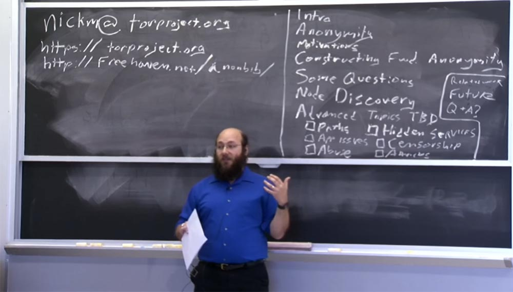

Но существует широкое понимание того, что конфиденциальность бывает необходима или полезна. И когда обычные люди используют анонимность, они, как правило, делают это, потому что хотят конфиденциальности в результатах поиска или приватности в проведении интернет-исследований. Они хотят иметь возможность заниматься локальной политикой, не оскорбляя местных политиков и так далее. Исследователи часто используют инструменты анонимизации, чтобы избежать сбора предвзятых данных, основанных на геолокации, потому что это может пригодиться им для разработки определенных версий каких-то вещей.

Компании используют технологии анонимности для защиты конфиденциальных данных. Например, если я смогу отследить все перемещения группы сотрудников какой-то крупной интернет-компании, просто наблюдая за тем, как они посещают свой веб-сервер из разных мест по всему миру, или как посещают различные компании по всему миру, то я смогу узнать многое о том, с кем они сотрудничают. А такую информацию компании предпочитают держать в секрете. Компании также используют технологию анонимности для проведения исследований.

Так, один крупный производитель роутеров, не знаю, существует ли он сейчас, регулярно рассылал совершенно разные версии технических спецификаций своей продукции на IP-адреса, связанные с его конкурентами для того, чтобы усложнить им обратный инжиниринг. Конкуренты обнаружили это с помощью нашей сети и сказали этому производителю: «Эй, подождите минутку, мы получили совсем другую спецификацию, когда зашли через Tor, нежели ту, которую получили непосредственно от вас»!

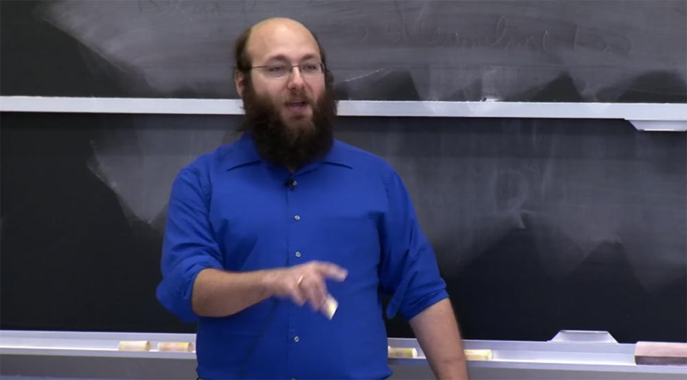

Правоохранительным органам также нужны технологии анонимности, чтобы не спугнуть своим наблюдением подозреваемых. Вы же не хотите, чтобы IP-адрес местного полицейского участка отображался в веб-логах компьютера подозреваемого. Как я уже сказал, обычные люди нуждаются в анонимности, чтобы избежать преследования из-за онлайн-активности при изучении весьма деликатных вещей.

Если вы живете в стране с неопределенным законодательством в области здравоохранения, то вы не захотите, чтобы ваши заболевания стали достоянием общественности, или чтобы другие узнали о каких-то ваших небезопасных увлечениях. Многие преступники также используют технологию анонимности. Это не единственный вариант, но если вы готовы купить время в ботнет сети, то вы можете купить довольно хорошую конфиденциальность, которая недоступна людям, считающим ботнет чем-то аморальным.

Tor, как и в целом средства анонимности, не являются единственной многоцелевой технологией обеспечения конфиденциальности. Давайте посмотрим… средний возраст выпускника – 20 лет. С тех пор, как вы родились, вы вообще говорили о крипто-войнах? Нет!

Между тем в течение 1990-х годов в США вопрос о том, насколько законно гражданское использование криптографии и в какой степени допустим её экспорт в публичные приложения, находился в подвешенном состоянии. Этот вопрос был разрешён только в конце 90-х – начале 2000-х годов. И хотя до сих пор кипят некоторые споры о технологии анонимности, это не более чем дебаты. И я думаю, они закончатся тем же – признанием легальности анонимности.

Итак, на доске вы видите краткое изложение моего выступления. Я предоставил вам небольшое введение, затем мы обсудим, что в техническом смысле представляет собой анонимность и немного поговорим о мотивации её использования.

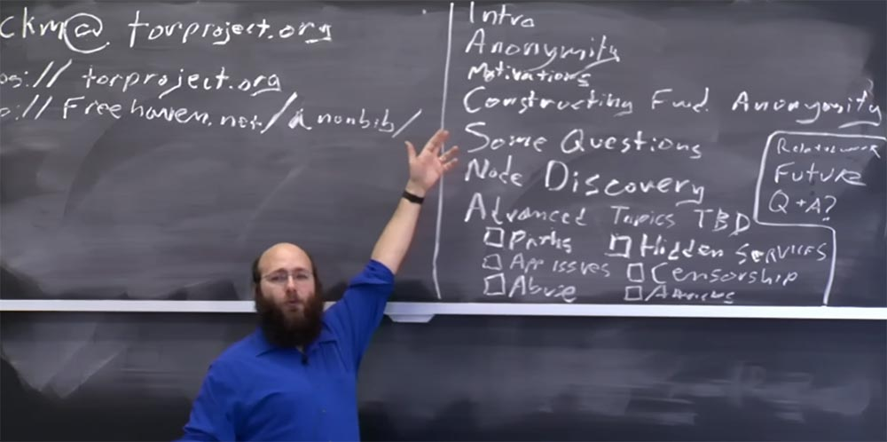

После этого я собираюсь провести вас шаг за шагом по пути, в начале которого находится идея о том, что нам нужна некоторая анонимность, а в конце — как должен выглядеть проект Tor согласно этой идее. Я также упомяну про некоторые точки ответвления от этой темы, по которым вас может «занести» в другие проекты. Я также намерен остановиться на некоторых интересных вопросах, которые все вы прислали соответственно домашнему заданию по этой лекции.

Я расскажу немного о том, как работает обнаружение узлов, это важная тема. После этого я проведу голосование, какую из упомянутых здесь дополнительных тем стоит осветить.

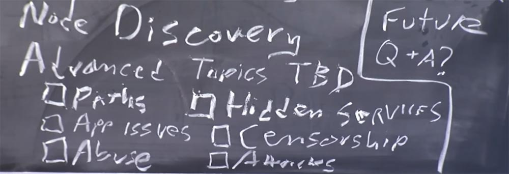

Я думаю, мы называем их дополнительными, потому что они следуют за основным материалом лекции, и я не смогу осветить их все, но это действительно крутые темы.

Я упомяну некоторые связанные с Tor системы, с структурой которых вы должны ознакомиться, если эта тема вас заинтересует и вы захотите узнать об этом больше.

Я расскажу о будущей работе, которую мы хотим проделать с Tor, и надеюсь, что у нас на это когда-нибудь найдётся время. И если после всего этого у нас останется время для ответов на ваши вопросы, то я всем отвечу. Надеюсь, что мне не нужно будет брать дополнительный час лекционного времени. Вон там, в аудитории, сидит мой коллега Дэвид, он будет «болтаться» среди вас во время лекции и разговаривать с каждым, кто захочет поговорить по теме.

Итак, анонимность. Что мы имеем в виду, когда говорим об анонимности? Есть много неформальных понятий, которые используются в неформальных дискуссиях, на форумах, в интернете и так далее. Некоторые люди считают, что анонимность означает просто «я не буду указывать на этом своё имя». Некоторые люди считают, что анонимность это когда «никто не может доказать, что это я, даже если сильно это подозревает».

Мы же имеем в виду ряд понятий, выражающих способность связать пользователя или злоумышленника с какими-либо действиями в сети. Эти понятия выходят из терминологии статьи Фитсмена и Хансена, вы найдете ссылку на неё в freehaven.net/anonbib/, библиографии анонимности, которую я помогаю поддерживать.

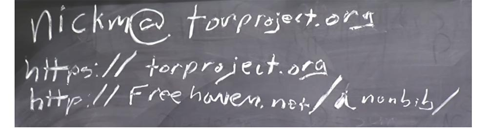

Эта библиография включает в себя большинство хороших работ в этой области. Нам нужно обновить её по настоящее время, до 2014 года, но даже в существующем виде это довольно полезный ресурс.

Поэтому, когда я говорю «анонимность», я имею в виду, что Alice, Алиса занимается какой-то деятельностью. Допустим, Алиса покупает новые носки. И здесь у нас имеется какой-то атакующий, назовём её Eve, Ева. Ева может сказать, что Алиса что-то делает. Предотвращение этого не является тем, что мы подразумеваем под анонимностью. Это называется ненаблюдаемость. Возможно, Ева также может сказать, что кто-то покупает носки. Опять же, это не то, что мы подразумеваем под анонимностью. Но мы надеемся, что Ева не сможет сказать, что Алиса именно тот человек, который покупает новые носки.

При этом мы имеем в виду, что на уровне категорий Ева не только не сможет с математической точностью доказать, что именно Алиса покупает носки, но она также не сможет считать, что Алиса покупает носки с большей вероятностью, чем любой случайный человек. Также хотелось бы, чтобы Ева, наблюдая за любой деятельностью Алисы, не смогла бы сделать вывод, что Алиса иногда покупает носки, даже если Ева узнает о какой-то конкретной деятельности Алисы в области покупки носков.

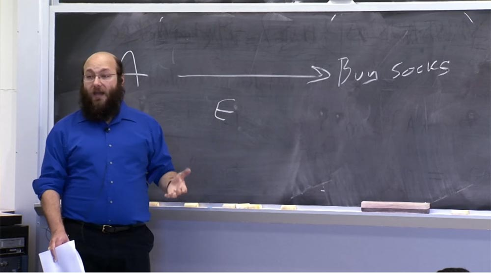

Есть и другие понятия, относящиеся к обеспечению анонимности. Одно из них – это несвязываемость, или отсутствие прямых связей. Несвязываемость — это как временный профиль Алисы. Например, Алиса пишет под псевдонимом «Боб» в политическом блоге, что может разрушить её карьеру, если об этом узнает её начальство. Итак, она пишет как Боб. Так вот, несвязываемость — это неспособность Евы связать Алису с определенным профилем пользователя, в данном случае с профилем пользователя по имени Боб.

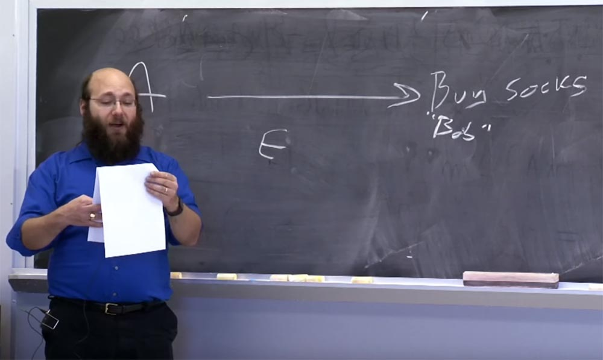

Заключительное понятие — ненаблюдаемость, это когда некие системы пытаются сделать так, чтобы было невозможно даже сказать, что Алиса находится в интернете, что Алиса подключается к чему-то в сети и что она проявляет сетевую активность.

Эти системы довольно трудно построить, позже я расскажу немного о том, в какой степени они полезны. Полезным в этой области может стать возможность скрыть, что Алиса использует систему анонимности, а не то, что она находится в интернете. Это более достижимо, чем абсолютное сокрытие того факта, что Алиса находится в интернете.

Почему я начал работать над этим в первую очередь? Ну, частично из-за «инженерского зуда». Это классная проблема, это интересная проблема, и над ней ещё никто не работал. Кроме того, мой друг Роджер получил контракт на завершение застопорившегося исследовательского проекта, который должен был закончить до истечения срока гранта. Он так хорошо справлялся с этой работой, что я сказал: «Эй, я тоже присоединюсь к этому делу». Спустя некоторое время мы образовали некоммерческую организацию и выпустили свой проект с открытым исходным кодом.  
С точки зрения более глубоких мотиваций, я думаю, что у человечества есть много проблем, которые можно решить только через лучшее и более целенаправленное общение, более свободное самовыражение и большую свободу мыслей. И я не знаю, как решить эти проблемы. Единственное, что я могу сделать, это попытаться воспрепятствовать ущемлению свободы общения, мыслей, разговоров.

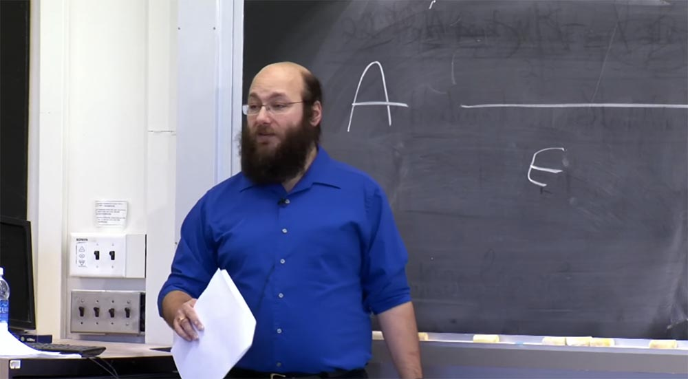

**Студент:** я знаю, что есть много хороших причин использовать Tor. Пожалуйста, не воспринимайте это как критику, но мне любопытно, как вы относитесь к преступной деятельности?

**Ник Мэтьюсон:** каково мое мнение о преступной деятельности? Некоторые законы хороши, некоторые плохи. Мой адвокат сказал бы мне никогда и никому не советовать нарушать закон. Моей целью не было создать преступнику возможность действовать против большинства законов, с которыми я согласен. Но там, где критика правительства признана противозаконной, я за преступную деятельность такого рода. Так что в этом случае можно считать, что я поддерживаю преступную деятельность такого рода.

Моя позиция в вопросе использования анонимной сети для преступной деятельности заключается в том, что если существующие законы справедливы, то я предпочел бы, чтобы люди их не нарушали. Кроме того, я думаю, что любая система компьютерной безопасности, которая не используется преступниками, является очень плохой системой компьютерной безопасности.

Я думаю, что если мы будем запрещать безопасность, которая работает на преступников, нас занесёт в область полностью небезопасных систем. Это моё мнение, хотя я больше программист, чем философ. Поэтому я буду давать очень банальные ответы на философские вопросы и вопросы правового характера. Кроме того, я не юрист и не могу дать юридическую оценку данной проблемы, так что не воспринимайте мои высказывания как юридическую консультацию.

Тем не менее, многие из этих исследовательских проблем, о которых я буду рассказывать, достаточно далеки от разрешения. Так почему же мы продолжаем исследования в том же самом направлении? Одной из причин является то, что мы считали невозможным продвинуться в исследованиях анонимности без существования необходимой испытательной платформы. Это наше мнение полностью подтвердилось, так как Tor стал исследовательской платформой для работы с системами анонимности с низкой латентностью и оказал большую помощь в этой области.

Но даже сейчас, 10 лет спустя, многие большие проблемы все еще не решены. Так что если бы мы ждали 10 лет, чтобы все исправить, то мы бы ждали напрасно. Мы ожидали, что существование такой системы анонимности принесёт миру долгосрочные результаты. То есть, очень легко утверждать, что то, чего не существует, должно быть запрещено. Аргументы против гражданского использования криптографии было гораздо легче использовать в 1990 году, нежели в наше время, потому что тогда практически не существовало надёжного шифрования для гражданского использования. Противники гражданской криптографии в то время могли утверждать, что если сделать законным что-то сильнее DES, то цивилизация рухнет, преступники никогда не будут пойманы, и организованная преступность возьмет верх во всём.

Но в 2000 году вы не смогли бы утверждать, что последствия распространения криптографии будут катастрофой для общества, потому что к тому времени гражданская криптография уже существовала, и оказалось, что это совсем не конец света. Кроме того, в 2000 году было бы намного сложнее выступать за запрет криптографии, потому что большинство избирателей выступало за её использование.

Так что если кто-то в 1985 году говорил, что «давайте запретим мощную криптографию», можно было предположить, что она нужна банкам, поэтому для банковской сферы можно было бы сделать исключение. Но кроме банков, в публичной, гражданской сфере деятельности не было тех, кто испытывал острую потребность в шифровании информации.

Но если бы кто-то в 2000 году потребовал запретить мощные системы шифрования, это бы нанесло удар по любой интернет-компании, и все, кто запускает https страницы, принялись бы кричать и размахивать руками.

Поэтому в настоящее время запрет мощной криптографии практически не осуществим, хотя люди периодически возвращаются к этой идее. Но опять же, я не философ и не политолог этого движения.

Некоторые спрашивают меня, что представляет собой ваша модель угрозы? Хорошо думать с точки зрения моделей угроз, но, к сожалению, наша модель угроз довольно странная. Мы начали не с рассмотрения требований противостояния противнику, а с требований, предъявляемых к удобству использования. Мы сами решили, что первое требование к нашему продукту – это то, что он должен быть полезным для просмотра веб-страниц и интерактивных протоколов, и для этого мы намеревались обеспечить максимальную безопасность. Так что наша модель угроз будет выглядеть довольно странно, если попытаться вписать в неё, что может сделать злоумышленник, при каких обстоятельствах и как. Это потому, что мы поставили перед собой цель, что в первую очередь наш продукт должен работать на интернет.

Я вернусь к этому через пару минут, а пока что давайте поговорим о том, как мы выстраиваем анонимность.

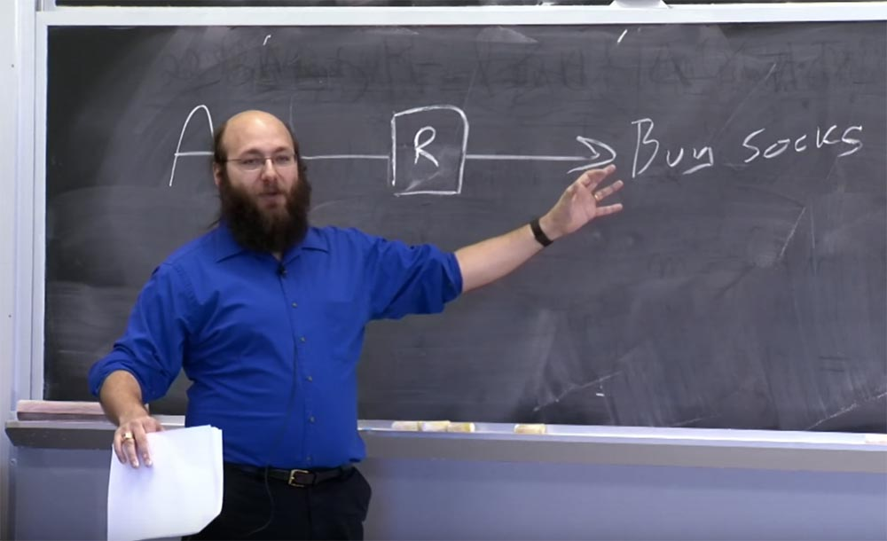

Итак, перед вами Алиса, которая хочет купить носки. Допустим, Алиса управляет компьютером. Назовем его R – ретранслятор, который передаёт трафик Алисы на сайт… я хотел бы назвать его socks.com, но я боюсь, что это окажется чем-то ужасным, так что назову его zappos.com, они тоже продают носки.

Итак, Алиса хочет купить носки на zappos.com. И она проходит через этот ретранслятор, которым управляет. Любой подслушивающий, кто посмотрит на это, скажет: «Скорее всего, это Алиса, это её компьютер».

Теперь предположим, что этим же ретранслятором пользуются ещё два человека – назовём их просто A2 – Алиса 2 и A3 – Алиса 3, потому что мне не хватает стандартных криптографических имен. Они покупают книги и постят фотографии кошечек, ведь это 80% того, что обычно люди делают в интернете, верно?

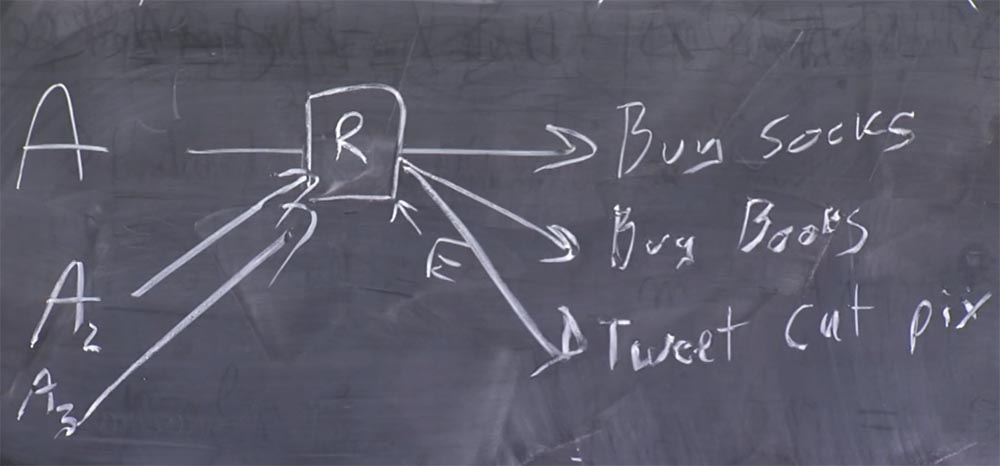

Все три пользователя используют один компьютер, из которого теперь выходит три потока. Теперь тот, кто наблюдает за этим компьютером, не сможет легко определить, по крайней мере, мы надеемся – мы вернёмся к этому позже – что он не сможет определить, что первая Алиса покупает носки, вторая Алиса покупает книги, а третья Алиса «твикает» фотографии кошечек.

Ну, за исключением того, что если он следит за соединением на стороне Алисы, то сможет увидеть, как она говорит этому R: «пожалуйста, соедините меня с zappos.com». Для такого случая мы добавляем между А и R немного шифрования, например, используем TLS по всем этим ссылкам. При условии, что злоумышленник не сможет взломать TLS и сопоставить Алису с запросом доступа на сайт zappos.com, Алиса получает некоторую конфиденциальность.

Но этого все равно недостаточно. Потому что, во-первых, мы предполагаем, что этот R пользуется полным доверием. Я надеюсь, что вы знаете определение термина trusted и почему это на самом деле не означает «доверенный». Ему доверяют в том смысле, что он может сломать всю систему, а не в том, что он действительно заслуживает доверия.

Итак, мы можем использовать несколько ретрансляторов, или несколько реле. Мы можем предоставить разные ретрансляторы разным людям. На самом деле это не та топология, которую мы используем в своей системе, но моя техника рисования ужасна, и я не хочу ничего перерисовывать. Мы можем представить, что эти соединения проходят через несколько ретрансляторов, каждый из которых удаляет один уровень шифрования.

Итак, все, что видит первый, крайний слева ретранслятор, это то, что Алиса что-то делает. Все, что видит последний, правый ретранслятор – это то, что кто-то покупает носки. Но правый ретранслятор видит, что кто-то покупает носки благодаря соединению, которое пришло от среднего ретранслятора. Первый ретранслятор просто видит, что Алиса что-то делает, и передаёт соединение второму ретранслятору. При этом не существует никакого постороннего, кто смог бы установить истинную связь и взаимодействие участников всего этого процесса.

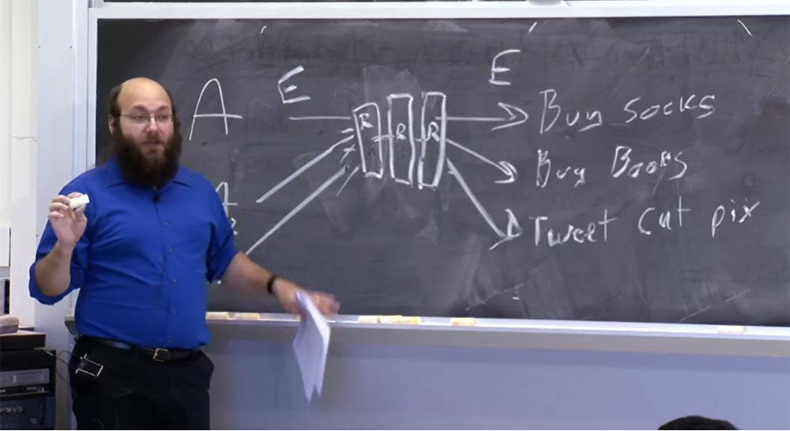

Теперь мы подошли к основной конструкции системы. Предположим, что Ева наблюдает здесь, на участке A-R и здесь, на участке R – Buy socks. Я до сих пор не упомянул, что не существует ничего, что скрывало бы тайминг и объём пакетов Алисы. Конечно, следует принять во внимание сетевой шум, который образуется в процессе всех операций вычисления и расшифровки данных, латентность сети и тому подобное.

Но, в конце концов, если Алиса посылает килобайт данных, то конструкция, которую я изобразил, на выходе выдаёт тот же килобайт. И если веб-страница магазина носков имеет длину 64k и обслуживается этим веб-сервером в 11 часов 26 минут, то Алиса получит обратно пакет длиной 64k в 11:26 или 11:27.

Теперь, используя некоторую статистику, Ева может сопоставить некоторые из этих потоков данные, если мы не скрываем информацию об объемах и тайминге. Существуют решения, которые скрывают объем и время обмена информацией. Например, анонимный обработчик электронной почты, или ремейлер, Mixmaster и сервисы типа DС-Net.

Может быть так, что каждый из этих узлов получил большое количество запросов в течение часа, и тогда эти узлы меняют их местами и отправляют все одновременно. При этом можно сказать, что все запросы и ответы должны быть одинакового размера, например, запросы 1k, а ответы – 1 мегабайт. Немного поработав над этим, мы получаем что-то, что позволит вам отправить по электронной почте сообщение, которое прибудет адресату в течение часа или предоставит вам веб-страницу через час после отправки запроса. При этом предполагается, что вы оптимизируете пакеты для одиночного путешествия туда и обратно. Эти системы существуют и существовали, когда мы начали заниматься разработкой Tor.

Они не особо используются, хотя я написал одну программу под названием Mixminion, которая была преемником ремейлера Mixmaster, но на протяжение последних 3-х лет я не получил ни одного сообщения от ремейлера. У Tor миллионы пользователей, у ремейлеров их не больше нескольких сотен.

Вы можете подумать, что эти системы всё же обеспечивают лучшую анонимность для людей, которые в ней действительно нуждаются. Однако существует одно обстоятельство: если у вас порядка сотен пользователей, вы на самом деле не способны предоставить им ту анонимность, на которую рассчитывают. Потому что хакер посмотрит, что там около сотни человек и сообщение, которое его заинтересовало, было обращено к болгарскому сайту. Сколько человек из этой сотни говорят по-болгарски? Пять! Так что раскрыть такую анонимность не составит особой проблемы.

Говорят, что анонимность любит компанию. Если у вас нет большой пользовательской базы, то ни одна система не сможет фактически обеспечить анонимность. Поэтому даже в этой конструкции, если все наши Алисы принадлежат к одной организации, они должны иметь общую публичную, а не частную, корпоративную систему. Если они все легально работают на MIT и расследуют деятельность какого-то фейкового сайта MIT, продающего поддельные дипломы и при этом используют легальный анонимайзер MIT, то на самом деле это не скроет, кто они такие. Но если у вас есть большое количество различных организаций, использующих всё это, то вам удастся обеспечить некоторую конфиденциальность.

Мы ещё вернёмся к рассмотрению корреляционных атак, но пока давайте скажем, что мы не сопротивляемся этим корреляционным атакам. Вместо этого мы должны свести к минимуму возможность того, что злоумышленник, который контролирует оба участка такой системы, сможет раскрыть анонимность её пользователей.

Я только что говорил о передаче сообщений. Предположим, что у нас имеется нечто вроде смешанной сети, где вы даёте каждому из этих ретрансляторов открытый ключ — K3, K2, K1. И когда Алиса хочет отправить что-то на сайт, продающий носки, она зашифровывает своё сообщение тремя ключами таким образом: К1(К2(К3 «socks»))).

Но открытый ключ, как вы знаете, является достаточно дорогим, поэтому вы не захотите использовать его для массового трафика.

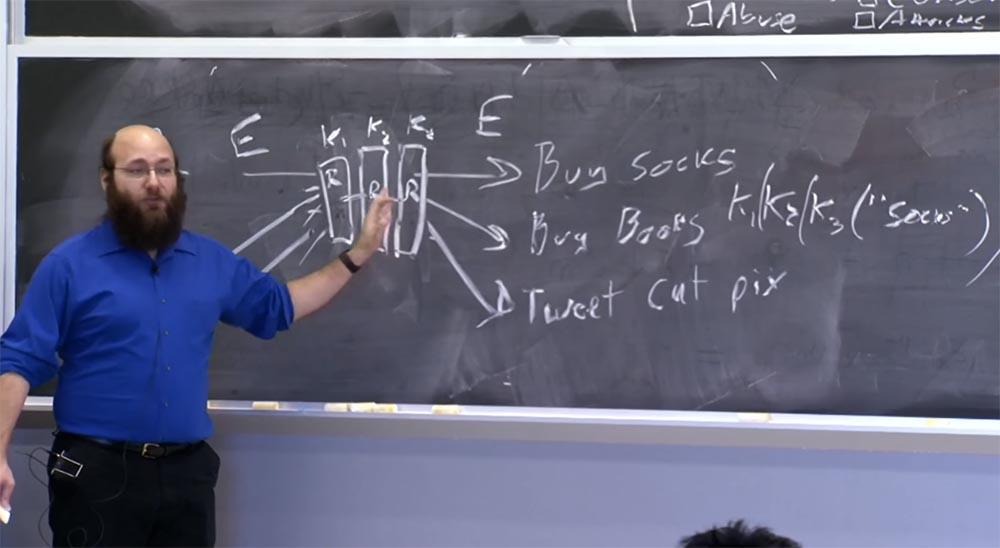

Поэтому вы согласовываете набор ключей с каждым сервером. Таким образом, Алиса делится одним симметричным ключом с первым ретранслятором, другим симметричным ключом со вторым, а третьим ключом – с третьим ретранслятором. Это ассоциируется с тем, что мы называем схемой прохождения трафика через сеть. После того, как первоначальный открытый ключ настроен для создания двух других ключей, Алиса может использовать симметричное шифрование для передачи данных по сети.

Если вы остановитесь на этом этапе, то получите «луковую» маршрутизацию в том виде, в каком она была разработана в 1990-х годах Сайверсоном, Голдшлагом и Ридом. Пол Сайверсон до сих пор занимается исследованиями в этой области, двое других учёных работают над другими вещами.

Кроме того, как только вы добавили подобную схему, где данные проходят усреднённый путь через ретрансляторы, вы можете легко реплицировать канал, по которому вещи, отправленные обратно таким же образом, попадают к Алисе, шифруясь на каждом шаге вместо расшифровки.  
И, конечно, вам понадобится какая-то проверка целостности, как между узлами, так и из конца в конец, потому что если вы не проверяете целостность, может произойти следующее. Допустим, вы используете потоковое шифрование на основе XOR. Если вы не делаете проверку целостности, то этот узел – первый ретранслятор — может использовать XOR в виде «Алиса, Алиса, Алиса, Алиса, Алиса» в зашифрованном сообщении. Затем, когда он наконец будет расшифрован после третьего ретранслятора, потому что это довольно податливая криптографическая схема, то если тот же злоумышленник будет контролировать последний узел или же будет наблюдать за участком между третьим ретранслятором и целевым сайтом, также, как наблюдает его здесь, то злоумышленник увидит «Алиса, Алиса, Алиса, Алиса, Алиса», зашифрованное XOR простым текстом и сможет сделать вывод, что данный поток трафика исходит именно от Алисы.

27:06

[Курс MIT «Безопасность компьютерных систем». Лекция 19: «Анонимные сети», часть 2](https://habr.com/company/ua-hosting/blog/431264/)

Полная версия курса доступна [здесь](https://ocw.mit.edu/courses/electrical-engineering-and-computer-science/6-858-computer-systems-security-fall-2014/).

Спасибо, что остаётесь с нами. Вам нравятся наши статьи? Хотите видеть больше интересных материалов? Поддержите нас оформив заказ или порекомендовав знакомым, **30% скидка для пользователей Хабра на уникальный аналог entry-level серверов, который был придуман нами для Вас:** [Вся правда о VPS (KVM) E5-2650 v4 (6 Cores) 10GB DDR4 240GB SSD 1Gbps от $20 или как правильно делить сервер?](https://habr.com/company/ua-hosting/blog/347386/) (доступны варианты с RAID1 и RAID10, до 24 ядер и до 40GB DDR4).

**VPS (KVM) E5-2650 v4 (6 Cores) 10GB DDR4 240GB SSD 1Gbps до декабря бесплатно** при оплате на срок от полугода, заказать можно [тут](https://ua-hosting.company/vpsnl).

**Dell R730xd в 2 раза дешевле?** Только у нас **[2 х Intel Dodeca-Core Xeon E5-2650v4 128GB DDR4 6x480GB SSD 1Gbps 100 ТВ от $249](https://ua-hosting.company/serversnl) в Нидерландах и США!** Читайте о том [Как построить инфраструктуру корп. класса c применением серверов Dell R730xd Е5-2650 v4 стоимостью 9000 евро за копейки?](https://habr.com/company/ua-hosting/blog/329618/)