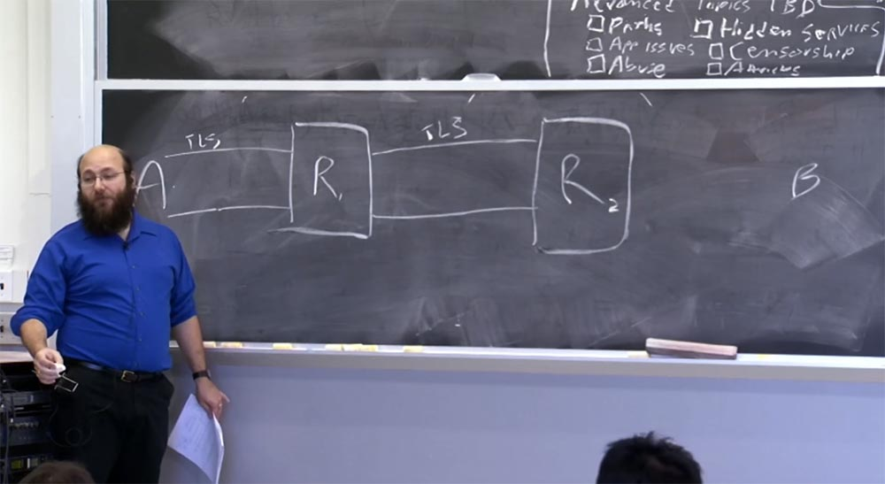
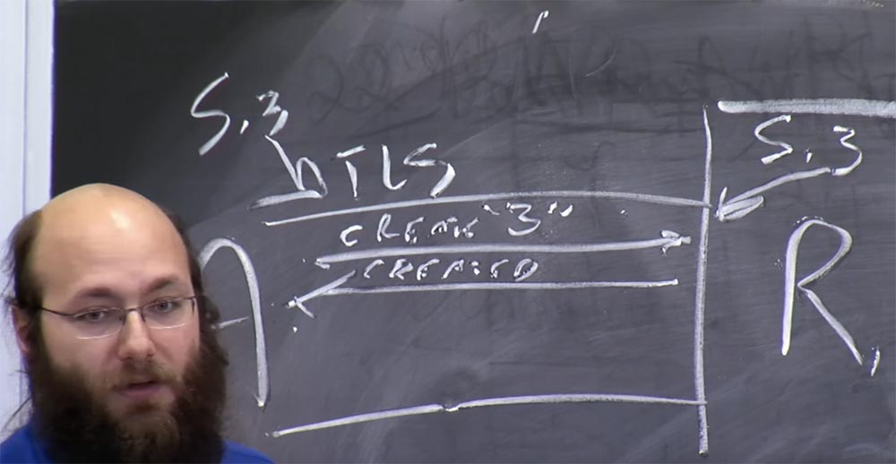
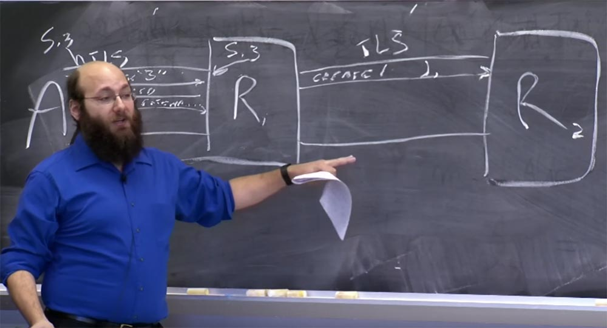
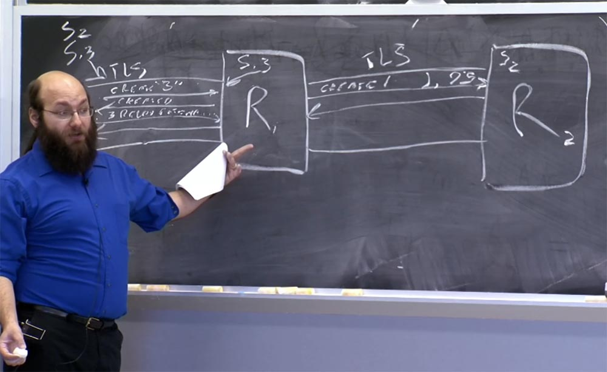
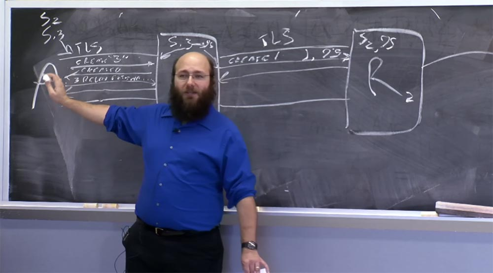
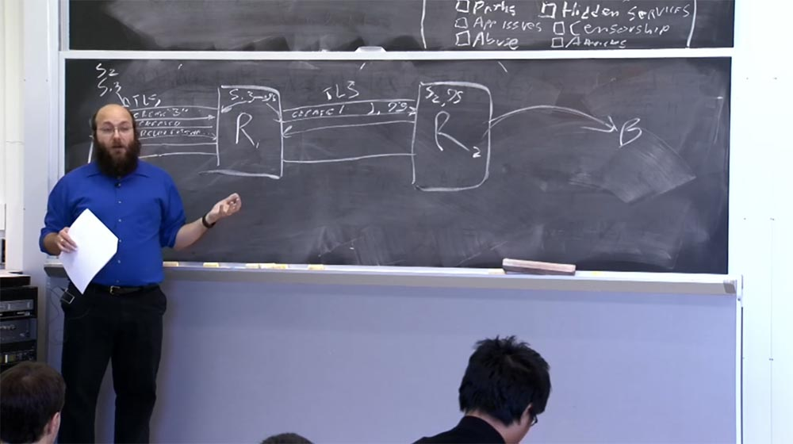
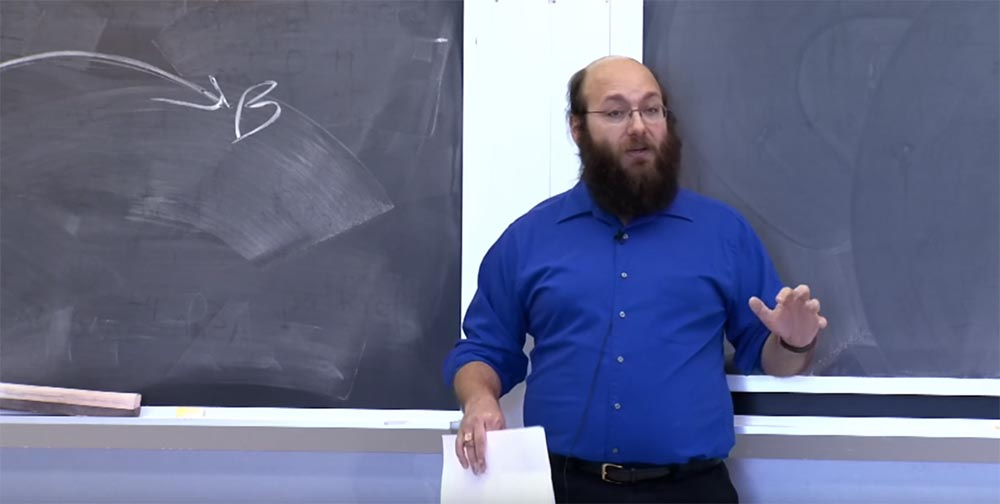
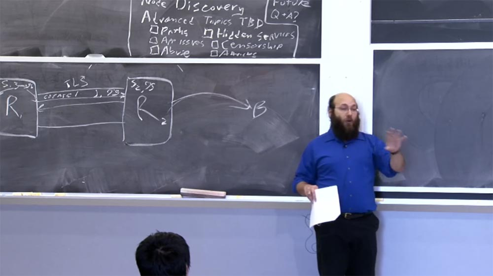
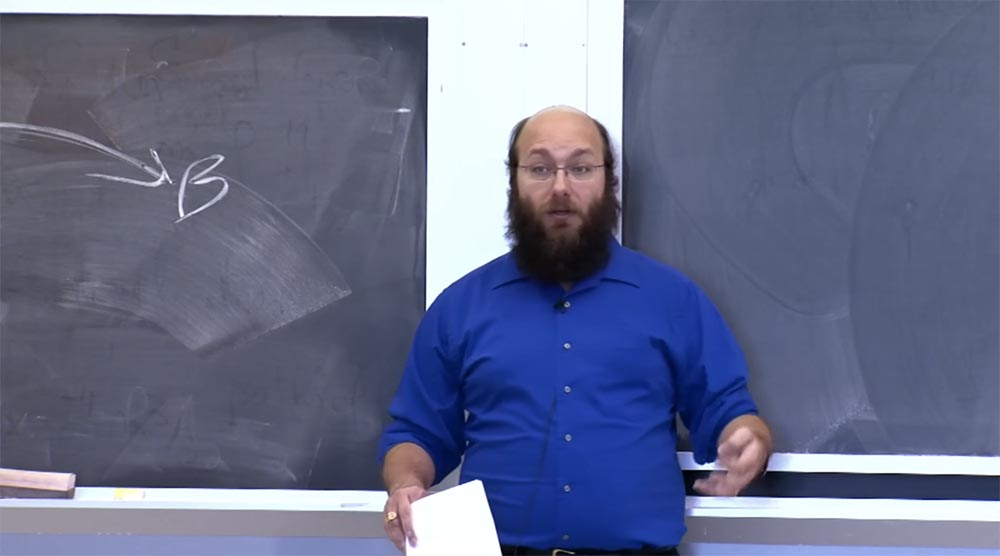

Курс MIT «Безопасность компьютерных систем». Лекция 19: «Анонимные сети», часть 2 (лекция от создателя сети Tor) / Блог компании ua-hosting.company

### Массачусетский Технологический институт. Курс лекций #6.858. «Безопасность компьютерных систем». Николай Зельдович, Джеймс Микенс. 2014 год

Computer Systems Security — это курс о разработке и внедрении защищенных компьютерных систем. Лекции охватывают модели угроз, атаки, которые ставят под угрозу безопасность, и методы обеспечения безопасности на основе последних научных работ. Темы включают в себя безопасность операционной системы (ОС), возможности, управление потоками информации, языковую безопасность, сетевые протоколы, аппаратную защиту и безопасность в веб-приложениях.

Лекция 1: «Вступление: модели угроз» [Часть 1](https://habr.com/company/ua-hosting/blog/354874/) / [Часть 2](https://habr.com/company/ua-hosting/blog/354894/) / [Часть 3](https://habr.com/company/ua-hosting/blog/354896/)  
Лекция 2: «Контроль хакерских атак» [Часть 1](https://habr.com/company/ua-hosting/blog/414505/) / [Часть 2](https://habr.com/company/ua-hosting/blog/416047/) / [Часть 3](https://habr.com/company/ua-hosting/blog/416727/)  
Лекция 3: «Переполнение буфера: эксплойты и защита» [Часть 1](https://habr.com/company/ua-hosting/blog/416839/) / [Часть 2](https://habr.com/company/ua-hosting/blog/418093/) / [Часть 3](https://habr.com/company/ua-hosting/blog/418099/)  
Лекция 4: «Разделение привилегий» [Часть 1](https://habr.com/company/ua-hosting/blog/418195/) / [Часть 2](https://habr.com/company/ua-hosting/blog/418197/) / [Часть 3](https://habr.com/company/ua-hosting/blog/418211/)  
Лекция 5: «Откуда берутся ошибки систем безопасности» [Часть 1](https://habr.com/company/ua-hosting/blog/418213/) / [Часть 2](https://habr.com/company/ua-hosting/blog/418215/)  
Лекция 6: «Возможности» [Часть 1](https://habr.com/company/ua-hosting/blog/418217/) / [Часть 2](https://habr.com/company/ua-hosting/blog/418219/) / [Часть 3](https://habr.com/company/ua-hosting/blog/418221/)  
Лекция 7: «Песочница Native Client» [Часть 1](https://habr.com/company/ua-hosting/blog/418223/) / [Часть 2](https://habr.com/company/ua-hosting/blog/418225/) / [Часть 3](https://habr.com/company/ua-hosting/blog/418227/)  
Лекция 8: «Модель сетевой безопасности» [Часть 1](https://habr.com/company/ua-hosting/blog/418229/) / [Часть 2](https://habr.com/company/ua-hosting/blog/423155/) / [Часть 3](https://habr.com/company/ua-hosting/blog/423423/)  
Лекция 9: «Безопасность Web-приложений» [Часть 1](https://habr.com/company/ua-hosting/blog/424289/) / [Часть 2](https://habr.com/company/ua-hosting/blog/424295/) / [Часть 3](https://habr.com/company/ua-hosting/blog/424297/)  
Лекция 10: «Символьное выполнение» [Часть 1](https://habr.com/company/ua-hosting/blog/425557/) / [Часть 2](https://habr.com/company/ua-hosting/blog/425561/) / [Часть 3](https://habr.com/company/ua-hosting/blog/425559/)  
Лекция 11: «Язык программирования Ur/Web» [Часть 1](https://habr.com/company/ua-hosting/blog/425997/) / [Часть 2](https://habr.com/company/ua-hosting/blog/425999/) / [Часть 3](https://habr.com/company/ua-hosting/blog/426001/)  
Лекция 12: «Сетевая безопасность» [Часть 1](https://habr.com/company/ua-hosting/blog/426325/) / [Часть 2](https://habr.com/company/ua-hosting/blog/427087/) / [Часть 3](https://habr.com/company/ua-hosting/blog/427093/)  
Лекция 13: «Сетевые протоколы» [Часть 1](https://habr.com/company/ua-hosting/blog/427763/) / [Часть 2](https://habr.com/company/ua-hosting/blog/427771/) / [Часть 3](https://habr.com/company/ua-hosting/blog/427779/)  
Лекция 14: «SSL и HTTPS» [Часть 1](https://habr.com/company/ua-hosting/blog/427783/) / [Часть 2](https://habr.com/company/ua-hosting/blog/427785/) / [Часть 3](https://habr.com/company/ua-hosting/blog/427787/)  
Лекция 15: «Медицинское программное обеспечение» [Часть 1](https://habr.com/company/ua-hosting/blog/428652/) / [Часть 2](https://habr.com/company/ua-hosting/blog/428654/) / [Часть 3](https://habr.com/company/ua-hosting/blog/428656/)  
Лекция 16: «Атаки через побочный канал» [Часть 1](https://habr.com/company/ua-hosting/blog/429390/) / [Часть 2](https://habr.com/company/ua-hosting/blog/429392/) / [Часть 3](https://habr.com/company/ua-hosting/blog/429394/)  
Лекция 17: «Аутентификация пользователя» [Часть 1](https://habr.com/company/ua-hosting/blog/429680/) / [Часть 2](https://habr.com/company/ua-hosting/blog/429682/) / [Часть 3](https://habr.com/company/ua-hosting/blog/429686/)  
Лекция 18: «Частный просмотр интернета» [Часть 1](https://habr.com/company/ua-hosting/blog/430204/) / [Часть 2](https://habr.com/company/ua-hosting/blog/430206/) / [Часть 3](https://habr.com/company/ua-hosting/blog/430208/)  
Лекция 19: «Анонимные сети» [Часть 1](https://habr.com/company/ua-hosting/blog/430204/) / [Часть 2](https://habr.com/company/ua-hosting/blog/430206/) / [Часть 3](https://habr.com/company/ua-hosting/blog/430208/)

Давайте рассмотрим подробнее, как работает протокол. Потому что было бы стыдно прочитать лекционную статью и не поговорить о вещах, на которых она заостряет внимание. Хочу снова извиниться за мою технику рисования на доске, всё-таки большую часть времени я провожу за столом, печатая на компьютере.

Это инопланетная технология. Итак, вот ретранслятор. А вот и Элис. Вот другой ретранслятор и вот Боб. Сейчас Алиса хочет поговорить с Бобом, поэтому первое, что она делает – это создаёт цепочку через эти ретрансляторы к Бобу. Скажем, она выбрала эти два ретранслятора, R1 и R2. Сначала Алиса делает TLS ссылку на R1, допустим, что она уже имеет TLS ссылку на R2. Затем в первую очередь Алиса выполняет одностороннюю аутентификацию, одностороннее согласование анонимных ключей.

Старый протокол Tor назывался TAP — Tor Authentication Protocol, новый называется NTor. У них обоих есть доказательства безопасности. Это правильные доказательства, хотя в их описании были допущены ошибки.

После аутентификации Алиса выбирает идентификатор канала circuit ID, допустим, 3, даёт команду ретранслятору создать канал «3» — create «3», и он отвечает ей, что канал создан — created. Теперь Алиса и ретранслятор делятся секретным симметричным ключом S1. И они оба хранят его с индексом «3», что является ссылкой на этот канал.

Теперь Алиса может использовать этот ключ для отправки сообщений R1. Она говорит, что на «тройке», это идентификатор канала, о котором говорится в лекционной статье, ретранслятору отправляется расширенная ячейка с контентом.

Расширенная ячейка в основном содержит первую половину рукопожатия handshake. Но на этот раз она не зашифрована открытым ключом R1, а зашифрована открытым ключом R2. Это говорит о том, что сообщение отправляется на R2. Таким образом, R1 знает, что нужно открыть новый канал к R2, и сообщает об этом ретранслятору R2 сообщением create(….), где в скобках размещена та самая половина рукопожатия, которое пришло от Алисы. При этом R1 создаёт собственный circuit ID, поскольку идентификаторы каналов определяют другие каналы в этом втором соединении TLS. Причём Алиса не знает, какие идентификаторы каналов здесь ещё используются, потому что это «личное дело» R1 и R2.

Так что ретранслятор может выбрать, например, ID 95. На самом деле это маловероятно, потому что номер канала случайно выбирается из 4 байтового пространства, но я не хочу выписывать сегодня все 32-битные числа.

После этого R2 отвечает первому ретранслятору «created», а R1 возвращает Алисе расширенную ячейку, зашифрованную ключом S1. Теперь Алиса и ретранслятор R2 делятся ключом S2 и Алиса может отправлять сообщения, сначала зашифрованные с помощью S2, а затем с помощью S1. Она посылает такое сообщение, R1 удаляет шифрование S1 и пересылает его дальше.

Первый ретранслятор знает, что сообщения канала 3 должны отправляться второму ретранслятору по каналу 95. Получив это сообщение, второй ретранслятор видит, что каналу 95 соответствует ключ S2, и с его помощью расшифровывает это сообщение: «о, тут сказано открыть соединение с Бобом»! Прочитав это, ретранслятор R2 открывает TCP соединение с Бобом и сообщает об этом Алисе, используя такой же обратный процесс передачи сообщений.

После всего этого Алиса говорит: «замечательно, тогда скажите Бобу что-то вроде http: 1.0get /index.html», и дальше жизнь идёт своим чередом.

Давайте посмотрим, что я пропустил в лекционной статье…так… это, это и это. Хорошо, так что же мы ретранслируем на самом деле? Некоторые решения в этой области утверждают, что необходимо передавать туда и обратно IP- пакеты, то есть эта схема должна представлять собой просто способ передачи IP-пакетов. Одна из проблем заключается в том, что мы хотим поддержать так много пользователей, насколько это возможно, а что означает, что мы должны работать на всех видах операционных систем.

Но TCP стеки разных операционных систем действуют по-разному. Если вы когда-либо использовали Nmap или какой-либо инструмент анализа сетевого трафика, вы можете запросто отличить Windows TCP от FreeBSD TCP или TCP Linux. Вы даже можете отличить разные версии. Более того, если вы можете отправить выбранному хосту необработанные IP-пакеты, вы можете спровоцировать ответы, частично основанные на том, что делает хост.

Так что если вы передаёте IP-пакеты туда и обратно, вам необходима нормализация IP. Так как всё, что меньше полного стека IP, не сможет работать на нормализацию, вы не заходите это делать.

Вместо этого мы выбираем самый легкий путь – просто принимаем весь контент из потоков TCP, предполагая, что он надёжен и с ним всё в порядке. Программа анализирует все данные, передаваемые Алисой, соглашается принять TCP соединения, исходящие от её приложений, и просто ретранслирует содержимое, не делая ничего сложного на сетевом уровне.

Вы бы могли попробовать увеличить производительность, используя другие средства, описанные в материалах лекции. Но я описал схему, которую реально можно реализовать, потому что при создании Tor мы уделяли гораздо больше внимания классам безопасности и компиляторам, чем сетевым классам. Теперь у нас есть сетевые специалисты, но в 2003- 2004 мы испытывали в них дефицит.

Протокол TCP представляется вполне подходящим, правильным уровнем. Протоколы более высокого уровня, рассмотренные в некоторых оригинальных проектах, используют на стороне Алисы отдельные прокси для HTTP, FTP и кажутся плохой идеей. Это потому, что любой протокол должен иметь шифрование от начала и до конца на протяжении всего соединения Алиса-Боб, и если нам повезёт, Алисе удастся создать TLS соединение между R2 и Бобом, обладающее свойствами целостности и безопасности.

Но если это так, то любые преобразования анонимности, которые вы хотите применить к зашифрованным данным, должны произойти в приложении, которое использует Алиса, прежде чем TLS –соединение будет полностью создано. Но это невозможно осуществить, используя прокси-сервер, поэтому нам больше подходит TCP.

Кто-то спросил меня, где же наши доказательства безопасности? У нас есть доказательства безопасности для многих способов шифрования, которые мы используем, это стандартные редакции документов. В целом для протокола имеются доказательства безопасности определённых аспектов «луковой» маршрутизации. Но модели, которые они должны использовать с целью доказать, что это обеспечивает анонимность, должны основываться на таких причудливых свойствах вселенной, свойствах сети или способностях атакующего, что они могут удовлетворить только комиссии по программированию, заседающие на некоторых теоретических конференциях.  
Коротко говоря, эти свойства анонимности должны доказать, что злоумышленник, который может увидеть объём и тайминги данных на участке Алиса\- R1, не сможет идентифицировать их, наблюдая только за выходными байтами на участке R2-Боб. Но это не совсем удовлетворительный результат. Скажем так – какие гарантии безопасности вы бы хотели от системы, которую не знаете, как построить? Ладно, я должен быть осторожен с подобными высказываниями… Вспомним, что имеются системы с сильнейшими гарантиями анонимности, и вы знаете, как создать такие системы, но вы никогда не захотите их использовать. Как, например, классические сети DC-Net, которые обеспечивает гарантированную анонимность, за исключением того, что любой участник может закрыть всю сеть, просто перестав в ней участвовать. К тому же эта система не масштабируется.

Но для вещей, создаваемых в наше время, свойства анонимности в большей степени являются вероятностными, а не категорически гарантированными. Так что вместо того, чтобы спрашивать, гарантирует ли эта система безопасность Алисы, стоило бы спросить, сколько трафика Алиса может безопасно отправить, если хочет иметь 99% вероятности того, что эту сетевую активность не удастся связать с её деятельностью?

Первый вопрос, который мы задали себе, приступая к созданию Tor – кто же будет управлять всеми этими штуками? Мы не знали, действительно ли наша система «встанет на ноги», поэтому единственным вариантом было пробовать и смотреть, что из этого получается.

У нас было достаточно добровольцев. Изрядное число некоммерческих организаций захотело просто сделать пожертвования и использовать их для покупки пропускной способности и запуска узлов Tor. В проекте приняли участие некоторые университеты и несколько частных компаний, службы безопасности которых посчитали, что было бы весело запустить собственный сервер Tor.  
При этом возникали юридические вопросы, но опять же, я не юрист и не могу дать юридическую оценку этим вещам. Однако пять разных человек спросили меня о легальности нашей системы. Насколько я могу судить, по крайней мере, в США, нет юридических препятствий для запуска сервера Tor. И как мне кажется, подобная ситуация имеет место в большинстве Европейских стран. В странах с меньшей свободой интернета использование Tor регламентируется более жестко.

Проблема состоит не в том, насколько законно или незаконно использование системы Tor, а в том, что кто-то может сделать с моим сервером Tor что-то незаконное или нежелательное. Например, не отключит ли меня от сети мой провайдер, если я предоставлю свой компьютер в качестве узла Tor, поверят ли правоохранительные органы, что я просто использую сервер Tor, или придут и заберут мой компьютер, чтобы в этом убедиться.

Для такого случая я бы посоветовал не запускать сервер Tor из вашей комнаты в общежитии, вернее, не использовать свой компьютер для трансляции большого объёма выходного трафика, предполагая, что это позволяет сетевая политика. Честно говоря, я понятия не имею, что собой сейчас представляет эта политика, потому что она сильно изменилась со времени моего студенчества. Но в любом случае большой исходящий трафик с вашего компьютера в общежитии может привести к неприятностям. Однако запуск ретранслятора без выдачи трафика в интернет будет менее проблематичным. Но если ваш провайдер разрешает действовать подобным образом, то это вполне разумная вещь.

Кто-то меня спросил, что, если пользователи не доверяют конкретному узлу? Это подводит нас к следующей теме. Клиенты сети используют программное обеспечение по своему усмотрению, и вы не можете запретить им использовать какие-то одни программы и обязать использовать другие. Но помните, что анонимность любит компанию. Если я использую три узла, вы используете три других узла, а вы – три ещё каких-то узла, наш трафик вообще не будет смешиваться.

Пока мы разделяем используемые нами части сети, нас легко отличить друг от друга. Теперь, если я просто исключу один или два узла, и вы просто исключите один или два узла, то это не будет настолько большим разбиением сети на части и затруднит нашу идентификацию. Но оптимальным было бы, чтобы все использовали одни и те же узлы, насколько это возможно. Как же мы этого достигаем?

Итак, в первой версии Tor, мы просто скинули пользователям список всех узлов, их было около 6, из которых три работали на одном компьютере в лаборатории компьютерных наук Tech Square. Но это не было хорошей идеей, потому что количество узлов увеличивается и уменьшается, сами узлы меняются, и вы бы не хотели каждый раз выпускать новую версию ПО, когда кто-то присоединяется к созданию сети.

Но можно сделать так, чтобы каждый узел содержал в себе список всех других узлов, которые к нему подключены, и все они «рекламировали» бы друг друга. Тогда, когда клиент подключается к сети, он просто должен знать один узел, чтобы затем сказать: «Эй, кто тут есть в сети»?

На самом деле у многих людей есть проекты, построенные по такому принципу. Многие ранние проекты анонимности одноранговых узлов работают именно таким образом. Но это ужасная идея. Потому что, если вы подсоединяетесь к одному узлу и спрашиваете, кто в сети, и вы доверяете отвечающему, то я могу вам ответить: «я в сети, и мой друг отсюда присутствует в сети, и мой друг оттуда тоже в сети, и больше в сети никого нет!». То есть я могу назвать вам любое количество поддельных узлов, которыми я управляю и которые перехватывают весь ваш трафик. Это то, что называется rаw capture attack, или атака перехвата исходного узла.

Так что, возможно, если у нас есть только один каталог, управляемый доверенной стороной, это не настолько хорошо, так что давайте всё же считать, что у нас имеется несколько доверенных сторон. Клиенты идут к этим доверенным сторонам, получают от каждой список всех узлов и объединяют его в один общий список узлов сети.

Это не хорошо тем, что мы снова оказывается разделёнными на идентифицируемые кластеры сети. Если я выберу эти три узла, а вы выберете три других узлах, то мы будем использовать различные наборы узлов, а это не хорошо. Кроме того, если я пользуюсь переданным мне списком узлов, любая из доверенных сторон может помешать мне использовать узел, который ей не нравится, просто не указав его в списке. Если я использую объединенный список, то кто-то может зафлудить меня 20-ю тысячами фейковых серверов, указав их в списке. Я бы мог проголосовать за их исключение и смог бы каким-то образом решить две последние проблемы, но я все равно буду отделен от всех, кто использует разные доверенные стороны.

Мы могли бы создать волшебную DHT, или распределённую хеш-таблицу, своего рода магическую распределенную структуру, проходящую через все узлы. Я говорю «волшебную», потому что, хотя в этой области и есть проекты, и некоторые лучше, чем другие, ни один из них на данный момент не имеет твёрдых доказательств безопасности. Настолько твёрдых, чтобы я мог бы с уверенностью сказать, что это действительно безопасно.

Итак, вот к какому решению мы пришли в результате. Наша сеть имеет несколько доверенных органов, управляемых доверенными сторонами, которые собирают списки узлов, которые ежечасно голосуют, какие узлы могут работать в сети, и могут голосовать за то, чтобы исключить подозрительные узлы. Все они работают на том же /16, который вытворяет с трафиком такие странные вещи, и формируют консенсус, который основан на подсчёте результата голосования.  
И клиенты не используют узел, если он не подписан достаточным количеством «голосов» доверенных сторон.

Это не окончательный вариант проекта, но это лучшее, что мы смогли придумать до сих пор. Кстати, все, что вам нужно распространять среди клиентов — это список всех авторизованных открытых ключей и список некоторых мест для получения каталогов. Вы хотите, чтобы все узлы кэшировали эти каталоги, потому что если вы этого не сделаете, нагрузка на сеть станет опасной и пропускная способность сети катастрофически упадёт.

Я намерен пропустить следующий вопрос и перейти непосредственно к тому, как клиенты должны выбирать, какие пути им прокладывать через сеть. Я хотел бы поговорить о проблемах применения и создания приложений, которые бы не выдавали самих себя. Я бы хотел поговорить о злоупотреблениях сетью, о скрытых сервисах и о том, как работают, поговорить о сопротивлении цензуре, и ещё я хотел бы поговорить об атаках и защите. Но у нас осталось всего 35 минут, поэтому я не смогу поговорить обо всём, о чем хочу. Я прошу вас проголосовать за темы, которые вы считаете самыми важными для обсуждения.

Если вы считаете, что одна из наиболее важных тем – это выбор путей и узлов, пожалуйста, поднимите руку. Если одна из самых важных тем – это проблемы приложений и как сделать так, чтобы приложения не нарушали вашу анонимность, пожалуйста, поднимите руку. Если одна из самых важных проблем — это злоупотребление и как его можно предотвратить, пожалуйста, поднимите руку. Так, я вижу, что эта тема популярна, и отмечаю её.

Если для вас важно, как работают скрытые сервисы и как их можно заставить работать лучше, пожалуйста, поднимите руку. Ага, это гораздо популярнее на этой стороне аудитории, чем на другой. Хорошо, отмечаем и эту тему. Цензура, кого интересует цензура? Вижу, что и это популярная тема. Нападения и защита?

Итак, мы не будем рассматривать выбор путей и проблемы приложений. Что касается оптимального выбора пути, то эта тема требует отдельной лекции, потому что дизайн защиты узла определяется пропускной способностью узла. С одной стороны, вам нужно обеспечить высокую пропускную способность, а с другой — вам необходим надежный способ измерения пропускной способности.

По поводу проблем с приложениями стоит отметить, что практически ни один протокол не предназначен для обеспечения анонимности. Потому что почти каждый популярный протокол предполагает, что любой сможет определить IP-адрес, с которого идёт трафик, так что нет смысла пытаться скрыть личность пользователя. Даже в таком особо сложном протоколе, как Whole stack, который в основном используют веб-браузеры, нет никакого реального способа обеспечить анонимность трафика так, как это делает Tor.

Вам нужно серьёзно «поломать» веб-браузер, чтобы он прекратил делать такие вещи, как утечка списка шрифтов, идентифицирующих вашу систему, утечка точного размера ваших окон, к которой приводят все виды кукиз, утечка того, что есть в кеше и чего там нет, и так далее.  
Таким образом, у вас остаётся небольшой выбор: или изолировать все и постоянно перезапускается со свежей виртуальной машины, или перенаправить браузер, или и то, и другое. Другие вещи намного проще, чем веб-браузеры, но все же достаточно проблематичны. Вот и все, что я собирался сказать о проблемах приложений. Давайте обсудим темы, за которые проголосовало большинство в аудитории. Это злоупотребления и скрытые сервисы. Если у нас останется время, я займусь цензурой и атаками.

Итак, давайте перейдем к злоупотреблениям. Когда мы работали над этой штукой, нас миновала одна проблема, которой все боялись – это обмен файлами, против которого может выступать ваш интернет-провайдер, и это создаст огромные юридические проблемы и разрушит ваши жизни. Мы опасались, что люди попытаются использовать BitTorrent, Gnutella или нечто подобное. Да, это было очень давно, и мы подумали о том, как бы нам этого избежать.

В материалах к лекции вы можете прочитать о нашей политике исходящего трафика, например, о том, чтобы позволить исходящим узлам разрешать подключения только к порту 80 и порту 443. На самом деле это не помогает полностью избежать злоупотреблений, потому что вы можете попытаться распространить червей через порт 80. Вы можете размещать оскорбительные материалы на IRC-каналах через веб-интерфейсы IRC. На сегодня у всех есть веб-интерфейс, так что вы не можете сказать, что это только интернет, это безопасно, это полезно и этим невозможно злоупотребить.

Тем не менее, есть люди, которые согласны запускать узлы с портами выхода на интернет-сайты 80 и 443, а не со всеми портами, так что это оказалось полезным, но всё равно не решило проблему злоупотреблений. Скажу, что преступная деятельность вообще не создает много проблем для сетевых операторов Tor. Время от времени чей-то сервер захватывают и возвращают через полгода, и им бывает нужно всё почистить. Это достаточно редкое явление, и если подобное случается, то вызывает удивление.

Самой большой проблемой злоупотребления интернетом является то, что многие веб-сайты и IRC-сервисы для предупреждения и смягчения оскорбительного поведения используют блокировку по IP-адресу.

Люди, публикующие фотографии убийств на сайте My Little Pony, люди оскорбляющие всех на IRC-каналах, люди, занимающиеся по просьбам других любовью в прямом эфире, люди, заменяющие целые страницы Википедии расовыми оскорблениями – всё это существует на самом деле и создаёт проблемы. Это неприемлемо для сайтов и сервисов, которые используют блокировку на основе IP-адресов, им нужно предотвратить подобное, и IP-блокировка является наиболее дешевым способом. Так что довольно часто пользователи Tor получают на некоторых сайтах вечный бан.

Почему же IP-блокировка действительно работает? Может быть потому, что за IP скрываются конкретные люди? Нет. Все в этой комнате знают, как получить другой IP, если он нужен. Все в этой комнате знают, как получить десятки тысяч различных IP-адресов, если им это понадобится.  
Но для большинства людей раздобыть другой IP-адрес достаточно затруднительно, и это накладывает ограничения на скорость и стоимость ресурсов, используемых для злоупотребления интернетом, если, конечно, вы не владеете сетью ботнет и если вам не заблокировали такие сервисы, как Tor и все другие прокси-сервисы.

Поэтому вам нужно рассмотреть различные способы снижения затрат ресурсов. Кто-нибудь из вас пользовался «слепыми» подписями? Вы можете сделать так, что вам понадобится IP, чтобы создать аккаунт, но этот IP не будет связан с вашим реальным IP-адресом. Позже, если ваша учетная запись будет заблокирована, вам нужно будет всего лишь создать новую учетную запись с другого IP-адреса.

Это система, которую можно построить, и мы сотрудничаем с людьми, которые работают над созданием таких систем, хотя это требует больших усилий с точки зрения интеграции. Над чем ещё можно поломать голову в области интеграции – это анонимные «чёрные списки». Они немного эзотеричны, но идея состоит в том, что вы получаете нечто, позволяющее вам, к примеру, присутствовать на IRC – сервере, несмотря на бан, и вы можете использовать это столько раз, сколько захотите.

Пока вы не забанены, ваш аккаунт ни с чем не связан. При получении бана все попытки того же человека зарегистрироваться с теми же данными обречены на провал, но его прошлые действия не будут связаны друг с другом. Такую систему создать сравнительно легко, проблема состоит в том, чтобы убедить людей, более-менее довольных блокировкой IP, использовать это новшество и интегрировать эту услугу в их сервис.

Кто-то неизбежно задаёт мне один и тот же вопрос. Дело в том, что я начал писать эти лекционные заметки ещё в 2013 году, и мне обязательно задаются вопрос о «Шелковом пути 2» и о том, как был пойман создатель Silk Road. «Шелковый путь 2» представлял собой скрытый сервис, работающий в сети Tor, где люди собирались, чтобы покупать и продавать незаконные вещи, в основном наркотики.

Насколько нам известно и насколько мы можем судить, этот парень поймался из-за того, что игнорировал OPSEC – безопасность операций в интернете. Сначала он разместил сообщение под своим собственным именем, затем спохватился, удалил его и дальше действовал под псевдонимом. Tor не в состоянии помочь людям, ведущим себя настолько безответственно.

С другой стороны, если вы знакомы с утечкой информации о работе АНБ, то знаете, что правоохранительные органы получает информацию от разведки, а затем пропускают её через процесс, называемый «двойная конструкция». При этом разведывательное управление говорит правоохранительным органам: «смотрите, вот Фред, и он это совершил. Но мы раздобыли эту информацию незаконным путём, поэтому вы не сможете заявить в суде, что получили её от нас. Так что просто найдите другой способ узнать, что именно Фред сделал это, но уверяем вас — Фред действительно это сделал». Согласно утечкам информации от Сноудена и утечкам от другого парня, которого ещё не поймали, подобное иногда случается.

54:00

[Курс MIT «Безопасность компьютерных систем». Лекция 19: «Анонимные сети», часть 3 (лекция от создателя сети Tor)](https://habr.com/company/ua-hosting/blog/430208/)

Полная версия курса доступна [здесь](https://ocw.mit.edu/courses/electrical-engineering-and-computer-science/6-858-computer-systems-security-fall-2014/).

Спасибо, что остаётесь с нами. Вам нравятся наши статьи? Хотите видеть больше интересных материалов? Поддержите нас оформив заказ или порекомендовав знакомым, **30% скидка для пользователей Хабра на уникальный аналог entry-level серверов, который был придуман нами для Вас:** [Вся правда о VPS (KVM) E5-2650 v4 (6 Cores) 10GB DDR4 240GB SSD 1Gbps от $20 или как правильно делить сервер?](https://habr.com/company/ua-hosting/blog/347386/) (доступны варианты с RAID1 и RAID10, до 24 ядер и до 40GB DDR4).

**VPS (KVM) E5-2650 v4 (6 Cores) 10GB DDR4 240GB SSD 1Gbps до января бесплатно** при оплате на срок от полугода, заказать можно [тут](https://ua-hosting.company/vpsnl).

**Dell R730xd в 2 раза дешевле?** Только у нас **[2 х Intel Dodeca-Core Xeon E5-2650v4 128GB DDR4 6x480GB SSD 1Gbps 100 ТВ от $249](https://ua-hosting.company/serversnl) в Нидерландах и США!** Читайте о том [Как построить инфраструктуру корп. класса c применением серверов Dell R730xd Е5-2650 v4 стоимостью 9000 евро за копейки?](https://habr.com/company/ua-hosting/blog/329618/)