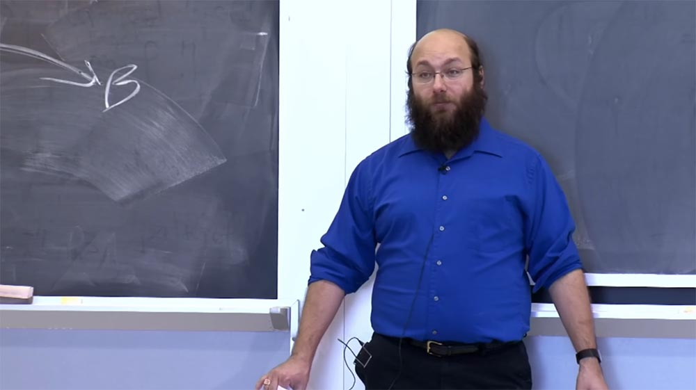
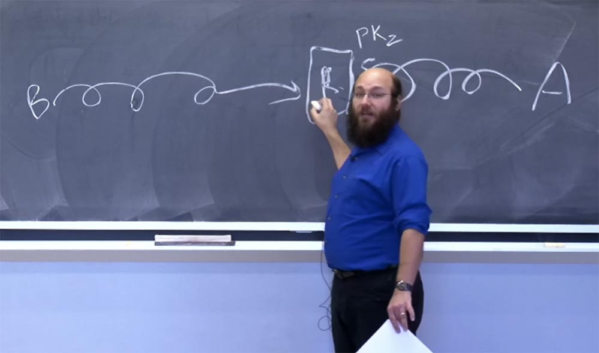
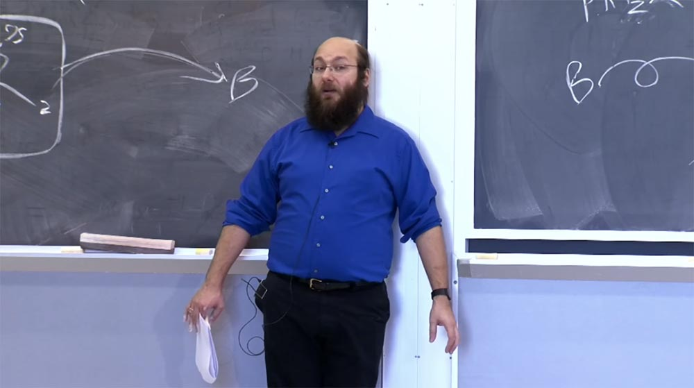
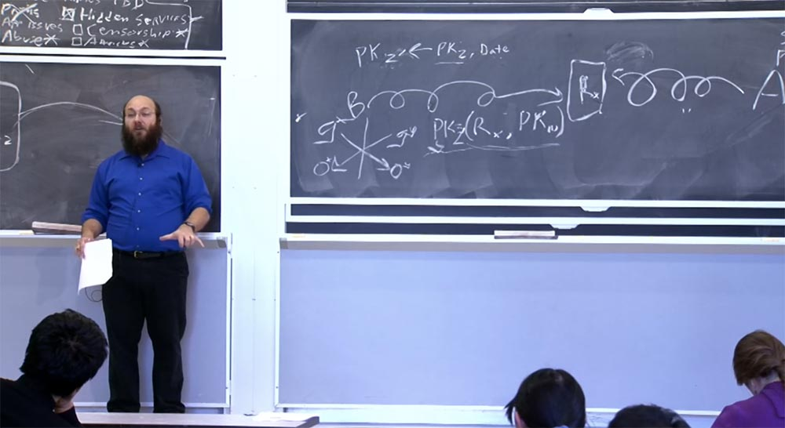
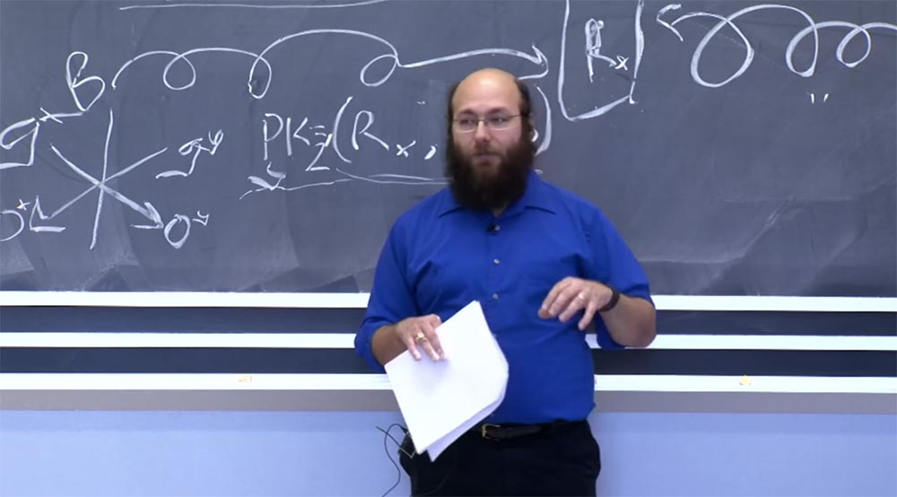

Курс MIT «Безопасность компьютерных систем». Лекция 19: «Анонимные сети», часть 3 (лекция от создателя сети Tor) / Блог компании ua-hosting.company

### Массачусетский Технологический институт. Курс лекций #6.858. «Безопасность компьютерных систем». Николай Зельдович, Джеймс Микенс. 2014 год

Computer Systems Security — это курс о разработке и внедрении защищенных компьютерных систем. Лекции охватывают модели угроз, атаки, которые ставят под угрозу безопасность, и методы обеспечения безопасности на основе последних научных работ. Темы включают в себя безопасность операционной системы (ОС), возможности, управление потоками информации, языковую безопасность, сетевые протоколы, аппаратную защиту и безопасность в веб-приложениях.

Лекция 1: «Вступление: модели угроз» [Часть 1](https://habr.com/company/ua-hosting/blog/354874/) / [Часть 2](https://habr.com/company/ua-hosting/blog/354894/) / [Часть 3](https://habr.com/company/ua-hosting/blog/354896/)  
Лекция 2: «Контроль хакерских атак» [Часть 1](https://habr.com/company/ua-hosting/blog/414505/) / [Часть 2](https://habr.com/company/ua-hosting/blog/416047/) / [Часть 3](https://habr.com/company/ua-hosting/blog/416727/)  
Лекция 3: «Переполнение буфера: эксплойты и защита» [Часть 1](https://habr.com/company/ua-hosting/blog/416839/) / [Часть 2](https://habr.com/company/ua-hosting/blog/418093/) / [Часть 3](https://habr.com/company/ua-hosting/blog/418099/)  
Лекция 4: «Разделение привилегий» [Часть 1](https://habr.com/company/ua-hosting/blog/418195/) / [Часть 2](https://habr.com/company/ua-hosting/blog/418197/) / [Часть 3](https://habr.com/company/ua-hosting/blog/418211/)  
Лекция 5: «Откуда берутся ошибки систем безопасности» [Часть 1](https://habr.com/company/ua-hosting/blog/418213/) / [Часть 2](https://habr.com/company/ua-hosting/blog/418215/)  
Лекция 6: «Возможности» [Часть 1](https://habr.com/company/ua-hosting/blog/418217/) / [Часть 2](https://habr.com/company/ua-hosting/blog/418219/) / [Часть 3](https://habr.com/company/ua-hosting/blog/418221/)  
Лекция 7: «Песочница Native Client» [Часть 1](https://habr.com/company/ua-hosting/blog/418223/) / [Часть 2](https://habr.com/company/ua-hosting/blog/418225/) / [Часть 3](https://habr.com/company/ua-hosting/blog/418227/)  
Лекция 8: «Модель сетевой безопасности» [Часть 1](https://habr.com/company/ua-hosting/blog/418229/) / [Часть 2](https://habr.com/company/ua-hosting/blog/423155/) / [Часть 3](https://habr.com/company/ua-hosting/blog/423423/)  
Лекция 9: «Безопасность Web-приложений» [Часть 1](https://habr.com/company/ua-hosting/blog/424289/) / [Часть 2](https://habr.com/company/ua-hosting/blog/424295/) / [Часть 3](https://habr.com/company/ua-hosting/blog/424297/)  
Лекция 10: «Символьное выполнение» [Часть 1](https://habr.com/company/ua-hosting/blog/425557/) / [Часть 2](https://habr.com/company/ua-hosting/blog/425561/) / [Часть 3](https://habr.com/company/ua-hosting/blog/425559/)  
Лекция 11: «Язык программирования Ur/Web» [Часть 1](https://habr.com/company/ua-hosting/blog/425997/) / [Часть 2](https://habr.com/company/ua-hosting/blog/425999/) / [Часть 3](https://habr.com/company/ua-hosting/blog/426001/)  
Лекция 12: «Сетевая безопасность» [Часть 1](https://habr.com/company/ua-hosting/blog/426325/) / [Часть 2](https://habr.com/company/ua-hosting/blog/427087/) / [Часть 3](https://habr.com/company/ua-hosting/blog/427093/)  
Лекция 13: «Сетевые протоколы» [Часть 1](https://habr.com/company/ua-hosting/blog/427763/) / [Часть 2](https://habr.com/company/ua-hosting/blog/427771/) / [Часть 3](https://habr.com/company/ua-hosting/blog/427779/)  
Лекция 14: «SSL и HTTPS» [Часть 1](https://habr.com/company/ua-hosting/blog/427783/) / [Часть 2](https://habr.com/company/ua-hosting/blog/427785/) / [Часть 3](https://habr.com/company/ua-hosting/blog/427787/)  
Лекция 15: «Медицинское программное обеспечение» [Часть 1](https://habr.com/company/ua-hosting/blog/428652/) / [Часть 2](https://habr.com/company/ua-hosting/blog/428654/) / [Часть 3](https://habr.com/company/ua-hosting/blog/428656/)  
Лекция 16: «Атаки через побочный канал» [Часть 1](https://habr.com/company/ua-hosting/blog/429390/) / [Часть 2](https://habr.com/company/ua-hosting/blog/429392/) / [Часть 3](https://habr.com/company/ua-hosting/blog/429394/)  
Лекция 17: «Аутентификация пользователя» [Часть 1](https://habr.com/company/ua-hosting/blog/429680/) / [Часть 2](https://habr.com/company/ua-hosting/blog/429682/) / [Часть 3](https://habr.com/company/ua-hosting/blog/429686/)  
Лекция 18: «Частный просмотр интернета» [Часть 1](https://habr.com/company/ua-hosting/blog/430204/) / [Часть 2](https://habr.com/company/ua-hosting/blog/430206/) / [Часть 3](https://habr.com/company/ua-hosting/blog/430208/)  
Лекция 19: «Анонимные сети» [Часть 1](https://habr.com/company/ua-hosting/blog/430204/) / [Часть 2](https://habr.com/company/ua-hosting/blog/430206/) / [Часть 3](https://habr.com/company/ua-hosting/blog/430208/)

Предположим, вы используете Байесовскую вероятность, рассуждая таким образом: “суд бы устроили доказательства, что этот парень был пойман из-за плохой OPSEC? Да, устроили. То есть мне нужны отчёты, в которых бы говорилось, что его поймали благодаря не соблюдению информационной безопасности операций в интернете». Таким образом, для «двойной конструкции» мне понадобились бы сообщения, что парень попался на плохой OPSEC, потому что доказательства такого рода вполне доступны при обычном полицейском расследовании, без упоминания информации, полученной от разведки.

Мы не можем сделать выводы об этом деле из каких-либо публичных отчетов, тем не менее, похоже, что этого парня задержали именно благодаря несоблюдению правил OPSEC, то есть тому, что вы бы искали, пытаясь поймать того, кто занимается нелегальными вещами. Так что, как я сказал ранее, не используйте мою сеть для того, чтобы нарушать какие-либо законы. Кроме того, если ваша жизнь или свобода зависит от использования Tor или любого другого продукта безопасности, не используйте эти продукты изолированно.

Думайте о том, чтобы создать несколько рубежей обороны, если ваша жизнь или свобода поставлена на карту, или если крах системы для вас совершенно неприемлем. Это справедливо по отношению и к Tor, и к TLS, и к PGP. Программное обеспечение — это незавершённая работа.  
Это всё, что я хотел сказать о злоупотреблениях в интернете. У меня осталось 25 минут на скрытые сервисы.

Анонимность респондента является гораздо более сложной проблемой, чем анонимность инициатора. Анонимность инициатора – это то, что вы получаете, когда Алиса хочет купить носки, но при этом остаться анонимной для продавца носков.

Анонимность респондента — это когда Алиса хочет опубликовать свои стихи в интернете и запустить веб-сервер со своей поэзией, но не хочет, чтобы кто-то узнал, где находится этот веб-сервер, потому что поэзия — это так неловко. Так что да, на самом деле, существует скрытый сервис с моими плохими стихами. Нет, я не думаю, что кто-то уже опубликовал их. Нет, я не собираюсь никому рассказывать, где он находится. Я просто жду, когда это станет достоянием общественности.

Предположим, что Алиса хочет опубликовать свои стихи. Я помещу её справа, потому что она – респондент. Алиса может проложить путь – эта спиральная линия изображает несколько ретрансляторов – к сети Tor, вот к этому R, и обратиться к нему с просьбой: «пожалуйста, примите эти соединения!». Так что теперь любой, кто подсоединится к этому ретранслятору, может сказать, что хочет поговорить с Алисой. Были проекты, которые работали именно таким образом.

Однако здесь имеются некоторые проблемы. Одна проблема заключается в том, что этим ретранслятором может быть «человек по середине», который перехватывает весь трафик, если здесь не имеется хорошо известного ключа TLS. Второй проблемой может быть то, что данным ретранслятором владеет человек, который также стесняется своих стихов и не хочет быть публичным распространителем поэзии, потому что это так ужасно!

Также на это могут повлиять другие люди, владеющие ретранслятором R, которые так ненавидят поэзию, что захотят подвергнуть это соединение своей цензуре. Наконец, этот ретранслятор R просто может стать целью атаки.

Поэтому вы захотите, чтобы Алиса всё время переключалась между разными ретрансляторами, и ни один из них не смог бы затронуть её незашифрованный трафик. Это вполне выполнимо.  
Но если у нас имеется много разных ретрансляторов, что Алиса должна сказать людям? Здесь должно имеется что-то вроде открытого ключа, потому что если она просто обращается к сети: «ретранслятор Х, ретранслятор Y, ретранслятор Z», это не сработает, потому что сеть меняется каждые 5 минут, и получить правильный, рабочий ретранслятор достаточно сложно.

Допустим, она сообщает всем участникам сети открытый ключ, и когда приходит сюда, к R, то говорит: «это Алиса, я докажу это своим открытым ключом». Таким образом, R знает, что открытый ключ PKz запускает конкретный скрытый сервис – поэзию Алисы. Поэтому, если кто-то еще скажет: «Эй, соедините меня с открытым ключом Z», то сможет совершить рукопожатие с Алисой с помощью общего ключа. И это такое же рукопожатие, которое используется в цепочке Tor.

Теперь Боб сможет читать стихи Алисы, проложив ещё одно соединение через сеть Tor. Зная ключ PKz, Боб сможет сказать ретранслятору: «Эй, соедините меня с Алисой с помощью этого PKz». После того, как ретранслятор совершит совместное рукопожатие, у Боба и Алисы появится общий ключ, который они смогут использовать для шифрования на протяжении всего созданного соединения.

Есть кое — что, что я пропустил, а именно — откуда Боб знает, как сюда попасть? Как этот ретранслятор узнаёт открытый ключ PKz? Мы можем добавить в систему некую систему каталогов, куда Алиса анонимно через Tor загружает подписанное заявление о том, что PKz находится на ретрансляторе X. В таком случае Боб просит систему каталогов предоставить ему это подписанное заявление о PKz, благодаря которому Боб узнаёт, куда ему нужно идти. Мы могли бы сделать даже лучше — пусть Алиса предоставит другой открытый ключ, назовём его PKw, и заявление, которое она загружает в каталог и в котором говорится, что если вы хотите поговорить с сервисом с открытым ключом Z, то вам следует перейти к ретранслятору Rx, используя открытый ключ W.

В таком случае открытый ключ Z не публикуется на ретрансляторе Rx. Вы могли бы пойти дальше и зашифровать выражение (Rx,PKw) каким-то общим секретом, известным Алисе и Бобу. Если вы сделаете это, то служба каталогов и люди, которые могут связаться со службой каталогов, не смогут узнать, как подключиться к Алисе с помощью этого ключа PKz.

**Студент:** если это не зашифровано, то ретранслятор Rx может узнать, что он запускает сервис для Алисы, правильно?

**Ник Мэтьюсон:** нет, не для Алисы. Он только может узнать, что использует ключ PKz, если это выражение не зашифровано. У нас есть решение, как создать такую систему, она еще не построена, но это будет круто.

Допустим, вы не хотите использовать для этого централизованный каталог. В таком случае мы фактически используем DHT, который не идеален и подвержен цензуре, но мы стараемся сделать возможность использования цензуры всё меньше и меньше. Я мог бы рассказать вам об этом подробнее, но боюсь не успеть охватить оставшиеся темы.

Там имеется ещё одна проблема: если вы используете один из этих каталогов сервисов и у вас есть полный список ключей, то вы можете подключиться ко всем тем, кто не зашифровал свои соединения, чтобы узнать, что у них там находится. Это называется enumeration attack, или «атака методом перечисления». Мы не упомянули это в нашей газете не потому, что нас это не заботит, а потому, что мы пока не готовы противостоять подобным атакам.

Я надеюсь, что в 2014 году мы найдём решение, в котором Алиса и Боб делятся ключом PKz, но это выражение (Rx,PKw) не подписывается ключом PKz. Оно подписывается PKz1, который является производным от PKz, и, скажем, даты:

PKz1 → PKz, Date

Если вы знаете PKz и дату, то сможете получить PKz1. Если как Алиса вы знаете секрет SKz, вы можете создавать сообщения, которые подписаны PKz1.

Но если вы видите только PKz1, то даже зная дату, вы не cможете повторно получить PKz. У нас есть доказательства возможности этого решения, и если вы хотите узнать, как это работает, то напишите мне, и я их вам пришлю. Это классный трюк. Мы не первые придумали эту идею. Но это тот способ, каким мы собираемся решить проблему enumeration attack в текущем году, если я действительно найду время для практической реализации этого решения. Вот и всё, что касается скрытых сервисов.

Рассмотрим вопрос атак и защиты. До сих пор самая большая категория атак, которую мы видели, это атаки на уровне приложения. Если вы запускаете приложение через Tor, и оно отправляет незашифрованный трафик, как обычное HTTP-соединение, то враждебный узел точки выхода, как и любой другой узел, пропускающий HTTP соединения, может отслеживать и модифицировать этот трафик. Это атака №1 в нашей системе. Противостоять ей можно, используя зашифрованный трафик.

К счастью, за последние несколько лет шифрование находится на подъеме, и все больше трафика шифруется отличным бесплатным центром сертификации, о котором EFF, Mozilla и Cisco сообщили день или два назад. Надеюсь, что в 2015 году незашифрованного трафика станет еще меньше, чем было в этом году. Так что данный подход решает эту проблему.

Более интересные атаки включают в себя такие вещи, как traffic tagging, или маркировку трафика. Мы сделали ошибку в нашей предыдущей реализации проверки целостности. Наша ранняя реализация проверки целостности заканчивалось проверкой целостности на участке между программой Алисы и узлом точки выхода, но оказалось, что этого недостаточно. Потому что если первый ретранслятор R1 «запутывает» трафик таким способом, что это создаёт шаблон, который может обнаружить узел точки выхода, то для первого и последнего ретранслятора это послужит способом узнать, что они находятся на одном общем пути, в одной цепочке, и идентифицировать Алису.

Конечно, если первый и последний ретранслятор так или иначе сотрудничают, то они в любом случае смогут определить Алису путём сравнения трафика, но мы надеемся, что это для них будет непросто и со временем процесс корреляции трафика станет сложнее, чем мы думаем.  
На самом деле было бы хорошо покончить с атакой этого рода раз и навсегда. Для этого у нас есть два решения. Один из ожидаемых результатов таких атак состоит в периодическом выходе цепочек из строя, потому что атакующий на первом хабе ошибся относительно контроля над последним хабом.

Поэтому каждый клиент Tor проверяет рейтинг странных отказов. Эффективное долгосрочное решение проблемы состоит в том, чтобы сделать так, чтобы «возня» с шаблоном на первом хабе не создавала более 1 бита информации на последнем хабе. Вы не можете избежать отправки 1 бита информации, потому что первый хаб всегда может просто отключить соединение, но вы можете ограничить эту информацию до величины 1 бита. Или лучше до 2 бит, потому что тогда у них будет выбор повредить данные или же отключить соединение. У меня была идея, как лучше это сделать, так что я подумаю над этой проблемой.

Отказ в обслуживании, или DOS, также имеет важное значение. В прошлом году была статья о том, что авторы назвали «снайперской атакой». Вы видите трафик, идущий от узла Tor, который вы не контролируете, и поэтому хотите прогнать всех с этого узла. Для этого вы подключаетесь к этому узлу, переполняете все буферы его памяти, и он «падает». После этого вы перенаправляете интересующий вас трафик на контролируемый вами узел, а если он попадает на неконтролируемый узел, то повторяете этот приём несколько раз до достижения нужного результата.

Наши наилучшие варианты решений направлены на то, чтобы исключить возможность DOS-атаки на память, и наши патчи практически исключили эту возможность. Другой вариант для решения проблем такого рода — убедиться, что ретранслятор обладает большой емкостью памяти. Поэтому не используйте в сети ретрансляторы малой емкости. Этим мы тоже занимаемся — если вы пытаетесь запустить узел Tor на вашем телефоне, он не получит авторизации и не войдёт в список доверенных узлов.

Ещё мы пытаемся разработать алгоритмы планирования цепи, хотя очень трудно пытаться разработать схему сети из узлов, которые вы не контролируете, так что пока это нерешённая проблема.

А теперь скажите, что лучше – рассказать вам об интересных атаках или о важных атаках?

**Студент:** об интересных!

**Ник Мэтьюсон:** хорошо. Тогда пусть поднимут руки те, кто хотел бы написать программу, которая использует криптографию? Отлично, вот чему вы должны научиться! Но никогда не доверяйте реализации своей криптографии. Даже если это правильно, это всё равно неправильно. Очень давно у нас случилась одна из самых худших ошибок безопасности. Мы посчитали, что каждый ретранслятор может быть «человеком посередине» в любой цепочке узлов, потому что предположили, что правильная реализация алгоритма Диффи-Хеллмана будет проверять, не прошёл ли 0 в качестве одного из входов.

Авторы нашей реализации Диффи-Хеллмана предполагали, что надлежащее приложение никогда не будет передавать ноль реализации Диффи-Хеллмана.

Как работает правильный алгоритм Диффи-Хеллмана? Предположим, у меня есть gx, а у вас gy. Я знаю X, вы знаете Y, и мы оба можем вычислить gxy. Но если вместо этого «человек посередине» заменяет моё значение g нулём, то я вычисляю 0x, вы вычисляете 0y, у нас будет одинаковый ключ, и мы спокойно сможем общаться друг с другом, но это будет ключ, который известен злоумышленнику, потому что это 0.

Единица работает, P также работает, P+1 тоже работает. Таким образом, вам просто нужно убедиться, что ваши значения gx и gy находятся в диапазоне от 2 до P-1, если вы реализуете алгоритм Диффи-Хеллмана в виде z sub p.

Я бы хотел больше поговорить о цензуре. Ведь на самом деле это одна из областей, где мы можем сделать больше всего хорошего. В начале мы думали сделать так, чтобы Tor выглядел как веб-клиент, разговаривающий с веб-сервером по HTTPS, и сделать так, чтобы это было трудно блокировать. Оказывается, что это фантастически сложно и, вероятно, это не стоит делать.  
Сейчас мы используем подход, использующий различные плагины, которые позволяют использовать не учтённые ретрансляторы в качестве моста, и пользователь может использовать эту схему для различных преобразований трафика. Нам удаются сделать так, что новые ретрансляторы добавляются в сеть быстрее, чем цензоры реализуют их блокировку.

На самом деле это случай, когда ни одно из решений не является категорически работоспособным. Наверное, я не так сформулировал свою мысль. Правильнее будет сказать, что ни один из этих плагинов по существу не является неблокируемым какими-либо современными технологиями, но они достаточно хороши для того, чтобы сохранять трафик разблокированным в течение 1-2 лет в большинстве стран или 6-7 месяцев в Китае.

Китай в настоящее время имеет наиболее компетентных цензоров в мире, во многом потому, что не использует аутсорсинг. Большинство других стран с агрессивной цензурой интернета передают функции цензоров европейским, американским и азиатским компаниям, в чьих интересах на самом деле не продавать эффективное ПО для цензурирования интернета, а заставлять своих заказчиков постоянно участвовать в гонке его обновления.

Например, вы можете купить свое цензурное программное обеспечение в Соединенных Штатах. Технически говоря, американские компании не имеют права делать цензурные программы для третьих стран, но в США разработали корпоративный брандмауэр, который масштабируется до 10 миллионов пользователей. Я думаю, что это неэтично, но опять же, я не член политических организаций и не философ.

Пол Сайверсон, один из авторов Tor, имеет научную степень по философии, но даже он не может ответить на эти вопросы. Зато он тратит много времени, чтобы на них не отвечать.  
Итак, на чем я остановился? 90 минут — долгий срок. На цензуре! Так вот, Tor не раз обходил цензуру разных разработчиков. Они пытаются блокировать самые последние версии Tor, но при этом делают довольно слабую блокировку. Поэтому, если мы изменим 1 бит где-нибудь в одном идентификаторе узла, то с легкостью обойдём такую блокировку.

Мы не можем доказать, что они специально делают так, чтобы Tor обходил блокировку, то есть продают программы-блокировщики, которые не работают, чтобы потом продавать для них одно обновление за другим. Но нам кажется, что так оно и есть. Так что ещё одна причина не работать на цензурных провайдеров – мало того, что это чрезвычайно неэтично, так они ещё и не предоставляют достаточно хорошее программное обеспечение.

Если вас интересует написание одной из этих подключаемых вещей для транспортировки трафика, то это стало бы отличным студенческим проектом, позволяющим и повеселиться, и узнать немного больше о шифровании и о сети. И пока вы делаете это на языке, гарантирующем безопасный доступ к памяти, вы не сможете сильно испортить вашу программу. Самое худшее, что может произойти в случае написания «слабого» плагина – это то, что цензура заблокирует сеть через месяц, а не через год.

У нас есть ещё темы, про которые я забыл – связанные разработки. Tor — самая популярная система, но не единственная в своем роде. Множество других систем имеют действительно хорошие идеи, и вы должны с ними ознакомиться, если действительно заинтересованы в изучении всех материалов об анонимности в интернете. Библиография freehaven.net/anonbib/ включает в себя научные исследования и публикации в этой области, однако не все исследования в этой области носят академический характер.

Вам стоит также познакомиться I2P, Gnunet, Freedom — «Свободой», которая больше не существует, и это не каламбур, Mixmaster, Mixminion, Sphynx через букву Y, Sphinx через букву I – это что-то другое, DC-net, особенно с работой Брайана Форда и команды Дрезденского технического университета о попытках сделать DC-net более практичным. Это достаточные мощные системы, но не готовые к практическому развертыванию. Почему им уделяется меньше внимания, чем Tor — это открытая тема, вопрос, на который у меня нет твердого ответа.  
Следующая тема — будущая работа. Одна из причин, почему я говорю о будущей работе — не потому, что я хотел бы, чтобы все знали, над каким крутым ПО я работаю, — а потому, что я знаю, что у студентов есть много свободного времени. И я вроде как набираю себе будущий персонал. Вы можете подумать, что я шучу. Но когда я только начинал работать в этой области, я жаловался на то, что занят рецензированием статей для одной конференции, написанием программного обеспечения, исправлением ошибки, ответами на письма. Я жаловался на это старшему преподавателю, а он ответил: «у вас никогда не будет столько свободного времени, как сегодня». Сейчас у вас гораздо больше свободного времени, чем будет через 10 лет, так что это прекрасная пора для работы над сумасшедшими программами.

Итак, позвольте мне рассказать вам о будущей работе в Tor. Как я упоминал, реализация идеи:

PKz1 → PKz, Date

Является ключевой задачей модернизации нашей системы скрытых сервисов, лучшим, что мы смогли придумать в то время. Но с тех пор было проведено много исследований, и возможно, некоторые из них подскажут более эффективные идеи.

Мы также реорганизовали большую часть нашей криптографической системы. В 2003 году мы выбрали алгоритм шифрования с открытым ключом RSA-1024, который на то время казался удачным компромиссом между безопасностью и производительностью. В настоящее время мы заменили RSA-1024 более сильным алгоритмом Ed25519. Но в протоколе шифрования есть ещё несколько вещей, которые хотелось бы заменить, и над этим нам нужно поработать.

Я не слишком много говорил о выборе пути path selection, поэтому я не могу говорить об улучшениях этого процесса. Но наши алгоритмы выбора пути были пересмотрены и в течение последних 5-6 лет были проведены потрясающие исследования того, что нам нужно интегрировать в систему. Немного исследовательской работы было сделано в области смешивания трафика высокой и низкой латентности.

Трафик с низкой задержкой может перекрыть трафик с высокой задержкой с точки зрения обслуживания большого количества пользователей, в то время как трафик с высокой задержкой по-прежнему очень хорошо анонимизирован. Пока неясно, будет ли работать смешение этого трафика так, как нам хочется, и неясно, будет ли кто-то этим пользоваться. Но совершенно ясно, что если что-то не изменится к лучшему или не появится какое-то крупное финансирование для исследований в этой области, я не успею поработать над этим в 2015 году. Но если кто-то еще хочет разрешить эту проблему – добро пожаловать, это было бы весело!

Наши алгоритмы управления загруженностью были выбраны не оправданно на основе того, что мы могли бы взломать вместе за неделю. Мы улучшили их, но они могли бы быть оптимизированы лучшим образом. Есть некоторые исследования масштабирования до сотен тысяч узлов. Существующий дизайн системы позволяет без проблем увеличить сеть до 10 или 20 тысяч узлов. Но поскольку мы предполагаем, что каждый клиент знает о каждом узле, и каждый узел может быть подключен к любому другому узлу, это ограничивает масштабирование 100 тысячами узлов, и мы должны что-то с этим сделать.

Это создаёт возможность атак на основе того, что атакующий выясняет, какие клиенты знают какие узлы, и использует это для атак на отдельных клиентов сети. Поэтому упрощённые подходы к данной проблеме — плохая идея, но можно подойти к решению более серьезно.  
Еще одна вещь, которую можно сделать, увеличив сеть до 100 тысяч узлов – это отказаться от централизованных органов авторизации каталогов и перейти к какой-то одноранговой разработке. У меня нет большой уверенности в одноранговых проектах, о которых я знаю, но возможно, кто-то сможет придумать более продвинутый вариант.

Кто-то задал вопрос о добавлении шаблонов трафика или поддельного трафика, чтобы попытаться обмануть сквозную корреляцию трафика. Это захватывающая область исследований, которая нуждается в тех, кто сможет более ответственно подойти к работе, чем те, кто делал её до сих пор.  
В исследовательской литературе имеется слишком много результатов о разграничении трафика двух пользователей в сети, содержащей один ретранслятор, потому что математически это было легче сделать.

Из-за вещей такого рода, все средства защиты анализа трафика, которые мы знаем в этой области и которые по-прежнему совместимы с широким просмотром, на бумаге выглядят очень хорошо. Вы можете сказать: «ура, это заставит злоумышленника проанализировать в три раза больший объём трафика, чтобы вычислить пользователя!». Но в действительности это означает лишь то, что если раньше злоумышленнику требовалось 2 секунды на сбор трафика, то теперь потребуется 6. Это не достаточная защита, хотя, возможно, в реальной сети она произведёт какой-то положительный эффект.

Таким образом, мы действительно хотели бы увидеть некоторые вещи, позволяющие реализовать шаблонный или поддельный трафик, запутывающий хакера. Но нам не нравится добавлять защиту «Вуду», основанную на предположениях, что она принесёт что-то хорошее, хотя реально мы не можем этого сделать. Нам действительно нравится иметь доказательства того, что любые изменения, которые мы собираемся сделать, чему-то реально помогут.

Кажется, у меня нет больше времени. После нас здесь могут быть занятия? Нет? В таком случае, я ещё немного побуду в этой аудитории. Спасибо, что пришли послушать. Я бы ответил на ваши вопросы, но сейчас уже 12:25, и у людей может быть другая лекция. Но я буду рядом. Дэвид, большое спасибо за то, что ты пришёл!

Полная версия курса доступна [здесь](https://ocw.mit.edu/courses/electrical-engineering-and-computer-science/6-858-computer-systems-security-fall-2014/).

Спасибо, что остаётесь с нами. Вам нравятся наши статьи? Хотите видеть больше интересных материалов? Поддержите нас оформив заказ или порекомендовав знакомым, **30% скидка для пользователей Хабра на уникальный аналог entry-level серверов, который был придуман нами для Вас:** [Вся правда о VPS (KVM) E5-2650 v4 (6 Cores) 10GB DDR4 240GB SSD 1Gbps от $20 или как правильно делить сервер?](https://habr.com/company/ua-hosting/blog/347386/) (доступны варианты с RAID1 и RAID10, до 24 ядер и до 40GB DDR4).

**VPS (KVM) E5-2650 v4 (6 Cores) 10GB DDR4 240GB SSD 1Gbps до января бесплатно** при оплате на срок от полугода, заказать можно [тут](https://ua-hosting.company/vpsnl).

**Dell R730xd в 2 раза дешевле?** Только у нас **[2 х Intel Dodeca-Core Xeon E5-2650v4 128GB DDR4 6x480GB SSD 1Gbps 100 ТВ от $249](https://ua-hosting.company/serversnl) в Нидерландах и США!** Читайте о том [Как построить инфраструктуру корп. класса c применением серверов Dell R730xd Е5-2650 v4 стоимостью 9000 евро за копейки?](https://habr.com/company/ua-hosting/blog/329618/)