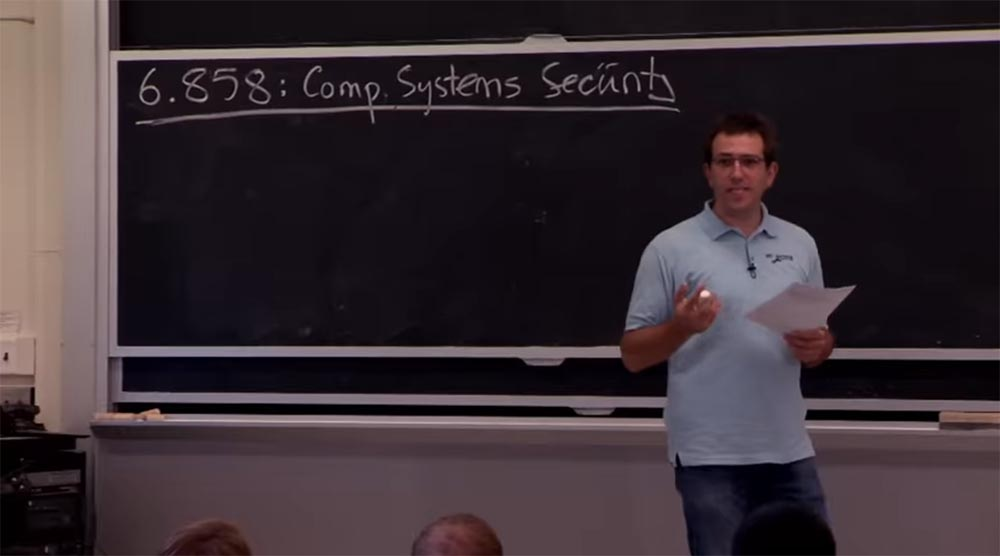
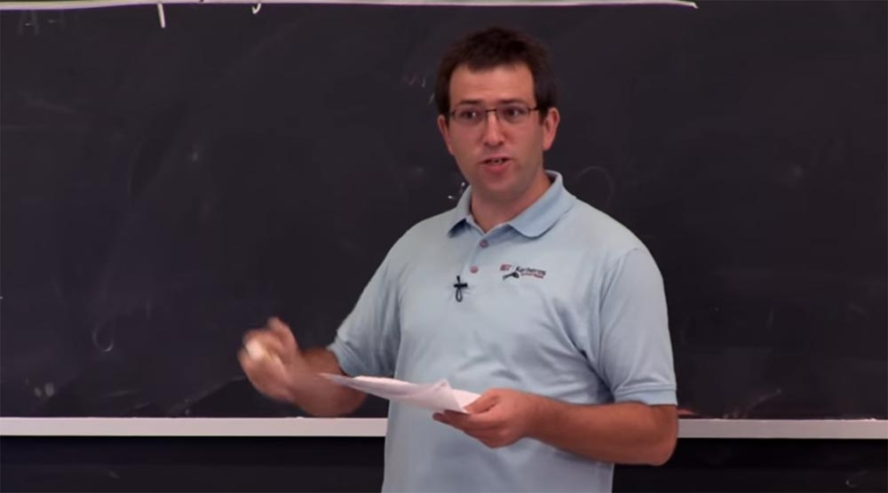
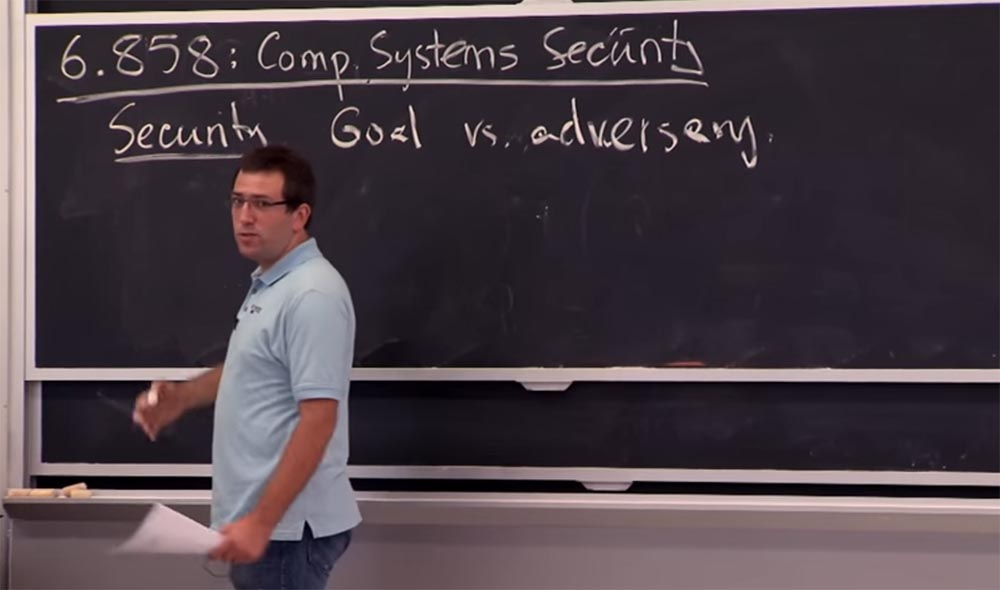
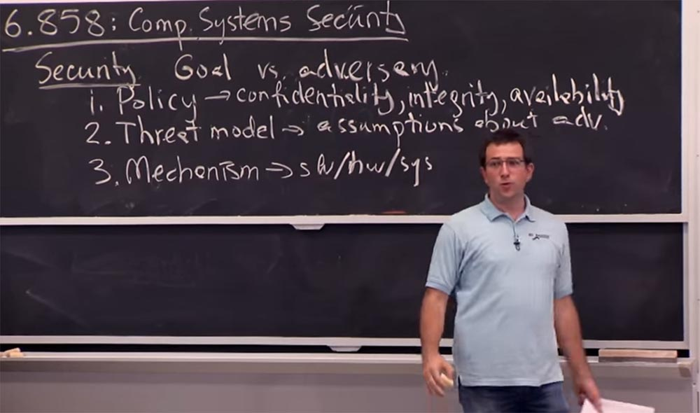
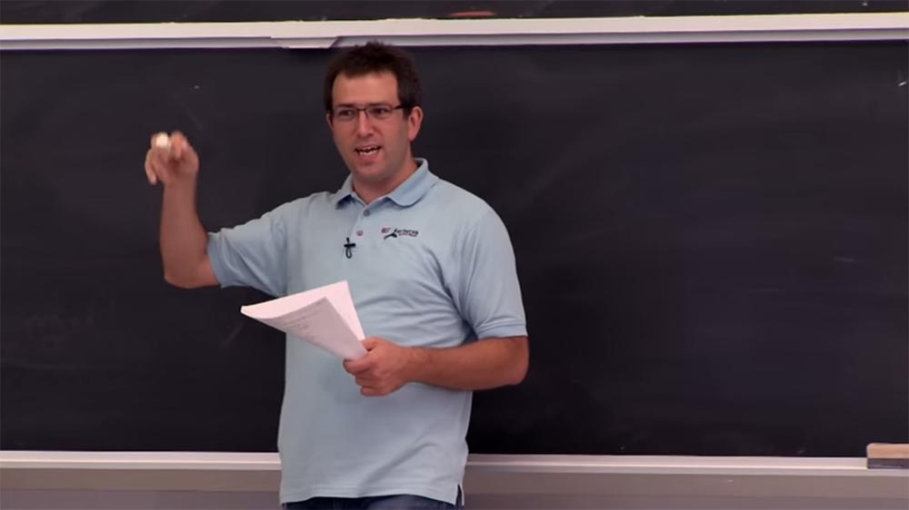
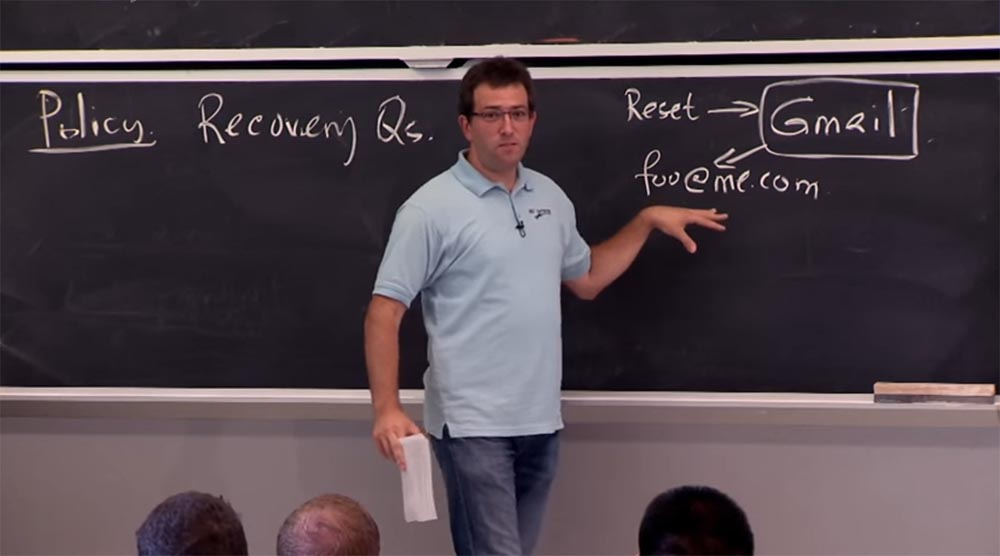
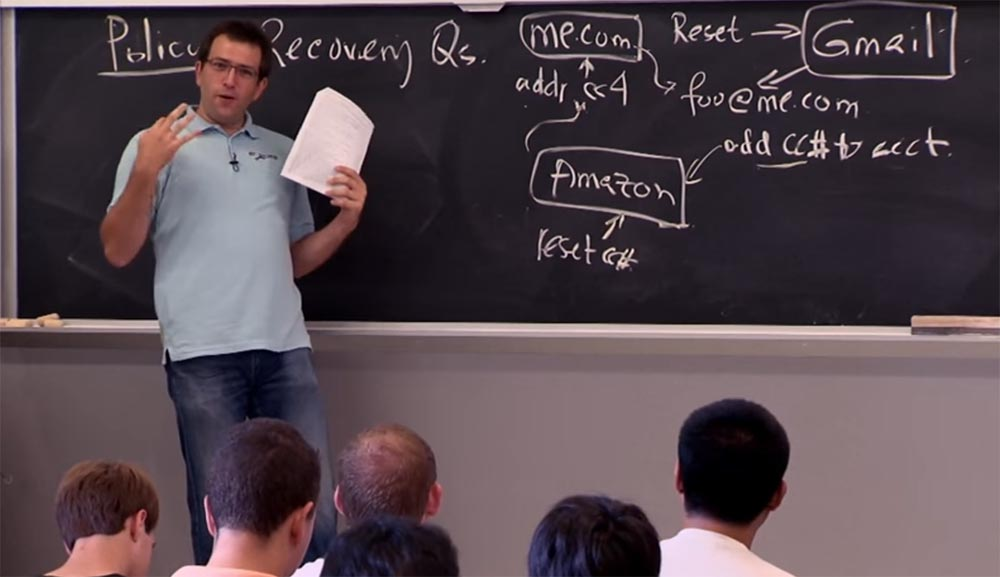

Курс MIT «Безопасность компьютерных систем». Лекция 1: «Вступление: модели угроз», часть 1 / Блог компании ua-hosting.company

### Массачусетский Технологический институт. Курс лекций #6.858. «Безопасность компьютерных систем». Николай Зельдович, Джеймс Микенс. 2014 год

Computer Systems Security — это курс о разработке и внедрении защищенных компьютерных систем. Лекции охватывают модели угроз, атаки, которые ставят под угрозу безопасность, и методы обеспечения безопасности на основе последних научных работ. Темы включают в себя безопасность операционной системы (ОС), возможности, управление потоками информации, языковую безопасность, сетевые протоколы, аппаратную защиту и безопасность в веб-приложениях.

Лекция 1: «Вступление: модели угроз» [Часть 1](https://habr.com/company/ua-hosting/blog/354874/) / [Часть 2](https://habr.com/company/ua-hosting/blog/354894/) / [Часть 3](https://habr.com/company/ua-hosting/blog/354896/)

Николай Зельдович: в этом классе на наших лекциях будет присутствовать содокладчик, приглашённый профессор Джеймс Микенс из Microsoft Research. Позже он расскажет о таких темах, как Интернет-безопасность.

В этом году у нас есть 4 помощника-преподавателя, это Стивен, Уэбб, Хоган и Джеймс. Если вам понадобиться помощь, вы можете обратиться к ним в рабочие часы в течение года.

Тема этих лекций – понять, как создавать безопасные системы, почему компьютерные системы иногда бывают небезопасными и как можно исправить положение, если что-то пошло не так. Не существует никакого учебника на эту тему, поэтому вы должны пользоваться записями этих лекций, которые также выложены на нашем сайте, и вы, ребята, должны их заблаговременно читать. Имеется также ряд вопросов, на которые вы должны будете ответить в письменной форме, а также вы можете прислать свои собственные вопросы до 10-00 часов вечера перед лекционным днём. И когда вы придёте на лекцию, мы обсудим ваши ответы и вопросы и выясним, что собой представляет эта система, какие проблемы решает, когда это работает и когда это не работает, и хороши ли эти способы в других случаях.

Надеюсь, что благодаря такому виду обучения мы получим некоторое понимание того, как мы на самом деле строим системы, которые являются безопасными.

На сайте у нас есть предварительное расписание лекций, оно достаточно гибкое. Если есть другие темы, представляющие для вас интерес, или есть какие-то бумажные заметки, можете присылать их нам на электронную почту, и мы постараемся учесть ваши пожелания. Так что если вы хотите услышать о чём-то больше, чем предусмотрено, просто дайте нам знать.

Точно так же, если у вас когда-нибудь возникнет вопрос или вы заметите какую-то ошибку, просто прерывайте и спрашивайте нас в любое время лекции. Безопасность во многом состоит из деталей, поэтому на них стоит обращать внимание. Я, конечно же, буду совершать ошибки, поэтому вы должны воспользоваться шансом, чтобы об этом сказать. Просто прервите доклад и спросите, так мы выясним, что идёт не так и как это исправить.

Что касается организации лекций, то их большую часть составят лабораторные работы. Первая уже размещена на сайте. Они помогут вам понять различные проблемы компьютерной безопасности и как предотвратить их появление на простом веб-сервере. Поэтому в лабораторной работе №1 вы просто возьмёте веб-сервер, который мы вам предоставим, и попробуете найти способы взломать его, используя уязвимость, связанную с переполнением буфера. Вы завладеете контролем над сайтом, просто отправив на него тщательно проработанные запросы и пакеты.  
В других лабораторных работах вы будете искать способы защиты веб-сервера, искать «баги» в коде, писать «червей», которые запускаются в браузере пользователя, и изучать другие интересные виды интернет проблем.

Многих студентов удивляет, что каждая лабораторная работа (ЛР) использует свой язык программирования. Так, ЛР №1 использует С и Ассемблер, вторая ЛР использует программирование на Python, третья ещё какой-то язык, в пятой появляется JavaScript, и так далее. Это неизбежно, поэтому заранее извиняюсь, что вам придётся изучить все эти языки, если вы до сих пор их не знаете.

В некотором смысле это даже полезно, потому что таков реальный мир. Все системы сложны и состоят из различных частей. В конце концов, это будет полезно для вашего морального самоутверждения. Однако это потребует определённой подготовки, особенно если вы не видели эти языки раньше. Так что чем раньше вы начнёте их изучать, тем лучше.

В частности, ЛР№1 будет основываться на множестве тонкостей языка C и кода Ассемблер, которые мы не преподаём здесь так подробно, как в других учебных курсах. Мы попросим ассистентов преподавателей выделить пару часов на следующей неделе, чтобы провести нечто вроде учебного занятия на тему того, как выглядит программа из двоичных кодов, как их разбирать, как выяснить, что находится в стеке, и так далее.

Ещё одно новшество состоит в том, что мы с этого года делаем видеозаписи наших лекций, которые можно потом просмотреть онлайн. Мы разместим их сразу же, как только получим от видеооператоров. Кроме того, вы можете задавать вопросы онлайн с использованием портала Piazza, как делали это во время изучения других курсов.

Прежде чем мы приступим к изучению вопросов компьютерной безопасности, скажу вам одну вещь. Существуют определённые правила, которые наш институт соблюдает для доступа к сети МТИ, поэтому при проведении исследований безопасности нужно учитывать, что не всё, что вы сможете осуществить технически, является законным. В процессе этого курса вы узнаете, как можно взломать или нарушить работу системы, но это не значит, что вы можете проделывать подобное где угодно. В этой лекции размещена ссылка на правила, в которых всё это подробно описано. В общем, если вы сомневаетесь в законности того или иного шага, лучше спросите лектора или помощника преподавателя. В конце концов, это не головоломка. И не стесняйтесь задавать вопросы

Итак, что же такое безопасность? Начнем с некоторых основных вещей и рассмотрим некоторые общие примеры того, почему бывает трудно обеспечить безопасность что значит попытаться построить безопасную систему. Эти соображения не описаны на бумаге и не являются высокоинтеллектуальными рассуждениями, но всё же прояснят вам предысторию вопроса и дадут пищу для ума на тему того, как следует представлять себе безопасность систем.

В целом безопасность представляет собой пути достижения какой-то цели, возможность противостоять присутствию реального врага. Подумайте о том, что в этом случае всегда существуют «плохие парни», которые хотят убедиться, что у вас ничего не получится. Они хотят украсть ваши файлы. Они хотят удалить содержимое вашего жёсткого диска. Они хотят убедиться, что у вас ничего не работает, ваш телефон не может выйти на связь, и так далее. Так вот, безопасной является такая система, которая действительно может что-то делать независимо от того, что пытается проделать с вами плохой парень.

Круто то, что мы можем потенциально создавать системы, устойчивые к вмешательству плохих парней, атакующих, хакеров – называйте их как угодно. И мы всё ещё способны создавать компьютерные системы, способные выполнять свою работу в таких случаях.

Для облегчения понимания безопасности разобьём её на 3 части. Одна часть представляет собой принципы, которые должна приводить в исполнение ваша система, то есть её предназначение. Назовём её Policy. Собственно, это и есть та цель, которую вы должны достичь, внедряя систему безопасности.

Например, только я должен прочитать вам содержимое этого курса 6.858. Или, может быть, помощники преподавателей, или содокладчики – то есть в этом состоит наше предназначение как «системы». Однако существуют основные требования к тому, что я хочу от своей системы, как я хочу, чтобы она выполняла своё предназначение.

Например, одним из принципов, который вы должны были бы написать, связан с конфиденциальностью данных, то есть необходимо задать права доступа, чтобы материалы лекций были доступны только тем, кто имеет право читать курс 6.858. Далее можно было бы подумать о честности, то есть ввести ограничения, что только преподаватели курса 6.858 могут изменять файл оценок, или то, что только они имеют право предоставить на кафедру итоговый файл оценок.

Затем вам нужно предусмотреть такую вещь, как доступность. Например, сайт должен быть доступен даже в том случае, если плохие парни пытаются «положить» его и организовать какой-то тип DOS–атаки, «отказа в обслуживании» Denial of Service.

Итак, это характеристики системы, которые должны нас заботить. Но поскольку это безопасность, то здесь замешан плохой парень. И нам нужно понять и подумать о том, что он собирается сделать. Именно это мы обычно называем моделью угрозы, Threat model — вторая часть системы безопасности. В основном этот набор предположений о том, чт�� собой представляет плохой парень или противник.

Важно иметь какие-то предположения о нём, потому что он вездесущ и может проникнуть повсюду одновременно, и вы будете вынуждены делать то, что он захочет, а в этом случае трудно достичь даже подобия безопасности.

Например, вы предполагаете, что хакер не знает вашего пароля, или не имеет физического доступа к вашему телефону, к вашим ключам и к вашему ноутбуку. В противном случае не удастся достигнуть в этой игре какого-то прогресса. Получается, что пока на самом деле сложно придумать, как ещё можно защититься, но я считаю, что лучше переоценить угрозу, чем недооценить её, потому что противник всегда может удивить вас с точки зрения осуществления угрозы на практике.

Наконец, для обеспечения безопасности, для достижения нашей цели в рамках сделанных предположений об угрозах, мы должны рассмотреть какой-то механизм. Mechanism – это третья часть системы безопасности. В основном это программное или аппаратное обеспечение или какая-либо часть системного дизайна, реализации и т. д., которая будет пытаться убедиться, что наша система выполняет своё предназначение до тех пор, пока поведение хакера соответствует модели угрозы. Таким образом, конечный результат заключается в том, что пока наша модель угрозы остаётся верной, нашей системе удаётся выполнять своё предназначение. Это понятно?

Однако почему это так тяжело осуществить на практике, если наш план выглядит таким простым? Вы осуществили все 3 принципа, система заработала и вам больше нечего делать. Однако на практике вы могли убедиться, что компьютерные системы всегда взламывают тем или иным способом. И взломы довольно обычное дело. Основная причина, по которой обеспечение безопасности становится проблемой, это выбор неправильной цели (об этом уже говорили в курсе 6.033), значит, мы должны убедиться, что наша политика безопасности действует независимо от того, что предпринимает злоумышленник.

Давайте пойдём от обратного. Если вы хотите построить файловую систему и убедиться, что мои помощники могут получить доступ к файлу оценок, это довольно легко. Я просто спрашиваю его: «Эй, ребята, сходите и посмотрите, можете ли вы получить доступ к оценкам?», и если им это удаётся, то прекрасно, работа сделана, система работает.

Но если мне надо, чтобы никто, кроме моих помощников, не имел доступа к файлу оценок, то осуществление подобного принципа представит собой более серьёзную проблему. Потому что теперь я должен выяснить, что могут проделать все те люди, которые не являются моими ассистентами, для того, чтобы получить файл оценок. Они могут просто попытаться открыть его и прочитать, и возможно, что моя система безопасности должна это запретить.

Но они могут попробовать другие виды атак, например, подбор пароля моего ассистента, или кражу его ноутбука, или взлом его комнаты, кто знает?

Все эти способы взлома должны учитываться нашей моделью угроз. Например, я не беспокоюсь о файле оценок в случае, если из общежития украдут ваш ноутбук. Хотя, возможно, должен бы был и этим озаботиться, трудно сказать. В результате эти игры с безопасностью не настолько ясно представляются, чтобы изначально составить правильные предположения о возможных угрозах. Иногда бывает так, что только после их осуществления вы задумываетесь, что хорошо бы было предусмотреть такой способ взлома заранее.

Поэтому, как следствие, это очень итеративный процесс. И только после того, как вы реализуете каждую итерацию, вы сможете увидеть, где самое слабое звено вашей системы. Может быть, я не правильно составил модель угрозы. Может быть, мой механизм содержал некоторые ошибки, поскольку это программное обеспечение для использования в больших системах, а в них обычно содержится множество «багов».

И вы начинаете править ошибки, менять модель угрозы, переделывать всю систему безопасности, и к счастью, делаете её лучшей.

Одно из опасных пониманий темы этих занятий состоит в том, что вы просто уйдёте с мыслью о том, что всё кругом взломано, ничего не работает, мы должны просто сложить руки и прекратить пользоваться компьютерами. Это одна из возможных интерпретаций проблемы, но она не совсем правильна. Тема этих лекций заключается в том, что мы рассмотрим все эти различные системы, чтобы продвинуться в их понимании.

Мы должны рассмотреть, что произойдёт, если сделать вот так? Оно сломается? А что получится, если попробовать сделать это? К чему оно приведёт? Неизбежно, что каждая система будет иметь свою точку взлома, и мы разберёмся в своих проблемах, когда её обнаружим. Мы поймём, что можем взломать эту систему, если пойдём таким путём, или что система перестанет работать при таком наборе условий.

Каждая система неизбежно будет иметь своё уязвимое место, но это совсем не означает, что все компьютерные системы никчёмны и беззащитны. Это просто означает, что вы должны знать, где и какой дизайн системы нужно использовать. И упражнения по поиску уязвимых точек помогут узнать, в каких случаях данные способы срабатывают, а в каких нет.

В реальности это имеет нечёткие границы, но чем более безопасной вы делаете свою систему, тем меньше вероятность того, что попадёте в историю на первой странице New York Times, рассказывающую о том, как номера социального страхования миллионов людей попали в открытый доступ. И при этом вы платите меньше денег, чтобы защититься от подобной ситуации. Одна из выдающихся черт безопасности заключается в том, что она способна проделать такие вещи, которые вы не могли предусмотреть заранее, потому что механизмы безопасности, предусматривающие возможность защиты от определённых типов угроз, являются чрезвычайно мощными.

Например, браузер раньше был довольно скучной вещью в смысле того, что с ним можно проделать. Вы могли только просматривать в нём веб-страницы или запускать какие-нибудь JavaScript. Но сейчас это довольно крутые механизмы, которые мы изучали несколько недель назад, и которые позволяют вам запускать произвольный код х86 и убеждаться, что он не может сделать ничего «весёлого» с вашим компьютером. Существует интересная технология Native Client от Google, это «песочница», позволяющая безопасно запускать машинный код прямо в браузере, не зависимо от операционной системы.

Прежде, чем запустить какую-то игру на вашей машине, вы должны загрузить её и установить, а для этого необходимо отметить в диалоговом окне, что вы разрешаете ей совершить ряд действий. Но сейчас вы просто можете запустить её в браузере, без всяких дополнительных кликов, и она пойдёт. Причина, по которой это так просто и мощно, состоит в том, что система безопасности запускает программу в изолированной «песочнице», не предлагая пользователю ничего решать относительно безопасности или вредоносности данной игры или любой другой программы, запускаемой на компьютере. В большинстве случаев хороший механизм безопасности позволяет конструировать такие крутые новые системы, которые до этого невозможно было создать.

Поэтому в остальной части нашей лекции я хочу привести вам ряд примеров, когда система безопасности работает неправильно. Эти примеры научат вас, как не надо поступать, чтобы у вас сформировалось лучшее представление о том, как требуется подходить к решению проблем безопасности. В этом случае взлом системы безопасности показывает, что практически каждая из 3-х составляющих её частей была сделана неправильно. На практике люди ошибаются и в функциях системы, и в создании модели угрозы, и в механизме реализации защитных функций.

Давайте начнём с примеров того, как можно испортить системную политику, то есть предназначение системы. Возможно, самый ясный для понимания и простой пример это запрос на восстановление доступа к учётной записи. Как известно, при входе в учётную запись на сайте вы вводите пароль. Но что произойдёт, если вы его потеряете? Некоторые сайты пришлют вам пароль на электронную почту, если вы потеряли свой пароль, со ссылкой на страницу изменения пароля. Так что это достаточно просто, если вы указали резервный почтовый ящик. В этом заключалась система безопасности, предложенная вашим провайдером электронной почты.

Ещё несколько лет назад Yahoo создали свою электронную почту в Интернете, где использовали другой механизм восстановления пароля. Если вы забыли свой пароль от ящика Yahoo, они не могли его вам никуда прислать, потому что вариант использования запасного почтового ящика не предусматривался. Вместо этого для восстановления пароля вы должны были ответить на пару вопросов, ответы на которые могли знать только вы. И если вы забыли пароль от своего ящика, то могли нажать на ссылку, ответить на вопросы и получить свой пароль снова.

Что произошло в этом случае? Изменение политики безопасности, потому что прежде политика состояла в том, что воспользоваться ящиком электронной почты можно было только в случае, если вы знали пароль. Теперь же воспользоваться входом могли не только люди, знающие пароль, но и те, кто знал ответы на вопросы. И это прямым образом ухудшило безопасность системы, чем и воспользовались некоторые люди.

Одним из хорошо известных примеров является случай с Сарой Пэйлин, у которой был ящик на Yahoo. Её секретными вопросами были такие, как: «Где вы посещали школу? Как звали вашего друга? Когда у вас день рождения?» и так далее. Всё это было написано на её странице в Википедии. И в результате этого любой мог зайти в её электронную почту Yahoo, просто прочитав в Википедии, в какую школу она ходила и когда родилась. Так что вам действительно нужно тщательно обдумать последствия различных политик безопасности, прежде чем внедрять их в жизнь.

Более сложным и интересным примером является то, что происходит, когда у вас есть несколько систем, которые начинают взаимодействовать друг с другом. Есть хорошая история о парне по имени Мэт Хонан, возможно, вы её прочитали пару лет назад. Он является редактором журнала wired.com. Так вот, кто-то завладел его почтой на Gmail и сделал много плохих вещей. Нас интересует, как ему это удалось? Это довольно интересно, потому что обе стороны этой истории делали вроде бы разумные вещи, однако это привело к печальным результатам.

Итак, у нас есть Gmail, который позволяет восстановить забытый пароль, как это делают почти все остальные почтовые сервисы. Для того, чтобы изменить пароль от ящика Gmail, вы отправляете им запрос. Однако они не ответят, если запрос поступил от какого-то незнакомца, они пошлют вам ссылку для восстановления пароля на резервный адрес электронной почты или адрес другой электронной почты, который вы указали при регистрации. Полезно то, что они обычно распечатывают для вас адрес электронной почты. Так что если кто-то зайдёт от имени нашего парня и попросит дать ссылку на переустановку пароля, они ответят: «конечно, без проблем, мы вышлем её на ваш запасной ящик foo@me.com, который является службой электронной почты Apple».

Отлично, но у плохого парня нет доступа к ящику на @me.com. Однако он хочет получить эту ссылку, чтобы затем получить доступ к ящику на Gmail. Оказывается, что в случае с почтовым сервисом Apple имеется возможность изменить пароль от ящика @me.com, если указать ваш платежный адрес и последние четыре цифры номера вашей кредитной карты. Нам всё ещё не понятно, как злоумышленнику удалось решить эту задачу. Допустим, он мог узнать домашний адрес Мэта, в своё время тот был довольно известным человеком, но как хакеру удалось завладеть номером кредитной карты Хонана? Продолжим нашу историю.

Оказывается, у этого парня был аккаунт на Amazon.com, который выступал другой частью этой истории. Amazon действительно заинтересован в том, чтобы вы покупали вещи. Поэтому он имеют достаточно хитроумную систему управления аккаунтом. Но так как прежде всего Amazon заинтересован в вас как в покупателе, он не требует регистрации на сайте, если вы собираетесь купить какую-то вещь и оплатить её с помощью кредитной карты.

Так что я могу зайти на Amazon.com и сказать, что я именно этот пользователь и хочу приобрести этот набор зубных щёток. И если я хочу использовать сохранённый в аккаунте номер кредитной карты, я должен войти в этот аккаунт. И если я хочу добавить к этому аккаунту другую карту, «Амазон» предоставляет мне такую возможность. Это выглядит неплохо, не так ли? Я могу оплатить набор щеток, используя один из двух аккаунтов, но это всё равно номера не вашей кредитной карты, а моей. Так что нам всё ещё не понятно, что в этом деле происходит не так.  
Но у Amazon есть и другой интерфейс, ведь это сложные системы, поэтому у него имеется интерфейс для сброса пароля. Для того, чтобы сбросить пароль в Amazon, вам необходимо предоставить номер любой одной из ваших кредитных карт. Что же у меня получается?  
Я могу заказать вещи и добавить номер кредитной карты на свой аккаунт, который на самом деле принадлежит не мне, а затем сказать: «Эй, ребята, я хочу изменить свой пароль, вот вам номер моей кредитной карты!». И это сработало – именно так хакер получил доступ к аккаунту своей жертвы на Amazon.com.

Отлично, но как ему удалось раздобыть номер кредитной карты для смены пароля электронной почты Apple? Amazon в этом смысле очень осторожен. Даже если вам удастся войти в чей-то аккаунт, вы не увидите полного номера кредитной карты. Но вам покажут его последние 4 цифры, просто чтобы вы знали, какой картой пользуетесь в данный момент. Таким образом, вы можете переписать последние 4 цифры номера всех кредитных карт данного аккаунта кроме той, которую сами добавили – её номер вы и так знаете. После этого вы сможете войти в ящик жертвы на @me.com, получить там ссылку на сброс пароля и завладеть ящиком Gmail.

Это достаточно деликатные вещи. Если система изолирована, она делает разумные вещи. Намного трудней рассуждать об уязвимости и слабых сторонах, когда от вас скрыта вся мозаика, и вы вынуждены собирать её вместе по кусочкам. Это довольно сложная штука. Поэтому к созданию каждой из 3-х частей, составляющих систему безопасности, нужно подходить очень внимательно и вдумчиво.

Я думаю, что генеральный план заключается в том, чтобы быть осторожным при выборе своей политики, чтобы не зависеть от влияния других сайтов. Я не уверен, что есть какой-то действительно хороший совет, как поступать в таких случаях. Но теперь вы об этом знаете и можете совершать другие ошибки. Есть множество других примеров неправильно выбранных политик, приводящих к уязвимости системы.

Давайте рассмотрим, как люди создают модели угроз, и что собой представляют примеры, когда модель угроз приводит к неприятностям.

В большинстве своём это связано с человеческим фактором. Мы часто предполагаем, что люди будут поступать по нашим правилам, придумают надёжный пароль, не станут переходить по ссылкам на чужие сайты и вводить пароль там, и так далее. Однако на практике получается не так. Люди будут придумывать плохие пароли, переходить по ссылкам и не будут обращать внимания на ваши предупреждения.

То есть, вероятно, вы не захотите иметь модели угроз, основанные на предположениях, что люди неизбежно будут делать так, чтобы всё пошло неправильно.

Ещё одной чертой моделей угроз является то, что они меняются со временем. Примером может служить проект «Афина» созданный в нашем институте в середине 80-х годов, в результате которого была разработана система «Цербер». Вы узнаете о нём на лекциях через пару недель. Разработчики выяснили, что «Цербер» должен основываться на криптографии. Поэтому требовалось создать такие шифровальные ключи, чтобы люди не могли их разгадать. В то время 56 битные ключи казались вполне подходящего размера для шифра DES (Data Encryption Standard). Для середины 80-х это было нормально.

Вы знаете, что позже эта система стала весьма популярной и MIT использует её до сих пор. И её создатели никогда не возвращались к пересмотру данного предположения. А затем, несколько лет назад группа студентов курса 6.858 выяснила, что «Цербер» достаточно просто взломать. На сегодня очень легко с помощью компьютера подобрать все ключи простым перебором значения 256. В результате эти ребята смогли с помощью аппаратного обеспечения определённого веб-сервиса (у вас будут ссылки на него в лекционном материале) смогли получить ключ от аккаунта «Цербера» за один день. Так что модель, которая была хороша в середине 80-х, на сегодня является не настолько хорошей. Поэтому при разработке модели угроз вы должны быть уверены, что идёте в ногу со временем.

Возможно, более современным примером станет пример, когда вашим противником могут стать правительственные организации, использующие специально разработанное «железо», которому вы не должны доверять. В особенности это касается АНБ – вы наверняка знакомы с «откровениями» на тему того, на что способны эти парни. У них имеются специальные «жучки», которые они могут вставить в ваш компьютер. Ещё каких-то пару лет назад мы об этом не знали, поэтому разумно звучало предположение о том, что ваш ноутбук не может быть уязвим физически, так как невозможно скомпрометировать само «железо».

25:30 мин

Продолжение: [Курс MIT «Безопасность компьютерных систем». Лекция 1: «Вступление: модели угроз», часть 2](https://habr.com/company/ua-hosting/blog/354894/)

Полная версия курса доступна [здесь](https://ocw.mit.edu/courses/electrical-engineering-and-computer-science/6-858-computer-systems-security-fall-2014/).

Спасибо, что остаётесь с нами. Вам нравятся наши статьи? Хотите видеть больше интересных материалов? Поддержите нас оформив заказ или порекомендовав знакомым, **30% скидка для пользователей Хабра на уникальный аналог entry-level серверов, который был придуман нами для Вас:** [Вся правда о VPS (KVM) E5-2650 v4 (6 Cores) 10GB DDR4 240GB SSD 1Gbps от $20 или как правильно делить сервер?](https://habr.com/company/ua-hosting/blog/347386/) (доступны варианты с RAID1 и RAID10, до 24 ядер и до 40GB DDR4).

**Dell R730xd в 2 раза дешевле?** Только у нас **[2 х Intel Dodeca-Core Xeon E5-2650v4 128GB DDR4 6x480GB SSD 1Gbps 100 ТВ от $249](https://ua-hosting.company/serversnl) в Нидерландах и США!** Читайте о том [Как построить инфраструктуру корп. класса c применением серверов Dell R730xd Е5-2650 v4 стоимостью 9000 евро за копейки?](https://habr.com/company/ua-hosting/blog/329618/)