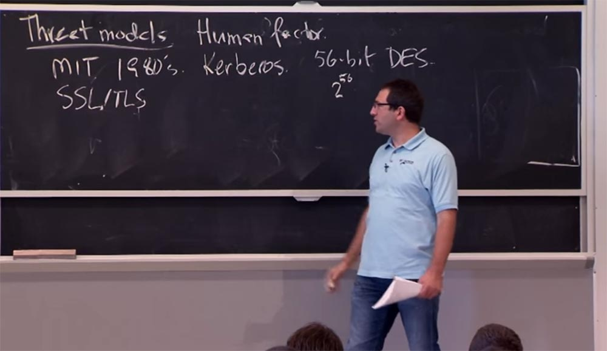
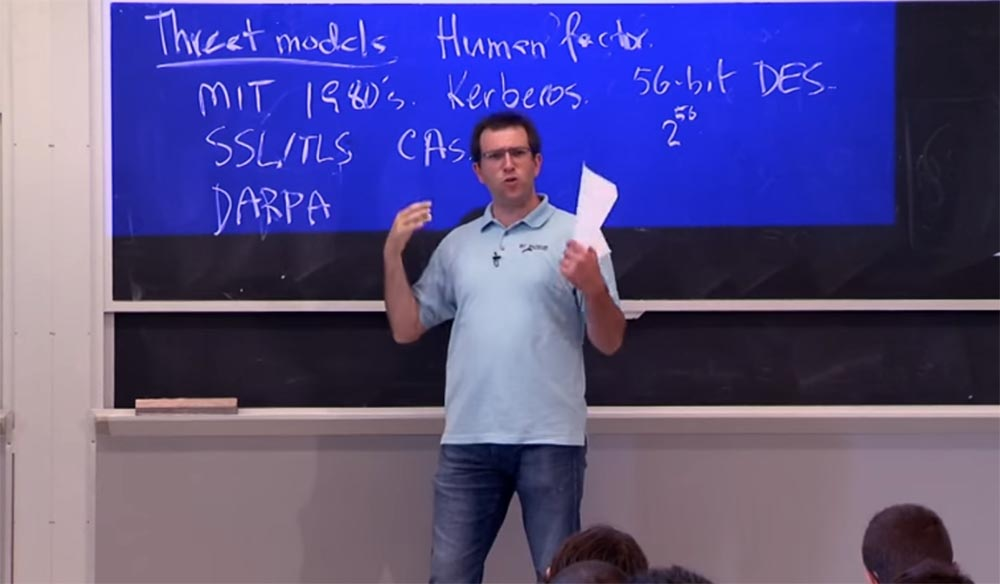
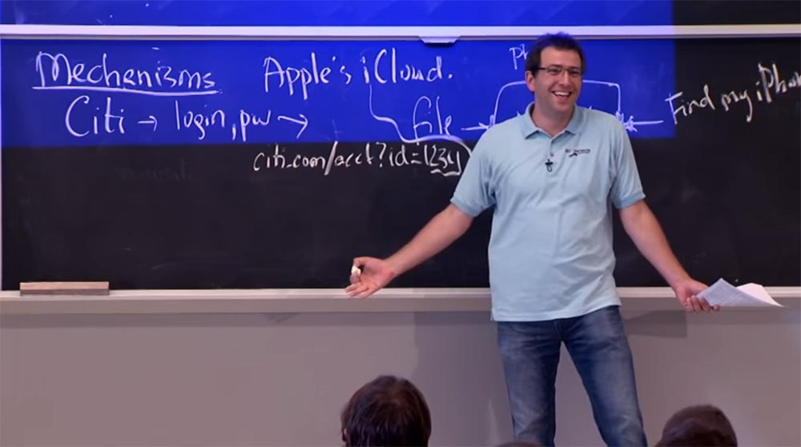
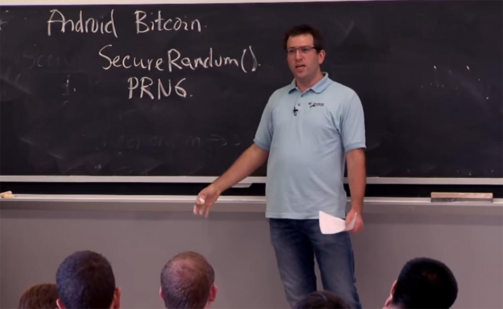
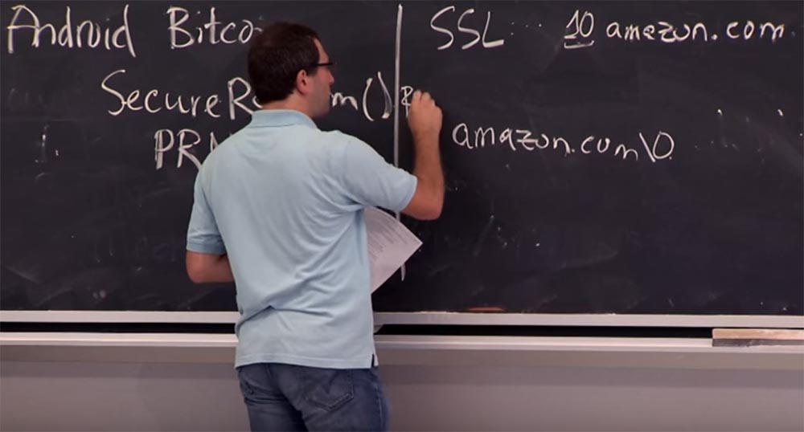
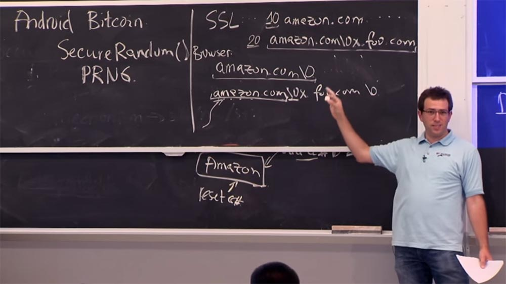
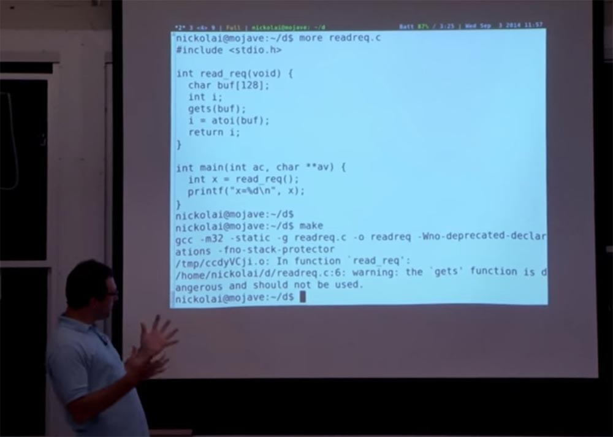
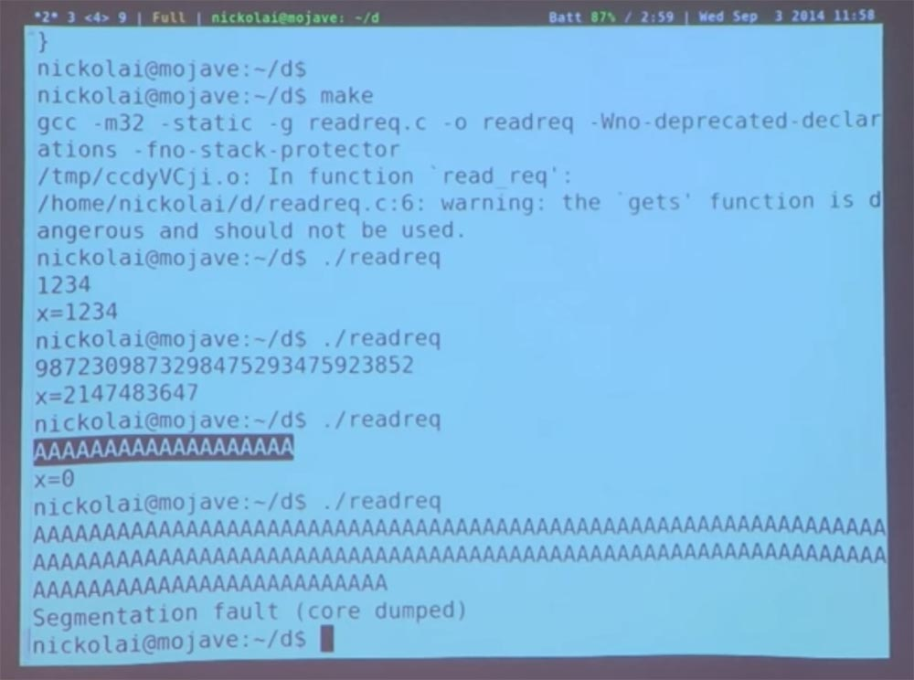

Курс MIT «Безопасность компьютерных систем». Лекция 1: «Вступление: модели угроз», часть 2 / Блог компании ua-hosting.company

### Массачусетский Технологический институт. Курс лекций #6.858. «Безопасность компьютерных систем». Николай Зельдович, Джеймс Микенс. 2014 год

Computer Systems Security — это курс о разработке и внедрении защищенных компьютерных систем. Лекции охватывают модели угроз, атаки, которые ставят под угрозу безопасность, и методы обеспечения безопасности на основе последних научных работ. Темы включают в себя безопасность операционной системы (ОС), возможности, управление потоками информации, языковую безопасность, сетевые протоколы, аппаратную защиту и безопасность в веб-приложениях.

Лекция 1: «Вступление: модели угроз» [Часть 1](https://habr.com/company/ua-hosting/blog/354874/) / [Часть 2](https://habr.com/company/ua-hosting/blog/354894/) / [Часть 3](https://habr.com/company/ua-hosting/blog/354896/)

Если вы думаете, что правительство преследует вас, проблемы безопасности будут гораздо серьёзнее, потому что ваш компьютер может содержать в себе вредоносное физическое устройство независимо от того, какие программы на нём установлены. Поэтому вам следует тщательно подходить к созданию модели угрозы, сбалансировав её наилучшим образом против конкретного противника. Я думаю, что противостояние АНБ обойдётся вам слишком дорого, но если вы пытаетесь защитить свой домашний каталог «Афина» от других студентов, можно особо не беспокоиться. Так что создание оптимальной модели угроз выглядит как балансировка между различными требованиями безопасности.

Другой пример плохой модели угрозы представляет собой способ обеспечение Интернет-безопасности проверкой сертификатов тех сайтов, на которые вы заходите.

В этих SSL/TLS протоколах, когда вы подсоединяетесь к сайту, в адресной строке показывается значение HTTPS, то есть «защищённое соединение». Имеется в виду, что данный сайт получил сертификат безопасности, подписанный одним из центров сертификации, и который подтверждает, что да, этот ключ принадлежит действительно Amazon.com.

С точки зрения архитектуры, ошибка модели угрозы заключается в том, что она предполагает, что все эти центры авторизации СА заслуживают доверия, и они никогда не совершат ошибку. Но на самом деле, существуют сотни СА: у Индийского почтового управления есть свой центр авторизации, и у китайского правительства он есть, и так далее. И любой из этих центров может сделать сертификат безопасности для любого хоста или домена. В результате, если вы плохой парень и хотите дискредитировать Gmail или взломать их сайт, вам нужно просто скомпрометировать один из этих центров авторизации. И для этого всегда можно найти СА в не слишком развитой стране. Таким образом, создавать модель угрозы на основе предположения, что все сертифицированные сайты безопасны, неправильно. Потому что неправильно предположение о том, что безопасны все 300 центров авторизации, разбросанные по всему земному шару.

Однако, не смотря на это, современный протокол SSL до сих пор использует такое предположение в основе своего механизма безопасности для обозревателей Интернета.

Существует множество примеров такого рода, когда угроза приходит оттуда, откуда её не ждали. Забавным примером из 80-х годов может служить проект, осуществляемый DARPA — Управлением перспективных исследовательских проектов Министерства обороны США. Тогда им очень хотелось создать неуязвимые операционные системы, и они привлекли к этому кучу университетов и исследователей, которые должны были разработать прототипы безопасных ОС.

После этого они создали команду «плохих парней», которые должны были любым способом взломать эти безопасные системы. В результате оказалось, что сервер, на котором хранились исходные коды всех ОС, находился на компьютере в совершенно незащищённом офисе. «Плохие ребята» без труда взломали этот сервер, изменили исходный код и создали на его основе лазейку в ОС. Затем, когда исследователи построили свои операционные системы, эти фальшивые хакеры воспользовались лазейкой и взломали их без особого труда.

Поэтому вам действительно нужно подумать обо всех возможных предположениях, касающихся того, откуда приходит ваше программное обеспечение, и того, как плохой парень может в него проникнуть, чтобы убедиться, что ваша система действительно безопасна. В конспектах лекций есть много примеров на эту тему.

Вероятно, самая распространённая проблема встречается в механизмах безопасности. Отчасти это потому, что механизм осуществления безопасности – самая сложная её часть. Это совокупность программного и аппаратного обеспечения и других компонентов системы, которые осуществляют вашу политику безопасности. И причины, по которым этот механизм может сломаться, неисчислимы.

Так что большая часть наших лекций будет посвящена именно механизмам безопасности, тому, как создавать механизмы, обеспечивающие правильное применение политик безопасности. Также мы поговорим о политике безопасности и моделях угроз.

Выясняется, что намного проще создавать ясные и чёткие принципы разработки механизмов, понимать, как они работают или не работают, чем заниматься политиками и моделями угроз, которые вам необходимо «вписать» в содержимое конкретных систем.

Рассмотрим некоторые примеры ошибок при создании механизмов безопасности. О последнем случае вы могли услышать пару дней назад – он касается проблем с механизмом безопасности облачного сервиса iCloud от Apple. Любой, у кого есть iPhone, может пользоваться сервисом iCloud. Этот сервис представляет собой облачное хранилище файлов, и если вы потеряете свой «айфон», то ваши файлы всё равно сохранятся в этом облаке, он поможет вам найти свой телефон, если вы его потеряли, и содержит в себе ещё множество полезных функций. Я думаю, что этот iCloud «родственник» сервиса me.com, который был создан по такой же схеме несколько лет назад.  
Проблема, которая была обнаружена в iCloud, заключалась в том, что создатели не использовали одинаковый механизм безопасности для всех интерфейсов. Рассмотрим, как выглядит этот сервис.

К сервису iCloud подключены различные службы, такие как «Хранилище файлов», «Фотоархив», «Поиск телефона» и так далее. Все эти службы проверяют, являетесь ли вы правильным пользователем, прошли ли вы правильную аутентификацию. Вероятно, к разработке этого сложного сервиса были привлечены разные исполнители, которые создавали разные интерфейсы безопасности для входящих в него служб. Например, в службе «Find My iPhone» не отслеживалось, сколько раз подряд вы пытались авторизоваться в системе. Эта функция очень важна, так как ранее я уже упоминал, что люди не утруждают себя созданием действительно сильного пароля.  
На самом деле система, которая производит аутентификацию пользователей с помощью паролей, довольно «хитрая», мы поговорим об этом позже. Но существует одна хорошая стратегия, заключающаяся в том, что из миллиона подобранных паролей найдется один, который точно подойдёт к чему-то аккаунту. Так что если вы сможете создать миллион вариантов пароля для данного аккаунта, вероятно, вы сможете в него зайти, потому что люди не утруждают себя созданием сложных паролей.

Поэтому одним из способов защиты от подбора пароля является то, что система не позволяет вам предпринимать неограниченное количество попыток входа в аккаунт несколько раз подряд. Возможно, что после 3-х или 10 неудачных попыток система активирует тайм-аут и предложит вам попытаться ввести пароль снова через 10 минут, а то и через час. Это действительно тормозит хакера, так как он может предпринять за день всего несколько попыток подбора пароля вместо миллиона. И даже если у вас не слишком трудный пароль, злоумышленнику будет трудно его подобрать из-за больших потерь времени.

Но в интерфейсе «Find My iPhone» такая функция не предусмотрена. «Плохой парень» может отправить за день миллион пакетов с паролем, взломать эту службу и украсть конфиденциальные данные пользователя iCloud, что и имело место.

Это пример того, что у вас была правильная политика безопасности – только правильный пользователь и правильный пароль может дать доступ к файлам. У вас даже была правильная модель угрозы безопасности, что плохие парни будут пытаться угадать пароль, поэтому нужно этому промешать, ограничив количество попыток ввода. Однако разработчик сервиса просто облажался, потому что его механизм безопасности содержал ошибку. Он просто забыл применить правильную политику и правильный механизм в одном интерфейсе.

И такое появляется снова и снова в самых разных системах, где просто один раз ошиблись, и это отразилось на безопасности всей системы. Существует много ошибок такого рода, например, когда разработчик забыл проверить контроль доступа в целом.

Например, у City Bank есть сайт, который позволяет вам просмотреть информацию вашей кредитной карты. То есть если у вас есть карта этого банка, вы заходите на сайт и он говорит вам:

«да, у вас есть эта кредитная карта, вот ваши операции» и так далее. Несколько лет назад рабочая процедура заключалась в том, что вы заходите на какой-то сайт, вводите свой логин и пароль и вас перенаправляют на сайт, который, скажем, имеет адрес, например: citi.com/account?id=1234. Оказывается, какой-то парень догадался, что если вы просто поменяете эти цифры, то свободно зайдёте в чужой аккаунт. Вот и непонятно, что думать о разработчиках подобной системы?

Возможно, эти парни думали правильно, но забыли проверить, как работает их функция безопасности на странице аккаунта, то есть что не только у меня может быть правильный ID номер, но он также может быть ID номером того парня, который только что авторизовался. Это важная проверка, но они про неё забыли.

Или, может быть, разработчики думали, что никто не сможет воспользоваться этим URL, кроме вас? Может, у них просто была плохая модель угрозы? Может они подумали, что если они не напечатали этот адрес в виде ссылки, то никто не сможет по нему «кликнуть»? Это пример плохой модели угрозы. Может быть и так, в любом случае трудно сказать, чем они руководствовались, выпустив такой продукт. Такие ошибки часто случаются, причём даже маленький, незаметный промах в механизме безопасности способен привести к печальным последствиям.

Ещё один пример, которых не так много в ошибках проверки идентификации, представлен проблемой, выявленной у смартфонов Android несколько месяцев назад. Эта проблема была связана с биткоинами, я уверен, что вы слышали о них – это электронная валюта, довольно популярная в наши дни. Способ, благодаря которому работает система Bitcoin, достаточно продвинутый – это то, что ваш баланс связан с использованием персонального ключа. Поэтому, если у вас есть чей-то персональный ключ, вы можете потратить его биткойны. Безопасность Bitcoin основывается на предположении, что никто не знает вашего ключа. Это как с паролем, только ещё важней, так как люди могут предпринять множество попыток разгадать ваш ключ. При этом нет никакого реального сервера для проверки ключей. Это просто шифрование. Поэтому любой компьютер может попробовать расшифровать ключ, и если это получится, они смогут перевести ваши биткоины кому-то другому. Поэтому чрезвычайно важно генерировать надёжные, сложные ключи, которые никто не сможет разгадать.

Есть люди, которые пользуются своими биткоинами со смартфона под управлением Android. Существует мобильное приложение на API Java под названием SecureRandom, которое генерирует случайные значения ключей для Bitcoin. Однако люди выяснили, что в действительности это совсем не случайные числа. Это приложение содержит генератор псевдослучайных чисел, или PRNG. SecureRandom задаёт ему начальный массив из нескольких сотен случайных битов, которые PRNG может «растянуть» на столько случайных битов, сколько захотите. То есть сначала вы используете исходный массив, некий «посевной материал», а затем генерируете из него любое желаемое количество битов, то есть взращиваете свой урожай ключей.

Благодаря различным криптографическим принципам, не буду в них углубляться, это действительно работает. Если вы изначально предоставите этому PRNG несколько сотен действительно случайных битов, будет чрезвычайно сложно угадать, какие псевдослучайные числа он сгенерирует. Но проблема заключается в том, что в этой библиотеке Java была небольшая ошибка. При определённых обстоятельствах она забывала снабдить PRNG исходными значениями, и массив состоял из одних нулей. Это означало, что любой мог узнать, какие случайные числа PRNG сгенерировал для ваших ключей. Если они начинаются с нулей, значит, они генерируют одинаковые значения, и взломщик с легкостью получает такой же персональный ключ, как у вас. То есть он просто генерирует ваш ключ и распоряжается вашими биткоинами.  
Это ещё один пример того, как вроде бы небольшая ошибка механизма безопасности может привести к катастрофическим результатам. Многие люди из-за этого потеряли свои биткоины. Конечно, такие ошибки на каком-то уровне исправляются, можно изменить имплементацию Java в приложении SecureRandom так, чтобы оно всегда заполняло PRNG случайным массивом исходных битов. Но в любом случае, это служит ещё одним примером ошибочной работы механизма безопасности.

Вопрос из аудитории:

— Объясните, отличается ли это от атаки на алгоритм создания цифровой подписи DSA?

Ответ:

— В действительности проблема намного сложнее, чем то, на что вы намекаете. Проблема в том, что даже если вы не сгенерировали свой ключ сначала на Android устройстве, конкретная схема подписи Bitcoin предполагает, что каждый раз, когда вы генерируете новую подпись с помощью этого ключа, вы используете одноразовый свежий, или как его ещё называют, «nonce» исходник для такой генерации. И если вы когда-нибудь сгенерируете две подписи на основе одного одноразового исходника, кто-то сможет повторить ваш ключ.

Эти случаи похожи, но различаются деталями. Если вы сможете сгенерировать ключ где-то ещё, кроме Android, и это будет действительно надёжный ключ, то каждый раз, когда вы попытаетесь сгенерировать 2 подписи из одного и того же nonce или случайного значения, кто-то сможет путём сложных математических вычислений просчитать ваши подписи и извлечь из них ваш открытый ключ. Или, что ещё важнее, персональный ключ.

Я хочу ещё раз отметить, что любая деталь в компьютерной безопасности имеет важное значение. Если вы совершите кажущуюся несущественной ошибку, например, забудете что-то проверить, или забудете инициализировать случайный массив исходных данных, это может иметь серьёзные последствия для всей системы.

У вас должно быть чёткое представление того, каковы особенности, характеристики вашей системы, что она должна делать и какие неожиданности скрываются за углом. В этом смысле хорошо подумать о том, как можно взломать вашу систему, прощупать её со всех сторон, например, что произойдёт, если я предоставлю слишком свободный доступ, или какой самый «несвободный» из всех свободных доступов я могу оставить? Какого рода данные я должен поместить в свою систему, чтобы заткнуть всевозможные бреши?

Одним из хороших примеров такой двусмысленности являются SSL сертификаты, которые зашифровывают имена в сам сертификат. Это проблема отличается от проблемы, связанной с доверием к СА. SSL-сертификаты – это просто последовательность байтов, которые вам посылает веб-сервер. Внутри этого сертификата находится имя ресурса, к которому вы подсоединяетесь, например, Amazon.com. Вы знаете, что вы не можете просто записать эти байты. Вам надо как-то зашифровать их и указать, что это Amazon.com, и разместить их в конце строки.

Так вот, в SSL сертификатах используется определённая схема шифрования, которая записывает Amazon.com, сначала записав количество байтов в строке.

Отлично, сначала их нужно записать. Пусть у меня будет 10 байтовая строка под названием Amazon.com, оно действительно состоит из 10 байтов. Замечательно. У нас имеется 10 байт, которые представляют собой буквы названия и точку, а за и перед этими 10 байтами в строке могут располагаться ещё какие-то знаки.

Затем браузер, который написан на языке С, берёт эти байты в обработку. Этот язык представляет строки с 0, означающим конец строки. Таким образом, в С нет счётчика длины строки. Вместо этого он учитывает все байты, и конец строки для него – это просто нулевой байт. В конце строки С пишет его обратным слэшем – «\\», то есть это выглядит как amazon.com\\0.

Всё это находится в памяти вашего браузера. Где-то в его памяти теперь имеется строка из 11 байт с нулём в конце. И когда браузер интерпретирует эту строку, он продолжает по ней идти, пока не увидит в конце строки нулевой маркер.

Вопрос из аудитории:

— У нас имеется 0 в середине строки?

Ответ:

— Да, это так. И в этом смысле существует некий разрыв в понимании того, как браузер интерпретирует строки.

Предположим, что я владею доменом foo.com. Я могу получить сертификат на «что-угодно- foo.com». Таким образом, я могу попросить сертификат и на имя amazon.com\\0x.foo.com. С точки зрения браузера это совершенно правильная строка. Это 20 байтовое имя, состоящее из 20 байтов.

Раньше было так, что вы могли обратиться в центр авторизации СА и сказать: «Эй, я владею foo.com, дайте мне сертификат на эту штуку!». И они были бы совершенно готовы сделать это, потому что amazon.com0x — это поддомен foo.com, и он полностью твой.

Но потом, когда браузер берет эту строку и загружает ее в память, он делает, то же самое, что я описал раньше — он копирует строку. amazon.com0x.foo.com и послушно добавит в завершение этой строки ещё один ноль — amazon.com\\0x.foo.com\\0.

Но затем, когда остальное программное обеспечение браузера начнёт интерпретировать строку в этом месте памяти, оно начнёт её читать и, увидев 0 в середине строки, скажет: «отлично, это же конец строки!» и обнулит всё, что следует в адресе после него. Так что в результате мы получим сайт Amazon.com.

Это служит примером того, как несогласованность между интерпретационной способностью языка С и способом шифрования SSL сертификатов вызвало проблему безопасности. Это было обнаружено несколько лет назад парнем по имени Мокси Марлинспайк (Moxie Marlinspike), и это довольно разумное замечание.

Такие виды ошибок шифрования весьма распространены в программном обеспечении, за исключением случаев, когда вы очень тщательно подойдёте к кодировке, используя различные способы шифрования. И всякий раз, когда возникает подобная несогласованность, ею может воспользоваться «плохой парень». Одна система считает, что это удачное имя, другая считает, что это не так. И это является хорошим способом, чтобы подтолкнуть систему к неполадкам в работе.

Последний пример отказа механизма безопасности, о котором я расскажу сегодня, это переполнение буфера. Некоторые из вас знакомы с этой проблемой по материалам курса 6.033. Остальным напомню, что представляет собой переполнение буфера. Кстати, это тема первой лабораторной работы, так что отнеситесь к этому серьёзно, потому что вашим заданием будет воспользоваться такой уязвимостью и испробовать этот вид атаки на реальном веб-сервере.

Итак, наша система представляет собой компьютер, на котором развёрнут веб-сервер. Веб-сервер – это программа, которая будет воспринимать подключения из внешнего мира, принимать запросы, которые в основном представляют собой пакеты данных, обрабатывать их, и, вероятно, совершать какие-то проверочные действия. Если это неправильный URL или если кто-то пытается получить доступ к файлам, и он не авторизован для такого доступа, веб-сервер в качестве ответного действия выдаст сообщение об ошибке. В противном случае он предоставит доступ к файлам, возможно, расположенным на жёстком диске, и отправит их пользователю в виде какой-то формы ответа.

Это наиболее распространённая схема серверов, которую вы наверняка знаете. В чём заключается её политика и каковы модели угроз?

На самом деле довольно трудно определить политику и модели угроз, используемых во многих реальных системах. Это, в свою очередь, приводит к проблемам безопасности. В глобальном смысле политика работы веб-сервера заключается в выполнении того, что задумал программист. Это немного расплывчато, но в реальности веб-сервер должен делать именно то, что делает код, и если в этом коде имеется ошибка, её нужно отыскать.

Итак, в связи с тем, что нам трудно чётко сформулировать политику веб-сервера, будем считать, что он должен делать именно то, что хотел от него программист. Модель угрозы состоит в том, что злоумышленник не имеет доступа к компьютеру, не может воспользоваться им ни удалённо, ни физически, но может отправить на него любой пакет данных, какой захочет. То есть работа сервера не ограничена определёнными видами пакетов. Честная игра заключается в том, что вы можете сформировать и отправить на сервер любой пакет. Имейте ввиду, что на практике это весьма разумная модель угроз.

И я предполагаю, что цель состоит в том, чтобы этот веб-сервер не позволял, чтобы какие-либо условные процессы происходили неправильно. Я думаю, это согласуется с тем, что хотел от него программист. Вероятно, что программист не предусмотрел вариант, чтобы какой-то запрос давал доступ к чему-либо на этом сервере.

Но вы знаете, что при написании программного обеспечения, которое является основным механизмом работы для веб-сервера, возможны ошибки. Программное обеспечение сервера – это вещь, которая принимает запросы, рассматривает их, убеждается, что они не собираются совершить ничего плохого, и если всё в порядке, посылает обратно ответ. В этом заключается механизм веб-сервера, который обеспечивает вашу политику.

В результате, если программное обеспечение сервера даёт сбой, вы оказываетесь в беде. Как вы знаете, одна из самых распространённых ошибок при написании ПО на языке С (а многие программы написаны на этом языке, и, вероятно будут ещё на нём писаться), заключается в том, что вы можете неправильно управлять распределением памяти. Как мы видели в примере с SSL-сертификатами, даже один байт может вызвать значительные изменения в условиях происходящего. Для примера мы рассмотрим небольшой упрощённый отрывок программного кода.  
На этом слайде изображён такой отрывок, представляющий собой чтение запроса.

Здесь вы видите, как выглядит запрос, поступающий на сервер из сети. Но в нашей лекции воображаемый сервер будет просто читать то, что я набираю на клавиатуре своего ноутбука. И он собирается хранить это в буфере, а затем он будет разбирать это целочисленное значение и возвращать это целочисленное значение. Реальный сервер работает далеко не так, но мы используем данный пример для демонстрации того, как происходит переполнение буфера и что при этом бывает не так. Давайте посмотрим, что произойдёт, если я запущу эту программу. Я могу её здесь скомпилировать.

Вы видите, появилось сообщение: «Функция опасна и не может быть использована». И на самом деле, она показывает мне, что я где-то облажался. Через секунду мы увидим, почему компилятор нацелен на то, чтобы сказать мне подобное, и это на самом деле так. Но пока что предположим, что нас всё устраивает, и я разработчик, готовый проигнорировать данное предупреждение.

Я запускаю функцию перенаправления, предоставляю некие входные данные, и это работает. Я ввожу 1234 и получаю х = 1234, я ввожу действительно большой набор из 28 случайных чисел и получаю ответ (х = 2147483647) из 10 чисел. Как видите, это всё ещё не катастрофа.

Теперь я набираю 19 символов А и получаю х = 0. Система устроена так, что при вводе буквенных символов она выдаёт в ответ нулевое значение. Это не так уж и плохо. Но что произойдёт, если я введу огромное количество данных, типа этой серии букв А, растянувшейся на 3 строки? Система аварийно завершит работу!

Мы не очень-то этому удивлены. То есть если вы посылаете на сервер «плохой», некорректный запрос, он ничего не может послать вам в ответ. Но давайте попробуем заглянуть вовнутрь и увидеть, что происходит, и попытаемся выяснить, как можно получить пользу от этой аварийной ситуации, или, возможно, сделать что-то более интересное, то, в чём может быть заинтересован хакер.

Продолжение: [Курс MIT «Безопасность компьютерных систем». Лекция 1: «Вступление: модели угроз», часть 3](https://habr.com/company/ua-hosting/blog/354896/)

Полная версия курса доступна [здесь](https://ocw.mit.edu/courses/electrical-engineering-and-computer-science/6-858-computer-systems-security-fall-2014/).

Спасибо, что остаётесь с нами. Вам нравятся наши статьи? Хотите видеть больше интересных материалов? Поддержите нас оформив заказ или порекомендовав знакомым, **30% скидка для пользователей Хабра на уникальный аналог entry-level серверов, который был придуман нами для Вас:** [Вся правда о VPS (KVM) E5-2650 v4 (6 Cores) 10GB DDR4 240GB SSD 1Gbps от $20 или как правильно делить сервер?](https://habr.com/company/ua-hosting/blog/347386/) (доступны варианты с RAID1 и RAID10, до 24 ядер и до 40GB DDR4).

**Dell R730xd в 2 раза дешевле?** Только у нас **[2 х Intel Dodeca-Core Xeon E5-2650v4 128GB DDR4 6x480GB SSD 1Gbps 100 ТВ от $249](https://ua-hosting.company/serversnl) в Нидерландах и США!** Читайте о том [Как построить инфраструктуру корп. класса c применением серверов Dell R730xd Е5-2650 v4 стоимостью 9000 евро за копейки?](https://habr.com/company/ua-hosting/blog/329618/)