Курс MIT «Безопасность компьютерных систем». Лекция 1: «Вступление: модели угроз», часть 3 / Блог компании ua-hosting.company

### Массачусетский Технологический институт. Курс лекций #6.858. «Безопасность компьютерных систем». Николай Зельдович, Джеймс Микенс. 2014 год

Computer Systems Security — это курс о разработке и внедрении защищенных компьютерных систем. Лекции охватывают модели угроз, атаки, которые ставят под угрозу безопасность, и методы обеспечения безопасности на основе последних научных работ. Темы включают в себя безопасность операционной системы (ОС), возможности, управление потоками информации, языковую безопасность, сетевые протоколы, аппаратную защиту и безопасность в веб-приложениях.

Лекция 1: «Вступление: модели угроз» [Часть 1](https://habr.com/company/ua-hosting/blog/354874/) / [Часть 2](https://habr.com/company/ua-hosting/blog/354894/) / [Часть 3](https://habr.com/company/ua-hosting/blog/354896/)

Запустим эту программу с помощью отладчика. Вы познакомитесь с этим подробно в первой лабораторной работе. А сейчас мы постараемся установить точку прерывания в этой функции перенаправления, запустим программу и посмотрим, что у нас получилось.

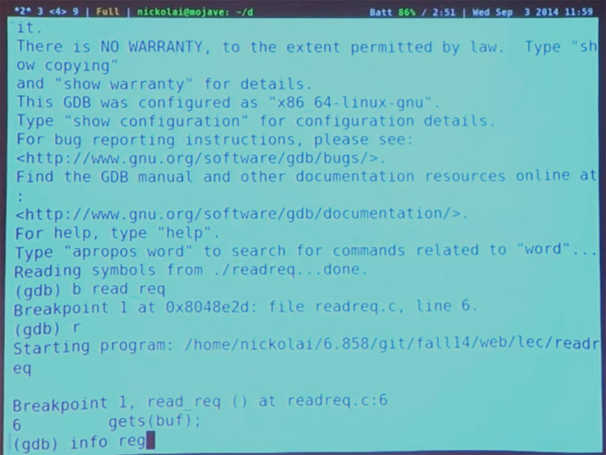

Итак, я запустил программу, она начала исполнять основную функцию, и перенаправление происходит довольно быстро. Теперь отладчик остановлен в начале перенаправления. Мы можем увидеть, что здесь происходит, например, мы можем попросить показать нам текущие регистры CPU. Здесь мы будем рассматривать низший уровень, а не уровень исходного кода С. Мы собираемся посмотреть на настоящие инструкции, выполняемые моей машиной, чтобы увидеть, что происходит на самом деле. Язык С может действительно что-то от нас скрывать, поэтому мы попросим показать нам все регистры.

В 32-х битных системах (х86), как вы помните, имеется указатель на фрейм стека – регистр EBP (stack-frame Base Pointer, указатель на стековый фрейм). И моя программа, что неудивительно, тоже имеет стек.

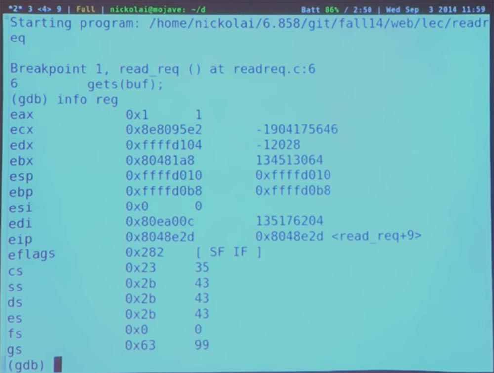

На х86 стек растёт вниз, это такой стек, как показано на слайде, и мы можем продолжать «запихивать» в него наши данные. В настоящий момент указатель стека показывает на конкретное расположение памяти ffffd010 (регистр ESP, адрес вершины стека). Здесь имеется некоторое значение. Как оно туда попало? Один из способов понять это – разобрать код функции перенаправления.

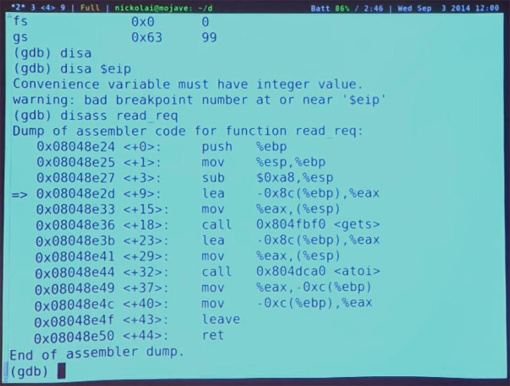

Переменная Convenience должна иметь целочисленное значение. Итак, мы можем разобрать функцию по именам. Здесь видно, что делает эта функция. В первую очередь, она начинает производить какие-то действия с регистром EBP, это не очень интересно. Но затем она вычитает определённое значение из указателя стека. Это, по существу, создаёт пространство для всех переменных параметров, таких, как буфер и целое число, мы видели это в исходном коде С.  
Сейчас мы хотим понять работу данной функции. Значение указателя стека, которое мы видели раньше, теперь уже находится посередине стека, а над ним размещены сведения, что делается в буфере, каково целое значение и также находится обратный адрес в основную функцию, которая реализовывается в стеке. Так что где-то здесь у нас должен находиться обратный адрес. Сейчас мы просто стареемся выяснить, где находятся в стеке разные вещи.

Мы можем дать команду напечатать адрес этой переменной буфера.

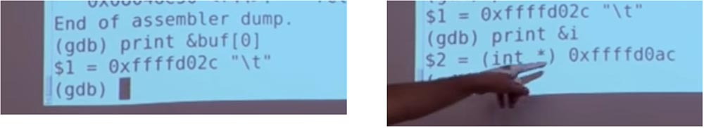

Её адрес ffffd02c. Теперь выведем на экран адрес целочисленного значения i – он выглядит так: ffffd0ac. Таким образом, integer расположен выше стека, а буфер ниже.

То есть мы видим, что наш буфер расположен в стеке вот на этом месте, сверху находится integer, и возможно, некоторые другие вещи, а в самом конце находится обратный адрес в основную функцию, который называется «перенаправлением».

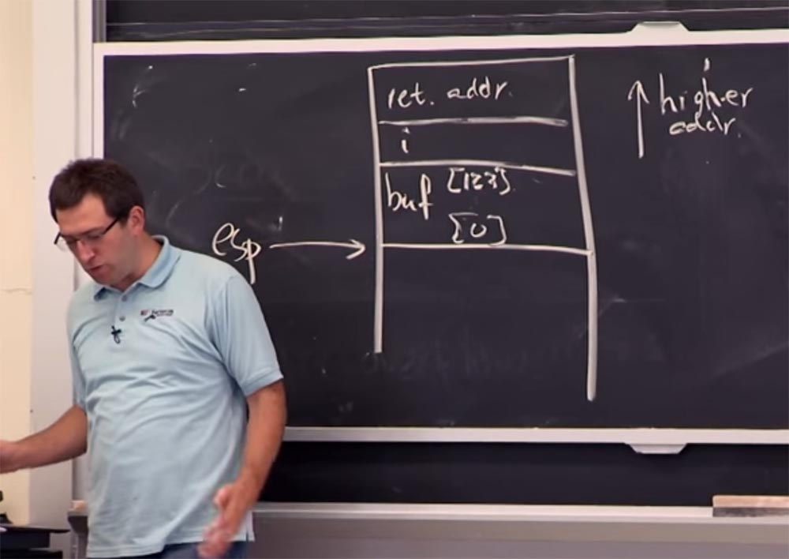

Мы видим, что стек растёт вниз, потому что выше него находятся вещи с более «высокими» адресами. Внутри нашего буфера элементы будут располагаться так: \[0\] внизу, а далее вверх по возрастающей до элемента \[128\], как я нарисовал на доске.

Посмотрим, что произойдёт, если мы введём те же данные, что привели к аварийному завершению работы системы. Но перед этим мы должны определить, где именно находится наш обратный адрес, как он соотносится с указателем ebp.

В х86 существует удобная вещь, называемая Convention, которая делает так, чтобы указатель EBP, или регистр, указывающий на нечто, происходящее в работающем стеке, помечался как «сохранённый EBP регистр» (saved EBP). Это отдельный регистр, расположенный после всех переменных, но перед обратным адресом, как показано на этом рисунке.

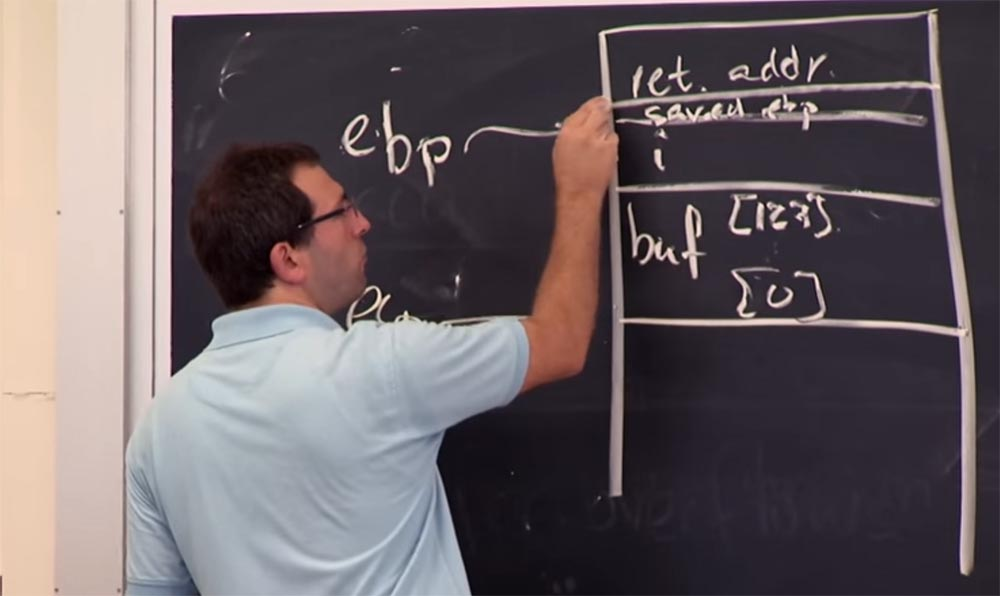

Он сохраняется согласно нескольким инструкциям, размещённым сверху. Изучим, что собой представляет saved EBP.

В отладчике GDB (GNU Debugger) можно исследовать некоторую переменную Х, например переменную указателя EBP.

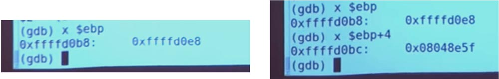

Вот его положение в стеке – ffffd0b8. Действительно, он расположен выше, чем наша переменная i (регистр edi). Это отлично.

И она имеет некоторое другое значение, которое принимает EBP до того, как будет вызвана функция, а выше находится ещё одно местоположение памяти, которое и будет обратным адресом. Если мы напечатаем ebp+4, нам покажет содержимое стека 0x08048E5F. Посмотрим, на что это указывает.

Это то, что вам предстоит проделать в лабораторной работе. Так что вы можете взять этот адрес и попробовать его разобрать. Что он из себя представляет и где заканчивается? Таким образом, GDB действительно помогает выяснить, какая функция содержит этот адрес.

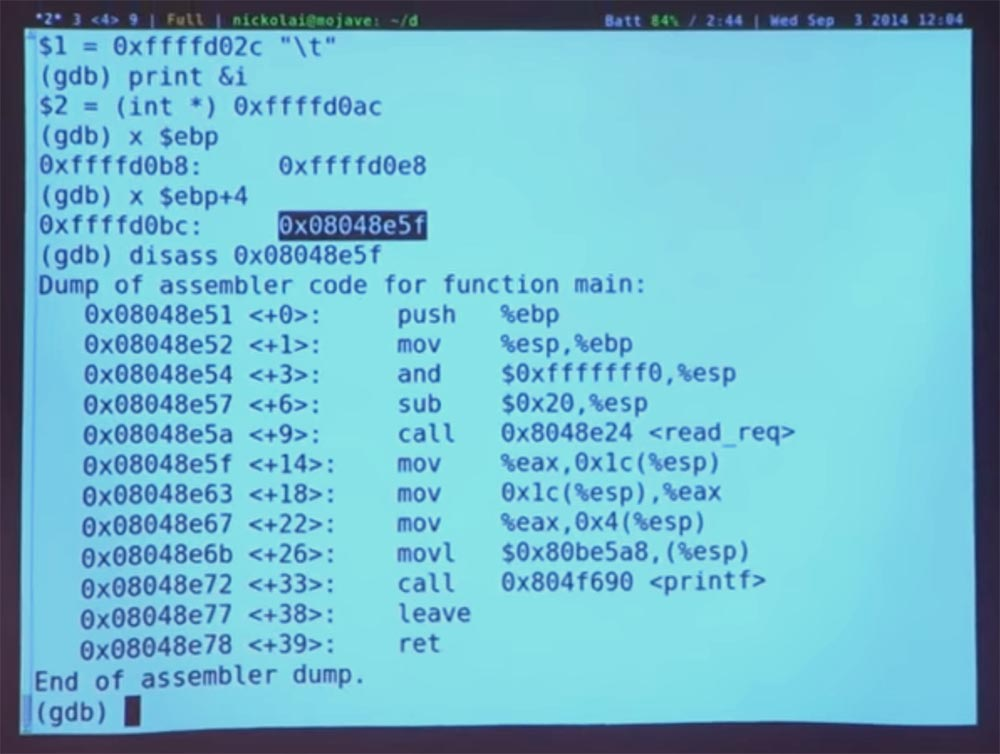

Что такое 5f? Это то, на что указывает обратный адрес. Как вы видите, это инструкция следует сразу после вызова перенаправления &lt;read_req&gt;. Поэтому когда мы возвращаемся из перенаправления, это то самое место, куда мы попадаем и откуда продолжаем выполнение функции.

Итак, где мы сейчас находимся? Чтобы подбить итог, мы можем попытаться дизассемблировать наш указатель инструкции. Вводим «disass $eip».

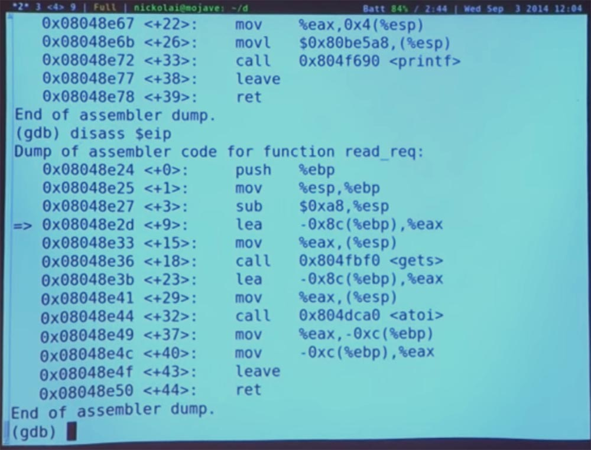

Сейчас мы в самом начале перенаправления. Попробуем запустить функцию get () и и ввести команду «next». А далее печатаем нашу невообразимую величину, которая вызвала остановку программы – ААА…А, чтобы посмотреть, что при этом происходит.

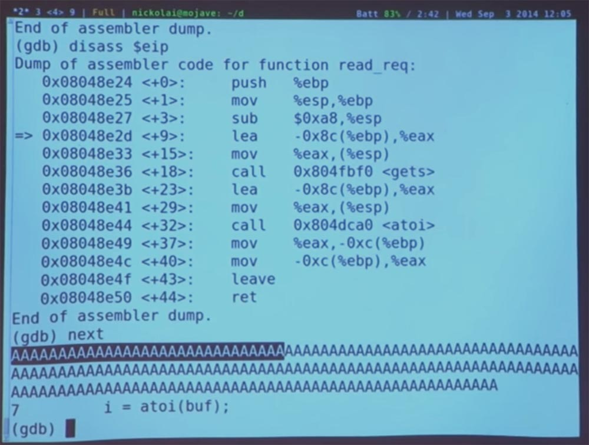

Итак, мы выполнили get (), но программа всё ещё работает. Сейчас мы выясним, что в настоящий момент происходит в памяти и почему потом всё станет плохо.

Как вы думаете, ребята, что сейчас происходит? Я напечатал последовательность символов А. Что при этом команда get () сделала с памятью? Она разместила эту последовательность в стек памяти, который, если вы помните, содержит внутри себя элементы от \[0\] до \[128\]. И эта последовательность А принялась заполнять его снизу вверх, вот как я нарисовал, в направлении стрелки.

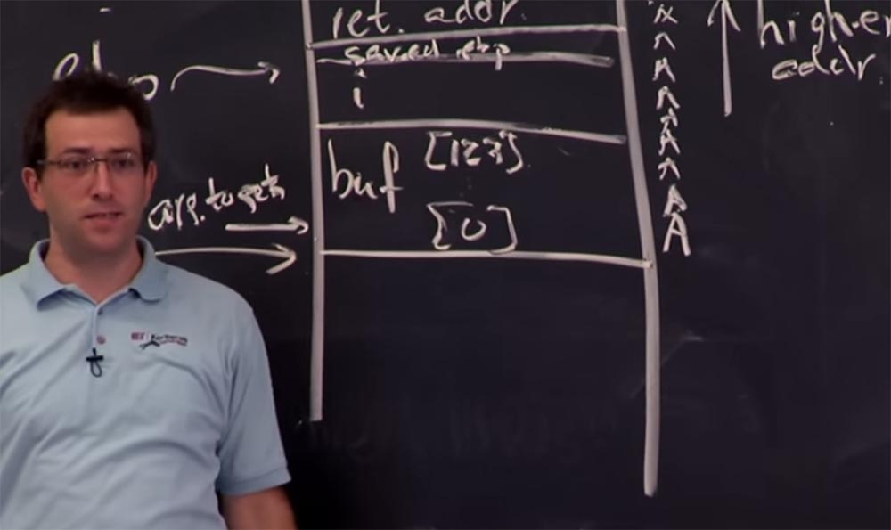

Но у нас имелся всего один указатель – начало адреса, то есть мы указали, с какого места в буфере нужно начать располагать А. Но get () не известна длина стека, поэтому она просто продолжает заполнять память нашими данными, перераспределяя их вверх по стеку, возможно, минуя обратный адрес и всё, что расположено выше нашего стека. Вот я набираю команду для подсчёта повторов А и получаю значение «180», которое превышает наше значение «128».

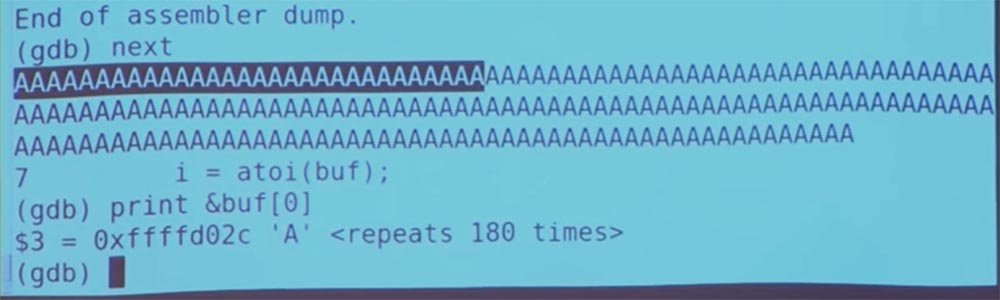

Это не так уж и хорошо. Мы можем опять проверить, что происходит с нашим указателем EBP, для этого я набираю $ebp. Получаем адрес 41414141.

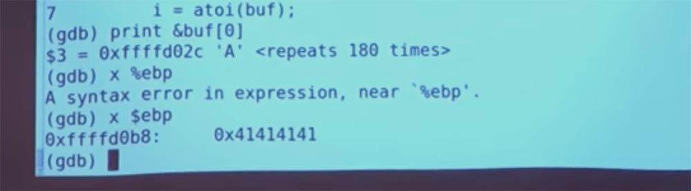

Отлично, дальше я набираю «показать расположение обратного адреса $ebp+4» и получаю тот же самый адрес 41414141.

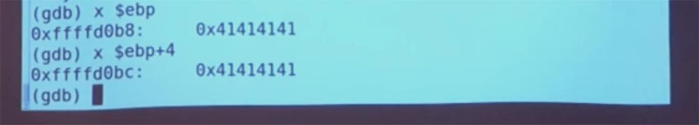

Это совсем не хорошо. Это показывает, что произойдёт, если программа вернётся сюда после перенаправления, то есть перескочит на регистр с адресом 41414141\. А там ничего нет! И она остановится. То есть мы получили ошибку сегментации.

Так что давайте просто подойдём сюда и посмотрим, что произойдёт. Наберём «next» и запустим программу дальше.

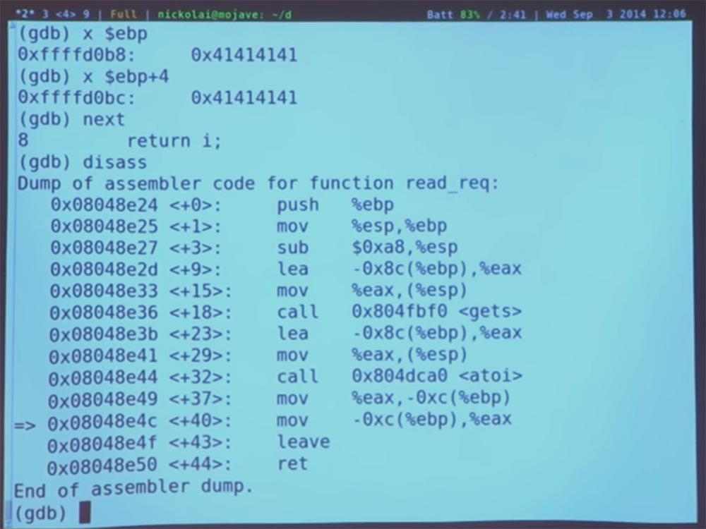

Сейчас мы приближаемся к концу функции и можем переступить ещё через 2 инструкции. Снова набираем «nexti».

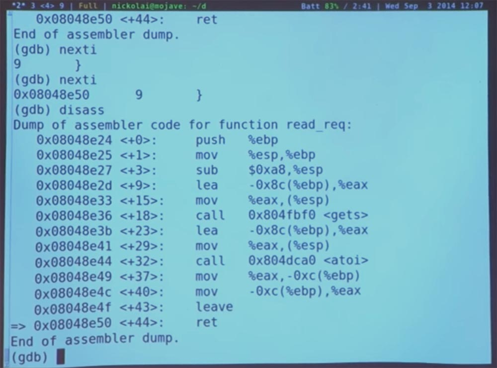

Вы видите, что в конце функции имеется инструкция «leave», которая восстанавливает стек туда, где он был. Она как бы «толкает» указатель стека всё время назад к обратному адресу, используя тот же EBP, вот для чего она в основном нужна. И теперь стек указывает на обратный адрес, который мы собираемся использовать. Фактически, это все наши символы А. И если мы запустим ещё одну инструкцию, процессор перейдёт к этому конкретному адресу 41414141, начнёт там исполнять код и «обрушится», потому что это недопустимый адрес в таблице страниц.

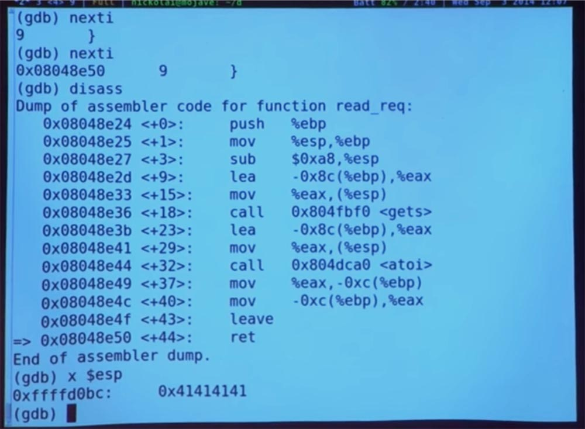

Давайте проверим, что там происходит. Ещё раз напечатаем содержимое нашего буфера и убедимся, что он полностью заполнен символами «А» в количестве 128 штук.

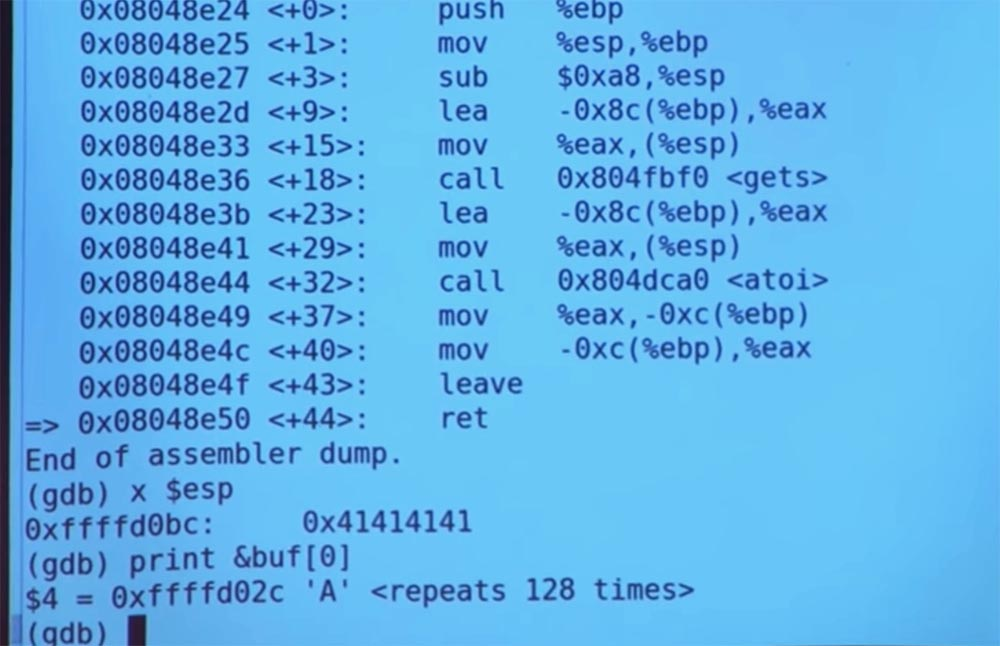

Если вы помните, всего мы ввели в буфер 180 элементов «А». Итак, что-то ещё происходит после того, как произошло переполнения буфера. Если вы помните, мы выполнили преобразование А в целочисленное i в регистре integer. И если мы имеем только буквенные символы А, без всяких чисел, то в расположение памяти записывается 0, так как букву нельзя представить целым числом. А 0, как известно, на языке С означает конец строки. Таким образом, GDB думает, что у нас есть прекрасная, завершённая строка из 128 символов А.

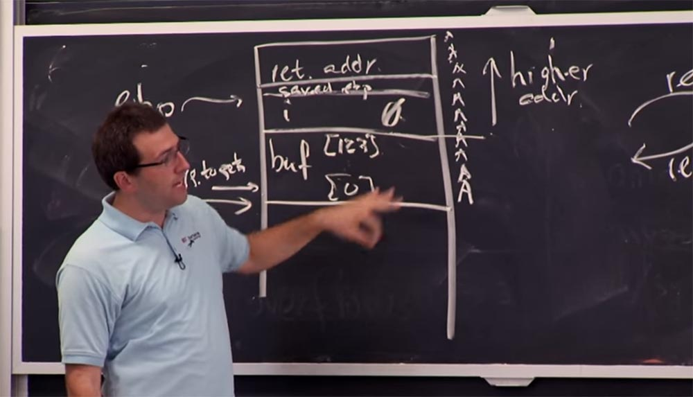

Но это не имеет особого значения, потому что у нас всё ещё имеются все эти А наверху, которые уже повредили стек.

Отлично, это был действительно важный урок. Нужно учесть, что есть ещё и другой код, который будет выполняться после того, как вам удалось переполнить буфер и вызвать повреждение памяти. Вы должны убедиться, что этот код не совершает глупостей, например, не пытается конвертировать буквенные символы А в целочисленные величины i. Так, он должен предусматривать, что при обнаружении не числового значения, в нашем случае это А, мы не сможем перескочить к адресу 41414141. Таким образом, в некоторых случая вы должны ограничить вводные данные. Возможно, это не слишком важно в данном случае, но в других ситуациях вам нужно с осторожностью подходить к типу входных данных, то есть указывать, какого рода данные – числовые или буквенные – должна обрабатывать программа.

Сейчас мы посмотрим, что произойдёт дальше, и перепрыгнем ещё раз. Посмотрим на наш регистр. Прямо сейчас EIP, вид указателя инструкций, показывает на последний адрес перенаправления &lt;read_req+44&gt;. Если мы сделаем ещё один шаг, мы наконец-то перейдём к нашему несчастному 41414141.

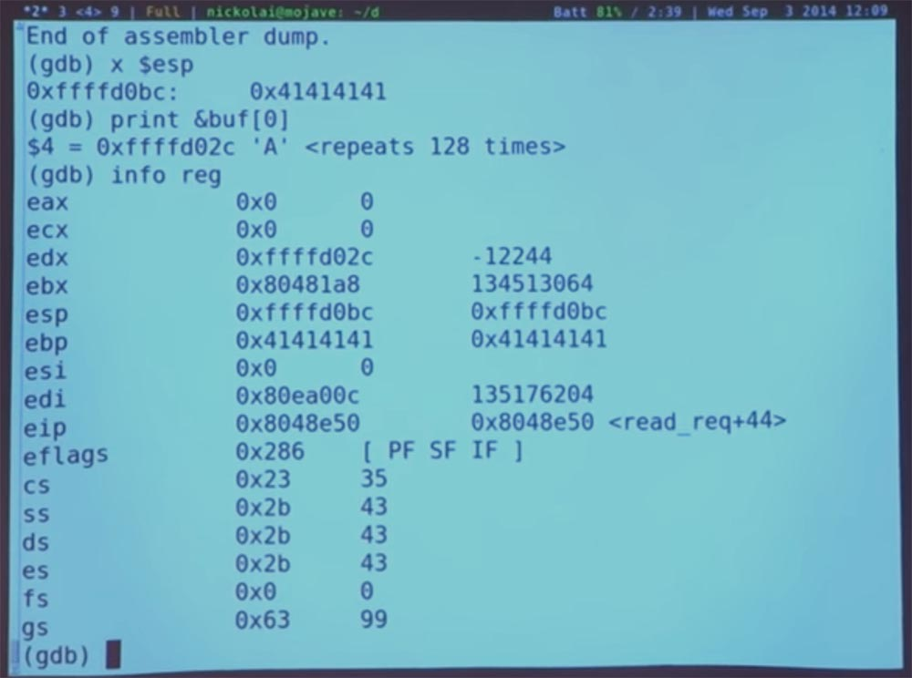

Действительно, программа выполняет наше указание, и если мы попросим GDB напечатать текущий набор регистров, то текущий указатель позиции будет представлять собой странное значение. Попробуем выполнить ещё одну инструкцию и наконец, получаем сбой программы.

Это произошло, потому что программа попыталась следовать указателю инструкции, который не соответствует допустимой странице для данного процесса в таблице страниц операционной системы. Это понятно?

Отлично, у меня к вам имеется вопрос. Так в чём же всё-таки заключается наша проблема?

Аудитория: с этой программой можно делать всё, что хотите!

Совершенно верно! Хотя, на самом деле, было довольно глупо вводить такое огромное число этих А. Но если бы вы хорошо знали, куда следует поместить эти величины, вы могли бы поместить туда другие значения и перейти по какому-нибудь другому адресу. Давайте посмотрим, сможем ли мы это сделать.

Остановим нашу программу, перезапустим её и снова введём много символов А для переполнения буфера. Но я не собираюсь выяснять, какая А где располагается в стеке. Но предположим, что я переполняю стек в этой точке и потом пробую вручную изменить вещи в стеке так, чтобы функция перепрыгнула в то место, в какое мне надо. Поэтому я ввожу снова NEXTI.

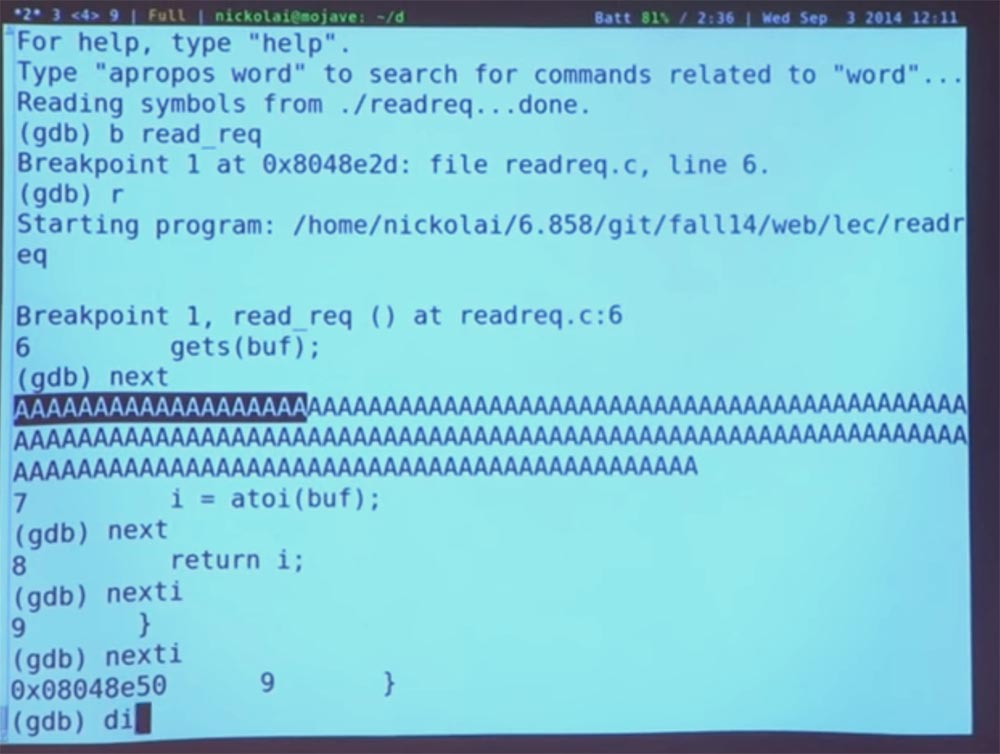

Где мы находимся? Мы снова находимся в самом конце перенаправления. Давайте посмотрим на наш стек.

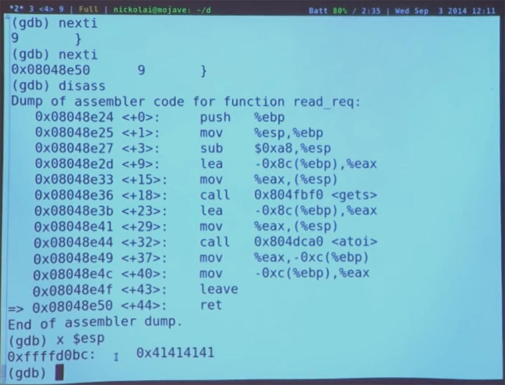

Если мы исследуем ESP, то увидим наш повреждённый указатель. Хорошо. Куда мы бы могли отсюда перескочить? Что интересного мы бы могли сделать? К сожалению, эта программа очень ограничена. В её коде нет ничего, что помогло бы нам перескочить и сделать что-то интересное, но мы всё равно попытаемся. Возможно, нам удастся найти функцию PRINTF, перепрыгнуть туда и заставить её напечатать какое-то значение, или эквивалентную чему-либо величину Х. Мы можем дизассемблировать основную функцию – disass main.

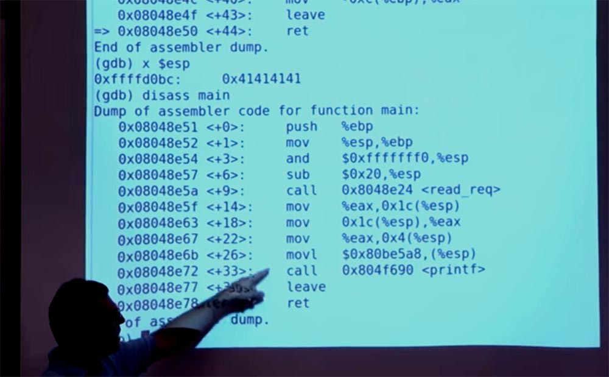

А главная функция делает целую кучу вещей – инициацию, переадресацию вызовов, ещё много всего, и затем вызывает PRINTF. Так как насчёт того, чтобы перескочить в эту точку – &lt;+26&gt;, которая устанавливает аргумент для PRINTF, равный %eax в регистре &lt;+22&gt;? Таким образом, мы сможем взять значение в регистре &lt;+26&gt; и «приклеить» его к этому стеку. Это должно быть достаточно легко сделать при помощи отладчика, можно сделать этот набор {int} esp равным этому значению.

Можно проверить ESP ещё раз, и действительно, он имеет это значение.

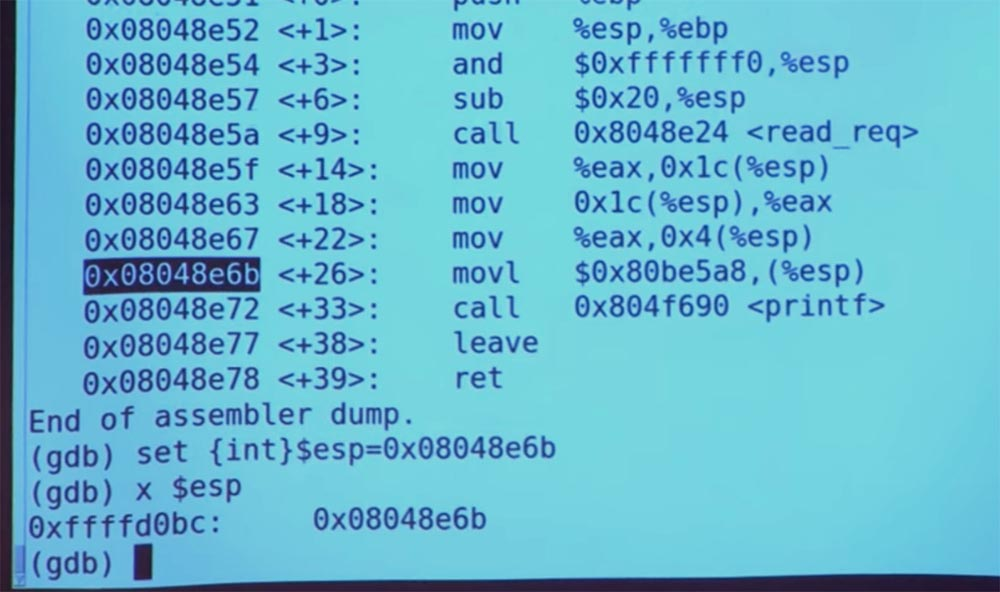

Продолжим с помощью команды «C», и мы увидим, что функция распечатала Х равным какой-то ерунде, и я думаю, это случилось из-за содержимого этого стека, которое мы попытались вывести на печать. Мы неправильно настроили все аргументы, потому что прыгнули в середину этой вызывающей последовательности (последовательность команд и данных, необходимая для вызова данной процедуры).

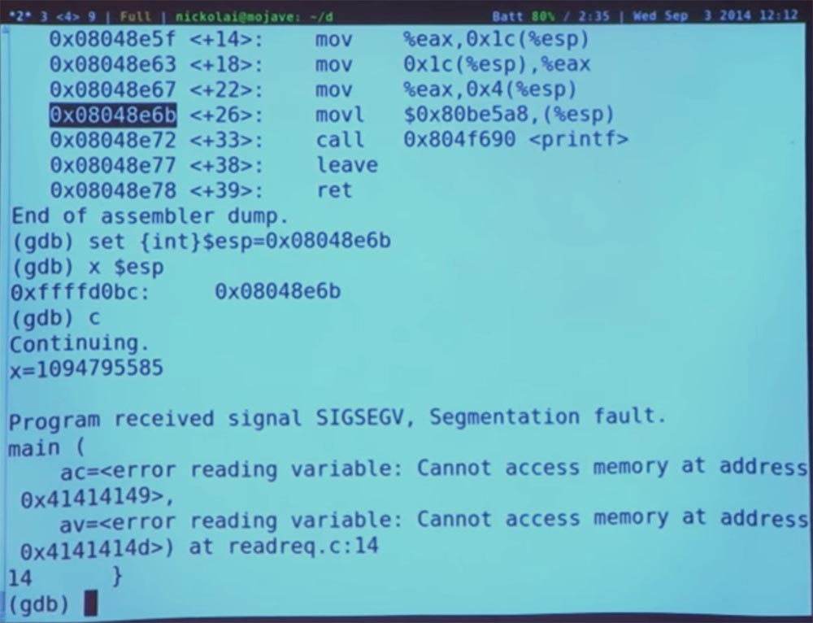

Да, мы напечатали эту величину, и после этого система дала сбой. Почему это произошло? Мы перепрыгнули к функции PRINTF, а потом что-то пошло не так. Мы изменили обратный адрес, так что когда мы вернулись из перенаправления, мы переходим на этот новый адрес, в ту же самую точку сразу после PRINTF. Так откуда взялся этот сбой?

Аудитория: из-за возврата главной функции!

Совершенно верно! Вот что происходит – вот та точка, куда мы прыгнули, в регистре &lt;+26&gt;. Она устанавливает некоторые параметры и вызывает PRINTF. PRINTF работает и готова к возврату. Пока всё нормально, потому что эта инструкция вызова «кладёт» обратный адрес в стек для того, что этот адрес использовала функция PRINTF.

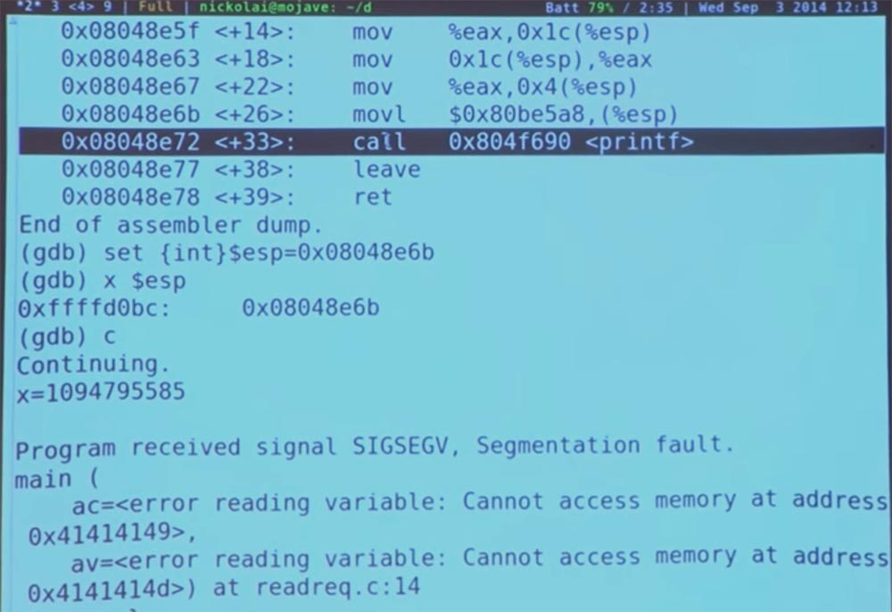

Главная функция продолжает работать, она готова запустить инструкцию LEAVE, которая не представляет собой ничего интересного, а затем сделать другой «return» в регистре &lt;+39&gt;. Но дело в том, что в этом стеке нет правильного обратного адреса. Поэтому, предположительно, мы возвращаемся к кому-то другому, кто знает расположение памяти выше стека, и прыгаем куда-нибудь ещё. Так что, к сожалению, здесь наши псевдоатаки не работают. Здесь запускается какой-то другой код. Но затем он «крашится». Это, вероятно, не то, что мы хотели сделать.

Так что если вы действительно хотите быть осторожными, вы должны не только тщательно разместить в стеке обратный адрес, но и выяснить, от кого второй RET получит свой обратный адрес. Затем вам нужно постараться осторожно поместить в стек что-то ещё, чтобы быть уверенным, что ваша программа «чисто» продолжает выполняться после того, как была взломана, и так, что это вмешательство никто не заметит.

Это всё вы попытаетесь проделать в лабораторной работе №1, только более подробно.

Есть ещё одна вещь, о которой нам стоит подумать сейчас – об архитектуре стека при переполнении буфера. В данном случае наша проблема заключается в том, что обратный адрес там расположен вверху, правильно? Буфер продолжает расти и, в конечном счёте, перекрывает обратный адрес. Но что, если мы перевёрнём стек «вниз готовой»? Вы знаете, некоторые машины имеют стеки, которые растут вверх. Так что мы могли бы представить себе альтернативный дизайн, где стек начинается снизу и продолжает расти вверх, а не вниз. Так что если вы переполните такой буфер, вы просто будете продолжать идти вверх по стеку, и в этом случае не случится ничего плохого.

Сейчас я нарисую вам, чтобы объяснить, как это выглядит. Пусть обратный адрес располагается здесь, внизу стека. Выше расположены наши переменные, или saved EBP, затем переменные целочисленные integer, и на самом верху буфер от \[0\] до \[128\]. Если мы делаем переполнение, то оно идёт вверх по этой стрелке.

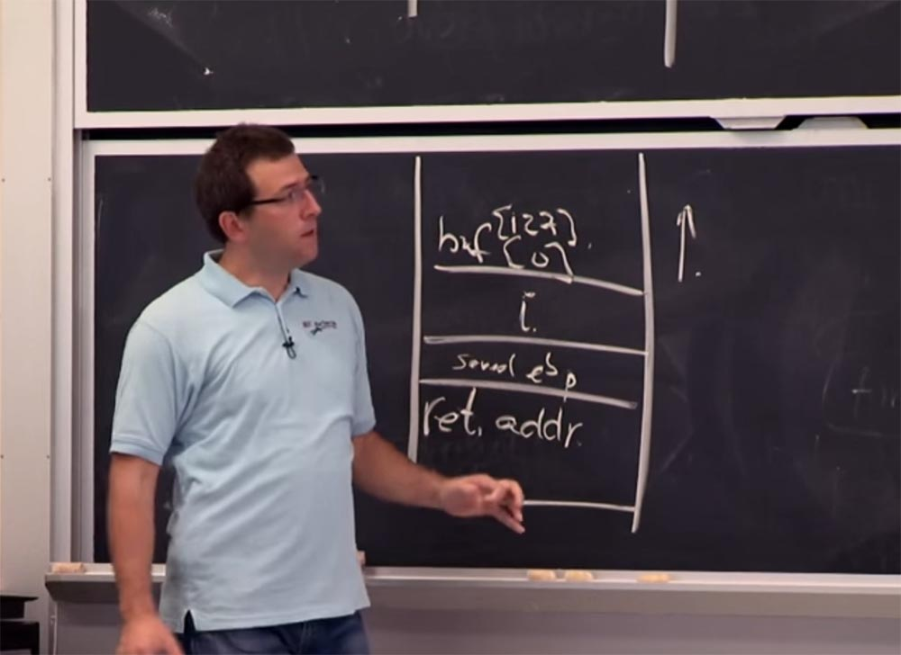

Таким образом, переполнение буфера не повлияет на обратный адрес. Что нам нужно сделать в нашей программе, чтобы осуществить такой вариант работы? Правильно, сделать переадресацию! Расположим слева стек-фрейм, который осуществит такую переадресацию, и переадресуем вызов функции наверх. В результате наша схема будет выглядеть так: наверху на стеке расположен обратный адрес, затем saved EBP, и все остальные переменные расположатся сверху нам ним. А потом мы начнём переполнять буфер командой get(S).

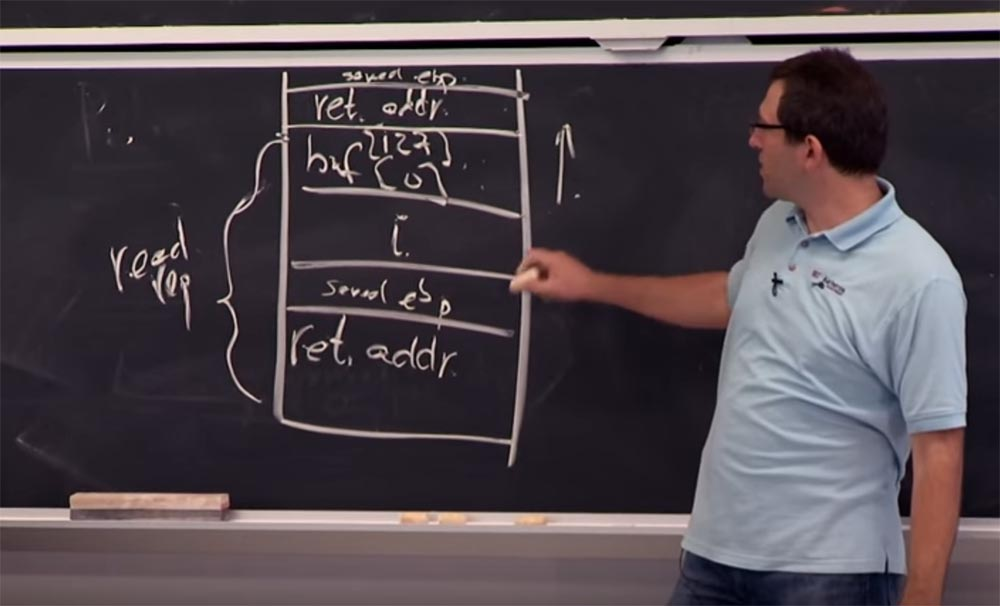

Итак, работа функции всё ещё проблематична. В основном, потому что буфер окружён функциями возврата со всех сторон, и в любом случае вы можете что-то переполнить. Предположим, что наша машина имеет стек, растущий вверх. Тогда в какой момент вы сможете перехватить контроль над выполнением программы?

На самом деле, в некоторых случаях это даже проще. Вам не нужно ждать, когда вернётся редирект. Возможно, там даже были такие вещи, как превращение А в i. На самом дело это проще, потому что команда get(S) переполняет буфер. Это изменит обратный адрес, а затем немедленно вернётся обратно и перепрыгнет туда, где вы попытались создать некую конструкцию.

Что произойдёт, если у нас такая, довольно скучная программа для всяких экспериментов? Она вроде бы не содержит интересного кода для прыжка. Всё что вы можете сделать – это напечатать здесь, в PRINTF, другую величину Х.

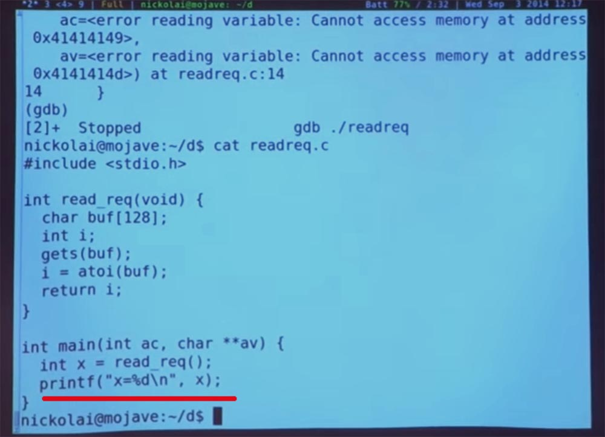

Давайте попробуем!

Аудитория: если у вас есть дополнительный стек, вы можете поместить произвольный код, который, например, выполняет оболочку программы?

Да-да-да, это действительно разумно, потому что тогда можно поддерживать другие величины «input». Но здесь имеется некоторая защита от этого, вы узнаете о ней в следующих лекциях. Но в принципе, вы бы могли иметь здесь обратный адрес, который перекрывается на обеих типах машин – со стеками вверх и со стеками вниз. И вместо того, чтобы указать его в имеющемся коде, например PRINTF в главной функции, мы могли бы иметь обратный адрес в буфере, так как это просто некое местоположение в буфере. Но вы можете «прыгнуть» туда и считать его исполняемым параметром.

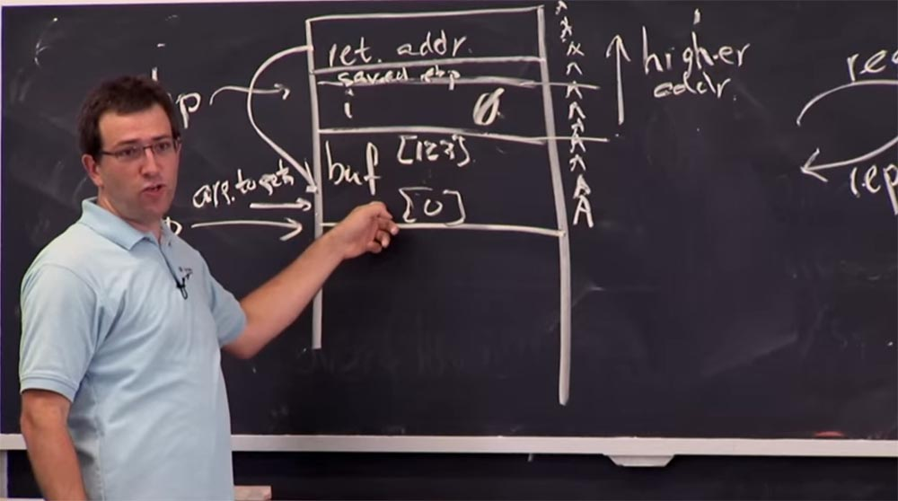

Как часть вашего запроса, вы посылаете несколько байтов данных на сервер, а затем получаете обратный адрес или вещь, которую вы расположили в этом месте буфера, и вы продолжите выполнение программы с этой точки.

Таким образом вы сможете предоставить код, который хотите запустить, прыгнуть туда и использовать сервер для его запуска. И действительно, в системах Unix атакующие часто делают так – они просят операционную систему просто выполнить команду BIN SH, позволяющую вам выбрать тип произвольных команд оболочки, которые затем выполняются. В результате эта вещь, этот кусок кода, который вы вставили в буфер, по ряду исторических причин носит название «код оболочки», shell code. И в вашей лабораторной работе вы попытаетесь сконструировать нечто подобное.

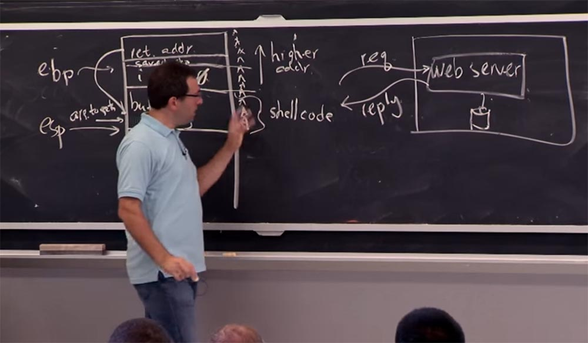

Аудитория: существует ли здесь разделение между кодом и данными?

Исторически сложилось так, что многие машины не обеспечивали никакого разделения кода и данных, а имели просто плоское адресное пространство памяти: указатель стека указывает туда, указатель кода – сюда, и вы просто выполняете то, на что он указывает. Современные машины пытаются обеспечить некоторую защиту от такого рода атак, поэтому они часто создают разрешения, связанные с разными областями памяти, и одно из разрешений является исполняемым. Таким образом, часть вашего 32-разрядного или 64-разрядного адресного пространства, содержащая код, имеет разрешение на выполнение операций. И если ваш указатель инструкции показывает туда, процессор будет на самом деле управлять этими штуками. Но стек и другие области данных вашего адресного пространства обычно не имеют разрешения на исполнение.

Так что если вам случится каким-то образом установить указатель инструкции в некоторое положение, соответствующее области памяти, где нет кода, процессор откажется выполнять эту инструкцию. Так что это довольно хороший способ защититься от некоторых видов атак, но он не предотвращает вообще их возможность.

Так как бы вы обошли это препятствие, если бы у вас был неисполняемый стек? На самом деле вы видели этот пример раньше, когда мы просто «прыгнули» в середину главной функции. Таким образом, это был способ использования переполнения буфера без необходимости вводить новый собственный код. Поэтому, даже если бы данный стек был неисполняемым, я бы всё равно смог попасть в середину главной функции. В данном конкретном случае это довольно скучно, потому что достаточно ввести PRINT X, чтобы обрушить систему.

Но в других ситуациях у вас могут быть другие части кода в вашей программе, позволяющие делать интересные вещи, которые вы действительно хотите выполнить. Это называется атакой «return to lib c» — атака возврата в библиотеку, связанная с переполнением буфера. При этом адрес возврата функции в стеке подменяется адресом другой функции, а в последующую часть стека записываются параметры для вызываемой функции. Это способ обойти меры безопасности. Таким образом, в контексте переполнения буфера нет действительно четкого решение, которое обеспечивает идеальную защиту от этих ошибок, потому что, в конце концов, программист сделал ошибку в написании этого исходного кода. И лучший способ исправить это, вероятно, просто изменить исходный код и убедится, что вы не ввели слишком много getS(), о чём вас как раз предупреждал компилятор.

Но есть более тонкие вещи, о которых компилятор вас не предупреждает, но вы всё равно должны их учесть. Так как на практике трудно изменить все программное обеспечение, многие люди пробуют разработать методы для предупреждения подобных ошибок. Например, делают стек неисполняемым так, что вы не можете поместить в него код оболочки и должны сделать что-то более сложное, чтобы достичь своей цели. В следующих 2-х лекциях мы рассмотрим эти методы защиты. Они не идеальны, но на практике существенно затрудняют жизнь хакеру.  
Аудитория: будет ли тест на тему сегодняшней лекции и когда?

Да, если вы посмотрите в расписание, то увидите там 2 теста.

Итак, подведём итоги. Что нам делать с проблемами механизма переполнения буфера? Общий ответ должен звучать так – нужно иметь наименьшее количество механизмов. Как мы убедились, если вы полагаете применить политики безопасности в каждой части программного обеспечения, вы неизбежно будете совершать ошибки. И они позволят противнику обойти ваш механизм, чтобы использовать некоторые недочёты в веб-сервере.

Во второй лабораторной работе вы попытаетесь сконструировать более совершенную систему, безопасность которой не будет зависеть от программного обеспечения, и которая будет обеспечивать соблюдение политики безопасности. Сама политика безопасности будет реализовываться небольшим количеством компонентов.

И остальная часть системы, правильная она или нет, не имеет значения для безопасности, если это не будет нарушать саму политику безопасности. Так что своего рода минимизация надёжной вычислительной базы является довольно мощной технологией, позволяющей обойти ошибки механизма и проблемы, которые мы рассмотрели сегодня более-менее детально.

На сегодня всё, приходите на лекцию в понедельник и не забывайте размещать свои вопросы на сайте.

Продолжение следует…

Полная версия курса доступна [здесь](https://ocw.mit.edu/courses/electrical-engineering-and-computer-science/6-858-computer-systems-security-fall-2014/).

Спасибо, что остаётесь с нами. Вам нравятся наши статьи? Хотите видеть больше интересных материалов? Поддержите нас оформив заказ или порекомендовав знакомым, **30% скидка для пользователей Хабра на уникальный аналог entry-level серверов, который был придуман нами для Вас:** [Вся правда о VPS (KVM) E5-2650 v4 (6 Cores) 10GB DDR4 240GB SSD 1Gbps от $20 или как правильно делить сервер?](https://habr.com/company/ua-hosting/blog/347386/) (доступны варианты с RAID1 и RAID10, до 24 ядер и до 40GB DDR4).

**Dell R730xd в 2 раза дешевле?** Только у нас **[2 х Intel Dodeca-Core Xeon E5-2650v4 128GB DDR4 6x480GB SSD 1Gbps 100 ТВ от $249](https://ua-hosting.company/serversnl) в Нидерландах и США!** Читайте о том [Как построить инфраструктуру корп. класса c применением серверов Dell R730xd Е5-2650 v4 стоимостью 9000 евро за копейки?](https://habr.com/company/ua-hosting/blog/329618/)