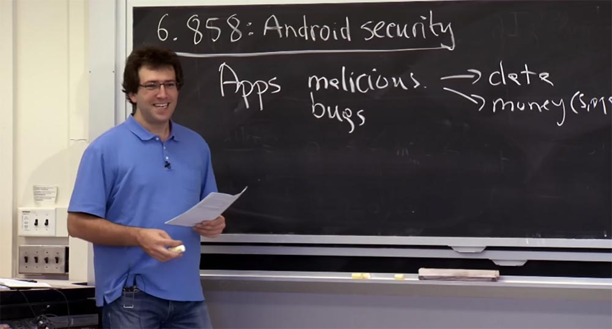
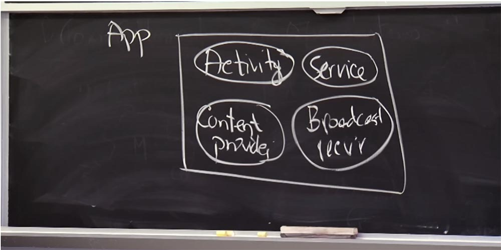
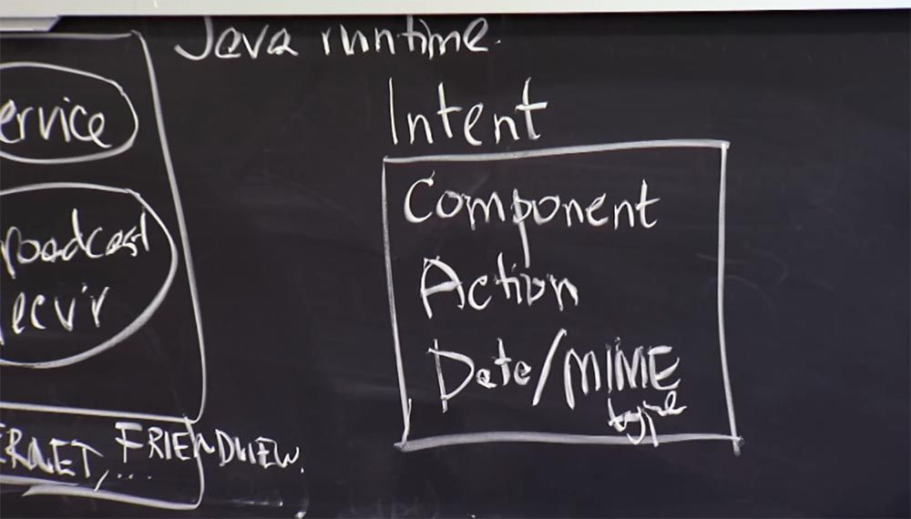
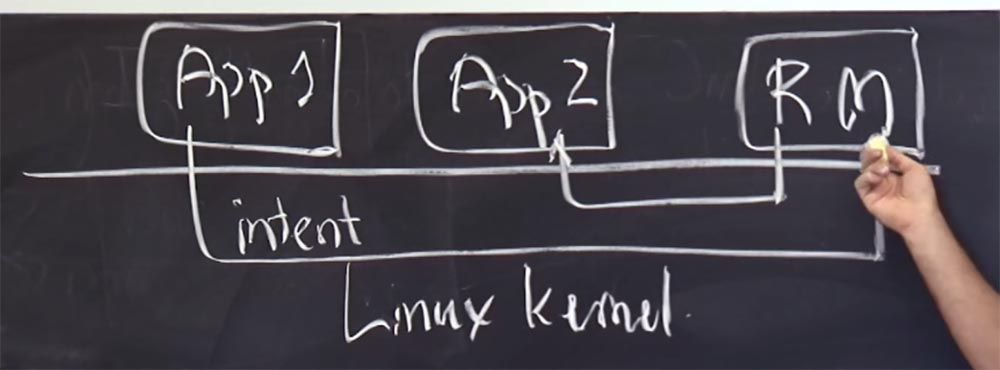
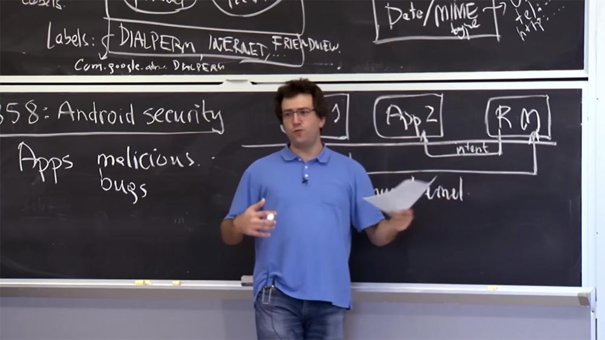

Курс MIT «Безопасность компьютерных систем». Лекция 20: «Безопасность мобильных телефонов», часть 1 / Блог компании ua-hosting.company

### Массачусетский Технологический институт. Курс лекций #6.858. «Безопасность компьютерных систем». Николай Зельдович, Джеймс Микенс. 2014 год

Computer Systems Security — это курс о разработке и внедрении защищенных компьютерных систем. Лекции охватывают модели угроз, атаки, которые ставят под угрозу безопасность, и методы обеспечения безопасности на основе последних научных работ. Темы включают в себя безопасность операционной системы (ОС), возможности, управление потоками информации, языковую безопасность, сетевые протоколы, аппаратную защиту и безопасность в веб-приложениях.

Лекция 1: «Вступление: модели угроз» [Часть 1](https://habr.com/company/ua-hosting/blog/354874/) / [Часть 2](https://habr.com/company/ua-hosting/blog/354894/) / [Часть 3](https://habr.com/company/ua-hosting/blog/354896/)  
Лекция 2: «Контроль хакерских атак» [Часть 1](https://habr.com/company/ua-hosting/blog/414505/) / [Часть 2](https://habr.com/company/ua-hosting/blog/416047/) / [Часть 3](https://habr.com/company/ua-hosting/blog/416727/)  
Лекция 3: «Переполнение буфера: эксплойты и защита» [Часть 1](https://habr.com/company/ua-hosting/blog/416839/) / [Часть 2](https://habr.com/company/ua-hosting/blog/418093/) / [Часть 3](https://habr.com/company/ua-hosting/blog/418099/)  
Лекция 4: «Разделение привилегий» [Часть 1](https://habr.com/company/ua-hosting/blog/418195/) / [Часть 2](https://habr.com/company/ua-hosting/blog/418197/) / [Часть 3](https://habr.com/company/ua-hosting/blog/418211/)  
Лекция 5: «Откуда берутся ошибки систем безопасности» [Часть 1](https://habr.com/company/ua-hosting/blog/418213/) / [Часть 2](https://habr.com/company/ua-hosting/blog/418215/)  
Лекция 6: «Возможности» [Часть 1](https://habr.com/company/ua-hosting/blog/418217/) / [Часть 2](https://habr.com/company/ua-hosting/blog/418219/) / [Часть 3](https://habr.com/company/ua-hosting/blog/418221/)  
Лекция 7: «Песочница Native Client» [Часть 1](https://habr.com/company/ua-hosting/blog/418223/) / [Часть 2](https://habr.com/company/ua-hosting/blog/418225/) / [Часть 3](https://habr.com/company/ua-hosting/blog/418227/)  
Лекция 8: «Модель сетевой безопасности» [Часть 1](https://habr.com/company/ua-hosting/blog/418229/) / [Часть 2](https://habr.com/company/ua-hosting/blog/423155/) / [Часть 3](https://habr.com/company/ua-hosting/blog/423423/)  
Лекция 9: «Безопасность Web-приложений» [Часть 1](https://habr.com/company/ua-hosting/blog/424289/) / [Часть 2](https://habr.com/company/ua-hosting/blog/424295/) / [Часть 3](https://habr.com/company/ua-hosting/blog/424297/)  
Лекция 10: «Символьное выполнение» [Часть 1](https://habr.com/company/ua-hosting/blog/425557/) / [Часть 2](https://habr.com/company/ua-hosting/blog/425561/) / [Часть 3](https://habr.com/company/ua-hosting/blog/425559/)  
Лекция 11: «Язык программирования Ur/Web» [Часть 1](https://habr.com/company/ua-hosting/blog/425997/) / [Часть 2](https://habr.com/company/ua-hosting/blog/425999/) / [Часть 3](https://habr.com/company/ua-hosting/blog/426001/)  
Лекция 12: «Сетевая безопасность» [Часть 1](https://habr.com/company/ua-hosting/blog/426325/) / [Часть 2](https://habr.com/company/ua-hosting/blog/427087/) / [Часть 3](https://habr.com/company/ua-hosting/blog/427093/)  
Лекция 13: «Сетевые протоколы» [Часть 1](https://habr.com/company/ua-hosting/blog/427763/) / [Часть 2](https://habr.com/company/ua-hosting/blog/427771/) / [Часть 3](https://habr.com/company/ua-hosting/blog/427779/)  
Лекция 14: «SSL и HTTPS» [Часть 1](https://habr.com/company/ua-hosting/blog/427783/) / [Часть 2](https://habr.com/company/ua-hosting/blog/427785/) / [Часть 3](https://habr.com/company/ua-hosting/blog/427787/)  
Лекция 15: «Медицинское программное обеспечение» [Часть 1](https://habr.com/company/ua-hosting/blog/428652/) / [Часть 2](https://habr.com/company/ua-hosting/blog/428654/) / [Часть 3](https://habr.com/company/ua-hosting/blog/428656/)  
Лекция 16: «Атаки через побочный канал» [Часть 1](https://habr.com/company/ua-hosting/blog/429390/) / [Часть 2](https://habr.com/company/ua-hosting/blog/429392/) / [Часть 3](https://habr.com/company/ua-hosting/blog/429394/)  
Лекция 17: «Аутентификация пользователя» [Часть 1](https://habr.com/company/ua-hosting/blog/429680/) / [Часть 2](https://habr.com/company/ua-hosting/blog/429682/) / [Часть 3](https://habr.com/company/ua-hosting/blog/429686/)  
Лекция 18: «Частный просмотр интернета» [Часть 1](https://habr.com/company/ua-hosting/blog/430204/) / [Часть 2](https://habr.com/company/ua-hosting/blog/430206/) / [Часть 3](https://habr.com/company/ua-hosting/blog/430208/)  
Лекция 19: «Анонимные сети» [Часть 1](https://habr.com/company/ua-hosting/blog/431262/) / [Часть 2](https://habr.com/company/ua-hosting/blog/431264/) / [Часть 3](https://habr.com/company/ua-hosting/blog/431266/)  
Лекция 20: «Безопасность мобильных телефонов» [Часть 1](https://habr.com/company/ua-hosting/blog/432616/) / [Часть 2](https://habr.com/company/ua-hosting/blog/432618/) / [Часть 3](https://habr.com/company/ua-hosting/blog/432620/)

Сегодня мы поговорим о безопасности Android. Вы можете думать об этом как об интересном примере системы, которая в первую очередь была разработана с учётом вопросов безопасности. Возможно, что в отличие от многих систем, которые мы рассматривали до сих пор, таких, как Unix или веб-браузеры, где безопасность была в большинстве случаев «прикручена» после создания системы и её дизайн не сосредотачивался на этих вопросах, разработчики Android изначально очень беспокоились о конкретных классах атак и конструктивных механизмах приложений.

Они придумали лучший способ структурирования приложений для Android, которые позволят нам лучше применять политики безопасности. Самое классное, что это довольно широко используемая система, непохожая на некоторые исследовательские работы, которые могут лишь предложить новую архитектуру, эта система реально используется на практике, и устройств, использующих ОС Android, становится всё больше и больше.

Сегодня мы поговорим о том, насколько удались или не удались разработчикам некоторые вещи. Мы рассмотрим, какие части дизайна они посчитали важными и что упустили, и что в результате получается на практике. Это довольно интересно. В некотором смысле, разработчики использовали существующие системы, о которых мы говорили, так что «Андроид» построен на базе UNIX, фактически это просто ядро Linux, работающее в целом телефоне.

Так что во многом они используют некоторые из знакомых механизмов, которые вы помните по лабораторной работе №2, где вы применяли идентификаторы пользователей и группы Unix и прочие вещи для разделения приложений друг от друга. Но в случае Android у них имеется совсем другой способ настройки идентификаторов пользователей и прав доступа к файлам, чем в типичной системе Linux.

Давайте начнем с того, что обсудим, каков здесь уровень угрозы? Что беспокоит этих парней в телефоне? Что здесь происходит? От чего они пытаются защититься? Что представляет собой модель угроз в мобильном устройстве?

**Студент:** приложения, которые могут причинить вред?

**Профессор:** да, их беспокоит, что приложения, которые можно установить в телефон, могут быть вредоносными. Я думаю, что существуют откровенно злонамеренные приложения, созданные для того, чтобы получить над вами контроль или украсть ваши личные данные. Так что вам стоит беспокоиться о своих данных и о вещах, которые стоят денег — SMS сообщениях, телефонных звонках, интернет соединении и так далее.

Таким образом, справа — те вещи, которые вы хотите защитить в своем телефоне, а слева – то, что может заставить их работать не так, как следует. Так как существуют вредоносные приложения, ребята из Android не хотят, чтобы пользователи могли устанавливать приложения, написанные разработчиками, о которых Google никогда не слышал. Кроме того, такие приложения могут причинять вред, не потому, что так захотел разработчик, а потому, что он просто забыл что-либо сделать. И было бы неплохо помочь этим ребятам создавать приложения, которые будут безопасными, так как часто разработчик приложения не является экспертом в области уязвимостей, которые затем могут быть использованы злоумышленником в его приложении.

Поскольку ОС Android широко распространена, мы можем просмотреть отчёты об уязвимостях. Существует база данных CVE, которая каталогизирует множество уязвимостей операционных систем, и это на самом деле интересно. Конечно, там имеются и сообщения об ошибках Android, со многими из которых вы сталкивались на лекциях. В некоторых частях Android все еще возможно переполнение буфера, существует плохой выбор криптосистемы по умолчанию, люди забывают инициализировать генератор случайных чисел и создают предсказуемые ключи. Все это все еще происходит, потому что программное обеспечение не застраховано ни от одной из известных нам проблем.

Интересно то, что, похоже, эти проблемы носят единичный характер и возникают время от времени. По большому счету, их можно устранить, и система остается достаточно безопасной после исправления этих ошибок. Так что во многих отношениях, дизайн Android работает достаточно хорошо. Поэтому позже мы рассмотрим более подробно, какие части дизайна работают лучше, а какие – хуже. Но в целом это достаточно хорошо продуманное программное решение, или, по крайней мере, более продуманное, чем десктопные приложения Unix, которые вы встречали до сих пор.

Таким образом, один из способов выяснить, как защитить данные и различные услуги, которые могут стоить вам денег, от вредоносных приложений — это в первую очередь понять, как выглядит приложение для системы Android. Затем мы поговорим о том, как в этом приложении настраиваются и применяются различные разрешения или привилегии. Android-приложения сильно отличаются от того, что вы до сих пор встречали в десктопных приложениях или в интернет-приложениях.

Вместо того, чтобы составлять неделимую часть кода с основной функцией, которую вы начинаете выполнять, приложения «Андроид» более модульные. В случае использования Android вы можете представлять одно приложение как набор компонентов. В лекционной статье описывается 4 вида компонентов, которые предоставляет разработчику Android framework. Первый компонент – это Activity, или активность. Это вещь, которая представляет собой пользовательский интерфейс и позволяет пользователю взаимодействовать с приложением, отображает ему информацию и принимает от него нажатия клавиш и так далее.

С точки зрения безопасности активность имеет интересное свойство – ввод данных пользователем сводится к одному действию за раз. Фреймворк Android на самом деле гарантирует, что одновременно возможен только один вид активности, то есть если вы запускаете банковское приложение, то ни одно приложение не будет при этом работать в фоновом режиме, чтобы перехватить ПИН-код банковского приложения через сенсорные нажатия. Так что фреймворк предусматривает использование некоторых свойств безопасности в отношении ввода данных пользователем. Таким образом, активность представляет собой компонент пользовательского интерфейса.

Три других типа компонентов помогают собственной логике структуры приложения взаимодействовать с другими компонентами. Итак, второй компонент носит название Service, или службы. Эти вещи работают в фоновом режиме. Например, у вас может работать служба, отслеживающая ваше местоположение, как в приложении, которое эти ребята описывают в статье. У вас могут быть службы, которые извлекают информацию из сети в фоновом режиме и так далее.  
Третий компонент – это компонент контент-провайдера, Content provider. Его можно представить как базу данных SQL, в которой можно определить несколько таблиц со схемой, и так далее. Вы можете обращать запросы SQL ко всем данным, хранящимся в этом приложении. Этот компонент позволяет контролировать доступ к базе данных, говоря, кому разрешено к ней обращаться.  
В «Андроиде» есть ещё что-то необычное, чего нет в других системах. Это четвёртый компонент – Broadcast receiver, или широковещательный приемник. Он используется для получения сообщений от других частей системы. Поэтому мы поговорим о том, как приложения взаимодействуют друг с другом в плане сообщений.

Таким образом, это очень логичное представление о том, что собой представляют Android – приложения. Но на самом деле, все это просто классы Java или код Java, написанный разработчиком.

Есть только некий стандартный интерфейс, который вы реализуете для активности, для служб, для широковещательного приемника, и для контент-провайдера, и понятно, что это всего лишь Java-код. И все размещённые в прямоугольнике компоненты — это просто среда выполнения Java, которая работает в вашем телефоне, это просто единичный процесс на ядре Linux, который работает в вашем телефоне. И все эти компоненты представляют собой различные классы или части кода, работающие в процессе Java runtime. Вот как это можно свести к традиционным, более понятным вам процессам.

Еще одна вещь, которая взаимодействует с приложением, называется манифестом. Код для всех компонентов пишет или компилирует разработчик приложения, но кроме этого, в системе существует также манифест, который находится вне компонентов приложения. Он представляет собой текст или XML-файл, который описывает все эти компоненты и то, каким образом другие части системы должны взаимодействовать с компонентами этого приложения.

В частности, в этом манифесте говорится о так называемых метках Lables, о которых мы поговорим через секунду, которые определяют привилегии этого приложения с точки зрения того, что ему разрешено делать, а также определяют ограничения на то, кто еще может взаимодействовать с различными компонентами этого приложения. Вы хотите спросить, как это работает?

**Студент:** является ли метка чем-то, что определяет «это приложение не может сделать телефонный звонок», или «это приложение может отправить сообщение»?

**Профессор:** да, эти метки устанавливают, может ли данное приложение сделать звонок, отправить SMS или использовать интернет. Существует два типа меток, я их здесь нарисую. Каждое приложение имеет список меток, описывающих привилегии, которые имеет приложение. Это что-то вроде разрешений набрать номер телефона, включить связь с интернетом и так далее. Позже я расскажу, как они работают.

Таким образом, это привилегии, которые имеет приложение. Кроме этого, вы можете также прикрепить метки к отдельным компонентам, и там они приобретают другое значение — это привилегии для конкретного приложения. Если у вас есть компонент с меткой, то для взаимодействия с ним любой другой компонент также должен иметь соответствующую метку.  
Например, у вас может быть метка с привилегией «Просмотр друзей», которую можно использовать для просмотра местоположения ваших друзей. Это привилегия, которую может иметь приложение. Но чтобы обеспечить эту привилегию, вы должны прикрепить эту метку к конкретному компоненту, в данном случае к компоненту «Контент-провайдер», к его базе данных, где имеется информация о местоположении ваших друзей. И теперь любому, кто захочет получить доступ к этой базе данных, нужно иметь эту же метку в их привилегиях.

Вот каким образом вы настраиваете разрешения. Вы можете думать об этом как об ID пользователей или ID групп в Unix, за исключением произвольных строк, которые делают их немного более гибкими. То есть у вас никогда не закончатся эти ID и вы не беспокоитесь о том, что кому-то их не хватит.

Оказывается, что разработчики «Андроид» не были особо осторожны в определении области действия этих меток. Вы можете иметь два приложения, которые решили снабдить одной и той же меткой. Таким образом, эти метки частично определены приложением. Предположим, у вас на телефоне два приложения — Facebook и Google+, и они оба заявляют, что хотели бы новую строку разрешений для функции «Просмотр друзей» в социальной сети. Вы говорите: «без проблем, это одна и та же строка».

Конечно, в действительности эта строка со списком Labels намного длинней, чем я нарисовал. Здесь имеется домен в стиле приложений Javа, определяющий строчное название метки. Например, нарисованное мной разрешение на звонок DIALPERM в действительности выглядит как com.google.android.dialperm. Но грубо говоря, это те строки, которые появляются в разрешениях. Поэтому, если у вас есть благонамеренные приложения, они не будут конфликтовать с этими строками разрешений.

Но оказывается, что, к сожалению, в операционной системе Android ничто не принуждает приложения к такому поведению, и это создаёт потенциальные проблемы. Я не знаю, почему они не были исправлены. Мы увидим, что происходит, если у нас есть два приложения, конфликтующие с именами меток.

Итак, вот как выглядит приложение: это набор программ Java, формирующих компоненты, манифест, описывающий разрешения для приложений, и необходимые ограничения для всех компонентов. Взаимодействие между приложения осуществляется с помощью вещи, которая придумана разработчиками «Андроид» и называется Intent – Намерение. Намерение – это структурированное сообщение, и через секунду мы увидим, как оно используется. Пока что скажу, что Intent имеет три ключевые вещи. Конечно, намерение содержит и другие поля, но самое главное — это название компонента Component, которому вы хотите отправить сообщение. Затем следует действие Action, которое требуется совершить компоненту, и данные Data вместе с MIME-типом, которые вы хотите отправить другому компоненту.

В качестве абстрактного примера вы можете себе представить, что этот компонент представляет собой com.android.dialer/Dial – так в Android указывается имя компонента, это своего рода доменное имя Java. Так, com.android.dialer — это имя приложения в целом, которому требуется отправить намерение, а через косую черту вы пишите имя компонента целевого приложения, которому вы посылаете данное сообщение — /Dial. Таким образом вы называете конкретный компонент, которому адресовано сообщение. Action представляет определённый набор действий, который может выглядеть как android.intend.Dial.

Это предопределенная строка, которую приложения помещают в поле действия Action, если они хотят, чтобы номеронабиратель телефона позвонил на определённый номер. Например, если вы хотите просмотреть на телефоне какой-то документ, то в поле Action вы вставляете строку действий типа android.intend.ViewDoc. Это сообщит принимающему компоненту, что вы просто хотите взглянуть на вызываемый контакт, прежде чем набрать его телефонный номер.  
Наконец, данные Data в основном представляют собой произвольный URL или URL данных, которые вы хотите отправить вместе с этим сообщением. Это может быть что-то вроде номера телефона или URL HTTP, который вы хотите просмотреть или открыть, или любые другие приложения, которые обозначены в системе URL адресом.

Вот таким образом вы отправляете сообщения, которые направляются через систему с помощью самой среды выполнения Android, которая находится под всеми этими приложениями. Таким образом, Android runtime можно воспринимать как нечто среднее между приложениями и ядром. Это не совсем правильно, но мы попробуем нарисовать какую-нибудь картинку, чтобы прояснить, на что похожа архитектура этой штуки.

Допустим, у нас есть одно приложение, которое работает на Android, и другое приложение. Эти прямоугольники App1 и App 2, и каждое представляет собой то, что показано на верхней картинке – компоненты, манифест, метки.

Это все процессы, работающие на вершине ядра Linux, что обеспечивает некоторую степень изоляции между приложениями. Существует еще то, что лекционная статья называет монитором ссылок Reference Monitor. Он будет выступать посредником всех взаимодействий на уровне намерений между различными приложениями. Поэтому, если Приложение 1 хочет отправить сообщение Приложению 2, оно в первую очередь отправляет сообщение монитору ссылок.  
Таким образом, то, как вы отправляете все намерения Intend в Android, заключается в том, что вы создаете одно из этих сообщений о намерениях и направляете его по какому-то каналу на этот Reference Monitor.

Система Android имеет свою собственную реализацию каналов для отправки таких намерений, которая называется Binder, или Связка. Каждое Android-приложение, по соглашению, собирается открыть Binder — подключение к монитору ссылок, чтобы он мог получать намерения от этого приложения, а также отправлять этому приложению сообщения.

В нашем случае, если Приложение 1 пишет Intent для Приложения 2 в монитор ссылок, то монитор ссылок сначала выяснит, куда должно пойти это намерение, а затем передаст его Приложению 2. Затем Приложение 2 может запустить какое-то действие, получить сообщение или выполнить запрос SQL для Приложения 1.

**Студент:** когда происходит проверка метки – прямо в приложениях или когда они обращаются к Reference Monitor?

**Профессор:** монитор ссылок имеет огромное значение, так как его обязанность — проверять все разрешения, предоставленные этими метками. Чтобы вы могли представить себе, что происходит с точки зрения проверки разрешений в самих приложениях, попробуем разобраться, почему разработчики решили проверять метки в RM, а не в приложениях? Есть ли смысл делать проверку в приложении? Предположим, мы вставили проверку метки в Приложение 1. Это разумно?

**Студент:** это кажется плохой идеей, потому что если кто-то взломает приложение, то может изменить метку так, что приложение может пройти проверку на доверие.

**Профессор:** да, это так. Поэтому вы, вероятно, не хотите вставлять метку в отправителя, потому что не собираетесь доверять ему безусловно. Если вы установили вредоносное приложение, нет никаких гарантий, что оно будет правильно проверять метки. Поэтому нам не разрешено делать проверки на стороне отправителя. А как насчет выполнения проверок на стороне получателя, в Приложении 2?

**Студент:** это возможно, но тогда понадобится шифрование и ключ PKI. Это потребует больше усилий.

**Профессор:** значит, вы думаете, что здесь нужна криптография и ключ для шифровки и расшифровки. Но я не уверен, что здесь нужна криптография, потому что ядро может точно сказать, от кого исходит сообщение, то есть RM может сказать, что это сообщение пришло от App 1. Так что в этом смысле PKI не нужен. Это не обязательно должно быть связано с криптографией. Я думаю, шифрование нужно, когда вы говорите по сети и когда нет ничего общего, чему вы могли бы доверять. Здесь, я думаю, дело не в криптографии. Попробуйте назвать любые другие причины, почему проверку метки должен осуществлять именно монитор ссылок?

**Студент:** возможно, вы захотите избежать ошибок разработчика, которые могут касаться меток в том числе.

**Профессор:** именно так. Я думаю, что разработчики «Андроид» решили обезопасить систему от множества досадных ошибок, которые совершают создатели приложений. Поэтому, насколько это возможно, вы захотите разложить общую функциональность на код, к которому разработчик не имеет никакого отношения и о котором ему не надо беспокоиться. Так что это кажется хорошей причиной для того, чтобы передать монитору ссылок функцию проверки Labels. Что ещё?

**Студент:** возможно, это связано с тем, что вы хотите минимизировать область доверия системы. Вы можете сделать монитор ссылок, который будет действовать самостоятельно, не затрагивая другие области системы, или иметь некий компонент, который собственноручно выполняет проверку метки на «своей территории».

**Профессор**: да, это кажется потенциально разумным планом, потому что безопасность системы зависит от правильной работы монитора ссылок. Фактически помещение ссылки в монитор делает его больше, так что вы могли бы сделать RM меньше, делегировав его работу приложениям. Правда, в таком случае нам понадобилось бы добавить приложениям какую-то библиотеку. Так что тут есть спорные вопросы.

Я думаю, что есть ещё 2 причины, по которым проверка меток осуществляется монитором ссылок. Первая – это простота, потому что во многих отношениях проще делать все проверки в одном месте. Как вы сами сказали, удобно посмотреть и увидеть, что проверка проведена, о чем выдается соответствующее сообщение. Так что это убедительно или хорошо с точки зрения программной инженерии.

Кроме того, эти намерения имеют два режима адресации. В частности, в статье описываются так называемые неявные и явные намерения. Явные намерения — те, где вы указываете конкретный компонент и говорите, что он должен обратиться к этому конкретному компоненту. Совершенно нормально, что проверка явных намерений осуществляется на стороне получателя, потому что обычно вы знаете, куда хотите направить этот компонент. Вы можете направить намерение туда, и если оно не хочет позволить вам отправить сообщение, оно не сработает или каким-то образом отклонит запрос.

В Android есть также неявные намерения, когда вы, как отправитель, не знаете точно, какое приложение должно получить ваше сообщение. Это может произойти, если вы просто хотите просмотреть изображения или набрать номер телефона, но не знаете, какая «звонилка» установлена на телефоне пользователя. Может быть, у него есть Google Voice, VoIP, Skype и кто знает, что ещё. В данном случае неявные намерения фактически пропускают имя компонента и просто говорят: «я хочу, чтобы это действие обрабатывалось с этими данными каким-нибудь подходящим для этого приложением». В этом случае работа монитора ссылок состоит в том, чтобы найти приложение, которое подходит для обработки такого рода сообщения — набора номера телефона, просмотра PDF или JPEG изображения и так далее.

При этом монитор ссылок может выдавать разрешения аккаунту для выбора подходящего приложения. Например, вы установили очень чувствительное приложение для просмотра PDF файлов, но вы не хотите, чтобы оно было доступно для большинства других приложений на телефоне. Поэтому RM не даст разрешений пользоваться этим приложением другим установленным в системе программам.

В таком случае монитор посмотрит на это и скажет: «вам не разрешено отправлять ваш запрос вот этому приложению, но, возможно, есть другое приложение, которое готово его обработать». Так это вроде как упрощает пользовательский интерфейс и взаимодействие с пользователем, сопоставляя возможности приложений в системе и учитывая разрешения, которые доступны отправителю.

**Аудитория:** не является ли монитор ссылок узким местом системы?

**Профессор:** возможно. Многие из сообщений отправляются через этот монитор, и я не знаю, обладает ли он многопоточностью. Вероятно, вы могли бы сделать его многопоточным, это должна учитывать логика его предназначения. Я думаю, что при необходимости многие сообщения о намерениях можно обрабатывать параллельно, поэтому он не должен стать узким местом системы.

Для массивных вещей Android имеет механизм RPC. Если вы хотите отправить множество операций в другое приложение, вы отправляете монитору ссылок то, что называется Bind intent, или намерением привязки, говоря: «я хочу прямое подключение к этому приложению». Таким образом, сначала вы организуете канал между этими двумя приложениями, а затем посылаете по нему объём данных.

Поэтому, если какое-то приложение беспокоится об интерфейсе, для которого критична производительность, то оно задействует Bind intent.

**Студент:** приложения связываются друг с другом по каналу, потому что каждая метка соответствует конкретному компоненту?

**Профессор:** ну это не тот случай, когда вы получаете прямой доступ внутрь Приложения 2\. Дело не в том, что вы можете непосредственно манипулировать со всем, что содержится в адресном пространстве или со всеми объектами Приложения 2. Вы просто получаете канал, по которому другое приложение может рассматривать сообщения и делать что-то разумное в соответствии с его содержимым.

Таким образом, Приложение 2 на этой схеме использует канал bind, чтобы посмотреть на сообщения первого приложения и сделать с ними что-то разумное, не допуская произвольного выполнения кода или произвольного доступа к компонентам внутри себя. Я думаю, в этом приложении есть пара операций, с помощью которых вы можете добавить нового друга или включить или отключить отслеживание через этот интерфейс.

Таким образом, имеются достаточно чёткие сообщения, какой именно компонент, например, из группы Service, вы должны использовать. При этом монитор ссылок ответственен и за принятие сообщения, и за проверку разумности этого сообщения, и за выполнение затребованной операции.  
Студент: я думаю, намерения обычно инициируются человеком, но люди довольно медлительны. Поэтому маловероятно, что монитор ссылок будет узким местом системы.

Профессор: вероятно, это правда, но всё зависит от того, как вы используете намерения. Здесь существует некая проблема. В статье говорится, что разрешения проверяются монитором ссылок только во время создания канала привязки bind. Но разрешения на отдельные вызовы RPC между приложениями монитор не проверяет, поскольку между двумя приложениями имеется прямой канал.

Я точно не знаю, почему они решили сделать это таким образом. Возможно, для того, чтобы RM не стал узким местом для коммуникации. Но это означает, что разрешения для отдельных операций RPC между приложения должны быть сделаны в программном обеспечении внутри логики приложения, что немного неудачно, если мы хотим избежать случаев, когда разработчик приложения сделал ошибку и, возможно, забыл проверить разрешения для некоторых RPC вызовов.

Таким образом, если вы беспокоитесь исключительно о безопасности, было бы лучше также направить через монитор ссылок все RPC, потому что в этом случае он мог бы проверять разрешения при каждом вызове RPC, а не только во время установки канала для будущего обмена вызовами RPC между двумя приложениями.

27:40

[Курс MIT «Безопасность компьютерных систем». Лекция 20: «Безопасность мобильных телефонов», часть 2](https://habr.com/company/ua-hosting/blog/432618/)

Полная версия курса доступна [здесь](https://ocw.mit.edu/courses/electrical-engineering-and-computer-science/6-858-computer-systems-security-fall-2014/).

Спасибо, что остаётесь с нами. Вам нравятся наши статьи? Хотите видеть больше интересных материалов? Поддержите нас оформив заказ или порекомендовав знакомым, **30% скидка для пользователей Хабра на уникальный аналог entry-level серверов, который был придуман нами для Вас:** [Вся правда о VPS (KVM) E5-2650 v4 (6 Cores) 10GB DDR4 240GB SSD 1Gbps от $20 или как правильно делить сервер?](https://habr.com/company/ua-hosting/blog/347386/) (доступны варианты с RAID1 и RAID10, до 24 ядер и до 40GB DDR4).

**VPS (KVM) E5-2650 v4 (6 Cores) 10GB DDR4 240GB SSD 1Gbps до января бесплатно** при оплате на срок от полугода, заказать можно [тут](https://ua-hosting.company/vpsnl).

**Dell R730xd в 2 раза дешевле?** Только у нас **[2 х Intel Dodeca-Core Xeon E5-2650v4 128GB DDR4 6x480GB SSD 1Gbps 100 ТВ от $249](https://ua-hosting.company/serversnl) в Нидерландах и США!** Читайте о том [Как построить инфраструктуру корп. класса c применением серверов Dell R730xd Е5-2650 v4 стоимостью 9000 евро за копейки?](https://habr.com/company/ua-hosting/blog/329618/)