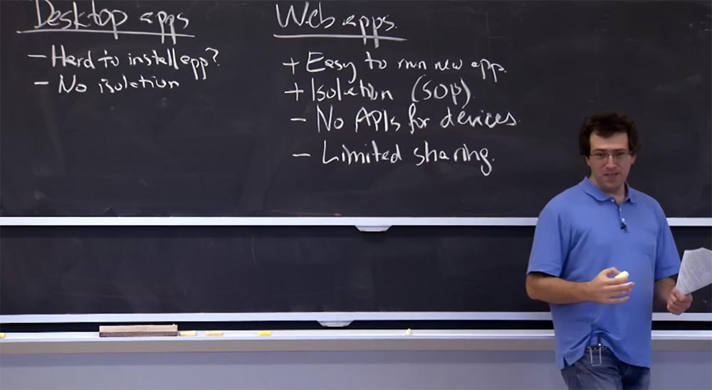
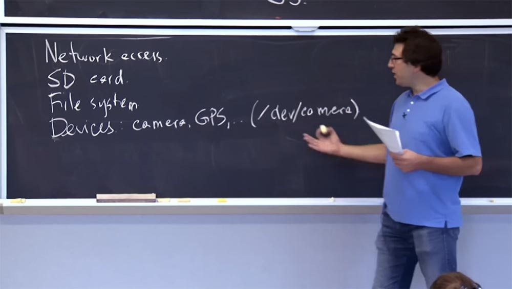
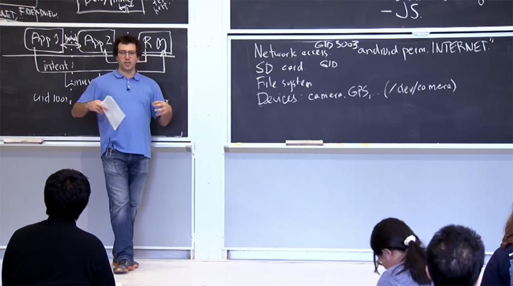
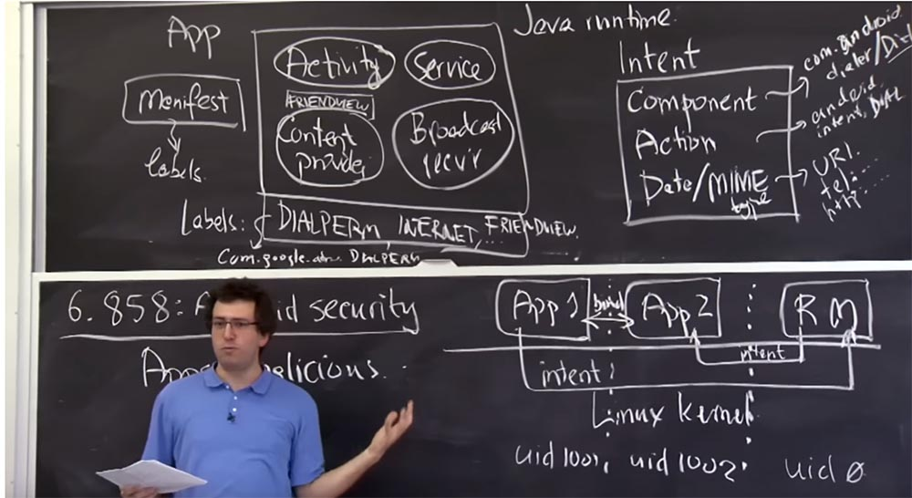

Курс MIT «Безопасность компьютерных систем». Лекция 20: «Безопасность мобильных телефонов», часть 2 / Блог компании ua-hosting.company

### Массачусетский Технологический институт. Курс лекций #6.858. «Безопасность компьютерных систем». Николай Зельдович, Джеймс Микенс. 2014 год

Computer Systems Security — это курс о разработке и внедрении защищенных компьютерных систем. Лекции охватывают модели угроз, атаки, которые ставят под угрозу безопасность, и методы обеспечения безопасности на основе последних научных работ. Темы включают в себя безопасность операционной системы (ОС), возможности, управление потоками информации, языковую безопасность, сетевые протоколы, аппаратную защиту и безопасность в веб-приложениях.

Лекция 1: «Вступление: модели угроз» [Часть 1](https://habr.com/company/ua-hosting/blog/354874/) / [Часть 2](https://habr.com/company/ua-hosting/blog/354894/) / [Часть 3](https://habr.com/company/ua-hosting/blog/354896/)  
Лекция 2: «Контроль хакерских атак» [Часть 1](https://habr.com/company/ua-hosting/blog/414505/) / [Часть 2](https://habr.com/company/ua-hosting/blog/416047/) / [Часть 3](https://habr.com/company/ua-hosting/blog/416727/)  
Лекция 3: «Переполнение буфера: эксплойты и защита» [Часть 1](https://habr.com/company/ua-hosting/blog/416839/) / [Часть 2](https://habr.com/company/ua-hosting/blog/418093/) / [Часть 3](https://habr.com/company/ua-hosting/blog/418099/)  
Лекция 4: «Разделение привилегий» [Часть 1](https://habr.com/company/ua-hosting/blog/418195/) / [Часть 2](https://habr.com/company/ua-hosting/blog/418197/) / [Часть 3](https://habr.com/company/ua-hosting/blog/418211/)  
Лекция 5: «Откуда берутся ошибки систем безопасности» [Часть 1](https://habr.com/company/ua-hosting/blog/418213/) / [Часть 2](https://habr.com/company/ua-hosting/blog/418215/)  
Лекция 6: «Возможности» [Часть 1](https://habr.com/company/ua-hosting/blog/418217/) / [Часть 2](https://habr.com/company/ua-hosting/blog/418219/) / [Часть 3](https://habr.com/company/ua-hosting/blog/418221/)  
Лекция 7: «Песочница Native Client» [Часть 1](https://habr.com/company/ua-hosting/blog/418223/) / [Часть 2](https://habr.com/company/ua-hosting/blog/418225/) / [Часть 3](https://habr.com/company/ua-hosting/blog/418227/)  
Лекция 8: «Модель сетевой безопасности» [Часть 1](https://habr.com/company/ua-hosting/blog/418229/) / [Часть 2](https://habr.com/company/ua-hosting/blog/423155/) / [Часть 3](https://habr.com/company/ua-hosting/blog/423423/)  
Лекция 9: «Безопасность Web-приложений» [Часть 1](https://habr.com/company/ua-hosting/blog/424289/) / [Часть 2](https://habr.com/company/ua-hosting/blog/424295/) / [Часть 3](https://habr.com/company/ua-hosting/blog/424297/)  
Лекция 10: «Символьное выполнение» [Часть 1](https://habr.com/company/ua-hosting/blog/425557/) / [Часть 2](https://habr.com/company/ua-hosting/blog/425561/) / [Часть 3](https://habr.com/company/ua-hosting/blog/425559/)  
Лекция 11: «Язык программирования Ur/Web» [Часть 1](https://habr.com/company/ua-hosting/blog/425997/) / [Часть 2](https://habr.com/company/ua-hosting/blog/425999/) / [Часть 3](https://habr.com/company/ua-hosting/blog/426001/)  
Лекция 12: «Сетевая безопасность» [Часть 1](https://habr.com/company/ua-hosting/blog/426325/) / [Часть 2](https://habr.com/company/ua-hosting/blog/427087/) / [Часть 3](https://habr.com/company/ua-hosting/blog/427093/)  
Лекция 13: «Сетевые протоколы» [Часть 1](https://habr.com/company/ua-hosting/blog/427763/) / [Часть 2](https://habr.com/company/ua-hosting/blog/427771/) / [Часть 3](https://habr.com/company/ua-hosting/blog/427779/)  
Лекция 14: «SSL и HTTPS» [Часть 1](https://habr.com/company/ua-hosting/blog/427783/) / [Часть 2](https://habr.com/company/ua-hosting/blog/427785/) / [Часть 3](https://habr.com/company/ua-hosting/blog/427787/)  
Лекция 15: «Медицинское программное обеспечение» [Часть 1](https://habr.com/company/ua-hosting/blog/428652/) / [Часть 2](https://habr.com/company/ua-hosting/blog/428654/) / [Часть 3](https://habr.com/company/ua-hosting/blog/428656/)  
Лекция 16: «Атаки через побочный канал» [Часть 1](https://habr.com/company/ua-hosting/blog/429390/) / [Часть 2](https://habr.com/company/ua-hosting/blog/429392/) / [Часть 3](https://habr.com/company/ua-hosting/blog/429394/)  
Лекция 17: «Аутентификация пользователя» [Часть 1](https://habr.com/company/ua-hosting/blog/429680/) / [Часть 2](https://habr.com/company/ua-hosting/blog/429682/) / [Часть 3](https://habr.com/company/ua-hosting/blog/429686/)  
Лекция 18: «Частный просмотр интернета» [Часть 1](https://habr.com/company/ua-hosting/blog/430204/) / [Часть 2](https://habr.com/company/ua-hosting/blog/430206/) / [Часть 3](https://habr.com/company/ua-hosting/blog/430208/)  
Лекция 19: «Анонимные сети» [Часть 1](https://habr.com/company/ua-hosting/blog/431262/) / [Часть 2](https://habr.com/company/ua-hosting/blog/431264/) / [Часть 3](https://habr.com/company/ua-hosting/blog/431266/)  
Лекция 20: «Безопасность мобильных телефонов» [Часть 1](https://habr.com/company/ua-hosting/blog/432616/) / [Часть 2](https://habr.com/company/ua-hosting/blog/432618/) / [Часть 3](https://habr.com/company/ua-hosting/blog/432620/)

Прежде чем начать подробное рассмотрение системы, давайте попробуем выяснить одну интересную вещь.Зачем эти ребята разработали совершенно новый модульный дизайн для приложений Android? Есть же десктопные приложения, есть веб-приложения, зачем им понадобилось изобретать совершенно новый способ написания программного обеспечение? Ведь в некотором смысле это сбивает с толку разработчика. Потому что, скажем, я привык писать свою небольшую программу на языке С с главной функцией, и вот я смотрю на это и говорю: «какого черта? Что я буду со всем этим делать? Я должен определить четыре вида компонентов и отправить намерения, вместо того, чтобы использовать С-структуры и записать код обычными строчками»?

Итак, каковы плюсы и минусы существующих моделей приложений? У нас есть десктопные и интернет-приложения, зачем нам нужен третий тип приложений?  
**Студент:** но ведь модель полностью изменилась, не так ли? Я думаю, что вы не должны настолько доверять разработчикам десктопных приложений, как разработчикам приложений для мобильных устройств. К тому же у вас больше опытных пользователей в сравнении с количество опытных пользователей компьютерных приложений, и они хотят пользоваться целой кучей изолированных друг от друга приложений.

**Профессор:** вполне возможно. Итак, вы думаете, что в случае десктопных приложений нам не стоит слишком доверять их разработчикам?

**Студент:** конечно, ведь всегда имеется более опытный сын или кузен, который поможет решить вам проблемы с компьютерными программами, но с телефоном дела обстоят иначе.

**Профессор:** это, конечно, круто, что телефоны не нуждаются в кузене, который бы о них позаботился. Но с точки зрения безопасности, программы для компьютера обладают одним характерным свойством – установка нового приложения на компьютер может быть довольно трудоёмким процессом. Может быть, это не совсем верно, потому что всегда можно щёлкнуть по исполняемому файлу и запустить установку, но я не думаю, что люди регулярно устанавливают десктопные приложения. Ведь, как правило, у вас есть фиксированный набор программного обеспечения, который вы запускаете.

В этом смысле отличительной чертой веб-приложений является их лёгкий запуск. Вы просто заходите на сайт, и вам ничего не нужно делать, кроме как щелкнуть ссылку, и вот вы уже на каком-то новом сайте под управлением какого-то нового приложения. Так что это довольно хорошее свойство веб-приложения.

Плохой чертой компьютерных приложений является отсутствие изоляции приложения. Возможно, это определённым образом связано с тем, что при установке такого приложения вы полностью доверяете ему всё, что имеется на вашем компьютере. Фактически нет никакой изоляции между приложением, которое вы устанавливаете на свой ноутбук, и любой другой программой или данными, которые там уже имеются, в то время как в случае с веб-приложением существует некоторая разумная изоляция. До тех пор, пока вы будете доверять политике общего происхождения Same Origin Policy, вы в безопасности. Поэтому достаточно безопасно перейти на какой-то произвольный веб-сайт и начать пользоваться его приложением. Если это приложение не пользуется уязвимостями вашего браузера, то оно не станет вмешиваться в работу сайтов, открытых в других вкладках браузера.

Похоже, что до сих пор веб-приложения находятся в более выигрышном положении, так как легки в использовании и изолированы. Почему же эти ребята не используют веб-приложения для Android?

**Студент:** веб-приложения как бы содержат внутри себя операционную систему, то есть например существует ОС Firefox, которая по существу является мобильной Интернет-ОС.

**Профессор:** точно. Вы утверждаете, что на самом деле эти ребята ошибаются. Они не должны были создавать новую ОС Android, а просто сделать гигантский веб-браузер для вашего телефона.

**Студент:** по крайней мере, Mozilla показала, что это возможно.

**Профессор:** что же, это довольно справедливо. По крайней мере, разумнее идти по пути создания веб-приложений, чем десктопных систем, по крайней мере для телефона.

**Студент:** так как вы совершаете телефонный звонок из веб-приложения, вам нужно создать совершенно новый API для связи интерфейса веб-приложения с телефоном.

**Профессор:** точно. Таким образом, у веб-приложений есть одно ограничение, которое может быть исправлено, это отсутствие API интерфейса для некоторых мобильных устройств. Но таких приложений становится все меньше. Например, для фотоаппарата или для GPS – навигатора они медленно, но всё же добавляют соответствующий интерфейс в веб-приложения. Но там, в веб-приложениях, вероятно, пока что нет интерфейса API для совершения звонков, отправки СМС-сообщений и тому подобного.

Еще одно неудобство веб-приложений — это невозможность установить ограниченный доступ к другим приложениям. Мы говорили о неявных намерениях в Android, где вы могли бы просто сказать: «я хочу посмотреть это изображение JPEG, но кто знает, какое приложение его откроет? Или я хочу просмотреть этот PDF-файл, или поделиться с другом по электронной почте этой фотографией, которую только что сделал своей камерой, но я не знаю, какое приложение электронной почты будет использовано». Поэтому давайте просто попросим монитор ссылок найти мне какую-нибудь почтовую программу, которая собирается отправить это фото. В устройстве под управлением Android это легко сделать, но в случае с веб-приложениями вызовет большие трудности, так как при каждом взаимодействии вы должны ссылаться на определенный URL.

Так что если вы не знаете, какой просмотрщик PDF кто-то использует, то вы не будете знать, какой URL можно использовать, чтобы просмотреть ваш файл.

**Студент:** наверное, недостатком веб-приложений можно считать то, что JavaScript очень трудно читать?

**Профессор:** да, это так, ещё одно неудобство – это то, что все они написаны на JavaScript. Так что потенциально это может быть не очень хорошо с точки зрения производительности, может быть трудным для понимания того, что делает программа, может представлять трудности для эффективного компилирования и так далее.

Вернёмся к программам для компьютера. Полезным свойством десктопных приложений является возможность обмена файлами. Все ваши файлы доступны в каждом приложении, потому что вы просто ими делитесь. Таким образом, у вас имеется легкий доступ к любым данным, имеющимся на компьютере.

То, что немного сложно реализовать в Android, легко сделать в компьютерных приложениях. В случае десктопных ОС, если я хочу скомпилировать кусок программного обеспечения, я запущу MAKE, запущу GCC и, возможно, какие-то другие программы, и все они будут работать над одним и тем же исходным С кодом в одном каталоге. Это намного сложнее сделать в Android, где данные связаны с основным приложением, которое хранится у контент-провайдера. Так что придётся повозиться, сначала используя хранилище исходного кода, а потом устанавливая компилятор C, программу MAKE, ассемблер и прочее. Намного сложнее сделать так, чтобы они работали все вместе.

Это можно сделать, обойдя некоторые ограничения Android, но в любом случае сложнее, чем в десктопных системах.

**Студент:** я думаю, что оптимизировать веб-приложения довольно сложно, они ограниченны использованием RAM и мощностью процессорной обработки.

**Профессор:** да, принципы оптимизации веб-приложений и десктопных приложений отличаются. Я считаю, что недостатком веб-приложений, по крайней мере, в то время, когда проектировали Android, являлось то, что запустить веб-приложение в автономном режиме было очень трудно. Если ваш телефон ловит слабый сигнал сети, то некоторые приложения будет трудно запустить, особенно если какие-то их части «выпали» из кеша. Однако я думаю, как вы заметили, веб-приложения, хотя и медленно, но «догоняют» Android путём ликвидации существующих на сегодня ограничений. Так что вполне возможно, что веб-приложения послужат разумной моделью для запуска новой операционной платформы телефона. Но пять лет назад они были для этого недостаточны хороши.

Но даже несмотря на существующие недостатки, в настоящее время будет намного проще «протолкнуть» веб-приложения в нишу, занимаемую Android, а не начинать разработку новой мобильной ОС с нуля. Поэтому я думаю, что мы все еще можем говорить об успехах того, что сделал Android, хотя, возможно, сегодня вы предпочли бы не делать этого подобным образом.  
Я думаю, что с точки зрения изоляции, безопасность системы Android значительно выше. Как я уже упоминал, Android полагается на ядро Linux, чтобы изолировать приложения друг от друга. Платформа Android фактически устанавливает идентификаторы пользователей user ID, так что это приложение App1 будет иметь UID 1001, App 2 будет иметь UID 1002, а монитор ссылок, который обычно обладает root-правами, имеет UID 0. Так что ядро Linux в значительной степени отвечает за обособленность приложений друг от друга.

В основном взаимодействие между идентификаторами пользователей происходит через намерения Intent. Имеется ещё много нюансов, каким образом ядро Linux управляет работой приложений с помощью UID, мы поговорим об этом немного позже.

Один интересный вопрос: почему эти ребята выбрали Java? Какова роль Java в «Андроиде»? Зачем она вообще нужна? Если мы вместо Java напишем все приложения на C, или, например, Ассемблере, что-нибудь может сломаться?

**Студент:** если у вас есть уязвимости, то использование этих языков может привести к искажению важных для системы показателей.

**Профессор:** да, такое может случиться, например, в приложении может возникнуть переполнение буфера. Что ещё?

**Студент:** может произойти путаница с разрешениями.

**Профессор:** с какими разрешениями?

**Студент:** с такими, как время ожидания, латентность.

**Профессор:** давайте рассмотрим это подробнее. Итак, как мы говорили, монитор ссылок проверяет для нас метки и фактически хранит в системе «Андроид» список всех установленных приложений вместе с метками, которые соответствуют всем этим приложениям. Так что, вероятно, вы не захотите, чтобы монитор ссылок совершал ошибки независимо от того, на каком языке он написан. Так что наличие монитора ссылок, написанного на типобезопасном языке – хорошее решение. Мне нравится Java, потому что это типобезопасный язык, обладающий хорошими свойствами. Но даже если бы приложение было написано на C и в нём бы возникло переполнение буфера, это всё равно не смогло бы повредить метки, находящиеся в мониторе ссылок. Так что это не было бы большой проблемой.

**Студент:** возможно, существует какая-то система, которая может повредить сам код, написанный на C?

**Профессор:** да, поэтому, в принципе, было бы неплохо избежать приложений, говорящих непосредственно с ядром Linux. В Android это не так. Приложения Android могут делать произвольные системные вызовы, если захотят. На самом деле из соображений производительности приложения не могут затрагивать произвольные компоненты, написанные на языке C или Assembler, поэтому некоторые игры «разговаривают» на Java.

**Студент:** я думаю, что в некотором роде это возможность использовать весь материал, написанный для Java, то есть создатели «Андроид» хотели упростить создание приложений для разработчиков. И один из простых способов сделать это — создать возможность пользоваться преимуществами объёмистых библиотек Java.

**Профессор:** вполне возможно. Я думаю, что одна из главных причин применения Java – это удобство использования. Вероятно, их больше заботили программирование и простота разработки, так как Java имеет мало общего с безопасностью.

Еще одна вещь, которая имеет здесь место, в отличие от iPnone. Операционная система «Айфонов» тоже обладает легкостью разработки, но использует C, и если постараться, то в ней можно вызвать переполнение буфера. Кроме того, существует специфика для конкретного оборудования, поэтому у всех не может быть одинаковых библиотек. Я думаю, что основная причина, по которой разработчики Android выбрали Java, объясняется тем, что они изначально не знали характеристик устройств, на которых эта ОС будет работать. Например, создатели iPhone точно знали, что у них в телефоне будет процессор ARM, поэтому заранее произвели компиляцию ПО именно с этой моделью. И такой подход более эффективен, потому что расход батареи имеет для телефона большое значение.

То, что ребята из Android используют Java, вероятно, менее эффективно с точки зрения энергосбережения или производительности процессора, потому что связано с JRE и так далее. Но зато здесь есть преимущество портирования ОС на устройства с различной архитектурой. Поэтому, если у вас есть телефоны с процессорами MIPS, ARM или x86, приложение Java может быть запущено на всех трех устройствах. Разработчики «Андроид» хотели, чтобы их платформу можно было использовать на любом виде оборудования или телефона. Так что, вероятно, в этом состоит главная причина, почему они пожертвовали безопасностью в угоду применения Java.

Получается, что среда выполнения Java не предоставляет каких-то особых преимуществ безопасности для приложений, это просто удобная вещь для разработчиков и пользователей. Но с точки зрения изоляции, здесь в основном всё зависит от ядра и монитора ссылок, управляющего работой приложений.

**Студент:** разве простота разработки не приводит к некоторой безопасности приложений? Ведь при написании монитора ссылок на C существует намного больше способов сделать ошибки.

**Профессор:** да, вы абсолютно правы! На самом деле, я не должен был говорить, что легкость разработки не имеет ничего общего с безопасностью. Это совершенно глупо, потому что вы хотите сделать это с такой же легкостью, как написать правильный код. Так что в некотором смысле, система, для которой легко можно написать правильный код, сама по себе обеспечивает большую безопасность. В каком-то смысле вы правы, предполагая, что разработчики «Андроид» хотели избежать ошибок при написании кода, поэтому не захотели писать его на сложном языке С. И я не знаю, почему Apple выбрали C в качестве языка программирования при разработке своей ОС.

Потому что такой выбор создаёт проблему переполнения буфера в приложении, и если это приложение имеет большое значение, то оно потенциально уязвимо. Не в отношении компрометации других приложений, но вы ведь всё равно не захотите, чтобы ваше банковское приложение было написано на C.

**Студент:** монитор ссылок написан на Java или на C?

**Профессор:** в Android монитор ссылок в основном написан на Java. Однако в нём имеются некоторые «зацепки», для того, чтобы общаться с внешними интерфейсами и приложениями, использующими native code. Но большая часть логики написана на Java. Так это на самом деле это достаточно безопасный план.

А теперь попробуем выяснить, для чего ещё используются UID приложений, кроме как для обособления приложений друг от друга с точки зрения инициируемых ими процессов. Главной причиной использования UID является создание возможности делиться доступом к общим ресурсам и обмениваться данными в системе.

Мы уже видели один механизм для этого – это отправка намерений монитору ссылок. Но в Android есть куча вещей, которые не выполняются через намерения монитора ссылок. Вероятно, не всё отправляется через Intent по соображениям производительности. Вы не хотите вызывать монитор ссылок для каждой операции, которую вы делаете в системе, в первую очередь это касается доступа к интернету. Если вы хотите выйти в интернет в устройстве под управлением «Андроид», то просто открываете сокет, точно также, как в любом стандартном приложении Linux. Приложение может просто попросить ядро: «мне нужен сокет, потому что я хочу подключиться к этой машине», вот каким образом осуществляется доступ к сети Интернет.

Далее следует отметить доступ к съемным носителям. Если в вашем телефоне есть SD-карта, связь с ней также осуществляется напрямую через ядро. Вообще, любой вид доступа к файловой системе, или, по крайней мере, прямой доступ к файловой системе осуществляется непосредственно через ядро, потому что там уже есть файловая система. Так сделано, чтобы избежать накладных расходов производительности. Кроме того, как и в большинстве аппаратных устройств, Android позволяет приложению напрямую общаться с устройством вместо передачи доступа через монитор ссылок. Это касается таких вещей, как фотокамера, GPS-навигатор, компас и так далее.

Это «железо» просто появляется в Android, как в Linux, в виде /dev/camera. Это просто устройство Linux, которое вы можете открыть, чтобы получить данные с камеры или управлять камерой любым способом, и так далее. Круто то, что если вы хотите сделать с этим устройством что-то особенное, вы не ограничены тем, что позволяет вам делать Java. Вы всегда можете написать код на C или даже на Assembler, который будет напрямую общаться с ядром и выполнять необходимые операции на этом устройстве Linux, делая произвольные системные вызовы. И вы можете облечь это в собственный Java интерфейс, чтобы удобно представить остальные Java-приложения.

**Студент:** но мы ведь всё равно выполняем проверку этих системных вызовов, потому что когда вы открываете сокет, кто-то же должен проверить, разрешено ли этим приложениям открывать сокет?

**Профессор:** да, так что это интересная вещь! Ведь теперь эти операции находятся за пределами нашей модели, основанной на намерениях. Так как мы будем их защищать? Этот вид взаимодействий сводится к тому, что вы делали в лабораторной работе №2, вводя в систему ID пользователей. Среда выполнения Android отвечает за тщательную организацию UID и GID приложений в соответствии с политикой, указанной в соответствующих метках. Для каждого из этих ресурсов существует предопределенная строка метки, определяющая права доступа к этому ресурсу. Так что для доступа к сети, я думаю, есть строка, содержащая что-то вроде «android.permission.internet», и это та метка, которую может запросить приложение.

И если приложение имеет эту метку в своем наборе привилегий, то оно должно иметь доступ к сети. Метка содержит политику того, как исполняется эта привилегия, то есть указывает, что в результате должно произойти. И механизм исполнения — это небольшое изменение в ядре Linux для в Android. Здесь для того, чтобы сделать какие-либо сетевые системные вызовы, вы должны быть членом какой-то магической группы, то есть не как, как традиционно работают в Linux. В Android существует некая магическая группа с идентификатором GID 3003, и этот номер жёстко закодирован в ядре. Если процесс имеет этот идентификатор группы в своем списке групп, то ему разрешено использовать системный вызов, связанный с сетью. И если нет, то ему не разрешено делать какие-либо сетевые системные вызовы. Вот как Android умеет переводить эти метки во что-то вроде поддержки системной политики, применяя их различным образом. Иногда исполнение инициируется монитором ссылок, иногда оно происходит принудительно путём установки идентификаторов групп GID или пользователей UID соответствующим образом.

То же самое происходит и с SD-картами. Есть еще один GID, который соответствует доступу к SD-карте, и есть соответствующая строка, которая ему соответствует. То же самое происходит с доступом к файловой системе, но только немного сложнее. Я предполагаю, что SD-карта находится в файловой системе и имеет определенный GID для доступа ко всей SD-карте.  
В файловой системе телефона существует ещё один вид файлов, в отношении которых соблюдение политики безопасности контролируется не метками, а самим дизайном Android.

Это заключается в том, что каждое приложение имеет личный каталог, который оно использует для хранения любых файлов, которые только захочет. В частности, SQL база данных контент-провайдера, которую вы собираетесь использовать в качестве приложения, хранится в вашем личном каталоге. В отношении него действует такая политика — только UID этого приложения, и никто другой, может получить доступ к данному каталогу.

Таким образом, для устройств внутри телефона существует механизм, очень похожий на доступ к сети, в котором имеется строка разрешения для доступа к модулю GPS, камере и так далее. И для каждого из них есть GID, используемый в разрешениях на этом устройстве. Так, например, dev/camera принадлежит какому-то магическому GID, и любое приложение, которое должно иметь доступ к этой камере, использует этот GID при необходимости.

Надеюсь, это было похоже на то, что вы делали в лабораторной работе №2, не в смысле меток, а в смысле использования UID и GID для того, чтобы добраться к какому-то приложению.

Еще один интересный вопрос заключается в том, почему разработчики системы придумали именно такой способ управления SD-картой? Почему у них нет разных приложений, взаимодействующих с разными частями SD-карты? Вероятно, на моей SD-карте есть много разных вещей, и я не хочу, чтобы приложения имели к ним доступ. Что вы думаете по этому поводу?

**Студент:** возможно, это связано с тем, что пользователь должен утвердить разрешения для приложений, и чем их меньше, тем менее вероятно вмешательство приложений в управление картой памяти.

**Профессор:** вполне может быть. Определенно, это проблема Android в целом, и мы доберемся до нее через минуту. Но я думаю, что в отношении SD-карты существует немного другая проблема. Это связано с тем, что вы хотите, чтобы SD-карты взаимодействовали с остальным миром. Это похоже на одно из мест, где Android не способен принимать произвольные решения, потому что вы хотите, чтобы карты памяти имели стандартную файловую систему, а именно FAT, потому что де-факто это современный стандарт для хранения данных данные на карте памяти. В результате этого у вас не может быть сложной файловой системы, в которой хранятся разрешения для каждого файла, так что будет трудно каким-то образом разделить эти файлы и дать различным приложениям разный доступ.

**Студент:** что, если каждому приложению дать разный доступ к директориям карты?

**Профессор:** возможно, что вы могли бы дать каждому приложению другой подкаталог на карте памяти и открыть к нему доступ. Но фактически это будет означать предоставление каждому приложению отдельного хранилища на карте, чтобы лишить его возможности прочитать всё содержимое карты, потому что оно может содержаться в другом каталоге. Конечно, может существовать приложение, которому вы захотите дать доступ ко всей карте или к нескольким каталогам, но не думаю, что у вас будет слишком много вариантов разрешений. Так что вы правы, можно было бы использовать комбинацию из обоих способов доступа.

Интересно обсудить следующий вопрос — как мы решаем, каким набором меток должно обладать приложение, чтобы получить доступ к конкретным вещам? Например, кто решает, что это приложение должно иметь набор меток DIALPERM, INTERNET, FRIENDVIEW?

**Студент:** вероятно, разработчик определяет это в манифесте, чтобы этого не делал пользователь?

**Профессор:** да, это в некотором роде авансовая система, в которой разработчик прежде всего перечисляет все вещи, которые он планирует использовать в будущем для обеспечения работы своих приложений. И тогда пользователь несет ответственность за просмотр этого списка и принятие решения о том, все ли в порядке, должен ли он позволить установку этих приложений или нет. Благодаря этому пользователь является важной частью системы с точки зрения безопасности, потому что почти всегда может одобрить или отклонить любые разрешения. Во многих отношениях Android более гибкий, чем iOS, где приложениям, разработанным для iPhone третьей стороной, трудно получить доступ к другим компонентам телефона, набору номера, отправке SMS-сообщений, средствам просмотра JPEG и т. д.

Цена такой гибкости – это то, что вы должны заставить пользователя проверить, что разработчик запрашивает разумный набор разрешений или что пользователь доверяет этому разработчику иметь такие привилегии. Так что это немного печально. Вероятно, одна из самых больших проблем безопасности Android состоит в том, что пользователи готовы выдать эти разрешения, если они действительно хотят установить данное приложение. Например, я нашёл какое-то приложение и нажимаю кнопку «Установить», и если разрешения для этого приложения представляют собой длинный список, и нет ничего тревожного, что сразу выскакивает на экране, скорее всего, я просто нажму OK. Я могу не тратить время на то, чтобы понять, для чего действительно необходимы эти разрешения.

Другая неприятность заключается в том, что в то время, когда эта была написана обсуждаемая нами статья, разработчики Android решили, что у пользователя должно быть только два варианта — либо установить приложение, либо не устанавливать. При этом, если пользователю действительно нужно это приложение, он его установит, не смотря ни на что. Поздние версии Android, начиная с 4.3, ввели более детальную схему установки приложений, которая позволяет пользователю выбирать разрешения из списка разрешений, которые разработчик хотел бы иметь для своего приложения. Таким образом, пользователь получил возможность удалять некоторые из этих разрешений из приложения. Остаётся неясным, как обычный пользователь должен этим пользоваться, потому что довольно сложно изучить весь список и принять решение, что разрешать, а что нет. Но, по крайней мере, там начинает появляться API, хотя до сих пор я не видел, чтобы им широко пользовались.

55:10

[Курс MIT «Безопасность компьютерных систем». Лекция 20: «Безопасность мобильных телефонов», часть 3](https://habr.com/company/ua-hosting/blog/432620/)

Полная версия курса доступна [здесь](https://ocw.mit.edu/courses/electrical-engineering-and-computer-science/6-858-computer-systems-security-fall-2014/).

Спасибо, что остаётесь с нами. Вам нравятся наши статьи? Хотите видеть больше интересных материалов? Поддержите нас оформив заказ или порекомендовав знакомым, **30% скидка для пользователей Хабра на уникальный аналог entry-level серверов, который был придуман нами для Вас:** [Вся правда о VPS (KVM) E5-2650 v4 (6 Cores) 10GB DDR4 240GB SSD 1Gbps от $20 или как правильно делить сервер?](https://habr.com/company/ua-hosting/blog/347386/) (доступны варианты с RAID1 и RAID10, до 24 ядер и до 40GB DDR4).

**VPS (KVM) E5-2650 v4 (6 Cores) 10GB DDR4 240GB SSD 1Gbps до января бесплатно** при оплате на срок от полугода, заказать можно [тут](https://ua-hosting.company/vpsnl).

**Dell R730xd в 2 раза дешевле?** Только у нас **[2 х Intel Dodeca-Core Xeon E5-2650v4 128GB DDR4 6x480GB SSD 1Gbps 100 ТВ от $249](https://ua-hosting.company/serversnl) в Нидерландах и США!** Читайте о том [Как построить инфраструктуру корп. класса c применением серверов Dell R730xd Е5-2650 v4 стоимостью 9000 евро за копейки?](https://habr.com/company/ua-hosting/blog/329618/)