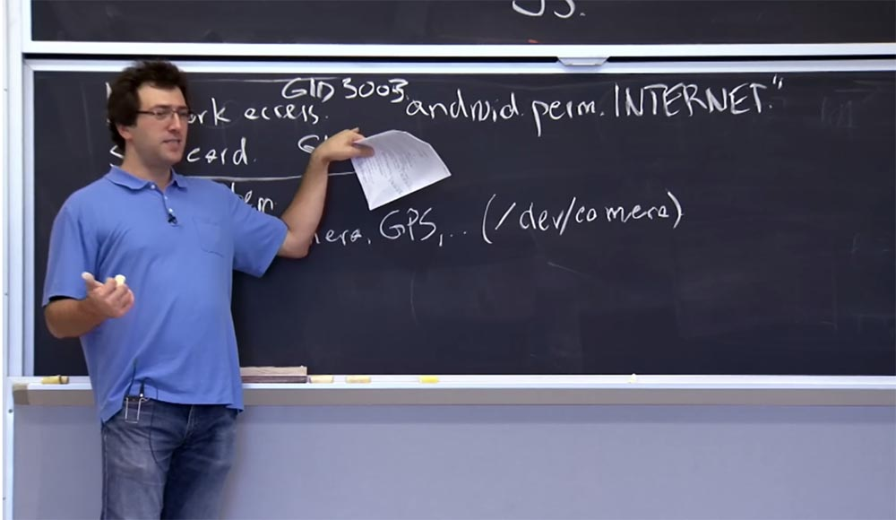
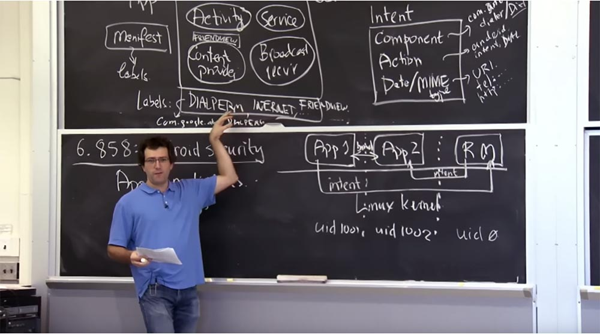
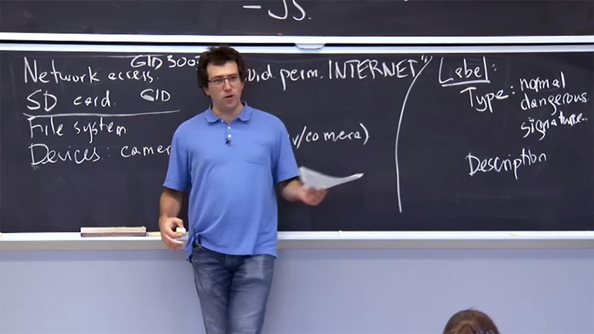
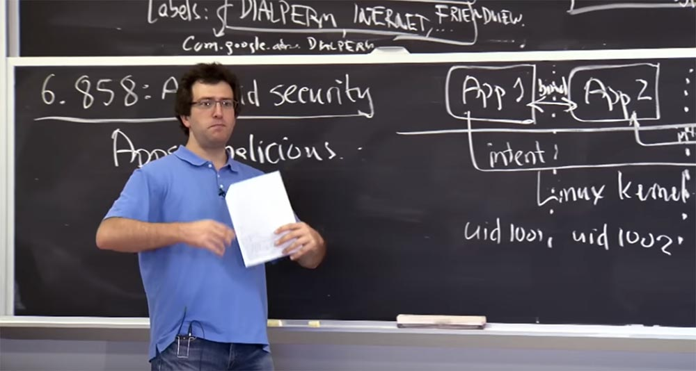
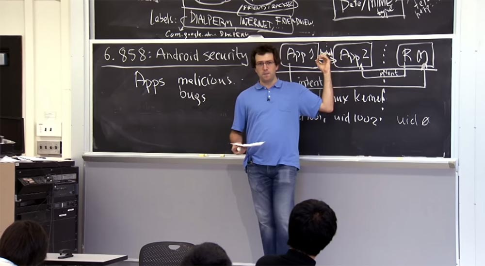

Курс MIT «Безопасность компьютерных систем». Лекция 20: «Безопасность мобильных телефонов», часть 3 / Блог компании ua-hosting.company

### Массачусетский Технологический институт. Курс лекций #6.858. «Безопасность компьютерных систем». Николай Зельдович, Джеймс Микенс. 2014 год

Computer Systems Security — это курс о разработке и внедрении защищенных компьютерных систем. Лекции охватывают модели угроз, атаки, которые ставят под угрозу безопасность, и методы обеспечения безопасности на основе последних научных работ. Темы включают в себя безопасность операционной системы (ОС), возможности, управление потоками информации, языковую безопасность, сетевые протоколы, аппаратную защиту и безопасность в веб-приложениях.

Лекция 1: «Вступление: модели угроз» [Часть 1](https://habr.com/company/ua-hosting/blog/354874/) / [Часть 2](https://habr.com/company/ua-hosting/blog/354894/) / [Часть 3](https://habr.com/company/ua-hosting/blog/354896/)  
Лекция 2: «Контроль хакерских атак» [Часть 1](https://habr.com/company/ua-hosting/blog/414505/) / [Часть 2](https://habr.com/company/ua-hosting/blog/416047/) / [Часть 3](https://habr.com/company/ua-hosting/blog/416727/)  
Лекция 3: «Переполнение буфера: эксплойты и защита» [Часть 1](https://habr.com/company/ua-hosting/blog/416839/) / [Часть 2](https://habr.com/company/ua-hosting/blog/418093/) / [Часть 3](https://habr.com/company/ua-hosting/blog/418099/)  
Лекция 4: «Разделение привилегий» [Часть 1](https://habr.com/company/ua-hosting/blog/418195/) / [Часть 2](https://habr.com/company/ua-hosting/blog/418197/) / [Часть 3](https://habr.com/company/ua-hosting/blog/418211/)  
Лекция 5: «Откуда берутся ошибки систем безопасности» [Часть 1](https://habr.com/company/ua-hosting/blog/418213/) / [Часть 2](https://habr.com/company/ua-hosting/blog/418215/)  
Лекция 6: «Возможности» [Часть 1](https://habr.com/company/ua-hosting/blog/418217/) / [Часть 2](https://habr.com/company/ua-hosting/blog/418219/) / [Часть 3](https://habr.com/company/ua-hosting/blog/418221/)  
Лекция 7: «Песочница Native Client» [Часть 1](https://habr.com/company/ua-hosting/blog/418223/) / [Часть 2](https://habr.com/company/ua-hosting/blog/418225/) / [Часть 3](https://habr.com/company/ua-hosting/blog/418227/)  
Лекция 8: «Модель сетевой безопасности» [Часть 1](https://habr.com/company/ua-hosting/blog/418229/) / [Часть 2](https://habr.com/company/ua-hosting/blog/423155/) / [Часть 3](https://habr.com/company/ua-hosting/blog/423423/)  
Лекция 9: «Безопасность Web-приложений» [Часть 1](https://habr.com/company/ua-hosting/blog/424289/) / [Часть 2](https://habr.com/company/ua-hosting/blog/424295/) / [Часть 3](https://habr.com/company/ua-hosting/blog/424297/)  
Лекция 10: «Символьное выполнение» [Часть 1](https://habr.com/company/ua-hosting/blog/425557/) / [Часть 2](https://habr.com/company/ua-hosting/blog/425561/) / [Часть 3](https://habr.com/company/ua-hosting/blog/425559/)  
Лекция 11: «Язык программирования Ur/Web» [Часть 1](https://habr.com/company/ua-hosting/blog/425997/) / [Часть 2](https://habr.com/company/ua-hosting/blog/425999/) / [Часть 3](https://habr.com/company/ua-hosting/blog/426001/)  
Лекция 12: «Сетевая безопасность» [Часть 1](https://habr.com/company/ua-hosting/blog/426325/) / [Часть 2](https://habr.com/company/ua-hosting/blog/427087/) / [Часть 3](https://habr.com/company/ua-hosting/blog/427093/)  
Лекция 13: «Сетевые протоколы» [Часть 1](https://habr.com/company/ua-hosting/blog/427763/) / [Часть 2](https://habr.com/company/ua-hosting/blog/427771/) / [Часть 3](https://habr.com/company/ua-hosting/blog/427779/)  
Лекция 14: «SSL и HTTPS» [Часть 1](https://habr.com/company/ua-hosting/blog/427783/) / [Часть 2](https://habr.com/company/ua-hosting/blog/427785/) / [Часть 3](https://habr.com/company/ua-hosting/blog/427787/)  
Лекция 15: «Медицинское программное обеспечение» [Часть 1](https://habr.com/company/ua-hosting/blog/428652/) / [Часть 2](https://habr.com/company/ua-hosting/blog/428654/) / [Часть 3](https://habr.com/company/ua-hosting/blog/428656/)  
Лекция 16: «Атаки через побочный канал» [Часть 1](https://habr.com/company/ua-hosting/blog/429390/) / [Часть 2](https://habr.com/company/ua-hosting/blog/429392/) / [Часть 3](https://habr.com/company/ua-hosting/blog/429394/)  
Лекция 17: «Аутентификация пользователя» [Часть 1](https://habr.com/company/ua-hosting/blog/429680/) / [Часть 2](https://habr.com/company/ua-hosting/blog/429682/) / [Часть 3](https://habr.com/company/ua-hosting/blog/429686/)  
Лекция 18: «Частный просмотр интернета» [Часть 1](https://habr.com/company/ua-hosting/blog/430204/) / [Часть 2](https://habr.com/company/ua-hosting/blog/430206/) / [Часть 3](https://habr.com/company/ua-hosting/blog/430208/)  
Лекция 19: «Анонимные сети» [Часть 1](https://habr.com/company/ua-hosting/blog/431262/) / [Часть 2](https://habr.com/company/ua-hosting/blog/431264/) / [Часть 3](https://habr.com/company/ua-hosting/blog/431266/)  
Лекция 20: «Безопасность мобильных телефонов» [Часть 1](https://habr.com/company/ua-hosting/blog/432616/) / [Часть 2](https://habr.com/company/ua-hosting/blog/432618/) / [Часть 3](https://habr.com/company/ua-hosting/blog/432620/)

**Студент:** сейчас во многих приложениях отсутствует возможность удалять разрешения.

**Профессор:** да, в новой версии Android этого нет, просто имеются описания разрешений. Но вы можете использовать Android Permission Manager, или менеджер разрешений «Андроид», который позволяет вам просмотреть список всех разрешений для каждого приложения и удалить конкретно те, которые вы считаете ненужными. Но я не знаю, насколько эта вещь популярна среди пользователей.

**Студент:** если метки не совпадают с разрешениями, которые требует приложение, это приводит к серьезной ошибке или всё продолжает работать нормально?

**Профессор:** я думаю, это зависит от того, что именно пытается сделать приложение и что разрешает сделать метка. Например, если приложение собирается отправить Intent и отправка этого намерения требует наличия определённой метки типа DIALPERM, то сначала оно обращается к монитору ссылок, который говорит: “к сожалению, в системе нет приложения, которое готово принять ваше сообщение». И в ответ на это приложение предпринимает какие-то разумные шаги.

Иначе происходит, например, при обращении к сети. Если у вас нет доступа к сети, а вы собираетесь открыть сокет или отдаёте команду подключиться к IP-адресу, то ядро ответит вам сообщением EPERM, «операция не разрешена», то есть вы не можете этого сделать. И кто знает, что в таком случае приложение собирается делать? Возможно, что оно каким-то образом выдаст исключение нулевого указателя или сделает что-то в таком роде.

Один из аргументов против этого заключается в том, что приложения Android, по крайней мере, изначально, не рассчитывали на то, что некоторые из их обращений потерпят неудачу, потому что им сказали, что манифест — это все либо ничего, то есть либо пользователь одобряет установку приложение, либо нет. Так что разработчики приложений совершенно правильно написали код, который даёт сбой или совершает что-то неожиданное, если ему отказывается в доступе. Может быть, лишая приложение нужных ему разрешений доступа, вы тем самым провоцируете сбой его работы.

Предположим, у вас имеется приложение, которому нужен доступ к камере. И если вы отнимите у него право доступа, на экране смартфона появится просто шаблон картинки, а может, приложение даст сбой. Это не очень хорошо. Вероятно, можно было бы создать более сложную систему, которая в случае лишения права доступа к камере просто изображала бы всё время чёрный экран. Android такого не делает, но вы можете представить себе альтернативные ситуации, в которых это может произойти.

Итак, мы рассмотрели, откуда берутся эти строки в метках приложений «Андроид». Но кто определяет эти строки, откуда они черпают смысл? Вы может перечислять все виды строк в файле манифеста, но как вы решаете, какие строки имеют значение, откуда берутся строки INTERNET или FRIENDVIEW? Кто придаёт им значение в системе?

Вижу, у вас нет никаких идей. Я думаю, что ни одна из этих строк не должна быть чем-то магическим или заранее определённым. Почти все эти строки в основном являются соглашениями между двумя приложениями, когда одно из приложений готово предоставить что-либо под защитой некоторой строки Label, а другое приложение хочет запросить разрешение поговорить с приложением, которое предоставляет данный компонент.

Таким образом, эти метки обычно определяется приложением, которое предоставляет некоторые услуги. Если у вас есть разрешение DIALPERM, то оно должно быть определено в приложении, которое определяет, что значит набрать телефонный номер. Вероятно, приложение для осуществления звонков в вашем телефоне — это то, что определяет эту строку и говорит, что, да, эта вещь DIALPERM существует, и мои компоненты будут ею защищены. Тогда другие приложения, которые хотят взаимодействовать с приложением, осуществляющим звонки, смогут запросить это разрешение DIALPERM для себя.

Конечно, имеются и некоторые встроенные вещи, такие как разрешение пользоваться интернетом, камерой и так далее. Но вы может воспринимать их исходными приложениями среды выполнения «Андроид», которая отвечает за предоставление доступа к этому ресурсу и определяет строку, которая будет защищать данный ресурс.

Что это означает? Что ещё связано с меткой в Android, кроме того факта, что она используется приложением, когда ему необходимо запросить разрешение? Выясняется, что есть несколько вещей, которые связаны с меткой. Кроме строки, метка обладает несколькими интересными свойствами. В частности, в Android существует 3 типа меток. Первый – разрешения обычного типа, второй – небезопасные разрешения и третий тип– это подписанные разрешения.

Приложение, которое определяет это разрешение, в первую очередь получает возможность выбрать тип и все другие поля для метки, о которых мы будем говорить через секунду. Так что это за типы меток? Зачем меткам Android нужны типы?

**Студент:** они служат предупреждением пользователю?

**Профессор:** именно так. Тогда почему бы не сделать все метки небезопасного типа? Какова семантика этих типов? Проще говоря, «опасная» метка используется для разрешения приложению, которое может что-то испортить. Она предупреждает пользователей при установке приложения, когда приложение запрашивает доступ к небезопасному разрешению. При этом пользователь должен посмотреть на это сообщение и сказать: «Да, я готов дать небезопасное разрешение этому новому приложению». Если приложения запрашивают метку обычного типа, то пользователь не получает сообщения о необходимости дать разрешение на данное действие. В чем же смысл обычных разрешений, если их получают все приложения? Есть причина, почему мы должны использовать метки обычного типа?

Один из примеров обычного разрешения в Android — установка экранных обоев. Если у вас имеется приложение, которое собирается установить обои, я могу, как разработчик приложения, указать в своём манифесте, что просто хочу установить вам обои. И если вы нажмете «установить», не произойдёт ничего интересного, потому что вам не нужно давать этому приложению никаких разрешений.

**Студент:** но эти разрешения обычно требуют от вас подтверждения, верно? Если приложение хочет изменить обои рабочего стола, система спросит вас, хотите ли вы сменить обои.

**Профессор:** нет.

**Студент:** нет?

**Профессор:** нет, оно просто изменит обои, потому что это просто доступ к вызову API. Если я имею это разрешение, я просто делаю вызов API.

**Студент:** может быть, разработчик приложения хочет убедиться, что пользователи не сделают этого случайно?

**Профессор:** да, я думаю, что это одной из причин, по которой вам могут понадобиться эти разрешения, является стремление помочь разработчику избежать ошибок. Если вы беспокоитесь, что ваше приложение может случайно сделать что-то не то или в нем могут быть ошибки, которыми могут воспользоваться, то существование набора разрешений, которые вы можете получить или не получить, снижает вероятность злоупотребления вашим приложением. Так что если у вас есть безвредное приложение, которому не нужно устанавливать никакие обои, вам не понадобится запрашивать никакого разрешения, потому что так лучше для пользователя, на телефон которого оно устанавливается. В какой-то мере это род привилегии.

Другое дело, что существование меток обычного типа позволяет выполнять какой-то аудит, как со стороны разработчика, так и со стороны пользователя. Если ваш телефон каждую секунду меняет обои на экране, то вы можете зайти и посмотреть, какое приложение имеет на это разрешение. Даже если вы не одобряли предоставления такого разрешения, вы всё равно можете пойти и проверить, какое приложение в настоящее время занимается сменой обоев.

Таким образом, эти обычные разрешения вроде как хорошая мера безопасности, или в большей степени, хорошая возможность для аудита деятельности приложений. Обычно этот тип меток не используется для действительно важных вещей, таких, как работа с данными или доступ к сервисам, которые стоят денег.

Третий тип меток — это разрешение на подпись. Интересным свойством Android является возможность предоставить доступ только тем приложениям, которые подписаны той же цифровой подписью, что и приложение, в котором объявлено право доступа. В лекционной статье описывается пример с приложением FRIENDVIEW. Если просмотр друзей определил разрешение с таким типом метки, то возможность получить такое же разрешение будет лишь у приложений, подписанных тем же ключом разработчика. Какой же смысл в этой штуке? Почему бы просто не пометить их небезопасными? Зачем нам третий тип Labels?

**Студент:** это облегчает разработчику управление своими приложениями?

**Профессор:** да. Может быть, что у этого разработчика есть внутренние API, которые он хочет изолировать от воздействия сторонних программ, но при этом желает связать вместе свои собственные приложения для продуктивного взаимодействия. Гипотетически, создатели Facebook могли бы написать несколько приложений. Они могли бы иметь одно приложение, которое предварительно загружает контент с серверов Facebook, другое приложение смешивает этот контент, третье отслеживает ваше местоположение и при этом все эти компоненты взаимодействуют друг с другом. Вот для такого случая они могли бы использовать подписанное разрешение.

Одной из причин, почему вы не хотели бы обозначить это приложение как небезопасное, является следующее. Если вы действительно знаете, кому можно получить это разрешение, вы не захотите, чтобы пользователь в это вмешивался. Потому что пользователя всегда можно обмануть, заставив дать разрешение вредоносному приложению, поэтому лучше, чтобы он вообще не вмешивался в предоставление внутренних привилегий некоторым приложениям. Так что в этом смысле лучше использовать подписанные разрешения.

С метками также связано описание разрешений для пользователя. Это описание того, что влёчет за собой данное разрешение. Именно это описание появляется, когда вам предлагается установить новое приложение.

Таким образом, среда выполнения Android будет просматривать все строки меток в манифесте приложения, которое вы собираетесь установить, и отображать пользователю описания всех этих помеченных строк, например: «вы собираетесь предоставить этому приложению привилегию набора номера, или разрешаете отправку СМС от вашего имени» и так далее.

Интересный вопрос: что произойдёт, если вредоносное приложение изменит метку для какого-то другого приложения? Ведь эти метки — просто строки вольной формы. Так что произойдёт, если вы – злонамеренное приложение, которое говорит: «о, у меня есть это новое, большое разрешение! Оно называется DIALPERM». Оно не имеет небезопасной метки, и его описание ничего не дает. Это опасно?

**Студент:** вероятно, оно не сможет затронуть структуру доменного имени приложения.

**Профессор:** да, на это можно надеяться, но, к сожалению, это не носит принудительный характер. Обычно все строки разрешений должны иметь доменные имена в стиле Java, но нет никакой строгой связи между метками, которые определяет приложение, и собственным именем приложения в стиле Java. Нет ничего принуждающего к тому, чтобы имя приложения в Java-стиле было бы к чему-то привязано, поэтому у нас нет возможности узнать, соответствует ли открытый ключ разработчика, подписывающий конкретное приложение, чему-то на com.google.something или edu.mit.something.

В Android существует один недостаток, или, по крайней мере, существовал, когда я недавно вникал в этот вопрос. Так, при определении меток действует принцип «кто пришёл первым, того и обслужили». То есть когда вы устанавливаете приложение, оно определяет конкретную метку, и вы можете решить, каков тип этой метки и каково её описание. Для системных разрешений это вероятно, не большая проблема, потому что системные разрешения или встроенные приложения, такие как «звонилка», определяются в самом начале. Но приложения, которые устанавливаются позже, не могут переопределить разрешения, потому что так обусловлено фреймворком.

Проблема в том, что если вы сначала установите вредоносное приложение, а затем некое важное приложение, то вредоносное приложение может потенциально исказить метки, используемые позже благонамеренным приложением. В лекционной статье описан случай, когда злоумышленник принуждает пользователя сначала установить вредоносное приложение, которое изменяет тип метки для приложения FRIENDVIEW на обычный тип со строкой описания типа «в этом вообще нет ничего интересного». Позже, когда вы устанавливаете апплет FRIENDVIEW, он уже не может переопределить эту метку, потому что она уже определена, и теперь пользователь не сможет запретить другим приложениям использовать разрешение просмотра друзей.

**Студент:** возможно, система могла бы предупреждать о попытках изменить разрешение?

**Профессор:** в принципе, фреймворк способен на это, но когда я попробовал так сделать, никаких сообщений не выдавалось. Если вы устанавливаете приложение, которое определяет метку, которая уже определена, система ничего не делает, она просто игнорирует новое определение метки и использует старое. Возможно, в этом и состоит проблема, из-за которой всё может пойти не так. По крайней мере, система должна была бы сказать: «я отказываюсь устанавливать это приложение, потому что оно имеет определение метки, которая уже существует».

**Студент:** … и принадлежит другому приложению.

**Профессор:** да, и даже может принадлежать другому ключу. Тогда хотя бы потенциально возникает шанс всё исправить. Я не отслеживал эту проблему, возможно, её уже исправили. В любом случае, это интересная проблема, когда вы действительно должны отслеживать эти имена и выяснять, кто владеет этим именем, и получить право на совершение таких действий действительно очень важно.

Ещё одна интересная проблема Android связана с Broadcast receiver, или приёмником широковещательных сообщений. Он создаёт возможность получать и реагировать на сообщения других приложений, осуществляя что-то типа отправки сообщений между приложениями. Сначала я должен описать, как эти сообщения взаимодействуют с приёмником. Широковещательные приемники используются для одного приложения, которое способно объявить некоторые события для любого другого приложения в системе.

Как мы знаем, намерения обычно адресованы конкретному компоненту, например, просмотрщику изображений JPEG. Но о таких событиях, как загрузка системы или «Мои друзья поблизости», вы можете объявить каждому приложению, которого это касается. Для этого и предназначены Broadcast receiver.

При этом вас волнуют две вещи. Во-первых, проверка подлинности источника сообщения, то есть вы хотите знать, кто послал это сообщение и можете ли вы ему доверять. Во-вторых, вы хотите контролировать, кому адресовано это сообщение, кто может его получить.

Мне кажется, что разработчики Android не совсем правильно реализовали эти вещи. Во всяком случае, в начальной версии Android, когда вы отправляете широковещательное сообщение всем другим компонентам системы, эти приложения могут поддержать или не поддержать это сообщение. Поэтому, если у вас есть приложение «Просмотр друзей», оно будет поддерживать эти сообщения, задействовав соответствующие компоненты, такие как Action или Date/MIME, в своём фильтре намерений Intent. Но большинство приложений всегда могут поддержать все широковещательные события в системе, и вы можете увидеть все, что происходит в телефоне, или все, что транслируется.

Таким образом, фреймворк Android добавил дополнительный аргумент для приложений, чтобы указать, кто имеет возможность увидеть широковещательное сообщение.

Поэтому, когда вы отправляете широковещательное сообщение, оно снабжается аргументом – намерением с дополнительной меткой, которая описывает, кто имеет возможность получить это сообщение. То есть вместо того, чтобы вещать всем в системе, вы можете указать, что получать ваши сообщения могут лишь те приложения, которые имеют на это разрешение.

Таким образом, вы можете отправлять конфиденциальную информацию, например, местоположение ваших друзей, будучи убеждённым, что ваше широковещательное сообщение получат только те приложения, которые могут видеть список ваших друзей. То есть в Android, по крайней мере, в случае широкого вещания, вы можете контролировать, кто получает отправленные вами сообщения.

Как же проверить подлинность того, откуда на самом деле приходит сообщение? В лекционной статье приведён пример, когда вы заходите в приложение «Мои друзья поблизости» и получаете сообщение о том, что ваш друг находится рядом. Откуда вы знаете, что это сообщение пришло от правильного компонента? Как вы можете себя в этом убедить?

**Студент:** использованием кода ядра? Разве вы не доверяете ядру системы?

**Профессор:** возможно, что так. Сначала сообщение от App 1 обрабатывается монитором ссылок RM, который проверяет, откуда пришло данное сообщение, а затем направляет его App 2, приложению, которое должно его получить. Но как вам проверить, является ли это App 1 именно тем приложением, которое должно отправлять эти намерения? Существует ли в Android способ в этом убедиться?

Я думаю, что вы правы. Строго говоря, да, источник всегда аутентифицируется. Вы точно знаете, какое приложение отправило сообщение. Но что делать с именем источника? Как вы можете проверить, что именно этот источник может отправлять сообщения приложения «Мои друзья поблизости»?

**Студент:** возможно, метка описывает привилегии того, кто отправляет сообщения?  
Профессор: да. Таким образом, один из способов сделать это — фактически наклеить метку на приемник широковещательных сообщений. Так вы можете сказать, что отправлять сообщения приёмнику разрешено только тем приложениям, которые имеют метку «Мои друзья поблизости».

Если поместить такую метку в Broadcast receiver, вы будете знать, что к нему попадут только сообщения, отправленные приложениями с такой же меткой. Таким образом, один из способов отфильтровать тех, кто способен отправлять вам сообщения, является ограничение их полномочий с помощью метки Label.

Во многих случаях так и происходит. Android также предоставляет более конкретную функцию, которую вы можете использовать. Она называется «Проверка привилегий», и с её помощью вы можете проверить права отправителя. Вы можете запросить фреймворк по поводу того, является ли отправитель запрашиваемой вами функции обладателем метки с соответствующими разрешениями. Таким образом, вы также можете судить о том, какие привилегии осуществляет отправитель конкретного сообщения в ситуациях, когда фреймворк не обеспечивает правильного использования механизмов манифеста.

Функция проверки привилегий отправителя оказывается особенно полезной в случае RPC взаимодействия между двумя приложениями, когда монитор ссылок фактически не участвует в посредничестве RPC-приложений, но при этом вы хотите узнать, правильно ли используются привилегии для такого рода операций. Фактически вы можете вручную воспользоваться этой функцией и выяснить, что находится в манифесте приложения.

**Студент:** можно ли предотвратить осуществление несанкционированных привилегий путём установки подписанных меток?

**Профессор:** думаю, да, подписанный тип меток способен это предотвратить.

**Студент:** требуется та же подпись, что и…

**Профессор:** совершенно верно, здесь потребуется подпись того же разработчика. Второй способ предотвращения подобного – это пометить разрешение как опасное. В таком случае пользователь увидит на экране смартфона сообщение. Во время установки приложения оно сообщит: «Это приложение требует разрешения на просмотр местоположения друзей».

**Студент:** но ведь это взято из описания?

**Профессор:** совершенно верно.

**Студент:** а что произойдёт, если просто будет использовано другое описание?

**Профессор:** я должен сказать, что это описание исходит от приложения, которое изначально определяет эту метку. В манифесте приложения есть две вещи. Вы можете запросить доступ к существующим меткам, то есть вы можете сказать, что это именно то приложение, от которого вам нужен доступ к разрешению на просмотр друзей. Вторая вещь, которую вы моете сделать в манифесте — это определить новый тип метки. То есть кроме того, что вы можете сказать: «у меня есть приложение, и у него есть все нужные разрешения», вы также можете определить новый вид метки, то есть указать, что это небезопасная метка Dangerous и у неё есть соответствующее описание Description.

Это то место, где у нас существует проблема: „кто пришёл первым, того и обслужили». Но до тех пор, пока приложение, которое должно определить метку, устанавливается первым, у вас не возникнет проблем. Любое последующее приложение будет запрашивать метку только по имени строки, и тогда фреймворк Android будет извлекать описание и тип из того приложения, которое первым их определило.

Я думаю, что дал вам некоторое представление о том, как работает Android. Полезным свойством является то, что вы можете получить манифест, который в достаточной степени описывает свойства безопасности приложения. Ещё одна вещь, которую придумали разработчики фреймворка «Андроид», называется «Обязательный контроль доступа». В нём вы можете прописать политику безопасности приложения обособленно от самого приложения, и эта политика будет осуществляться монитором ссылок независимо от того, что делает само приложение.

Таким образом, вы получает возможность проверять приложение, глядя на файл манифеста. Но это свойство больше выглядит как вежливость разработчиков, чем строгое принуждение, потому что если приложение действительно захочет обойти свой собственный манифест, оно, вероятно, сможет это сделать. Но это хороший способ понять, что происходит с проблемой безопасности приложения без погружения в код Java. Конечно, это тоже возможно, но вы все равно можете получить представление о том, что происходит, из манифеста.

Мы говорили об одном недостатке среды выполнения Android в отношении манифеста. Вы всё-таки можете написать код, который говорит о проверках безопасности, но было бы лучше, если бы вообще не было никаких проверок безопасности в коде, а все проверки осуществлялись бы в манифесте. Однако это может «подставить» такие вещи во фреймворке, как все RPC и так далее. Потенциально это небольшой компромисс, который использовали разработчики системы.

Я предполагаю, что достаточно трудно изменить файл манифеста после того, как вы разработали систему. Удивительно, что фреймворк Android не слишком изменился с точки зрения безопасности с тех пор, как система была создана 5 или 6 лет назад. Потому что, как только приложение начинает использовать этот фреймворк, трудно сказать, что какое-то существующее приложение может «сломаться». Таким образом, в основном вы должны поддерживать обратную совместимость, потому что у вас нет возможности сделать всё заново.

Ещё одна интересная вещь, которая произошла с Android после выхода этой статьи, это то, что разработчики заимствовали идею Apple и теперь гораздо больше анализируют приложения на стороне сервера. Так, Apple для своего iPhone достаточно агрессивно проверяет на своём сервере все приложения разработчиков на наличие различных рекомендаций, в том числе в отношении свойств безопасности.

И серверы «Андроид», или рынок «Андроид», не знаю, как ещё можно назвать сферу, связанную с этой ОС, также интенсивно анализируют приложения, поставляемые разработчиками на рынок, чтобы убедиться, что они в некотором смысле не являются вредоносными. Это положительный процесс, которой в значительной степени укрепляет архитектуру безопасности. Одна архитектура безопасности уже встроена в ваш телефон, но для всех остальных приложений, разработанных для Android, действует внешняя проверка безопасности. В большей степени это касается фишинговых сайтов, где человека просто обманывают без намерений использовать какую-то конкретную уязвимость ядра системы и так далее.

Надеюсь, мы увидимся в среду и поговорим о расширении Android для обеспечения конфиденциальности данных.

Полная версия курса доступна [здесь](https://ocw.mit.edu/courses/electrical-engineering-and-computer-science/6-858-computer-systems-security-fall-2014/).

Спасибо, что остаётесь с нами. Вам нравятся наши статьи? Хотите видеть больше интересных материалов? Поддержите нас оформив заказ или порекомендовав знакомым, **30% скидка для пользователей Хабра на уникальный аналог entry-level серверов, который был придуман нами для Вас:** [Вся правда о VPS (KVM) E5-2650 v4 (6 Cores) 10GB DDR4 240GB SSD 1Gbps от $20 или как правильно делить сервер?](https://habr.com/company/ua-hosting/blog/347386/) (доступны варианты с RAID1 и RAID10, до 24 ядер и до 40GB DDR4).

**VPS (KVM) E5-2650 v4 (6 Cores) 10GB DDR4 240GB SSD 1Gbps до января бесплатно** при оплате на срок от полугода, заказать можно [тут](https://ua-hosting.company/vpsnl).

**Dell R730xd в 2 раза дешевле?** Только у нас **[2 х Intel Dodeca-Core Xeon E5-2650v4 128GB DDR4 6x480GB SSD 1Gbps 100 ТВ от $249](https://ua-hosting.company/serversnl) в Нидерландах и США!** Читайте о том [Как построить инфраструктуру корп. класса c применением серверов Dell R730xd Е5-2650 v4 стоимостью 9000 евро за копейки?](https://habr.com/company/ua-hosting/blog/329618/)