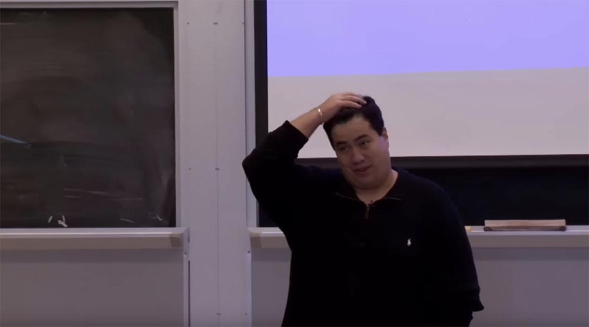
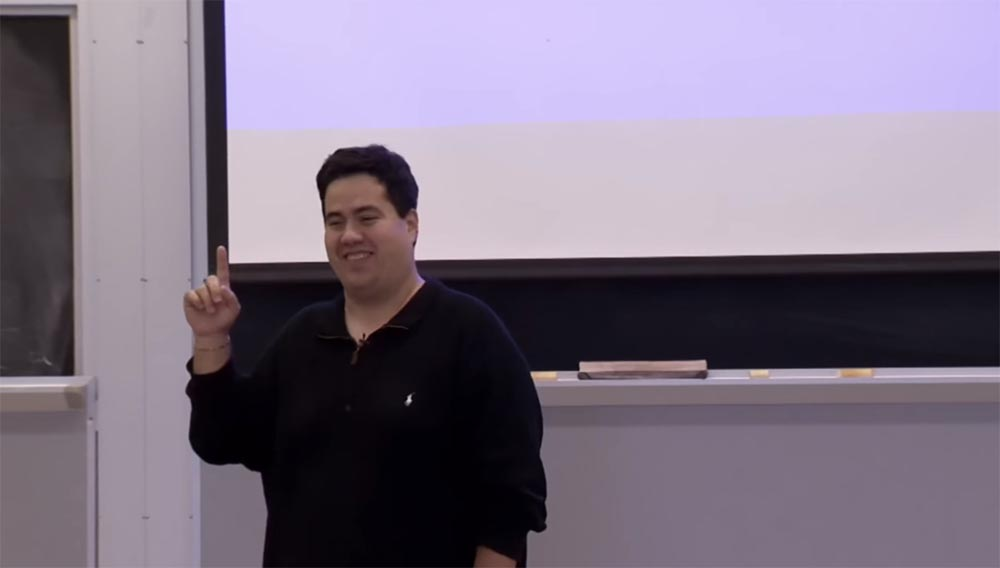
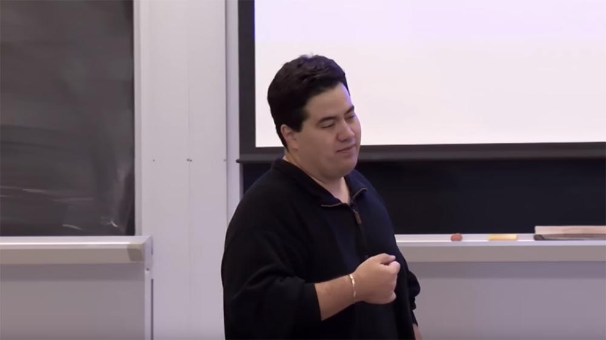
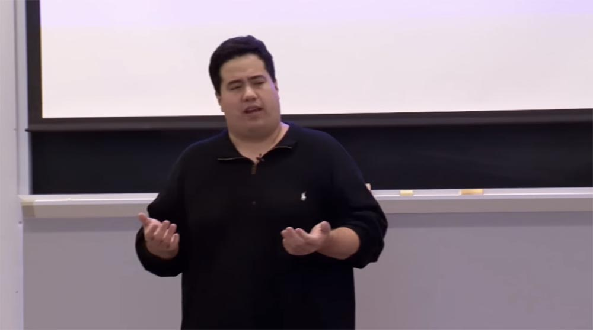
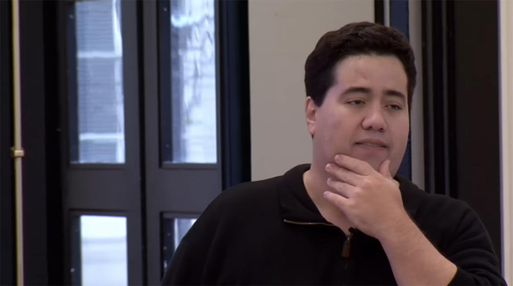
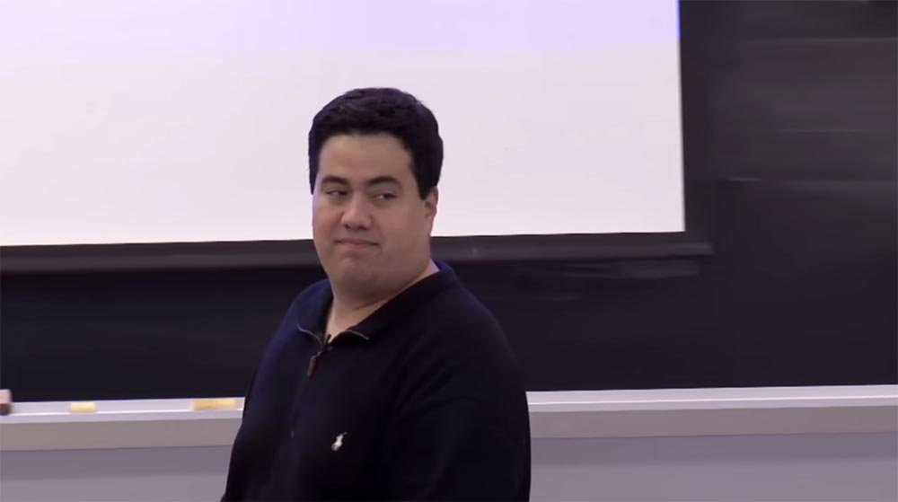
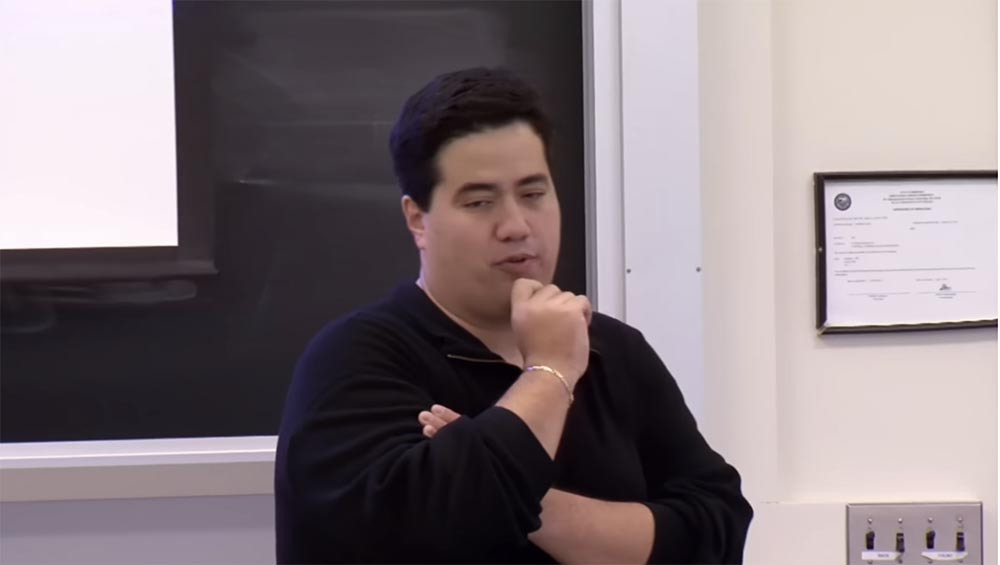
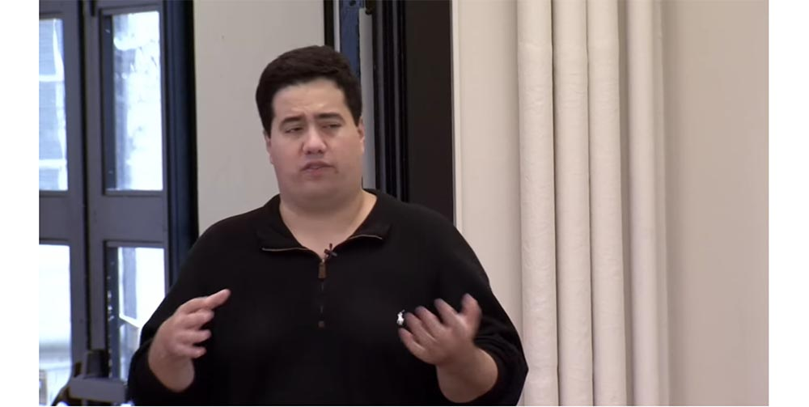
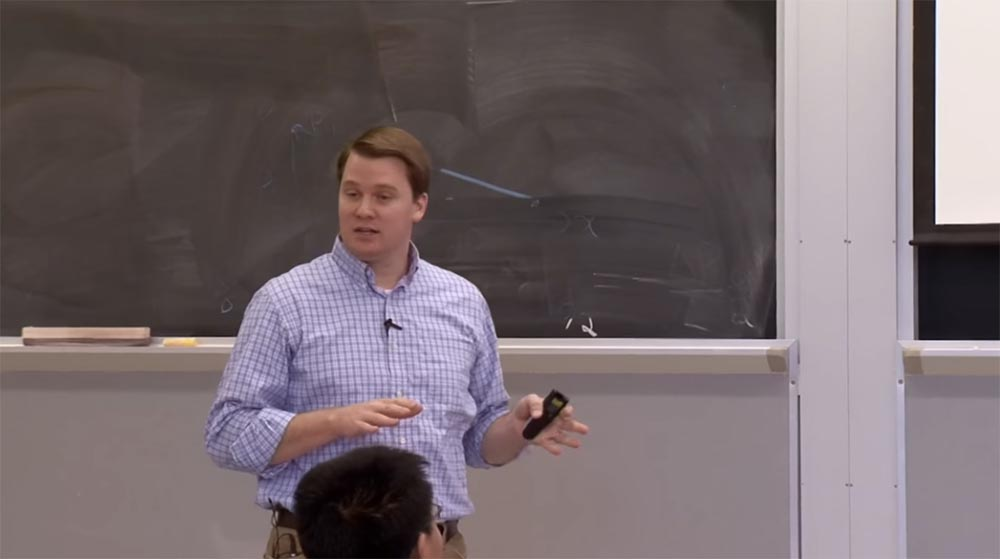

Курс MIT «Безопасность компьютерных систем». Лекция 22: «Информационная безопасность MIT», часть 1 / Блог компании ua-hosting.company

### Массачусетский Технологический институт. Курс лекций #6.858. «Безопасность компьютерных систем». Николай Зельдович, Джеймс Микенс. 2014 год

Computer Systems Security — это курс о разработке и внедрении защищенных компьютерных систем. Лекции охватывают модели угроз, атаки, которые ставят под угрозу безопасность, и методы обеспечения безопасности на основе последних научных работ. Темы включают в себя безопасность операционной системы (ОС), возможности, управление потоками информации, языковую безопасность, сетевые протоколы, аппаратную защиту и безопасность в веб-приложениях.

Лекция 1: «Вступление: модели угроз» [Часть 1](https://habr.com/company/ua-hosting/blog/354874/) / [Часть 2](https://habr.com/company/ua-hosting/blog/354894/) / [Часть 3](https://habr.com/company/ua-hosting/blog/354896/)  
Лекция 2: «Контроль хакерских атак» [Часть 1](https://habr.com/company/ua-hosting/blog/414505/) / [Часть 2](https://habr.com/company/ua-hosting/blog/416047/) / [Часть 3](https://habr.com/company/ua-hosting/blog/416727/)  
Лекция 3: «Переполнение буфера: эксплойты и защита» [Часть 1](https://habr.com/company/ua-hosting/blog/416839/) / [Часть 2](https://habr.com/company/ua-hosting/blog/418093/) / [Часть 3](https://habr.com/company/ua-hosting/blog/418099/)  
Лекция 4: «Разделение привилегий» [Часть 1](https://habr.com/company/ua-hosting/blog/418195/) / [Часть 2](https://habr.com/company/ua-hosting/blog/418197/) / [Часть 3](https://habr.com/company/ua-hosting/blog/418211/)  
Лекция 5: «Откуда берутся ошибки систем безопасности» [Часть 1](https://habr.com/company/ua-hosting/blog/418213/) / [Часть 2](https://habr.com/company/ua-hosting/blog/418215/)  
Лекция 6: «Возможности» [Часть 1](https://habr.com/company/ua-hosting/blog/418217/) / [Часть 2](https://habr.com/company/ua-hosting/blog/418219/) / [Часть 3](https://habr.com/company/ua-hosting/blog/418221/)  
Лекция 7: «Песочница Native Client» [Часть 1](https://habr.com/company/ua-hosting/blog/418223/) / [Часть 2](https://habr.com/company/ua-hosting/blog/418225/) / [Часть 3](https://habr.com/company/ua-hosting/blog/418227/)  
Лекция 8: «Модель сетевой безопасности» [Часть 1](https://habr.com/company/ua-hosting/blog/418229/) / [Часть 2](https://habr.com/company/ua-hosting/blog/423155/) / [Часть 3](https://habr.com/company/ua-hosting/blog/423423/)  
Лекция 9: «Безопасность Web-приложений» [Часть 1](https://habr.com/company/ua-hosting/blog/424289/) / [Часть 2](https://habr.com/company/ua-hosting/blog/424295/) / [Часть 3](https://habr.com/company/ua-hosting/blog/424297/)  
Лекция 10: «Символьное выполнение» [Часть 1](https://habr.com/company/ua-hosting/blog/425557/) / [Часть 2](https://habr.com/company/ua-hosting/blog/425561/) / [Часть 3](https://habr.com/company/ua-hosting/blog/425559/)  
Лекция 11: «Язык программирования Ur/Web» [Часть 1](https://habr.com/company/ua-hosting/blog/425997/) / [Часть 2](https://habr.com/company/ua-hosting/blog/425999/) / [Часть 3](https://habr.com/company/ua-hosting/blog/426001/)  
Лекция 12: «Сетевая безопасность» [Часть 1](https://habr.com/company/ua-hosting/blog/426325/) / [Часть 2](https://habr.com/company/ua-hosting/blog/427087/) / [Часть 3](https://habr.com/company/ua-hosting/blog/427093/)  
Лекция 13: «Сетевые протоколы» [Часть 1](https://habr.com/company/ua-hosting/blog/427763/) / [Часть 2](https://habr.com/company/ua-hosting/blog/427771/) / [Часть 3](https://habr.com/company/ua-hosting/blog/427779/)  
Лекция 14: «SSL и HTTPS» [Часть 1](https://habr.com/company/ua-hosting/blog/427783/) / [Часть 2](https://habr.com/company/ua-hosting/blog/427785/) / [Часть 3](https://habr.com/company/ua-hosting/blog/427787/)  
Лекция 15: «Медицинское программное обеспечение» [Часть 1](https://habr.com/company/ua-hosting/blog/428652/) / [Часть 2](https://habr.com/company/ua-hosting/blog/428654/) / [Часть 3](https://habr.com/company/ua-hosting/blog/428656/)  
Лекция 16: «Атаки через побочный канал» [Часть 1](https://habr.com/company/ua-hosting/blog/429390/) / [Часть 2](https://habr.com/company/ua-hosting/blog/429392/) / [Часть 3](https://habr.com/company/ua-hosting/blog/429394/)  
Лекция 17: «Аутентификация пользователя» [Часть 1](https://habr.com/company/ua-hosting/blog/429680/) / [Часть 2](https://habr.com/company/ua-hosting/blog/429682/) / [Часть 3](https://habr.com/company/ua-hosting/blog/429686/)  
Лекция 18: «Частный просмотр интернета» [Часть 1](https://habr.com/company/ua-hosting/blog/430204/) / [Часть 2](https://habr.com/company/ua-hosting/blog/430206/) / [Часть 3](https://habr.com/company/ua-hosting/blog/430208/)  
Лекция 19: «Анонимные сети» [Часть 1](https://habr.com/company/ua-hosting/blog/431262/) / [Часть 2](https://habr.com/company/ua-hosting/blog/431264/) / [Часть 3](https://habr.com/company/ua-hosting/blog/431266/)  
Лекция 20: «Безопасность мобильных телефонов» [Часть 1](https://habr.com/company/ua-hosting/blog/432616/) / [Часть 2](https://habr.com/company/ua-hosting/blog/432618/) / [Часть 3](https://habr.com/company/ua-hosting/blog/432620/)  
Лекция 21: «Отслеживание данных» [Часть 1](https://habr.com/company/ua-hosting/blog/432616/) / [Часть 2](https://habr.com/company/ua-hosting/blog/432618/) / [Часть 3](https://habr.com/company/ua-hosting/blog/432620/)  
Лекция 22: «Информационная безопасность MIT» [Часть 1](https://habr.com/company/ua-hosting/blog/434342/) / [Часть 2](https://habr.com/company/ua-hosting/blog/434344/) / [Часть 3](https://habr.com/company/ua-hosting/blog/434346/)

**Марк Сайлис:** спасибо Николаю за приглашение, нам было очень приятно прийти сюда сегодня, чтобы поговорить со всеми вами. Я привел одного из моих старших менеджеров, которые наблюдают за интернетом и сетевой безопасностью, Дэйва ЛаПорта, он расскажем вам о некоторых технических деталях того, что мы делаем. Я же собираюсь осветить вопросы более общего плана.

Не стесняйтесь задавать вопросы в любое время, спрашивайте обо всём, что вас заинтересует, не стесняйтесь вступать в бой. Я думаю, что сидел именно там, где сидите вы, ребята, почти 20 назад. Правда, Николай? Мы с Николаем были тогда намного моложе. И я, вероятно, был тогда намного тоньше, и волос у меня было немного больше.

Итак, наблюдая за инфраструктурой и зонами управления MIT, можно увидеть всякие интересные вещи. Некоторое из того, о чем мы будем говорить, и многое из того, что мы делаем, касается интересных проблем. Как вам известно, таких проблем в нашем институте хватает.

Я думаю, замечательно, что мы управляем открытой сетью, но в этом есть и хорошие, и плохие стороны. У нас в кампусе нет файрвола с достаточной степенью охвата, поэтому у нас практически всё открыто. Если вы хотите запустить компьютер в вашей комнате в общежитии, или прямо здесь, в зале, или где-нибудь еще на территории кампуса, то у вас есть практически неограниченный доступ к интернету, что по сравнению с другими ВУЗами, вообще-то, довольно необычно. Правда, вы знаете, что не можете зайти в интернет, сидя здесь на лекции, но это ведь не является нормой. С точки зрения обеспечения безопасности, настолько свободный доступ к интернету приносит целый ряд проблем.

Конечно, хорошо, что мы открыты всему миру, кому угодно, где угодно, откуда угодно, из любой страны и любой части планеты. Но если оттуда захотят дотянуться до вашего устройства, пока вы сидите здесь в этой комнате, будь то ваш телефон в кармане или ноутбук, на котором вы печатаете, когда сидите здесь, то они смогут это сделать. Ничего не помешает им это сделать, верно?

Это немного пугает. Пару лет назад мы провели эксперимент, просто взяв из коробки новый ноутбук Apple и подключив его к сети. Он зарегистрировался через DHCP и оставался в сети в течение 24 часов. Мы запустили TCP-дампы, чтобы потом провести инвентаризацию того, что входило в компьютер в течение 24-часового периода, просто чтобы узнать, что мы там найдём. Затем мы объединили полученные результаты в виде IP-адресов с их графическим отображением в системе Google Earth с помощью программы просмотра GeoIP, чтобы посмотреть, как это выглядит на карте.

Мы выяснили, что в течение одного лишь 24-часового периода ноутбук беспечного хозяина, публично зарегистрировавшегося в интернете, получал входящие соединения с компьютеров всех стран мира, за исключением двух. Всего 24 часа, один хозяин, все страны мира, кроме двух. Это сильно, не так ли? Кто-нибудь хочет угадать, какие две страны не попытались подключиться к этому ноутбуку?

**Аудитория:** Северная Корея?

**Марк Сайлис:** правильно, одной из этих стран была Северная Корея. Китай? Нет, Китай очень активно участвовал в этих соединениях. Возможно, это было какое-то военное ведомство, не знаю, но оно очень активно пыталось связаться с нашим компьютером.

**Аудитория:** Антарктида?

**Марк Сайлис:** совершенно верно, Антарктида. За эту отгадку вы сегодня получаете Золотую звезду. Это превосходно.

Итак, в течение одного 24-часового периода мы подвергали себя множеству угроз, потенциальным атакам и воздействию вредоносных программ. И всё это свалилось на одного пользователя компьютера. Во всём кампусе MIT расположено примерно 150 000 различных устройств, и все они могут быть скомпрометированы. Такое происходит ежедневно на протяжении всего дня, и это довольно страшно.

Хотите испугаться ещё больше? Несколько месяцев назад мы с Дэйвом побывали на совещании, которое было посвящено проблемам аварийного отключения электричества. Кто-нибудь из вас помнит отключение электроэнергии год или полтора года назад? Это было захватывающее событие, верно?

Я был здесь во время большого отключения электроэнергии около 20 лет назад, когда весь город Кембридж остался без света. Так вот, это было действительно здорово. За исключением того, что было около 100 градусов (38°С), зато это было подходящим поводом для того, чтобы поехать в Бостон и посмотреть фильм в кинотеатре.

Но одна вещь, которая произошла из-за этого, действительно представляла для нас интерес. После совещания к нам пришли ребята из отдела оборудования, и сказали, что из-за этого отключения света им пришлось провести последние четыре или пять месяцев, перепрограммируя все свои устройства по всему кампусу. Вы знаете, они используют системы SCADA, подсоединённые к кондиционерам, освещению и отоплению в комнатах, к дверным замкам и так далее. Это понятно, ведь у нас технологический институт, где должно быть полно таких систем. Уверен, что они представляли себя в полной безопасности, но у них возникли проблемы с постоянным отключением устройств от сети, связью с интернетом и так далее. Разговаривая с ними, мы будто очищали луковицу слой за слоем, постоянно вскрывая всё новые и новые детали.  
Мы спросили, что они имеют в виду, говоря о подключении оборудования к сети. Ну как же, отвечают они, все наши устройства общаются через сеть интернет. Мы сказали, что в таком случае у них должны быть системы, гарантирующие устойчивую работу оборудования при различных авариях, отдельная система управления, автономная сеть и так далее.

Они посмотрели на нас пустым взглядом и ответили: «Ага, так вот что это такое! Значит, продавец оборудования говорил нам именно про эти штуки»!

Это затрагивает одну из интересных проблем «интернета вещей», эпохи, в которую мы входим всё глубже и глубже. Когда я был моложе, люди, использующие интернет, знали, что они делают, они должны были разбираться в конкретных вещах, касающихся сетей. Сегодня же каждый может пользоваться интернетом, не задумываясь, как он работает. Люди выросли из старых стандартов. Это как когда вы подходите к ракете на карусели и замечаете, будто бы она стала намного меньше, но в действительности это просто выросли вы сами.

Так вот, беседуя с этими ребятами дальше, мы узнали, что у них есть почти все, о чем вы только могли подумать, подсоединяясь к сети Интернет. Все, что было нужно.

Интересно, что Массачусетский технологический институт запустил Энергетическую Инициативу пять — семь лет назад, когда президентом была Сьюзан Хокфилд. Одним из требований к отделу оборудования было развертывание на территории кампуса настоящего «интернета вещей», чтобы создать динамическое управление системами обеспечения жизнедеятельности зданий. Например, если аудитория не используется, в ней гаснет свет, понижается температура отопительной системы и так далее. И эта технология работает по всему кампусу.

Они развернули гигантскую сеть управления, просто гигантскую. Она в несколько раз больше, чем наша локальная институтская сеть интернет. Я думаю, что они контролируют около 400 000 разных точек, из которых следят за всем кампусом, это от 75 000 до 100 000 объектов.

И вот Дэйв, широко раскрыв глаза, спрашивает их: «Как же вы всё это охраняете, ребята?». Они отвечают что-то типа: «ну, мы позвали вас, ребята, чтобы вместе всё это проверить». И они начинают проверку – запрашивают через веб-форму IP-адрес, подсоединяются к нему и говорят: «ну вот видите, всё работает»!

Мы смотрим на это и говорим: «но ведь это всё связано с открытым интернетом, как же здесь обеспечивается безопасность сети?», и получаем ответ, от которого наше давление немного повышается: «ну это безопасно, потому что вы, ребята, об этом заботитесь!». То есть, по их мнению, это безопасно, потому что кто-то об этом заботится.

Тут выражение наших лиц снова меняется и мы спрашиваем, что они имеют в виду под безопасностью? «Ну как, у нас же есть корпоративный файрвол! С ним мы уже разобрались и поняли, что все в полной безопасности»!

Мой следующий вопрос был: «Вы можете мне показать, где находится этот файрвол? Потому что я этого не знаю!» Ответ был таким: «Ну ведь все так делают»!

Итак, возвращаясь к тому, о чём я говорил ранее, повторю — мы работаем в довольно открытой среде. И мы всегда считали, и это философия MIT, что мы верим в оборону и безопасность «через стек». Мы не хотим, чтобы реализация безопасности зависела от какой-либо одной части инфраструктуры, безопасность должна быть обеспечена на каждом уровне. Вы не просто делаете это через инфраструктуру, вы обеспечиваете безопасность через приложение, делаете это в разных местах. Это совсем не то, как создаётся «интернет вещей» с точки зрения SCADA. И это немного пугает.

Это одна из вещей, с которыми мы имеем дело, в дополнение к тому, что мы имеем дело с такими людьми, как вы, которые придумывают технически продвинутые пакости, из-за чего мы с Дэйвом вынуждены вскакивать посреди ночи. Вы знаете, интернет становится некой утилитой, которая используется для всего, что происходит в кампусе. И это действительно изменило тенденции, о чём мы должны беспокоиться с точки зрения угроз, вопросов безопасности и всего остального.  
Теперь вы знаете, что когда пропадает интернет или возникает проблема с сетью, это причиняет неудобства вам как студентам, потому что прекращают работать кондиционеры или пропадает отопление. Так что угрозы действительно изменились.

Поэтому мы имеем дело с широким спектром вещей, мы выступаем в роли сетевого провайдера для кампуса, поставляющего услуги людям вроде вас, и мы также предоставляем услуги аутсорсинга. Если вы совместите это с нашей философией открытой сети, то поймёте, почему такой подход создаёт угрозы, о которых нам приходится постоянно беспокоиться.

Люди привыкли полагаться на интернет и ожидают, что он будет работать без перебоев. Когда произошла авария электросети, первые вопросы были, почему перестал работать интернет? Мы отвечали: «потому что нет электричества». Но некоторые студенты говорили, что ведь сеть берётся из аккумулятора в телефонах, причем тут электричество в розетке? Приходилось объяснять, что это не так, это аналоговая телефонная технология. «Ну и что, какая разница»? Ну, ребята, вы реально многое знаете!

Так что люди ожидают, что все проблемы на уровне безопасности, отказоустойчивости и всего остального должен решать поставщик услуг. Мне нравятся люди, которые полностью уверены, что все проблемы могут решаться на уровне провайдера, но, к сожалению, эта уверенность далека от реального положения вещей.

Поэтому мы тратим большую часть нашего времени, пытаясь сохранить работоспособность и максимальную безопасность институтской интернет-среды. Дэйв расскажет об этом немного подробнее и приведёт в пример интересные истории о вещах, с которыми мы имеем дело. Но у нас действительно интересная работа, и я думаю, что проблемы становятся все сложнее и сложнее. Всё дело в том, что интернет расширяется.

Например, «интернет вещей» — очень модное слово. Кто из вас слышал об этом до сегодняшнего дня? Зайдите на сайт Cisco или подобный, где с помощью этого словосочетания они пытаются продавать вам дорогое оборудование. Налицо феномен, когда практически всё подключено к интернету или имеет IP-адрес. К сожалению, многие люди, пишущие эти системы, не так прилежны, как люди, которые учились в Массачусетском технологическом институте, поэтому они создают всевозможные интересные проблемы.

Реальная проблема заключается в том, что когда вы смотрите на безопасность с системного уровня, вы видите мозаику из тысячи маленьких кусочков, и это очень тяжело. Даже нам приходится иметь дело с внешними поставщиками услуг интернета, мы должны иметь дело с нашими собственными клиентами, нам приходится вести бизнес с поставщиками приложений. Это огромная система проблем, о которых нужно беспокоиться, чтобы обеспечить цельную безопасность, и временами это очень сложная задача.

Теперь я попрошу Дэйва поговорить немного о вещах, с которыми мы сталкиваемся в своей работе. Есть ли у вас ко мне какие-то вопросы?

**Аудитория:** наблюдали ли вы какие-нибудь APT-кампании, атакующие MIT напрямую?

**Марк Сайлис:** да, мы такое видели. Интересно то, и Дэйв будет об этом рассказывать, что самое трудное в нашей работе – это увидеть атаку. Если я расскажу вам историю об одном ноутбуке, а у нас есть 100 или 150 тысяч устройств, имеющих свой IP-адрес в институтской сети /8, то это настолько же трудно, как отыскать иглу в стоге сена. Поэтому во всём этом широчайшем потоке трафика очень сложно обнаружить целевую APT-атаку.

Сейчас мы располагаем продвинутыми инструментами, способными помочь в решении проблемы, мы поговорим об этом через минуту. Мы также видим стремление нам помочь со стороны правоохранительных органов, федеральной системы, которые дают нам полезные наставления относительно противостояния некоторым типам угроз. Одна из вещей, помогающая нам уверенно смотреть в будущее – это исследования, которые проводятся в этой области нашим институтом. Это одна из наших главная задач. Федеральные источники финансирования, обеспечивающие такие исследования, не устанавливают жёстких правил по поводу того, как мы должны это делать.  
Когда вы столкнётесь с получением грантов на исследования, будь то частные или правительственные гранты, NSF, NIH, то увидите, что их требования довольно расплывчаты. Например, одним из требований при получении гранта является обязанность соблюдать такую политику данных, согласно которой все результаты ваших исследований должны быть сохранены. MIT так и делает, мы говорим: «отлично, мы так и сделаем, мы об этом позаботимся», и подписываем документ. Каким образом мы сохраняем данные – исключительно наша забота. Как грантодатели проверяют соответствие этому требованию? Если правительство однажды придет к вам и скажет: «эй, где данные исследований?», просто укажите на преподавателя и скажите: «поговорите с ним»!

Мы видим, что правительство в некоторых случаях говорит: «смотрите, мы инвестируем в это исследование много денег, потому что не хотим тратить деньги на проведение такого исследования в другой стране». К нам приходят представители федеральных агентств или финансовых организаций и говорят, что поскольку у них целая индустрия, они испытывают потребность в создании дополнительных департаментов безопасности, и при этом MIT выступает в качестве инкубатора для невероятного количества гениальных людей.

Для администрации в целом мы служим своего рода хостинговой компанией, верно? Мы развиваем эту активность. Мы предоставляем им лабораторные помещения, или подключение к интернету, или всякую всячину для проведения исследований. Однако в основном это федеративная среда, в которой люди работают автономно, поэтому у нас появляются разные требования к обеспечению безопасности деятельности самого различного характера, протекающей в стенах нашего института. И в этом заключается сложность нашей работы.

Возвращаясь к проблеме APT, скажу, что в нашем институте сосредоточено огромное количество интеллектуального капитала. Здесь происходит огромное количество интересных вещей, которые очень интересуют людей за пределами нашей страны.

Как вы думаете, какая страна ответственна за кражу интеллектуальной собственности больше, чем любая другая страна в мире? Кто-нибудь берётся угадать?

**Аудитория:** это опасное предложение.  
Марк Сайлис: нет, нет, я спрашиваю вполне серьёзно. Это меня шокировало, потому что ответ весьма неожиданный. И это не означает, что они делают это здесь, в нашем институте. Кто-нибудь попытается угадать?

**Аудитория:** Китай?

**Марк Сайлис:** нет, это не Китай.

**Аудитория:** Россия?

**Марк Сайлис:** нет, это была не Россия.

**Аудитория:** это Канада?

**Марк Сайлис:** нет, вы уже близко к отгадке, правда, это европейская страна.

**Аудитория:** Франция?

**Профессор:** Франция. Вот именно, это была Франция. Вы такого не ожидали, не так ли? Но у меня есть куча знакомых людей, которые работают в промышленности, в коммерческом секторе, в сфере безопасности. Некоторые из их компаний расположены во Франции, где одной из самых больших угроз для безопасности является кража интеллектуальной собственности. Можно было подумать, что это Иран. Можно представить, что такое происходит в других местах, но нет, это не так. Довольно неожиданно, не правда ли? Это не значит, что США подобным не занимаются, давай будем честными, хорошо? Мы просто делаем это лучше, поэтому можно надеяться, что нас не поймают. Но излишне говорить, что это одна из самых интересных вещей. Есть ещё вопросы?

**Аудитория:** какого рода вещи вы регистрируете в IP-секторе?

**Марк Сайлис:** выключите, пожалуйста, камеру! (смеётся) Мы регистрируем довольно интересные вещи, так что я постараюсь вам честно ответить на этот вопрос. Мы регистрируем запросы на аутентификацию, и когда вы входите в систему через Kerberos, вы входите через Active Directory, или через Touchstone, через наш SAML iVP, это всё регистрируется. У нас имеется подробно описанные политики хранения Retention policies, которыми мы рады поделиться с вами, они опубликованы. Если вы получаете доступ к веб-странице или если вы регистрируетесь, чтобы прочитать свою электронную почту, то одна из проблем, которую мы при этом решаем – это сопоставление всей регистрационной информации. Она черпается из множества разных источников, позже Дэйв расскажет об этом. Но это составляет весомую часть нашей работы. Наш период хранения составляет порядка 30 дней.

**Аудитория:** MIT имеет собственный центр сертификации CA, не так ли? Существует корневой сертификат MIT с приватным ключом. Где же вы храните этот закрытый ключ? (смех в аудитории)

**Марк Сайлис:** да-да, продолжайте.

**Аудитория:** есть ли у вас аппаратное оборудование, защищённое от умышленных повреждений, или что-то подобного рода? Или вы просто храните ключи где-то на компьютере под управлением Linux?

**Марк Сайлис:** пожалуй, это лучший на сегодня вопрос. Да, мы управляем нашим собственным центром сертификации с конца 1990-х. MIT достиг прогресса в этой области, потому что пока во всем мире использовалась аутентификация пользователя в интернете через SSL на основе логина и пароля, в нашем институте уже использовалась авторизация на основе PKI. Вы, ребята, намного моложе, но еще в 1998 году мне говорили, что PKI вот-вот введут, это будет в следующем году, а мы говорили об этом примерно 20 лет назад.

По поводу хранения ключей – мне нравится ваша идея использования tamper-resistant hardware, «железа», защищенного от умышленной порчи. Но мы так не делаем.

**Аудитория:** а как вы изготовляете сертификаты CA?

**Марк Сайлис:** CA обычно делает это с помощью USB-ключей или других токенов, в которых используются протоколы, обеспечивающие доступ к информации сразу после того, как она была написана, в том смысле, что вы сможете отправить что-нибудь на подпись, но не сможете получить ключ.

Честно говоря, сервер CA, который мы сейчас используем, был создан ещё до того, как появились все эти существующие центры сертификации. Поэтому мы использовали, я бы сказал, типичный творческий дух MIT. У нас всё хранится в файловой системе, и оно хранится таким образом, что его трудно восстановить. И оно сохраняется несколькими способами и зашифровано несколькими ключами. Разнообразие систем имеет довольно специфические параметры, я не собираюсь подробно их все перечислять.

**Аудитория:** таким образом, это «более безопасная» система безопасности?

**Марк Сайлис:** да, это так. Поэтому, если вы знаете конкретные локации, которые могут даже не быть файлами, и вы знаете, сколько ключей для них необходимо, и сколько байтов нужно прочитать, то возможно, вы сможете это выяснить. Но, честно говоря, если вы действительно собираетесь держать всё это на одном компьютере, считайте, что на этом игра закончена.

Знаете, я очень скептически отношусь к тому, что можно взломать машину и при этом не скомпрометировать ключ. Поэтому мы стараемся быть в безопасности, но в любом случае, это не идеально.

**Аудитория:** сколько процентов аккаунтов MIT скомпрометировано на данный момент времени?

**Марк Сайлис:** хороший вопрос. Думаю, все знают, что такое фишинг? Я не могу сказать вам, сколько разговоров я провел с людьми, которые смотрят на меня и спрашивают: «но ведь это не так, как было в Сиэтле»? Но это немного более взрослая аудитория. Я поражаюсь каждый раз, когда происходит одна из этих фишинговых вещей с электронными письмами, а их приходит не слишком много.

Вы учитесь в одном из самых «умных» институтов в мире, и я, как его выпускник, очень этим горжусь. Я не могу сказать вам, сколько людей отвечает на эти фишинговые письма. Меня всегда поражало, когда пользователи присылают нам письма такого содержания: „Дорогая служба поддержки, вот мое имя пользователя и пароль». Это меня просто шокирует! Причём некоторые из них — преподаватели. И они звонят в службу поддержки и говорят: “Эй, я ответил на твое сообщение о квоте. Почему же моя квота не выросла? И, кстати, мне кажется, мой почтовый ящик переполнен! Что с ним случилось»?

Выясняется, что они получили 200 000 ответных сообщений в свой почтовый ящик, потому что он используется для массовой отправки спама.

Поэтому я постараюсь быть честным и скажу, что мы видим 10, 15, 20, до 30 скомпрометированных аккаунтов в месяц, а во время пика фишинговых атак, даже больше. И я думаю, что действительно интересные случаи взлома аккаунтов — это те, о которых мы не знаем.  
Пару лет назад к нам пришли люди из правительства и сказали, что не будут вдаваться в подробности, но существует рынок, где можно купить логины MIT и пароли для доступа к ресурсам нашей библиотеки. На «чёрном рынке» они пользуются спросом. Если вы хотите получить доступ ко всем материалам MIT, хранящихся в библиотеках или на других ресурсах кампуса, то вам продадут один из этих аккаунтов, которые они скомпрометировали по интернету. Федералы спросили, знаем ли мы об этом? Нет, мы ничего об этом не знали. Но таких случаев огромное количество. Успех социальных векторов, направленных на получение чужой конфиденциальной информации, невероятно высок, особенно по отношению к пользователям нашей отрасли знаний, Дэйв немного расскажет об этом и о том, как мы стараемся смягчить последствия такого незаконного интереса. И это немного пугает.

**Аудитория:** учитывая сказанное вами, нет ли какого-то способа или веб-сайта, чтобы увидеть все места, где вы вышли в систему через сервис аутентификации Touchstone или нечто подобное?

**Марк Сайлис:** да, я уже говорил о том, что мы собираем различную информацию об аутентификации пользователей, единственное, что у нас пока получается не очень хорошо – это её корреляция. В нашем случае есть 30 различных технологических систем, участвующих в некоторых из этих вещей, разные форматы и разные способы генерации ключей. Мы работаем над тем, чтобы максимально упростить этот процесс. Мы надеемся предоставить сообществу пользователей что-то вроде GeoIP, где они смогут видеть проявление своей активности, скажем, на протяжении последних 30 дней или недели, или без срока хранения, чтобы информировать людей о том, когда, где и откуда производилась авторизация и вход в систему.

Дэйв хочет пойти еще дальше. Он хочет, чтобы вы могли выбрать круг определённого радиуса, в котором вы находитесь и откуда будет разрешён вход в систему на основе заданных географических параметров. Если вы пытаетесь войти в систему за пределами данного круга, вам это не разрешается либо вам на телефон отправляется сообщение, чтобы вы знали, что произошло что-то неординарное. Я считаю, что Дэйв идёт в правильном направлении. Так что мы работаем над этим, но на сегодня у нас нет ничего подобного.

**Аудитория:** вы сказали, что в сети MIT был вредоносный трафик? Откуда он исходил? Источник вредоносного трафика был расположен вне сети института или внутри неё?

**Марк Сайлис:** знаете, я бы с удовольствием сказал, что это полностью был внешний трафик, но к сожалению, у нас имеется и выход такого трафика изнутри. Мы располагаем огромной пропускной способностью и большим числом соединений. Позже мы для примера поговорим об отражении UDP-атак, но когда у вас настолько широкие каналы, это хороший ресурс, чтобы навредить другим людям. Но я бы сказал, что преимущественно мы наблюдаем входящий вредоносный трафик, как в ранее упомянутом случае с ноутбуком.

**Аудитория:** сколько людей ежедневно подключается к сети MIT?

**Марк Сайлис:** точно не знаю, где-то от 100 до 120 тысяч различных типов устройств. Я бы сказал, что на одного человека приходится в среднем по 2,5 устройства, так что ежедневно сетью пользуется от 35 до 40 тысяч человек.

**Аудитория:** у нас есть политика в отношении создания узлов TOR в сети MIT?

**Марк Сайлис:** политика? Вы что? Конечно, нет!

**Аудитория:** есть ли веские причины не делать этого?

**Марк Сайлис:** вы знаете, что MIT — очень открытое место, и одно из величайших его преимуществ это возможность экспериментировать. Я мечтал о такой возможности, ещё будучи студентом. Это нормально — делать что-то, нормально узнавать о разных вещах, развивать их, придумывать новые вещи. Это одна из уникальных особенностей MIT. Вам не нужно идти в Отдел политик, чтобы сказать: „Эй, я хочу сегодня запустить exit-node, или я хочу изобрести новый анонимный протокол», или что-то в этом роде. Это действительно уникальная вещь – работать здесь и здесь же учиться. А хорошая ли у вас возникла идея или плохая, зависит от того, что вы хотите сделать.

Если вы делаете это в рамках исследований техник анонимизации, то некая приватность нормальна. Если вы делаете это для «черного рынка», то это не очень хорошая идея. Политики MIT достаточно гибкие. Мы действительно пытаемся их сбалансировать, но согласитесь, ведь учреждение обязано вести себя ответственно? Давайте просто будем честными. Как учреждение, мы должны это делать. Но мы стараемся максимально не ограничивать инновационную деятельность, и по большей части, это работает довольно хорошо. Я бы сказал, что MIT был довольно успешным институтом на протяжение последних 125 лет.

Но я думаю, что мы должны немедленно обращать внимание на то, что способно угрожать коллективной безопасности института. В данный момент MIT управляет множеством выходных узлов TOR – немного exit-node имеется в отделе SIPI, несколько у CSAIL. Они появляются в списке нарушений Дейва, но мы закрываем на это глаза. Однако в большинстве других учебных заведений подобное невозможно.

Если больше нет вопросов, представляю вам моего уважаемого коллегу Дэйва Лапорта. Он работал над сетями Гарвардского университета и может даже рассказать вам немного о специфике сети школы искусств, если вы поймаете его после лекции. Кроме того, он сам преподаёт в Северо-Восточном, что очень здорово. Дэйв расскажет вам о конкретных случаях, которые заставляют нас вскакивать посреди ночи.

**Дэйвид Лапорт:** всем привет, меня зовут Дэйв Лапорт. У меня очень многословная должность — менеджер инфраструктуры и операций по обеспечению безопасности. В двух словах это означает, что я ответственный за техническое обслуживание, эксплуатацию и безопасность сети mit.net, что занимает у меня полный рабочий день.

Сегодня я собираюсь многое вам рассказать и оставить в конце время для ваших вопросов, чтобы вы получили максимальную отдачу от нашего разговора. Если что-то будет непонятно, просто прервите меня, подняв руку, я не возражаю.

Мы начнём наш разговор с описания работы команды Security Operations Team, центрального органа, занимающегося сетевой безопасностью MIT. Затем мы поговорим о некоторых событиях, произошедших в недавнем прошлом, и том, что мы сделали, чтобы смягчить их последствия и сохранить существующее состояние безопасности mit.net.

Мы поговорим о текущем положении вещей, о том, с чем мы сталкиваемся сейчас, и как сказал Марк, это в большей степени социальная область. И мы поговорим о некоторых будущих тенденциях, которые довольно расплывчаты, поэтому им посвящено небольшое число слайдов.  
На этом слайде вы видите схему команды Security Operations Team. Её возглавляет Марк, которому я непосредственно подчиняюсь. Под моим началом находится Группа безопасности во главе с руководителем группы Гарри Хоффманом. Ему подчиняются 3 человека.

Аналитик Эндрю Мюнчбах наблюдает за системой, рассылает уведомления пользователям и реагирует на жалобы, поступающие из-за пределов института. Майк Хосл занимается инженерно-техническими мероприятиями и компьютерной криминалистикой. Моник Бьюкенан отвечает за большую часть переписки и связи с институтским сообществом. Сам Гарри занимается практически всеми этими вопросами.

29:10 мин

[Курс MIT «Безопасность компьютерных систем». Лекция 22: «Информационная безопасность MIT», часть 2](https://habr.com/company/ua-hosting/blog/434344/)

Полная версия курса доступна [здесь](https://ocw.mit.edu/courses/electrical-engineering-and-computer-science/6-858-computer-systems-security-fall-2014/).

Спасибо, что остаётесь с нами. Вам нравятся наши статьи? Хотите видеть больше интересных материалов? Поддержите нас оформив заказ или порекомендовав знакомым, **30% скидка для пользователей Хабра на уникальный аналог entry-level серверов, который был придуман нами для Вас:** [Вся правда о VPS (KVM) E5-2650 v4 (6 Cores) 10GB DDR4 240GB SSD 1Gbps от $20 или как правильно делить сервер?](https://habr.com/company/ua-hosting/blog/347386/) (доступны варианты с RAID1 и RAID10, до 24 ядер и до 40GB DDR4).

**VPS (KVM) E5-2650 v4 (6 Cores) 10GB DDR4 240GB SSD 1Gbps до января бесплатно** при оплате на срок от полугода, заказать можно [тут](https://ua-hosting.company/vpsnl).

**Dell R730xd в 2 раза дешевле?** Только у нас **[2 х Intel Dodeca-Core Xeon E5-2650v4 128GB DDR4 6x480GB SSD 1Gbps 100 ТВ от $249](https://ua-hosting.company/serversnl) в Нидерландах и США!** Читайте о том [Как построить инфраструктуру корп. класса c применением серверов Dell R730xd Е5-2650 v4 стоимостью 9000 евро за копейки?](https://habr.com/company/ua-hosting/blog/329618/)