Курс MIT «Безопасность компьютерных систем». Лекция 22: «Информационная безопасность MIT», часть 2 / Блог компании ua-hosting.company

### Массачусетский Технологический институт. Курс лекций #6.858. «Безопасность компьютерных систем». Николай Зельдович, Джеймс Микенс. 2014 год

Computer Systems Security — это курс о разработке и внедрении защищенных компьютерных систем. Лекции охватывают модели угроз, атаки, которые ставят под угрозу безопасность, и методы обеспечения безопасности на основе последних научных работ. Темы включают в себя безопасность операционной системы (ОС), возможности, управление потоками информации, языковую безопасность, сетевые протоколы, аппаратную защиту и безопасность в веб-приложениях.

Лекция 1: «Вступление: модели угроз» [Часть 1](https://habr.com/company/ua-hosting/blog/354874/) / [Часть 2](https://habr.com/company/ua-hosting/blog/354894/) / [Часть 3](https://habr.com/company/ua-hosting/blog/354896/)  
Лекция 2: «Контроль хакерских атак» [Часть 1](https://habr.com/company/ua-hosting/blog/414505/) / [Часть 2](https://habr.com/company/ua-hosting/blog/416047/) / [Часть 3](https://habr.com/company/ua-hosting/blog/416727/)  
Лекция 3: «Переполнение буфера: эксплойты и защита» [Часть 1](https://habr.com/company/ua-hosting/blog/416839/) / [Часть 2](https://habr.com/company/ua-hosting/blog/418093/) / [Часть 3](https://habr.com/company/ua-hosting/blog/418099/)  
Лекция 4: «Разделение привилегий» [Часть 1](https://habr.com/company/ua-hosting/blog/418195/) / [Часть 2](https://habr.com/company/ua-hosting/blog/418197/) / [Часть 3](https://habr.com/company/ua-hosting/blog/418211/)  
Лекция 5: «Откуда берутся ошибки систем безопасности» [Часть 1](https://habr.com/company/ua-hosting/blog/418213/) / [Часть 2](https://habr.com/company/ua-hosting/blog/418215/)  
Лекция 6: «Возможности» [Часть 1](https://habr.com/company/ua-hosting/blog/418217/) / [Часть 2](https://habr.com/company/ua-hosting/blog/418219/) / [Часть 3](https://habr.com/company/ua-hosting/blog/418221/)  
Лекция 7: «Песочница Native Client» [Часть 1](https://habr.com/company/ua-hosting/blog/418223/) / [Часть 2](https://habr.com/company/ua-hosting/blog/418225/) / [Часть 3](https://habr.com/company/ua-hosting/blog/418227/)  
Лекция 8: «Модель сетевой безопасности» [Часть 1](https://habr.com/company/ua-hosting/blog/418229/) / [Часть 2](https://habr.com/company/ua-hosting/blog/423155/) / [Часть 3](https://habr.com/company/ua-hosting/blog/423423/)  
Лекция 9: «Безопасность Web-приложений» [Часть 1](https://habr.com/company/ua-hosting/blog/424289/) / [Часть 2](https://habr.com/company/ua-hosting/blog/424295/) / [Часть 3](https://habr.com/company/ua-hosting/blog/424297/)  
Лекция 10: «Символьное выполнение» [Часть 1](https://habr.com/company/ua-hosting/blog/425557/) / [Часть 2](https://habr.com/company/ua-hosting/blog/425561/) / [Часть 3](https://habr.com/company/ua-hosting/blog/425559/)  
Лекция 11: «Язык программирования Ur/Web» [Часть 1](https://habr.com/company/ua-hosting/blog/425997/) / [Часть 2](https://habr.com/company/ua-hosting/blog/425999/) / [Часть 3](https://habr.com/company/ua-hosting/blog/426001/)  
Лекция 12: «Сетевая безопасность» [Часть 1](https://habr.com/company/ua-hosting/blog/426325/) / [Часть 2](https://habr.com/company/ua-hosting/blog/427087/) / [Часть 3](https://habr.com/company/ua-hosting/blog/427093/)  
Лекция 13: «Сетевые протоколы» [Часть 1](https://habr.com/company/ua-hosting/blog/427763/) / [Часть 2](https://habr.com/company/ua-hosting/blog/427771/) / [Часть 3](https://habr.com/company/ua-hosting/blog/427779/)  
Лекция 14: «SSL и HTTPS» [Часть 1](https://habr.com/company/ua-hosting/blog/427783/) / [Часть 2](https://habr.com/company/ua-hosting/blog/427785/) / [Часть 3](https://habr.com/company/ua-hosting/blog/427787/)  
Лекция 15: «Медицинское программное обеспечение» [Часть 1](https://habr.com/company/ua-hosting/blog/428652/) / [Часть 2](https://habr.com/company/ua-hosting/blog/428654/) / [Часть 3](https://habr.com/company/ua-hosting/blog/428656/)  
Лекция 16: «Атаки через побочный канал» [Часть 1](https://habr.com/company/ua-hosting/blog/429390/) / [Часть 2](https://habr.com/company/ua-hosting/blog/429392/) / [Часть 3](https://habr.com/company/ua-hosting/blog/429394/)  
Лекция 17: «Аутентификация пользователя» [Часть 1](https://habr.com/company/ua-hosting/blog/429680/) / [Часть 2](https://habr.com/company/ua-hosting/blog/429682/) / [Часть 3](https://habr.com/company/ua-hosting/blog/429686/)  
Лекция 18: «Частный просмотр интернета» [Часть 1](https://habr.com/company/ua-hosting/blog/430204/) / [Часть 2](https://habr.com/company/ua-hosting/blog/430206/) / [Часть 3](https://habr.com/company/ua-hosting/blog/430208/)  
Лекция 19: «Анонимные сети» [Часть 1](https://habr.com/company/ua-hosting/blog/431262/) / [Часть 2](https://habr.com/company/ua-hosting/blog/431264/) / [Часть 3](https://habr.com/company/ua-hosting/blog/431266/)  
Лекция 20: «Безопасность мобильных телефонов» [Часть 1](https://habr.com/company/ua-hosting/blog/432616/) / [Часть 2](https://habr.com/company/ua-hosting/blog/432618/) / [Часть 3](https://habr.com/company/ua-hosting/blog/432620/)  
Лекция 21: «Отслеживание данных» [Часть 1](https://habr.com/company/ua-hosting/blog/432616/) / [Часть 2](https://habr.com/company/ua-hosting/blog/432618/) / [Часть 3](https://habr.com/company/ua-hosting/blog/432620/)  
Лекция 22: «Информационная безопасность MIT» [Часть 1](https://habr.com/company/ua-hosting/blog/434342/) / [Часть 2](https://habr.com/company/ua-hosting/blog/434344/) / [Часть 3](https://habr.com/company/ua-hosting/blog/434346/)

Итак, это было предисловие к тому, что у нас есть команда всего из четырех человек в очень большом учреждении с кучей устройств. Таким образом, федерация, о которой говорил Марк, действительно необходима для того, чтобы хотя бы попробовать обеспечивать безопасность сети такого размера.

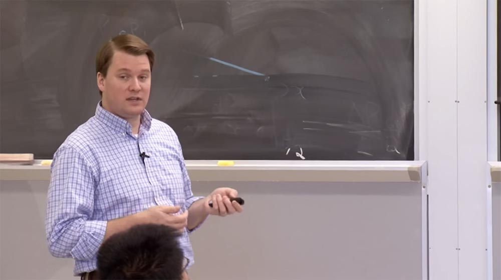

Мы общаемся с людьми и помогаем им на территории кампуса. Наше портфолио состоит из консультационных услуг, сервисов, которые мы представляем сообществу, и инструментов, которыми мы пользуемся. Услуги, которые мы предоставляем, достаточно разнообразны.

Abuse reporting — мы выпускаем сообщения о сетевых злоупотреблениях. Обычно это ответы на жалобы из внешнего мира, подавляющее большинство которых касаются создания узлов Tor в институтской сети. Они у нас есть, что я ещё могу сказать? (смех в аудитории).

Endpoint protection – защита конечных точек. У нас имеются некоторые инструменты и продукты, которые мы устанавливаем на «больших» компьютерах, при желании вы можете использовать их для работы. Если вы являетесь частью домена MIT, который большей частью является административным ресурсом, эти продукты будут автоматически установлены на ваш компьютер.

Network protection, или защита сети — это наборы инструментов, расположенные как по всей сети mit.net, так и на её границах. Они обнаруживают аномалии или собирают данные потока трафика для анализа. Аналитика данных помогает нам сопоставить, соединить все эти вещи вместе и попытаться получить какую-то полезную информацию.

Forensics – компьютерная криминалистика, мы поговорим о ней через секунду.

Risk identification, или определение рисков — в основном это зондирование сети и инструменты оценки, такие, как Nessus. Сюда относятся и вещи, которые ищут PII – персональную идентификационную информацию, потому что, находясь в Массачусетсе, нам необходимо обеспечить выполнение новых правил основного закона штата 201 CMR 17.00. Они требуют, чтобы учреждения или компании, которые хранят или используют личную информацию о жителях штата Массачусетс, разрабатывали план защиты персональной информации и регулярно проверяли его эффективность. Поэтому нам необходимо определить, где в нашей сети находится персональная информация пользователей.

Outreach/Awareness/Training — информирование и обучение, я только что об этом говорил.  
Compliance needs, удовлетворение потребностей – это преимущественно система PCI DSS. PCI, индустрия платежных карт, которая имеет DSS, стандарт безопасности данных. Верите или нет, но Массачусетский технологический институт торгует кредитными картами. У нас на территории кампуса расположено несколько поставщиков этих платежных инструментов, и мы должны быть в состоянии удостовериться, что их инфраструктура совместима с PCI DSS. Так что управление безопасностью и соответствие безопасности при удовлетворении таких потребностей — это тоже часть работы нашей команды.

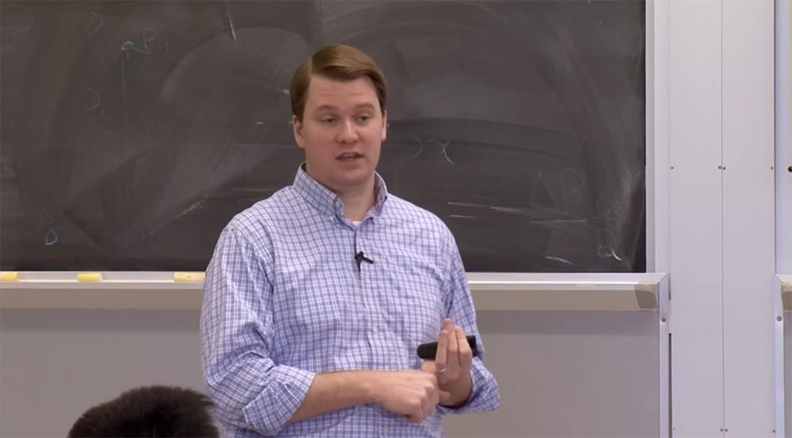

PCI 3.0, который является шестым крупным обновлением стандарта, вводится в действие 1 января, так что мы находимся в процессе обеспечения соответствия ему всей нашей инфраструктуры.  
Reporting/Metrics/Alerting, отчётность, обеспечение показателей и выдача оповещений, тоже относятся к сфере нашей работы.

Для защиты конечных точек используется ряд продуктов, показанных на следующем слайде. Сверху вроде бы изображён орёл. Существует инструмент под названием CrowdStrike, который в настоящее время тестируется в нашем отделе IS&T. В основном он отслеживает аномальное поведение с точки зрения системного вызова.

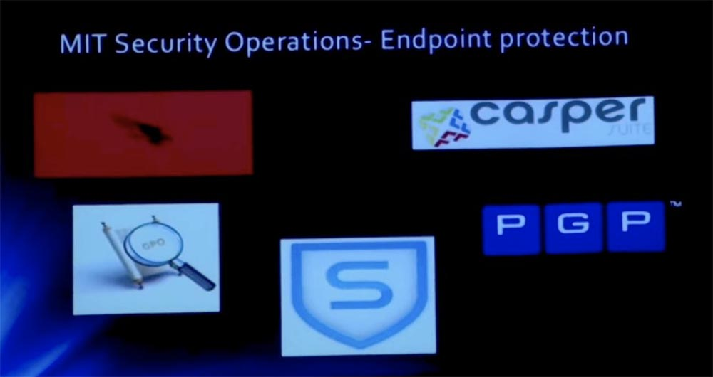

Например, если вы используете MS Word, и программа внезапно начинает делать что-то, что не должна делать, например, пытаться прочитать базу данных учетной записи из системы или кучу паролей, CrowdStrike предупреждает об этом и выбрасывает тревожный флаг. Это облачный инструмент, о котором мы поговорим позже. Все эти данные отправляются на центральную консоль, и если компьютеры пытаются делать что-то злонамеренное, о чем свидетельствует эвристическая поведенческая перспектива, они получают красный флаг.

GPO — Объекты Групповой Политики, это система, осуществляющая внедрение групповых политик безопасности. S — это всевозможные программы компании Sophos для защиты от вредоносных приложений, антивирусы, все вещи, которые мы ожидаем получить при покупке продуктов для защиты конечной точки.

PGP выполняет шифрование жесткого диска для тех систем кампуса, в которых присутствуют конфиденциальные данные.

Некоторые из этих инструментов заменяются более совершенными. Отрасль всё более следует в направлении нейтральной к поставщикам политики, используя такие решения, как BitLocker для Windows или FileVault для Mac, так что мы изучаем и эти варианты. Программа Casper в основном управляет политиками безопасности компьютеров под управлением Mac OS.

Что касается защиты сети, то мы в этой области сотрудничаем с компанией Akamai — это компания, которая фактически вышла из MTI, в ней работает множество наших выпускников. Они обеспечивают очень хорошее техническое обслуживание, поэтому мы пользуемся множеством услуг, которые они предоставляют.

Позже мы поговорим о них достаточно подробно.

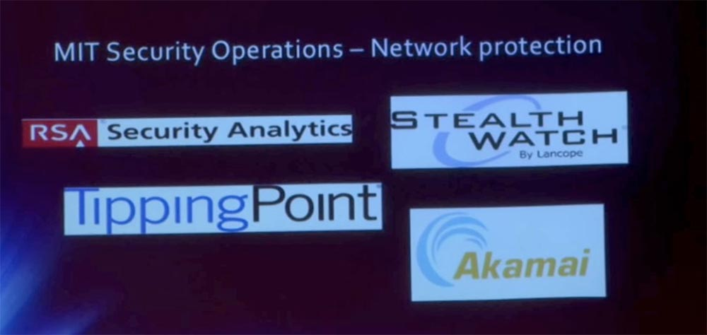

TippingPoint – это идентификатор рисков, система обнаружения вторжений. Как я уже сказал, некоторые из этих инструментов постоянно совершенствуются, и TippingPoint служит этому примером. Благодаря ему мы имеем систему предохранения вторжения на нашей границе. На самом деле мы их не предотвращаем, а просто обнаруживаем. Мы вообще ничего не блокируем на границе сети MIT, используя некоторые очень простые и широко распространённые правила анти-спуфинга.

Stealth Watch является инструментом, который генерирует данные NetFlow, или, правильнее сказать, собирает данные NetFlow. Мы используем устройства Cisco, но все сетевые устройства выводят наружу некоторые детали, метаданные потоков, которые они посылают, порт источника, порт назначения, исходный IP-адрес, конечный IP-адрес, протокол и так далее. StealthWatch собирает эти данные, выполняет по ним основной анализ безопасности, а также предоставляет API, который мы можем использовать, чтобы делать более умные вещи.

RSA Security Analytics — еще один инструмент, действующий во многих отношениях как идентификатор «на стероидах». Он выполняет полный захват пакетов, поэтому вы можете увидеть их содержимое, если оно будет помечено красным флагом.

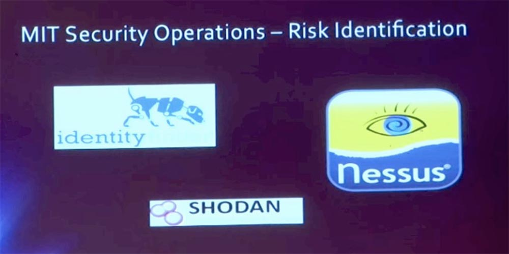

В области идентификации рисков Nessus — это своего рода инструмент оценки уязвимости де-факто. Обычно мы используем его по требованию, мы не развертываем его в целом на поддомен сети 18/8. Но если мы получаем для программного обеспечения кампуса некоторые дополнения DLC, то используем Nessus для оценки их уязвимостей.

Shodan называют компьютерной поисковой системой. В основном, он сканируют интернет в целом и предоставляет много полезных данных о его безопасности. У нас есть подписка на этот «движок», так что мы можем пользоваться этой информацией.

Identity Finder — это инструмент, который мы используем в местах, где имеется PII, конфиденциальная личная информация, для того, чтобы соответствовать правилам о защите регистрационных данных и просто убедиться, что мы знаем, где находятся важные данные.

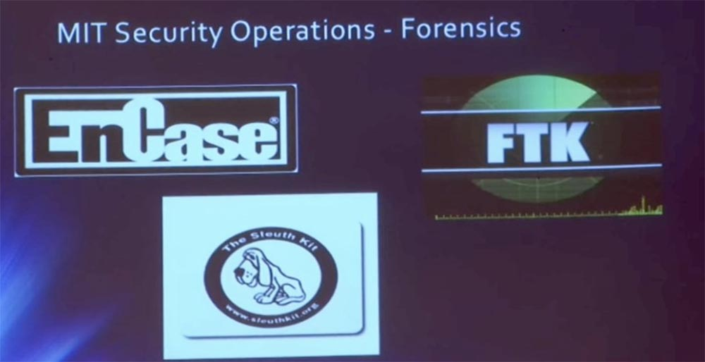

Компьютерная криминалистика – это дело, которым мы занимаемся периодически… я не могу найти подходящих слов, потому что мы не занимаемся этим регулярно, иногда такие расследования отнимают массу времени, иногда не очень. Для этого у нас тоже имеется набор инструментов.

EnCase это инструмент, который позволяет нам снимать образы дисков и с их помощью рассматривать содержимое HDD.

FTK, или Forensic Tool Kit – набор инструментов для проведения расследований в области компьютерной криминалистики. К нам часто обращаются, когда необходимо снять образы дисков при рассмотрении спорных случаев подтверждения интеллектуальной собственности или в некоторых других случаях, которые рассматривает OGC — офис генерального юристконсульта. У нас для этого есть все необходимые инструменты. Честно говоря, это не постоянная работа, она появляется периодически.

Итак, как мы собираем все эти данные вместе? Марк упоминал корреляцию. Для обеспечения управления системой мы обрабатываем системные логи. Вы видите, что у нас есть логи NetFlow, некоторые логи DHCP, логи идентификаторов и логи Touchstone.

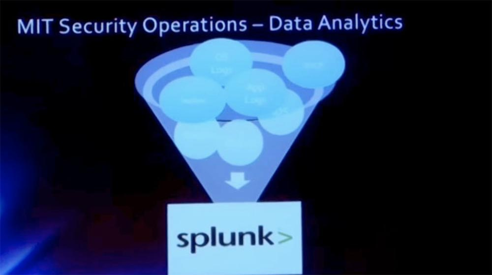

Splunk — это инструмент, который выполняет большую часть корреляционной работы и принимает данные, которые не обязательно бывают нормализованными, нормализует их и позволяют нам сравнивать данные из различных источников, чтобы получить больше «разведданных». Таким образом, можно отобразить страницу, на которой будут зафиксированы все ваши входы в систему, и наложить на это GeoIP, чтобы отображать также места входа в систему.

Давайте поговорим об атаках и более интересных вещах, чем ПО, которое мы используем. Во-первых, мы поговорим о наиболее распространённых в течение пары последних лет атаках типа «отказ в обслуживании». Мы также поговорим о конкретных нападениях, которые произошли в результате трагедии Аарона Шварца несколько лет назад, они также связаны с распределенными DoS-атаками.

Сейчас я покажу вам «букварь» DoS. Первая DoS-атака атака направлена на букву А Триады компьютерной безопасности CIA. CIA – это аббревиатура, составленная из Confidentiality — конфиденциальности, Integrity — целостности и Availability — доступности. Так что DoS атака направлена в первую очередь на доступность, Availability. Злоумышленник хочет отключить ресурс, чтобы законные пользователи не могли его использовать.

Это может быть порча страницы. Это очень просто, не так ли? Цифровое граффити просто испортит страницу так, что никто не сможет её увидеть. Это может быть гигантское потребление ресурсов, где атака «съедает» все вычислительные мощности системы и всю пропускную способность сети. Эту атаку может осуществить один человек, но вполне вероятно, что хакер пригласит друзей, чтобы организовать целую DDoS – вечеринку, то есть распределённую атаку отказа в обслуживании.

Современные тенденции DDoS приведены в отчёте Arbor Network. Это расширение поверхности атаки, причём самой распространённой мотивацией является хактивизм, на его долю приходится до 40% таких атак, мотивация ещё 39% остаётся неизвестной. Интенсивность атак, по крайней мере, в прошлом году, достигала 100 Гбит/с. В 2012 году произошла атака на организацию Spamhaus, которая достигала интенсивности 300 Гбит/с.

DDoS-атаки становятся более длительными. Так, хакерская операция Abibal, направленная против финансового сектора США, длилась несколько месяцев, периодически увеличивая интенсивность до 65 Гбит/с. Я слышал об этом, и вы можете найти подтверждения в Google, что эта атака длилась практически постоянно, и её невозможно было остановить. Позже мы поговорим о том, как они это сделали.

Но, честно говоря, 65 Гбит/с или 100 Гбит/с, разница для жертвы не большая, потому что редко какие системы в мире могут выдержать продолжительную атаку такого масштаба, потому что её просто невозможно прекратить. В последнее время наблюдается сдвиг в сторону атак отражения и усиления. Это атаки, для которых вы берете небольшой входной сигнал и превращаете в большой выходной сигнал. В этом нет ничего нового, это восходит к атаке ICMP Smurf, где вы бы пропинговали широковещательный адрес сети и каждую машину в этой сети, которая ответит предполагаемому отправителю пакета, который, конечно же, будет подделан. Например, я притворюсь Марком и отправлю пакет на широковещательный адрес этого класса. И вы все начнёте отвечать пакетами Марку, думая, что он их отправил. Между тем, я сижу в углу и смеюсь. Так что в этом нет ничего нового, потому что я читал о таком способе, будучи ещё студентом.

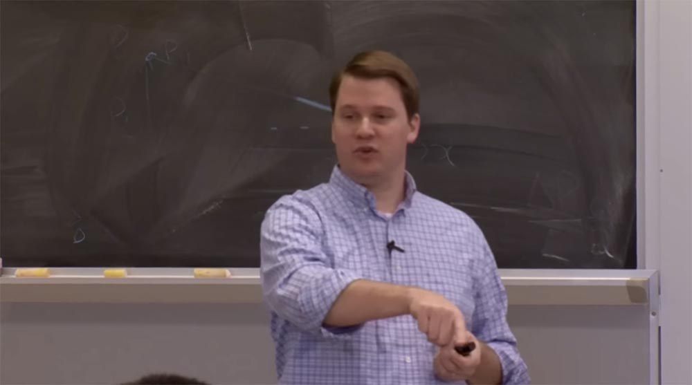

Итак, следующая разновидность DDoS-атак – UDP Amplifacation, или «амплификация UDP». UDP- это протокол пользовательских датаграмм типа «сжечь и забыть», верно? Это не TCP, он совершенно не надёжен и не ориентирован на создание безопасных соединений. Его очень легко подделать. То, что мы видели за последний год, — это эксплойты усиления функций трех протоколов: DNS, порт 53, UDP. Если вы отправили 64 байта запроса типа ANY неправильно сконфигурированному серверу, он сгенерирует ответ размером 512 байт, который вернётся к жертве атаки. Это 8-кратный коэффициент усиления, что совсем неплохо для организации DoS–атаки.

Когда возникла тенденция усиления атак такого типа, мы стали их свидетелями здесь, в сети mit.net раньше, чем их стали массово использовать против жертв в коммерческом секторе. Мы видели 12-гиговую атаку амплификации DNS, которая существенно повлияла на нашу исходящую пропускную способность. У нас достаточно высокая пропускная способность, но добавление таких объёмов данных к легальному трафику вызвало проблему, и мы с Марком вынуждены были её решить.

SNMP, который является протоколом порта UDP 161 — очень полезный протокол управления. Он позволяет удалённо оперировать данными с помощью операторов get/set. Множество устройств, например, сетевые принтеры, позволяют доступ get без всякой аутентификации. Но если вы отправляете запрос типа GetBulkRequest размером 64 байта устройству, которое неправильно настроено, оно пришлёт жертве ответ, размер которого может превысить размер запроса в 1000 раз. Так что это даже лучше предыдущего варианта.

Как нападающий, вы обычно выбираете целевые атаки, поэтому мы были свидетелями массовых атак на принтеры, расположенные в сети нашего кампуса. Используя принтер с открытым агентом SNMP, хакер посылал ему пакеты, и тысячекратно увеличенный в размере ответ загрязнял всю интернет-сеть.

Далее следует протокол сервера времени, или протокол сетевого времени NTP. При его использовании неправильно настроенный сервер будет отвечать на запрос «MONLIST». Здесь основой атаки будет не амплификация, а ответ на запрос monlist в виде списка 600 последних клиентов NTP. Таким образом, небольшой запрос зараженного компьютера отправляет жертве большой UDP-трафик.

Это очень популярный вид атаки, и мы попали в крупную переделку из-за неправильной настройки NTP monlist. В итоге мы сделали несколько вещей для смягчения этих атак. Так, на стороне NTP мы отключили команду monlist на NTP сервере, и это позволило «убить» атаку в его треках. Но поскольку у нас государственное учреждение, существуют вещи, которых мы не имеем права касаться, потому мы отключили monlist настолько, насколько позволяли нам полномочия. В конечном итоге мы просто ограничили скорость NTP на границе сети MIT для уменьшения воздействия отвечающих нам систем, и вот уже год, как мы существуем без каких-либо негативных последствий. Ограничение скорости на несколько мегабит безусловно лучше, чем гигабайты, которые мы до этого отправляли в интернет. Так что это решаемая проблема.

Заботиться о безопасности DNS немного сложнее. Мы начали использовать сервис Akamai под названием eDNS. Компания Akamai предоставляет этот сервис на правах разделенных зон хостинга, поэтому мы использовали их eDNA и раздвоили наши DNS, наше системное пространство доменных имен, на 2 яруса. Мы возложили на Akamai внешний ярус external view, а внутренний internal view возложили на серверы, которые всегда обслуживали MIT. Мы заблокировали доступ к внутренним сетям таким образом, что только клиенты MIT могли попасть на наши внутренние серверы, а остальной мир оставили на попечении Akamai.

Преимущество eDNS компании Akamai — это контент, распределённый в сети интернет по всему миру, это географически распределённая сетевая инфраструктура, подающая контент из Азии, Европы, Северной Америки, с Востока и Запада. Хакеры не могут уничтожить Akamai, поэтому нам не нужно беспокоиться о том, что наш DNS когда-либо отключится. Вот так мы решили эту проблему.

На следующих слайдах презентации перечислены методы осуществления DDoS–атак. Первый, Source Obfuscation, заключается в сокрытии реального адреса атакующего. Это делается для того, чтобы избежать обнаружения и судебного преследования. Я не стану вдаваться в подробности и пропущу этот слайд.

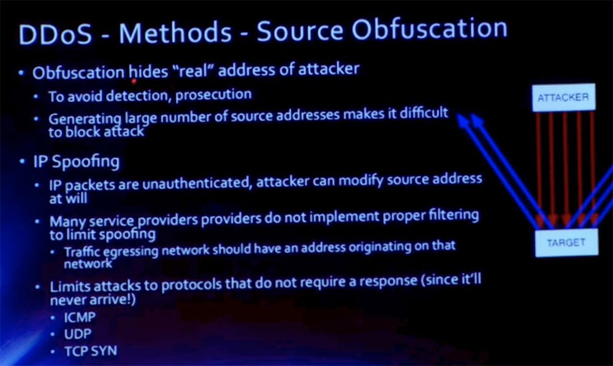

Следующий метод осуществления DDoS — атаки – это создание сети ботнет. Смысл атаки заключается в том, чтобы уничтожить сеть противника с помощью ботов.

Сети ботнет сейчас просто огромны. Бот «itsoknoproblembro» (все в порядке, без проблем, братан) использовался во время операции Ababil, которая была нацелена на финансовый сектор США. Для создания «brobot» хакеры воспользовались уязвимостями инсталляции движков Wordpress и Joomla.

В этом случае, вместо того, чтобы просто подделывать кучу пакетов с одного хоста, мы используем ботнет легитимных систем, которые не нужно подделывать. То есть хакеру не нужно скрывать или подделывать свой реальный адрес, он просто использует тысячи чужих компьютеров. Поскольку это легальные компьютеры, они будут реагировать, скажем, на TCP SYN-ACK, и можно организовать атаки на высшем уровне, такие как атака HTTP-сервера с использованием массы запросов GET и POST.

Следующий метод DDoS-атак предусматривает использование стрессоров. Стрессоры – это аутсорсинг сети ботнет, вы нанимаете их выполнять тестирование нагрузки на сеть.

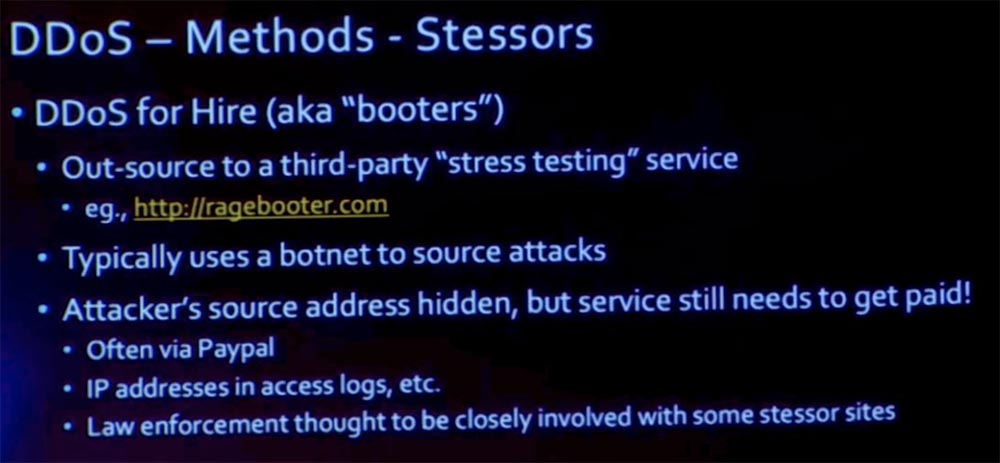

Без сомнения, имеются легальные компании-стрессеры, например, Ragebooter. Но существуют и другие, нелегальные, помогающие осуществить DDoS-атаку на основе аутсорсинга чужих сетей ботнет. Адрес атакующего остаётся скрытым, но это платная услуга, и обычно оплата осуществляется через сервис PayPal.

Рассмотрим стратегии смягчения последствий DDoS-атак. Мы можем использовать целевой DNS-сервер для смягчения атак, как мы поступили с Akamai. На картинке вы видите схему такой защиты.

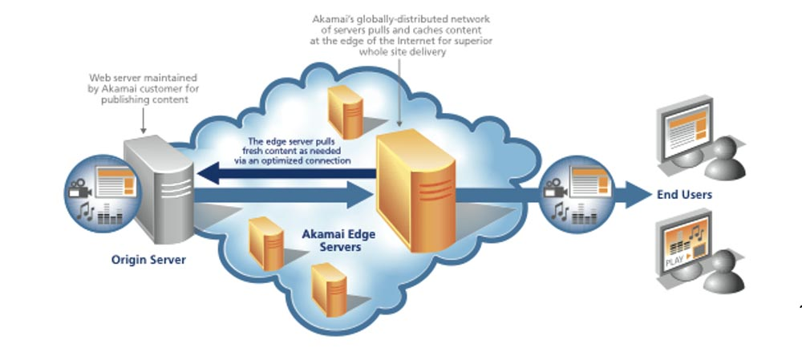

У нас была подобная атака на наш веб-сервер, поэтому я просто кратко расскажу вам об этом. Одной из атак, последовавшей за трагедией Шварца, была атака на MIT. Она просто «положила» наш веб-сервер. Для предотвращения подобных случаев в будущем мы решили использовать раздвоенный, или двухъярусный DNS. Наш исходный сервер используется для связи внутренних клиентов с внутренней сетью MIT. Для зеркального отображения сети MIT мы использовали распределённую сеть контента Akamai, а затем мы использовали внешний ярус нашего DNS, чтобы указать его внешним клиентам Akamai.

Таким образом, когда пользователь интернета хочет воспользоваться сетью MIT, он фактически связывается с CDN-сервером Akamai, который обслуживает наш контент. Если этот контент по каким-то причинам не может быть представлен внешнему клиенту прямо из кеша, потому что это динамический кеш, то исходный сервер MIT передаст этот контент Akamai, а уже сервер Akamai предоставит этот контент пользователю, после чего потенциально может кэшировать его на некий период времени. Через минуту я расскажу о самой атаке, пока что замечу, что защитой от таких атак стало решение установить промежуточный веб-сервер в территориально-распределённой сети контента Akamai.

Я упомянул несколько нападений, в том числе атаку NTP, и собираюсь упомянуть еще несколько. Но в принципе, это были атаки brute-force, которые просто пытались минимизировать нашу пропускную способность. И хотя мы являемся поставщиком крупнейшего объёма трафика, даже у нас возникли проблемы с обработкой десятков гигабит лишнего трафика. Поэтому в таком случае ваши варианты защиты действительно ограничены, не так ли?

Если это поддельный трафик, то как вы собираетесь устанавливать фильтр на своей границе, чтобы его заблокировать? Предположим, что как только он добрался до вашей границы, где вы собираетесь его отфильтровать, он сразу же зафлудил ваши каналы. Так как же от этого можно защититься? Вы должны затолкать его обратно в облако, в интернет, и заблокировать его там.

Для смягчения последствий мы решили использовать протокол граничного шлюза BGP. Если вы знакомы с BGP, то знаете, что это векторный протокол, который выполняет маршрутизацию в интернете. Он служит для обмена информацией между автономными системами, которые обозначаются собственным номером автономной системы ASN. Каждая многоцелевая организация в интернете имеет свой номер ASN, и BGP использует эти номера для построения путей через интернет, так что вы можете воспользоваться различными путями, чтобы добраться до определенного ASN.

В этом случае я использую пример с номером 123, потому что я создал его для другой организации. Мы пережили три атаки, так что восстановились быстрее, Гарвард пережил 11 атак, от которых оправился немного медленнее.

Итак, у нас есть путь, начало этого пути ASN123, конец – ASN789. Между ними существует некая последовательность автономных систем ASE, через которую должен пройти этот пакет.

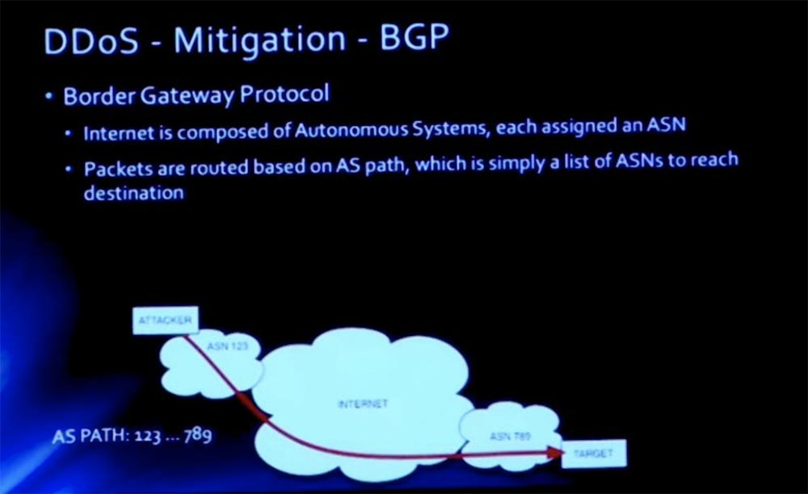

Для смягчении BGP мы просто вводим другой ASN, который обрабатывает наш трафик MIT. В данном случае это ASN456. Эта система собирается стать нашим легальным «человеком посередине», и мы собираемся позволить ей публиковать наши префиксы. Например, когда атакуют нашу сеть с префиксом 18.1.2.3.0/24 и небольшой кусок из 255 адресов MIT подвергается атаке, мы позволяем этому ASN456 публиковать данный префикс от нашего имени.

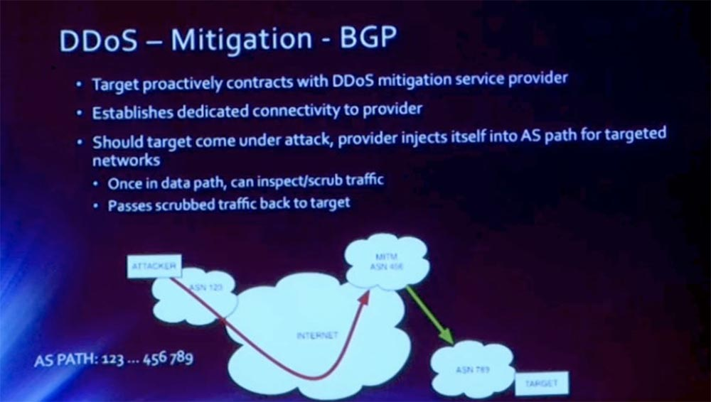

Как только это изменение распространяется через интернет, весь трафик начинает входить в это облако. В данном случае этой автономной системой AS выступает Akamai. Они имеют серии скрубберов и могут обеспечить такую высокую пропускную способность, которую мы обеспечить не в состоянии.

Таким образом, на заднем плане этого соединения имеется частное соединение «Акамаи», где они очищают предназначенный для нас трафик. Благодаря этому мы можем избежать потенциально смертельные атаки такого рода, способные вывести нас из строя.

Прежде чем мы продолжим, я хочу знать, имеются ли у вас вопросы по вышеизложенному?

**Аудитория:** вы упомянули границы сети MIT, поэтому я хочу понять, что они собой представляют.

**Дэвид Лапорт:** сейчас я попробую нарисовать на доске схему. MIT имеет три граничных маршрутизатора: External 1, External 2 и External 3. Справа расположена стандартная звездообразная топология сети MIT. У нас есть основные коммутаторы, подключенные к уровню распределения, затем они выходят к слоям доступа и так далее. Таким образом, нашу сеть ограничивают 3 границы E1,2,3, за которыми расположено несколько поставщиков интернета. Например, наши коммерческие провайдеры скоро будут обслуживать оба наших пограничных маршрутизатора. Этот внешний маршрутизатор 3, это не настоящее его название, в основном предназначен для пиринга исследований. То есть у нас существует разграничение между коммерческим пирингом и пирингом исследований.

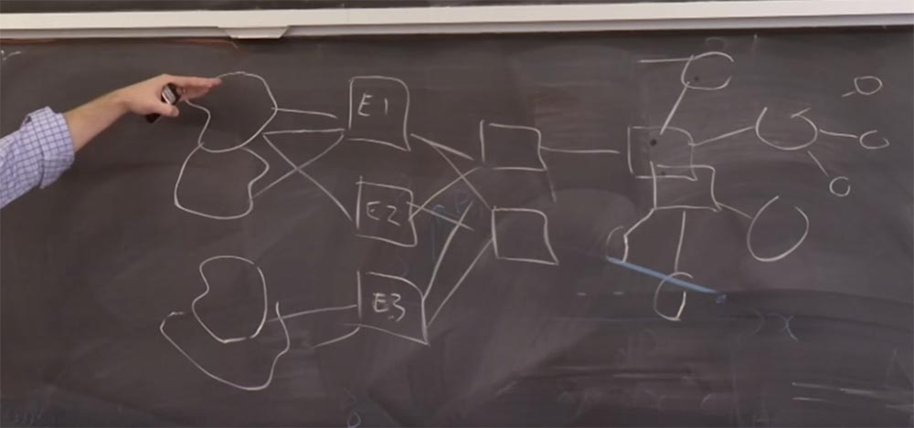

Таким образом, все, что касается BGP, происходит между нашей внешней границей и провайдерами. Два прямоугольника правее граничных маршрутизаторов – это просто роутеры, осуществляющие связь между границей и ядром сети.

Итак, в ответ на трагедию Шварца, думаю, это произошло 2 года назад, некоторые хактивисты решили атаковать MIT, и мы пережили три атаки. Я расскажу про все три, потому что это были отдельные атаки разных типов.

Первая атака была направлена против нашей инфраструктуры. Наш институт всегда придерживался политики открытости в области обмена знаниями. У нас очень открытая сеть, особенно по сравнению с другими учебными заведениями. Это является проклятием для безопасности, но мы открыты миру.

В этом случае наши пограничные маршрутизаторы, эти квадратики E1,2,3, которые мы только что нарисовали, были запущены с устаревшей версией ПО, уязвимой для конкретной атаки типа «отказ в обслуживании».

Нападавшие оправляли поток с очень низкой пропускной способностью, 100 Кбит/с, и это было совершенно незаметно, фактически он не затрагивал устройства и дебаггинг. Но они направляли его в интерфейс управления этих устройств, и эти устройства просто «отваливались» от сети. Они не умерли, но их процессоры были загружены по максимуму. Поэтому они не маршрутизировали пакеты mit.net, и наша сеть оказалась в режиме оффлайн.

Такой была первая испытанная нами атака. Думаю, это было в то время, когда команда Patriots проводила свою игру плей-офф. Иногда я думаю, что эти атаки планируются специально под какое-то значимое событие, отвлекающее внимание технического персонала от наблюдения за сетью. В итоге мы сразу же обновили программное обеспечение до исправленной версии, то есть сориентировались в ситуации довольно быстро и подлатали нашу триаду безопасности.

В долгосрочной перспективе нам нужно было бы исправить то, что позволяет посторонним людям в интернете получать доступ к нашим интерфейсам управления, верно? Очень немногие должны иметь возможность получить доступ к этому интерфейсу. В конечном итоге мы реализовали такую систему привилегий, что доступ к интерфейсу могли получить только IP-адреса наших сотрудников в сети VPN. Кроме того, мы перестали использовать протоколы управления с открытым текстом. Вот что было исправлено перед тем, как произошла вторая атака.

**Аудитория:** правильно ли считать, что это была атака нулевого дня против поставщика услуг?

**Дэвид Лапорт:** я думаю, было бы справедливо сказать, что это не было атакой нулевого дня. Вторая атака была против самой сети web.mit.edu. И это было то, на что я ссылался при описании смягчения DNS-атак. Инфраструктура web.mit.edu находилась в нашем дата-центре, защищенном файрволом. Злоумышленник отправил нам поток HTTP-трафика GET/POST, не могу сказать точно, GET или POST. В принципе, они не убили веб-сервер, а просто отключили файрвол. Список доступа к роутеру без сохранения состояния очень прост и обеспечивает быструю работу, но при этом теряется множество деталей, которые вы можете фильтровать. Потому что вы пересылаете пакет за пакетом, и критерии фильтрации применяются к каждому пакету, порту и IP-адресу. Мы спрятались за брандмауэром, который работал хорошо, когда он работал в нормальных условиях, но когда на него пришлась огромная нагрузка, вынуждающая его отслеживать каждое состояние в добавок к отслеживанию каждого пакета, он просто «лег».

Исправление для этой атаки заключалось в том, что мы стали использовать маршрутизируемую сеть. Мы бы предпочли этого не делать, но были вынуждены так поступить из-за перенесенной атаки. Более долгосрочное смягчение, которое мы выполнили, заключалось в том, что мы переехали на Akamai CDN. Вы можете заметить, что если находитесь за пределами сети MIT и связываетесь с web.mit, то домен 18.09.22 больше не используется. Вас переадресовывает к доменному имени C, которое в свою очередь, направляет вас к IP-адресу Akamai.

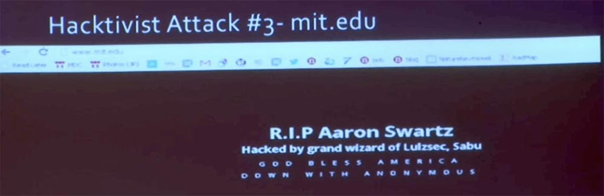

Третья атака фактически была не на стороне mit.net, а на стороне нашего регистратора. Вот что мы увидели на домашней странице сайта [www.mit](http://www.mit/) и web.mit – контент был заменён этим изображением. Мы быстро сделали диагностику на веб-сервере. Все выглядело прекрасно, наш сервер не был взломан. То есть страница была испорчена другим способом.

В конечном итоге мы обнаружили, что информация who_is для нашего имени и нашего DNS просто не работала. На этом слайде вы видите изменения, внесенные хакером в блоке «Административные контакты» — «Я завладел этим – Массачусетский технологический институт» и уничтоженный адрес для сетевых операций – DESTROYED, MA 02139-4307.

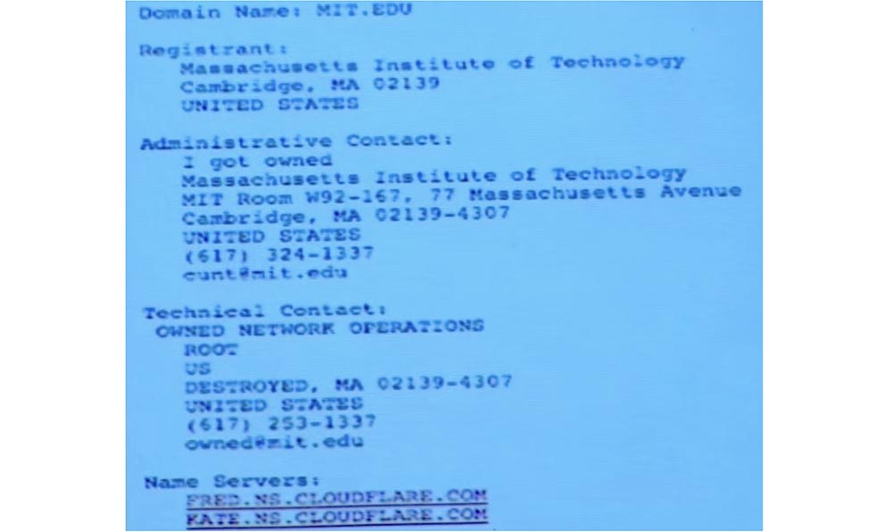

Атакующие были нацелены конкретно на нас, но всё это было делегировано двум облачным хостинг-провайдерам CloudFlare.

58:30 мин

[Курс MIT «Безопасность компьютерных систем». Лекция 22: «Информационная безопасность MIT», часть 3](https://habr.com/company/ua-hosting/blog/434346/)

Полная версия курса доступна [здесь](https://ocw.mit.edu/courses/electrical-engineering-and-computer-science/6-858-computer-systems-security-fall-2014/).

Спасибо, что остаётесь с нами. Вам нравятся наши статьи? Хотите видеть больше интересных материалов? Поддержите нас оформив заказ или порекомендовав знакомым, **30% скидка для пользователей Хабра на уникальный аналог entry-level серверов, который был придуман нами для Вас:** [Вся правда о VPS (KVM) E5-2650 v4 (6 Cores) 10GB DDR4 240GB SSD 1Gbps от $20 или как правильно делить сервер?](https://habr.com/company/ua-hosting/blog/347386/) (доступны варианты с RAID1 и RAID10, до 24 ядер и до 40GB DDR4).

**VPS (KVM) E5-2650 v4 (6 Cores) 10GB DDR4 240GB SSD 1Gbps до января бесплатно** при оплате на срок от полугода, заказать можно [тут](https://ua-hosting.company/vpsnl).

**Dell R730xd в 2 раза дешевле?** Только у нас **[2 х Intel Dodeca-Core Xeon E5-2650v4 128GB DDR4 6x480GB SSD 1Gbps 100 ТВ от $249](https://ua-hosting.company/serversnl) в Нидерландах и США!** Читайте о том [Как построить инфраструктуру корп. класса c применением серверов Dell R730xd Е5-2650 v4 стоимостью 9000 евро за копейки?](https://habr.com/company/ua-hosting/blog/329618/)