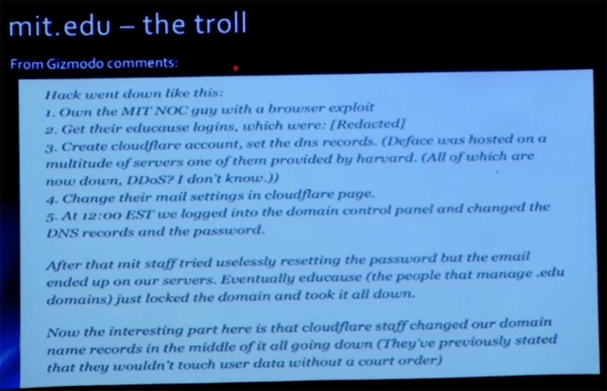
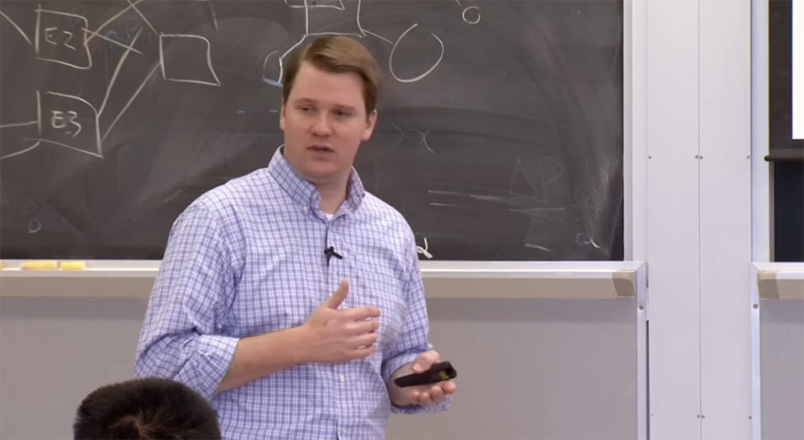
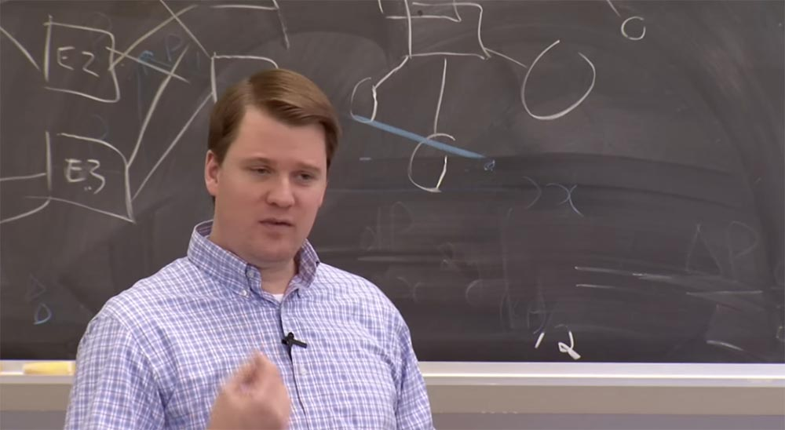
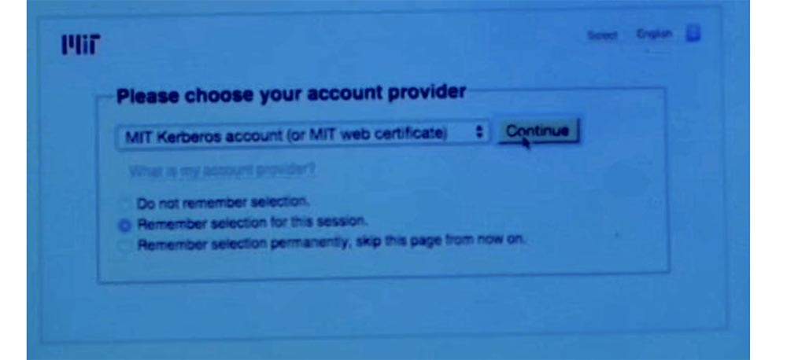
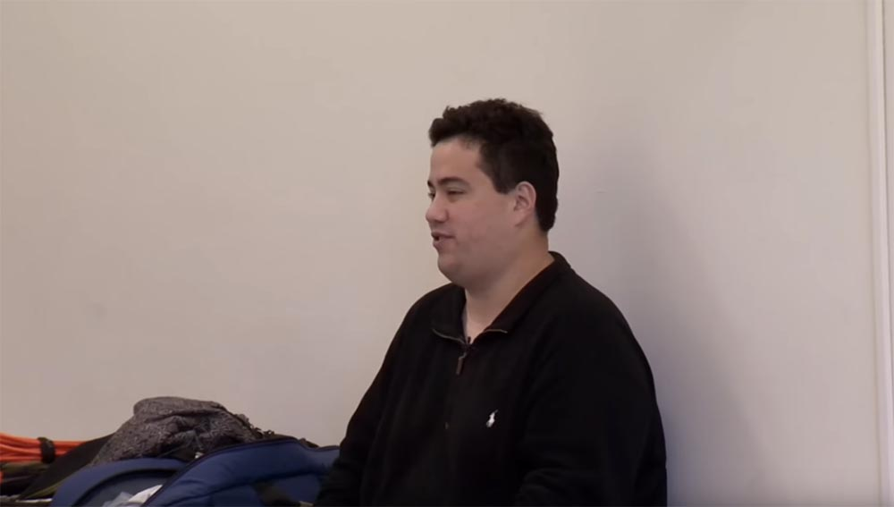
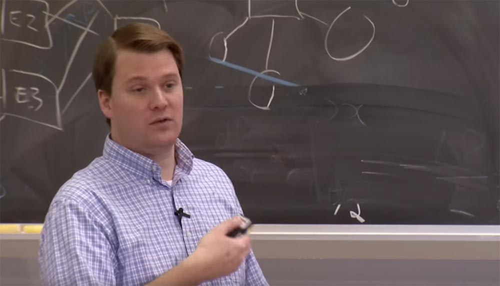
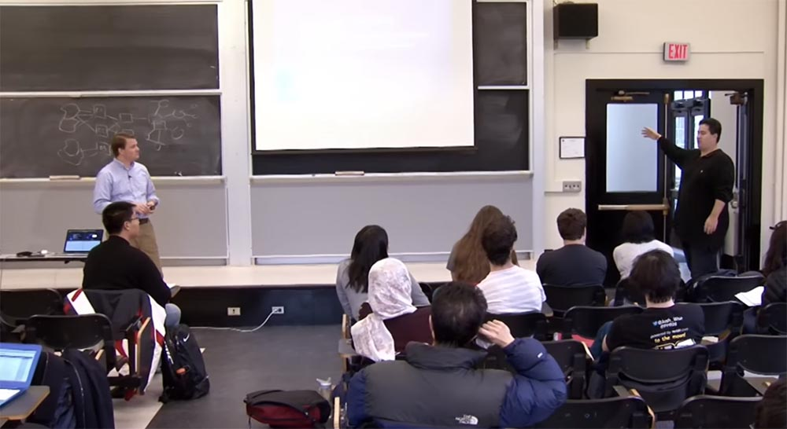
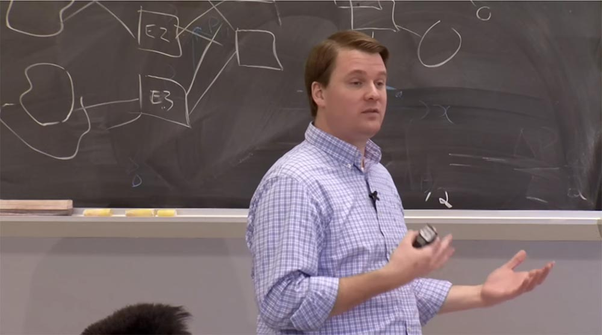
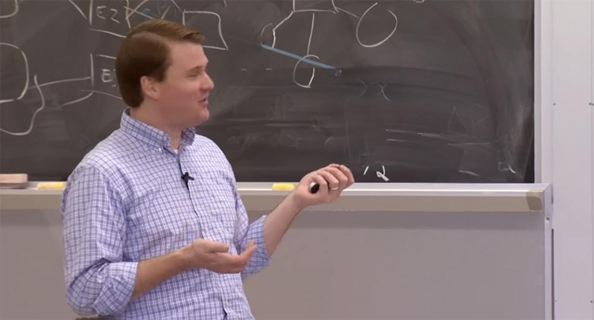
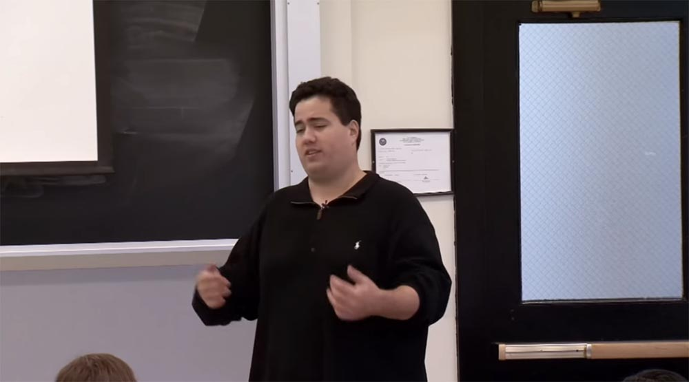

Курс MIT «Безопасность компьютерных систем». Лекция 22: «Информационная безопасность MIT», часть 3 / Блог компании ua-hosting.company

### Массачусетский Технологический институт. Курс лекций #6.858. «Безопасность компьютерных систем». Николай Зельдович, Джеймс Микенс. 2014 год

Computer Systems Security — это курс о разработке и внедрении защищенных компьютерных систем. Лекции охватывают модели угроз, атаки, которые ставят под угрозу безопасность, и методы обеспечения безопасности на основе последних научных работ. Темы включают в себя безопасность операционной системы (ОС), возможности, управление потоками информации, языковую безопасность, сетевые протоколы, аппаратную защиту и безопасность в веб-приложениях.

Лекция 1: «Вступление: модели угроз» [Часть 1](https://habr.com/company/ua-hosting/blog/354874/) / [Часть 2](https://habr.com/company/ua-hosting/blog/354894/) / [Часть 3](https://habr.com/company/ua-hosting/blog/354896/)  
Лекция 2: «Контроль хакерских атак» [Часть 1](https://habr.com/company/ua-hosting/blog/414505/) / [Часть 2](https://habr.com/company/ua-hosting/blog/416047/) / [Часть 3](https://habr.com/company/ua-hosting/blog/416727/)  
Лекция 3: «Переполнение буфера: эксплойты и защита» [Часть 1](https://habr.com/company/ua-hosting/blog/416839/) / [Часть 2](https://habr.com/company/ua-hosting/blog/418093/) / [Часть 3](https://habr.com/company/ua-hosting/blog/418099/)  
Лекция 4: «Разделение привилегий» [Часть 1](https://habr.com/company/ua-hosting/blog/418195/) / [Часть 2](https://habr.com/company/ua-hosting/blog/418197/) / [Часть 3](https://habr.com/company/ua-hosting/blog/418211/)  
Лекция 5: «Откуда берутся ошибки систем безопасности» [Часть 1](https://habr.com/company/ua-hosting/blog/418213/) / [Часть 2](https://habr.com/company/ua-hosting/blog/418215/)  
Лекция 6: «Возможности» [Часть 1](https://habr.com/company/ua-hosting/blog/418217/) / [Часть 2](https://habr.com/company/ua-hosting/blog/418219/) / [Часть 3](https://habr.com/company/ua-hosting/blog/418221/)  
Лекция 7: «Песочница Native Client» [Часть 1](https://habr.com/company/ua-hosting/blog/418223/) / [Часть 2](https://habr.com/company/ua-hosting/blog/418225/) / [Часть 3](https://habr.com/company/ua-hosting/blog/418227/)  
Лекция 8: «Модель сетевой безопасности» [Часть 1](https://habr.com/company/ua-hosting/blog/418229/) / [Часть 2](https://habr.com/company/ua-hosting/blog/423155/) / [Часть 3](https://habr.com/company/ua-hosting/blog/423423/)  
Лекция 9: «Безопасность Web-приложений» [Часть 1](https://habr.com/company/ua-hosting/blog/424289/) / [Часть 2](https://habr.com/company/ua-hosting/blog/424295/) / [Часть 3](https://habr.com/company/ua-hosting/blog/424297/)  
Лекция 10: «Символьное выполнение» [Часть 1](https://habr.com/company/ua-hosting/blog/425557/) / [Часть 2](https://habr.com/company/ua-hosting/blog/425561/) / [Часть 3](https://habr.com/company/ua-hosting/blog/425559/)  
Лекция 11: «Язык программирования Ur/Web» [Часть 1](https://habr.com/company/ua-hosting/blog/425997/) / [Часть 2](https://habr.com/company/ua-hosting/blog/425999/) / [Часть 3](https://habr.com/company/ua-hosting/blog/426001/)  
Лекция 12: «Сетевая безопасность» [Часть 1](https://habr.com/company/ua-hosting/blog/426325/) / [Часть 2](https://habr.com/company/ua-hosting/blog/427087/) / [Часть 3](https://habr.com/company/ua-hosting/blog/427093/)  
Лекция 13: «Сетевые протоколы» [Часть 1](https://habr.com/company/ua-hosting/blog/427763/) / [Часть 2](https://habr.com/company/ua-hosting/blog/427771/) / [Часть 3](https://habr.com/company/ua-hosting/blog/427779/)  
Лекция 14: «SSL и HTTPS» [Часть 1](https://habr.com/company/ua-hosting/blog/427783/) / [Часть 2](https://habr.com/company/ua-hosting/blog/427785/) / [Часть 3](https://habr.com/company/ua-hosting/blog/427787/)  
Лекция 15: «Медицинское программное обеспечение» [Часть 1](https://habr.com/company/ua-hosting/blog/428652/) / [Часть 2](https://habr.com/company/ua-hosting/blog/428654/) / [Часть 3](https://habr.com/company/ua-hosting/blog/428656/)  
Лекция 16: «Атаки через побочный канал» [Часть 1](https://habr.com/company/ua-hosting/blog/429390/) / [Часть 2](https://habr.com/company/ua-hosting/blog/429392/) / [Часть 3](https://habr.com/company/ua-hosting/blog/429394/)  
Лекция 17: «Аутентификация пользователя» [Часть 1](https://habr.com/company/ua-hosting/blog/429680/) / [Часть 2](https://habr.com/company/ua-hosting/blog/429682/) / [Часть 3](https://habr.com/company/ua-hosting/blog/429686/)  
Лекция 18: «Частный просмотр интернета» [Часть 1](https://habr.com/company/ua-hosting/blog/430204/) / [Часть 2](https://habr.com/company/ua-hosting/blog/430206/) / [Часть 3](https://habr.com/company/ua-hosting/blog/430208/)  
Лекция 19: «Анонимные сети» [Часть 1](https://habr.com/company/ua-hosting/blog/431262/) / [Часть 2](https://habr.com/company/ua-hosting/blog/431264/) / [Часть 3](https://habr.com/company/ua-hosting/blog/431266/)  
Лекция 20: «Безопасность мобильных телефонов» [Часть 1](https://habr.com/company/ua-hosting/blog/432616/) / [Часть 2](https://habr.com/company/ua-hosting/blog/432618/) / [Часть 3](https://habr.com/company/ua-hosting/blog/432620/)  
Лекция 21: «Отслеживание данных» [Часть 1](https://habr.com/company/ua-hosting/blog/432616/) / [Часть 2](https://habr.com/company/ua-hosting/blog/432618/) / [Часть 3](https://habr.com/company/ua-hosting/blog/432620/)  
Лекция 22: «Информационная безопасность MIT» [Часть 1](https://habr.com/company/ua-hosting/blog/434342/) / [Часть 2](https://habr.com/company/ua-hosting/blog/434344/) / [Часть 3](https://habr.com/company/ua-hosting/blog/434346/)

На следующем слайде приведено сообщение с Gizmodo, это то, что я называю троллингом. Со стороны нападавших это выглядело немного уклончивым, сколько бы их ни было. Здесь они сообщают всему миру, как взламывали нашу сеть, практически на следующий день после того, как это произошло.

Однако как только мы поняли, что взломали не MIT или что-либо в сети mit.net, а нашего регистратора, мы немедленно с ним связались, поменяли наши записи и всё заблокировали. Однако в DNS ещё какое-то время присутствовали данные, некоторые из них существуют часами, так что после принятия мер мы ещё наблюдали некоторый поток трафика. И вот пока мы пытались ликвидировать последствия атаки, хакеры публикуют на Gizmodo такие комментарии: «Захватили парня из центра управления сетью с помощью эксплойта браузера». Парня! «Получили их учебные логины, которые были бла-бла-бла», и так далее. То есть вектором атаки будто бы был парень из центра управления сетью MIT NOC.

Марк клялся, что это был не он. На самом деле он не клялся, но объяснял, что не был скомпрометирован никоим образом. Поэтому после инцидента мы опубликовали правду про то, как на самом деле была организована атака. Эта ссылка [www.exploit-db.com/papers/25306](http://www.exploit-db.com/papers/25306/) все еще действует, если вы хотите прочитать об этом. В действительности хакеры взломали аккаунт регистратора нашего домена EDUCAUSE. Оказывается, что каждая учетная запись DNS была скомпрометирована. Мы не знаем, как долго хакеры владели этими данными, прежде чем решили использовать их для атаки на MIT. Никакой вины нашего института в случившемся не было. Позже, в 2013 году, регистратор признал свою ошибку, заключавшуюся в предоставлении доступа к домену верхнего уровня, и нам всем пришлось сменить пароли, так как около 7000 доменных имён mit.edu были скомпрометированы.

В итоге мы заблокировали учетную запись нашего домена, чтобы ее нельзя было изменить, но вы знаете, что если поставить галочку «заперто», которая не позволяет людям обновлять систему, это не очень хорошо. В любом случае, они исправили свою систему. Итак, в этом не было нашей вины, однако подобная атака была интересна в том смысле, что показала, как можно использовать для нападения некоторые из основных протоколов интернета.

Итак, текущий ландшафт угроз состоит из двух составляющих: социальные атаки и атаки на основе сетей. Атаки социального типа можно охарактеризовать девизом: «Если вы не можете использовать кремний, используйте углерод»! Иначе говоря, если вам не удалось проникнуть в «железо» жертвы, взломайте пользователя через его клавиатуру. Это то, что сейчас наблюдается особенно часто.

Основываясь на собственном 20-летнем опыте, могу сказать, что сетевые атаки, удалённо использующие хосты, происходят не часто. Компьютерные системы становятся все больше безопасными, по крайней мере, снаружи. Вы знаете, в старые времена, может быть, десять лет назад, Windows, Solaris и Linux продавались со всеми своими сервисами, и я говорил, что они светились, как рождественская елка. Все было включено, потому что из двух критериев – удобства и безопасности — они выбирали удобство, они хотели, чтобы пользователь получал всё прямо из коробки.

Сейчас, я считаю, мы нашли разумный компромисс. Когда вы устанавливаете «свежую» операционную систему, в ней запускается файрвол на основе хоста и нет никаких общедоступных сервисов. У нас есть такие вещи, как обновление Windows и обновление Apple, есть менеджеры пакетов во всех дистрибутивах Linux, так что ОС «из коробки», имея выход в интернет, довольно быстро обновится до актуальной на данный момент версии. Теперь у вас нет этих древних коробок с древними сервисами, открытыми всему миру.

Так вот, я клоню к тому, что хакеры поднялись вверх по стеку, возможно, на восьмой или девятый уровень. Сейчас они в большей степени имеют дело с людьми, чем с компьютерами. И они пытаются использовать недостатки или слабости человека, такие как страх, жадность, доверчивость, общительность, чтобы воспользоваться полномочиями законного пользователя и получить доступ к приложениям или привилегированный доступ к системе. Вместо использования хостов они используют людей.

Недавно в кампусе мы стали свидетелями событий, которые называются «целевой фишинг». Я не хочу никого пугать. Проявления этих атак наблюдались в учебных заведениях по всей стране. Это очень серьезная угроза, так что мы вынуждены были спешить, чтобы решить эту проблему, однако непосредственно MIT не пришлось столкнуться с такими атаками. Целевой фишинг направлен на конкретное сообщество и использует правдоподобные сообщения. В обычном спаме или фишинге злоумышленник просто массово рассылает сообщения по интернету, закидывают спаммерскую сеть, чтобы поймать людей, которые по какой-то странной причине, возможно, ответят на эти сообщения.

Однако при целевом фишинге злоумышленники сужают свою сеть и находят сообщество, которое верит в правдоподобность полученного сообщения, например, сообщество клиентов Bank of America или сообщество студентов, сотрудников и преподавателей MIT. В данном случае они смогли выбрать сообщества различных учреждений. Например, одним из таких сообществ стал Бостонский Университет. Злоумышленники атакуют сообщество фиктивными сообщениями электронной почты, указывающими на фиктивный сайт аутентификации. Некоторый процент пользователей щелкнул по ссылке и вошел в систему, что, конечно, предоставило злоумышленнику учетные данные. Затем злоумышленник перешел на настоящий сайт и перенаправил сбережения этих пользователей на свой счет. Сумма ущерба не сообщалась, но думаю, что она была большой.

Как с этим можно бороться? В значительной степени это проблема невежественности пользователя, поэтому необходимо осведомлять сообщества о таком виде мошенничества. Просто сообщите людям, что они не должны доверять электронной почте, и им придётся проверять ссылки, прежде чем нажимать на них. Однако из опыта и знаний человеческой природы следует, что всегда найдётся некий процент пользователей, которые проигнорируют данное предупреждение и нажмут куда не следует, и я просто поражаюсь этому. Можете представить, что мой почтовый ящик является получателем всех фишинговых сообщений, адресованных членам моей семьи. Я получаю почту от отца, от сестры, и иногда бывает трудно определить её достоверность, поэтому всегда нужно обращать внимание на адрес отправителя писем.

В настоящие время многие клиенты электронной почты не любят показывать вам ссылку на свой адрес, что очень раздражает, так что становится все труднее идентифицировать отправителя письма.

На мой взгляд, корень проблемы заключается в том, что пароли — это просто мертвая технология. Она основана на том, что вы знаете — это пароль; что вы из себя представляете — это биометрия; и на том, чем вы владеете — это токен. Атака методом «человек посередине» просто крадёт то, что вы знаете, то есть пароль. Но если вы можете к нему что-то добавить, это остановит атаку на половине пути, и хакеры не смогут скомпрометировать вашу идентичность.

В ближайшем будущем мы запускаем второй фактор аутентификации, который будет привязан к IDP Touchstone. Вы можете ознакомиться с ранним доступом к этой функции, если зайдёте на адрес duo.mit.edu, где мы используем вендора под названием Duo Security. Это облачная система двухфакторной аутентификации, которая используется во многих образовательных учреждениях. Принцип работы заключается в том, что вы регистрируете свой телефон в качестве второго фактора и используете для него небольшое мобильное приложение. Если у вас нет смартфона, вы можете пройти аутентификацию с помощью SMS, то есть система отправит вам сообщение с номером. Вы также можете создавать списки из 10-ти одноразовых паролей. В ближайшее время мы предоставим эту систему сообществу MIT, на данный момент она полностью функциональна, но пока не анонсирована.

Если вы хотите зайти на duo.mit.edu, можете выбрать свой телефон и включить идентификатор пользователя Touchstone. Сейчас я покажу вам короткое демо, как происходит интеграция в систему. Прелесть использования стандартов и федеративных систем типа SAML и Shibboleth, лежащих в основе Touchstone, состоит в том, что мы легко можем заложить дополнительные факторы аутентификации. Я намерен просто перейти к инструменту, который использую, и который наглядно проведёт мою аутентификацию в Touchstone с помощью моего сертификата.  
Сейчас я использую адрес atlas.mit.edu. Итак, вот мой обычный логин Touchstone, я нажму «Продолжить» и получу ещё одно приглашение.

К сожалению, похоже, что я не могу подключиться к Wi-Fi. Что ж, давайте оставим демо на потом, позже мы отредактируем видеозапись этой лекции (смех в аудитории).

Я не репетировал это демо, поэтому так получилось. Но поверьте мне, это работает. Если вы заходите через Duo, то можете зарегистрироваться, и все ваши взаимодействия с Touchstone будут теперь двухфакторными. Благодаря такой схеме аутентификации вы будете в полной безопасности. Это действительно хорошо работает.

Еще одна угроза, с которой мы столкнулись за последние несколько месяцев, это тоже целевой фишинг, только не учебных заведений, а людей по всей стране. Мы называем это «полицейским ID спуфингом». И такого рода махинации выходят за рамки цифрового мира. Мошенничество стоит в том, что членам сообщества MIT звонят будто бы из отделения полиции, расположенного вблизи их родного города. Сотрудники полиции сообщают им плохие новости. Они говорят, что вам вскоре будет предъявлено обвинение, связанное с налоговыми махинациями, или сообщают, что с вашим родственником произошёл несчастный случай, и предлагают решить проблему за определённую сумму.

Конечно, в действительности ничего этого нет. Звонок поступает от злоумышленника, который использует спуфинг исходящего звонка с помощью фальшивого определения номера ANI и SIP телефон, который настраивается так, чтобы получивший звонок доверял любой информации, расположенной в поле «От кого», независимо от того, с какого номера фактически поступил звонок.

**Марк Сайлис:** атакующий подписывается на дешевую услугу SIP, устанавливает в своём поле телефонный номер полицейского участка в Лексингтоне, и отправляет вам сообщение. Эта услуга носит название «SIP- телефония номера с подменой». Как только звонок добирается до шлюза перекодирования, который превращает его обратно в традиционную телефонию, программа говорит, что всё в порядке – это правильный номер, и именно мы покажем его пользователю.

**Дэвид Лапорт:** таким образом, вы в конечном итоге получаете звонок с очень плохой новостью из того места, которое, по вашему мнению, является полицейским участком. Опять же, преступники эксплуатируют человеческую слабость. В данном случае, это, вероятно, страх.

**Марк Сайлис:** или чувство вины.

**Дэвид Лапорт:** да, если вы не нарушали закон (cмеётся). Но в любом случае, суть всех звонков сводится к тому, что вы должны за что-то заплатить, хотя это и может показаться мошенничеством. Но если они скажут, что моя жена попала в автомобильную аварию, я не смогу хладнокровно оценить ситуацию и поверю всякой абсурдной информации, которую мне могут наговорить.

У нас в кампусе было несколько людей, которые получили такие звонки. Не думаю, что они заплатили, но они были целями этой атаки. Повторюсь, это происходит не только у нас. Если вы поищите информацию в Google, то найдёте сообщения о таких звонках в газетах Питтсбурга и по всей стране.

Но опять же, это целевая фишинговая атака, верно? Они выясняют, где вы живете, просто погуглив ваше имя или просмотрев список студентов или сотрудников MIT, и выясняют о вас некоторые детали. Им просто нужно быть достаточно правдоподобными, после чего они позвонят вам, напугают и займутся вымогательством.

В этом случае смягчение последствий затруднено, поскольку задействована телефонная система, которая включает в себя несколько «мостов», из-за чего чрезвычайно сложно определить настоящий источник звонка. Честно говоря, я не телефонный парень, и для меня эта система состоит из множества вещей, на которые я просто махну рукой. Но здесь должны быть задействованы правоохранительные органы. Вы должны обратиться к вашему провайдеру, чтобы он вместе с правоохранительными органами отследил этих мошенников.

\

Есть ещё одна вещь, касающаяся целевого фишинга с помощью e-mail. Некоторые люди называют её «китобойным промыслом» — это целенаправленные атаки на высшее руководство организации.  
Я столкнулся с этим в другом месте, но мы также испытали подобные атаки здесь.

Злоумышленники отправляли целевые сообщения руководящему персоналу MIT, используя списки сотрудников для большего правдоподобия информации. Будучи недостаточны внимательными, жертвы реагировали на такие сообщения. Например, знакомый просил перевести ему деньги, причём реальный человек, от имени которого приходило письмо, не имел о нём никакого понятия. Согласившись, жертва отправляла деньги кому-то на другом конце страны или на другом конце света. Так что мы тоже пережили подобное.

Короче говоря, знайте — SMTP не является надежным протоколом. С его помощью вы не можете проверить ничего. Так что относитесь ко всему с недоверием.

**Марк Сайлис:** вы собираетесь рассказать им нашу историю?

**Дэвид Лапорт:** нет, давайте лучше вы!

**Марк Сайлис**: хорошо, это произошло недавно, я не буду вдаваться в подробности и раскрывать имена, чтобы сохранить анонимность. Итак, один из представителей высшей администрации MIT протягивает мне руку и говорит: «Эй, я получил это письмо. Оно от одного высокопоставленного руководителя, который обратился ко мне с просьбой о помощи и попросил перевести ему некоторую сумму денег. Я ответил ему, но он сказал, что не знает, о чем я говорю. Как такое могло произойти? Кто-то взломал мой аккаунт электронной почты»?

По мнению Дейва, люди не могут представить, что электронная почта может быть каким-то образом подделана без взлома их почтового ящика, ведь это доверительные отношения.

Оказывается, это был кто-то интернет-кафе в Нигерии или чего-то в этом роде. Злоумышленник просто ознакомился с организационной структурой MIT, нашел старшего исполнительного директора, нашел кого-то в офисе вице-президента по финансам и написал: „Эй, мне нужно, чтобы ты помог мне этим банковским переводом, вот номер счёта». Такие вещи случаются каждый день. Очевидно, что наш сотрудник не перевел никаких денег.

**Дэвид Лапорт:** письмо было абсолютно правдоподобным?

**Марк Сайлис:** да.

**Дэвид Лапорт:** я уже видел это.

**Марк Сайлис:** даже тон письма и все остальное казалось очень правдоподобным.

**Дэвид Лапорт:** да.

**Марк Сайлис:** на самом деле злоумышленник взял за основу сообщения электронной почты, написанные старшим руководителем для общедоступных веб-сайтов, потому что они отправляют заметки сообществу и тому подобное, в которых использован точно такой же стиль, введение и окончание сообщений. Даже язык и термины, которые они использовали, были идентичны. Это был материал, который злоумышленник обратил в свою пользу. Даже я удивился, насколько правдоподобно выглядело это сообщение.

**Дэвид Лапорт:** к счастью, сотрудник, которого об этом попросили, воспринял это сообщение как неординарное, хотя оно выглядело вполне правдоподобным, и решил связаться с тем, кого считал отправителем письма, благодаря чему мошенническая схема была раскрыта. Однако всё могло случиться не так быстро.

Поэтому я упомянул, что на сегодня, по моему опыту, сетевой вектор атаки не так распространен, как раньше. Этот год был годом серьёзного использования эксплойтов. В первую очередь они были нацелены на криптографический протокол SSL и использовали его ошибку Heartbleed, критическую ошибку SChannel у Microsoft и уязвимость POODLE при реализации открытого SSL v.3.  
SSL это служба безопасности, поэтому, когда вы открыто предоставляете свой сервис, вы запускаете SSL. Таким образом, у нас было много сервисов, уязвимых для подобных атак. Shellshock был одной из атак, влияющих на оболочку Bash, что давало злоумышленнику возможность удалённо использовать систему. Все это своего рода «золотой стандарт» сетевых эксплойтов. Их можно использовать удалённо с административными привилегиями. В этом смысле проходящий год был довольно неприятным, потому что, на мой взгляд, имел место некий перебор с эксплойтами.

Как мы с этим справляемся? Ведь наши услуги являются государственными, поэтому они должны быть общедоступными. Мы не можем просто отгородиться от всего мира, потому что наши системы уязвимы к каким-то угрозам.

Во-первых, необходимо автоматическое исправление и обновление ПО. Раньше задержка между днем релиза и патчем могла быть довольно длительной, но сейчас необходимо сокращать время выхода «заплаток» до нескольких часов после выявления уязвимости. Так что когда эти вещи «всплывают на поверхность», мы можем выгрузить обновления, по крайней мере, для систем, которые мы поддерживаем. Для обновления систем, которые мы не поддерживаем, мы можем использовать наших людей из Офиса коммуникаций и Моник, отвечающую за связи с общественностью, чтобы вовремя разослать сообщение сообществу или, по крайней мере, предупредить о том, что им действительно нужен патч, потому что обнаружена уязвимость и дальнейшее использование программы небезопасно.

Более активный вариант смягчения угроз – это сканирование. Инструмент StealthWatch, о котором я уже упоминал, «вытягивает» данные NetFlow из наших сетевых устройств, благодаря чему мы можем получить основную эвристическую информацию. Если мы видим, что внешний IP-адрес разговаривает с несколькими сотнями пользователей системы MIT, вероятно, это не очень хорошо.  
Если же в этом нет ничего плохого, то мы можем создать «белый» список IP-адресов. Мы так поступили в отношении множества исследовательских проектов и просто вещей, которые являются законными.

У нас имеется автоматизированная нулевая маршрутизация BGP, где мы фактически наблюдаем за потоком. И если мы увидим аномальное поведение, мы обнулим маршрут на лету. Такая процедура происходит каждые 5 минут, и как только запущено сканирование, мы можем засечь любую угрозу. Таким образом, в отношении Shellshock и некоторых более ранних уязвимостей SSL, которые были действительно смертельно опасны, мы отсканировали сообщество и разослали списки тем, чьими контактами располагали, чтобы сообщить, что на таком-то IP-адресе работает сервис, мы узнали о его уязвимости, поэтому, пожалуйста, пропатчите этот сервис. Это как раз касается необходимости как можно быстрей донести до сообщества важную информацию.

К будущим тенденциям относится совершенствование требований, предъявляемых к IT-сфере. Я называю их «будущие тенденции», но это будущее творится в MIT прямо сейчас. Например, мы давно имеем дело с BYOD, это распространённая практика в образовательных учреждениях. Однако организация работы и обучения по принципу BYOD усложняет применение политик безопасности, потому что вы не можете полностью управлять устройством, которое не покупали.

Совершенствование сервисов в MIT заключается, например, в том, что у нас есть корпоративное соглашение с Dropbox, и каждый студент получает право хранить там неограниченный объём своих данных. Неограниченный объём хранилища на Dropbox — это здорово, но чревато проблемами, связанными с безопасным хранением данных. В нашем случае мы позаботились о том, чтобы эти хранилища всегда находились под юрисдикцией США, но что произойдет, если вы имеете дело с поставщиком, который работает за границей, где действует другое законодательство? Что делать, если человек размещает в Dropboх конфиденциальную информацию, где она синхронизируется с облаком? Многие думают, что информация «живёт» в облаке, но мы знаем, что Dropbox синхронизируется с локальной системой. Здесь возникает множество проблем, потому что IT больше не распоряжается интернет-сервисами, они просто посредники между провайдером интернета и пользователем.

То же самое касается сторонних поставщиков услуг электронной почты. Вы можете отправить конфиденциальную информацию через систему электронной почты, которая не является полностью локальной. Таким образом, конфиденциальные данные могут покинуть учреждение.  
Использование облачных технологий также связано с некоторыми проблемами. У Массачусетского технологического института никогда не было периметра, как и у большей части остальных общеобразовательных учреждений в мире в наше время. Если вы начали небольшой стартап, а я уверен, что у вас много друзей, которые участвуют в стартапах, то вы знаете, что ни один из них не использует исключительно локальные ресурсы. Они используют материал, который полностью находится в облаке. Невозможно построить защитный периметр или отгородится от внешнего мира, если данные обитают в веб-сервисах Amazon, Salesforce.com, Google Apps или Dropbox. Поэтому нам нужны более прогрессивные методы, чтобы справляться с проблемами безопасности. Там точно так же существуют утечки данных и возникают проблемы аутентификации и авторизации. Как вы сможете убедитесь, что лишь ваши пользователи получают доступ к этим услугам?

Применение таких вещей, как аутентификация с использованием языка разметки SAML очень удобно, ведь в MIT действительно надежная архитектура SAML. Когда мы захотели добавить сервис Dropbox, было достаточно легко встроить этого поставщика услуг в нашу инфраструктуру Touchstone.

Я уверен, что идеализирую некоторые вещи, но вы знаете, в великой схеме, основанной на стандартах и федеративных системах, такие вещи, как SAML и Shibboleth, действительно облегчают жизнь в мире облачных технологий.

Ещё одно модное словосочетание – «интернет вещей», но в mit.net мы давно уже повсюду выстраиваем такие системы управления. Это компьютерные системы, которые построены прекрасными людьми, которые обустроили кондиционирование в прошлом году. В большинстве случаев эти системы не снабжены защитой. У Марка есть история о том, как они просто выложили эти системы на mit.net в публичный доступ. Кто угодно в мире может их исследовать. Мы почти полностью закончили наши системы управления зданиями и намерены использовать для этого VRF — технологию, которая позволяет реализовывать на базе одного физического маршрутизатора несколько виртуальных, так что они имеют совершенно другой путь пересылки. И мы объединим всё это с файрволом, обеспечив полный контроль за доступом. Эта система расположена в раздельной физической инфраструктуре в специальных охраняемых «шкафах».

Но когда мы перейдем в мир интернета вещей, эта проблема будет только множиться. Что может случиться, если выключатели света будут иметь IP-адреса и, кто знает, может, IP-адреса получат даже мои ботинки? Это будет просто сумасшествие, и честно говоря, у меня пока нет ответа, как мы с этим справимся.

Многие компании говорят, что они с этим справляются, и они заставляют вас потратить много денег на предлагаемые решения. Всё, что я могу придумать — это предоставить политику доступа к устройствам на основе 802.1 X, то есть когда я аутентифицируюсь или мое устройство аутентифицируется, то они могут сосуществовать в одной сети, и все же не быть настолько широко открыты миру, как, скажем, мой ноутбук.

На этом я заканчиваю и теперь смогу ответить на ваши вопросы.

**Аудитория:** вы пропустили один слайд презентации, который был посвящен файрволу кампуса.

**Дэвид Лапорт:** клянусь, я это сделал не нарочно! Пускай об этом расскажет Марк!

**Марк Сайлис:** как уже заметил Дэвид, когда вы устанавливаете ПО из коробки, будь то Linux или Windows, у вас по умолчанию уже имеется файрвол. Весь этот интернет вещей и огромное разнообразие устройств на mit.net имеют более безопасное положение по умолчанию, так что они не обязательно должны быть открыты для всей публичной сети.

Но есть законные причины, по которым люди хотят иметь устройство в публичной сети, и это нормально. Вы знаете, одна из хороших черт MIT — если люди хотят сделать что-то, вы позволяете им это сделать. Они могут сделать это в автоматическом режиме. Они могут сделать это сами. Им не нужно спрашивать о политике института в этой области. Им не нужно делать ничего подобного.

Итак, мы пытаемся перейти к топологии сети, в которой люди по умолчанию будут находиться под какой-то защитой. Если они хотят перейти на общедоступную веб-страницу, они могут сделать это без чьего-либо разрешения. Этот процесс автоматизирован и занимает 1-2 минуты. Мы пытаемся просто распространить безопасность по умолчанию на то, на что её можно распространить по умолчанию. Но в то же время мы признаем, что наша цель состоит в том, чтобы не нарушать инновационную деятельность, которая здесь происходит. И поэтому, если студенты или преподаватели хотят зайти на какую-то веб-страницу, расположенную во внешней сети, это их право.

**Аудитория:** трафик какого вида чаще всего наблюдается в сети MIT?

**Марк Сайлис:** глядя на StealthWatch, я бы сказал, что 80% нашего трафика использует протокол HTTP.

**Дэвид Лапорт:** и этот трафик включает в себя HTTP-потоковые медиа.

**Марк Сайлис:** да, кино, медиафайлы. Я думаю, интересный вопрос, который вы могли бы задать, это какая часть этого трафика относится к исследовательской деятельности (смех в аудитории). Я знаю, что вы все усердно учитесь, я поступал так же, поэтому все еще работаю здесь. Как провайдеры интернета, мы относимся к этому философски. Было время, когда многие учебные заведения пытались выяснить, какого рода трафик транслировался по сетям кампуса, но MIT этого не делает. Мы уверены, что ни я, ни кто-либо еще в администрации не в состоянии вынести суждение о ценности чьей-либо интернет-активности.

**Дэвид Лапорт:** потому что здесь живут люди, и это не только работа. Я имею в виду, люди делают много исследований на Netflix, потому что у нас есть кэш Netflix, и туда утекает много трафика. Но у нас также есть тысячи студентов и персонал, которые живут здесь, так что это они ночью включают свою коробку Netflix и начинают «стримить».

**Марк Сайлис:** или что бы там ни было, поэтому мы всегда были курсе того, что собой представляет наш трафик. Но я бы сказал, что значительная часть трафика, даже в наши дни, просто пугает. Ночью половина видео-потока…

**Аудитория:** разрешите ли вы торрент-трафик?

**Марк Сайлис:** порно?

**Аудитория:** нет, не порно, а торренты!

**Марк Сайлис:** а, торренты. Знаете, что интересно? Порно и торренты очень похожи (смех в аудитории). Мне послышалось «порно», не подумайте, что это была оговорка по Фрейду. Интересно, что торрент-трафик значительно упал. Я бы сказал, что с годами все пошло наперекосяк. Положительно то, что большинство вещей становятся для людей намного доступнее, как Netflix или Amazon Prime, где вы можете подписаться на что угодно за $4 в месяц, и обычно люди так и делают. У нас студентам предлагается бесплатное телевидение Comcast. Если вы хотите смотреть IPTV, вы можете элементарно подключить его к своему компьютеру. Возможно, поэтому число скачиваний торрентов резко уменьшилось, и это приятный сюрприз.

**Николай Зельдович:** что же, отлично, давайте поблагодарим Дейва и Марка!

**Дэвид Лапорт:** спасибо, ребята!

**Марк Сайлис:** благодарю вас за внимание!

Полная версия курса доступна [здесь](https://ocw.mit.edu/courses/electrical-engineering-and-computer-science/6-858-computer-systems-security-fall-2014/).

Спасибо, что остаётесь с нами. Вам нравятся наши статьи? Хотите видеть больше интересных материалов? Поддержите нас оформив заказ или порекомендовав знакомым, **30% скидка для пользователей Хабра на уникальный аналог entry-level серверов, который был придуман нами для Вас:** [Вся правда о VPS (KVM) E5-2650 v4 (6 Cores) 10GB DDR4 240GB SSD 1Gbps от $20 или как правильно делить сервер?](https://habr.com/company/ua-hosting/blog/347386/) (доступны варианты с RAID1 и RAID10, до 24 ядер и до 40GB DDR4).

**VPS (KVM) E5-2650 v4 (6 Cores) 10GB DDR4 240GB SSD 1Gbps до весны бесплатно** при оплате на срок от полугода, заказать можно [тут](https://ua-hosting.company/vpsnl).

**Dell R730xd в 2 раза дешевле?** Только у нас **[2 х Intel Dodeca-Core Xeon E5-2650v4 128GB DDR4 6x480GB SSD 1Gbps 100 ТВ от $249](https://ua-hosting.company/serversnl) в Нидерландах и США!** Читайте о том [Как построить инфраструктуру корп. класса c применением серверов Dell R730xd Е5-2650 v4 стоимостью 9000 евро за копейки?](https://habr.com/company/ua-hosting/blog/329618/)