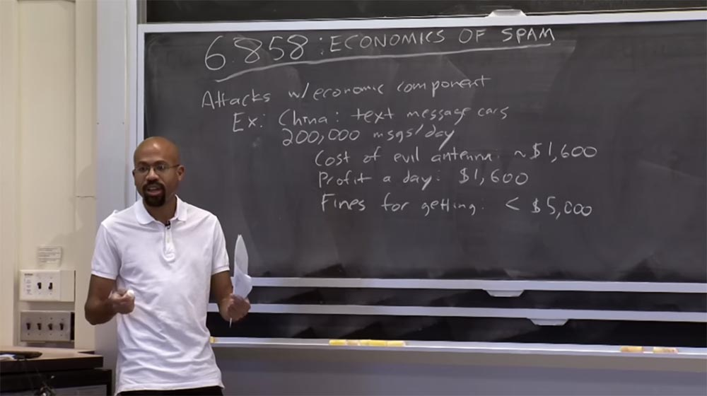
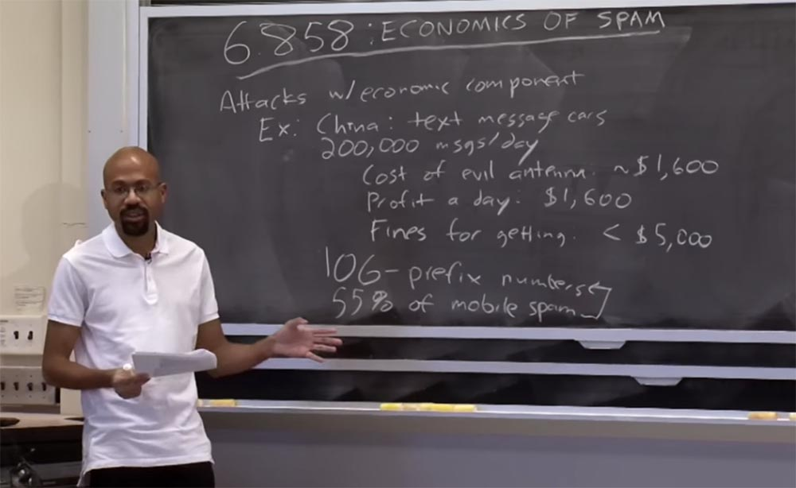
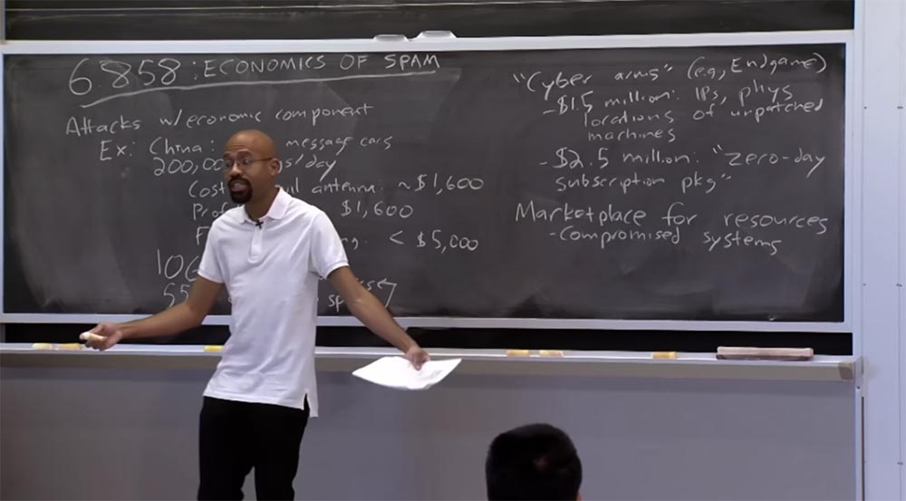
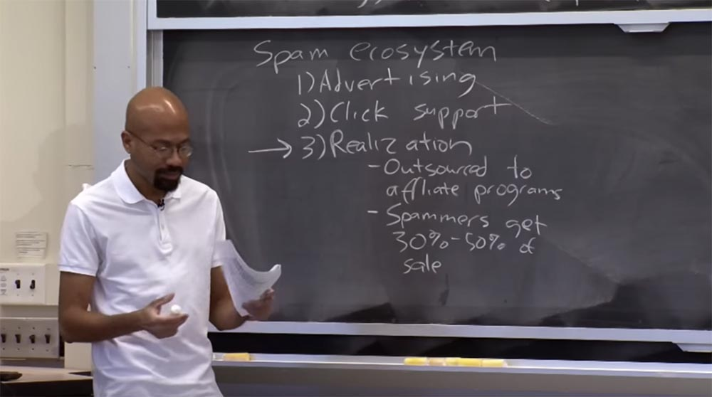
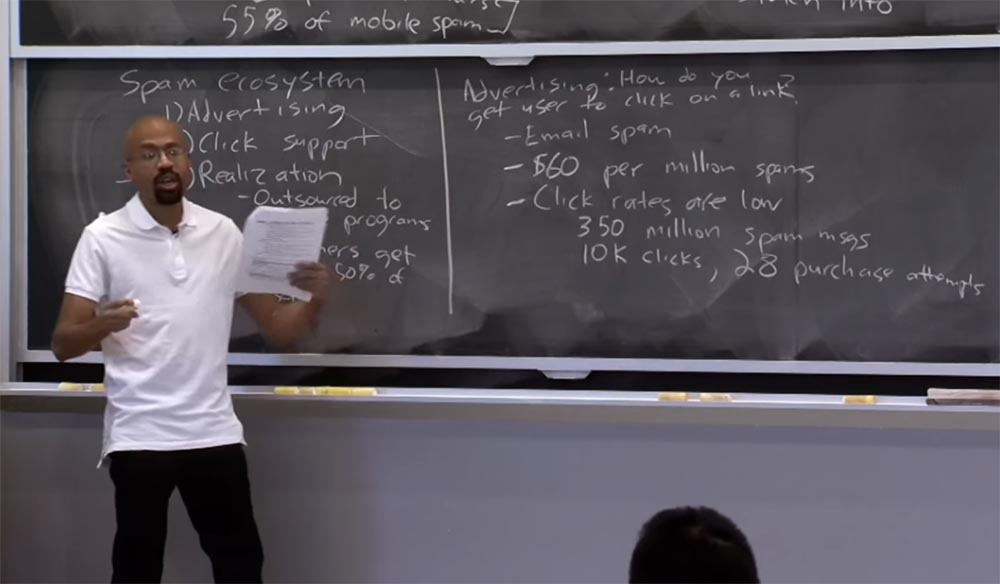
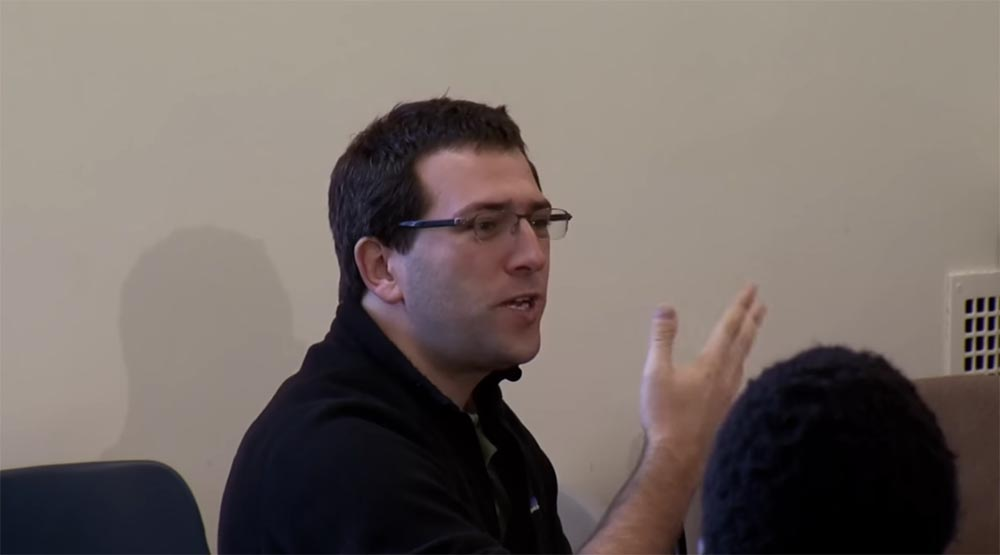
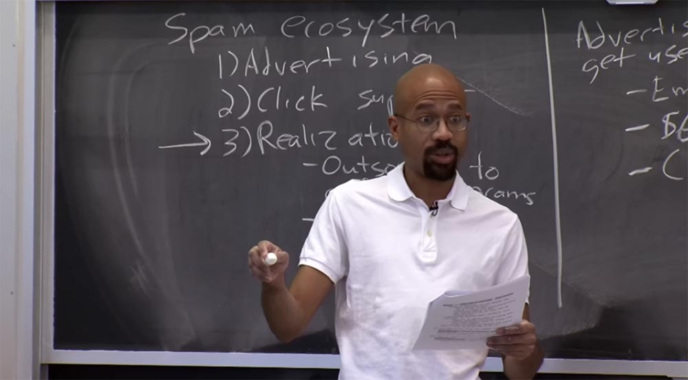
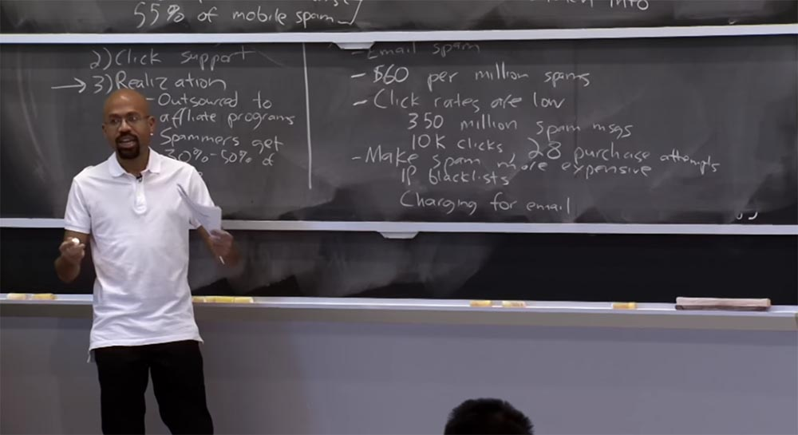

Курс MIT «Безопасность компьютерных систем». Лекция 23: «Экономика безопасности», часть 1 / Блог компании ua-hosting.company

### Массачусетский Технологический институт. Курс лекций #6.858. «Безопасность компьютерных систем». Николай Зельдович, Джеймс Микенс. 2014 год

Computer Systems Security — это курс о разработке и внедрении защищенных компьютерных систем. Лекции охватывают модели угроз, атаки, которые ставят под угрозу безопасность, и методы обеспечения безопасности на основе последних научных работ. Темы включают в себя безопасность операционной системы (ОС), возможности, управление потоками информации, языковую безопасность, сетевые протоколы, аппаратную защиту и безопасность в веб-приложениях.

Лекция 1: «Вступление: модели угроз» [Часть 1](https://habr.com/company/ua-hosting/blog/354874/) / [Часть 2](https://habr.com/company/ua-hosting/blog/354894/) / [Часть 3](https://habr.com/company/ua-hosting/blog/354896/)  
Лекция 2: «Контроль хакерских атак» [Часть 1](https://habr.com/company/ua-hosting/blog/414505/) / [Часть 2](https://habr.com/company/ua-hosting/blog/416047/) / [Часть 3](https://habr.com/company/ua-hosting/blog/416727/)  
Лекция 3: «Переполнение буфера: эксплойты и защита» [Часть 1](https://habr.com/company/ua-hosting/blog/416839/) / [Часть 2](https://habr.com/company/ua-hosting/blog/418093/) / [Часть 3](https://habr.com/company/ua-hosting/blog/418099/)  
Лекция 4: «Разделение привилегий» [Часть 1](https://habr.com/company/ua-hosting/blog/418195/) / [Часть 2](https://habr.com/company/ua-hosting/blog/418197/) / [Часть 3](https://habr.com/company/ua-hosting/blog/418211/)  
Лекция 5: «Откуда берутся ошибки систем безопасности» [Часть 1](https://habr.com/company/ua-hosting/blog/418213/) / [Часть 2](https://habr.com/company/ua-hosting/blog/418215/)  
Лекция 6: «Возможности» [Часть 1](https://habr.com/company/ua-hosting/blog/418217/) / [Часть 2](https://habr.com/company/ua-hosting/blog/418219/) / [Часть 3](https://habr.com/company/ua-hosting/blog/418221/)  
Лекция 7: «Песочница Native Client» [Часть 1](https://habr.com/company/ua-hosting/blog/418223/) / [Часть 2](https://habr.com/company/ua-hosting/blog/418225/) / [Часть 3](https://habr.com/company/ua-hosting/blog/418227/)  
Лекция 8: «Модель сетевой безопасности» [Часть 1](https://habr.com/company/ua-hosting/blog/418229/) / [Часть 2](https://habr.com/company/ua-hosting/blog/423155/) / [Часть 3](https://habr.com/company/ua-hosting/blog/423423/)  
Лекция 9: «Безопасность Web-приложений» [Часть 1](https://habr.com/company/ua-hosting/blog/424289/) / [Часть 2](https://habr.com/company/ua-hosting/blog/424295/) / [Часть 3](https://habr.com/company/ua-hosting/blog/424297/)  
Лекция 10: «Символьное выполнение» [Часть 1](https://habr.com/company/ua-hosting/blog/425557/) / [Часть 2](https://habr.com/company/ua-hosting/blog/425561/) / [Часть 3](https://habr.com/company/ua-hosting/blog/425559/)  
Лекция 11: «Язык программирования Ur/Web» [Часть 1](https://habr.com/company/ua-hosting/blog/425997/) / [Часть 2](https://habr.com/company/ua-hosting/blog/425999/) / [Часть 3](https://habr.com/company/ua-hosting/blog/426001/)  
Лекция 12: «Сетевая безопасность» [Часть 1](https://habr.com/company/ua-hosting/blog/426325/) / [Часть 2](https://habr.com/company/ua-hosting/blog/427087/) / [Часть 3](https://habr.com/company/ua-hosting/blog/427093/)  
Лекция 13: «Сетевые протоколы» [Часть 1](https://habr.com/company/ua-hosting/blog/427763/) / [Часть 2](https://habr.com/company/ua-hosting/blog/427771/) / [Часть 3](https://habr.com/company/ua-hosting/blog/427779/)  
Лекция 14: «SSL и HTTPS» [Часть 1](https://habr.com/company/ua-hosting/blog/427783/) / [Часть 2](https://habr.com/company/ua-hosting/blog/427785/) / [Часть 3](https://habr.com/company/ua-hosting/blog/427787/)  
Лекция 15: «Медицинское программное обеспечение» [Часть 1](https://habr.com/company/ua-hosting/blog/428652/) / [Часть 2](https://habr.com/company/ua-hosting/blog/428654/) / [Часть 3](https://habr.com/company/ua-hosting/blog/428656/)  
Лекция 16: «Атаки через побочный канал» [Часть 1](https://habr.com/company/ua-hosting/blog/429390/) / [Часть 2](https://habr.com/company/ua-hosting/blog/429392/) / [Часть 3](https://habr.com/company/ua-hosting/blog/429394/)  
Лекция 17: «Аутентификация пользователя» [Часть 1](https://habr.com/company/ua-hosting/blog/429680/) / [Часть 2](https://habr.com/company/ua-hosting/blog/429682/) / [Часть 3](https://habr.com/company/ua-hosting/blog/429686/)  
Лекция 18: «Частный просмотр интернета» [Часть 1](https://habr.com/company/ua-hosting/blog/430204/) / [Часть 2](https://habr.com/company/ua-hosting/blog/430206/) / [Часть 3](https://habr.com/company/ua-hosting/blog/430208/)  
Лекция 19: «Анонимные сети» [Часть 1](https://habr.com/company/ua-hosting/blog/431262/) / [Часть 2](https://habr.com/company/ua-hosting/blog/431264/) / [Часть 3](https://habr.com/company/ua-hosting/blog/431266/)  
Лекция 20: «Безопасность мобильных телефонов» [Часть 1](https://habr.com/company/ua-hosting/blog/432616/) / [Часть 2](https://habr.com/company/ua-hosting/blog/432618/) / [Часть 3](https://habr.com/company/ua-hosting/blog/432620/)  
Лекция 21: «Отслеживание данных» [Часть 1](https://habr.com/company/ua-hosting/blog/432616/) / [Часть 2](https://habr.com/company/ua-hosting/blog/432618/) / [Часть 3](https://habr.com/company/ua-hosting/blog/432620/)  
Лекция 22: «Информационная безопасность MIT» [Часть 1](https://habr.com/company/ua-hosting/blog/434342/) / [Часть 2](https://habr.com/company/ua-hosting/blog/434344/) / [Часть 3](https://habr.com/company/ua-hosting/blog/434346/)  
Лекция 23: «Экономика безопасности» [Часть 1](https://habr.com/company/ua-hosting/blog/435786/) / [Часть 2](https://habr.com/company/ua-hosting/blog/435788/)

**Джеймс Микенс:** сегодня мы поговорим об экономике спама. До этого мы обсуждали на лекциях технические аспекты безопасности. Мы рассмотрели такие вещи, как переполнение буфера, принцип одинакового источника, Tor и тому подобное. Контекстом для обсуждения было то, что мы рассматривали, как противник может скомпрометировать систему. Мы пытались разработать модель угроз, описывающую вещи, которые мы хотим предотвратить, а затем думали, как проектировать системы, которые помогли бы нам защититься от этой модели угрозы.

Итак, сегодня мы рассмотрим альтернативную перспективу, которая заключается в вопросе, почему злоумышленник пытается взломать систему? Почему он пытается нам навредить? Существует много причин, по которым злоумышленники пытаются сделать эти ужасные вещи. Некоторые из этих атак совершаются по идеологическим соображениям людьми, которые считают себя политическими активистами, или тому подобное. Можно вспомнить о компьютерном черве Stuxnet, показывающем, что иногда правительства нападают на другие правительства. Поэтому для этих типов атак деньги, экономика, не являются основной мотивацией для нападения. Интересно то, на самом деле трудно предотвратить эти атаки, просто делая компьютеры более безопасными. И нет никаких финансовых рычагов, чтобы переориентировать этих злоумышленников на другую деятельность.

Тем не менее, есть некоторые типы атак, которые включают в себя сильный экономический компонент, и таковы некоторые из вещей, которые мы сегодня рассмотрим. Интересно то, что если атаки не базируются на финансовой заинтересованности хакеров, мы не можем использовать какие-либо правила для их предотвращения. Иногда бывает трудно понять, как же можно остановить такую атаку, поэтому, как я уже сказал, мы просто пытаемся сделать компьютеры более безопасными.

Например, Stuxnet – это отличная идея. Этот вирус атаковал промышленное программное обеспечение, связанное с ядерными исследованиями в Иране. Таким образом, все мы знаем, откуда пришёл Stuxnet, в основном это были американцы и израильтяне. Но можем ли мы доказать это в суде? Например, кого мы можем засудить, сказав, что он подключил Stuxnet к нашей машине?

Таким образом, при таких атаках не ясно, на кого можно подать в суд — на Федеральный резерв, или на Израиль, или на кого-то ещё. Кроме того, никто официально не заявлял, что это были именно они. Так что когда вы думаете, как можно предотвратить подобные атаки, возникают очень интересные юридические и финансовые вопросы.

Существует множество видов компьютерных преступлений, которые мотивируются экономическими причинами. Например, промышленный шпионаж, спонсируемый государством, это одна из вещей, о которых говорилось на предыдущей лекции. Иногда правительства пытаются взломать другие правительства или другие отрасли, чтобы украсть интеллектуальную собственность, или что-то в этом роде.

Интересно, что при организации спамерских атак нужно сначала вложить немного денег, чтобы потом заработать немного денег. Спамеры действительно должны инвестировать финансы в инфраструктуру, прежде чем они смогут отправлять свои сообщения.

Если у вас имеются атаки подобного рода, вы можете выяснить, как выглядит финансовая цепочка хакерских инструментов, и тогда, возможно, вы сможете подумать о применении финансового давления на верхние звенья цепочки, чтобы предотвратить вредоносные атаки или проблемы безопасности на нижних звеньях.

Ключевой момент заключается в том, что если посмотреть на контекст спама, вы поймёте — спамеры перестают рассылать спам только тогда, когда это становится для них убыточным. Одна из печальных истин в мире та, что мы продолжаем получать спам, потому что спамерам это слишком дешево обходится, так как им достаточно прибыли всего лишь от 2% — 3% людей, которые будут нажимать на ссылки и просматривать спам. До тех пор, пока их затраты на отправку этих сообщений настолько низки, спамеры все равно могут зарабатывать деньги на таких вещах даже при минимальной активности жертв.

Поэтому сегодня мы рассмотрим атаки, которые содержат в себе значительную экономическую составляющую. Приведу один интересный пример, о котором я только что прочитал, это происходит в Китае. У них имеется проблема под названием «машины текстовых сообщений». Идея здесь заключается в том, что люди ездят на автомобилях с направленными в сторону антеннами, действуя по схеме «человек посередине» между мобильными телефонами и вышками сотовой связи. Разъезжая в таких машинах, они собирают номера мобильных телефонов, на которые затем из этих же машин рассылают спам в виде текстовых сообщений.

Работая таким образом, эти Text-messaging cars могут отправлять до 200000 сообщений в день, что составляет огромное число, при этом стоимость рабочей силы очень низкая. Очень дешево нанять водителя, проехать по маршруту, подглядывая за трафиком людей, и отправить им спам.  
Давайте рассмотрим экономику этого процесса. Какова стоимость антенны, позволяющей наблюдать за трафиком мобильной связи? Грубо говоря, это где-то в районе плюс-минус $1600\. Сколько прибыли эти люди могут получить в день? При удачном раскладе тоже примерно 1600 долларов. Так что это очень интересно. Это значит, что вы окупаете свои затраты за один день и дальше получаете чистую прибыль.

Вы можете сказать, что вас может поймать полиция, а затем вас могут посадить или вам придется заплатить штраф, но он менее 5 тысяч долларов, к тому же эти люди редко попадаются. Вот на такие расчёты мы должны обратить внимание, когда размышляем о том, как экономически сдержать этих спамеров. Потому если спамеров ловят пару раз в год и они возвращают свои затраты на оборудование за один день, очень сложно придумать, как можно финансово воспрепятствовать им заниматься подобным делом.

Что интересно, в Китае подразумевается, что мобильные операторы также участвуют в этой схеме, потому что каждый раз, когда вы отправляете спам, вы отправляете небольшую сумму денег оператору мобильной связи, буквально пару центов. В Европе многие мобильные операторы решили, что им не нужны сердитые клиенты, которые сообщают о том, что постоянно получают спам. Но многие китайские мобильные операторы, по крайней мере, три крупнейших, рассматривают эти спам — сообщения как источник своего дохода. Они действительно думают, что это хороший способ, чтобы получить немного лишних денег.

Не знаю, слышали ли вы об этом, но сеть Telcos придумала префикс 106- для телефонных номеров. Первоначальная цель этого префикса – использование телефонного номера в некоммерческих целях. Представьте, что вы управляете компанией и хотите отправить кучу текстовых сообщений всем вашим сотрудникам. Вы можете использовать один из этих 106-х номеров, чтобы «оптом» отправить все сообщения и избежать некоторых встроенных механизмов ограничений скорости в сотовой сети.

Этим могут воспользоваться и спамеры, и я думаю, что 55% мобильного спама, отсылаемого в Китае, исходит от одного из этих 106-х номеров. Это интересный пример работы финансовой схемы, когда некие извращённые стимулы склоняют сотовых операторов заниматься общим делом с мошенниками. В конспекте лекции имеется ссылка на интересную статью в журнале Economist.

Интересно то, что существует множество компаний, занимающихся кибероружием. Они продают вредоносные программы, эксплойты и подобное программное обеспечение. Одним из примеров является компания Endgame. Например, за полтора миллиона долларов эта компания предоставит вам IP-адреса и физическое местоположение миллионов незащищённых компьютеров. У них множество точек по всему интернету, где собираются все виды интересной информации о компьютерах, которые вы можете атаковать или наоборот, защитить, если, например, вы правительство, или другое агентство, или что-то в этом роде.

Примерно за 2,5 миллиона долларов они дадут вам то, что называется просто потрясающе – «подписка на пакет нулевого дня». Если вы на это подпишетесь, то станете получать по 25 эксплойтов в год и сможете делать с их помощью всё, что захотите. Самое интересное, что многие люди, сотрудничающие с этими торговцами кибероружием, являются бывшими сотрудниками спецслужб, таких, как ЦРУ или АНБ.

Интересно подумать о том, кто является фактическими клиентами этих кибер-торговцев. Некоторые клиенты – это правительства, например, американское правительство. Они используют эти штуки для нападения на другие страны. Но чаще всего такую продукцию покупают компании. В конце лекции мы поговорим о том, что иногда компании берут вопросы кибербезопасности в свои руки и организовывают то, что называется hackback, или внутренний взлом. Компании, на которые нападают киберпреступники, не вовлекают в это дело правительственные официальные структуры, а пытаются сами разобраться с теми, кто пытался украсть их интеллектуальную собственность. При этом они довольно успешно используют очень изобретательные юридические аргументы для оправдания своих действий. Так что это интересный аспект кибервойны.

**Аудитория:** насколько это законно?

**Профессор:** мы же знаем, что «информация хочет быть свободной, чувак», верно? Говоря о подобных вещах, не стоит использовать терминологию «законно или незаконно», просто что-то работает «в тени». Например, если я скажу вам, что где-то имеется дом, в котором не работает дверной замок, и попрошу за это 20 баксов, это не обязательно будет незаконно. Как оказалось, у этих компаний есть толпы юристов, которые изучают такие вещи. Но во многих случаях, если вы думаете о том, как сделать пакость, вы можете разыскивать это в интернете и посетить сайты, где рассказывается, как делать бомбы. Размещение подобной информации не является незаконным, потому что это просто познавательно с точки зрения обучения. Что, если я, например, химик? Поэтому предоставлять кому-то знания — не обязательно незаконно.

Но вы правы в том, что здесь есть некоторые «серые области», например, эти hackback, о которых мы поговорим позже. Допустим, я — банк, я не правительство, а банк, и меня взломали. У меня не всегда есть юридические полномочия прикрыть ботнет или что-то в этом роде. Компании делают такие вещи, но закон отстает от жизни. Поэтому, если злоумышленники поступают подобным образом, мы будем использовать закон о нарушении авторских прав, так как они продают наши товары. Если они используют ботнет, мы будем использовать закон о нарушениях в сфере использования IP-адресов.

Вероятно, это не то, о чем думал Томас Джефферсон, предполагая, как в действительности должны работать законы, это в некотором роде игра в кошки-мышки, позже мы это обсудим.  
В принципе, все это означает, что существует рынок всех видов вычислительных ресурсов, которые могли бы использовать те, кто хочет организовать атаки. Например, существует рынок взломанных систем. Вы можете отправиться в «тёмную область» интернета и закупить все скомпрометированные компьютеры, которые могут быть частью ботнета. Вы можете купить доступ к зараженным сайтам и использовать такой веб-сайт для размещения спама или ссылок на вредоносные программы.

За деньги вы можете получить доступ к взломанным учетным записям электронной почты, таким как Gmail или Yahoo, эти вещи представляют для атакующих большую ценность. Также вы можете просто купить что-то вроде подписки на ботнет и при необходимости им воспользоваться, например, для организации DDoS атаки. Так что существует рынок, где всё это можно купить.  
Имеется и рынок хакерских инструментов, где вы, как злоумышленник, можете купить готовые наборы вредоносных программ или же использовать услуги торговцев кибероружием, можете получить доступ к эксплойтам «нулевого дня» и так далее и тому подобное.

Также существует большой рынок украденной информации о пользователях. Это такие вещи, как номера социального страхования, номера кредитных карт, адреса электронной почты и так далее. Так что все это есть в интернете, если вы готовы искать.

Итак, лекционная статья, которую мы сегодня рассмотрим, в основном сосредоточена на одном аспекте – экосистеме спама. В частности, авторы рассматривают продажу фармацевтических препаратов, поддельных товаров и программного обеспечения. При этом они разбивают экосистему спама на три составные части.

Первая часть — это реклама. Этот процесс каким-то образом заставляет пользователя кликнуть по спамерской ссылке. Как только пользователь это сделает, возникает вторая часть — необходимость поддержки кликов. Это подразумевает, что должен существовать какой-то тип веб-сервера, инфраструктура DNS и так далее, которые представляют спамерский сайт, куда переходит пользователь. Финальная часть экосистемы спама – реализация, то, что фактически позволяет пользователю сделать покупку на сайте. Он отправляет деньги спамерам, надеясь получить некий продукт, и это то самое место, откуда берутся деньги.

Поэтому многие из таких вещей переданы на аутсорсинг партнерским программам. Большую часть времени эти программы занимаются сервисным обслуживанием купли-продажи, работая с банками, платежными системами Visa, MasterCard и так далее. Однако часто спамеры не намерены иметь дело с такими сложностями, они просто хотят создавать ссылки, поэтому спамеров можно воспринимать как рекламный компонент. При этом сами спамеры работают ради комиссионных процентов от сделки, получая от 30% до 50% продажной стоимости товара.

В этой лекции мы рассмотрим каждую составляющую экосистемы спама, посмотрим, как она работает, а потом подумаем, как можно избавиться от спамеров на каждом из этих уровней.  
Первое, на что мы обратим внимание, это рекламная составляющая. Как я уже упоминал, основная идея рекламы заключается в том, чтобы заставить пользователя перейти по ссылке. Это основной вопрос, который будет нас волновать. Как известно, в первую очередь спам рассылается в электронных письмах в виде текстового сообщения. Однако спамеры начинают активно использовать другие формы общения, в том числе социальные сети. Теперь, когда вы заходите на Facebook, вы не только «заражаетесь» контентом ваших реальный друзей, но и спамерскими сообщениями.

В нашей дискуссии речь идет об экономике, поэтому интересным вопросом является стоимость фактической отправки этих спам-сообщений. Выясняется, что это не очень дорого – примерно за 60 баксов можно отправить миллион рассылок спама, так что это супер низкая цена. И она будет ещё ниже, если вы сразу подключите к этому ботнет, так как при этом можно отказаться от услуг посредника. Но даже если вы арендуете на рынке одну из ботнет-систем, это всё равно обходится очень дешево.

**Аудитория:** какая часть этих сообщений действительно эффективна? То есть сколько из них не отфильтровывается почтовым клиентом?

**Профессор:** это хороший вопрос, который подводит меня к следующему пункту. Например, ты посылаешь миллион спам-сообщений, но они отбрасываться в разных точках своего пути, попадая в фильтры спама. Люди будут замечать их и сразу удалять, зная, что электронное письмо, которое, например, помечено значком «$18», содержит спам.

Поэтому, если вы посмотрите на коэффициент конверсии, вы увидите, что из-за таких вещей, как спам-фильтры и сознательность пользователей, показатели эффективности кликов на самом деле очень низкие. Поэтому рассылка спама должна быть супер, супер дешевой, ведь иначе вы не получаете большой выгоды. Например, были проведены эмпирические исследования, которые определяли рейтинг кликов. Выяснилось, что при просмотре 350 миллионов спам-сообщений было сделано всего порядка 10 000 кликов, то есть имело место массовое «отбрасывание» сообщений. Причём на эти 10 000 кликов пришлось только 28 попыток покупки предлагаемого товара. Это очень и очень низкие показатели, поэтому для спамера чрезвычайно важно, чтобы стоимость экосистемы спама была очень дешёвой.

Обратите внимание на коэффициент фильтрования спама – он на несколько порядков уменьшает первоначальное количество рассылок. Поэтому можно надеяться, что, по крайней мере, теоретически, мы могли бы «прокрутить» эту рассылку всего за 10 долларов, но это могло оказать катастрофическое действие на её эффективность. Так что для спамеров очень важно, чтобы все было как можно дешевле.

**Аудитория:** насчёт этих 10000 кликов – сколько из этих 350 миллионов писем были отфильтрованы из входящей электронной почты? Я просто пытаюсь получить представление о том, на какое количество писем кликнули пользователи, чтобы оценить, насколько эффективна фильтрация спама и насколько глупы в США люди.

**Профессор:** не уверен, что смогу ответить, но это очень хороший вопрос.

**Николай Зельдович:** в пятницу я слушал выступление Джеффа Уокера на эту тему, и он сказал, что от 20% до 40% кликов, ведущих на один из спамерских сайтов, фактически происходят из папки «Спам» в почтовом ящике пользователя. Получается, что люди заходят в папку «Спам», ищут эти вещи и кликают по ссылкам.

То есть имеется целый класс пользователей, сознательно ищущих для себя приключения, заходя в папку со спамом. Так что статистика фильтрации не отражает реального положения вещей, потому что отфильтрованные сообщения тоже могут использоваться некоторыми пользователями.

**Джеймс Микенс:** да, я тоже слышал анекдотические сообщения об этом. Некоторые люди помечают как спам даже легальные электронные письма, чтобы, например, скрыть от своих коллег по работе, что они заходят в свой ящик на Gmail и чтобы коллеги не узнали, например, на что вы подписались. Затем такие люди заходят в папку спама и просматривают нужные им сообщения. На самом деле это очень интересный момент. Существует психология тех, кто на самом деле нажимает на эти ссылки. Одна из статей, которую я связал с лекционными заметками, говорит о том, почему эти нигерийские аферы все еще работают. Ведь можно подумать, что любой здравомыслящий человек никогда не станет нажимать на послания одного из таких нигерийских почтовых мошенников. Но оказывается, что «нигерийский мем» на самом деле полезен для спамеров, чтобы отфильтровать идиотов. Другими словами, если вы настолько глупы, что все равно откроете нигерийскую электронную почту, значит, вы проделаете то же самое с любой спамерской рассылкой.

Это одна из ключевых вещей, которые нужны спамерам, им нужны люди, которые настолько доверчивы или идеалистичны, что кликнут по такой ссылке. За этим стоит целая психология, так что это очень интересно.

**Аудитория:** какова стоимость вещей, которые предлагают покупать спамеры?

**Профессор:** это хороший вопрос. Всё зависит от того, что вы ищите. Множество этих покупок не слишком дороги, как например, таблетки Viagra или взломанная копия Windows. В большинстве случаев люди соблазняются покупкой поддельных продуктов, потому что их цена ниже, чем предлагают официальные магазины, иначе вы просто пошли бы в местный торговый центр и купили то, что хотите. Так что в основном это покупки вещей стоимостью до 1000 долларов, часто намного меньше.

Итак, как я уже сказал, ключевой вопрос, которым должен задаться защитник от спама – это как сделать спам дороже для самого спамера. Для этого существует несколько способов.

Один из них — это черные списки IP-адресов. Возможно, что интернет-провайдеры или кто-то еще собирает список IP-адресов, с которых ведётся рассылка спама, и тогда мы просто не позволим этим людям отправлять трафик. Какое-то время этот способ работал, но теперь атакующим намного проще использовать такие методы, как перенаправление DNS и прочее, о чем мы поговорим немного позже. Теперь у спамеров есть гораздо больший набор адресов, с которых можно отправлять спам, а также динамически перепривязывать имена хостов и веб-серверы, так что «чёрные списки» IP-адресов утратили эффективность.

Еще одна идея, которая использовалась в течение длительного времени — это взимание платы за отправку электронных писем. Каждый раз, когда вы отправляете письмо по электронной почте, вы совершаете микроплатеж в самой различной валюте. Например, если бы я хотел отправить вам электронное письмо, мне пришлось заплатить бы десятую часть от десятой части пенни. Для меня это не имеет значения, так как я не отправляю ежедневно много писем, но если вы спамер, пытающийся отправить кучу писем, это станет вам в кругленькую сумму. Таким образом, это подрывает цепочку создания спамерской прибыли.

Еще одна идея, которая возникла у людей, состояла в использовании вычислений в качестве оплаты рассылки сообщений. То есть для того, чтобы мой почтовый сервер принял исходящее письмо, мне нужно решить некоторые головоломки, я должен сделать какой-то математический трюк, или что-то в этом роде. Это также увеличивает себестоимость массовой спамерской рассылки, так как требует много времени.

Кроме того, все мы все знакомы с капчей. Например, нужно посмотреть на картинку из 9 животных и найти кошку вместо собаки, или ввести какое-то странное волнистое число, вызывающее головную боль, или что-то в этом роде.

Таковы способы взимания платы за отправку электронной почты, направленные на предотвращение массовых рассылок спама. Классической проблемой в этом случае становится то, кто первым займётся реализацией этих схем.

Если все провайдеры электронной почты не реализуют такую защиту одновременно, то конечно, спамеры просто перейдут к тем поставщикам электронной почты, которые пока что не внедрили эти методы. Здесь возникает проблема, как заставить всех провайдеров одновременно обновиться. Кроме того, что произойдет, если пользовательское устройство скомпрометировано? Например, кто-то взломает мой аккаунт Gmail и заставит заплатить 350 миллионов микроплатежей, которые могут меня обанкротить.

Поэтому не совсем понятно, насколько некоторые из этих схем готовы к внедрению в жизнь. Однако они представляют собой интересный мысленный эксперимент на тему, как можно было бы ограничить зловредную активность отправителей.

26:10 мин

[Курс MIT «Безопасность компьютерных систем». Лекция 23: «Экономика безопасности», часть 2](https://habr.com/company/ua-hosting/blog/435788/)

Полная версия курса доступна [здесь](https://ocw.mit.edu/courses/electrical-engineering-and-computer-science/6-858-computer-systems-security-fall-2014/).

Спасибо, что остаётесь с нами. Вам нравятся наши статьи? Хотите видеть больше интересных материалов? Поддержите нас оформив заказ или порекомендовав знакомым, **30% скидка для пользователей Хабра на уникальный аналог entry-level серверов, который был придуман нами для Вас:** [Вся правда о VPS (KVM) E5-2650 v4 (6 Cores) 10GB DDR4 240GB SSD 1Gbps от $20 или как правильно делить сервер?](https://habr.com/company/ua-hosting/blog/347386/) (доступны варианты с RAID1 и RAID10, до 24 ядер и до 40GB DDR4).

**VPS (KVM) E5-2650 v4 (6 Cores) 10GB DDR4 240GB SSD 1Gbps до января бесплатно** при оплате на срок от полугода, заказать можно [тут](https://ua-hosting.company/vpsnl).

**Dell R730xd в 2 раза дешевле?** Только у нас **[2 х Intel Dodeca-Core Xeon E5-2650v4 128GB DDR4 6x480GB SSD 1Gbps 100 ТВ от $249](https://ua-hosting.company/serversnl) в Нидерландах и США!** Читайте о том [Как построить инфраструктуру корп. класса c применением серверов Dell R730xd Е5-2650 v4 стоимостью 9000 евро за копейки?](https://habr.com/company/ua-hosting/blog/329618/)