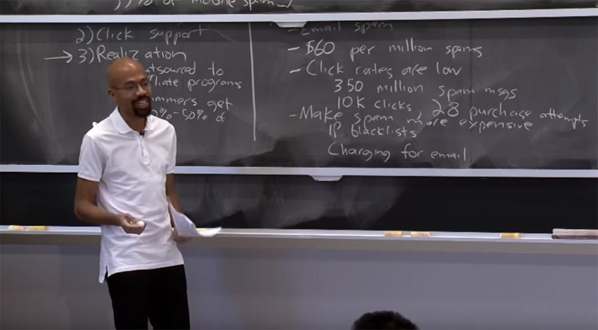
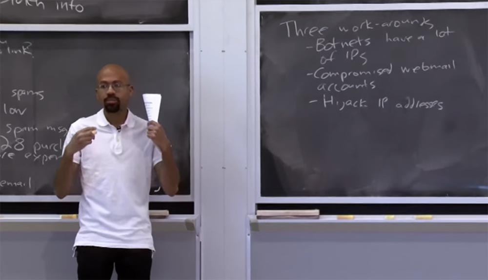
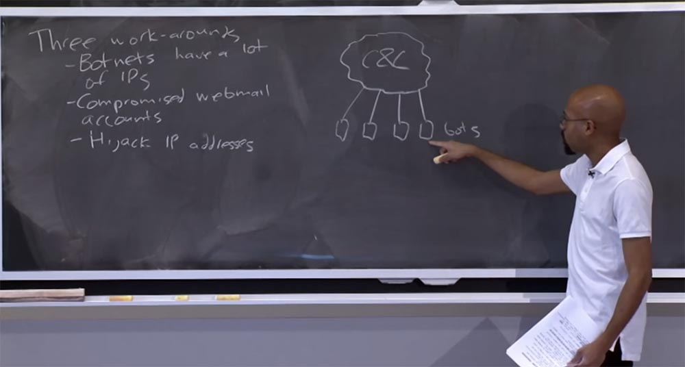
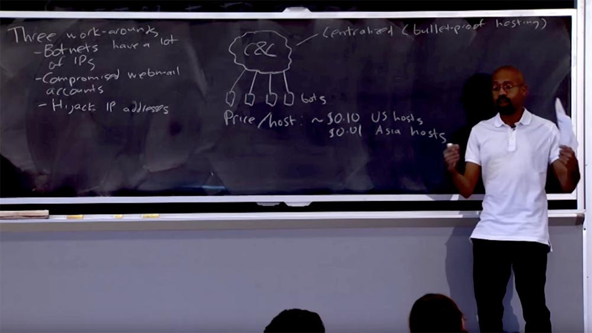
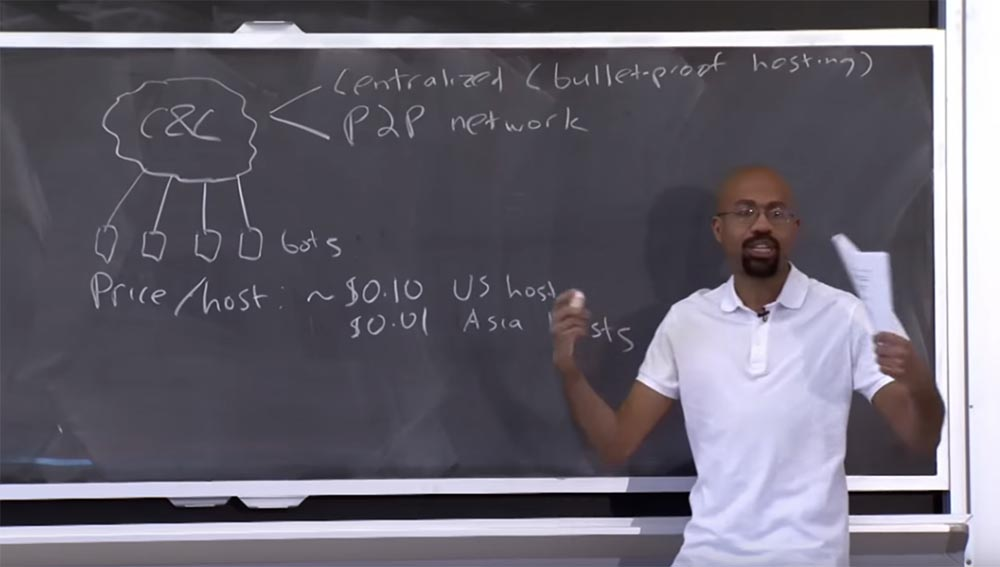
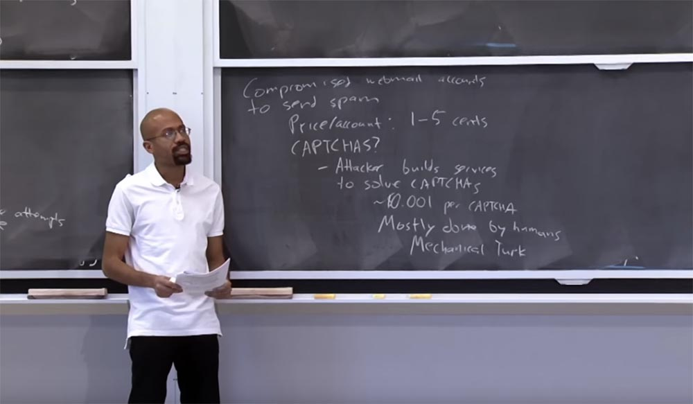
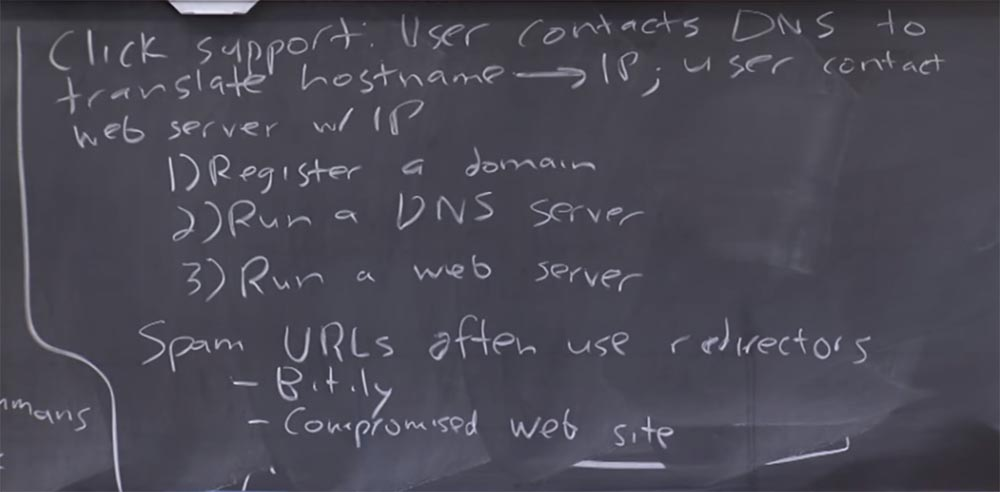

Курс MIT «Безопасность компьютерных систем». Лекция 23: «Экономика безопасности», часть 2 / Блог компании ua-hosting.company

### Массачусетский Технологический институт. Курс лекций #6.858. «Безопасность компьютерных систем». Николай Зельдович, Джеймс Микенс. 2014 год

Computer Systems Security — это курс о разработке и внедрении защищенных компьютерных систем. Лекции охватывают модели угроз, атаки, которые ставят под угрозу безопасность, и методы обеспечения безопасности на основе последних научных работ. Темы включают в себя безопасность операционной системы (ОС), возможности, управление потоками информации, языковую безопасность, сетевые протоколы, аппаратную защиту и безопасность в веб-приложениях.

Лекция 1: «Вступление: модели угроз» [Часть 1](https://habr.com/company/ua-hosting/blog/354874/) / [Часть 2](https://habr.com/company/ua-hosting/blog/354894/) / [Часть 3](https://habr.com/company/ua-hosting/blog/354896/)  
Лекция 2: «Контроль хакерских атак» [Часть 1](https://habr.com/company/ua-hosting/blog/414505/) / [Часть 2](https://habr.com/company/ua-hosting/blog/416047/) / [Часть 3](https://habr.com/company/ua-hosting/blog/416727/)  
Лекция 3: «Переполнение буфера: эксплойты и защита» [Часть 1](https://habr.com/company/ua-hosting/blog/416839/) / [Часть 2](https://habr.com/company/ua-hosting/blog/418093/) / [Часть 3](https://habr.com/company/ua-hosting/blog/418099/)  
Лекция 4: «Разделение привилегий» [Часть 1](https://habr.com/company/ua-hosting/blog/418195/) / [Часть 2](https://habr.com/company/ua-hosting/blog/418197/) / [Часть 3](https://habr.com/company/ua-hosting/blog/418211/)  
Лекция 5: «Откуда берутся ошибки систем безопасности» [Часть 1](https://habr.com/company/ua-hosting/blog/418213/) / [Часть 2](https://habr.com/company/ua-hosting/blog/418215/)  
Лекция 6: «Возможности» [Часть 1](https://habr.com/company/ua-hosting/blog/418217/) / [Часть 2](https://habr.com/company/ua-hosting/blog/418219/) / [Часть 3](https://habr.com/company/ua-hosting/blog/418221/)  
Лекция 7: «Песочница Native Client» [Часть 1](https://habr.com/company/ua-hosting/blog/418223/) / [Часть 2](https://habr.com/company/ua-hosting/blog/418225/) / [Часть 3](https://habr.com/company/ua-hosting/blog/418227/)  
Лекция 8: «Модель сетевой безопасности» [Часть 1](https://habr.com/company/ua-hosting/blog/418229/) / [Часть 2](https://habr.com/company/ua-hosting/blog/423155/) / [Часть 3](https://habr.com/company/ua-hosting/blog/423423/)  
Лекция 9: «Безопасность Web-приложений» [Часть 1](https://habr.com/company/ua-hosting/blog/424289/) / [Часть 2](https://habr.com/company/ua-hosting/blog/424295/) / [Часть 3](https://habr.com/company/ua-hosting/blog/424297/)  
Лекция 10: «Символьное выполнение» [Часть 1](https://habr.com/company/ua-hosting/blog/425557/) / [Часть 2](https://habr.com/company/ua-hosting/blog/425561/) / [Часть 3](https://habr.com/company/ua-hosting/blog/425559/)  
Лекция 11: «Язык программирования Ur/Web» [Часть 1](https://habr.com/company/ua-hosting/blog/425997/) / [Часть 2](https://habr.com/company/ua-hosting/blog/425999/) / [Часть 3](https://habr.com/company/ua-hosting/blog/426001/)  
Лекция 12: «Сетевая безопасность» [Часть 1](https://habr.com/company/ua-hosting/blog/426325/) / [Часть 2](https://habr.com/company/ua-hosting/blog/427087/) / [Часть 3](https://habr.com/company/ua-hosting/blog/427093/)  
Лекция 13: «Сетевые протоколы» [Часть 1](https://habr.com/company/ua-hosting/blog/427763/) / [Часть 2](https://habr.com/company/ua-hosting/blog/427771/) / [Часть 3](https://habr.com/company/ua-hosting/blog/427779/)  
Лекция 14: «SSL и HTTPS» [Часть 1](https://habr.com/company/ua-hosting/blog/427783/) / [Часть 2](https://habr.com/company/ua-hosting/blog/427785/) / [Часть 3](https://habr.com/company/ua-hosting/blog/427787/)  
Лекция 15: «Медицинское программное обеспечение» [Часть 1](https://habr.com/company/ua-hosting/blog/428652/) / [Часть 2](https://habr.com/company/ua-hosting/blog/428654/) / [Часть 3](https://habr.com/company/ua-hosting/blog/428656/)  
Лекция 16: «Атаки через побочный канал» [Часть 1](https://habr.com/company/ua-hosting/blog/429390/) / [Часть 2](https://habr.com/company/ua-hosting/blog/429392/) / [Часть 3](https://habr.com/company/ua-hosting/blog/429394/)  
Лекция 17: «Аутентификация пользователя» [Часть 1](https://habr.com/company/ua-hosting/blog/429680/) / [Часть 2](https://habr.com/company/ua-hosting/blog/429682/) / [Часть 3](https://habr.com/company/ua-hosting/blog/429686/)  
Лекция 18: «Частный просмотр интернета» [Часть 1](https://habr.com/company/ua-hosting/blog/430204/) / [Часть 2](https://habr.com/company/ua-hosting/blog/430206/) / [Часть 3](https://habr.com/company/ua-hosting/blog/430208/)  
Лекция 19: «Анонимные сети» [Часть 1](https://habr.com/company/ua-hosting/blog/431262/) / [Часть 2](https://habr.com/company/ua-hosting/blog/431264/) / [Часть 3](https://habr.com/company/ua-hosting/blog/431266/)  
Лекция 20: «Безопасность мобильных телефонов» [Часть 1](https://habr.com/company/ua-hosting/blog/432616/) / [Часть 2](https://habr.com/company/ua-hosting/blog/432618/) / [Часть 3](https://habr.com/company/ua-hosting/blog/432620/)  
Лекция 21: «Отслеживание данных» [Часть 1](https://habr.com/company/ua-hosting/blog/432616/) / [Часть 2](https://habr.com/company/ua-hosting/blog/432618/) / [Часть 3](https://habr.com/company/ua-hosting/blog/432620/)  
Лекция 22: «Информационная безопасность MIT» [Часть 1](https://habr.com/company/ua-hosting/blog/434342/) / [Часть 2](https://habr.com/company/ua-hosting/blog/434344/) / [Часть 3](https://habr.com/company/ua-hosting/blog/434346/)  
Лекция 23: «Экономика безопасности» [Часть 1](https://habr.com/company/ua-hosting/blog/435786/) / [Часть 2](https://habr.com/company/ua-hosting/blog/435788/)

**Аудитория:** как же спамеры работают со списками рассылки, особенно с огромными списками?

**Профессор:** с агрегацией списков рассылки существуют проблемы, так как очень сложно обеспечить массовую рассылку. Возможно, спамерам необходимо использовать эвристику, с помощью которой они масштабируют платёж в соответствии с величиной списка. Например, эвристически разумнее будет отправить письма 1000, а не 350 миллионам человек или что-то вроде того. Но вы правы в том, что для списков рассылок существуют практические ограничения.  
Итак, что может сделать спамер, чтобы обойти упомянутые выше способы защиты от спама? У злоумышленников имеются три обходных пути.

Первый – это сеть ботнет со множеством IP-адресов, которые спамер может использовать. Даже если кто-то попытается составить «черный список» IP-адресов, злоумышленник может перебрать кучу IP-адресов в сети ботнет и обойти фильтрацию «черного списка».

Второе – это использование для рассылки спама взломанных учетных записей электронной почты. Это очень выгодный способ, потому что в силу высочайшей популярности почтовые сервисы Gmail, Yahoo или Hotmail не могут быть помещены в «чёрный список». Если вы занесли в такой список весь сервис, значит, вы закрыли его для десятков миллионов людей.

Конечно, эти отдельные сервисы могут поместить в «черный список» ваш почтовый ящик, если используют эвристический анализ, показывающий, что вы отправляете письма множеству людей, с которыми раньше не переписывались, и тому подобное. На стороне веб-сервера почтовой службы существуют технологии, позволяющие засечь вашу подозрительную активность.

Однако взломанные аккаунты всё равно представляют для спамеров большую ценность, потому что даже если ваша скомпрометированная учетная запись не пригодна для массовой рассылки, она может быть использована для отправки писем знакомым вам людям из вашего списка контактов. Это облегчает злоумышленнику фишинг, так как люди охотнее нажимают на ссылки, присланные им в письме знакомым человеком. Это очень мощный инструмент для спамерской атаки.

Третий обходной путь – это захват IP-адреса у законного владельца. Как упоминал Марк на предыдущей лекции, существует сетевой протокол под названием BGP, который используется для управления маршрутизацией в интернете. Таким образом, есть атаки, в которых хакер заявляет, что он выступает владельцем IP-адресов, хотя на самом деле он ими не владеет. Из-за этого весь трафик, связанный с этими адресами, будет поступать атакующему, и он сможет использовать эти IP-адреса для рассылки спама. Как только спамера засекут, он перестанет использовать BGP для одной автономной системы и переключится на другую.

Существует множество исследований на тему того, как осуществлять аутентификацию BGP, чтобы предотвратить захват IP-адреса, и куча разных защитных методов, которые злоумышленники могут попытаться обойти. Но все эти способы обхода не бесплатны, потому что злоумышленник должен каким-то образом заплатить за ботнет или за то, чтобы попасть внутрь аккаунтов электронной почты. Так что любое из защитных мероприятий повысит себестоимость генерации спама. Поэтому эти защитные меры полезны, хотя и не идеальны.

Так как же выглядят сети ботнет? В общем случае у нас имеется облако, в котором расположена инфраструктура Command & Control, отдающая команды всем подчинённым ботам. Итак, спамер обращается к C&C и говорит: «вот мои новые спам-сообщения, которые я хочу отправить», после чего боты начинают действовать от имени инфраструктуры командования и управления и отправлять сообщения группе людей.

Чем же полезны боты? Как я уже упоминал, у них есть IP-адреса, они обладают пропускной способностью, совершают вычислительные циклы, иногда эти боты сами используются в качестве веб-сервера. Так что эти вещи очень и очень полезны для спамера, к тому же служат неким слоем косвенной адресации. Косвенная адресация очень полезна для злоумышленников. Это означает, что если правоохранительные органы или кто-либо ещё отключат этот слой, не затрагивая инфраструктуру самого C&C, то спамер может просто присоединить командно-контрольную инфраструктуру к другому набору ботов и продолжать своё дело.

Такова одна из причин полезности ботов. Сеть ботнет может масштабироваться до миллионов IP-адресов, так что люди будут кликать по случайным ссылкам, всё время задействуя вредоносное программное обеспечение. Так что эти штуки могут стать очень и очень большими. Поскольку в сети ботнет вовлечены целые компании, в них могут присутствовать миллионы и миллионы компьютеров, поэтому эти сети достаточно сложны в техническом отношении.

Так сколько стоит установить вредоносные программы для всех этих ботов? Нужно помнить, что, как правило, это обычные компьютеры конечных пользователей. Стоимость размещения вредоносных программ на одном из компьютеров, или цена за один хост, составляет около 10 центов для американских хостов и порядка одного цента для азиатских хостов. Существует несколько причин того, почему цена настолько разнится. Возможно, люди склонны думать, что связь, установленная из США, заслуживает большего доверия. В то же время азиатские компьютеры в большей степени используют пиратское ПО, которое не обновляется пакетами безопасности, поэтому организовать сеть ботнет в Азии намного дешевле.

Вы увидите некоторые очень интересные статистические данные о том, как могут колебаться эти затраты, потому что такие компании, как Microsoft, пытаются искоренить пиратство. Но в любом случае, это приблизительная оценка. Достаточно сказать, что это не слишком дорого.

Что же делает этот центр C&C и как он выглядит? В простейшем виде это централизованная компьютерная система из одной или нескольких машин. Злоумышленник просто работает на этих машинах, отправляя оттуда команды для сети ботнет. Поскольку это централизованная система, злоумышленнику будет очень полезно иметь то, что известно как «пуленепробиваемый хостинг». Его идея заключается в том, что вы размещаете инфраструктуру Command & Control на серверах интернет-провайдеров, которые игнорируют запросы финансовых или правоохранительных органов на отключение таких серверов. «Пуленепробиваемые серверы» действительно существуют.

Они обходятся дороже, потому что в таком деле присутствуют риски, но если вы сможете разместить там свой центр C&C, это будет большой удачей. Потому что когда американское правительство или банк Goldman Sachs говорит такому провайдеру: «эй, отключи этого парня, который рассылает спам!», он отвечает: «каким образом вы можете меня заставить это сделать? Я работаю в другой юрисдикции и не обязан соблюдать законы об интеллектуальной собственности». Как я уже сказал, эти типы хостов фактически взимают премию за риск запуска подобных сервисов на своих серверах.

Другой альтернативой запуска инфраструктуры C&C является одноранговая сеть P2P, представляющая собой мини-ботнет. Здесь вся инфраструктура управления распределена по различным компьютерам, и в любой момент времени имеется другой компьютер, который берёт на себя роль C&C, отдавая команды всем этим рабочим узлам. Это хорошо тем, что не требует доступа к одному из этих «пуленепробиваемых хостов». Вы можете построить инфраструктуру C&C, используя обычных ботов. P2P затрудняет предоставление гарантий доступности хостов, расположенных в этом облаке, зато у него есть и другие преимущества. В целом, это два подхода, которые могут использовать злоумышленники для рассылки спама.

Так что же произойдет, если хостинг будет закрыт? Существует пара вещей, которые в таком случае может сделать спамер. Например, он может использовать DNS для перенаправления запросов. Предположим, что кто-то начинает отключать серверы, противодействуя спамеру. Но пока серверы еще живы, злоумышленник создает списки IP-адресов сервера, в которых могут быть сотни или тысячи этих адресов. После этого он начнёт привязывать каждый адрес к имени хоста на очень короткий период времени, скажем, на 300 секунд. Это позволяет злоумышленнику бороться м последствиями отключения серверов, которые на основе эвристики считаются распространителями спам-сообщений. По сути, каждые 300 секунд он меняет место рассылки спама. Так что косвенная адресация является отличной перспективой для спамера. Как я уже сказал, использование косвенной адресации является для спамера основным способом уклонения от правоохранительных органов и эвристических методов защиты.

Можно задаться вопросом, что будет, если мы просто уничтожим DNS-сервер спамера? Насколько сложно это сделать? В лекционной статье указано, что существует несколько уровней, на которых вы можете контратаковать спамера. Например, вы можете попытаться удалить регистрацию домена злоумышленника. Например, вы говорите: «эй, если вы ищете russianpharma.rx.biz.org, то переходите вот на этот DNS-сервер и общайтесь через него!». То есть как только кто-то пытается попасть на DNS-сервер спамера, вы перенаправляете его на домен верхнего уровня. Однако сложность представляет то, что злоумышленник может использовать методы быстрого переключения потока на другом уровне. Например, он может «прокручивать» серверы, которые используются в качестве спамерских DNS-серверов, то есть переключаться между серверами, которые он применяет для рассылки спама, и так далее и тому подобное. Таким образом, мы видим, как эти люди могут использовать несколько машин, чтобы попытаться избежать обнаружения.

Как я упоминал ранее, для рассылки спама можно использовать взломанные аккаунты электронной почты. Если вы можете получить доступ к чьей-то учетной записи, то вам даже не нужно устанавливать вредоносное ПО на компьютер пользователя. Вы можете получить доступ к чужому аккаунту со своего собственного компьютера, где бы вы ни находились. Данный способ оптимален для проведения фишинговых атак, потому что вы отправляете спам от имени человека, которому доверяют его знакомые.

Поэтому провайдеры почтовых сервисов крайне заинтересованы в том, чтобы предотвратить подобное, ведь если они этого не сделают, то рискуют попасть в «черный список». Кроме того, провайдеру необходимо как-то монетизировать свой сервис. Им действительно нужны реальные пользователи, которые будут щелкать по легальным рекламным объявлениям, появляющимся на странице их электронной почты. Но чем выше доля пользователей, которые спамят, тем меньше вероятность того, что рекламодатели решат воспользоваться услугами такого почтового сервиса. Поэтому провайдеры веб-почты очень заинтересованы в предотвращении спамерских проникновений.

Для обнаружения такого типа спама они используют эвристику. Они могут попытаться использовать капчу. Если они подозревают, что вы отправили 5 спам-сообщений подряд, то могут попросить вас ввести цифры с одной из этих размытых картинок или нечто подобное.  
Однако многие из этих методов работают не очень хорошо. Если вы посмотрите на цену взломанного аккаунта, то вам, как спамеру, она покажется достаточно дешёвой – от одного до 5 центов за учетную запись Yahoo, Gmail или Hotmail. Это очень и очень дешево. Так что подобная защита не способна заставить спамеров отказаться от покупки взломанных аккаунтов. Это немного разочаровывает, потому что кажется, что куда бы мы не зашли, мы должны решать капчу, если хотим что-то купить или отправить почту. Так что же случилось с капчей, ведь она должна была предотвращать зловредные вещи?

Как выясняется, злоумышленник может создавать сервисы для решения капчи, и процесс ввода капчи может быть автоматизирован, как и все остальное. Как оказалось, стоимость решения одной капчи – примерно 0,001 доллара, причем это может быть сделано с очень низкой задержкой. Поэтому капча не является серьёзным барьером против спама. Вы можете подумать, что капчи решаются компьютерами, программным обеспечением. Но на самом деле, это не так, в большинстве случаев капчи решают реальные люди, и злоумышленник может передать это дело на аутсорсинг двумя способами.

В первую очередь хакер может просто найти рынок труда с очень дешёвой рабсилой и использовать людей в качестве решателей капчи. Например, спамер озабочен капчей Gmail, в таком случае он пересылает её туда, где сидит человек, тот решает её для спамера за небольшую сумму денег, а затем спамер отправляет ответ на легальный сайт. Вы также можете сделать это с помощью «механического турка» Mechanical Turk. Ребята, вы слышали о «механическом турке»?

Он довольно изящен, я имею ввиду «изящен» как способ творить зло. Вы можете разместить эти задачи на сайте Mechanical Turk и сказать: «эй, я просто играю в решение задачек с картинками», или что-то вроде этого. Или вы можете открыто заявить, что у вас есть капчи, которые нужно решить. Вы публикуете цену, после чего рынок сводит вас с людьми, которые готовы выполнить эту задачу, они сообщают ответы, и вы их публикуете. Так можно автоматизировать трудовой процесс спамера, однако нужно учесть, что Amazon, которому принадлежит Mechanical Turk, взимает плату за его использование.

Второй способ аутсорсинга заключается в том, что спамер берёт капчу с нужного ему сайта и копирует её на легальном сайте, куда переадресовывает пользователя. Тот решает капчу фактически за злоумышленника, который затем вводит правильный ответ на своём сайте, пользуясь плодами труда ничего не подозревающего пользователя. Кроме того, если спамер не доверяет своим пользователям, он может продублировать работу, используя краудсорсинг.

Например, вы отправляете капчу для решения двоим или троим человекам, а затем используете мажоритарное голосование и выбираете то, что большинством голосов принято в качестве ответа на вашу капчу.

По вышеуказанным причинам капча работает не настолько хорошо, как можно подумать. Поэтому провайдеры Gmail или Yahoo пытаются использовать капчи как можно чаще, чтобы усложнить спамерам жизнь. Однако проблема состоит в том, что частое использование капчи в первую очередь раздражает добропорядочных пользователей.

Хорошим примером усложнения процесса генерации спама является двухфакторная аутентификация Gmail. Вообще-то, это очень хорошая идея. Если Gmail определит, что вы пытаетесь войти в Gmail-аккаунт с компьютера, который он не знает, то отправит вам на телефон текстовое сообщение, говорящее: «введите этот код верификации, прежде чем продолжить пользоваться нашим сервисом».

Забавно, что это отличная идея, но, по крайней мере, меня это очень раздражает. Я понимаю, что это сделано для моей же безопасности, но всё равно злюсь. Если я не часто пользуюсь разными компьютерами, то согласен на такие условия, в противном случае это становится очень неудобным.

Таким образом, существует очень интересный компромисс между той безопасностью, о которой люди говорят, и теми мерами безопасности, с которыми они готовы мириться. В результате провайдерам почтовых сервисов очень трудно подобрать оптимальный баланс между частотой использования капчи и удобством клиентов. Есть ли у вас вопросы, прежде чем я перейду к рассмотрению поддержки кликов?

**Аудитория:** получается, что одной из причин того, что зашифрованные электронные письма не получили широкого признания, является большая роль фильтров спама?

**Профессор:** вы имеете в виду, что тогда фильтры не смогут просмотреть содержание письма и не поймут, что происходит? Это хороший вопрос. На самом деле на него трудно ответить, эта как вечная проблема, что было раньше – яйцо или курица.

Поскольку не наблюдается огромного объема зашифрованной электронной почты, неясно, могли бы спамеры извлечь из этого выгоду. Но я не вижу, что это может быть проблемой. Я имею в виду, что люди изучили способы выполнения вычислений с использованием зашифрованных данных. Так что, возможно, спамеров это бы не остановило. Например, существуют фильтры спама, основанные на модели Маркова. Так что же придумали спамеры? Они начали создавать изображения, на которые не реагируют сканеры текста, и размещать внутри них спам-контент. Так что это всегда гонка вооружений.

Итак, давайте перейдем к поддержке кликов. Что же это означает? Если рекламный трюк удался и пользователю дается ссылка, то после клика по ней пользователь связывается с неким DNS-сервером, который переводит имя хоста, содержащееся в этой ссылке, в IP-адрес. После этого пользователь должен связаться с каким-то веб-сервером, который имеет этот IP-адрес. Чтобы все это сработало, спамер должен зарегистрировать доменное имя, запустить DNS-сервер и веб-сервер. Получается, что спамер должен много чего сделать, чтобы эта поддержка кликов заработала.

Можно спросить, почему бы спамеру просто не использовать «сырые» IP-адреса, как, например, в этих спам-URL? У кого-нибудь есть мысли по этому поводу? Почему бы вам просто не использовать что-то типа 183.4.4… вместо russianjewels.biz?

**Аудитория:** потому что это выглядит более понятным и осмысленным.

**Профессор:** правильно, потому что если пользователь посмотрит на эту вещь, которая представляет собой просто кучу цифр, она покажется ему странной. Как выясняется, это отсеивает лишь немногих пользователей, но вы совершенно правы. Есть группа людей, которых спамер мог бы потерять из-за того, что они не захотели бы кликать по ссылке из кучи непонятных цифр. Другая причина заключается в том, что DNS — инфраструктуры таково рода предоставляют атакующему другой уровень косвенности. Если правоохранители закрыли домен нижнего уровня инфраструктуры DNS, не затронув основной веб-сервер, то атакующий может использовать доменное имя более высокого уровня со старым сервером. Это одна из причин, по которой злоумышленники обычно не используют «сырой» IP-адрес в качестве спам-адреса.

Примером того, как в игру вступает косвенная адресация, служит то, что эти спам-URL часто указывают на сайты перенаправления, такие, как сервис bit.ly. Кроме того, роль редирект-страницы зачастую играет взломанный сайт. Злоумышленнику достаточно установить там соответствующий HTML или JavaScript, чтобы при входе на этой сайт браузер перенаправлял пользователя на какой-то другой сайт. Это полезно ещё и потому, что обеспечивает некий уровень косвенности. Фактически редирект действует как умножитель спама, потому что, имея в тылу один спамерский веб-сервер, на переднем плане можно разместить несколько различных спамерских сайтов.

Возможно, что это позволит спамеру запутать фильтры, которые занесут в «черный список» 10% ваших URL, оставив рабочими остальные 90%. Поэтому технология редиректа используется спамерами довольно часто.

Иногда спамеры могут использовать в качестве веб-серверов сеть ботнет или прокси в качестве DNS-серверов, и так далее. Мы упоминали об этом раньше, но это еще один пример того, что чем больше у атакующего компьютеров, тем более он защищён, потому что может спрятать внутри них свою вредоносную начинку.

В лекционной статье говорится о партнёрских программах, о партнёрах-провайдерах.

Аффилированные провайдеры действуют как вредоносные клиринговые центры. Они помогают спамеру автоматизировать процессы взаимодействия с банками и платёжными системами.

Можно спросить, почему правоохранители не прикроют аффилированных провайдеров? Все дело в том, что эти провайдеры вроде как организация SPECTRE из фильмов про Джеймса Бонда. Сами по себе они очень децентрализованы, поэтому достаточно трудно указать на аффилированного провайдера на конкретном компьютере и просто отключить этот компьютер. Часто партнеры-провайдеры сами распространяют свои услуги, потому, например, для ФБР сложно просто прийти к такому провайдеру и потребовать у него отказа от подобной деятельности. В статье также отмечается, что законодательство в области защиты интеллектуальной собственности различается во многих странах, поэтому ФБР не может защитить права на нашу интеллектуальную собственность за пределами США.

На многих спамерских форумах спамеры открыто заявляют, что они предоставляют полезные и законные услуги пользователям из западных стран. Они утверждают, что цены на лицензионное ПО слишком высоки, поэтому люди часто вынуждены кликать по ссылкам, чтобы приобрести по меньшей цене пиратскую копию Windows, которая может содержать в себе вирусы. Во многих случаях спамеры не осознают, что занимаются чем-то плохим. Позже мы обсудим то, что часто спамеры действительно предоставляют вам вещи, стоящие своей цены. Лично для меня это стало одним из самых неожиданных результатов их деятельности.

52:00 мин

Полная версия курса доступна [здесь](https://ocw.mit.edu/courses/electrical-engineering-and-computer-science/6-858-computer-systems-security-fall-2014/).

Спасибо, что остаётесь с нами. Вам нравятся наши статьи? Хотите видеть больше интересных материалов? Поддержите нас оформив заказ или порекомендовав знакомым, **30% скидка для пользователей Хабра на уникальный аналог entry-level серверов, который был придуман нами для Вас:** [Вся правда о VPS (KVM) E5-2650 v4 (6 Cores) 10GB DDR4 240GB SSD 1Gbps от $20 или как правильно делить сервер?](https://habr.com/company/ua-hosting/blog/347386/) (доступны варианты с RAID1 и RAID10, до 24 ядер и до 40GB DDR4).

**VPS (KVM) E5-2650 v4 (6 Cores) 10GB DDR4 240GB SSD 1Gbps до января бесплатно** при оплате на срок от полугода, заказать можно [тут](https://ua-hosting.company/vpsnl).

**Dell R730xd в 2 раза дешевле?** Только у нас **[2 х Intel Dodeca-Core Xeon E5-2650v4 128GB DDR4 6x480GB SSD 1Gbps 100 ТВ от $249](https://ua-hosting.company/serversnl) в Нидерландах и США!** Читайте о том [Как построить инфраструктуру корп. класса c применением серверов Dell R730xd Е5-2650 v4 стоимостью 9000 евро за копейки?](https://habr.com/company/ua-hosting/blog/329618/)