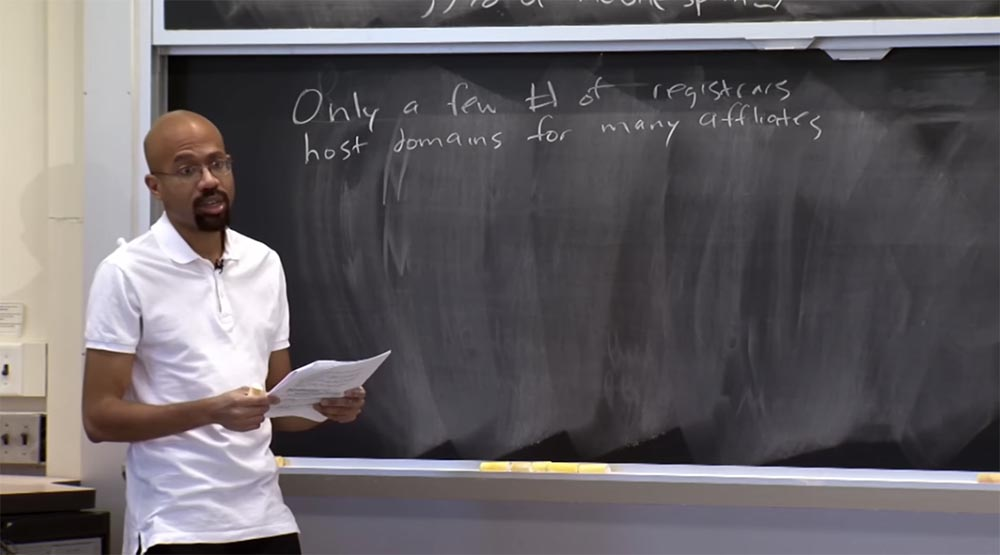
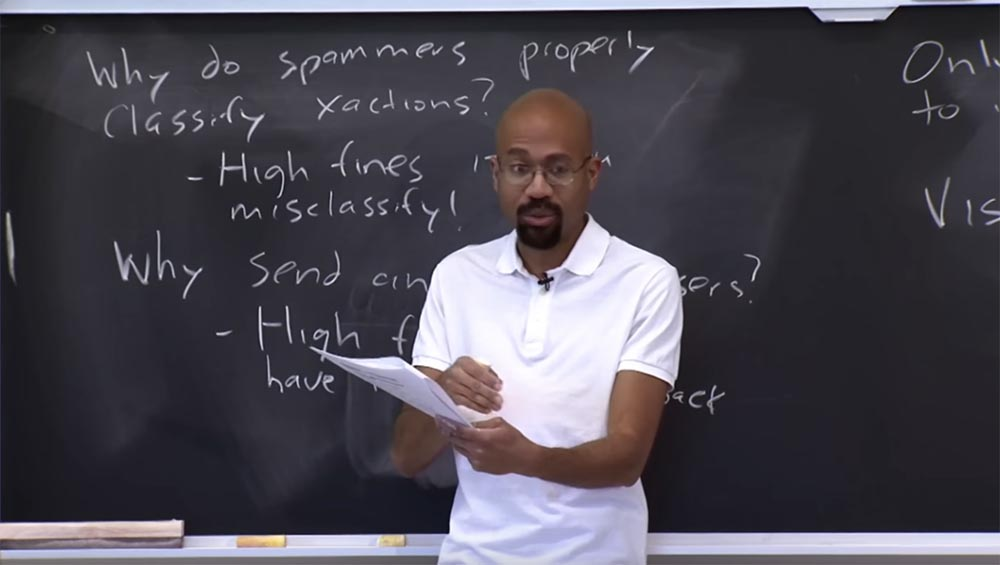
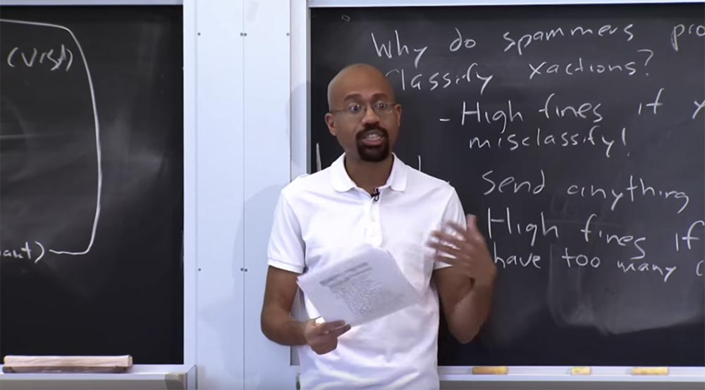
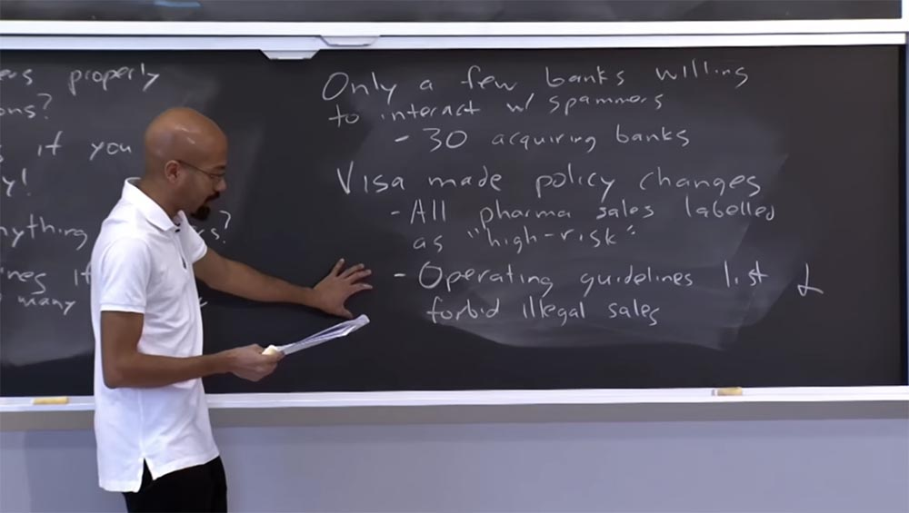
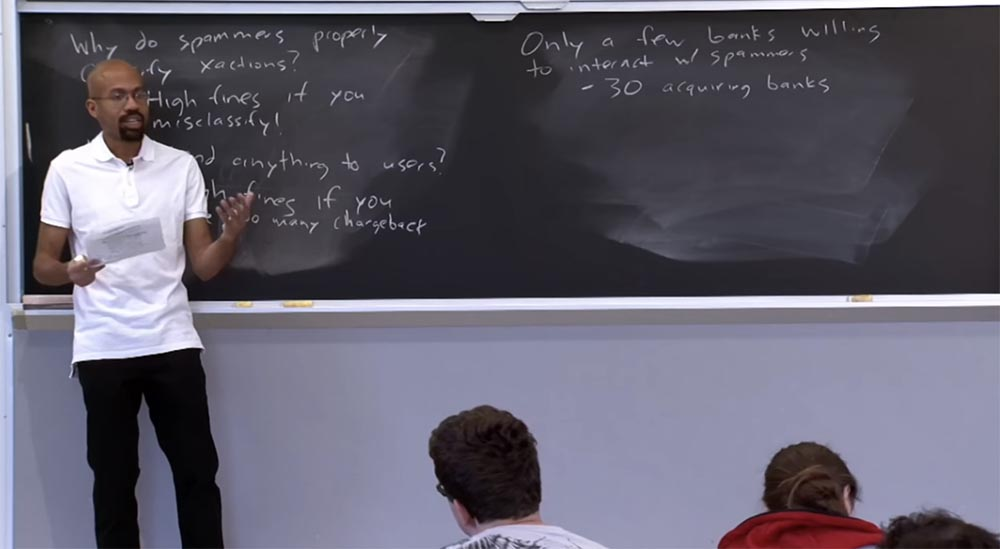
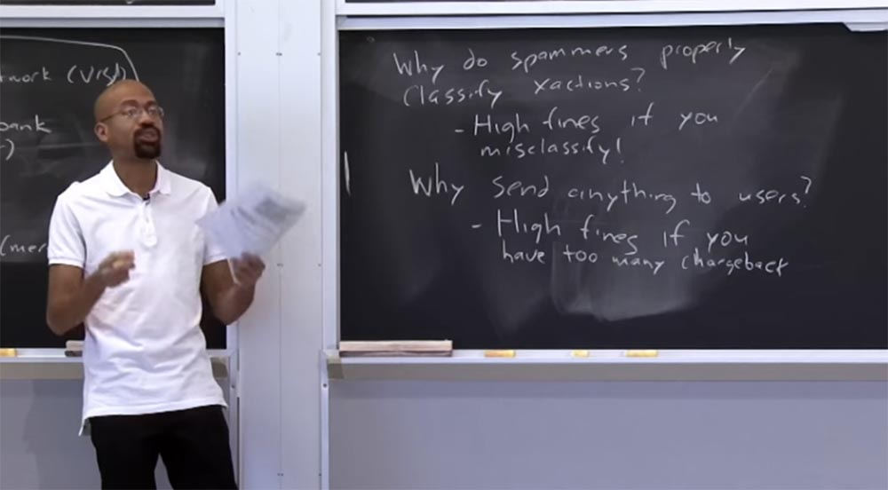
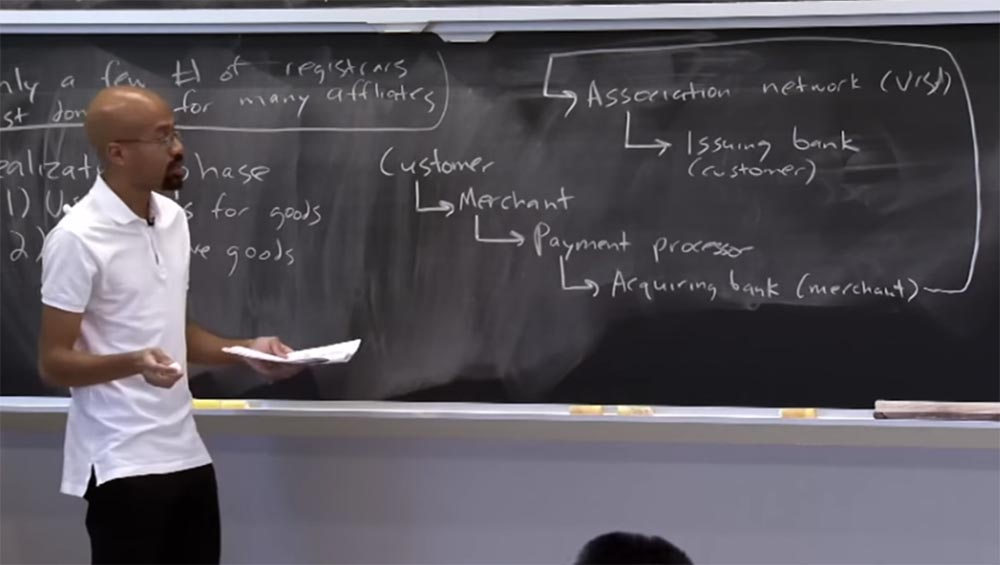
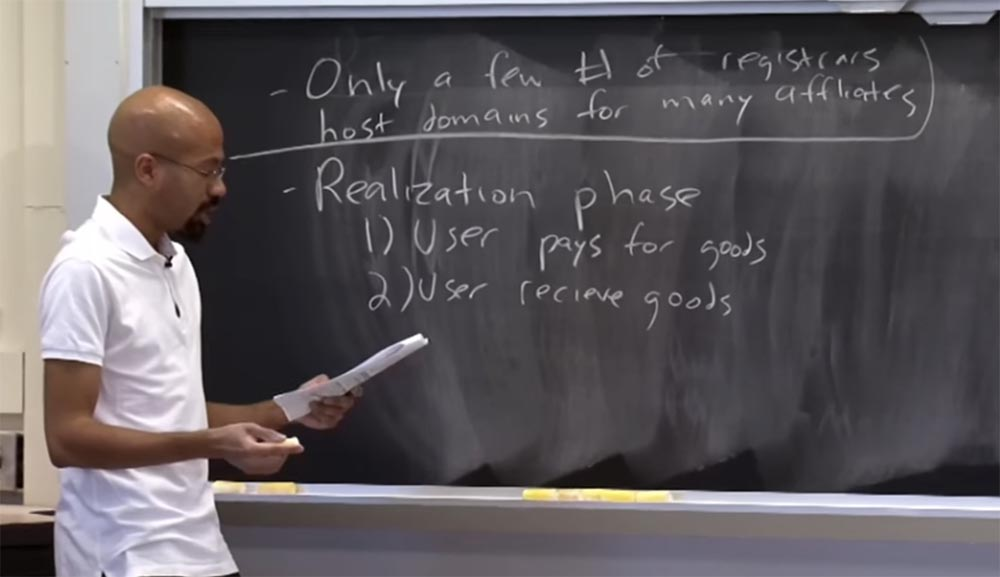
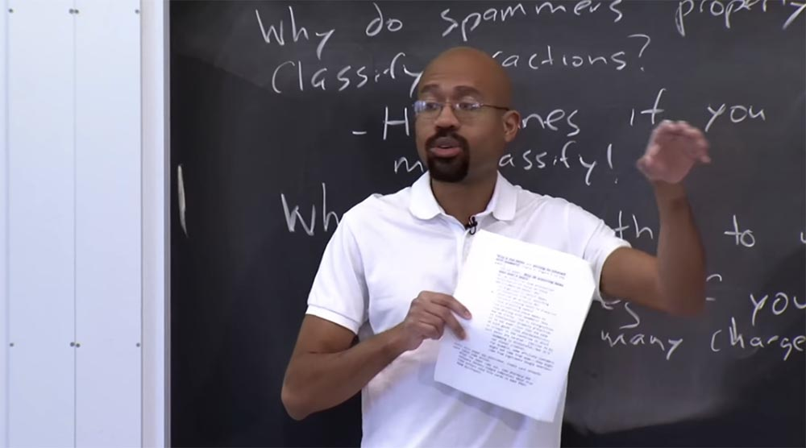

Курс MIT «Безопасность компьютерных систем». Лекция 23: «Экономика безопасности», часть 3 / Блог компании ua-hosting.company

### Массачусетский Технологический институт. Курс лекций #6.858. «Безопасность компьютерных систем». Николай Зельдович, Джеймс Микенс. 2014 год

Computer Systems Security — это курс о разработке и внедрении защищенных компьютерных систем. Лекции охватывают модели угроз, атаки, которые ставят под угрозу безопасность, и методы обеспечения безопасности на основе последних научных работ. Темы включают в себя безопасность операционной системы (ОС), возможности, управление потоками информации, языковую безопасность, сетевые протоколы, аппаратную защиту и безопасность в веб-приложениях.

Лекция 1: «Вступление: модели угроз» [Часть 1](https://habr.com/company/ua-hosting/blog/354874/) / [Часть 2](https://habr.com/company/ua-hosting/blog/354894/) / [Часть 3](https://habr.com/company/ua-hosting/blog/354896/)  
Лекция 2: «Контроль хакерских атак» [Часть 1](https://habr.com/company/ua-hosting/blog/414505/) / [Часть 2](https://habr.com/company/ua-hosting/blog/416047/) / [Часть 3](https://habr.com/company/ua-hosting/blog/416727/)  
Лекция 3: «Переполнение буфера: эксплойты и защита» [Часть 1](https://habr.com/company/ua-hosting/blog/416839/) / [Часть 2](https://habr.com/company/ua-hosting/blog/418093/) / [Часть 3](https://habr.com/company/ua-hosting/blog/418099/)  
Лекция 4: «Разделение привилегий» [Часть 1](https://habr.com/company/ua-hosting/blog/418195/) / [Часть 2](https://habr.com/company/ua-hosting/blog/418197/) / [Часть 3](https://habr.com/company/ua-hosting/blog/418211/)  
Лекция 5: «Откуда берутся ошибки систем безопасности» [Часть 1](https://habr.com/company/ua-hosting/blog/418213/) / [Часть 2](https://habr.com/company/ua-hosting/blog/418215/)  
Лекция 6: «Возможности» [Часть 1](https://habr.com/company/ua-hosting/blog/418217/) / [Часть 2](https://habr.com/company/ua-hosting/blog/418219/) / [Часть 3](https://habr.com/company/ua-hosting/blog/418221/)  
Лекция 7: «Песочница Native Client» [Часть 1](https://habr.com/company/ua-hosting/blog/418223/) / [Часть 2](https://habr.com/company/ua-hosting/blog/418225/) / [Часть 3](https://habr.com/company/ua-hosting/blog/418227/)  
Лекция 8: «Модель сетевой безопасности» [Часть 1](https://habr.com/company/ua-hosting/blog/418229/) / [Часть 2](https://habr.com/company/ua-hosting/blog/423155/) / [Часть 3](https://habr.com/company/ua-hosting/blog/423423/)  
Лекция 9: «Безопасность Web-приложений» [Часть 1](https://habr.com/company/ua-hosting/blog/424289/) / [Часть 2](https://habr.com/company/ua-hosting/blog/424295/) / [Часть 3](https://habr.com/company/ua-hosting/blog/424297/)  
Лекция 10: «Символьное выполнение» [Часть 1](https://habr.com/company/ua-hosting/blog/425557/) / [Часть 2](https://habr.com/company/ua-hosting/blog/425561/) / [Часть 3](https://habr.com/company/ua-hosting/blog/425559/)  
Лекция 11: «Язык программирования Ur/Web» [Часть 1](https://habr.com/company/ua-hosting/blog/425997/) / [Часть 2](https://habr.com/company/ua-hosting/blog/425999/) / [Часть 3](https://habr.com/company/ua-hosting/blog/426001/)  
Лекция 12: «Сетевая безопасность» [Часть 1](https://habr.com/company/ua-hosting/blog/426325/) / [Часть 2](https://habr.com/company/ua-hosting/blog/427087/) / [Часть 3](https://habr.com/company/ua-hosting/blog/427093/)  
Лекция 13: «Сетевые протоколы» [Часть 1](https://habr.com/company/ua-hosting/blog/427763/) / [Часть 2](https://habr.com/company/ua-hosting/blog/427771/) / [Часть 3](https://habr.com/company/ua-hosting/blog/427779/)  
Лекция 14: «SSL и HTTPS» [Часть 1](https://habr.com/company/ua-hosting/blog/427783/) / [Часть 2](https://habr.com/company/ua-hosting/blog/427785/) / [Часть 3](https://habr.com/company/ua-hosting/blog/427787/)  
Лекция 15: «Медицинское программное обеспечение» [Часть 1](https://habr.com/company/ua-hosting/blog/428652/) / [Часть 2](https://habr.com/company/ua-hosting/blog/428654/) / [Часть 3](https://habr.com/company/ua-hosting/blog/428656/)  
Лекция 16: «Атаки через побочный канал» [Часть 1](https://habr.com/company/ua-hosting/blog/429390/) / [Часть 2](https://habr.com/company/ua-hosting/blog/429392/) / [Часть 3](https://habr.com/company/ua-hosting/blog/429394/)  
Лекция 17: «Аутентификация пользователя» [Часть 1](https://habr.com/company/ua-hosting/blog/429680/) / [Часть 2](https://habr.com/company/ua-hosting/blog/429682/) / [Часть 3](https://habr.com/company/ua-hosting/blog/429686/)  
Лекция 18: «Частный просмотр интернета» [Часть 1](https://habr.com/company/ua-hosting/blog/430204/) / [Часть 2](https://habr.com/company/ua-hosting/blog/430206/) / [Часть 3](https://habr.com/company/ua-hosting/blog/430208/)  
Лекция 19: «Анонимные сети» [Часть 1](https://habr.com/company/ua-hosting/blog/431262/) / [Часть 2](https://habr.com/company/ua-hosting/blog/431264/) / [Часть 3](https://habr.com/company/ua-hosting/blog/431266/)  
Лекция 20: «Безопасность мобильных телефонов» [Часть 1](https://habr.com/company/ua-hosting/blog/432616/) / [Часть 2](https://habr.com/company/ua-hosting/blog/432618/) / [Часть 3](https://habr.com/company/ua-hosting/blog/432620/)  
Лекция 21: «Отслеживание данных» [Часть 1](https://habr.com/company/ua-hosting/blog/432616/) / [Часть 2](https://habr.com/company/ua-hosting/blog/432618/) / [Часть 3](https://habr.com/company/ua-hosting/blog/432620/)  
Лекция 22: «Информационная безопасность MIT» [Часть 1](https://habr.com/company/ua-hosting/blog/434342/) / [Часть 2](https://habr.com/company/ua-hosting/blog/434344/) / [Часть 3](https://habr.com/company/ua-hosting/blog/434346/)  
Лекция 23: «Экономика безопасности» [Часть 1](https://habr.com/company/ua-hosting/blog/435786/) / [Часть 2](https://habr.com/company/ua-hosting/blog/435788/)

В лекционной статье говорится о различных стратегиях ответного удара, способных остановить спамера. Авторы заметили, что существует ограниченное количество регистраторов доменных имён для партнёрских программ. Это означает, что большинство аффилированных партнёров индивидуально связаны с регистратором, который занимается их доменными именами и инфраструктурой. Очень редко, когда один регистратор доменных имен связан с кучей разных партнёрских программ.

Это означает, что не существует общего центра, общего регистратора, нанеся удар по которому можно было бы вывести из строя всю инфраструктуру спама. Аналогичная схема действует в отношении таких вещей, как веб-серверы. Редко когда один ISP провайдер владеет кучей веб-серверов с кучей партнерских программ. Этот бизнес имеет распределённую природу, поэтому очень трудно сказать, что если мы «возьмём» вот этих 3-х провайдеров, то вся экосистема спама будет разрушена.

Поэтому жаль, что не существует единого сервера, по которому можно было бы нанести удар, чтобы прекратить рассылку спама. Позже мы увидим, что это может сработать по отношению к некоторым теневым банковским схемам, так что, возможно, нам всё же удастся надавить на спамера.

Давайте вернёмся к рассмотрению стадии реализации спама и посмотрим, что происходит после того, как вы, пользователь, решили что-то купить. Фаза реализации состоит из двух частей.  
Пользователь платит за любые товары, которые покупает или хочет купить, а затем, надеюсь, получает эти товары либо по почте, как в случае покупки поддельных лекарств, либо скачивает из интернета, если хочет получить пиратский Photoshop или что-то подобное.

Денежный поток выглядит примерно так. Клиент обращается к продавцу и говорит ему, что хочет что-либо купить. Он отправляет информацию о кредитной карте, после чего продавец общается с обработчиком платежей Payment processor. Это важный посредник, который помогает продавцу, спамеру, разобраться с некоторыми тонкостями взаимодействия с системой кредитных карт. Обработчик платежей связывается с обслуживающим банком.

Обслуживающий банк осуществляет все операции, связанные с выполнением расчетов и платежей по банковским картам. Он связывается с тем, что в статье называют «ассоциированной сетью», но мы будем думать о ней просто как о платёжной системе Visa или MasterCard, так что это просто сети кредитных карт.

Наконец эти Association network, или карточные сети, общаются с банком-эмитентом покупателя. По сути, они запрашивают информацию, является ли данная сделка законной, то есть происходит с согласия владельца карты. Если это так, деньги проходят через всю эту систему и поступают продавцу. Вот так выглядит сквозной финансовый поток операций. Этот рабочий процесс может обрабатывать большие деньги. Одна из статей, упомянутых в лекционном материале, говорит, что один партнер может получить более $10 млн. долларов в результате такой сделки. Возникает вопрос, почему банк-эквайер или банк-эмитент не сообщат, что здесь что-то не так? Как выясняется, в многих случаях они действительно ничего не сообщают.

Интересно, почему финансовая система терпимо относится к подобным процессам. Например, почему спамеры правильно классифицируют свои сделки? Когда вы хотите отправить что-то через эту систему, вы должны правильно обозначить тип проводимой транзакции, указав, что продаёте фармацевтику, программное обеспечение, что угодно, это неважно. Можно предположить, что спамер, торгующий поддельными витаминами, не захочет указать, что занимается фармацевтическим бизнесом. Однако интересно, что спамеры в большинстве случаев правильно классифицируют сделки. Причина в том, что за неверную классификацию могут присудить высокий штраф.

Поэтому ассоциированные сети типа Visa или Mastercard считают, что с такими сделками всё в порядке, даже если они выглядят немного подозрительно. Но они не хотят, чтобы их обвинили в отмывании денег или попытке обмануть власти. Пока вы правильно классифицируете то, что делаете, то вы в определенном смысле защищаете себя. Потому что всегда можно сказать властям, что вы немного не поняли закон, но, по крайней мере, не пытались скрыть цель этой транзакции. Таким образом, часто спамеры правильно классифицируют свои транзакции, то есть определённой мерой играют в рамках системы.

Еще один вопрос, о котором я упоминал ранее — зачем спамеру отправлять что-либо покупателям? Предположительно, если ты спамер, значит, ты преступник, верно? Так почему бы просто не собрать у народа деньги и не сбежать вместе с ними? Выясняется, что они на самом деле отправляют вещи покупателям, потому что не хотят нарываться на высокие штрафы. Это очень интересная система, в которой спамеры хотят что-то делать законно, и пока они еще не могут использовать биткойны, фактически должны работать в пределах ограничений уже существующей системы.

Высокие штрафы присуждаются и за то, если спамер имеет много возвратных платежей. Возвратный платеж означает, что клиент заявляет финансовой компании, что не получил оплаченный товар или качество полученного товара его не устраивает. Поэтому если у спамера слишком много клиентов, требующих возврата платежей, с него взимаются очень и очень высокие штрафы. Поэтому процент возвратных платежей при спамерских сделках довольно мал. Дело в том, что конверсионные курсы их прибылей супер низкие, так что даже один или два штрафа могут уничтожить всю месячную прибыль. Так что спамеры действительно заинтересованы избегать штрафов в обоих приведённых выше случаях.

**Аудитория:** способствует ли использование PayPal более скрытым отношениям с банком?

**Профессор:** и да, и нет. PayPal во многих отношениях очень похож на Visa или MasterCard. Его деятельность регулируется похожими правилами, потому что у этих платёжных систем одни и те же виды рисков. Думаю, что на некоторые вещи Visa имеет более строгие ограничения, о которых мы поговорим через секунду. Но как платежная система, Paypal преследует похожие цели.

**Аудитория:** есть ли идея организовать группу, в которой вы создаёте учетную запись, а затем намеренно идёте на сайт спамера, покупаете кучу вещей, после чего оформляете возвратные платежи, чтобы с него взыскали штраф? Или сообщаете о том, что спамеры неправильно классифицируют сделки, чтобы их оштрафовали?

**Профессор:** интересная идея, прямо как линчеватели!

**Аудитория:** ну да, спам спамеров.

**Профессор:** да, именно так, но я о таком никогда не слышал. Я знаю, что спамеры пытаются обнаружить людей, которые их троллят. В статье говорится, как авторы определяли спамеров. Они получили кучу спам-сообщений, прошли по куче ссылок, оформили специальную карту Visa, которую использовали для покупки этих вещей, и так далее. Они называют это «тестовые покупки». Однако спамеры стремятся предотвратить тестовые покупки тех людей, которые пытаются выяснить, что происходит. Поэтому некоторые спамеры требуют от вас подтвердить свою личность, прежде чем что-то вам продать. Они могут попросить вас прислать фотографию удостоверения личности или что-то в этом роде. Некоторые люди стали это делать после того, как Visa ужесточила правила, касающиеся спама. Теперь у спамеров возникают проблемы, потому что люди, нажимающие на спам-ссылки, не хотят отправлять скан своего удостоверения личности какому-то случайному человеку. В статье приводятся выдержки из переписки спамеров на форуме, где они жалуются на то, что Visa их достала – они вынуждены просить людей выслать им подтверждение личности, но те не хотят этого делать. Странно, что люди бояться высылать спамерам сканы документов, но не опасаются сообщать им номера своих кредитных карт. В любом случае, спамеры заинтересованы в том, чтобы вовремя обнаружить людей, пытающихся вывести их на чистую воду.

**Аудитория:** что касается возвратных платежей – возможно, если люди не хотят, чтобы их банк знал, что они покупают нелегальные вещи, то они постесняются потребовать возврата денег, даже если не получили товар?

**Профессор:** хороший вопрос. Я не знаю, какая часть людей, купивших всякие БАДы, были ими разочарованы и сообщили об этом своему банку. Интересно, что банк в первую очередь должен знать, куда направляет деньги, но думаю, вам не нужно разглашать ему какую-то дополнительную информацию о сделке, чтобы оформить возврат денег.

**Аудитория:** какой примерно процент возвратных платежей вызывает у спамера беспокойство?

**Профессор:** называют цифры порядка 1% от всех транзакций. Другими словами, если вы спамер и у вас более 1% транзакций требуют возвратный платёж, это повод для беспокойства. Меня не удивили бы более низкие цифры, но я слышал именно об одном проценте.

Как я уже сказал, для меня это была одна из самых интересных частей статьи, потому что я всегда считал, что обязательным свойством спама является открытое мошенничество. То есть люди прошли по ссылкам, выслали деньги и ничего не получили. Но как оказалось, спамеры должны пройти через всю эту сеть, которая имеет механизмы для предотвращения мошенничества, и в конечном итоге они вынуждены отправлять вещи покупателям.

Еще одна причина, по которой спамеры предпочитают действовать аккуратно, правильно классифицировать транзакции и на самом деле отправлять вещи клиентам, является то, что лишь несколько банков готовы сотрудничать со спамерами. Это означает, что если спамер получает много возвратных платежей, или создаёт проблемы с банковскими операциями и кредитными картами, то какой-то банк может разорвать с ним отношения. При этом остается не так много других банков, которые согласны пойти навстречу спамеру, чтобы он продолжил заниматься своими «шалостями».

Исследования этой темы показали, что существует всего около 30 банков-эквайеров, услугами которых спамеры пользовались более двух лет. На самом деле это очень малое количество банков. Так что дефицит банков служит стимулом не дурить с финансовой системой, потому что спамеру просто не к кому будет обратиться, если он нарушит установившиеся партнерские отношения.  
Таким образом, кажется, что требования строго соблюдать финансовые правила может сократить спам. Мы обсудили, что такие вещи, как ботнет, предоставляют спамерам множество IP-адресов, существует достаточно провайдеров, готовых запустить для них веб-серверы и так далее, но число обслуживающих банков на самом деле кажется маленьким. Так что, может быть, мы действительно можем атаковать спам именно здесь.

Но, как я уже говорил, это сложно сделать из-за того, что трудно доказать сам факт незаконности спамерской деятельности. Например, если вы используете спам-сообщения, чтобы продавать, предположим, сахар, в этом нет ничего незаконного, потому что продажа сахара не нарушает никаких законов. Вы можете каким-то образом обмануть покупателя в процессе продажи, но сама по себе продажа сахара не является противоправной деятельностью.

Как выясняется, много спама попадает в эту «серую область», где вещи, которые делают спамеры, могут быть неприятными, но при этом не обязательно нарушать закон. Для таких вещей, как пиратское программное обеспечение, законодательство более четко очерчивает рамки законности. Однако вы не можете просто указать на один из этих банков и сказать: «привет, ваши клиенты – это преступники!», потому что это не всегда верно, особенно если отсутствуют чёткие бумажные доказательства, которые связывают финансовую транзакцию с URL-адресом спамера, который является источником происхождения этой транзакции. Зачастую бывает очень трудно доказать связь этих звеньев цепочки распространения спама.

С тех пор, как была опубликована рассматриваемая нами статья, отрасль кредитных карт предприняла некоторые ответные действия, потому что эта статья в момент своего выхода произвела довольно большой фурор. После этого ассоциации платежных систем Visa и MasterCard задались вопросом, что они могут сделать, чтобы отсечь часть спама. Интересно, что после публикации статьи некоторые фармацевтические компании и поставщики программного обеспечения подали жалобы на Visa.

Если вы помните из статьи, Visa была ассоциированной сетью, через которую исследователи спама совершали пробные, или фиктивные покупки, поэтому некоторые компании посчитали, что Visa может использоваться в качестве системы финансирования деятельности спамеров и решили на неё пожаловаться.

В ответ на эти жалобы Visa внесла некоторые изменения в свою платёжную политику. Например, сейчас все сделки с фармацевтической продукцией Visa помечает как высокорисковые продажи. Это означает, что если банк выступает в качестве эквайера по этим сделкам, то Visa установит для него более жесткие условия транзакции, например, потребует, чтобы банк участвовал в программе управления рисками либо станет его чаще проверять.

Visa также изменила внутренний регламент. Теперь они недвусмысленно определили список и запретили незаконную продажу лекарственных средств и товаров, находящихся под охраной зарегистрированных товарных знаков.

Это помогает ввести более агрессивные штрафы против банков и торговцев, которые, по мнению данной платёжной системы, участвуют в незаконной продаже лекарств, часов поддельных марок и так далее. Ещё раз повторю – существует ещё много спама, находящегося в «серой области», причём это не обязательно незаконно. Просто от клиентов требуется использовать определённые приёмы. Но теперь Visa может оказывать на людей более сильное воздействие.

Чтобы избежать фальшивых покупок, которыми занимаются не только исследователи спама, но и ассоциированные сети, спамеры стали требовать от покупателей сканы удостоверения личности, и это, как правило, не очень хорошо.

По крайней мере, через несколько лет после того, как платежные системы внесли изменения в правила совершения сделок, это оказало влияние. Приятно видеть, что эта статья оказала большое воздействие на реальную жизнь.

Ещё одна интересная вещь, которая упомянута в статье – это этические аспекты проведения исследований безопасности, в частности, исследования цепочки спама. Чтобы понять, как работают некоторые из банковских механизмов, исследователям на самом деле пришлось совершать покупки. Они должны были заплатить спамеру за эти товары. Авторы пишут, что уничтожили всё, что купили, ничем не пользуясь, и разговаривали с компаниями-разработчиками по поводу покупки пиратских версий их ПО, перед тем, как его купить.

На самом деле происхождение таких вещей имеет большое значение, особенно в университетской среде. Потому что если вы хотите сделать что-то, что включает в себя исследования личности, всё, что может иметь этические аспекты, вы должны получить разрешение юристов из Комиссии по этической оценке исследовательских проектов IRB и тому подобное. Для исследователей очень важно быть уверенными, что своими действиями они не поддержат злоумышленников в каком-то отдаленном уголке мира. Это тоже интересная часть лекционных материалов, потому что мы уже обсуждали, насколько этично разрабатывать эксплойты нулевого дня, если вы знаете, что они не могут быть кем-то исправлены? Так что это действительно интересный аспект исследования безопасности.

**Аудитория:** есть ли какой-либо надзор над этикой безопасности? Потому что в статье написано, что IRB в этом не заинтересована.

**Профессор:** да, это было очень интересно. Они утверждают, что IRB не была заинтересована, я думаю, потому что в этих исследованиях не было очевидного человеческого субъекта. Однако в отношении большинства университетов нельзя просто сказать, что там нет прямого человеческого субъекта, поэтому просто позвольте мне купить кое-что из спам-ссылки. В статье они выражают признательность различным людям и организациям, которые оказали помощь в проведении исследований. Я не думаю, что существует некий американский стандарт для этого типа исследований. Я знаю, что IRB каждого университета проводит немного различную политику в отношении того, что можно и что нельзя делать, так что я не думаю, что существует некая общая политика.

**Аудитория:** если учесть, что отслеживалось 350 миллионов спам-адресов, и всего 28 связались со спамерами, существует ли вероятность того, что значительное число из этих 28 составляли исследователи, изучавшие цепочку спама?

**Профессор:** думаю, что эти результаты послужили одной из причин, почему авторы приложили столько усилий, чтобы защитить себя от обвинений в необъективности. Потому что если вы подумаете о том, насколько весёлая вещь эта статистика, где прибавление 5 или отнимание пяти в действительности будет влиять на то, сможет ли спамер сделать своим детям настоящий подарок или подарить им кусочек угля, потому что удачных покупок было так мало.  
Что касается конкретного количества людей, попавшихся спамеру на крючок, то я не знаю, сколько из них были исследователями. Но я думаю, что в целом, как я уже сказал, спамеры просто хотят взять ваши деньги. И поэтому, если бы они могли найти какой-то баланс, при котором исследователи могут тестировать покупку товаров, не влияя на общее количество продаж, это было бы для спамеров просто замечательно, потому что главное для них – это получить деньги, всё равно, с кого.

Сложность в том, что предположим, было совершено 35 покупок, из которых половину сделали исследователи, в результате чего люди оказали давление на банки, после чего спамеры вместо 35 продаж совершили всего 2 — вот такого они не хотят. Поэтому спамеры заинтересованы в прекращении таких исследований.

**Аудитория:** сколько из этих 350 миллионов сообщений фильтруется? Я уверен, что для спамера не составляет никакой проблемы разослать 350 миллионов спам-сообщений.

**Профессор:** все дело в анализе затрат и выгод с точки зрения спамера. Я думаю, что существует рынок для целенаправленного осуществления подобных вещей. В частности, при этом очень полезными становятся взломанные аккаунты электронной почты, потому что спамеры более склонны к воздействию на целевую аудиторию и рассматривают сфокусированные спам-письма как сулящие более высокую прибыль. Например, спам, ориентированный на предпочтения определённой социальной группы, предположим, группы последователей Далай-Ламы.

**Аудитория:** было бы интересно, если бы существовала компания, разыскивающая доверчивых бабушек, чтобы вставлять спам в их письма.

**Профессор:** я не удивлюсь, если такие вещи существуют, но я об этом не знаю. Последнее, про что я хотел бы рассказать, это про компании, которые взяли на себя ответственность делать вещи, которые они называют hackback, или «ответный взлом». Идея заключается в том, что если вы банк и кто-то пытается вас взломать и украсть информацию, то вы сами находите этих хакеров и поступаете с ними аналогичным образом.

Например, в ответ на их атаку вы пытаетесь отключить им ботнет, или украсть их информацию, или сделать нечто подобное. На сегодня это более распространено, чем раньше. Одна из причин – это то, что правовая система медленно адаптируется к некоторым современным угрозам, и банкам или финансовым учреждениям надоело ждать от неё действенных мер. Например, в 2013 году существовала огромная сеть ботнет для распространения пиратского программного обеспечения и поддельных товаров, поэтому для принятия контрмер образовалась огромная коалиция компаний Microsoft, American Express, Paypal, многие из которых запустили операцию по уничтожению ботнета. Фактически они собственными силами, не прибегая к помощи правительственных структур, уничтожили пиратский ботнет. Они притаились на некоторое время и узнали о том, где находится инфраструктура Command & Control. Затем они захватили её, определили, где находятся все боты конечных пользователей и разослали сообщения, в которых уведомляли пользователей о необходимости «пропатчить» их компьютеры.

Этот пример очень интересен с точки зрения пересечения интересов компьютерной безопасности и законов, потому что некоторые разделы законов США дают право компаниям совершать подобные действия. Например, юристы Microsoft заявили, что эти сети ботнет нарушают правила использования торговой марки Microsoft.

К примеру, если вы продаете пиратские копии Windows и утверждаете, что это именно Windows, не получив право распоряжаться этими копиями на законных основаниях, и вы не можете легализовать источники их происхождения, то Microsoft заявляет о нарушении права на торговую марку и о своём ответном праве взломать вашу сеть ботнет. В этом смысле происходит некий переворот логики, но суд это разрешил. И подобное происходит все чаще и чаще.  
Больше всего такое положение вещей растаивает банки, потому что они отмечают некое государственное спонсирование взлома банковских систем. Поскольку банкиры заботятся о деньгах, то очень расстраиваются, когда их теряют.

Поэтому интересно посмотреть, как бремя обеспечения кибербезопасности, в частности, наступательные операции, отходят к частному сектору, ведь долгосрочные последствия такого решения кажутся не совсем ясными.

На этом всё, думаю, что мы увидимся с вами в среду на рассмотрении ваших презентационных проектов по итогам этого курса лекций.

Полная версия курса доступна [здесь](https://ocw.mit.edu/courses/electrical-engineering-and-computer-science/6-858-computer-systems-security-fall-2014/).

Спасибо, что остаётесь с нами. Вам нравятся наши статьи? Хотите видеть больше интересных материалов? Поддержите нас оформив заказ или порекомендовав знакомым, **30% скидка для пользователей Хабра на уникальный аналог entry-level серверов, который был придуман нами для Вас:** [Вся правда о VPS (KVM) E5-2650 v4 (6 Cores) 10GB DDR4 240GB SSD 1Gbps от $20 или как правильно делить сервер?](https://habr.com/company/ua-hosting/blog/347386/) (доступны варианты с RAID1 и RAID10, до 24 ядер и до 40GB DDR4).

**VPS (KVM) E5-2650 v4 (6 Cores) 10GB DDR4 240GB SSD 1Gbps до января бесплатно** при оплате на срок от полугода, заказать можно [тут](https://ua-hosting.company/vpsnl).

**Dell R730xd в 2 раза дешевле?** Только у нас **[2 х Intel Dodeca-Core Xeon E5-2650v4 128GB DDR4 6x480GB SSD 1Gbps 100 ТВ от $249](https://ua-hosting.company/serversnl) в Нидерландах и США!** Читайте о том [Как построить инфраструктуру корп. класса c применением серверов Dell R730xd Е5-2650 v4 стоимостью 9000 евро за копейки?](https://habr.com/company/ua-hosting/blog/329618/)