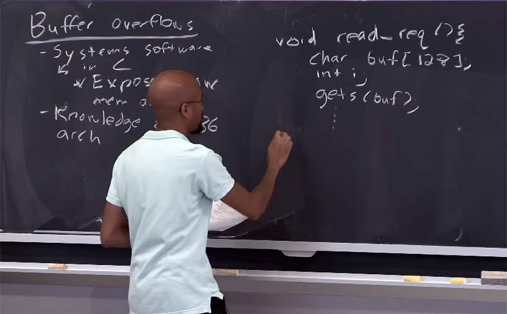
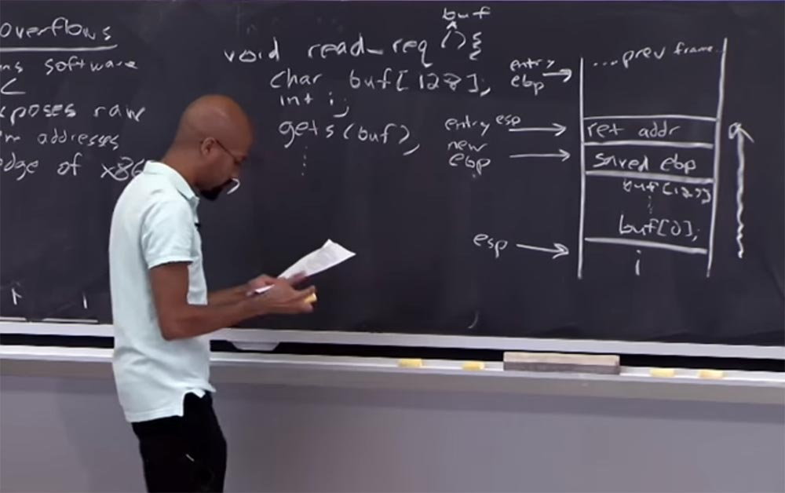
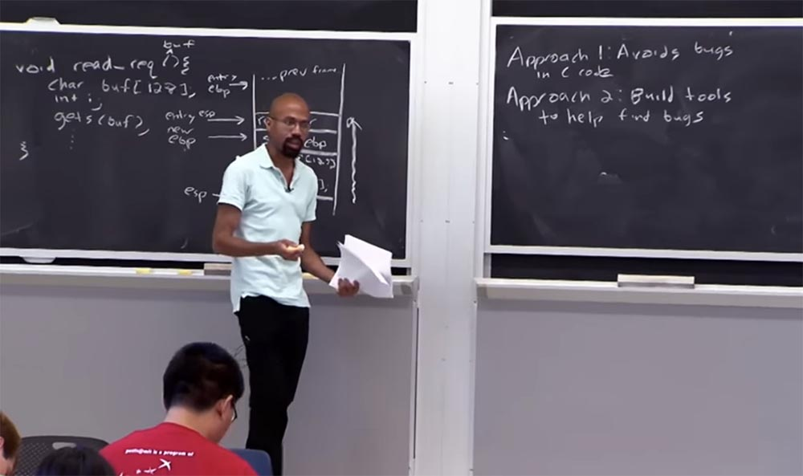
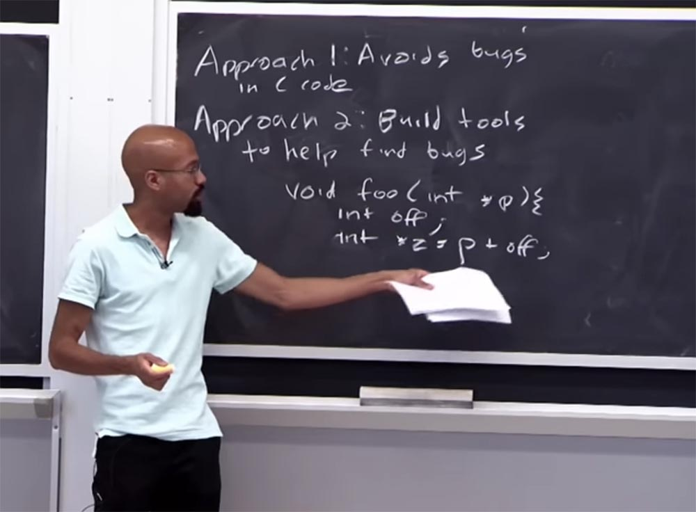
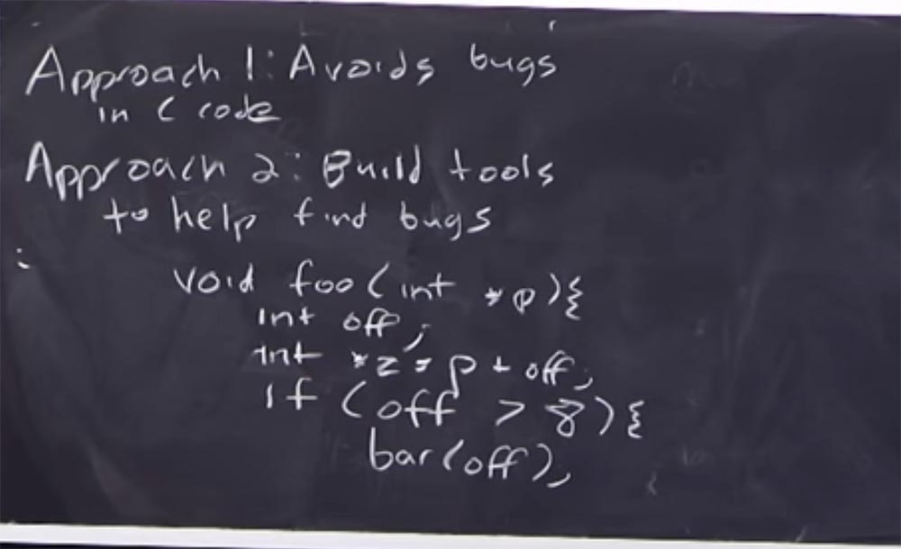
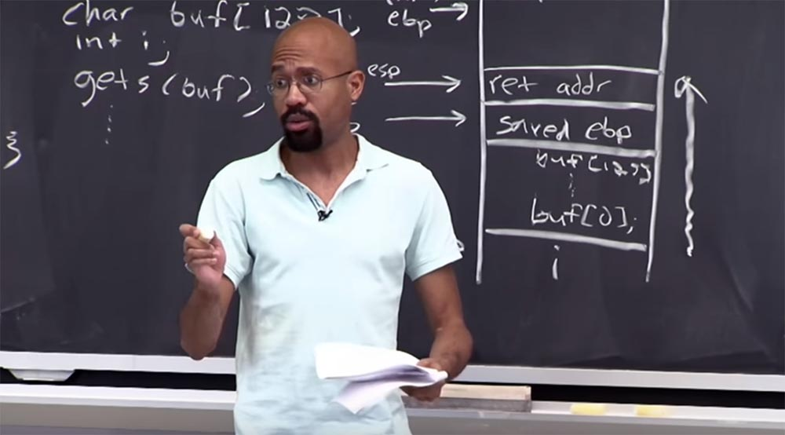
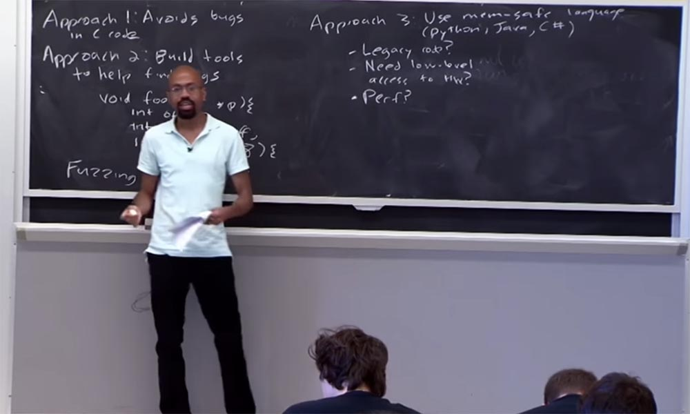
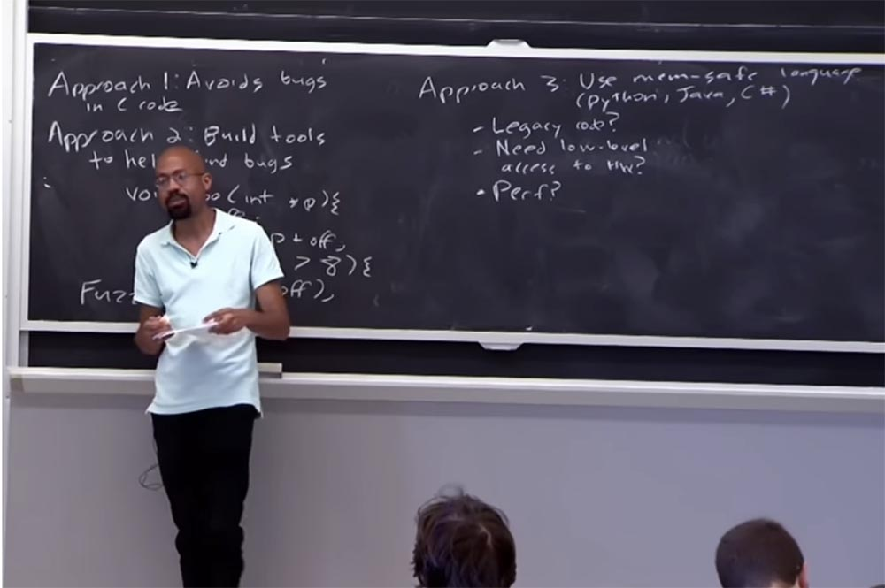
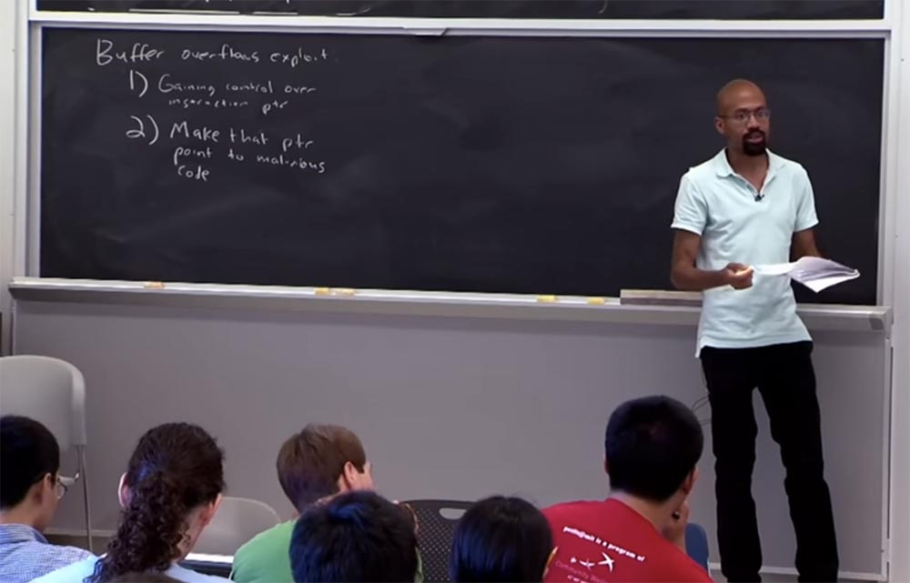

Курс MIT «Безопасность компьютерных систем». Лекция 2: «Контроль хакерских атак», часть 1 / Блог компании ua-hosting.company

### Массачусетский Технологический институт. Курс лекций #6.858. «Безопасность компьютерных систем». Николай Зельдович, Джеймс Микенс. 2014 год

Computer Systems Security — это курс о разработке и внедрении защищенных компьютерных систем. Лекции охватывают модели угроз, атаки, которые ставят под угрозу безопасность, и методы обеспечения безопасности на основе последних научных работ. Темы включают в себя безопасность операционной системы (ОС), возможности, управление потоками информации, языковую безопасность, сетевые протоколы, аппаратную защиту и безопасность в веб-приложениях.

Лекция 1: «Вступление: модели угроз» [Часть 1](https://habr.com/company/ua-hosting/blog/354874/) / [Часть 2](https://habr.com/company/ua-hosting/blog/354894/) / [Часть 3](https://habr.com/company/ua-hosting/blog/354896/)  
Лекция 2: «Контроль хакерских атак» [Часть 1](https://habr.com/company/ua-hosting/blog/414505/) / [Часть 2](https://habr.com/company/ua-hosting/blog/416047/) / [Часть 3](https://habr.com/company/ua-hosting/blog/416727/)

**Джеймс Микенс:** Из предыдущей лекции мы узнали все об атаках переполнения буфера, и сегодня мы продолжим обсуждение некоторых методов запуска этих атак. Основная идея атаки путём переполнения буфера заключается в следующем.

Прежде всего, отмечу, что эти атаки затрагивают несколько различных обстоятельств. Первое обстоятельство, которое они используют — это то, что системное программное обеспечение часто написано на языке C.

Под системным программным обеспечением я подразумеваю базы данных, компиляторы, сетевые серверы и прочее подобное. Можно вспомнить и такую вещь, как ваша любимая командная оболочка. Весь этот «софт» обычно пишется на языке C. Почему на C? Потому что, во-первых, так быстрее, а во-вторых, С считается ассемблером высокого уровня, который лучше всего соответствует потребностям самых разных аппаратных платформ. Поэтому все критически важные системы написаны на этом языке программирования низкого уровня. Проблема ПО, написанного на С, состоит в том, что он действительно использует «сырые» адреса памяти и не имеет никаких инструментов или программных модулей для их проверки. В отдельных случаях это может привести к катастрофическим последствиям.

Почему в С нет проверки индексов массивов, то есть нет проверки границ? Одна из причин заключается в том, что аппаратное обеспечение этого не делает. А люди, которые пишут на C, обычно хотят максимально возможную скорость выполнения программы. Другая причина заключается в том, что в C, как мы обсудим позже, на самом деле очень трудно определить семантику того, что такое указатель и в каких пределах он должен действовать. Поэтому в некоторых случаях было бы очень трудно автоматизировать программные процессы на языке C.  
Обсудим некоторые технологии, которые на самом деле пытаются создать некий тип автоматического управления памятью. Но, как мы увидим, ни один из этих методов не является полностью «пуленепробиваемым».

Кроме того, атаки переполнением буфера используют знание архитектуры x86, например, в каком направлении растет стек. Что такое соглашение о вызовах для функций? Когда вы обращаетесь к функции C, на что становится похожим стек? И когда вы выделяете объект в куче, как выглядят эти главные выделенные структуры?

Давайте рассмотрим простой пример. Это очень похоже на то, что вы видели на последней лекции. Итак, здесь у нас есть стандартный запрос на чтение, а затем мы получаем буфер, вот здесь, далее идёт канонический **int i**, за которым следует печально известная команда **gets**. А ниже мы располагаем другие нужные вещи.

Итак, как мы обсуждали на лекции на прошлой неделе, это проблематично, верно? Потому что эта операция **gets** не проверяет границы буфера. Если пользователь заполнит буфер данными и мы используем здесь эту небезопасную функцию здесь, то мы на самом деле можем переполнить буфер. Мы можем переписать всё содержимое стека. Напомню вам, как это выглядит.

В самом низу расположен массив «i». Выше него расположен буфер, у него на «дне» первый адрес, наверху — последний. В любом случае, выше буфера у нас есть сохраненное значение указателя разрыва – saved value EBP. Над ним располагается обратный адрес для функции, а ещё выше находятся некоторые вещи из предыдущего фрейма.

И не забывайте, что тут у нас внизу, слева от «i», у нас есть указатель стека ESP, который входит туда, а в секцию saved EBP входит новый указатель разрыва. В обратный адрес входит ESP, а в остатки предыдущего фрейма — точка разрыва.

Напомню, что способ переполнения стека заключается в том, что накопление данных происходит вверх, в направлении этой стрелки справа. Когда инициируется операция gets, мы начинаем записывать байты в буфер, в конце концов, он начнет перезаписывать всё, что расположено выше по стеку. В принципе, все должно выглядит для вас знакомым.

Что делает злоумышленник, чтобы воспользоваться преимуществом этого? В основном осуществляет ввод длинной последовательности данных. Поэтому ключевая идея заключается в том, что подобный приём может использоваться для атаки.

И если обратный адрес захвачен атакующим, он может определить, куда перепрыгнет функция после переполнения. То есть единственное, что может сделать хакер, это перехватить обратный адрес и прыгнуть туда, куда захочет. В основном злоумышленники запускают код с привилегиями управления процессом перехвата.

Итак, если этот процесс был высокоприоритетным, допустим, он был запущен под root или admin, как бы мы ни называли суперпользователя вашей любимой операционной системы, то сейчас эта программа, которая контролируется злоумышленником, может делать все, что захочет, используя полномочия этого приоритета. Таким образом, хакер может читать файлы или отправлять спам, если он повредил почтовый сервер. Он даже может победить файрволы, потому что идея брандмауэра заключается в том, что за ним расположены «хорошие» машины, а за его пределами – «плохие». Обычно компьютеры внутри файервола «доверяют» друг другу, и если вам удастся взломать хотя бы один компьютер внутри защищённой брандмауэром сети, это будет здорово. Потому что теперь вы можете просто пропустить множество проверок, которые эти компьютеры обычно предпринимают в отношении «чужих» машин, потому что они посчитают вас доверенным лицом.

Есть вещь, о которой вы должны были бы подумать и о которой думал я, будучи студентом:

«Отлично, нам показали, как переполнять буфер, но почему операционная система не может это остановить? Разве она не выступает кем-то вроде Хранителей Галактики, которая защищает добро от злых вещей, происходящих вокруг»?

Важно отметить, что ОС не наблюдает за вами постоянно. А аппаратное обеспечение наблюдает, оно извлекает инструкции и расшифровывает их и делает множество подобного. Но в первом приближении, что же делает ОС? Она в основном устанавливает таблицы страниц, которые позволяют работать приложению, и если вы попросите операционную систему, например, отправить сетевой пакет, или вы хотите сделать какой-то IPC запрос, или подобные вещи, вы обратитесь за помощью к ОС. Но операционная система не следит за каждой инструкцией, которую выполняет ваше приложение. Другими словами, когда этот буфер переполнен, ОС совершенно не следит, как используется память этого стека. Всё это адресное пространство принадлежит вам, как инициатору процесса, и это не касается ОС. Вы можете делать с этим всё, что хотите, и операционная система не может помочь вам с проблемами.

Позже мы обсудим некоторые вещи, которые ОС может сделать в отношении оборудования, чтобы защититься от такого типа атак. Напомню еще раз – фактически только аппаратное обеспечение следит за тем, что вы делаете, и реагирует на это. Таким образом, вы можете воспользоваться некоторыми специальными типами защиты, мы ещё обсудим это.

Вот таким образом выглядит переполнение буфера. Как же мы собираемся исправить все эти вещи?

Один из способов предотвращения переполнения буфера — это просто избегать ошибок в коде C. Это конструктивный подход, ведь если в вашей программе нет никаких ошибок, то злоумышленник не может ими воспользоваться. Однако это проще сказать, чем сделать. Есть несколько очень простых вещей, которые могут сделать программисты, чтобы обеспечить «гигиену» безопасности. Например, такие функции, как gets, которые, как мы теперь знаем, можно назвать «go-tos», или «захвати операционную систему», что является брешью в безопасности.

Итак, когда вы компилируете свой код, используя современный компилятор типа GCC или Visual Studio, то они будут указывать на недостатки подобных функций. Они скажут: «Эй, ты пользуешься опасной вещью, лучше рассмотри возможность использования функции fgets или другие функции, которые действительно смогут следить за соблюдением границ». Это одна из простых вещей, которую могут сделать программисты.

Но обратите внимание, что многие приложения фактически манипулируют буферами, не обращаясь ко всем этим функциям. Это очень распространено в сетевых серверах, которые определяют свои собственные процедуры синтаксического анализа, а затем убеждаются, что данные извлекаются из буфера так, как они хотят. Таким образом, просто ограничивая себя подбором правильных командных функций, полностью решить проблему не удастся.

Ещё одно обстоятельство, которое затрудняет подобный подход к проблеме, состоит в том, что не всегда очевидно, что проблема вызвана ошибкой в программе, написанной на языке C. Если вы когда-либо работали над крупномасштабной программой, которая была написана на C, вы знаете, как сложно бывает с определителями функций, имеющих 18 звёздочек над указателем void*. Я думаю, только Зевс знает, что это может означать, верно? С языками типа C даже программисту бывает очень тяжело понять, имела место ошибка или нет.

В общем, одной из главных тем наших лекций будет то, что язык С является порождением дьявола. И мы используем его лишь потому, что как всегда хотим быть быстрее всех, верно? Но так как «железо» становится все быстрее, то и мы используем более «продвинутые» языки для написания объёмного системного кода. Однако не всегда имеет смысл писать свой код на С, даже если ты думаешь, что так будет быстрее. Позднее мы обсудим этот вопрос.

Итак, первый подход к решению проблемы – это избегать ошибок в программном коде С, а второй – это создавать инструменты, которые помогают программистам найти такие ошибки. Примером такого инструмента служит статический анализ кода, static code analysis. Позже мы поговорим о нём подробно, а сейчас я скажу, что статический анализ представляет собой способ анализа исходного кода вашей программы ещё до того, как она будет запущена, и помогает обнаружить потенциальные проблемы.

Представьте, что у вас есть такая функция, назовём её **void foo (int, *p)**, она содержит целочисленные данные и указатель. Допустим, он объявляет целое значение смещения **int off**. Эта функция объявляет другой указатель и добавляет к нему смещение: **int *z = p+off**. Даже сейчас, при написании функции, статический анализ кода может сообщить нам, что эта переменная смещения не инициализирована.

Таким образом, можно, анализируя программу, ответить на вопрос, будет ли наша функция работать должным образом. И в этом примере очень просто увидеть ответ «нет, не будет», потому что отсутствует инициализация смещения. Статический анализ – это программное обеспечение, и в процессе того, как вы используете популярный компилятор для сборки своего кода, оно будет вам говорить: «Эй, приятель, эта штука не инициализирована. Ты уверен, что хочешь сделать именно так?». Это один из простейших примеров использования статического анализа.

Другой пример рассматривает случай, когда у нас имеется ответвление функции, то есть её выполнение при определённом условии.

Так, если смещение больше 8, **if (off >8)**, то этот приводит к вызову некоторой функции **bar (off)**. Так вот, это условие говорит нам о том, каково значение смещения. Даже игнорируя то, что смещение не инициализировано, при анализе этой ветки функции мы всё равно узнаем, что оно может быть больше 8\. Поэтому, когда мы начнём проводить статический анализ bar, то узнаем, что смещение может принимать только определённые значения. Замечу ещё раз, что это очень поверхностное введение в статический анализ, позже мы будем рассматривать этот инструмент более подробно. Но данный пример показывает, как можно обнаружить некоторые типы ошибок даже без выполнение кода.

Итак, еще одна вещь, о которой вы можете подумать, что она делает то же самое, что и статический анализ. Это программный Fuzzing. Его идея заключается в том, что вы берете все функции в своем программном коде, а затем вводите в них случайные значения. Тем самым перекрываются все варианты значений и форматов вашего кода. То есть Fuzzing — это инструмент автоматического поиска уязвимостей путем подачи на вход программы невалидных данных или данных в неверном формате. Например, вы вводите значения 2, 4, 8 и 15 в тестировании модулей и получаете сообщение, что число 15, вероятно, неправильное, так как все числа чётные, а оно нечётное.

На самом деле, вам нужно смотреть на то, сколько ветвей программы в целом затрагивает ваш тестовый код, потому что это обычно те места, где скрываются «баги». Программисты не думают о таких «закоулках» и в результате у них проходят некоторые модульные тесты, можно сказать, большинство таких тестов. Однако они не обследуют все «закоулки» программы, и именно в этом может помочь статический анализ. Опять же, используя такие вещи, как понятие ограничения. Например, в нашем куске программы это условие ветвления функции, которое определило смещение больше чем восемь. Таким образом, мы можем узнать, что это смещение статично. И если использовать автоматическую Fuzzing генерацию входных данных, основываясь на этом ограничении, то мы сможем обеспечить, чтобы одно из значений input для смещения было бы меньше 8, одно равнялось 8 и одно было бы больше 8. Это понятно?

Итак, в этом состоит основная идея концепции создания инструментов, помогающих программистам находить ошибки. Даже частичный анализ кода может быть очень полезен, когда вы работаете с языком C. Многие из инструментов, которые мы рассмотрим, служащие для предотвращения переполнения буфера или проверки инициализации переменных, не способны обнаружить все проблемы программного кода. Но они могут принести практическую пользу в повышении безопасности этих программ. Недостатком этих инструментов является то, что они не являются полными. Перспективный прогресс – это не полный прогресс. Поэтому нужно активно исследовать проблему защиты от эксплойтов как в программах, написанных на С, так и в других программах. Мы рассмотрели 2 подхода к решению проблемы защиты от переполнения буфера, но есть и другие подходы.

Итак, третий подход – это использование memory-safe language, или языка, обеспечивающего безопасность памяти. К таким языкам относятся Python, Java, c#. Я не хочу ставить в один ряд с ними Perl, потому что его используют «плохие люди». Таким образом, вы можете использовать безопасный для памяти язык, и похоже, что это самое очевидное, что вы можете сделать. Я только что объяснил вам, что в основном C — это сборочный кодер высокого уровня, но он предоставляет «сырые» указатели и делает другие нежелательные вещи, так почему бы просто не использовать один из этих высокоуровневых языков программирования?

Для этого есть несколько причин. Во-первых, в этих языках есть много элементов кода, доставшегося в наследство от С. Всё нормально, если вы начинаете новый проект и используете для него один из высокоуровневых языков, обеспечивающих безопасность памяти. Но как быть, если вам дали большой двоичный файл или большой дистрибутив исходного кода, который был написан на C и поддерживался в течение 10 — 15 лет, это был проект поколений, я имею в виду, что над ним будут продолжать работать даже дети наших детей? В этом случае вы не сможете сказать: «я просто перепишу это всё на C# и изменю мир!».

И проблема заключена не просто в языке С, существуют системы, которых вы должны бояться ещё больше, так как они используют коды Fortran и COBOL, вещи времён Гражданской войны. Почему так происходит? Потому что, будучи инженерами, мы хотим думать, что можем просто построить все сами, и это будет потрясающе, это будет так как я хочу, и я буду вызывать свои переменные как захочу.

Но в реальном мире так не бывает. Вы появляетесь на работе, и у вас есть эта система, которая уже существует, и вы смотрите на основу кода и думаете, почему она не делает то, что нужно? А потом вам говорят: «Слушай, мы сделаем всё, что ты хочешь, но только во второй версии программы, а сейчас ты должен заставить работать то, что у нас есть, потому что иначе клиенты заберут свои деньги обратно».

Итак, как мы справляемся с огромной проблемой вынужденного использования устаревшего кода? Как вы узнали, одним из преимуществ систем с ошибочным определением границ является то, что они прекрасно работают с этим устаревшим кодом. Это одна из причин, почему нельзя избавится от проблемы переполнения буфера, просто перейдя на языки, обеспечивающие безопасное использование памяти.

Что, если нам нужен низкоуровневый доступ к аппаратному обеспечению? Например, к обновлению драйверов и прочим вещам.

Итак, еще одна проблема возникает, если вам нужен низкоуровневый доступ к оборудованию, что случается при написании драйверов для каких-то устройств. В этом случае вам действительно нужны преимущества, которые даёт C, например, возможность посмотреть на регистры и тому подобные элементы функции.

Далее потребность использовать С возникает, когда вас заботит производительность системы. Обычно говорят, что если вам нужна производительность, пишите на С, иначе всё будет работать слишком медленно. Правда, сейчас эта проблема стоит не так остро, потому что у людей появились компиляторы с мощными процессами оптимизации. Кроме того, существуют вещи, которые на самом деле снижают стоимость использования этих memory-safe языков. Я кратко расскажу вам, что такое JIT. Подумаем, что собой представляет язык Java, или Java Script. Это язык очень высокого уровня, динамически плотный, с автоматическим управлением и прочими «плюшками». Когда эти языки впервые появились, они всегда были интерпретированы. Под интерпретацией я имею в виду, что на самом деле они изначально не выполняли «сырые» инструкции x86.

Вместо этого эти языки были скомпилированы до некоторой промежуточной формы, то есть их исходный код транслируется в одно из промежуточных представлений, именуемых байт-кодом. Возможно, вы слышали о таких вещах, как JVM, байт-код виртуальной машины Java. Фактически у вас была зацикленная программа, которая брала эти байт-коды и выполняла закодированные в них инструкции высокого уровня. Например, некоторые байт-коды JVM занимались такими вещами, как толкание и выталкивание информации из стека. То есть у вас есть программа, которая будет совершать цикл, управлять этим стеком и эмулировать эти операции. Однако её производительность была очень низкая. То есть у вас имелся своего рода интерпретатор, работающий в данном цикле, который снижал быстродействие.

Для увеличения производительности люди стали использовать эти высокоуровневые языки и динамически, на лету, генерировать для них код х86\. Так как JIT-компиляция является из форм динамической компиляции, она позволяет применять адаптивную оптимизацию и динамическую рекомпиляцию. Поэтому JIT-компиляция может показывать лучшие результаты в плане производительности, чем статическая компиляция.

С точки зрения своевременной компиляции это означает, что я беру ваш фрагмент кода JavaScript и заранее трачу немного времени, чтобы создать реальную машинную инструкцию, «сырой» 32-х битный код, которая будет работать прямо на голом металле. Я беру часть начальной производительности для JIT-компиляции, но зато потом моя программа реально работает на «голом» жестком приводе. Поэтому, благодаря использованию таких инструментов, как JIT-интерпретаторы, утверждение, что программы на С более производительны, звучит не так убедительно.

Там также есть такие «сумасшедшие» вещи, такие как asm.js – подмножество JavaScript, скрипты, написанные на нём, подлежат эффективной компиляции. Существует несколько трюков, которые вы можете сделать, таких, как как компиляция JavaScript в очень ограниченное подмножество языка, который оперирует только массивами. Это позволяет избавиться от многих побочных явлений динамической типизации в стандартном JavaScript, и вы можете фактически получить код JavaScript, чтобы работать с производительностью C или С++.

Давайте рассмотрим случай, когда ваша программа на самом деле объектно-ориентирована, связана с IO. Это никак не связано с процессором. Другими словами, ваша программа тратит большую часть своего времени на ожидание сетевого входа, ввода данных диска, ожидание ввода данных пользователем, и тому подобное. При этом не нужно иметь «молниеносную» скорость вычислений, потому что ваша программа на самом деле не тратит много времени на выполнение таких вещей.

Поэтому нужно разумно подходить к решению вопроса производительности программы. Например, я попрошу кого-нибудь выйти сюда и написать мне очень простую программу для парсинга текстового файла. Большинство затратит всё своё время, пытаясь выполнить эту работу на C или C++, потому что так быстрее, и можно использовать шаблоны и все такое. Но для этого есть однострочное решение в Python, которое, по сути, работает так же быстро. И его можно приспособить для выполнения этой задачи намного проще. Так что вы должны критически относится к требованиям производительности.

Итак, мы обсудили три способа действий, которые нужно совершить, чтобы избежать переполнения буфера.

В первую очередь, нужно постараться не делать ошибок при написании кода. Второй подход к решению проблемы заключается в создании инструментов, которые помогут обнаружить ошибки. И третий способ заключается в том, что вы можете использовать эти инструменты во время работы программы. Вы можете надеяться, что особенности их языковой среды не позволят вам увидеть «сырые» адреса памяти, то есть вы сможете использовать защиту памяти. Однако следует помнить, что во многих программах используется устаревший код C и C++, затрудняющий использование второго и третьего способов решения проблемы.

Итак, как мы можем предотвратить проблему переполнения буфера с учётом изложенного выше? Кроме варианта вообще бросить компьютерные науки и стать, например, художником? Как на самом деле происходит переполнение буфера?

При переполнении буфера злоумышленник использует две вещи. Первое, на что направлена атака – это захват контроля над указателем инструкций. Я подразумеваю, что каким-то образом злоумышленник находит в коде некое место, к которому программа может совершить прыжок против своей воли. Обычно это необходимо, но недостаточно для успешной атаки. Потому что, во-вторых, злоумышленник должен сделать так, чтобы указатель направлял программу на исполнение вредоносного кода. Поскольку мы пытаемся в основном подменить легальный IP адрес, нужно, чтобы указатель инструкций показывал на полезное для атакующего место в программном коде. Что интересно, во многих случаях внедрить какой-то полезный код в программу не составляется для хакера особого труда. Мы рассмотрели некоторые виды атак на код оболочки в последней лекции, и вы знаете, что можно встроить этот атакующий код в строку. Наша сегодняшняя и следующие лекции расскажут, как можно воспользоваться существующим кодом приложения, чтобы заставить программу свернуть в неожиданном направлении и выполнить некоторые «нехорошие» вещи.

Поэтому, как правило, выяснение того, какой код злоумышленник хочет запустить, не настолько сложно, как выяснение того, как заставить программу перейти к нужному месту в памяти. Причина сложности состоит в том, что хакер должен каким-то образом знать, куда должен перейти. Как мы вскоре увидим, и как вы уже видели в последней лекции, атаки на оболочку заключаются в возможности воспользоваться этим жёстко закодированным местом в памяти, куда должен быть отправлен указатель инструкции. Итак, некоторые средства защиты, о которых мы поговорим, могут рандомизировать вещи с точки зрения макета кода, макета кучи, и тем самым усложнить хакеру возможность выяснить, где именно находятся интересующие его вещи.

Итак, давайте сначала рассмотрим простой предотвращающий подход. Это идея stack canaries, «стековых канареек», названная так по аналогии с канарейками в угольной шахте, которые своим пением предупреждают шахтёров о выбросах опасного газа. Основная идея «стековой канарейки» заключается в том, что во время переполнения буфера мы позволяем атакующему перезаписать обратный адрес, если мы действительно можем перехватить эту перезапись раньше и прыгнуть туда, куда нас хочет направить хакер. Проще говоря, нам нужно обнаружить переполнение буфера до того, как будет запущено выполнение вредоносного кода.

Нарисуем схему нашего стека. Нам нужно сделать так, чтобы злоумышленник сначала «попал в канарейку», прежде чем он попадёт в обратный адрес. И если мы можем это засечь прежде, чем вернемся из функции, то мы сможем обнаружить «зло».

28:30 мин

Продолжение:

[Курс MIT «Безопасность компьютерных систем». Лекция 2: «Контроль хакерских атак», часть 2](https://habr.com/company/ua-hosting/blog/416047/)

Полная версия курса доступна [здесь](https://ocw.mit.edu/courses/electrical-engineering-and-computer-science/6-858-computer-systems-security-fall-2014/).

Спасибо, что остаётесь с нами. Вам нравятся наши статьи? Хотите видеть больше интересных материалов? Поддержите нас оформив заказ или порекомендовав знакомым, **30% скидка для пользователей Хабра на уникальный аналог entry-level серверов, который был придуман нами для Вас:** [Вся правда о VPS (KVM) E5-2650 v4 (6 Cores) 10GB DDR4 240GB SSD 1Gbps от $20 или как правильно делить сервер?](https://habr.com/company/ua-hosting/blog/347386/) (доступны варианты с RAID1 и RAID10, до 24 ядер и до 40GB DDR4).

**Dell R730xd в 2 раза дешевле?** Только у нас **[2 х Intel Dodeca-Core Xeon E5-2650v4 128GB DDR4 6x480GB SSD 1Gbps 100 ТВ от $249](https://ua-hosting.company/serversnl) в Нидерландах и США!** Читайте о том [Как построить инфраструктуру корп. класса c применением серверов Dell R730xd Е5-2650 v4 стоимостью 9000 евро за копейки?](https://habr.com/company/ua-hosting/blog/329618/)