Курс MIT «Безопасность компьютерных систем». Лекция 2: «Контроль хакерских атак», часть 2 / Блог компании ua-hosting.company

### Массачусетский Технологический институт. Курс лекций #6.858. «Безопасность компьютерных систем». Николай Зельдович, Джеймс Микенс. 2014 год

Computer Systems Security — это курс о разработке и внедрении защищенных компьютерных систем. Лекции охватывают модели угроз, атаки, которые ставят под угрозу безопасность, и методы обеспечения безопасности на основе последних научных работ. Темы включают в себя безопасность операционной системы (ОС), возможности, управление потоками информации, языковую безопасность, сетевые протоколы, аппаратную защиту и безопасность в веб-приложениях.

Лекция 1: «Вступление: модели угроз» [Часть 1](https://habr.com/company/ua-hosting/blog/354874/) / [Часть 2](https://habr.com/company/ua-hosting/blog/354894/) / [Часть 3](https://habr.com/company/ua-hosting/blog/354896/)  
Лекция 2: «Контроль хакерских атак» [Часть 1](https://habr.com/company/ua-hosting/blog/414505/) / [Часть 2](https://habr.com/company/ua-hosting/blog/416047/) / [Часть 3](https://habr.com/company/ua-hosting/blog/416727/)

Итак, у нас имеется буфер, над которым мы помещаем «канарейку». Выше располагается сохранённое значение указателя точки разрыва **saved EBP** и над ним размешается обратный адрес. Если вы помните, переполнение идёт снизу вверх, поэтому, прежде чем добраться до обратного адреса, оно сначала уничтожит «канарейку».

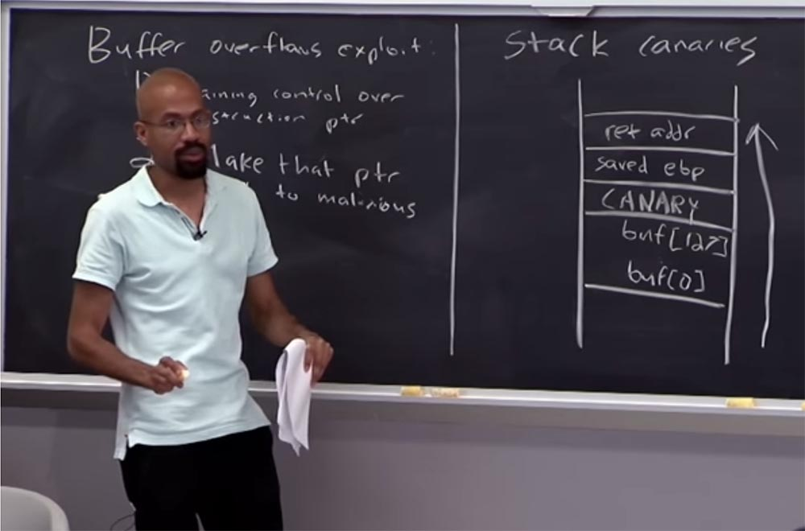

**Аудитория:** почему оно затронет «канарейку»?

**Профессор:** потому что предполагается, что атакующий не знает, как произвольно «прыгать» в памяти. Традиционные атаки переполнением памяти начинаются с изучения хакером граничного размера буфера, после чего переполнение начинается с самой нижней строки. Но вы правы – если атакующий сможет попасть напрямую в строку обратного адреса, никакая «канарейка» нам не поможет. Однако при традиционной атаке переполнения буфера, всё должно происходить именно так – снизу вверх.

Таким образом, основная идея использования «канарейки» заключается в том, что мы позволяем вредоносному эксплоиту совершить переполнение буфера памяти. У нас имеется код времени выполнения, который при возвращении из функции проверяет «канарейку», чтобы убедиться, что она имеет правильное значение.

**Аудитория:** может ли злоумышленник перезаписать обратный адрес и изменить «канарейку»? Как он может проверить, что она была модифицирована, но продолжает выполнять свою функцию?

**Профессор:** да, может. Таким образом, у вас должен быть какой-то фрагмент кода, который будет фактически проверять это раньше, чем происходит возврат функции. То есть в данном случае необходимо иметь поддержку компилятора, который фактически расширит соглашение о вызове **calling convention**. Так, чтобы часть последовательности возврата происходила до того, как мы рассматриваем валидность этого значения, чтобы убедиться в том, что «канарейка» не была уничтожена. Только после этого мы можем думать о чём-то ещё.

**Аудитория:** разве злоумышленник не может узнать или угадать, какое значение имеет «канарейка»?

**Профессор:** это именно то, о чём я собираюсь рассказать! В чём проблема с этой схемой? Что, если, например, мы будем помещать в каждой программе значение А? Или целую ветвь из 4-х значений А? Конечно, любой хакер может узнать размеры буфера, его ёмкость, и таким образом определить положение «канарейки» в любой системе. Поэтому мы можем использовать разные типы величин, которые поместим в нашу «канарейку», чтобы предотвратить подобное.

Есть одна вещь, которую вы можете сделать с нашей «канарейкой». Это будет очень забавный тип «канарейки», который использует программные функции С и обрабатывает особые символы, так называемый детерминированный тип «канарейки».

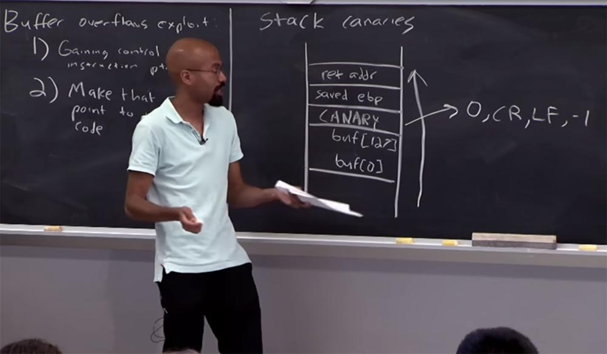

Представьте, что вы использовали для «канарейки» символ 0\. Двоичное значение нуля – это нулевой байт, нулевой символ в ASCII. Значение -1 означает возврат к предыдущему положению и так далее. Многие функции прекращают или изменяют работу, когда встречают такие символы или значения, как 0, CR, LF, -1. Представьте, что вы как хакер используете некую функцию управления строками, чтобы подняться наверх по буферу, наталкиваетесь на символ 0 в «канарейке» и процесс останавливается! Если вы используете функцию, ориентированную на «возврат каретки» -1, которая часто используется как ограничитель строки, процесс также прекратится. Так что -1 это ещё один магический знак.

Есть ещё одна вещь, которую можно использовать в «канарейке» — это случайные значения, которые трудно угадать злоумышленнику. Сила случайного значения основана на том, насколько трудно злоумышленнику его угадать. Например, если атакующий понимает, что в вашей системе существует только 3 бита энтропии, то он сможет использовать атаку типа brute-force. Поэтому возможности использования случайных чисел для защиты от атак довольно ограничены.

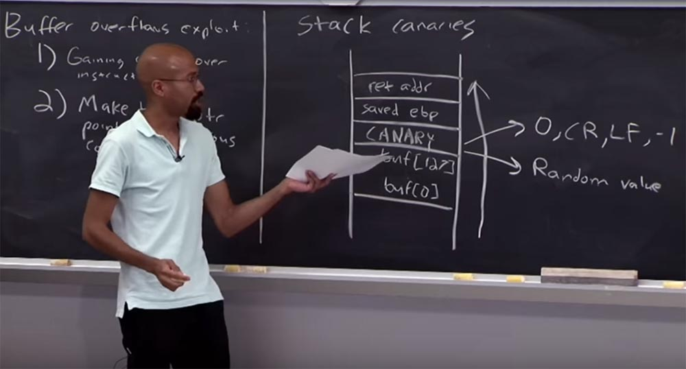

**Аудитория:** обычно происходит так, что я читаю из другого буфера и записываю прочитанное в этот буфер данного стека. В этой ситуации кажется, что случайное значение «канарейки» бесполезно, потому что я прочитал данные из другого буфера и знаю, где находится «канарейка». У меня есть другой буфер, который я контролирую и который я никогда не проверяю. И в этот буфер я могу поместить достаточно много из того, что хочу поместить. Мне не нужна случайная «канарейка», потому что я могу безопасно её переписать. Так что я не вижу, как это реально работает – в предложенном вами сценарии, когда происходит остановка функции при чтении данных из буфера.

**Профессор:** я понял ваш вопрос – вы имеете в виду, что мы используем детерминированную «канарейку», но не применяем одну из функций стандартной библиотеки, которые могут быть «обмануты» нашими символами 0, CR, LF, -1. Тогда да, в описанной вами ситуации «канарейка» не нужна.

Идея заключается в том, что вы можете заполнить этот буфер байтами откуда угодно, но все, что позволяет угадать эти значения или получить их случайным образом, приведёт к поражению.

**Аудитория:** можно ли использовать в качестве случайных чисел что-то вроде количества секунд или миллисекунд и использовать их в «канарейке»?

**Профессор:** вызовы данных не содержат такое большое количество случайностей, как вы думаете. Потому что программа имеет журналы записей или функцию, которую вы можете вызвать, чтобы узнать время, когда программа была загружена, и прочие подобные вещи. Но в целом вы правы – на практике, если вы сможете использовать аппаратное устройство, обычно низкого уровня, с лучшими системными таймингами, такого рода подход может сработать.

**Аудитория:** даже если мы успеваем просмотреть логи о начале переполнения буфера, всё равно важно, во сколько именно мы откажемся от запроса. И если мы не можем получить контроль над тем, сколько времени занимает запрос компьютера к серверу, то сомнительно, что можно детерминистически угадать точное время.

**Профессор:** совершенно верно, я уже говорил, что зло кроется в мелочах, это именно такой случай. Другими словами, если у вас есть какой-то способ, чтобы, например, определить тип канала тайминга, вы можете обнаружить, что количество энтропии, или количество случайностей, заполняет не целую метку времени, а намного меньше. Поэтому злоумышленник может определить час и минуту, когда вы проделали это, но не секунду.

**Аудитория:** для записи попытка свернуть свою собственную случайность является плохой идеей?

**Профессор:** совершенно верно!

**Аудитория:** то есть обычно мы просто должны использовать всё, что поддерживают наши системы, правильно?

**Профессор:** да, это действительно так. Это как изобретение собственной криптосистемы, которая является еще одной популярной вещью, которую иногда хотят сделать наши выпускники. Но мы не АНБ, мы не математики, поэтому обычно это не удается. Так что вы совершенно правы насчет этого.

Но даже если вы используете системную случайность, вы все равно можете получить меньше бит энтропии, чем ожидаете. Приведу вам пример фазовой рандомизации адресов. Именно на таком принципе работает подход **stack canaries**. Поскольку мы занимаемся компьютерной безопасностью, вам, наверное, интересно, в каких случаях «канарейки» не справляются со своей задачей и существуют ли способы провалить «канарейку».

Одним из таких способов является атака путём переписывания указателей функции. Потому что если удар наносится по указателю функции, «канарейка» не может ничего сделать.

Предположим, у вас есть код вида **int *ptr …..**, инициирующий указатель, не важно, каким образом, далее у вас есть буфер **char buf \[128\]**, функция **gets (buf)**, и в самом низу указатель, которому присвоено некоторое значение: ***ptr =5**.

Замечу, что мы не пытались атаковать обратный адрес функции, содержащей этот код. Как видно, при переполнении буфера расположенный выше него адрес указателя будет поврежден. Если злоумышленник сможет повредить этот указатель, то сможет после этого приписать 5-ку какому-то из адресов, который контролирует. Всем видно, что «канарейка» здесь не поможет? Потому что мы не атакуем путь, по которому происходит возврат функции.

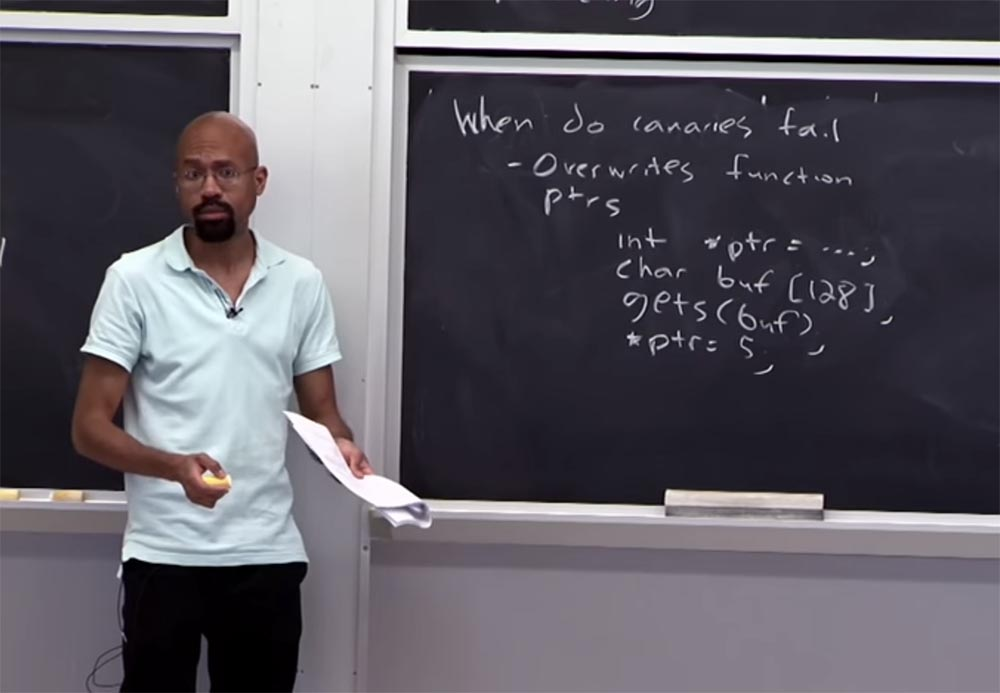

**Аудитория:** может ли указатель располагаться ниже буфера?

**Профессор:** может, но порядок конкретных переменных зависит от множества различных вещей, от способа, которым компилятор располагает содержимое, от размера колонки аппаратного обеспечения и так далее. Но вы правы, если переполнение буфера идёт вверх, а указатель расположен внизу перед буфером, то переполнение не сможет его повредить.

**Аудитория:** почему вы не можете связать «канарейку» с функцией «канарейки», как сделали это с обратным адресом?

**Профессор:** это интересный момент! Вы можете делать такие вещи. В действительности, можно попробовать представить себе компилятор, который всякий раз, когда у него есть какой-либо указатель, всегда пытается добавить дополнение для каких-то вещей. Однако проверка всех этих вещей обойдётся слишком дорого. Потому что каждый раз, когда вы хотите использовать любой указатель или вызвать любую функцию, вы должны иметь код, который будет проверять, является ли эта «канарейка» правильной. В принципе, вы могли бы сделать что-то подобное, но есть в этом смысл? Мы же видим, что «канарейки» не помогают в данной ситуации.

И еще одна вещь, которую мы обсуждали ранее, это то, что если атакующий сможет угадать случайность, то, в принципе, случайные «канарейки» работать не будут. Создание ресурсов безопасности на основе случайности это отдельная, очень сложная тема, поэтому мы не станем в неё вдаваться.

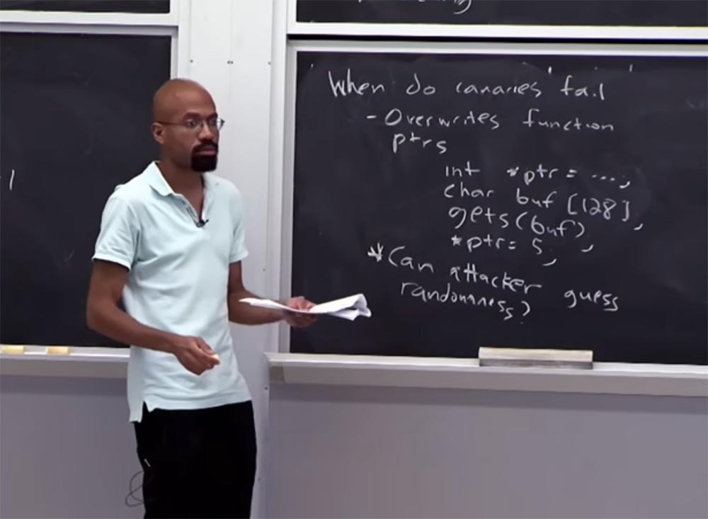

**Аудитория:** так «канарейка» содержит меньше битов, чем обратный адрес? Потому что иначе вы бы не смогли просто запомнить этот адрес и проверить, изменился ли он?

**Профессор:** давайте посмотрим. Вы говорите об этой схеме, когда «канарейка» расположена над буфером, и имеете в виду, что система не может быть безопасной, если невозможно посмотреть на обратный адрес и проверить, не был ли он изменён.

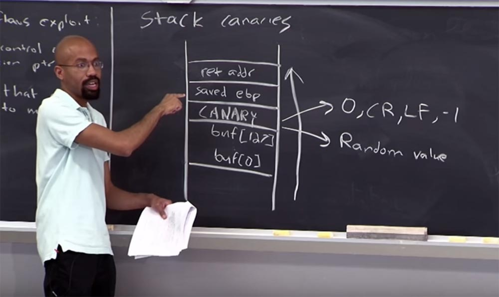

И да, и нет. Обратите внимание, при атаке переполнением буфера всё, что расположено выше него, будет переписано, так что это все еще может вызвать проблемы. Но в принципе, если бы эти вещи были неизменяемыми в каком-то смысле, то вы могли бы сделать что-то вроде этого. Но проблема в том, что во многих случаях манипуляции с обратным адресом довольно сложная вещь. Потому что вы можете себе представить, что особая функция может быть вызвана из разных мест, и так далее. В данном случае мы немного забегаем вперёд, и если останется время в конце лекции, то мы к этому вернёмся.

Таковы ситуации, в которых «канарейка» может потерпеть неудачу. Есть и другие места, в которых возможен провал, например, при атаке функций **malloc** и **free**. Функция malloc выделяет блок памяти определённого размера в байтах и возвращает указатель на начало блока. Содержание выделенного блока памяти не инициализируется, оно остается с неопределенными значениями. А функция **free** высвобождает память, выделенную ранее динамически.

Это уникальная атака в стиле С. Посмотрим, что здесь происходит. Представьте, что у вас есть здесь два указателя здесь, p и q, для которых мы с помощью **malloc** выделяем каждому из этих указателей по 1,024 байта памяти. Предположим, что мы делаем функцию **strcpy** для p из какой-то ошибки буфера, который контролируется злоумышленником. Вот где происходит переполнение. А затем мы запускаем команду **free q** и **free p**. Это довольно простой код, верно?

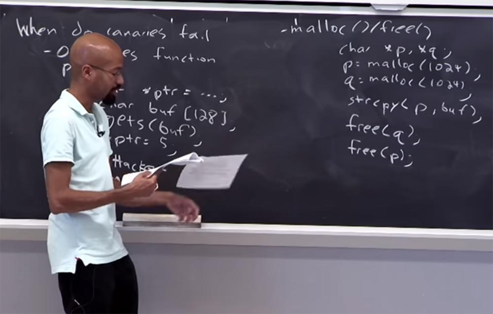

У нас есть 2 указателя, для которых мы выделили память, мы используем один из них для определённой функции, происходит переполнение буфера, и мы освобождаем память обоих указателей.

Предположим, что строки памяти обеих объектов p и q расположены в пространстве памяти рядом друг с другом. При этом могут произойти нехорошие вещи, не так ли? Потому что функция **strcpy** используется для копирования содержимого **str2** в **str1**. Аргумент **str2** должен быть указателем на строку, оканчивающуюся нулем, и **strcpy** возвращает указатель на **str1**. Если строки **str1** и **str2** перекрываются, то поведение функции **strcpy** не определено.

Поэтому функция **strycpy**, обрабатывающая память **p**, может заодно затронуть и память, выделенную для **q**. И это может вызвать проблемы.

Возможно, что вы сделали что-то в этом роде в своем собственном коде непреднамеренно, когда использовали какой-то странный тип указателей. И всё вроде бы работает, но когда нужно вызвать функцию **free**, происходит вот такая неприятность. И злоумышленник может ею воспользоваться, я объясню, почему так происходит.

Представьте, что внутри реализации функций **free** и **malloc** выделенный блок выглядит следующим образом.

Давайте предположим, что в верхней части блока есть видимые данные приложения, а ниже у нас есть размер переменной. Этот размер не то, что приложение непосредственно видит, а своеобразная «бухгалтерия», которую ведут **free** или **malloc**, чтобы вы знали размеры выделенного буфера памяти. Рядом с выделенным блоком расположен свободный блок. Предположим, что свободный блок имеет некоторые метаданные, которые выглядят так: сверху у нас размер блока, ниже имеется свободное место, ещё ниже расположен указатель «назад» и под ним указатель «вперёд». И в самом низу блока ещё раз показан размер.

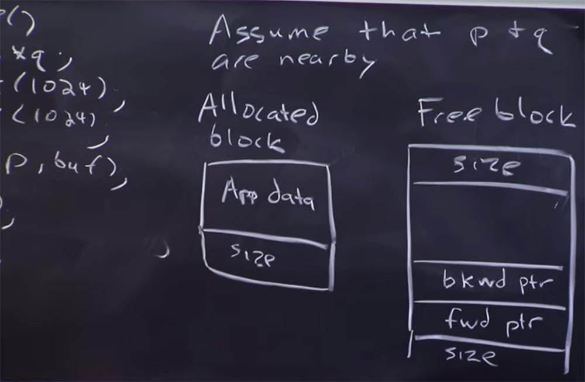

Почему у нас здесь 2 указателя? Потому что система выделения памяти в данном случае использует двухсвязный список для отслеживания того, как свободные блоки связаны друг с другом. Поэтому, когда вы выделяете свободный блок, то вы исключаете его из этого двусвязного списка. А потом, когда вы его освободите, вы сделаете некоторые арифметические действия для указателя и приведёте эти вещи в порядок. После этого вы добавляете его в этот связанный список, верно?

Всякий раз, когда вы слышите про арифметику указателя, вы должны думать, что это ваша «канарейка». Потому что там возникнет очень много проблем. Напомню, что у нас имело место переполнение буфера **p**. Если мы предположим, что **p** и **q** находятся рядом друг с другом, или очень близко в пространстве памяти, то в конечном итоге может произойти так, что это переполнение буфера может перезаписать некоторые данные размера для выделенного указателя **q** – это нижняя часть нашего выделенного блока. Если вы продолжаете следить за моей мыслью с самого начала, то ваше воображение подскажет, где все начинает идти не так. Ведь по сути, что в конечном итоге происходит с этими операциями **free q** и **free p** — они смотрят на эти метаданные в выделенном блоке, чтобы проделать все нужные манипуляции с указателем.

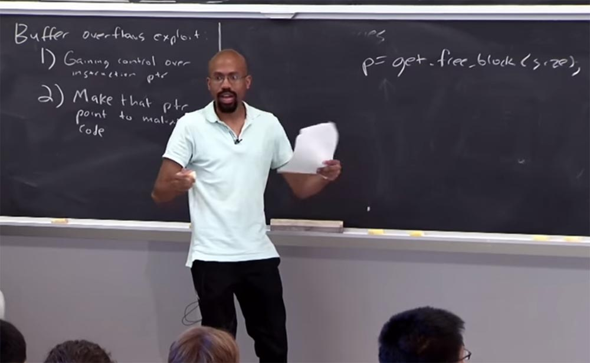

То есть в какой-то момент выполнения, функции **free** собираются получить некий указатель, базирующийся на значении размера: **p=get.free.block (size)**, а размер – это то, что контролирует злоумышленник, потому что он осуществил переполнение буфера, правильно?

Он проделал кучу арифметических вычислений, рассмотрел функцию **back** и указатели этого блока и теперь собирается сделать что-то вроде обновления указателя «назад» и указателя «вперёд» — вот эти две нижние строки.

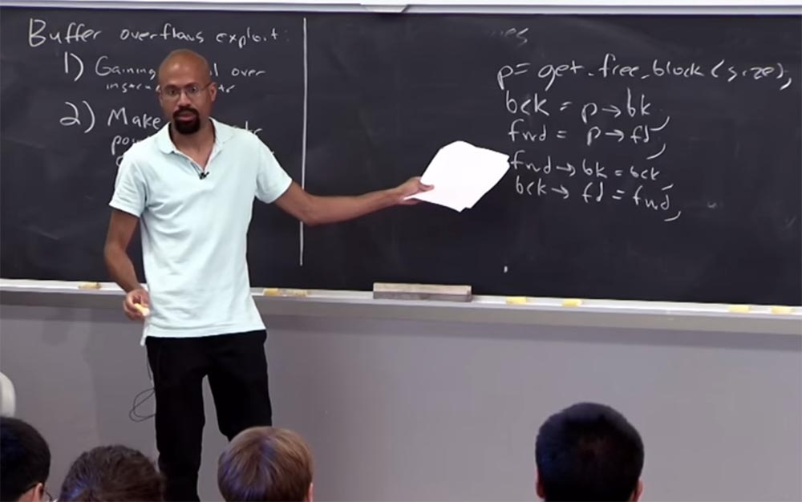

Но в действительности это не должно вас беспокоить. Это просто пример кода, который имеет место в этом случае. Но дело в том, из-за переписанного хакером размера он теперь управляет этим указателем, который проходит через функцию **free**. И из-за этого два имеющихся здесь состояния в нижних строках фактически представляют собой обновления указателей. И поскольку злоумышленник смог контролировать этот **p**, он на самом деле контролирует и эти два указателя. Именно в этом месте может произойти нападение.

Поэтому, когда работает **free** и пытается сделать что-то вроде объединения этих двух блоков, у вас имеется дважды связанный список. Потому что если у вас есть два блока, которые сталкиваются друг с другом и оба они свободны, вы хотите объединить их в один большой блок.

Но если мы контролируем размер, это означает, что мы контролируем весь этот процесс из четырёх изображенных выше строк. Это означает, что если мы поняли, как работает переполнение, то мы можем записать данные в память тем способом, который выберем. Как я уже сказал, такие вещи часто происходят с вашим собственным кодом, если вы не умно поступили с указателем. Когда вы делаете некоторую ошибку с двойным освобождением типа **free q** и **free p** или что-то ещё, ваша функция терпит крах. Потому что вы напортачили с метаданными, которые обитают в каждом из этих выделенных блоков, и в какой-то момент этот расчет укажет на некое «мусорное» значение, после чего вы окажетесь «мертвы». Но если вы атакующий, то можете выбрать это значение и использовать его для своего преимущества.

Давайте теперь перейдем к другому подходу для предотвращения атак переполнения буфера. Этот подход заключается в проверке границ. Цель проверки границ состоит в том, чтобы удостовериться, что, когда вы используете определенный указатель, он будет ссылаться только на то, что является объектом памяти. И этот указатель находится в допустимых границах этого объекта памяти. В этом заключается основная идея проверки. Это на самом деле довольно просто — на высоком уровне. Опять же, в случае с C, бывает очень трудно понять такие вещи. Мол, что это на самом деле означает: то, что указатель находится в пределах или за пределами границ, действителен он или недействителен?

Для примера предположим, что у вас есть две части кода – вот я их запишу. Вы объявляете массив символов размером 1024 байта и объявляете указатель, а затем получаете адрес одного из элементов в Х: **char Х \[1024\]**, **char *y = & х \[108\].**

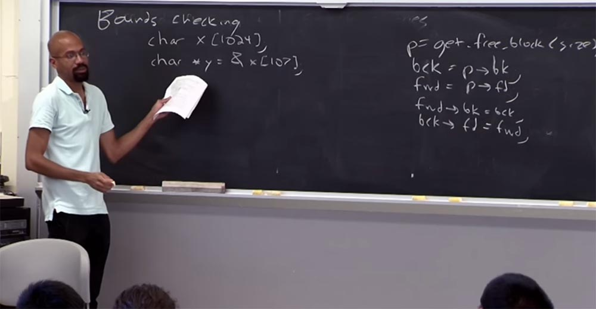

Имеет ли это смысл? Хорошая ли это идея? Трудно сказать. Если рассматривать этот Х здесь как строку, может быть, имеет смысл использовать такой указатель. Вы сможете его увеличивать и уменьшать, потому что, возможно ищете какое-то особенное значение ваших характеристик.  
Но если это сетевое сообщение или что-то подобное, возможно, что в действительности существует некая структура, которая встроена сюда. Потому что иначе нет смысла использовать указатель такого вида. Таким образом, проблема состоит в том, что это позволяет вам делать все, что вы хотите. Трудно определить, что вы хотите, чтобы он сделал на самом деле. В результате определение таких вещей, как безопасность указателей в С, представляет собой хитроумную задачу.

Вы также можете представить, что жизнь усложняется ещё больше, если вы используете тип значения **struct** и объединения **union**. Представьте, что у вас есть объединение. Это будет выглядеть вот так: у вас есть некий **integer**, затем некий **struct**, внутри которого имеются несколько значений **int**.

Не забывайте, что **union** работают так, что в основном они выделяют максимальный размер для самого большого элемента. Причём в любой момент времени вы обычно ожидаете, что либо этот **integer** будет действителен, либо этот **struct**, но не оба одновременно.

Представьте, что у вас есть код, который делает что-то вроде этого: **int х p: & (u,s,k)**, то есть создаёт указатель такого адреса: объединение u, тип значения s, значение k.

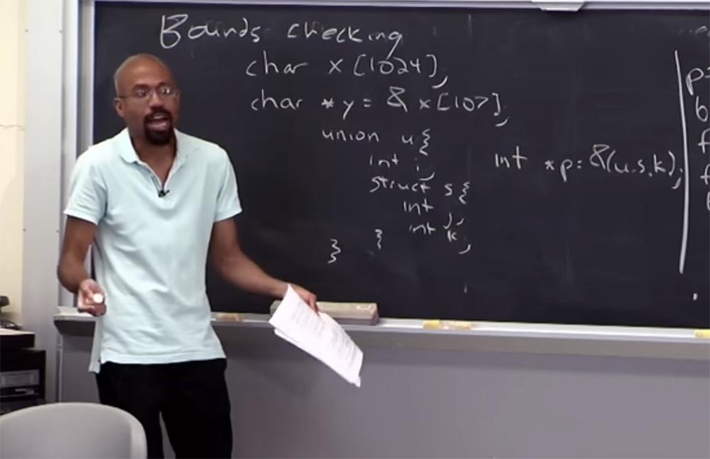

Строго говоря, это указание на границы, потому что есть память, которая была выделена для этого, однако это не неправильно. Потому что на самом деле, при выполнении, этот **union** рассматривает только **integer**, или только **struct**. Таким образом, в результате неоднозначной семантики указателей в программах, написанных на языке С, подобные подходы к проверке границ предлагают довольно слабое понятие правильности указателя. И это понятие выглядит следующим образом.

Если у вас есть указатель **p'**, производный от базового указателя **p**, то этот **p'** должен использоваться только для хранения памяти, принадлежащей исходному базовому указателю.

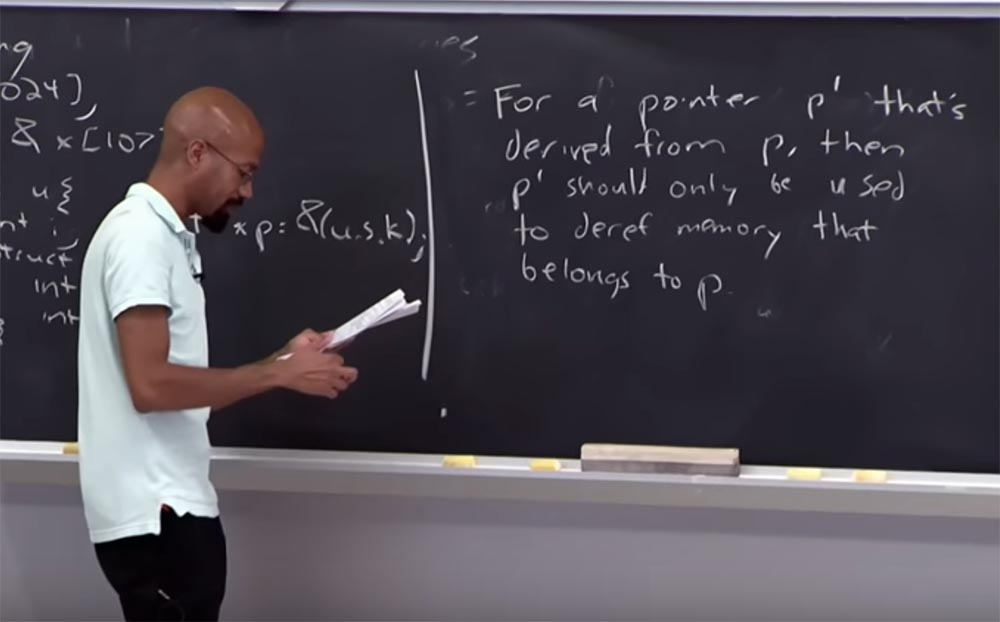

Знайте, что это более слабая цель, чем принуждение к полностью правильной семантике указателя. Потому что у вас все еще могут быть странные проблемы, например, с этим **union**. Может быть так, что в какой-то конкретной точке программы что-то произошло неправильное с указанием корректного значения в **union**, и, как минимум, эта ссылка на указатель не согласована. Так что это можно рассматривать в качестве примера, как создание этого указателя нарушило семантику сетевого сообщения, внедренного в X. Но, по крайней мере, при этом вы подавляете только память, принадлежащую вам, а не произвольную память. В мире программ, написанных на языке С, это считается успехом. Так что в этом и заключается основная идея.

Проблема с применением этих типов семантики заключается в том, что во многих случаях вам нужна помощь компилятора. Потому что обычно нужно перекомпилировать программы, чтобы применить эти семантики относительно **p** и **p'**, это может быть обратная совместимость. Но в этом заключено основное понятие проверки границ.

Как можно реализовать проверку границ? Один из самых простых способов носит название Electric fencing – электрическое ограждение. Он заключается в том, что для каждого объекта, который вы выделяете в куче, вы выделяете ограждающую страничку, которая находится прямо рядом с ним.

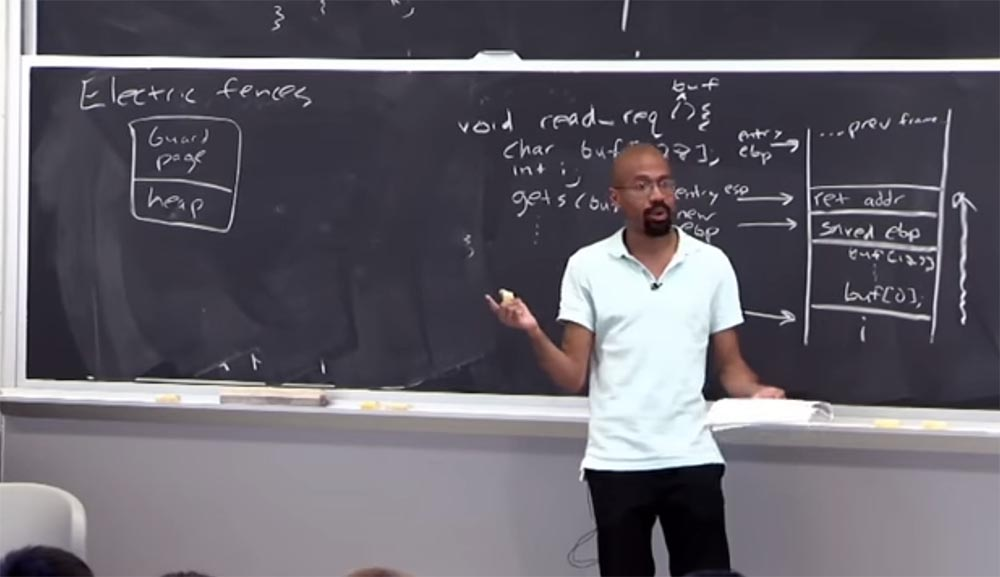

И вы устанавливаете защиту на этой странице, так что если кто-то попытается прикоснуться к ней, вы получите серьёзную ошибку. Жесткие правила сообщат, что это находится за выделенными границами, и программа немедленно прекращает работу. Это очень простая вещь, которую можно сделать. Самое хорошее в таком решении это то, что всякий раз, когда у вас появляется недопустимая ссылка на память, это немедленно вызывает ошибку.

Если вы когда-либо отлаживали базовую программу на C или C++, то сталкивались с проблемами, когда вы неоднократно повреждали память, не получая об этом никаких сообщений. И только когда в программе что-то рушилось, вы понимали, что что-то сделали не так. Однако вы всё не могли определить, где именно совершили ошибку. Вы просто делали то, что называется «гейзенбаг» — программную ошибку, которая исчезает или меняет свои свойства при попытке её обнаружения, то есть вещь, в которой заключено понятие неопределенности. Примерами могут быть ошибки, которые появляются в окончательном варианте программы, но которые не видны при отладке программы.

Так что в этой схеме хорошо то, что как только указатель попадает на эту страничку guard page – бум! Всё взрывается, и программа останавливается.

59:00 мин

Продолжение:

[Курс MIT «Безопасность компьютерных систем». Лекция 2: «Контроль хакерских атак», часть 2](https://habr.com/company/ua-hosting/blog/416047/)

Полная версия курса доступна [здесь](https://ocw.mit.edu/courses/electrical-engineering-and-computer-science/6-858-computer-systems-security-fall-2014/).

Спасибо, что остаётесь с нами. Вам нравятся наши статьи? Хотите видеть больше интересных материалов? Поддержите нас оформив заказ или порекомендовав знакомым, **30% скидка для пользователей Хабра на уникальный аналог entry-level серверов, который был придуман нами для Вас:** [Вся правда о VPS (KVM) E5-2650 v4 (6 Cores) 10GB DDR4 240GB SSD 1Gbps от $20 или как правильно делить сервер?](https://habr.com/company/ua-hosting/blog/347386/) (доступны варианты с RAID1 и RAID10, до 24 ядер и до 40GB DDR4).

**Dell R730xd в 2 раза дешевле?** Только у нас **[2 х Intel Dodeca-Core Xeon E5-2650v4 128GB DDR4 6x480GB SSD 1Gbps 100 ТВ от $249](https://ua-hosting.company/serversnl) в Нидерландах и США!** Читайте о том [Как построить инфраструктуру корп. класса c применением серверов Dell R730xd Е5-2650 v4 стоимостью 9000 евро за копейки?](https://habr.com/company/ua-hosting/blog/329618/)