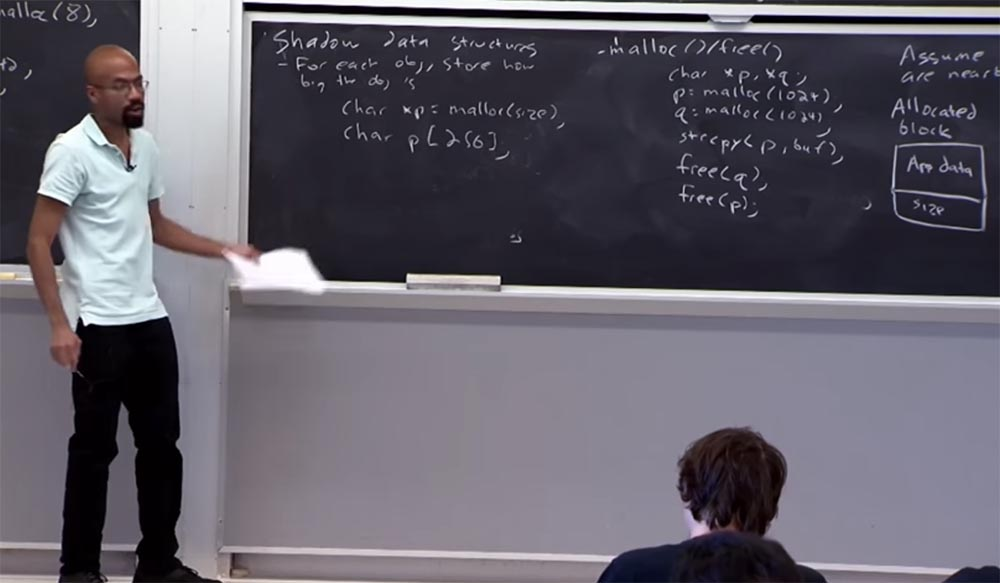
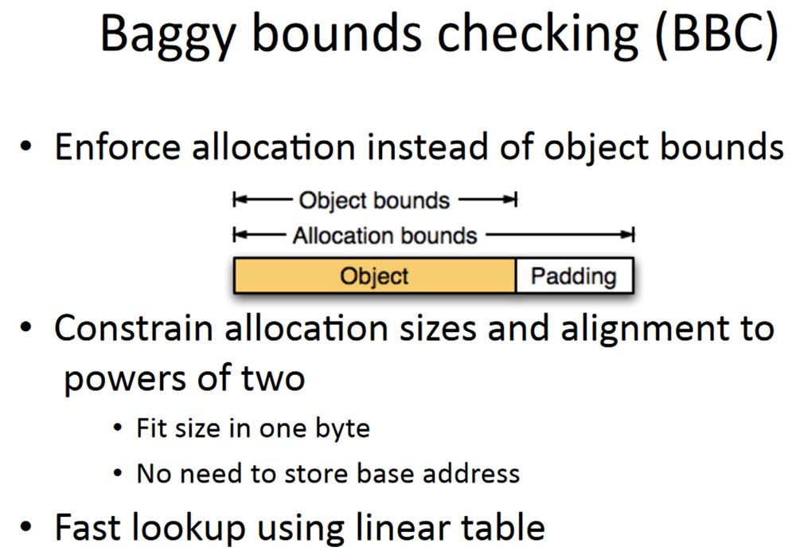
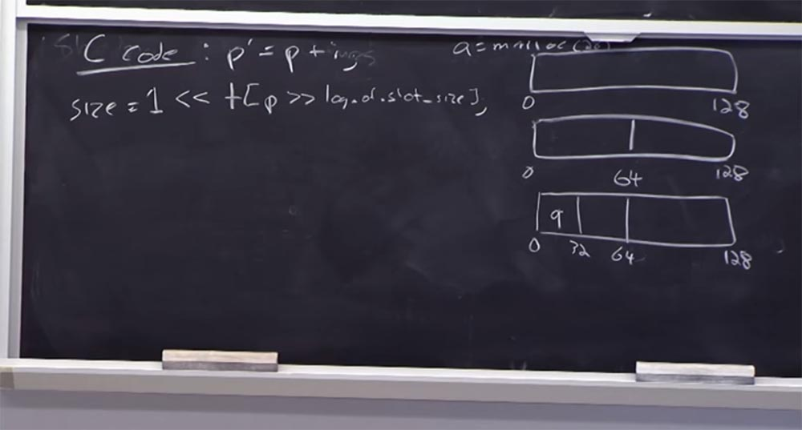
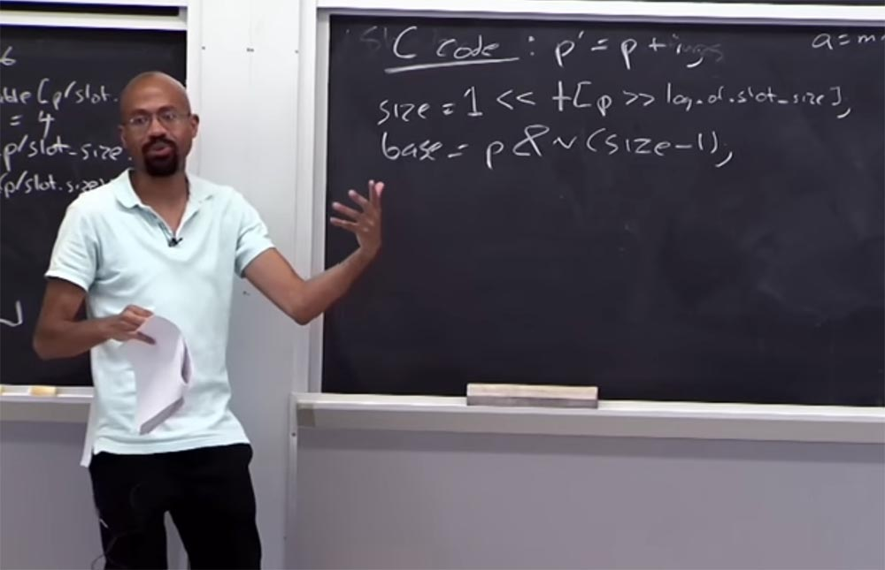
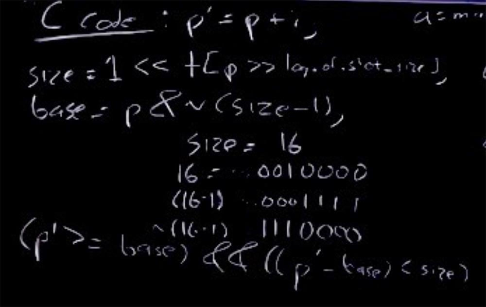

Курс MIT «Безопасность компьютерных систем». Лекция 2: «Контроль хакерских атак», часть 3 / Блог компании ua-hosting.company

### Массачусетский Технологический институт. Курс лекций #6.858. «Безопасность компьютерных систем». Николай Зельдович, Джеймс Микенс. 2014 год

Computer Systems Security — это курс о разработке и внедрении защищенных компьютерных систем. Лекции охватывают модели угроз, атаки, которые ставят под угрозу безопасность, и методы обеспечения безопасности на основе последних научных работ. Темы включают в себя безопасность операционной системы (ОС), возможности, управление потоками информации, языковую безопасность, сетевые протоколы, аппаратную защиту и безопасность в веб-приложениях.

Лекция 1: «Вступление: модели угроз» [Часть 1](https://habr.com/company/ua-hosting/blog/354874/) / [Часть 2](https://habr.com/company/ua-hosting/blog/354894/) / [Часть 3](https://habr.com/company/ua-hosting/blog/354896/)  
Лекция 2: «Контроль хакерских атак» [Часть 1](https://habr.com/company/ua-hosting/blog/414505/) / [Часть 2](https://habr.com/company/ua-hosting/blog/416047/) / [Часть 3](https://habr.com/company/ua-hosting/blog/416727/)

Можете вы сказать, в чём состоит недостаток подхода к обеспечению безопасности, при котором используют **guard page**?

**Аудитория:** это занимает больше времени!

**Профессор:** именно так! Итак, представьте, что эта куча очень-очень маленькая, но я выделил целую страницу, чтобы убедиться, что эта крошечная штучка не подверглась атаке на указатель. Это очень пространственно-интенсивный процесс, и люди на самом деле не развёртывают нечто подобное в рабочей среде. Это может быть полезно для тестирования «багов», но вы никогда бы не сделали так для настоящей программы. Думаю, теперь вы поняли, что из себя представляет собой отладчик памяти **Electric fence**.

**Аудитория:** почему размер страниц **guard page** обязательно должен быть таким большим?

**Профессор:** причина в том, что при определении размеров страниц обычно полагаются на аппаратное обеспечение, такое, как защита уровня страниц. Для большинства компьютеров для каждого выделенного буфера выделяют 2 страницы размером 4 КБ, итого 8 КБ. Так как куча состоит из объектов, то для каждой функции **malloc** выделяется своя страница. В некоторых режимах этот отладчик не возвращает программе зарезервированное место, поэтому **Electric fence** очень прожорлив в смысле памяти и его не следует компилировать с рабочим кодом.

Еще один подход к обеспечению безопасности, на который стоит взглянуть, называется **Fat pointers**, или «толстые указатели». В данном случае термин «толстый» означает, что к указателю прикреплён большой объём данных. В данном случае идея состоит в том, что мы хотим изменить само представление указателя, чтобы включить в его состав информацию о границах.

Обычный 32-битный указатель состоит из 32 бит, и внутри него расположены адреса. Если рассмотреть «толстый указатель», то он состоит как бы из 3-х частей. Первая часть – это основа из 4-х байт, к которой прицеплена концовка также из 4-х байтов. В первой части объект начинается, во второй заканчивается, а в третьей, также 4-х байтовой, заключён адрес **cur**. И в этих общих границах находится указатель.

Таким образом, когда компилятор генерирует код доступа к этому «толстому указателю», он обновляет содержимое последней части **cur address** и одновременно проверяет содержимое двух первых частей, чтобы убедиться, что с указателем не произошло ничего плохого в процессе обновления.

Представим, что у меня есть такой код: **int *ptr = malloc (8)**, это указатель, для которого выделено 8 байт. Далее у меня есть некоторый цикл **while**, который просто собирается присвоить некоторое значение указателю и затем следует увеличение указателя **ptr ++**. Каждый раз, когда выполняется этот код над текущим адресом указателя **cur address**, он проверяет, находится ли указатель в границах, оговоренных в первой и второй части.

Подобное имеет место в новом коде, который генерирует компилятор. В онлайн-группе часто возникает вопрос, что такое «инструментальный код». Это код, который генерирует компилятор. Вы как программист видите только то, что изображено справа – эти 4 строчки. Но перед этой операцией компилятор вставляет в **cur address** некий новый код С, присваивает указателю некоторое значение и каждый раз проверяет границы.

И если при использовании нового кода происходит выход значения за границы, функция прерывается. Вот это и называется «инструментальный код». Это значит, что вы берёте исходный код с использованием программы на С, затем добавляете новый исходный код С, а затем компилируете новую программу. Так что основная идея, лежащая в основе **Fat pointers**, довольно проста.

В этом подходе есть некоторые недостатки. Самым большим недостатком является большой размер указателя. И это значит, что нельзя просто взять «толстый указатель» и передать его в неизмененном виде, вне библиотеки оболочки. Потому что здесь может иметь место ожидание, что указатель имеет стандартный размер, и программа предоставит ему этот размер, в который он «не влезет», из-за чего всё взорвётся. Существуют также проблемы, если вы хотите включить указатели этого типа в **struct** или что-то вроде него, потому что они могут изменить размеры **struct**.

Поэтому очень популярная вещь в C-коде – это взять нечто размером со **struct**, а затем уже что-то делать на основе этого размера – резервировать дисковое пространство под структуры такого размера, и так далее.

И еще одна деликатная вещь, это то, что эти указатели, как правило, нельзя обновить атомарным способом. Для 32-битных архитектур типично записывать 32-х битную переменную, которая является атомарной. Но «толстые указатели» содержат 3 размера **integer**, поэтому, если у вас есть код, который ожидает, что указатель будет иметь атомарное значение, вы можете попасть в беду. Потому что для того, чтобы сделать некоторые из этих проверок, вы должны посмотреть на текущий адрес, а затем посмотреть на размеры, и тогда вам, возможно, придется увеличить их, и так далее, и тому подобное. Таким образом, это может вызвать очень тонкие ошибки, если вы используете код, который попытается проводить параллели между обычными и «толстыми» указателями. Таким образом, вы можете применять **Fat pointers** в отдельных случаях, как и **Electroc fences**, но побочные эффекты от их применения настолько значительны, что в обычной практике эти подходы не используются.

А теперь мы поговорим о проверке границ по отношению к структуре теневых данных. Основная идея структуры заключается в том, что вы знаете, насколько велик каждый объект, который вы собираетесь разместить, то есть вы знаете размер, который нужно зарезервировать под этот объект. Так, например, если у вас есть указатель, который вы вызываете с помощью функции **malloc**, вам нужно указать размер объекта: **char xp = malloc (size)**.

Если у вас есть что-то типа статической переменной, как эта **char p\[256\]**, компилятор может автоматически выяснить, каковы должны быть границы для её размещения.

Поэтому для каждого из этих указателей нужно как-то вставить по две операции. В основном это арифметика, как, например, **q = p + 7**, или что-то подобное. Такая вставка осуществляется разыменованием ссылки типа **deref *q = ‘q’**. Вы можете задуматься, почему нельзя полагаться на ссылку при вставке? Зачем нам нужно совершать эти арифметические действия? Дело в том, что при использовании C и c++, у вас есть указатель, указывающий на один проход до допустимого конца объекта справа, после чего вы используете его как условие остановки. Итак, вы переходите к объекту и как только достигаете этого конечного указателя, вы фактически остановите цикл или прервёте операцию.

Так, если мы игнорируем арифметику, то всегда вызываем серьезную ошибку, при которой указатель выходит за пределы границ, что может на самом деле нарушить работу множества приложений. Так что мы не можем просто вставить ссылку, потому что откуда вы знаете, что это происходит вне установленных границ? Арифметика позволяет нам сказать, так это или нет, и здесь все будет законно и правильно. Потому что это вклинивание с помощью арифметики позволяет отслеживать, где находится указатель относительно его исходной базовой линии.

Итак, следующий вопрос: как мы на самом деле реализуем проверку границ? Потому что нам нужно каким-то образом сопоставить конкретный адрес указателя с некоторым типом граничной информация для этого указателя. И поэтому многие из ваших предыдущих решений используют такие вещи, как, например, как хэш-таблица, или дерево, что позволяет проводить правильный поиск. Так, учитывая адрес указателя, я провожу некоторый поиск в этой структуре данных и выясняю, какие у него имеются границы. С учётом этих границ я решаю, могу ли я позволить действию произойти или нет. Проблема состоит в том, что это медленный поиск, потому что эти структуры данных ветвятся, и обследуя дерево, вам нужно обследовать кучу таких ветвей, пока найдёте нужную величину. И даже если это хэш-таблица, вы должны проследовать по цепочкам кода и так далее. Таким образом, нам необходимо определить очень эффективную структуру данных, которая отслеживала бы их границы, такую, которая сделала бы эту проверку очень простой и чёткой. Так что давайте просто перейдем к этому прямо сейчас.

Но прежде чем мы это сделаем, позвольте мне очень кратко рассказать о том, как работает подход **buddy memory allocation**. Потому что это одна из вещей, про которую часто спрашивают.  
**Buddy memory allocation** делит память на разделы с размером, кратным степени 2, и пытается распределить в них запросы памяти. Рассмотрим, как это работает. Вначале **buddy allocation** обрабатывает нераспределенную память как один большой блок – вот этот верхний прямоугольник размером 128 бит. Затем, когда вы запрашиваете меньший блок для динамического выделения, он пытается разделить это адресное пространство на части с шагом, кратным 2, пока не найдет блок, достаточный для ваших потребностей.

Предположим, пришёл запрос типа **a = malloc (28)**, то есть запрос на выделение 28 байт. У нас имеется блок размером 128 байтов, который слишком расточительно выделять под этот запрос. Поэтому наш блок делится на два блока по 64 байта – от 0 до 64 байт и от 64 байт до 128 байт. И этот размер тоже велик для нашего запроса, поэтому **buddy** снова делит блок из 64 байт на 2 части и получает 2 блока по 32 байта.

Меньше нельзя, потому что 28 байтов не поместится, а 32 – самый подходящий минимальный размер. Так что теперь этот 32-х байтный блок будет выделен под наш адрес a. Предположим, у нас есть ещё один запрос для величины **b = malloc (50)**. **Buddy** проверяет выделенные блоки, и так как 50 больше, чем половина от 64, но меньше 64, размещает величину b в крайнем правом блоке.

Наконец, у нас имеется ещё один запрос на 20 байт: **c = malloc (20)**, эта величина размещается в среднем блоке.

У **buddy** имеется интересное свойство: когда вы освобождаете память в блоке и рядом с ним расположен блок такого же размера, после освобождения обоих блоков **buddy** объединяет два пустых соседних блока в один.

Например, когда мы дадим команду **free ©**, то освободим средний блок, но объединения не произойдёт, так блок рядом будет всё ёщё занят. Но после освобождения первого блока с помощью команды **free (а)** оба блока объединятся в один. Затем, если мы освободим значение b, соседние блоки опять объединятся и мы получим целый блок размером 128 байт, как это было в самом начале. Преимуществом этого подхода является то, что вы можете легко обнаружить, где находится buddy путём простых арифметических действий и определить границы памяти. Таким образом работает распределение памяти при подходе **Buddy memory allocation**.

Во всех моих лекциях часто задают вопрос, разве такой подход не является расточительным? Представьте, что вначале у меня был запрос на 65 байт, пришлось бы выделить под него весь блок размером 128 байт. Да, это расточительно, на самом деле у вас нет динамической памяти и вы не сможете больше выделять ресурсы в этом же блоке. Но опять же, это компромисс, потому что очень легко сделать рассчитать, как сделать слияние и тому подобное. Так если вы хотите более точное распределение памяти, то необходимо использовать другой подход.

Итак, что же делает система **Buggy bounce checking (BBC)**?

Она выполняет несколько трюков, один из которых – это разделение блока памяти на 2 части, в одной из которых расположен объект, а во втором – дополнение к нему. Таким образом, у нас есть 2 вида границ – границы объекта и границы распределения памяти. Преимуществом является то, что нет необходимости хранить базовый адрес, и возможен быстрый поиск с помощью линейной таблицы.

Все наши размеры распределения равны 2 в степени **n**, где **n** – целое число. Этот принцип **2n** называется **power of two**. Поэтому нам не нужно много битов, чтобы представить, насколько велик конкретный размер распределения. Например, если размер кластера равен 16, то вам просто необходимо выделить 4 бита – это понятие логарифма, то есть 4 – это показатель степени **n**, в которую нужно возвести число 2, чтобы получить 16.

Это достаточно экономный подход к распределению памяти, потому что используется минимально количество байт, но оно должно быть кратным 2, то есть у вас может быть 16 или 32, но не 33 байта. Кроме того, **Buggy bounce checking** позволяет хранить информацию о граничных значениях в линейном массиве (1 байт на запись) и позволяет выделить память в 1 слот размером 16 байт. выделить память с гранулярностью слота. Что это значит?

Если у нас есть слот размером 16 байт, куда мы собираемся поместить величину **р = malloc(16)**, то значение в таблице будет выглядеть как **table \[p / slot.size\] = 4**.

Предположим, нам теперь надо разместить величину размером 32 байта **р = malloc(32)**. Нам необходимо обновить таблицу границ в соответствии с новым размером. И это проделывается дважды: сначала как **table \[p / slot.size\] = 5**, а затем как **table \[(p / slot.size) + 1\] = 5** – первый раз для первого слота, который распределяется под эту память, и второй раз – для второго слота. Таким образом мы распределяем 32 байта памяти. Так выглядит лог распределения размеров. Таким образом, для двух слотов распределения памяти таблица границ обновляется дважды. Это понятно? Данный пример предназначен для людей, которые сомневаются – имеют ли логи и таблицы смысл или не имеют. Потому что таблицы умножаются каждый раз, как происходит распределение памяти.

Посмотрим, что происходит с таблицей границ. Предположим, у нас есть код C, который выглядит так: **p’ = p + i**, то есть указатель **p’** получается из **р** прибавлением некой переменной **i**. Так как же нам получить размер памяти, распределяемый для **p**? Для этого вы смотрите в таблицу, используя такое логическое соблюдение условий:

**size = 1 &lt;< table \[p &gt;> log of slot_size \]**

Справа у нас размер данных, распределяемых для **р**, который должен равняться 1\. Затем вы сдвигаете это влево и смотрите в таблицу, берёте этот размер указателя, затем сдвигаетесь вправо, где расположен лог таблицы размера слота. Если арифметика сработает, значит, мы правильно привязали указатель к таблице границ. То есть размер указателя должен быть больше 1, но меньше размера слота. Слева у нас расположена величина, а справа – размер слота, и значение указателя располагается между ними.

Предположим, что размер указателя равен 32 байта, тогда в таблице, внутри прямых скобок, у нас будет число 5.

Предположим, мы хотим найти ключевое слово base этого указателя: **base = p & n (size – 1)**. То, что мы собираемся сделать, даёт нам некую массу, и эта масса позволит нам восстановить **base**, расположенный здесь. Представим, что наш размер равен 16, в двоичном коде это 16 = …0010000. Многоточие означает, что там расположено ещё много нулей, но нас интересует эта единица и нули за ней. Если мы рассмотрим (16 -1), то она выглядит как-то так: (16 – 1) = …0001111. В двоичном коде инверсия этого будет выглядеть так: ~ (16-1) …1110000.

Таким образом, эта вещь позволяет нам в основном очистить бит, который по существу будет вынесен из действующего указателя и даст нам его **base**. Благодаря этому нам будет очень просто проверить, находится ли этот указатель в пределах границ. Так мы можем просто проверить, что **(p’) >= base** и является ли значение (**p’** — base) меньшим, чем выделенный размер **size**.

Это довольно простая вещь, позволяющая узнать, находится ли указатель в границах памяти. Я не собираюсь вдаваться в детали, достаточно сказать, что вся двоичная арифметика разрешается таким же способом. Подобные трюки позволяют избежать более сложных расчётов.

Существует ещё одно, пятое свойство **Buggy bounce checking** – она использует систему виртуальной памяти для предотвращения выхода за отведённые для указателя границы. Основная идея заключается в том, что если у нас есть такая арифметика для указателя, с помощью которой мы определяем выход за границы, то мы можем установить для указателя бит высокого порядка.

Делая так, мы гарантируем, что разыменование указателя не вызовет неполадок в работе аппаратного обеспечения. Сама по себе установка бита высокого уровня **high order bit** не вызывает проблем, проблему может вызвать разыменование указателя.

Полная версия курса доступна [здесь](https://ocw.mit.edu/courses/electrical-engineering-and-computer-science/6-858-computer-systems-security-fall-2014/).

Спасибо, что остаётесь с нами. Вам нравятся наши статьи? Хотите видеть больше интересных материалов? Поддержите нас оформив заказ или порекомендовав знакомым, **30% скидка для пользователей Хабра на уникальный аналог entry-level серверов, который был придуман нами для Вас:** [Вся правда о VPS (KVM) E5-2650 v4 (6 Cores) 10GB DDR4 240GB SSD 1Gbps от $20 или как правильно делить сервер?](https://habr.com/company/ua-hosting/blog/347386/) (доступны варианты с RAID1 и RAID10, до 24 ядер и до 40GB DDR4).

**Dell R730xd в 2 раза дешевле?** Только у нас **[2 х Intel Dodeca-Core Xeon E5-2650v4 128GB DDR4 6x480GB SSD 1Gbps 100 ТВ от $249](https://ua-hosting.company/serversnl) в Нидерландах и США!** Читайте о том [Как построить инфраструктуру корп. класса c применением серверов Dell R730xd Е5-2650 v4 стоимостью 9000 евро за копейки?](https://habr.com/company/ua-hosting/blog/329618/)