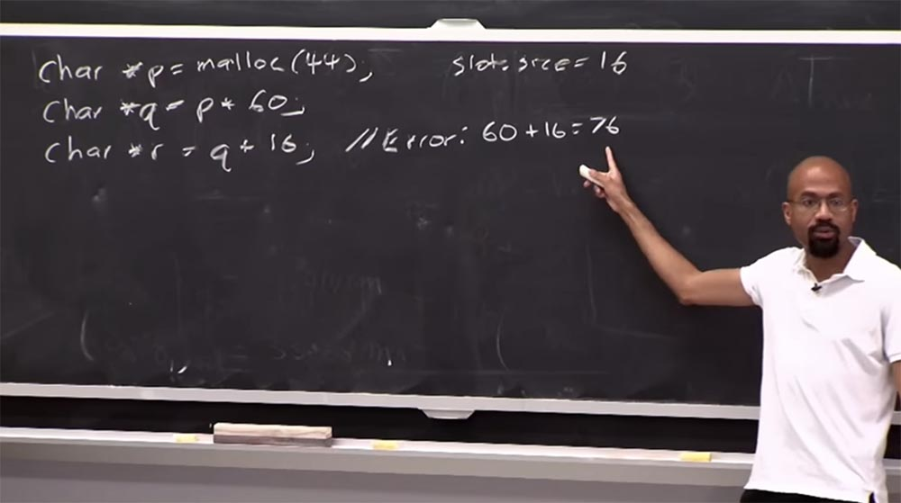
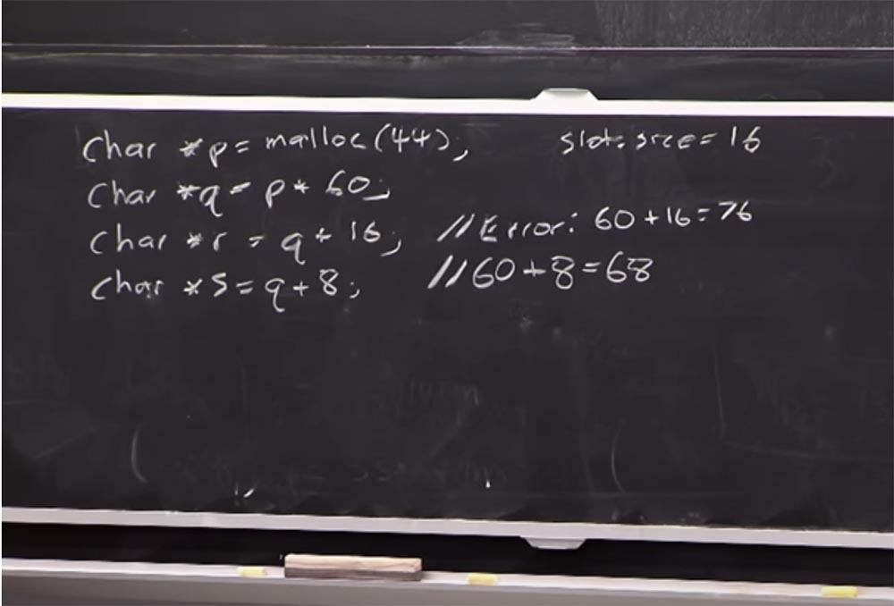
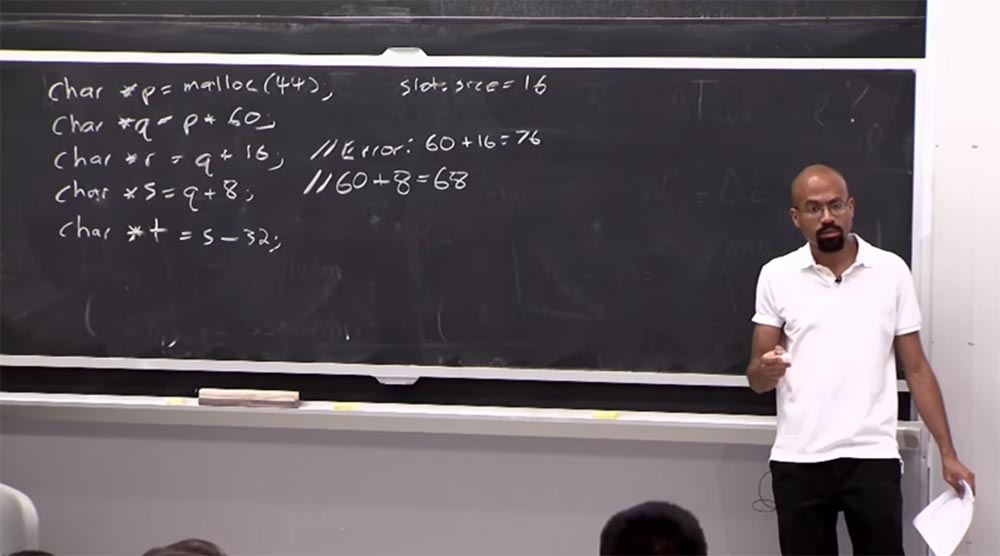
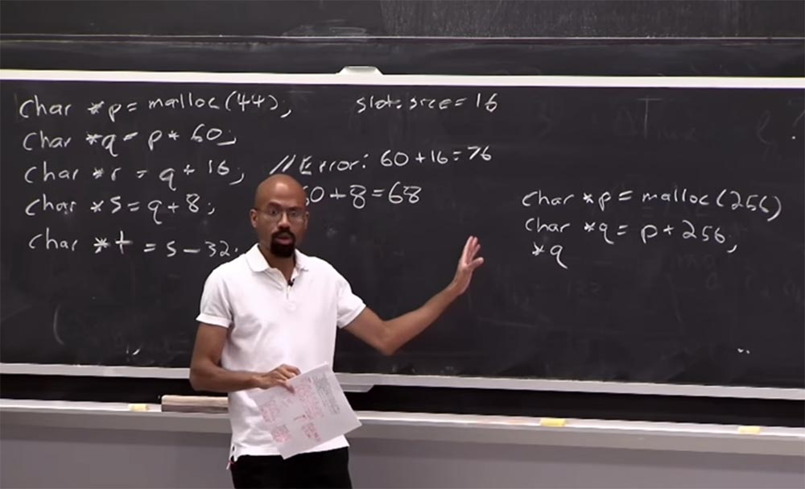
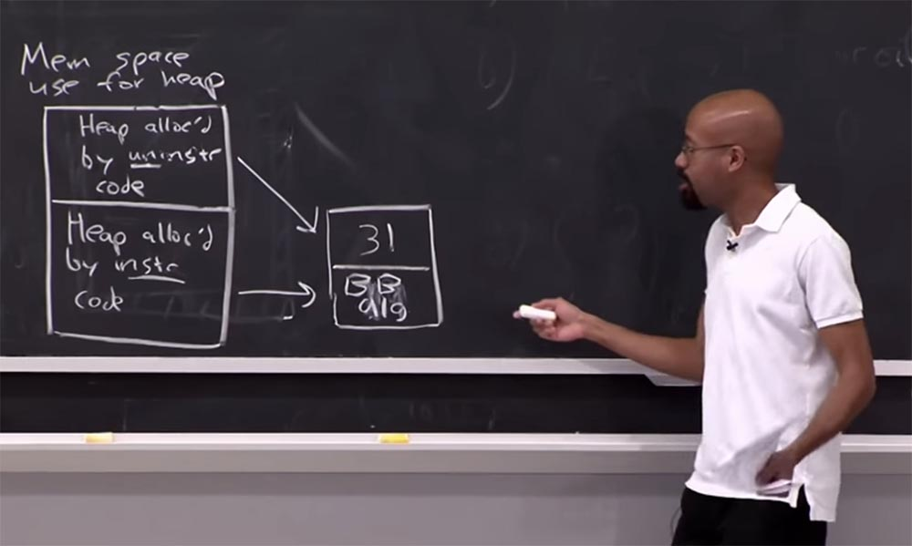
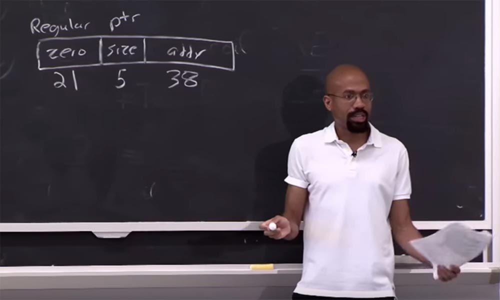
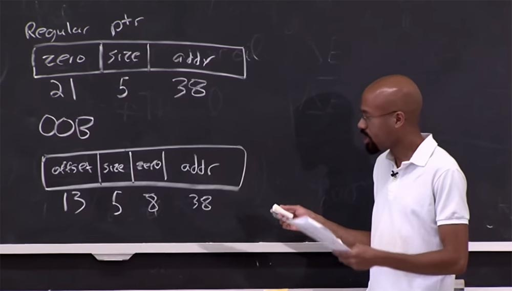
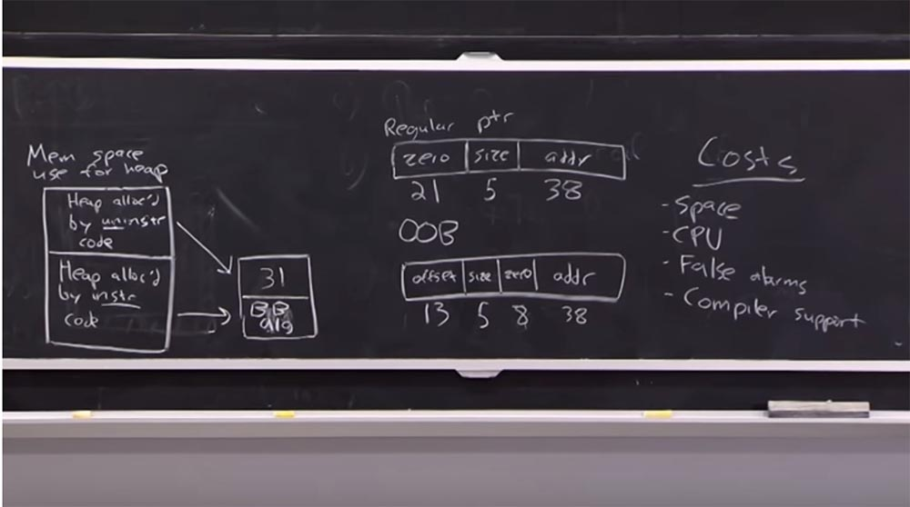
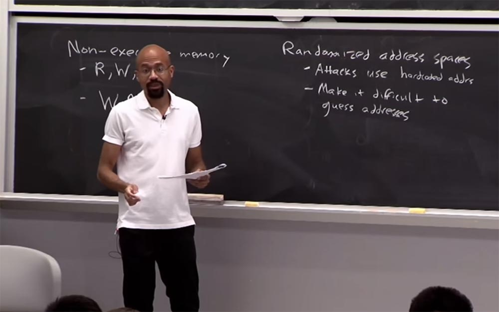

Курс MIT «Безопасность компьютерных систем». Лекция 3: «Переполнение буфера: эксплойты и защита», часть 1 / Блог компании ua-hosting.company

### Массачусетский Технологический институт. Курс лекций #6.858. «Безопасность компьютерных систем». Николай Зельдович, Джеймс Микенс. 2014 год

Computer Systems Security — это курс о разработке и внедрении защищенных компьютерных систем. Лекции охватывают модели угроз, атаки, которые ставят под угрозу безопасность, и методы обеспечения безопасности на основе последних научных работ. Темы включают в себя безопасность операционной системы (ОС), возможности, управление потоками информации, языковую безопасность, сетевые протоколы, аппаратную защиту и безопасность в веб-приложениях.

Лекция 1: «Вступление: модели угроз» [Часть 1](https://habr.com/company/ua-hosting/blog/354874/) / [Часть 2](https://habr.com/company/ua-hosting/blog/354894/) / [Часть 3](https://habr.com/company/ua-hosting/blog/354896/)  
Лекция 2: «Контроль хакерских атак» [Часть 1](https://habr.com/company/ua-hosting/blog/414505/) / [Часть 2](https://habr.com/company/ua-hosting/blog/416047/) / [Часть 3](https://habr.com/company/ua-hosting/blog/416727/)  
Лекция 3: «Переполнение буфера: эксплойты и защита» [Часть 1](https://habr.com/company/ua-hosting/blog/416839/) / [Часть 2](https://habr.com/company/ua-hosting/blog/418093/) / [Часть 3](https://habr.com/company/ua-hosting/blog/418099/)

Добро пожаловать на лекцию об эксплойтах для переполнения буфера. Сегодня мы закончим обсуждение **Baggy bounds** и затем перейдем к другим методам защиты от переполнения буфера.

Далее мы поговорим о печатных материалах сегодняшней лекции, которые посвящены **Blind Return Oriented Programming (BROP)** – слепому обратно-ориентированному программированию. Это техника эксплойтов, которые могут осуществляться, даже если атакующий не обладает целевым двоичным кодом. Эти эксплойты нацелены на уничтожение «канареек» в стеках 64-х битных систем. Так что, если вы были похожи на меня, когда я впервые прочёл эти материалы, то должны были чувствовать себя, как при просмотре фильма Кристофера Нолана. Это был просто взрыв мозга!

Мы собираемся рассмотреть, как правильно работают эти гаджеты. Поэтому я надеюсь, что к концу лекции вы сможете понять все эти высокие технологии, описанные в лекционных материалах. Но сначала, как я уже сказал, мы покончим с обсуждением **Baggy bounds**. Рассмотрим очень простой пример.

Предположим, что мы собираемся назначить указатель **p** и выделить для него размер 44 байта. Предположим также, что размер слота равен 16 байт.

Что будет, когда мы назначим функцию **malloc**? Вы уже знаете, что в этом случае система **Baggy bounds** постарается дополнить это распределение логарифмированием **2n**. Так что для нашего указателя размером 44 байта будет выделено 64 байта памяти. Но размер слота 16 байт, поэтому у нас будет создано 64/16 = 4 таблицы границ по 16 байт. Каждая из этих записей будет помещена в лог распределения размеров.

Далее назначим ещё один указатель **char *q = p + 60**. Мы видим, что это значение выходит за границы, потому что размер **р** составляет 44 байта, а здесь 60 байтов. Но **Baggy bounds** работает так, что в этом случае не произойдёт ничего страшного, хотя программист не должен был так поступать.

Теперь давайте предположим, что следующее, что мы делаем, это назначаем другой указатель, который будет равен **char *r = q + 16**. Теперь это на самом деле вызовет ошибку, потому что размер смещения составит 60 + 16 = 76, что на 12 байт превышает размер 4 слотов (4х16 = 64 байт), которые выделила система **Baggy bounds**. И это превышение действительно больше, чем половина слота.

Если вы помните, в таком случае система **Baggy bounds** немедленно отреагирует на критическую ошибку синхронизации, что вызовет сбой программы и фактически её остановит.

Поэтому давайте представим, что у нас есть только две строчки:

**char *p = malloc(44)  
char *q = p + 60**

И нет третьей строчки с кодом. Вместо неё мы сделаем так:

**char *s = q + 8**

В этом случае указатель будет иметь значение 60 + 8 = 68 бит, что составит на 4 байта больше, чем границы, назначенные **Baggy bounds**. Фактически это не причинит критической ошибки, хотя значение и выходит за пределы границ. Что мы здесь сделали – это установили для указателя бит высокого порядка. Так что если кто-нибудь впоследствии попытается разыменовать его, это привёдёт к критической ошибке в этой точке.

И последнее, что мы сделаем, это назначим ещё один указатель:

**char *t = s – 32**

Фактически мы сделали вот что – мы вернули указатель в границы. Так что если изначально **s** выходил за пределы, то сейчас мы вернули его в первоначально выделенный объём, который создали для указателя. Поэтому теперь **t** не будет иметь в своём составе бит высокого порядка, и его можно смело разыменовывать.

**Аудитория:** откуда программа знает, что **r** имеет превышение, большее, чем половина стека?

**Профессор Микенс:** обратите внимание, что когда мы создавали **r**, мы получили инструментальный код, который будет работать во всех этих операциях с указателями. Так что мы можем сказать, где будет располагаться **q**, и мы знаем, что он находится в рамках **Baggy bounds**. Поэтому, когда мы совершаем эту операцию **q+16**, инструменты **Baggy bounds** знают, откуда взялась эта исходная величина. И потом, если происходит смещение этого исходного размера, **Baggy bounds** легко определит, что величина этого смещения больше, чем ½ размера слота.

В принципе, когда вы совершаете операции с указателями, то должны смотреть, превысили ли они выделенный размер или нет. В какой-то момент у вас имеется указатель, находящийся в границах **Baggy bounds**, а затем происходит то, что заставляет его выходить за пределы границ. Так вот, как раз когда это происходит, мы и узнаем, что из нашего кода «вылезло» какое-то крючкотворство.

Надеюсь, что это понятно. Это был очень краткий обзор домашнего задания, но надеюсь, что вы можете его легко понять.

Итак, у нас есть указатель, который выглядит так:

**char *p = malloc(256)**, затем мы добавим указатель **char *q = p + 256**, после чего мы постараемся разыменовать этот указатель.

Так что же при этом произойдет? Хорошо, обратите внимание, что 256 – это последовательность **2n**, так что она будет находится в пределах **Baggy bounds**. Поэтому, когда мы прибавляем ещё 256 бит, это означает, что мы совершаем ещё один проход до конца границ **Baggy bounds**. Как и в предыдущем примере, эта строка достаточно хороша, но приводит к тому, что для **q** будет установлен бит высокого порядка. Поэтому когда мы попытаемся его разыменовать, всё взорвётся и придётся звонить своему страховому агенту. Это понятно?

Из этих 2-х примеров вы можете понять, как работает система **Baggy bounds**. Как я упоминал в последней лекции, вам на самом деле не нужно инструментировать каждую операцию указателя, если можно использовать статический анализ кода, чтобы выяснить, что определенный набор операций с указателями безопасен. Я отложу дальнейшее обсуждение некоторых статических анализов, но достаточно сказать, что вам не всегда нужно совершать эти математические действия, это мы уже проверяли раньше.

Ещё один вопрос, который упомянут в Piazza: как обеспечить совместимость системы **Baggy bounds** с предшествующими, неинструментальными библиотеками. Идея состоит в том, что когда **Baggy bounds** инициализируют таблицы границ, они устанавливают, что все записи должны находиться в пределах 31 бита. Поэтому, когда мы читаем таблицу границ, каждая запись в ней представляет значение вида **2n + 31**. Таким образом, инициализируя начальные границы размером 31 бит, мы предполагаем, что каждый указатель будет иметь максимально возможные размеры **2n + 31**. Позвольте мне привести очень простой пример, который прояснит это дело.

Предположим, что у нас есть пространство памяти, которое мы используем для кучи. Это пространство памяти складывается из двух компонентов. Сверху у нас есть куча, которая была выделена посредством неинструментального кода, а внизу – куча, которая была выделена инструментальным кодом. Так что же буде делать **Baggy bounds**? Как вы помните, у этой системы есть понятие слота, размер которого составляет 16 бит. Поэтому таблица границ будет состоять из 2-х разделов, инициируемых из 31 бита.

Однако при запуске инструментального кода он фактически будет использовать алгоритм **Baggy bounds** для того, чтобы установить подходящие значения для этой строки таблицы.

Когда указатель поступает из верхней части пространства памяти, то он всегда устанавливается в максимально возможных границах **2n + 31**. Это означает, что **Baggy bounds** никогда не посчитает, что операция с указателем, который «пришёл» из неинструментальной библиотеки, может выйти за пределы границ.

Идея состоит в том, что в инструментальном коде мы всегда будем выполнять эти сравнения для указателей, но если мы устанавливаем границы записи указателя для неинструментального кода вида **2n + 31**, то у нас никогда не будет ошибки разыменования. То есть у нас имеется хорошее взаимодействие между записями кода **Baggy bounds** и неинструментальными записями предшествующих библиотек.

Это значит, что у нас есть эта система, которая хороша, потому что она не приводит к сбою программы при использовании неинструментальных библиотек, но при этом имеет проблему. Проблема состоит в том, что мы никогда не сможем определить границы указателей, которые сгенерированы неинструментальным кодом. Потому что мы никогда не будем устанавливать бит высокого порядка, когда, например, этот указатель получает слишком много или слишком мало места. Таким образом, мы фактически не можем обеспечить безопасность памяти для операций, которые имеют место при использовании неинструментального кода. Вы также не можете определить, когда мы передаем указатель, вышедший за пределы размеров, из инструментального кода в код неинструментальный. При этом может произойти что-то невообразимое. Если у вас имеется такой указатель, вытащенный из инструментального кода, то он имеет бит высокого порядка, установленный на 1\. Так что создаётся впечатление, что он имеет гигантские размеры.

Мы знаем, что если просто поместили этот код в инструментальном коде, то можем очистить этот флаг в некоторых точках, когда он вернётся в пределы границ. Но если мы просто передадим этот громадный адрес неинструментальному коду, то он может сделать что-то невообразимое. Он даже может вернуть этот указатель обратно в границы, но у нас никогда не будет возможности очистить этот бит высокого порядка. Так что у нас всё-равно возможны проблемы даже при использовании изображенной здесь схемы.

**Аудитория:** если у нас есть инструментальный код для выделения памяти, он использует ту же функцию **malloc**, которую использует атрибутивный код?

**Профессор:** это немного деликатный вопрос. Если рассматривать имеющийся здесь случай, то это строго соблюдается, так как у нас есть две области памяти, каждая из которых подчиняется установленным для неё правилам. Но в принципе, это будет зависеть от кода, который использует выбранный язык программирования. Представьте, что в С++, например, вы можете назначить свой собственный определитель. Так что это зависит от определённых деталей кода.

**Аудитория:** каким образом определитель может проверить, установлен предел на 31 бит или нет?

**Профессор:** на нижних уровнях алгоритмы распределения работают так, что при вызове неизвестной системы указатель перемещается вверх. Так что если у вас есть несколько распределителей, то все они пытаются выделить память, у каждого из них есть свой собственный кусок памяти, который они резервируют для себя, в основном, правильно. Так что в реальной жизни это может быть более фрагментированным, чем на высоком уровне.

Итак, всё, что мы рассмотрели выше, относилось к работе **Baggy bounds** в 32-х битных системах. Рассмотрим, что происходит при использовании 64-х битных систем. В таких системах вы можете фактически избавиться от таблицы границ, потому что мы можем хранить некоторую информацию о границах в самом указателе.

Рассмотрим, как выглядит обычный указатель в системе Baggy bounds. Он состоит из 3-х частей. Для первой, нулевой части выделяется 21 бит, для размера выделяется ещё 5 бит, это основной размер лога, и ещё 38 – это биты обычного адреса.

Причиной, по которой это массово не ограничивает размер адреса программы, которую вы используете, является то, что большинство битов высокого порядка операционной системы и / или оборудования, расположенные в 2-х первых частях указателя, по разным причинам не дают использовать приложение. Так что, как оказалось, мы не сильно сокращаем количество приложений, используемых в системе. Вот так выглядит обычный указатель.

Что происходит, когда у нас есть только один из таких указателей? Ну, в 32-битной системе все, что мы можем сделать — это просто установить бит высокого порядка и надеется, что эта вещь никогда не получит более половины размера слота. Но теперь, когда у нас есть все это дополнительное адресное пространство, вы можете поместить смещение за пределы границ OOB (out of bound) непосредственно в этот указатель. Так мы можем сделать что-то вроде того, что изображено на рисунке, разделив указатель на 4 части и перераспределив его размер.

Таким образом, мы можем получить 13 бит для границ смещения, то есть записать, как далеко этот указатель OOB будет от того места, где он должен быть. Затем еще раз можно выставить фактический размер указанного здесь объекта, равный 5, и остаток нулевой части, которая теперь будет составлять 21-13 = 8 бит. И далее следует наша адресная часть из 38 бит. На этом примере вы видите преимущества использования 64-х битных систем.

Отметим, что здесь у нас имеется обычный размер для обычного указателя, в обеих случаях этот размер равен 64 бита, и его описание носит элементарный характер. И это хорошо, потому что при использовании «толстых» указателей нам понадобилось бы множество слов для их описания.  
Также отмечу, что здесь легко можно применить неинструментальный код, потому что он работает и использует тот же размер, что и обычные указатели. Мы можем поместить эти вещи в **struct**, например, и размер этого **struct** останется неизменным. Так что это очень хорошо, когда у нас есть возможность работать в 64-х битном мире.

**Аудитория:** почему во втором случае смещение расположено перед размером, а не как в предыдущем случае, и что произойдёт, если размер смещения будет большим?

**Профессор:** я думаю, что в некоторых случаях у нас есть определенные лимитирующие проблемы, над которыми придётся поработать. Например, проблема возникнет, если битов будет больше. Но в принципе я не думаю, что есть причина, по которой вы не смогли бы прочитать некоторые из этих вещей. Разве что определённые строгие условия, о которых я сейчас не думаю, должны бы были оговаривать размер нулевой части, иначе могут возникнуть проблемы с аппаратным обеспечением.

Итак, вы все еще можете инициировать переполнение буфера в системе **Baggy bounds**, так как применение вышеописанных подходов не решает все проблемы, верно? Ещё одна проблема, с которой вы можете столкнуться, если у вас имеется неинструментальный код, потому что мы не сможем обнаружить какие-либо проблемы в неинструментальном коде. Вы также можете столкнуться с уязвимостями памяти, которые возникают из системы динамического распределения памяти. Если вы помните, в предыдущей лекции мы рассматривали этот странный указатель **free malloc**, и **Baggy bounds** не смогла предотвратить возникновение подобных вещей.

Мы также обсудили на последней лекции тот факт, что указатели кода не имеют границ, которые бы с ними ассоциировались. Пусть у нас имеется структура, в которой буфер памяти расположен внизу, а указатель наверху, и происходит переполнение буфера. Будем считать, что переполнение буфера все еще находится в пределах **Baggy bounds**. Тогда вы обязаны переопределить этот указатель функции. Иначе, если мы попытаемся его использовать, он может направить на вредоносный код для атаки контролируемой части памяти. И в этом случае границы нам не помогут, потому что у нас нет границ, которые связаны, ассоциированы с этими указателями функции.

Итак, в чём состоит цена применения системы **Baggy bounds**? По сути, у нас есть всего 4 компонента этой цены.

Первый – это пространство. Потому что, если вы используете «толстый» указатель, то очевидно, что вы должны сделать указатели бОльшими. Если вы используете систему **Baggy bounds**, о которой мы только что говорили, вы должны сохранять таблицу границ. И эта таблица имеет такой размер слота, который позволяет вам контролировать, насколько велика будет эта таблица, пока вы не исчерпаете возможности выделяемой для неё памяти.

Кроме того, вы также увеличили нагрузку на ЦП, который вынужден делать все эти инструментальные операции с указателями. Так как для каждого или почти каждого указателя необходимо выполнить проверку границ, используя те же режимы работы, что замедлит выполнение вашей программы.

Существует также проблема с ложными тревогами. Мы уже обсуждали, что может случиться так, что программа генерирует указатели, выходящие за пределы границ, но никогда не пытается их разыменовать. Строго говоря, это не проблема. **Baggy bounds** пометит флагами эти «запредельные» указатели, если они выходят за пределы 1/2 размера слота, по крайней мере, в 32-битном решении.

Что вы увидите в большинстве инструментов безопасности, так это то, что ложные тревоги уменьшают вероятность того, что люди будут пользоваться этими инструментами. Потому что на практике мы все надеемся, что заботимся о безопасности, но что волнует людей на самом деле? Они хотят иметь возможность загружать свои глупые фотографии на Facebook, они хотят ускорить процесс загрузки и так далее. Таким образом, если вы действительно хотите, чтобы ваши инструменты безопасности пользовались спросом, они должны иметь нулевое количество ложных тревог. Попытка отловить все уязвимости обычно приводит к возникновению ложных тревог, которые будут раздражать или разработчиков, или пользователей.

К непродуктивным затратам приводит и то, что вам необходима поддержка компилятора. Потому что вы должны добавить в систему весь инструментарий, обход проверки указателя, и так далее и так далее.

Итак, за использование системы **Baggy bounds** мы должны заплатить цену, которая складывается из перерасхода пространства, увеличения нагрузки на CPU, ложных тревог и необходимости применения компилятора.

На этом обсуждение **Baggy bounds** можно завершить.

Теперь мы можем подумать о двух других стратегиях смягчения последствий переполнения буфера. На самом деле их гораздо проще объяснить и понять.

Один из этих подходов называется неисполняемой памятью, **non-executable memory**. Его основная идея состоит в том, что аппаратное оборудование подкачки будет указывать 3 бита **R**, **W** и **X** — чтение, запись и выполнение — для каждой страницы, которая у вас есть в памяти. То есть программа может прочитать эту память, записать в нее, выполнить ее. Первые 2 бита старые, они существовали и до этого, но последний, третий бит, представляет собой новую конструкцию.

Следующая идея состоит в том, что можно сделать стек неисполняемым. Если вы делаете стек неисполняемым, это означает, что противник не сможет запустить код, просто создав код оболочки, чтобы потом прыгнуть в какое-то место в буфере. Многие системы определяют политику, подобную этой. Исключительный приоритет «**W** или **X**» означает, что если у вас есть определенная страница, вы можете либо записать в неё, либо использовать как исполняемый код, но вы не сможете сделать и то, и другое одновременно. Это хорошо для противостояния злоумышленнику, который просто помещает исполняемый код в стек, а затем переходит к его выполнению. В данном случае проделать подобный трюк не получится. Таким образом, на аппаратном уровне мы исключили вектор атаки злоумышленника, помещающего исполняемый код в стек. Каковы преимущества данного подхода?

Потенциально это работает без каких-либо изменений в приложении, всё происходит на аппаратном уровне и на уровне ОС. Операционная система просто проверяет, что страницы защищены этими битами. Так что это очень удобно, потому что вам не нужно использовать компилятор, как в предыдущем случае.

Еще одна полезная вещь, о которой я упоминал в последней лекции, заключается в том, что аппаратное оборудование всегда следит за вами, даже если ОС этого не делает. Эти биты здесь указывают на то, что аппаратная часть просмотрела их и проверила правильность каждой ссылки памяти, которую вы сделали с помощью кода. Это тоже очень хороший аспект.

Недостатком этого подхода является то, что он усложняет приложению возможность динамически генерировать код. И лучший пример тому – компиляторы **just-in-time**, которые мы обсуждали на прошлой лекции.

То есть вы можете перейти на веб-страницу, и ваш код JavaScript будет выполняться достаточно быстро. Загружая этот источник JavaScript, он сначала просто начинает интерпретировать его, но затем в какой-то момент находит какой-то «горячий» путь, какой-то «горячий» цикл, где принимается динамически генерировать машинный код x86 и выполнять его напрямую. Но чтобы это работало, вы должны предусмотреть возможность динамической записи кода на страницу.  
Есть несколько способов обойти это неудобство. Например, можно представить, что компилятор типа **just-in-time** изначально задает бит **W**, затем его удаляет и задаёт бит **X**. Остальные способы могут выглядеть сложно, но на более высоком уровне довольно легко понять, как работает неисполняемая память.

Еще один способ защиты от переполнения буфера — это использовать случайные адреса или адресные пространства. Мы видим, что атаки, которые мы обсуждали до сих пор, используют жестко закодированные адреса.

Вспомните, как создаются атаки, которые вы разрабатывали в своей лабораторной работе. Вы открываете программу в GDB, узнаёте расположение некоторых вещей и можете создать код оболочки, который на самом деле имеет жестко закодированные адреса. Таким образом, идея использования случайной адресной базы достаточно проста. В основном это делается для того, чтобы злоумышленнику было сложно угадать адреса. Есть несколько разных способов осуществления этого подхода.

Итак, одна идея заключается в рандомизации стека. Представьте себе, что всё это пространство снизу доверху является виртуальным пространством памяти программы, причём стек всегда размещён сверху, всегда идёт вниз, далее размещены программные коды, а куча поднимается снизу вверх.

И все эти сегменты программы: стек, куча, программный код — начинаются в хорошо известном месте. Вместо этого представьте себе, что стек, который всегда начинается здесь, в этом известном месте, может начинаться здесь, ниже, выше, где-то в другом месте. Точно также программный код может менять своё положение в этой структуре, располагаясь выше или ниже обычного, фиксированного места.

Итак, идея заключается в том, что если вы атакующий и контролируете один из этих двоичных файлов, вы можете посмотреть в GDB и выяснить, где находятся все эти смещения, но на самом деле они не помогут вам разобраться, где эти смещения находятся в конкретном коде, который работает на данном сервере. В этом заключается основная идея случайных адресных пространств.  
Таким образом, здесь используется тот факт, что большая часть кода, который вы генерируете, не загружается в определенное место в памяти. Если вы пишете что-то вроде драйвера устройства, который взаимодействует с каким-то оборудованием, то это оборудование может потребовать жёстко закодированный адрес. Этот адрес должен содержаться в определённом месте буфера, чтобы была возможность скопировать оттуда информацию. Но если вы не пишете ничего подобного, то можете использовать перемещаемый код, так как этот подход будет очень хорошо работать с подобными вещами.

Вопрос состоит в том, можете ли вы использовать такой подход? Очевидно, что да. Есть несколько различных способов осуществить это, которые мы сегодня обсудим, но злоумышленник всё же может извлечь элемент случайности и победить все эти наши случайные подходы. Чтобы такого не произошло, вы делаете их неслучайными, либо находите случайное вмешательство, произведённое злоумышленником, или каким-то образом используете тот факт, что злоумышленник воспользовался утечкой информации о случайных местоположениях этих вещей.

27:10 мин

Продолжение:

[Курс MIT «Безопасность компьютерных систем». Лекция 3: «Переполнение буфера: эксплойты и защита», часть 2](https://habr.com/company/ua-hosting/blog/418093/)

Полная версия курса доступна [здесь](https://ocw.mit.edu/courses/electrical-engineering-and-computer-science/6-858-computer-systems-security-fall-2014/).

Спасибо, что остаётесь с нами. Вам нравятся наши статьи? Хотите видеть больше интересных материалов? Поддержите нас оформив заказ или порекомендовав знакомым, **30% скидка для пользователей Хабра на уникальный аналог entry-level серверов, который был придуман нами для Вас:** [Вся правда о VPS (KVM) E5-2650 v4 (6 Cores) 10GB DDR4 240GB SSD 1Gbps от $20 или как правильно делить сервер?](https://habr.com/company/ua-hosting/blog/347386/) (доступны варианты с RAID1 и RAID10, до 24 ядер и до 40GB DDR4).

**Dell R730xd в 2 раза дешевле?** Только у нас **[2 х Intel Dodeca-Core Xeon E5-2650v4 128GB DDR4 6x480GB SSD 1Gbps 100 ТВ от $249](https://ua-hosting.company/serversnl) в Нидерландах и США!** Читайте о том [Как построить инфраструктуру корп. класса c применением серверов Dell R730xd Е5-2650 v4 стоимостью 9000 евро за копейки?](https://habr.com/company/ua-hosting/blog/329618/)