Курс MIT «Безопасность компьютерных систем». Лекция 3: «Переполнение буфера: эксплойты и защита», часть 2 / Блог компании ua-hosting.company

### Массачусетский Технологический институт. Курс лекций #6.858. «Безопасность компьютерных систем». Николай Зельдович, Джеймс Микенс. 2014 год

Computer Systems Security — это курс о разработке и внедрении защищенных компьютерных систем. Лекции охватывают модели угроз, атаки, которые ставят под угрозу безопасность, и методы обеспечения безопасности на основе последних научных работ. Темы включают в себя безопасность операционной системы (ОС), возможности, управление потоками информации, языковую безопасность, сетевые протоколы, аппаратную защиту и безопасность в веб-приложениях.

Лекция 1: «Вступление: модели угроз» [Часть 1](https://habr.com/company/ua-hosting/blog/354874/) / [Часть 2](https://habr.com/company/ua-hosting/blog/354894/) / [Часть 3](https://habr.com/company/ua-hosting/blog/354896/)  
Лекция 2: «Контроль хакерских атак» [Часть 1](https://habr.com/company/ua-hosting/blog/414505/) / [Часть 2](https://habr.com/company/ua-hosting/blog/416047/) / [Часть 3](https://habr.com/company/ua-hosting/blog/416727/)  
Лекция 3: «Переполнение буфера: эксплойты и защита» [Часть 1](https://habr.com/company/ua-hosting/blog/416839/) / [Часть 2](https://habr.com/company/ua-hosting/blog/418093/) / [Часть 3](https://habr.com/company/ua-hosting/blog/418099/)

Интересно то, что злоумышленник не может совершать прыжки по определённому адресу, несмотря на то, что мы в основном используем жёстко закодированные адреса. То, что он делает, называется «атакой кучи», и если вы плохой человек, то для вас это будет довольно весело. При такой атаке хакер начинает динамически выделять тонны кода оболочки и просто вводить его случайным образом в память. Это особенно эффективно, если вы используете такие языки динамически высокого уровня, как JavaScript. Таким образом, считыватель тегов находится в узком цикле и просто генерирует большое количество строк кода оболочки и затем заполняет ими кучу.

Атакующий не может определить точное расположение строк, он просто выделяет 10 МБ строк кода оболочки и делает произвольный прыжок. И если он может каким-то образом контролировать один из указателей **ret**, существует вероятность, что он «приземлится» в код оболочки.

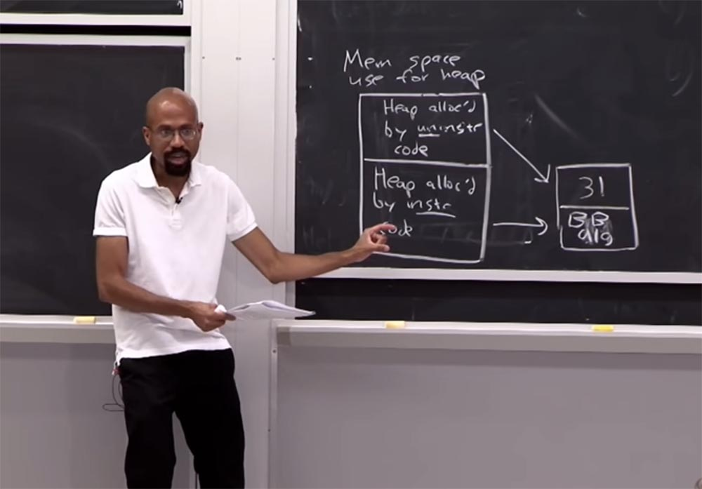

Вы можете использовать один трюк, который называется **NOP slide**, **NOP sled** или **NOP ramp**, где **NOP** – это **no-operation instructions**, или пустые, холостые команды. Это означает, что поток выполнения команд процессора «соскальзывает» в его конечный, желаемый пункт назначения всякий раз, когда программа переходит к адресу памяти в любом месте слайда.

Представьте себе, что если у вас есть строка кода оболочки и вы перейдёте в случайное место в этой строке, это может не сработать, поскольку не позволяет развернуть атаку правильным образом.

Но, может быть, этот материал, который вы помещаете в кучу, в основном просто тонна **NOP**, а в самом-самом конце у вас имеется код оболочки. Это на самом деле довольно умно, потому что означает, что теперь вы можете на самом деле попасть в то нужное место, куда прыгаете. Потому что если вы прыгаете в ещё один из этих **NOP**, происходит просто «бум, бум, бум, бум, бум, бум, бум», а затем вы попадаете в код оболочки.

Похоже, что это придумывают люди, которых вы, вероятно, видите в нашей команде. Они изобретают подобное, и это проблема. Так что это еще один способ обойти некоторые случайные вещи, просто делая рандомизацию ваших кодов устойчивой, если это имеет смысл.

Итак, мы обсудили некоторые типы случайностей, которые вы можете использовать. Существуют некоторые дурацкие идеи, которые тоже возникали у людей. Так что теперь вы знаете, что, когда вы хотите сделать системный вызов, например, используете функцию **syscall libc**, то в основном вы передаете любой уникальный номер, представляющий системный вызов, который вы хотите сделать. Так что, может быть, функция **fork** – это 7, **sleep** – это 8, или что-то в этом роде.

Это означает, что если злоумышленник может выяснить адрес этой инструкции **syscall** и перейти к нему каким-то образом, он или она может на самом деле просто подставить номер системного вызова, который они хотят использовать напрямую. Можно представить, что каждый раз, когда программа работает, вы фактически создаете динамическое присвоение номеров **syscall** действительным **syscalls**, для того, чтобы усложнить злоумышленнику захват.

Существуют даже некоторые авангардистские предложения изменить аппаратное обеспечение, чтобы оборудование содержало ключ шифрования **xor**, который используется для динамических функций **xor**. Представьте, что каждый раз, как вы компилируете программу, все коды инструкций получают определённый ключ **xor**. Это ключ закладывается в регистр оборудования, когда вы первоначально загружаете программу, и после этого всякий раз, когда вы выполняете инструкцию, оборудование автоматически совершает с ней операцию **xor**, прежде чем продолжить выполнение этой инструкции. В этом подходе хорошо то, что теперь, даже если злоумышленник сможет сгенерировать код оболочки, он не узнает этот ключ. Так что для него будет очень трудно выяснить, что именно нужно поместить в память.

**Аудитория:** но если он может получить код, то он также сможет использовать **xor**, чтобы превратить код обратно в инструкцию.

**Профессор:** да, в этом заключается каноническая проблема, верно. Это несколько похоже на то, что происходит во время атак **BROP**, когда мы вроде бы рандомизировали расположение кода, но атакующий может его «нащупать» и выяснить, что происходит. Можно представить, что, например, если злоумышленник знает некоторую суб-последовательность кода, который он ожидает обнаружить в двоичном файле, то он попытается использовать операцию **xor** для этого файла с целью извлечь ключ.

По существу, мы обсудили все виды атак рандомизации, о которых я хотел вам сегодня рассказать. Прежде чем мы перейдем к программированию, стоит обсудить вопрос, какие из этих способов защиты используются на практике. Оказывается, и **GCC**, и Visual Studio по умолчанию включают в себя подход **stack canaries**. Это очень популярное и очень известное сообщество. Если взглянуть на Linux и Windows, они также пользуются такими вещами, как неисполняемая память и рандомизация адресного пространства. Правда, система **baggy bounds** у них не настолько популярна, вероятно, из-за затрат памяти, процессора, ложных тревог и так далее, о чём мы с вами уже говорили. Так что в основном мы с вами рассмотрели, как обстоят дела с предотвращением проблемы переполнения буфера.

Теперь мы поговорим о **ROP**, обратно-ориентированном программировании. Сегодня я вам уже рассказал, что оно представляет собой с точки зрения рандомизации адресного пространства и предотвращения выполнения данных – это чтение, запись и выполнение. На самом деле это очень мощные вещи. Потому что рандомизация предотвращает возможность того, что злоумышленник поймёт, где находятся наши жестко закодированные адреса. А возможность предотвращения выполнения данных обеспечивает то, что даже если вы поместите код оболочки в стек, злоумышленник не сможет просто прыгнуть к нему и выполнить его.

Всё это выглядит довольно прогрессивно, но и хакеры постоянно разрабатывают методы атак против таких прогрессивных решений защиты.

Итак, в чём заключена суть обратно-ориентированного программирования?

Что, если вместо того, чтобы только создавать новый код во время атаки, злоумышленник сможет соединить воедино существующие части кода и затем объединить их вместе в ненормальном порядке? Ведь мы знаем, что программа содержит в себе тонны такого кода.

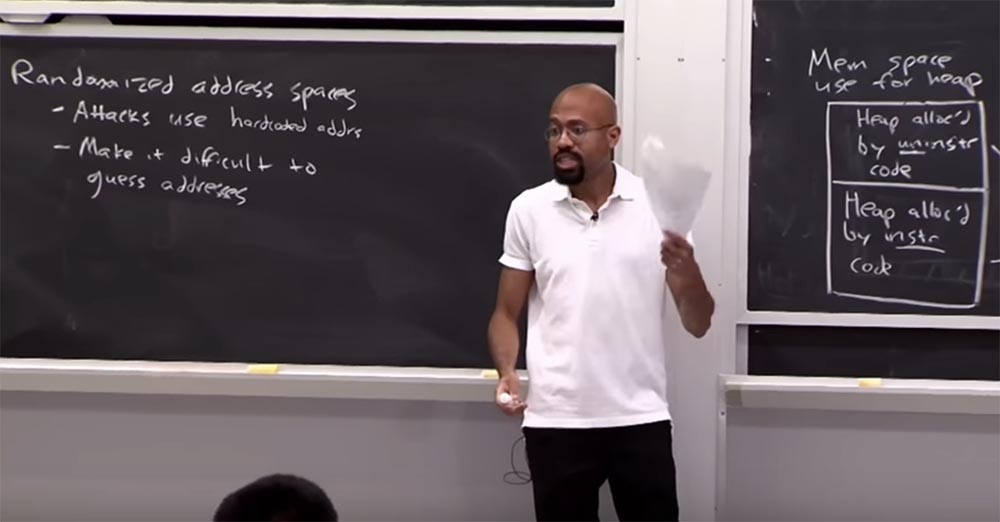

Так что, к счастью, или к несчастью, всё зависит от того, на чьей стороне вы находитесь. Если вы можете найти достаточно интересные фрагменты кода и объединить их вместе, то сможете получить что-то типа языка **Turing**, где злоумышленник сможет по существу делать все, что захочет.

Давайте рассмотрим очень простой пример, который сначала покажется вам знакомым, но затем быстро превратится в нечто безумное.

Допустим, у нас есть следующая программа. Итак, пусть у нас есть какая-то функция и, что удобно для атакующего, здесь имеется эта приятная функция **run shell**. Так что это просто вызов системе, он выполнит команду **bin/bash** и на этом закончится. Далее у нас имеется канонический процесс переполнения буфера или, извините, функция, которая объявит о создании буфера, а затем будет использовать одну из этих небезопасных функции для заполнения буфера байтами.

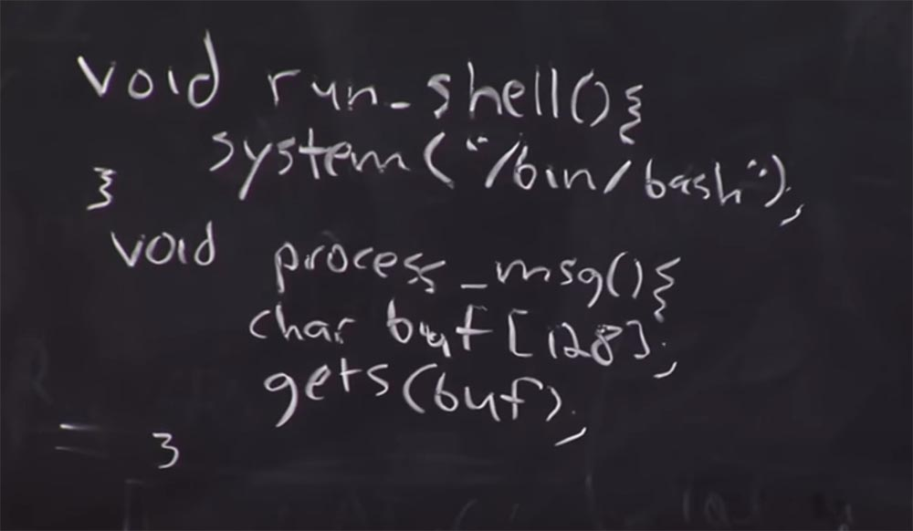

Итак, мы знаем, что здесь переполнение буфера происходит без проблем. Но интересно то, что у нас есть эта функция **run shell**, но до неё трудно добраться способами, основанными на переполнении буфера. Как же злоумышленник может вызвать эту команду **run shell**?

В первую очередь атакующий может дизассемблировать программу, запустить **GDB**, и узнать адрес этой вещи в исполняемом файле. Вы наверняка знакомы с этими методами из лабораторной работы. Затем, во время переполнения буфера, злоумышленник может взять этот адрес, поместить его в генерируемое переполнение буфера и убедиться, что функция возвращается к **run shell**.

Чтобы понятно, я это нарисую. Итак, у вас есть стек, который выглядит так: снизу имеется переполненный буфер, над ним расположен сохранённый указатель разрыва, выше него – адрес возврата для **prosess_msg**. Снизу слева у нас имеется новый указатель стека, который инициирует выполнение функции, над ним новый указатель разрыва, затем указатель стека, который будет использоваться, а ещё выше расположен указатель разрыва предыдущего фрейма. Всё это выглядит довольно знакомо.

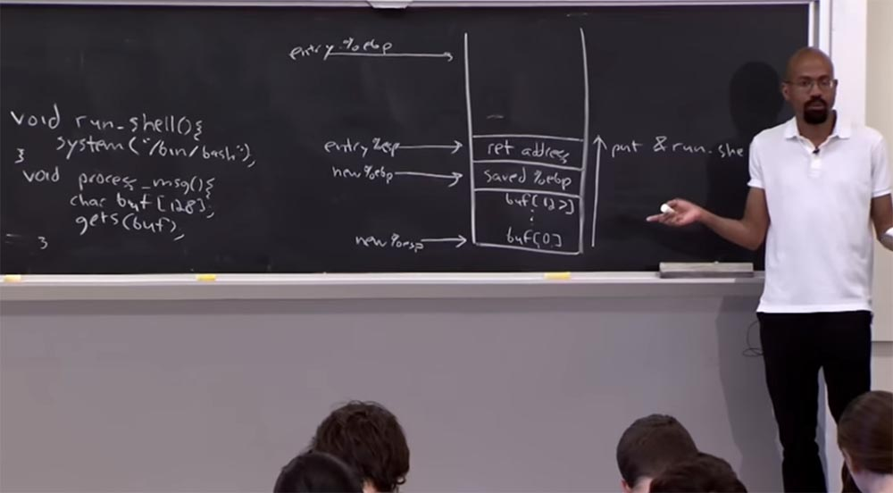

Как я уже говорил, во время атаки использовался **GDB**, чтобы выяснить, каков адрес **run shell**. Таким образом, при переполнении буфера мы можем просто поместить адрес **run shell** прямо здесь, справа. На самом деле это довольно простое расширение того, что мы уже знаем, как сделать. По сути, это означает, что если у нас есть команда, которая запускает оболочку, и если мы можем дизассемблировать двоичный файл, чтобы выяснить, где находится этот адрес, мы можем просто поместить его в это переполняемый массив, имеющийся внизу стека. Это довольно просто.

Так вот, это был крайне несерьёзный пример, потому что программист по какой-то сумасшедшей причине поместил эту функцию сюда, тем самым преподнеся нападающему настоящий подарок.  
Теперь предположим, что вместо того, назвать эту вещь **run_shell**, мы назовём ее **run_boring**, и далее она просто выполнит команду **/bin/ls**. Однако мы ничего не потеряли, потому что сверху у нас будет расположена строка **char * bash_path**, которая укажет нам путь к этому **bin/bash**.

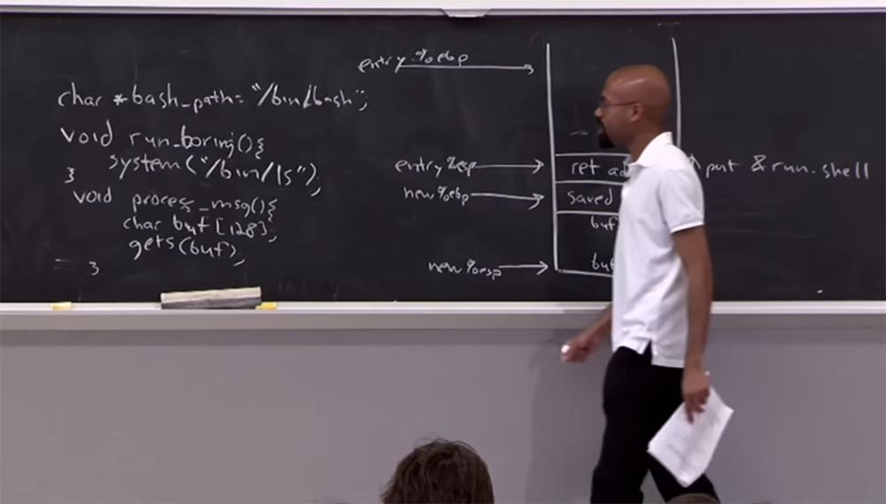

Так что самое интересное в этом то, что злоумышленник, который хочет запустить **ls**, может «разобрать» программу и найти местоположение **run_boring**, и это совсем не весело. Но на самом деле, у нас есть строка в памяти, которая указывает на путь оболочки, кроме того, мы знаем ещё кое-что интересное. Это то, что даже если программа не вызывает систему с аргументом **/bin/ls**, она всё равно осуществляет какой-то вызов.

Итак, мы знаем, что система должна быть каким-то образом связана с этой программой — **system(“/bin/ls”)**. Поэтому мы можем использовать эти две операции **void**, чтобы на самом деле связать систему с этим аргументом **char * bash_path**. Первое, что мы делаем, это заходим в **GDB** и выясняем, где эта **system (“/bin/ls”)** находится в изображении бинарного процесса. Итак, вы просто идете в **GDB**, просто набираете **print_system** и получаете информацию о её смещении. Это довольно просто, и вы можете проделать то же самое для **bash_path**. То есть вы просто используете **GDB**, чтобы выяснить, где живет эта штука.

Как только вы сделали, вам нужно сделать кое-что ещё. Потому что теперь мы действительно должны как-то выяснить, как вызвать систему при помощи аргумента, который мы выбрали. И способ, которым мы это делаем, по сути заключается в фальсификации вызывающего фрейма для системы. Если вы помните, фрейм — это то, что оба, компилятор и оборудование, используют для того, чтобы реализовать вызов стека.

Мы хотим организовать в стеке что-то вроде того, что я изобразил на этом рисунке. Фактически мы собираемся подделать систему, которая должна была бы быть в стеке, но прямо перед тем, как она фактически выполнит свой код.

Итак, здесь у нас расположен аргумент системы, это строка, которую мы хотим выполнить. Внизу у нас расположена строка, куда система должна вернуться, когда упомянутая строка с аргументом будет выполнена. Система ожидает, что стек будет выглядеть именно так непосредственно перед тем, как начнётся исполнение.

Раньше мы предполагали, что нет никаких аргументов, когда вы передаёте функцию, но теперь это выглядит немного иначе. Мы просто должны убедиться, что **argument** находится в том коде переполнения, который мы создаем. Мы просто должны убедиться, что этот поддельный **calling frame** находится в этом массиве. Таким образом, наша работа будет заключаться в следующем. Вспомните, что переполнение стека идет снизу вверх.

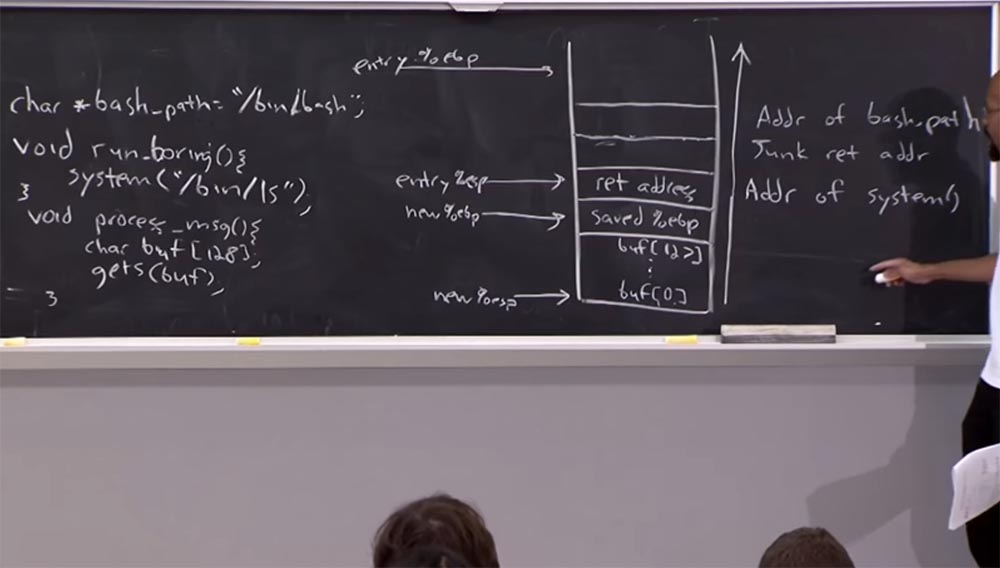

Во-первых, мы собираемся поместить здесь адрес системы. А сверху мы разместим какой-нибудь бросовый адрес возврата **junk return address**. Это место, куда система вернётся после того, как закончит. Этот адрес будет представлять собой случайный набор байтов. Выше него мы поместим адрес **bash_path**. Что же произойдёт при переполнении буфера теперь?

После того, как **prosess_msg** дойдёт до финиша, он скажет: «ОК, вот то место, куда я должен вернуться»! Системный код продолжает выполняться, он движется выше и видит созданным нами фальшивый фрейм вызова. Для системы не произойдёт ничего сногсшибательного, она скажет: «ага, вот он, тот аргумент, который я хочу выполнить, это **bin/bash**», она выполняет его, и готово – атакующий захватил оболочку!

Что же мы сейчас проделали? Мы воспользовались знанием соглашения о вызовах, **calling convention**, в качестве платформы для создания поддельных стековых фреймов, или поддельных названий фреймов, я бы сказал. Используя эти поддельные **calling frame**, мы можем выполнить любую функцию, на которую есть ссылка и которая уже определена приложением.

Следующий вопрос, который мы должны задать, звучит так: что, если в программе вообще не будет этой строки **char * bash_path**? Замечу, что эта строка практически всегда присутствует в программе. Однако предположим, что мы живём в перевёрнутом мире, и её там всё-таки нет. Так что же мы могли бы сделать, чтобы поместить эту строку в программу?

Первое, что для этого можно сделать, это указать правильный адрес для **bash_path**, разместив его повыше, вот в этом отсеке нашего стека, вставив туда три элемента, каждый из которых имеет размер 4 байта:

**/0  
/pat  
/bin**

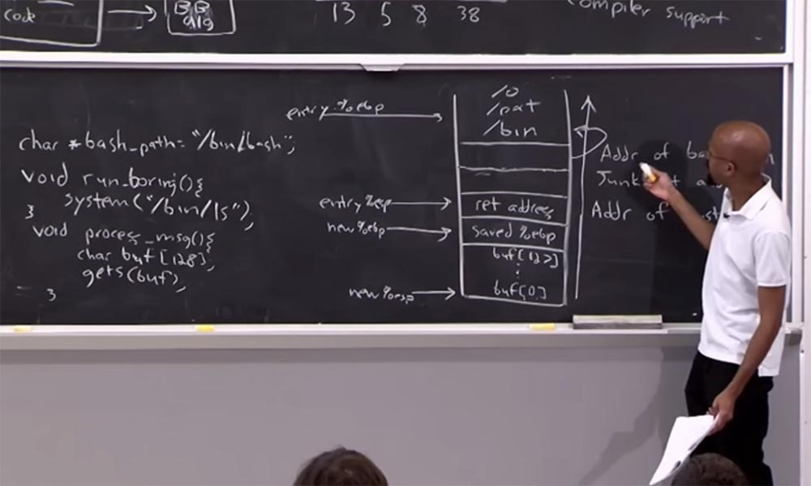

Но в любом случае, наш указатель приходит сюда и – бум! – Дело сделано. Таким образом, теперь вы можете вызвать аргументы, просто поместив их в код оболочки. Ужасающе, не правда ли? И всё это выстраивается перед полной **BROP** атакой. Но прежде чем вы укажите на полную **BROP** атаку, вы должны понять, как вы просто сцепляете вместе уже существующие внутри кода вещи. Когда я располагаю здесь этот бросовый адрес возврата, мы просто хотим получить доступ к оболочке. Но если вы атакующий, то могли бы направить этот обратный адрес, или адрес возврата, на то, что действительно можно было бы использовать. И если вы это сделали, то могли нанизать подряд в строку несколько функций, несколько признаков функции в ряд. Это действительно очень мощный вариант.

Потому что если мы просто установим адрес возврата на прыжок, то после этого обычно происходит сбой программы, которого, мы, может быть, не хотим. Поэтому стоит связать вместе некоторые из этих вещей, чтобы проделать с программой более интересные вещи.

Предположим, что наша цель состоит в том, что мы хотим вызвать систему произвольное количество раз. Мы не просто хотим сделать это единожды, мы будем делать это произвольное количество раз. Так как это можно сделать?

Для этого мы используем две части информации, которые мы уже знаем, как получить. Мы знаем, как получить адрес системы — нужно просто заглянуть в **GDB** и найти его там. Мы также знаем, как найти адрес этой строки, **bin/bash**. Теперь, чтобы инициировать эту атаку с использованием нескольких вызовов к системе, нам необходимо использовать гаджеты. Это приближает нас к тому, что происходит в **BROP**.

Так что то, что нам теперь нужно, это найти адрес этих двух кодовых операций: **pop %eax** и **ret**. Первая удаляет верх стека и помещает его в регистр **eax**, а вторая помещает его в указатель инструкции **eip**. Это мы и называем гаджетом. Он похож на небольшой набор инструкций по сборке, которые злоумышленник может использовать, чтобы построить более грандиозные атаки.

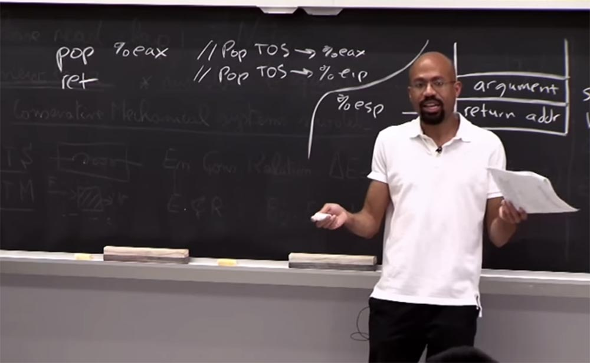

Такие гаджеты представляют собой стандартные инструменты, которые хакеры используют, чтобы найти такие вещи, как бинарные файлы. Так же легко найти один из этих гаджетов, предполагая, что у вас есть копия двоичного файла, и мы не побеспокоились насчёт рандомизации. Эти вещи очень легко найти, так же как очень легко найти адрес системы и прочее подобное.

Итак, если у нас есть один из этих гаджетов, для чего можем его использовать? Конечно же, чтобы причинить зло! Для этого можно проделать следующее.

Допустим, мы изменим наш стек так, что он будет выглядеть таким образом, эксплойт, как и раньше, направлен снизу вверх. Первое, что мы делаем, это располагаем здесь адрес системы, а над ним помещаем адрес гаджета **pop/ret**. Еще выше мы поместим адрес **bash_path**, а затем всё повторим: сверху опять поместим адрес системы, адрес гаджета **pop/ret** и адрес **bash_path**.

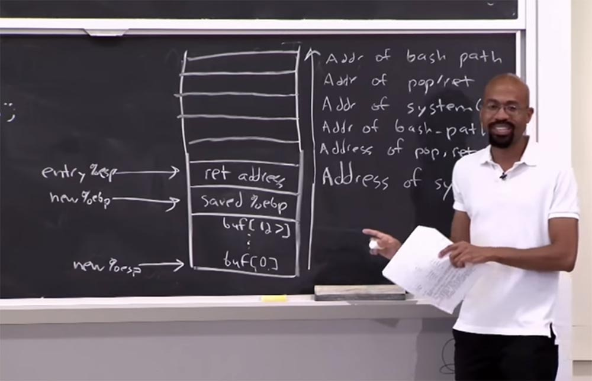

Что же у нас теперь здесь произойдет? Это будет немного сложно, поэтому заметки этой лекции имеются в Интернете, а пока вы можете просто послушать, что тут происходит, но когда я впервые понял это, это было похоже на понимание того, что Санта-Клауса не существует!

Мы начнём вот этого места, где расположена запись **entry**, вернемся к системе, где инструкция **ret** собирается удалить элемент из стека с помощью команды **pop**, так что теперь верх указателя стека находится здесь. Итак, у нас удаляется элемент с помощью **pop**, затем выполняется возврат процедуры **ret**, который передает управление по адресу возврата, выбираемому из стека, а этот адрес возврата помещается туда командой **call**. Итак, мы опять совершаем вызов системы, и этот процесс можно повторять снова и снова.

Ясно, что мы можем связать эту последовательность для выполнения произвольного количество вещей. По сути, ядро получает то, что называется обратно-ориентированным программированием. Обратите внимание, что мы ничего не выполнили в этом стеке. Мы сделали то, что позволило нам предотвратить выполнение данных, ничего при этом не уничтожив. Мы просто совершили что-то вроде неожиданных прыжков, чтобы сделать то, что мы хотим. На самом деле это очень, очень, очень, умно.

И что интересно, так это то, что на высоком уровне мы определили эту новую модель для вычислений. В традиционной, не вредоносной программе, у вас есть указатель инструкции, который указывает на некоторые линейные последовательности инструкций. И вы увеличиваете указатель инструкции, чтобы выяснить, что следует сделать дальше. По сути, обратно-ориентированное программирование использует указатель стека как указатель инструкции. Когда мы перемещаем указатель стека, мы указываем ему на другие блоки кода, которые собираемся выполнить. Но затем в конце гаджета возвращаемся опять к указателю стека, который показывает следующий блок кода для выполнения. Таким образом можно предотвратить выполнение нежелательных для нас вещей. Это показывает, как можно обойти на страницах этот неисполняемый бит. Так следующим, что мы захотим сделать, может быть победа над **stack canaries.**

Если вы помните, эта «канарейка» была тем, что мы собирались поместить в стек. Таким образом, можно представить, что «канарейка» будет размещена в **ret address** или в **saved %ebp**, и это помешает кому-то переопределить обратный адрес, не подавив «канарейку». Можно предположить, что прежде чем система прыгнет к адресу **ret**, она может проверить, не была ли перед этим изменена «канарейка», то есть, не произошло ли что-то плохое. Вот так работает **stack canaries**.

Давайте подумаем, как можно обойти «канарейку». Для этого нам нужно сделать несколько предположений о том, как работает система. Итак, как нам победить эту «канарейку»?

Первое, что мы можем предположить, это то, что сервер имеет уязвимость переполнения буфера.  
Второе, что можно предположить, это то, что сервер «упадёт» и перезагрузится, если мы установим «плохое» значение «канарейки».

И третье, что мы собираемся предположить, это то, что после перезагрузки «канарейка» и любое случайное адресное пространство, которое мы сделали, не будут повторно рандомизированы.  
Поэтому мы предположим, что если сможем как-то сломать сервер, то после его перезагрузки «канарейка» сохранит своё значение и все случайно распределённое адресное пространство, куча и код также будут расположены на первоначальных местах. Вы можете задаться вопросом, почему это так? Почему после перезагрузки сервер не создаёт для этих вещей новое местоположение?  
Причина в том, что большинство серверов пишутся под использование **fork** для создания новых процессов. Если вы помните, **fork** фактически наследует родительское адресное пространство. Это копия написанных страниц, которые изменяют содержимое, если наследник его обновляет, но если вы используете здесь **fork**, то вместо выполнения всего нового процесса, каждый раз, когда родительский серверный процесс формирует новых наследников, они будут иметь те же значения «канарейки» в базе адресов. Вот в чём заключаются предположения, с помощью которых мы собираемся победить **stack canaries**.

Так как же мы можем победить «канарейку»? На самом деле атака довольно проста. Представьте себе, что стек растёт вверх, у нас возникает переполнение буфера, расположенного ниже «канарейки». Обычно «канарейка» состоит из нескольких байтов. Так что вы можете начать исследовать эти байты один за другим и пытаться угадать их значение.

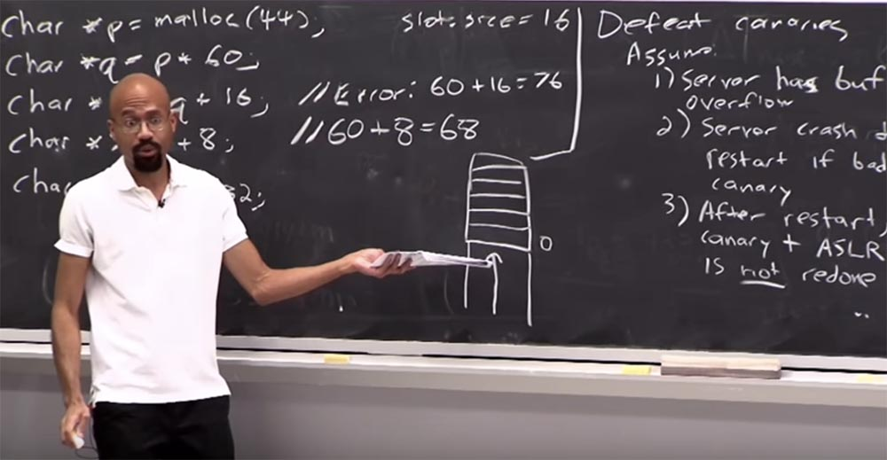

Предположим, что стек выглядит так, как показано на рисунке – внизу происходит переполнение буфера, а сверху расположены строки байтов «канарейки». Вы начинаете угадывать значение в этих строках снизу вверх, например, в нижней строке пусть будет 0\. Если вы не угадали, сервер «упадёт», как только переполнение коснётся этой строки. Если этого не произойдёт, вы скажете:

«Ага, я угадал значение первого байта «канарейки»! Продолжим угадывание дальше и предположим, что второй байт также равен 0\. Сервер «упал»! Подставляем 1 – опять «упал», подставляем 2 – всё в порядке. Отлично, вы угадали значение 2-го байта. Таким образом, можно подобрать все значения байтов, составляющих «канарейку».

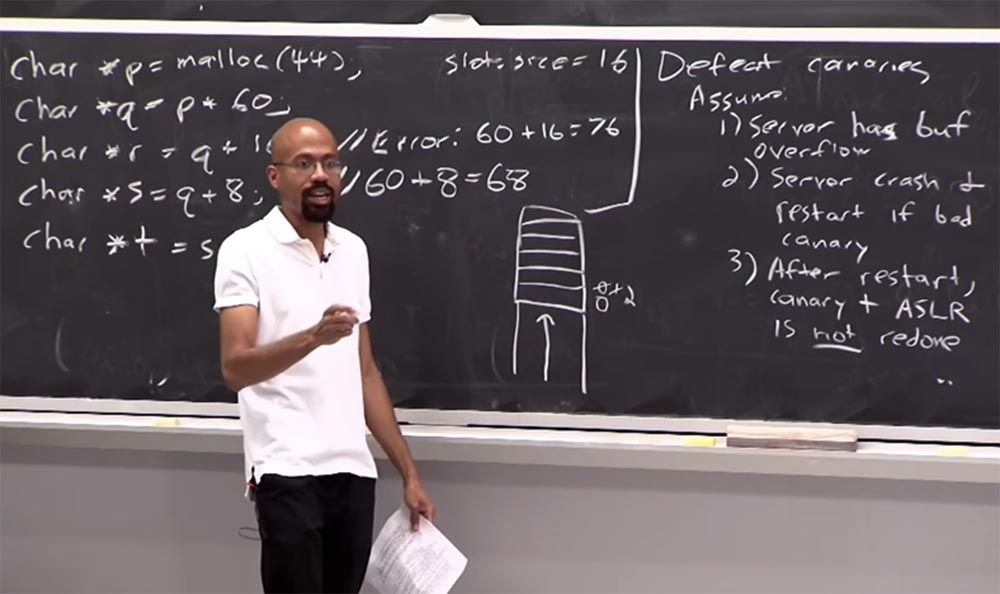

Падение сервера сообщает атакующему, что он ошибся, а продолжение работы указывает на то, что он правильно угадал значение.

Если вы точно знаете расположение «канарейки», то переполняя буфер, её можно быстро уничтожить, не прибегая к подбору значений. Однако проблема заключается в том, что при случайном расположении адресного пространства хакер заранее не знает, в каком месте стека расположена «канарейка».

57:10 мин

Продолжение:

[Курс MIT «Безопасность компьютерных систем». Лекция 3: «Переполнение буфера: эксплойты и защита», часть 3](https://habr.com/company/ua-hosting/blog/416047/)

Полная версия курса доступна [здесь](https://ocw.mit.edu/courses/electrical-engineering-and-computer-science/6-858-computer-systems-security-fall-2014/).

Спасибо, что остаётесь с нами. Вам нравятся наши статьи? Хотите видеть больше интересных материалов? Поддержите нас оформив заказ или порекомендовав знакомым, **30% скидка для пользователей Хабра на уникальный аналог entry-level серверов, который был придуман нами для Вас:** [Вся правда о VPS (KVM) E5-2650 v4 (6 Cores) 10GB DDR4 240GB SSD 1Gbps от $20 или как правильно делить сервер?](https://habr.com/company/ua-hosting/blog/347386/) (доступны варианты с RAID1 и RAID10, до 24 ядер и до 40GB DDR4).

**Dell R730xd в 2 раза дешевле?** Только у нас **[2 х Intel Dodeca-Core Xeon E5-2650v4 128GB DDR4 6x480GB SSD 1Gbps 100 ТВ от $249](https://ua-hosting.company/serversnl) в Нидерландах и США!** Читайте о том [Как построить инфраструктуру корп. класса c применением серверов Dell R730xd Е5-2650 v4 стоимостью 9000 евро за копейки?](https://habr.com/company/ua-hosting/blog/329618/)