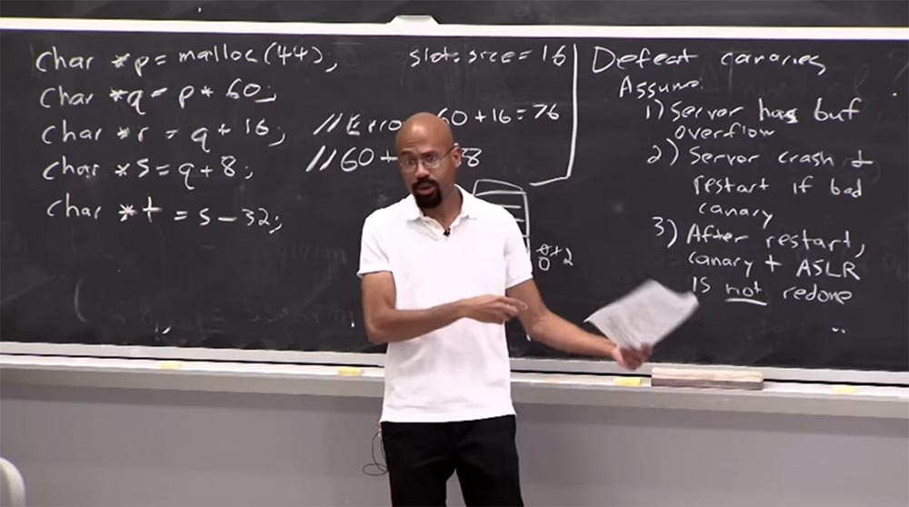
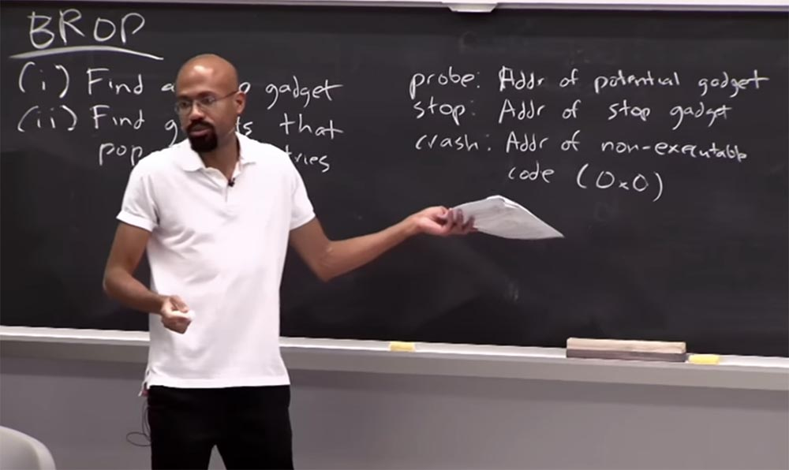
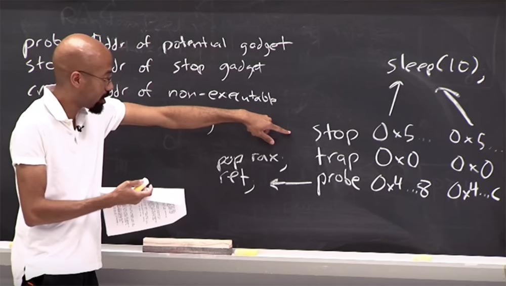
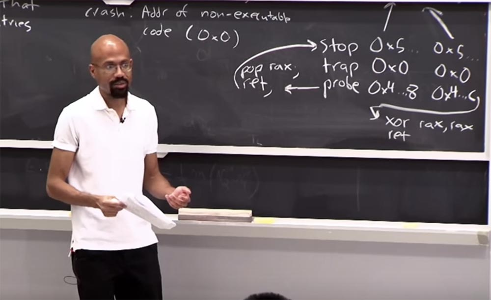
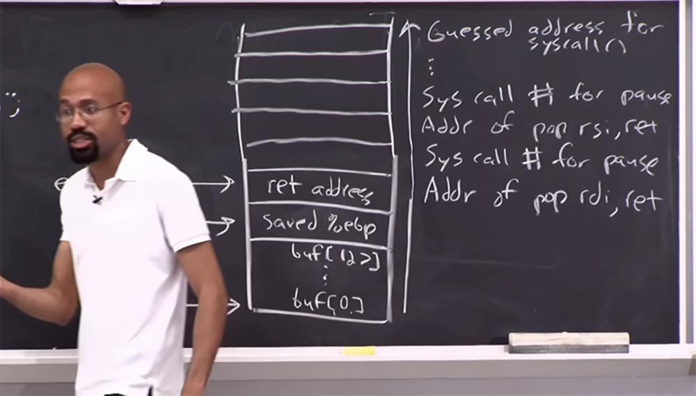
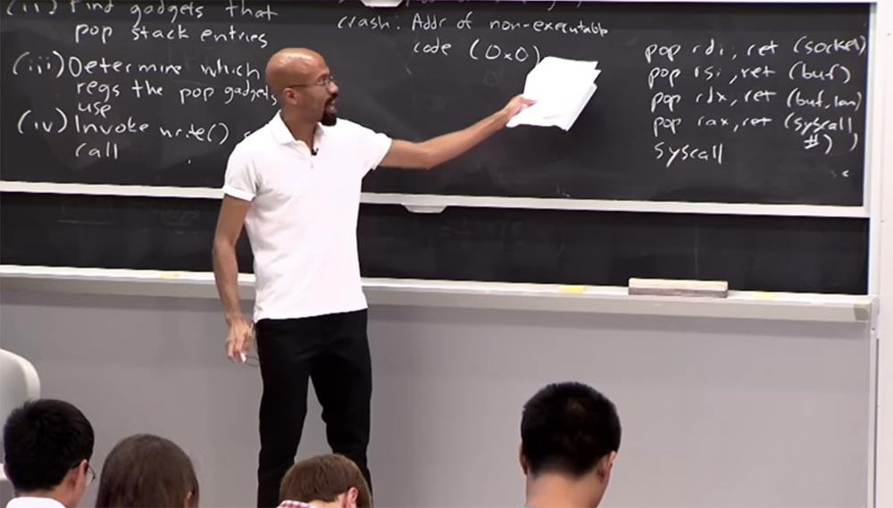
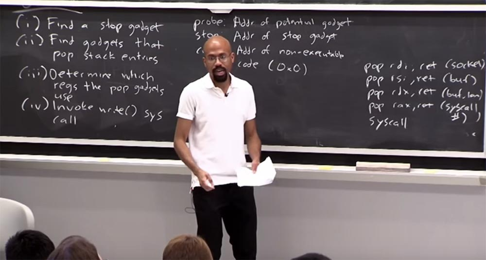

Курс MIT «Безопасность компьютерных систем». Лекция 3: «Переполнение буфера: эксплойты и защита», часть 3 / Блог компании ua-hosting.company

### Массачусетский Технологический институт. Курс лекций #6.858. «Безопасность компьютерных систем». Николай Зельдович, Джеймс Микенс. 2014 год

Computer Systems Security — это курс о разработке и внедрении защищенных компьютерных систем. Лекции охватывают модели угроз, атаки, которые ставят под угрозу безопасность, и методы обеспечения безопасности на основе последних научных работ. Темы включают в себя безопасность операционной системы (ОС), возможности, управление потоками информации, языковую безопасность, сетевые протоколы, аппаратную защиту и безопасность в веб-приложениях.

Лекция 1: «Вступление: модели угроз» [Часть 1](https://habr.com/company/ua-hosting/blog/354874/) / [Часть 2](https://habr.com/company/ua-hosting/blog/354894/) / [Часть 3](https://habr.com/company/ua-hosting/blog/354896/)  
Лекция 2: «Контроль хакерских атак» [Часть 1](https://habr.com/company/ua-hosting/blog/414505/) / [Часть 2](https://habr.com/company/ua-hosting/blog/416047/) / [Часть 3](https://habr.com/company/ua-hosting/blog/416727/)  
Лекция 3: «Переполнение буфера: эксплойты и защита» [Часть 1](https://habr.com/company/ua-hosting/blog/416839/) / [Часть 2](https://habr.com/company/ua-hosting/blog/418093/) / [Часть 3](https://habr.com/company/ua-hosting/blog/418099/)

Вы можете использовать методику угадывания «канарейки» в своих целях для того, чтобы выяснить наличие «слабых», с точки зрения подбора, битов. То есть если вы угадали правильно, сервер уйдёт на перезагрузку, и это будет служить для вас сигналом, что заданное значение довольно легко угадать. Таким образом, можно победить рандомизированные «канарейки», предполагая, что после перезагрузки сервера их значение не изменится. Вы также можете использовать гаджеты, чтобы осуществить связанную последовательность из нескольких атак.

Дальше мы рассмотрим более продуктивный способ, в котором вы можете использовать все эти методы для того, чтобы победить предотвращение выполнения данных, случайные адресные пространства и «канареек».

Обратим своё внимание на 64-битные архитектуры вместо 32-битных архитектур. Первые лучше подходят для рандомизации, так предоставляют вам гораздо больше «случайности», чтобы защититься от хакера. И эти системы выглядят гораздо интереснее с точки зрения формирования атак.

Этот тип 64-х битной архитектуры также рассматривался с точки зрения **BROP**, «слепого» обратно-ориентированного программирования. Для простоты будем считать, что единственное различие между 64-х и 32-х битными машинами состоит в том, что на 64-х битной машине аргументы передаются в регистры, а 32-х битной машине — в стек.

Когда функция начинает выполнение, она принимается «заглядывать» в определенные регистры, чтобы найти, где находятся аргументы.

А теперь перейдем к сути сегодняшней лекции – что такое слепое возвратно-ориентированное программирование, или **BROP**. Первое, что мы сделаем, это найдём стоп-гаджет. Помните, что когда мы говорим «гаджет», мы по существу имеем в виду обратные адреса. Гаджет отождествляется с обратным адресом, начальным адресом той последовательности инструкций, к которым мы хотим перейти. Так что же такое стоп-гаджет?

По существу он является адресом возврата в какое-то место в коде, при этом, если вы прыгнете туда, то просто приостановите выполнение программы, но не вызовете сбой программы. Именно поэтому это называется стоп-гаджетом.

Вы могли бы прыгнуть в какое-то место кода, которое затем инициирует спящий системный вызов, или сделает паузу, или что-то в этом роде. Возможно, что программа каким-то образом «застрянет» в бесконечном цикле, если вы прыгнете в это место. На самом деле не имеет значения, почему происходит остановка, но вы можете представить несколько сценариев, которые бы к ней привели.

В чём состоит польза стоп-гаджета?

Как только злоумышленник сумел победить «канарейку», используя интерактивную технику угадывания битов, он может начать переписывать этот обратный адрес **ret address** и принимается «нащупывать» стоп-гаджет. Обратите внимание, что большинство случайных адресов, которые вы можете разместить в стеке, вероятно, просто вызовут падение сервера. Опять же, это сообщение для вас, атакующего, это указание на то, что то, что вы нашли, не является стоп-гаджетом. Потому что при выходе сервера из строя ваш сокет закрывается, и вы, как злоумышленник, понимаете, что не попали по стоп-гаджету. Но если вы что-то угадали и сокет после этого остаётся открытым какое-то время, вы думаете: «ага, я нашел этот стоп-гаджет»! Так что основная идея первого шага состоит в том, чтобы найти этот стоп-гаджет.

Шаг второй заключается в том, что вы хотите найти гаджеты, которые удаляют записи стека, используя команду **pop**. Поэтому вы должны использовать эту последовательность тщательно разработанных инструкций, чтобы выяснить, когда вы захватите один их этих стековых гаджетов. Эта последовательность будет состоять из проверочного адреса **probe address**, адреса остановки **stop address** и адреса системного сбоя **crash address**.

Таким образом, **probe address** — это то, что мы собираемся поместить в стек. Это будет адрес потенциального гаджета очистки стека, **stop address** – это то, что мы рассматривали в первом шаге, это адрес стоп-гаджета. Тогда **crash address** просто будет адресом неисполняемого кода. Здесь можно просто поместить нулевой адрес (0 х 0), и если вы применяете функцию **ret** к этому адресу и пробуете выполнить там код, это приведет к сбою программы.

Так мы можем использовать эти типы адресов, чтобы узнать, где находятся эти гаджеты очистки стека **stack popping**.

Приведу простой пример. Предположим, что у нас есть два разных примера **probe**, ловушка **trap** и **stop**. Допустим, с помощью **probe** мы собираемся «прощупать» какой-то адрес, предположим, он начинается с 4, а заканчивается восьмёркой: 0х4…8, и за ним расположен следующий адрес вида 0х4…С. Гипотетически можно считать, что один из этих двух адресов и есть адрес гаджета **stack popping**.

Ловушка **trap** получит нулевые адреса 0х0 и 0х0, а стоп-гаджет **stop** пусть имеет произвольные адреса типа 0хS … 0хS …, это не имеет значения. Этот стоп-гаджет указывает на код sleep (10), вызывающий паузу программы.

Начнём с операции **probe**, которая выполняет очистку некоторого регистра и возврат в такой последовательности: **pop rax; ret**. Что при этом произойдёт? Когда система прыгнет в этот адрес, указатель стека переместится в середину нашего гаджета. А что гаджет собирается здесь делать? Правильно, выполнять операцию **pop rax**.

А затем следует **ret**, который переместит функцию к верхней строке гаджета, то есть к **stop**, и функция остановится без сбоя всей программы. Значит, используя этот гаджет, злоумышленник сможет сказать, что адрес **probe** принадлежит одной из этих функций, которая очищает стек, потому соединение клиента сервера является открытым.

Теперь давайте предположим, что второй адрес **probe** указал на нечто вроде **xor rax, rax, ret** для некоторого регистра.

Так что же произойдет, если мы попытаемся прыгнуть к этому гаджету? Обратите внимание, что он ничего не очищает в стеке, он просто изменяет содержимое регистров. Итак, мы собираемся совершить возврат к расположенному выше нулевому адресу 0х0. И это приведёт к тому, что система даст сбой. Клиентское соединение с сервером разорвётся, и хакер поймёт, что это не гаджет очистки стека **stack popping**.

Таким образом, вы можете использовать более причудливую серию ловушек и стоп-гаджетов, например вы можете очистить два элемента в стеке. Для этого вам просто нужно расположить здесь ещё одну инструкцию **trap**, и если этот гаджет не сотрет два элемента, вы окажетесь в одной из этих ловушек, и выполнение кода прекратится. В материалах к лекции описана вещь под названием **BROP gadget,** которая пригодится, если вы не любите возвращаться к программированию. Но сегодня я ещё расскажу вам, как можно использовать эти простые **pop**-гаджеты, чтобы запустить подобную атаку. После того, как вы это поймёте, разобраться с **BROP gadget** будет намного проще.

Но все ли из вас понимают, как мы можем использовать функцию **probe** для этих гаджетов? Предположим, вы нашли расположение фрагментов кода, которые позволяют вам очистить стек с помощью функции **pop**, удалить из него один элемент, но на самом деле вы не знаете, в каком регистре сработает эта функция **pop**. Вы просто знаете, что она уже готова к исполнению. Но вам нужно знать, в каком регистре сработают эти **pop**-гаджеты, потому что в 64-битной архитектуре регистры контролируют, где находятся аргументы функции, которую вы хотите вызвать.

Таким образом, наша цель состоит в возможности создавать гаджеты, которые позволят удалить значения, которые мы помещаем в определенные регистры стека, и в конечном итоге мы инициируем системный вызов **system call**, позволяющий нам совершить нечто плохое.  
Так что теперь нам нужно определить, какие регистры используются **pop**-гаджетами.

Для этого мы можем воспользоваться преимуществом паузы системного вызова. Если системный вызов на паузе, то выполнение программы приостанавливается, и она не воспринимает никакие аргументы. А это значит, что система игнорирует всё, что находится в регистрах.

По сути, чтобы найти инструкцию паузы, которую мы исполняем, можно связать все эти **pop**-гаджеты так, что мы сможем поместить их все в стек, а между каждым из них мы вставим **syscall number** для паузы. Затем мы увидим, сможем ли таким образом «подвесить» программу. Позвольте мне привести конкретный пример.

Сюда, в строку адреса возврата мы поместим гаджет, который очищает **RDI** регистры и применяет к ним функцию **ret**. Над ним мы поместим **syscall number** для паузы.

Предположим, что у нас есть еще один гаджет, расположенный выше, который осуществляет функцию **pop** в другом регистре, скажем, **RSI**, а затем выполняет **ret**. И затем мы снова поместим **syscall number** для паузы. И мы делаем так для всех гаджетов, которые мы нашли, а затем в конечном итоге на верху стека мы помещаем предположительный адрес для **syscall**.

Вспомним ещё раз, как вы используете эти системные вызовы. Вы должны поместить **syscall number** в регистр **RAX**, затем вызвать функцию **libc syscall**, которая собирается выполнить запрошенный системный вызов.

Так что же произойдет, когда мы выполним этот код? Мы придём сюда, в строку **ret address**, мы прыгнем в адрес этого гаджета, при этом нужно отметить, что злоумышленник знает, что этот гаджет, расположенный справа, удаляет что-то из стека, но ещё не знает, в каком регистре он расположен.

Итак, если мы прыгнем на **ret address**, что при этом произойдёт? Он применит функцию **pop** для паузы **syscall**, в каком-то регистре, который не известен атакующему, а затем мы продолжим подниматься по этой цепочке операций вверх по стеку.

При этом мы надеемся, что один из этих гаждетов выполнит функцию **pop** для **syscall number** в соответствующем регистре **RAX**. Так что к тому времени, когда мы доберемся сюда, наверх стека, по пути «испортив» все регистры, в которых имеется **syscall number** для паузы, мы будем надеяться, что у нас всё же есть один регистр, который должен быть правильным. Потому что если один из наших гаджетов сделает это, а затем, когда выполнив **ret**, мы через некоторое время вернемся сюда, наверх стека, то мы получим паузу. Еще раз повторю, что пауза действует как сигнал атакующему. Потому что если этот предположительный адрес для **syscall** был неправильным, то программа даст сбой.

Так что же позволяет нам сделать эта фаза атаки? Мы до сих пор не знаем, в каких регистрах какие **pop**-гаджеты находятся, но мы знаем, что один из них освободит **RAX**, который мы хотим контролировать. И мы наверняка знаем адрес **syscall**, потому что нам удалось поставить систему на паузу.

Как только мы это проделаем, то сможем проверить эти гаджеты один за другим и выяснить, какой из них ставит систему на паузу. Другими словами, мы вырежем всё, что расположено между строкой **ret address** и верхом стека, чтобы сразу перейти к **syscall**. Мы будем проверять, произошла ли пауза или сбой системы. Если произошёл сбой, мы идентифицируем вызвавший его гаджет, например, он находится в нижней строке справа, это **pop rdi**. Избавимся от него и попробуем следующий. Поместим сюда, в строку над **ret address** реальный адрес для **syscall**. Мы смогли поставить программу на паузу? Ага, значит, мы узнали, что этот **pop**-гаджет должен освободить **RAX**. Это понятно?

**Аудитория:** таким образом, способ угадать адрес для системного вызова — это просто слепой перенос гаджетов?

**Профессор:** да, это так, и в материалах лекции есть способы оптимизации этого процесса, когда вы используете расширение файла **PLT** и подобные вещи. При простой атаке, которую я описал, вы действительно просто вставляете сюда адрес, и убеждаетесь, вызвал ли он паузу или нет. В результате выполненного теста мы узнаём местонахождение **syscall**. Мы узнаём, где расположена инструкция, которая выполняет **pop RAX**. Нам также нужны гаджеты, которые выполняют **pop** и в некоторых других регистрах тоже. Вы можете делать подобные испытания и для них. Поэтому вместо того, чтобы вызвать паузу **syscall number**, используйте **push** для какой-то другой команды, которая, например, использует аргументы **RAX** и **RDI**.

Таким образом, вы можете использовать тот факт, что для любого конкретного набора регистров, которые вы хотите контролировать, есть какой-то **syscall**, который подаст вам, атакующему, сигнал, позволяющий выяснить, успешно вы его сломали или нет. Итак, в конце этой фазы у вас будет адрес **syscall** и адрес кучи гаджетов, которые позволяют вам выполнить **pop** в произвольных регистрах.

А теперь перейдём к 4-му шагу, который будет называться **write** — запись. Четвёртый шаг вызывает запись системного вызова. Чтобы вызвать **write**, нам нужно иметь следующие гаджеты:

**pop rdi, ret;  
pop rsi, ret;  
pop rdx, ret;  
pop rax, ret;  
syscall**

Как эти регистры используются системным вызовом? Первый – это сокет, или, в более общем плане, файловый дескриптор, который вы собираетесь передать для записи. Второй – это буфер, третий — это длина этого буфера, четвёртый – номер системного вызова и пятый – сам **syscall**.

Итак, если мы нашли все эти гаджеты, то мы можем контролировать значения, которые вкладываются в аргументы, которые, в свою очередь, помещаются в эти регистры, потому что мы просто «втолкнули» их в стек.

Каким же должен быть сокет? Здесь нам придётся немного поотгадывать. Можно воспользоваться тем, что Linux ограничивает количество одновременное открытых соединений для файла, который достигает величины 2024. А также то, что он должен быть минимальным из всех доступных.

Интересно, что мы собираемся вставить в указатель буфера? Правильно, мы намерены использовать здесь текстовый фрагмент программы, мы собираемся поместить его в указатель где-то в программном коде. Это позволяет нам прочитать двоичный файл вне памяти, используя правильный вызов клиента из сокета. Затем злоумышленник может взять этот двоичный файл, проанализировать его в автономном режиме оффлайн, используя **GDB** или другой инструмент, чтобы выяснить, где все это находится. Злоумышленник знает, что теперь, каждый раз, когда сервер «упадёт», в нем будет сохраняться тот же случайный набор вещей. Так что теперь, когда злоумышленник может узнать адреса и смещения для содержимого стека, он может атаковать эти гаджеты напрямую. Он может непосредственно атаковать другие уязвимости, выяснить, как вскрыть оболочку и тому подобное. Другими словами, в том месте, где вы предоставили хакеру бинарный файл, вы потерпели поражение.

Вот таким образом работает атака **BROP**. Как я уже сказал, в материалах лекции описано много способов оптимизации этих процессов, но сначала вам необходимо понять основной материал, иначе оптимизация теряет смысл. Поэтому вы можете поговорить со мной об оптимизации индивидуально или после занятий.

Пока что достаточно сказать, что это основы того, как вы можете запустить атаку **BROP**. Вы должны найти **stop**-гаджет, найти те гаджеты, которые выполняют функцию **pop** записей стека, выяснить, в каких регистрах они расположены, где находится **syscall**, а затем инициировать **write**, опираясь на добытую информацию.

Итак, быстро пробежимся по теме, как вы защищаетесь от **BROP**? Итак, самое очевидное, что у вас есть, это рерандомизация. Так как факт того, что «упавшие» серверы не респаунятся, не создают рерандомизированные версии самих себя, действует как сигнал, который даёт злоумышленнику возможность проверить различные гипотезы о том, как работают программы.

Один простой способ защиты – это убедиться, что вы делаете **exec** вместо **fork**, когда возрождаете свой процесс. Потому что когда вы выполняете процесс, вы создаете совершенно новое случайно расположенное пространство, по крайней мере, так происходит в Linux. В Linux, когда вы компилируете с использованием **PIE**, **Position Independent Execution**, независимым от расположения исполняемым файлом, при использовании **exec** вы получаете только новое случайное адресное пространство.

Второй способ заключается просто в использовании Windows, потому что эта ОС в принципе не имеет эквивалента функции **fork**. Это значит, что когда вы возродите сервер на Windows, он всегда будет иметь новое случайное адресное пространство.

Кто-то здесь спрашивал, что произойдет, если после сбоя работы сервера он не разорвёт соединение? Так вот, если при падении сервера мы каким-то образом «поймаем» эту ошибку и сохраним связь открытой некоторое время, то сможем запутать злоумышленника так, что он не получит сигнал о сбое и подумает, что нащупал верный адрес.

В этом случае ваша **BROP**-атака превратится в **DOS**-атаку. Потому что вы только что получили все потенциальные зомби-процессы, которые имеются вокруг. Они бесполезны, но вы не можете позволить им идти дальше, так как иначе вы должны будете удалить эту информацию.

Еще одна вещь, о которой вы могли бы подумать, это выполнение проверки границ, о которой мы говорили перед этим. В материалах лекции говорится о том, что данный метод непродуктивен, так как в 2 раза затратнее, но вы всё равно могли бы его использовать.

Вот таким образом работает **BROP**. Что касается домашнего задания, то там задаётся более деликатный вопрос: что, если вы используете хэш текущего времени? То есть отрезок времени, в течение которого вы перезапускаете программу. Достаточно ли этого, чтобы предотвратить подобный тип атаки? Обратите внимание, что хеширование не предоставляет вам магическим образом биты энтропии, если вводимые в хэш данные легко угадываемы. Если ваш хэш содержит миллиарды бит, это не имеет значения. Но если у вас там всего лишь пару значений, злоумышленнику будет просто их угадать. Конечно, использовать хэш случайного времени лучше, чем ничего не использовать для защиты от хакера, но это не обеспечит вас той безопасностью, на которую стоит рассчитывать.

Полная версия курса доступна [здесь](https://ocw.mit.edu/courses/electrical-engineering-and-computer-science/6-858-computer-systems-security-fall-2014/).

Спасибо, что остаётесь с нами. Вам нравятся наши статьи? Хотите видеть больше интересных материалов? Поддержите нас оформив заказ или порекомендовав знакомым, **30% скидка для пользователей Хабра на уникальный аналог entry-level серверов, который был придуман нами для Вас:** [Вся правда о VPS (KVM) E5-2650 v4 (6 Cores) 10GB DDR4 240GB SSD 1Gbps от $20 или как правильно делить сервер?](https://habr.com/company/ua-hosting/blog/347386/) (доступны варианты с RAID1 и RAID10, до 24 ядер и до 40GB DDR4).

**Dell R730xd в 2 раза дешевле?** Только у нас **[2 х Intel Dodeca-Core Xeon E5-2650v4 128GB DDR4 6x480GB SSD 1Gbps 100 ТВ от $249](https://ua-hosting.company/serversnl) в Нидерландах и США!** Читайте о том [Как построить инфраструктуру корп. класса c применением серверов Dell R730xd Е5-2650 v4 стоимостью 9000 евро за копейки?](https://habr.com/company/ua-hosting/blog/329618/)