Курс MIT «Безопасность компьютерных систем». Лекция 4: «Разделение привилегий», часть 1 / Блог компании ua-hosting.company

### Массачусетский Технологический институт. Курс лекций #6.858. «Безопасность компьютерных систем». Николай Зельдович, Джеймс Микенс. 2014 год

Computer Systems Security — это курс о разработке и внедрении защищенных компьютерных систем. Лекции охватывают модели угроз, атаки, которые ставят под угрозу безопасность, и методы обеспечения безопасности на основе последних научных работ. Темы включают в себя безопасность операционной системы (ОС), возможности, управление потоками информации, языковую безопасность, сетевые протоколы, аппаратную защиту и безопасность в веб-приложениях.

Лекция 1: «Вступление: модели угроз» [Часть 1](https://habr.com/company/ua-hosting/blog/354874/) / [Часть 2](https://habr.com/company/ua-hosting/blog/354894/) / [Часть 3](https://habr.com/company/ua-hosting/blog/354896/)  
Лекция 2: «Контроль хакерских атак» [Часть 1](https://habr.com/company/ua-hosting/blog/414505/) / [Часть 2](https://habr.com/company/ua-hosting/blog/416047/) / [Часть 3](https://habr.com/company/ua-hosting/blog/416727/)  
Лекция 3: «Переполнение буфера: эксплойты и защита» [Часть 1](https://habr.com/company/ua-hosting/blog/416839/) / [Часть 2](https://habr.com/company/ua-hosting/blog/418093/) / [Часть 3](https://habr.com/company/ua-hosting/blog/418099/)  
Лекция 4: «Разделение привилегий» [Часть 1](https://habr.com/company/ua-hosting/blog/418195/) / [Часть 2](https://habr.com/company/ua-hosting/blog/418197/) / [Часть 3](https://habr.com/company/ua-hosting/blog/418211/)

Сегодня мы поговорим о разделении привилегий, так как мы закончили с переполнением буфера на определённом уровне, но будем ещё к нему возвращаться. Мы не будем говорить о деталях, как использовать переполнение буфера, а переключимся на уменьшение этой проблемы и поговорим о том, как разработать систему, в которой переполнение буфера не будет для вас большой проблемой, как и другие уязвимости.

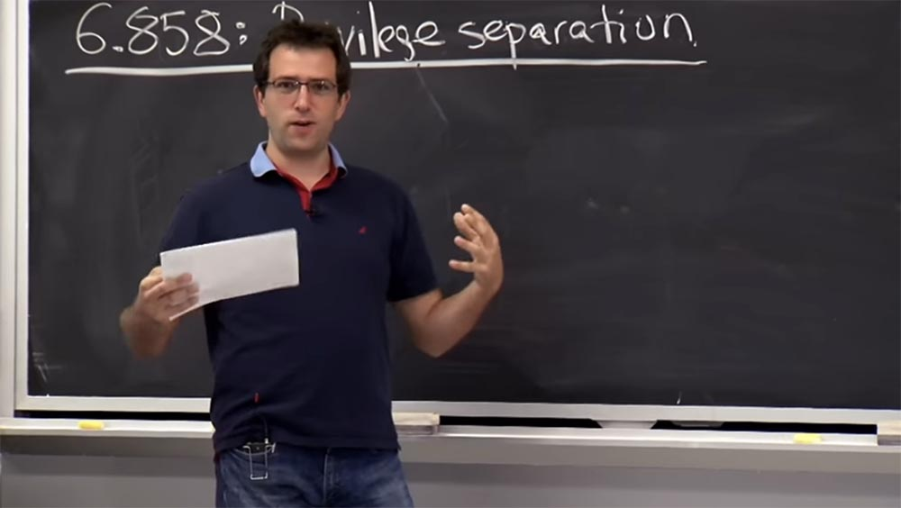

Итак, сегодня мы поговорим о разделении привилегий как о методе, позволяющем создать более безопасную систему, и в материалах лекции мы упоминаем веб-сервер под названием **OKWS**. Это не самый показательный пример разделения прав, но там достаточно хорошо описана система, чтобы понять, как работают все её части. Но это не означает, что вы должны пойти прямо сейчас, скачать **OKWS** и запустить свой сайт.

Поэтому, прежде чем мы погрузимся в детали разрешений **OKWS** и Unix, давайте просто посмотрим, что такое разделение привилегий и почему это такая хорошая идея? На прошлой неделе Джеймс показал, что если вы пишете программу на C, то почти неизбежно будете иметь в ней что-то плохое или неправильное. При этом проблема состоит в том, что если у вас есть достаточно большое приложение и в нём присутствует какой-либо вид уязвимости, то злоумышленники могут подключиться к программе, отправить запросы этому приложению, обмануть его и проделать «плохие» вещи.

Любое приложение имеет привилегии доступа. Это означает, что оно включает в себя много данных, которые можно получить при наличии доступа. Можно даже удалить эти файлы, как вы, ребята, делали в лабораторной работе №1\. Проблема заключается в том, что уязвимость в этом большом приложении может позволить атакующему изменить какие-то из этих данных или получить достаточно привилегий для управления программой, если вы не будете осторожны.  
В этой лекции мы рассмотрим, что пытается сделать разделение привилегий. Стоит взять программу, поделить её на части и убедиться, что каждый из отдельных элементов имеет только необходимые привилегии для того, чтобы правильно выполнять свою работу.

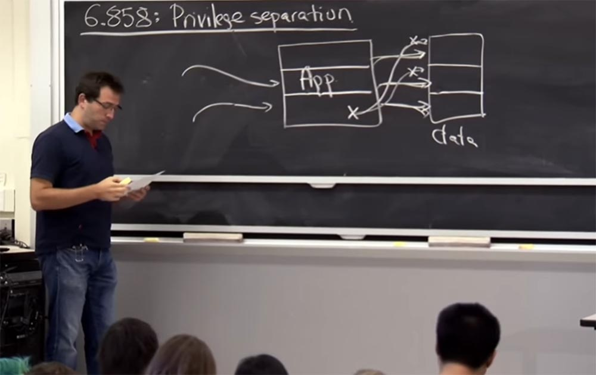

Слева у нас есть программа из 3-х частей, а справа данные, также состоящие из трёх частей. Правильно назначенные привилегии означают, что каждая часть приложения имеет доступ только к своей части данных. И если у нас имеется уязвимость программы Х, то она позволит захватить контроль только над одной частью данных и не сможет повлиять на данные в двух других частях.  
Так что это идея разделения привилегий чрезвычайно сильна. Она не служит тому, чтобы повлиять конкретно на проблему переполнения буфера или другие уязвимости, это просто общие требования к архитектуре программных продуктов для обеспечения того, чтобы уязвимости в одном месте системы не повлияли на её другие части. Разделение привилегий используется довольно широко. Так, для обеспечения изоляции компонентов внутри программы часто применяют виртуальные машины.

Вы можете взять свою большую систему и поделить её на кучу ВМ для изоляции отдельных частей, но вы также можете использовать Unix, чтобы фактически выполнить эту изоляцию с «разрезанием». Unix предоставляет довольно много механизмов, которые OKWS на самом деле использует для разделения привилегий.

Многие приложения фактически используют практику разделения привилегий. Вы, ребята, вероятно, довольно часто пользовались SSH, или «безопасной оболочкой». Это сетевой протокол, который используется для удалённого управления ОС и передачи файлов. Он использует разделение привилегий во многих своих компонентах, чтобы убедиться, что его шифровальные ключи не разгаданы и сервер не будет скомпрометирован. Более актуален для вас веб-браузер Chrome, в котором разделение привилегий реализовано также довольно широко. Так что, если имеется какой-то «баг» в работе Chrome, противник не сможет получить полный контроль над вашим компьютером.

Это очень краткое изложение того, что такое разделение привилегий и почему **OKWS** является интересным примером. Однако он больше наглядный пример, чем важная часть программного обеспечения.

Итак, **OKWS**, как я уже упоминал, будет использовать разрешения Unix и своего рода Unix-механизмы для разделения различных компонентов. Для нас важно понять то, как работают механизмы защиты Unix. Unix как инструмент для разделения привилегий важен не только для понимания работы **OKWS**, он, как и любой другой инструмент для изоляции, например **UID**, **VM**, **контейнеры** или любые подобные технологии, позволяет понять детали процесса. Потому что есть много сложных частей процесса получения прав доступа, и вы можете иметь дело со злоумышленником, который воспользуется уязвимостью любой из этих частей. Поэтому мы рассмотрим Unix достаточно подробно, чтобы понять, что это такое и как оно должно выглядеть в конкретном механизме безопасности.

Пожалуй, исторически Unix представляет собой лучший пример того, как построить механизм безопасности. Его механизм безопасности возник в процессе удовлетворения потребности разделить пользователей друг от друга в одной системе Unix. При этом считалось, что есть куча пользователей, которые используют один и тот же компьютер, и нужно держать их отдельно друг от друга. Таким образом, это не обязательно механизм общего назначения, но все же один из самых распространённых и широко используемых. Так, Chrome пытается использовать много механизмов разделения привилегий из Unix.

Когда вы думаете о механизме защиты, вы должны думать о его принципах, которые означают, что имеется некто с привилегиями или правами, а Unix инициирует или поддерживает эти права. Поэтому я думаю, что предметом, или субъектом Unix является процесс, так как поддерживается некий процесс, потому что каждой операции или запросу, которые мы рассматриваем с точки зрения безопасности, следует что-то разрешать или запрещать. Вероятно, это будет операция, вызываемая процессом путем выполнения системного вызова **syscall**. Здесь важно то, как мы опишем, какие привилегии имеет этот процесс.

Далее имеется объект, на который в качестве субъекта воздействует наш процесс. Он может модифицировать объекты, читать их, наблюдать за ними. В ОС существует множество объектов, о защите которых стоит побеспокоиться. О каких объектах, по-вашему, мы должны беспокоиться?

**Аудитория:** о файлах!

**Профессор:** правильно, о файлах и каталогах. О чём ещё?

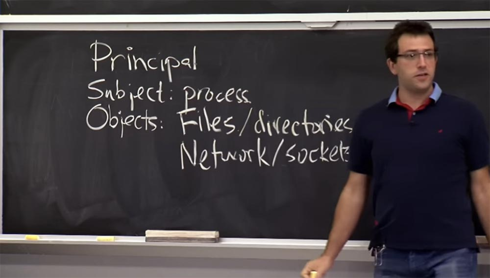

**Аудитория:** о сетевых сокетах!

**Профессор:** да, замечательно, о сетевых сокетах. Что-нибудь еще у нас происходит в системе?

**Аудитория:** другие процессы.

**Профессор:** Правильно. На самом деле, это похоже на то, о чём приложение или пользователь должны заботиться, но существуют разные внутренние компоненты системы, которые вы также должны защитить. Поэтому сам по себе процесс не является тем субъектом, который делает системный вызов, он также является чем-то, на что может действовать другой процесс. Он может убить его или создать новый. Поэтому вы должны выяснить, каковы правила восприятия процесса как объекта, которым можно манипулировать. Какие ещё вещи могут нас волновать?

**Аудитория:** переменные среды.

**Профессор:** я думаю, что они, вероятно, не являются субъектом, который вы можете изменить, в смысле управления OC и наличия какой-то политики безопасности. Я думаю, что переменные среды – это просто некое состояние процесса, содержащегося в памяти. Но, я думаю, в более общем плане, нас заботит эта часть процесса, содержащаяся в памяти – переменные среды, стеки, аргументы, это тоже достаточно важно. Наверное, в памяти процесса находится много чувствительных к вмешательству извне вещей. Что ещё?

**Аудитория:** файловые дескрипторы в целом.

**Профессор:** тут есть еще одно внутреннее обстоятельство, которое имеет большое значение. Файлы, которые находятся на диске, должны нас волновать. Но есть ещё такой операционный инструмент, как файловый дескриптор, который **OKWS** старается широко использовать, и мы увидим, что они из себя представляют. Какие ещё вещи вы бы хотели защитить в операционной системе?

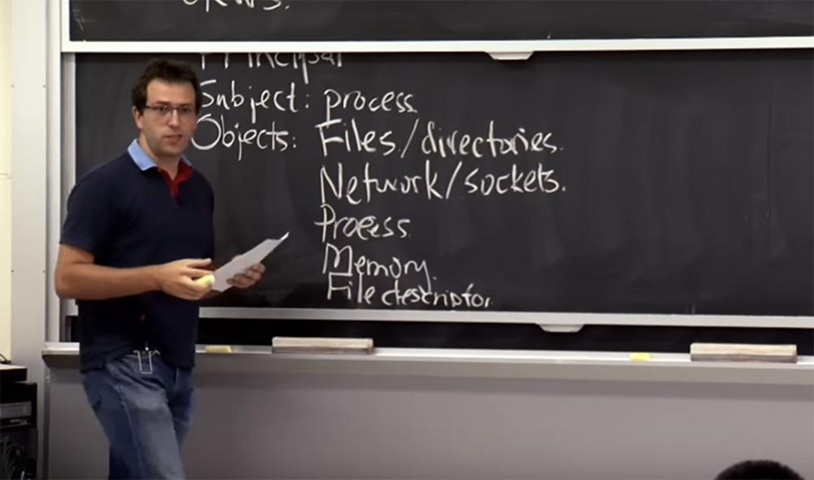

**Аудитория:** «железо», или аппаратное обеспечение.

**Профессор:** да, «железо» требует защиты не меньше, чем абстрактные вещи, которые предоставляет нам ОС, мы ведь не хотим, чтобы наш процессор при выполнении программы «завис» бы по какой-то причине.

**Аудитория:** стоит подумать также о защите периферийных устройств!

**Профессор:** О, да! Итак, дополнительные устройства, вы правы, особенно на настольном компьютере, там много лишних вещей: USB-накопитель, веб-камера, вероятно, сам дисплей – что-то из этого вы захотите защитить, потому что связанные с ними приложения не должны «гулять» по всему вашему экрану.

Я думаю, на самом деле все эти объекты не находятся на стороне сервера, они просто довольно близко к нему расположены. На вашем телефоне микрофон, наверное, тоже очень важный объект, который вы тоже захотите защитить.

Но я оставлю этот список, потому что дальше мы будем говорить преимущественно о серверных приложениях, однако в отношении списка объектов вы совершенно правы. Я думаю, что для **OKWS** это, вероятно, более или менее исчерпывающий список вещей, о защите которых мы могли бы позаботиться, или, по крайней мере, которые использует **OKWS**.

Итак, давайте поговорим о том, как ядро ОС решает, когда процесс может что-либо сделать с любым из этих объектов. Поэтому на высоком уровне, мы главным образом думаем о процессе как о субъекте, имеющем привилегии, которые предоставлены этим принципом, а принцип в системе Unix является достаточно сложной вещью.

Существует нечто под названием **User ID**, которое представляет собой 32-х битное целое число. Существует идентификатор группы **Group ID**, который также является 32-разрядным целым числом. На самом деле нет особой причины, почему они должны отличаться.

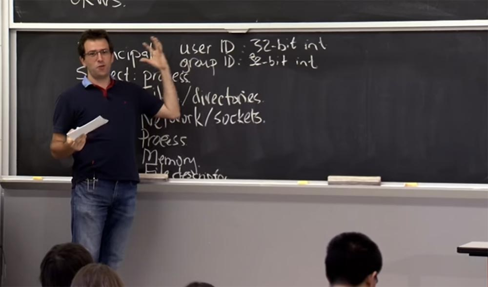

Было бы неплохо, если бы они просто составляли единый набор 32-битных целых чисел, но, к сожалению, Unix разбивает их на две категории. Есть целые числа **User ID**, и целочисленные значения **Group ID**. Когда мы говорим о процессе, имеющем определенные привилегии, то имеется в виду процесс, связанный с определенным значением **uid**. Как правило, процесс имеет один **uid**, а также список групповых идентификаторов **gid**, которые имеет данный процесс. По историческим причинам сложилось так, что они объединяются в один **gid**, а потом объединяются в список других идентификаторов. Грубо говоря, процесс может осуществлять привилегии, представленные всеми этими идентификаторами. Так что если **uid** предоставляет к чему-то доступ, то процесс может делать с ним что угодно.

Теперь давайте поговорим о файлах, каталогах и других видах объектов. Так что же происходит с файлами, вернее, как создать разрешения Unix для работы с файлами? С файлами всё относительно просто, в их отношении вас заботят операции, которые можно с ними проделать: чтение, запись, возможно, выполнение, а также способность изменить сами разрешения или другие свойства безопасности.

**Аудитория:** разрыв связей!

Профессор: да, разрыв связей, **unlink** — как вы считаете, это свойство самого файла или каталога? На самом деле это различие немного не чёткое. Когда Unix думает об удалении файла, это в большей степени касается каталога, потому что в Unix файл действительно представляет собой **inode**, или индексный дескриптор. Поэтому в Unix вы можете иметь несколько жёстких ссылок на **inode** и при отсоединении определенного имени файла Unix с помощью **unlink** вы на самом деле уничтожаете только одно из имён файла, но у него могут быть другие имена и другие ссылки на него. На самом деле важно, разрешено ли вам изменять каталог, указывающий на файл, и при этом не делать что-либо с **inode** самого файла. Так что обычно операции **unlink**, **link**, **rename** и **create** являются операциями, связанными с каталогом, поэтому create влияет как на каталог, так и на новый файл. Поэтому мы должны выяснить, какие правила там действуют.

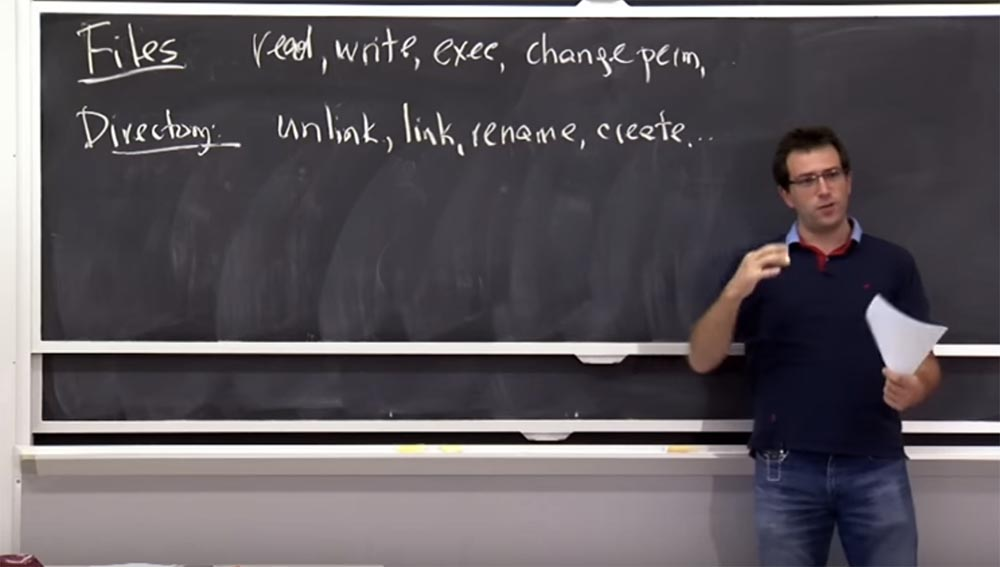

Для того, чтобы решить, что кто-то может прочитать или записать файл, мы собираемся вставить некоторые разрешения, или биты, в файл **inode**. В Unix каждый **inode**, который в конечном итоге является файлом или каталогом, в целях безопасности имеет несколько интересных полей. Здесь есть идентификатор пользователя и идентификатор группы, которая, как мы говорим, владеет файлом или владеет каталогом. Таким образом, распоряжаться всеми файлами в вашем домашнем каталоге вы можете благодаря тому, что Unix имеет ваш **uid**.  
В Unix также есть набор битов разрешений, которые можно рассматривать как часть матрицы, в базовом дизайне они выглядят как **r** (чтение), **w** (запись) и **x** (выполнение). Мы можем указать эти разрешения для различных субъектов, и в Unix они указываются для владельца **owner**, то есть для **uid inode**, для группы **group**, которой принадлежит данный файл, то есть для **gid**, и для всех остальных – **other**.

Вы можете заполнить эту бинарную матрицу 3 на 3, где 1 означает разрешение выполнять определённое действие, а 0 запрещает его выполнение:

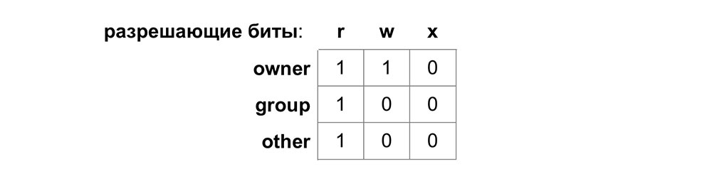

Вот так Unix хранит разрешения. Есть традиционный способ кодирования этих вещей, который вы будете видеть часто и о котором, вероятно, стоит упомянуть. В Unix эта матрица кодируется как восьмеричное число, поэтому каждую строку здесь следует рассматривать как базовое число 8, поэтому наша матрица в такой кодировке будет выглядеть следующим образом: **r** это 4 бита, **w** — 2 бита, **x** – 1 бит, соответственно, **owner** – это 6 бит, а **group** и **other** содержат по 4 бита.

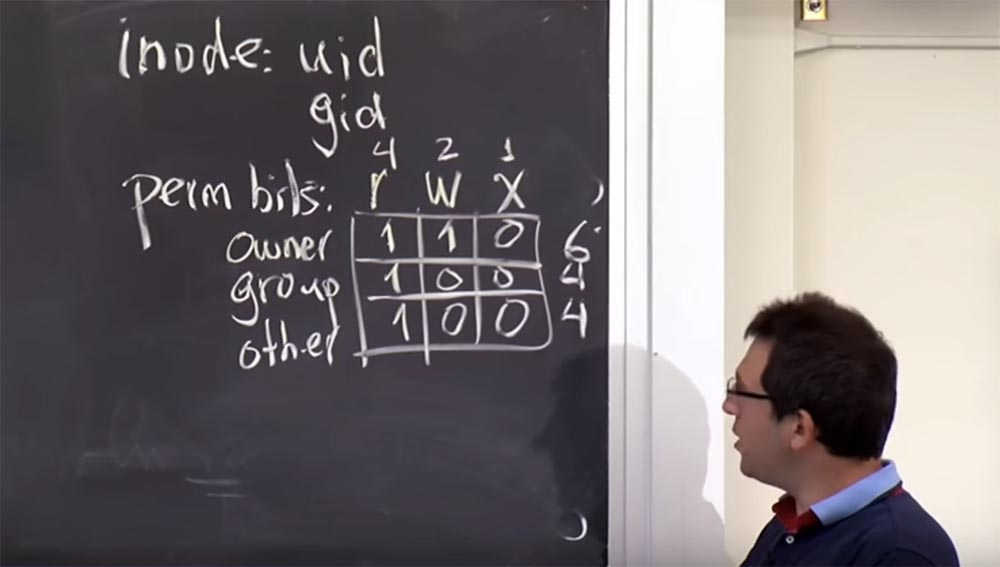

Вы часто будете видеть такие обозначения в материалах лекции, поэтому сможете сказать, что этот файл имеет разрешение 6, 4, 4, то есть владелец может читать и записывать файл, а владелец группы и остальные могут только прочитать его.

Эти обозначения говорят нам, в каких случаях можно прочитать, записывать и выполнять файл. А как насчет изменения разрешения для данного файла? Это не совсем справедливый вопрос, но что вы, ребята, думаете по этому поводу? Как мы должны решить, что кто-то должен иметь возможность изменить эти разрешения, потому что это тоже может понадобиться? Есть какие-то соображения по этому поводу?

**Аудитория:** если у этого человека есть доступ к файлу?

**Профессор:** возможно, это также зависит от привилегий доступа. С другой стороны, можно создать перезаписываемый файл **overwritable**, которым вы хотите с кем-нибудь поделиться, чтобы он мог читать, дописывать и изменять ваш файл, но тогда это также означает, что вы вдруг сможете изменить разрешения, чтобы сделать файл не перезаписываемым или присвоить только себе.

Поэтому создатели Unix решили, что если у вас есть файл, то есть ваш **uid** соответствует **uid**, занесённому в файл, то по умолчанию вы можете изменить разрешения. В противном случае, вы этого не можете. Так что если у вас есть только **gid** и эта **group** имеет все разрешения в файле, вы всё равно не сможете изменить разрешения для этого файла. Вы можете просто прочитать, переписать, выполнить с ним всё, что угодно, но без **uid** вы не сможете изменить разрешения.

Каталоги в Unix следуют тем же правилам. Таким образом, отсоединение **unlink** и связывание записей **link** в каталоге означает наличие разрешения на запись в этот каталог. Если вы хотите переименовать файл, тогда вам, вероятно, нужно иметь права на запись в каталоге, откуда вы его достаёте, и на запись в каталоге, в который вы его помещаете. В некоторых случаях с жёсткими ссылками могут возникать проблемы, и в материалах лекции эти детали освещены.

На самом деле в каталоге есть еще одна интересная операция — поиск. Благодаря ей вы можете просто найти файл в каталоге. Unix кодирует разрешения **execute** как возможность реализации поиска для каталогов, так что иметь разрешение **execute** для каталога фактически означает возможность поиска определенного имени файла. Может быть, что вам и не нужно иметь разрешение на каталог, чтобы искать имя файла, но если у вас нет разрешения на чтение, вы не сможете просмотреть содержимое каталога, то есть разыскать файл. Это полезно в некоторых ситуациях, когда нужно ограничить действия с какими-то файлами или скрыть их от пользователя.

Давайте рассмотрим пример. Что происходит в Unix, если я ввожу команду **open ("/etc/password")**? Что проверяет ядро системы от моего имени, когда я командую ему выполнить системный вызов?

**Аудитория:** оно проверяет, есть ли у вас разрешения на выполнение и т. д.?

**Профессор:** Да, в определенной степени это имеет место. Мне нужно выполнить что-то и т. д.

**Аудитория:** а затем выполнить указанное слешем!

**Профессор:** да, на самом деле мне нужно посмотреть, на что указывает **/etc**? Так что если я не разберусь с разрешениям на **root** – права, это не сработает.

**Аудитория:** тогда вам нужно выполнить чтение **/etc / password**.

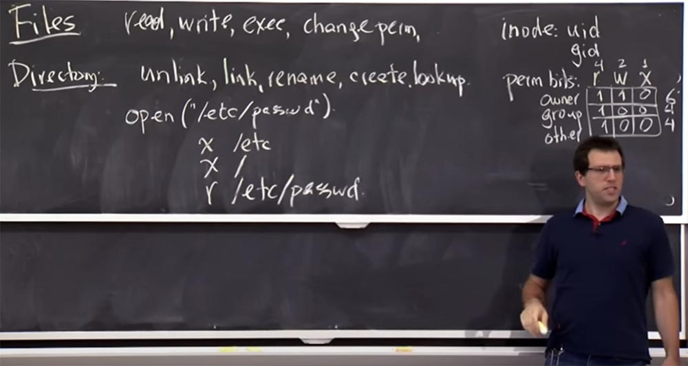

**Профессор:** да, это имеет смысл. Вот вам небольшая головоломка. Предположим, что MIT создает группу для всех людей, связанных с курсом 6.858, и другими группами для всех TAs в MIT, которые в терминологии Unix обозначается как **gids**, но они не входят в группу 6.858 TAs по каким-то глупым причинам. Как мне создать файл, который будет доступен только для группы 6.858 TAs?

Предположим, у меня есть 6.858 gid и TAs gid, но я могу вставить в файл только один **gid**.

**Аудитория:** вы бы не смогли это сделать, потому что здесь у вас может быть TAs, а не 6.858 TAs.

**Профессор:** да, это правда. Хотя в группе 6.858 есть студенты, которые являются TAs других классов, так что, возможно, это не совсем здорово. Но, всё же, давайте попробуем как-то сделать пересечения этих групп. Для этого мы можем использовать механизм разрешений.  
Можно создать файл **/foo/bar/grades**, при этом **foo** владеет, или устанавливает **gid** для группы 6.858 и может сделать его исполняемым только для этой группы. Поэтому, если вы не в этой группе, вы даже не сможете искать файлы в каталоге **/foo**. А затем я бы установил разрешения для **/bar**, который устанавливал бы **gid** для TAs, и так же делал бы это исполняемым для данной группы. Поэтому если вы не можете проследовать по пути этого каталога **/foo/bar/**, то вы не получите доступ к файлу оценок **grades**. Таким образом, мы используем некий механизм изоляции файла.

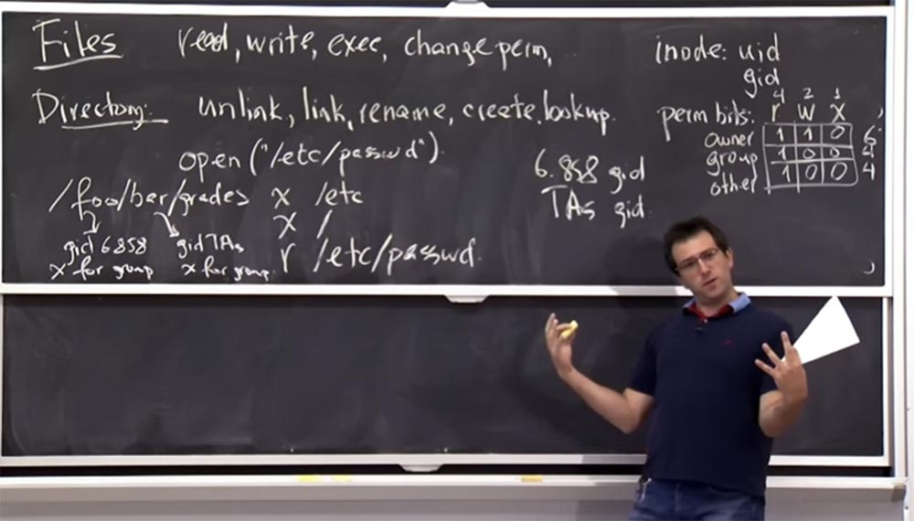

**Аудитория:** если, например, разрешения на сам файл оценок, скажем, были только у 6.858 gid, мог ли TA связать его с каким-то другим каталогом и позволить кому-либо в 6.858 получить к нему доступ?

**Профессор:** да, это верно. Таким образом, вы можете побеспокоиться о других вещах, таких как утечка, поэтому Unix в основном не пытается применить эти виды транзитивных свойств безопасности, что означает, что если один процесс имеет доступ к некоторым данным, или имеет некоторые привилегии, то он может делегировать эти привилегии всем, кому хочет. Существуют другие виды систем, которые называются **MACS** — mandatory accesscontrol systems, системы контроля обязательного доступа. Возможно, мы поговорим о них позже, но в целом они фактически насаждают такое транзитивное свойство: если я дам это тебе, то ты не сможешь дать это другим людям. То есть вы застреваете на одном месте. Это своеобразные путы, так что вы не можете пойти куда-нибудь еще.

В Unix это, как правило, не так, и поэтому TA не смог бы жестко залинковать этот файл из-за другого глупого правила, которое Unix использовал для жесткой ссылки. Она заключается в том, что только владелец файла может жестко связать его с чем-либо ещё. Отчасти это происходит из-за того, что Unix использует квоты, и эти квоты касаются тех, кто владеет файлом. Поэтому, если вы создадите гигантский файл, я могу жестко связать его копию с моим каталогом. Затем вы можете удалить этот файл, но у меня все еще есть его полная копия, и теперь файловая система подумает, что я являюсь его владельцем. Так что в действительности вы не сможете окончательно удалить этот файл, потому что у меня есть на него ссылка. В этом случае налицо неудачное сочетание механизмов Unix.

Но в целом, вы должны беспокоиться о таких вещах, как транзитивность, например, когда кто-то не был ТА, и поэтому мы его удалили. Однако он может где-то спрятать ссылку на файл оценок, поэтому это, возможно, это не идеальный вариант.

Итак, мы кратко рассмотрели всё, что связано с файлами и каталогами в Unix.

Есть вещи, тесно связанные с файлами и каталогами — это файловые дескрипторы. Файловые дескрипторы широко используются в **OKWS**, и в Unix файловый дескриптор представляет собой открытый файл. Проверка безопасности в Unix состоит в том, что в первую очередь при попытке открыть файл проверяется разрешение на доступ к файлу. Как только файл открыт, с этого момента у вас появляется некий «привод» для этого файла, с помощью которого можно выполнить с этим файлом любые операции.

Таким образом, правила доступа к файловому дескриптору таковы: если у вас есть открытый файловый дескриптор в вашем процессе, то вы можете получить к нему доступ. И проверки безопасности не применяется в том смысле, что для получения этого файлового дескриптора вам нужно просто открыть этот файл. Если какой-то процесс передаёт вам файловый дескриптор, или родительский процесс передаёт его дочернему процессу, или передача происходит через сокеты Unix – неважно, как вам удалось получить файловый дескриптор, вы всё равно можете читать и записывать в него все, что хотите, потому что проверки безопасности уже были сделаны при его создании.

Так что на самом деле дескрипторы – это полезная способность Unix предоставить кому-то привилегии, которых они бы не имели в противном случае.

В **OKWS** есть много компонентов, которые нуждаются в доступе к определённому сокету или файлу. И один из способов реализовать это, не давая им прямого доступа к чтению и записи это файла в файловой системе, состоит в том, что кто-то другой открыл файл, создал файловый дескриптор и затем передал его в этот дополнительный компонент. Таким образом, вы сможете точно сказать, что это единственный файловый дескриптор, который у вас когда-либо будет. И больше никто не сможет попробовать что-либо сделать в файловой системе, что может привести к опасным последствиям.

На самом деле, у дескриптора довольно простые правила. Если у вас есть файловый дескриптор, вы можете делать с ним все, что захотите.

А как насчет процессов? Какие там действуют правила? Что вы можете сделать с процессом? В Unix это довольно просто. Вы можете создать процесс, можете его убить, можете отладить – для это в Unix есть механизм, который называется **ptrace**.

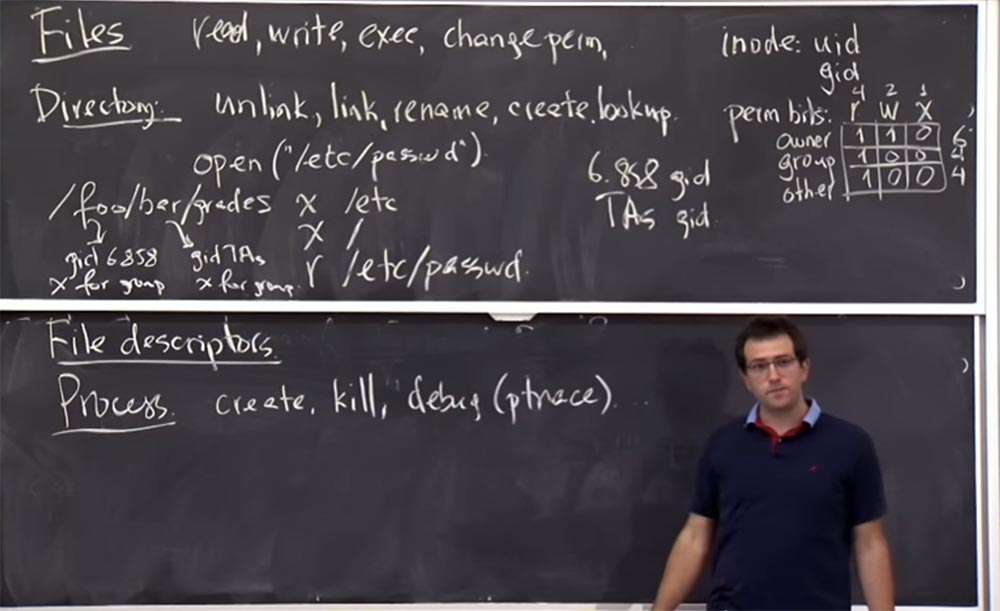

И правила относительно просты. Таким образом, вы всегда можете создать процесс, за исключением того, что дочерний процесс получит тот же идентификатор пользователя, что и вы, поэтому вы не сможете создать процесс с другим идентификатором пользователя по умолчанию. Так что вы не можете создать, например, процесс **web**, используя **gid** для одного из TAs, ядро операционной системы просто не позволит вам это сделать.

Если вы хотите убить процесс, вы в основном должны иметь тот же идентификатор пользователя, что и этот процесс. Все вещи с одним **userid** изолированы от вещей с другими идентификаторами пользователя. То же самое правило относится и к **ptrace** — процесс с этим же **uid** может отлаживать процессы с тем же **uid**.

На самом деле в механизме **ptrace** в Linux возникали некоторые интересные ошибки. Например, если вы выполнили отладку процесса, а затем он переключился и получил больше привилегий, то вы могли бы каким-то образом обмануть ядро, чтобы сохранить за собой отладочную привилегию для этого процесса, даже после того, как он стал более привилегированным. Затем вы смогли бы проделать что-то с его памятью и захватить его себе. Но в любом случае базовый принцип работы системы состоит в том, что взаимодействовать друг с другом могут только процессы с одинаковым ID.

27:50 мин

Продолжение:

[Курс MIT «Безопасность компьютерных систем». Лекция 4: «Разделение привилегий», часть 2](https://habr.com/company/ua-hosting/blog/418197/)

Полная версия курса доступна [здесь](https://ocw.mit.edu/courses/electrical-engineering-and-computer-science/6-858-computer-systems-security-fall-2014/).

Спасибо, что остаётесь с нами. Вам нравятся наши статьи? Хотите видеть больше интересных материалов? Поддержите нас оформив заказ или порекомендовав знакомым, **30% скидка для пользователей Хабра на уникальный аналог entry-level серверов, который был придуман нами для Вас:** [Вся правда о VPS (KVM) E5-2650 v4 (6 Cores) 10GB DDR4 240GB SSD 1Gbps от $20 или как правильно делить сервер?](https://habr.com/company/ua-hosting/blog/347386/) (доступны варианты с RAID1 и RAID10, до 24 ядер и до 40GB DDR4).

**Dell R730xd в 2 раза дешевле?** Только у нас **[2 х Intel Dodeca-Core Xeon E5-2650v4 128GB DDR4 6x480GB SSD 1Gbps 100 ТВ от $249](https://ua-hosting.company/serversnl) в Нидерландах и США!** Читайте о том [Как построить инфраструктуру корп. класса c применением серверов Dell R730xd Е5-2650 v4 стоимостью 9000 евро за копейки?](https://habr.com/company/ua-hosting/blog/329618/)