Курс MIT «Безопасность компьютерных систем». Лекция 4: «Разделение привилегий», часть 2 / Блог компании ua-hosting.company

### Массачусетский Технологический институт. Курс лекций #6.858. «Безопасность компьютерных систем». Николай Зельдович, Джеймс Микенс. 2014 год

Computer Systems Security — это курс о разработке и внедрении защищенных компьютерных систем. Лекции охватывают модели угроз, атаки, которые ставят под угрозу безопасность, и методы обеспечения безопасности на основе последних научных работ. Темы включают в себя безопасность операционной системы (ОС), возможности, управление потоками информации, языковую безопасность, сетевые протоколы, аппаратную защиту и безопасность в веб-приложениях.

Лекция 1: «Вступление: модели угроз» [Часть 1](https://habr.com/company/ua-hosting/blog/354874/) / [Часть 2](https://habr.com/company/ua-hosting/blog/354894/) / [Часть 3](https://habr.com/company/ua-hosting/blog/354896/)  
Лекция 2: «Контроль хакерских атак» [Часть 1](https://habr.com/company/ua-hosting/blog/414505/) / [Часть 2](https://habr.com/company/ua-hosting/blog/416047/) / [Часть 3](https://habr.com/company/ua-hosting/blog/416727/)  
Лекция 3: «Переполнение буфера: эксплойты и защита» [Часть 1](https://habr.com/company/ua-hosting/blog/416839/) / [Часть 2](https://habr.com/company/ua-hosting/blog/418093/) / [Часть 3](https://habr.com/company/ua-hosting/blog/418099/)  
Лекция 4: «Разделение привилегий» [Часть 1](https://habr.com/company/ua-hosting/blog/418195/) / [Часть 2](https://habr.com/company/ua-hosting/blog/418197/) / [Часть 3](https://habr.com/company/ua-hosting/blog/418211/)

Итак, что еще у нас было в этом списке? Процессы. Память представляет собой нечто, происходящее одновременно с процессом. Таким образом, если вы не находитесь в этом процессе, то не можете получить доступ к его памяти. Виртуальная память прекрасно усиливает для нас эту изоляцию. Кроме того, механизм отладки позволяет вам «всунуться» в память другого процесса, если у вас есть тот же идентификатор пользователя

Далее у нас идут сети. Сети в **Unix** не совсем соответствуют описанной выше модели, отчасти из-за того, что сначала была разработана операционная система **Unix**, а затем уже появилась сеть, которая вскоре стала популярной. Она имеет несколько иной набор правил. Поэтому операциями, о которых мы действительно должны позаботиться, являются подключение кого-либо к сети, если вы распоряжаетесь сетью, или прослушивание какого-то порта, если вы выступаете в роли сервера. Возможно, вам понадобиться считывать или записывать данные в этом соединении или отправлять и принимать **raw**-пакеты.

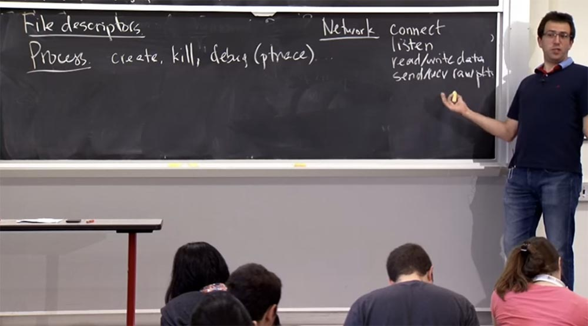

Таким образом, cети в **Unix** в основном не имеют отношения к **userid**. Правила состоят в том, что любой человек может всегда соединяться с любой машиной или любым IP-адресом или открыть соединение. Если вы хотите прослушивать порт, то в этом случае появляется одно различие, которое заключается в том, что большинству пользователей запрещено прослушивать порты с номером ниже «магического значения» 1024. В принципе, вы можете прослушивать и такие порты, но в этом случае вы должны быть специальным пользователем под названием **«super user»**, имеющим **uid = 0**.

И вообще, в Unix есть понятие администратора, или суперпользователя, которое представлено идентификатором uid = 0, который может обойти почти все эти проверки, поэтому, если вы работаете с root -правами, то можете читать и записывать файлы, изменять права доступа к ним. Операционная система позволит вам сделать это, потому что думает, что вы должны иметь все привилегии. И такие привилегии вам действительно нужны для прослушивания портов с номером < 1024. Что вы думаете по поводу такого странного ограничения?

**Аудитория:** оно определяет конкретные номера портов для определённых соединений, например, для **http** на 80 порте.

**Профессор:** да, по умолчанию протокол **HTTP** использует порт 80\. С другой стороны, другие службы могут использовать порты с номером выше 1024, зачем же нужно это ограничение? В чём тут польза?

**Аудитория:** потому что вы не хотите, чтобы кто-то мог случайно прослушать ваш **HTTP**.

**Профессор:** да. Я думаю, причина этого в том, что раньше у вас было много пользователей на одной машине. Они совершали вход под своими логинами, запускали свои приложения, поэтому вы хотели убедиться, что какой-то случайный пользователь, зайдя в компьютер, не сможет завладеть запущенным на нём веб-сервером. Потому что пользователи, подключающиеся извне, не знают, кто работает на этом порте, и они просто соединяются с портом 80\. Если же я хочу войти в эту машину и запустить свой собственный веб-сервер, то я просто переведу весь трафик веб-сервера на эту машину. Наверное, это не очень хороший план, однако он является способом, благодаря которому сетевая подсистема Unix не позволяет случайным пользователям контролировать известные сервисы, работающие на этих низких номерах портов. Вот в чём состоит обоснование такого ограничения.

Кроме того, с точки зрения чтения и записи данных о соединении, если у вас есть файл-дескриптор для конкретного сокета, то **Unix** позволит вам читать и записывать любые данные в этом соединении **TCP** или **uTP**. В деле отправки **raw**-пакетов **Unix** ведёт себя как параноик, поэтому он не позволит вам отправлять произвольные пакеты по сети. Это должно быть внутри контекста специального соединения, за исключением случаев, когда у вас есть **root**–права и вам можно делать всё, что вы захотите.

Итак, один интересный вопрос, который вы могли бы задать — откуда берутся все эти **userid**?

Мы говорим о процессах, имеющих **userid** или **groupid**. Когда вы запускаете **PS** на вашем компьютере, вы обязательно увидите серии процессов с различными значениями **uid**. Откуда же они взялись?

Нам нужен какой-то механизм для загрузки всех этих значений **userid**. В **Unix** имеется несколько системных вызовов, предназначенных для этого. Поэтому для начальной загрузки этих значений идентификаторов существует функция под названием **setuid (uid)**, так что вы можете присвоить номер **uid** какого-то текущего процесса этой величине. На самом деле это опасная операция, как и всё остальное в традициях **Unix**, потому что вы можете проделать это, только если ваш **uid = 0**. Во всяком случае, так должно быть.

Таким образом, если вы являетесь пользователем с root-правами и имеете **uid = 0**, то вы можете вызвать **setuid (uid)** и переключить пользователя на любой процесс. Есть пара других подобных системных вызовов для инициализации **gid**, связанных с процессом: это **setgid** и **setgroups**. Поэтому эти системные вызовы позволяют настроить привилегии процесса.

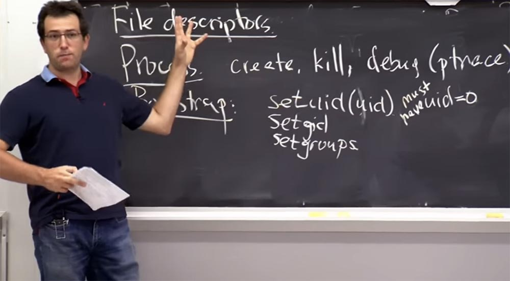

То, что ваши процессы получают правильные права доступа, когда вы входите в систему на машине **Unix**, происходит не потому, что вы имеете тот же **ID**, что и процессы, ведь система ещё не знает, кто вы. Вместо этого в **Unix** имеется некий вид процедуры входа в систему, когда протокол безопасной оболочки **SSH** запускает процесс для любого, кто подключается к компьютеру, и пытается выполнить проверку подлинности пользователя.

Таким образом, изначально этот процесс входа в систему запускается с **uid = 0** как для пользователя с root-правами, а затем, когда получает конкретное имя пользователя и пароль, он проверяет их в собственной базе данных учетных записей. Как правило, в **Unix** эти данные хранятся в двух файлах: **/etc/password** (по историческим причинам в этом файле пароли больше не хранятся), и в файле **/etc /shadow**, в котором хранятся пароли. Однако в файле **/etc/password** есть таблица, отображающая каждое имя пользователя в системе в виде целочисленного значения.

Таким образом, ваше имя пользователя сопоставляется с определенным целым числом в этом файле **/etc/password**, и тогда процесс входа проверяет, верен ли ваш пароль согласно этому файлу. Если он найдет ваш целочисленный **uid**, то затем установит функции **setuid** это значение **uid** и запустит оболочку командой **exec (/bin/sh)**. Теперь вы можете взаимодействовать с оболочкой, но она работает под вашим **uid**, поэтому вы не сможете нанести случайное повреждение этой машине.

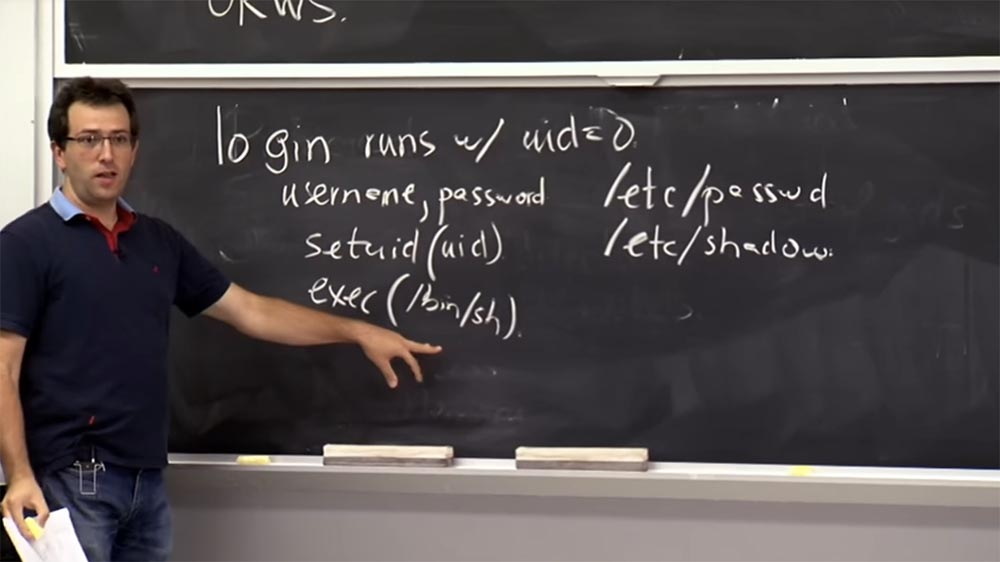

**Аудитория:** можно ли начать новый процесс с **uid = 0**, если ваш **uid** в действительности не равен 0?

**Профессор:** если у вас есть root-права, вы можете ограничить себя другим **uid**, понизить свои полномочия, но в любом случае вы сможете создать процесс только с таким же **uid**, как у вас. Но бывает, что по разным причинам вы хотите повысить свои привилегии. Предположим, вам нужно установить пакет, для чего вам понадобятся привилегии **root**.

В **Unix** имеется два способа установки привилегий. Один мы уже упоминали, это файловый дескриптор. Так что если вы действительно хотите повысить свои привилегии, то можете поговорить с кем-то, кто работает под root-правами, и попросить его открыть для вас этот файл. Или вам нужно установить какой-то новый интерфейс, тогда этот помощник открывает вам файл и возвращает вам файловый дескриптор с помощью передачи **fd**. Это один из способов повысить ваши привилегии, но это неудобно, потому что в некоторых случаях имеются процессы, выполняющиеся с большим количеством привилегий. Для этого **Unix** имеет умный, но в то же время проблемный механизм под названием **«setuid binaries»**. Этот механизм представляет собой обычные исполняемые файлы в файловой системе **Unix**, за исключением того, когда при запуске вы выполняете **exec** на двоичном файле **setuid**, например, **/bin/su** на большинстве машин, или **sudo**.

В типичной системе **Unix** есть куча двоичных файлов **setuid**. Разница в том, что когда вы выполняете один из этих двоичных файлов, он фактически переключает **userid** процесса на владельца этого двоичного файла. Этот механизм кажется странным, когда вы впервые его видите. Как правило, способы его использования заключаются в том, что этот «бинарник» скорее всего имеет **uid** владельца, равный 0, потому что вы действительно хотите восстановить множество привилегий.

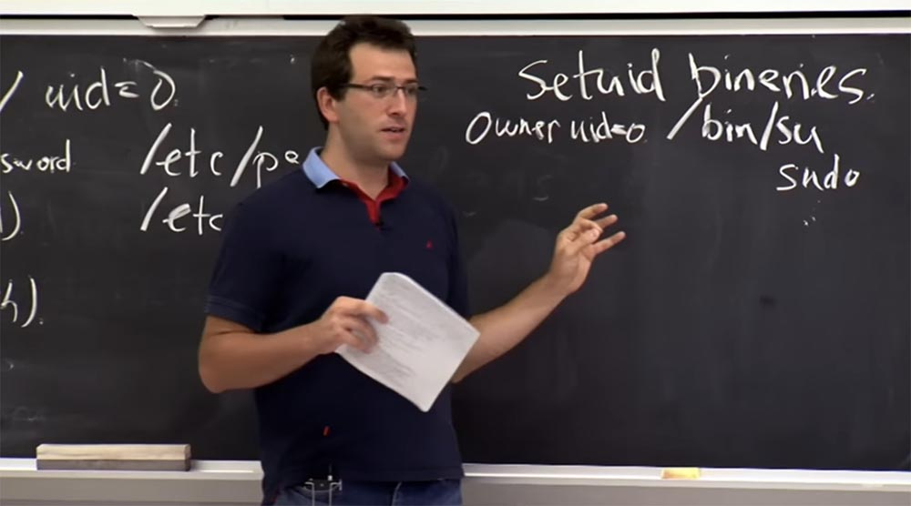

Вы хотите восстановить права суперпользователя, чтобы вы могли запустить эту команду **su**, и ядро, когда вы выполняете этот двоичный файл, переключит **uid** процесса на 0, так что эта программа теперь будет выполнять некоторые привилегированные вещи.

**Аудитория:** если у вас есть **uid = 0**, и вы изменяете **uid** всех этих двоичных файлов **setuid** на что-то не равное 0, сможете ли вы восстановить свои привилегии?

**Профессор:** нет, многие процессы не смогут восстановить привилегии при понижении уровня доступа, так что, возможно, вы застрянете в этом месте. Этот механизм не привязан к **uid = 0**. Как любой пользователь системы **Unix**, вы можете создать любой двоичный файл, построить программу, скомпилировать её и установить этот бит **setuid** в саму программу. Она принадлежит вам, пользователю, вашему идентификатору пользователя. И это означает, что любой, кто выполняет вашу программу, будет запускать этот код с вашим идентификатором пользователя. В этом есть какая-то проблема? Что нужно сделать?

**Аудитория:** то есть если в вашем приложении была ошибка, кто-то смог бы сделать с ней что угодно, действуя с вашими привилегиями?

**Профессор:** правильно, так бывает, если мое приложение «глючит», или если оно позволяет запускать всё, что вы хотите. Предположим, я мог бы скопировать системную оболочку и сделать её **setuid** для меня, но тогда любой может запустить эту оболочку под моим аккаунтом. Это, вероятно, не лучший план действий. Но такой механизм не создаёт проблемы, потому что единственный человек, который может установить бит **setuid** на двоичном файле, является владельцем этого файла. Вы, как владелец файла, имеете привилегию **uid**, поэтому можете передать свой аккаунт другому человеку, но этот другой человек не сможет создать двоичный файл **setuid** с вашим **userid**.

Этот бит setuid хранится рядом с этими битами разрешений, то есть в каждом **inode** присутствует также бит **setuid**, который говорит, должен ли этот исполняемый файл или эта программа переключился при исполнении на **uid** владельца.

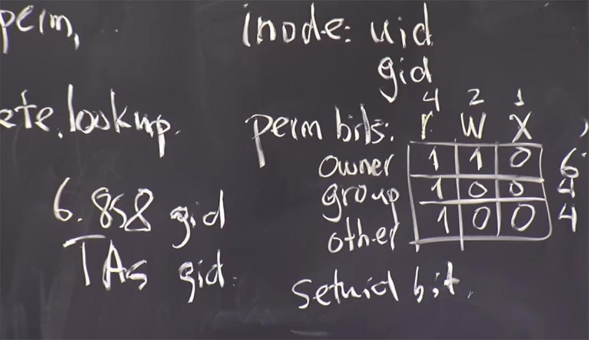

Оказывается, что это очень хитрый механизм при правильном использовании, и благодаря ему ядро реализует программу правильно. На самом деле это довольно легко сделать, потому что выполняется всего одна проверка: если этот бит **setuid** существует, то процесс переключается на **uid**. Это довольно просто.

Но пользоваться им безопасно достаточно сложно, потому что, как было только что указано, если эта программа содержит ошибки или сделает что-то неожиданное, то вы получаете способность делать сделать произвольные вещи под **uid = 0** или под любым другим **uid**. В **Unix** при выполнении программы вы наследуете много вещей от вашего родительского процесса.

Например, можно передать переменные среды двоичным файлам **setuid**. Дело в том, что в **Unix** вы можете указать, какую общую библиотеку следует использовать для процесса установкой переменной среды, причем двоичные файлы **setuid** не заботятся о фильтрации этих переменных сред.

Например, вы можете запустить **bin/su**, но, при этом использовать общие библиотеки для функции **printf**, поэтому ваш **printf** запустится, когда **bin/su** распечатает что-то, и вы сможете запустить оболочку вместо выполнения **printf**.

Существует много тонкостей, которые вы должны понимать правильно относительно недоверия программы к данным, которые вводит пользователь. Поскольку обычно вы доверяете пользовательскому вводу данных, механизм **setuid** никогда не был самой безопасной частью всей системы **Unix**. Есть вопросы по этому поводу?

**Аудитория:** **setuid** также применяется к группам или только к пользователю?

**Профессор:** существует бит **setgid**, симметричный биту **setuid**, который вы тоже можете установить. Если файл имеет определенный **gid** и этот бит **setgid** установлен при запуске программы, то вы его получите.

**Setgid** не особо используется, но может быть полезен в случаях, когда вы хотите предоставить очень специфические привилегии. Например, в **bin/su**, вероятно, требуется много привилегий, но может есть какая-то программа, которой нужно немного дополнительных привилегий, например, чтобы написать что-то в специальный файл журнала. Поэтому вы, вероятно, захотите предоставить ей некую группу и создать для неё лог-файл, доступный для записи этой группой. Так что даже если программа «глючит», то вы не потеряете ничего, кроме этой группы. Это полезно как механизм, который почему-то используется не слишком часто, потому что всё-таки люди должны больше использовать root-права.

**Аудитория:** существуют ли ограничения того, кто может изменить доступ?

**Профессор:** да. Разные реализации **Unix** имеют разные проверки для этого. Общее правило состоит в том, что только root может изменить владельца файла, потому что вы не хотите создавать файлы, которые будут принадлежать кому-то другому, и вы, конечно, не захотите присваивать себе чужие файлы. Поэтому если ваш **uid** не равен 0, то вы застряли. Вы не сможете изменить владельца какого-либо файла. Если ваш **uid = 0**, у вас есть root-права и вы можете изменить владельца на кого угодно. Есть некоторые осложнения, если у вас есть бинарный **setuid** и вы переключаетесь с одного **uid** на другой, это довольно хитро, но в основном вы в принципе не можете изменить владельца файла, если не обладаете root-правами.

По общему мнению, это немного устаревшая система. Вы могли бы, вероятно, представить себе множество способов, упрощающих описанные выше процессы, но на самом деле, большинство совершенных систем выглядят так, потому что они развиваются со временем. Зато вы прекрасно можете использовать эти механизмы в качестве «песочницы».

Это просто своего рода основные принципы **Unix**, которые проявляются почти в каждой Unix-подобной операционной системе: в **Мак ОС Х**, **Linux**, **FreeBSD**, в **Solaris**, если кто-то ещё им пользуется, и так далее. Но в каждой из этих систем есть более сложные механизмы, которые вы могли бы использовать. Например, в **Linux** есть «песочница» **set COMP**, **Mac OS X** использует «песочницу» **Seatbelt**. На следующей неделе я приведу вам примеры «песочниц», имеющихся в каждой системе на основе **Unix**.

Итак, один из последних механизмов, который мы рассмотрим перед погружением в **OKWS**, объясняет то, как вам нужно поступать с двоичными файлами **setuid** и показывает, как можно защититься от существующих «дыр» в безопасности. Проблема состоит в том, что у вас неизбежно будут некоторые двоичные файлы **setuid** в вашей системе, такие как **/bin/su**, или **sudo**, или ещё что-то, и, вероятно, что в ваших программах будут ошибки. Из-за этого кто-то сможет выполнить двоичный файл **setuid** и процесс сможет получить доступ **root**, чего вы не хотите допускать.

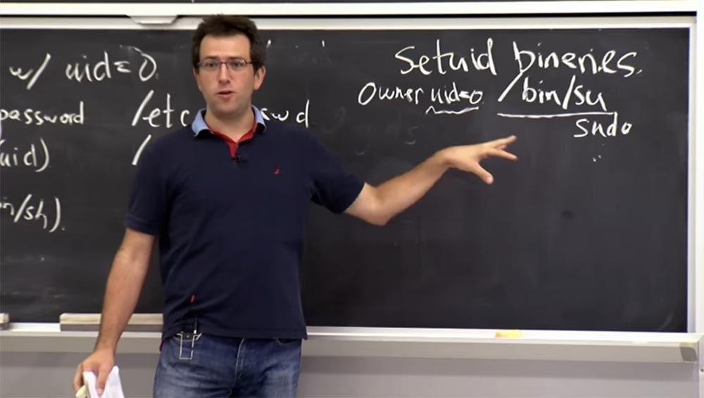

Механизм **Unix**, который часто используется для предотвращения выполнения потенциально вредоносного процесса с применением двоичных файлов **setuid**, заключается в использовании пространства имён файловой системы для его изменения с помощью системного вызова **chroot** – операции изменения корневого каталога. **OKWS**, являясь веб-сервером, специализирующимся на создании быстрых и безопасных веб-сервисов, использует это довольно широко.

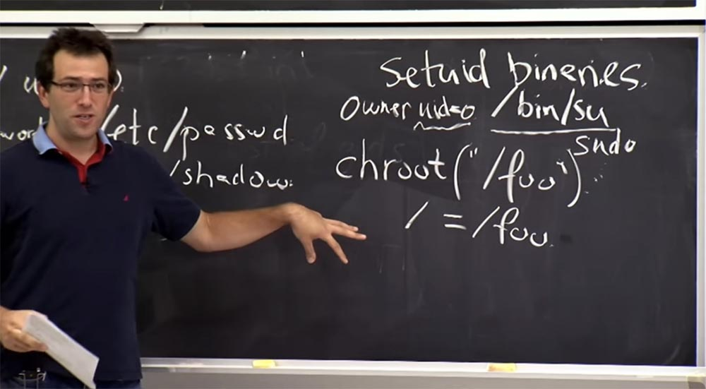

Итак, в **Unix** вы можете выполнить **chroot** в определенном каталоге, так что, возможно, вы сможете выполнить и **chroot ("/foo")**.

Существует 2 объяснения тому, что делает **chroot**. Первый — просто интуитивный, он означает, что после запуска **chroot**, корневой каталог или каталог, расположенный за слешем, в основном эквивалентен тому, что использовало **/foo** до того, как вы вызвали **chroot**. Это выглядит как ограничение пространства имён ниже вашего **/foo**. Поэтому, если у вас есть файл, который раньше назывался **/foo/x**, то после вызова **chroot** вы сможете получить этот файл, просто открыв **/x**. Поэтому просто ограничьте свое пространство имен до подкаталога. Вот что является интуитивной версией.

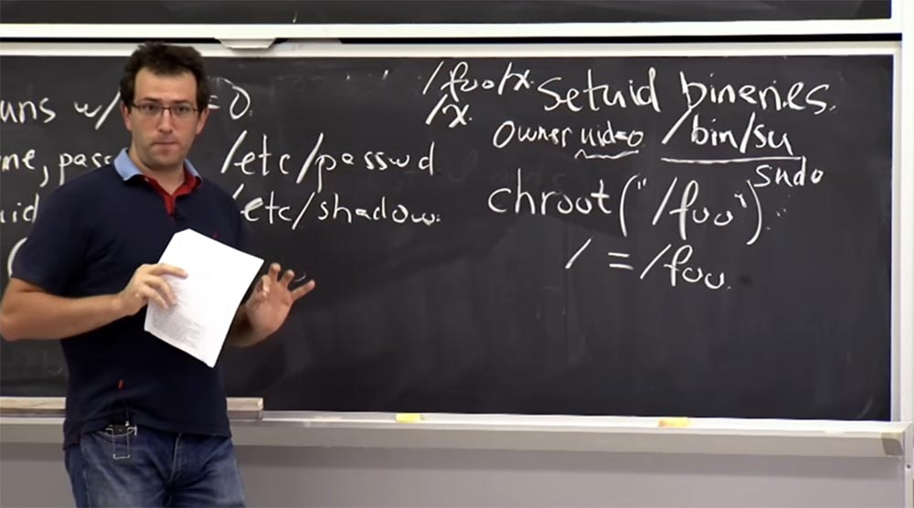

Конечно, в безопасности важна не интуитивная версия, а то, что именно ядро делает с этим системным вызовом? А оно выполняет в основном две вещи. Во-первых, оно меняет значение этого слеша, поэтому всякий раз, когда вы получаете доступ или когда вы начинаете имя каталога со слэша, ядро подключает любой файл, который вы предоставили операции **chroot**. В нашем примере это файл **/foo** до того, как вы вызвали **chroot**, то есть у нас получится, что **/ = /foo**.

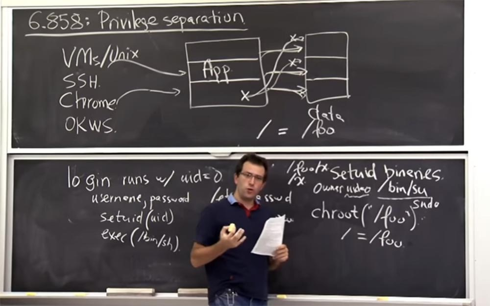

Следующее, что попытается сделать ядро – это защитить вас от возможности «сбежать» из вашего **/**, если вы делаете **/../**. Потому что в **Unix** я мог бы попросить, вас, дать мне, например, **/../etc/password**. Так что если бы я просто дополнил эту строку так: **/foo/../etc/password**, это было бы не хорошо, потому что я мог бы просто выйти из **/foo** и перейти к получению **/etc/password**.

Ввторой вещью, которую ядро проделывает с системным вызовом в **Unix**, является то, что когда вы вызываете **chroot** для этого конкретного процесса, оно изменяет способ оценки **/../** в этом каталоге. Поэтому оно изменяет **/../** так, чтобы **/foo** указывало само на себя. Таким образом, это не позволяет вам «совершить побег», причём это изменение относится только к данному процессу и не затрагивает остальные. Какие у вас имеются идеи по поводу того, как «сбежать» из среды **chroot**, используя то, как она реализована?

Интересно, что ядро отслеживает только один каталог **chroot**, так что, возможно, вы могли бы выполнить операцию **chroot = (/foo)**, но оказались бы «приклеенными» к этому месту. Итак, вы хотите получить **/etc/password**, но как это сделать? Вы можете открыть корневой каталог прямо сейчас, набрав **open (*/*)**. Это даст вам файловый дескриптор, описывающий, что такое **/foo**. Затем вы можете вызвать **chroot** ещё раз и выполнить **chroot (`/bar)**.

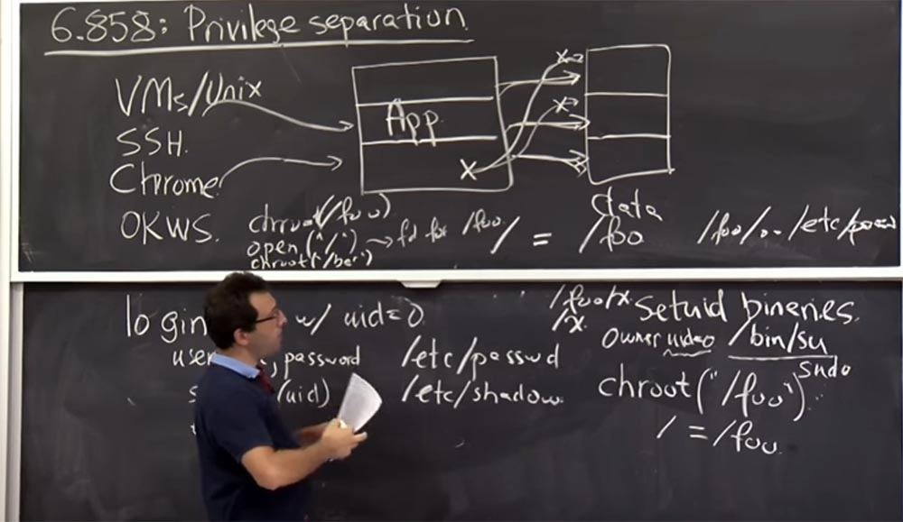

Так, теперь ядро меняет план: **root** больше не **/foo**, а **/foo/bar** и эта **/../** переадресация применима только к **/foo / bar/..**

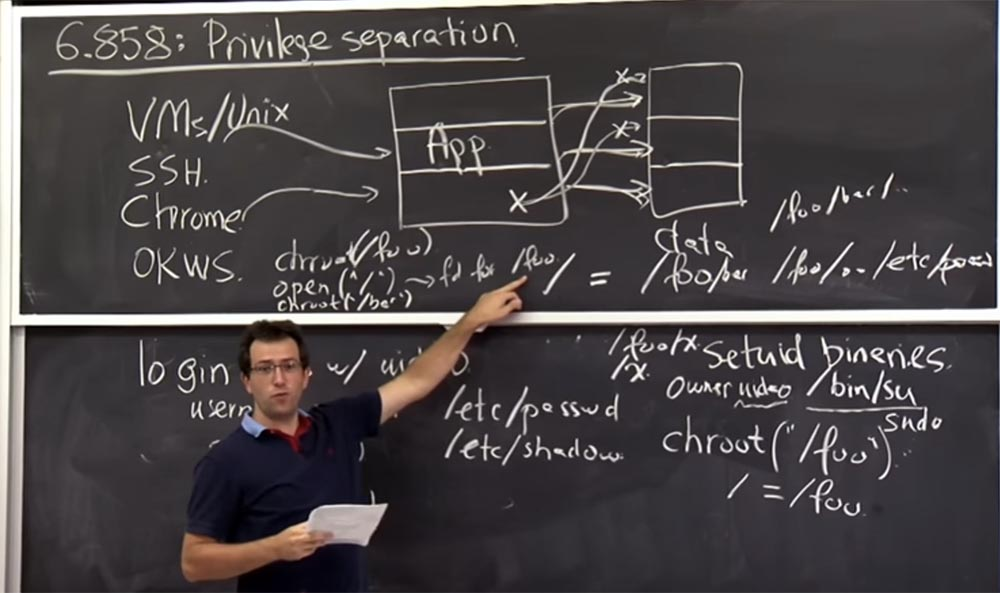

Но знайте, что у вас все ещё есть файловый дескриптор для **/foo**. Так что теперь вы можете изменить каталоги в этом файловом дескрипторе **fchdir (fd)** для этого открытого вызова **(*/*)**, и теперь вы можете получить **chdir (..)**.

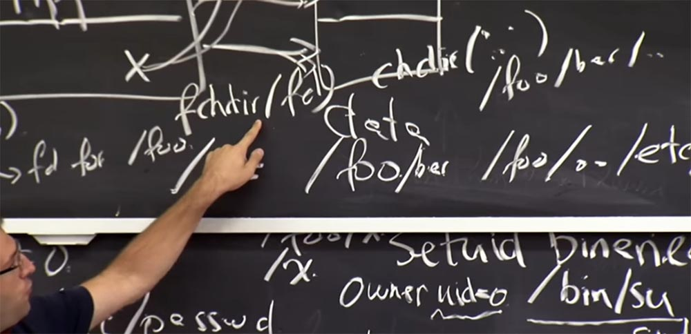

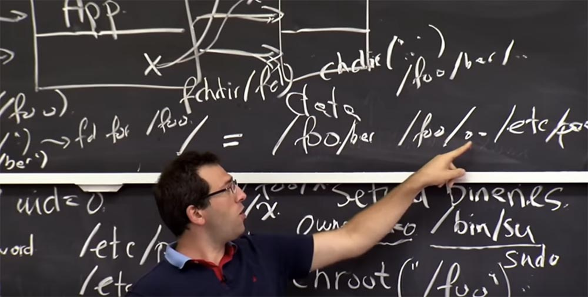

То есть сначала вы были в **/foo**, а теперь идете в **/../**. Он больше не заставляет **/foo** указывать на самого себя и не возвращается назад, потому что у вас есть другой **root**, так что теперь вы можете отсюда сбежать.

Возможно, это хорошая иллюстрация того, почему точный механизм реализации имеет большое значение. В этом смысле это не интуитивное объяснение. Поэтому в **Unix** только пользователь с root-правами может вызывать **chroot**, иначе **chroot** был бы довольно бессмысленным делом. Таким образом, в **Unix** вы должны иметь **uid = 0** для того, чтобы выполнить над процессом операцию **chroot**. Это немного разочаровывает. Потому что если вы хотите построить систему с действительно разделёнными привилегиями, где каждый бы имел только минимальный набор необходимых привилегий, вам нужно использовать **chroot**, создать новые **userid** и так далее. Но для того, чтобы сделать это в **Unix**, у вас должен быть процесс, работающий от имени **root**, который имеет много привилегий.

Так что это пример немного неудачного компромисса, но это, вероятно, наиболее разумный способ дизайна системы. Один из способов настроить среду **chroot** без создания большого количества копий файлов — это создание каталога с жёсткими ссылками. Это довольно удачное решение.

**Аудитория:** а что, если программа постепенно генерирует индексные дескрипторы **inod**, но не дает вам файловый дескриптор?

**Профессор:** это деталь огромной важности! Вы можете получить доступ к файлу только следуя по пути его имени в каталоге, а не, например, сказав: «я хочу открыть **inode** номер 23», потому что это может быть какой-то странный файл вообще за пределами вашей среды **сhroot**. Таким образом, в **Unix** вы не можете открыть **inode** по номеру **inode**, если вы, конечно, не наделены root-правами.

Я думаю, что у нас есть достаточно машин, чтобы увидеть, как работает **OKWS**. Вкратце рассмотрим, чего стоит опасаться при работе **OKWS**.

Альтернативная конструкция, которой следует практически каждый веб-сервер, состоит в том, что у вас могут быть веб-браузеры в Интернете, которые собираются подключиться к вашему серверу. А внутри вашего сервера в основном будет протекать один процесс, скажем, **httpd**, например, на **Apache**.

И это процесс будет работать как один **userid** под именем **www** в **/etc/password**. Он принимает все ваши соединения, выполняет все процессы, в том числе обработку **SSL**, включая выполнение кода приложения и **PHP** и так далее, это всё части одного и того же процесса. И если нужно, этот процесс подключается к серверу базы данных, возможно, **MySQL**, который может работать на той же машине или в другом месте. И этот процесс **MySQL** фактически записывает данные на диск. Но чтобы подключиться к этому **MySQL**, вы, вероятно, должны предоставить имя пользователя и пароль.

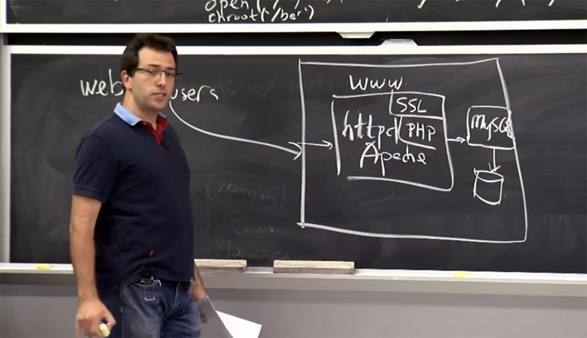

Но, как правило, приложения написаны таким образом, что на сервере **MySQL** есть один общий аккаунт, для которого приложение знает имя пользователя и пароль, поэтому вы просто подключаетесь к нему и получаете доступ ко всем вашим данным.

Так что это решение очень удобно для написания программы, потому что вы просто пишете любой код, который хотите, и имеете доступ к любым данным в базе данных, которые вам нужны. Там нет реальной изоляции, но у него существуют проблемы безопасности, возможно, связанные с ошибками в **Apache**, или в **SSL**, или, может быть, в коде приложения или в интерпретаторе **PHP**. А раз есть ошибки, значит, вы можете ими воспользоваться, чтобы получить все содержимое приложения.

52:30 мин

Продолжение:

[Курс MIT «Безопасность компьютерных систем». Лекция 4: «Разделение привилегий», часть 2](https://habr.com/company/ua-hosting/blog/418197/)

Полная версия курса доступна [здесь](https://ocw.mit.edu/courses/electrical-engineering-and-computer-science/6-858-computer-systems-security-fall-2014/).

Спасибо, что остаётесь с нами. Вам нравятся наши статьи? Хотите видеть больше интересных материалов? Поддержите нас оформив заказ или порекомендовав знакомым, **30% скидка для пользователей Хабра на уникальный аналог entry-level серверов, который был придуман нами для Вас:** [Вся правда о VPS (KVM) E5-2650 v4 (6 Cores) 10GB DDR4 240GB SSD 1Gbps от $20 или как правильно делить сервер?](https://habr.com/company/ua-hosting/blog/347386/) (доступны варианты с RAID1 и RAID10, до 24 ядер и до 40GB DDR4).

**Dell R730xd в 2 раза дешевле?** Только у нас **[2 х Intel Dodeca-Core Xeon E5-2650v4 128GB DDR4 6x480GB SSD 1Gbps 100 ТВ от $249](https://ua-hosting.company/serversnl) в Нидерландах и США!** Читайте о том [Как построить инфраструктуру корп. класса c применением серверов Dell R730xd Е5-2650 v4 стоимостью 9000 евро за копейки?](https://habr.com/company/ua-hosting/blog/329618/)