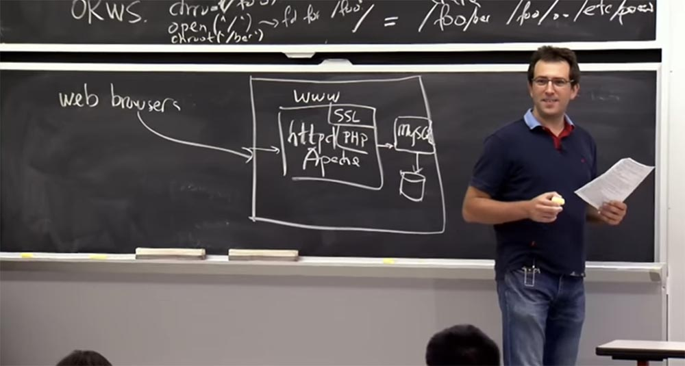
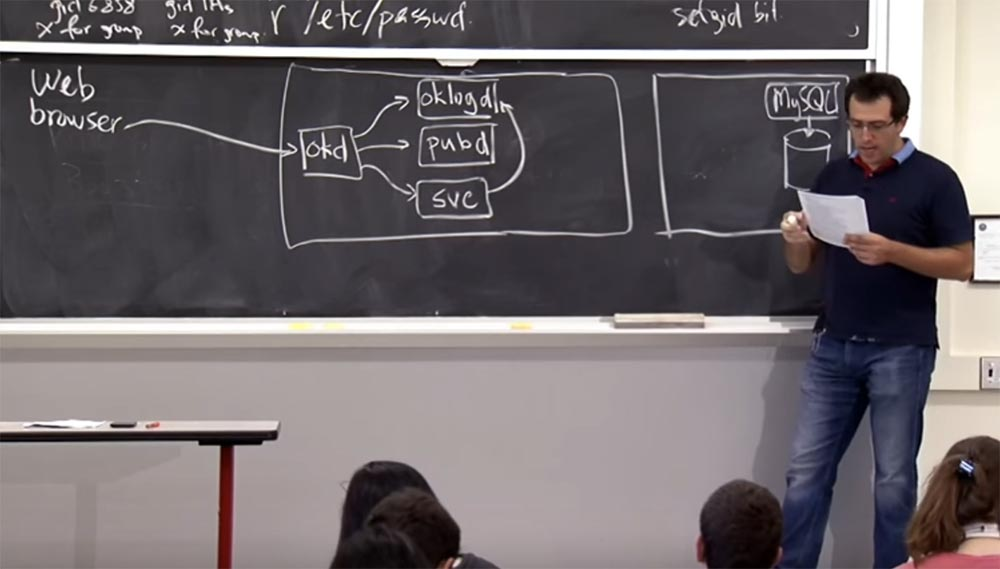
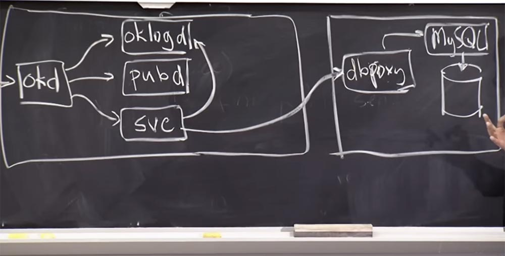
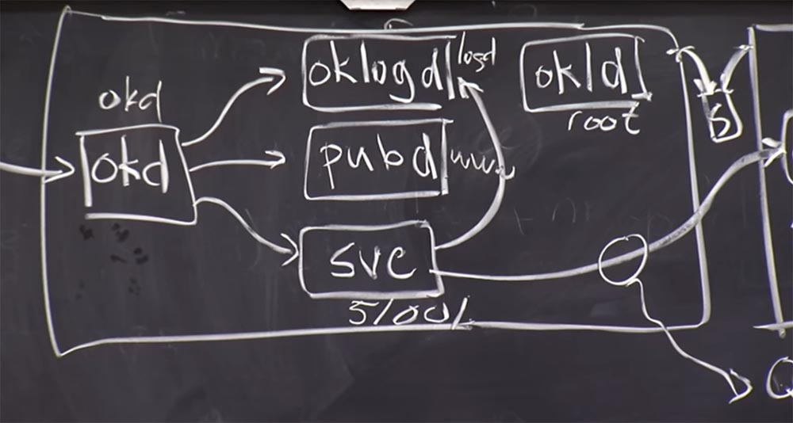
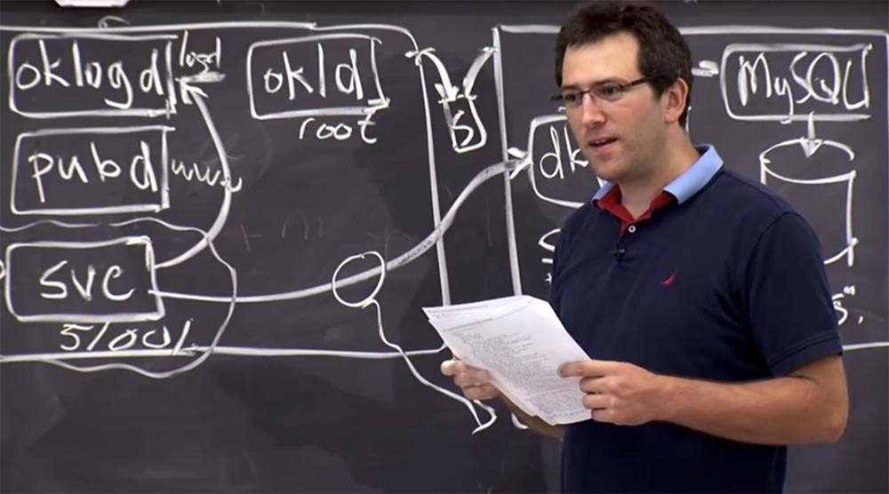
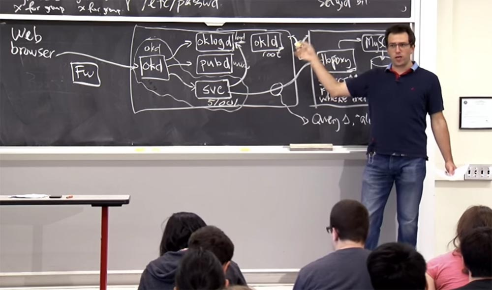
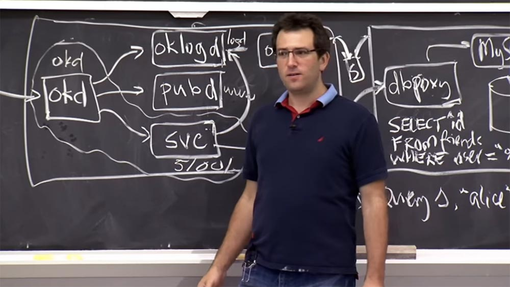
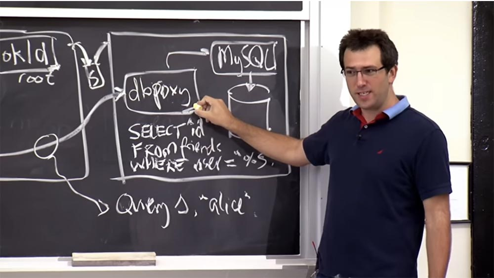

Курс MIT «Безопасность компьютерных систем». Лекция 4: «Разделение привилегий», часть 3 / Блог компании ua-hosting.company

### Массачусетский Технологический институт. Курс лекций #6.858. «Безопасность компьютерных систем». Николай Зельдович, Джеймс Микенс. 2014 год

Computer Systems Security — это курс о разработке и внедрении защищенных компьютерных систем. Лекции охватывают модели угроз, атаки, которые ставят под угрозу безопасность, и методы обеспечения безопасности на основе последних научных работ. Темы включают в себя безопасность операционной системы (ОС), возможности, управление потоками информации, языковую безопасность, сетевые протоколы, аппаратную защиту и безопасность в веб-приложениях.

Лекция 1: «Вступление: модели угроз» [Часть 1](https://habr.com/company/ua-hosting/blog/354874/) / [Часть 2](https://habr.com/company/ua-hosting/blog/354894/) / [Часть 3](https://habr.com/company/ua-hosting/blog/354896/)  
Лекция 2: «Контроль хакерских атак» [Часть 1](https://habr.com/company/ua-hosting/blog/414505/) / [Часть 2](https://habr.com/company/ua-hosting/blog/416047/) / [Часть 3](https://habr.com/company/ua-hosting/blog/416727/)  
Лекция 3: «Переполнение буфера: эксплойты и защита» [Часть 1](https://habr.com/company/ua-hosting/blog/416839/) / [Часть 2](https://habr.com/company/ua-hosting/blog/418093/) / [Часть 3](https://habr.com/company/ua-hosting/blog/418099/)  
Лекция 4: «Разделение привилегий» [Часть 1](https://habr.com/company/ua-hosting/blog/418195/) / [Часть 2](https://habr.com/company/ua-hosting/blog/418197/) / [Часть 3](https://habr.com/company/ua-hosting/blog/418211/)

Итак, на нашем рисунке изображено «произведение искусства», которое его создатели постарались защитить от угроз. В их случае, я думаю, они очень беспокоились, потому что, создавая сайт знакомств **okcupid.com**, они действительно хотели убедиться, что репутация пользователей сайта не пострадает от раскрытия персональных данных. Из разговора с одним из разработчиков сайта, который написал об этом статью, известно, что они на самом деле не были скомпрометированы. По крайней мере, никакой утечки данных благодаря использованию архитектуры **OKWS** и отчасти вследствие мониторинга вредоносной активности не произошло.

Причина, по которой люди не разбивают свои приложения на меньшие компоненты, состоит в том, что этот процесс требует некоторых усилий. Нужно выделить все части кода, определить между ними ясные интерфейсы, решить, к каким данным каждый компонент должен иметь доступ. Если вы решите реализовать новую функцию, вам придётся изменить данные, к которым имеет доступ каждый компонент программы, чтобы дать ему новые привилегии или отобрать некоторые, и так далее. Так что это достаточно трудоёмкий процесс.

Давайте попробуем понять, как спроектирован веб-сервер, и, возможно, один из способов сделать это – отследить, как http-запрос обрабатывается сервером **OKWS**. Итак, аналогично тому, как показано на предыдущем рисунке, у нас имеется веб-браузер, который хочет зайти на сайт **okcupid.com**. Разработчики проекта сайта представляли, что у них будет куча машин, но мы рассмотрим только интерфейс сайта, где будет работать **OKWS**, и ещё одну машину на заднем плане, которая будет хранить базу данных. Эта вторая машина использует **MySQL**, потому что это хорошее ПО для решения множества задач. Они хотят реально защитить эти данные, потому что действительно трудно добраться до **raw**-диска или базы данных с необработанными дейтаграммами **raw**.

Итак, как работает запрос, как запрос обрабатывается сервером **OKWS**? Сначала он поступает и обрабатывается процессом, который называется **okd** для диспетчера **OKWS**. Он проверяет, что спрашивает этот запрос, а затем проделывает пару вещей. Так как сначала может потребоваться зарегистрировать этот запрос, он перенаправляет его в компонент под названием **oklogd**, после чего потребуется создать некоторые шаблоны, а возможно, что их придётся создать даже до того, как запрос пришел. И это выполняет другой компонент под названием **pubd**.

И, наконец, есть определенная служба, в которую отправляется данный запрос, поэтому в **okd** есть таблица множества сервисов, которые он поддерживает. Предположительно этот запрос поступает к одному из таких сервисов, поэтому после рассмотрения **okd** перенаправит этот запрос конкретному процессу сервиса **svc**. Этот сервис выполнит именно то, что требует запрос, например, подпишет пользователя на новостную рассылку, или даст возможность просмотреть каталог пользователей **оkсupid**, используя базу данных, и т.д.

И для этого, вероятно, потребуется, чтобы сервис оставил информацию о заявке в журнале компонента **oklogd**. И в конце дня он должен «поговорить» с базой данных. Создатели сайта реализовали этот процесс «общения» немного не так, как обычно происходит в **Apache**, где вы просто общаетесь с базой данных и выдаёте произвольные запросы **SQL**. Они придумали это понятие прокси базы данных, **dbproxy**, который находится перед базой данных **MySQL** и принимает запросы от сервиса **svc**, чтобы их выполнить. Я думаю, что эта иллюстрация в основном показывает принцип работы **OKWS**.

Есть еще один компонент, который инициирует всё это, он называется **okld**, и он отвечает за запуск всех процессов в интерфейсе этого веб-сервера. Надеюсь, некоторые из этих вещей выглядят для вас знакомыми, потому что это именно та архитектура, которая рассматривалась в лабораторной работе. Похоже, что это хороший дизайн. У вас в ЛР не было **pubd**,**logd** и **dbproxy**, но были **okd** и **svc**. Есть вопросы по поводу **OKWS**?

**Аудитория:** мы правильно поняли, что **dbproxy** принимает не SQL-запросы, а другой вид запросов?

**Профессор:** да, правильно! Как выглядит этот интерфейс? Они не очень подробно описывают это, но одна вещь, которую вы могли бы сделать с этой **dbproxy** — это создать запас множества аргументов для шаблонов запросов **SQL**. Например, это может быть шаблон запроса поиска своих друзей, выбирающий их по **ID**.

Предположим, здесь есть шаблон вида «выбрать **^ID** из списка друзей, где **^ID = “%S”**. Допустим, вы хотите найти среди своих друзей **Алису** и посылаете запрос **S**, где аргумент равен **“alice”**. Пусть наше приложение, имеющееся в интерфейсе, знает, что **dbproxy** готов выполнить три вида запросов от его имени. Если вы хотите выполнить запрос №1, и его аргументом является **«Алиса»**, то он предоставляет вам доступ к базе данных.

**Аудитория:** может ли внешний пользователь на уровне веб-браузера отправить такой запрос в базу данных или это всё распространяется только на внутренних пользователей сети?

**Профессор:** да, может. Итак, как это работает? На самом деле странно, что эта база данных находится на отдельной машине, ведь можно же было подключиться просто к БД **OKWS** или к серверу **MySQL**? Так что же этому мешает?

**Аудитория:** файрвол?

**Профессор:** да, наверное, на каком-то уровне. Разработчики не описывают это слишком подробно, но, вероятно, на второй машине есть какая-то внутренняя сеть, а между интерфейсом и базой данных имеется некий переключатель, к которому невозможно добраться из внешнего мира. На самом деле обе машины находятся в одной сети, но здесь есть файрвол **Fw**, который имеет некие правила. Возможно, они состоят в том, что вы можете подключаться только к этому интерфейсному компьютеру через порт 80, но не напрямую к внутреннему серверу. Это один из вариантов защиты.

Другой, вероятно, состоит в том, что когда вы подключаетесь к этому прокси-серверу базы данных **dbproxy**, вам необходимо предоставить 20-байтовый криптографический токен, или ключ, и если вы его не предоставите, **dbproxy** отклонит ваше соединение. Так что правило заключается в том, что вы открываете TCP-соединение, посылаете свои 20 байт, и если они неправильные, соединение закрывается. В этом, я думаю, и заключен смысл такого проекта системы.

Итак, давайте попробуем выяснить, как здесь изолируют эти разные процессы. Как можно удостовериться, что все эти компоненты не подавляют друг друга?

**Аудитория:** разные root-права и разные ID пользователей?

**Профессор:** да, почти каждый из этих компонентов работает как разный **uid**, поэтому здесь, в описании системы имеется целая таблица, которая для каждого компонента описывает, где он работает и с каким **uid**. Итак, мы можем записать, что **okd** имеет свой **uid**, **pubd** имеет свой **uid** и **oklogd** тоже имеет свой собственный **uid**.

**Okld** работает как **root**, что довольно неудачно, но возможно, в этом нет ничего страшного. Затем существует целая куча динамически назначаемых идентификаторов пользователя для каждой службы, например ID 51001 и т.д.

Таким образом, это гарантирует, что каждая служба не сможет вмешаться в процессы других служб. Здесь также широко используются **chroot**, поэтому некоторые из этих компонентов имеют права **chroot** в отдельных директориях. Например, **okd** и **svc** наделены общими правами **chroot** в некоторых каталогах. Как вы думаете, почему эти два компонента имеют отдельный, а не общий с остальными компонентами **chroot**?

**Аудитория:** потому что **okd** не имеет root-прав.

**Профессор:** да, но почему бы им не поместить **pubd**, **oklogd** и всех остальных в один и тот же **chroot**?

**Аудитория:** возможно, если сервисы должны делиться большим количеством данных, их нужно изолировать друг от друга?

**Профессор:** может быть. Я думаю, что они должны делиться некоторыми данными, однако эти данные не находятся в файлах, они передаются через сокеты из **okd** в сервисы. Но на самом деле, ни один из этих компонентов не хранит ничего интересного в файловой системе.

Поэтому в каталоге **chroot** нет ничего интересного, и я думаю, что ребята из **OKWS** просто решили сократить непродуктивные расходы на **chroot**, такие, как необходимость создавать копию каталога. Возможно также, они хотели избавится от некоторых издержек управления для каждой команды **chroot**. Но поскольку здесь нет настоящих файлов, то все в порядке.

Причина, по которой эти ребята назначили для компонентов среды разные **chroot**, кроется в наличии здесь некоторых интересных вещей. Там могут быть шаблоны, а здесь, возможно, имеется файл журнала, так что они не хотели бы, чтобы произошло случайное чтение файла журнала, и тому подобное.

**Аудитория:** не бывает ли у этих сервисов файлов, например, типа **aspx**?

**Профессор:** как они описывают в статье, сервис представляет собой один скомпилированный двоичный файл **C++**, таким образом, на самом деле нет никаких дополнительных файлов.

Есть шаблоны, но они действительно передаются через этот странный механизм: **pubd** имеет шаблоны в своем каталоге, он отображает их в некоем докомпьютерном, домашинном виде в **okd**, а **okd** уже предоставляет шаблоны всем сервисам через вызовы **RPC**. Таким образом, они сидят в памяти, но на самом деле недоступны напрямую через файловую систему. Это несколько параноидный дизайн, когда я не могу даже прочитать шаблоны.  
Итак, какой смысл разделять все эти компоненты? Зачем нам отдельный **oklogd**?

**Аудитория:** чтобы исключить возможность перезаписать или обрезать журнал?

**Профессор:** да, поэтому мы действительно хотим убедиться, что если что-то пойдет не так, журнал, по крайней мере, будет не поврежден. Таким образом, существует отдельный файл журнала, который доступен только для записи этим **uid**, и все сообщения журнала отправляются как **RPC** для этой службы журналов. И даже если все остальное будет испорчено, ну, за исключением **okld**, журнал останется невредимым.

**Аудитория:** что, если вы случайно нашли способ прочитать журнал и не видите, что с ним уже сделали остальные?

**Профессор:** нет, я думаю, что если вы «взломали» какой-то сервис, **pubd** или что-то еще, то сможете написать все, что угодно в журнале. Поэтому создание отдельной записи **oklogd** имеет смысл. На самом деле хорошо, что **oklogd** представляет собой отдельный процесс, а не просто обновляется путём присоединения фалов по типу **append-only file**. Таким образом, **oklogd** не может добавить некоторую дополнительную информацию к каждой записи журнала, потому что если ОС поддерживает файл **append-only**, вы не узнаете, что кто-то сделал запись в файл, когда это произойдёт. В то время как **oklogd** ставит отметку времени для каждого сообщения и позволяет выяснить, какая служба произвела запись или же она поступила из **okd**. Поэтому вы фактически получаете дополнительную информацию в этом файле журнала, потому что это отдельный сервис.

А в чём состоит смысл отделения **okld** и почему он должен работать с root-правами? Я думаю, на это есть несколько причин.

Аудитория: если вы хотите, чтобы никто больше не действовал с root-правами, вам нужно делегировать **okld** функцию идентификации пользователей.

**Профессор:** да. Кто-то же должен настроить всю эту вещь **uid chroot**, и вам нужен **root** для этого **Unix**, так что **okld** это обеспечивает. Это одна из причин. Что-нибудь еще?

**Аудитория:** определение 80 порта?

**Профессор:** да, конечно! Вы должны привязать прослушивание к 80-му порту, что **okld** и обеспечивает Что-нибудь еще?

**Аудитория:** он завершает открытие файла журнала **oklogd**, потому что мы не хотим оставлять **oklogd** открытым, чтобы предотвратить доступ к файлу журнала.

**Профессор:** может быть. Но я не знаю, действительно ли разработчики это сделали, потому что не просматривал их исходный код. Вы думаете, **okld** открывает файл журнала и передает его **oklogd**? Возможно.

**Аудитория:** потому что в противном случае злоумышленник, скомпрометировавший **oklogd**, сможет стереть весь журнал.

**Профессор:** да, это правильно. Может, вы хотите открыть его в **append**-режиме, а затем передать его **oklogd**, тогда у вас есть больше гарантий безопасности для журнала. Это то, что вы не сможете сделать, не имея root-прав.

Итак, у нас был вопрос о домашнем задании, что произойдет при «утечке» этого 20-ти байтного токена для доступа к базе данных. Какой ущерб это может нанести? Стоит ли нам об этом беспокоиться?

**Аудитория:** при этом злоумышленник может захватить контроль над конкретной службой.

**Профессор:** да, правильно, потому что теперь вы в состоянии подключиться и получить все шаблоны запросов. Это на самом деле кажется довольно простым. Вам, вероятно, потребуется скомпрометировать один из этих компонентов, чтобы иметь возможность в первую очередь подключиться к базе данных сервера. Так что я думаю, если у вас есть этот токен и вам удастся скомпрометировать один из этих компонентов, изображённых на рисунке, то вы могли бы использовать все эти запросы.

Теперь давайте посмотрим, как можно улучшить эту конструкцию **OKWS**? Например, можно было бы выделить отдельный **uid** единицы на каждого пользователя, кроме выделения отдельного **uid** на каждую службу. Здесь каждая служба, например, новости, поиск друзей или создание аккаунта, имеет отдельный **userid**, но каждый пользователь **OKWS** не представлен в виде **Unix uid**. В действительности здесь нет **userid**, здесь присутствуют только **ID** служб. Как вы считаете, нужно ли иметь разные **uid** для каждого клиента **OKWS**?

**Аудитория:** в данном случае получается, что если один пользователь «взломает» службу, то сможет получить доступ ко всем данным других пользователей этого сервера.

**Профессор:** да, это правильно!

**Аудитория:** но если бы у вас был, по сути, отдельный сервис и отдельный **dbproxy** для каждого пользователя, то было бы невозможно получить доступ к чужим данным.

**Профессор:** да, но может ли это быть более сильной моделью? Я думаю, что разработчики **OKWS** не идут на такой шаг по двум причинам. Первая – это производительность. Если у вас есть пара миллионов пользователей сайта **okcupid**, несколько миллионов запущенных процессов и пара миллионов **dbproxie**, то возможны издержки производительности. И это не позволит достичь такой же производительности, которую обеспечивает существующая архитектура **OKWS**.

**Аудитория:** в описании **OKWS** сказано, что производительность этой системы лучше, чем у других систем. За счёт чего это было достигнуто?

**Профессор:** я думаю, что это отчасти потому, что они точно настроили свой дизайн на конкретную рабочую нагрузку, кроме того, они написали всё это на **C++**. Альтернативой является написание некоторых вещей в **PHP**, тогда вы, вероятно, достигнете преимуществ на этом фронте.

Кроме того, у них нет многих функций, которые имеет **Apache**. Он имеет дизайн общего назначения, поэтому в нём множество работающих процессов, и он перезагружает их время от времени. Здесь существует множество **TTP**-соединений, обеспечивающих сохранение продолжительности процесса соединений и поддерживающих их активность. Это также увеличивает количество процессов, запущенных в системе. **Apache** сделан более универсальным и может делать всё, что вы хотели бы получить от Интернет-сервера, а ребята из **OKWS** больше сосредоточились на решении конкретных задач.

Но я думаю, что в наше время есть и другие веб-серверы, которые, вероятно, могут соответствовать производительности **OKWS**. Так, например, **Nginx** — это очень оптимизированный веб-сервер, который вы можете запустить в наши дни. Если требуется высокая производительность приложения на стороне сервера, вы, вероятно, захотите, чтобы длительный процесс был бы очень похож на сервис **OKWS**. И чтобы он имел бы механизм быстрого общего интерфейса шлюза **CGI** для связи внешней программы с веб-сервером, или своего рода протокол, который можно было использовать на стороне сервера, чтобы реализовать это даже в **Apache** или **Nginx**. Поэтому я думаю, что многие из этих идей не являются исключительными только для **OKWS**, их можно воплотить и в других веб-серверах. Они просто показывают, что улучшение безопасности не исключает использования этих «трюков». Я думаю, они начинали со схемы, похожей на **Apache**, но посчитали, что это не будет достаточно безопасно.

Так что я думаю, что одной из причин, почему создатели **OKWS** не захотели вводить отдельные привилегии для пользователей, было возможное ухудшение производительности.

Другая причина заключается в том, что их полная модель приложения «крутится» вокруг службы, которая пытается получить доступ к данным каждого пользователя, таким, например, как поиск друзей на **okcupid** или того, кого можно пригласить на свидание. В результате эта модель изоляции пользователя не имеет большого смысла, потому что, в конечном счете, должна быть услуга, на получение которой вы отправляете запрос, и она будет просматривать все остальные данные, чтобы найти совпадение с вашим запросом. Так что даже если у вас есть идентификаторы пользователей или какой-либо механизм их изоляции, вам всё равно придется открыть доступ к сервису для каждого пользователя.

Для других сервисов, например, **Gmail** или **Dropbox**, которые гораздо больше ориентированы на конкретного пользователя и не предусматривают открытой возможности делиться своими файлами, изоляция пользователей может предоставлять больше преимуществ. Например, на сервере **Dropbox** есть **userid** для каждого клиента **Dropbox**. И если есть процесс, запущенный для вас, и процесс, запущенный для кого-то другого, то, даже используя вредоносный эксплойт, вы не сможете завладеть чужоё информацией.  
Теперь давайте посмотрим, действительно ли **OKWS** удалось улучшить безопасность в такой модели сервера. Чтобы оценить безопасность, нужно рассмотреть каждый компонент системы и определить, атаки какого рода могли бы причинить ему вред.

Начнем с **okd**. Его можно атаковать запросами через браузер, например, вызвать переполнение буфера. Так как эта вещь написана на c++, может быть, эти ребята были небрежны и допустили где-то ошибку, так что **okd** стал уязвим. Так какой же может быть ущерб?

**Аудитория:** вы можете вызвать любую службу на этой машине?

**Профессор:** да, это так, вы получаете доступ к любой службе. Чем это плохо?

**Аудитория:** вы можете вызвать её вводом любых данных, какими захотите.

**Профессор:** да, это правда. Но вы, вероятно, могли бы сделать это даже без взлома, потому что вы можете отправить любой запрос **http**, ведь эти службы, в конечном итоге, предназначены для обработки любых запросов. Может быть, это не так уж плохо.

**Аудитория:** вы бы могли перенаправить весь трафик этого сервера на другой сайт?

**Профессор:** правильно, и это будет иметь более разрушительные последствия. Вы сможете сделать так, что любой, кто будет обращаться к этому серверу, вместо получения услуг будет перенаправлен на другой сайт, например, на **match.com** или куда вы захотите. Хотя, думаю, что сейчас они уже выкупили **OkCupid**. Хорошо, что-нибудь еще? Не могли бы вы в любом случае устроить утечку данных?

**Аудитория:** наверное, это зависит от того, используете ли вы аутентификацию в **okd**. Тогда вместо любого сервиса вы смогли бы просто делать несанкционированные запросы, как в базе данных?

**Профессор:** правильно. В данном случае, **okd** просто анализирует и пересылает запрос.

**Аудитория:** вероятно, можно захватить личные данные пользователей?

**Профессор:** Конечно! Вы сможете не только перенаправить трафик, вы сможете получить все последующие запросы, которые, вероятно, включает в себя пароли других пользователей, подключающихся к сайту. Так вы сможете сохранить их пароли, изменить их запросы, посмотреть, что они делают, или выполнять процессы от их имени. Это, наверное, самая масштабная утечка. Если вы «взломали» **okd**, то сможете просматривать другие запросы, красть пароли от учетных записей, а также красть данные пользователей в процессе их передачи.

**Аудитория:** не могли бы мы совершить здесь некий вид DOS-атаки?

**Профессор:** да, могли бы, вероятно, «подвесить» процессор отправкой множества запросов или вызвать «зависание» базы данных, но организовать DOS-атаку можно и без какой-либо утечки данных пользователей.

**Аудитория:** если у вас есть доступ к **okd**, то вы сможете прочитать ответы, которые отправляются…

**Профессор:** да, именно так. Таким образом, на самом деле, **okd** должен быть довольно надежным, потому что ответы сервисов не возвращаются обратно через **okd**, а уходят напрямую в браузер. Поэтому если вы скомпрометируете **okd**, то сможете наблюдать за всем трафиком и красть оттуда пароли пользователей. Это означает, что если бы **okd** был скомпрометирован, и я случайно вошел на этот сайт, вы могли бы просмотреть мои ответы, захватить мой пароль, отправить другие запросы с моими учетными данными и получить данные из базы.

**Аудитория:** а затем вы бы могли существенно реконструировать всю базу данных.

**Профессор:** именно, и это достаточно опасно. Таким образом, **okd** может доставить нам много хлопот. А что произойдет, если мы взломаем **oklogd**? Насколько всё будет плохо?

**Аудитория:** это будет плохо для учётных данных.

**Профессор:** да, так как в записях журнала есть все эти конфиденциальные данные, но в противном случае вы не сможете получить доступ к базе данных напрямую, не так ли? Посылая разные запросы и ответы в **pubd**, я думаю, вы могли бы повредить шаблоны, или что-то вроде этого.

**Аудитория:** всё, что вы можете сделать, это добавить «мусор» в **oklogd**.

**Профессор:** да, это правильно. Вы могли бы написать много мусора, но если бы они использовали ОС, чтобы сделать **append-only** лог без возможности чтения, то вы смогли бы легко подделать контент журнала.

**Аудитория:** вероятно, вы не сможете добавить новые записи…

**Профессор:** верно, но зато вы могли бы заблокировать реальные записи, заполнив их мусором. Вы также сможете видеть новые записи и попытаться их взломать.

А как насчёт сервисов **svc**? Это, я думаю, основная цель атакующего. Потому что другие компоненты системы достаточно неуязвимы, например, коды модулей **okd** и **oklogd** были написаны Максом Кроном. Он был осторожен и проверил их на наличие ошибок, чтобы убедиться, что здесь не может возникнуть угрозы переполнения буфера.

А компонент **svc** написан каким-то веб-разработчиком, который хотел развернуть следующую функцию как можно быстрее, так что это именно та часть сервера, где хакеры ищут ошибки программирования и уязвимости для атаки. Но я надеюсь, что ущерб от взлома сервисов не будет слишком большим, потому что вы можете выдавать только те запросы, которые вам разрешено делать в базе данных.

А что у нас с **okld**? Здесь вроде всё должно быть в порядке, потому что оно работает как root. Стоит ли нам беспокоиться об этом компоненте? Конечно, ущерб при его взломе будет довольно большой. Хакер получит доступ ко всему компьютеру и ко всем токенам **dbproxy**. Насколько трудно взломать **okld**? Чем бы его можно было «потыкать»? Требуется ли ввод данных?

**Аудитория:** возможно, в какой-то очень специфической манере?

**Профессор:** да, единственный способ осуществить вход состоит в следующем. Когда прекращается дочерний процесс и хакер получает уведомление о том, что дочерний процесс свёрнут, он может успеть быстро отреагировать на это. Например, при одновременном совпадении по времени процессов стирания информации, или каких-то ошибок при её обработке, или массового прекращения дочерних процессов, возможно, вам бы удалось вызвать что-то плохое вводом своих данных. Но даже в этом случае очень трудно внедрить какой-то код оболочки через шаблон выхода. Так что в этом случае определённо имеет смысл использовать root-права для данного компонента.

**Аудитория:** по-видимому, было бы большой проблемой, если бы хакеру удалось каким-то образом использовать **dbproxy**.

**Профессор:** да!

**Аудитория:** если окажется, что хакер этого не делает, а например, предоставляет ограниченный по объёму **RPC**, но при этом есть некоторые входные данные, которые вы можете ему предоставить, это обернётся выполнением другого запроса, чем тот, который вы ожидаете! И это может стать большой проблемой.

**Профессор:** да, это может стать проблемой. Что представляет собой вектор атаки на **dbproxy**? Я думаю, атакующий должен в первую очередь иметь доступ к одному из этих компонентов. По крайней мере, он должен «взломать» оба эти компонента, то есть найти уязвимость в **dbproxy** и где-то еще.

**Аудитория:** но ведь в этом нет необходимости, так как **svc** перенаправляет запросы…

**Профессор:** правильно, но **svc** проходят через запросы, которые в основном не проверяются!

**Аудитория:** но допустим, что вы пытаетесь залогиниться, и тогда этот вариант пройдёт!

**Профессор:** в принципе, это возможно, как в примере с именем **«Алиса»**, оно попадает в шаблон и так далее…

**Аудитория:** в теории **Алиса** может попасть прямо в **dbproxy**.

**Профессор:** безусловно. Да, там могут быть некоторые ошибки **dbproxy**, это вполне возможно.

Надеюсь, вы поняли, что даёт нам разделение привилегий приложений. И как мы видим, это не идеально. Есть еще много вещей, которые могут пойти не так. Но, похоже, что это решение в любом случае лучше, чем проектирование отдельных приложений без привилегий доступа, с чего мы начинали.

Полная версия курса доступна [здесь](https://ocw.mit.edu/courses/electrical-engineering-and-computer-science/6-858-computer-systems-security-fall-2014/).

Спасибо, что остаётесь с нами. Вам нравятся наши статьи? Хотите видеть больше интересных материалов? Поддержите нас оформив заказ или порекомендовав знакомым, **30% скидка для пользователей Хабра на уникальный аналог entry-level серверов, который был придуман нами для Вас:** [Вся правда о VPS (KVM) E5-2650 v4 (6 Cores) 10GB DDR4 240GB SSD 1Gbps от $20 или как правильно делить сервер?](https://habr.com/company/ua-hosting/blog/347386/) (доступны варианты с RAID1 и RAID10, до 24 ядер и до 40GB DDR4).

**Dell R730xd в 2 раза дешевле?** Только у нас **[2 х Intel Dodeca-Core Xeon E5-2650v4 128GB DDR4 6x480GB SSD 1Gbps 100 ТВ от $249](https://ua-hosting.company/serversnl) в Нидерландах и США!** Читайте о том [Как построить инфраструктуру корп. класса c применением серверов Dell R730xd Е5-2650 v4 стоимостью 9000 евро за копейки?](https://habr.com/company/ua-hosting/blog/329618/)