Курс MIT «Безопасность компьютерных систем». Лекция 5: «Откуда берутся ошибки систем безопасности», часть 1 / Блог компании ua-hosting.company

### Массачусетский Технологический институт. Курс лекций #6.858. «Безопасность компьютерных систем». Николай Зельдович, Джеймс Микенс. 2014 год

Computer Systems Security — это курс о разработке и внедрении защищенных компьютерных систем. Лекции охватывают модели угроз, атаки, которые ставят под угрозу безопасность, и методы обеспечения безопасности на основе последних научных работ. Темы включают в себя безопасность операционной системы (ОС), возможности, управление потоками информации, языковую безопасность, сетевые протоколы, аппаратную защиту и безопасность в веб-приложениях.

Лекция 1: «Вступление: модели угроз» [Часть 1](https://habr.com/company/ua-hosting/blog/354874/) / [Часть 2](https://habr.com/company/ua-hosting/blog/354894/) / [Часть 3](https://habr.com/company/ua-hosting/blog/354896/)  
Лекция 2: «Контроль хакерских атак» [Часть 1](https://habr.com/company/ua-hosting/blog/414505/) / [Часть 2](https://habr.com/company/ua-hosting/blog/416047/) / [Часть 3](https://habr.com/company/ua-hosting/blog/416727/)  
Лекция 3: «Переполнение буфера: эксплойты и защита» [Часть 1](https://habr.com/company/ua-hosting/blog/416839/) / [Часть 2](https://habr.com/company/ua-hosting/blog/418093/) / [Часть 3](https://habr.com/company/ua-hosting/blog/418099/)  
Лекция 4: «Разделение привилегий» [Часть 1](https://habr.com/company/ua-hosting/blog/418195/) / [Часть 2](https://habr.com/company/ua-hosting/blog/418197/) / [Часть 3](https://habr.com/company/ua-hosting/blog/418211/)  
Лекция 5: «Откуда берутся ошибки систем безопасности» [Часть 1](https://habr.com/company/ua-hosting/blog/418213/) / [Часть 2](https://habr.com/company/ua-hosting/blog/418215/)

**Профессор Николай Зельдович:** добрый день, хочу представить вам нашего гостя из компании iSec Partners, который расскажет, что собой представляет безопасность компьютерных систем в реальном мире.

**Пол Ян:** добрый день, меня зовут Пол Ян, я закончил MIT в 2004 году, получил степень магистра в сфере инженерии и компьютерных наук и до 2010 года работал в компании Oracle. Cейчас я работаю техническим директором в компании iSec Partners. Раньше я даже не знал, что такие компании существуют. Наша компания занимается консалтингом в области компьютерной безопасности, тестированием на проникновения (пентестинг), сетевой безопасностью, мы занимаемся изучением хакерских программ, находим различные уязвимости и ликвидируем их.

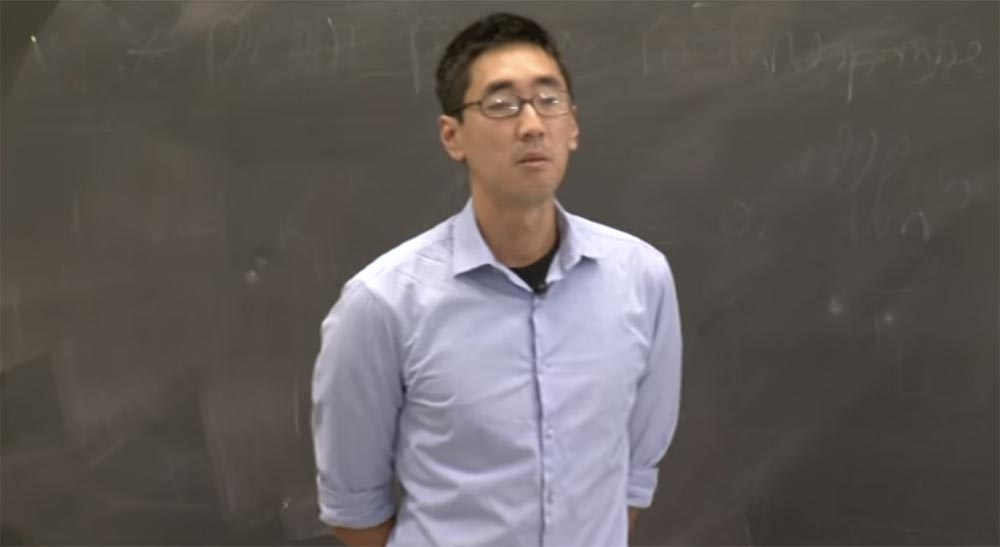

Я решил рассказать вам об этом, потому что знаю, что многие студенты вашей специализации хотят сделать карьеру в области обеспечения безопасности компьютерных систем. План сегодняшней лекции выглядит так:

*   что такое «ошибки безопасности»?
*   доверительные отношения;
*   примеры ошибок, встречающихся в реальной жизни;
*   операция «Аврора»;
*   Stuxnet;
*   мне нравится заниматься проблемами безопасности, что я должен делать?

Давайте разберёмся, что исследователи думают об уязвимостях. Я хочу, чтобы вы полностью поняли, откуда взялась уязвимость, после того, как вы её обнаружили. То есть вы должны найти то, что её вызвало. Важным является понимание того, как уязвимости действуют на систему и как взаимодействуют с другими её компонентами.

Итак, давайте начнём с рассмотрения того, что такое ошибки безопасности. Но прежде чем начать говорить об этом, сначала определим, что означает само понятие безопасности.

Айвен Арч сказал: «Система безопасна, если она ведёт себя точно так, как задумано, и больше ничего не делает". Системы становятся всё более и более сложными. Если мы говорим об операционных системах, кто может сказать, для чего точно они предназначены и что конкретно позволяют делать?

Поэтому необходимо изучить все возможные виды атак. Зная, какие атаки существуют, можно разработать ключевые цели безопасности. Поэтому первыми шагами в области безопасности должны стать определение модели безопасности и определение модели угрозы.

В качестве примера рассмотрим, как Администрация транспортной безопасности TSA определяет модель угрозы. Цель обеспечения безопасности Международного аэропорта Логан состоит в том, чтобы предотвратить проникновение запрещённых предметов, таких, как например, пена для бритья, на борт воздушного судна. Модель угрозы представляет собой два пункта:

*   каковы возможные пути проникновения запрещённых вещей в аэропорт?
*   где находятся «точки входа» этих вещей на территорию аэропорта?

Как вы можете пронести запрещённые предметы мимо охраны? Как вы попытаетесь атаковать их систему безопасности? Вы можете пронести их там, где нет проверки, воспользовавшись привилегиями VIP-пасажира, спрятать их среди других вещей либо воспользоваться услугой других авиалиний для доставки в аэропорт запрещённых вещей.

Меня всегда шокировало то, что в Логане не просвечивается на мониторах багаж, прилетающий из других аэропортов. То есть вы можете оправить запрещённое вещество или объект из другого аэропорта, оно прилетит в Логан, и там вы его получите. Таким образом, аэропорты с менее строгой системой безопасности являются угрозами для развитой системы безопасности Логан, и с этим ничего нельзя сделать. Поэтому критическим моментом построения модели угрозы является понимание того, против чего вы конкретно выступаете. Замечу, что многих инженеров это не заботит должным образом.

Инженеры создают ошибки безопасности и сами же их находят. Целью инженеров является найти как можно больше недостатков и минимизировать возможность нанесения системе ущерба.

Подход к достижению этой цели должен быть очень тщательным – необходимо охватить вниманием все параметры системы безопасности или, по крайней мере, найти легко достижимые для преступников элементы.

Способы достижения цели состоят в исследовании исходного кода, использовании инструментов для отладки приложения и инжиниринге. Кроме этого, необходимы деньги для инструментария и штата работников.

Обычно разработчиков программного обеспечения заботит функциональность и возможности своего продукта, а не его безопасность. Все покупают ПО из-за его возможностей, а не из-за его безопасности. Поэтому безопасность всегда остаётся на втором месте и разработчики начинают заботиться о ней только после того, как продукт пострадает от злоумышленников. Обычно инженеры видят только малую часть «мозаики», они не обращают внимания на технические детали. Сможете ли вы ответить на вопрос, сколько строк кода содержит Linux 2.6.32, Windows NT4 и Adobe Acrobat?

Правильные ответы в порядке перечисления программ – от 8 до 12,6 миллионов строк, 11-12 миллионов и 15 миллионов. Действительно, всех обычно удивляет, что «Акробат» содержит больше строк программного кода, чем «Linux» и «Windows». Таким образом, даже то ПО, которое мы считаем простым, в действительность чрезвычайно сложное.

Проблемами безопасности интересуются следующие категории людей:

*   инженеры;
*   преступники;
*   исследователи безопасности;
*   тестеры на проникновение (пентестеры);
*   правительства;
*   хактивисты;
*   представители научных кругов.

Я выделил всего 6 категорий, но вероятно, их больше. Рассмотрим, что интересует первую категорию людей – преступников.

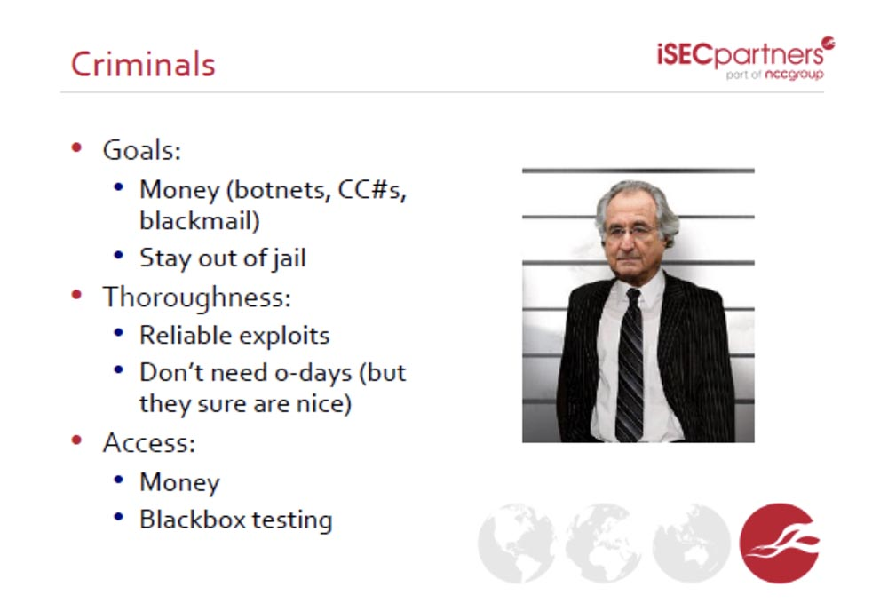

Их цель – ресурсы, с помощью которых можно завладеть чужими деньгами (ботнет, CC#s, спамерская рассылка «писем счастья») и при этом не попасть за решётку. Для достижения цели они используют самые новейшие хакерские эксплойты, использующие уязвимости ПО. Они не нуждаются в привилегиях доступа к данным, а просто крадут их, используя уязвимости, оставленные разработчиками. Чаще всего объектами атаки являются кредитные карты и всё, что с ними связано. Поэтому доступ к чужим деньгам преступники получают с помощью денег, покупая данные у хакеров, или используя метод тестирования Чёрного Ящика. Это метод тестирования «софта» по функциональной спецификации и требованиям, не используя при этом внутреннюю структуру кода или доступ к базе данных. При этом исходный код разбирается на составляющие, что позволяет обнаружить бреши в защите программы.

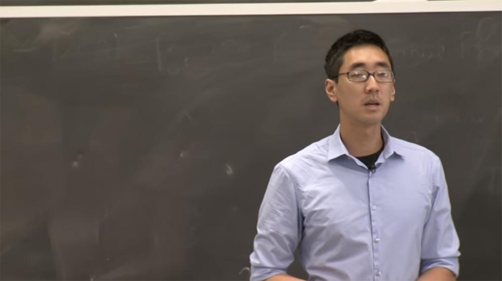

Такая методика позволяет проникнуть в базу данных кредитных карт, «взламывая» платёжные системы различных магазинов.

Следующая категория – это добровольные исследователи проблем безопасности, определённый род хакеров.

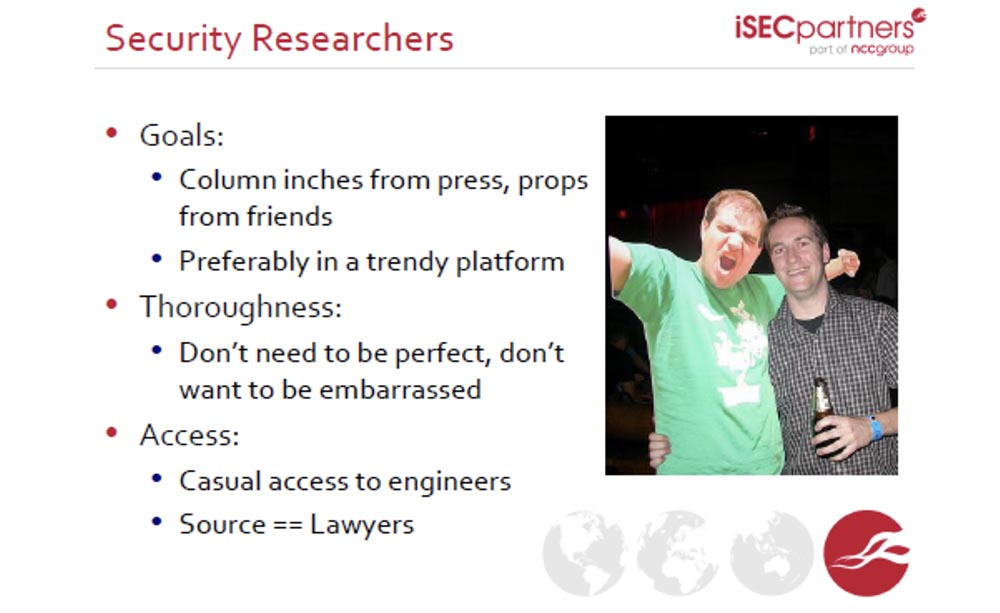

Их цель – сделать так, чтобы о них знала публика, чтобы про них печатали в газетах, а друзья уважали или восхищались ими. Тщательности их занятие не требует, никто не будет тебя стыдить, если ты не нашёл уязвимости или способы её преодолеть. Доступ к системам безопасности они получают благодаря любительским инструментам и случайным связям с инженерами, работающими в крупных компаниях по безопасности или разрабатывающих ПО, а источником информации часто служат адвокаты.

Третья категория наиболее полезная в деле обеспечения безопасности – это тестировщики на проникновение (пентестеры).

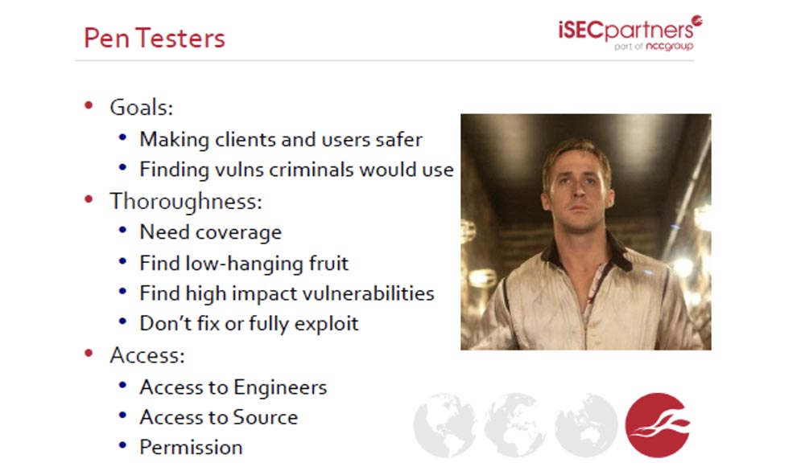

Смысл их работы заключается в том, чтобы обеспечить безопасность клиентов и пользователей программного обеспечения. Они находят те уязвимости, которыми хотят воспользоваться преступники, до того, как их обнаружат преступники, и помогают разработчикам устранить эти уязвимости.

Тщательность их работы заключается в охвате всех подробностей и нюансов системы, в нахождении незащищённых общедоступных мест и уязвимостей, подверженных наибольшему вмешательству, не исправленных или взломанных.

Для занятия такой работой им необходим доступ к разработчикам, доступ к исходному коду и всевозможные разрешения.

Далее следуют правительства разных стран. Безопасность волнует их с точки зрения атак, шпионажа и защиты собственной страны от подобных действий неприятеля. Обеспечивают их работу надёжные эксплойты, способные обнаружить и использовать уязвимости, а для получения доступа к системам безопасности они используют деньги, талант и время, которое они могут купить за деньги.

Предпоследнюю группу составляют хактивисты. Это анонимные хакеры, их деятельность является смесью хакерства и выражения протеста, направленное против ущемления права свободно обмениваться любой информацией. Это социально-ориентированные хакеры, обычно взламывающие системы не ради своего обогащения.

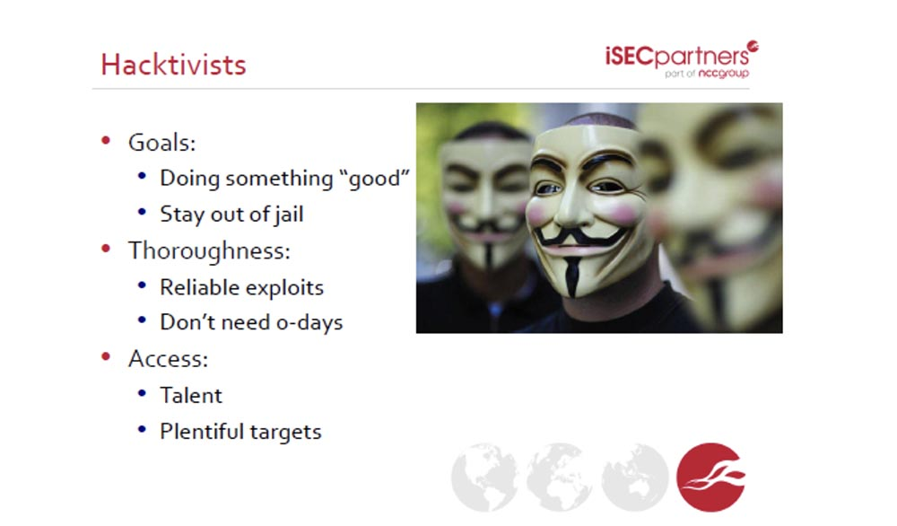

Их цель – сделать «что-то хорошее», в их понимании этого слова, и не попасть за это в тюрьму. Иногда я соглашаюсь с тем, что они делают, иногда – нет.

Они используют самые современные эксплойты и проникают в системы безопасности благодаря собственному таланту и большому разнообразию «целей» для приложения своих умений. Они используют все возможные уязвимости, и если можно украсть номера кредитных карт, они их украдут.

Последняя группа – это представители науки. Это интересная сфера деятельности, в которой работает профессор Николай Зельдович. Здесь исследуются долгосрочные возможности и функциональные проблемы программ. Люди науки находят общие недостатки и другие общие проблемы, например, ошибки в использовании файрволов или шифрования, стараясь сделать ПО более безопасным. Обычно они имеют достаточно времени и талантов для своих исследований, и тщательность их работы обеспечивается глубиной подхода.

Они получают доступ к системам безопасности благодаря созданию новых вещей и Чёрному Ящику. Существует разница между теоретическими разработками и их реализацией на практике, но в большинстве своём они действуют так же, как правительства стран, то есть занимаются очень амбициозными проектами.

Все эти группы людей используют похожую технику и ищут одно и то же: уязвимые системы. Если у них есть доступ, они производят обзор исходного кода, используют интервью с инженерами или выполняют тестирование в контролируемой среде. Если доступа нет, они выполняют тестирование Чёрного Ящика, занимаются технологией fuzzing (например, вводят случайные данные и смотрят, как на это отреагирует система), делают техническое копирование Reverse Engineering (использование двоичных файлов программного кода) и занимаются социальной инженерией.

«Фаззингу» подвержены многие сложные программные системы, например, тот же **Acrobat Reader** – здесь проверяется возможность переполнения буфера с помощью специально созданных объёмных документов в .pdf формате. Такой документ «загоняется» в «Акробат» чтобы проверить, способен ли он вызвать сбой системы.

Социальная инженерия является самым простым и быстрым способом нахождения проблем безопасности путём взлома аккаунтов в социальных сетях.

Итак, давайте погрузимся в предмет лекции и рассмотрим уязвимости, которые мы ищем.

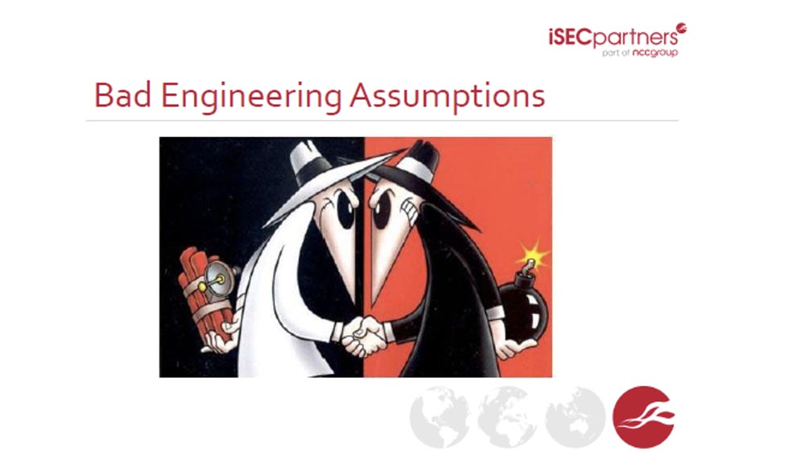

Инженеры часто допускают ошибки относительно того того, как должны работать системы и как они будут работать после создания. Примером катастрофической ошибки в программном обеспечении, приведшей к смерти людей, является программа для аппарата лучевой терапии **Therac-25**. **Неверная работа системы безопасности аппарата привела к тому, что как минимум 6 человек получили огромные дозы радиации, два человека – смертельные.** Я расскажу вам об этом в общем, без упоминания деталей и принципов работы этого облучателя.

Программное обеспечение этого медицинского аппарата предусматривало два режима использования облучателя. Первый, **X-Ray image**, режим рассеивания электронов, при котором радиационное облучение было минимальным, не предусматривал использования защитного фокусирующего экрана. Второй режим **Radiation Treatment** обеспечивал мощный режим облучения, при котором больное место подвергалось направленному пучку радиоактивного излучения мощностью 25 МэВ. Для этого между пациентом и излучателем помещался защитный фокусирующий экран.

На следующем слайде показано, как выглядел программный код, управляющий работой защитного экрана. Вы видите, что в одной строке располагались однобайтовые данные, сообщающие, нужна или нет установка защитного экрана на место. Если эта величина равнялась 1, экран устанавливался, если она равнялась 0, экран убирался. Проблема состояла в том, что внутри программы при вводе параметра, равного 0, например, если врач вручную корректировал мощность облучения до 0, происходило деление величины излучения на 0. Так как деление на 0 является недопустимой операцией, происходило переполнение буфера, программа давала сбой и мощность излучения автоматически принимала максимально возможное значение при отсутствии защитного экрана.

Здесь разработчики использовали ошибочное предположение, что в режиме Radiation Treatment параметр использования защитного экрана всегда будет принимать не нулевое значение, переполнения буфера никогда не произойдёт и программа никогда не даст сбой. **В результате этого неверного предположения погибли люди, потому что при сеансе без экрана в режиме Radiation Treatment они получили смертельный радиационный ожог.**

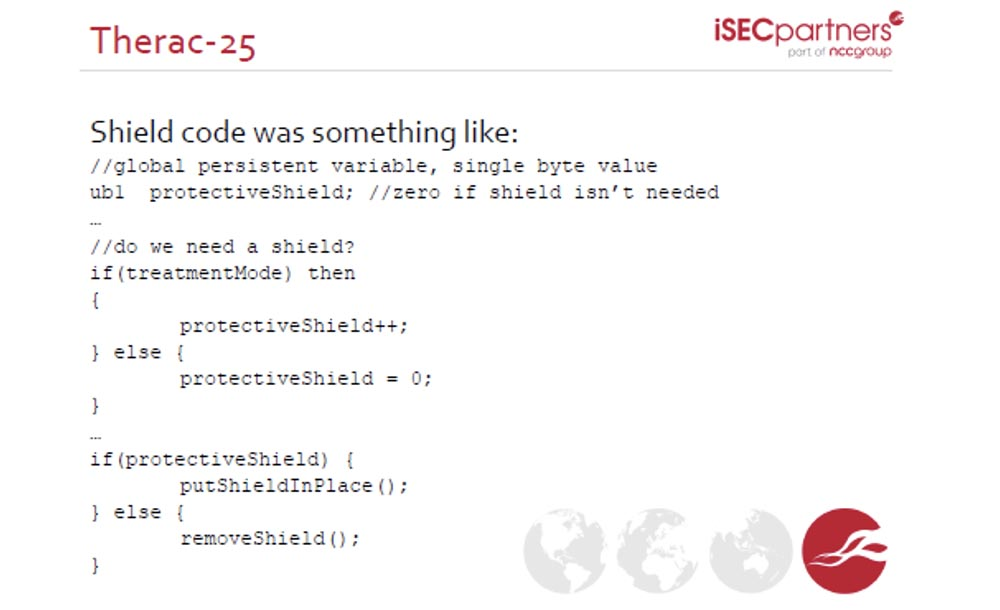

Узнав об этом случае, мой однокурсник сказал: «Я сделал для себя вывод, что никогда не буду писать медицинское программное обеспечение».

**Большой вред могут принести неверные предпосылки при разработке программного обеспечения, примером чего является система аккаунтов amazon.com.**

Этот интернет магазин позволяет следующее:

*   вы можете добавить в свой аккаунт кредитную карту или электронный почтовый ящик с именем и физическим адресом;
*   Amazon даёт вам возможность сменить пароль к аккаунту через зарегистрированный почтовый ящик;
*   Amazon позволяет вам видеть 4 последних цифры номера кредитной карты;
*   Apple предоставляет вам возможность войти в свой аккаунт, используя 4 последних цифры номера кредитной карты;
*   Gmail позволяет изменить аккаунт Apple через аккаунт в Twitter.

Какие неверные предпосылки позволили создать эту порочную цепочку? Неправильные политики безопасности, выраженные в первом и четвёртом пунктах. Отсюда следует вывод: компоненты, влияющие на вашу систему, часто находятся за пределами вашего внимания (Facebook, Amazon, Apple). Поэтому злоумышленник может завладеть данными вашей кредитной карты через аккаунт на amazon.com, используя возможности этих трёх независимых систем. Это можно считать полной моделью угрозы.

Поэтому ответьте на вопрос: является ваш пароль к персональному почтовому ящику надёжней или слабее пароля, который вы используете для онлайн-банкинга?

Я вижу, сколько человек подняли руки. А теперь поднимите те, у кого пароль для банковских операций сильнее пароля от почты. Я вижу, что таких больше. И это неправильно.

Люди считают, что онлайн-банкинг серьёзное дело, и тут нужен более надёжный пароль. Но они забывают, что доступ к платёжному аккаунту осуществляется через электронный почтовый ящик. Именно почта должна иметь максимально надёжный пароль, а не наоборот.

Если вы хотите стать инженером, который разрабатывает компьютерные системы, вам нужно думать так, как думает исследователь проблем безопасности:

*   какие предпосылки нужно использовать для обеспечения безопасности при разработке дизайна системы?
*   какие предпосылки являются неверными?
*   что вы можете нарушить, если предпосылка оказалась неправильной?

Последний пункт помогает разработать дизайн системы таким образом, что даже при сбое системы ваше ядро будет защищено.

Управлять памятью – трудное дело.

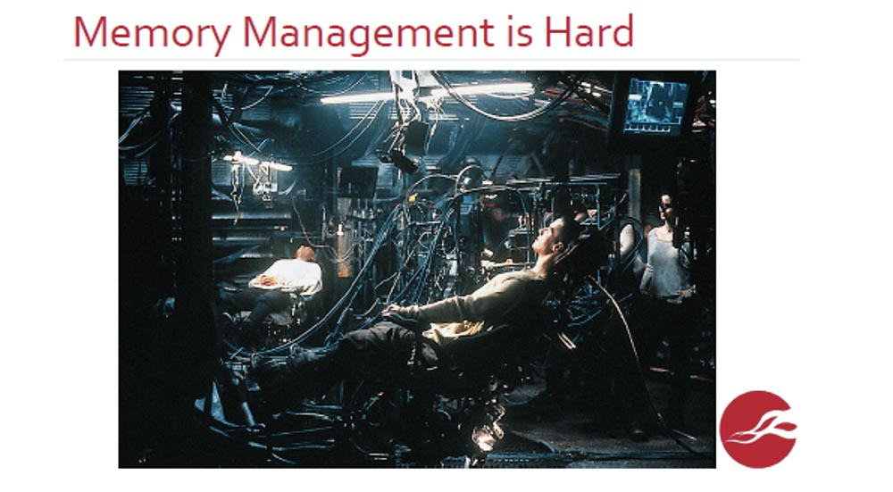

В качестве примера я приведу вам упрощённую схему протокола установления безопасной связи:

*   избегать пересмотра, или переустановления контакта;
*   Алиса: «Боб, если ты здесь, скажи «бу»!
*   Боб: «Бу!»
*   в результате Алиса и Боб считают, что очень хорошо знают друг друга.

Технически этот протокол выглядит так:

*   Алиса посылает пакет, содержащий пинг;
*   пакет имеет определённую длину данных;
*   Боб возвращает назад пакет той же длины.

При этом Боб производит разбор присланных Алисой данных:

Просматривает длину данных и их расположение в буфере. Затем он готовит Алисе ответ, добавляя 2 байта к длине запроса Алисы, копирует в ответ новую длину запроса Алисы и высылает его ей обратно:

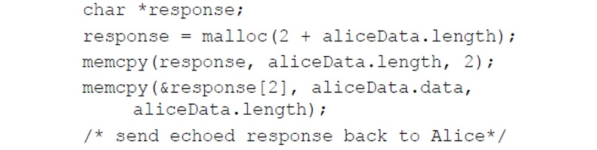

Видите ли вы здесь какую-нибудь проблему? Где здесь уязвимость?

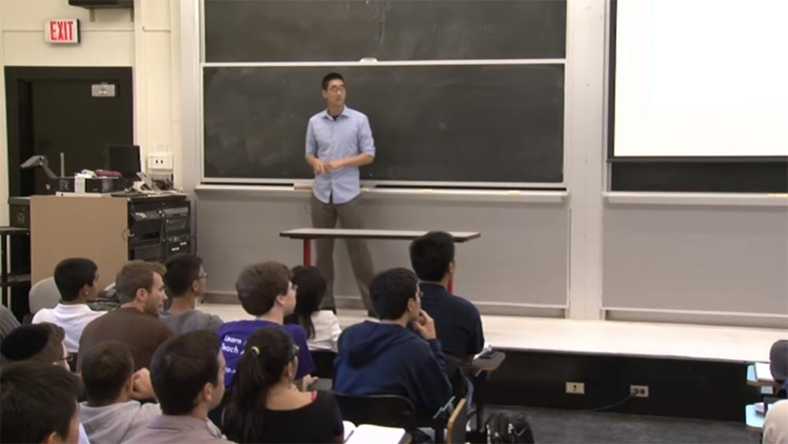

Она заключена во второй и четвёртой строках ответа Боба. Размер данных, передаваемых пользователем, может не совпадать с фактическим размером данных. Протокол установления связи **TSL** использует открытый протокол шифрования **SSL**. Так работает примерно 60% серверов, имеющихся в Интернете. Боб, то есть сервер, никогда не проверяет фактическую длину полученных данных. Из-за того, что сервер добавляет 2 байта, пользователь может прочитать около 64 КB данных памяти сервера, включая частные ключи.

Теперь, когда мы нашли эту ошибку, как можно её исправить? Чем больше людей об этом знают, тем больше утечка информации. Поэтому, как только раскрывается информация об уязвимости, ею тут же воспользуются. Значит, для защиты необходимо исправить положение как можно скорее.

Иногда к нам обращаются компании и говорят, что обнаружили такую уязвимость и как её можно исправить. Мы отвечаем им: «никак, вам просто необходимо немедленно поменять ключи шифрования». Поэтому обязательно нужно проводить мониторинг отличий, возникающих в **Open SSL** при обмене данными.

Из этого можно сделать выводы, что не слишком умно применять ключи протоколов защиты транспортного уровня **TSL** для оборудования, которое постоянно подвергается внешним воздействиям, и что фундаментальные протоколы имеют проблемы безопасности.

Отмечу, что крупнейшие государственные фонды и организации, занимающиеся проблемами безопасности, часто рассматривают последствия угрозы «нулевого дня», то есть угрозы уязвимости, для устранения которой не существует никаких патчей.

А теперь рассмотрим вопрос неожиданного, непредвиденного взаимодействия. Это то, что позволяет злоумышленникам получать деньги несколькими неожиданными способами.

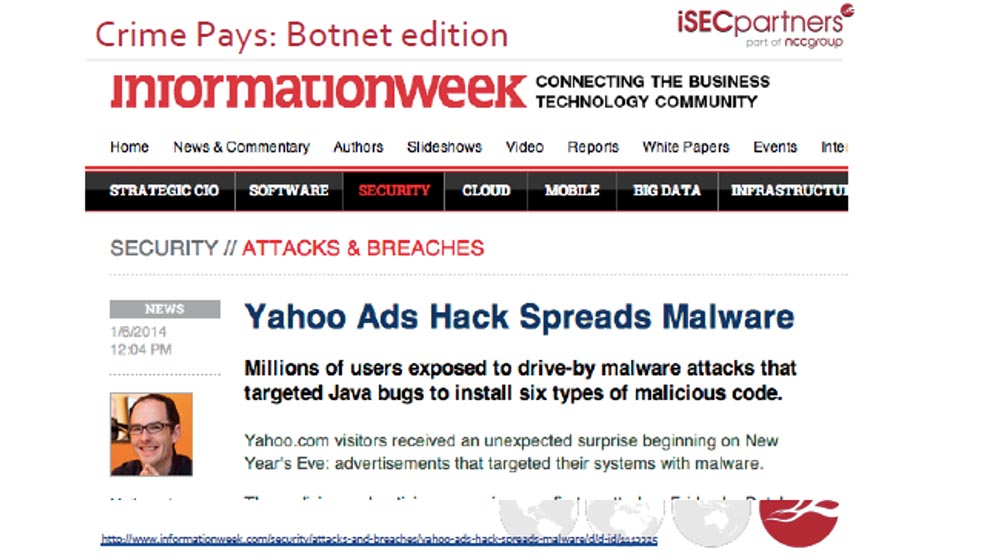

В 2014 году злоумышленникам удалось создать дополнения браузера **Yahoo**, которые с помощью ботнет заражали компьютеры пользователей вредоносными программами. Они использовали конкретные ошибки Java-скриптов, позволяющие установить на компьютеры 6 типов вредоносного кода.

Одна из уязвимостей заключалась в том, что неправильно изолированные входные данные пользователей выполнялись браузером как java-скрипты, которые перенаправляли пользователей к набору вредоносных программ под названием **Magnitude** через уязвимость **XSS**. Этот **Magnitude** использовал новейшие уязвимости «нулевого дня» в **Yahoo**, из-за чего с 30 декабря 2013 по 3 января 2014 года заражение в вирусом происходило с интенсивностью 27000 компьютеров в час. В этом случае использование ботнет было очень эффективным.

Решением проблемы стал механизм отключения выполнения java-скриптов на странице браузера и внедрение функции «click-to-play» в браузере Chrome.

Ещё один тип атак использует принцип **Confused Deputy** – это подозрительное доверие приложений к принимаемым данным. Под это определение попадает довольно широкий круг проблем безопасности. Такой тип уязвимости получил название **Cross-Site Request Forgery** (сокращенно **CSRF** или **XSRF**), что означает «подделка межсайтовых запросов». Подделка запроса авторизации заставляет вас делать то, что вы не собирались сделать.

Исследователи проблем безопасности из Microsoft и люди науки рассмотрели возможность совершать в Интернете бесплатные покупки. Эта возможность появляется при использовании третьей стороны, выступающей в качестве платёжной системы с кассовой услугой **Cashier as a Service**. Вы знаете много сайтов, которые предлагают провести платёж через «foo…», вы кликаете по такой ссылке, и вас перенаправляют на сайт платёжной системы.

В процессе покупки участвуют трое: продавец, провайдер платёжной системы **CaaS** и читер-покупатель. Отношения между тремя сторонами проходят через пользователя. На следующем слайде показана схема такой покупки.

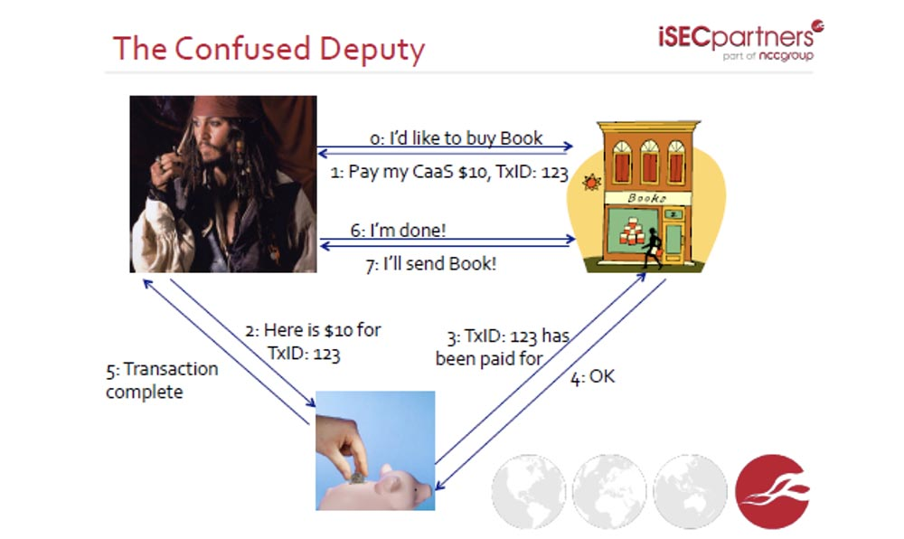

Вы, обращаетесь к владельцу онлайн-магазина и говорите, что хотите купить книгу. Он отвечает вам, что для этого вам нужно заплатить $10 его платёжному сервису **CaaS** за операцию 123\. Вы обращаетесь к «кассиру» и говорите: «вот $10 для TxID:123». **CaaS** сообщает магазину: «оплата произведена». Магазин говорит: «ОК». Транзакция завершена.

Кто-нибудь видит, как можно атаковать эту систему расчетов? Какая тут имеется уязвимость? Правильно, здесь нет подтверждения того, что сумма проведённой оплаты совпадает со стоимостью товара! Если вы обратите внимание на операции 3 и 4, то увидите, что здесь нет никакой информации о том, какая сумма фактически была переведена. На следующем слайде показано, как можно совершить практически бесплатную покупку, используя уязвимость системы – вместо $10 покупатель переводит всего $1, и транзакция всё равно считается подтвержденной.

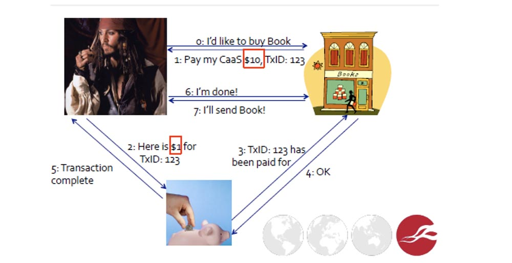

Неправильной предпосылкой в данной схеме является то, что продавец считает, что что-то связывает сумму платежа с транзакцией, однако в действительности этого нет. Решением данной проблемы может быть одно: читайте бумаги, проверяйте каждую операцию, потому что множество вещей могут произойти и происходят неправильно.

Ещё больше случаев непредвиденного взаимодействия возникает при управлении паролями.  
Количество успешных атак паролей пользователей постоянно растёт благодаря увеличению вычислительных способностей компьютеров, росту скорости вычислений и использованию большого количества реальных паролей для пользовательских словарей хакеров. Это не означает, что пользователи используют пароли типа «аааааа» или «аааааб», но часто разные пользователи используют одни и те же пароли. Возникает ситуация, когда большое число взломанных паролей позволяет хакерам создавать более объёмные словари для хакерского ПО, что, в свою очередь, способствует взлому ещё большего числа паролей. Здесь возникает обратная связь, и техника взлома паролей постоянно совершенствуется.

Двухступенчатая авторизация хороша, но она не используется повсеместно. В Интернете до сих пор существуют сотни приложений, не использующие такой подход. Вы можете сгенерировать действительно надёжный пароль, но не использовать его везде. Вам необходимо создать стойкий, уникальной пароль для каждого сайта, с которым вы работаете. Программы-менеджеры паролей позволяют создавать действительно надёжные пароли. Хорошим способом обеспечения безопасности являются плагины некоторых браузеров, позволяющие пользователю управлять логином и генерацией паролей.

Расширения браузеров сами по себе являются интересными вещами.

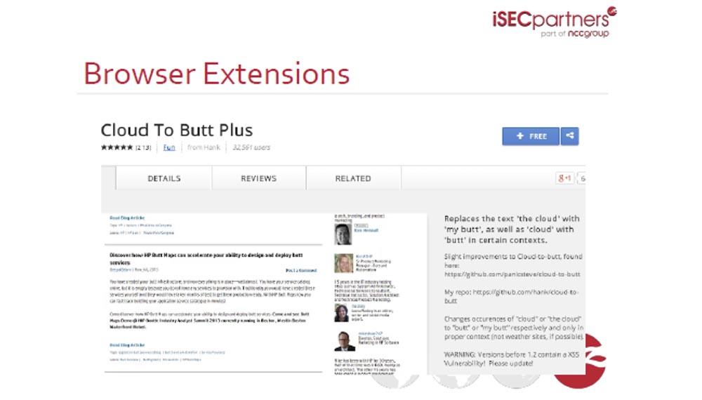

Некоторые плагины позволяют безопасно взаимодействовать с разными доменами, и если вы переходите с одного домена на другой, они автоматически очищают кукиз и останавливают работу по обмену данными с незнакомым доменом. Примером может служить плагин **Cloud To Butt Plus** для браузера **Chrome**. Он располагается на панели браузера и позволяет безопасно взаимодействовать с любым доменом.

Создание безопасного браузера является сложной задачей, потому что все компоненты, обеспечивающие его работу, такие как **java-скрипт** или **Flash-player**, должны реализовывать одну и ту же оригинальную политику безопасности. Компоненты браузера должны исключать возможность неконтролируемого взаимодействия и воздействия одного домена на другой. Примером служит сайт нашей компании **[www.isecpartners.com](https://www.isecpartners.com/)**, который не позволяет нам прочитать ваш адрес электронной почты, когда вы авторизовались на сайте, и не навязывает вам наши кукиз.

Однако многие расширения браузера не обеспечивают безопасность, потому что взаимодействуют со всеми Интернет-страницами, не предотвращая последствий от влияния этих веб-станиц на ваш компьютер. Поэтому уязвимость безопасности расширений может «сломать» ваш браузер.

Браузеры создаются ведущими инженерами крупных компаний, например, **Google**, поэтому стоят очень дорого. А расширения для браузеров создают сторонние разработчики. Расширения становятся всё более популярными, и злоумышленники пользуются этим. Они связываются с разработчиками и говорят: «эй, продай мне это расширение за $10000»! После чего злоумышленник превращает дополнение во вредоносное ПО, изменяя скрипты веб-страницы, а затем бесплатно распространяет или продаёт это модифицированное расширение пользователям. После того, как пользователь установит такое расширение, он подвергнется атаке. Примером может служить то, что тысячи пользователей Chrome пострадали в январе 2014 года после того, как спамеры купили расширение и превратили его в эксплойт.

Вернёмся к обсуждению расширений браузеров, которые управляют паролями. Они обеспечивают безопасность, преследуя такие цели:

*   безопасная отправка паролей третьей стороне;
*   общая безопасность приложений пользователя;
*   простота использования;
*   генерирование надёжных паролей;
*   безопасное хранение паролей.

Наша компания занимается исследованием первых трёх целей. Ответьте, кто из вас использует менеджеры паролей? Всего пару человек. А кто из вас использует программы для хранения паролей **1password** или **LastPass** и сервис для сокрытия адреса своего электронного почтового ящика **Mask Me**? Давайте рассмотрим эти программы.

Программа **1password** в действительности не обеспечивает безопасность приложений, потому что предлагает функцию «тихого» обновления через **HTTP** с использованием неподписанных пакетов. Кроме того, она запускается с правами привилегированного пользователя компьютера.

При этом функцию автозаполнения и автопосылки заполненных форм предоставляет только **LastPass**, программа **Mask Me** имеет только функцию автозаполнения формы, а **1password** вообще не имеет этих функций. Функции автоматизации существенно облегчают удобство использования программы, так как пользователю не нужно каждый раз вводить множество данных, но также увеличивают возможность использования вредоносных эксплойтов, если в системе имеется уязвимость.

Далее я расскажу вам об известных областях приложения атак, то есть о компонентах и явлениях, которые подвергаются атакам чаще всего. К ним относятся:

*   различия между HTTP и HTTPS;
*   заполнение учётных данных в iframes;
*   кросс-доменные запросы;
*   различия между поддоменами (субдоменами);
*   идентификация страниц входа.

Разница между незащищённым соединением HTTP и безопасным HTTPS играет большую роль в обеспечении безопасности. Если не обращать внимание на появляющийся в строке браузера адрес, можно легко попасть вместо безопасного сайта на фишинговый сайт. При этом атаки **SSL stripping** могут легко «вскрыть» ваш пароль.

Здесь также могут использоваться атаки перенаправления, когда с безопасного сайта **https:// example.com** вас перенаправляют на опасный **http:// example.com**. Если менеджер пароля использует автозаполнение форм, то вы можете зарегистрироваться на фальшивой странице. Программа **Mask Me** имеет уязвимость, потому что использует не только автозаполнение, но и посылку заполненной формы, что поможет злоумышленнику украсть ваш пароль.

33:35 мин

Продолжение:

[Курс MIT «Безопасность компьютерных систем». Лекция 5: «Откуда берутся ошибки систем безопасности», часть 2](https://habr.com/company/ua-hosting/blog/418215/)

Полная версия курса доступна [здесь](https://ocw.mit.edu/courses/electrical-engineering-and-computer-science/6-858-computer-systems-security-fall-2014/).

Спасибо, что остаётесь с нами. Вам нравятся наши статьи? Хотите видеть больше интересных материалов? Поддержите нас оформив заказ или порекомендовав знакомым, **30% скидка для пользователей Хабра на уникальный аналог entry-level серверов, который был придуман нами для Вас:** [Вся правда о VPS (KVM) E5-2650 v4 (6 Cores) 10GB DDR4 240GB SSD 1Gbps от $20 или как правильно делить сервер?](https://habr.com/company/ua-hosting/blog/347386/) (доступны варианты с RAID1 и RAID10, до 24 ядер и до 40GB DDR4).

**Dell R730xd в 2 раза дешевле?** Только у нас **[2 х Intel Dodeca-Core Xeon E5-2650v4 128GB DDR4 6x480GB SSD 1Gbps 100 ТВ от $249](https://ua-hosting.company/serversnl) в Нидерландах и США!** Читайте о том [Как построить инфраструктуру корп. класса c применением серверов Dell R730xd Е5-2650 v4 стоимостью 9000 евро за копейки?](https://habr.com/company/ua-hosting/blog/329618/)