Курс MIT «Безопасность компьютерных систем». Лекция 6: «Возможности», часть 1 / Блог компании ua-hosting.company

### Массачусетский Технологический институт. Курс лекций #6.858. «Безопасность компьютерных систем». Николай Зельдович, Джеймс Микенс. 2014 год

Computer Systems Security — это курс о разработке и внедрении защищенных компьютерных систем. Лекции охватывают модели угроз, атаки, которые ставят под угрозу безопасность, и методы обеспечения безопасности на основе последних научных работ. Темы включают в себя безопасность операционной системы (ОС), возможности, управление потоками информации, языковую безопасность, сетевые протоколы, аппаратную защиту и безопасность в веб-приложениях.

Лекция 1: «Вступление: модели угроз» [Часть 1](https://habr.com/company/ua-hosting/blog/354874/) / [Часть 2](https://habr.com/company/ua-hosting/blog/354894/) / [Часть 3](https://habr.com/company/ua-hosting/blog/354896/)  
Лекция 2: «Контроль хакерских атак» [Часть 1](https://habr.com/company/ua-hosting/blog/414505/) / [Часть 2](https://habr.com/company/ua-hosting/blog/416047/) / [Часть 3](https://habr.com/company/ua-hosting/blog/416727/)  
Лекция 3: «Переполнение буфера: эксплойты и защита» [Часть 1](https://habr.com/company/ua-hosting/blog/416839/) / [Часть 2](https://habr.com/company/ua-hosting/blog/418093/) / [Часть 3](https://habr.com/company/ua-hosting/blog/418099/)  
Лекция 4: «Разделение привилегий» [Часть 1](https://habr.com/company/ua-hosting/blog/418195/) / [Часть 2](https://habr.com/company/ua-hosting/blog/418197/) / [Часть 3](https://habr.com/company/ua-hosting/blog/418211/)  
Лекция 5: «Откуда берутся ошибки систем безопасности» [Часть 1](https://habr.com/company/ua-hosting/blog/418213/) / [Часть 2](https://habr.com/company/ua-hosting/blog/418215/)  
Лекция 6: «Возможности» [Часть 1](https://habr.com/company/ua-hosting/blog/418217/) / [Часть 2](https://habr.com/company/ua-hosting/blog/418219/) / [Часть 3](https://habr.com/company/ua-hosting/blog/418221/)

Итак, в продолжение темы о разделении привилегий, сегодня мы поговорим о возможностях. Если помните, на прошлой неделе мы говорили о том, как **Unix** предоставляет некоторые механизмы для приложений, которые можно использовать, если нам требуется отделить привилегии от внутренней структуры приложения.

Сегодня мы поговорим о возможностях, которые заставят нас думать совсем по-другому о привилегиях, которые может иметь приложение. Поэтому в сегодняшней лекции у нас имеются два отдельных вопроса для обсуждения. Один вопрос касается того, как избежать запутанности при определении полномочий и сделать ваши привилегии при написании программы более чёткими и однозначными, чтобы вы случайно не использовали неправильные привилегии.

Второй вопрос касается «песочницы» под названием **Capsicum**, это система, похожая на **OKWS**, которая позволит запустить фрагмент кода с меньшими привилегиями. Поэтому если система будет скомпрометирована, то это не будет грозить большим ущербом.

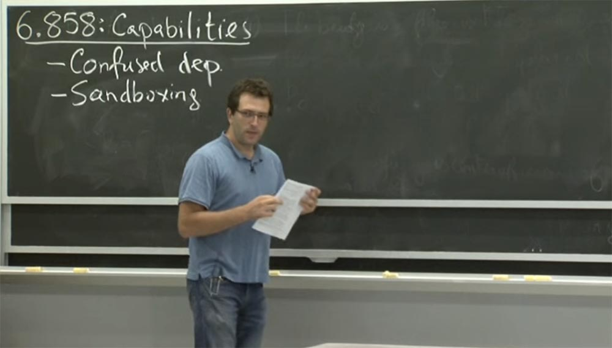

Такой подход позволит вам манипулировать привилегиями иначе, чем это позволяет **Unix**. Для начала посмотрим на эту запутанную проблему полномочий, с которой столкнулся автор обсуждаемой нами статьи Норман Харди и выясним, почему она так его озадачила.

Эта статья написана довольно давно, и автор использует синтаксическую структуру для имён файлов, что немного удивительно. Но мы можем попытаться, по крайней мере, транскрибировать его проблему в более знакомый нам синтаксис имён в стиле **Unix**.

Насколько я могу судить, он использовал компилятор **Fortran**, который находился в **/sysx/fort**, и он хотел изменить этот компилятор, чтобы сохранить статистику о том, что было скомпилировано, какие части компилятора были наиболее ресурсоёмкими и так далее. Поэтому он хотел убедиться, что этот компилятор **Fortran** каким-то образом обеспечит запись в файл **/sysx/stat** и что он будет записывать сюда информацию о различных вызовах компилятора.

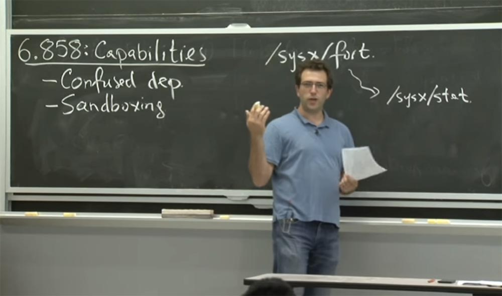

В их операционной системе было что-то вроде функции **setuid**, о которой мы говорили в **Unix**. Они назвали это лицензией на домашние файлы. Это означало, что если вы запустили **/sysx/fort**, и у этой программы была так называемая лицензия **home files**, то этот процесс, который вы только что запустили, будет иметь дополнительные права на запись всего в **/sysx/**. То есть вы могли записать после слеша всё, что обычно помечается звёздочкой, получив выражение вида **/sysx/***. Это давало доступ ко всем файлам, записанным в каталоге после **/**, и пользователь мог их запустить. Поэтому конкретная проблема, с которой они столкнулись, заключалась в том, что какой-то умный пользователь смог бы это сделать, запустив компилятор мог принять очень много аргументов так, как это делает **GCC**.

Такой пользователь мог, например, собрать что-то вроде **foo.f**, где **f** – исходный код **Fortran**, и добавить сюда – о **/sysx/stat**.

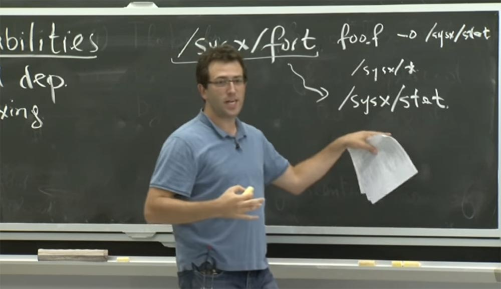

У них в системе был ещё один файл в **/sysx**, который был файлом выставления счетов для всех клиентов системы. Его повреждение нанесло бы ещё больший ущерб. Можно было аналогичным путём «попросить» компилятор скомпилировать исходный файл **/sysx/bill** и поместить его в какой-то специальный файл в **/sysx**. И в их случае это сработало. Несмотря на то, что у самого пользователя не было доступа к записи в этот файл или каталог, он воспользовался компилятором, у которого была эта дополнительная привилегия — лицензия на домашние файлы. Благодаря привилегиям компилятора он получил возможность заменить файлы вопреки намерениям разработчика.

Кого они должны обвинять в том, что произошло? Что, по их мнению, пошло не так? Можно ли было поступить по-другому, чтобы не столкнуться с такими проблемами? Они верили в то, что компилятор **Fortran** будет очень осторожен, когда он использует свои привилегии. В действительности, на определённом уровне компилятор «Фортран» имеет два типа привилегий, которыми пользуется.

Один, основной, базируется на том, что если пользователь вызвал компилятор, то он должен иметь возможность получить доступ к исходному файлу, такому, как **foo.f**. И если бы это был какой-то другой пользователь, который не активизировал, или не вызвал компилятор, то такой пользователь не смог бы получить доступ к исходному коду «правильного» пользователя.

Второй тип привилегий обеспечивается этой самой лицензией, что позволяет написать эти специальные файлы. На внутреннем уровне исходного кода компилятора должны были быть чёткие указания, какие из этих привилегий он хочет использовать при открытии файла или при выполнении какой-либо привилегированной операции. Он мог просто открывать, читать и записывать файлы, как любая другая программа. Он неявно использует все привилегии, которыми обладает, то есть в их системном дизайне это было своего рода объединение привилегий пользователя и лицензии на использование домашних файлов.

Таким образом, эти ребята были действительно заинтересованы в решении этой проблемы. И они вроде как называли этот компилятор «бестолковым помощником», потому что он должен был различать эти многочисленные привилегии, которыми обладал, и осторожно использовать их в нужном случае.

Итак, нам стоит рассмотреть, как разработать подобный компилятор в **Unix**. В их системе всё было привязано к этой лицензии на файлы. Существуют и другие механизмы, которые они позже ввели в свою программу для определения возможностей, мы поговорим о них в ближайшее время. Но можем ли мы решить эту проблему в системе **Unix**?

Предположим, вам нужно было написать этот компилятор **Fortran** в **Unix**, записать этот специальный файл и избежать возникающей при этом проблемы. Что бы вы сделали? Есть идеи? Думаю, вы можете просто объявить это плохим планом, и, например, не вести статистику. Или не поддерживать ввод данных типа – **о**. С другой стороны, вы можете указать, какой исходный код вы хотите скомпилировать, чтобы можно было прочитать файл **/bill** или файл статистики, который, возможно, должен быть секретным.

Или, может быть, вы могли бы обеспечить поддержку стандартного исходного кода, но тогда он должен был бы содержать в себе части другого исходного кода, так что это немного заумно.

**Аудитория:** можно было бы разделить привилегии компилятора.

**Профессор:** да, это был бы ещё один потенциально хороший дизайн, разделяющий его полномочия. Мы же знаем, что на самом деле компилятору «Фортран» не нужны одновременно обе привилегии. Так что, возможно, говоря на языке **Unix**, мы могли бы создать компилятор вроде **world/bin/fortcc**, и это была бы просто обычная программа без дополнительных привилегий. И затем мы бы создали **/bin/fortlog**, который будет специальной программой с некоторыми дополнительными привилегиями, и она будет собирать статистику о том, что происходит в компиляторе, и функция **fortcc** будет вызывать **fortlog**. Итак, какими привилегиями мы бы наделили этот **fortlog**?

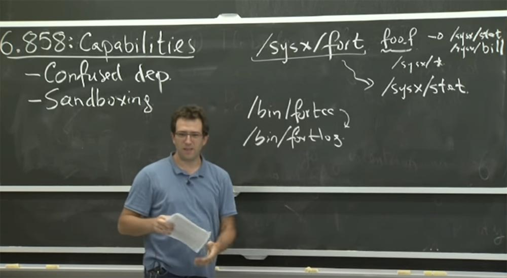

**Аудитория:** может быть, если вы используете что-то вроде **setuid** или **fortlog**, то любой другой пользователь также сможет зарегистрировать через него какие-нибудь произвольные данные.

**Профессор:** да, так что это не так уж и здорово. Потому что единственный способ в **Unix** дать дополнительные привилегии **fortlog** – это стать его владельцем, я не знаю, может быть, создать **fort UID** и **setuid**. И каждый раз, когда вы запускаете **fortlog**, он переключается на этот **fort UID**. И, возможно, здесь ещё нужен какой-то специальный файл статистики. Но тогда ведь каждый сможет вызвать этот **fortlog**.

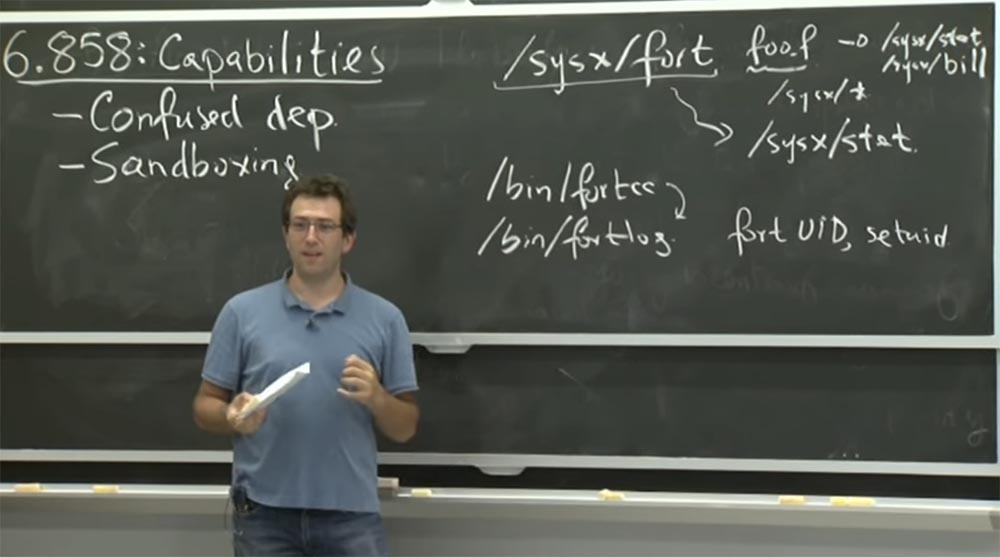

И в этом нет ничего хорошего, потому что любой желающий может писать в файл статистики. В данном случае для безопасности это небольшая проблема, но что произойдёт, если вместо **stat** это будет платёжный файл **bill**? В таком случае проблемы будут намного серьёзнее.

В **Unix** есть довольно сложный механизм, рассмотрение которого мы пропустили на последней лекции в понедельник. Этот механизм позволяет приложению переключаться между несколькими **uid**. Таким образом, для выполнения разных приложений можно переключаться между **ID** пользователей. Это немного сложно осуществить правильным образом, но выполнимо. Так что данный механизм может быть ещё одним потенциальным дизайном нашей системы.

Я думаю, вы могли бы проделать ещё одну хитрость: сделать «бинарник» **fortlog** исполняемым только для определённой группы и создать для этой группы двоичный файл **fortcc setgid**. Однако это не очень хорошо, так как стирает любой список групп, который был у пользователя изначально. Но кто знает, может быть, это лучше, чем ничего.

Во всяком случае, это довольно сложная проблема, но её можно полностью решить с помощью механизмов **Unix**. Возможно, вы должны переосмыслить вашу проблему и не слишком тревожиться о файле статистики **stat**, ставя его безопасность на первое место. Что же происходит не так в нашем проекте?

Есть две вещи, на которые следует обратить внимание, если что-то пошло не так. Первая называется **ambient authority**, или внешние полномочия. Кто-нибудь понимает, что они имели в виду? Они никогда не давали этому точного определения.

**Аудитория:** это означает, что у вас есть полномочия, данные вам окружающей средой. Так, как будто вы пользователь, действующий без ограничений.

**Профессор:** да, вы выполняете операцию, и вы можете указать, какую операцию вы хотите выполнить, но решение о том, будет ли эта операция успешной, исходит из некоторых дополнительных косвенных параметров в вашем процессе.

В **Unix** можно выяснить, как будет выглядеть проверка полномочий **ambient authority**. Поэтому, если вы делаете системный вызов, вы, вероятно, предоставили системному вызову какое-то имя. И внутри ядра это имя сопоставляется с каким-то объектом. И этот объект предположительно содержит внутри себя какой-то список управления доступом, например, разрешения для этого файла и так далее.

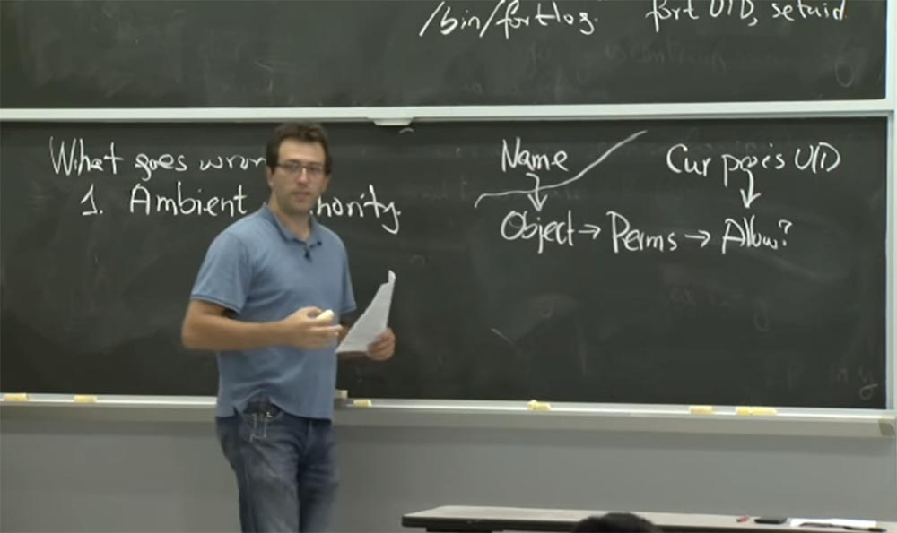

Таким образом, имеются некоторые разрешения, которые вы можете получить от данного объекта, и нужно определить, будет ли разрешена операция с этим именем, которое было предоставлено приложению, то есть создаётся цепочка **Name -> Object -> Permission**. Это то, что приложение получает, чтобы увидеть процесс.

Внутри ядра есть текущий идентификатор пользователя процесса **Сur process UID**, который выполняет вызовы. Он также участвует в решении, разрешить ли выполнение конкретной операции или нет. Таким образом, этот текущий идентификатор пользователя процесса и является внешней привилегией. Любую операцию, которую вы захотите выполнить, ядро будет пытаться проверить, используя ваш текущий **UID**, и ваш текущий **GID**, и любые другие дополнительные привилегии, которые у вас могут быть. И пока есть некоторый набор привилегий, которые позволяют вам это делать, вы можете это делать. Хотя, возможно, что вы не хотите использовать все эти привилегии, чтобы открыть определенный файл или сделать какую-либо другую операцию.

Вам понятно, что представляют собой эти **ambient privilege**, внешние привилегии? В случае с операционной системой это означает, что процесс имеет какой-то идентификатор пользователя. Можете ли вы привести примеры таких привилегий, не относящиеся к операционной системе? Например, когда вы выполняете операцию идентификации процесса, чтобы узнать, был он успешным или нет. Таким примером может служить файрвол — если вы находитесь внутри сети или имеете внутренний IP-адрес, вам разрешена какая-то операция, а если вы снаружи сети, то эта же операция будет для вас запрещена.

Скажем, вы посещаете какой-то веб-сайт, который содержит ссылку на другой сервер, и, может быть, вы не хотите пользоваться привилегиями, которые у вас есть, чтобы пройти по этой ссылке. Потому что, возможно, это даст кому-то доступ к вашему внутреннему сетевому принтеру и этот кто-то сможет им воспользоваться. Но в действительности тот, кто предоставил вам ссылку, не должен добраться до вашего принтера, потому что он находится снаружи сети. Или файрвол вашего браузера, посетив эту ссылку, сможет сделать это обманным путём.

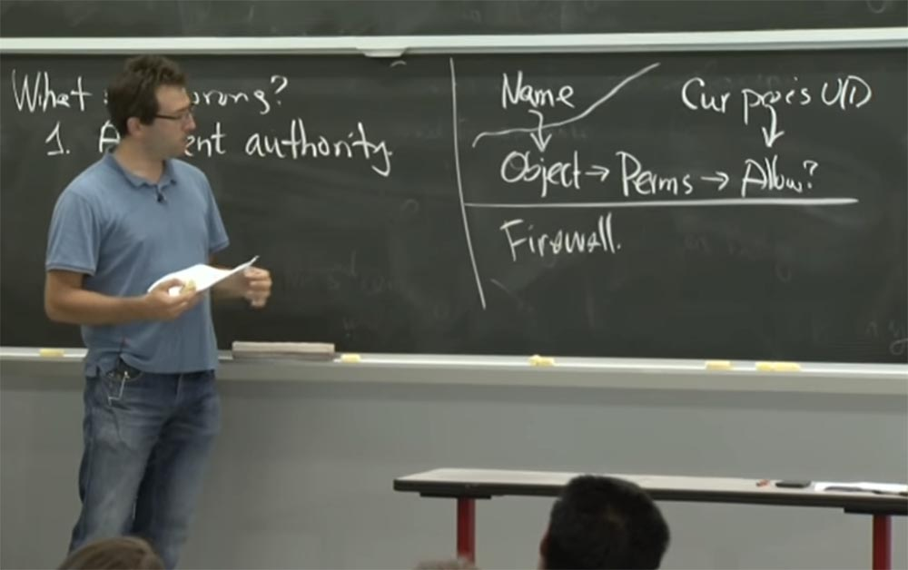

Это своего рода моральный эквивалент этой запутанной проблемы в сетевых моделях.

**Аудитория:** существующие разрешения тоже на это влияют.

**Профессор:** да.

**Аудитория:** потому что в **Capsicum**, по сути, применяется **DAC** – дискреционный контроль доступа.

**Профессор:** да, это в значительной степени потому, что ребята из **Capsicum** используют нечто вроде дискреционного контроля доступа. Это означает, что пользователь или владелец объекта решает, как будет выглядеть политика безопасности для этого объекта. Для **Unix** подобное является очень естественным – это мои файлы, и я могу решить, что я хочу с ними делать, я могу отдать их вам или оставить себе. Таким образом, почти все системы **DAC** выглядят так, потому что они нуждаются в каких-то разрешениях, которые пользователь может изменять для управления политикой безопасности своих файлов.

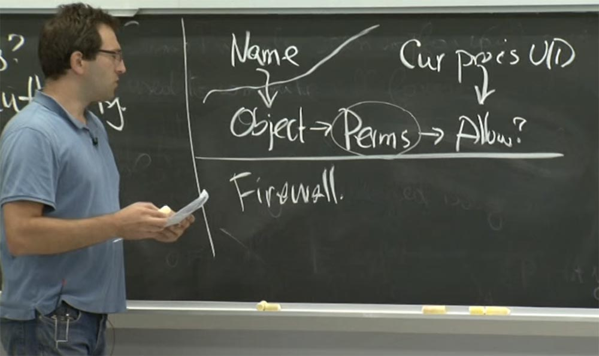

Обратной стороной **DAC** является обязательный контроль доступа. Мы поговорим об этом позже, но на каком-то уровне, у этих систем очень отличается взгляд на окружающий мир. Они думают, что вы – только пользователь компьютера, а кто-то другой задаёт политику безопасности для использования этого компьютера. Такой взгляд вышел из 70-х или 80-х годов, когда военные действительно хотели иметь засекреченные компьютерные системы, в которых вы работаете над некоторыми вещами, которые помечены как «секретные». И если вы работаете над вещами, которые помечены как **“secret”**, а я – над вещами с отметкой **“top secret”**, то они не могут так просто вам достаться. Но мне не приходится устанавливать права на файл и так далее, это просто не разрешено каким-то руководящем парнем «сверху».

Таким образом, обязательный контроль доступа действительно пытается поставить различные виды политик доступа на первое место, где есть пользователь и есть разработчик приложения, и кроме них, есть ещё один парень, который и задает эту политику. Однако, как вы можете догадаться, это не всегда получается. Мы поговорим об этом немного позже. Но в этом заключается обязательный смысл дискреционного контроля доступа.

У нас есть много других примеров использования внешнего контроля доступа. Это не обязательно плохо, просто при его использовании вы должны быть очень осторожными. Если у вас имеется система **ambient privilege**, нужно очень осторожно подходить к выполнению привилегированных операций. Вы должны убедиться, что действительно используете правильные полномочия и не будете случайно обманутыми, как с этим компилятором **Fortran** почти 25 лет назад.

Так что это одна из интерпретаций происходящего. И это не обязательно единственный способ думать о том, что пойдёт не так, верно? Другая возможность заключается в том, что было бы неплохо, если бы само приложение знало, должно ли оно получить доступ к файлу от имени какого-то принципа. Поэтому проблема №2 заключается в сложности проверки контроля доступа.

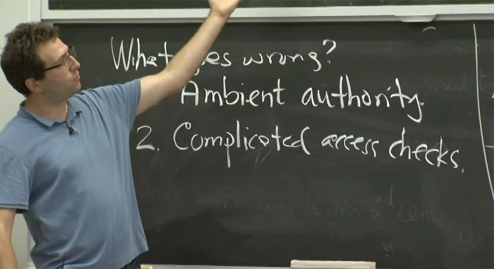

В некотором смысле, когда работает компилятор **Fortran**, он открывает файл от имени пользователя, и нужно повторить ту же самую логику, которую мы видим здесь на схеме, за исключением того, что компилятор **Fortran** должен подключать что-то еще для **Сur process UID**. Вместо использования текущих привилегий он должен просто повторить проверку **Name -> Object -> Permission** и попытаться сделать это с другим набором привилегий для **Сur process UID**.

В **Unix** это довольно сложно сделать, потому что есть много мест, где происходит проверка безопасности. Если у вас есть символические «мягкие» ссылки, то символическая ссылка просматривается, и имя пути также оценивается с какими-то привилегиями и так далее. Но может случиться так, что в какой-то системе вы могли бы упростить проверку контроля доступа, если её можно сделать самостоятельно в приложении. Вам не кажется, что это разумный план? Вы бы согласились с этим? Существует ли опасность повторения этой проверки?

**Аудитория:** если вы делаете проверки в приложении, вы могли бы просто не делать другие проверки.

**Профессор:** да, вы можете легко пропустить другие проверки, это абсолютно верно. Так что в каком-то смысле, когда они использовали здесь компилятор **Fortran**, он даже не пытался делать какие-то проверки, поэтому они потерпели неудачу. Ещё одно последствие, в дополнение к отсутствию проверок, состоит в том, что ядро может всё время меняться, и тогда оно будет иметь немного другие проверки. Это введёт некоторые дополнительные требования безопасности, но приложение не изменится и будет реализовывать старый стиль проверок. Так что это не слишком хороший план.

Вспомните, что есть одна хорошая идея в области безопасности — это снижение числа задействованных механизмов. Поэтому в программе существует только небольшое количество мест, в которых применяются политики безопасности. Вы, наверное, не хотите повторять одну и ту же функциональность в приложениях, в ядре и так далее. Вы действительно хотите сосредоточить эти проверки в каком-то одном месте программы. Итак, в чём же должно заключаться решение проблемы предоставления полномочий?

Наиболее близко к решению проблемы подходят возможности дескрипторов файлов в **Unix**.

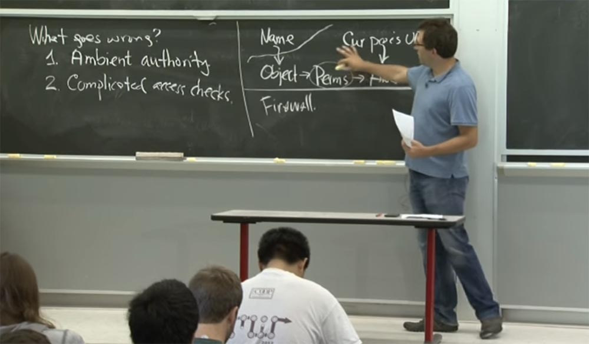

В мире возможностей, альтернативой данной схеме является то, что вместо того, чтобы следовать по цепочке **Name -> Object -> Permission** и решать, можно ли разрешить его использование, основываясь на внешних полномочиях **Сur process UID**, можно использовать очень простую схему.

Предположим, у вас есть возможности, относящиеся к конкретному объекту. И эти возможности могут иметь ряд ограничений относительно того, что вы можете сделать с этим объектом.

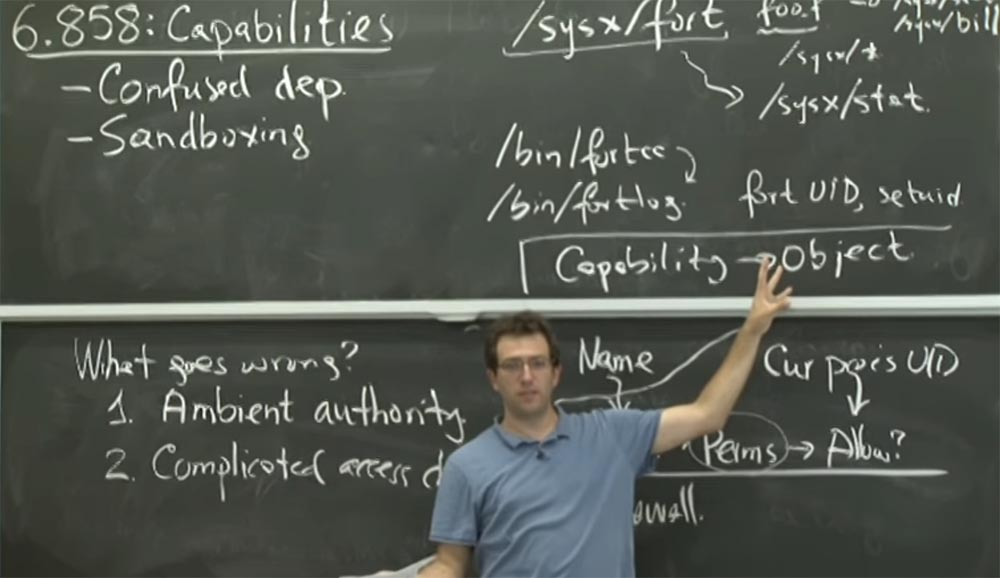

Но в принципе, если у вас есть возможности для этого объекта, то вы можете получить к нему доступ. Это на самом деле очень просто. Таким образом, нет никакого внешнего авторитетного органа, который решает, является ли операция возможной и можно ли разрешить её выполнение.  
Единственное это то, что эти возможности **Capability** должны содержать несколько дополнительных бит, которые сообщают, какими возможностями для данного файла вы обладаете, ограничен ли он только операциями чтения, или только операциями записи или добавления. Это решение обеспечения безопасности выглядит очень легко. Потому что если у вас есть возможности **Capability**, вы сможете что-то сделать, если у вас их нет — не сможете.

Одним из важных свойств **Capability** является то, что они должны исключать возможность подделки. Итак, что же в мире возможностей означает неподдельность и зачем она нужна?

На самом деле это слишком очевидно, если вы можете создать любую возможность, какую только захотите. Например, я могу создать возможность для любого из ваших файлов и получить к нему доступ. И в дизайне безопасности нет ничего, что могло бы помешать мне получить доступ к объекту, если я могу создать возможность.

Поэтому важно, чтобы эти возможности, что бы ни случилось, не могли бы быть созданы приложением «из воздуха». Как сделать это обязательным, если мы думаем об использовании файловых дескрипторов в такой системе, как **Capsicum**? Как файловые дескрипторы могут помешать приложению синтезировать возможности?

**Аудитория:** вероятно, это похоже на структуру или конструкцию, которая говорит, что у неё есть **Capability** для некоторых файловых дескрипторов.

**Профессор:** да, на самом деле довольно легко увидеть, что произойдёт, если вы помните, что такое файловый дескриптор. Файловый дескриптор — это просто целое число. Как и в **Unix**, это целое число равно 0, если оно относится к вводу данных, и равно 1, если относится к выводу. Но на самом деле это просто целые числа в пользовательском пространстве. Предположительно, приложение может выбрать любое целое число, которое захочет. Но всякий раз, когда вы пытаетесь что-то сделать в файловом дескрипторе, который является одним из этих целых чисел, ядро всегда будет интерпретировать целое число в соответствии с таблицей файлового дескриптора текущего процесса. То есть для каждого идентификатора процесса **PID**, предположим, **PID:57**, запущенный процесс имеет открытую файловую таблицу. И каждое целое число, предлагаемое из пользовательского пространства, относится к некоторой записи в этой таблице. И, конечно же, ядро должно проверить, что целое число находится в пределах этой таблицы, что оно не является отрицательным, не переходит границ таблицы и т.д. В противном случае мы получим обычное переполнение буфера.

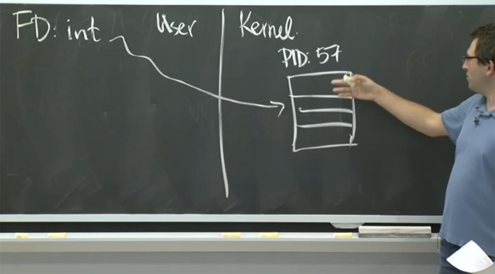

Но если вы тщательно проверяете, что целое число находится в пределах реализации ядра, то приложение может сослаться только на файловый дескриптор, записанный в этой таблице. Так что, по-видимому, ядро должно будет как-то убедится, что вы назначили конкретную возможность на законных основаниях.

Поэтому, когда вы, например, открываете файл вне этой модели возможностей в **Unix**, ядро после успешного открытого вызова изменит запись в таблице файлового дескриптора на указание конкретного открытого файла, например, файла паролей **/etc/pwd**.

Теперь запись в этом слоте таблицы указывает на открытый файл. Некоторые из них могут на самом деле равняться нулю. Может быть, что у вас нет открытого файла с определенным индексом в этой таблице. В результате, что же в данном случае будет означать «сфальсифицировать возможность»?

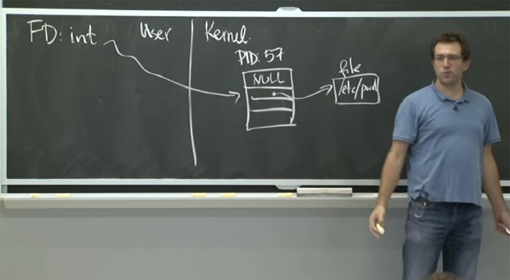

Единственное, что вы можете сделать в пользовательском пространстве, это выдумать целое число **integer**. Но имеется смысл выдумывать только такие числа, которые бы не показывали на нулевые записи в этой таблице. И эти записи будут означать именно те возможности, которые у вас есть.

Поэтому имеется смысл в том, почему в этом мире файловых дескрипторов в первую очередь трудно подделать возможности. Ведь это вроде круто, не правда ли? Вы можете работать только с теми файлами, которые открыты для вас. И нет ничего другого, что вы можете затронуть или на что оказать влияние.

Итак, я думаю, как возможности **Capability** помогут решить проблему внешних полномочий, которая так взволновала Нормана Харди в его компиляторе **Fortran**. Не сможет ли файловый дескриптор стать эквивалентом решения этой проблемы **sysx/fort**? Как вы думаете, он действительно сможет решить эту проблему?

**Аудитория:** они просто используют соответствующие возможности, когда они необходимы. Например, когда вы должны получить доступ к выходному файлу статистики, вы используете возможность получить **output-файл**. Но когда вы получили доступ к файлу, который собираетесь прочитать, вы не используете эту возможность.

**Профессор:** да, это так. Поэтому я думаю, что на самом деле компилятор **Fortran** должен просто иметь уже открытый файловый дескриптор для этого файла **/sysx/stat**. Но в своей краткой статье они не описывают, почему мы не можем получить эту возможность.

В основном это означает, что вы не должны передавать кругом имена файлов, вам достаточно передать только файловый дескриптор. Таким образом, мы создали бы более элегантный дизайн системы, применив в компиляторе «Фортран» **Unix** с использованием возможностей. Так что, возможно, план состоит в том, что мы должны просто взять интерфейс компилятора **Fortran**, который не имеет никаких дополнительных привилегий и принимает все аргументы, которые вы ему даёте, и преобразовать все имена путей, которые вы ему даёте, в открытые файловые дескрипторы.

Поэтому альтернативный дизайн может выглядеть таким образом. У нас имеется программа **fort1**, которая является интерфейсом программы, и она принимает какой-то файл, например, **foo.f**, и все остальные аргументы, такие, как — **o**, **ху** и тому подобное. На самом деле здесь реализуется всего лишь логика компилятора, ничего больше. Он ищет имена пути в этих аргументах, собирается открыть их и установить для них файловые дескрипторы.

Самое полезное тут то, что у него нет дополнительных привилегий, и если у пользователя нет доступа к имени файла, его ждёт провал. Это отлично! А после того, как интерфейс открыл все эти файловые дескрипторы, он может выполнять некоторые привилегированные дополнительные компоненты, такие, как функцию **setuid** для компилятора **Fortran**.

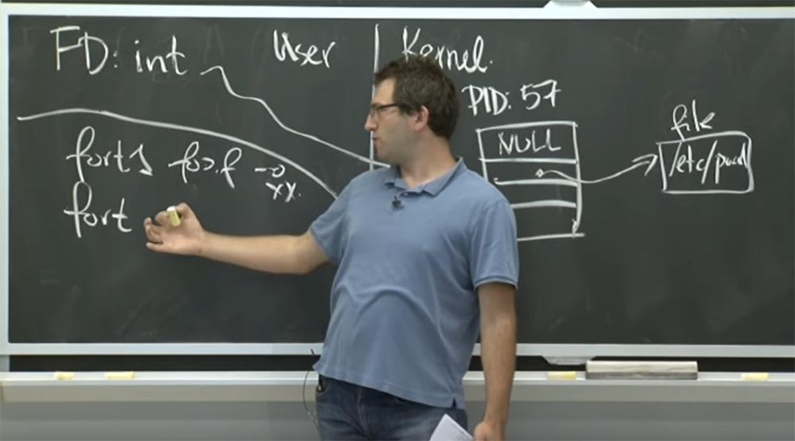

Например, это может быть **setuid** какого-то специального идентификатора пользователя, который имеет доступ к файлу статистики. Но в действительности он не использует имена путей в качестве входных данных, а пользуется файловыми дескрипторами. И в этом случае файловый дескриптор уже доказывает, что пользователь, сделавший вызов, имел доступ к тому, чтобы открыть их.

Конечно, этот метод не решает все вопросы, возникающие в системе, это просто наброски, как можно помочь с решением проблемы. Но это примерный план того, как вы можете продемонстрировать факт, что у вас есть доступ к определенному имени, просто открыв его и использовав **Capability**, вместо того, чтобы показать, почему вы не пытаетесь открыть этот файл и возможно, случайно использовать некоторые дополнительные привилегии.

26:30 мин

Продолжение:

[Курс MIT «Безопасность компьютерных систем». Лекция 6: «Возможности», часть 2](https://habr.com/company/ua-hosting/blog/418219/)

Полная версия курса доступна [здесь](https://ocw.mit.edu/courses/electrical-engineering-and-computer-science/6-858-computer-systems-security-fall-2014/).

Спасибо, что остаётесь с нами. Вам нравятся наши статьи? Хотите видеть больше интересных материалов? Поддержите нас оформив заказ или порекомендовав знакомым, **30% скидка для пользователей Хабра на уникальный аналог entry-level серверов, который был придуман нами для Вас:** [Вся правда о VPS (KVM) E5-2650 v4 (6 Cores) 10GB DDR4 240GB SSD 1Gbps от $20 или как правильно делить сервер?](https://habr.com/company/ua-hosting/blog/347386/) (доступны варианты с RAID1 и RAID10, до 24 ядер и до 40GB DDR4).

**Dell R730xd в 2 раза дешевле?** Только у нас **[2 х Intel Dodeca-Core Xeon E5-2650v4 128GB DDR4 6x480GB SSD 1Gbps 100 ТВ от $249](https://ua-hosting.company/serversnl) в Нидерландах и США!** Читайте о том [Как построить инфраструктуру корп. класса c применением серверов Dell R730xd Е5-2650 v4 стоимостью 9000 евро за копейки?](https://habr.com/company/ua-hosting/blog/329618/)