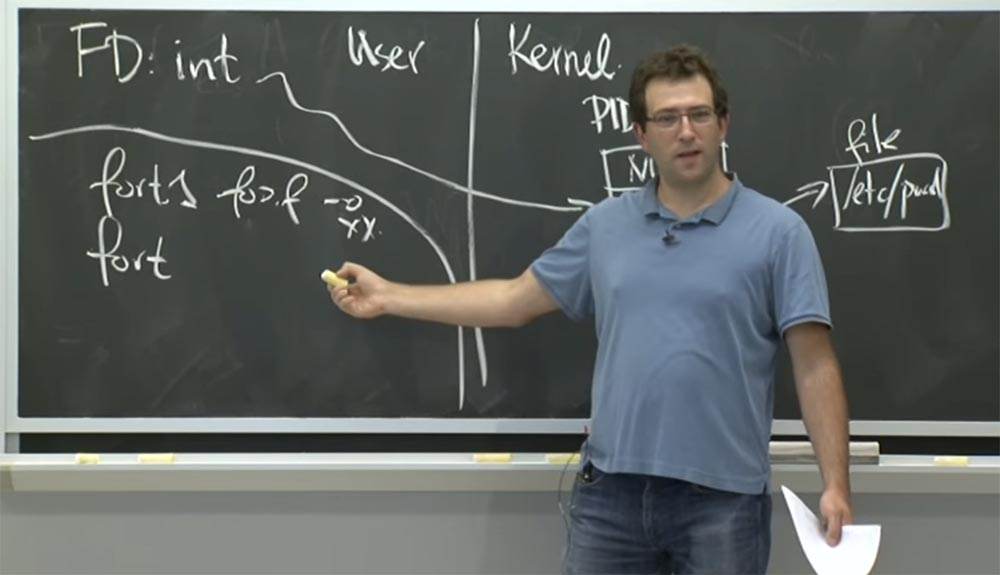
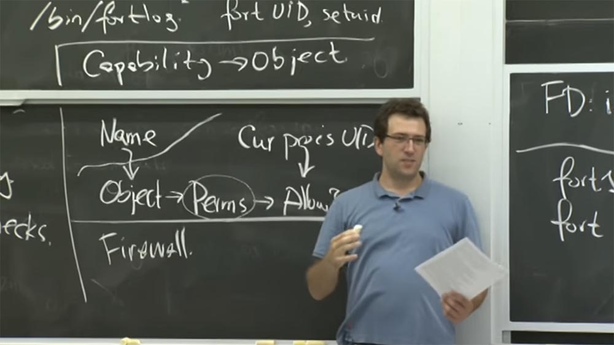
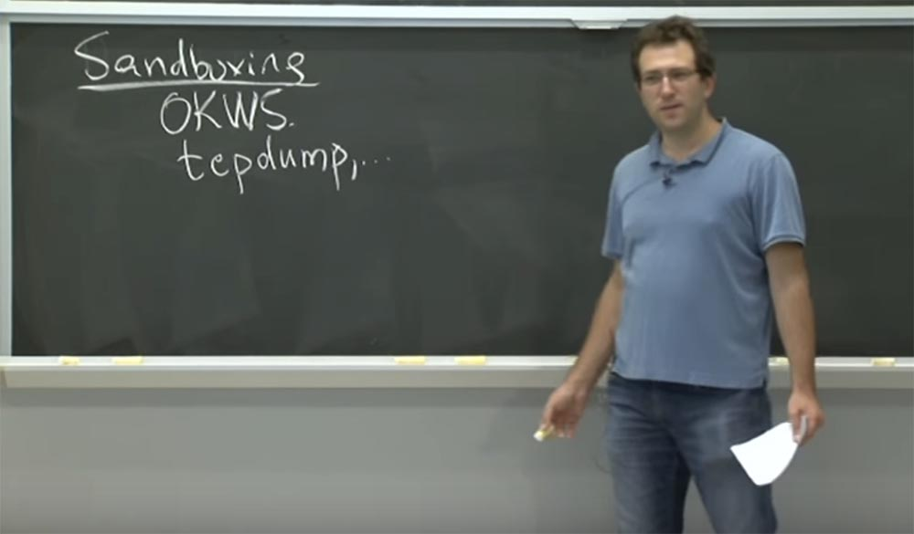
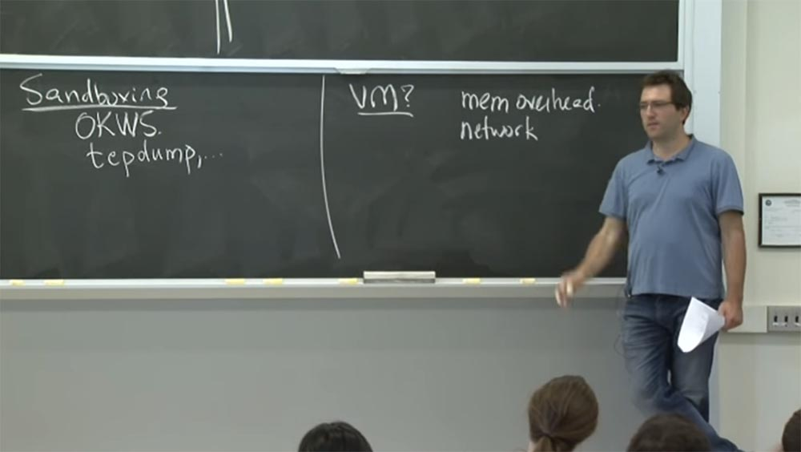
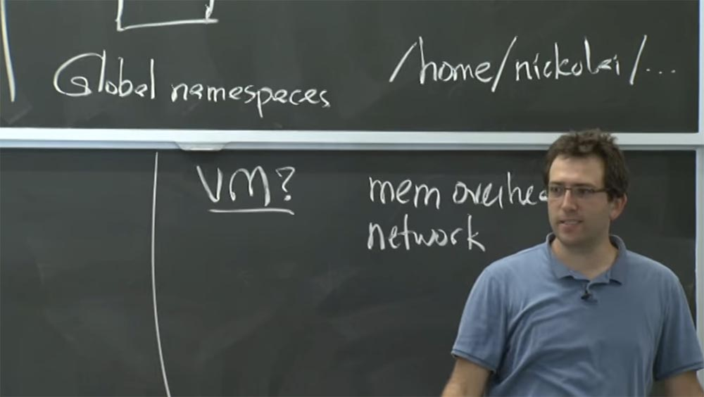
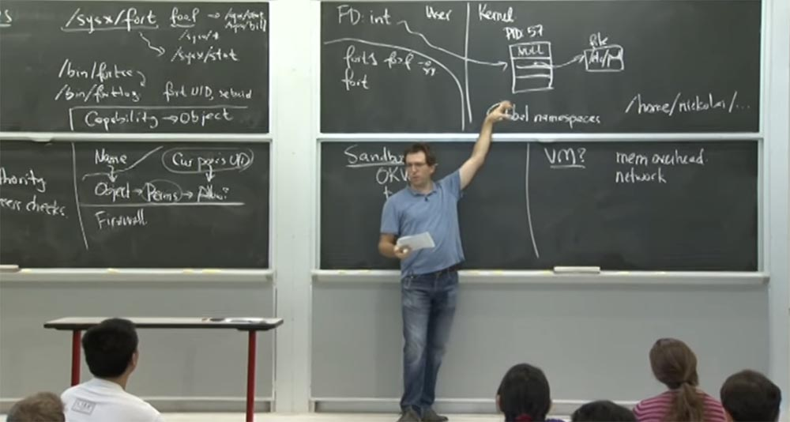
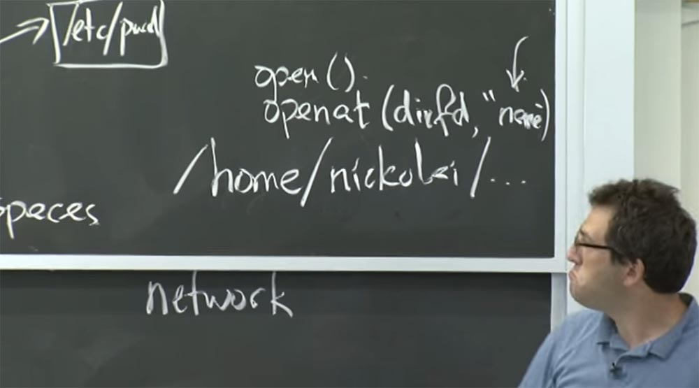
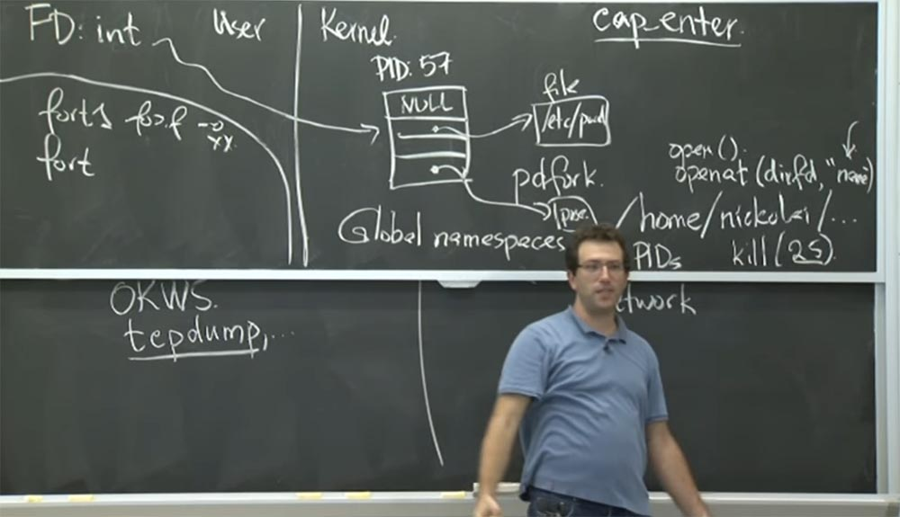
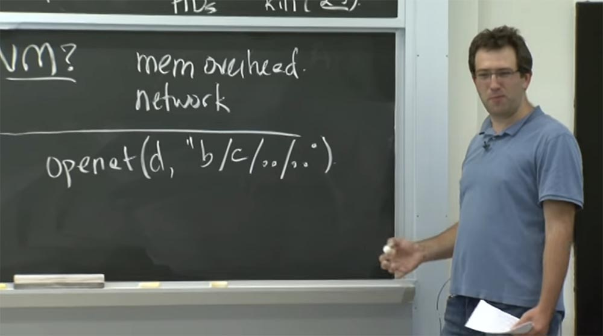

Курс MIT «Безопасность компьютерных систем». Лекция 6: «Возможности», часть 2 / Блог компании ua-hosting.company

### Массачусетский Технологический институт. Курс лекций #6.858. «Безопасность компьютерных систем». Николай Зельдович, Джеймс Микенс. 2014 год

Computer Systems Security — это курс о разработке и внедрении защищенных компьютерных систем. Лекции охватывают модели угроз, атаки, которые ставят под угрозу безопасность, и методы обеспечения безопасности на основе последних научных работ. Темы включают в себя безопасность операционной системы (ОС), возможности, управление потоками информации, языковую безопасность, сетевые протоколы, аппаратную защиту и безопасность в веб-приложениях.

Лекция 1: «Вступление: модели угроз» [Часть 1](https://habr.com/company/ua-hosting/blog/354874/) / [Часть 2](https://habr.com/company/ua-hosting/blog/354894/) / [Часть 3](https://habr.com/company/ua-hosting/blog/354896/)  
Лекция 2: «Контроль хакерских атак» [Часть 1](https://habr.com/company/ua-hosting/blog/414505/) / [Часть 2](https://habr.com/company/ua-hosting/blog/416047/) / [Часть 3](https://habr.com/company/ua-hosting/blog/416727/)  
Лекция 3: «Переполнение буфера: эксплойты и защита» [Часть 1](https://habr.com/company/ua-hosting/blog/416839/) / [Часть 2](https://habr.com/company/ua-hosting/blog/418093/) / [Часть 3](https://habr.com/company/ua-hosting/blog/418099/)  
Лекция 4: «Разделение привилегий» [Часть 1](https://habr.com/company/ua-hosting/blog/418195/) / [Часть 2](https://habr.com/company/ua-hosting/blog/418197/) / [Часть 3](https://habr.com/company/ua-hosting/blog/418211/)  
Лекция 5: «Откуда берутся ошибки систем безопасности» [Часть 1](https://habr.com/company/ua-hosting/blog/418213/) / [Часть 2](https://habr.com/company/ua-hosting/blog/418215/)  
Лекция 6: «Возможности» [Часть 1](https://habr.com/company/ua-hosting/blog/418217/) / [Часть 2](https://habr.com/company/ua-hosting/blog/418219/) / [Часть 3](https://habr.com/company/ua-hosting/blog/418221/)

**Аудитория:** можно сделать вывод, что на каждую возможность приходится по одному процессу?

**Профессор:** сомневаюсь. У вас может быть столько процессов, сколько вы хотите, для одной возможности могут существовать несколько процессов. Проще говоря, вам не обязательно нужен отдельный процесс для каждой возможности. Потому что здесь имеется процесс **fort1**, который может открыть много файлов и может передать много возможностей привилегированному компоненту **fort**.

Причина того, что вам кажется, что нужен отдельный процесс для каждой возможности, с которым мы имеем дело, касается этого странного взаимодействия между возможностями и внешними привилегиями.

Потому что у **fort1** есть внешняя привилегия. И то, что мы делаем, в основном состоит в преобразовании этой внешней привилегии в возможности **Capability** в этом процессе **fort1**. Так что если у вас есть несколько различных видов внешних привилегий или несколько различных привилегий, которые вы хотите использовать с осторожностью, тогда, вероятно, вы захотите отдельный процесс, обладающий этой привилегией. И всякий раз, когда вы захотите использовать определенный набор привилегий, вы будете просить соответствующий процесс выполнить разделение, и если это получится сделать, то вы попросите процесс вернуть вам **Capability**.

На самом деле там был такой дизайн операционной системы, который полностью основан на возможностях и не имел никаких внешних привилегий. И это круто, но не очень практично для использования в реальной системе. Оказывается, что в действительности вы хотите не столько внешних привилегий, сколько возможности назвать объект и рассказать кому-то об этом объекте, не передавая права на этот объект в обязательном порядке.

Возможно, я не знаю, какие привилегии у вас могут быть в отношении какого-то общего документа, но хочу сообщить вам, что у нас имеется этот общий документ. Если вы можете прочитать его, прочитайте его. Если вы пишете в него его, отлично, пишите. Но я не хочу передавать какие-либо права на него. Я просто хочу сказать тебе: «Эй, вот эта штука, иди, попробуй»! Так что это неудобство в мире возможностей, потому что это действительно принуждает вас никогда не говорить об объектах без передачи прав на этот объект.

Поэтому важно знать об этом и использовать данную особенность в некоторых частях системы, но не рассчитывать, что на этом решение безопасности системы исчерпывается.

**Аудитория:** предположим, что процесс имеет возможности, данные ему каким-то другим процессом, но при этом выясняется, что по отношению к какому-то объекту он уже имеет большие возможности. Может ли процесс сравнить их, чтобы убедиться, что они касаются одного и того же объекта? Или он будет использовать большие возможности?

**Профессор:** дело в том, что процесс не использует возможности неявным образом, так что это очень полезное свойство возможностей. Вы должны абсолютно определённо указать, какую из возможностей вы используете. Так что подумайте об этом с точки зрения файлового дескриптора. Предположим, что я даю вам открытый файловый дескриптор для некоторого файла, и он доступен только для чтения. Далее кто-то другой дает вам еще одну возможность для других файлов, в число которых может входить и этот файл. И новая возможность позволяет читать и записывать в файлы.

В этом случае, если вы попытаетесь сделать запись в первый файл, у вас это несомненно получится, потому что для него будет открыт дополнительный файловый дескриптор, разрешающий не только чтение, но и запись. Так что это своего рода классная вещь, когда вам не нужны лишние внешние привилегии. У вас просто имеются все эти возможности, потому что люди на самом деле построили такие библиотеки и в принципе, они управляют для вас вашими возможностями. Они вроде как собирают их. И при попытке выполнить операцию они ищут возможности и находят те, которые заставляют её работать.

Это возвращает вас к внешнему управлению **ambient authority**, которого вы пытались избежать. Положительное свойство возможностей заключается в том, что эта программная конструкция, которая упрощает вам жизнь. Это является редкостью в решениях безопасности. Это свойство облегчает вам написание кода, который указывает именно на те привилегии, которые вы хотите использовать с точки зрения безопасности. И это довольно несложный для написания код.  
Однако **Capability** способны решать и другие проблемы. Так, проблемы управления привилегиями часто появляются, когда требуется выполнить некий неблагонадёжный код. Потому что вы действительно хотите контролировать, какие привилегии вы даёте, потому что иначе возникает риск неверного использования любых предоставляемых вами привилегий. И это немного другая точка зрения, с которой авторы статьи о **Capsicum** подходят к возможностям. Они, конечно, знают о проблеме внешних полномочий, но это немного другая проблема, которую вы можете или не можете решить. Но в основном их заботит то, что у них есть действительно большое привилегированное приложение, и они беспокоятся, что в разных частях исходного кода этого приложения будут ошибки. Поэтому они хотели бы уменьшить привилегии различных компонентов этого приложения.

В этом смысле история очень похожа на **OKWS**. Итак, у вас есть большое приложение, вы разбиваете его на компоненты и ограничиваете привилегии для каждого компонента. Это, несомненно, имеет смысл в **OKWS**. Есть ли другие ситуации, когда вы могли бы озаботиться разделением привилегий? Я думаю, что в своей статье они описывают примеры, которые я должен попробовать выполнить, например, **tcpdump** и другие приложения, которые анализируют данные сети. Почему же они так беспокоятся о приложениях, которые анализируют сетевые входы? Что происходит в **tcpdump**? В чём состоит причина их паранойи?

**Аудитория:** злоумышленник может контролировать то, что отправляется и что вызывается для выполнения, например, пакеты.

**Профессор:** да, они действительно беспокоятся об атаках такого рода и о том, сможет ли злоумышленник действительно контролировать входные данные? Потому что это достаточно проблематично, если вы пишете код на **C**, который должен обрабатывать структуры данных. Очевидно, вы будете совершать много манипуляций с указателями, копируя байты в массивы, выделяющие память. При этом легко ошибиться с управлением памятью, что приведёт к довольно катастрофическим последствиям.

Так что в этом состоит причина, почему они решили разобрать работу своего сетевого протокола и прочих вещей в «песочнице».

Другой пример реального мира, в котором необходимо разделение привилегий, это ваш браузер. Вероятно, вы захотите изолировать ваш Flash-плагин, или ваше расширение **Java**, или что-то еще. Потому что они представляют собой широкое поле для атак, которые используются довольно агрессивно.

Так что это кажется разумным планом. Например, если вы пишете какую-то часть программного обеспечения, вы хотите проверить в «песочнице» поведение её компонентов. В более общем плане это относится к тому, что вы скачали из интернета и собираетесь запустить с меньшими привилегиями. Подходит ли этого стиль изоляции, предлагаемый в **Capsicum**? Я мог бы скачать какой-нибудь случайный скринсейвер или какую-нибудь игру из интернета. И я хочу запустить их на своем компьютере, но прежде убедиться, что они не испортят всё, что у меня есть. Вы бы использовали для этого **Capsicum**?

**Аудитория:** вы можете написать программу для песочницы, в которой вы будете использовать **Capsicum**.

**Профессор:** правильно. А как бы вы его использовали? Ну, вы бы просто вошли в режим песочницы при помощи команды **cap_enter**, а потом запустили программу. Вы ожидаете, что это сработает? Я думаю, здесь возникнет проблема. Она будет связана с тем, что если программа не ожидает, что она будет изолирована **Capsicum**, то она может попытаться открыть общую библиотеку, но не сможет это сделать, потому что не сможет открыть что-то типа **/lib/…**, потому что подобное не допускается в режиме **Capability**.

Поэтому эти методы «песочницы» стоит применять для тех вещей, для которых разработчик предусмотрел, что они смогут выполняться именно в таком режиме. Наверное, есть другие методы «песочницы», которые могут быть использованы для не модифицированного кода, но затем требования могут немного поменяться. Поэтому создатели **Capsicum** не очень беспокоятся об обратной совместимости. Если мы должны открыть файлы по-другому – мы откроем их по-другому. Но если вы хотите оставить существующий код, вам понадобиться нечто большее, например, полноценная виртуальная машина, чтобы в ней можно было запустить код. Здесь возникает вопрос — должны ли мы использовать виртуальные машины для «песочницы» **Capsicum**?

**Аудитория:** при этом возможен перерасход памяти.

**Профессор:** да, это так. Но что, если нас не волнует память? Так что, возможно, виртуальные машины очень хороши, к тому же они не используют много памяти. Так по какой ещё причине нам не стоит использовать **VM** в **Capsicum**?

**Аудитория:** трудно контролировать сетевую активность.

**Профессор:** Правильно! Трудно контролировать то, что происходит в сети, потому что либо вы не даёте виртуальной машине доступ к сети, либо подключаетесь к сети через режим **NAT**, или используете **Preview** или **VMWare**. Но тогда ваша «песочница» может получить доступ ко всему интернету. Поэтому вам придется более детально управлять сетью, возможно, установив правила брандмауэра для виртуальной машины и так далее. Это не слишком хорошо.

Но что, если вы не заботитесь о сети? Допустим, у вас просто какое-то видео Что делать, если вы обрабатываете какое-то простое видео или анализируете **tcpdump**. В этом случае вы просто запускаете виртуальную машину, она начинает разбирать ваши пакеты **tcpdump** и откидывает вас назад после презентации, которую **tcpdump** хочет записать для пользователя, потому что здесь нет реального сетевого ввода-вывода. Итак, есть ещё какая-нибудь причина?

**Аудитория:** потому что издержки инициализации всё еще велики.

**Профессор:** да, это могут быть начальные издержки запуска виртуальной машины, которые понижают производительность. Так что это правда.

**Аудитория:** ну, вы ещё можете захотеть иметь права на базу данных и тому подобное.

**Профессор:** да. Но в более общем плане это означает, что у вас имеются реальные данные, с которыми вы работаете, и их действительно трудно разделить. Таким образом, виртуальные машины представляют собой действительно намного больший механизм разделения, из-за которого вы не можете легко делиться вещами. Так что это хорошо для ситуаций, когда у вас есть полностью изолированная программа, которую вы хотите запустить, и при этом вы не хотите делиться какими-то файлами, каталогами, процессами и просто позволяете им работать отдельно.

Так что это здорово. Это, вероятно, в некотором роде, более сильная изоляция, чем та, что обеспечивает **Capsicum**, потому что здесь имеется меньше возможностей, чтобы всё пошло не так. Однако такая изоляция не применима во многих ситуациях, когда вы захотите использовать **Capsicum**. Потому что в **Capsicum** вы можете обмениваться файлами с большой точностью, используя возможности «песочницы».

Итак, давайте возьмем **tcpdump** и посмотрим, почему его трудно изолировать с помощью механизма **Unix**. Если помните, в **Capsicum** способ работы **tcpdump** заключается в том, что он открывает некоторые специальные сокеты, а затем запускает логику разбора на сетевых пакетах, после чего она печатается на терминалах пользователей. Итак, что нужно для песочницы **tcpdump** на базе **Unix**? Ограничены ли ваши привилегии? Проблема с **Unix** заключается в том, что единственный способ действительно изменить привилегии – это изменить входные данные в функции принятия решения, которая решает, действительно ли вы можете получить доступ к какому-то объекту или нет. И единственное, что вы действительно можете изменить, это привилегии процесса. Это будет означать, что процесс сможет послать **UID** кому-то ещё.

Или вы можете изменить разрешения для различных объектов, которые находятся в вашей системе. На самом деле, вы можете использовать оба эти решения.

Если вы хотите изолировать **tcpdump** в песочнице, вам, вероятно, придется выбрать дополнительный идентификатор пользователя и переключиться на него во время работы. Но это не идеальный план, так как вы не собираетесь запускать несколько экземпляров **tcpdump** под одним и тем же **ID** пользователя. Поэтому, если я скомпрометирую один экземпляр **tcpdump**, это не будет означать, что я хочу позволить атакующему использовать этот фактор для управления другими экземплярами **tcpdump**, запущенными на моей машине. Так что потенциально это неудачное решение — использовать **uid** в данном случае.

Другая проблема заключается в том, что в **Unix** вы должны иметь root-права, чтобы изменить идентификатор пользователя, его привилегии, процесс или что-то ещё или переключить их на что-то другое. Это тоже плохо.

И ещё одна проблема заключается в том, что, независимо от того, каков ваш **ID**, могут существовать файлы с открытым доступом. Так что в вашей системе может существовать целая группа читаемых или записываемых файлов, например, файл паролей. Ведь независимо от того, какой у вас **ID**, процесс всё равно сумеет прочитать этот пароль. Так что это тоже не очень приятно.

Таким образом, чтобы организовать песочницу в **Unix**, вы, вероятно, должны совершить оба действия — изменить **UID** и внимательно пересмотреть разрешения для всех объектов, чтобы убедиться, что у вас не осталось неизолированных открытых файлов, чувствительных к перезаписи или доступных для чтения хакером. Я думаю, что при этом вы получаете еще один механизм, который можете использовать. Если вы представляете его до конца, то можете увидеть затруднения в обмене файлами или в совместном использовании каталогов.

Теперь давайте посмотрим, как пытается решить эту проблему **Capsicum**. Здесь, как только мы войдём в режим «песочницы», всё будет доступно только через возможности. Поэтому, если у вас нет возможности **Capability**, вы просто не cможете получить доступ ни к каким объектам.

Эти ребята в статье делают огромную ставку на глобальное пространство имен. Так что это за глобальное пространство имён, и почему они так о нём беспокоятся?

У них сама файловая система является своего рода ярким примером глобального пространства имен. Вы можете написать слеш и перечислить за ним любой файл, какой захотите. Например, пойти к кому-то в домашний каталог, например, **/home/nickolai/…** Почему это плохо? Почему они против глобального пространства имён в **Capsicum**? Как вы думаете?

**Аудитория:** если у вас есть неправильные разрешения, то при использовании полномочий вы можете попасть в беду.

**Профессор:** да. Проблема в том, что это все-таки **Unix**. Таким образом, есть ещё регулярные разрешения на файл. Поэтому, возможно, если вы действительно захотите изолировать какой-то процесс в «песочнице», то вообще ничего не сможете прочитать или записать в системе. Но если вам удастся найти в домашнем каталоге какого-то глупого пользователя файл с возможностью записи, то это будет довольно неприятно для клиента «песочницы».

В более общем плане их идея заключалась в том, чтобы точно перечислить все объекты, которые имеет процесс. Потому что вы можете просто перечислить все возможности в таблице файловых дескрипторов или в любом другом месте, где хранятся возможности для вас. И это единственное, к чему может прикасаться процесс.

Но если у вас будет доступ к глобальному пространству имён, то это потенциально невыполнимо. Потому что даже если у вас есть ограниченный набор возможностей, вы всё равно могли бы начать строку со слеша и записать какой-то новый файл, причём вы никогда не будете знать набор операций или объектов, к которым этот процесс может получить доступ.

Вот почему они так беспокоятся о глобальном пространстве имён, потому что оно противоречит их цели точно контролировать всё, к чему процесс «песочницы» должен иметь доступ. Таким образом, они попытались устранить глобальные пространства имен с помощью множества изменений ядра во **FreeBSD**. В их случае ядро должно было убедиться, что все операции проходят через какие-то возможности, а именно, через файловый дескриптор.

Давайте проверим, действительно ли нам нужны изменения ядра. Что, если мы просто проделаем это в библиотеке? Ведь мы реализуем **Capsicum**, у которого уже есть библиотека. И всё, что мы делаем, это меняем все эти функции, такие, как «открыть, читать, писать», на использование исключительно возможностей **Capability**. Тогда все операции будут проходить через некоторые возможности, искать их в таблице файлов, и так далее. Это будет работать?

**Аудитория:** вы всегда можете сделать системный вызов **syscall**.

**Профессор:** да. Проблема в том, что существовал набор системных вызовов, которые принимает ядро, и даже если вы реализуете хорошую библиотеку, это не предотвратит возможность того, что плохой или скомпрометированный процесс выполнит системный вызов напрямую. Поэтому вы должны каким-то образом укрепить ядро.

В компиляторе модель угрозы заключается не в скомпрометированном процессе компилятора и не в произвольном коде, а в невнимательности программиста. Так что если разработчик программы не ошибается и поступает правильно, то библиотеки, вероятно, будет вполне достаточно.

С другой стороны, если мы говорим о процессе, который может выполнить произвольный код и попытаться обойти наши механизмы любым возможным способом, то мы должны иметь чёткие принудительные границы. Но так как библиотека не обеспечивает какого-либо сильного принуждения, ядро может пойти на поводу у процесса.

Что же они на самом деле делают с точки зрения изменений в ядре? Первое — это системный вызов, который они называют **cap_enter**. И что произойдет, когда вы запустите **cap_enter**? Что будет, если вы внедрите его в ваш процесс?

Насколько я могу судить, ядро перестанет принимать любые системные вызовы, которые относятся к глобальному пространству имён. И единственное, что вы сможете сделать, это обратиться к существующим файловым дескрипторам, которые были открыты вашим процессом. Таким образом **cap_enter** переведёт ваш процесс в особый режим, в котором вы не можете использовать обычную систему под названием **open ()**, и вместо неё должны будете использовать **openat**.

В Unix-подобных операционных системах существует новое семейство системных вызовов, где вместо того, чтобы использовать **open** для одного имени файла, можно использовать **openat**, при этом в первую очередь открывается аргумент, который является файловым дескриптором для каталога, а во вторую — своего рода имя файла: **openat (dirfd,“name)**. И этот системный вызов **openat** откроет это имя **«name»** в том каталоге, на который указывает файловый дескриптор.

Таким образом, это гораздо более зависящая от возможностей **Capability** версия функции **open**, в которой можно иметь файловые дескрипторы, указывающие на каталоги, поэтому вы всё еще можете руководить своей операцией. Но для этого необходимо иметь возможность доступа к каталогу в виде открытого файлового дескриптора. Нужны ли им какие-либо другие изменения ядра? Есть еще что-нибудь, о чём они беспокоятся? Я думаю, что есть – это доступ к сети. Так что они делают с доступом к сети, что же происходит с ним в режиме возможностей?

**Аудитория:** вероятно, у них есть возможности для пакетов безопасности.

**Профессор:** да. Поэтому я думаю, что в основном они рассматривают сеть как глобальное пространство имён, очень похожее на файловую систему. Поэтому я думаю, что как только вы войдёте в режим возможностей, вы не сможете создать новый сокет. Или вы не сможете создать новый сокет и подключиться к некоторым произвольным компьютерам, к произвольному адресу или номеру порта. Вы должны будете заранее создать все соединения, которые вам нужны, и заполнить их как возможности. Или вам придётся получить их от кого-то, кто передаст вам файловый дескриптор.

Но в принципе, как только вы очутитесь в режиме возможностей, набор файловых дескрипторов, которые вы открыли, полностью перечислит все компьютеры, с которыми вы можете общаться. Таким образом, вы сможете найти открытые соединения, прослушать порты и т.д. Предположим, вы прослушиваете сеть как злоумышленник, в таком случае вы не сможете подключиться к указанному адресу по абсолютному имени, хотя глобальное пространство имен вроде как позволяет вам это сделать. В этом есть смысл?

Так выглядит доступ через сетевое пространство имен. Что они делают для процессов? Я думаю, в **Unix** другое глобальное пространство имён образуют сами идентификаторы процессов **PID**. К примеру, рассмотрим системный вызов **kill (25)** для процесса с **PID = 25**. Я могу уничтожить конкретный процесс, подставив туда его номер. Как это исправить в **Capsicum**? В чём заключается их план?

**Аудитория:** файловые дескрипторы с процессами.

**Профессор:** да. Вообще-то, это круто. Похоже, что в **Unix** есть и то, и другое. Вместо того, чтобы иметь эти различные числа для **PID**, когда вы разветвляете процесс, у вас имеется новый вариант функции **fork**, который называется **pdfork**, или «разветвление дескриптора процесса». Когда он создает дочерний процесс, то фактически вставляет ссылку на этот дочерний процесс в ваш файл где-то в таблице дескрипторов.

И это ваш новый процесс. И вы можете управлять дочерним процессом, указав номер файлового дескриптора. Это довольно круто, ведь теперь вы можете передать дочерний процесс кому-то еще и сказать: «вы можете пойти и «убить» его сейчас, или вы можете управлять этим процессом, как вы хотите, и вы будете получать уведомления, когда процесс умрёт». Это будет выглядеть как читаемый файловый дескриптор и так далее. Таким образом, они действительно пытаются гомогенизировать всё, чтобы оно выглядело как какой-то файловый дескриптор.

И с этими изменениями ядра вы сможете, наконец, получить все функциональные возможности, которые вас заботят. У вас уже есть поддержка сокетов, дескрипторов процессов и так далее. У вас есть способ ограничить то, что может сделать процесс, потому что он больше не может обратиться к любому имени в глобальном пространстве имён.

Вот вам интересная головоломка. Я пытался понять из статьи, что значимого они сделали с пустой записью «точка-точка» в именах каталогов. По существу они говорят, что если в режиме возможностей использовать **openat** для определённых имён, то в них нельзя использовать «точка-точка». Предположительно, если у вас есть сложная ссылка и её цель содержит в своём имени выражение «точка-точка», то в режиме возможностей вас отбросит назад.

Но так ли это обязательно? Смогли бы вы в принципе представить себе безопасный дизайн, который позволяет использовать «точка-точка» в имени каталога?

**Аудитория:** вам нужно будет узнать, есть ли у них файл или возможность, которая позволяет переходить в родительский каталог. Ведь опускаться вниз достаточно просто, потому что благодаря имеющейся возможности **Capability** у вас уже есть доступ к любому подкаталогу.

**Профессор:** да, это правильно.

**Аудитория:** но поднимаясь вверх, вы должны видеть, есть ли у вас какие-либо возможности для родительского каталога…

**Профессор:** и это правильно.

**Аудитория:** так что вам нужно будет как-то их разыскать.

**Профессор:** правильно, но это немного сложно и как бы противоречит принципу предоставления полномочий. Что если вы используете «точку-точку» внутри одного открытого вызова? Что делать, если вы вызываете **openat** для какого-то определенного каталога или файлового дескриптора и открываете **b/c/../..**?

В принципе, это может быть безопасно, верно? Потому что вы спускаетесь в какой-то каталог, а потом просто поднимаетесь из него обратно. Но вам, вероятно, нужно убедиться, что в выражении **openat (d, “b/c/../..)** имя **«c»** не является сложной ссылкой, которая ведёт куда-то еще и так далее.

Это довольно сложно. И я думаю, в статье они в основном спорили о том, что на самом деле довольно сложно на практике реализовать достаточный набор проверок, который бы удовлетворял всем условиям безопасности. Поэтому они поступают консервативно и запрещают использовать в именах пустые записи «точка-точка», если вы находитесь в режиме возможностей. Я думаю, что эти ребята просто были очень осторожны в определении того, что разрешено и что не разрешено в режиме возможностей. Итак, в режим возможностей кажется, что все контролируется вашей таблицей файлов. Как вы думаете, в этом режиме ваш **UID** все еще имеет какое-то значение?

**Аудитория:** вы все еще можете запустить процесс, который не использует возможности.

**Профессор:** нет, вы не можете этого сделать. Посмотрим, что произойдёт, если мы «убьём» **UID**? Это должно выглядеть так: мы выполняем вход **cap_enter** и просто убиваем **UID** текущего процесса. Нас больше не волнует, что это такое. Но если вдруг процесс попытается открыть этот файл? Какие проверки мы должны выполнить?

**Аудитория:** вероятно, **UID** полезен для целей ведения журнала, кроме того, он, возможно, скажет, если вы что-то сделали.

**Профессор:** вы правы, это так. Потому что на самом деле «убивать» **UID** вредно. Предположим, я породил некоторый процесс песочницы на моей машине, и вдруг он теряет свой **UID**. Получается, что у меня в компьютере есть сотни запущенных процессов, а я понятия не имею, что это такое. Поэтому уничтожение **UID** не очень хороший план для целей управления.

54:14 мин

Продолжение:

[Курс MIT «Безопасность компьютерных систем». Лекция 6: «Возможности», часть 3](https://habr.com/company/ua-hosting/blog/418221/)

Полная версия курса доступна [здесь](https://ocw.mit.edu/courses/electrical-engineering-and-computer-science/6-858-computer-systems-security-fall-2014/).

Спасибо, что остаётесь с нами. Вам нравятся наши статьи? Хотите видеть больше интересных материалов? Поддержите нас оформив заказ или порекомендовав знакомым, **30% скидка для пользователей Хабра на уникальный аналог entry-level серверов, который был придуман нами для Вас:** [Вся правда о VPS (KVM) E5-2650 v4 (6 Cores) 10GB DDR4 240GB SSD 1Gbps от $20 или как правильно делить сервер?](https://habr.com/company/ua-hosting/blog/347386/) (доступны варианты с RAID1 и RAID10, до 24 ядер и до 40GB DDR4).

**Dell R730xd в 2 раза дешевле?** Только у нас **[2 х Intel Dodeca-Core Xeon E5-2650v4 128GB DDR4 6x480GB SSD 1Gbps 100 ТВ от $249](https://ua-hosting.company/serversnl) в Нидерландах и США!** Читайте о том [Как построить инфраструктуру корп. класса c применением серверов Dell R730xd Е5-2650 v4 стоимостью 9000 евро за копейки?](https://habr.com/company/ua-hosting/blog/329618/)