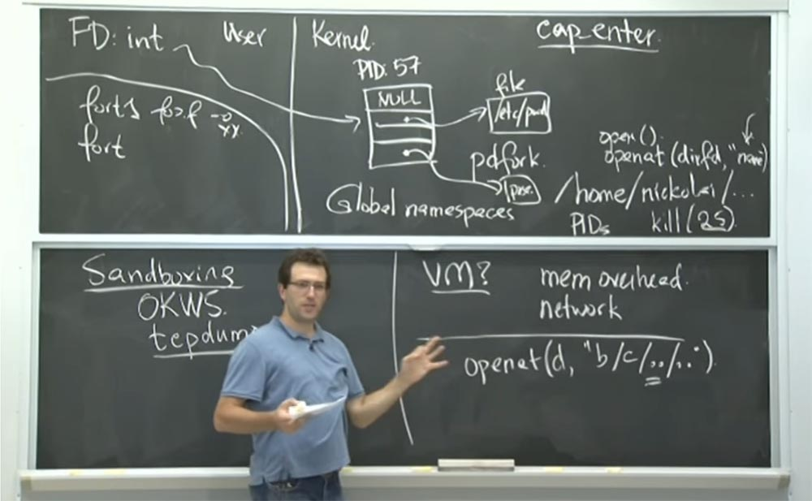
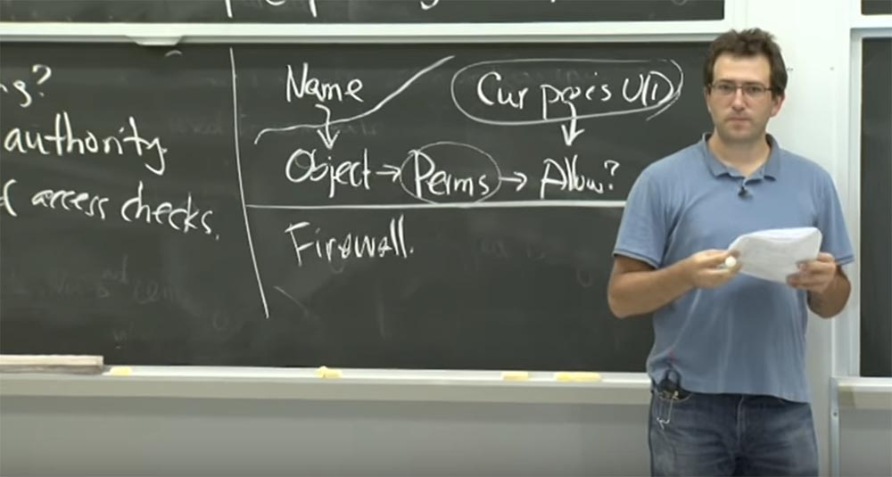
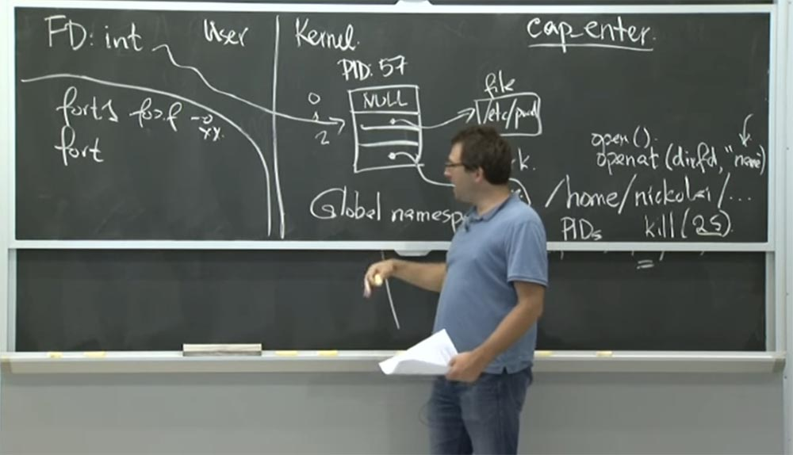
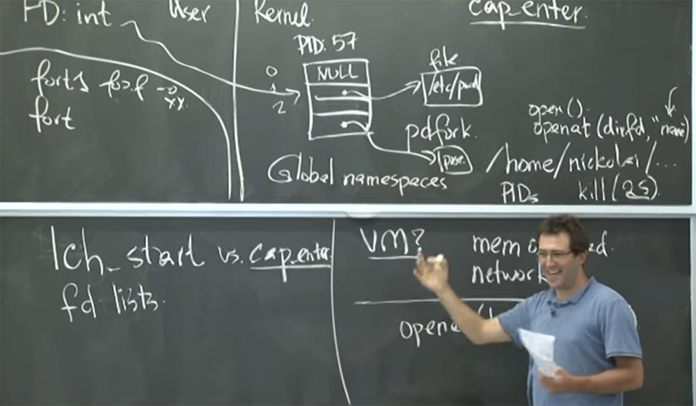
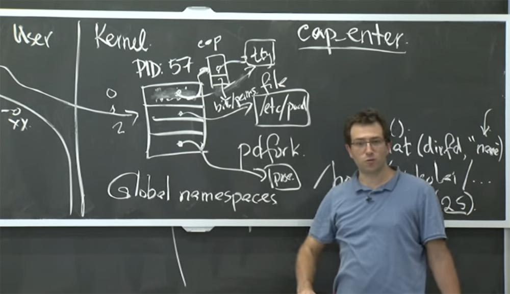
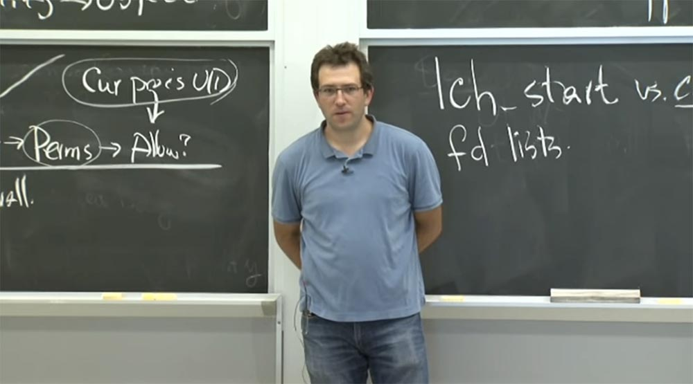

Курс MIT «Безопасность компьютерных систем». Лекция 6: «Возможности», часть 3 / Блог компании ua-hosting.company

### Массачусетский Технологический институт. Курс лекций #6.858. «Безопасность компьютерных систем». Николай Зельдович, Джеймс Микенс. 2014 год

Computer Systems Security — это курс о разработке и внедрении защищенных компьютерных систем. Лекции охватывают модели угроз, атаки, которые ставят под угрозу безопасность, и методы обеспечения безопасности на основе последних научных работ. Темы включают в себя безопасность операционной системы (ОС), возможности, управление потоками информации, языковую безопасность, сетевые протоколы, аппаратную защиту и безопасность в веб-приложениях.

Лекция 1: «Вступление: модели угроз» [Часть 1](https://habr.com/company/ua-hosting/blog/354874/) / [Часть 2](https://habr.com/company/ua-hosting/blog/354894/) / [Часть 3](https://habr.com/company/ua-hosting/blog/354896/)  
Лекция 2: «Контроль хакерских атак» [Часть 1](https://habr.com/company/ua-hosting/blog/414505/) / [Часть 2](https://habr.com/company/ua-hosting/blog/416047/) / [Часть 3](https://habr.com/company/ua-hosting/blog/416727/)  
Лекция 3: «Переполнение буфера: эксплойты и защита» [Часть 1](https://habr.com/company/ua-hosting/blog/416839/) / [Часть 2](https://habr.com/company/ua-hosting/blog/418093/) / [Часть 3](https://habr.com/company/ua-hosting/blog/418099/)  
Лекция 4: «Разделение привилегий» [Часть 1](https://habr.com/company/ua-hosting/blog/418195/) / [Часть 2](https://habr.com/company/ua-hosting/blog/418197/) / [Часть 3](https://habr.com/company/ua-hosting/blog/418211/)  
Лекция 5: «Откуда берутся ошибки систем безопасности» [Часть 1](https://habr.com/company/ua-hosting/blog/418213/) / [Часть 2](https://habr.com/company/ua-hosting/blog/418215/)  
Лекция 6: «Возможности» [Часть 1](https://habr.com/company/ua-hosting/blog/418217/) / [Часть 2](https://habr.com/company/ua-hosting/blog/418219/) / [Часть 3](https://habr.com/company/ua-hosting/blog/418221/)

**Аудитория:** если этот **UID** обеспечивает доступ к этому файлу только для чтения, и у вас есть ещё и файловый дескриптор, то если вы потеряете **UID**, вы всё равно сможете получить разрешение на чтение этого файла?

**Профессор:** да, так как он появится в каталогах. Потому что как только вы добавляете возможность к файлу, на этом всё заканчивается. Он открыт для вас с особыми привилегиями и так далее. Но проблема состоит в том, что у них есть этот гибридный дизайн.

То есть они говорят — вы действительно можете добавить возможности в каталоги и вы можете открыть новый файл, так как работаете параллельно. При этом может быть так, что вы добавляете возможность в каталог, например **/etc**, но у вас нет обязательного доступа ко всем файлам директории **/etc**. Но как только вы войдете в режим возможностей, то сможете попробовать открыть эти файлы, зная, что у вас есть доступ к директории **/etc**. Ведь она уже открыта, так почему бы вам не дать мне файл по имени **«password»**, расположенный в этом каталоге?

И тогда ядру нужно принять решение о том, разрешать ли вам открывать файл в этом каталоге в режиме чтения, или записи, или что у вас есть. Так что я думаю, что это единственное место, где вам все еще нужна эта внешняя привилегия, потому что они попытались создать совместимый дизайн, где использовали не слишком естественную семантику для описания работы каталогов. Это выглядит единственным местом, где остались принципы настройки файловой системы **Unix**.

**Аудитория:** есть ли другие такие же места?

**Профессор:** хороший вопрос. Я думаю, что мне придется получить их предыдущий исходный код, чтобы выяснить, что происходит, но большинство других ситуаций в действительности не требуют проверку **UID**. Потому что, например, для сетей она не применяется. Вероятно, это обычные операции файловой системы – если у вас есть сегмент общей памяти, вы его просто открываете, и всё.

**Аудитория:** не могли бы вы еще раз объяснить, какое именно значение имеет ID пользователя, если у вас есть возможность **Capability**?

**Профессор:** это важно, когда у вас есть возможность для каталога. Вопрос в том, что вам представляет данная возможность? Рассмотрим одну интерпретацию, например, состояние возможностей чистой системы, не **Capsicum**. Если в такой системе у вас есть возможность для каталога, то у вас есть безусловный доступ ко всем файлам в этом каталоге.

В **Unix** это, как правило, не так. Вы можете открыть каталог как **/etc**, но в нём имеется много системных файлов, в которых может храниться конфиденциальная информация, например, приватный ключ сервера. И то, что вы можете открыть и пролистать этот каталог, не означает, что вы не сможете открыть файлы в этом каталоге. То есть, имея доступ к каталогу, вы имеете доступ и к файлам.

В **Capsicum**, если вы открываете каталог **/etc** и затем входите в режим возможностей, происходит следующее. Вы говорите: «Я не знаю, что это за каталог. Я просто добавляю в него файловый дескриптор». Там есть файл под названием «key». Почему же вы не открываете этой файл **«key»**? Просто потому, что в тот момент, вы, вероятно, не хотите, чтобы этот основанный на возможности процесс открыл данный файл, потому что это вам не нужно. Хотя это позволяет вам обойти разрешения **Unix** для файла.

Поэтому я думаю, что авторы этой статьи осторожно подошли к разработке системы, которая бы не нарушала существующие механизмы безопасности.

**Аудитория:** то есть вы говорите, что в некоторых случаях можно использовать комбинацию из этих двух факторов безопасности? То есть, хотя пользователь и может изменить файл в каталоге, то, к каким файлам он получает доступ, зависит от его ID пользователя?

**Профессор:** да, именно так. На практике в **Capsicum**, раньше, чем вы войдёте в режим возможностей, вы должны угадать, какие файлы вам могут понадобиться позднее. Возможно, вам понадобятся общие библиотеки, текстовые файлы, шаблоны, сетевые соединения и так далее. Поэтому вы заранее всё это открываете. И не всегда обязательно знать, какой именно файл вам нужен. Так что эти ребята сделали так, что вы можете просто открыть файловый дескриптор каталога, а необходимые вам файлы просмотреть позже. Однако может быть так, что эти файлы не имеют те же разрешения, что имеете вы. Вот именно по этой причине используется комбинация двух факторов безопасности – проверка возможностей и **uid** пользователя. Так что это часть механизма ядра.

Зачем им нужна такая библиотека, как **libcapsicum**? Я думаю, имеются две основные вещи, которые они поддерживают в этой библиотеке.

Одна из них заключается в том, что они реализуют функцию под названием **lch_start**, которую вы должны использовать вместо функции **cap_enter**. Другой функцией, которую предоставляет библиотека **libcapsicum**, является понятие fd lists, которое служит для передачи файловых дескрипторов по номерам. Назначение этого списка **fd lists** легко объяснить. Это в основном обобщение того, как **Unix** управляет и передает файловые дескрипторы между процессами. В традиционных **Unix** и **Linux**, которыми вы пользуетесь сегодня, при запуске процесса ему передаются некоторые файловые дескрипторы. Вы просто открываете некоторые файловые дескрипторы с целочисленными значениями из этой таблицы и запускаете нужный вам дочерний процесс. Или вы запускаете определенный двоичный файл, и он наследует все эти открытые слоты в таблице **fd**. При этом не существует иного хорошего способа назвать эти вещи, кроме как использовать номера в качестве имён.

Рассмотрим пример, в котором слот 0 будет использоваться для входных данных, слот 1 для выходных данных, слот 2 – для печати сообщений об ошибках. Так это работает в **Unix**. И оно работает нормально, если вы просто передаете эти три файла или три потока данных в процесс.

Но в **Capsicum** происходит так, что вы «проходите» намного больше файловых дескрипторов на своём пути. Так, когда вы передаете файловый дескриптор для некоторых файлов, вы проходите файловый дескриптор для сетевого подключения, дескриптор для общей библиотеки, которая и вас есть, и так далее. Управлять всеми этими цифрами довольно утомительно. Поэтому, фактически, **libcapsicum** предоставляет возможность абстрагироваться от наименования этих прошлых файловых дескрипторов между процессами с помощью иерархического имени, которое используется вместо этих непонятных целых чисел.  
Это одна из простых вещей, которые они предоставляют в своей библиотеке. Так что я могу передать процессу файловый дескриптор и дать ему имя, при этом не имеет значения, каким номером он обозначен. Такой способ намного проще.

У них ещё есть другой, более замысловатый механизм запуска «песочницы». Это **lch**, хост **API** для запуска «песочницы», который используется вместо того, чтобы просто войти в режим возможностей **Capability**. Зачем же им потребовалось нечто большее, чем простой вход в режим возможностей? Что вас обычно беспокоит при создании песочницы?

**Аудитория:** вероятно, **lch** стирает все наследуемые вещи для того, чтобы обеспечить «чистый» старт системы.

**Профессор:** да. Я думаю, что они беспокоятся о том, чтобы попытаться учесть всё, к чему «песочница» имеет доступ. Дело в том, что если вы просто вызовете **cap_enter**, технически, на уровне механизма ядра, это сработает. Верно? Это просто помешает вам открыть какие-то новые возможности.

Но проблема состоит в том, что там может быть много существующих вещей, к которым процесс уже имеет доступ.

Поэтому я думаю, что самый простой пример – это наличие там открытых файловых дескрипторов, о которых вы забыли, и они просто будут унаследованы этим процессом.

Например, они рассматривали **tcpdump**. Во-первых, они изменили **tcpdump**, просто вызвав **cap_enter** ещё до того, как собрались разбирать все входящие сетевые соединения. В некотором смысле это работает хорошо, потому что вы не можете получить больше возможностей **Capability**. Но потом, посмотрев на открытый файловый дескриптор, они поняли, что у вас есть полный доступ к терминалу пользователя, потому что у вас есть для него открытый файловый дескриптор. Так что вы можете перехватить все нажатия клавиш, которые совершает пользователь, и тому подобное. Так что это, вероятно, не слишком хороший план для **tcpdump**. Потому что вы не хотите, что бы кто-то перехватывал вашу клавиатурную активность.

Поэтому в случае с **tcpdump** они вручную изменили файловые дескрипторы и добавили в них некоторые биты возможностей, чтобы ограничить виды операций, которые вы можете выполнить. Если помните, в **Capsicum** возможность тоже имеет эти дополнительные биты, указывающие класс операций, которые можно выполнить для данного файлового дескриптора. Таким образом, они в основном принимают то, что файловый дескриптор равен 0\. Он указывает на терминал пользователя **tty**. Первоначально это был просто прямой указатель на структуру **tty** в ядре. Для того, чтобы ограничить вид операций, который можно выполнять для этого дескриптора, они ввели некоторую промежуточную бета — структуру возможностей в середине. Таким образом, файловый дескриптор указывает на эту структуру возможностей, а она уже указывает на реальный файл, к которому вы пытаетесь получить доступ. И эта структура возможностей содержит в себе некоторые ограничительные биты или разрешения для объекта файлового дескриптора, которые можно реализовать.

Таким образом, при стандартном вводе данных в **tcpdump** вы ничего не сможете с ним сделать. Вы просто можете увидеть, что он существует, и всё. Для выходного файлового дескриптора они предусмотрели возможность, когда вы можете что-то в него записать, но не можете изменить запись, то есть вы не сможете отменить внесённые изменения.

Так о чем еще вы могли бы беспокоиться относительно запуска **«песочницы»**? Я думаю, о состоянии файлового дескриптора. Что-нибудь ещё имеет значение? Я думаю, в **Unix** это файловые дескрипторы и память.

Другое дело, что эти ребята беспокоятся о том, что в вашем адресном пространстве могут быть конфиденциальные данные, выделенные ранее. И процесс, который вы собираетесь изолировать в «песочнице», может прочитать всю имеющуюся память. Так что если там имеется какой-то пароль, который вы проверили раньше, при входе пользователя в систему, и вы ещё не очистили память, то этот процесс сможет его прочитать и сделать что-то «интересное».

Они решили эту проблему таким образом: в **lch_start** вы должны запустить «свежую» программу. Вы берёте программу и упаковываете в неё все аргументы, все файловые дескрипторы, которые хотите ей предоставить. Затем вы начинаете новый процесс или запускаете операцию повторной инициализации всего пространства виртуальной памяти. И тогда нет никаких сомнений в том, что этот процесс не получит какие-то дополнительные привилегии, чтобы затронуть набор конфиденциальных данных. Это именно то, что вы передали функции **lch_start**, с точки зрения бинарных имен, аргументов и возможностей программы.

**Аудитория:** что произойдет, если процесс, который вы запускаете, содержит бинарный **setuid= 0**?

**Профессор:** я думаю, что эти ребята не используют «бинарники» **setuid** в режиме возможностей, чтобы избежать некоторых странных взаимодействий, которые могут появиться. Они реализуют такое правило: у вас может быть программа **setuid**, которая получает свои привилегии от двоичного файла **setuid**, а затем она может вызвать **cap_enter** или **lch_start**. Но как только вы попадаете в режим возможностей, вы не можете восстановить дополнительные преференции.

В принципе, это могло бы сработать, но это было бы очень странно. Потому что, если помните, единственная вещь, где **UID** имеет значение, когда вы находитесь в режиме возможности, это открытие файлов внутри каталога. Поэтому неясно, действительно ли это отличный план для получения дополнительных привилегий или в нём присутствуют недостатки.

**Аудитория:** ранее мы говорили о том, почему библиотека на самом деле не поддерживает строгое разделение между этими двумя факторами безопасности. Но нам ведь не обязательно использовать **lch_start**?

**Профессор:** это правильно. Предположим, у вас имеется такая вещь, как **tcpdump**, или **gzip** – это ещё одна вещь, с которой они работают. Вы предполагаете, что приложение, вероятно, не скомпрометировано, и есть какая-то основная функция приложения, и вы заботитесь о том, как она поведёт себя в «песочнице». В случае **tcpdump** это разбор пакетов, поступающих из сети, в случае **gzip** это распаковка файлов. И вы до определенного момента предполагаете, что процесс делает всё правильно, и здесь не возникнет никаких уязвимостей. Поэтому вы доверяете ему запуск **lch_start** и считаете, что он правильно создаст образ, правильно настроит все возможности, а затем ограничит себя от каких — либо дальнейших системных вызовов за пределами режима возможностей.

А затем вы запускаете опасные вещи. Но к тому времени установка произошла правильно, и у вас нет способа выбраться из этой песочницы. Итак, я думаю, нужно посмотреть, как вы на самом деле можете использовать режим возможностей для приложений «песочницы».

Поэтому мы немного поговорили о **tcpdump**. Как вы изолируете этот процесс? Еще один интересный пример с программой **gzip**, которая сжимает и распаковывает файлы. Так почему же они беспокоятся о «песочнице»? Я думаю, их волнует, что код декомпрессии потенциально может «глючить», или могут возникнуть ошибки управления памятью, управлением буферами во время декомпрессии и так далее.

Ещё один интересный вопрос — почему изменения для **gzip** кажутся гораздо сложнее, чем для **tcpdump**? Я думаю, это связано с тем, как приложение структурировано внутри, не так ли? Поэтому, если у вас есть приложение, которое просто сжало один файл или распаковало один файл, то нормально просто запустить его, не изменяя, в режиме возможностей. Вы просто даёте ему новый стандарт на то, чтобы что-то распаковать, и стандарт обеспечивает распакованные данные на выходе, и это будет работать нормально.

Проблема, как это почти всегда бывает с такими методами «песочницы», заключена в том, что приложение на самом деле имеет гораздо более сложную логику процесса. Например, **gzip** может одновременно сжимать несколько файлов и так далее. И в этом случае у вас есть какой-то ведущий процесс во главе приложения, который на самом деле имеет дополнительные права, чтобы открыть несколько файлов, упаковать их и так далее. И основная логика часто должна быть еще одним вспомогательным процессом. В случае с **gzip** приложение не было структурировано таким образом, чтобы сжатие и распаковка выступали как отдельные процессы. Поэтому им пришлось изменить реализацию ядра **gzip** и некоторую структуру самого приложения так, что кроме просто передачи данных функции распаковки, они пересылались через вызов **RPC** или реально записывались в какой-то почти что файловый дескриптор. Это должно было предотвратить возникновение сторонних проблем и выполнить распаковку практически без привилегий. Единственное, что **gzip** мог при этом сделать, это вернуть распакованные или сжатые данные процессу, который его вызвал.

Еще одна вещь, которая касается домашнего задания, это то, как вы на самом деле используете **Capsicum** в **OKWS**? Что вы об этом думаете? Будет ли это полезно? Были бы ребята из **OKWS** рады перейти на **FreeBSD**, потому что это намного проще в использовании? Как бы вы использовали **Capsicum** во **FreeBSD**?

**Аудитория:** можно было бы избавиться от некоторых строгих ограничений.

**Профессор:** да, это так, мы могли бы полностью заменить их наличием каталога файловых дескрипторов и возможностями. Вам бы не понадобились настраивать запутанный **chroot**. Вместо того, чтобы использовать **chroot** со множеством мелочей, можно было бы всего лишь тщательно установить разрешения. Вы бы смогли просто открыть именно те файлы, которые вам нужны. Так что это кажется большим плюсом.

Далее, в **OKWS**, у вас есть служба запуска **OK**, которая должна запускать все родительские процессы. Как только они умирают, сигнал возвращается в **okld** для перезапуска «погибшего» процесса. И эта штука должна была бы запустить **root**, потому что он должен изолировать процессы в «песочнице». Но есть ряд вещей в **OKWS**, которые можно бы улучшить с помощью **Capsicum**.

Например, вы могли бы предоставить **okld** гораздо меньше привилегий. Потому что, например, для получения порта 80 необходимы root-права. Но после этого можно спокойно поместить в песочницу всё остальное, потому что root-права больше не нужны. Так что это довольно круто. Возможно, вы даже можете делегировать процессу право отвечать на запросы кого-то ещё, например, процесса мониторинга системы, который как раз имеет этот дескриптор процесса или дескриптор процесса для дочернего процесса и всякий раз, когда такой процесс «вылетает», он начинает новый. Поэтому я думаю, что возможность создать песочницу без root-прав является очень полезной.

**Аудитория:** вы можете дать каждому процессу файловый дескриптор, который позволит только добавлять записи в журнал.

**Профессор:** да, и это довольно круто. Как мы говорили в прошлый раз, **oklogd** может «намутить» с файлом журнала. И кто знает, что ядро позволит ему сделать, когда у него будет файловый дескриптор самого файла журнала. Однако мы можем более точно определить возможности файлового дескриптора, дав ему файл журнала и указав, что он может только записывать, но ничего не искать. Таким образом, мы получаем функцию append-only, если вы являетесь только «писателем» для этого файла. Это очень удобно. Можно предоставить процессу полномочия записывать в файл, но не читать его, что очень сложно сделать только с помощью разрешений **Unix**.

Какие ещё проблемы можно было решить с помощью **Capsicum**?

**Аудитория:** одна вещь, которая, может быть сложной, это подключение служб к внутреннему серверу базы данных. Оно может быть осуществлено удалённо, но вы не хотите запускать специальную службу, чтобы узнавать, к каким службам будет подключаться каждый сервис.

Профессор: возможно, это так. В случае **Capsicum**, как мы упоминали, сеть находится в глобальном пространстве имен. Поэтому вам заранее необходимо иметь файловые дескрипторы для всех важных соединений.

**Аудитория:** правильно, но вы не обязательно хотите, чтобы okld открывал все сокеты для всех служб. Потому что он может не знать, где подключены эти службы.

**Профессор:** это правильно, и в этом заключается небольшое неудобство. Я абсолютно согласен. И это одна из причин, по которой я думаю, что возможности **Capability** не полностью охватывают все проблемы безопасности, потому что они довольно неудобны в использовании. Потому что парень, который предоставляет вам все привилегии, должен точно знать, что вам нужно, например, что вам необходимы эти соединения с внутренним сервером.  
Так что возможно, это не такая уж и большая проблема в **OKWS**. Потому что служба загрузки должна прочитать файл конфигурации и в первую очередь передать службе токен. Поэтому, возможно, токен должен будет содержать хост и номер порта, к которому вы подключены. Это не очень хорошо.

Предположим, что сервер баз данных отключает вас, и вы «застреваете». Файловый сервер больше не подключен, и вы не можете подключиться к новому. Так что, в принципе, если сервер базы данных аварийно завершает работу или перезагружается, или случается разрыв сети, вы не сможете переподключиться к старому серверу. В этом смысле это не очень хороший план.  
Аудитория: можем ли мы «развернуть» системный вызов так, чтобы открыть другой сокет вместо того, которым пользовался пользователь?

Профессор: да, ребята из **FreeBSD** предусмотрели такую возможность. Есть множество ситуаций, когда вы хотите открыть какой-то файл после того, как перешли в режим возможностей. Разработчики **FreeBSD** добавили службу под названием **Casper**, которая управляет каждым процессом, основанным на **Capability**. Этот Каспер работает вне режима возможностей и в основном прослушивает запросы процессов, находящихся в «песочнице».

И если вы хотите открыть какой-то файл, или отправить сетевое соединение, или пакет, или что-то такое, но у вас не было нужной возможности заранее, то **Casper** сделает это для вас.

Но он тщательно следит за тем, что каждый процесс «песочницы» должен или не должен делать. Это системная служба. Поэтому, когда вы начинаете процесс возможностей, или входите в режим возможностей, по умолчанию **Casper** не позволит вам сделать что-либо предосудительное.

Но можно сказать, что я собираюсь начать процесс песочницы и попросить Каспера, чтобы он позволил вашему процессу проделать какие-то вещи позднее. При этом удобно то, что в **Unix** вы можете передавать файловые дескрипторы или возможности через **FD**. И если у вас есть Каспер, позже вы можете получить больше возможностей. Таким образом, здесь снова имеется компромисс между миром чистых возможностей, программированием и удобством использования.

Я думаю, что именно для этого они используют **FreeBSD**, чтобы иметь возможность делать запросы **DNS**. Ведь вы хотите иметь возможность делать **DNS**-запросы, находясь в «песочнице». И это та проблема, которая возникла с **tcpdump**. Потому что когда tcpdump печатает ваши пакеты, он также хочет напечатать имя хоста для IP-адреса. А для того, чтобы это сделать, он должен поговорить с **DNS**-сервером.

Но вы, вероятно, не захотите подключаться к DNS-серверу заранее или подключаться к каждому DNS-серверу, который вам может понадобиться. Вместо этого используют **Casper**, который будет делать для вас DNS-запросы.

И последнее, о чем я хотел поговорить, это о том, какие гарантии безопасности предоставляет Capsicum? Можно ли ему доверять? Что в нём может пойти не так? Предположительно проблемы с безопасностью могут возникнуть всегда, независимо от того, какой механизм вы используете. Но какие конкретные вещи должны нас беспокоить в **Capsicum**, когда мы создаём системы?

Предположим вам нужно атаковать tcpdump или **GZIP**, или то, что они реализуют. На что бы вы обратили внимание с точки зрения ошибок или проблем?

**Аудитория:** ну, это зависит от того, знают ли разработчики, что делают. Например, они могут предоставить неправильную возможность **Capability**.

**Профессор:** да, это правильно. На самом деле интересным свойством **Capsicum** является то, что это не гарантия, которую получает пользователь системы. Это инструмент, который разработчик должен использовать, чтобы создать максимально надёжное и самое лучшее приложение. Но я, как пользователь системы, понятия не имею, является ли это приложение, созданное с помощью **Capsicum**, хорошим или плохим.

В статье они рассматривают пример, когда бы вы могли дать слишком много привилегий процессам «песочницы». Например, процессу **TCP — helper**, или, может быть, процессу, обеспечивающему доступ к консоли. Это не слишком хорошо, но мне, как пользователю, трудно об этом судить.

**Аудитория:** возможно также, что при установке разрешений на маски файловых дескрипторов вы установили две маски разрешений.

**Профессор:** да, верно. Так что дело не только в файловых дескрипторах. Предположим, что мы правильно подобрали маски и получили правильные файловые дескрипторы. Мы не использовали **lth_start**, и в памяти нет ничего лишнего. Но возможно, что перед тем, как вы вошли в режим возможностей, в системе уже было что-то повреждено.

Кроме того, раздражение вызывает то, что Capsicum не может сделать достаточно много в режиме возможностей. Не в том смысле, что вы не сможете запустить объёмные вычисления, а в том, что вы не сможете реально поместить большую часть сложной системы в режим возможностей. Потому что в Unix вам неизбежно понадобится что-то делать с новыми процессами, открывать сетевые подключения и так далее.

Поэтому вам придется использовать некоторые из этих глобальных пространств имен, которые недоступны в режиме возможностей. Вероятно, вам будет довольно трудно поместить большие куски логики или сложный системный код внутри этого режима. Таким образом, в режиме возможностей смогут работать только четко определенные части приложения, но не приложение целиком. Я не знаю, правда это или нет.

Например, в дизайне Chrome объёмные процессы выполняются в режиме возможности. Может быть, вам понадобиться иметь части приложения, которые не поддерживают работу в режиме возможностей, потому что вам нужна хорошая интеграция с Unix, или чем-то, что вы используете вместо **Unix**.

Итак, о чем нам еще стоит побеспокоиться?

**Аудитория:** правильно ли они реализовали возможности и охватили ли они все системные вызовы.

**Профессор:** верно. Потому что иначе это станет огромной проблемой. Существуют сотни системных вызовов, которые предоставляет вам ядро. И они не слишком точно задокументированы, поэтому вам придется тщательно рассмотреть их реализацию, например, есть ли для каждого из приложений способ получить системный вызов или выполнить некоторую операцию над дополнительным объектом, у которого нет файлового дескриптора.

Ведь большинство системных вызовов **Unix** не писались с учётом того, что всё должно управляться файловыми дескрипторами. Таким образом, вы действительно должны привести всю систему в порядок. Самым важным является то, что ядро должно быть свободным от ошибок типа переполнения буфера или других повреждений памяти. В противном случае у вас ничего не получится. Вы просто получите сборку произвольного кода, предоставляющего полный контроль над компьютером.

А теперь поговорим об альтернативах. В **Linux** есть вещь, называемая **setcall**, которая позволяет указать системные вызовы, которыми вы можете управлять. Если присмотреться, это похоже на **Capsicum**, но очень отличается от него в том смысле, что **Capsicum** говорит о конкретных файловых дескрипторах, с которыми вы можете работать. А в **Linux** механизм **setcall** говорит о конкретных системных вызовах, которые можно выполнить. Это менее точный механизм, но это то, что доступно на сегодня в **Linux**.

Вероятно, это хорошая идея — посмотреть на ваши приложения, разобраться, что с ними делает системный вызов, а затем создать код фильтра, который позволит приложению совершать только эти системные вызовы. Проблема в том, что если у вас есть какие-либо интересные приложения, то этот механизм запустит «выполнить/открыть/записать», что может нанести системе довольно большой ущерб. Вот почему нужна более подробная вещь вроде **Capsicum**, где можно запустить процесс для конкретного файла, а не для всего домашнего каталога.

Полная версия курса доступна [здесь](https://ocw.mit.edu/courses/electrical-engineering-and-computer-science/6-858-computer-systems-security-fall-2014/).

Спасибо, что остаётесь с нами. Вам нравятся наши статьи? Хотите видеть больше интересных материалов? Поддержите нас оформив заказ или порекомендовав знакомым, **30% скидка для пользователей Хабра на уникальный аналог entry-level серверов, который был придуман нами для Вас:** [Вся правда о VPS (KVM) E5-2650 v4 (6 Cores) 10GB DDR4 240GB SSD 1Gbps от $20 или как правильно делить сервер?](https://habr.com/company/ua-hosting/blog/347386/) (доступны варианты с RAID1 и RAID10, до 24 ядер и до 40GB DDR4).

**3 месяца бесплатно** при оплате новых Dell R630 на срок от полугода — **2 х Intel Deca-Core Xeon E5-2630 v4 / 128GB DDR4 / 4х1TB HDD или 2х240GB SSD / 1Gbps 10 TB — от $99,33 месяц**, только до конца августа, заказать можно [тут](https://ua-hosting.company/serversnl).

**Dell R730xd в 2 раза дешевле?** Только у нас **[2 х Intel Dodeca-Core Xeon E5-2650v4 128GB DDR4 6x480GB SSD 1Gbps 100 ТВ от $249](https://ua-hosting.company/serversnl) в Нидерландах и США!** Читайте о том [Как построить инфраструктуру корп. класса c применением серверов Dell R730xd Е5-2650 v4 стоимостью 9000 евро за копейки?](https://habr.com/company/ua-hosting/blog/329618/)