Курс MIT «Безопасность компьютерных систем». Лекция 7: «Песочница Native Client», часть 1 / Блог компании ua-hosting.company

### Массачусетский Технологический институт. Курс лекций #6.858. «Безопасность компьютерных систем». Николай Зельдович, Джеймс Микенс. 2014 год

Computer Systems Security — это курс о разработке и внедрении защищенных компьютерных систем. Лекции охватывают модели угроз, атаки, которые ставят под угрозу безопасность, и методы обеспечения безопасности на основе последних научных работ. Темы включают в себя безопасность операционной системы (ОС), возможности, управление потоками информации, языковую безопасность, сетевые протоколы, аппаратную защиту и безопасность в веб-приложениях.

Лекция 1: «Вступление: модели угроз» [Часть 1](https://habr.com/company/ua-hosting/blog/354874/) / [Часть 2](https://habr.com/company/ua-hosting/blog/354894/) / [Часть 3](https://habr.com/company/ua-hosting/blog/354896/)  
Лекция 2: «Контроль хакерских атак» [Часть 1](https://habr.com/company/ua-hosting/blog/414505/) / [Часть 2](https://habr.com/company/ua-hosting/blog/416047/) / [Часть 3](https://habr.com/company/ua-hosting/blog/416727/)  
Лекция 3: «Переполнение буфера: эксплойты и защита» [Часть 1](https://habr.com/company/ua-hosting/blog/416839/) / [Часть 2](https://habr.com/company/ua-hosting/blog/418093/) / [Часть 3](https://habr.com/company/ua-hosting/blog/418099/)  
Лекция 4: «Разделение привилегий» [Часть 1](https://habr.com/company/ua-hosting/blog/418195/) / [Часть 2](https://habr.com/company/ua-hosting/blog/418197/) / [Часть 3](https://habr.com/company/ua-hosting/blog/418211/)  
Лекция 5: «Откуда берутся ошибки систем безопасности» [Часть 1](https://habr.com/company/ua-hosting/blog/418213/) / [Часть 2](https://habr.com/company/ua-hosting/blog/418215/)  
Лекция 6: «Возможности» [Часть 1](https://habr.com/company/ua-hosting/blog/418217/) / [Часть 2](https://habr.com/company/ua-hosting/blog/418219/) / [Часть 3](https://habr.com/company/ua-hosting/blog/418221/)  
Лекция 7: «Песочница Native Client» [Часть 1](https://habr.com/company/ua-hosting/blog/418223/) / [Часть 2](https://habr.com/company/ua-hosting/blog/418225/) / [Часть 3](https://habr.com/company/ua-hosting/blog/418227/)

Сегодня мы поговорим о системе под названием **Native Client**, которую **Google** использует в реальном мире. Она представляет собой технологию песочницы для запуска кода на разных платформах. Она используется в браузере **Chrome**, позволяя веб-приложениям запускать произвольный машинный код. Это на самом деле довольно классная система. Она также иллюстрирует возможности изоляции и своеобразный метод песочницы или разделения привилегий, который называется «изоляцией сбоев программного обеспечения», **software fault isolation**, не используя для создания песочницы операционную систему или виртуальную машину.

Вместо этого **Native Client** имеет совсем другой подход к рассмотрению конкретных инструкций в двоичном файле, чтобы выяснить, будет ли безопасно его запускать или нет. Поэтому, прежде чем мы начнём изучать технические детали системы, давайте выясним, почему эти ребята действительно хотят запустить машинный код? Их конкретный интерес состоит в применении этого решения в веб-браузере, где вы уже можете запустить код **JavaScript**, **Flash Player** и некоторые другие процессы. Почему же этих парней так волнует возможность запуска кода на платформе **x86**? Ведь кажется, что это шаг назад.

**Аудитория:** они хотят получить очень быстрые вычисления.

**Профессор:** да, это одно огромное преимущество машинного кода. Даже если это может быть небезопасно в перспективе, оно действительно обеспечивает высокую производительность. Всё, что вы бы не сделали в **JavaScript**, например, написали бы программу и скомпилировали её, реально будет работать намного быстрее. Есть ли другие причины?

**Аудитория:** запуск существующего кода?

**Профессор:** правильно. Важно, что не всё может быть написано на **JavaScript**. Так если вы имеете существующее приложение, или, в отраслевой терминологии, «наследуемый» код, который вы собираетесь запустить в интернете, это кажется отличным решением. Потому что вы можете просто взять существующую библиотеку, например, какой-то сложный графический «движок», который одновременно чувствителен и к производительности, и ко множеству других сложных вещей, которые вы не хотите повторно реализовать, и это будет хорошее решение.  
Если вы просто программируете новое веб-приложение, следует ли использовать собственный клиент, если вас не особо заботит наследование или производительность?

**Аудитория:** тогда вам не нужно использовать **JavaScript**.

**Профессор:** да, это хорошая причина. Если вам не нравится **JavaScript**, то вам не нужно его использовать, верно? Вы можете использовать, например, **C**, можете запустить код на **Python**, написать его на **Haskell**, на любом языке, который считаете более подходящим.

Итак, это достаточно убедительный список мотивации для запуска собственного кода в браузере, при этом достаточно сложно получить права на такое действие. Буквально через секунду мы рассмотрим технические подробности, а сейчас я хочу показать вам простой обучающий демо-ролик, который я получил с сайта **Native Client**.

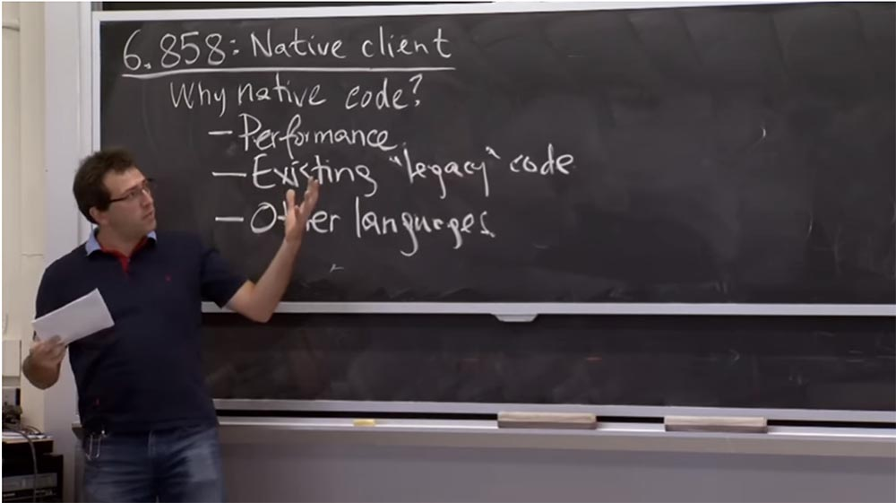

Это довольно просто, потому что можно взять **C++** или программу на **C** и запустить её в браузере. Вы можете посмотреть на эту веб-страницу, которая представляет собой **HTML**-файл, внутри которого имеется куча кода **JavaScript**.

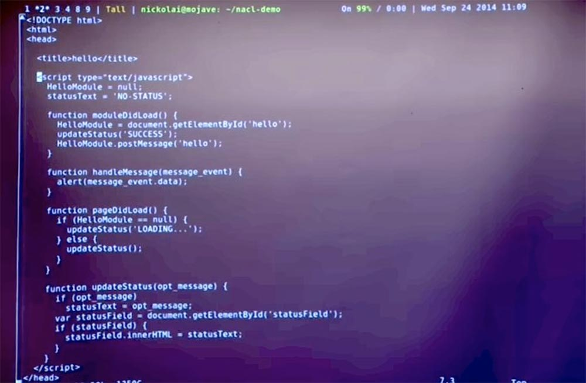

Причина существования этого кода **JavaScript** в том, что он позволяет взаимодействовать с частями **Native Client**. Относительно работы браузера смысл такого решения состоит в том, что у вас есть какая-то веб-страница, содержащая код **JavaScript**. И это решение работает с привилегиями страниц и позволяет делать различные вещи на самой веб-странице, например, общаться с сетью при некоторых обстоятельствах.

**Native Client** позволяет вам запустить внутри браузера свой модуль, поэтому код **JavaScript** может с ним взаимодействовать и получать ответ. Здесь показано немного кода **JavaScript**, который необходим в **Native Client** для того, чтобы взаимодействовать с конкретным модулем **NaCl**, который мы собираемся запустить.

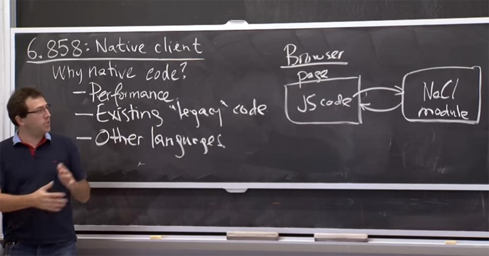

И вы можете отправлять сообщения этому модулю. Как это делается? Вы берете объект этого модуля в **JavaScript**, называете его **postMessage** и таким образом осуществляете поддержку отправки этого сообщения в модуль **NaCl**. Когда модуль **NaCl** ответит, это запустит функцию сообщения в **JavaScript**. И в этом конкретном случае в браузере просто всплывёт диалоговое окно.

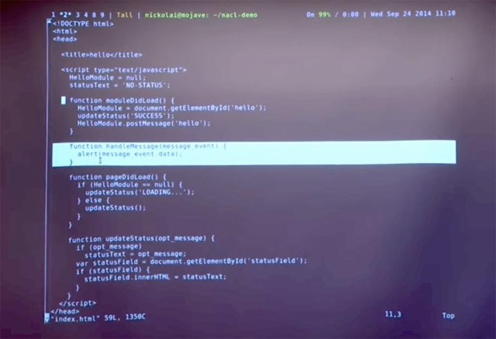

Так что со стороны **JavaScript**, это довольно простой интерфейс веб-страницы. Единственное, что вам нужно дополнительно сделать, это назначить таким образом модуль **NaCl**. То есть вы просто вставляете сюда модуль с определенным **ID**. Самым интересным здесь является код **hello** с расширением **nmf**. Он просто говорит, что здесь есть исполняемый файл, который нужно загрузить и начать работать с ним в среде **NaCl**.

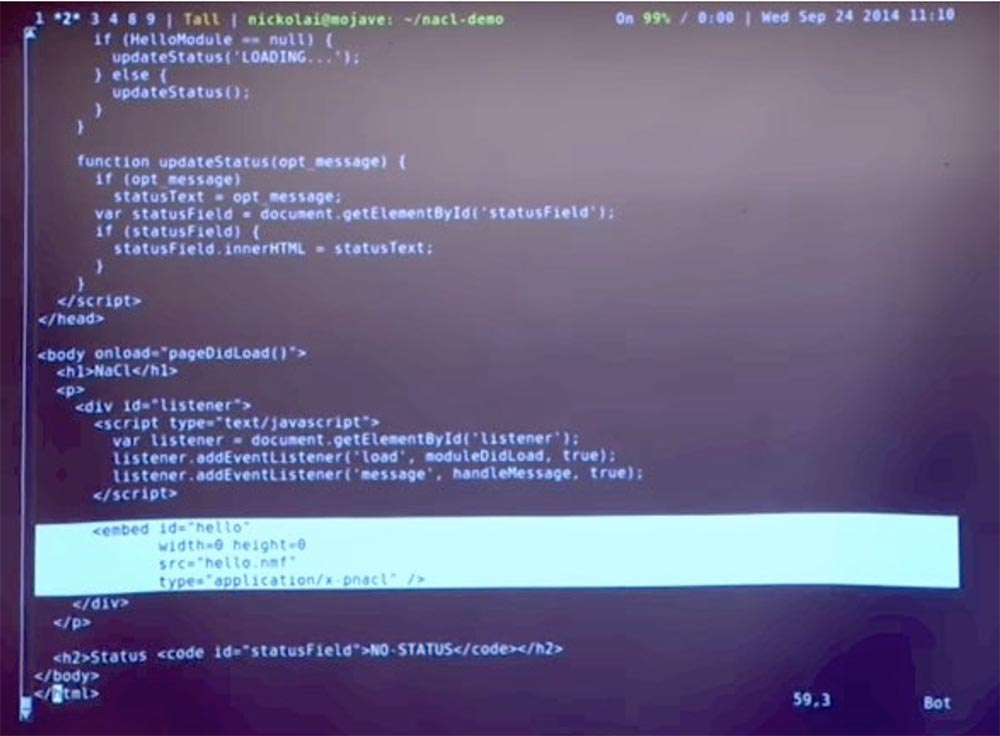

Этот машинный код в самом деле похож на любой другой код C++, который вы могли бы написать. Интересной частью является эта функция обработки сообщений **HandleMessage**.

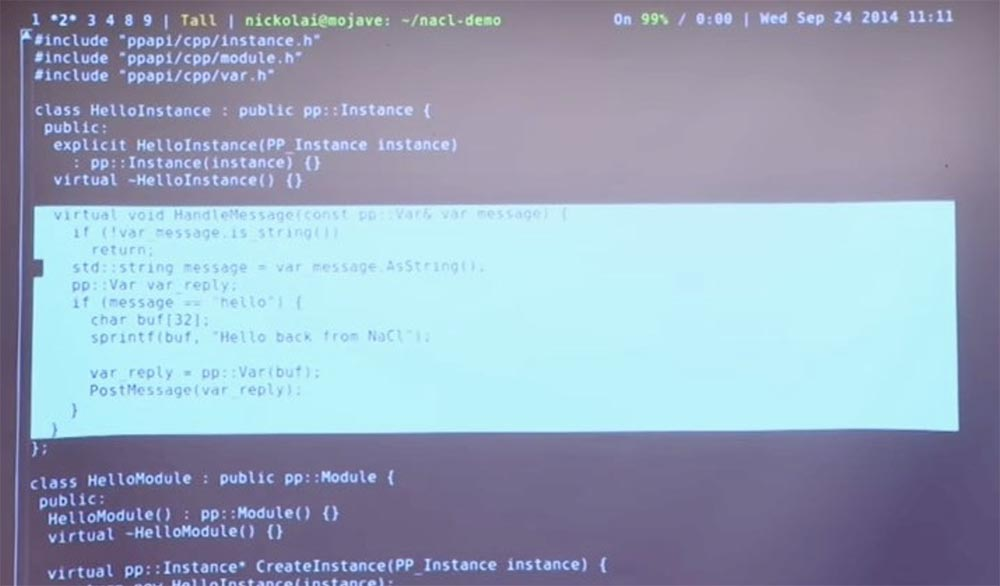

Это класс **C++**, и всякий раз, когда код **JavaScript** отправляет какое-то сообщение в **Native** код, он будет выполнять эту функцию. Он выполняет проверку **if (message = = ‘hello’)**. Если да, он создаст ответную строку какого-то рода и отправит её обратно. Это довольно простой материал. Но для конкретики давайте попробуем запустить его и посмотреть, что при этом происходит.

Мы можем построить и запустить небольшой веб-сервер, который будет обслуживать эту страницу и модуль **Native Client**. Здесь я могу перейти к этому **URL**, и вот мы видим веб-страницу **NaCl**. Модуль получил наше приветственное сообщение от **JavaScript**, ответил обратно строкой в **JavaScript**, и код **JavaScript** инициировал всплывающее диалоговое окно, содержащее этот ответ.

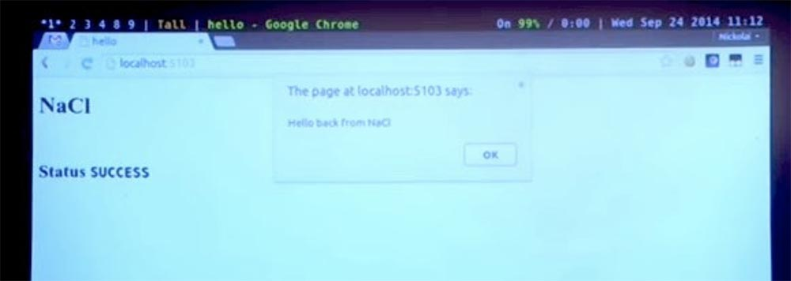

Так что это действительно работает.

Попытаемся узнать, сможем ли мы вызвать сбой **Native Client**. Надеюсь, что нет, но мы можем взять этот код и этот буфер и написать в нём кучу какой-то ерунды, например, 65536 и посмотреть, что при этом происходит.

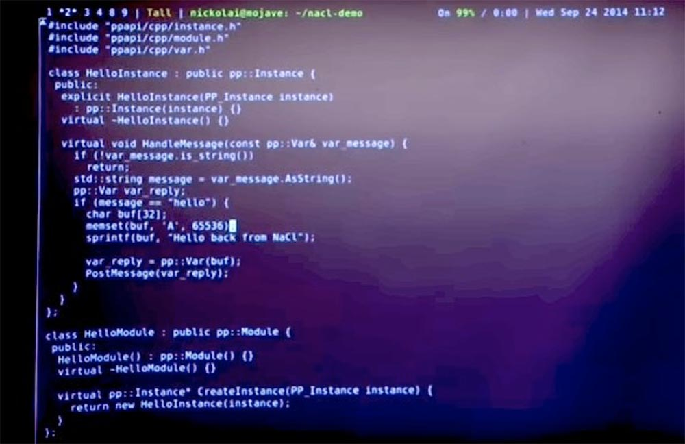

Надеюсь, это не должно привести к сбою моего браузера, потому что **Native Client** пытается обеспечить изоляцию. Но давайте посмотрим, что произойдет.

Перезапустим веб-сервер. Мы видим, что вход в модуль по-прежнему успешен, наш браузер не пострадал. Однако обмен сообщениями с клиентом не состоялся, поэтому диалоговое окно отсутствует. Посмотрим на консоль **JavaScript** внизу страницы и увидим, что модуль **Native Client** сообщает нам о сбое модуля **NaCl**.

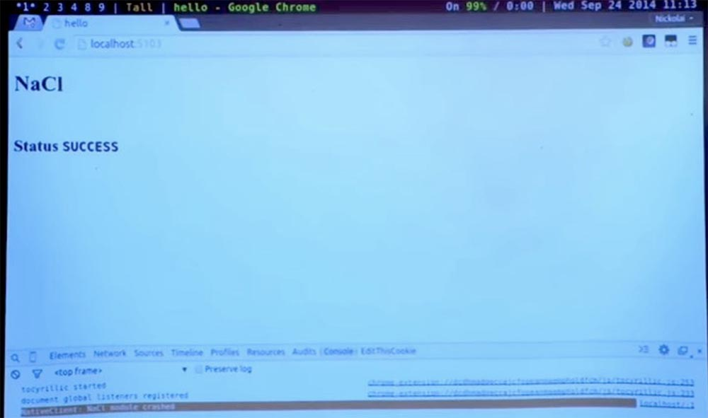

Возможно, что введённый мною аргумент вызвал переполнение буфера или обращение к какому-то неверному адресу, но в любом случае, модуль **NaCl** действительно способен обеспечить изоляцию случайного повреждения памяти таким образом, что оно не оказывает влияния на браузер.

Так выглядит быстрая демонстрация этой системы в том виде, в котором вы можете её использовать в роли конечного пользователя или разработчика. Давайте рассмотрим еще несколько примеров. Например, как будет работать **Native Client**, или зачем нам нужен именно такой, а не альтернативный дизайн.

Поэтому, если ваша цель состоит в том, чтобы изолировать собственный код, есть несколько альтернатив, с помощью которых вы можете это проделать. Фактически люди и раньше сталкивались с проблемами использования наследуемого кода и других языков до того, как появился **Native Client**. Они решали их различными способами, которые, возможно, не были такими безопасными и удобными, как **Native Client**, но предоставляли такие же возможности изоляции.

Итак, что нужно делать, если вы действительно хотите запустить машинный код в браузере? Один из вариантов – доверие к разработчику. Возможно, вариант такого подхода заключается в том, что вы спрашиваете пользователя, хочет он запустить какой-то фрагмент кода в своем браузере или нет.

Итак, все примерно понимают, что это за план, верно? Например, вместо всей этой стратегии компиляции **Native Client** я мог бы просто создать программу на языке **C**, запустить её в браузере, и он спросил бы меня, хочу я запустить этот сайт или нет? И если я нажму «да», случайно «накосячив» в памяти браузера, он даст сбой. Так что это возможно, верно? Это, конечно, решает все эти задачи, но что в этом плохого?

Я думаю, плохое заключается в том, что данное решение небезопасно. Это один из способов «обойти» данную систему и множеству других систем.

У **Microsoft** была система под названием **ActiveX**, которая в основном реализовывала этот план. Вы могли бы отправить бинарные файлы в **IE**, браузер на вашем компьютере, и до тех пор, пока они не вернутся с сертификатом от конкретного разработчика, подписанного, скажем, **Microsoft** или кем-то другим, браузер не будет запускать ваш код. Как вы думаете, это полезный план?

Аудитория: это вопрос доверия!

Профессор: да, это так. Вам действительно нужно немного доверять, что разработчик будет подписывать только те «бинарники», которые не сделают ничего плохого. Но часто нельзя выяснить, плохая ли это вещь или нет, поэтому они просто пишут код **C** и подписывают его вслепую без выполнения огромного объема работы. В этом случае вы вполне можете получить в будущем определённые проблемы.

Точно также решение спрашивать пользователя, действительно ли он хочет запустить какую-то вещь, абсолютно не гарантирует безопасность. Даже если пользователь хочет быть осторожным, то на самом деле не ясно, каким образом он должен решать? Предположим, я действительно хочу понять, могу ли я позволить этой программе работать? Мне говорят, что всё нормально, может быть, он создан солидными разработчиками **Google.com** или **Microsoft.com**. Однако это исполняемый файл **foo.exe** и я абсолютно не знаю, что там внутри него. Даже если я дизассемблирую его код, будет очень трудно сказать, собирается ли он сделать что-то плохое или нет. Поэтому пользователю действительно бывает трудно решить, будет ли запуск кода безопасным для системы.

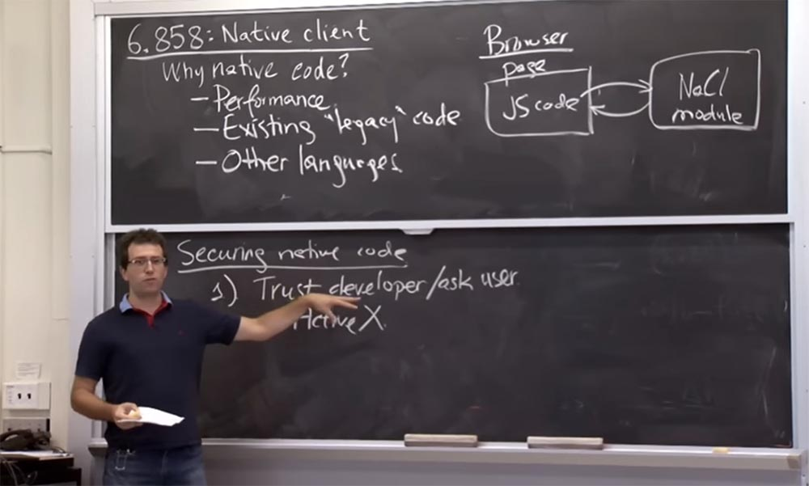

Таким образом, **Native Client** может выступать в роли механизма, благодаря которому пользователи могут получить некоторую уверенность в том, должны ли они сказать «да» или «нет» какой-то программе.

Так что на практике, я думаю, здесь должен быть вариант, который предложил наш приглашённый лектор Пол Ян на прошлой неделе. Он советовал запускать плагин «**play extension**», или «воспроизвести расширение» в браузере **Chrome**. То есть получается, что перед запуском любого расширения, включая **Native Client**, вам нужно щелкать по этой штуке. В некотором роде это то же, что спросить пользователя. Но в этом случае, даже если пользователь решит ответить «да», система всё-равно будет в безопасности, потому что в работу включится **Native Client**. В этом смысле у нас получается двойной механизм безопасности: сначала спросить пользователя, а затем, при положительном ответе, запустить клиент «песочницы», который не позволит обрушить браузер.

Таким образом, другой подход, который должен применяться, заключается в использовании «песочницы», реализуемой средствами ОС или аппаратного обеспечения, или же в изоляции процессов. Это то, что мы рассматривали в 2-х последних лекциях.

Возможно, вы бы использовали механизмы изоляции **Unix**. Если бы у вас было что-то более сложное, вы бы использовали **FreeBSD** или **Capsicum**. Он отлично подходит для изоляции в «песочнице» какого-то фрагмента кода, потому что вы можете ограничить его возможности. **Linux** имеет аналогичный механизм под названием **Seccomp**, который мы кратко затронули в последней лекции, он тоже позволяет вам делать подобные вещи.

Таким образом, уже есть механизм для написания кода в изоляции на вашей машине. Почему же эти ребята против использования этого существующего решения? Кажется, будто бы они «изобретают колесо» по какой-то причине. Так что же происходит?

**Аудитория:** может быть, они хотят минимизировать ошибки?

**Профессор:** да, в каком-то смысле они не доверяют операционной системе. Возможно, они на самом деле беспокоятся об ошибках ОС. Вероятно, что ядро **FreeBSD** или ядро **Linux** содержит довольно много кода, написанного на **C**, который они не хотят или не могут проверить на корректность, даже если бы захотели. А в **Capsicum** или **Seccomp** работа выполняется на основе плана изоляции, поэтому достаточно, чтобы в ядре была лишь небольшая верная часть кода, чтобы песочница сохраняла и применяла изоляцию.

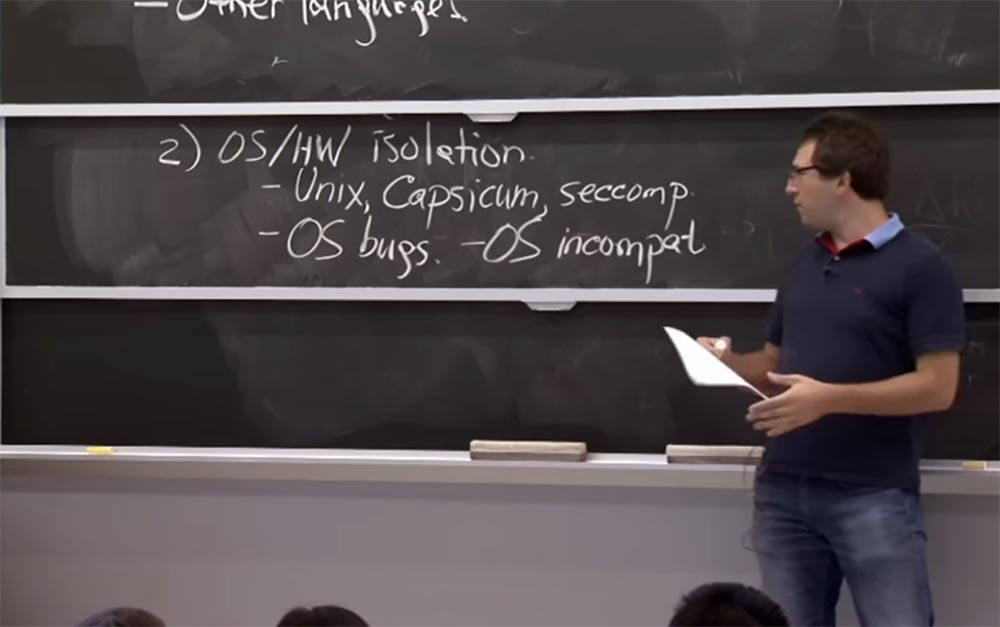

**Аудитория:** поскольку вы получаете гораздо больше способов использовать браузеры, вам придется иметь дело с различными ОС, такими, как iOS и Android, и доступ…

**Профессор:** да, на самом деле, еще одно интересное соображение заключается в том, что обычно у многих ОС есть ошибки. Причём на самом деле разные операционные системы в некотором роде несовместимы друг с другом. Это означает, что каждая ОС имеет свой собственный механизм, как здесь на рисунке: у **Unix** есть **Capsicum**, у **Linux** есть **Seccomp**, но это просто вариации **Unix**. У **Mac OS** есть **Seatbelt**, у **Windows** что-то еще, и этот список можно продолжать дальше.

Так что в итоге каждая платформа, с которой вы работаете, имеет собственный механизм изоляции. И то, что на самом деле не слишком сильно их беспокоит, это то, что они должны будут написать разный код для **Mac**, **Windows** и **Linux**. Но в большей степени это влияет на то, как вы должны написать эти вещи для работы внутри песочницы. Потому что в **Native Client** вы на самом деле пишете часть кода, который выполняется так же, как «родной» код ОС, таким же образом, которым выполняется код **Apple**, код **Windows** или код системы **Linux**.

И если использовать эти механизмы изоляции, то они фактически накладывают разные ограничения на программу, помещённую в «песочницу». Поэтому вам придется написать одну программу, которая будет служить для запуска внутри песочницы **Linux**, другую программу для запуска внутри песочницы **Windows**, и так далее.

Вот что на самом деле для них неприемлемо. Они не хотят иметь дело с проблемами такого вида. Какие ещё соображения у вас есть?

**Аудитория:**предположительно, производительность системы. Потому что, если вы применяете **Capsicum**, вам нужно позаботиться о достаточных ресурсах, чтобы обеспечить работу процессов внутри песочницы. Здесь они могут столкнуться с такой же проблемой.

**Профессор:** да, это правда. План изоляции сбоев программного обеспечения на самом деле очень ресурсоёмкий, что на уровне ОС может вызвать нехватку ресурсов для обеспечения работы «песочницы». Оказывается, что в собственном **Native Client** они фактически используют и свою «песочницу», и «песочницу» ОС для обеспечения дополнительной безопасности. Таким образом, на самом деле они не выигрывают в производительности своей реализации, хотя, вероятно, могли бы.

**Аудитория:** возможно, они хотят всё контролировать. Потому что они могут контролировать то, что происходит в браузере, но если они отправили его в ОС на компьютер клиента, они не знают, что там может произойти.

**Профессор:** можно сказать, что да, ОС может иметь ошибки или недостаточно хорошо справляться с «песочницей». Или интерфейс немного отличается, так что вы не знаете, что собирается выявить операционная система.

**Аудитория:** и это не помешает коду совершать какие-то нехорошие вещи. Существует множество таких вещей, которые совершает код, например, вы хотите выполнить статический анализ, но зацикливание кода не позволяют программе действовать.

**Профессор:** в действительности очень трудно определить, имеет ли место бесконечно зацикленный процесс или нет, но в принципе, такой подход позволяет уловить некоторые проблемы кода. Я думаю, что один действительно интересный пример, о котором я не знал, пока не прочёл их статью, показывает, что эти ребята беспокоятся об аппаратных ошибках, а не только об уязвимости ОС, которыми может воспользоваться запускаемый код. Например, сам процессор имеет некоторые инструкции, из-за которых он может «зависнуть» или перезагрузить компьютер. В принципе, ваше оборудование не должно иметь такой ошибки, потому что операционная система полагается на то, что аппаратное обеспечение в любом случае поможет ей достичь ядра, чтобы позаботиться о ликвидации последствий ошибки пользователя.

Но оказывается, что процессоры настолько сложны, что у них есть ошибки, и эти ребята говорят, что нашли тому доказательства. Если есть некоторые сложные инструкции, которые процессор не ожидал получить, он остановится вместо того, чтобы обработать ядро системы. Это плохо. Я думаю, что это не катастрофично, если я всего лишь запускаю несколько полезных вещей на своём ноутбуке, но намного хуже, если компьютер зависает, когда я посещаю какие-то веб-страницы.

Таким образом, они захотели создать более высокий уровень защиты для модулей **Native Client**, чем тот, что обеспечивает изоляция на уровне ОС, даже свободная от аппаратных ошибок. Так что по поводу безопасности они ведут себя как параноики, включая проблему безопасности аппаратного обеспечения.

Давайте сейчас посмотрим, как **Native Client** на самом деле изолирует процессы в «песочнице». Таким образом, **Native Client** использует другой подход, который можно назвать «изоляцией сбоев программного обеспечения».

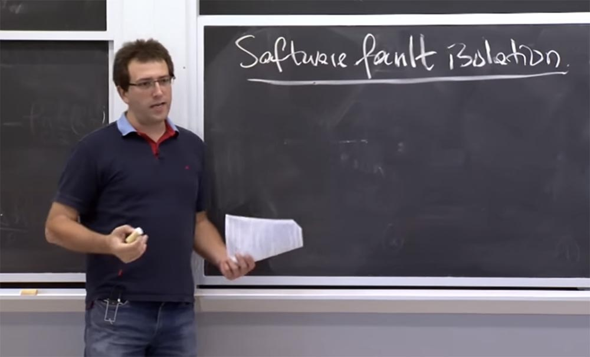

План состоит в том, чтобы не полагаться на то, что операционная система или оборудование будут проверять вещи во время работы программы, а рассчитывать на то, что они заранее рассмотрят инструкции и решат, что их можно выполнить совершенно безопасно. Таким образом, на самом деле достаточно посмотреть на двоичный файл, чтобы проверить все возможные инструкции и увидеть, будут ли они безопасными или небезопасными. Как только вы решили, что всё будет в безопасности, вы можете просто начать выполнение процесса, потому что знаете, что он состоит из безопасных вещей и не будет никаких сбоев.

Так что то, что они собираются сделать, это посмотреть практически все инструкции в двоичном коде, который отправляется в браузер, и решить, будут ли конкретные инструкции безопасными или нет.

Что они делают для безопасных инструкций? Они просто позволяют им действовать. Что представляет собой пример безопасной инструкции? Наверное, они считают, что безопасная инструкция не нуждается в дополнительных проверках или защите.

Безопасные инструкции представляют собой арифметико-логические устройства **ALU**, математические вычисления, перемещения между регистрами и так далее. На самом деле они не влияют на безопасность системы, которая так их беспокоит. Потому что их действительно волнуют такие вещи, как безопасность памяти, где вы выполняете этот код и так далее. До тех пор, пока вы просто выполняете некие вычисления, им все равно, потому что эти вычисления не влияют на остальные процессы в браузере.

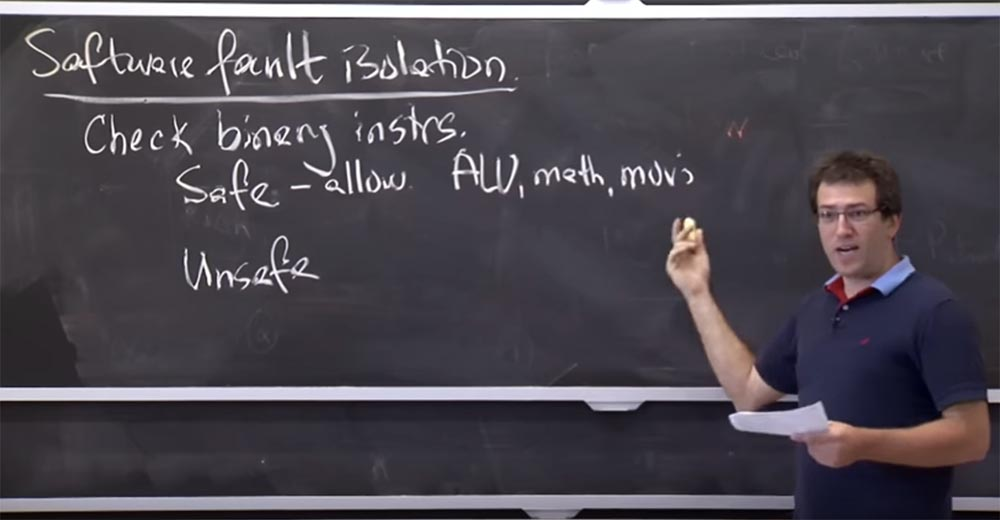

А как же небезопасные операции? Я думаю, что это вещи, которые заботят их гораздо больше. Это всё то, что обеспечивает доступ к памяти, или выполняет некоторые привилегированные инструкции, или осуществляет системный вызов на данном компьютере. Может быть, эти процессы попытаются «выпрыгнуть» из песочницы, кто знает? Для такого рода инструкций они собираются выполнить одну из двух вещей.

Если инструкция действительно необходима для работы приложения, например, обеспечивает ему доступ к памяти, то они собираются каким-то образом убедиться, что могут выполнить эту небезопасную инструкцию безопасным образом. Или если вы «прыгаете» в адресном пространстве программы, то они постараются каким-то образом инструментировать инструкцию. Инструментация инструкции означает, что небезопасная инструкция будет выполнять «правильные» вещи, которые требует от неё приложение. Потому что иногда инструкция может делать плохие вещи, а инструментация означает, что вы добавляете перед ней некоторые дополнительные условия, которые будут её проверять или использовать, если её выполнение не наносит никакого вреда.  
Например, при обращении к памяти вы могли бы сделать (они отказались от этого из соображений производительности) инструментацию доступа к памяти. Для этого нужно установить несколько проверок. Например, можно установить перед инструкцией оператор **if** для проверки, находится ли адрес в диапазоне адресов, разрешённых для данного модуля. Если это так, инструкция выполняется, если нет – не выполняется.

То есть, мы создаём инструмент для инструкции, который превращает её из небезопасной в безопасную благодаря тому, что перед ней установлен оператор проверки условия. В этом заключается их идея обеспечения безопасности без использования поддержки операционной системы на определённом уровне. Я думаю, что они не инструментируют все небезопасные инструкции, так как некоторые из них можно просто запретить. Например, если они считают, что эта инструкция не нужна для работы приложения, а приложение всё равно пытается её запустить, мы должны просто «убить» это приложение или запретить ему работать.

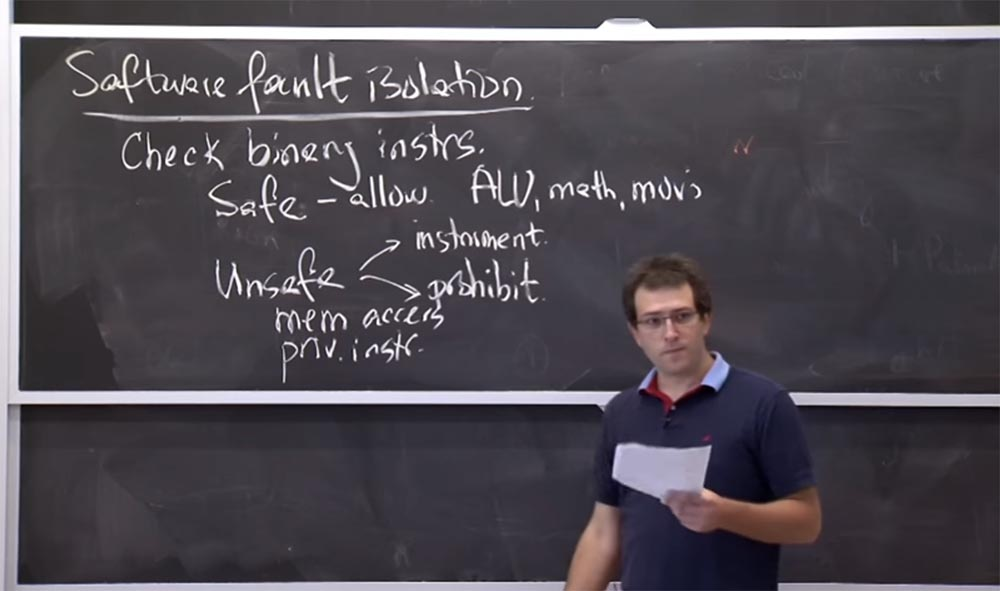

Это своего рода великий план изоляции программных сбоев. Как только вы проверили двоичный файл приложения, и он удовлетворяет всем условиям и всё инструментировано должным образом, вы можете просто запустить программу. И по определению, она не должна совершить ничего опасного, если мы сделали все эти проверки и применили инструменты.

Есть еще одна часть в истории изоляции ошибок программного обеспечения, которая состоит в том, что когда вы убедитесь, что всё безопасно, то процесс действительно не сможет сделать что-то опасней, чем вычисления в собственной маленькой памяти. Он не сможет получить доступ к сети, к диску, к вашему браузеру, дисплею, клавиатуре. Но почти каждая история изоляции ошибок программного обеспечения заключается в существовании некоторых доверенных служб **Trusted Service Runtime**, которые не подвергаются проверкам инструкций. Поэтому доверенная служба может выполнять все эти потенциально опасные действия. В данном случае это доверенное приложение написано разработчиками **Google**. Так что они надеются, что с реализацией **NaCl** всё будет в порядке.

Здесь могут быть такие вещи, как выделение памяти, возможно, создание потока, может быть, общение с браузером — мы видели, как система посылает ему сообщение — и так далее. И все они подвергаются действию этого изолированного модуля, который должен обеспечивать нормальность выполнения операций предсказуемым способом.

**Аудитория:** интересно, мы должны разрабатывать это приложение с учётом того, что оно будет отправлено в модуль **NaCl**? Или же модуль в любом случае изменит вещи, которые могут привести к неправильной работе?

**Профессор:** я думаю, что если вы создаете приложение, вы должны знать, что оно будет работать внутри **NaCl**. Поэтому некоторые вызовы функций, такие как **malloc** или **pthread_create**, просто прозрачно совмещаются с вызовами их **Trusted Service Runtime**. Но если вы сделаете что-нибудь вроде открытия файла по имени пути или подобное, что можно сделать на компьютере под управлением **Unix**, вам наверняка придется заменить это действие чем-то другим. Вероятно, вы захотите структурировать свою вещь, чтобы хотя бы немного взаимодействовать с вашим **JavaScript** или вашей веб-страницей. Поэтому вам придётся передавать некоторые сообщения или **RPC** в часть **JavaScript**, то есть вам придётся внести изменения в свой код.

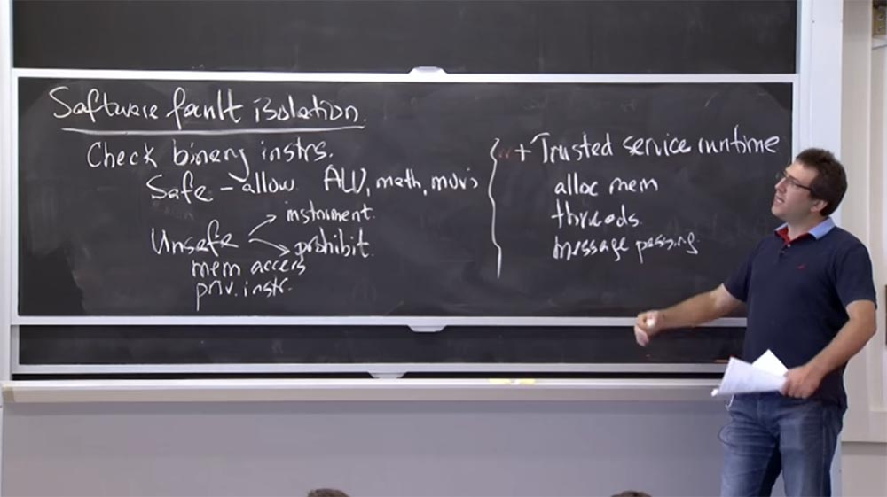

Возможно, если очень постараться, можно попробовать запустить в **NaCl** произвольную **Unix**-программу, поместив её в какую-то оболочку, но по умолчанию вы можете работать только внутри этой веб-страницы.

В этом заключается общий план изоляции программных ошибок. Давайте рассмотрим, что означает безопасность в случае использования **Native Client**. Мы только что поговорили о безопасных и небезопасных инструкциях – что в них может волновать разработчиков **Native Client**?

Насколько я могу судить, для **Native Client** безопасность означает две вещи. Одна это то, что там нет запрещенных инструкций, которые он может выполнить. И эти запрещенные инструкции могут совершать такие вещи, как системные вызовы или запуск взаимодействия, что на платформах **x86** является еще одним механизмом для перехода к ядру и осуществления системного вызова. Вероятно, он также не позволит выполнить другие привилегированные инструкции, которые позволили бы вам выбраться из «песочницы», позже мы рассмотрим эти инструкции.

И в дополнение к отсутствию запрещенных к выполнению инструкций они хотят убедиться, что весь код и доступ к данным находятся в пределах модуля. Это означает, что они фактически выделяют определенную часть пространства программных адресов, обычно это составляет от 0 до 256 МБ на процесс. И всё, что могут сделать процессы, которые не входят в число доверенных, это обратиться к адресам, которые находятся в пределах этой зарезервированной в программе памяти.

Так почему же они хотят запретить эти инструкции? И что случится, если они не смогут их запретить?

**Аудитория:** вероятно потому, что модуль может манипулировать системой.

**Профессор:** верно, потому что это довольно просто. Например, он может перезагрузить компьютер или открыть домашний каталог, перечислить все файлы и выполните любые подобные действия. Почему они заботятся о том, чтобы изолировать код и данные так, чтобы они получали доступ только к этим ограниченным адресам? Что пойдет не так, если они этого не сделают?

**Аудитория:** потому что код или данные могут получить доступ и прервать выполнение модуля на компьютере.

**Профессор:** правильно!

**Аудитория:** нам всё-равно, если они разрушат работу своей собственной программы, и она даст сбой. Но они могут нарушить работу всей системы.

**Профессор:** да, в некотором смысле это правда. Но в их случае, они фактически управляют вещами в отдельном процессе. Таким образом, в теории, это будет только сбой в дополнительном процессе. Я думаю, что в действительности их больше беспокоят незапрещённые инструкции в том смысле, что в вашем процессе есть такие вещи, как **Trusted Service Runtime**. Так что вы действительно заботитесь о том, чтобы они не разрушили остальную часть вашего компьютера, если ненадежный модуль произвольно перейдёт в доверенную среду **Trusted Service Runtime** и сделает всё, что может сделать эта среда. Таким образом, запрет инструкций действует как вспомогательный механизм для предотвращения подобного случая.

В принципе, это может быть использовано как вариант более легкой изоляции, если вы можете запустить модуль **NaCl** внутри самого процесса браузера, а не запускать дополнительный процесс. Но из соображений производительности они действительно должны привязать модуль к этому определенному диапазону памяти, или же она должна начинаться с 0\. Это означает, что вы можете иметь только один действительно ненадежный модуль **NaCl** для каждого процесса. Поэтому вы в любом случае должны начать отдельный процесс.

28:00 мин

Продолжение:

[Курс MIT «Безопасность компьютерных систем». Лекция 7: «Песочница Native Client», часть 2](https://habr.com/company/ua-hosting/blog/418225/)

Полная версия курса доступна [здесь](https://ocw.mit.edu/courses/electrical-engineering-and-computer-science/6-858-computer-systems-security-fall-2014/).

Спасибо, что остаетесь с нами. Вам нравятся наши статьи? Хотите видеть больше интересных материалов? Поддержите нас оформив заказ или порекомендовав знакомым, **30% скидка для пользователей Хабра на уникальный аналог entry-level серверов, который был придуман нами для Вас:** [Вся правда о VPS (KVM) E5-2650 v4 (6 Cores) 10GB DDR4 240GB SSD 1Gbps от $20 или как правильно делить сервер?](https://habr.com/company/ua-hosting/blog/347386/) (доступны варианты с RAID1 и RAID10, до 24 ядер и до 40GB DDR4).

**3 месяца бесплатно** при оплате новых Dell R630 на срок от полугода — **2 х Intel Deca-Core Xeon E5-2630 v4 / 128GB DDR4 / 4х1TB HDD или 2х240GB SSD / 1Gbps 10 TB — от $99,33 месяц**, только до конца августа, заказать можно [тут](https://ua-hosting.company/serversnl).

**Dell R730xd в 2 раза дешевле?** Только у нас **[2 х Intel Dodeca-Core Xeon E5-2650v4 128GB DDR4 6x480GB SSD 1Gbps 100 ТВ от $249](https://ua-hosting.company/serversnl) в Нидерландах и США!** Читайте о том [Как построить инфраструктуру корп. класса c применением серверов Dell R730xd Е5-2650 v4 стоимостью 9000 евро за копейки?](https://habr.com/company/ua-hosting/blog/329618/)