Курс MIT «Безопасность компьютерных систем». Лекция 7: «Песочница Native Client», часть 2 / Блог компании ua-hosting.company

### Массачусетский Технологический институт. Курс лекций #6.858. «Безопасность компьютерных систем». Николай Зельдович, Джеймс Микенс. 2014 год

Computer Systems Security — это курс о разработке и внедрении защищенных компьютерных систем. Лекции охватывают модели угроз, атаки, которые ставят под угрозу безопасность, и методы обеспечения безопасности на основе последних научных работ. Темы включают в себя безопасность операционной системы (ОС), возможности, управление потоками информации, языковую безопасность, сетевые протоколы, аппаратную защиту и безопасность в веб-приложениях.

Лекция 1: «Вступление: модели угроз» [Часть 1](https://habr.com/company/ua-hosting/blog/354874/) / [Часть 2](https://habr.com/company/ua-hosting/blog/354894/) / [Часть 3](https://habr.com/company/ua-hosting/blog/354896/)  
Лекция 2: «Контроль хакерских атак» [Часть 1](https://habr.com/company/ua-hosting/blog/414505/) / [Часть 2](https://habr.com/company/ua-hosting/blog/416047/) / [Часть 3](https://habr.com/company/ua-hosting/blog/416727/)  
Лекция 3: «Переполнение буфера: эксплойты и защита» [Часть 1](https://habr.com/company/ua-hosting/blog/416839/) / [Часть 2](https://habr.com/company/ua-hosting/blog/418093/) / [Часть 3](https://habr.com/company/ua-hosting/blog/418099/)  
Лекция 4: «Разделение привилегий» [Часть 1](https://habr.com/company/ua-hosting/blog/418195/) / [Часть 2](https://habr.com/company/ua-hosting/blog/418197/) / [Часть 3](https://habr.com/company/ua-hosting/blog/418211/)  
Лекция 5: «Откуда берутся ошибки систем безопасности» [Часть 1](https://habr.com/company/ua-hosting/blog/418213/) / [Часть 2](https://habr.com/company/ua-hosting/blog/418215/)  
Лекция 6: «Возможности» [Часть 1](https://habr.com/company/ua-hosting/blog/418217/) / [Часть 2](https://habr.com/company/ua-hosting/blog/418219/) / [Часть 3](https://habr.com/company/ua-hosting/blog/418221/)  
Лекция 7: «Песочница Native Client» [Часть 1](https://habr.com/company/ua-hosting/blog/418223/) / [Часть 2](https://habr.com/company/ua-hosting/blog/418225/) / [Часть 3](https://habr.com/company/ua-hosting/blog/418227/)

**Аудитория:** почему диапазон ёмкости памяти адресного пространства должен начинаться с нуля?

**Профессор:** потому что с точки зрения производительности более эффективно применять целевой прыжок, если вы знаете, что допустимый адрес является непрерывным набором адресов, начинающихся с нуля. Потому что затем вы можете сделать это с помощью одной **AND**-маски, где все высокие биты являются единицей, и только пара низких битов равна нулю.

**Аудитория:** я думал, **AND**-маска должна была обеспечить выравнивание.

**Профессор:** правильно, маска обеспечивает выравнивание, но почему она начинаются с нуля? Я думаю, что они полагаются на сегментированное аппаратное обеспечение **Segmentation Hardware**. Так что в принципе они могли бы его использовать, чтобы сдвинуть область вверх, с точки зрения линейного пространства. Или, может быть, это просто связано с тем, как приложение «видит» этот диапазон. Фактически вы можете разместить его в разных смещениях в вашем виртуальном адресном пространстве. Это позволит вам выполнять определённые трюки с сегментированным аппаратным обеспечением для запуска множества модулей в одном адресном пространстве.

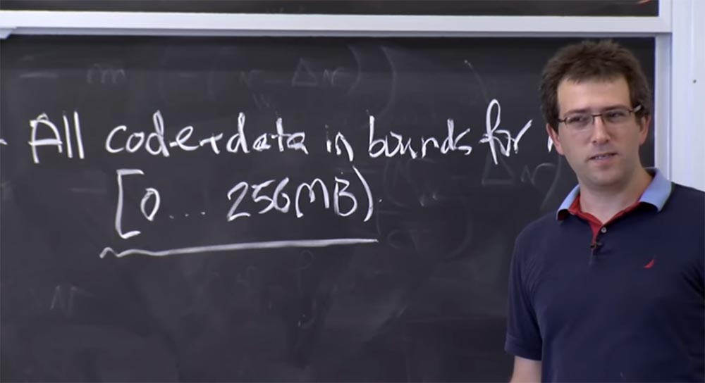

**Аудитория:** возможно это потому, что они хотят «поймать» точку приема нулевого указателя?

**Профессор:** да, потому что они хотят ловить все точки приёма. Но у вас есть способ, как это сделать. Потому что нулевой указатель относится к сегменту, к которому осуществляется доступ. И если вы переместите сегмент, то сможете отображать неиспользуемую нулевую страницу в начале каждого сегмента. Так что это поможет сделать несколько модулей.

Я думаю, что одна из причин такого решения – начинать диапазон с 0 – связана с их желанием портировать свою программу на платформу **х64**, имеющую немного другой дизайн. Но в их статье об этом не говорится. В 64-битном дизайне само оборудование избавилось от некоторых аппаратных средств сегментации, на которые они полагались по причинам эффективности, поэтому они должны были предусмотреть программно-ориентированный подход. Однако для **х32** это всё же недостаточно веская причина, чтобы пространство начиналось с нуля.

Итак, продолжим основной вопрос – что же мы хотим обеспечить с точки зрения безопасности. Давайте подойдём к этому делу несколько «наивно» и посмотрим, как мы можем все испортить, а потом попытаемся это исправить.

Я считаю, что наивный план – это искать запрещенные инструкции, просто сканируя исполняемый файл с самого начала до конца. Так как вы можете обнаружить эти инструкции? Можно просто взять программный код и выложить его в гигантской строке, которая идет от нуля до 256 мегабайт, в зависимости от того, насколько велик ваш код, а затем начать поиск.

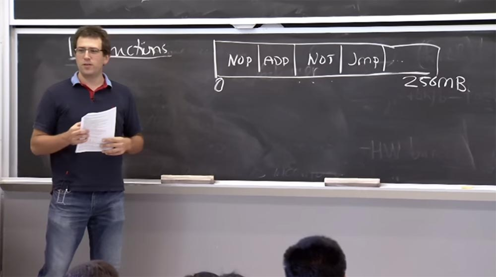

В этой строке сначала могут располагаться модуль **NOP**-инструкции, затем модуль **ADD** инструкции, **NOT**, **JUMP** и так далее. Вы просто ищите, и если находите плохую инструкцию, то говорите, что это плохой модуль и отбрасываете его. И если вы не видите никакого системного вызова к этой инструкции, то можете позволить запуск данного модуля и проделать всё, что находится в пределах диапазона 0-256. Как вы думаете, это сработает или нет? О чём они беспокоятся? Почему это так сложно?

**Аудитория:** их беспокоят размеры инструкции?

**Профессор:** да, дело в том, что платформа **x86** имеет инструкции переменной длины. Это означает, что конкретный размер инструкции зависит от нескольких первых байт этой инструкции. Фактически вы можете посмотреть на первый байт, чтобы сказать, что инструкция будет намного больше, и тогда, возможно, вам придется взглянуть ещё на пару байт, а затем решить, какой же всё-таки размер она занимает. Некоторые архитектуры, такие как **Spark**, **ARM**, **MIPS** имеет больше инструкций фиксированной длины. У **ARM** есть две длины инструкций – либо 2, либо 4 байта. Но в платформе **x86** длина инструкций может быть и 1, и 5, и 10 байт, а если постараться, можно даже получить довольно длинную инструкцию в 15 байт. Однако это сложные инструкции.

В результате может появиться проблема. Если вы сканируете эту строку программного кода линейно, всё будет в порядке. Но, может быть, во время выполнения вы перейдете в середину какой-то инструкции, например, **NOT**.

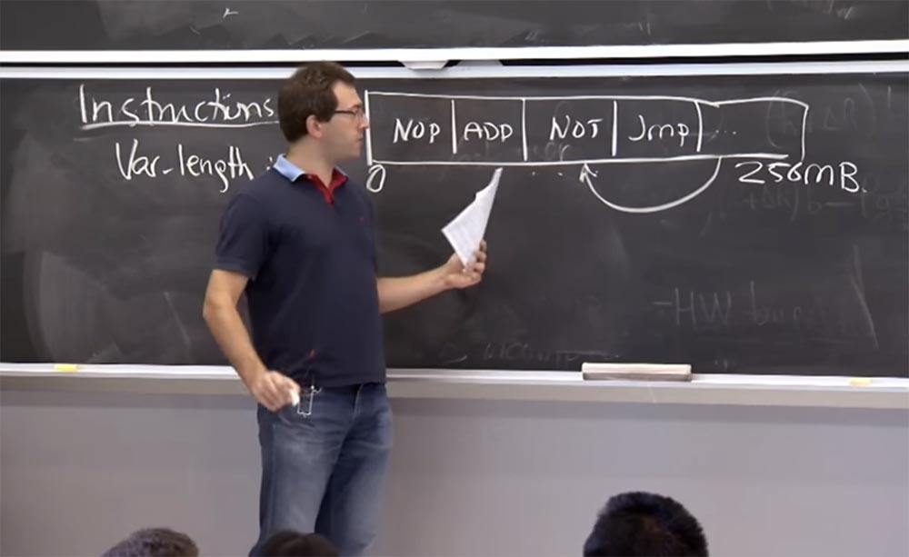

Возможно, что это многобайтовая инструкция, и если интерпретировать её, начиная со второго байта, то она будет выглядеть совершенно по-другому.

Ещё один пример, в котором мы будем «играть» с ассемблером. Предположим, у нас есть инструкция **25 CD 80 00 00**. Посмотрев на 2-й байт, вы будете интерпретировать её как пятибайтовую инструкцию, то есть должны будете посмотреть на 5 байтов вперёд и увидеть, что за ней следует инструкция **AND %EAX, 0x00 00 80 CD**, начинающаяся с оператора **AND** для регистра **EAX** с некоторыми определёнными константами, например, **00 00 80 CD**. Это одна из безопасных инструкций, которую **Native Client** должен просто разрешить по первому правилу проверки двоичных инструкций. Но если во время выполнения программы **CPU** решит, что он должен начать выполнение кода с **CD**, я обозначу это место инструкции стрелкой, то инструкция **%EAX, 0x00 00 80 CD**, которая на самом деле является 4-х байтовой инструкцией, будет означать выполнение **INT $0x80**, что является способом выполнения системного вызова в **Linux**.

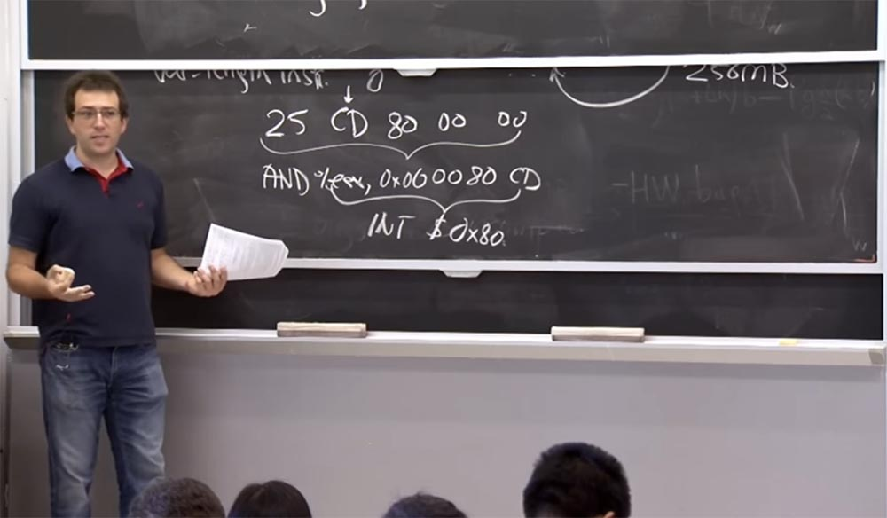

Так что если вы пропустите этот факт, то позволите ненадёжному модулю «прыгнуть» в ядро и делать системные вызовы, то есть делать то, что вы хотели предотвратить. Как же нам избежать подобного?

Возможно, мы должны попытаться взглянуть на смещение каждого байта. Поскольку x86 может начать интерпретацию инструкции только в байтовых, а не битовых границах. Таким образом, вам придётся посмотреть на смещение каждого байта, чтобы увидеть, откуда начинается инструкция. Как вы думаете, это целесообразный план?

**Аудитория:** я думаю, что если кто-то на самом деле использует **AND**, процессор не перепрыгнет в это место, а просто разрешит выполнение программы.

**Профессор:** да, потому что в основном он не склонен к ложным срабатываниям. Теперь, если вы действительно этого хотите, то можете немного изменить код, чтобы как-то избежать этого. Если вы точно знаете, что ищет проверочное устройство, потенциально вы могли бы изменить эти инструкции. Может быть, установив **AND** сначала для одной инструкции, а потом использовать маску на другой. Но гораздо проще избегать этих подозрительных расположений байтов, хотя это и кажется довольно неудобным.

Возможно, что архитектура включает в себя изменение компилятора. В принципе, у них есть какой-то компонент, который на самом деле должен правильно скомпилировать код. Вы не можете просто «взять с полки» **GCC** и скомпилировать код для **Native Client**. Так что в принципе это выполнимо. Но вероятно, они просто думают, что это причиняет слишком много хлопот, не будет надежным или высокопроизводительным решением и так далее. Плюс к этому есть несколько инструкций **x86**, которые запрещены, или же должны быть признаны небезопасными и поэтому должны быть запрещены. Но в большинстве своём они имеют размер в один байт, так что их довольно трудно искать или отфильтровывать.

Поэтому, если они не могут просто собрать и отсортировать небезопасные инструкции и надеяться на лучшее, им нужно использовать другой план для того, чтобы деассемблировать это надежным способом. Так что же делает **Native Client**, чтобы убедиться, что они не «споткнутся» об эту кодировку переменной длины?

В каком-то смысле, если мы действительно сканируем исполняемый файл вперёд слева направо и ищем все возможные неверные коды, и если таков способ выполнения кода, то мы в хорошей форме. Даже если там присутствуют какие-то странные инструкции и имеется некоторое смещение, то процессор всё равно не собирается туда «прыгнуть», он будет выполнять программу в том же порядке, в каком производится сканирование инструкций, то есть слева направо.

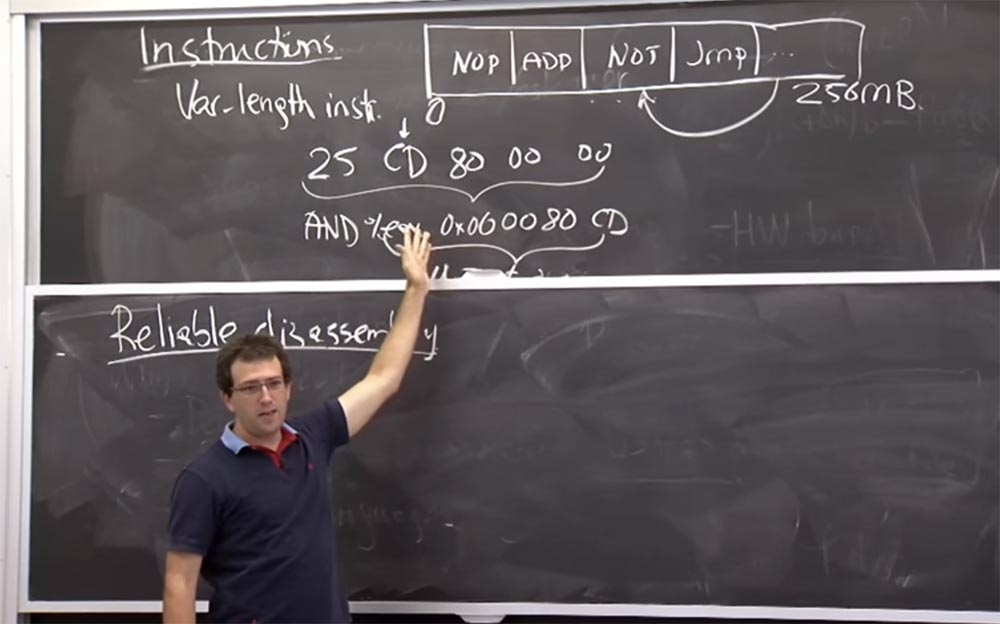

Таким образом, проблема с надёжным деассемблированием возникает из-за того, что где-то в приложении могут иметь место «прыжки». Процессор может дать сбой, если совершит «прыжок» к какой-то инструкции кода, которую он не заметил при сканировании слева направо. Так что это проблема надёжного деассемблирования пока что находится в разработке. И основной план заключается в том, чтобы проверить, куда ведут все «прыжки». На самом деле это довольно просто на каком-то уровне. Есть куча правил, которые мы рассмотрим через секунду, но примерный план состоит в том, что если вы видите «прыжок» инструкции, то нужно убедиться в том, что цель «прыжка» была замечена раньше. Для этого, собственно, достаточно выполнить сканирование слева направо, то есть процедуру, которую мы описали в нашем наивном подходе к проблеме.

В этом случае, если вы видите какую-либо инструкцию «прыжка» и адрес, на который указывает эта инструкция, то вы должны убедиться, что это тот самый адрес, который вы уже видели во время деассемблирования слева направо.

Если обнаружена инструкция «прыжка» к этому CD-байту, то мы должны пометить этот прыжок как недопустимый, потому что мы никогда не видели инструкцию, начинающуюся в байте CD, зато мы видели другую инструкцию, начинающуюся с числа 25. Но если все инструкции прыжков приказывают переходить к началу инструкции, в данном случае к 25, то у нас всё в порядке. Это понятно?

Единственная проблема состоит в том, что вы не можете проверить цели каждого прыжка в программе, потому что могут быть непрямые прыжки. Например, в **x86** у вас может быть что-то вроде прыжка к значению этого регистра **EAX**. Это отлично подходит для реализации указателей функций.

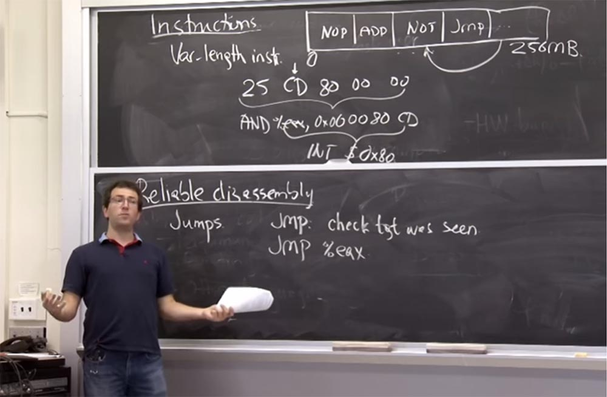

То есть указатель функции находится где-то в памяти, вы удерживаете его в каком-то регистре, а затем переходите на любой адрес, находящийся в регистре перемещения.

Так как же эти парни справляются с непрямыми прыжками? Потому что, в самом деле, я не имею понятия, будет ли это «прыжок» к байту **CD** или к байту 25\. Что же они делают в этом случае?

**Аудитория:** используют инструменты?

**Профессор:** да, инструментация — это их основной трюк. Поэтому всякий раз, когда они видят, что компилятор готов выполнить генерацию, это является доказательством того, что данный прыжок не наделает бед. Для этого им нужно убедиться, что все прыжки выполняются с кратностью 32 байта. Как они это делают? Они меняют все инструкции прыжка на то, что они называли «псевдоинструкциями». Это те же самые инструкции, но снабжённые префиксом, который очищает 5 низких битов в регистре **EAX**. То, что инструкция очищает 5 низких битов, означает, что это заставляет данное значение быть кратным 32, от двух до пяти, а затем уже осуществляется «прыжок» в это значение.

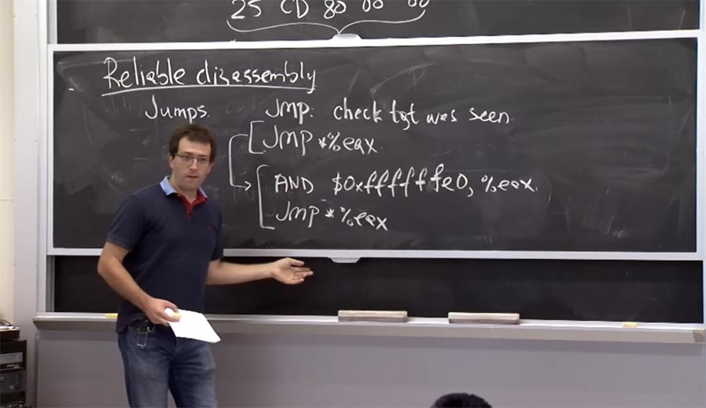

Если вы посмотрите на это во время верификации, то убедитесь, что эта инструкционная «пара» будет «прыгать» только с кратностью 32 байта. А затем, для того, чтобы убедиться в отсутствии возможности «прыжков» в некоторые странные инструкции, вы применяете дополнительное правило. Оно заключается в том, что во время деассемблирования, когда вы просматриваете ваши инструкции слева направо, вы обеспечиваете то, что начало каждой допустимой инструкции также будет кратно 32-м байтам.

Таким образом, в дополнение к этому инструментарию вы проверяете, что каждый код, кратный 32, является правильной инструкцией. Под правильной, валидной инструкцией я понимаю инструкцию, которую деассемблируют слева направо.

**Аудитория:** почему выбрано именно число 32?

**Профессор:** да, почему они выбрали 32, а не 1000 или 5? Почему 5 – это плохо?

**Аудитория:** потому что число должно быть степенью 2.

**Профессор:** да, хорошо, именно поэтому. Потому что в противном случае обеспечение использования чего-то, кратного 5, потребует дополнительных инструкций, приводящих к накладным расходам. А как насчет восьми? Восемь — достаточно хорошее число?

**Аудитория:** у вас могут быть инструкции длиной больше восьми битов.

**Профессор:** да, так может быть для самой длинной инструкции, разрешённой на платформе x86. Если у нас есть 10-ти байтовая инструкция, а всё должно быть кратно 8, то мы не сможем её никуда вставить. Так что длина должна быть достаточной для всех случаев, потому что самая большая инструкция, которую я видел, имела длину 15 байт. Так что 32-х байт вполне достаточно.

Если вы хотите приспособить инструкцию для входа или выхода из среды службы процессов, вам может понадобиться некоторое нетривиальное количество кода в одном 32-байтовом слоте. Например, 31 байт, потому что 1 байт содержит инструкцию. Должно ли оно быть намного больше? Должны ли мы сделать это равным, скажем, 1024 байта? Если у вас имеется много указателей функций или много косвенных прыжков, то каждый раз, когда вы захотите создать какое-то место, куда вы собираетесь прыгнуть, вы должны продолжить его до следующей границы, независимо от его значения. Так что с 32 бита вполне нормальный размер. В худшем случае вы потеряете всего 31 байт, если вам нужно быстро добраться до следующей границы. Но если у вас размер, кратный 1024 байта, то существует возможность потратить зря целый килобайт памяти для совершения непрямого прыжка. Если у вас имеются короткие функции или много указателей функций, такой большой размер кратности длины «прыжка» вызовет значительный перерасход памяти.

Я не думаю, что число 32 является камнем преткновения для **Native Client**. Некоторые блоки могли бы работать с кратностью 16 бит, некоторые 64 или 128 бит, не суть важно. Просто 32 бита показалось им наиболее приемлемым, оптимальным значением.

Итак, давайте составим план надежного деассемблирования. В результате компилятор должен быть немного осторожен при компиляции кода **C** или **C++** в двоичный файл **Native Client** и соблюдать следующие правила.

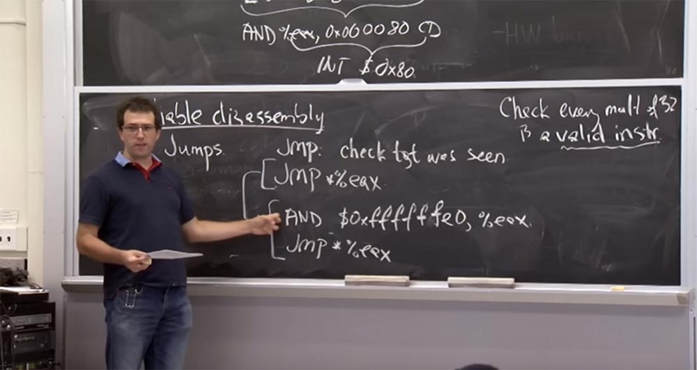

Поэтому всякий раз, когда у него есть прыжок, как показано в верхней строчке, он должен добавить эти дополнительные инструкции, приведённые в 2-х нижних строчках. И независимо от того, что он создает функцию, на которую он собирается «прыгнуть», наша инструкция будет прыгать так, как указывает это дополнение **AND $0xffffffe0, %eax**. И оно не может просто дополнить его нулями, потому что все это должно иметь правильные коды. Таким образом, дополнение нужно для того, чтобы убедиться, что каждая возможная инструкция является действительной. И, к счастью, на платформе **x86**, ни одна функция **noop** не описывается одним байтом, или, по крайней мере, нет ни одного **noop** размером 1 байт. Таким образом, вы всегда сможете дополнить вещи до величины константы.

Итак, что это нам гарантирует? Давайте убедимся, что мы всегда видим, что происходит в терминологии инструкций, которые будут выполнены. Вот что дает нам это правило – уверенность в том, что системный вызов не будет производиться случайно. Это касается прыжков, а как насчет возвратов? Как они справляются с возвратом? Можем ли мы выполнить **return** к функции в **Native Client**? Что произойдет, если вы запустите «раскалённый» код?

**Аудитория:** он может переполнить стек.

**Профессор:** это правда, что он довольно неожиданно всплывает в стеке. Но дело в том, что стек, который используют модули **Native Client**, на самом деле содержит немного данных внутри себя. Таким образом, при контакте с **Native Client** вас не должно волновать переполнение стека.

**Аудитория:** подождите, но ведь вы можете поместить в стек что угодно. И когда вы совершаете непрямой прыжок.

**Профессор:** это правда. Возврат выглядит почти как косвенный прыжок из какого-то места в памяти, которое находится в верхней части стека. Поэтому я думаю, что одна вещь, которую они могли бы сделать для функции **return**, заключается в установке префикса аналогично тому, как это было сделано в предыдущей проверке. И этот префикс осуществляет проверку того, что всплывает в верхней части стека. Вы проверяете, является ли это валидным, и когда вы производите запись или используете оператор **AND**, то вы проверяете, что находится в верхней части стека. Это кажется немного ненадёжным из-за постоянной смены данных. Потому что, например, если вы посмотрите на верхнюю часть стека и убедитесь, что там всё нормально, а потом что-либо напишите, поток данных в этом же модуле может модифицировать что-то в верхней части стека, после чего вы будете ссылаться на неправильный адрес.

**Аудитория:** разве это в такой же степени не относится и к прыжкам?

**Профессор:** да, так что там происходит с прыжком? Могут ли наши условия гонки каким-то образом аннулировать эту проверку?

**Аудитория:** но ведь код не доступен для записи?

**Профессор:** да, код нельзя записать, это правда. Таким образом, вы не сможете модифицировать AND. Но не может ли ещё какой-то поток изменить цель прыжка между этими двумя инструкциями?

**Аудитория:** это находится в регистре, так что…

**Профессор:** Да, это классная штука. Потому что если поток модифицирует что-то в памяти или в том, что загружается из **EAX** (само собой, вы делаете это, прежде чем загружаете), в этом случае этот **EAX** будет в плохом состоянии, но затем очистит плохие биты. Или он может изменить память после, когда указатель уже находится в **EAX**, так что не имеет значения, что это изменит местоположения памяти, из которого был загружен регистр **EAX**.

На самом деле потоки не разделяют наборы регистров. Поэтому, если другой поток изменяет регистр **EAX**, это не повлияет на регистр **EAX** данного потока. Таким образом, другие потоки не могут сделать эту последовательность инструкций недействительной.

Есть еще один интересный вопрос. Можем ли мы обойти этот **AND**? Я могу прыгать куда захочу в любое место этого адресного пространства. И когда я деассемблирую эту инструкцию, это выглядит как параллельная инструкция для **AND** и прыжков.

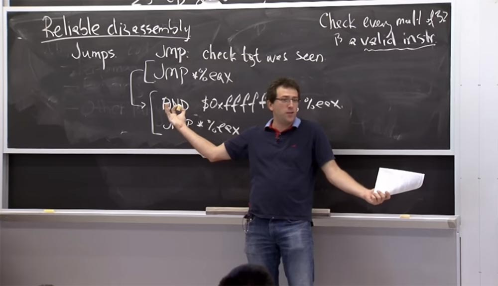

И проверка статичных прыжков заключается в том, что они должны указывать на цель, увиденную нами ранее, то есть на то, что да, мы уже видели раньше эту строку оператора **AND**. Это одна действительная инструкция. Мы также видели прыжок **jmp**, и это еще одна действительная инструкция.

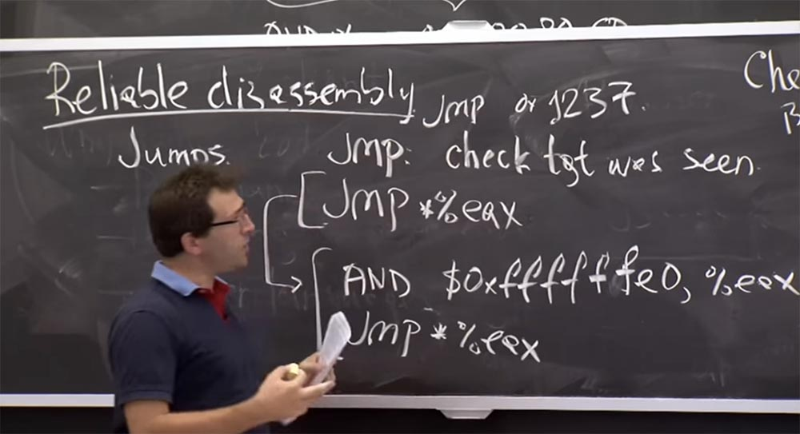

Поэтому, когда я вижу здесь прямой прыжок, то прыгаю по какому-то конкретному адресу, например к этому 1237\. На самом деле это нормально, хотя и не кратно 32. Обычно **Native Client** не разрешают прямые прыжки на произвольные адреса, если этот адрес является инструкцией, которую мы видели во время деассемблирования, как мы только что сказали. Мог бы я поместить сюда проверенный непрямой прыжок и затем, при выполнении кода, прямо перейти с этого адреса 1237 ко второй инструкции в нашей последовательности?

Когда я загружу что-нибудь в **EAX**, то прыгну сюда, вверх, а затем прыгну прямо на эту нижнюю строчку, в этот неизолированный в песочнице адрес. Все понимают, что это нарушит безопасность? Так как можно этого избежать?

**Аудитория:** **NaCl** должен сделать так, чтобы этот прыжок обрабатывался отдельной псевдоинструкцией.

**Профессор:** да, вот почему эту штуку называют единственной псевдоинструкцией. И даже на уровне платформы **x86** это совершенно отдельная инструкция, и до тех пор, пока валидатор **NaCl** об этом заботится, эти 2 нижние строки на самом деле представляют собой отдельный атомарный блок. Так что при проверке инструкции относительно того, видели ли её раньше, валидатор считает: «о, да это единственная инструкция, которую я видел раньше!», поэтому прыжки в середину кода псевдоинструкции означают прыжки в середину изображенного выше адреса **25 CD 80 00 00**. Это одно и то же. Так что они понимают семантику инструкций немного не так, как это понимается платформой **x86**.

И это означает, что в **Native Client** вы можете представлять определенные последовательности инструкций. Поэтому, если у вас действительно был легитимный код, который раньше выглядел, как эта предпоследняя строчка, то он может быть превращён в отдельный код в **NaCl**. Надеюсь, это не составляет никакой проблемы.

**Аудитория:** предположительно, они могут это сделать в доверенной базе кода, когда начнётся следующий текстовый сегмент. Потому что данный способ означает, что всегда происходит замена этих двух строк на одну. Вместо того, чтобы помещать их в двоичный файл, который вы все равно создаёте, вы просто прыгаете прямо к цели прыжка, которая находится в привилегированном разделе.

**Профессор:** да, это правда. Это еще одно умное решение, которое можно применить. Предположим, что вы не хотите делать эту псевдоинструкцию, а хотите иметь просто одну инструкцию, заменяющую прыжок **EAX**. Вы можете сделать это с помощью библиотеки всех возможных косвенных прыжков, которые могут когда-либо иметь место. В этом случае у нас будет прыжок **EAX**, прыжок **EBX** и так далее. Вы создадите библиотеку для этих прыжков и разработаете безопасную проверку того, что они заменят первую строчку нашей псевдоинструкции. Для этого вы расположите перед каждым из этих прыжков **EAX** и **EBX** оператор **AND** и так далее. А затем в двоичном файле, каждый раз, когда вы захотите прыгнуть к **EAX**, вы на самом деле будете прыгать к фиксированному адресу. И этот адрес будет указывать на полезную часть кода, которая хранится где-то в низких **64к** битах программы. И после этого **Jmp *% eax** выполнит оператор **AND** и прыгнет снова.

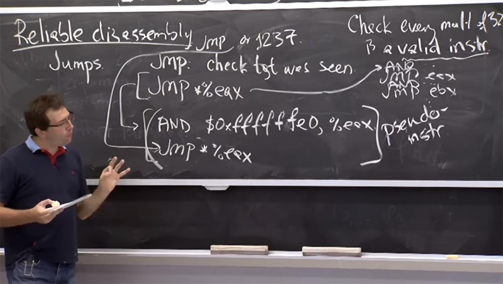

Причина, по которой они, вероятно, не делают этого, заключается в производительности. Потому что **Intel**, один из самых распространённых процессоров в наше время, должен предсказать, куда ответвляется процесс, чтобы постоянно сохранять полный поток процессов. Так что для него задача предсказания прыжков, в особенности косвенных, угадывание адресов прыжков и сохранение их в кэше линейной памяти будет слишком запутанной. Потому что если прыжки с оператором **AND** происходят в определенном месте, то прыжки **EAX** происходят отовсюду, что может сильно «смутить» процессор.

Итак, мы с вами приблизительно разобрались в том, как происходит процесс деассемблирования инструкций и как предотвратить выполнение неверных инструкций. Теперь давайте рассмотрим набор правил, который они разместили в первой таблице статьи. В ней имеются разные правила, которым должен следовать валидатор, или двоичные файлы, которые валидатор проверяет. Поэтому я пройдусь по этим правилам, чтобы проверить, что вы понимаете, для чего они нужны.  
Итак, у нас есть эти правила, от **C1** до **C7**.

**C1** в основном говорит, что как только вы загружаете двоичную память, двоичный файл фактически становится не доступен для записи на уровне таблицы страниц. То есть это правило устанавливает, что разрешённые биты для «бинарников» не могут использоваться для записи. Это объясняется тем, что общий план безопасности основан на том, что ваши двоичные файлы являются правильными. Поэтому нужно убедиться, что вы не модифицировали эти файлы так, что они могут совершить что-то запрещённое. Я думаю, это правило достаточно понятно.  
**С2** означает, что параметры начинаются с 0 и заканчиваются **64к**. Это не связано с безопасностью, а сделано просто для удобства, потому что они хотят иметь стандартное расположение программы. В некотором смысле это способствует удобству переноса данных, потому что это ограничивает количество вещей, которые могут испортить валидатор или загрузчик.

Правило **С3** означает, что косвенные, или непрямые, прыжки используют псевдоинструкции. То есть у нас имеется двойная параллельная инструкция, описанная выше, которая не позволяет совершить прыжок в середину неправильной инструкции.

**С4** говорит о том, что вы должны заполнять граничные страницы инструкцией остановки **hlt**. Почему они хотят дополнить свой бинарный файл приостановкой процессора с помощью команды **halt**? У меня нет четкого ответа, почему **C4** существует. Но я думаю, что это потому, что код естественным образом в какой-то момент останавливается, то есть существует некоторый конец операции.

И вопрос состоит в том, что происходит, когда ты просто продолжаешь исполнять код и добираешься до конца? Очевидно, что тогда процессор может просто продолжать выполнение некоторых дополнительных инструкций, или же это может обернуться каким-то странным образом.  
Поэтому они просто хотят убедиться, что нет двусмысленности в том, что происходит, если вы продолжаете выполнение и не прыгаете, а просто следуете до конца экрана инструкций. Так что давайте считать, что смысл данного правила состоит в том, что если вы продолжите выполнение, вы остановитесь, попадете в ловушку во время выполнения процесса и прервёте работу модуля. Так что это правило касается простоты и безопасности работы.

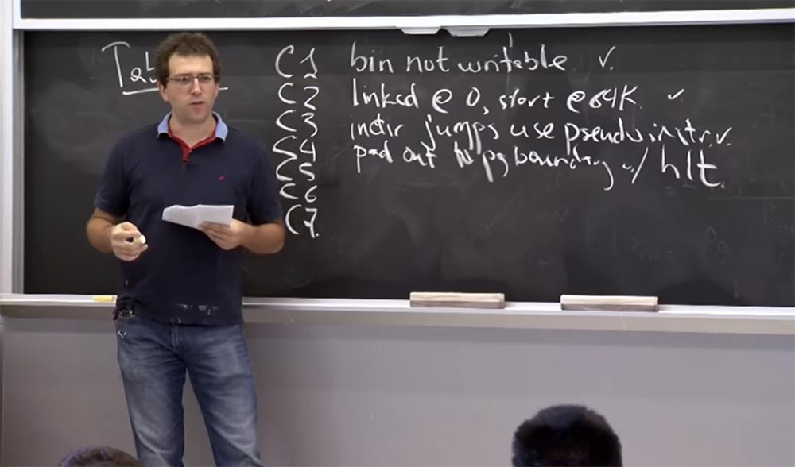

55:20 мин

Продолжение:

[Курс MIT «Безопасность компьютерных систем». Лекция 7: «Песочница Native Client», часть 3](https://habr.com/company/ua-hosting/blog/418227/)

Полная версия курса доступна [здесь](https://ocw.mit.edu/courses/electrical-engineering-and-computer-science/6-858-computer-systems-security-fall-2014/).

Спасибо, что остаетесь с нами. Вам нравятся наши статьи? Хотите видеть больше интересных материалов? Поддержите нас оформив заказ или порекомендовав знакомым, **30% скидка для пользователей Хабра на уникальный аналог entry-level серверов, который был придуман нами для Вас:** [Вся правда о VPS (KVM) E5-2650 v4 (6 Cores) 10GB DDR4 240GB SSD 1Gbps от $20 или как правильно делить сервер?](https://habr.com/company/ua-hosting/blog/347386/) (доступны варианты с RAID1 и RAID10, до 24 ядер и до 40GB DDR4).

**3 месяца бесплатно** при оплате новых Dell R630 на срок от полугода — **2 х Intel Deca-Core Xeon E5-2630 v4 / 128GB DDR4 / 4х1TB HDD или 2х240GB SSD / 1Gbps 10 TB — от $99,33 месяц**, только до конца августа, заказать можно [тут](https://ua-hosting.company/serversnl).

**Dell R730xd в 2 раза дешевле?** Только у нас **[2 х Intel Dodeca-Core Xeon E5-2650v4 128GB DDR4 6x480GB SSD 1Gbps 100 ТВ от $249](https://ua-hosting.company/serversnl) в Нидерландах и США!** Читайте о том [Как построить инфраструктуру корп. класса c применением серверов Dell R730xd Е5-2650 v4 стоимостью 9000 евро за копейки?](https://habr.com/company/ua-hosting/blog/329618/)