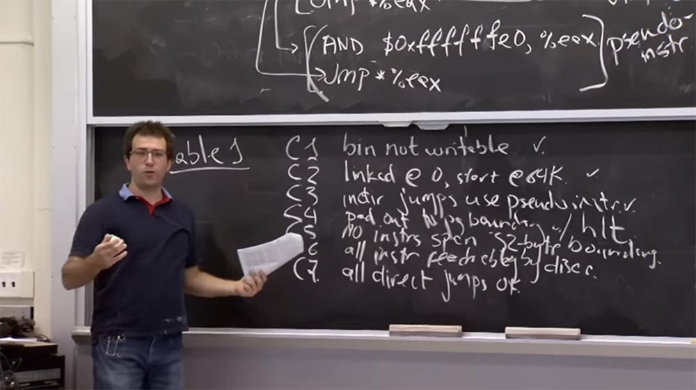
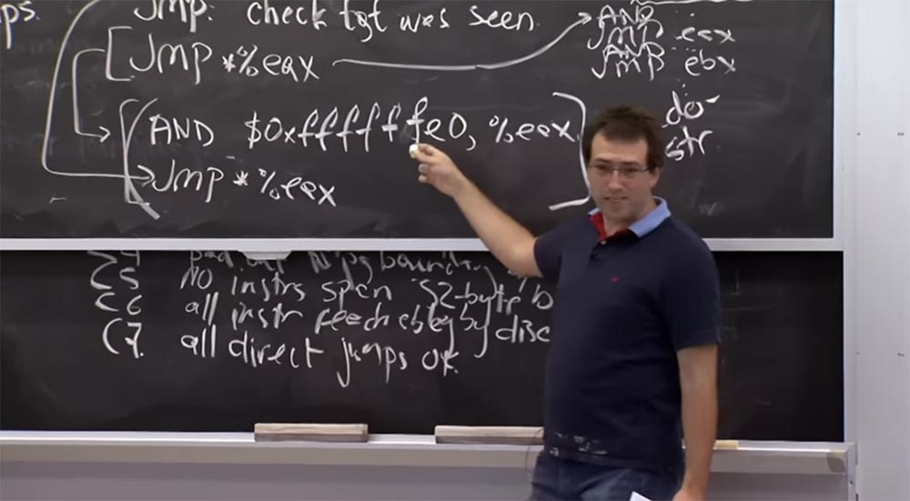
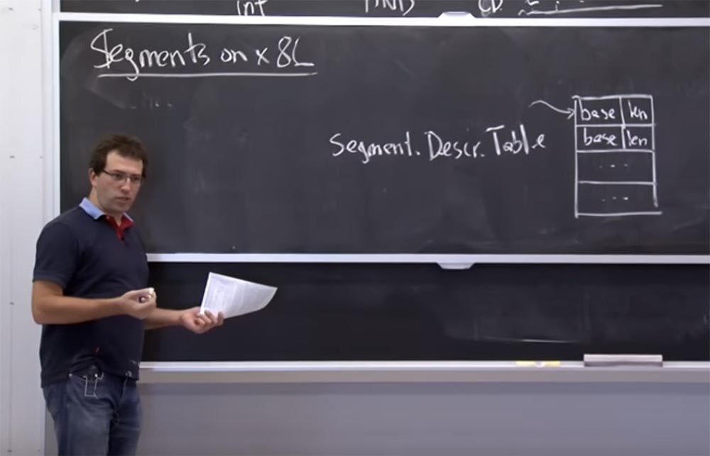
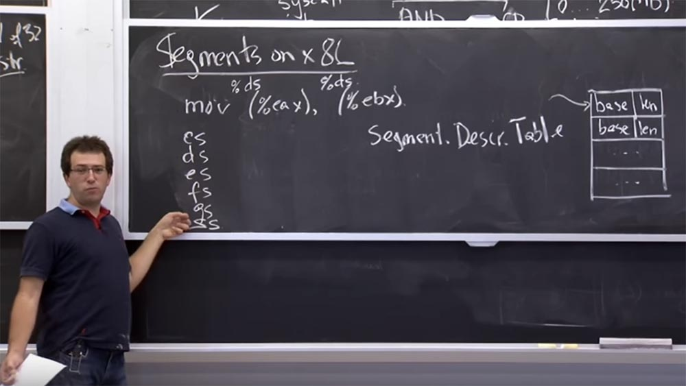
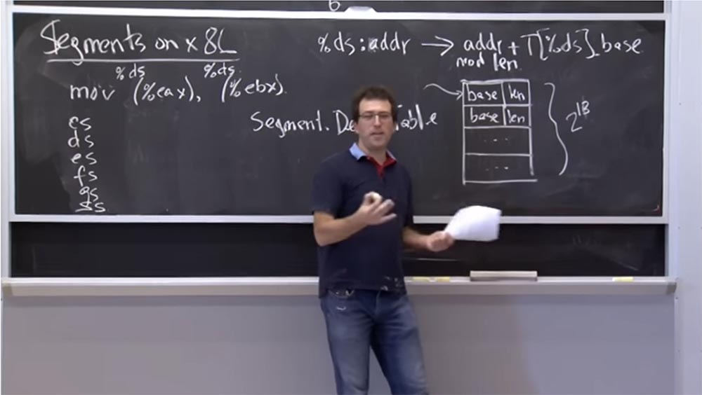
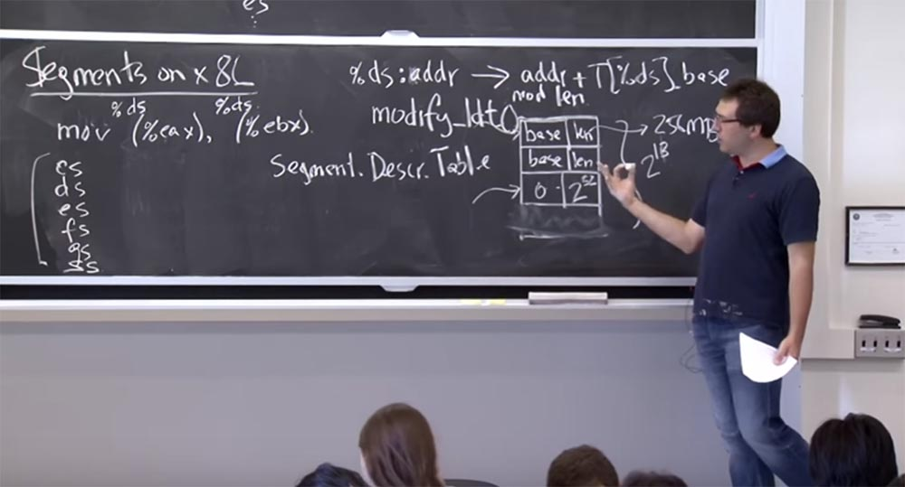
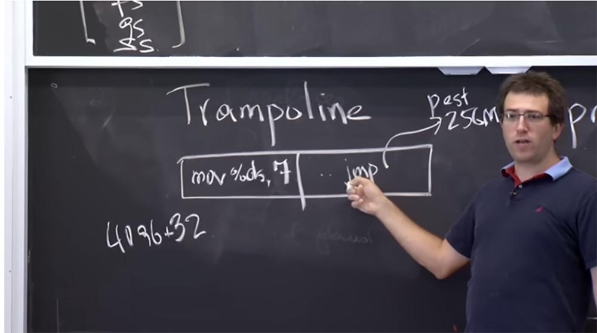
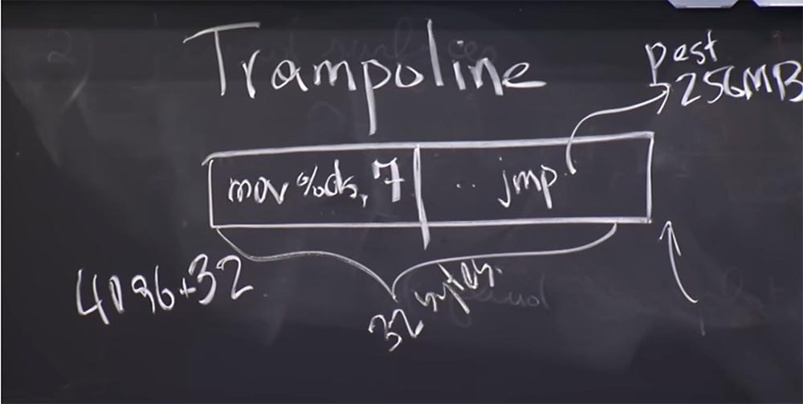
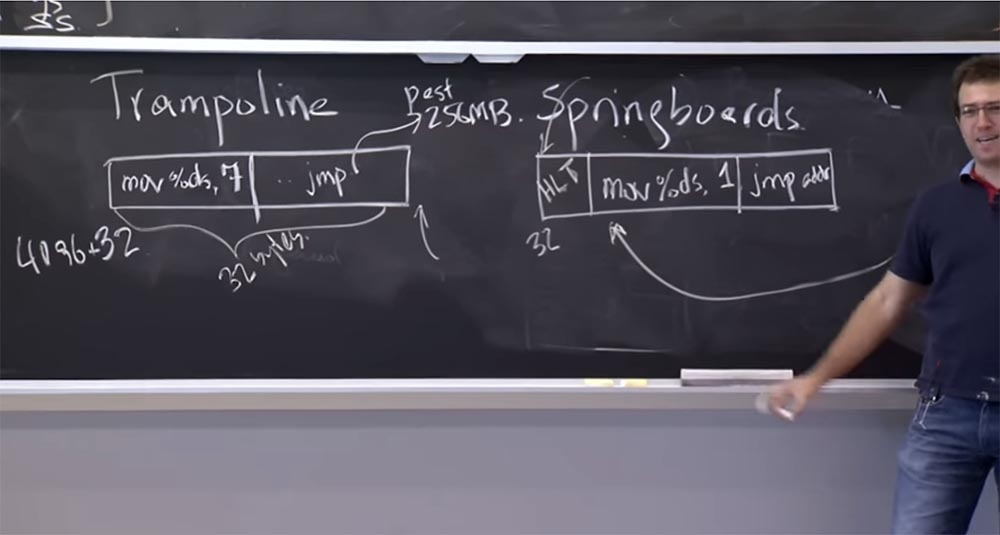

Курс MIT «Безопасность компьютерных систем». Лекция 7: «Песочница Native Client», часть 3 / Блог компании ua-hosting.company

### Массачусетский Технологический институт. Курс лекций #6.858. «Безопасность компьютерных систем». Николай Зельдович, Джеймс Микенс. 2014 год

Computer Systems Security — это курс о разработке и внедрении защищенных компьютерных систем. Лекции охватывают модели угроз, атаки, которые ставят под угрозу безопасность, и методы обеспечения безопасности на основе последних научных работ. Темы включают в себя безопасность операционной системы (ОС), возможности, управление потоками информации, языковую безопасность, сетевые протоколы, аппаратную защиту и безопасность в веб-приложениях.

Лекция 1: «Вступление: модели угроз» [Часть 1](https://habr.com/company/ua-hosting/blog/354874/) / [Часть 2](https://habr.com/company/ua-hosting/blog/354894/) / [Часть 3](https://habr.com/company/ua-hosting/blog/354896/)  
Лекция 2: «Контроль хакерских атак» [Часть 1](https://habr.com/company/ua-hosting/blog/414505/) / [Часть 2](https://habr.com/company/ua-hosting/blog/416047/) / [Часть 3](https://habr.com/company/ua-hosting/blog/416727/)  
Лекция 3: «Переполнение буфера: эксплойты и защита» [Часть 1](https://habr.com/company/ua-hosting/blog/416839/) / [Часть 2](https://habr.com/company/ua-hosting/blog/418093/) / [Часть 3](https://habr.com/company/ua-hosting/blog/418099/)  
Лекция 4: «Разделение привилегий» [Часть 1](https://habr.com/company/ua-hosting/blog/418195/) / [Часть 2](https://habr.com/company/ua-hosting/blog/418197/) / [Часть 3](https://habr.com/company/ua-hosting/blog/418211/)  
Лекция 5: «Откуда берутся ошибки систем безопасности» [Часть 1](https://habr.com/company/ua-hosting/blog/418213/) / [Часть 2](https://habr.com/company/ua-hosting/blog/418215/)  
Лекция 6: «Возможности» [Часть 1](https://habr.com/company/ua-hosting/blog/418217/) / [Часть 2](https://habr.com/company/ua-hosting/blog/418219/) / [Часть 3](https://habr.com/company/ua-hosting/blog/418221/)  
Лекция 7: «Песочница Native Client» [Часть 1](https://habr.com/company/ua-hosting/blog/418223/) / [Часть 2](https://habr.com/company/ua-hosting/blog/418225/) / [Часть 3](https://habr.com/company/ua-hosting/blog/418227/)

В правиле **С4** имеется один нюанс. Вы не можете «перепрыгнуть» через конец выполнения программы. Последнее, к чему вы можете прыгнуть – это последняя инструкция. Так что данное правило гарантирует, что при выполнении программы в «движке» процесса не возникнет никакого несоответствия.

Правило **С5** говорит о том, что не может существовать инструкций размером более 32 байт. Мы рассмотрели некий вариант этого правила, когда говорили о кратности размеров инструкции 32 байтам, в противном случае можно прыгнуть в середину инструкции и создать проблему с системным вызовом, который может там «прятаться».

Правило **С6** утверждает, что все имеющиеся инструкции можно деассемблировать с самого начала. Таким образом, это гарантирует, что мы видим каждую инструкцию и можем проверить все инструкции, которые запускаются при выполнении программы.

Правило **С7** утверждает, что все прямые прыжки являются правильными. Например, вы прыгаете прямо в ту часть инструкции, где указана цель, и хотя она не кратна 32, то всё равно является правильной инструкцией, к которой применяется деассемблирование слева направо.

**Аудитория:** в чем разница между **C5** и **C3**?

**Профессор:** Я думаю, что **C5** говорит, что если у меня есть инструкция из нескольких байт, она не может пересекать границы смежных адресов. Предположим, что у меня есть поток инструкций, и имеется адрес 32 и адрес 64. Так вот, инструкция не может пересекать границу, кратную 32 байтам, то есть не должна начинаться адресом, меньшим 64 и заканчиваться адресом, большим 64.

Именно об этом говорит правило **С5**. Потому что иначе, совершив прыжок кратностью 32, можно попасть в середину другой инструкции, где неизвестно что происходит.

А правило **С3** является аналогом этого запрета на стороне прыжка. Оно утверждает, что всякий раз, когда вы прыгаете, длина вашего прыжка должна быть кратна 32.

**С5** также утверждает, что всё, что находится в диапазоне адресов, кратном 32, является безопасной инструкцией.

После прочтения списка этих правил у меня возникло смешанное чувство, так как я не смог оценить, являются ли эти правила достаточными, то есть минимальный это список или полный.  
Итак, давайте подумаем о домашнем задании, которое вы должны выполнить. Мне думается, что на самом деле в работе **Native Client** есть ошибка при выполнении в песочнице какой-то сложной инструкции. Я считаю, что у них не было правильного кодирования длины, что может привести к чему-то плохому, но не могу точно вспомнить, что это была за ошибка.

Предположим, что валидатор песочницы неправильно получает длину какой-то инструкции. Что плохого может случиться в этом случае? Как бы вы использовали этот промах?

**Аудитория:** например, можно спрятать системный вызов или оператор возврата **ret**.

**Профессор:** да. Предположим, что есть какой-то причудливый вариант инструкции **AND**, которую вы записали. Возможно, что валидатор ошибся и посчитал, что её длина составляет 6 байт при фактической длине 5 байт.

Что при этом произойдёт? Валидатор считает длину этой инструкции 6 байтов и располагает за ней другую правильную инструкцию. Но процессор, запуская код, использует реальную длину инструкции, то есть 5 байт. В результате у нас возникает свободный байт в конце инструкции **AND**, куда мы могли бы вставить системный вызов и использовать его в свою пользу. И если мы вставим сюда байт **CD**, это будет похоже на начало другой инструкции. Далее мы разместим что-нибудь в следующем промежутке из 6 байт, и это будет похоже на инструкцию, которая начинается с байта **CD**, хотя фактически это часть инструкции **AND**. После этого мы можем сделать системный вызов и «сбежать» из песочницы.

Таким образом, валидатор **Native Client** должен синхронизировать свои действия с действиями **CPU**, то есть «угадывать», как именно процессор будет интерпретировать каждую инструкцию. И такое должно быть на каждом уровне песочницы, что достаточно сложно осуществить.

На самом деле в **Native Client** имеются и другие интересные ошибки. Одна из них заключается в неправильной очистке среды процессора во время прыжка в среду доверенных служб **Trusted Service Runtime**. Думаю, мы поговорим об этом через секунду. Но **Trusted Service Runtime** собирается в основном работать с тем же набором регистров **CPU**, которые предназначены для запуска ненадёжных модулей. Так что если процессор забывает что-то очистить или перезагрузить, среда выполнения может оказаться обманутой, посчитав ненадёжный модуль доверенным приложением и выполнить то, что не должна была бы сделать или то, что не входило в намерения разработчиков.

Итак, где мы сейчас находимся? В данный момент мы понимаем, как можно деассемблировать все инструкции и как предотвратить выполнение запрещенных инструкций. Теперь давайте посмотрим, как мы храним память и ссылки как для кода, так и для данных в границах модуля **Native Client**.

Из соображений производительности ребята из **Native Client** при этом начинают использовать аппаратную поддержку, чтобы убедиться, что хранение памяти и ссылок на самом деле не вызовет много накладных расходов. Но прежде чем рассмотреть аппаратную поддержку, которую они используют, я хочу услышать предложения, как бы могли сделать то же самое без аппаратной поддержки? Можем ли мы просто обеспечить доступ ко всем процессам памяти в границах, установленных машиной ранее?

**Аудитория:** вы можете инструментировать инструкции, чтобы очистить все высшие биты.

**Профессор:** да, это правильно. На самом деле мы видим, что у нас здесь есть эта инструкция **AND**, и каждый раз, когда мы, например, прыгаем куда-нибудь, она очищает низкие биты. Но если мы хотим сохранить весь возможный код, который выполняется в пределах низких 256 МБ, можно просто заменить первый атрибут **f** на **0** и вместо **$0xffffffe0** получить **$0x0fffffe0**. Это очищает низкие биты и устанавливает верхний предел на 256 МБ.

Таким образом, это делает именно то, что вы предлагаете, позволяя убедиться, что всякий раз, когда вы прыгаете, вы находитесь в пределах 256 МБ. И тот факт, что мы выполняем деассемблирование, позволяет также проверить, что все прямые прыжки находятся в пределах досягаемости.

Причина, по которой они не делают подобного для своего кода, состоит в том, что на платформе **x86** вы можете очень эффективно кодировать **AND**, где все верхние биты равны 1\. Это оборачивается существованием 3–х байтовой инструкции для **AND** и 2-х байтовой инструкцией для прыжка. Таким образом, у нас возникает дополнительный расход размером 3 байта. Но если вам нужен не единичный высокий бит, как этот **0** вместо **f**, то у вас внезапно образуется 5-байтовая инструкция. Поэтому я думаю, что в данном случае они беспокоятся о накладных расходах.

**Аудитория:** есть ли проблема существования некоторых инструкций, которые дают приращении версии, которую вы пытаетесь получить? То есть вы можете сказать, что ваша инструкция может иметь постоянное смещение или что-то в этом роде?

**Профессор:** думаю, да. Вы, вероятно, запретите инструкции, которые прыгают к какой-то сложной формуле адреса и будете поддерживать только инструкцию, которая прыгает к этому значению напрямую, и это значение всегда получает **AND**.

**Аудитория:** это больше нужно для доступа к памяти, чем …

**Профессор:** да, потому что это просто код. А для доступа к памяти на платформе **х86** имеется много странных способов обращения к определенному местоположению памяти. Обычно вы сначала должны вычислить расположение памяти, затем добавить дополнительный **AND** и только тогда сделать доступ. Я думаю, что это настоящая причина их беспокойства по поводу снижения производительности за счёт использования этого инструментария.

На платформе **x86**, или, по крайней мере, на платформе 32 бит, которая описывается в статье, они используют поддержку со стороны аппаратного обеспечения вместо того, чтобы ограничить код и данные адресов, ссылающиеся на ненадёжные модули.

Давайте посмотрим, как это выглядит, прежде чем выяснять, как использовать модуль **NaCl** в песочнице. Это аппаратное обеспечение называется сегментацией. Оно возникло ещё до того, как платформа **x86** обзавелась файлом подкачки. На платформе на **x86** во время работы процесса существует таблица поддерживаемых аппаратных средств. Назовем её таблицей дескрипторов сегментов. Она представляет собой кучу сегментов, пронумерованных от 0 и до конца таблицы любого размера. Это что-то вроде файлового дескриптора в **Unix**, за исключением того, что каждая запись состоит из 2-х значений: основы **base** и длины **lenght**.

Эта таблица говорит нам, что у нас есть пара сегментов, и всякий раз, когда мы ссылаемся на определенный сегмент, это в некотором смысле означает, что мы говорим о куске памяти, который начинается с адреса базы **base** и продолжается на протяжении длины **length**.

Это помогает нам соблюдать границы памяти на платформе **x86**, потому что каждая инструкция, обращаясь к памяти, обращается к определенному сегменту в этой таблице.

Например, когда мы выполняем **mov (%eax), (%ebx)**, то есть перемещаем значение памяти из указателя, хранящегося в регистре **EAX**, в другой указатель, хранящийся в регистре **EBX**, программа знает, что за начальный и что за конечный адрес имеется ввиду, и сохранит значение во втором адресе.

Но на самом деле на платформе **x86**, когда мы говорим о памяти, есть неявная вещь, называемая дескриптором сегмента по аналогии с файловым дескриптором в **Unix**. Это просто индекс в таблице дескрипторов, и если не указано иное, то каждый код операции содержит в себе сегмент по умолчанию.

Поэтому, когда вы выполняете **mov (%eax)**, он относится к **%ds**, или к регистру сегмента данных, который представляет собой специальный регистр в вашем процессоре. Если я правильно помню, он представляет собой 16-ти битное целое число, которое указывает на эту таблицу дескрипторов.

И то же самое касается **(%ebx)** – он относится к тому же селектору сегмента **%ds**. Фактически в **х86** у нас имеется группа из 6 селекторов кода: **CS, DS, ES, FS, GS** и **SS**. Селектор сегмента вызова **CS (call selector)** неявно используется для получения инструкций. Так что если ваш указатель инструкции указывает на что-то, то оно относится к тому, что выбрал селектор сегмента **CS**.

Большинство ссылок на данные неявно используют **DS** или **ES**, **FS** и **GS** обозначают некоторые специальные вещи, а **SS** всегда используется для операций стека. И если вы выполняете **push & pop**, то они неявно приходят из этого селектора сегментов. Это довольно архаичная механика, но она оказывается чрезвычайно полезной в этом конкретном случае.

Если вы получаете доступ к какому-то адресу, например, в селекторе **%ds: addr**, аппаратное обеспечение перетранслирует его в операцию с таблицей **adrr + T \[%ds\].base**. Это означает, что он возьмёт адрес длины модуля из той же таблицы. Так что всякий раз, когда вы получаете доступ к памяти, у него имеется база селекторов сегментов в виде записей таблицы дескриптора, и он принимает указанный вами адрес и сопоставляет его с длиной соответствующего сегмента.

**Аудитория:** так почему это не используется, например, для защиты буфера?

**Профессор:** да, это хороший вопрос! Не могли бы мы использовать это для защиты от переполнения буфера? Например, для каждого буфера, который у нас есть, можно поместить сюда базу буфера, а туда размер буфера.

**Аудитория:** а что, если вам не нужно помещать его в таблицу прежде, чем вы захотите в него написать? Вам не нужно, чтобы это находилось там постоянно.

**Профессор:** да. Поэтому я думаю, что причина того, что подобный подход не часто используется для защиты от переполнения буфера, состоит в том, что количество записей этой таблицы не может превышать 2 в 16-й степени, потому что дескрипторы имеют длину 16 бит, но на самом деле ещё несколько бит используются для других вещей. Так что фактически вы сможете разместить в этой таблице только 2 в 13-й степени записей. Поэтому если у вас в коде имеется массив данных размером более чем 213, может возникнуть переполнение этой таблицы.

К тому же для компилятора было бы странно напрямую управлять этой таблицей, потому что обычно манипуляции с ней производятся с помощью системных вызовов. Вы не можете напрямую записывать в эту таблицу, сначала необходимо выполнить системный вызов операционной системы, после чего операционная система поместит запись в эту таблицу. Поэтому я думаю, что большинство компиляторов просто не захотят иметь дело с такой сложной системой управления буферами памяти.

Кстати, **Multex** использует данный подход: в нём имеется 218 записей для различных сегментов и 218 записей для возможных смещений. И каждый общий фрагмент библиотеки или фрагмент памяти являются отдельными сегментами. Они все проверяются на диапазон и поэтому не могут использоваться на переменном уровне.

**Аудитория:** предположительно, постоянная необходимость использовать ядро вызовет замедление выполнения процесса.

**Профессор:** да, это правильно. Так что у нас возникнут накладные расходы за счёт того, что при внезапном создании нового буфера в стеке нужно совершить системный вызов для его добавления.

Итак, сколько из этих элементов на самом деле используют механизм сегментации? Вы можете догадаться, как это работает. Я думаю, по умолчанию все эти сегменты в **x86** имеют базу, равную 0, и длину от 2 до 32. Таким образом, можно получить доступ ко всему диапазону памяти, какой вы захотите. Поэтому для **NaCl** они кодируют базу 0 и устанавливают длину в 256 мегабайт. Затем они указывают на все регистры 6 селекторов сегментов в этой записи для области 256 МБ. Таким образом, всякий раз, когда оборудование выполняет доступ к памяти, оно модифицирует его со смещением в пределах 256 МБ. Так что возможность изменять модуль будет ограничена диапазоном 256 МБ.

Я думаю, что теперь вы поняли, как поддерживается это аппаратное обеспечение и как оно работает, так что могли бы в конечном итоге использовать эти селекторы сегментов.  
Так что может пойти не так, если мы просто реализуем этот план? Можем ли мы «выскочить» из селектора сегментов в ненадежном модуле? Я думаю, что одна вещь, с которой следует быть внимательными, это то, что эти регистры похожи на обычные регистры, и вы можете перемещать значения в них и из них. Поэтому вы должны убедиться, что ненадежный модуль не искажает эти регистры селекторов сегментов. Потому что где-то в таблице дескрипторов вполне может находиться запись, которая также является исходным дескриптором сегмента для процесса, имеющего базу 0 и длину до 232.

Так что если ненадежный модуль смог изменить **CS**, или **DS**, или **ES**, или любой из этих селекторов так, что они начнут указывать на эту оригинальную операционную систему, которая охватывает все ваше адресное пространство, то вы сможете сделать ссылку памяти на этот сегмент и «выскочить» из песочницы.

Таким образом, **Native Client** должен был добавить ещё несколько инструкций к этому запрещенному списку. Я думаю, что они запрещают все инструкции типа **mov %ds, es** и так далее. Поэтому, оказавшись в песочнице, вы не можете изменить сегмент, на который ссылаются некоторые вещи, имеющие к нему отношение. На платформе **x86** инструкции изменения таблицы дескрипторов сегментов являются привилегированными, но изменение самих **ds, es** и т.д. в таблице является полностью непривилегированным.

**Аудитория:** можете ли вы инициализировать таблицу так, чтобы во все неиспользуемые слоты помещалась нулевая длина?

**Профессор:** да. Можно задать длину таблицы для чего-то, где нет неиспользуемых слотов. Оказывается, что вам действительно нужен этот дополнительный слот, содержащий 0 и 232, потому что среда **trusted runtime** должна запуститься в этом сегменте и получить доступ ко всему диапазону памяти. Так что эта запись необходима для работы среды trusted **runtime**.

Аудитория: что нужно для того, чтобы изменить длину выходных данных таблицы?  
Профессор: нужно обладать root-правами. В **Linux** на самом деле есть система, которая называется **modify_ldt()** для таблицы локальных дескрипторов, которая позволяет любому процессу изменять свою собственную таблицу, то есть здесь фактически приходится по одной таблице на каждый процесс. Но на платформе **x86** это происходит сложнее, здесь есть и глобальная таблица, и локальная таблица. Локальную таблицу, предназначенную для конкретного процесса, можно изменить.

А сейчас попытаемся выяснить, как мы запрыгиваем и выпрыгиваем из процесса выполнения **Native Client** или выпрыгиваем из песочницы. Что нас означает «выпрыгнуть»?

Итак, нам нужно запустить этот доверенный код, и этот доверенный код «живет» где-то выше предела в 256 МБ. Чтобы прыгнуть туда, нам придется отменить все эти средства защиты, которые установил **Native Client**. В основном они сводятся к изменению этих шести селекторов. Я думаю, что наш валидатор не собирается применять те же правила для вещей, расположенных выше предела в 256 МБ, так что это достаточно просто.

Но тогда нам нужно как-то прыгнуть в доверенную среду выполнения **trusted runtime** и переустановить селекторы сегментов на правильные значения для этого гигантского сегмента, охватывающего адресное пространство всего процесса – вот этот диапазон от 0 до 232. Такие механизмы, существующие в **Native Client**, они назвали «батутами» **trampoline** и «трамплинами» **springboards**. Они обитают в низких 64к модуля. Самое классное то, что эти «батуты» и «трамплины» представляют собой куски кода, лежащие в нижних 64k пространства процесса. Это означает, что этот ненадежный модуль может туда прыгнуть, потому что это валидный адрес кода, находящийся в границах кратности 32 бит и в пределах 256 МБ. Так что вы можете запрыгнуть на этот «батут».

Но среда выполнения **Native Client** должна скопировать эти «батуты» откуда-то извне. Таким образом, модулю **Native Client** не разрешили поддержку кода своего собственного «батута», и код trampoline приходит из доверенной среды выполнения **trusted runtime**. В результате он фактически содержит все эти чувствительные инструкции, такие как перемещение **DS, CS** и так далее, что не разрешается иметь самому ненадёжному коду.

Таким образом, чтобы выпрыгнуть из песочницы в доверенную среду выполнения, чтобы сделать что-то вроде **maloс** или создать поток, нужно прыгнуть на «батут», который «живёт» в 32-х байтовом смещении.

Предположим, что он имеет адрес 4096 + 32 и у него будут некоторые инструкции для того, чтобы отменить эти селекторы сегментов. Для этого он, например, выполнит операцию **mov %ds, 7**, то есть перемести запись в регистр **ds**, при этом 7 будет указывать на адресное пространство в диапазоне от 0 до 232. После эффективного перемещения **CS** вы сможете прыгнуть в среду выполнения **trusted service runtime**, и это будет после 256 МБ.

Таким образом, этот прыжок не допускается регулярно, но всё будет в порядке, потому здесь выполняется прыжок именно в ту точку **trusted service runtime**, которая ожидает эти прыжки. После этого будут выполнены надлежащие проверки на правильность аргументов и всего остального, что здесь происходит. И мы действительно можем переместить DS сюда, потому что знаем, что это действительно безопасно и код, на который мы собираемся прыгнуть, не собирается сделать что-нибудь произвольное или недопустимое с нашим ненадежным модулем.

Итак, зачем же этим парням нужно выпрыгивать из сегментов? Например, почему бы просто не поместить все эти вещи на «батут»? Возможно, это будет более трудоёмким?

**Аудитория:** у нас только 64к.

**Профессор:** да, верно, ведь на самом деле у вас не так много места. Потенциально этого может быть достаточно для размещения там maloс, но проблема не только в этих 64к, но и в ограничении 32 байт. А для доверенного кода это не является ограничением, поскольку доверенный код может делать здесь всё, что угодно, и это не будет проверяться.

Проблема в том, что ненадежный код может прыгнуть в каждое 32-х байтовое смещение, поэтому каждое смещение должно иметь особые аргументы. Поэтому вам, вероятно, будет трудно записывать этот код в каждые 32 байта, потому что в каждых 32-х байтах выполняется проверка аргументов, значений и тому подобного. Так что вы должны спрыгивать с «батута» и запрыгивать в **trusted runtime** в пределах 32 байт кода.

Вот как вы выпрыгиваете из песочницы. Чтобы прыгнуть обратно в песочницу, вам нужно отменить эти преобразования, то есть установить назад **DS, CS** и так далее. Самое сложное здесь то, что если вы находитесь снаружи этого 256-ти мегабайтового предела, но работаете внутри **trusted runtime**, то не можете сбросить эти регистры. В противном случае потом вы будете в состоянии получить доступ к любой памяти в вашем наружном пространстве.

Для этого они используют второй инструмент под названием «трамплин», который как позволяет перепрыгнуть из **trusted runtime** за пределами 256 МБ обратно в модуль **Native Client**. «Трамплин» перезагружает регистр **DS**, например, функцией **mov %ds, 7**, сбрасывает другие аргументы и организует прыжок по адресу, который **trusted runtime** хочет вернуть ненадежному модулю. Такова процедура возвращения в песочницу. Единственная трудность состоит в том, чтобы ненадежный код сам не прыгнул на «трамплин», потому что после этого может произойти что-то странное.

Поэтому разработчики поместили инструкцию останова **halt** в первый байт 32-х байтовой последовательности «трамплина». Так что если вы прыгнете к началу «трамплина», то немедленно остановитесь. При этом доверенная среда выполнения **trusted service runtime** собирается пройти мимо этого первого байта, перейти к 1 и совершить обратный прыжок.

Но эту операцию может провести только **trusted service runtime**, потому что она регулярно проверяет, что проделать такое не будет разрешено ничему другому.

**Аудитория:** а сам «трамплин» находится в ненадёжном модуле?

**Профессор:** «трамплин» находится в пределах от 0 до 256 МБ ненадёжного модуля. Но на самом деле он обитает в 64-битном куске в самом начале модуля, то есть в части, куда не может попасть ничего из «бинарника», загруженного вами с какого-нибудь веб-сайта. Он добавляется туда средой **Native Client** при первой загрузке этого модуля в память.

**Аудитория:** а почему бы просто не создать его во время выполнения?

**Профессор:** да, почему бы нам не получить его во время выполнения? Что произойдет, если среде выполнения разрешить установку «трамплина»? Чем это плохо?

**Аудитория:** как мы тогда узнаем, куда следует вернуться?

**Профессор:** я думаю, что на самом деле это на самом деле прыжок совершается на что-то типа **%eax**, и **trusted runtime** говорит: «о, я хочу вернуться на этот адрес»! Среда помещает его в регистр **EAX**, прыгает к оператору **mov**, и «трамплин» совершает прыжок в любое место **EAX**, которое определила для него доверенная среда выполнения **trusted runtime**. Так что случится, если модуль придёт со своим собственным «трамплином»?

**Аудитория:** ну, вы можете сделать это как прыжок естественного типа, но он ничего не должен знать о таблице дескрипторов. Это аппаратное обеспечение…

**Профессор:** да, на самом деле, это очень важная инструкция для песочницы — тот факт, что мы перезагружаем этот дескриптор для того, чтобы указать на один из этих ограниченных дескрипторов в пространстве от 0 до 232. Это действительно важно. Потому что если бы модулю разрешили установить собственный «трамплин», он бы мог просто пропустить эту часть и не ограничить себя обязательным условием вернуться к 256 МБ.

Таким образом, как только вы прыгнули через «трамплин», то сразу же получили доступ ко всему адресному пространству процесса. Таким образом, «трамплин» является частью механизма принуждения, как бы устанавливая границы. Поэтому они не хотят, чтобы установка «трамплина» осуществлялась средой выполнения.

**Аудитория:** можно ли установить «трамплин» за пределами 256 мегабайт?

**Профессор:** я думаю, что они не хотят этого делать. Это связано с тем, что нужно установить код дескриптора сегмента **CS** в этот ограниченный сегмент и одновременно прыгнуть на какой-то конкретный адрес. Легче сделать это через «трамплин», потому что сначала вы прыгаете к **halt**, затем выполняете mov, затем устанавливаете значение **CS**, но все равно можете выполнить тот же код, потому что выполнение происходит в границах 256 МБ.

Я думаю, что в основном это связано с теми атомарными примитивами, которые предоставляет вам «железо». Таким образом, вы хотите установить целую кучу сегментов **DS**, регистров селектора, регистр **CS** и одновременно куда-то прыгнуть.

Вероятно, если бы вы постарались, то могли бы придумать некоторую последовательность инструкций **x86**, которая могла бы сделать это вне границ адресного пространства модуля **Native Client**.

Итак, увидимся на следующей неделе и поговорим о веб-безопасности.

Полная версия курса доступна [здесь](https://ocw.mit.edu/courses/electrical-engineering-and-computer-science/6-858-computer-systems-security-fall-2014/).

Спасибо, что остаетесь с нами. Вам нравятся наши статьи? Хотите видеть больше интересных материалов? Поддержите нас оформив заказ или порекомендовав знакомым, **30% скидка для пользователей Хабра на уникальный аналог entry-level серверов, который был придуман нами для Вас:** [Вся правда о VPS (KVM) E5-2650 v4 (6 Cores) 10GB DDR4 240GB SSD 1Gbps от $20 или как правильно делить сервер?](https://habr.com/company/ua-hosting/blog/347386/) (доступны варианты с RAID1 и RAID10, до 24 ядер и до 40GB DDR4).

**VPS (KVM) E5-2650 v4 (6 Cores) 10GB DDR4 240GB SSD 1Gbps до декабря бесплатно** при оплате на срок от полугода, заказать можно [тут](https://ua-hosting.company/vpsnl).

**Dell R730xd в 2 раза дешевле?** Только у нас **[2 х Intel Dodeca-Core Xeon E5-2650v4 128GB DDR4 6x480GB SSD 1Gbps 100 ТВ от $249](https://ua-hosting.company/serversnl) в Нидерландах и США!** Читайте о том [Как построить инфраструктуру корп. класса c применением серверов Dell R730xd Е5-2650 v4 стоимостью 9000 евро за копейки?](https://habr.com/company/ua-hosting/blog/329618/)