Курс MIT «Безопасность компьютерных систем». Лекция 8: «Модель сетевой безопасности», часть 1 / Блог компании ua-hosting.company

### Массачусетский Технологический институт. Курс лекций #6.858. «Безопасность компьютерных систем». Николай Зельдович, Джеймс Микенс. 2014 год

Computer Systems Security — это курс о разработке и внедрении защищенных компьютерных систем. Лекции охватывают модели угроз, атаки, которые ставят под угрозу безопасность, и методы обеспечения безопасности на основе последних научных работ. Темы включают в себя безопасность операционной системы (ОС), возможности, управление потоками информации, языковую безопасность, сетевые протоколы, аппаратную защиту и безопасность в веб-приложениях.

Лекция 1: «Вступление: модели угроз» [Часть 1](https://habr.com/company/ua-hosting/blog/354874/) / [Часть 2](https://habr.com/company/ua-hosting/blog/354894/) / [Часть 3](https://habr.com/company/ua-hosting/blog/354896/)  
Лекция 2: «Контроль хакерских атак» [Часть 1](https://habr.com/company/ua-hosting/blog/414505/) / [Часть 2](https://habr.com/company/ua-hosting/blog/416047/) / [Часть 3](https://habr.com/company/ua-hosting/blog/416727/)  
Лекция 3: «Переполнение буфера: эксплойты и защита» [Часть 1](https://habr.com/company/ua-hosting/blog/416839/) / [Часть 2](https://habr.com/company/ua-hosting/blog/418093/) / [Часть 3](https://habr.com/company/ua-hosting/blog/418099/)  
Лекция 4: «Разделение привилегий» [Часть 1](https://habr.com/company/ua-hosting/blog/418195/) / [Часть 2](https://habr.com/company/ua-hosting/blog/418197/) / [Часть 3](https://habr.com/company/ua-hosting/blog/418211/)  
Лекция 5: «Откуда берутся ошибки систем безопасности» [Часть 1](https://habr.com/company/ua-hosting/blog/418213/) / [Часть 2](https://habr.com/company/ua-hosting/blog/418215/)  
Лекция 6: «Возможности» [Часть 1](https://habr.com/company/ua-hosting/blog/418217/) / [Часть 2](https://habr.com/company/ua-hosting/blog/418219/) / [Часть 3](https://habr.com/company/ua-hosting/blog/418221/)  
Лекция 7: «Песочница Native Client» [Часть 1](https://habr.com/company/ua-hosting/blog/418223/) / [Часть 2](https://habr.com/company/ua-hosting/blog/418225/) / [Часть 3](https://habr.com/company/ua-hosting/blog/418227/)  
Лекция 8: «Модель сетевой безопасности» [Часть 1](https://habr.com/company/ua-hosting/blog/418229/) / [Часть 2](https://habr.com/company/ua-hosting/blog/423155/) / [Часть 3](https://habr.com/company/ua-hosting/blog/423423/)

Давайте начнем следующую часть нашего увлекательного путешествия в мир компьютерной безопасности. Сегодня мы поговорим о веб-безопасности. На самом деле, интернет – безопасность — одна из моих любимых тем для разговора, потому что она знакомит вас с истинными ужасами этого мира.

Конечно, легко быть студентом и думать, что всё будет здорово, стоит вам только окончить институт. Однако сегодняшняя и следующая лекция расскажут вам, что на самом деле, это не так и вас ждут сплошные ужасы.

Так что же такое интернет? В старые времена сеть была намного проще, чем сегодня. Клиенты, то есть браузеры, не могли ничего сделать с отображением фиксированного или активного содержания. По существу они могли только получать статические изображения и статические тексты.

Но серверная часть была немного интереснее, даже если на стороне клиента было статическое содержимое. Сервер мог общаться с базами данных, он мог «говорить» с другими машинами на стороне сервера. Таким образом, в течение очень долгого времени понятие веб-безопасности, в принципе, было связано с тем, что делает сервер. На наших лекциях мы, по сути, будем использовать такой же подход.

Мы рассматривали такую вещь, как атака переполнением буфера. Так как клиенты могут обмануть сервер, заставив его делать то, что он не хочет делать. Вы также рассмотрели сервер OKWS и то, как там можно выполнить изоляцию привилегий.

До сих пор мы рассматривали безопасность через опыт, который был на самом деле получен при использовании самих ресурсов безопасности. Но сейчас браузеры представляют собой очень интересные с точки безопасности объекты, с которыми всё очень сложно.

Рассмотрим все виды безумных, динамичных вещей, которые может делать браузер. Например, вы наверняка слышали о JavaScript. Теперь JavaScript позволяет страницам выполнять код со стороны клиента. Существует модель DOM, о которой мы сегодня поговорим более подробно. Модель DOM, по существу, позволяет коду JavaScript динамически изменять внешний вид страницы, например, осуществлять стилизацию шрифтов и тому подобное.

У нас есть запросы XML HTTP. В основном это способ для JavaScript асинхронно получать с серверов контент. Вы также можете услышать о запросах XML HTTP, называемых AJAX — асинхронная выборка JavaScript.

Есть такие вещи, как веб-сокеты. Это недавно введенный API, интерфейс программирования. Веб-сокеты позволяют осуществлять полностью дуплексную связь между клиентами и серверами, то есть коммуникацию в обоих направлениях.

У нас также имеются все виды мультимедийной поддержки, например, тег:

    <video>

Позволяющий веб-странице воспроизводить видео без использования Flash-приложения. Он может просто воспроизводить это видео изначально.

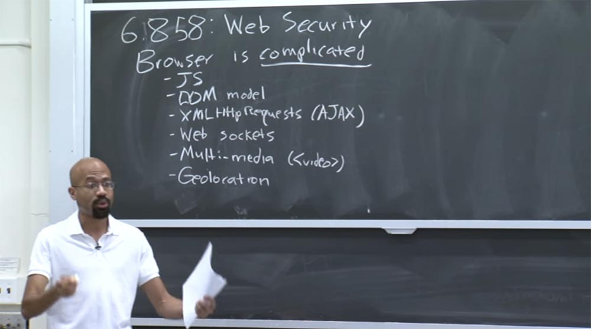

Также у нас есть геолокация. Теперь веб-страница может физически определить, где вы находитесь. Например, если вы используете веб-страницу на смартфоне, браузер может фактически получить доступ к модулю GPS вашего устройства. Если вы обращаетесь к веб-странице через браузер на рабочем столе, она может просмотреть ваше подключение Wi-Fi и подключиться к службе геолокации Wi-Fi Google, чтобы выяснить, где именно вы находитесь. Звучит безумно, не правда ли? Но теперь веб-страницы могут делать такие вещи. Мы также упоминали такую вещь, как Native Client, который позволяет браузерам запускать машинный код.  
В браузере есть много других функций, о которых я здесь не упомянул. Но достаточно сказать, что современный браузер невероятно сложная вещь.

Так что же это означает с точки зрения безопасности? В общем, это значит, что мы в большом затруднении. Потому что здесь поистине огромное поле деятельности для угроз безопасности. Грубо говоря, когда вы думаете о безопасности, вы можете подумать о графике, который выглядит примерно так: вертикальная ось – это вероятность правильности выполнения функций, а горизонтальная – количество имеющихся функций. Вертикальная ось ограничена числом 100, которого мы не можем достичь даже с самым простым кодом.

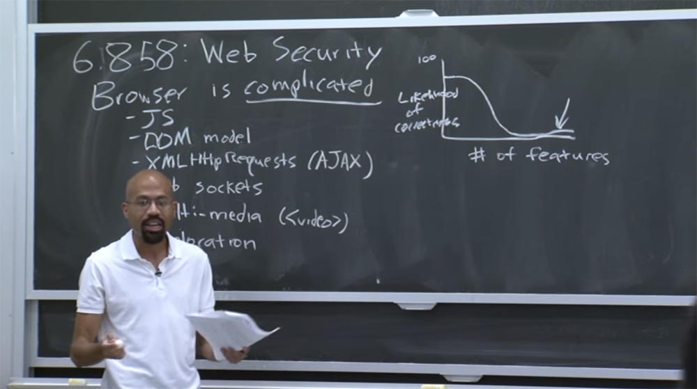

По сути, эта кривая выглядит примерно так, а веб-браузеры находятся прямо здесь, в конце графика под стрелкой. Зависимость простая – чем больше процессов в системе, тем меньше вероятность их корректного выполнения. Так вот сегодня мы обсудим все виды дурацких ошибок безопасности, которые возникают постоянно. И как только исправляются старые, тут же появляются новые ошибки, потому люди продолжают добавлять в браузер новые функции, часто не думая о том, какие последствия для безопасности они могут вызвать.

Поэтому, если вы думаете о том, что такое веб-приложение в наши дни, можно сказать, что это и клиентская, и серверная штука. Современное веб-приложение охватывает несколько языков программирования, несколько компьютеров и множество программ для аппаратного оборудования.  
Например, вы можете использовать Firefox на компьютере с ОС Windows, затем этот браузер собирается поговорить с машиной в облаке, на которой работает Linux, и «бежит» на сервер Apache. Может быть, он работает на чипе ARM, несовместимым с платформой x86, или наоборот. Короче говоря, здесь существуют проблемы композиции разных составляющих. Все эти уровни программного обеспечения и все эти аппаратные уровни могут повлиять на безопасность.

Поэтому всё это сложно, так как мы не имеем представления, как охватить всю эту композицию «софта» и «железа» целиком. Например, одна из общих проблем с интернетом — это парсинг контекста.

Предположим, что на странице было что-то похожее на это:

    

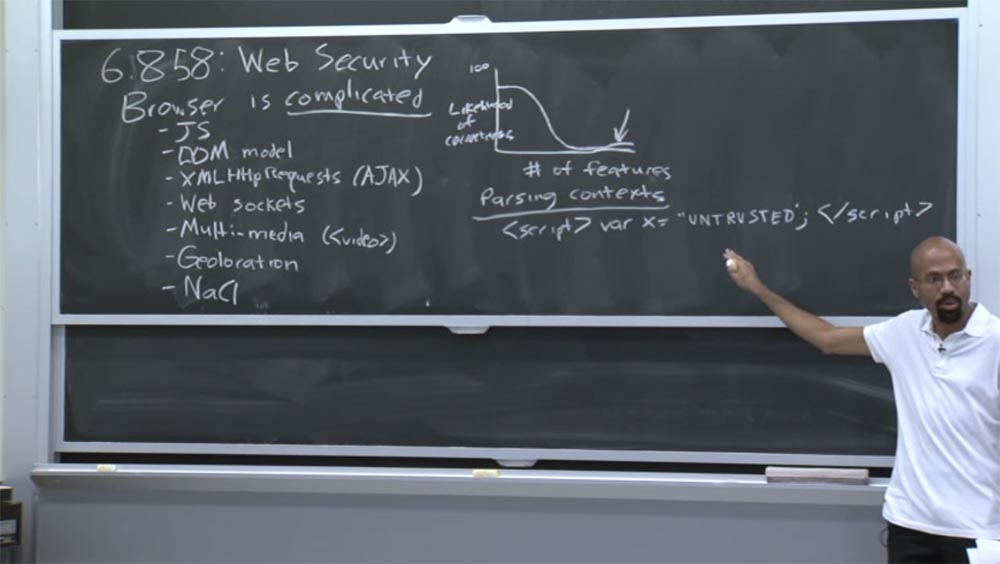

Вы объявляете тег сценария, внутри него имеется переменная, которая получает значение от ненадёжной стороны — пользователя или другой машины. Затем мы закрываем тег сценария, и этой части можно доверять. То есть мы имеем строку, по краям которой расположены вещи, которым можно доверять, а в середине – недоверенный untrusted код. Почему же у нас могут возникнуть проблемы, если мы расположили посередине сценария вещь, полученную от непроверенной стороны?

**Аудитория:** у вас может быть неправильная заключительная кавычка где-то внутри этого кода, которая разобьёт строку сценария.

**Профессор:** совершенно верно! Проблема состоит в различном контексте, который может разбить этот ненадёжный код на части. Например, если закрывающая кавычка будет расположена посередине недоверенного кода, тем самым мы закроем определение этой строки JavaScript.

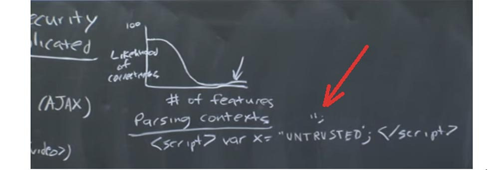

Итак, после того, как мы добавили контекст строки JavaScript, мы инициируем выполнение этого контекста. При этом злоумышленник может просто поместить сюда закрывающий тег скрипта , выйти из контекста JavaScript и войти в контекст HTML, например, чтобы найти новые узлы HTML или что-то в этом роде.

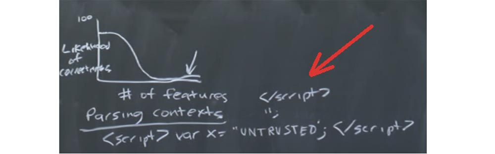

Поэтому вы должны рассматривать такие проблемы композиции повсюду в интернете, так как здесь используется множество различных языков: HTML, CSS, JavaScript, возможно MySQL на стороне сервера, и так далее и так далее. Таким образом, я привёл классический пример, почему вы должны сделать то, что называется «стандартизация контента». Всякий раз, когда вы получаете от кого-то ненадежные входные данные, вам нужно очень тщательно проанализировать их, чтобы убедиться, что их нельзя использовать в качестве вектора атаки.

Еще одна причина сложности обеспечения интернет-безопасности состоит в том, что веб-спецификации невероятно длинные, утомительные, скучные и часто непоследовательны. Когда я имею в виду веб-спецификации, я подразумеваю такие вещи, как определение JPEG, определение CSS, определение HTML. Эти документы имеют такой же размер, как размер Конституции ЕС и настолько же трудны для понимания. В конечном итоге, когда компании-продавцы браузеров видят все эти спецификации, они вынуждены просто сказать разработчикам: «ладно, и за это спасибо», а потом читают их и смеются над всем этим со своими друзьями.

Так что эти спецификации довольно расплывчаты и не всегда точно отражают то, что делают реальные браузеры. Если вы хотите разобраться в этом ужасе, то можете посетить сайт [https://www.quirksmode.org/](https://www.quirksmode.org/), но если хотите быть счастливыми, лучше туда не заходите. Там фактически задокументированы все эти ужасные несоответствия, которые вытворяют браузеры, когда пользователь нажимает клавишу. На этом сайте можно проверить, что при этом происходит.

В любом случае, в этой лекции мы сосредоточимся на клиентской стороне веб-приложения. В частности, мы рассмотрим, как можно изолировать контент, поступающий от различных веб-провайдеров, который должен как-то сосуществовать на одной машине и в одном браузере. Существует фундаментальное различие между тем, что вы обычно думаете о приложении на рабочем столе и тем, что думаете о веб-приложении.

Абстрактно говоря, большинство десктопных приложений, которые вы используете, могут восприниматься как продукт одного разработчика, к примеру, Microsoft. Или, возможно, вы используете программное обеспечение TurboTax от мистера и миссис TurboTax, и так далее и тому подобное. Но когда вы смотрите на веб-приложения, то, что визуально выглядят для вас одним целым, на самом деле состоит из кучи приложений разного содержания от кучи разных разработчиков.

Например, вы заходите на страницу CNN, вам кажется, что всё здесь расположено на одной вкладке. Но каждая из тех визуальных вещей, которые вы видите, на самом деле может исходить от кого-то другого. Давайте рассмотрим очень простой пример.

Допустим, мы зашли в интернет по адресу [http://foo.com/index.html](http://foo.com/index.html). Из чего же состоит рассматриваемая нами страница?

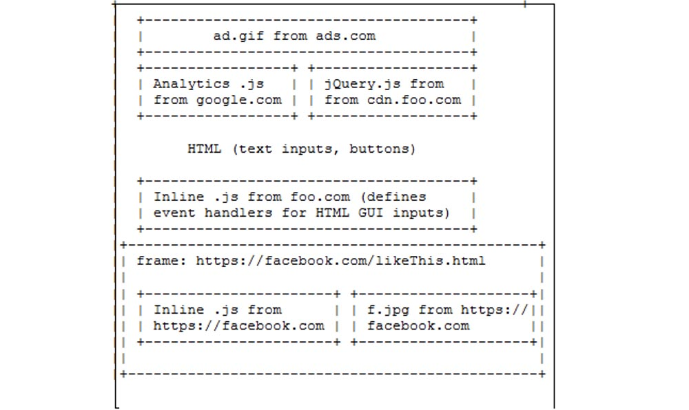

Вверху может располагаться реклама, которая, возможно, была загружена с ads.com. Слева может быть расположен блок аналитики, например, от google.com. Эти библиотеки очень популярны для отслеживания количества людей, которые загрузили эту страницу, для наблюдения за тем, на какие ссылки люди кликают, с какими частями страницы им интереснее взаимодействовать, и так далее.

Справа у вас может располагаться другая библиотека JavaScript, скажем, jQuery, которая поступает от cdn.foo.com. Это некий контент, предоставленный для работы foo.com.

jQuery – это очень популярная библиотека для манипуляций с GUI, поэтому jQuery имеется на множестве сайтов, хотя они получают его из разных мест. Далее на этой странице вы можете увидеть некоторые текстовые данные HTML, кнопки для пользователя, поля для ввода текста, и так далее, и так далее. Так что это просто обычный HTML-код на странице.

Затем вы можете увидеть то, что они называют встроенным кодом JavaScript от foo.com. Например, сверху у нас открывающий тег , а посередине между ними встроен непосредственно код JavaScript. В нашем случае имеется то, что называется встроенным JavaScript – это верхняя часть рисунка.

Внизу в строке я нарисую то, что мы называем сценарием JavaScript, потому что там содержимое равно чему-то, что пребывает на удалённом сервере. Это то, что называется внешним определением содержимого JavaScript. Сценарий и встроенный код отличаются друг от друга, и на нашей странице имеется именно встроенный JavaScript от foo.com.

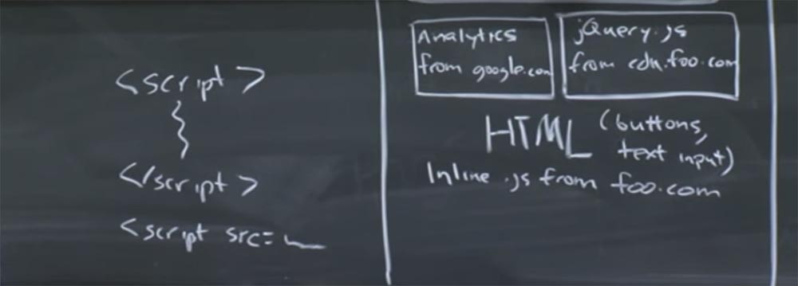

И еще одна вещь, которая может быть здесь — это фрейм. Фрейм можно представить как отдельную вселенную JavaScript. Это немного эквивалентно процессу в UNIX. Может быть, этот фрейм исходит от [facebook.com/likethis.html](https://facebook.com/likethis.html) и внутри него у нас имеется встроенный JavaScript из Facebook.

Далее у нас могут быть некоторые изображения f.jpeg, которые также поступают с [facebook.com](https://facebook.com/). Итак, всё это выглядит одной единой вкладкой, хотя состоит из различного контента, который потенциально может базироваться на совершенно разных принципах. Поэтому можно задать целую кучу интересных вопросов по поводу приложения, которое выглядит таким образом.

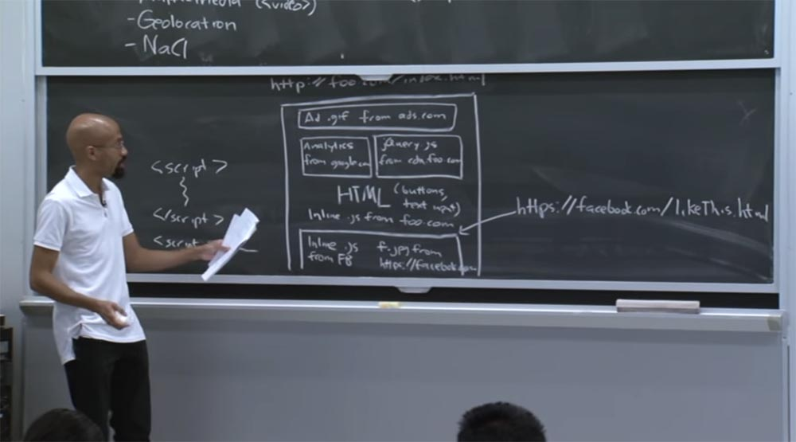

Например, может ли этот аналитический код google.com иметь доступ к содержимому JavaScript, которое находится в коде jQuery. В первом приближении, возможно, это кажется плохой идеей, потому что эти две части кода пришли из разных мест. Но опять же, может быть, что на самом деле это хорошо, потому что, по-видимому, foo.com поместил здесь обе эти библиотеки, чтобы они могли работать друг с другом. Так что кто знает?

Другой вопрос, который может у вас возникнуть — может ли код аналитики фактически взаимодействовать с текстом, помещенным в нижнем блоке HTML. Например, может ли код аналитики влиять на обработчиков события?

JavaScript является управляемой однопоточной моделью, таким образом, в каждом фрейме имеется цикл событий, который постоянно обрабатывается – здесь происходят ключевые процессы, работают таймеры сетевых событий и тому подобное. И если этот код JavaScript заметит, что есть ещё какие-то обработчики, которые пытаются управлять этими же событиями, то он от них избавится.

Так кто же должен уметь определять обработчиков события для этого HTML? Во-первых, google.com должен быть в состоянии сделать это. Это может также быть foo.com, а может и нет.  
Другой вопрос, что связывает этот фрейм Facebook с общим, большим фреймом foo.com? Фрейм Facebook является HTTPS, то есть безопасным, foo.com это HTTP, то есть небезопасное соединение. Так как же эти две вещи могут взаимодействовать?

Чтобы ответить на эти вопросы, браузеры используют модель безопасности под названием same-origin policy, или политику одинакового происхождения. Это своего рода неопределенная цель, потому что много вещей, которые относятся к веб-безопасности, довольно расплывчаты, из-за того, что никто не знает, что именно они делают. Но основная идея состоит в том, что два веб-сайта не должны иметь возможности вмешиваться в работу друг друга, если они этого не хотят. Таким образом, определить, что означает такое вмешательство, было проще, когда сам интернет был проще. Но так как мы продолжаем добавлять новые API, нам все труднее и труднее понять, что означает цель политики невмешательства. Например, очевидно, плохо, если два веб-сайта, которые не доверяют друг другу, смогут отображать свои данные на общем дисплее. Это кажется явно плохой вещью, и очевидно хорошей вещью является то, когда два веб-сайта, желающие сотрудничать, в состоянии обмениваться данными каким-то безопасным способом.

Вы могли слышать о смешанных сайтах, это именно то, о чём я сказал. Поэтому в интернете вы будете встречаться с подобными вещами, когда кто-то берет данные с карты Google и размещает на них местоположение грузовиков с продуктами. Таким образом, у вас есть это удивительное «пюре», которое позволяет вам дешево поесть и при этом избежать сальмонеллёза. Но как именно создаются композиции такого типа?

Есть и другие сложные вещи. Например, если код JavaScript поступает от origin X внутрь страницы origin Y, то что должно представлять собой содержимое этого кода? Таким образом, стратегия, которую использует политика одинакового происхождения, приблизительно может быть описана следующим образом.

Каждому ресурсу назначается свой источник происхождения, и код JavaScript может получать доступ только к ресурсам, имеющим такой источник. Это стратегия высшего уровня, которую используют политики одинакового происхождения.

Но дьявол кроется в деталях, поэтому существует куча исключений, которые мы рассмотрим через секунду. Но прежде чем мы продолжим, давайте определим, что такое происхождение.  
В принципе, происхождение – это схема сетевого протокола плюс имя хоста плюс порт. Например, у нас может быть что-то вроде http:// foo.com/index.html.

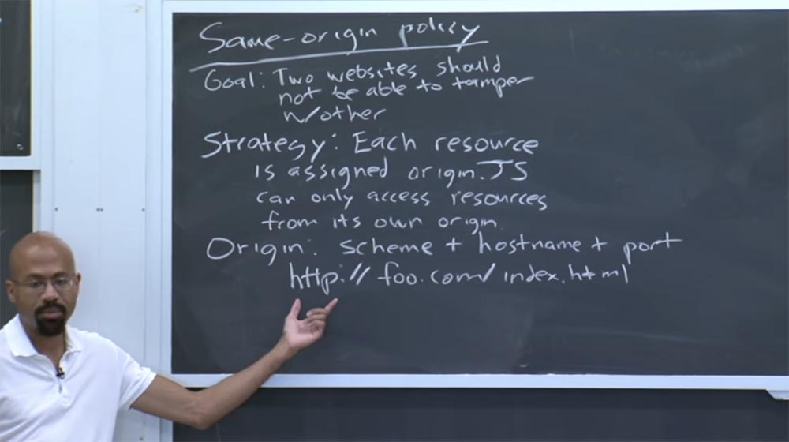

Итак, схема нашего сетевого протокола – HTTP, имя хоста foo.com, а порт 80. В данном случае порт является неявным. Порт — это порт на стороне сервера, который пользователь использует для соединения с сервером. Так что если вы видите URL со схемой HTTP, где нет явно указанного порта, то здесь используется порт 80.

Если рассмотреть что-то вроде https:// foo.com/index.html, то эти два адреса имеют одинаковое имя узла, но на самом деле у них разные схемы – протокол https против http. Кроме того, здесь неявно присутствует порт 443, который является портом по умолчанию для безопасного протокола HTTPS. Итак, эти два URL имеют разное происхождение.

В качестве последнего примера рассмотрим сайт http:// bar.com:8181/…

Многоточие после слеша указывает то, что эти вещи не имеют значения по отношению к политике одинаково происхождения, по крайней мере, в отношении этого очень простого примера.  
Мы видим, что у нас есть схема HTTP, имя хоста bar.com, и здесь мы имеем явно указанный порт. В данном случае это нестандартный порт 8181. По сути, это и есть источник происхождения. Грубо говоря, можно думать о происхождении как об идентификаторе UID в Unix, где фрейм рассматривается как процесс.

Таким образом, есть четыре основные идеи, лежащие в основе реализации политики одинакового происхождения для браузера.

Первая идея: каждый источник происхождения имеет клиентскую часть ресурса. Эта клиентская часть – кукиз. Файлы cookie можно рассматривать как очень простой способ реализации состояния в таком не сохраняющемся протоколе, как HTTP.

В принципе, cookie — это крошечный файл, который ассоциируется с каждым оригинальным источником. Позже мы немного поговорим об этой специфике.

Но основная идея заключается в том, что когда браузер отправляет запрос на определенный сайт, он включает в него любые cookie, которые клиент имеет для этого сайта. И эти кукиз можно использовать для таких вещей, как запоминание пароля.

Например, если вы собираетесь на сайт электронной коммерции, в этих кукиз может содержаться упоминание о товарах в корзине пользователя и так далее.

Таким образом, файлы cookie — это одна вещь, с которой может быть ассоциирован каждый источник происхождения origin. Кроме того, вы воспринимать хранилище объектных моделей документов DOM как ещё один источник этих ресурсов. Это довольно новый интерфейс, но он уже имеет ключевое значение как интерфейс структурирования HTML и XML-документов.

Таким образом, хранилище DOM позволяет сказать источнику: «позволь мне связать данный ключ, который является строкой, с этим заданным значением, которое также является строкой».

Другой вещью, связанной с origin, является пространство имен JavaScript. Это пространство имен определяет, какие функции и интерфейсы доступны для источника происхождения.

В некоторые из этих интерфейсов встроены, например, прототипы строк и тому подобное. Затем приложение может фактически заполнить пространство имен JavaScript другим содержимым.  
Еще есть такая штука, как дерево DOM. Как известно, DOM означает «Объектная Модель Документа». А дерево Dom — это, по сути, отражение HTML на странице при помощи JavaScript.

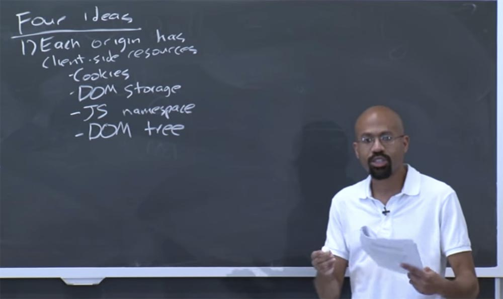

Таким образом, вы можете себе представить, что вверху дерево DOM имеет узел HTML, ниже расположен узел для тега заголовка сообщения head и узел для тега тела сообщения body и так далее.

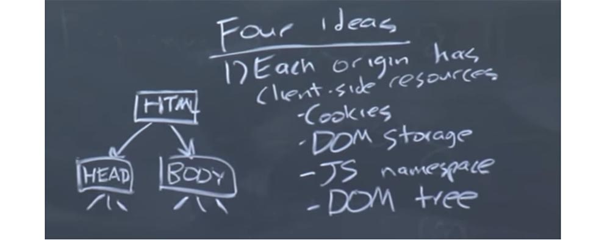

Так что многие динамические веб-страницы изменяются благодаря коду JavaScript, который может получить доступ к данным этой структуры в JavaScript, отражающей содержимое HTML.  
Таким образом, вы можете себе представить, что анимация на странице браузера происходит благодаря изменению некоторые узлов дерева для того, чтобы реализовать различные организации различных вкладок. Вот что такое дерево DOM. Там же находится область визуального отображения, которая, как мы позже увидим, очень странно взаимодействует с той же политикой источника происхождения, и так далее и тому подобное.

Таким образом, на высоком уровне, каждый источник имеет доступ к некоторому набору клиентских ресурсов перечисленных нами типов.

Вторая идея заключается в том, что каждый фрейм получает источник происхождения своего URL-адреса. Как я уже упоминал ранее, фрейм примерно аналогичен процессу в Unix. Это вроде пространства имен, которое объединяет кучу других различных ресурсов.

Третья идея заключается в том, что скрипты, или код JavaScript, выполняются с полномочиями, соответствующими полномочиям источника происхождения фрейма.

Это означает, что когда foo.com импортирует файл JavaScript из bar.com, то файл JavaScript будет в состоянии действовать с полномочиями foo.com. Грубо говоря, это похоже на то, что происходит в мире Unix, когда нужно запустить двоичный файл, принадлежащий чужому домашнему каталогу. Это что-то, что должно выполняться в соответствии с вашими привилегиями.

Четвёртая идея — это пассивный контент. Под пассивным контентом я подразумеваю изображения или CSS файлы, то есть вещи, которые не содержат в себе исполняемый код.

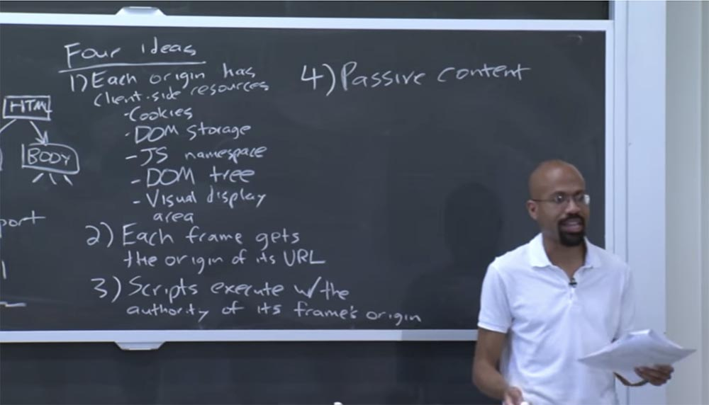

Таким образом, пассивный контент получает от браузера нулевые полномочия. Через секунду я объясню тонкости четвёртой идеи. Возвращаясь к нашему примеру, можно увидеть, что скрипт Google Analytics и скрипт jQuery могут получить доступ ко всем видам содержимого внутри foo.com. Например, они могут читать и записывать файлы cookie, могут прикрепить обработчик событий к кнопкам, и так далее.

Если мы посмотрим на фрейм Facebook и его отношение к большему фрейму foo.com, то мы увидим, что они из разных источников, потому что у них здесь разные схемы. У них разные имена хостов и различные порты. Это означает, что в первом приближении они изолированы друг от друга. Но они смогут взаимодействовать друг с другом, если будут использовать интерфейс под названием Post Message. Он позволяет двум различным фреймам обмениваться асинхронными неизменяемыми сообщениями друг с другом.

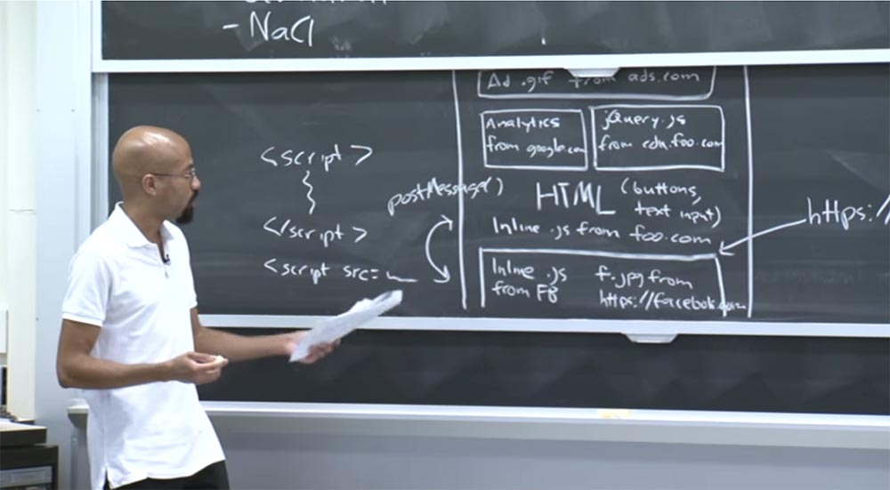

Так что подумайте об этом Post Message как о методе, который позволяет Facebook отправить строку, а не ссылку, вверх, во фрейм foo.com. Обратите внимание, что если foo.com не хочет получать эти сообщения, то Facebook не сможет ему ничего послать, так как для того, чтобы эта штука работала, нужно согласие обеих сторон.

Обратите внимание, что код JavaScript здесь, во фрейме Facebook, не может выдавать запрос XML HTTP серверу foo.com, потому что сетевые назначения также имеют эти источники происхождения, которые с ними связаны. Из-за того, что Facebook.com не имеет такого же origin, как foo.com, он не может асинхронно получить из него материал с помощью HTML-запроса.

Последнее, на что мы можем посмотреть, это изображение рекламы наверху, вот это ads.com. Это то, что подчиняется четвёртой идее, просто образ, который не имеет исполняемого кода. Так что ясно, что браузер не даст ему никаких полномочий.

Вам может показаться, что мы обсуждаем глупости – ну как это изображения могут иметь или не иметь полномочий, ведь они ничего не способны сделать!

Дело в том, что здесь действуют соображения безопасности. Это и есть та тонкость, которая скрывается в 4-й идее.

28:00 мин

Продолжение:

[Курс MIT «Безопасность компьютерных систем». Лекция 8: «Модель сетевой безопасности», часть 2](https://habr.com/company/ua-hosting/blog/423155/)

Полная версия курса доступна [здесь](https://ocw.mit.edu/courses/electrical-engineering-and-computer-science/6-858-computer-systems-security-fall-2014/).

Спасибо, что остаётесь с нами. Вам нравятся наши статьи? Хотите видеть больше интересных материалов? Поддержите нас оформив заказ или порекомендовав знакомым, **30% скидка для пользователей Хабра на уникальный аналог entry-level серверов, который был придуман нами для Вас:** [Вся правда о VPS (KVM) E5-2650 v4 (6 Cores) 10GB DDR4 240GB SSD 1Gbps от $20 или как правильно делить сервер?](https://habr.com/company/ua-hosting/blog/347386/) (доступны варианты с RAID1 и RAID10, до 24 ядер и до 40GB DDR4).

**VPS (KVM) E5-2650 v4 (6 Cores) 10GB DDR4 240GB SSD 1Gbps до декабря бесплатно** при оплате на срок от полугода, заказать можно [тут](https://ua-hosting.company/vpsnl).

**Dell R730xd в 2 раза дешевле?** Только у нас **[2 х Intel Dodeca-Core Xeon E5-2650v4 128GB DDR4 6x480GB SSD 1Gbps 100 ТВ от $249](https://ua-hosting.company/serversnl) в Нидерландах и США!** Читайте о том [Как построить инфраструктуру корп. класса c применением серверов Dell R730xd Е5-2650 v4 стоимостью 9000 евро за копейки?](https://habr.com/company/ua-hosting/blog/329618/)