Курс MIT «Безопасность компьютерных систем». Лекция 8: «Модель сетевой безопасности», часть 2 / Блог компании ua-hosting.company

### Массачусетский Технологический институт. Курс лекций #6.858. «Безопасность компьютерных систем». Николай Зельдович, Джеймс Микенс. 2014 год

Computer Systems Security — это курс о разработке и внедрении защищенных компьютерных систем. Лекции охватывают модели угроз, атаки, которые ставят под угрозу безопасность, и методы обеспечения безопасности на основе последних научных работ. Темы включают в себя безопасность операционной системы (ОС), возможности, управление потоками информации, языковую безопасность, сетевые протоколы, аппаратную защиту и безопасность в веб-приложениях.

Лекция 1: «Вступление: модели угроз» [Часть 1](https://habr.com/company/ua-hosting/blog/354874/) / [Часть 2](https://habr.com/company/ua-hosting/blog/354894/) / [Часть 3](https://habr.com/company/ua-hosting/blog/354896/)  
Лекция 2: «Контроль хакерских атак» [Часть 1](https://habr.com/company/ua-hosting/blog/414505/) / [Часть 2](https://habr.com/company/ua-hosting/blog/416047/) / [Часть 3](https://habr.com/company/ua-hosting/blog/416727/)  
Лекция 3: «Переполнение буфера: эксплойты и защита» [Часть 1](https://habr.com/company/ua-hosting/blog/416839/) / [Часть 2](https://habr.com/company/ua-hosting/blog/418093/) / [Часть 3](https://habr.com/company/ua-hosting/blog/418099/)  
Лекция 4: «Разделение привилегий» [Часть 1](https://habr.com/company/ua-hosting/blog/418195/) / [Часть 2](https://habr.com/company/ua-hosting/blog/418197/) / [Часть 3](https://habr.com/company/ua-hosting/blog/418211/)  
Лекция 5: «Откуда берутся ошибки систем безопасности» [Часть 1](https://habr.com/company/ua-hosting/blog/418213/) / [Часть 2](https://habr.com/company/ua-hosting/blog/418215/)  
Лекция 6: «Возможности» [Часть 1](https://habr.com/company/ua-hosting/blog/418217/) / [Часть 2](https://habr.com/company/ua-hosting/blog/418219/) / [Часть 3](https://habr.com/company/ua-hosting/blog/418221/)  
Лекция 7: «Песочница Native Client» [Часть 1](https://habr.com/company/ua-hosting/blog/418223/) / [Часть 2](https://habr.com/company/ua-hosting/blog/418225/) / [Часть 3](https://habr.com/company/ua-hosting/blog/418227/)  
Лекция 8: «Модель сетевой безопасности» [Часть 1](https://habr.com/company/ua-hosting/blog/418229/) / [Часть 2](https://habr.com/company/ua-hosting/blog/423155/) / [Часть 3](https://habr.com/company/ua-hosting/blog/423423/)

Так что же происходит, если браузер неправильно обрабатывает объект и не может идентифицировать его тип? В этом случае у вас могут возникнуть проблемы безопасности. Одна из них носит название атаки MIME.

Вы наверняка знакомы с MIME – это тип незашифрованных заголовков вроде text/html, image.jpeg и так далее. Так, старые версии браузера IE использовали это, потому что считали, что такой вид поможет пользователю. Но иногда происходит так, что веб-серверы присваивают неправильное расширение файлу объекта.

Неправильно настроенный веб-сервер может прикрепить суффикс .html к тому, что в действительности имеет расширение .jpeg, или наоборот, например, создать foo.jpg вместо foo.html.

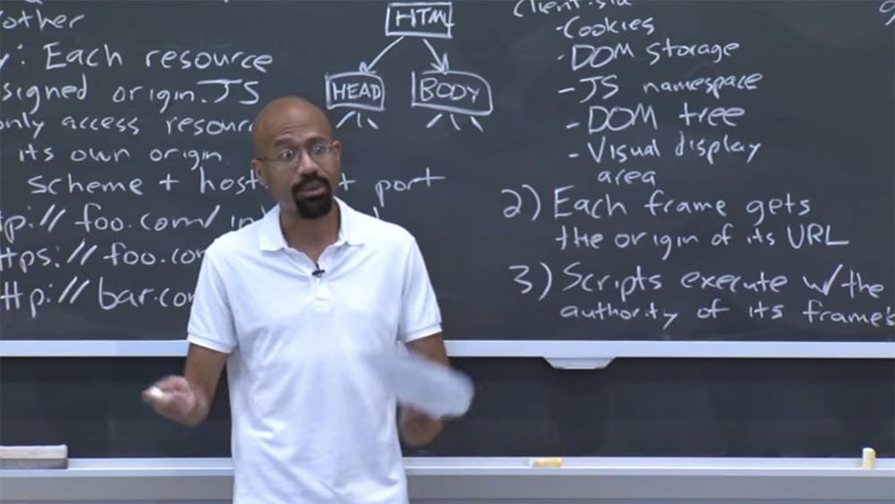

Итак, в старые времена IE пытался вам помочь. То есть он отправлялся, чтобы взять какой-то ресурс, при этом думая: «ОК, этот ресурс утверждает, что он такого-то типа, в соответствии с его расширением имени файла». Но тогда он будет смотреть только на первые 256 байт, имеющиеся в данном объекте. И если бы он нашел там определенные магические значения, которые указывали, что существует другой тип расширения для этого объекта, он бы просто сказал: «эй, я нашел здесь что-то крутое! Я думаю, что веб-сервер ошибочно определил этот объект, так что позволь мне просто рассматривать этот объект как тот тип, который я нашел в этих первых 256 байтах».  
И тогда все становятся победителями, потому что браузер типа помог разработчику веб-сервера, так как теперь их сайт будет отображаться должным образом. И пользователю это понравится, потому что они получат возможность разблокировать этот контент, который раньше был бы просто мусором.

Но это явная уязвимость! Предположим, что страница содержит некоторое пассивное содержимое, например, изображение из домена, контролируемого злоумышленником. Однако страница жертвы думает: «даже если это содержимое зловредного хакерского сайта, это всего лишь пассивный контент. Он ничего не сможет мне сделать!» В крайнем случае, отобразится неудачный образ, но он не сможет открыть какой-либо код, потому что пассивное содержимое имеет нулевые полномочия.

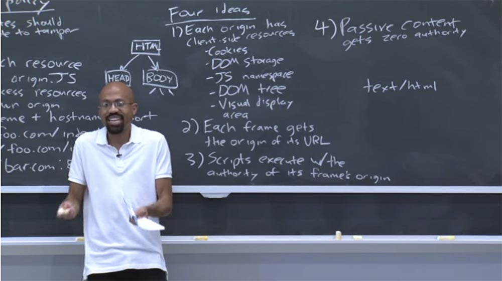

Но дело в том, что IE может сначала «обнюхать» этот образ, его первые 256 байт. И атакующий может намеренно поместить туда код HTML и JavaScript. Тогда получится, что сайт жертвы принесёт то, что считает изображением, а IE выполнит вредоносный код в контексте вложенной страницы.

Это своего рода пример того, как сложны браузеры и как добавление даже очень хорошего намерения может вызвать очень тонкие ошибки безопасности. Так что давайте внимательно рассмотрим, как браузер защищает различные ресурсы.

Посмотрим на фреймы и объекты window (объекты, представляющие собой окно, содержащее DOM документ). Фреймы представляют эти независимые вселенные JavaScript, о которых мы здесь говорили. Я имею в виду, что JavaScript является экземпляром узла DOM, как показано на картинке дерева DOM.

Таким образом, фрейм будет существовать как объект узла DOM где-то в этой иерархии, которая является видимой для JavaScript.

В JavaScript объект window фактически является псевдонимом для глобального пространства имен. Это звучит как дурацкая идея. То есть, если вы должны были бы найти имя глобальной переменной х, вы бы также смогли получить к нему доступ через имя window.x.

Таким образом, фреймы и объекты window являются очень мощными ссылками на то, чтобы создать вам возможность доступа. И они содержат указатели друг на друга. Фрейм может содержать указатель на связанный объект window и наоборот. По сути эти две вещи равносильны.  
И фреймы, и объекты window получают источник происхождения origin от URL-фрейма, или, потому что они всегда пребывают в безопасной части сети, они могут получить суффикс исходного доменного имени, то есть его оригинальное происхождение.

Например, фрейм может начинаться так: .x.y.z.com, здесь на секунду можно проигнорировать схему и протокол.

В этом случае можно считать, что источником происхождения для (document.domain) является суффикс y.z.com. Точно также источником происхождения для этого документа будет выражение z.com. Это возможно, потому что z.com является суффиксом y.z.com.

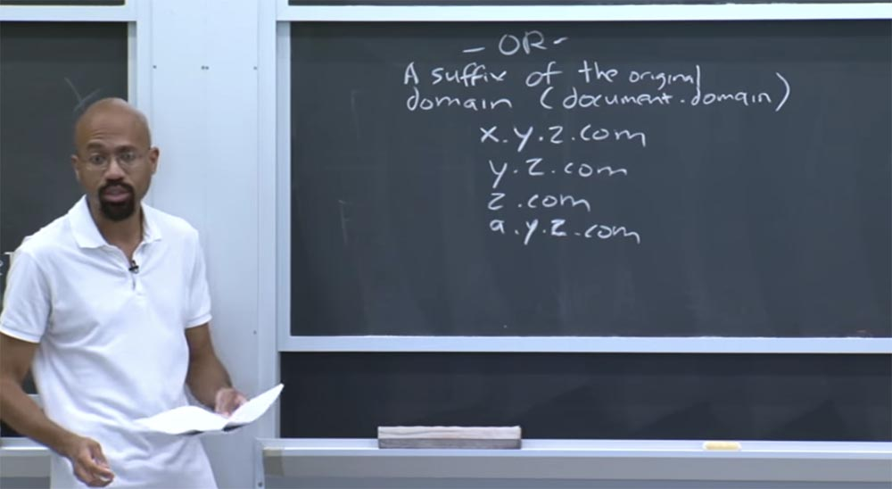

Единственное, что не может служить таким источником – это выражение .a.y.z.com, потому что это неправильный суффикс источника происхождения origin. Также правильным суффиксом источника происхождения нельзя считать просто .com, потому что в таком случае сайт сможет каким-то образом повлиять на кукиз или что-то подобное на любом сайте типа .com, что может иметь довольно разрушительные последствия.

Мотивация того, почему эти типы вещей допустимы, заключается в том, что это связано с каким-то типом существующих доверительных отношений. Так что, похоже, с тремя верхними параметрами все в порядке, а непорядок имеется только в .com.

**Аудитория:** получается, что можно сделать подобные сплиты на любой точке или в конечной точке? Например, ваш x.y.z.com можно изменить на свой z.com?

**Профессор:** нет, это действует только для каждой точки.

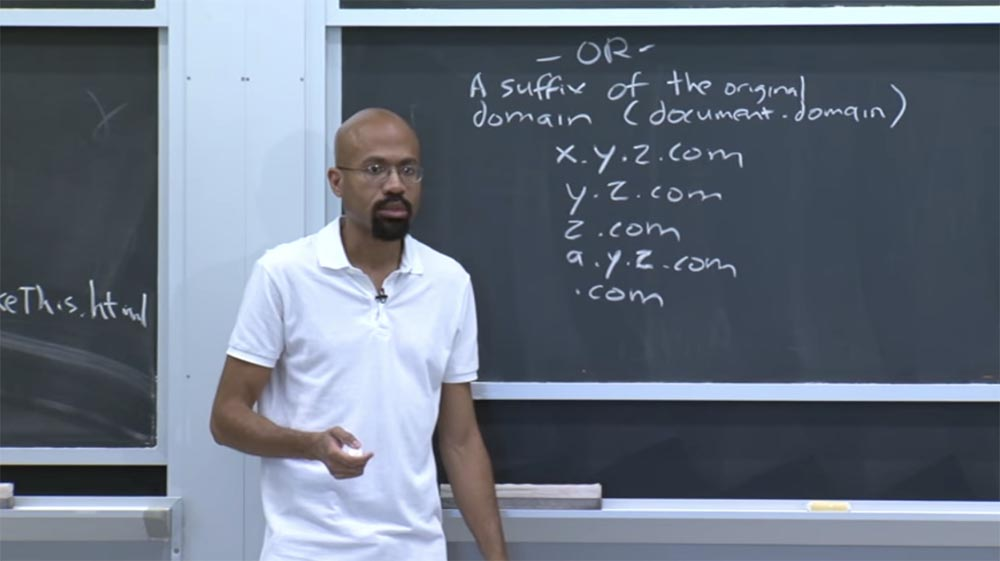

**Аудитория:** есть ли причина, по которой не было сделано так, что вы могли бы указать супер — или поддомен, но при этом они каким-то образом должны были бы договориться о том, откуда будет поступать информация? Скажем, что я хочу принимать только то, что имеет такой же origin, как и у меня, так что любой из этих ресурсов смог бы меня атаковать. Причём мы сделали бы это взаимодействие симметричным, чтоб я тоже мог бы на него воздействовать. Ведь суффикс источника происхождения .com означает, что всё, что имеет такой же суффикс .com, может на меня повлиять.

**Профессор:** да, это сложно, поэтому существует несколько ответов на этот вопрос. Во-первых, люди очень переживали по поводу возможности нападения с помощью .com. Поэтому они хотели сделать язык манипуляции доменом легким для понимания. Таким образом, они не позволяли испортить настройки.

Через секунду я расскажу про одну вещь, которая позволяет сделать то, о чем вы говорите, но только относительно суффиксов домена. Пока что я хочу заметить, что интерфейс Post Message позволяет доменам общаться друг с другом, если они согласны на это. Так что на практике люди используют Post Message для осуществления кросс-доменной коммуникации, если они не могут установить одинаковый источник происхождения с помощью описанных выше трюков. Таким образом, браузеры могут ограничивать домены в соответствии с этими суффиксами исходного домена. И здесь также есть маленький интересный нюанс — браузеры понимают, когда (document.domain) может быть написан, а когда не может.

Для этого есть причина, которую мы рассмотрим через секунду. Таким образом, два фрейма могут получить доступ друг к другу, если справедливо хотя бы одно из двух положений:

*   оба набора фреймов задают (document.domain) одно и то же значение;
*   ни один из этих фреймов не может изменить (document.domain), при том, что значение этого документа в обоих фреймах совпадает.

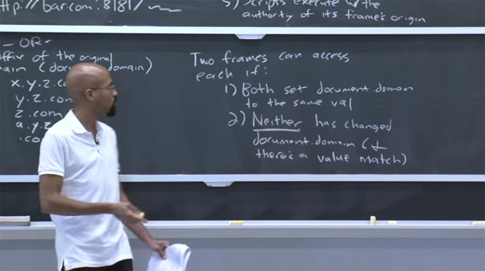

Основная идея этих правил заключается в том, что они защищают домен от нападения, вызванного собственными ошибками или вредоносностью одного из поддоменов.

Представьте, что у вас есть домен x.y.z.com, который пытается атаковать домен y.z.com, потому что первый домен содержит ошибку или является вредоносным. Он попытается сократить домен y.z.com до вида .com, чтобы затем начать «химичить» с состоянием JavaScript, или кукиз, или прочими вещами.

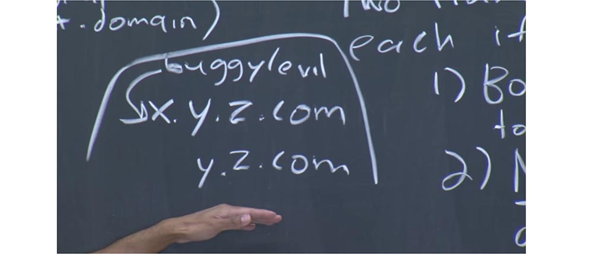

Так вот, эти два правила означают, что если y.z.com не хочет никому позволять с ним взаимодействовать, то он никогда не изменит значение (document.domain). Так что когда фрейм x.y.z.com захочет его сократить, браузер скажет: «ага, ты хочешь его сократить, но не имеешь право этого делать!». Здесь имеет место совпадение значений, однако домен y.z.com не указал, что хочет в этом участвовать. Это понятно? В данном случае видно, что в основном фреймы работают с одной и той же политикой origin.

А сейчас мы можем посмотреть, как обрабатывается наш узел DOM. Это довольно просто. Обычно узлы DOM получают origin от окружающего их фрейма. В случае с кукиз это несколько сложнее. Файлы cookie имеют домен и у них есть свой путь. Например, можно представить, что файл cookie может быть связан со следующей информацией, например *.mit.edu/6.858. В этом случае кукиз имеет домен *.mit.edu/ и путь 6.858.

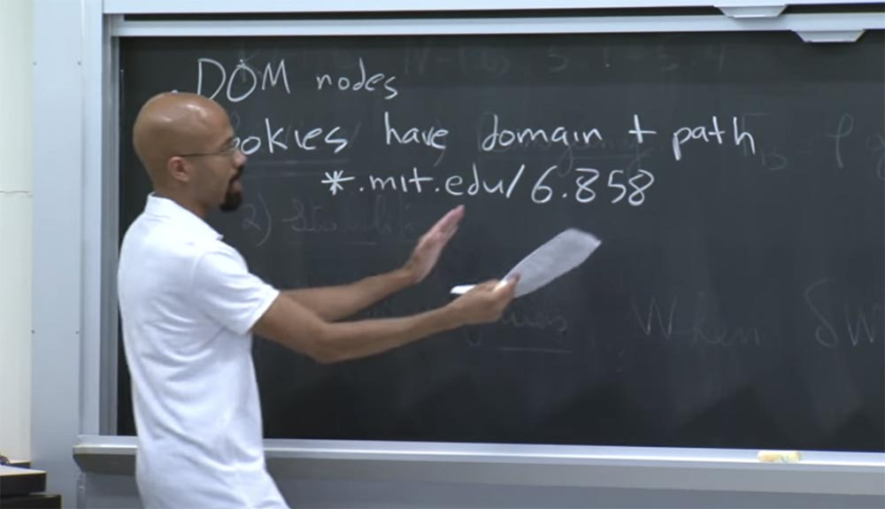

Обратите внимание, что этот домен может быть, возможно, полным суффиксом страниц текущего домена. Так что вы можете совершать с ним такие же трюки, как те, о которых мы говорили ранее. Заметьте, что этот путь 6.858 может быть представлен и в виде слеша, за которым ничего нет, что показывает, что все пути домена должны иметь доступ к расположенному здесь cookie.

Но в данном случае у нас есть конкретный адрес пути. Итак, кто бы ни установил эти кукиз, он получает шанс увидеть, как выглядит домен и путь. И эти значения могут быть установлены как на стороне сервера, так и на клиентской стороне. На стороне клиента у вас будет иметься объект JavaScript под названием document.cookie. Это формат, который используется для того, чтобы указать все пути на подобные объекты.

Существует флаг безопасности Secure flag, который вы можете установить на cookie, чтобы указать, что это файл HTTPS. В таком случае HTTP контент не должен иметь доступа к этому файлу cookie. Вот в чём заключается основная идея кукиз.

Обратите внимание, что всякий раз, когда браузер генерирует запрос к определенному веб-серверу, он собирается включить в этот запрос все соответствующие файлы cookie. Существую своего рода строки соответствия и алгоритмы, которые позволяют выяснить, что это именно те правильные кукиз, которые должны отправляться в ответе на запрос, потому что здесь могут иметь странные вещи с суффиксами домена, и так далее.

**Аудитория:** так могут ли фреймы получить доступ к кукиз друг друга, если они соответствуют этим правилам?

**Профессор:** да, фреймы могут это сделать. Но это зависит от того, как установлен document.domain, домен кукиз и путь. Итак, фреймы могут получить доступ к кукиз друг друга, отсюда возникает вопрос: может ли возникнуть проблема, если позволить произвольному фрейму записывать людям произвольные кукиз? Достаточно сказать, что это будет плохо. Причина, почему это плохо, состоит в том, что эти файлы cookie позволяют клиентской стороне приложения хранить данные пользователя.

Так что можете себе представить — если злоумышленник сможет контролировать или переопределять пользовательские файлы cookie, то он сможет, например, изменить файл cookie для Gmail, чтобы пользователь вошел в систему через аккаунт Gmail, принадлежащий этому злоумышленнику. При этом любое письмо пользователя могло бы быть прочитано злоумышленником. Можете себе представить, что кто-то будет способен завладеть кукиз с сайта Amazon.com, чтобы поместить в вашу корзину всякие нелепые покупки и тому подобное.

Таким образом, файлы cookie являются очень важным ресурсом для защиты. И множество атак сетевой безопасности направлены на то, чтобы их выкрасть и использовать для нанесения вреда.  
Есть ещё один интересный вопрос, связанный с кукиз. Предположим, что у вас есть сайт foo.co.uk. Что, если сайт этим именем хоста будет способен установить кукиз для сайта co.uk?

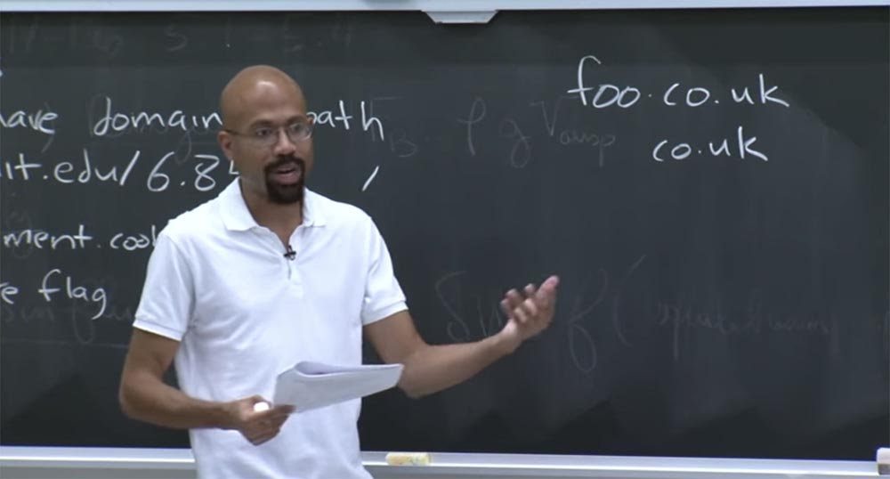

Здесь имеется тонкость, связанная с правилами, которые мы обсудили раньше, потому что первый сайт должен иметь возможность сократить свой домен и установить кукиз для второго, здесь всё кажется законным. Но с человеческой точки зрения мы смотрим на это с подозрением, потому что понимаем, что co.uk представляет собой единый атомарный домен. Однако это эквивалентно .com. Можно сказать, что англичане облажались, что у них должна быть здесь точка. Но это не их вина. С моральной точки зрения, это единый одиночный домен, который нельзя разбивать. Таким образом, мы должны иметь некоторую специальную инфраструктуру, чтобы настроить cookie для правильной работы.

У Mozilla есть сайт под названием publicsuffix.org, который содержит списки правил для того, как должны сокращаться cookie, origin и домены с учётом того, что в некоторых вещах могут быть точки, при том, что на самом деле их следует рассматривать как единое атомарное целое.

Так что когда ваш браузер выясняет, как он должен манипулировать с разными кукиз, то он должен будет сверяться с этой стороной вопроса. Или ещё каким-то образом убедиться в том, что foo.co.uk не может сократить домен до co.uk. Так что здесь имеет место очень щепетильный вопрос.

Есть ещё много интересных вопросов веб-безопасности, которые мы обнаруживаем в процессе работы, потому что много оригинальной инфраструктуры было разработано специально для английского языка. Например, текст ASCII или что-то вроде этого. Изначально он не был сконструирован для использования международным сообществом.

Но по мере того, как интернет становился более популярным, люди начали говорить: «эй, в начале мы создали довольно большой дизайн решений и теперь должны сделать его пригодным для людей, которые вынужденно используют наше узкое понимание того, что означает язык». Поэтому мы теперь сталкиваемся со всеми этими безумными проблемами.

Рассмотрим, как ответы XML HTTP обрабатываются одной и той же политикой источника происхождения. По умолчанию JavaScript может генерировать только один из них, если он собирается на своем origin сервере. Тем не менее, есть новый интерфейс под названием Сross Origin Request, или CORS.

Итак, это тот же origin, если только сервер не включил эту штуковину CORS. В основном добавляется новый заголовок ответа HTTP под названием Access- Control-Allow-Origin.

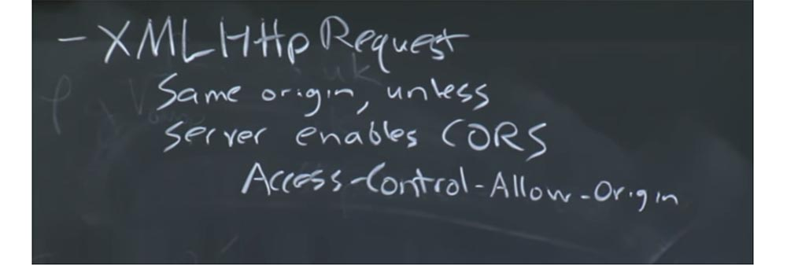

Cкажем, JavaScript от foo.com хочет сделать запрос XML HTTP к bar.com. Как описано в правилах, здесь имеет место cross-origin. И если сервер bar.com захочет это позволить, он возвратит свой HTTP-ответ с заголовком: «да, я позволяю, чтобы foo.com отправил мне эти cross-origin запросы XML HTTP».

Вообще-то сервер bar.com может ответить «нет», то есть он может отказать в просьбе. В этом случае браузер не сможет выполнить запрос XML HTTP. Так что это, своего рода новая вещь, которая появилась большей частью из-за смешанных приложений. Она нужна для приложений от разных разработчиков и различных доменов, чтобы они имели возможность обмениваться данными друг с другом.

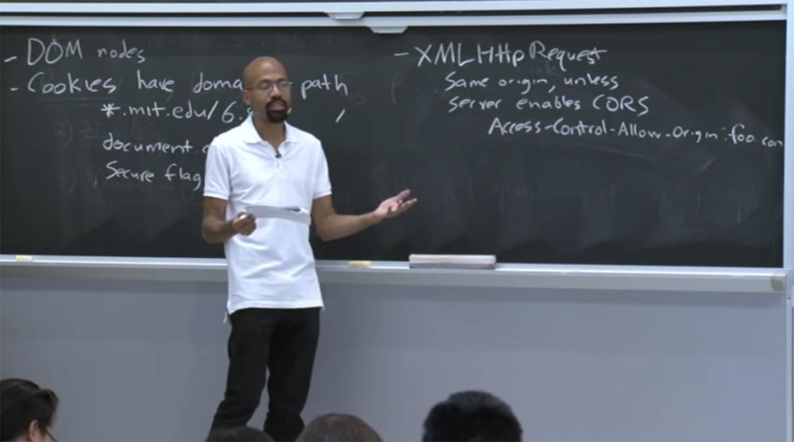

Так что вместо foo.com здесь могут быть звёздочки, если кто-то захочет получить данные перекрестного источника происхождения cross-origin, и так далее. Я думаю, что это довольно просто. Есть куча других ресурсов, которые мы могли бы посмотреть, например, изображения. Благодаря Access-Control-Allow-Origin фрейм может загружать изображения из любого источника, из какого захочет. Но он не может проверить биты этого изображения, потому что считается, что при разных политиках источников происхождения нехорошо проверять содержимое файлов друг друга.

Хотя фрейм не может проверить биты, он всё же может сделать вывод о размере изображений, потому что видит, каким образом они размещены на странице. Так что это еще один из этих странных случаев, когда одна и та же политика источника происхождения якобы пытается предотвратить все утечки информации. Но на самом деле, она не способна предотвратить все это, потому что встраивание наследования, по сути, показывает некоторые виды информации.

CSS аналогичны изображениям, поэтому фрейм может встраивать CSS из любого источника. Однако он не может непосредственно проверить текст внутри файла CSS, если он из другого источника. Но он может распознать, что делает этот CSS, потому что он просто создаёт кучу узлов и затем смотрит, как меняется их стиль. И это выглядит немного странно.

JavaScript — мой любимый пример того, как эта же политика origin пытается поддерживать любой тип интеллектуальной последовательности. Идея здесь заключается в том, что, если вы делаете перекрестную выборку JavaScript, то это разрешено. Можно разрешить выполнение внешнего JavaScript в контексте вашей собственной страницы, но при этом вы не можете посмотреть на исходный код.

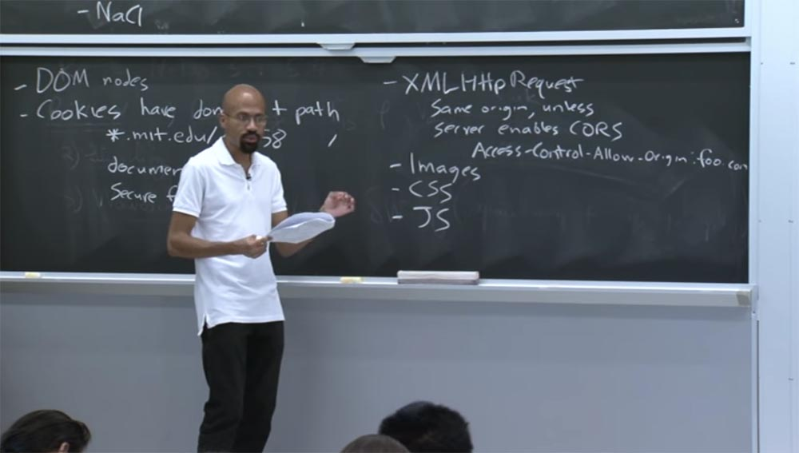

Поэтому, если у вас есть источник тега скрипта, равный чему-то вне вашего домена, то когда этот источник исполняется, вы можете инициировать в нём функции. Но при этом вы не сможете просмотреть в нём исходный код JavaScript.

Всё это выглядит очень хорошо, однако имеет кучу «дыр». Например, JavaScript — это динамический язык сценариев. А функции — это объекты первого класса. Таким образом, для любой функции f вы можете просто использовать функцию f.tostring(), и это даст вам исходный код для функции f. И люди делают такое постоянно, они делают динамическое переписывание и тому подобное.

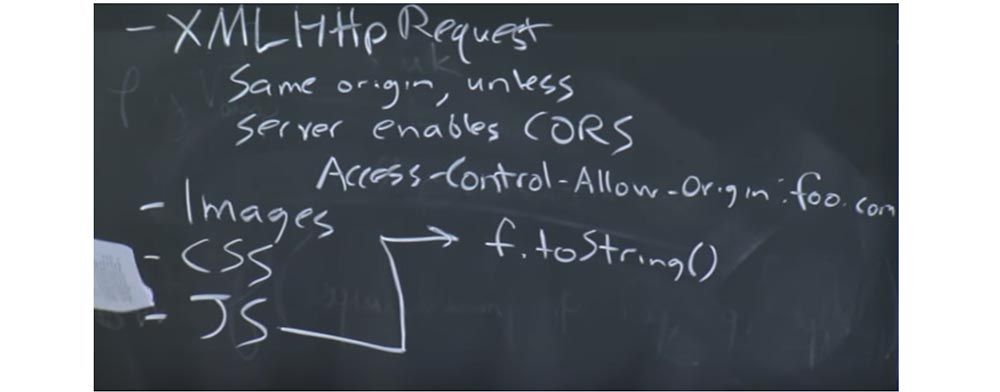

Таким образом, хотя политики origin не позволяют прямо просмотреть содержимое тега скрипта, можно просто проделать указанную операцию и получить исходный код.

Аналогично вы можете получить свой домашний сервер от своего домена, чтобы просто получить на нём исходный код и затем отправить его вам обратно. То есть, по сути, вы просто попросили свой домашний сервер запустить программу Wget, чтобы таким образом получить исходный код. Так что это тоже выглядит немного глупо, то есть политика origin здесь немного странная.

**Аудитория:** предположим, что причина, по которой они это делают, заключается в том, чтобы предотвратить получение пользователем JavaScript, потому что тогда кукиз тоже можно будет пересылать. То есть пользователь сможет приспособить полученный JavaScript под свои нужды.

**Профессор:** да, это так.

**Аудитория:** так что если вы получите свой сервер, чтобы проделать подобное, он не сможет предоставить вам пользовательские кукиз.

**Профессор:** это правда, хотя на практике «сырой» исходный код не предназначен для переделки пользователем. Но вы правы в том, что это предотвратит некоторые атаки.

Итак, в связи с тем, пользователь или приложение может легко получить исходный код JavaScript, во время развёртывания этот самый код маскируется и минимизируется. Поэтому, если вы когда-либо пытались посмотреть, как работает веб-страница, то есть пытались взглянуть на её механизм, то могли увидеть просто сплошное белое поле. Иногда люди также изменяют все имена переменных на очень короткие, которые будут выглядеть как символика из восклицательных знаков, похожая на то, как анимационные герои ругаются в мультфильмах. Так что это, своего рода, обманная форма управления цифровыми правами.

Но всё это в конечном счете несерьёзно, потому что вы можете выполнить этот код в своем браузере. Если люди используют своего рода запутывание веб-страницы или что-то подобное, они часто пытаются скрыть какие-то секреты в своих HTML или JavaScript. Может, они хотят скрыть протокол, если клиент использует его для связи с сервером. Часто минимизация имён переменных используется просто для уменьшения времени загрузки страницы.

Итак, мы рассмотрели вопрос с JavaScript, а теперь рассмотрим, что такое плагины. Они похожи на Java, поэтому фрейм может легко запустить плагин из любого источника.

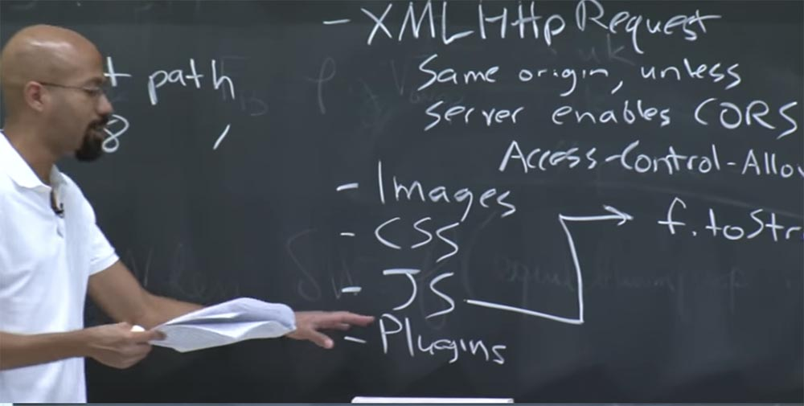

В наше время плагины похожи на динозавров, потому что в HTML5 существует множество встроенных новых функций, таких, как теги видео и тому подобное, которые могут делать то же, что и отдельные плагины Java. Так что не ясно, сколько времени плагины ещё смогут просуществовать.

Помните, что когда браузер генерирует запрос HTTP, он автоматически включает в него соответствующие файлы cookie. Так что же произойдет, если вредоносный сайт генерирует URL, который выглядит вот так?

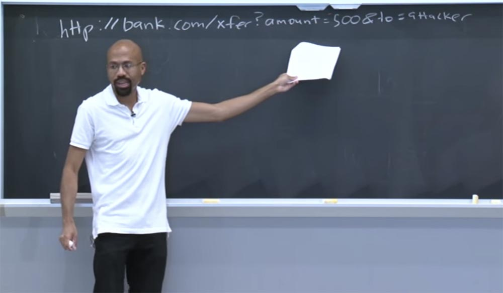

Например, он создает новый дочерний фрейм с URL-адресом bank.com. Затем он пытается имитировать то, что браузер будет делать для осуществления перевода денег пользователя кому-то ещё. Таким образом, в этом адресе URL, в этом фрейме, который пытается создать хакер, он хочет инициировать команду перевода $500 пользователя на свой банковский счёт. Теперь пользователь вынужден посетить страницу злоумышленника, потому что хакер его туда перенаправил.

Но что интересно — даже если страница злоумышленника не сможет увидеть содержимое этого дочернего фрейма, потому что он будет иметь другой origin, страница bank.com всё-равно будет делать то, что захочет хакер, потому что браузер отправляет все пользовательские cookie вместе с этим запросом. Он посмотрит на эту команду и скажет: «ага, пользователь, наверное, просит меня перевести $500 этому загадочному пользователю по имени attacker! Хорошо, я это сделаю».  
Так что здесь возникает проблема. Эта атака срабатывает потому, что, по сути, злоумышленник может определить опытным путём, как должна выглядеть эта команда. В этой команде нет случайности. По существу, злоумышленник может попробовать это на своем собственном банковском счете, выяснить, как выглядит этот протокол, а затем каким-то образом заставить браузер пользователя выполнить действие трансфера на имя злоумышленника. Это то, что называется подделкой межсайтового запроса, сокращённо CSRF.

Исключить возможность атаки такого рода можно, если включить некоторые случайности в генерируемый URL. Случайности такого типа, который злоумышленник не cможет угадать статически.

Представьте себе, что внутри веб-страницы банка имеется некая форма. Форма – это то, что на самом деле генерирует такой же запрос, как в нашем случае:

    <form action = “/transfer.cdi”…>

А внутри этой формы у нас будут распологаться входные данные input, которые обычно используется для ввода текста, нажатия клавиш, щелчков мыши и тому подобного. Фактически мы может сделать этот input скрытым, так, чтобы он не отображался на странице пользователя: input type=«hidden», придать ему атрибут name=«csrf» и случайное значение value=«a72f...». Эта форма будет генерироваться на сервере.

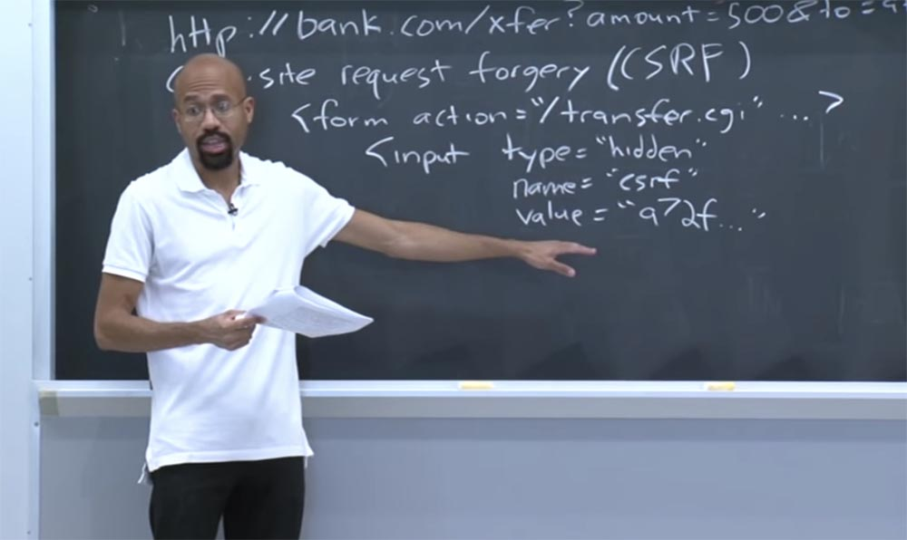

Таким образом, когда пользователь переходит на эту страницу, на стороне сервера, сервер генерирует эту случайность value=«a72f...» и встраивает её в HTML, который получает пользователь. Поэтому, когда пользователь заполняет эту форму, то этот URL вида:

[bank.com/xfer?amount=500&to=attacker](http://bank.com/xfer?amount=500&to=attacker)

Дополняется случайным токеном:

    http:

Это означает, что теперь атакующий должен быть в состоянии угадать определенный токен, который сервер генерирует для пользователя каждый раз, когда он переходит на страницу банка. Так что если у нас имеется достаточно случайная величина, то хакер ничего не сможет подделать, потому что если он укажет неверный токен, то правила сервера отклонят его запрос.

58:00 мин

Продолжение:

[Курс MIT «Безопасность компьютерных систем». Лекция 8: «Модель сетевой безопасности», часть 3](https://habr.com/company/ua-hosting/blog/423423/)

Полная версия курса доступна [здесь](https://ocw.mit.edu/courses/electrical-engineering-and-computer-science/6-858-computer-systems-security-fall-2014/).

Спасибо, что остаётесь с нами. Вам нравятся наши статьи? Хотите видеть больше интересных материалов? Поддержите нас оформив заказ или порекомендовав знакомым, **30% скидка для пользователей Хабра на уникальный аналог entry-level серверов, который был придуман нами для Вас:** [Вся правда о VPS (KVM) E5-2650 v4 (6 Cores) 10GB DDR4 240GB SSD 1Gbps от $20 или как правильно делить сервер?](https://habr.com/company/ua-hosting/blog/347386/) (доступны варианты с RAID1 и RAID10, до 24 ядер и до 40GB DDR4).

**VPS (KVM) E5-2650 v4 (6 Cores) 10GB DDR4 240GB SSD 1Gbps до декабря бесплатно** при оплате на срок от полугода, заказать можно [тут](https://ua-hosting.company/vpsnl).

**Dell R730xd в 2 раза дешевле?** Только у нас **[2 х Intel Dodeca-Core Xeon E5-2650v4 128GB DDR4 6x480GB SSD 1Gbps 100 ТВ от $249](https://ua-hosting.company/serversnl) в Нидерландах и США!** Читайте о том [Как построить инфраструктуру корп. класса c применением серверов Dell R730xd Е5-2650 v4 стоимостью 9000 евро за копейки?](https://habr.com/company/ua-hosting/blog/329618/)