Курс MIT «Безопасность компьютерных систем». Лекция 8: «Модель сетевой безопасности», часть 3 / Блог компании ua-hosting.company

### Массачусетский Технологический институт. Курс лекций #6.858. «Безопасность компьютерных систем». Николай Зельдович, Джеймс Микенс. 2014 год

Computer Systems Security — это курс о разработке и внедрении защищенных компьютерных систем. Лекции охватывают модели угроз, атаки, которые ставят под угрозу безопасность, и методы обеспечения безопасности на основе последних научных работ. Темы включают в себя безопасность операционной системы (ОС), возможности, управление потоками информации, языковую безопасность, сетевые протоколы, аппаратную защиту и безопасность в веб-приложениях.

Лекция 1: «Вступление: модели угроз» [Часть 1](https://habr.com/company/ua-hosting/blog/354874/) / [Часть 2](https://habr.com/company/ua-hosting/blog/354894/) / [Часть 3](https://habr.com/company/ua-hosting/blog/354896/)  
Лекция 2: «Контроль хакерских атак» [Часть 1](https://habr.com/company/ua-hosting/blog/414505/) / [Часть 2](https://habr.com/company/ua-hosting/blog/416047/) / [Часть 3](https://habr.com/company/ua-hosting/blog/416727/)  
Лекция 3: «Переполнение буфера: эксплойты и защита» [Часть 1](https://habr.com/company/ua-hosting/blog/416839/) / [Часть 2](https://habr.com/company/ua-hosting/blog/418093/) / [Часть 3](https://habr.com/company/ua-hosting/blog/418099/)  
Лекция 4: «Разделение привилегий» [Часть 1](https://habr.com/company/ua-hosting/blog/418195/) / [Часть 2](https://habr.com/company/ua-hosting/blog/418197/) / [Часть 3](https://habr.com/company/ua-hosting/blog/418211/)  
Лекция 5: «Откуда берутся ошибки систем безопасности» [Часть 1](https://habr.com/company/ua-hosting/blog/418213/) / [Часть 2](https://habr.com/company/ua-hosting/blog/418215/)  
Лекция 6: «Возможности» [Часть 1](https://habr.com/company/ua-hosting/blog/418217/) / [Часть 2](https://habr.com/company/ua-hosting/blog/418219/) / [Часть 3](https://habr.com/company/ua-hosting/blog/418221/)  
Лекция 7: «Песочница Native Client» [Часть 1](https://habr.com/company/ua-hosting/blog/418223/) / [Часть 2](https://habr.com/company/ua-hosting/blog/418225/) / [Часть 3](https://habr.com/company/ua-hosting/blog/418227/)  
Лекция 8: «Модель сетевой безопасности» [Часть 1](https://habr.com/company/ua-hosting/blog/418229/) / [Часть 2](https://habr.com/company/ua-hosting/blog/423155/) / [Часть 3](https://habr.com/company/ua-hosting/blog/423423/)

**Аудитория:** почему случайный токен всегда включается в URL, а не в тело запроса?

**Профессор:** таким образом задействуется HTTPS, но нет веских причин, чтобы не включать случайные величины в тело запроса. Просто имеются некоторые формы наследования, которые работают именно таким образом, через URL. Но на практике вы можете поместить эту информацию где-нибудь еще в запросе HTTPS, кроме заголовка.

Однако обратите внимание, что просто перемещение этой информации в тело запроса потенциально небезопасно, если там есть что-то, что атакующий может угадать. Тогда злоумышленник всё равно сможет каким-то образом вызвать нужные ему URL. Например, когда я делаю запрос XML HTTP, а затем явно помещаю в тело некий контент, который злоумышленник умеет угадывать.

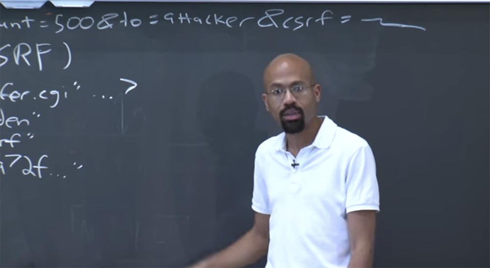

Если вы просто устанавливаете фрейм в URL, то атакующий может его контролировать. Но если вы используете XML HTTP-запрос и злоумышленник может генерировать один из них, то интерфейс XML HTTP позволяет вам установить тело запроса. Запрос XML HTTP ограничен одним и тем же origin. Однако если злоумышленник может сделать что-то вроде:

    

То он сможет внедрить запрос XML HTTP, который будет выполняться с полномочиями встроенной страницы.

Всё зависит от того, к чему атакующий имеет доступ. Если он может заставить страницу выполнять непроверенный скрипт, как показано выше, то он может использовать свойство JavaScript, которое называется внутренним HTML, и получить всё HTML содержимое страницы. Если злоумышленник может или не может сгенерировать AJAX запрос, это одно, если он может или не может посмотреть правильный код HTML, это другое, и так далее. Короче говоря, этот случайно генерируемый токен способен предотвратить CSRF атаки.

Есть еще одна вещь, на которую нужно обратить внимание — это сетевые адреса. Они относятся к той части нашего разговора, в которой говорилось, с кем же злоумышленник не может связаться через XML HTTP-запрос.

Относительно сетевых адресов, фрейм может отправлять запросы HTTP и HTTPS на (хост + порт), соответствующие его origin. Обратите внимание, что безопасность той же политики одинакового источника очень тесно связана с безопасностью инфраструктуры DNS, потому что все политики такого рода основаны на том, как вас называют.

Так что если вы можете контролировать то, как меня называют, вы можете совершить несколько довольно злобных атак, например, атаку перепривязки DNS. Целью такой атаки является запуск контролируемого злоумышленником JavaScript с полномочиями (или от имени) сайта жертвы, назовём его victim.com. В этом случае злоумышленник пользуется правилами политики одинакового источника и собирается каким-то образом запустить написанный им код с разрешения другого сайта.

Это делается следующим образом. Сначала злоумышленник регистрирует доменное имя, скажем, attacker.com. Это очень просто, достаточно заплатить пару баксов – и в путь, у вас есть собственное доменное имя. Злоумышленник также должен настроить DNS-сервер для ответов на запросы, приходящие на имя объектов, находящихся в attacker.com.

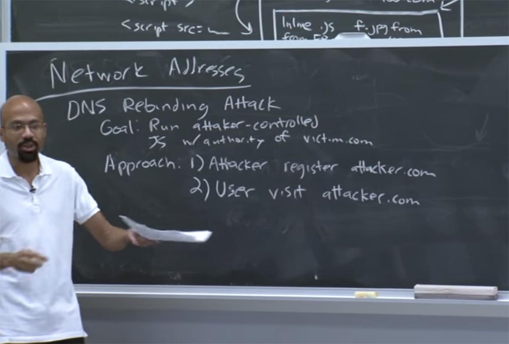

Второе, что должно произойти, — это то, что пользователь должен посетить сайт attacker.com. В частности, он должен посетить какой-то сайт, который зависит от этого доменного имени. В этой части атаки тоже нет ничего хитрого.

Посмотрите, сможете ли вы создать рекламную кампанию, например, предложить бесплатный iPad. Все хотят бесплатный iPad, хотя я не знаю никого, кто когда-либо выигрывал бесплатный iPad. Итак, щелчок по такому сообщению в фишинговой почте, и вы уже на сайте злоумышленника. Ничего особенного, эта часть не сложная.

Так что же после этого произойдет? Браузер начнёт генерировать запросы DNS к сайту attacker.com, поскольку страница, которую вы посетили, содержит объекты, которые ссылаются на объекты, находящиеся на attacker.com. Но браузер собирается сказать: «я никогда не видел этот домен раньше, поэтому позвольте мне отправить DNS-запрос на разрешение обратиться к attacker.com»!

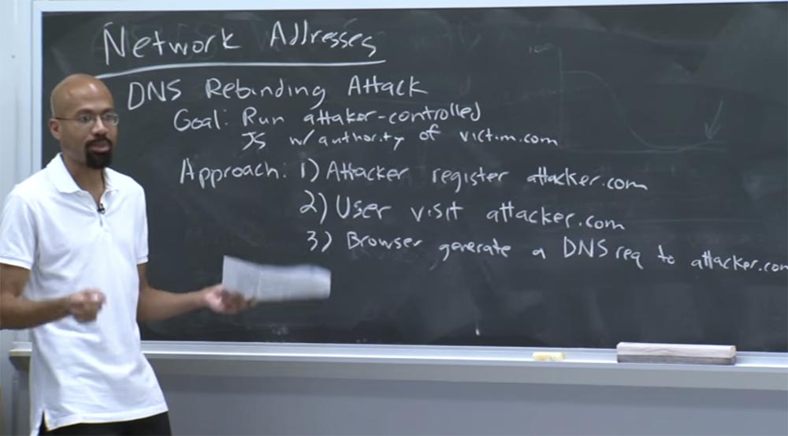

И DNS-сервер атакующего отвечает на эту просьбу, но его ответ содержит очень короткое время жизни TTL, что предотвращает возможность кэширования ответа. Поэтому браузер будет думать, что он действителен только в течение очень короткого периода времени до того, как он должен выйти и подтвердить это, что фактически означает запрет кэширования.

Получается, что как только пользователь переходит на хакерский домен, DNS-сервер атакующего сначала возвращает настоящий IP-адрес веб-сервера, который предоставил пользователю вредоносный код. Этот код на стороне клиента обращается к attacker.com, потому что политика origin разрешает такие запросы. Пользователь получает ответ, и теперь вредоносный веб-сайт работает на клиентской стороне.

Между тем злоумышленник собирается настроить DNS-сервер, который он контролирует, чтобы связать имя attacker.com и IP-адрес victim.com. Это означает, что если браузер пользователя запрашивает разрешение доменного имени для чего-то, находящегося внутри attacker.com, оно на самом деле собирается получить какой-то внутренний адрес victim.com.

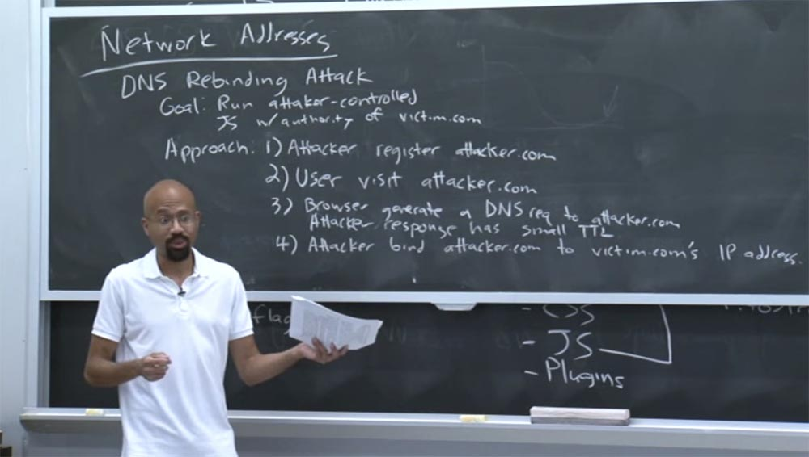

Почему же DNS злоумышленника может это сделать? Потому что хакер настраивает его для этого, и DNS-сервер злоумышленника не должен консультироваться для перепривязки с victim.com.

При этом если наш сайт хочет получить новый объект через, скажем, AJAX, он будет считать, что этот запрос AJAX идёт на attacker.com где-то снаружи, но на самом деле этот запрос AJAX идёт внутрь, на victim.com. Это плохо, потому что теперь у нас есть этот код на стороне, на которой расположена веб-страница attacker.com, которая фактически получает доступ к данным, имеющим с victim.com различный источник происхождения.

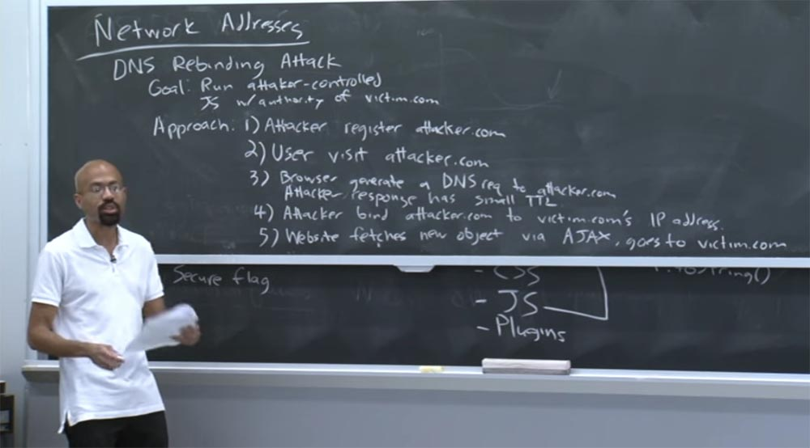

Проще говоря, при исполнении скрипта в браузере жертвы из-за устаревания предыдущего DNS-ответа производится новый запрос DNS для данного домена, который из-за запрета кэширования поступает к DNS-серверу атакующего. Тот отвечает, что теперь attacker.com как будто имеет новый IP-адрес какого-то другого веб-сайта, и запрос попадает к другому серверу. А затем для возврата собранной кодом информации атакующий предоставляет свой правильный IP-адрес в одном из следующих DNS-запросов.

**Аудитория:** не было бы разумнее сделать атаку наоборот, с сайта victim.com, чтобы получить все кукиз нападающего и тому подобное?

**Профессор:** да, такой вариант тоже сработает. Это позволит вам делать такие хорошие вещи, как сканирование портов. Я имею в виду, ваш подход будет работать правильно. Потому что вы сможете шаг за шагом постоянно перепривязывать attacker.com к различным именам компьютеров и различным портам внутри сети victim.com. Другими словами, веб-страница attacker.com будет всегда думать, что она оправляется на attacker.com и получает оттуда AJAX-запрос.

Фактически каждый раз, когда DNS-сервер повторно связывается с attacker.com, он посылает запросы на какой-то другой IP-адрес внутри сети victim.com. Таким образом, он может просто «шагать» через IP-адреса один за другим и видеть, если кто-то отвечает на эти запросы.

**Аудитория:** но пользователь, на которого вы нападаете, не обязательно имеет внутренний доступ к сети victim.com.

**Профессор:** как правило, эта атака заключается в том, что существуют определенные правила брандмауэра, которые могли бы предотвратить возможность просмотра внешним сайтом attacker.com IP-адресов внутри сети victim.com. Однако, если вы внутри корпоративной сети типа corp.net за корпоративным файрволом, то компьютеры часто имеют возможность связаться с машинами за пределами своей сети.

**Аудитория:** работает ли такой способ атаки через HTTPS?

**Профессор:** это интересный вопрос! Дело в том, что HTTPS использует ключи. Если вы применяете HTTPS, то при отправке AJAX-запроса, машина жертвы не будет иметь ключей HTTPS атакующей стороны, и проверка шифрования на компьютере victim.com покажет несоответствие ключей. Поэтому я думаю, что HTTPS исключает возможность атаки такого типа.

**Аудитория:** а если жертва использует только HTTPS?

**Профессор:** думаю, это остановит атакующего.

**Аудитория:** почему злоумышленник в первую очередь отвечает компьютеру жертвы своим IP-адресом?

**Профессор:** потому что злоумышленник должен каким-то образом запустить собственный код на машине жертвы прежде, чем он сможет предпринимать дальнейшие действия по поиску чего-либо внутри сети жертвы. Но не будем терять время, поэтому, если у вас есть вопросы по поводу переназначения DNS, приходите ко мне после лекции.

Итак, как вы можете это исправить? Один из способов исправления такой уязвимости состоит в модификации клиентского модуля разрешений DNS таким образом, чтобы внешним именам узлов никогда не разрешалось получить доступ к внутренним IP-адресам.

Это своего рода глупость, что кто-то за пределами вашей сети должен иметь возможность создавать DNS, привязанный к чему-то внутри вашей сети. Это самое простое решение.

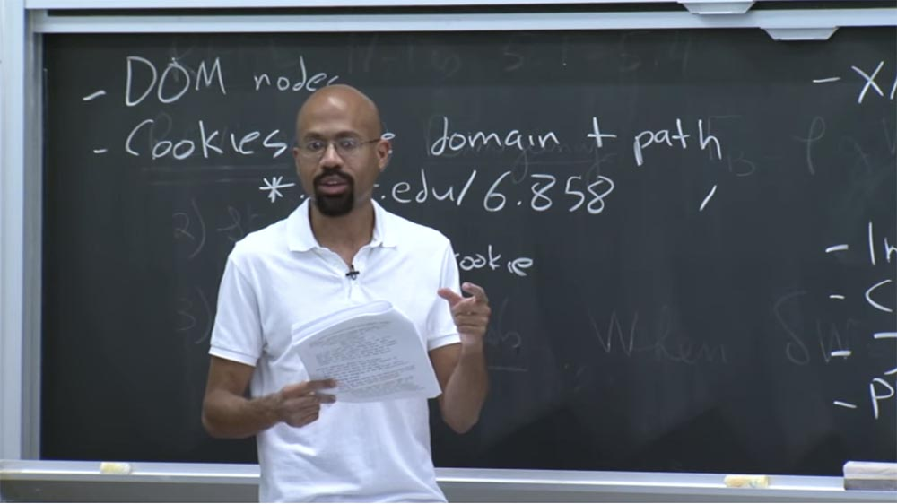

Можно представить, что браузер может делать что-то под названием «DNS pinning», или закрепление DNS. В результате, если браузер получает запись разрешённых DNS, то он всегда будет рассматривать эту запись допустимой, например, для взаимодействия в течении 30 минут, не зависимо от того, какой TTL назначает атакующий, и таким способом сможет противостоять атаке.  
Это решение немного сложно, потому что есть сайты, которые намеренно используют динамический DNS для таких вещей, как балансировка нагрузки на сервер и тому подобного. Таким образом, первое решение с закреплением DNS — лучший вариант.

А теперь мы рассмотрим, что защищает политика одинакового источника. Как насчет пикселей? Как же политика origin защищает пиксели?

Как оказалось, пиксели на самом деле не имеют происхождения. Таким образом, каждый фрейм получает свою собственную маленькую ограничительную рамку, в основном, просто квадрат, и фрейм может рисовать где угодно в пределах этой площади.

На самом деле это проблема, потому что это означает, что родительский фрейм может рисовать поверх дочернего фрейма. А это, в свою очередь, может привести к очень коварным атакам.

Скажем, атакующий создает некоторую страницу, на которой написано: «щёлкните здесь, чтобы выиграть iPad». Тот же стандартный приём. Это родительский фрейм.

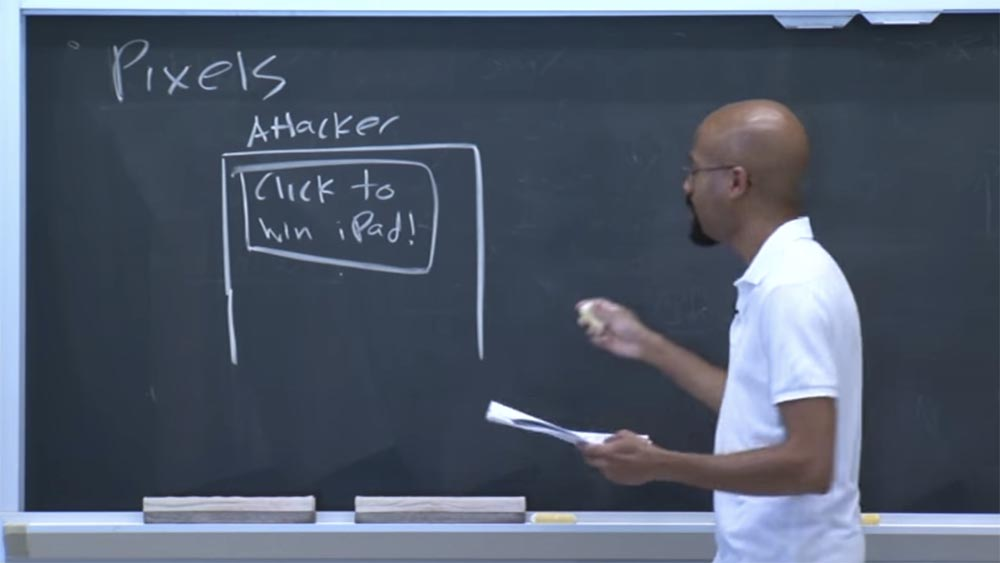

И этот родительский фрейм может создать дочерний фрейм, который на самом деле является фреймом кнопки Like сайта Facebook. Таким образом, Facebook позволяет запускать этот маленький кусочек кода Facebook, который вы можете поместить на свою страницу.

Вы знаете, что если пользователь нажимает «нравится», это означает, что он перейдёт на Facebook и скажет: «Эй, мне нравится эта конкретная страница»! Итак, у нас теперь есть этот дочерний фрейм кнопки Like.

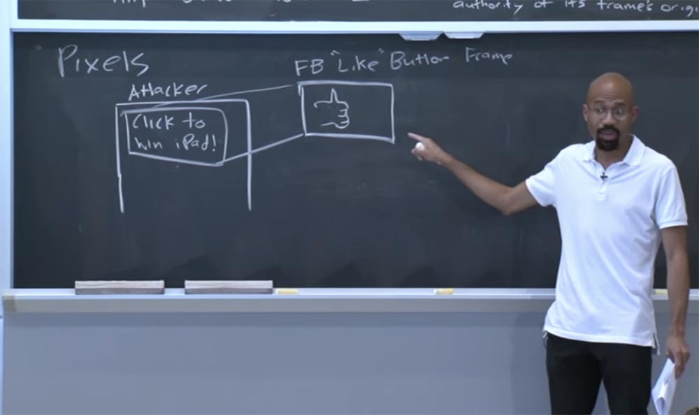

Теперь злоумышленник может наложить этот фрейм на область экрана, на которую должен кликнуть пользователь, чтобы получить бесплатный iPad, и к тому же сделать этот фрейм невидимым, CSS это позволяет.

Так что же при этом произойдет? Как мы уже установили, каждый хочет получить бесплатный iPad. Пользователь собирается перейти на этот сайт, нажав на эту область экрана, будучи уверенным, что нажимает именно то, что даст ему бесплатный iPad. Но на самом деле он нажимает на невидимую кнопку Like. Это как наслоение поверх индекса C.

Это означает, что теперь, возможно, пользователь попадает в профиль Facebook, где отмечает, что ему понравился сайт attacker.com. Знаете, он даже не вспомнит, как это произошло. Так что это на самом деле то, что называется click jacking attack – поддержка атаки кликом. Таким же образом можно совершить множество нехороших вещей — украсть пароли, получить персональные данные, короче, это безумие. Подчеркну – такое возможно из-за того, что родительский фрейм получает возможность рисовать что угодно в пределах этого ограничивающего его прямоугольника.

Итак, родительский фрейм – это то, что вы видите на странице, призыв получить бесплатный планшет, а дочерний фрейм – это кнопка «лайк», которая прозрачно накладывается на родительский фрейм.

Существуют разные решения этой проблемы. Первое заключается в использовании кода блокировки фреймов frame busting code. Таким образом, вы можете использовать выражения JavaScript для выяснения, не вложил ли кто-то в ваш фрейм свой собственный фрейм. Например, один из этих тестов – сравнение следующего вида: if (self! = top).

Здесь оператор self ссылается на верхнюю часть фрейма top, которая сравнивается с иерархией всего фрейма. Поэтому, если вы сделаете этот тест и обнаружите, что self не равен верхней части родительского фрейма, то поймёте, что у вас имеется дочерний фрейм. В этом случае вы можете отказаться от его загрузки.

Подобное происходит, если вы попытаетесь создать фрейм, например, для CNN.com. Если рассмотреть исходный код JavaScript, то видно, что он выполняет данный тест, потому что CNN.com не хочет, чтобы другие люди использовали его контент. Поэтому этот фрейм всегда занимает самое верхнее положение. Итак, это одно из решений, которое можно здесь использовать.

Второе решение заключается в том, чтобы ваш веб-сервер отправил в ответ HTTP-заголовок, который называется x-Frame options. Поэтому, когда веб-сервер возвращает ответ, он может установить этот заголовок, в котором будет сказано: «эй, браузер, не позволяй никому помещать мой контент внутри фрейма!». Это решение позволяет браузеру выполнять принудительные действия.

Так что это довольно просто. Но ещё есть куча других сумасшедших атак, которые вы можете организовать.

Как я уже упоминал ранее, то, что мы сейчас живем в интернациональном Интернете, создаёт проблемы использования имени домена или хоста.

Допустим, у нас имеется буква С. Но на каком языке? Из какого алфавита эта буква – из латинского ASCII или это C на кириллице? Это позволяет организовать атаки, использующие разночтение и употребление разных, но внешне похожих букв. Например, атакующий регистрирует доменное имя cats.com. И пользователи будут переходить на этот домен, думая, что посетят сайт «кошки.ком», но в действительности попадут на сайт злоумышленника «сатс.ком», потому что первая буква здесь не латиница, а кириллица.

Злоумышленник может зарегистрировать домен fcebook.com, но люди невнимательны, они воспримут это как facebook.com и зайдут туда. Так что если вы контролируете «фсебук.ком», то получите кучу трафика от людей, которые думают, что они зашли на «Фейсбук».

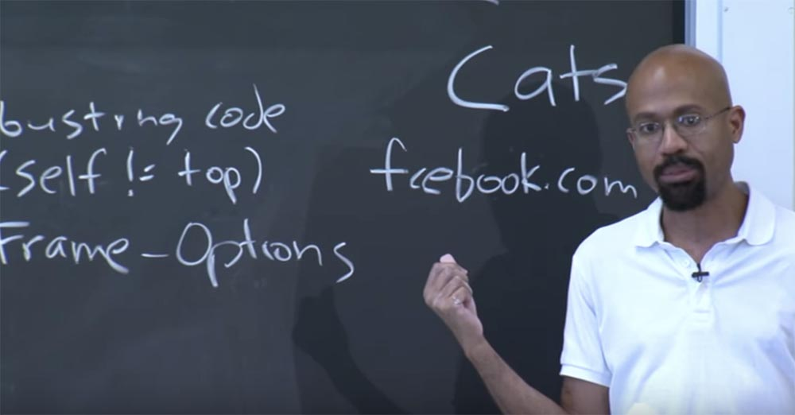

Есть куча разных, своего рода, дурацких атак, которые вы можете запустить через систему регистрации доменных имён, от которых трудно защититься, потому что как вы можете запретить пользователям делать опечатки? Или как браузер укажет пользователю: «Эй, это кириллица, а не латиница»!?

Если браузер будет предупреждать пользователя каждый раз, когда включены кириллические шрифты, это разозлит людей, которые на самом деле используют кириллицу в качестве родного шрифта. Так что не совсем ясно, как можно решить подобные вопросы с технической точки зрения, поэтому здесь возникают очень щепетильные проблемы безопасности.

Ещё одной интересной вещью являются плагины. Как же плагины взаимодействуют с политикой origin? Плагины часто имеют несовместимость с остальной частью браузера по отношению к одному и тому же источнику происхождения. Например, если вы посмотрите на плагин Java, то он предполагает, что разные имена хостов, которые имеют один и тот же IP-адрес, также имеют и одинаковый origin.

На самом деле, это довольно большое отклонение от стандартной интерпретации политики одинакового происхождения. Подобный подход означает, что если у вас есть что-то вроде x.y.com и z.y.com и они проецируются на один и тот же IP-адрес, то Java будет считать, что они имеют одинаковый источник происхождения. Это может стать проблемой, так как в действительности один сайт имеет доверенный источник происхождения, а другой – нет. Есть много других сложностей, связанных с плагинами, с которыми вы можете ознакомиться из общедоступных источников в интернете или из конспекта данной лекции.

Последнее, что я хочу обсудить, это атака совместного использования экрана, или screen sharing attack.

HTML5 фактически определяет новый API, с помощью которого веб-страница может делиться всеми своими битами для совместного использования с другим браузером или сервером. Это кажется действительно классной идеей, потому что появляется возможность одновременной работы нескольких пользователей над одним документом. Это здорово, потому что мы живем в будущем.

Но самое забавное то, что когда они разработали этот новый API, они вообще не думали о политике общего источника!

Предположим, у вас есть страница, на которой расположено несколько фреймов, и каждый из них имеет право сделать скриншот всего вашего монитора. Он может сделать скриншот всех расположенных на экране фреймов и всего контента независимо от того, из каких источников они происходят.

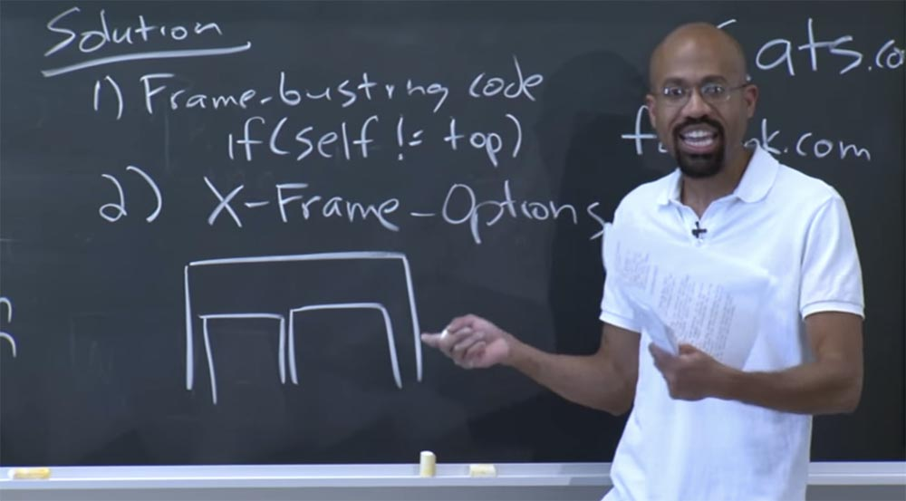

Так что по сути это довольно разрушительный недостаток в политике одинакового источника происхождения, поэтому стоит подумать над его исправлением. Например, если человек из правого фрейма имеет возможность делать скриншоты, то он сможет сделать скриншот только правого фрейма, а не всего экрана в целом.

Почему же разработчики браузеров не реализовали это таким образом? Потому что они испытывают конкурентное давление и вынуждены сосредоточить свои усилия на разработке всё новых и новых функций, новых возможностей, вместо того, чтобы уделять внимание совершенствованию уже разработанных вещей.

Множество вопросов, которые студенты задавали по интернету относительно этой лекции, звучали так: «почему же разработчики не сделали то, что могли сделать? Разве это не понятно?» или: «Похоже, что эта конкретная схема мертва. Разве другая не была бы лучше?» и так далее.

Скажу вам честно – да, это точно, почти всё было бы лучше, если бы разработчики отнеслись к этому ответственно. Так что мне бывает стыдно, что я с этим связан.

Но дело в том, что это то, что у нас было раньше. Если вы посмотрите на все существовавшие раньше элементы, то увидите, что веб-браузеры развиваются, и люди стали немного больше заботиться о безопасности. Но не в случае с совместным использованием экрана, где разработчики были так озабочены инновационными возможностями браузера, что совершенно забыли о возможности утечки бит.

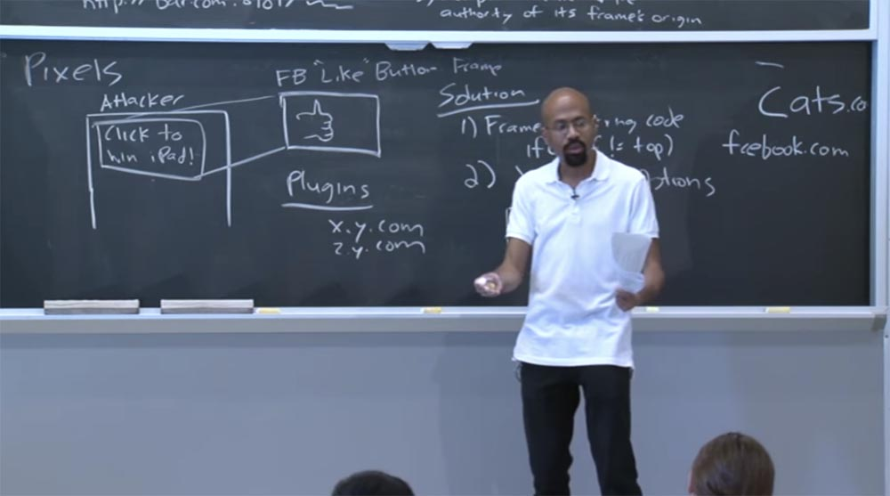

Поэтому я прошу вас всегда обращать внимание на вещи, которые мы сегодня обсудили. Представьте себе, если бы мы собирались начать с нуля, уничтожили всё, что было до нас, и попытались придумать лучшую политику безопасности, как вы думаете, какое количество сайтов у нас бы заработало? Думаю, не больше 2%. Так что пользователи наверняка стали бы на нас жаловаться.

Есть ещё одно интересное свойство, связанное с безопасностью. Как только вы даете пользователям какую-то функцию, очень трудно отозвать её обратно, даже если пользоваться ей небезопасно. Поэтому сегодня мы обсуждали так много вещей, связанных с политикой origin, и продолжим говорить об этом на следующей лекции.

Полная версия курса доступна [здесь](https://ocw.mit.edu/courses/electrical-engineering-and-computer-science/6-858-computer-systems-security-fall-2014/).

Спасибо, что остаётесь с нами. Вам нравятся наши статьи? Хотите видеть больше интересных материалов? Поддержите нас оформив заказ или порекомендовав знакомым, **30% скидка для пользователей Хабра на уникальный аналог entry-level серверов, который был придуман нами для Вас:** [Вся правда о VPS (KVM) E5-2650 v4 (6 Cores) 10GB DDR4 240GB SSD 1Gbps от $20 или как правильно делить сервер?](https://habr.com/company/ua-hosting/blog/347386/) (доступны варианты с RAID1 и RAID10, до 24 ядер и до 40GB DDR4).

**VPS (KVM) E5-2650 v4 (6 Cores) 10GB DDR4 240GB SSD 1Gbps до декабря бесплатно** при оплате на срок от полугода, заказать можно [тут](https://ua-hosting.company/vpsnl).

**Dell R730xd в 2 раза дешевле?** Только у нас **[2 х Intel Dodeca-Core Xeon E5-2650v4 128GB DDR4 6x480GB SSD 1Gbps 100 ТВ от $249](https://ua-hosting.company/serversnl) в Нидерландах и США!** Читайте о том [Как построить инфраструктуру корп. класса c применением серверов Dell R730xd Е5-2650 v4 стоимостью 9000 евро за копейки?](https://habr.com/company/ua-hosting/blog/329618/)