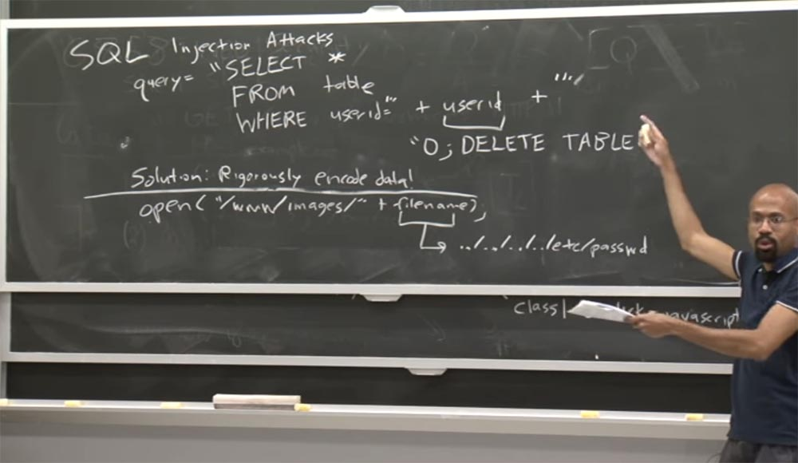
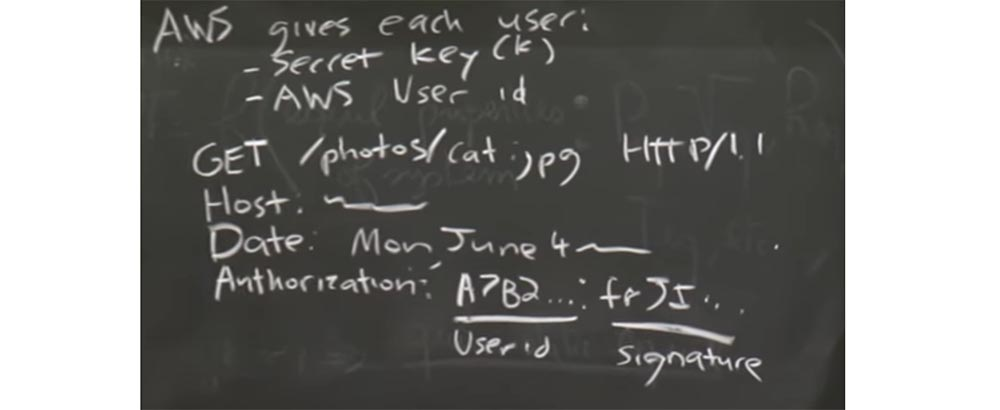
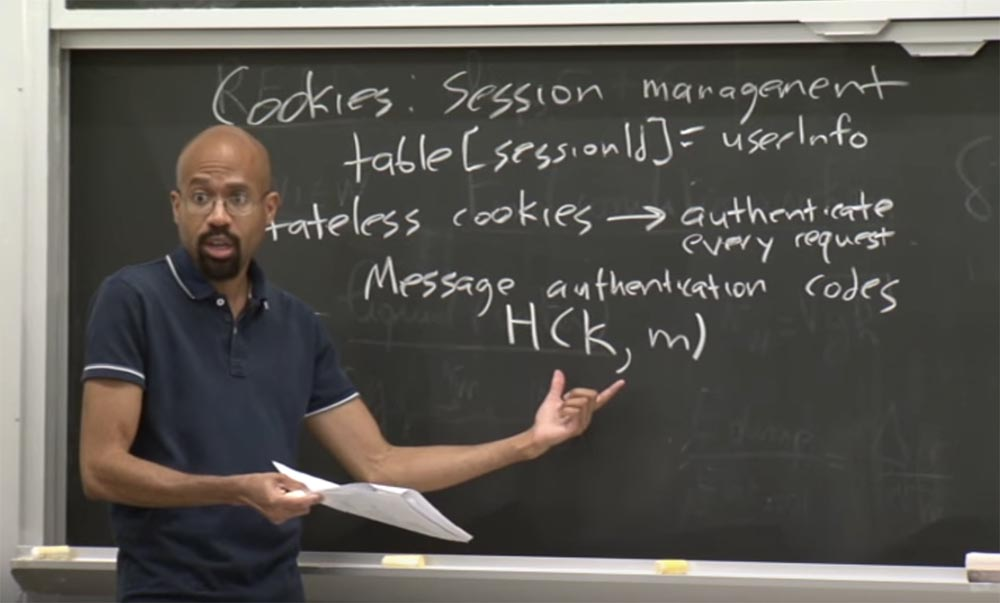

Курс MIT «Безопасность компьютерных систем». Лекция 9: «Безопасность Web-приложений», часть 2 / Блог компании ua-hosting.company

### Массачусетский Технологический институт. Курс лекций #6.858. «Безопасность компьютерных систем». Николай Зельдович, Джеймс Микенс. 2014 год

Computer Systems Security — это курс о разработке и внедрении защищенных компьютерных систем. Лекции охватывают модели угроз, атаки, которые ставят под угрозу безопасность, и методы обеспечения безопасности на основе последних научных работ. Темы включают в себя безопасность операционной системы (ОС), возможности, управление потоками информации, языковую безопасность, сетевые протоколы, аппаратную защиту и безопасность в веб-приложениях.

Лекция 1: «Вступление: модели угроз» [Часть 1](https://habr.com/company/ua-hosting/blog/354874/) / [Часть 2](https://habr.com/company/ua-hosting/blog/354894/) / [Часть 3](https://habr.com/company/ua-hosting/blog/354896/)  
Лекция 2: «Контроль хакерских атак» [Часть 1](https://habr.com/company/ua-hosting/blog/414505/) / [Часть 2](https://habr.com/company/ua-hosting/blog/416047/) / [Часть 3](https://habr.com/company/ua-hosting/blog/416727/)  
Лекция 3: «Переполнение буфера: эксплойты и защита» [Часть 1](https://habr.com/company/ua-hosting/blog/416839/) / [Часть 2](https://habr.com/company/ua-hosting/blog/418093/) / [Часть 3](https://habr.com/company/ua-hosting/blog/418099/)  
Лекция 4: «Разделение привилегий» [Часть 1](https://habr.com/company/ua-hosting/blog/418195/) / [Часть 2](https://habr.com/company/ua-hosting/blog/418197/) / [Часть 3](https://habr.com/company/ua-hosting/blog/418211/)  
Лекция 5: «Откуда берутся ошибки систем безопасности» [Часть 1](https://habr.com/company/ua-hosting/blog/418213/) / [Часть 2](https://habr.com/company/ua-hosting/blog/418215/)  
Лекция 6: «Возможности» [Часть 1](https://habr.com/company/ua-hosting/blog/418217/) / [Часть 2](https://habr.com/company/ua-hosting/blog/418219/) / [Часть 3](https://habr.com/company/ua-hosting/blog/418221/)  
Лекция 7: «Песочница Native Client» [Часть 1](https://habr.com/company/ua-hosting/blog/418223/) / [Часть 2](https://habr.com/company/ua-hosting/blog/418225/) / [Часть 3](https://habr.com/company/ua-hosting/blog/418227/)  
Лекция 8: «Модель сетевой безопасности» [Часть 1](https://habr.com/company/ua-hosting/blog/418229/) / [Часть 2](https://habr.com/company/ua-hosting/blog/423155/) / [Часть 3](https://habr.com/company/ua-hosting/blog/423423/)  
Лекция 9: «Безопасность Web-приложений» [Часть 1](https://habr.com/company/ua-hosting/blog/424289/) / [Часть 2](https://habr.com/company/ua-hosting/blog/424295/) / [Часть 3](https://habr.com/company/ua-hosting/blog/424297/)

Например, Django возьмет эти угловые скобки, переведет их в форму HTML и переделает остальные символы. То есть если пользовательское значение name содержит угловые скобки, двойные кавычки и тому подобное, все эти символы будут исключены. Он сделает так, что содержимое не будет интерпретироваться как HTML-код на стороне браузера клиента.

Итак, теперь мы знаем, что это не совсем надежная защита от некоторых атак межсайтового скриптинга. Причина, как мы показали в примере, состоит в том, что эти грамматики для HTML, и CSS и JavaScript настолько сложны, что очень легко могут запутать парсер браузера.

Например, у нас есть очень распространенная вещь, выполняемая в рамках Django. Итак, у вас есть некоторая функция div, и мы хотим установить ей динамический класс. Мы придаём классу значение var, так далее и так далее. Идея состоит в том, что когда Django обрабатывает это, он должен выяснить, что собой представляет текущий стиль, а затем вставить его сюда.

При этом злоумышленник может создать строку, определяющую этот класс, например, записывает “class 1”. До этого места у нас всё идёт хорошо, потому что это похоже на допустимое выражение CSS.

Но затем злоумышленник помещает сюда оператор onclick, равный коду JavaScript, который осуществляет системный вызов.

Так как это неправильно, браузер должен был бы просто сделать здесь остановку. Но проблема в том, что если вы когда-либо видели HTML реальной веб-страницы, здесь все сломано и запутано, даже для законных, «доброжелательных» сайтов. Так что если браузер будет останавливаться перед каждым ошибочным выражением HTML, ни один сайт, который вам понравится, просто никогда не будет работать. Если вы когда-нибудь захотите разочароваться в мире, и я в достаточной степени вам в этом не помог, просто откройте консоль JavaScript в своем браузере при просмотре сайта, чтобы увидеть, сколько ошибок она вам выдаст.

Вы можете, например, перейти на сайт CNN и просто посмотреть, сколько ошибок получится. Да, в основном CNN работает, но очень неровно. Например, чтобы открыть Acrobat reader, постоянно требуется сбрасывать исключения нулевого указателя, и при этом вы почувствуете себя немного обманутым жизнью. Но в интернете мы научились принимать подобное без особого возмущения.  
Поэтому, поскольку браузеры должны быть весьма терпимы к подобным вещам, они будут пытаться превратить вредоносный код во что-то, что кажется им разумным. И в этом заключена уязвимость безопасности.

Вот так работает дезинфекция контента, и это всё же лучше, чем ничего. Она может поймать много вредных штук, но не может обороняться от всего.

Есть ещё одна вещь, о которой стоит подумать – это использование менее выразительного языка разметки. Посмотрим, что имеется в виду.

**Аудитория:** что делать, если очистка контента не срабатывает?

**Профессор:** да, такое возможно, например, в этом случае Django не сможет статически определить, что это плохо. Например, в данном конкретном случае. Но в том случае, когда я вставляю вредоносный тег изображения…

**Аудитория:** в этом конкретном случае я ожидал бы, что присваивание класса будет в кавычках и в этом случае не должно иметь никакого эффекта…

**Профессор:** ну, видите ли, там есть небольшие хитрости. Если предположить, что грамматика HTML и CSS тщательно определены, то можно представить себе мир, в котором идеальные парсеры смогли бы как-то уловить эти проблемы или как-то преобразовать их в нормальные вещи. Но на самом деле, грамматики HTML и грамматики CSS страдают неточностями. Кроме того, браузеры не реализуют спецификации. Поэтому, если использовать менее выразительную грамматику, нам будет намного легче дезинфицировать контент.

Здесь применяется термин Markdown – «легкочитаемая разметка» вместо термина Markup – обычная разметка. Основная идея Markdown заключается в том, что она разработана в качестве языка, который, например, позволяет пользователям отправлять комментарии, но не содержит в себе возможность использования пустого тега, поддержку апплета и тому подобное. Поэтому в Markdown на самом деле гораздо проще однозначно определить грамматику и затем просто её применить.

Гораздо проще делать дезинфекцию в простом языке, чем в полномасштабном HTML, CSS и JavaScript. И в определенном смысле это похоже на разницу между пониманием кода C и кода Python. Там на самом деле большая разница в понимании более выразительного языка. Поэтому ограничивая экспрессивность, вы часто улучшаете безопасность.

Для защиты от атак межсайтового скриптинга также используется CSP, политика безопасности контента Content Security Policy. Идея CSP заключается в том, что она разрешает веб-серверу…  
Аудитория: мне просто любопытно выяснить по поводу этого языка Markdown. Разве все браузеры умеют выполнять парсинг языка?

**Профессор:** нет, нет, нет. Просто вы можете преобразовать различные типы языков в HTML, но в оригинальном виде браузеры их не понимают. Другими словами, у вас есть система отправки комментариев, и она использует Markdown. То есть комментарии, прежде чем отобразиться на странице, поступают в компилятор Markdown, который переводит их в формат HTML.

**Аудитория:** так почему бы всегда не использовать Markdown?

**Профессор:** Markdown позволяет использовать встроенный HTML, и, насколько я знаю, есть способ отключить его в компиляторе. Но я могу ошибаться насчет этого. Дело в том, что не всегда возможно использовать ограниченный язык, и не все хотят так делать.

Итак, продолжим разговор о том, как повысить безопасность с помощью Content Security Policy. Эта политика позволяет серверу указать веб-браузеру, какие типы контента могут быть загружены на странице, которую он отправляет обратно, а также, откуда этот контент должен прийти.

Например, в HTTP-ответе сервер может использовать что-то вроде этого: оно включает в себя заголовок Content – Security – Policy, источник по умолчанию, равный self и он будет принимать данные от *.mydomain.com.

Оператором self сервер указывает, что контент с этого сайта должен исходить только от домена конкретной страницы или любого поддомена mydomain.com. Это означает, что если бы у нас была привязка self к foo.com, то сервер отправил бы это страницу обратно браузеру.

Предположим, атака межсайтового скриптинга пытается создать ссылку на сайт bar.com. В этом случает браузер увидит, что bar.com не является self и не является доменом mydomain.com, и не пропустит этот запрос дальше. Это довольно мощный механизм, в котором можно указать более детальные элементы управления. Вы задаёте параметры, указывающие, что ваши изображения должны исходить от такого-то источника, скрипты от такого-то и так далее. Это на самом деле удобно.

Кроме того, эта политика фактически предотвращает встроенный JavaScript, так что вы не можете открыть тег, записать какой-то сценарий и закрыть тег, потому что всё, что может поступить в браузер, должно исходить только из обусловленного источника. CSP предотвращает такие опасные вещи, как использование аргумента функции eval(), которая позволяет веб-странице выполнять динамически генерируемый код JavaScript. Так что если задан заголовок CSP, браузер не станет выполнять eval().

**Аудитория:** это всё, от чего защищает CSP?

**Профессор:** нет. Есть целый список ресурсов, которые он фактически защищает, и можно настроить защиту от множества нежелательных вещей, например, указать, откуда именно разрешено принимать исходящие CSS и кучу других вещей.

**Аудитория:** но ведь кроме eval() существуют и другие вещи, угрожающие безопасности?

**Профессор:** да, существуют. Поэтому всегда возникает вопрос о полноте защиты. Так, например, не только eval может динамически генерировать код JavaScript. Есть ещё и конструктор функций, есть определенные способы вызвать заданное время ожидания, вы переходите в строку и можете проанализировать код таким образом. CSP может отключить все эти опасные векторы атаки. Но это не является панацеей для полной изоляции вредоносных эксплойтов.

**Аудитория:** правда ли, что CSP можно настроить так, чтобы запретить проверять все внутренние скрипты на странице?

**Профессор:** да, она помогает предотвратить выполнение динамически генерируемого кода, при этом встроенный код должен быть проигнорирован. Браузер должен всегда получайте код из исходного атрибута. На самом деле я не знаю, поступают ли так все браузеры. Личный опыт показывает, что браузеры демонстрируют различное поведение.

Вообще интернет безопасность сродни естественным наукам, поэтому люди всего лишь выдвигают теории о том, как работают браузеры. А потом вы видите, как это происходит на самом деле. И реальная картина может разочаровать, потому что нас учат, что есть алгоритмы, доказательства и тому подобное. Но эти браузеры настолько плохо себя ведут, что результаты их работы бывают непредсказуемыми.

Разработчики браузеров стараются быть на шаг впереди от нападающих, и дальше в лекции вы увидите примеры этого. На самом деле CSP — довольно крутая вещь.

Другой полезной вещью является то, что сервер может установить HTTP заголовок под названием X-Content-Type-Options, значение которого равно nosniff.

Этот заголовок запрещает MIME отбрасывать ответ от объявленного типа контента, поскольку заголовок указывает браузеру не переопределять тип содержимого ответа. С опцией nosniff, если сервер говорит, что контент является text/html, браузер отобразит его как text/html.  
Проще говоря, этот заголовок мешает браузеру «обнюхивать» ответ от объявленного типа содержимого, чтобы не произошла ситуация, когда браузер скажет: «ага, я вынюхал несоответствие между расширением файла и фактическим содержимым, поэтому я превращу это содержимое в какую-то другую, понятную мне вещь». При этом получится, что вы внезапно отдали варварам ключи от королевства.

Поэтому, установив этот заголовок, вы тем самым указываете браузеру не делать ничего подобного. Это может значительно смягчить последствия некоторых типов атак. Вот таков краткий обзор некоторых факторов уязвимости для атак межсайтового скриптинга.

Теперь давайте рассмотрим еще один популярный вектор для атак — SQL. Вы, вероятно, слышали об атаках под названием «внедрение SQL-кода», или SQL-injection attack. Суть этих атак состоит в использовании базы данных веб-сайта. Для динамического построения страницы, показываемой пользователю, необходимы запросы базы данных, которые выдаются на этот внутренний сервер. Представьте, что у вас есть запрос на выборку всех значений из какой-то конкретной таблицы, где поле User ID равно тому, что определяется в интернете из потенциально ненадежного источника.

Все мы знаем, чем закончится эта история – она закончится очень плохо, здесь не будет выживших. Потому что то, что приходит из непроверенного источника, может натворить много бед. Как вариант, можно придать строке user id такое значение: user id = “ 0; DELETE TABLE “.

Так что же здесь произойдёт? В принципе, база данных сервера скажет: «хорошо, я установлю идентификатор пользователя, равный нулю, а затем выполню команду «удалить таблицу»». И всё, с вами покончено!

Рассказывают, что пару лет назад появилось некое вирусное изображение. Некоторые люди в Германии устанавливали на автомобили номерные знаки, на которых было написано 0; DELETE TABLE. Идея заключалась в том, что дорожные камеры используют для распознавания вашего номера систему оптического распознавания символов OCR, а затем помещают этот номер в базу данных. В общем, народ «фольксвагенов» решил использовать эту уязвимость, расположив вредоносный код на своих номерах.

Не знаю, работало ли это, потому что подобное звучит смешно. Но мне хотелось бы верить, что это правда. Так что повторю ещё раз – идея дезинфекции состоит в том, чтобы не допустить выполнение контента из недоверенных источников на вашем сайте.

Поэтому обратите внимание на то, что могут быть какие-то простые вещи, которые работают не так, как нужно. Так, вы можете подумать: «хорошо, почему я не могу просто поставить ещё одну кавычку в начале строки и ещё одну в конце, чтобы исключить тем самым выполнение вредоносного кода злоумышленника, заключённого между тройными кавычками»?

user id = ‘“ + user id + ‘“

Но это не сработает, потому что злоумышленник всегда может просто расположить кавычки внутри атакующей строки. Так что в большинстве случаев такое «полухакерство» не принесёт вам столько безопасности, на сколько вы рассчитываете.

Решение здесь заключается в том, что вам нужно тщательно шифровать ваши данные. И еще раз повторю, что когда вы получаете информацию из ненадежного источника, не вставляйте ее в систему в том виде, в каком она есть. Убедитесь, что она не сможет выскочить из «песочницы», если вы её туда помещаете, чтобы выполнить вредоносный эксплойт.

Например, вы хотите вставить функцию escape, чтобы помешать использование оператора запятой в сыром виде. Для этого многие из веб-фреймворков, таких, как Django, имеют встроенные библиотеки, позволяющие избегать SQL запросы, чтобы предотвратить выполнение подобных вещей. Эти фреймворки поощряют разработчиков никогда напрямую не взаимодействовать с базой данных. Например, Django сам предоставляет высокоуровневый интерфейс, который выполняет за вас дезинфекцию.

Но людей всегда волнует производительность, и иногда люди думают, что эти веб-фреймворки слишком медленные. Так что, как вы убедитесь в скором времени, люди по-прежнему будут делать необработанные SQL-запросы, что может привести к проблемам.

Проблемы могут возникнуть, если веб-сервер принимает имена путей от недоверенных изображений. Представьте, что где-то на вашем сервере вы делаете что-то подобное: open с “www/images/” + filename, где filename представлено чем-то вроде .../.../.../.../etc/password.

То есть вы даёте команду открыть изображение по этому адресу из недоверенного пользовательского файла, который в действительности может вам серьёзно навредить. Таким образом, если вы хотите использовать веб-сервер или веб-фреймворк, то вы должны быть в состоянии обнаружить эти опасные символы и избежать их, чтобы предотвратить выполнение этих необработанных команд.

Давайте отдохнём от обсуждения дезинфекции контента и немного поговорим о кукиз. Кукиз являются очень популярным способом управления сессиями для того, чтобы привязать пользователя к некоторому набору ресурсов, существующих на стороне сервера. Множество фреймворков вроде Django или Zoobar, с которым вы познакомитесь позднее, фактически помещают внутри кукиз случайный идентификатор сессии. Идея состоит в том, что этот идентификатор сессии является индексом в какой-то таблице на стороне сервера:

table \[session ID\] = user info.

То есть идентификатор сессии равен некоторой информации о пользователе. В результате этот ID сессии и кукиз по своему расширению являются очень чувствительными штуками. Многие атаки включают в себя кражу кукиз, чтобы получить этот идентификатор сеанса. Как мы обсуждали в последней лекции, та же политика одинакового источника происхождения может помочь вам, в определенной степени, против некоторых из этих атак кражи файлов cookie. Потому что есть правила, основанные на политике same origin, которые предотвращают произвольное изменение файлов cookie.

Тонкость состоит в том, что вы не должны совместно использовать домен или поддомен с тем, кому не доверяете. Потому что, как мы говорили в прошлой лекции, есть правила, которые позволяют двум доменам или поддоменам одинакового происхождения получить доступ к файлам cookie друг друга. И поэтому, если вы доверяете домену, которому не должны доверять, он может быть в состоянии непосредственно установить идентификатор сеанса в этих кукиз, к которым вы оба имеете доступ. Это позволит атакующему принудить пользователя использовать идентификатор сеанса по выбору злоумышленника.

Предположим, что злоумышленник устанавливает файл cookie пользователя Gmail. Пользователь заходит в Gmail и набирает несколько писем. Затем злоумышленник может использовать этот файл cookie, в частности, использовать этот идентификатор сессии, загрузить Gmail и затем получить доступ к Gmail, как если бы он или она были бы пользователем-жертвой. Таким образом, есть много тонкостей, которые можно проделать с помощью этих кукиз, чтобы управлять сессиями. Мы обсудим некоторые из них сегодня и на последующих лекциях.

Может быть, вы думаете, что можно просто избавиться от кукиз? Ведь они приносят больше проблем, чем пользы. Почему же от них нельзя отказаться?

Представим существование stateless cookie, или «куки без сохранения состояния», чтобы как-то избавиться от понятия сессий в целом и для предотвращения этого неприятного вектора атаки, который, как кажется, превалирует во всех наших дискуссиях.

Итак, основная идея заключается в том, что если вы не хотите сохранять состояние запроса, то должны аутентифицировать каждый запрос. Потому полезным свойством кукиз является то, что они следуют за вами куда угодно. Таким образом, вы аутентифицируетесь один раз, и затем в каждом последующем запросе у вас есть этот маленький токен. Но если вы хотите избавиться от этих вещей, то, по сути, должны иметь некоторые доказательства ваших полномочий в каждом запросе, который делаете.

Один из способов сделать это — использовать нечто под названием MAС — Message Authentication Codes, или коды аутентификации сообщения. Это своеобразный хеш, требующий ключ. Такой код содержит хеш некоего ключа HCK и какое-то сообщение m. Основная идея состоит в том, что клиент, пользователь и сервер делятся друг с другом секретным ключом K. Таким образом, клиент использует этот ключ для создания подписи сообщения, которое он отправляет на сервер. И тогда сервер, который также знает этот ключ, может затем использовать эту же функцию для проверки правильности подписи.

Давайте рассмотрим конкретный пример того, как это работает. Одними из реальных сервисов, которые используют stateless cookie, являются интернет сервисы Amazon, например, x3. В основном веб-сервис Amazon, обозначим его AWS, дает каждому пользователю две вещи. Первая – это секретный ключ K, вторая – идентификатор пользователя AWS, который не является секретным.

И поэтому каждый раз, когда вы хотите отправить запрос в AWS через HTTP, вы должны отправить его в специальном формате.

Например, если вы хотите получить доступ к фотографиям кошек, что не удивительно, то первой строкой у вас будет:

GET /photos/ cat; .jpg HTTP/1.1, затем последует строка с хоста с названием какого-то сервера AWS:

HOST: — - — - — , и третья строка с датой, например:

DATE: Mon, June 4, а в самом конце у вас будет расположена строка с полем авторизации, то место, где располагается код аутентификации сообщения. Он состоит из части, представляющей ваш ID пользователя, и части, похожей на случайный набор букв, которая является подписью.

Так как же выглядит эта подпись? В основном эта подпись находится над строкой, которая инкапсулирует кучу деталей этого запроса из 3-х верхних строк.

По сути, строка авторизации String To Sign выглядит примерно так:

— глагол HTTP, в нашем случае это GET;  
— контрольная сумма содержимого сообщения MDS;  
— тип контента, например html или изображение jpg;  
— дата;  
— имя ресурса, которое по сути является путем, который вы здесь видите.

Другими словами, эта строка представляет собой сообщение, которое вы передаёте в HCK MAC. Обратите внимание, что сервер может видеть всё это в запросе в виде открытого текста. Это позволяет серверу проверить правильность кода проверки подлинности сообщения, потому что сервер использует этот ключ совместно с пользователем. Таким образом, данный способ позволяет серверу проверять материал такого рода. Это понятно?

В данном случае, для контента, это выглядит как пустая строка, но вы можете себе представить это как сообщение или что-то в этом роде. Вчера я проверил документацию Amazon и убедился, что они всё ещё используют stateless cookie, так как алгоритм хеширования MD5 не самый лучший вариант в данном случае.

Чтобы не путать вас, скажу, что основная идея заключается в том, что мы хотим избавиться от понятия постоянного файла cookie, который повсюду сопровождает пользователя. Но при этом возникает проблема – теперь серверу нужен способ, чтобы определить, с каким клиентом он разговаривает.

Для этого нужно обеспечить каждого клиента уникальным ключом, который он будет использовать совместно с сервером. Всякий раз, когда клиент отправляет сообщение на сервер, он вместе с ним отправляет особую криптографическую операцию “HCK, m”.

В обычном мире здесь вместо авторизации использовались бы кукиз. Но теперь мы от них избавляемся и вставляем в запрос вот это четкое текстовое сообщение GET /photos/ cat; .jpg HTTP/1.1 и шифрование, которое позволяет серверу выяснить, от кого эта штука. Таким образом сервер знает, кто пользователь, потому что это встроено в запрос. Это ведь не секрет, верно? Но это позволяет серверу сказать: «ага, я знаю, какой секретный ключ этот пользователь должен был использовать для создания этого запроса, если это реальный пользователь».

56:15

[Курс MIT «Безопасность компьютерных систем». Лекция 9: «Безопасность Web-приложений», часть 3](https://habr.com/company/ua-hosting/blog/424297/)

Полная версия курса доступна [здесь](https://ocw.mit.edu/courses/electrical-engineering-and-computer-science/6-858-computer-systems-security-fall-2014/).

Спасибо, что остаётесь с нами. Вам нравятся наши статьи? Хотите видеть больше интересных материалов? Поддержите нас оформив заказ или порекомендовав знакомым, **30% скидка для пользователей Хабра на уникальный аналог entry-level серверов, который был придуман нами для Вас:** [Вся правда о VPS (KVM) E5-2650 v4 (6 Cores) 10GB DDR4 240GB SSD 1Gbps от $20 или как правильно делить сервер?](https://habr.com/company/ua-hosting/blog/347386/) (доступны варианты с RAID1 и RAID10, до 24 ядер и до 40GB DDR4).

**VPS (KVM) E5-2650 v4 (6 Cores) 10GB DDR4 240GB SSD 1Gbps до декабря бесплатно** при оплате на срок от полугода, заказать можно [тут](https://ua-hosting.company/vpsnl).

**Dell R730xd в 2 раза дешевле?** Только у нас **[2 х Intel Dodeca-Core Xeon E5-2650v4 128GB DDR4 6x480GB SSD 1Gbps 100 ТВ от $249](https://ua-hosting.company/serversnl) в Нидерландах и США!** Читайте о том [Как построить инфраструктуру корп. класса c применением серверов Dell R730xd Е5-2650 v4 стоимостью 9000 евро за копейки?](https://habr.com/company/ua-hosting/blog/329618/)