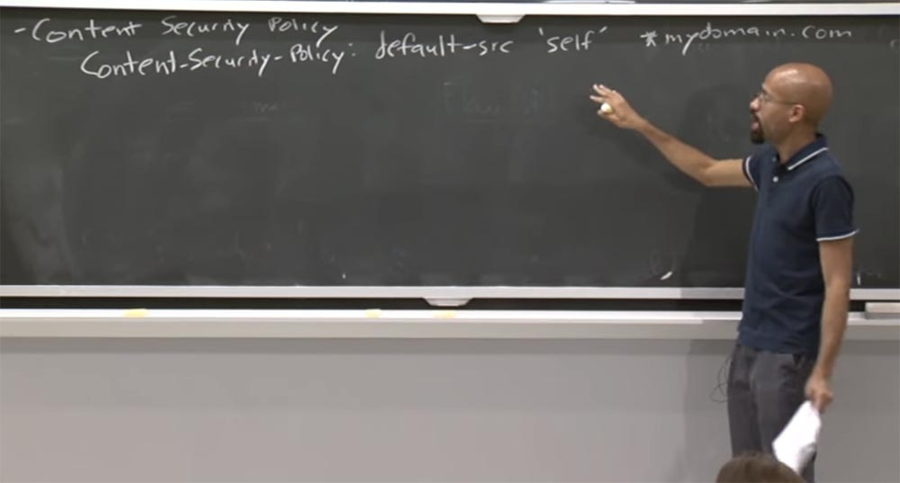
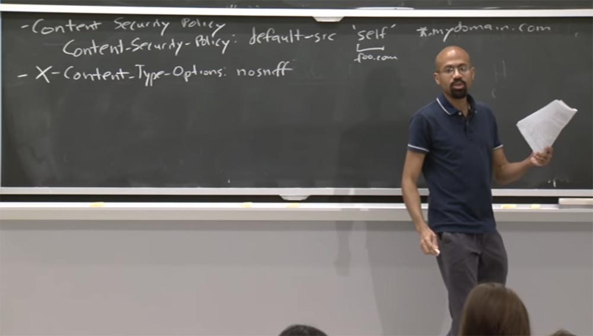
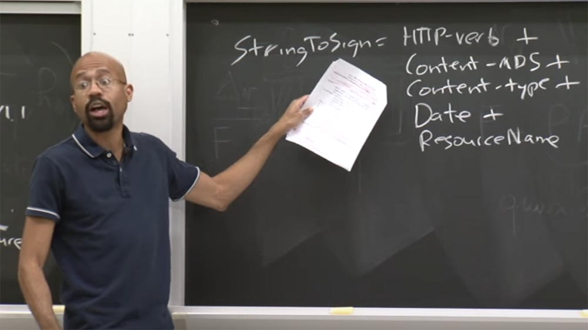

Курс MIT «Безопасность компьютерных систем». Лекция 9: «Безопасность Web-приложений», часть 3 / Блог компании ua-hosting.company

### Массачусетский Технологический институт. Курс лекций #6.858. «Безопасность компьютерных систем». Николай Зельдович, Джеймс Микенс. 2014 год

Computer Systems Security — это курс о разработке и внедрении защищенных компьютерных систем. Лекции охватывают модели угроз, атаки, которые ставят под угрозу безопасность, и методы обеспечения безопасности на основе последних научных работ. Темы включают в себя безопасность операционной системы (ОС), возможности, управление потоками информации, языковую безопасность, сетевые протоколы, аппаратную защиту и безопасность в веб-приложениях.

Лекция 1: «Вступление: модели угроз» [Часть 1](https://habr.com/company/ua-hosting/blog/354874/) / [Часть 2](https://habr.com/company/ua-hosting/blog/354894/) / [Часть 3](https://habr.com/company/ua-hosting/blog/354896/)  
Лекция 2: «Контроль хакерских атак» [Часть 1](https://habr.com/company/ua-hosting/blog/414505/) / [Часть 2](https://habr.com/company/ua-hosting/blog/416047/) / [Часть 3](https://habr.com/company/ua-hosting/blog/416727/)  
Лекция 3: «Переполнение буфера: эксплойты и защита» [Часть 1](https://habr.com/company/ua-hosting/blog/416839/) / [Часть 2](https://habr.com/company/ua-hosting/blog/418093/) / [Часть 3](https://habr.com/company/ua-hosting/blog/418099/)  
Лекция 4: «Разделение привилегий» [Часть 1](https://habr.com/company/ua-hosting/blog/418195/) / [Часть 2](https://habr.com/company/ua-hosting/blog/418197/) / [Часть 3](https://habr.com/company/ua-hosting/blog/418211/)  
Лекция 5: «Откуда берутся ошибки систем безопасности» [Часть 1](https://habr.com/company/ua-hosting/blog/418213/) / [Часть 2](https://habr.com/company/ua-hosting/blog/418215/)  
Лекция 6: «Возможности» [Часть 1](https://habr.com/company/ua-hosting/blog/418217/) / [Часть 2](https://habr.com/company/ua-hosting/blog/418219/) / [Часть 3](https://habr.com/company/ua-hosting/blog/418221/)  
Лекция 7: «Песочница Native Client» [Часть 1](https://habr.com/company/ua-hosting/blog/418223/) / [Часть 2](https://habr.com/company/ua-hosting/blog/418225/) / [Часть 3](https://habr.com/company/ua-hosting/blog/418227/)  
Лекция 8: «Модель сетевой безопасности» [Часть 1](https://habr.com/company/ua-hosting/blog/418229/) / [Часть 2](https://habr.com/company/ua-hosting/blog/423155/) / [Часть 3](https://habr.com/company/ua-hosting/blog/423423/)  
Лекция 9: «Безопасность Web-приложений» [Часть 1](https://habr.com/company/ua-hosting/blog/424289/) / [Часть 2](https://habr.com/company/ua-hosting/blog/424295/) / [Часть 3](https://habr.com/company/ua-hosting/blog/424297/)

**Аудитория:** так что же мешает злоумышленнику найти ключ? Где находится этот секретный ключ?

**Профессор:** да, это хороший вопрос. В большинстве случаев клиент для AWS — это не браузер, а некоторые виртуальные машины, работающие в облаке. Таким образом, вы видите только коммуникацию между виртуальными машинами. Вы также можете себе представить, что пользователи могут неким образом раздавать эти ссылки или встроить их как-то в HTML. Если у вас есть что-то вроде изображенного на доске внутри HTML или исходного кода JavaScript, у вас будет и код для создания такого запроса. Поэтому если я предоставляю вам одну из этих вещей, вы можете сделать запрос от моего имени.

**Аудитория:** можно ли использовать MAC для нормальных клиентов?

**Профессор:** для нормальных — вы имеете в виду браузеры?

**Аудитория:** для обычных пользователей.

Профессор: дело в том, что вопрос о том, где на самом деле живет ключ, является архиважным. Потому что, если ключ может быть украден так же легко, как кукиз, то мы ничего не выигрываем. Поэтому во многих случаях все эти вещи хранятся где-то в облаке и служат для обмена данными между виртуальными машинами и передаются от сервера к серверу тоже в облаке. Таким образом, разработчик приложения запускает VM, которая использует аутсорсинг кучи вещей, хранящихся в AWS.

**Аудитория:** не существует ли здесь проблемы сетевой задержки, благодаря чему злоумышленник может отправить тот же запрос сразу же после пользователя и тоже получить доступ?

**Профессор:** да, достаточно сказать, что несколько человек защитили диссертации на тему безопасности меток времени. Но вы совершенно правы, потому что у нас рассмотрен достаточно грубый пример.

Представьте, что здесь, в этом примере String To Sign в строчке DATE у нас будет значение «Понедельник, 4 Июня». Тогда, если каким-то образом злоумышленник сможет получить доступ ко всему этому, то он сможет повторить запрос пользователя. Дело в том, что AWS позволяет использовать дату истечения срока действия этих вещей. Таким образом, одна вещь, которую вы можете сделать — это добавить сюда поле Expires, и будем считать, что дата истечения срока действия назначена.

Затем я смогу дать эту ссылку куче разных людей, и сервер будет проверять, не истёк ли срок действия их запросов.

**Аудитория:** даже если срок годности всего 200 миллисекунд, но злоумышленник наблюдает за сетью, то он сможет послать на всякий случай несколько копий запроса вместо одного.

**Профессор:** совершенно верно, если нападавший атакует сеть и видит, как передаются эти вещи по проводам, и в дате истечения срока действия достаточно места для маневра, тогда он точно может совершить эту атаку.

Итак, это был обзор того, как работают файлы cookie без сохранения состояния. Здесь возникает один интересный вопрос: что значит выйти из системы, имея кукиз этого типа? Ответ заключается в том, что в действительности вы не выходите. Я имею в виду, что у вас есть этот ключ и всякий раз, когда вы хотите отправить запрос, вы просто отправляете его. Но сервер мог бы отозвать ваш ключ.

Предположим, что сервер отозвал ключ. Но вы можете создать одну из этих вещей GET, и когда пошлёте сообщение серверу, он скажет: «ага, я уже знаю ваш идентификатор пользователя User ID, ключ отозван, поэтому я не буду выполнять ваш запрос». Однако здесь есть нюансы, и если говорить о таких вещах, как SSL, то наделить человека полномочиями намного легче, чем их отозвать.

Таким образом, есть несколько других вещей, которые вы можете использовать, если хотите избежать традиционных кукиз для реализации аутентификации. Одной из них является использование DOM – хранилища, в котором содержатся сведения об аутентификации клиентской стороны. Вы могли бы использовать хранилище DOM для хранения некоторых состояний сессии, которые обычно помещаются внутрь кукиз.

Если вы помните из последней лекции, хранилище DOM представляет собой ключевой интерфейс значений, которые браузер предоставляет каждому источнику, то есть браузер берёт их оттуда и вставляет в строку.

Хорошей вещью является то, то DOM имеет не такие глупые правила в отношении той же политики одинакового происхождения. Так что, если бы это были обычные кукиз, вы могли бы сделать все эти трюки с поддоменами и тому подобное. Хранилище DOM на самом деле строго привязано к одному источнику, поэтому вы не сможете сделать расширение какого-нибудь поддомена. Поэтому такие фреймворки, как Meteor, используют это хранилище.

Но обратите внимание, что если вы хотите сохранить информацию об аутентификации в хранилище DOM, вам нужно будет самостоятельно написать код JavaScript, чтобы передать эту информацию на сервер, зашифровать её и так далее. Вот что потребуется сделать в этом случае.  
Можно было бы использовать сертификаты на стороне клиента, например, формат x.509, который содержит информацию о владельце, открытый ключ, сведения об удостоверяющем центре и электронную цифровую подпись. В этих сертификатах хорошо то, что JavaScript не имеет явно выраженного интерфейса для доступа к этим вещам. Так что в отличие от кукиз, где всегда присутствует «гонка вооружений», чтобы найти ошибки политики одинакового происхождения, в сертификатах для этого нет явного интерфейса JavaScript. Так что это очень хорошо с точки зрения безопасности.

Одна из проблем, о которой я упомянул кратко и которую мы рассмотрим подробно в последующих лекциях — это отзыв сертификатов. Если пользователь выходит из вашей организации, каким образом вы сможете забрать у него сертификат? Это достаточно сложно.

Кроме того, эти вещи не слишком удобны в использовании, потому что никто не захочет устанавливать кучу сертификатов для каждого сайта, на который вы заходите. Поэтому сертификаты аутентификации не очень популярны, за исключением компаний или организаций, которые относятся к обеспечению безопасности с огромной ответственностью. На этом мы завершим обсуждение файлов cookie.

Поговорим теперь об уязвимостях протокола в веб-стеке. Один из интересных видов атак заключается в использовании ошибок в компонентах браузера, например, при парсинге URL-адресов. Так как же парсинг URL может навлечь на нас беду?

Предположим, что у нас есть URL такого вида, куда по какой-то причине встроены в конце странные символы:

[example.com](http://example.com/):80 @ foo.com.

Вопрос в том, каково происхождение этого конкретного URL? Flash подумал бы, что имя хоста example.com. Но когда адрес проанализирует браузер, то он подумает, что origin хоста в данном случае — это foo.com.

Это очень плохо, потому что когда у нас имеются две разные сущности, которые путаются в происхождении origin одного и того же ресурса, это чревато неприятными проблемами.  
Например, флэш-код может быть вредоносным и загрузить какой-то материал с example.com. Если же эксплойт был встроен в страницу с foo.com, он тоже мог бы сделать там какие-то злые вещи. И тогда он принимает какой-то код с example.com и запускает его с полномочиями foo.com. Множество сложных правил парсинга, подобные этим, делают жизнь очень нелегкой. Это происходит постоянно.

Только что мы рассматривали дезинфекцию контента, основная идея которого состоит в том, что зачастую гораздо лучше, когда имеются более простые правила разбора для такого рода вещей. Однако ретроспективно это трудно сделать, потому что HTML уже там присутствует.  
А сейчас поговорим о моей самой любимой уязвимости в системе безопасности – о файлах с расширением .jar, которые представляют собой ZIP-архив с частью программы на языке Java. Объектом атаки становятся JAR-файлы браузеров, в основном это Java-апплеты. Примерно в 2007 году, на одном отличном сайте, который называется lifehacker.com, объяснялось, как вставлять ZIP-файлы внутрь изображений. Не совсем ясно, от кого вы пытаетесь спрятаться, делая это, но lifehacker.com убеждает, что это можно сделать.

В основном они используют тот факт, что если посмотреть на форматы изображений, такие как GIF, то, как правило, парсер работает сверху вниз. Сначала он находит информацию в заголовке, а затем рассматривает остальные биты, расположенные в нижней части.

Как оказалось, программы, которые обычно манипулируют ZIP-файлами, работают снизу вверх, то есть противоположно направлению парсингу изображений. Сначала они находят информацию в футере файла и распаковывают то, что содержится внутри архива. Таким образом, если вы разместите файл изображения, содержащий в себе архив ZIP, то он пройдёт все проверки, даже проверку Flickr, как любое другое изображение, и он даже будет показываться как изображение в вашем браузере.

Но скрытую правду будете знать только вы. Только вы будете в курсе, что если взять этот файл, то его можно распаковать и использовать заключённую там информацию. Кажется, что это похоже на дешевый трюк, но хакеры никогда не спят, они постоянно хотят разрушить нашу жизнь. Так как же они реализуют эту идею?

Они понимают, что JAR файлы являются производными от формата .zip. Это значит, что можно создать анимацию GIF или статичное изображение, которые бы имели файл JAR, то есть исполняемый код JavaScript, в самом низу.

Позже люди назвали этот способ атаки GIFAR, половина GIF, половина JAR, и обе половины злые. Это было потрясающе. Когда люди впервые обнаружили такую возможность, они посчитали её удивительной, но совершенно не понимали, как ею можно воспользоваться. Но как оказалось, на её основе можно проделать следующие вещи.

Итак, как вы можете это проделать? Вы просто используете CAD. Возьмите .gif, возьмите .jar, используйте самораспаковывающийся архив – бум, и GIFAR вас атаковал!

Итак, как только у вас появилось это, что вы можете сделать? Есть некоторые чувствительные сайты, которые позволяют пользователям предоставлять данные, но только не произвольные типы данных. Так что Flickr или что-то вроде него может не позволить вам отправить произвольный ActiveX или любой другой произвольный HTML. Но вам будет позволено отправлять изображения. Так что вы могли бы построить одну из этих вещей и представить её на одном из этих конфиденциальных сайтов, который позволяет отправлять изображения. Что вам нужно сделать для проведения успешной атаки в этом случае?

Во-первых, отправить это «нафаршированное» изображение на один из таких сайтов. Во-вторых, использовать метод атаки межсайтового скриптинга XSS, использовав имеющиеся уязвимости. Для этого вам нужно вставить апплет, написав на JavaScript такое выражение:

Этот код использует уязвимость межсайтового скриптинга, поэтому будет запущен в контенте сайта. GIFAR пройдёт проверки origin, потому что исходит с сайта с общим источником происхождения, не смотря на то, что этот код был вставлен злоумышленником.

Итак, теперь злоумышленник получает возможность запустить этот апплет Java в контексте сайта жертвы со всеми полномочиями origin. И одна из этих вещей будет на самом деле правильно идентифицирована как изображение формата GIF. Но здесь есть скрытый код. Напомню, что сначала браузер выполняет распаковку заархивированных файлов, поэтому, прежде всего он запустит часть JAR, проигнорировать верхнюю часть GIF. Так что это на самом деле довольно удивительно.

Есть несколько довольно простых способов исправить подобное. Например, вы можете использовать загрузчик апплета, который понимает, что здесь не должно быть случайного мусора. Во многих случаях используется информация метаданных, которая показывает длину этого ресурса. В таком случае загрузчик начнёт, как положено, с верхней части, проанализирует её длину, увидит, что апплет заканчивается в верхней части, и остановится. Его не волнует нижняя часть, возможно, что она даже равна 0\. На в нашем случае подобный загрузчик не поможет, так как он начнёт обработку запроса с нижней, заархивированной части, и остановится перед верхней, проигнорировав именно её.

Что мне нравится в этом, так это то, что он действительно показывает, насколько широк стек программного обеспечения для интернета. Взяв всего два эти формата, GIF и JAR, можно создать действительно неприятную атаку.

Вы можете проделать подобное и с файлами PDF. Вы можете поместить PDF вместо GIF и назвать эту атаку чем-то вреде PDFAR. Но в итоге люди разобрались с этой проблемой, и уязвимости подобного рода в настоящее время ликвидированы.

**Аудитория:** что вы можете сделать с помощью атаки такого рода, чего нельзя сделать обычной атакой межсайтового скриптинга XSS?

**Профессор:** это хороший вопрос. Итак, что хорошего в этом, так это то, что Java зачастую может быть более мощным инструментом, чем обычный JavaScript, потому что он использует немного другие правила, ту же политику origin и тому подобное. Но вы правы в том, что если вы можете выполнять межсайтовые сценарии, сам по себе запуск JavaScript может нанести довольно сильный ущерб. Но главное преимущество этого метода в том, что данная технология атаки работает внутри апплета и может сделать то, что неспособен натворить обычный вредоносный скриптовый код.

Так что, как я уже сказал, это моя любимая атака всех времен, в основном только потому, что она заставила солидных людей в области компьютерной безопасности придумать в своё время такое слово, как GIFAR.

Еще одна интересная вещь — это использование атак, которые основаны на времени. Обычно люди не думают о времени как о ресурсе, который может быть вектором для атак. Но как я уже отметил несколько минут назад, что время на самом деле может быть средством, позволяющим внедрить в систему эксплойт.

Конкретная атака, о которой я собираюсь поговорить с вами, это атака по скрытому каналу, Covert channel attack. Идея этой атаки состоит в том, что злоумышленник находит способ для обмена информации между двумя приложениями, причем данная операция обмена не является санкционированной. Злоумышленник как-то используя некоторую часть системы, чтобы передать биты информации между двумя различными ресурсами.

Хорошим примером подобных вещей является CSS-атака на основе сниффинга. Что собой представляет такая атака?

Предположим, злоумышленник имеет веб-сайт, который может посетить пользователь. Заставить пользователя посетить веб-сайт, на самом деле, довольно просто. Вы создаете рекламу или отправляете фишинговое письмо.

Таким образом, у злоумышленника есть веб-сайт, который посещает пользователь. И цель атакующего — узнать, какие другие сайты посетил пользователь. Злоумышленник может захотеть узнать это по нескольким причинам. Возможно, его интересуют поисковые запросы пользователя, или он пытается выяснить, где этот человек работает, или, может быть, он хочет знать, не заходит ли этот человек на какие-то «стыдные» сайты и так далее.

Как же злоумышленник собирается это сделать, если единственное, что он контролирует — это веб-сайт, на который он хочет убедить зайти пользователя? Возможный способ – это использовать цвета ссылок. Как известно, если вы прошли по какой-то ссылке один раз, то в следующий раз она покажется в вашем браузере другого цвета, указывая на то, что вы уже совершали ранее переход по этой ссылке. На самом деле это уязвимость безопасности.

Потому что это означает, что на своём сайте злоумышленник может сгенерировать огромный список возможных URL-адресов, которые вы могли бы посетить, а затем использовать JavaScript, чтобы увидеть, какой цвет приобрели эти URL-адреса. И если цвет ссылки URL фиолетовый, это значит, что вы посетили данный сайт. Так что это достаточно тонкая уловка.

Интересно то, что во многих случаях вам даже не нужно отображать URL-адреса. Вы можете расположить ссылки в виде заголовков на экране по типу домино, и эти заголовки изменят цвет, если пользователь использовал данную ссылку. Возможно, вы подумаете, не слишком ли утомительно сканировать все эти URL-адреса сайтов, посещённых пользователем? Но ведь этот процесс можно оптимизировать, использовав несколько фильтрованных проходов по списку адресов. Например, сначала можно увидеть, посещал ли пользователь URL верхнего уровня — cnn.com, Facebook.com и так далее и так далее. Если ответ положительный, можно сделать выборку наиболее посещаемых страниц верхнего уровня. Таким образом, вы действительно можете ограничить объём поиска.

Так что безобидная функция, которую поддерживают браузеры, чтобы помочь пользователю, говоря: «эй, приятель, вот где ты побывал!», может быть использована злоумышленником как компромат на вас.

Как можно предотвратить Covert channel attack? На практике делается так, что браузер просто обманывает JavaScript по поводу правильного цвета ссылок. Когда JavaScript пытается посмотреть на ссылку и ее стилизацию, браузер всегда говорит, что данная ссылка никогда не посещалась. И хотя это кажется не слишком удачным решением, это предотвращает атаку подобного рода. Я думаю, мы сможем примириться с тем, что JavaScript не сможет читать цвета ссылок, это ещё не конец света. Но устраняет ли это проблему злоумышленника, желающего выяснить, на каких сайтах вы побывали? Конечно же, нет.

Таким образом, следующая атака, которую может организовать злоумышленник — это атака на основе кэша. Цель её такая же – хакер хочет узнать, какие сайты вы посещаете.

В качестве эксплойта здесь используется кэшированная информация, служащая для того, чтобы обеспечить пользователю быстрый доступ к посещённому ранее сайту. По сути, возможность быстрого доступа к странице является причиной, по которой вы кэшируете в первую очередь её адрес.

Таким образом, злоумышленник снова может генерировать список объектов — кандидатов, которые, как он считает, вы могли бы посетить, а затем просто проверяет, насколько быстро эти объекты к нему возвращаются. Если объекты возвращаются быстро, можно догадаться, что вы бывали там и раньше, потому что при их посещении информация не загружается заново, а используются данные из кэша. Это понятно?

Опять же, браузер просто пытается помочь вам. Но вы можете использовать его благие намерения во зло. Важно и то, что эта атака может использовать некоторую очень интересную информацию о географическом местоположении.

Представьте, что мы атакуем Google Map Tiles. Если я обнаружу, что вы действительно получили доступ к серии «плиток» Google Map, это означает, что либо вы находитесь в этом месте, либо вас интересуют другие люди, которые могут быть в этом месте. Так что это довольно мощная атака.

Так как же можно это исправить? Ну, это не совсем понятно. У вас может быть сайт, который вообще ничего не кэширует, но тогда ваш сайт будет медленным, а это никуда не годится. Так что не совсем понятно, как можно обойти эту уязвимость.

Давайте предположим, что у нас имеется защита, которую мы поставили в предыдущем примере, то есть JavaScript не может прочитать цвет ссылки. Но при этом всё равно нельзя считать, что мы полностью себя обезопасили, потому что злоумышленник может запустить атаки на основе DNS.  
Здесь идея такова: даже если вы ничего не кэшируете, то когда вы заходите на ресурс впервые, вы должны создать запрос DNS для хостинга, связанного с этим ресурсом. Таким образом, злоумышленник, опять-таки, может засечь время и посмотреть, сколько времени требуется для получения доступа к этим объектам-кандидатам. И если запрос приходит назад быстро, то это хороший намек на то, что вы заранее создали имя DNS для этого хоста. И это работает, даже если вы ничего не кэшируете, потому что кэш DNS связан с операционной системой, а не с браузером.

**Аудитория:** на последней лекции вы упомянули возможность заставить JavaScript делать скриншоты.

**Профессор:** да, это так!

**Аудитория:** то есть можно просто сделать ссылку, которая выглядит как пиксель, а затем сделать скриншот, куда он попадёт, и тем самым совершить переход по ссылке?

**Профессор:** да, такая возможность существует. Рендеринг это всегда сложно, потому что вам нужно играть в эту игру — если вы хотите показать что-то пользователю, оно должно мигать очень быстро, иначе можно увидеть, что кто-то входит в этот огромный список URL. Но вы правы, если иметь доступ к API–интерфейсу совместного использования экрана, многое становится намного проще.

**Аудитория:** а если у вас просто какое-то анимированное изображение, которое выглядит случайным, и вы просто обращаете внимание на один пиксель?  
**Профессор:** вы совершенно правы. Я думаю, что интерфейс API совместного использования экрана — плохая идея. Но я не президент мира, что я могу сделать? Так или иначе, атаки на основе DNS работают, даже если кэширование не выполняется.

Итак, что происходит, если мы используем только исходные IP — адреса всех наших хостов? Мы ничего не кэшируем! И мы переходим на обновленный браузер, который не предоставляет для JavaScript цвета ссылок. Так что у нас всё в порядке. Но я здесь для того, чтобы сказать, что у вас не всё в порядке! Потому что на самом деле злоумышленник может воспользоваться возможностью атаки рендеринга.

Основная идея здесь заключается в том, чтобы быстрее визуализировать URL-адрес, который вы посетили раньше.

    При этом злоумышленник может создать плавающий фрейм <iframe>, поместить туда некоторое содержимое, которое, по его мнению, вы, возможно, посетили, а затем постоянно следить, не потеряет ли он доступ к этому <iframe>. Потому что как только <iframe> загружается, браузер обычно считает, что этот <iframe> принадлежит странице злоумышленника и блокирует его. Поэтому как только в браузер поступает контент, исходящий из другого origin, вы начнете получать эти сообщения об ошибке доступа.

Таким образом, атакующий не может больше ни к чему прикоснуться и сделает вывод, что смог определить сайт, который вы ранее посетили.

До встречи на следующей лекции!

Полная версия курса доступна [здесь](https://ocw.mit.edu/courses/electrical-engineering-and-computer-science/6-858-computer-systems-security-fall-2014/).

Спасибо, что остаётесь с нами. Вам нравятся наши статьи? Хотите видеть больше интересных материалов? Поддержите нас оформив заказ или порекомендовав знакомым, **30% скидка для пользователей Хабра на уникальный аналог entry-level серверов, который был придуман нами для Вас:** [Вся правда о VPS (KVM) E5-2650 v4 (6 Cores) 10GB DDR4 240GB SSD 1Gbps от $20 или как правильно делить сервер?](https://habr.com/company/ua-hosting/blog/347386/) (доступны варианты с RAID1 и RAID10, до 24 ядер и до 40GB DDR4).

**VPS (KVM) E5-2650 v4 (6 Cores) 10GB DDR4 240GB SSD 1Gbps до декабря бесплатно** при оплате на срок от полугода, заказать можно [тут](https://ua-hosting.company/vpsnl).

**Dell R730xd в 2 раза дешевле?** Только у нас **[2 х Intel Dodeca-Core Xeon E5-2650v4 128GB DDR4 6x480GB SSD 1Gbps 100 ТВ от $249](https://ua-hosting.company/serversnl) в Нидерландах и США!** Читайте о том [Как построить инфраструктуру корп. класса c применением серверов Dell R730xd Е5-2650 v4 стоимостью 9000 евро за копейки?](https://habr.com/company/ua-hosting/blog/329618/)