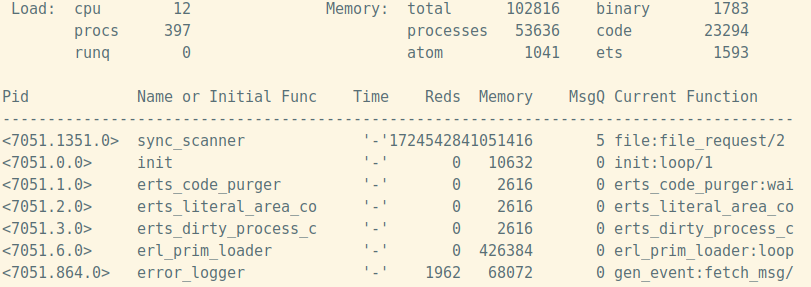
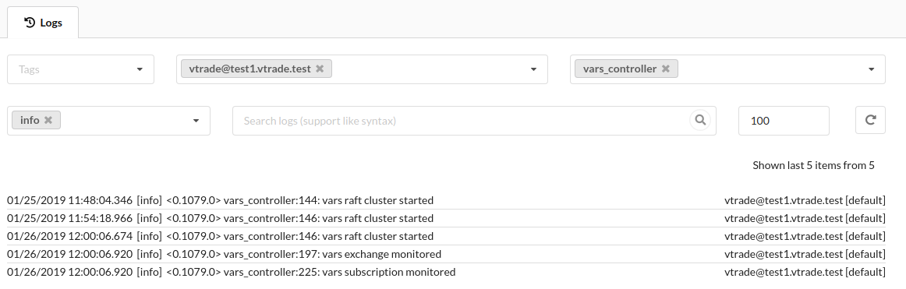

Борьба за качество решений на Erlang/Elixir

  
[@jcutrer](https://unsplash.com/@jcutrer)

Сегодня мы будем говорить про журналы событий, количественные метрики и наблюдение за всем этим с целью увеличения скорости реакции команды на инциденты и уменьшения времени простоя целевой системы.

Erlang/OTP как фреймворк и идеология построения распределенных систем дает нам регламентированные подходы к разработке, инструменты и реализацию стандартных компонентов. Допустим мы применили потенциал OTP и прошли весь путь от прототипа до продакшена. Наш Erlang проект прекрасно себя чувствует на боевых серверах, кодовая база постоянно развивается, появляются новые требования и функционал, в команду приходят новые люди, и все вроде бы хорошо. Но иногда что-то идет не так и технические проблемы, помноженные на человеческий фактор, могут привести к аварии.

Поскольку подстелить соломку абсолютно для всех возможных случаев отказов и проблем невозможно или же экономически нецелесообразно, то необходимо управленческими и программными решениями сократить время простоя системы в случае сбоев.

В информационных системах всегда будет существовать вероятность возникновения сбоев различной природы:

  

*   Аппаратные отказы и сбои питания
*   Сетевые сбои: ошибки конфигурации, кривые прошивки
*   Логические ошибки: начиная от ошибок кодирования алгоритмов и заканчивая архитектурными проблемами, возникающими на границах подсистем и систем.
*   Проблемы безопасности и связанные с ними атаки и взломы, в том числе и внутренняя фальсификация.

Сразу разграничим ответственность: за работу вычислительного оборудования и сетей передачи данных будет отвечать мониторинг инфраструктуры, например, организованный средствами zabbix. Про установку и настройку такого мониторинга написано немало, повторяться не будем.

C точки зрения разработчика, проблема доступности и качества лежит в плоскости раннего обнаружения ошибок и проблем с производительностью и скорейшего реагирования на них. Для этого нужны подходы и средства оценки. Итак, попробуем вывести количественные метрики, анализируя которые на разных этапах разработки и эксплуатации проекта мы можем значительно улучшить качество.

  

### Системы сборки

Еще раз напомню про важность инженерного подхода и тестирования при разработке программного обеспечения. Erlang/OTP предлагает сразу два фреймворка для тестирования: eunit и common test.

В качестве метрик для первичной оценки состояния кодовой базы и ее динамики можно использовать количество успешных и проблемных тестов, время их выполнения и процент покрытия кода тестами. Оба фреймворка позволяют сохранять результаты тестирования в формате Junit.  
Например для rebar3 и ct необходимо добавить следующие строки в rebar.config:

  

    {cover_enabled, true}.
    {cover_export_enabled, true}.
    {ct_opts,[
     {ct_hooks, [{cth_surefire, [{path, "report.xml"}]}]}
    ]}.

Количество успешных и неудачных тестов позволит построить график тренда:  
  
взглянув на который, можно оценить динамику работы команды и регрессию тестов. Для примера, в Jenkins данный график можно получить, используя Test Results Analyzer Plugin.

Если тесты покраснели или стали выполняться долго, метрики позволят еще на этапе сборки и автоматического тестирования отправить релиз на доработку.

  

### Метрики приложений

Кроме метрик операционной системы в мониторинг следует включить метрики приложений, например количество просмотров в секунду, количество платежей, и другие критически важные индикаторы.

В своих проектах я использую шаблон вида `${application}.${metrics_type}.${name}` для именования метрик. Данное именование позволяет получать списки метрик вида

  

    messaging.systime_subs.messages.delivered = 1654
    messaging.systime_subs.messages.proxied = 0
    messaging.systime_subs.messages.published = 1655
    messaging.systime_subs.messages.skipped = 3

Пожалуй, чем больше метрик, тем проще понять, что происходит в сложной системе.

  

### Метрики Erlang VM

Отдельное внимание следует уделить мониторингу Erlang VM. Идеология let it crash прекрасна, а правильное использование OTP конечно же поможет поднять упавшие части приложения внутри Erlang VM. Но не стоит забывать и о самой Erlang VM, ведь уронить ее сложно, но можно. Все варианты основаны на исчерпании ресурсов. Перечислим основные:

  

*   Переполнение таблицы атомов.  
    Атомы – идентификаторы, основная задача которых это улучшение читабельности кода. Атомы, единожды созданные, остаются навсегда в памяти экземпляра Erlang VM, так как не очищаются сборщиком мусора. Почему это происходит? Сборщик мусора работает отдельно в каждом процессе c данными этого процесса, в то время как атомы могут быть распределены по структурам данных множества процессов.  
    По умолчанию можно создать 1,048,576 атомов. В статьях про то как убить Erlang VM обычно можно найти что-то подобное
    
      
    
        [list_to_atom(integer_to_list(I)) || I <- lists:seq(erlang:system_info(atom_count), erlang:system_info(atom_limit))]
    
    в качестве иллюстрации данного эффекта. Казалось бы, искусственная проблема и в реальных системах недостижима, но бывают случаи… Например в обработчике внешнего API при разборе запросов используется `binary_to_atom/2` вместо `binary_to_existing_atom/2` или `list_to_atom/1` вместо `list_to_existing_atom/1`.  
    Для мониторинга состояния атомов стоит использовать следующие параметры:
    
      
    
    1.  `erlang:memory(atom_used)` – количество используемой памяти под атомы
    2.  `erlang:system_info(atom_count)` – число созданных атомов в системе. Совместно с `erlang:system_info(atom_limit)` можно вычислить утилизацию атомов.
    
      
    
*   Утечки процессов.  
    Сразу хочется сказать, что при достижении process_limit (+P аргумент erl) erlang vm не падает, но переходит в аварийное состояние, например даже подключиться к ней будет, скорее всего, невозможно. В конечном итоге исчерпание доступной памяти при выделении на утекшие процессы приведет к падению erlang vm.
    
      
    
    1.  `erlang:system_info(process_count)` – количество активных процессов в данный момент. Совместно с `erlang:system_info(process_limit)` можно вычислить утилизацию процессов.
    2.  `erlang:memory(processes)` – выделенная память под процессы
    3.  `erlang:memory(processes_used)` – используемая память под процессы.
    
      
    
*   Переполнение mailbox процесса.  
    Типичный пример подобной проблемы – процесс отправитель шлет сообщения процессу получателя без ожидания подтверждения, при этом `receive` в процессе получателя игнорирует все эти сообщения из-за отсутствующего или неверного паттерна. В итоге сообщения копятся в mailbox. Хотя в erlang и существует механизм замедления отправителя в случае если обработчик не справляется с обработкой, все равно после исчерпания доступной памяти vm падает.  
    Понять есть ли проблемы с переполнением mailbox поможет etop.
    
      
    
        $ erl -name etop@host -hidden -s etop -s erlang halt -output text -node dest@host -setcookie some_cookie -tracing off -sort msg_q -interval 1 -lines 25
    
      
    В качестве метрики для постоянного мониторинга можно взять количество проблемных процессов. Для их выявления можно использовать следующую функцию:
    
      
    
        top_msq_q()->
        [{P, RN, L, IC, ST} || P <- processes(), { _, L } <- [ process_info(P, message_queue_len) ], L >= 1000, [{_, RN}, {_, IC}, {_, ST}] <- [process_info(P, [registered_name, initial_call, current_stacktrace]) ] ].
    
    Также этот список можно логировать, тогда при получении нотификации от мониторинга, упрощается анализ проблемы.
    
      
    
*   Переполнение mailbox процесса.  
    Память под большие (больше 64 байт) binaries выделяется в общей куче. Выделенный блок имеет счетчик ссылок, показывающий количество процессов имеющих доступ к нему. После обнуления счетчика, происходит очистка. Простейшая система, но, как говорится, есть нюансы. В принципе, существует вероятность возникновения процесса генерирующего столько мусора в куче, что системе не хватит памяти для проведения очистки.  
    В качестве метрики для мониторинга выступает `erlang:memory(binary)`, показывающий выделенную под binaries память.
    
      
    

Итак, случаи, приводящие к падению vm, разобраны, однако кроме них неплохо вести мониторинг не менее важных параметров, прямо или косвенно влияющих на корректное функционирование ваших приложений:

  

*   Память, используемая таблицами ETS: `erlang:memory(ets)`.
*   Память под скомпилированные модули: `erlang:memory(code)`.  
    Если ваши решения не используют динамическую компиляцию кода, то данный параметр можно исключить.  
    Отдельно хочется упомянуть erlydtl. Если вы компилируете шаблоны динамически, то в результате компиляции создается beam, загружаемый в память vm. Это также может стать причиной утечек памяти.
*   Системная память: `erlang:memory(system)`. Показывает потребление памяти рантаймом erlang.
*   Суммарная потребляемая память: `erlang:memory(total)`. Это сумма памяти, потребляемой процессами и рантаймом.
*   Информация о редукциях: `erlang:statistics(reductions)`.
*   Количество процессов и портов, готовых к исполнению: `erlang:statistics(run_queue)`.
*   Аптайм экземпляра vm: `erlang:statistics(runtime)` – позволяет без анализа логов понять, был ли перезапуск.
*   Сетевая активность: `erlang:statistics(io)`.

  

### Отправка метрик в zabbix

Сформируем файл, содержащий метрики приложения и метрики erlang vm, который будем обновлять раз в N секунд. Для каждого erlang-узла файл метрик должен содержать метрики работающих на нем приложений и метрики экземпляра erlang vm. В итоге должно получиться что-то подобное:

  

    messaging.systime_subs.messages.delivered = 1654
    messaging.systime_subs.messages.proxied = 0
    messaging.systime_subs.messages.published = 1655
    messaging.systime_subs.messages.skipped = 3
    ….
    erlang.io.input = 2205723664
    erlang.io.output = 1665529234
    erlang.memory.binary = 1911136
    erlang.memory.ets = 1642416
    erlang.memory.processes = 23596432
    erlang.memory.processes_used = 23598864
    erlang.memory.system = 50883752
    erlang.memory.total = 74446048
    erlang.processes.count = 402
    erlang.processes.run_queue = 0
    erlang.reductions = 148412771
    ....

С помощью `zabbix_sender` будем отправлять данный файл в zabbix, где уже будет доступно графическое представление и возможность создания триггеров автоматизации и нотификации.

Теперь, имея в системе мониторинга метрики и созданные на их основе триггеры автоматизации и события нотификации, у нас есть шанс избежать аварий, заранее реагируя на все опасные отклонения от полнофункционального состояния.

  

### Центральный сбор логов

Когда в проекте 1-2 сервера, наверное еще можно жить без центрального сбора логов, но как только появляется распределенная система с множеством серверов, кластеров, окружений, появляется необходимость решения задачи сбора и удобного просмотра логов.

Для записи логов в своих проектах я применяю lager. Часто по пути от прототипа до продакшена проекты проходят следующие стадии сбора логов:

  

*   Простейший логгинг с выводом в локальный файл или даже в stdout (lager\_file\_backend)
*   Централизованный сбор логов с использованием, например, syslogd и автоматической отправкой логов на коллектор. Для подобной схемы подходит подходит [lager_syslog](https://github.com/basho/lager_syslog).  
    Основным минусом схемы является то, что необходимо заходить на сервер сбора логов, находить файл с нужными логами и каким-то образом фильтровать события в поисках нужных для отладки.
*   Централизованный сбор логов с сохранением в хранилище с возможностью фильтрации и поиска по записям.

О минусах, плюсах и количественных метриках, которые можно применять, используя последний, и поговорим в призме конкретной реализации – `lager_clickhouse`, который я использую в большинстве разрабатываемых проектов. Пару слов о `lager_clickhouse`. Это бэкенд lager для сохранения событий в clickhouse. На данный момент, это внутренний проект, но планы сделать его открытым есть. При разработке lager_clickhouse пришлось обходить некоторые особенности clickhouse, например использовать буферизацию событий, чтобы не делать частых запросов в clickhouse. Затраченные усилия окупились стабильной работой и хорошей производительностью.

Основной минус подхода c сохранением в хранилище – дополнительная сущность – clickhouse и необходимость разработки кода сохраняющего события в него и пользовательского интерфейса для анализа и поиска событий. Также для некоторых проектов может быть критичным использование tcp для отправки логов.

Но плюсы, как мне кажется, перевешивают все возможные минусы.

  

*   Легкий и быстрый поиск событий:
    
      
    
    *   Фильтрация по дате без необходимости поиска файла/файлов на центральном сервере содержащем диапазон событий.
    *   Фильтрация по окружению. В одно хранилище пишутся логи с разных подсистем и часто с разных кластеров. На данный момент разделение происходит по меткам, которые выставляются на каждом узле кластера.
    *   Фильтрация по имени узла
    *   Фильтрация по имени модуля отправившего событие
    *   Фильтрация по типу события
    *   Текстовый поиск
    
    Примерный вид интерфейса просмотра логов представлен на скриншоте:  
    
    
      
    
*   Возможность автоматизации.  
    С введением хранилища логов появилась возможность в реальном времени получать сведения о количестве ошибок, возникновении критических неисправностей, активности системы. Вводя определенные лимиты мы можем генерировать экстренные события выхода системы из функционального состояния, обработчики которых будут выполнять действия автоматизации для устранения данного состояния и отправлять уведомления ответственным за функционал членам команды:
    
      
    
    *   При появлении критической ошибки.
    *   В случае массового появления ошибок (производная по времени нарастает быстрее определенного лимита).
    *   Отдельная метрика – скорость генерации событий, т.е как много новых событий появляется в журнале событий. Почти всегда можно знать примерный объем логов, генерируемый проектом в единицу времени. Если она кратно превышена, скорее всего что-то идет не так.
    
      
    

Дальнейшим развитием темы автоматизации обработки экстренных событий стало применение lua скриптов. Любой разработчик или администратор может написать сценарий обработки логов и метрик. Скрипты приносят гибкость и позволяют создавать персональные сценарии автоматизации и уведомлений.

  

### Итоги

Для понимания процессов, происходящих в системе, и расследования инцидентов жизненно необходимо иметь количественные показатели и журналы событий, а также удобные инструменты их анализа. Чем больше собираемой о системе информации нам доступно, тем проще анализировать ее поведение и исправлять проблемы еще на этапе их возникновения. В случае когда наши меры не сработали в нашем распоряжении всегда есть графики и подробные логи инцидента.

А как вы эксплуатируете решения на Erlang/Elixir и с какими интересными случаями сталкивались в продакшене?