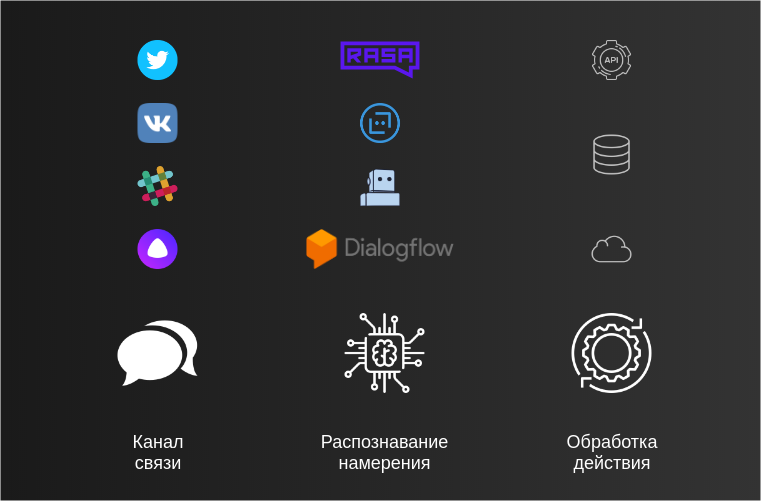
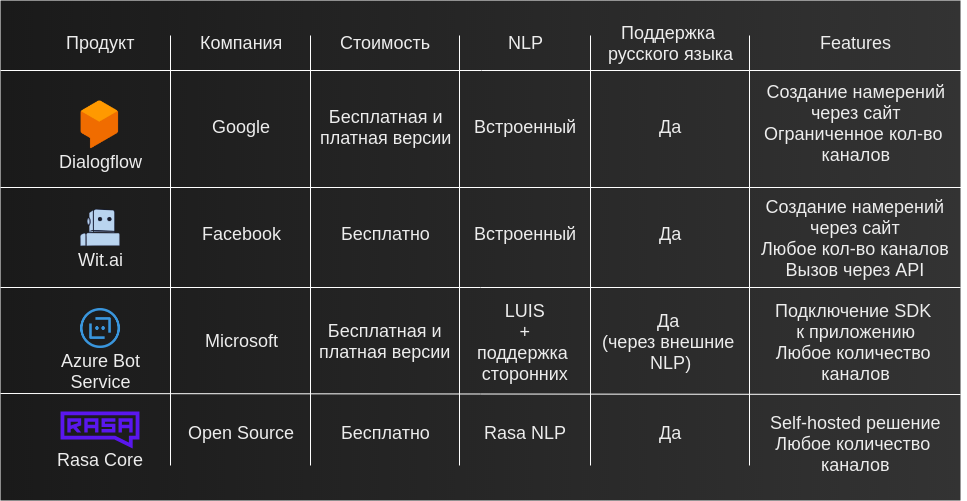
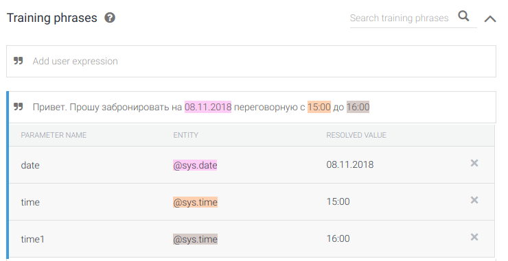
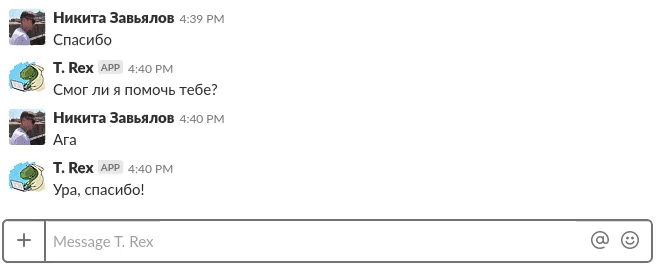
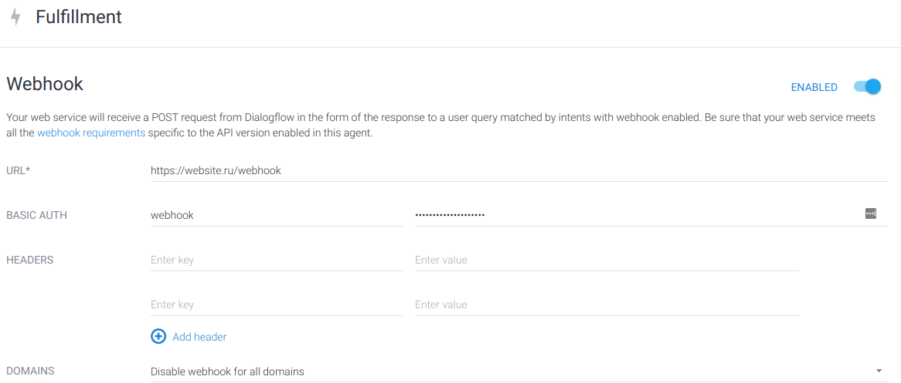

Ботоводство / Блог компании Selectel

С начала 2000-х годов с завидной периодичностью появляются новости о внедрении в работу чат-ботов. В этой статье я расскажу с чего начать и приведу обзор существующих решений, а также поделюсь опытом создания бота для компании Selectel.

## Сфера применения

Развитие бизнеса зачастую сопровождается не только масштабированием основной деятельности, но и отладкой поддерживающих процессов. Чат-боты — только часть деятельности бизнеса в рамках автоматизации рутины. Коммуникация и выполнение простых однотипных заданий лежат в основе работы чат-бота. С его помощью можно выполнять не только повторяющиеся задачи, но и такие, которые человек выполнить не в состоянии, например, мониторинг активности в социальных сетях.  
  
Разнообразие сфер применения ботов я хочу привести на примере собственной работы в компании Selectel. Мини-спойлер: начинал свою работу я в качестве технического писателя, теперь являюсь инженером отдела облачных решений. Путь внедрения виртуальных помощников начался с бота для отдела маркетинга, который отслеживает комментарии и упоминания компании в социальных сетях. Такая разработка является очень простой, но эффективно дополняет существующие решения на рынке, например, [сервис IFTTT](https://ifttt.com/).

Следующими разработками в моей практике стали внутренний чат-бот для отдела HR и бот для общения с клиентами, представленный в качестве демо-стенда во время конференций SelectelTechDay в [Санкт-Петербурге](https://blog.selectel.ru/selecteltechday-infrastruktura-nachinaetsya-zdes/) и [Москве](https://blog.selectel.ru/selecteltechday-live-translyaciya/). Оба бота созданы с помощью разных сервисов и технологий. И прежде чем погружаться в технические подробности, рассмотрим верхнеуровневую схему устройства ботов.

## Основные принципы ботостроительства

Деятельность чат-ботов строится вокруг 3 основных действий:

1.  Получение или вывод информации происходит через определенные каналы связи, например, в Slack или диалогах Vk.com
2.  Распознавание намерения — это комплексный анализ полученной информации для формирования ответа
3.  Обработка действия — любая работа, проведенная на серверной стороне, необходимая для подготовки верного ответа. Например, если был запрошен прогноз погоды, то будет произведен запрос к некому API о погоде в городе N, и пользователю будут отправлены результаты этой команды

Основные действия чат-ботов объединяются в рамках задачи сохранения контекста для создания человекоподобной формы общения и поддержки диалога. Чат-бот должен «помнить» предмет разговора и адаптировать свои ответы соответствующим образом.

Отдельно выделяется вопрос подключения чат-бота к социальным платформам. Коннекторы к мессенджерам и социальным сетям могут быть реализованы самостоятельно или поддерживаться в рамках существующих продуктов для создания чат-ботов.

На данный момент есть множество решений, предлагающих готовый сервис по автоматизации процессов технической поддержки или продаж. Я же больше внимания уделю инструментам, которые позволяют создать сервис, отвечающий внутренним требованиям по безопасности компании, без усложнения процесса разработки.

## Ботостроительство

Изложенные выше 3 принципа работы чат-ботов (канал, анализ, действие) можно реализовать по-разному. Самый простой вариант — проводить сравнения поступающего текста и отправлять пользователю соответствующие ответы.

Наша цель немного выше — получить систему, в которую можно будет быстро добавлять новые сценарии и которая будет понимать пользователя в большинстве случаев.

Для этого нам необходимо понимать, о чем говорит пользователь, контролировать ход диалога и в некоторых случаях выполнять определенные действия (например, бронировать переговорные комнаты). Добиться этого можно, используя следующие инструменты:

*   DialogFlow (Google)
*   Wit.ai (Facebook)
*   Azure Bot Service (Microsoft)
*   Rasa Core (Open Source)

При выборе продукта учитываются следующие факторы:

1.  _Насколько критично размещение исполняемого кода бота в рамках существующих систем_  
    Например, в случае Wit.ai и Dialogflow мы не контролируем полностью весь процесс — мы отдаем этим приложениям текст и получаем готовый ответ. Используя Rasa Core или Azure BotBuilder SDK, мы можем хранить всю переписку в границах внутренних систем
2.  _Сколько каналов связи необходимо подключить_  
    Dialogflow предоставляет возможность использования ограниченного количества коннекторов, которые подключают мессенджеры и социальные сети через указание ключей доступа. Для Wit.ai и Rasa Core можно использовать любое количество каналов, но логику подключения к ним необходимо реализовать самостоятельно (зачастую это очень тривиальная задача). Azure Bot Service имеет возможность использования коннекторов к определенным каналам, но не ограничен ими, и его можно подключать также к другим источникам самостоятельно
3.  _Насколько просто можно вносить изменения в базу знаний бота_  
    При создании бота в виде программного кода без использования визуального интерфейса для взаимодействия с ним мы ограничиваем круг лиц, кто может вносить изменения в диалоги и ответы бота. Функционал добавления и редактирования фраз должен быть доступен для каждого

Для нашего внутреннего виртуального помощника чат-бота Тирекса была выбрана платформа от Google Dialogflow, которая предоставляет возможность визуального редактирования намерений, а выполнение действий осуществляется внутри [частного облака в Selectel](https://kb.selectel.ru/22059053.html). Определяющими факторами стали скорость начала работы с ботом, безопасность при передаче сообщений и наличие канала Slack в списке поддерживаемых.

Идея создания чат-бота давно витала в воздухе компании, особенно учитывая, какие проблемы можно было решить с ним:

*   Рост числа сотрудников компании, а вместе с этим увеличивающийся поток однотипных вопросов вроде «Как пользоваться корпоративной библиотекой?» и «Где пообедать?»
*   Регулярное бронирование переговорных и оформление пропусков
*   Поиск информации и документов в корпоративной базе знаний

Создание и подключение бота в Dialogflow занимает несколько минут. В начале рассмотрим принципы работы чат-бота в системе, а затем добавим выполнение сложных действий.

## Создание бота в Dialogflow

  

### Создание архитектуры

Далее в тексте мы будем оперировать такими понятиями, как:

*   **Намерение** — формализованная задача, которую хочет выполнить пользователь
*   **Параметры** — набор данных, необходимых для выполнения задачи
*   **Ответ** — функция или программа, выполняемая в ответ на распознанное намерение
*   **Тренировочная фраза** — пример сообщения от пользователя, на котором чат-бот обучается

Dialogflow обрабатывает естественный язык и извлекает все необходимые данные для выполнения сложных команд. Для этого создаются **агенты**, которые содержат в себе несколько **намерений**. Каждое из **намерений** позволяет подготовить чат-бот к пониманию нюансов и тонкостей при формулировании запросов.

**Намерение** включает в себя **тренировочные фразы**, **параметры** и **ответы**. Внутри тренировочной фразы мы выделяем параметры (например, время или место), которые необходимы для формирования корректного ответа.

**Ответ** указывается либо в **намерении**, либо Dialogflow отправляет запрос на наш сервер, который выполняет необходимую работу и возвращает обратно **ответ** на примере нашего чат-бота:

*   На простые вопросы (например, «Есть ли у нас программа страхования заграницей?» **ответ** закладывается в **намерение**
*   На более сложные задачи как «Есть ли свободные переговорные сейчас?» **ответ** формируется с помощью дополнительного запроса к серверу, который определяет свободное время для всех участников и комнат

### Работа с намерениями

Рассмотрим работу с Dialoglow на примере бронирования переговорной. Мы создаем агент управления бронированиями и определяем следующие намерения:

*   Просмотреть существующие бронирования
*   Забронировать переговорную

Каждое из намерений вызывается тренировочными фразами. Чем больше их добавлено, тем вероятнее будет выполнено нужное действие. В нашем примере намерение «Забронировать переговорную» будем вызывать следующими фразами:

*   Забронируй на **сегодня** в **23.15** на **30 минут** на **меня**
*   Привет. Прошу забронировать на **08.11.2018** переговорную с **15:00** до **16:00**
*   Забронируй
*   Мне нужна переговорная

Принцип работы сбора данных в намерениях следующий:

1.  Dialogflow на основе полученного ввода понимает, о каком намерении идет речь. В нашем примере — бронирование переговорных
2.  Если обязательные параметры не были указаны в первом сообщении (например, время встречи), то чат-бот задаст уточняющие вопросы
3.  После получения всех данных Dialogflow отправит запрос на наш сервер в VPC для бронирования нужной комнаты

Посмотрим на этот процесс в действии:

Обработка действия осуществляется отправкой запроса со всеми данными на заранее добавленный адрес сервера действий (Webhook URL):

По адресу _[website.ru/webhook](https://website.ru/webhook)_ находится сервер, который выполняет обработку сложных команд (в нашем примере возвращает строку «Привет от сервера!»). [Github Gist](https://gist.github.com/Gaikanomer9/392cbdd14f213a052d765a248a844854) для быстрого старта:

    
    from flask import Flask, request, make_response, jsonify
    
    app = Flask(__name__)
    
    
    @app.route('/webhook', methods=['POST'])
    def webhook():
        req = request.get_json(force=True)
        intent = req.get('queryResult').get('intent').get('displayName')
        print(intent)
        if intent == 'Sample intent':
            res = make_response(jsonify(
                {
                    "fulfillmentText": "Привет от сервера!",
                }
            ))
            return res
        return make_response(jsonify(
                {
                    "fulfillmentText": "Совпадений намерений не найдено!",
                }
            ))
    
    
    if __name__ == '__main__':
        app.run(host='0.0.0.0', debug=True, port=5000)

  

## Создание бота с помощью RASA

Для использования чат-бота без сторонних сервисов для распознавания текста можно использовать инструменты наподобие [Rasa](https://rasa.com/), которые позволяют полностью управлять всем процессом работы бота. Rasa — набор программных компонентов с открытым исходным кодом, которые содержат распознавание речи и управление диалогами. Уже сейчас можно посмотреть на [Boilerplate](https://github.com/Gaikanomer9/rasa-docker-bot), который я подготовил для знакомства с платформой, а более подробную инструкцию мы опубликуем, если будут запросы от Habr-сообщества.

## Чат-боты и бизнес

Использовать ли сервисы автоматизации для клиентского обслуживания — непростой вопрос. Современные инструменты предоставляют множество решений при выборе между гибкостью, скоростью начала работы и безопасностью. Системы распознавания намерений в естественном языке теперь доступны не только в проприетарном виде, но и свободно распространяются, что открывает большие возможности для собственных экспериментов. Мы рассмотрели один из вариантов, который позволяет быстро внедрить чат-ботов для автоматизации однотипных задач вашего бизнеса без капитальных затрат и с минимальными трудозатратами. Если вы в работе уже применяете чат-ботов, поделитесь обратной связью в комментариях о своих впечатлениях и, конечно, впечатлениях ваших клиентов.